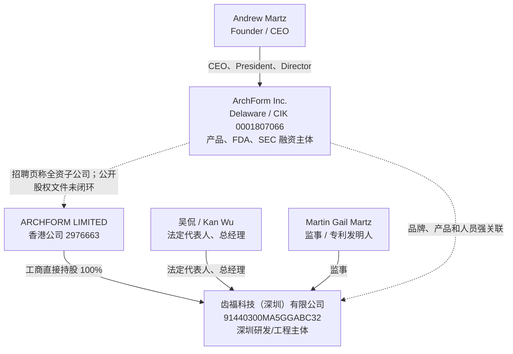
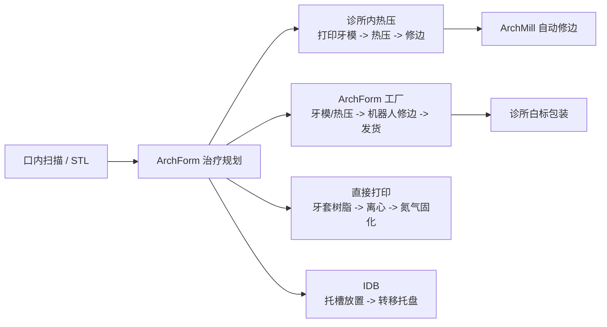

# ArchForm Inc. / 齿福科技（深圳）有限公司深度分析报告

> **报告日期：** 2026-07-23  
> **确认官网：** <https://www.archform.com/>  
> **研究对象：** ArchForm Inc.、ARCHFORM LIMITED、齿福科技（深圳）有限公司及 ArchForm 数字正畸产品体系  
> **研究目的：** 求职、面试、Offer 决策、客户采购与合作前尽调  
> **来源等级：** A = 政府、监管、专利和法定申报原始记录；B = 公司官网、隐私政策、YC 官方目录；C = 主流媒体、竞品官网；D = 商业工商数据库、招聘平台和搜索快照；E = 基于公开事实的分析推断  
> **表达约定：** “事实”表示有原始公开证据；“公司自述”不等于经审计事实；“分析”表示本报告推断；“未核验”表示证据不足，不作肯定结论。  
> **重要限制：** ArchForm 是非上市私营公司，未公开审计财务、收入、现金、客户留存、完整股东名册、当前工厂权属、劳动用工和安全审计。本报告不构成医疗、法律或投资建议。

---

## 一、执行摘要

### 1.1 一句话判断

> **ArchForm 不是空壳公司，也不是普通牙科外包团队。它是一家仍在运营的 YC W18 数字正畸公司，拥有 FDA 510(k) 许可的 Class II 正畸规划软件、SEC 可核验的 784.208 万美元股权融资、数项有效美国专利，以及覆盖软件、设计服务、牙套制造、诊所内生产、直打印和自动化硬件的完整产品链。它最大的机会来自低成本、医生自主控制和柔性制造；最大的风险来自私营公司财务不透明、小型跨境团队、多产品与制造复杂度，以及医疗数据、FDA/QMS 和中美跨境组织的合规压力。**

### 1.2 核心结论

| 维度 | 核验结论 | 置信度 |
|---|---|---:|
| 产品真实性 | 官网产品、价格、FDA 软件许可、专利和历史媒体能够相互印证，产品已经持续运营多年 | 高 |
| 美国主体 | ArchForm Inc. 为 Delaware corporation，SEC CIK `0001807066`，曾用名 Martz Inc. | 高 |
| 中国主体 | 齿福科技（深圳）有限公司成立于 2020-11-17，统一社会信用代码 `91440300MA5GGABC32` | 高（商业工商数据库） |
| 中国直接股东 | 商业工商数据库显示 ARCHFORM LIMITED 持有深圳公司 100% 股权 | 中高 |
| 美港中控制链 | 招聘页称深圳公司是美国 ArchForm Inc. 全资子公司，但法定直接股东是香港公司；美国与香港主体之间的持股关系未由公开原始文件闭环 | 中低 |
| 创始人 | Andrew Martz，YC 列为 Founder/CEO；SEC Form D 中为 CEO & President | 高 |
| 成立与孵化 | YC 目录显示 2013 年成立、Winter 2018 批次、状态 Active | 高（目录口径） |
| 团队规模 | YC 当前目录值为 23 人；中国商业数据库显示 2025 年参保人数 13，二者口径不同且不能相加 | 中 |
| 融资 | 2020 年 Form D 披露 784.208 万美元股权已全部售出，15 名合格投资人 | 高（发行人申报，非审计） |
| 后续融资 | SEC 当前只显示一份 2020 Form D，未找到后续公开 Form D；不代表没有非公开融资或经营现金流 | 中高 |
| 软件监管 | `K213916`，Class II，2021-12-16 获 510(k) substantial equivalence，限处方使用 | 高 |
| 直打印监管 | 官网 FAQ 指向 `TC-85`；FDA 数据显示相关 Tera Harz Clear 许可属于 Graphy, Inc.，不是 ArchForm 名下的第二张许可 | 高（主体归属）；中（ShapeForm 与具体获批配置的等同性） |
| 专利 | Google Patents 检索到多项 ArchForm 相关公开与授权，包括牙套结构、牙科器械制造和模型夹持系统；部分美国授权仍显示 Active | 中高 |
| 商业模式 | 按病例软件费 + 设计服务 + 每副牙套制造费 + 综合套餐 + 硬件 + 企业 API/白标 | 高 |
| 公司规模宣传 | 官网称 700 万+牙套、节省 3 亿美元、数千名医生；企业页称 80 万+病例，均未独立审计 | 中低 |
| 数据与安全 | 政策披露 AWS、Meteor Galaxy、机器学习和国际传输，但未公开证明 SOC 2、ISO 27001、HIPAA BAA、数据驻留或明确删除 SLA | 高（公开披露边界） |
| 求职判断 | **值得继续面试，属于“条件性有吸引力”；接 Offer 前必须核验 runway、收入、签约/期权主体、汇报线与合规成熟度** | 中高 |

### 1.3 最强正面信号

1. **监管资产真实。** FDA 官方文件明确列出 ArchForm Orthodontic Software System、申请主体 ArchForm, Inc.、`K213916`、Class II 和处方使用，而不是仅有官网自称。[S14][S15]
2. **融资不是传闻。** SEC Form D 披露 784.208 万美元股权已经售完，参与者 15 名，无销售佣金和 finder fee。[S12]
3. **产品链比单点 CAD 软件更完整。** ArchForm 同时覆盖治疗规划、诊所内热压、工厂牙套、直打印、间接粘接、自动修边和企业 API/白标。[S1][S2][S3][S4][S5][S6][S7][S8]
4. **长期存在且仍处于 Active 状态。** YC 目录显示公司 2013 年成立、2018 年入营、当前 Active；这比一轮短期项目更有持续性。[S11]
5. **收费结构清晰。** 官网公开 `$50/患者`、`$17/牙套`、`$220/设计`、`$899/$999` 综合套餐，便于客户按工作流选择，而不是强制一个高额全包方案。[S9]
6. **技术资产不只来自“AI”叙事。** 已授权专利覆盖牙齿定位器械、牙科器械制造和模型夹持；这类机械、材料、CAD/CAM 与工作流资产比泛化 AI 标签更可核验。[S18]
7. **中美工程组织有实质痕迹。** 深圳公司的经营范围、招聘自述和管理人员均直接指向三维 CAD、网格处理、深度学习、3D 打印和智能制造，不像单纯销售办事处。[S19][S21]
8. **市场定位清楚。** 它服务有资质的牙医/正畸医生，帮助医生保留临床控制和本地生产能力，与直接面向消费者、绕过线下医生的模式不同。[S11][S22]

### 1.4 核心风险

1. **财务透明度低。** 没有收入、ARR、毛利、burn、现金余额或客户留存；2020 年融资距今已超过六年，不能直接当作当前 runway 证明。
2. **控制链没有闭环。** 深圳工商直接股东是香港 ARCHFORM LIMITED，而招聘页称美国公司全资持有；可能是间接控制，也可能只是集团化描述，公开证据不足。
3. **组织很小。** YC 目录 23 人、深圳参保 13 人均指向小型团队；软件、医疗器械、制造、硬件、客户成功和全球合规同时存在，关键人依赖和职责过宽概率高。
4. **公司宣传数字没有第三方审计。** `7M+` 牙套、`$300M+` 节省、`800K+` 病例和“数千名医生”只能当营销口径。[S1][S8]
5. **直打印页容易造成监管误读。** 页面称硬件是 FDA approval 的验证部分，但没有标 K number；FAQ 使用的 TC-85 对应 Graphy 体系，不能表述为 ArchForm 自研材料独立获批。[S5][S16][S17]
6. **数据合规披露不足。** 产品处理牙齿扫描、照片、病历和医生信息，政策却未公开 BAA、安全认证、加密架构、区域驻留和完整子处理商清单。[S10]
7. **跨境数据和研发责任不清。** 深圳可能接触美国患者数据、模型或日志；若没有数据最小化、访问控制和合规合同，工程岗位会直接承担高敏感风险。
8. **制造把商业复杂度显著放大。** 软件费毛利潜力高，但工厂牙套、材料、设备、售后、质控、库存和返工均会增加固定成本与运营风险。
9. **竞争者更强。** Invisalign/Align 有品牌、医生网络、扫描仪和临床数据规模；uLab 已提供高度相似的自主设计、诊所内制造、外包牙套和 IDB 工作流。[S23][S25]
10. **官网内容治理存在瑕疵。** 多个产品页残留通用 SaaS 模板文案，如“shared team inbox”“customer service platform”；这不是产品失效证据，但反映对外内容 QA 不够严谨。[S3][S5][S7]
11. **工厂权属和地址不透明。** 官网称“our robotic factory in California”，但未公开说明工厂是自有、租赁还是合同制造，也没有当前可核验地址。[S1][S4]
12. **公开招聘很少。** YC 当前职位数为 0，中国搜索快照仅显示少量/历史岗位；无法仅靠公开招聘判断团队是否扩张。[S11][S21]

### 1.5 求职建议先行版

**建议继续面试，但不要只因 YC、FDA 或“美国公司”标签就默认低风险。**

更适合：

- 计算机图形学、三维几何、网格处理、CAD/CAM；
- 医疗影像、牙齿分割、计算机视觉与应用型机器学习；
- C++/桌面端、Web 3D、云同步和 API 平台；
- 3D 打印、CNC、机器视觉和制造自动化；
- 喜欢小团队高所有权、能用英语跨时区协作的人；
- 能接受医疗软件验证、质量文档和发布约束的人。

需要谨慎：

- 目标是基础大模型训练、论文研究或超大规模 AI 基础设施；
- 把成熟晋升体系、明确职责边界和稳定工时放在首位；
- Offer 不解释劳动合同主体、美国/香港/深圳关系和期权授予实体；
- 面试方只谈 700 万牙套或 FDA，不愿谈收入、毛利、现金和客户留存；
- 工程岗位实际承担医疗数据、生产故障或 FDA/QMS 职责，却没有相应流程、培训和权责。

---

## 二、身份、主体与控制链

### 2.1 至少涉及三个法律主体

| 层级 | 主体 | 已确认信息 | 证据边界 |
|---|---|---|---|
| 美国业务/监管主体 | **ArchForm Inc.** | Delaware corporation；SEC CIK `0001807066`；FDA 510(k) 申请人；官网隐私政策主体 | 高 |
| 香港直接持股主体 | **ARCHFORM LIMITED** | 香港公司编号 `2976663`，商业登记号 `72213883`，约 2020-09-10 设立 | 中高（商业登记数据库） |
| 中国研发/运营主体 | **齿福科技（深圳）有限公司** | 2020-11-17 设立；统一代码 `91440300MA5GGABC32`；外商独资；ARCHFORM LIMITED 持股 100% | 中高（商业工商数据库） |

### 2.2 当前可公开证明的关系图



实线为公开记录可支持的直接关系；虚线为强关联或公司招聘自述，但缺少完整股权原件。

### 2.3 ArchForm Inc.

SEC Form D 和 submissions 数据可确认：[S12][S13]

| 项目 | 公开记录 |
|---|---|
| 公司名 | ArchForm Inc. |
| CIK | `0001807066` |
| EIN | `46-3554496` |
| 注册州 | Delaware |
| 类型 | Corporation |
| 曾用名 | Martz Inc. |
| 2020 业务/邮寄地址 | 55 E 3rd Ave, San Mateo, CA 94401 |
| 2020 电话 | `650-246-9141` |
| CEO & President | Andrew Martz |
| 2020 董事 | Andrew Martz、Michael Terrill |

官网隐私政策同样以 **ArchForm Inc. 及关联公司/子公司**为数据处理主体，说明 SEC 主体与当前品牌不是同名误匹配。[S10]

但以下信息未公开：

- 当前 Delaware good standing 原件；
- 当前注册地址和实际总部；
- 完整 cap table 与最终受益人；
- ArchForm Inc. 是否直接持有 ARCHFORM LIMITED；
- 工厂资产在哪个主体名下。

### 2.4 ARCHFORM LIMITED

商业公司数据库将该香港主体与以下信息关联：[S20]

| 项目 | 信息 |
|---|---|
| 英文名 | ARCHFORM LIMITED |
| 香港公司编号 | `2976663` |
| 商业登记号 | `72213883` |
| 设立时间 | 约 2020-09-10 |
| 对深圳公司的持股 | 100% |

本次没有取得香港公司注册处的完整董事、股东及周年申报原件，因此：

- 可以把它称为深圳公司的直接股东；
- 可以称其为 ArchForm 集团强关联香港主体；
- **不能仅凭名称写成“美国 ArchForm Inc. 100% 持有香港公司”；**
- 最终控制人、VIE、代持或期权池均不能由公开信息推导。

### 2.5 齿福科技（深圳）有限公司

商业工商数据库和搜索快照可相互印证：[S19]

| 项目 | 公开记录 |
|---|---|
| 统一社会信用代码 | `91440300MA5GGABC32` |
| 成立日期 | 2020-11-17 |
| 状态 | 开业/存续 |
| 法定代表人 | 吴侃 |
| 注册资本 | 500 万美元 |
| 实缴资本 | 不同快照约 366.862261 万美元至 482.511921 万美元，存在年份/更新差异 |
| 直接股东 | ARCHFORM LIMITED，100% |
| 当前地址 | 深圳市南山区粤海街道大冲社区科发路 91 号华润置地大厦 D 座 1104 |
| 电话 | `18902442048` |
| 邮箱 | 搜索快照为 `kwu@archform.co` 或 `kwu@archform.com`，需以公司确认为准 |
| 2025 参保人数 | 13 |
| 执行董事 | Andrew Scott Martz |
| 总经理 | 吴侃 |
| 监事 | Martin Gail Martz |

经营范围直接包括：

- 正畸学计算机虚拟诊疗系统研发；
- 正畸信息技术咨询；
- 隐形牙套制造系统研发；
- 经许可的隐形牙套生产、销售和进出口；
- 相关配套业务。

这些登记内容与官网的软件、制造和自动化产品高度一致，因此把它判断为 ArchForm 的深圳研发/工程公司有较强依据。

### 2.6 招聘描述与工商结构的关键差异

BOSS 搜索快照中的公司介绍称：[S21]

> 齿福科技是美国加州 ArchForm Inc. 全资子公司，主营三维交互式医学 CAD、AI 算法、网格处理、深度学习、3D 打印和智能机械制造。

其中业务描述与官网一致，但“全资子公司”要分两层理解：

- **业务/集团口径：** 深圳公司明显属于 ArchForm 品牌体系；
- **法定直接持股口径：** 直接股东是香港 ARCHFORM LIMITED，不是美国 ArchForm Inc.；
- **可能解释：** 美国公司通过香港公司间接持股；
- **尚未证明：** 美国公司对香港公司的具体持股比例和控制协议。

这不是必然问题，跨境公司通过香港持有中国 WFOE 很常见。但对求职者很重要，因为劳动合同、IP 归属、期权和离职补偿分别落在哪个主体，会产生真实差异。

### 2.7 注册资本不能当作现金

500 万美元注册资本和实缴数字不能等同于：

- 当前银行存款；
- 美国公司的融资额；
- 深圳团队可支配预算；
- 工资和遣散保障；
- 公司整体估值。

注册资本反映股东承诺和历史出资，当前现金仍要通过内部财务或银行证明核验。

---

## 三、发展历史、创始人与团队

### 3.1 关键时间线

| 时间 | 事件 | 证据性质 |
|---|---|---|
| 2013 | YC 目录显示公司成立 | YC 官方目录 [S11] |
| 2017-2018 | 早期牙套制造和 3D 打印相关专利申请；TechCrunch 报道创始故事和 `$50/病例` 模式 | 专利/媒体 [S18][S22] |
| 2018 冬季 | 进入 Y Combinator W18 | YC 官方目录 [S11] |
| 2020-02-24 | Form D 所列首次证券销售 | SEC [S12] |
| 2020-04-06 | SEC 接收 Form D，784.208 万美元股权已售完 | SEC [S12][S13] |
| 2020-09 | ARCHFORM LIMITED 在香港设立 | 商业数据库 [S20] |
| 2020-11 | 齿福科技（深圳）有限公司设立 | 工商数据库 [S19] |
| 2021-12-16 | ArchForm Orthodontic Software System 获 FDA `K213916` | FDA [S14][S15] |
| 2021-2024 | 多项美国牙套结构和制造专利获得授权 | Google Patents [S18] |
| 2023-2025 | 官网产品扩展到工厂制造、直打印、IDB、ArchMill 和企业工作流 | 公司官网 [S1][S4][S5][S6][S7][S8] |
| 2026-02 | Dental model gripping system 获美国专利授权（Google Patents 当前显示 Active） | Google Patents [S18] |
| 2026-07 | YC 仍标记 Active、Team Size 23、公开职位 0 | YC 官方目录 [S11] |

一篇 2020 年中文转载材料曾描述 ArchForm 的机器人牙套工厂、10-14 天交付和“数万名患者”等早期口径。[S26] 当前官网已独立确认加州机器人制造，但没有确认那篇旧文的患者数和历史交付数据，因此本报告只把它作为发展轨迹旁证。

### 3.2 Andrew Martz

可直接确认的身份：[S11][S12][S14][S22]

- YC：Founder/CEO；
- SEC：CEO & President、Executive Officer、Director；
- FDA 510(k)：ArchForm 联系人；
- TechCrunch：创始人受访者；
- 多项专利：发明人或共同发明人。

TechCrunch 2018 年报道中，Andrew 表示自己曾在父亲的正畸诊所工作，看到 3D 打印机已经足够成熟，而缺少的是让正畸医生能够虚拟移动牙齿的易用软件。[S22]

这段经历与公司的路线高度一致：

```text
临床工作流痛点
  -> 牙齿三维设计软件
  -> 诊所内 3D 打印
  -> 外包工厂和自动化
  -> 直打印材料/设备
  -> 企业 API 和白标
```

### 3.3 创始人能力画像

**公开证据支持的优势：**

- 对正畸诊所实际流程有长期场景理解；
- 能把软件、硬件和制造串成产品，而不只做单点工具；
- 至少完成过 YC、融资、FDA 申报和专利申请等高门槛事项；
- 从 2018 年到现在仍维持 `$50/病例` 的入口价格，战略定位相对稳定；
- 同时推动美国市场、香港架构和深圳研发组织。

**仍需核验的短板/风险：**

- 除 Andrew 外，官网几乎不披露管理团队；
- 没有公开 CFO、CTO、质量负责人、隐私负责人和工厂负责人履历；
- CEO 同时跨产品、融资、临床、制造和全球团队，关键人依赖可能高；
- 创始人家庭成员 Martin Martz 同时出现在专利与深圳公司监事名单中，治理独立性需结合董事会结构判断。

### 3.4 团队规模的正确读法

YC 当前目录显示 Team Size 23；中国商业数据库显示 2025 年参保人数 13。[S11][S19]

二者不能直接相加，因为：

- YC 数字可能由公司自行维护，更新频率未知；
- 参保人数只覆盖某一中国法人和统计年度；
- 美国、香港、合同工、顾问和工厂人员可能不在深圳参保；
- 23 人可能已经包含深圳团队；
- 工厂可能使用外包或单独主体。

更稳妥的结论是：**ArchForm 很可能是几十人以内、深圳研发占比较高的小型跨境团队。**

### 3.5 吴侃 / Kan Wu

公开工商记录将吴侃列为深圳公司法定代表人、总经理，招聘和工商联系邮箱也使用 `kwu`。[S19]

Google Patents 的 ArchForm 检索摘要中出现 Kan Wu 作为发明人，但本次没有完成对应专利原始页的人名同一性核验，因此只能将其视为“可能存在技术发明贡献”，不能直接断言工商中的吴侃就是该专利发明人。[S18]

面试中应确认：

- 吴侃是否为深圳技术负责人/CTO；
- 具体管理范围是算法、桌面软件、云端还是制造自动化；
- 岗位日常向吴侃还是 Andrew 汇报；
- 产品和人事决策在深圳还是美国完成。

---

## 四、产品体系与技术路线

### 4.1 产品矩阵

| 产品/服务 | 面向客户 | 主要价值 | 收费/状态 |
|---|---|---|---|
| ArchForm 规划软件 | 正畸医生、牙科机构 | 扫描导入、分割、排牙、附件、分期、打印准备 | `$50/患者` [S2][S9] |
| In-office thermoforming | 自建设备的诊所 | 本地打印牙模、热压牙套、当天开始治疗 | 使用软件导出 [S3] |
| Factory-made aligners | 不自建生产的诊所 | 加州工厂制造、机器人修边、发货 | `$17/牙套` [S4][S9] |
| Alignment services | 需要外包设计的医生 | 由技术员或正畸医生完成治疗设置 | `$220/设置` [S9] |
| Comprehensive packages | 希望全包的诊所 | 设计 + 制造 + 三年无限 refinements | `$899/$999/患者` [S9] |
| Direct Print | 有直打印能力的诊所/实验室 | 用形状记忆材料直接打印牙套 | 材料/设备价格未公开 [S5] |
| IDB | 使用托槽矫治的医生 | 数字托槽放置、转移托盘、混合治疗 | 价格未公开 [S6] |
| ArchMill | 诊所/牙套工厂 | 视觉识别、云端路径、五轴自动修边 | 价格未公开 [S7] |
| Enterprise | 牙套品牌、实验室 | Web 3D 编辑器、API、批量导出、白标、CAM | 企业议价 [S8] |

### 4.2 核心软件能力

官网列出的能力包括：[S2]

- STL 牙齿扫描导入；
- 自动方向校正；
- 牙齿/牙龈边界分割和人工画笔修正；
- 自动牙位标注；
- 拖拽式排牙和牙弓形态调整；
- staging、顺序远移、过度矫正；
- attachment、lingual attachment、bite stop；
- IPR、pontic、hook/cutout；
- 自动计算牙套数量；
- 模型空心化、蜂窝支撑、竖直打印支撑和标签；
- 多设备同步患者数据。

这类能力涉及的真实工程问题包括：

- 三角网格清理、重建、布尔运算和拓扑修复；
- 牙齿实例分割、关键点和牙龈线识别；
- 碰撞检测、约束优化和运动分期；
- 高性能 3D 交互与撤销/重做；
- STL/打印参数和 CAM 数据生成；
- 患者项目版本、云同步和可追溯性；
- 医疗软件验证、回归测试和审计日志。

### 4.3 AI 到底用在哪里

官网明确提到的 AI/算法主要是：[S2][S7][S8]

- 自动牙齿分割；
- 自动初始排牙；
- 自动牙位标注和方向；
- ArchMill 相机识别模型和编码；
- 机器学习用于维护、统计或产品改进。[S10]

公开证据**不支持**以下夸大表述：

- 自研基础大模型；
- 生成式 AI 是公司主要收入来源；
- 完全自动临床诊断；
- AI 可替代正畸医生；
- 已公开同行评审的临床 AI 论文或准确率基准。

更准确的定位是：**计算机图形学 + 几何算法 + 计算机视觉/ML + 医疗 CAD/CAM + 制造自动化。**

### 4.4 三种生产路径



这种多路径战略的优势是客户不会因为是否拥有实验室而被排除；缺点是公司需要维护更多设备、材料、培训、验证和售后组合。

### 4.5 直打印工作流

官网直打印页描述的流程为：[S5]

1. 从 ArchForm 导出带支撑的牙套；
2. 使用验证过的 3D 打印机打印；
3. 用离心机去除多余树脂；
4. 在氮气环境中高强度 UV 固化；
5. 拆除支撑并做少量抛光；
6. 热水清洗和检查。

页面 FAQ 写明：

- 材料使用 TC-85 的形状记忆属性描述；
- 1 升树脂约生产 125-135 副牙套；
- 后处理约 25 分钟；
- 验证打印机包括 SprintRay、UNIZ、Asiga 和 Shining 机型；
- 需要专用固化机、离心机和压缩空气。

这说明直打印不是“买一瓶树脂即可使用”，而是一套受打印机、参数、后处理和材料组合约束的工艺。

### 4.6 ArchMill 的产品含义

官网称 ArchMill 具备：[S7]

- 视觉识别牙模和编码；
- 从云端下载对应修边路径；
- 五轴 CNC/铣削式修边；
- 单副约 45 秒；
- 多数情况下无需额外抛光。

如果产品稳定量产，它可以把 ArchForm 从“设计软件”推向牙套工厂自动化平台，增加硬件收入和客户锁定。

但公开页面没有披露：

- CE/FCC/UL 或其他设备认证；
- 售价、出货量和保修；
- MTBF、耗材、刀具寿命；
- 现场安装和售后网络；
- 相机误识别、路径错误和安全机制；
- 是否由 ArchForm 自产还是 ODM。

### 4.7 Enterprise 的战略价值

企业页显示 ArchForm 不只面向单个诊所，还为牙套品牌和实验室提供：[S8]

- 可白标 Web 3D 编辑器；
- API 对接 portal、数据库和 EMS；
- 命令行批量导出；
- 激光打标位置数据；
- 三轴/五轴修边或激光切割数据；
- 白标制造和直发。

**分析：** 这条线的潜在价值高于单个 `$50` 病例费，因为企业客户更容易形成年度合同、数据集成和切换成本。但官网没有公开客户名单、合同金额、SLA 或企业收入占比，当前成熟度无法判断。

### 4.8 产品页内容质量问题

多个页面残留明显不相关的模板文案，例如：[S3][S5][S7]

- “shared team inboxes”；
- “all-in-one customer service platform”；
- “100+ integrations”；
- “Untitled’s easy-to-use reports”。

合理解读是：

- 官网使用了未清理干净的 Webflow/Untitled UI 模板；
- 市场内容发布流程缺少逐页 QA；
- 不能由此推断临床软件本身不可靠；
- 但对医疗科技公司而言，对外文案和监管措辞本应比普通 SaaS 更严谨。

---

## 五、FDA、医疗器械与合规边界

### 5.1 可确认的 FDA 许可

FDA 官方文件给出：[S14][S15]

| 项目 | 内容 |
|---|---|
| 510(k) | `K213916` |
| 产品 | ArchForm Orthodontic Software System |
| 申请人 | ArchForm, Inc. |
| 决定日期 | 2021-12-16 |
| 决定 | Substantially Equivalent |
| 类别 | Class II |
| 产品代码 | PNN（许可函还列 LLZ） |
| 使用类型 | Prescription Use Only |
| 对照设备 | Orchestrate 3D Orthodontic Software，`K181112` |

### 5.2 FDA 核准的适用范围

官方 Indications for Use 主要包括：[S14]

- 正畸模型管理和系统检查；
- 详细分析、治疗模拟和虚拟器械设计；
- 设计可用于序列牙套或保持器的牙模；
- 在治疗过程中检查与分析进展；
- 在治疗结束时比较结果与计划目标；
- 使用者必须具备正畸专业知识并接受软件专项培训。

FDA summary 还写明软件经过集成、verification 和 validation 测试，并通过预期用途测试。[S14]

### 5.3 这张 510(k) 能证明什么

它能证明：

- ArchForm 不是未经申报的普通消费 App；
- 软件按 Class II 医疗器械路径完成过 510(k)；
- 公司至少建立过相应的设计、测试和申报文档；
- 软件可在专业人员监督下用于治疗规划和牙模设计；
- FDA 接受其与 predicate device 的 substantial equivalence。

它不能证明：

- 比所有竞品临床效果更好；
- 每个 AI 功能都经过单独临床验证；
- 工厂制造牙套、ArchMill、所有树脂和打印机自动包含在同一许可内；
- 公司已经通过 SOC 2、HIPAA 或 ISO 27001；
- FDA 对公司商业模式、财务或客户数量背书。

### 5.4 直打印材料的监管边界

ArchForm 直打印页使用 ShapeForm/MemoryForm 品牌，同时 FAQ 直接提到 TC-85。[S1][S5]

openFDA 中可核验的相关记录是：[S16][S17]

| 510(k) | 产品 | 申请人 | 日期 | 产品代码 |
|---|---|---|---|---|
| `K223355` | Tera Harz Clear | Graphy, Inc. | 2022-11-03 | NXC |
| `K240597` | TERA HARZ CLEAR | Graphy, Inc. | 2024-03-05 | NXC |

FDA summary 进一步显示：[S17]

- `K240597` 的 TERA HARZ CLEAR 包含 `TC-85DAC`、`TR-07`、`TA-28` 三种型号；
- 文件明确写明 scanner、design software、3D printer 和 post-cure unit **不随材料包含**；
- Indications 中列出的设计组合是 3Shape TRIOS 3 Basic + 3Shape Ortho System；
- 列出的打印机是 UNIZ SLASH 2、UNIZ NBEE 和 SprintRay Pro 95；
- 列出的后固化设备是 CureM U102H 和 Tera Harz Cure THC；
- 文件明确写明没有提交临床性能数据，许可主要依据制造验证、物理性能和生物相容性比较。

ArchForm 页面另外列出 SprintRay Pro 55、Asiga MAX、Shining AccuFab-L4K 等设备，并使用自己的设计软件。[S5] 这些设备可能经过厂商内部或后续验证，但它们没有出现在上述 `K240597` 的公开 Indications 配置中。

因此最严谨的表述是：

> ArchForm 的直打印工作流看起来集成了 Graphy/TC-85 体系的获批材料与验证设备，但 ArchForm 官网没有给出 ShapeForm 品牌对应的 K number、私人标签授权或完整 validated configuration。本次未发现 ArchForm Inc. 名下独立的直打印牙套材料 510(k)。

因此，官网“硬件是 FDA approval 验证部分”的概括性措辞不能自动延伸到页面列出的每一台打印机、ArchForm 自有软件或 ShapeForm/MemoryForm 品牌组合。

客户或候选人应要求公司提供：

1. ShapeForm/MemoryForm 与 Tera Harz Clear/TC-85 的法律和标签关系；
2. 当前销售地区适用的 510(k)、UDI、标签和 Instructions for Use；
3. 允许的打印机、参数、固化机和后处理组合；
4. ArchForm 在供应链中是制造商、进口商、经销商还是私人标签方；
5. 材料变化或新增设备是否经过 regulatory assessment。

### 5.5 召回和不良事件检索

截至报告日，以 ArchForm 为 recalling firm 和 manufacturer name 检索 openFDA，本次未获得设备召回或不良事件匹配。[S27]

这只能表述为“本次公开数据库检索未命中”，不能证明：

- 历史绝对没有投诉或事件；
- 事件未以经销商、材料商或其他制造商名义上报；
- 数据库字段拼写和更新完全覆盖；
- 公司没有内部 CAPA、返工或客户投诉。

### 5.6 对工程发布节奏的影响

Class II 软件意味着研发不应完全按普通互联网产品方式发布。合理的组织通常需要：

- 需求和风险可追溯；
- 设计输入/输出和变更控制；
- verification、validation 和回归测试；
- 软件配置和版本记录；
- 投诉、MDR、CAPA 和召回流程；
- 网络安全和供应商管理；
- 判断重大软件变更是否需要新的 510(k)。

对求职者而言，这既是学习价值，也是流程成本。面试中应确认质量体系是真正运行，还是申报时一次性补文档。

---

## 六、专利与技术壁垒

### 6.1 代表性专利

Google Patents 的 ArchForm assignee 检索包含少量同名误匹配。排除 Archform Byte Limited 后，仍可确认多项 ArchForm Inc. 相关公开/授权。[S18]

| 公开号 | 标题 | 主要发明人 | 当前页面状态 | 含义 |
|---|---|---|---|---|
| `US12144703B2` | Tooth-positioning appliance, systems and methods... | Martin G. Martz、Andrew S. Martz | Active | 牙齿定位器械及使用/制造 |
| `US11065085B2` | Tooth-positioning appliance, systems and methods... | Martin G. Martz、Andrew S. Martz | Active | 较早牙套结构/夹持路线 |
| `US11678958B2` | Fabrication of dental appliances | Andrew Martz、Martin Martz | Active，页面显示至 2039 | 牙科器械数字制造 |
| `US12544198B2` | Dental model gripping system | Andrew、Martin 等 | Active，2026 授权 | 牙模夹持和自动化生产 |
| `US20240325119A1` | Design and manufacture of orthodontic appliances | Martin、Andrew | Pending | 正畸器械设计与制造 |
| `US20240358476A1` | Orthodontic appliances, system and method... | Martin、Andrew | Pending | 新型正畸器械/系统 |
| `WO2023018886A1` | Orthodontic appliance to cause intrusion... | Martin Martz | Google 页面为 Ceased | 后牙压低器械路线 |

### 6.2 对“专利数量”的谨慎处理

Google Patents 查询返回的记录会混合：

- 同一发明的申请与授权；
- 美国与国际家族成员；
- continuation/divisional；
- 仅申请未授权；
- 已终止或 ceased 的国家阶段；
- 相近公司名误匹配。

因此不能把原始搜索结果数直接写成“拥有 11 项独立发明”。更可靠的结论是：**ArchForm 至少有数个可区分的专利家族，并有多项当前显示 Active 的美国授权。**

### 6.3 专利组合传递的技术信号

专利主题形成了较连贯的产品路径：

```text
牙套如何抓持和移动牙齿
  + 如何数字设计和直接/间接制造
  + 如何夹持牙模并自动化修边
  + 如何把器械和治疗策略结合
```

这说明公司技术重点不是泛化“AI”，而是围绕正畸器械、三维设计和生产自动化积累。

### 6.4 专利不能自动等于护城河

仍需注意：

- 专利有效不等于权利要求足够宽；
- 有专利不等于没有侵犯他人专利的 freedom-to-operate 风险；
- Invisalign/Align 等大型公司拥有更大专利组合；
- 申请中专利可能被缩窄或拒绝；
- 商业壁垒还取决于临床效果、工作流、渠道、数据、制造良率和服务。

真正要问的是：哪些客户选择 ArchForm 是因为专利独占能力，而不是单纯价格更低。

---

## 七、商业模式、定价与单位经济

### 7.1 当前公开价格

| 项目 | 价格 | 包含内容 |
|---|---:|---|
| In-office software | `$50/患者` | 可重复导出、refinement 不另收费、打印就绪 STL |
| Factory manufacturing | `$17/牙套` | Zendura FLX、约一周发货、机器人修边、加州制造 |
| Alignment service | `$220/设置` | 公司称由真实正畸医生设置，也有 technician 方案 |
| Comprehensive technician | `$899/患者` | 制造 + technician setup + 三年无限 refinements |
| Comprehensive orthodontist | `$999/患者` | 制造 + orthodontist setup + technician refinements + 三年无限 refinements |
| 新用户信用额 | `$200` | 官网 onboarding/试用营销口径 |

来源：公司价格页和产品页。[S1][S4][S9]

### 7.2 五层收入模型

1. **使用量软件收入：** 每患者 `$50`，更像 usage-based SaaS，不是固定年订阅；
2. **设计服务：** 每 setup `$220`，把临床/技术人工货币化；
3. **制造收入：** 每副牙套 `$17`，随治疗阶段数增长；
4. **综合套餐：** `$899/$999`，用全包提高客单价并承担 refinement 风险；
5. **硬件与企业收入：** 直打印设备、材料、ArchMill、API、白标和批量制造，价格未公开。

这个模型的好处是客户可从低成本软件进入，再向制造、服务和硬件扩张；坏处是公司很难保持纯软件公司的简单成本结构。

### 7.3 单病例敏感性分析

以下仅使用公开牌价做结构演示，**不是公司真实收入或毛利估计**：

| 假设 | 牌价计算 | 未包含/不确定 |
|---|---:|---|
| 10 副牙套的有限治疗 | `$170` 制造 | 设计、包装、运费、重做 |
| 20 副牙套 | `$340` 制造 | 同上 |
| 30 副牙套 | `$510` 制造 | 同上 |
| 30 副 + `$220` setup | `$730` | refinement、折扣、医生审核 |
| technician comprehensive | `$899` | 三年无限 refinement 成本由公司承担 |
| orthodontist comprehensive | `$999` | 专业人工和 refinement 成本更高 |

综合套餐对客户简单，但会给公司带来尾部成本：复杂病例、多次 refinement、重做、运输和医生工时都可能侵蚀毛利。

### 7.4 官网规模数字的内部校验

官网称：[S1][S8]

- `7M+` aligners made；
- `$300M+` saved for customers；
- “thousands of doctors”；
- 企业页称 `800,000+ patient cases`。

如果把两个累计口径机械相除：

- `7,000,000 / 800,000 = 8.75` 副牙套/病例；
- `$300,000,000 / 800,000 = $375` 宣称节省/病例。

8.75 副/病例对于有限治疗或混合收尾有可能，但对完整病例偏低。这可能意味着：

- 病例口径包含设计、测试或未完成病例；
- “aligners made”只统计某部分生产路径；
- 两个数字的起止时间和定义不同；
- 企业客户和诊所客户重复/分开计数；
- 数字已经四舍五入。

因此它们只能用于判断“公司声称有较大使用规模”，不能用于推导收入、活跃客户或治疗效果。

### 7.5 为什么不能从 700 万牙套推收入

一个看似直接但错误的算法是：

```text
7,000,000 × $17 = $119,000,000
```

它不能作为历史营收估计，因为：

- 700 万可能包含客户在诊所内自行制造的牙套；
- 历史价格不一定是 `$17`；
- 企业批量客户可能折扣；
- “made”可能指软件设计出的牙套而非 ArchForm 工厂出货；
- refinement、赠送、样品和取消可能被计入；
- 数字本身未经审计。

同理，`800,000 × $50 = $40M` 也不能视为软件收入。

### 7.6 毛利结构判断

| 收入层 | 潜在毛利 | 主要成本 |
|---|---:|---|
| 软件导出 | 高 | 云、支持、研发、渠道、合规 |
| 设计服务 | 中 | 正畸医生/技术员人工、返工 |
| 牙套制造 | 中 | 材料、设备折旧、工厂人工、质检、包装、物流 |
| 综合套餐 | 中且波动 | 制造 + 设计 + 三年 refinement 尾部风险 |
| 硬件 | 中 | BOM、库存、安装、保修、售后 |
| Enterprise/API | 潜在较高 | 定制集成、SLA、客户成功、合规 |

公司如果能够把软件客户转成制造和企业客户，会增加收入；但若 manufacturing attach rate 很高，也会降低整体“软件化”程度。

### 7.7 客户价值主张

官网核心销售逻辑是：[S1][S3][S4]

- 约 10 分钟完成规划；
- 诊所内最快约 30 分钟开始；
- 牙套费用降低 50% 以上；
- 本地生产减少等待；
- 医生自己控制 staging、attachment 和 IPR；
- 可从托槽开始、用牙套完成收尾；
- 诊所可以自有品牌包装。

这些是有吸引力的经济与工作流假设，但公开资料没有独立对照研究证明平均节省、治疗速度和临床结果。

---

## 八、融资、资本与财务透明度

### 8.1 SEC 可确认的股权融资

2020 Form D 记录：[S12]

| 项目 | 数值/信息 |
|---|---|
| 首次销售日期 | 2020-02-24 |
| 申报/接收日期 | 2020-04-06 |
| 证券类型 | Equity |
| 总发行额 | `$7,842,080` |
| 已售金额 | `$7,842,080` |
| 未售金额 | `$0` |
| 投资人数 | 15 |
| 非合格投资人 | 无 |
| 销售佣金 | `$0` |
| Finder fee | `$0` |
| 收入区间 | Decline to Disclose |

这可以严谨表述为：

> ArchForm 在 2020 年完成了发行人申报的约 784 万美元股权发行。

它不是审计财报，也不披露估值、优先权、投资人姓名、到账后的支出或当前余额。

### 8.2 YC 的资本含义

YC 官方目录确认 ArchForm 属于 Winter 2018。[S11]

可以确认：

- 公司通过过 YC 当期筛选和孵化；
- YC 是早期资本/网络信号；
- YC 页面仍将公司列为 Active。

不能直接确认：

- YC 以何种历史条款投资；
- 当前 YC 持股比例；
- 2020 年 15 名投资人的身份；
- 公司估值和最近一轮价格。

### 8.3 后续融资和 runway

SEC submissions 当前只列一份 2020 Form D。[S13]

这不等于公司六年没有获得任何资金，因为：

- 某些融资可能不形成新的公开 Form D；
- 可能有债务、股东借款、政府补助或经营现金流；
- 香港或中国主体可能有单独注资；
- 公司可能已经接近盈亏平衡或盈利。

但对求职者来说，**不能用 2020 年融资替代 2026 年现金状况**。软件、工厂、硬件和 20 多人团队连续运营六年的消耗可能很大。

### 8.4 财务上最关键的未知数

本次没有找到可信的：

- 年收入、ARR/MRR；
- 软件、制造、服务和硬件收入占比；
- 活跃诊所、付费诊所和留存；
- 每月新病例和复购；
- 工厂利用率、良率和单位制造成本；
- 综合套餐 refinement 次数和尾部成本；
- 毛利率、EBITDA、现金和月 burn；
- 应收账款、库存和设备债务；
- 最近估值或 cap table。

### 8.5 面试中识别“有效回答”

| 问题 | 有效回答 | 风险回答 |
|---|---|---|
| 当前 runway | 给出现金月份或明确区间 | “我们 2020 年融过 780 万美元” |
| 收入增长 | 给出近 12 个月收入/病例同比 | 只说 700 万牙套累计 |
| 客户质量 | 活跃付费诊所、留存和病例频次 | 只说 thousands of doctors |
| 制造毛利 | 每副成本、良率、返工和运费 | 只说机器人很便宜 |
| 软件价值 | 付费导出病例、复购和使用频率 | 只展示注册用户 |
| 企业业务 | 客户数、合同期限、SLA、占比 | 只展示 Web editor 截图 |

---

## 九、市场与竞争格局

### 9.1 ArchForm 处于哪条赛道

ArchForm 同时处在四个相邻市场：

1. 正畸治疗规划软件；
2. 隐形牙套制造；
3. 诊所内数字化实验室；
4. 牙套工厂自动化和企业基础设施。

它不是直接面向消费者卖矫治疗程的 DTC 公司，也不只是向患者销售牙套。购买决策者主要是正畸医生、牙医、牙套品牌和实验室。

### 9.2 市场规模的更可靠参照

Align Technology 官网当前公开的公司级指标为：[S25]

- 约 `$4.1B` annualized net revenues；
- 约 `22.8M` Invisalign 患者；
- `2,319` 项 active patents；
- 全球 `20K+` 员工。

这些数字不是 ArchForm 的 TAM，但足以说明：

- 隐形矫治已是大规模成熟市场；
- 最大竞争者在品牌、临床数据、渠道、专利和资本上远强于 ArchForm；
- ArchForm 的机会不是正面复制 Invisalign，而是服务希望降低实验室账单、保留设计控制或建立自有品牌的医生和实验室。

### 9.3 主要竞争者

| 竞争者 | 主要优势 | 与 ArchForm 的关系 | ArchForm 可用的差异 |
|---|---|---|---|
| Invisalign / Align | 全球品牌、医生网络、iTero、数据、临床与专利规模 | 最大行业标准和高端全包替代 | 更低成本、开放 STL、医生自主设计、本地生产 |
| uLab Systems | 自主设计、云端规划、in-office、uSmile 制造、IDB、诊所品牌 | **最直接同类竞争者** | 价格、易用性、自动化硬件和企业 CAM 需实证比较 |
| SureSmile / Dentsply Sirona | 大型牙科集团背书、牙套/托槽/保持器组合，官网称 100 万+患者 | 全套临床解决方案竞争 | 更灵活、更轻、更适合自建实验室 |
| Orchestrate 3D | 老牌正畸软件、ArchForm FDA predicate | 规划软件与 in-office 工作流 | 新 UI、自动化、制造和企业扩展 |
| 3Shape | 口扫和牙科 CAD 生态、诊所入口强 | 上游设计/扫描生态竞争 | 扫描仪中立和牙套专用工作流 |
| SprintRay / Graphy / LuxCreo | 打印机、材料、直打印验证与生态 | 既是合作方也是平台控制点 | 跨打印机软件、临床规划和工厂自动化 |
| Blue Sky Plan 等低价软件 | 低成本设计与打印导出 | 价格和独立软件竞争 | 一体化服务、云端和制造能力 |

来源以各公司官网和 FDA 记录为主。[S16][S23][S24][S25]

### 9.4 uLab 是最值得重点比较的对象

uLab 官网公开提供：[S23]

- 云端治疗规划；
- in-office 生产；
- uSmile 工厂牙套；
- comprehensive、limited、finishing 和 retainer 套餐；
- IDB；
- 诊所自有品牌包装；
- 组合/混合治疗。

这些能力与 ArchForm 高度重合。ArchForm 若要建立显著优势，至少要在以下一项持续领先：

- 设计速度和学习曲线；
- 复杂病例控制；
- 牙套制造价格/质量/交付；
- 直打印设备兼容；
- ArchMill 自动修边；
- 企业 API 和批量生产；
- 客户支持和临床服务。

官网 testimonial 不能代替独立 head-to-head 测试。面试中可以直接问：客户从 uLab 迁入/迁出的前三个原因是什么。

### 9.5 SureSmile 和大型牙科集团

SureSmile 官网称其技术已服务全球 100 万+患者，并由 Dentsply Sirona 支持。[S24]

大型集团的优势是：

- 销售和培训网络；
- 托槽、口扫、材料和牙套组合；
- 合规、质量和全球服务；
- 大客户采购信任。

ArchForm 的反击点是更低成本、产品迭代速度和医生可控性，但需要证明小团队也能提供可靠支持。

### 9.6 直打印生态的双重关系

ArchForm 直打印需要经过验证的材料、打印机、固化和后处理设备。[S5]

因此 SprintRay、Graphy、UNIZ、Asiga、Shining 等厂商既能带来兼容客户，也可能把设计软件和工作流向上整合。ArchForm 面临的平台风险包括：

- 材料商改变授权或定价；
- 打印机厂商推出自有设计软件；
- 新 FDA 许可限定组合，降低跨设备自由度；
- 参数或材料更新要求重新验证；
- 客户更愿意购买单厂商 turnkey bundle。

### 9.7 ArchForm 的潜在护城河

按强弱排序，可能的壁垒是：

1. **工作流嵌入：** 病例历史、模板、打印和制造流程形成切换成本；
2. **专科几何与制造 know-how：** 分割、排牙、支撑、修边和 CAM 共同优化；
3. **临床与生产数据：** 如果 80 万病例口径真实，可用于质量和自动化改进；
4. **专利：** 器械、制造和夹持系统的部分排他权；
5. **价格和多路径：** 同一病例可在诊所、ArchForm 工厂或直打印之间切换；
6. **企业集成：** API、白标、批量导出和工厂数据会产生更高切换成本。

最弱的“壁垒”是泛化 AI 标签和网页功能列表，因为竞争者也能实现自动分割、初始排牙和 Web 3D。

### 9.8 最大战略风险

ArchForm 的产品边界持续扩张：

```text
软件 -> 服务 -> 制造 -> 材料/设备 -> CNC -> 企业平台
```

这能扩大收入，但也容易让几十人团队同时与软件公司、牙套工厂、医疗器械公司和硬件公司竞争。战略上最需要确认的是：

- 哪一层是真正利润中心；
- 哪一层只是拉动软件使用；
- 哪些能力自建，哪些依赖合作伙伴；
- 是否存在资源过度分散。

---

## 十、隐私、安全与跨境数据

### 10.1 处理的数据高度敏感

ArchForm 隐私政策明确可能处理：[S10]

- 姓名、地址、电话、邮箱；
- 年龄/生日、性别、收入；
- 信用卡和支付信息；
- 医疗/牙科记录；
- 牙齿照片、扫描和健康信息；
- 医生信息；
- 客户上传的患者数据。

牙齿三维扫描和面部/口腔照片不仅是普通个人信息，也可能构成受保护健康信息或敏感个人数据。

### 10.2 政策披露的基础设施

政策截至 2024-02-19，明确提到：[S10]

- 使用 Meteor Galaxy；
- 使用 Amazon AWS 存储部分信息；
- 可使用 machine learning 做维护和统计；
- 可能使用 Unity Analytics；
- 与关联公司和供应商共享以提供服务；
- 数据可能在美国和其他国家/地区收集、使用、披露和保留；
- 保留期为业务关系期间及法律/合法目的所需时间。

### 10.3 公开政策没有证明的事项

截至本次检索，官网未公开建立以下事实：

- 是否向美国诊所提供 HIPAA Business Associate Agreement；
- 是否完成 SOC 2 Type II；
- 是否通过 ISO 27001；
- 静态/传输加密、KMS、密钥轮换设计；
- 美国、欧盟和中国的数据驻留区域；
- 子处理商完整清单；
- 租户隔离和员工最小权限；
- 审计日志保留；
- 漏洞披露、渗透测试和安全事件历史；
- 患者数据精确删除 SLA；
- 深圳团队是否访问真实患者扫描。

“未公开”不等于公司没有这些能力，但对于处理医疗数据的平台，客户和员工都应主动核验。

### 10.4 政策存在的具体问题

1. **更新时间偏旧。** 2024 政策早于当前企业 Web editor、API、直打印和制造扩展；
2. **联系域名不一致。** 政策使用 `info@archform.co`，官网主域为 `.com`；
3. **保留期过于原则化。** 没有按扫描、备份、日志和账户分别给出期限；
4. **跨境机制模糊。** 只说会采取合同/技术措施，没有列 SCC、区域或具体接收方；
5. **供应商披露不完整。** 只举 Galaxy 和 AWS，支付、邮件、支持、分析和制造系统未完整列出；
6. **医疗合规表述不足。** 政策没有清楚说明 HIPAA 角色、BAA 和诊所责任边界。

### 10.5 深圳团队的跨境合规风险

如果深圳工程师接触美国/欧洲患者数据，至少涉及：

- 中国个人信息保护法下的跨境处理与员工权限；
- 美国 HIPAA/州隐私法下的 business associate 和最小必要原则；
- GDPR 下的 processor、subprocessor、SCC 和数据主体权利；
- 医疗器械开发中的测试数据去标识化；
- 运维日志、崩溃文件和截图是否含牙齿扫描/患者标识。

面试时应问清：

1. 深圳研发默认能否访问生产患者数据；
2. 开发/测试是否只用脱敏或合成数据；
3. 是否有 JIT access、审批、审计和定期复核；
4. 美国客户是否签 BAA/DPA；
5. 数据删除是否覆盖对象存储、数据库、备份和日志；
6. 发生数据事件时深圳团队承担什么角色。

### 10.6 安全对 Offer 的实际影响

如果岗位负责云后端、同步、客户支持或数据平台，合规并非“法务的事”。不成熟的组织常把以下责任下沉给少数工程师：

- 直接查生产数据库解决客户问题；
- 手工传输患者 STL；
- 用个人设备或聊天工具共享日志；
- 紧急修复缺少审批和追踪；
- 既开发又独自审查安全变更。

这会增加个人值班压力和职业风险，应在入职前确认制度和工具是否到位。

---

## 十一、深圳组织与招聘判断

### 11.1 深圳公司的真实角色

以下证据指向深圳是核心研发而非纯销售：[S19][S21]

- 经营范围直接写正畸虚拟诊疗软件和牙套制造系统研发；
- 公司介绍强调交互式医学 CAD、网格处理、深度学习、3D 打印和智能机械；
- 美国创始人 Andrew 担任执行董事；
- Martin Martz 担任监事；
- 公司邮箱使用 ArchForm 域名；
- 参保人数 13，与 YC 总团队 23 的量级相当。

合理推断：深圳很可能承担桌面软件、算法、云端或制造自动化中的重要部分。

### 11.2 公开招聘信号

搜索快照显示：[S21]

- BOSS 当前索引约 1 个岗位，但受平台保护，细节未完整核验；
- 历史出现 Customer Success Manager；
- 职友集快照曾显示岗位约 15K-20K；
- 公司规模标签为 0-20 或少于 50；
- 2025 招聘趋势被目录标为持平。

这些数据很不完整，不能用来证明当前薪酬、HC 或离职率。YC 页面当前 Jobs 为 0，也只代表 YC job board 没有职位。[S11]

### 11.3 可能的工程组织特点

基于产品和规模，岗位大概率具有：

- 单人负责较完整模块，而不是只做局部需求；
- 中英文需求和跨时区会议；
- 美国产品/临床、深圳研发的协作；
- 算法、桌面端、云、制造之间频繁联调；
- 客户现场问题直接进入研发；
- 医疗器械文档、测试和变更控制；
- 业务高峰或工厂问题的紧急响应。

这是成长机会，也可能意味着角色边界和管理流程不成熟。

### 11.4 劳动合同必须核验

Offer 前应拿到书面答案：

| 项目 | 必须确认 |
|---|---|
| 签约主体 | 是否为齿福科技（深圳）有限公司 |
| 发薪/个税 | 是否与合同主体一致 |
| 社保公积金 | 缴纳城市、基数、入职首月是否缴纳 |
| 工作地点 | D 座 1104 是否为实际办公地址，是否有搬迁计划 |
| 汇报关系 | 吴侃、Andrew 还是其他负责人 |
| 工时与时区 | 美国会议频次、最晚时间、调休和加班补偿 |
| 保密/IP | 员工成果转让给深圳、香港还是美国公司 |
| 数据责任 | 是否需要接触真实患者数据和生产系统 |
| 期权 | 授予实体、股数、完全稀释比例、归属、行权价和离职窗口 |
| 主体变化 | 若转签香港/美国关联公司，工龄和补偿如何连续 |

### 11.5 期权风险

如果 Offer 提供美国 ArchForm Inc. 期权，而劳动合同签在深圳公司，应要求提供：

- 授予公司的准确法定名称；
- 董事会批准和 grant date；
- 股数及 fully diluted 百分比；
- strike price 与 409A；
- vesting cliff；
- 离职后 exercise window；
- 中国外汇、税务和行权安排；
- 香港公司是否位于美国公司与深圳之间；
- 并购、上市或主体重组时如何处理。

只写“核心员工未来有期权”不具备可估值性。

### 11.6 不同岗位的匹配度

| 岗位方向 | 匹配度 | 原因 |
|---|---:|---|
| 三维图形/CAD/网格 | 9/10 | 核心产品直接依赖，场景深且可积累 |
| 计算机视觉/牙齿分割 | 8/10 | 有明确自动分割、标注和机器视觉需求 |
| 制造自动化/机器人/CNC | 8/10 | ArchMill、工厂和打印流程真实存在 |
| C++/桌面客户端 | 8/10 | Windows/macOS 医疗 3D 软件复杂度高 |
| Web 3D/企业平台 | 7.5/10 | Enterprise editor、API 和白标有增长空间 |
| 云后端/数据平台 | 7/10 | 病例同步、制造订单和敏感数据挑战真实 |
| QA/医疗器械软件 | 8/10 | FDA/QMS 场景稀缺，但文档责任重 |
| Customer Success | 7/10 | 接近医生和真实产品，但可能跨时区和高压力 |
| 基础大模型研究 | 4/10 | 公开技术中心不是 LLM 训练 |
| 大规模分布式系统 | 5.5/10 | 病例/制造有复杂度，但公开团队与流量规模有限 |

### 11.7 面试中的健康信号

- 能清楚解释美国、香港、深圳的股权和合同关系；
- 能给出当前团队职能拆分；
- 愿意说明收入区间、增长、毛利和 runway；
- FDA/QMS 有专职负责人和运行中的流程；
- 生产数据访问默认受限并有审计；
- 对夜间会议和 On-call 有明确补偿；
- 期权条款写入正式文件；
- 能具体说出竞品 win/loss 原因和产品优先级。

### 11.8 面试中的危险信号

- 把注册资本解释成现金；
- 把 2020 融资解释成当前资金充裕；
- 把 Graphy 材料许可说成 ArchForm 自有 FDA 全套许可；
- 把 700 万牙套直接说成年收入；
- 不愿解释深圳员工是否接触真实患者数据；
- 所有工程师都直接向美国 CEO、无技术二线负责人；
- 医疗软件可以无验证即时上线；
- 期权只谈股数，不谈 fully diluted 比例和授予实体；
- 试用期考核、加班和时区安排含糊。

---

## 十二、SWOT 分析

### Strengths：优势

- YC W18 且仍标记 Active；
- FDA Class II 正畸规划软件许可可核验；
- 784.208 万美元历史股权融资可核验；
- 软件、制造、直打印、IDB、CNC 和企业 API 产品链完整；
- 公开定价低、按用量付费，客户进入门槛较低；
- 多项有效美国专利和持续申请；
- 医生保留治疗设计与生产控制；
- 深圳研发与美国市场结合，具备成本和人才优势；
- 早期 `$50/病例` 定位延续多年，战略一致性较强。

### Weaknesses：劣势

- 财务、客户留存、毛利和 runway 不透明；
- 团队小而产品边界很宽；
- 美国、香港、深圳控制链未公开闭环；
- 没有公开完整管理团队；
- 制造和硬件降低商业模式的纯软件程度；
- 隐私政策对医疗数据和跨境处理披露不足；
- 官网残留模板内容，内容治理不严谨；
- 工厂权属、地址、产能和良率未披露；
- 公司规模数字均为自述。

### Opportunities：机会

- 正畸诊所数字化和口扫普及；
- 牙医希望降低 Invisalign 类实验室成本；
- 混合治疗、有限治疗和当天开始扩大新场景；
- 直打印减少牙模和热压流程；
- ArchMill/CAM 可服务更大牙套工厂；
- 企业 Web editor、API 和白标可提高合同价值；
- 80 万病例若数据质量高，可改善自动化和质量预测；
- 海外市场对灵活、医生主导方案有持续需求。

### Threats：威胁

- Align、Dentsply、uLab 等更强竞争者；
- 打印机和材料厂商向软件层垂直整合；
- FDA、网络安全和质量体系要求提高；
- 医疗数据泄露或跨境违规；
- 牙套制造返工、材料缺陷或设备故障；
- 大客户压价和企业定制拖累研发；
- 专利争议或 freedom-to-operate 风险；
- 小团队关键成员离职；
- 宏观环境影响自费正畸需求；
- 低价优势被竞品复制，服务成本却难以下降。

---

## 十三、风险矩阵

| 风险 | 概率 | 影响 | 评级 | 重点核验/缓释 |
|---|---:|---:|---:|---|
| 当前现金/runway 不透明 | 高 | 高 | 高 | 要求给出现金月份、收入区间和 burn |
| 小团队产品线过宽 | 高 | 高 | 高 | 确认主线、砍项目机制和负责人 |
| 医疗数据与跨境合规 | 中高 | 高 | 高 | BAA/DPA、数据驻留、访问审计、脱敏 |
| 美国-香港-深圳控制链不透明 | 中高 | 高 | 高 | 查看组织结构、劳动合同和期权文件 |
| FDA/QMS 流程不成熟 | 中 | 高 | 高 | 质量负责人、变更控制、CAPA、审计 |
| 制造良率/返工压力 | 中高 | 高 | 高 | 良率、重做率、客诉、工厂利用率 |
| uLab/Align 等竞争 | 高 | 中高 | 高 | win/loss、留存、差异化和价格弹性 |
| Graphy/打印机生态依赖 | 中高 | 中高 | 中高 | 授权、备选材料、设备兼容和验证 |
| 关键人依赖 | 中高 | 中高 | 中高 | 技术二线、bus factor、文档和继任 |
| 综合套餐 refinement 尾部成本 | 中 | 中高 | 中高 | 平均次数、P95 成本和限制条款 |
| 工厂/硬件资本占用 | 中 | 中高 | 中高 | 库存、折旧、售后和现金周期 |
| 专利/知识产权争议 | 低中 | 高 | 中高 | FTO、律师意见、历史纠纷 |
| 官网宣传与监管措辞不严谨 | 高 | 中 | 中高 | 法务/QA 审核、页面 owner 和更新流程 |
| 跨时区工时过长 | 中高 | 中 | 中高 | 会议窗口、轮值、补偿和休息制度 |
| 期权不可兑现 | 中 | 中高 | 中高 | 授予实体、比例、409A、行权和税务 |
| YC/工商团队数字滞后 | 高 | 低中 | 中 | 直接拿组织名单和在职人数 |

---

## 十四、综合评分与最终结论

### 14.1 评分

| 维度 | 评分（10 分） | 说明 |
|---|---:|---|
| 主体与产品真实性 | 8.8 | SEC、FDA、YC、官网、专利和工商可交叉验证 |
| 产品深度 | 8.2 | 软件到制造自动化链条完整 |
| 技术壁垒 | 7.2 | 几何/制造/专利真实，但竞品和大厂更强 |
| 市场空间 | 7.8 | 成熟大市场，医生自主生产存在明确需求 |
| 商业模式 | 7.0 | 多层收入清晰，但制造/硬件复杂 |
| 融资与资本 | 6.2 | 历史融资强，当前资本状态未知 |
| 财务透明度 | 4.0 | 无收入、毛利、现金和 runway |
| 团队与治理 | 5.8 | 有跨境研发痕迹，控制链和管理层披露不足 |
| 安全与隐私 | 5.2 | 政策存在，但医疗数据关键控制未公开 |
| 监管成熟度 | 7.0 | 有 FDA 许可；后续产品和 QMS 状态需核验 |
| 求职成长性 | 8.0 | 三维、医疗、制造交叉问题稀缺 |
| 求职稳定性 | 5.6 | 小团队、私营财务、跨境和制造风险 |

**综合判断：约 6.8/10，建议继续面试，Offer 阶段做强核验。**

### 14.2 公司是不是“厉害”

按早期医疗科技公司的标准，ArchForm 的硬成绩是有分量的：

- 通过 YC；
- 完成约 784 万美元股权融资；
- 获得 FDA Class II 软件许可；
- 有多项美国授权专利；
- 产品运营超过八年；
- 建立跨美国、香港、深圳的组织；
- 从软件扩展到工厂与自动化。

但它还不是行业头部公司：

- 团队和资本远小于 Align 等公司；
- 未公开收入和盈利；
- 客户规模数字来自自述；
- 没有证明在 uLab 等直接竞品面前形成压倒性份额；
- 合规、工厂和组织透明度仍不足。

更准确的评价是：**技术和执行力显著高于普通小公司，但商业稳定性和组织成熟度仍是典型私营成长公司水平。**

### 14.3 对求职者的最终建议

**面试：值得继续。**

理由是问题真实、技术交叉度高，尤其适合三维几何、CAD、计算机视觉、3D 打印和制造自动化候选人。

**Offer：有条件接受。**

至少满足以下条件：

1. 能解释当前现金/runway 和收入趋势；
2. 签约、发薪、社保主体清晰；
3. 美国、香港、深圳关系有书面组织图；
4. 直属负责人、团队人数和岗位边界明确；
5. 美国时区会议和 On-call 可接受；
6. 医疗数据访问、FDA/QMS 责任与岗位匹配；
7. 期权有正式授予文件和可计算比例；
8. 薪酬足以补偿小公司和跨境风险。

**应降低评级或拒绝的情况：**

- 回避 runway，只反复提 YC 和 2020 融资；
- 回避收入，只提 700 万牙套；
- 把所有直打印许可都说成 ArchForm 自有；
- 真实职责远大于 JD，却没有相应职级和薪酬；
- 默认深圳工程师无限制访问患者数据；
- 期权、加班、试用期和社保只有口头承诺。

---

## 十五、面试与 Offer 核验问题

### 15.1 给创始人/业务负责人

1. 最近 12 个月收入和病例量同比增长是多少？
2. 软件、设计服务、工厂制造、硬件和 Enterprise 各占收入多少？
3. 当前付费诊所数、12 个月留存和每诊所月均病例是多少？
4. 官网 700 万牙套和 80 万病例分别如何定义、统计周期是什么？
5. 2020 融资后是否有新融资、债务或关联方注资？
6. 当前现金按现有 burn 可以支持多少个月？
7. 工厂是自有、租赁还是合同制造，当前产能和利用率是多少？
8. 每副 `$17` 牙套的材料、人工、返工、包装和物流后毛利是多少？
9. 综合套餐平均和 P95 refinement 次数是多少？
10. Enterprise 客户数、平均合同金额和收入占比是多少？
11. 客户选择 uLab 而不选 ArchForm 的前三个原因是什么？
12. 美国 ArchForm Inc. 如何持有或控制 ARCHFORM LIMITED？
13. 深圳团队的长期定位和未来两年 HC 计划是什么？
14. 三年后最核心的利润中心是软件、制造、硬件还是企业平台？

### 15.2 给技术负责人

1. 当前技术团队按桌面端、算法、后端、Web、QA 和硬件如何拆分？
2. 核心 3D 引擎、语言和渲染/几何库是什么，哪些自研？
3. 牙齿分割的训练数据量、指标、失败分布和人工修正率是多少？
4. 复杂网格、缺牙、金属伪影和低质量扫描如何处理？
5. 治疗 staging 是规则、优化、ML 还是医生模板驱动？
6. 软件版本如何与 `K213916` 的 device version 和设计历史文件对应？
7. 哪类变更需要 regulatory assessment 或新 510(k)？
8. 是否有独立 QA、自动回归集和临床验收环境？
9. 患者数据如何做租户隔离、加密、审计和删除？
10. 深圳研发能否访问生产患者数据，审批流程是什么？
11. 多设备同步的冲突、离线恢复、RPO/RTO 怎么设计？
12. ArchMill 的路径生成、视觉识别和安全联锁如何验证？
13. 工厂良率、返工、停机和客诉如何回流到软件团队？
14. On-call 频率、事故等级、补偿和复盘机制是什么？
15. 当前最大的技术债和最容易引发客户流失的问题是什么？

### 15.3 给质量/合规负责人

1. 当前 QMS 适用哪些标准，是否通过 ISO 13485？
2. 软件开发生命周期采用何种医疗器械软件标准？
3. 最近一次 FDA/客户/认证机构审计是什么时候，有无主要不符合项？
4. CAPA、投诉和 MDR 由谁负责？
5. ShapeForm/MemoryForm 与 Graphy TC-85 的标签和 510(k) 关系是什么？
6. ArchMill 和直打印设备在哪些地区可合法销售？
7. 是否向美国客户提供 BAA，安全认证计划是什么？
8. 深圳作为 subprocessor 是否列入客户 DPA/BAA？
9. 软件网络安全、SBOM 和漏洞响应如何管理？
10. 过去两年是否发生召回、field correction、数据事件或重大 CAPA？

### 15.4 给 HR

1. 劳动合同、发薪、个税、社保和公积金分别由哪个主体承担？
2. 试用期工资比例、考核标准和转正时间是什么？
3. 当前深圳全职人数、研发人数和一年离职率是多少？
4. 平均下班时间、美国夜间会议频率和周末紧急上线频率如何？
5. 加班是调休、加班费还是包含在薪酬中？
6. 年终奖、调薪、年假、病假和商业医疗规则是什么？
7. 汇报对象和绩效决定者在中国还是美国？
8. 若提供期权，授予的是 ArchForm Inc. 还是 ARCHFORM LIMITED？
9. 期权占 fully diluted 股份比例多少，行权和税务如何处理？
10. 若集团重组或换签主体，工龄和补偿如何连续？

### 15.5 给未来同事

1. 最近一个版本从需求到上线花了多久，卡在哪里？
2. 过去三个月最严重的线上/客户事故是什么？
3. 一个人通常同时维护多少模块？
4. 美国团队的需求变更频率和决策方式如何？
5. 代码评审和测试是否真正执行？
6. 医疗器械文档占研发时间多少？
7. 夜间会议和临时支持的真实频次是多少？
8. 团队为什么有人留下、为什么有人离开？

---

## 十六、快速决策清单

### 可以推进

- 岗位直接涉及核心 3D/算法/制造问题；
- 面试官能拿出清晰团队图和产品路线；
- 收入增长、客户留存和 runway 有可信区间；
- 医疗数据和 QMS 流程有专职 owner；
- 跨时区安排可持续；
- 总包和期权对早期公司风险有补偿。

### 暂缓

- 业务指标只给累计宣传数；
- 无法说明美国、香港、深圳关系；
- 岗位同时承担研发、运维、QA、客服和合规；
- 对患者数据访问回答模糊；
- 期权授予实体和比例不明确；
- 工厂/硬件是战略重点，却没有负责人和预算。

### 建议放弃

- 合同、发薪或社保主体不合法/不一致且拒绝解释；
- 要求长期无补偿夜间/周末工作；
- 医疗软件绕过验证直接发版；
- 要求使用个人设备或非受控工具传患者数据；
- 明知 Graphy 许可归属仍将其虚假表述为 ArchForm 独立许可；
- 拒绝给任何 runway 或收入区间，同时用注册资本替代现金。

---

## 十七、来源清单

> 所有网页均于 2026-07-23 访问。官网、YC、招聘和商业数据库会动态更新；监管原始记录优先级高于公司宣传和搜索摘要。

### A/B 级：监管、官方和一手来源

- **[S1]** ArchForm 官网：首页与产品总览：<https://www.archform.com/>
- **[S2]** ArchForm 软件功能页：<https://www.archform.com/software>
- **[S3]** In-office 工作流：<https://www.archform.com/in-office>
- **[S4]** 工厂牙套与 Zendura FLX：<https://www.archform.com/form-aligners>
- **[S5]** 直打印、ShapeForm/TC-85、设备和后处理：<https://www.archform.com/direct-print>
- **[S6]** 间接粘接 IDB：<https://www.archform.com/idb>
- **[S7]** ArchMill 自动修边：<https://www.archform.com/archmill>
- **[S8]** Enterprise Web editor、API、CAM 与白标：<https://www.archform.com/enterprise>
- **[S9]** ArchForm 公开价格页：<https://www.archform.com/pricing>
- **[S10]** ArchForm Privacy Policy，更新于 2024-02-19：<https://www.archform.com/privacy>
- **[S11]** Y Combinator ArchForm 官方目录：<https://www.ycombinator.com/companies/archform>
- **[S12]** SEC Form D 原始文件，CIK `0001807066`：<https://www.sec.gov/Archives/edgar/data/1807066/000180706620000001/primary_doc.xml>
- **[S13]** SEC ArchForm Inc. submissions：<https://data.sec.gov/submissions/CIK0001807066.json>
- **[S14]** FDA `K213916` 许可函、Indications for Use 与 510(k) Summary：<https://www.accessdata.fda.gov/cdrh_docs/pdf21/K213916.pdf>
- **[S15]** openFDA ArchForm `K213916` 数据：<https://api.fda.gov/device/510k.json?search=k_number:K213916>
- **[S16]** openFDA Graphy 510(k) 检索（含 `K223355`、`K240597`）：<https://api.fda.gov/device/510k.json?search=applicant:%22GRAPHY%22&limit=100>
- **[S17]** FDA Graphy Tera Harz Clear 文件：<https://www.accessdata.fda.gov/cdrh_docs/pdf22/K223355.pdf>、<https://www.accessdata.fda.gov/cdrh_docs/pdf24/K240597.pdf>
- **[S18]** Google Patents ArchForm assignee 检索及代表专利：<https://patents.google.com/xhr/query?url=assignee%3DArchForm&exp=>、<https://patents.google.com/patent/US12144703B2/en>、<https://patents.google.com/patent/US11065085B2/en>、<https://patents.google.com/patent/US11678958B2/en>、<https://patents.google.com/patent/US12544198B2/en>

### C/D 级：工商、招聘、媒体与竞品

- **[S19]** 齿福科技（深圳）有限公司商业工商摘要：爱企查 <https://aiqicha.baidu.com/detail/compinfo?pid=xlTM-TogKuTwb2WLOwEZtTlQdUUD4wjyEQmd>；企查查搜索 <https://www.qcc.com/web/search?key=齿福科技（深圳）有限公司>
- **[S20]** ARCHFORM LIMITED 香港公司商业登记目录：公司编号 `2976663`、商业登记号 `72213883`；香港公司注册处查册入口：<https://www.icris.cr.gov.hk/csci/>
- **[S21]** BOSS 直聘、职友集的齿福科技公司/招聘搜索快照：<https://www.zhipin.com/>、<https://www.jobui.com/company/>
- **[S22]** TechCrunch，2018-03-19，*This 3D-printing startup helps orthodontists straighten your teeth*：<https://techcrunch.com/2018/03/19/this-3d-printing-startup-helps-orthodontists-straighten-your-teeth/>
- **[S23]** uLab Systems 官方产品页：<https://www.ulabsystems.com/>
- **[S24]** SureSmile 官方网站：<https://www.suresmile.com/en-us/>
- **[S25]** Align Technology 官方公司指标和投资者页面：<https://www.aligntech.com/>、<https://investor.aligntech.com/>
- **[S26]** 2020 年 ArchForm 自动化工厂中文转载资料，仅作历史旁证：<https://www.ach-wisdom.com/h-nd-1175.html>
- **[S27]** openFDA 召回与不良事件检索：<https://api.fda.gov/device/recall.json?search=recalling_firm:%22ArchForm%22&limit=10>、<https://api.fda.gov/device/event.json?search=manufacturer_d_name:%22ArchForm%22&limit=10>

### 证据边界说明

- SEC Form D 是发行人申报，不是审计财务；
- FDA substantial equivalence 不等同于临床优越性或覆盖所有后续产品；
- Google Patents 的法律状态和家族聚合仅供检索，正式 FTO/有效性应由专利律师核验；
- 工商商业数据库可能滞后，股东、实缴和参保人数以最新官方档案为准；
- BOSS、职友集和 YC 的职位/人数是平台快照，不等于实时 HR 名单；
- 官网用户量、节省金额、制造速度和临床效果属于公司宣传，除非另有说明均未经独立审计；
- “未检索到”不等于绝对不存在，尤其适用于非公开融资、安全认证、召回/投诉和内部质量记录。
