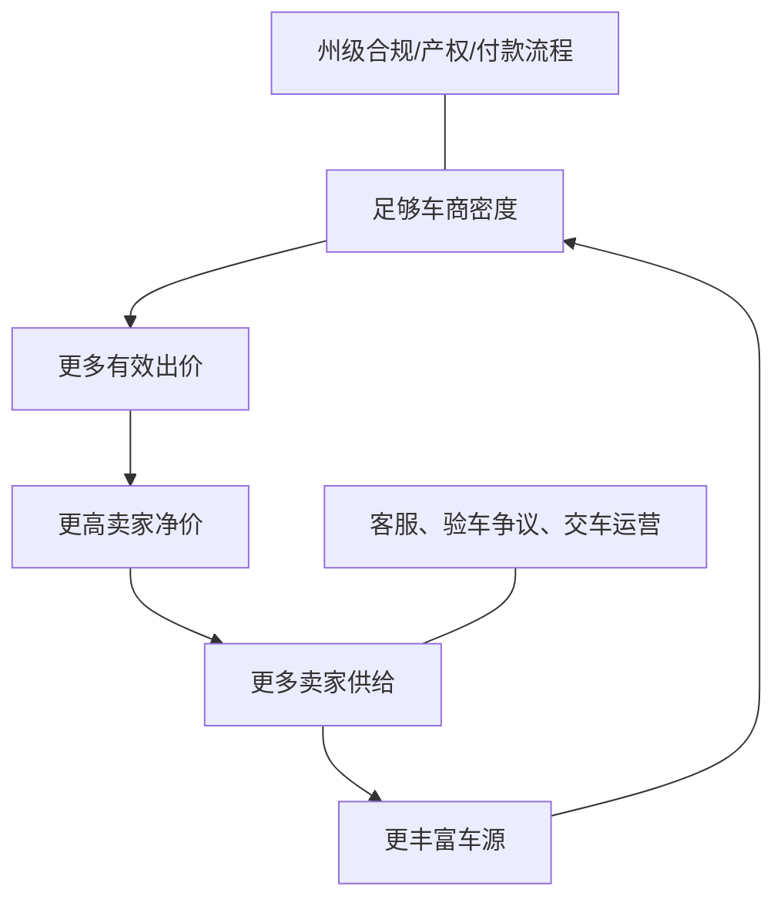

# Bidbus 公司深度分析报告

> **报告日期：** 2026-07-23  
> **研究对象：** <https://bidbus.com/>、Bidbus Inc. 及其消费者到车商（C2B）二手车竞价业务  
> **研究目的：** 求职、面试、Offer 决策、业务合作及消费者使用前尽调，重点核验公司主体、创始团队、融资、交易规模、商业模式、竞争力、消费者条款、隐私合规和组织风险  
> **来源等级：** A = 政府/监管/域名注册原始数据；B = 公司官网、产品门户、合同条款和投资方官网；C = 主流媒体、创始人访谈和新闻稿；D = 第三方评价及商业数据库；E = 基于公开事实的分析推断  
> **重要限制：** Bidbus 是美国非上市私营公司，完整股权、审计财务、成交明细、客户留存和员工数据不公开。GMV、成交数、平均增价和车商数量主要来自公司或创始人口径；本报告不构成法律、投资或汽车交易建议。

---

## 一、执行摘要

### 1.1 一句话判断

> **Bidbus 是一家产品和交易真实、增长较快、刚完成 1,500 万美元 Series A 的美国 C2B 二手车竞价平台。其价值在于让多个车商竞争消费者车辆，以价格发现替代 Carvana/CarMax 式单一报价；主要风险不在“是不是空壳”，而在公开经营指标尚未审计、全国扩张仍待验证，以及官网营销、正式卖家规则、付款和隐私文本之间存在多处重要不一致。**

### 1.2 核心结论

| 维度 | 核验结论 | 置信度 |
|---|---|---:|
| 产品真实性 | 消费者站、卖家门户、车商门户、历史成交、帮助中心和实时竞价流程均可访问 | 高 |
| 法律主体 | 服务条款明确合同网站属于 `Bidbus Inc.`；但注册州、注册号和注册地址未在公开条款中披露 | 中高 |
| 成立时间 | 第三方目录称 2021 年成立；管理层称 2022 年正式启动，准确法人设立日未完成官方核验 | 中 |
| 总部 | TechCrunch/Mucker 称洛杉矶；目录称 Irvine；客服号码为 949 区号，准确办公/注册地址未披露 | 中 |
| 创始人 | Duke Yan 为联合创始人兼 CEO；Ellson Chen 为联合创始人兼 COO，二者有公开专访 | 高 |
| 融资 | 2025 年 330 万美元 Seed；2026-07 完成 1,500 万美元 Series A，公开累计约 1,830 万美元 | 高（金额/机构） |
| 投资方 | Series A 由 Ibex Investors 领投，Mucker、FJ Labs、Motley Fool Ventures、Data Point、Walter Ventures、Yossi Levi 参投 | 高 |
| 交易规模 | 2026-02 公司称累计 5,000 辆、年化 GMV 1.2 亿美元；2026-07 TechCrunch 称累计约 10,000 辆 | 中高（披露存在）；中（数据独立性） |
| 2025 经营 | 公司称 2025 年 GMV 超 5,800 万美元；创始人另称售出 2,400+ 辆 | 中 |
| 商业模式 | 成交后向卖家收 1% 成功费，最低 300 美元；车商端价格及其他收入未公开 | 高（卖家费）；低（完整收入结构） |
| 网络规模 | 官网反复称 `1,000+ dealers`；2026-02 新闻稿只称加州 `100+ dealerships`，统计单位不透明 | 中 |
| 用户口碑 | Reviews.io 当前约 4.71/5、173 条；多数正面，但存在车商到店拒收、支持失联、费用和退出争议 | 高 |
| AI 属性 | 有 ML 估价、Dealer Demand、内部 SDR Agent 和 AI 研究工具；本质仍是交易市场与运营平台，不是纯 AI 公司 | 中高 |
| 合同透明度 | 费用、付款、文书、补偿和争议解决在不同页面出现冲突或版本漂移 | 高 |
| 求职判断 | 值得继续面试，尤其适合 Marketplace、增长、定价、全栈、数据及汽车交易运营；接 Offer 前需核验团队、收入、现金、合规和工时 | 中高 |

### 1.3 最强正面信号

1. **不是概念项目。** 卖家与车商门户、成交结果、帮助中心、第三方评价和长期运营痕迹都能核验。[S1][S2][S9][S10]
2. **融资可信度较高。** TechCrunch 独家报道 1,500 万美元 Series A，领投方代表接受采访；Mucker 和 Motley Fool Ventures 官网均把 Bidbus 列为被投项目。[S11-S14]
3. **增长速度较快。** 公开口径从 2026 年 2 月累计 5,000 辆上升到 7 月约 10,000 辆；即使未经审计，也有主流媒体和投资方交叉旁证。[S13][S16]
4. **双边价值主张成立。** 消费者获得多车商价格发现，车商获得通常更干净、周转更快的私人一手车源。[S13][S15][S16]
5. **资本效率的历史信号不错。** COO 称公司 2024 年在完全自筹状态下售出 1,243 辆、实现约 100 万美元收入。[S15]
6. **外部评价总体正面。** Reviews.io 当前为约 4.71/5、173 条，能看到 2024-2026 跨年份、带图片和认证标签的真实评价痕迹。[S8]
7. **管理层愿意公开谈困难。** 两次专访均承认曾封禁大车商，说明平台至少意识到事后压价会破坏消费者信任。[S13][S15]

### 1.4 核心风险

1. **经营指标主要是公司口径。** 1.2 亿美元年化 GMV、5,800 万美元年度 GMV、10,000 辆成交、平均多卖 2,340 美元均未见审计或逐车公开数据。
2. **“189k+ sellers”定义可疑。** 官网称 18.9 万+ sellers，而 TechCrunch 称约 1 万辆成交；若口径可比，累计成交转化仅约 5.3%，说明前者更可能是询价/注册/线索，而非成功卖家。[S9][S13]
3. **车商网络口径不清。** 官网称 1,000+ dealers，新闻稿称加州 100+ dealerships；可能分别指用户账号和门店，但公司没有解释。[S1][S16]
4. **两小时拍卖并非完整约束期。** 未达底价后会自动进入 24 或 48 小时 Buy Now 窗口，除非卖家主动联系退出；期间达到底价仍自动成交。[S3]
5. **成交后的交易对手是车商，不是 Bidbus。** Bidbus 不持有资金、不接车、不处理 DMV，付款及车况争议主要由卖家和车商承担。[S3][S5]
6. **到店复检仍可能改变结果。** 第三方差评出现车商拒收或再次压价；卖家必须把所有缺陷写入 Dashboard，口头或普通短信披露无效。[S3][S8]
7. **付款营销与正式规则不完全一致。** 官网强调 title in hand 可当天拿支票，正式规则则明确同日付款不保证，贷款正权益可能等待 2-4 周。[S1-S3][S5]
8. **费用呈现不一致。** 官网说从 sale proceeds 扣费；帮助中心说车商全额付款后再从信用卡收费；最新卖家规则又规定同额预授权 hold 和违约捕获。[S1][S3][S4]
9. **消费者保护较弱。** 通用条款责任上限仅 50 美元，卖家规则中的无过错车商拒收补偿最多 300 美元，且由 Bidbus 自行决定。[S3][S7]
10. **法律文本彼此冲突。** 通用条款要求个别仲裁；卖家规则写明由加州法管辖并在 San Bernardino County 法院解决。[S3][S7]
11. **隐私政策过于简化。** 政策称不与任何第三方分享，却未解释获胜车商、Meta、Bing、Hyros、Intercom 等实际数据流。[S1][S6]
12. **全国扩张尚未证明。** Series A 的核心任务就是从加州、德州扩向全美；双边市场在新州需要从零建立车商密度、卖家供给和合规流程。[S13]

### 1.5 求职判断先行版

**建议继续面试，但按“高速扩张的汽车交易 Marketplace”评估，不要按普通 SaaS 或纯 AI 公司评估。**

更适合：

- 双边市场、定价、推荐、竞价、风控和交易履约方向；
- 能把产品、数据、销售和线下运营结合起来的人；
- 希望参与从两个州复制到全国的增长和平台工程候选人；
- 能接受规则频繁迭代、客户争议和高业务责任的人。

需要谨慎：

- 只想做模型研究、对汽车交易和运营没有兴趣的人；
- 把稳定工时、成熟流程和低投诉场景放在首位的人；
- 岗位职责只写“AI”，但无法说明模型如何影响收入、履约或风控；
- 公司用 GMV 代替净收入、用融资代替 runway、用卖家数代替成交用户数。

---

## 二、公司主体与发展历史

### 2.1 可以确认的主体

| 项目 | 公开信息 |
|---|---|
| 品牌 | Bidbus |
| 合同主体 | Bidbus Inc. [S7] |
| 官网 | <https://bidbus.com/> |
| 消费者/卖家门户 | <https://seller.bidbus.com/> |
| 车商门户 | <https://dealer.bidbus.com/> |
| 客服 | `support@bidbus.com`、`+1-949-892-1650` [S1] |
| 业务范围 | 美国加州和德州，计划全国扩张 [S2][S13] |
| 业务类型 | 消费者到车商的二手车在线竞价 Marketplace |
| 总部口径 | Mucker/TechCrunch：Los Angeles；商业目录：Irvine [S12][S13][S18] |

公开条款没有披露：

- 法人注册州；
- 公司注册号；
- 注册办公地址；
- 实际主要营业地址；
- 牌照编号；
- 董事或最终控制人。

因此可以确认品牌和合同名，但不能仅凭网站确定完整法律身份。Businessabc 称公司为美国私营盈利企业，D&B 搜索结果曾指向 Delaware 档案；本次没有取得州政府原始登记，报告不把注册州写成确定事实。[S18]

### 2.2 成立时间为什么有两种口径

| 来源 | 口径 |
|---|---|
| Businessabc | 2021 年成立，并给出 2021-02-02 [S18] |
| Preqin 页面 | 2022 年 Established [S21] |
| COO 访谈 | 公司自 2022 年 launch，2023 年才有基础网站 [S15] |

最稳妥的写法是：**项目可能在 2021 年形成，业务于 2022 年启动；准确法人设立日仍需官方登记确认。**

域名 `bidbus.com` 的 Verisign RDAP 显示早在 2011-08-06 已注册。[S19] 域名年龄不能证明公司从 2011 年运营，可能是后续购买或转让。

### 2.3 发展时间线

| 时间 | 事件 | 证据性质 |
|---|---|---|
| 2021/2022 | 项目形成并启动 | 目录与管理层口径不一致 [S15][S18] |
| 2023 | COO 称当时只有基础网站 | 管理层访谈 [S15] |
| 2024 | 上线基础内部 CRM；售出 1,243 辆、收入约 100 万美元 | 管理层访谈 [S15] |
| 2025-06/08 | 完成/宣布 330 万美元 Seed，Mucker Capital 领投 | 创始人访谈、Mucker 官网 [S11][S15] |
| 2025 | 重做官网和 CRM，大量引入 AI；售出 2,400+ 辆 | 管理层访谈 [S15] |
| 2025 | 公司称 GMV 超 5,800 万美元 | 公司博客 [S17] |
| 2026-02 | 公司宣布累计 5,000 辆、年化 GMV 1.2 亿美元 | PR Newswire 公司新闻稿 [S16] |
| 2026 | 开始德州市场 | COO/官网 [S2][S15] |
| 2026-07-07 | 完成 1,500 万美元 Series A，准备全美扩张 | TechCrunch [S13] |
| 2026-07 | TechCrunch 称累计帮助成交约 10,000 辆 | 主流媒体引用公司/投资人 [S13] |

---

## 三、创始团队

### 3.1 Duke Yan：联合创始人兼 CEO

TechCrunch 明确将 Duke Yan 识别为联合创始人兼 CEO。[S13]

公开创业起因有两个版本：

- TechCrunch：帮助母亲卖车，认为车商报价过低，于是把车商拉进群竞价；
- COO 访谈：CEO 帮朋友卖车，同样通过车商群竞价，最终多卖 8,000 美元。[S13][S15]

人物和核心机制一致，但“母亲/朋友”细节不同，属于典型创始故事版本漂移，不影响商业模式判断，却提醒读者不要把品牌故事当作精确档案。

**能力画像：**

- 对二手车买卖和车商采购有一线经验；
- 理解 Marketplace 的价格发现和供需问题；
- 愿意为平台规则封禁大买家，说明重视长期信任；
- 获得 Ibex、Mucker 等机构支持，融资和行业资源能力较强。

**待核验：**

- 过往职业和教育经历；
- 在公司中的具体产品、销售和运营分工；
- 持股及董事会控制；
- 全国扩张时是否已有成熟区域负责人体系。

### 3.2 Ellson Chen：联合创始人兼 COO

Pulse 2.0 对 Ellson Chen 做了完整专访：[S15]

- UC San Diego 计算机科学本科；
- 毕业后创办面向国际学生的 Union Apartment；
- 该项目进入 Y Combinator，曾达到约 500 万美元年收入，后受疫情影响失败；
- 随后从事 AI 项目；
- 其定制 AI 公司 Animos 与 Bidbus 合并后，以联合创始人身份加入；
- 当前负责运营，并对交易、技术、融资和扩张公开发言。

这段经历解释了 Bidbus 为什么不是纯汽车传统团队：它融合了 Marketplace 运营、软件和 AI 工具能力。

### 3.3 其他管理层与人数

- 公司博客作者 Alex Weinberg 标注为 Chief Marketing Officer，同时是 PR Newswire 新闻稿媒体联系人。[S16][S17]
- Businessabc 还列出 Kraig Coomber、Javier Cuevas 等联合创始人，但该目录来源和更新时间有限，本报告不据此确认其当前职务。[S18]
- 第三方目录对人数给出约 7 人或 11-50 人的不同标签；公司没有公开实时员工总数。
- TechCrunch 的团队照片能证明存在实际团队，但不能用于精确计数。[S13]
- 官网没有 Careers 页面；`jobs.ashbyhq.com/bidbus` 当前显示 Not Found，未找到可核验的统一公开职位列表。

**求职含义：** 当前很可能仍是较小团队支撑快速增长，个人影响力大，但职责边界、值班、客户投诉和线下协调压力也会集中在少数人身上。

---

## 四、融资与资本信号

### 4.1 融资时间线

| 轮次 | 时间 | 金额 | 投资方/来源 |
|---|---|---:|---|
| Seed | 管理层称 2025-06 完成；Mucker 于 2025-08-06 发布 | 330 万美元 | Mucker Capital 领投 [S11][S15] |
| Series A | 2026-07-07 | 1,500 万美元 | Ibex Investors 领投；Mucker、FJ Labs、Motley Fool Ventures、Data Point Capital、Walter Ventures、Yossi Levi 参投 [S13][S14] |
| **公开累计** | 截至 2026-07 | **约 1,830 万美元** | 不含可能未公开融资 |

TechCrunch 的 Series A 报道包括 CEO 与 Ibex 合伙人 Jeff Peters 的直接引述，可信度明显高于单纯数据库记录。[S13]

### 4.2 为什么投资方愿意下注

从公开采访看，核心投资逻辑是：[S13]

1. 二手车线上销售已经被 Carvana 教育；
2. 消费者仍缺少多买家竞争和透明价格发现；
3. 车商需要比传统 B2B 拍卖更优质的私人一手车源；
4. 加州到德州的复制初步证明市场不只适用于洛杉矶；
5. Lithia Motors、Penske Automotive 等集团接入，为需求端提供强信号；
6. Marketplace 一旦形成区域流动性，可能出现供需网络效应。

### 4.3 融资不能证明什么

- 不能证明当前净收入、毛利或贡献利润为正；
- 不能证明 Series A 资金已经全部到账；
- 不能证明公司估值合理；
- 不能证明所有新州都能复制加州效率；
- 不能证明消费者条款和合规系统已经成熟；
- 不能用融资额直接推导个人期权价值。

公开材料没有披露估值、月度 burn、现金余额、董事会席位、清算优先权或下一轮计划。求职者应直接问保守 runway，而不是只问“融了多少钱”。

---

## 五、产品与交易流程

### 5.1 Bidbus 到底做什么

Bidbus **不直接买车，也不持有库存**。它把个人卖家的车辆整理成标准化 listing，让持牌车商竞价，成交合同和付款发生在卖家与获胜车商之间。[S2][S3]


### 5.2 卖家流程

1. 输入车牌或 VIN；
2. 填写里程、车况、贷款和所有权信息；
3. 上传多角度照片；
4. Bidbus 提供底价建议，卖家确认私密最低售价；
5. 车辆进入约两小时实时竞价；
6. 最高价达到底价即构成约束性成交；
7. 未达底价会自动进入 24/48 小时 Buy Now 窗口；
8. 卖家把车送到 100 英里范围内的获胜车商；
9. 车商复检、签文件并直接付款；
10. Bidbus 另行收取成功费。[S2-S5]

### 5.3 车商价值

车商端获得：

- 私人一手车源；
- 统一照片、车况与历史核验；
- 竞价和成交工具；
- Bidbus 协调卖家交车；
- ML 估价及 AI 研究辅助；
- 相比传统批发拍卖更快的周转潜力。[S15][S16][S20]

公开车商页列出 Longo Toyota、Norm Reeves、Rock Honda、McKenna BMW、Jim Falk Lexus 等门店；帮助中心又列出 Lithia、Sonic Automotive 等集团。[S2][S20] TechCrunch 还直接提到 Lithia Motors 和 Penske Automotive。[S13]

这些名称证明有真实车商合作信号，但不等于每个集团所有门店都活跃使用，也不说明采购量。

### 5.4 车辆范围

官网称主要接受：

- 可驾驶、可销售的乘用车、SUV、皮卡、EV、混动和豪华车；
- 通常约 12 年以内；
- 清洁产权；
- 不接受 salvage、branded title、未修复重大损伤、摩托车和重型商用车。[S2]

COO 访谈则称拍卖筛选会排除超过 130,000 英里或重大事故车辆。[S15] 具体标准可能动态调整，应以提交车辆时的规则为准。

---

## 六、商业模式与单位经济

### 6.1 已公开收入模式

卖家成功费为：[S1][S4]

```text
成功费 = max(成交价 × 1%, 300 美元)
```

示例：

| 成交价 | 成功费 | 实际费率 |
|---:|---:|---:|
| $10,000 | $300 | 3.0% |
| $20,000 | $300 | 1.5% |
| $30,000 | $300 | 1.0% |
| $50,000 | $500 | 1.0% |
| $80,000 | $800 | 1.0% |

这意味着低价车的实际费率显著高于 1%。

车商端是否有买家费、订阅、运输、数据或增值服务收入没有公开。2024 年“约 100 万美元收入/1,243 辆”的管理层口径意味着平均收入约 $804/辆，明显高于单纯最低 $300 卖家费，可能存在：[S15]

- 车商端交易费；
- 较高成交价对应 1% 费率；
- 其他服务收入；
- 收入与车辆数统计区间不同。

公开证据不足，不能反推出确定的 take rate。

### 6.2 基于 2025 口径的粗略计算

公司称 2025 年 GMV 约 5,800 万美元，COO 称售出 2,400+ 辆。[S15][S17]

由此得到：

- 平均每辆 GMV 约 $24,167；
- 若每辆至少收 $300，卖家成功费下限约 $720,000；
- 按纯 1% 计算约 $580,000；
- 实际收入应受最低费、减免、退款、车商端收费和统计范围影响。

这些只是敏感性分析，不是公司财务。

### 6.3 GMV 与收入不能混用

- **2025 GMV 5,800 万美元：** 据公司博客，是实际年度交易总额口径；
- **2026-02 年化 GMV 1.2 亿美元：** 是当时速度外推的 run rate，不是已经完成 1.2 亿美元年度交易；
- **净收入：** 仅找到 2024 年约 100 万美元管理层口径；
- **利润/现金流：** 未披露。[S15-S17]

面试中若有人把 1.2 亿美元 GMV 说成 1.2 亿美元营收，这是明显口径错误。

### 6.4 获客成本和补贴

官网推荐计划称邀请人与朋友各得 $100，每月最高可赚 $3,000。[S1] 网站还集成 Meta Pixel、Bing UET、Google/服务器端 GTM、Hyros 等广告归因工具，说明付费增长是重要渠道。[S1]

需核查：

- 每个完成 listing、开拍、成交用户的 CAC；
- 推荐奖励按注册、开拍还是成交触发；
- 广告带来的 18.9 万 users 中多少能完成交易；
- 每辆车扣除客服、验车争议、退款和补贴后的贡献利润；
- 新州冷启动 CAC 是否显著高于加州。

---

## 七、经营规模与数据一致性

### 7.1 公开指标表

| 指标 | 数值 | 时间/来源 | 证据边界 |
|---|---:|---|---|
| 2024 成交车辆 | 1,243 | COO 访谈 [S15] | 管理层自述 |
| 2024 收入 | 约 $1M | COO 访谈 [S15] | 未审计 |
| 2025 成交车辆 | 2,400+ | COO 访谈 [S15] | 管理层自述 |
| 2025 GMV | $58M+ | 公司博客 [S17] | 公司自述 |
| 2026-02 累计成交 | 5,000+ | PR Newswire [S16] | 公司发布 |
| 2026-02 年化 GMV | $120M | PR Newswire [S16] | run rate，不是年度实绩 |
| 2026-07 累计成交 | 约 10,000 | TechCrunch [S13] | 记者引用公司/投资人 |
| 当前 sellers | 189k+ | 官网 [S9] | 定义未披露 |
| 当前 dealer network | 1,000+ | 官网 [S1][S2] | 是账号、买家还是门店未知 |
| 加州合作门店 | 100+ | 公司新闻稿 [S16] | 截至 2026-02 |
| 平均多卖 | $2,340 | 184 个同 VIN 内部审计 [S2] | 公司自建样本 |
| 成功车辆平均出价 | 25 | 公司博客 [S17] | 未披露分布和失败 listing |

### 7.2 这些数据是否相互合理

总体增长方向可互相解释：

- 2024 约 1,243 辆；
- 2025 超 2,400 辆；
- 2026-02 累计超 5,000 辆；
- 2026-07 累计约 10,000 辆。

从 5,000 到 10,000 约五个月翻倍，与 Series A 的增长叙事一致。5,800 万美元 GMV / 2,400 辆约 $24,000/辆，也符合美国二手车常见价格区间。

但三个口径需要警惕：

1. **189k+ sellers：** 远大于 10,000 辆成交，可能实际是询价用户或 leads；
2. **1,000+ dealers vs 100+ dealerships：** 可能一个是个人买家账号，一个是门店；
3. **184 个同 VIN 审计：** 相对约 10,000 辆累计成交只占约 1.84%，而且是否随机、是否排除失败交易未知。

### 7.3 “平均多卖 $2,340”如何审视

公司称对最近 184 个相同 VIN 样本，把 Bidbus 获胜价与同一卖家的 instant offer 比较，平均高 $2,340。[S2]

这个方法比拿不同车辆泛比更合理，但仍缺：

- 样本选择规则；
- 中位数和分位数；
- 是否扣除 Bidbus 成功费、交通和时间成本；
- 即时报价是否仍在有效期；
- 最终车况复检后实收金额；
- 未售出车辆是否被排除；
- 不同车型、价格和地区分层。

因此可以表述为“公司内部审计显示平均多 $2,340”，不能写成所有卖家的保证收益。

---

## 八、用户口碑与投诉主题

### 8.1 独立评价快照

Reviews.io 在 2026-07-23 页面结构化数据中显示：[S8]

| 指标 | 当前值 |
|---|---:|
| 评分 | 4.71 / 5 |
| 评价数 | 173 |
| 官网内嵌旧口径 | 4.8 / 171 |
| 官网声称 Google Reviews | 4.9 / 691 |
| 官网汇总 | 4.8 / 862 |

Reviews.io 是独立第三方页面，但仍需区分 `Verified Buyer`、`Verified Reviewer` 和未认证评价。Google 的 691 条没有在本次直接抓取中逐条核验，因此总计 862 应视为官网汇总口径。[S8][S9]

### 8.2 正面主题

- 高于 CarMax、Carvana、KBB 或本地车商报价；
- 上传资料和竞价流程简单；
- 能实时观看出价；
- 客服主动协调；
- 不需要应对私人买家诈骗、砍价和爽约；
- 到店后按竞价金额付款的案例真实存在。[S8][S9]

### 8.3 负面主题

Reviews.io 可见的低分评价包括：[S8]

- 到车商处后对方拒绝成交；
- 车商声称有新问题并降低报价，卖家认为问题不存在；
- 客服无法联系；
- 交车流程和网页操作困难；
- 卖家要求下架但未及时处理，认为被规则“困住”；
- 对成功费或再次拍卖费用理解不一致。

这些投诉数量相对总评价不高，但恰好指向 Marketplace 最关键的失败点：**竞价价格是否能在实体复检后兑现。**

### 8.4 正确解读口碑

- 高评分说明产品对大量卖家确实创造了价值；
- 不能用平均评分否定少数高金额纠纷，因为卖车是低频、高客单事件；
- 投诉集中在车商行为、付款和交车，说明 Bidbus 的品牌风险来自它不直接控制的交易方；
- 公司封禁大车商的案例既是治理正面信号，也证明该问题真实发生过。[S13][S15]

---

## 九、合同、费用与消费者风险

### 9.1 营销页与正式规则对照

| 事项 | 营销/FAQ 表述 | 2026-06 卖家规则 | 风险判断 |
|---|---|---|---|
| 拍卖时长 | 约 2 小时 | 未达底价后自动延长 24/48 小时 | **重要信息未在主流程突出** |
| 达到底价 | 卖出/成交 | 自动构成约束性成交 | 一致，卖家不能任意反悔 |
| 付款 | title in hand 常称当天支票 | 明确同日不保证，可能邮寄数日 | **营销更乐观** |
| 贷款正权益 | 最多 10 个工作日等表述 | 通常 2-4 周 | **时间差异明显** |
| DMV/文书 | 多处称 Bidbus 协助、甚至代办 release | 明确 Bidbus 不处理 DMV，车商和卖家负责 | **责任边界冲突** |
| 成功费收法 | 从 sale proceeds 扣除 | 车商全额付款；另有银行卡 hold | **收费路径不一致** |
| 车商无理拒绝补偿 | 单独帮助页写最高 $500 | 新卖家规则写最高 $300，且自行决定 | **版本冲突** |
| 争议解决 | 通用条款要求个人仲裁 | 卖家规则写 San Bernardino County 法院 | **法律路径冲突** |

### 9.2 卖家容易忽略的约束

1. **所有车况必须写进 Dashboard。** 告诉客服、拍卖经理或发普通短信都不算有效披露。[S3]
2. **底价达到即绑定。** 不需要卖家再次点接受；拒绝交易可能被收 $300 或 1%。[S3]
3. **拍卖后自动延长。** 周一/周三 24 小时，周五 48 小时；不想延长必须主动联系退出。[S3]
4. **100 英里送车义务。** 获胜车商在填报邮编 100 英里内，卖家原则上必须送车并承担返程费用。[S3]
5. **到店仍要复检。** 未披露的重大机械、结构、轮胎或事故问题可以让车商退出。[S3]
6. **负权益必须当场补差。** 无分期或 IOU，支付方式由车商决定。[S3][S5]
7. **贷款正权益可能等待 2-4 周。** 期间正常贷款还款仍由卖家负责。[S5]
8. **Bidbus 不托管车款。** 付款出问题应首先找车商，平台只在之后协助。[S3][S5]

### 9.3 责任分配是否平衡

卖家取消或误述可能承担至少 $300；车商无理拒绝时，Bidbus 先协调、找替代车商，最终补偿最多 $300，且是否补偿由平台自行决定。[S3]

通用条款又把平台总体责任上限设为 $50，并要求用户广泛赔偿公司。[S7] 虽然具体卖家规则可能优先，但文本没有清楚解释文件优先顺序。

**判断：** 条款对平台风险隔离很强，对卖家则要求高度准确、及时和可证明的披露。消费者在拍卖前必须截屏保存 Dashboard、底价、照片、出价、车商信息和所有书面沟通。

### 9.4 牌照与监管边界

官网 FAQ 有一句“licensed dealer-to-dealer auction platform”，但公司同时强调自己不是车商、交易是 C2B，且没有公开具体牌照号码。[S2][S3]

本次没有找到能直接对应 Bidbus Inc. 的官方牌照原档。正确结论是：

> **公开材料不足以确认平台自身持有什么州级拍卖或车商牌照；不能据此认定其无牌，也不能只凭官网一句话认定牌照已核验。**

合作买家应是各州持牌车商，公司帮助中心列出多家门店，但仍应在实际成交时核对获胜车商的州牌照和名称。[S20]

---

## 十、隐私、安全与数据治理

### 10.1 实际处理的数据远多于隐私政策摘要

完成卖车通常需要：

- 姓名、电话、邮箱、地址和邮编；
- 车牌、VIN、里程和车辆照片；
- 车况、事故、维修和改装；
- title、注册、驾照及所有权；
- 贷款方、10-day payoff、余额和账户信息；
- 获胜车商、付款和交接记录；
- 网站行为、广告归因、设备和 IP。

而隐私政策只概括列出联系信息、账户、消息和使用日志，没有完整描述车辆、金融、证件、车商共享和广告技术数据。[S3][S6]

### 10.2 “不与第三方分享”与实际流程冲突

隐私政策快速摘要写：`Your information will not be shared with any third parties.`[S6]

但实际业务必然涉及：

- 获胜车商获得卖家联系方式；
- 贷款车商需要 payoff 与账户资料；
- 网站加载 Meta Pixel；
- 使用 Bing UET；
- 使用服务器端 GTM/Google Ads、TikTok、Reddit；
- 使用 Hyros 归因；
- 帮助中心由 Intercom 托管。[S1][S3][S5][S6]

“不出售个人数据”可能成立，但“不与任何第三方分享”显然没有准确描述运营现实。政策还写明只适用于 `bidbus.com` 网站活动，不覆盖线下或其他渠道，进一步留下卖家门户、短信、车商和交车阶段的边界问题。[S6]

### 10.3 安全正面信号

- 官网和两个门户均正常使用 HTTPS；
- HSTS 覆盖子域；
- Cloudflare 提供边缘防护；
- 相机、麦克风权限默认关闭；
- 卖家与车商使用分离门户；
- 车商在成交前不能看到卖家联系方式。[S1][S2]

### 10.4 公开缺口

- 没有安全白皮书、SOC 2 或渗透测试信息；
- 没有子处理商清单；
- 没有数据保留期限；
- 没有证件、VIN 和金融数据的字段级说明；
- 没有明确的数据泄露通知流程；
- 没有解释跨州、跨系统和车商端删除如何执行；
- 没有 Cookie 同意管理与各广告工具的详细目的说明。

对求职者而言，这意味着安全、法务、数据和平台工程在 Series A 全国扩张阶段会成为实质性建设任务。

---

## 十一、技术与 AI 能力

### 11.1 已公开的技术演进

COO 的描述是：[S15]

| 时间 | 技术状态 |
|---|---|
| 早期 | 主要靠人工流程，没有成型技术 |
| 2023 | 有基础网站 |
| 2024 | 上线基础内部 CRM |
| 2025 | 重做网站、CRM，并把 AI 大量用于业务 |
| 2026 | 形成 AI + 人工的 listing、估价、需求预测与车商研究体系 |

### 11.2 AI 的实际用途

- 内部 SDR Agent 辅助线索处理；
- 人工销售配合 Agent 完成 listing intake；
- ML 估价和底价建议；
- 根据车商网络预测具体车辆需求；
- AI 辅助车商研究车辆并形成采购策略；
- 大规模车辆历史核验和车况标准化。[S15][S16]

这说明 AI 是运营效率和定价工具，而不是向客户销售模型 API。

### 11.3 技术核心难点

| 领域 | 难点 |
|---|---|
| 估价 | 车型、配置、里程、地区、季节和实时车商库存共同影响 |
| 底价 | 太高导致流拍，太低损害卖家信任 |
| 车况 | 图片与自报信息不完整，线下复检可能反转结果 |
| 匹配 | 并非所有 1,000+ 买家都适合每辆车，需要精准触达 |
| 竞价 | 防止串标、虚假出价、错误出价和事后压价 |
| 反欺诈 | title、身份、贷款、里程和事故记录风险 |
| 交易状态 | 拍卖、Buy Now、到店、付款、贷款和 DMV 长链路 |
| 多州规则 | 各州牌照、产权、排放、税务和通知要求不同 |
| 客服 | 高客单低频交易需要人类解释与争议处理 |

### 11.4 是否具备技术壁垒

当前可见壁垒更可能来自：

1. 历史竞价和真实成交数据；
2. 每个车商的车型、价格和库存偏好；
3. 区域车商关系和治理规则；
4. listing 标准化和人工运营流程；
5. 估价与匹配模型；
6. 品牌及消费者获客。

没有公开代码、模型评测或专利能证明单纯算法壁垒。真正难复制的是**数据、车商流动性、运营和信任的组合**。

---

## 十二、市场与竞争

### 12.1 替代方案

| 类型 | 代表 | 卖家体验 | Bidbus 的机会 | Bidbus 的弱点 |
|---|---|---|---|---|
| 直接在线收车 | Carvana、CarMax、Driveway | 快、确定、单一报价 | 用多车商竞争提高价格 | 多一步拍卖与交车，不保证成交 |
| 车商询价网络 | KBB ICO、CarGurus 等 | 获得报价/线索 | 实时可见竞价更透明 | 仍依赖最终车商复检 |
| 私人出售 | Facebook Marketplace、Craigslist、PrivateAuto | 潜在价格最高 | 消除陌生人、诈骗和议价 | 收费且可能低于私人售价 |
| 爱好者公开拍卖 | Cars & Bids、Bring a Trailer | 公开零售买家竞拍 | Bidbus 更快、更适合普通车 | 稀缺车可能在公开零售拍卖更贵 |
| 传统批发拍卖 | Manheim、ADESA、ACV 等 | 主要 B2B | Bidbus 直接引入私人优质供给 | 老牌拍卖流动性、物流和检测更强 |
| 其他区域在线拍卖 | Carmigo 等 | 区域车商竞价 | 市场验证存在 | 差异化“唯一 C2B”表述不宜绝对化 |

### 12.2 差异化是否成立

Bidbus 的核心差异不是“在线卖车”，而是：

- 消费者只提交一次；
- 多个持牌车商实时竞争；
- 私密底价保护；
- 成交前不公开卖家联系方式；
- 竞价过程可视化；
- 平台人工协调交车和争议。[S2][S13]

这一模式确实处在 Carvana 的方便与私人出售的高价之间。

### 12.3 Marketplace 护城河的条件

只有同时满足以下条件，网络效应才成立：

- 每个新州有足够多的真实活跃车商；
- 车商对 listing 质量和最终履约有信心；
- 卖家能持续获得高于直接收车平台的净价；
- 平台能惩罚事后压价和虚假出价；
- CAC 不会随区域扩张失控；
- 交易争议率不随规模上升；
- 活跃车商采购集中度不过高。

TechCrunch 提到早期一个最大车商曾拥有较强议价力，公司不得不封禁；这说明需求侧集中是现实风险。[S13]

### 12.4 全国扩张的冷启动难题

每进入一个州都需要同时建设：



若先投卖家广告而车商不足，拍卖价格差；若先招车商而车源不足，车商不会持续登录。这是 Series A 资金必须解决的核心问题。

---

## 十三、组织与求职适配

### 13.1 组织阶段

Bidbus 已从自筹团队进入 Series A 全国扩张期。这个阶段通常意味着：

- headcount 和区域团队增加；
- 现有 CRM、竞价和客服系统需要平台化；
- 以往依赖创始人的规则要制度化；
- SLA、安全、法务和财务控制开始补课；
- 增长目标会显著高于 Seed 阶段；
- 产品团队必须同时服务消费者、车商和内部运营。

这是基于公司阶段的分析推断，不是员工匿名评价。

### 13.2 岗位机会

| 岗位 | 真实业务价值 | 主要风险 | 适配判断 |
|---|---|---|---|
| Marketplace 产品 | 竞价、底价、匹配、履约均是核心 | 双边冲突多、规则频繁变 | 高 |
| 数据科学/定价 | 直接影响成交和毛利 | 标签偏差、非结构化车况 | 高 |
| ML/AI 工程 | 估价、需求预测、SDR Agent 有实际场景 | 可能更偏应用和运营自动化 | 中高 |
| 全栈/平台 | 卖家、车商、CRM、状态机复杂 | 事故影响真实高金额交易 | 高 |
| 增长 | 全国扩张和推荐体系空间大 | CAC 和线索质量压力 | 高 |
| 风控/Trust & Safety | title、欺诈、车况、竞价治理关键 | 责任重、跨州规则复杂 | 高 |
| 客服/运营 | 直接决定交易能否完成 | 争议多、时效和情绪压力高 | 中高 |
| 纯基础模型研究 | 不是公司主要商业模式 | 研究空间可能有限 | 低至中 |

### 13.3 工作环境风险

- 高增长可能伴随晚间/周末交易和客服问题；
- 新州上线会同时牵动产品、销售、法务和运营；
- 交易金额高，细小状态或文案错误会引发真实损失；
- 规则页频繁更新，说明业务仍在快速学习；
- 合同文本不一致可能让员工承担额外解释和投诉压力；
- 小团队中个人 ownership 高，但文档、晋升和管理成熟度可能不足。

### 13.4 Offer 前必须确认

- 美国还是中国/海外主体签约；
- 雇佣类型：W-2、1099、EOR 还是境外劳动合同；
- 汇报对象和核心团队所在时区；
- 固定工资、奖金、佣金和股权；
- Series A 后 fully diluted 股本与期权百分比；
- 加班、值班、客户事故和周末发布要求；
- 数据、代码和模型的 IP 归属；
- 远程办公、设备、安全及跨境数据权限；
- 试用期或前 90 天的量化目标。

---

## 十四、SWOT

| | 正面 | 负面 |
|---|---|---|
| **内部** | **Strengths：** 真实交易和门户；多车商价格发现；强增长；Series A 资本；管理层兼具汽车、Marketplace 和技术经验 | **Weaknesses：** 指标未审计；团队信息少；依赖车商履约；合同和隐私文本不一致；全国运营基础尚在建设 |
| **外部** | **Opportunities：** 美国私人车辆供给巨大；消费者习惯在线卖车；车商缺优质库存；竞价数据可改善估价和匹配 | **Threats：** Carvana/CarMax 品牌与资金；传统拍卖网络；车商集中；州级监管；二手车周期；广告成本；投诉造成信任损失 |

---

## 十五、风险矩阵

| 风险 | 概率 | 影响 | 等级 | 核验/缓释 |
|---|---:|---:|---:|---|
| 全国扩张时车商流动性不足 | 中高 | 高 | **高** | 分州看活跃车商、出价数、sell-through |
| GMV 高但净收入/毛利低 | 中 | 高 | **高** | 核查 take rate、贡献毛利和 CAC payback |
| 车商到店压价或拒收 | 中高 | 高 | **高** | 看争议率、差价率、封禁和赔付数据 |
| 合同文案不一致引发投诉 | 高 | 中高 | **高** | 建立单一条款源、版本和优先级 |
| 用户数据披露不充分 | 高 | 高 | **高** | 重写隐私政策、子处理商和 consent |
| 活跃车商过度集中 | 中 | 高 | **高** | Top 1/5/10 采购份额与替代流动性 |
| 估价/底价模型偏差 | 中 | 高 | **高** | 按州/车型监控流拍和复检差价 |
| 牌照与跨州合规 | 中 | 极高 | **高** | 州级法律意见、牌照矩阵和审计 |
| 付款/产权纠纷 | 中 | 高 | **高** | 车商 SLA、支付追踪和升级机制 |
| CAC 上升 | 中高 | 中高 | **中高** | 分渠道 cohort、成交 CAC、推荐占比 |
| 关键创始人依赖 | 中 | 中高 | **中高** | 二层管理、区域负责人、审批授权 |
| 二手车价格下行 | 中 | 中高 | **中高** | 底价动态调整、避免持有库存 |
| Series A 资金消耗过快 | 中 | 高 | **高** | 月度 burn、招聘计划、保守 runway |

---

## 十六、面试核验问题

### 16.1 业务与财务

1. 2025 年 5,800 万美元 GMV 对应多少成交辆、净收入和贡献毛利？
2. 1.2 亿美元 annualized GMV 的计算月份和持续性如何？
3. 卖家费、车商费和其他收入分别占多少？
4. 2024 年约 $804/辆平均收入为何高于 $300 最低卖家费？
5. 当前月度成交、GMV、净收入和 cash burn 是什么区间？
6. Series A 后保守 runway 有多少个月？
7. 新州从零到贡献利润为正需要多少月和多少资金？

### 16.2 Marketplace 指标

1. `189k+ sellers` 的精确定义是什么？询价、注册、listing、开拍还是成交？
2. 1,000+ dealers 是个人账号、门店还是集团？月活车商多少？
3. Top 1/5/10 车商占成交采购量多少？
4. listing 到开拍、开拍到底价、底价到交车的转化率分别多少？
5. 每辆车平均出价的中位数和分州分布是什么？
6. 车商到店压价、拒收和延迟付款率是多少？
7. 加州与德州的 CAC、sell-through 和客单价差异如何？

### 16.3 产品与技术

1. 底价模型的目标函数是成交率、卖家净价还是平台收入？
2. 如何避免模型为提高成交率系统性压低底价？
3. 图片车况识别、历史报告和人工审核如何组合？
4. SDR Agent 能自动完成哪些动作，哪些必须人工审批？
5. 竞价系统如何防刷价、串标、撤单和错误出价？
6. 交易状态机如何处理拍卖、Buy Now、交车、贷款和 DMV 异常？
7. 关键系统 SLA、P95 延迟、RTO/RPO 和事故频率如何？
8. 每次上线新州需要改哪些数据、规则和工作流？

### 16.4 合规与消费者保护

1. Bidbus Inc. 的注册州、实体号和准确营业地址是什么？
2. 平台自身持有哪些拍卖/车商相关牌照？
3. 为什么通用条款写仲裁，卖家规则写 San Bernardino 法院？
4. 为什么官网说处理 DMV，正式规则说完全不处理？
5. 为什么不同页面对车商违约补偿分别写 $300 和 $500？
6. 隐私政策为何称不向第三方分享，却使用车商及多个广告/客服平台？
7. 车商牌照如何验证、多久复核一次？
8. 发生付款、title 或欺诈事故时谁承担最终责任？

### 16.5 组织与 Offer

1. 当前员工总数、技术人数及未来 12 个月计划是多少？
2. 我的直属上级、同组成员和时区是什么？
3. Series A 后最大的组织瓶颈是什么？
4. 过去一年核心团队离职率如何？
5. 岗位是否需要处理晚间、周末拍卖或交易事故？
6. 前 30/60/90 天的验收目标是什么？
7. 期权数量对应 fully diluted 的百分比是多少？
8. 行权价、vesting、cliff、离职窗口和回购规则是什么？

---

## 十七、消费者使用清单

如果是准备通过 Bidbus 卖车，而非求职，建议：

1. 同时获取 CarMax、Carvana、KBB 等书面即时报价；
2. 把所有车况、异响、划痕、事故、改装和警示灯写进 Dashboard；
3. 保存上传照片原图与时间；
4. 截图最低售价、竞价结果和费用；
5. 确认是否接受拍卖后 24/48 小时 Buy Now；
6. 提前核对获胜车商牌照、地址和 Google 评价；
7. 书面确认付款方式和确切时间；
8. 贷款车准备有效 10-day payoff；
9. 计算 100 英里送车及返程成本；
10. 未收到可靠付款前谨慎交出不可逆文件；
11. 保存 Bill of Sale、里程声明和 Release of Liability；
12. 如条款与客服说法不同，要求书面确认适用版本。

---

## 十八、综合结论

### 18.1 公司质量判断

Bidbus 已经过了“产品是否存在”的验证阶段：

- 有真实消费者和车商双端产品；
- 有连续多年的成交和评价；
- 有 Mucker、Ibex、FJ Labs 等资本支持；
- 有加州到德州的市场复制；
- 有从 5,000 到约 10,000 辆成交的快速增长信号。[S11-S16]

它还没有完全通过“能否成为全国成熟平台”的验证：

- 经营数据缺少审计；
- 用户和车商数量定义模糊；
- 全国扩张刚开始；
- 车商线下履约仍是关键失控点；
- 条款与隐私治理明显落后于增长速度。

因此，合理定位是：

> **一家刚进入 Series A、已有真实 PMF 和区域流动性、但仍需补齐全国扩张、平台治理、合规与经营透明度的汽车 Marketplace。**

### 18.2 求职最终建议

**建议继续面试。** 与很多只讲 AI 或平台概念的早期公司相比，Bidbus 有真实高金额交易、真实用户、真实争议和明确商业模式，技术工作的业务反馈会很直接。

**不要只看 GMV。** 最关键的是净收入、贡献利润、sell-through、成交 CAC、车商集中度、拒收率和 Series A 后 runway。

**接 Offer 前必须核验：** 雇佣主体、团队和时区、岗位实际内容、现金与期权、事故值班、消费者合规、数据权限和全国扩张目标。

综合风险收益：

| 候选人偏好 | 结论 |
|---|---|
| 追求 Marketplace、汽车、电商交易和高速增长 | **较匹配** |
| 追求 AI 应用与业务结果结合 | **匹配，但不是基础模型公司** |
| 追求稳定工时、成熟制度、低投诉业务 | **谨慎** |
| 只看融资和 GMV，不核收入/条款/团队 | **不建议直接接 Offer** |

---

## 十九、来源与检索记录

> 除特别说明外，所有页面最后访问日期均为 2026-07-23。动态评分、职位、交易和网站文案会变化。

### 官网、产品与规则

- **[S1]** Bidbus 官网：<https://bidbus.com/>  
  用于产品、费用、用户数、车商数、多语言、营销指标、客服、追踪技术和基础安全头。
- **[S2]** How It Works：<https://bidbus.com/pm/how-it-works>；车商页：<https://bidbus.com/pm/dealer_landing>  
  用于流程、底价、竞价、支付、区域和车商价值。
- **[S3]** Bidbus Seller Terms & Platform Rules，2026-06-17：<https://bidbus.com/help/en/articles/13552894-bidbus-seller-terms-platform-rules>
- **[S4]** 费用帮助页：<https://bidbus.com/help/en/articles/12485831-what-fees-does-bidbus-charge>；<https://bidbus.com/help/en/articles/12485843-when-do-i-need-to-pay-the-bidbus-fee>；<https://bidbus.com/help/en/articles/12484191-is-listing-on-bidbus-free>；<https://bidbus.com/help/en/articles/12485871-what-s-the-cancellation-fee-if-i-back-out-after-accepting-the-offer>
- **[S5]** 付款与交付：<https://bidbus.com/help/en/articles/12482596-when-will-i-get-paid-after-selling>；<https://bidbus.com/help/en/articles/14670576-faq-delivery-payments>
- **[S6]** Privacy Policy，2025-10-02：<https://bidbus.com/help/articles/12503399-privacy-policy>
- **[S7]** Terms of Service，2025-10-10：<https://bidbus.com/help/articles/12503377-terms-of-service>
- **[S9]** Reviews 页面：<https://bidbus.com/pm/reviews>
- **[S10]** 历史成交：<https://bidbus.com/past-result>；卖家门户 <https://seller.bidbus.com/>；车商门户 <https://dealer.bidbus.com/>
- **[S20]** 车商类型说明：<https://bidbus.com/help/en/articles/12484380-what-type-of-dealers-are-on-bidbus>

### 第三方评价与域名

- **[S8]** Reviews.io，Bidbus Reviews：<https://www.reviews.io/company-reviews/store/bidbus.com>
- **[S19]** Verisign RDAP，`BIDBUS.COM`：<https://rdap.verisign.com/com/v1/domain/BIDBUS.COM>

### 融资、团队与经营

- **[S11]** Mucker Capital，2025-08-06，《BidBus raises $3.3M Seed》：<https://mucker.com/news/bidbus-raises-3-3m-seed-to-streamline-consumer-to-dealer-car-sales/>
- **[S12]** Mucker Capital Portfolio，Bidbus：<https://mucker.com/company/bidbus/>
- **[S13]** TechCrunch，2026-07-07，《This startup pits dealerships against each other to bid on your used car》：<https://techcrunch.com/2026/07/07/this-startup-is-pitting-dealerships-against-each-other-to-bid-on-your-used-car/>
- **[S14]** Motley Fool Ventures News & Insights：<https://foolventures.com/news-and-insights>  
  官网列出 Bidbus Series A 及 1.2 亿美元年化 GMV 相关报道，证明其被投关系。
- **[S15]** Pulse 2.0，2026-02-03，Ellson Chen 专访：<https://pulse2.com/bidbus-profile-ellson-chen-interview/>
- **[S16]** PR Newswire，2026-02-03，Bidbus 公司新闻稿：<https://www.prnewswire.com/news-releases/bidbus-surpasses-5-000-vehicles-sold-reaches-120m-annualized-gmv-five-months-after-seed-round-302675255.html>
- **[S17]** Bidbus 官方博客，2026-01-25，《Is Bidbus Legit?》：<https://bidbus.com/blog/post/is-bidbus-legit-the-honest-truth-about-selling-your-car-online>
- **[S18]** Businessabc，Bidbus 企业目录：<https://businessabc.net/wiki/bidbus>  
  用于成立、地点和团队的低等级旁证，不作为工商原档。
- **[S21]** Preqin，Bidbus Inc. Asset Profile：<https://www.preqin.com/data/profile/asset/bidbus-inc-/759998>  
  用于成立年份和融资的商业数据库旁证；Series A 以 TechCrunch 一手采访为主。

---

## 附录：30 秒决策卡

| 问题 | 当前答案 |
|---|---|
| 公司真实吗？ | 是，产品、交易、评价、融资和投资方均可核 |
| 做什么？ | 让持牌车商竞价购买个人二手车的 C2B Marketplace |
| 融资多少？ | 公开 Seed 330 万美元 + Series A 1,500 万美元，累计约 1,830 万美元 |
| 业务规模？ | 2026-07 媒体称累计约 10,000 辆；公司称 2026-02 年化 GMV 1.2 亿美元 |
| 收入真实吗？ | 仅有 2024 年约 100 万美元的管理层口径，未见审计 |
| 最大优势？ | 多车商价格发现、私人优质车源和区域网络流动性 |
| 最大风险？ | 车商履约、全国冷启动、条款/隐私不一致、GMV 与用户口径不透明 |
| 是 AI 公司吗？ | AI 是估价和运营工具，本质是汽车交易 Marketplace |
| 值得面试吗？ | 值得，尤其适合 Marketplace、数据、增长、平台和风控岗位 |
| Offer 前第一问？ | 净收入/贡献毛利、活跃车商、拒收率、runway 和岗位值班责任 |
