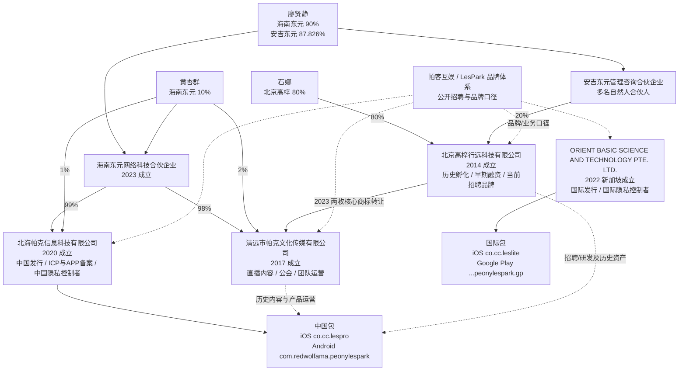

# LesPark / 帕客互娱公司深度分析报告

> **报告日期：** 2026-07-16<br>
> **研究目的：** 求职、面试及业务合作前尽调，重点核验产品真实性、运营主体、融资与当前治理、用户规模、商业模式、数据安全、内容合规及劳动关系风险<br>
> **研究范围：** LesPark 品牌、北京高梓行远科技有限公司、清远市帕克文化传媒有限公司、北海帕克信息科技有限公司、ORIENT BASIC SCIENCE AND TECHNOLOGY PTE. LTD.，以及公开招聘中使用的“帕客互娱”集团口径<br>
> **信息截止：** 2026-07-16；应用商店、招聘岗位和工商聚合信息会动态变化<br>
> **来源等级：** A = 政府、监管、应用商店或公开法律文本；B = 公司官网、产品政策和公司自述；C = 高校、主流或专业媒体；D = 招聘平台、工商/司法聚合页；E = 基于公开事实的分析推断<br>
> **阅读提醒：** “未找到公开证据”不等于事项不存在；未上市公司的股权、合同、财务和关联交易通常不完整公开。本报告不是投资评级、审计结论或法律意见。

---

## 一、执行摘要

### 1.1 一句话判断

LesPark 是一个**真实运营十余年、在中国和东南亚已有可见用户基础、通过直播打赏、虚拟货币和会员形成商业闭环的女性垂直社交娱乐平台**；它不是早期概念项目，但当前品牌由北京、清远、北海和新加坡多主体共同承载，2023-2026 年又连续出现创始股东退出特定主体、主要人员变更和减资，因此求职者最需要核验的已不是“产品真假”，而是**当前谁控制、谁雇佣、谁拥有知识产权、谁处理数据以及盈利和 17 薪是否有文件支持**。

### 1.2 最重要的结论

| 维度 | 结论 | 置信度 |
|---|---|---:|
| 产品真实性 | 中国/国际 iOS、国内 Android、Google Play、官网和持续版本更新均可核 | 高 |
| 产品阶段 | 成熟运营产品；当前国内包可追溯至 2018，国际独立包始于 2023，品牌历史可追溯至 2014 | 高 |
| 市场位置 | 在中国女性 LGBTQ 社交中有较强历史地位；海外 Android 规模低于 HER、Taimi、Zoe 等头部竞品 | 中高 |
| 官方规模 | 官网称 3,000 万+注册/垂直用户、34 国、30 万+主播；没有 MAU、留存或审计材料 | 高（对“自报”事实） |
| 可核规模 | Google Play 1M+ 下载、15.7K 评论；应用宝约 222.9 万下载；中国 iOS 约 2.15 万评分 | 高 |
| 商业模式 | VIP、钻石、礼物/打赏、主播/公会、语音房、广告；短剧、游戏和 AI 是新增变现层 | 高 |
| 盈利能力 | 招聘页自称已规模化盈利、2024 后高增长，但无财务报表、收入或现金流证明 | 低至中 |
| 历史融资 | 2014-2015 年可交叉核验约 1,020 万元资本进入，其中 620 万元是京东平台股权众筹 | 中高 |
| 后续融资 | 招聘平台列 2021 A+ 轮/暴龙资本，但未找到同期公告、金额或交易文件 | 低 |
| 当前控制权 | 海南东元已把北海、清远两主体连接起来，安吉东元持北京 20%；但北京多数股权、新加坡主体及最终集团控制仍未闭环 | 中高 |
| 团队规模 | 北京、清远 2025 年参保数合计 85；招聘自报约 130 人、分布多地，百人级规模有一定旁证 | 中 |
| 合规成熟度 | 政策文本较详尽，但 2024 年已有未成年人有害内容重大执法案，控制者、跨境、年龄和商店披露仍不一致 | 高（事件），中（现状） |
| 最大技术风险 | Google Play 开发者自报“数据传输未加密”，政策也称部分通信未加密；需立即技术核验 | 高（披露事实），未知（实际范围） |
| 求职建议 | 值得继续面试；接受 Offer 前须核清合同主体、保证薪资、当前治理、真实经营指标和数据整改 | 中高 |

### 1.3 正面信号

1. **产品和用户沉淀真实。** LesPark 不是仅有招聘话术的项目。四个公开发行包、长期版本历史、较多评分和真实内购均可验证。[S3-S9]
2. **商业化链路完整。** VIP 连续包月、钻石充值、直播礼物、主播结算、公会招募和广告条款形成了成熟的社交娱乐收入结构。[S4][S12-S14]
3. **仍在高频维护。** 国内外 iOS 9.7.34 均在 2026-07-15 更新，应用宝在 2026-07-16 更新，说明不是停运资产。[S3][S5][S9]
4. **垂直社区有差异化。** 女性/LGBTQ 用户密度、社区内容、直播与本地连接组合，比单一滑卡约会更容易形成关系链和重复使用。
5. **团队存在实质用工。** 北京旧主体和清远运营主体 2025 年公开社保口径分别为 29 和 56 人；与招聘所称百人级、多城市团队大致相容，但不等于已核全部员工。[S27][S29][S33]
6. **亚洲区域表现有迹可循。** 国际 iOS 在泰国、越南和台湾的评分样本明显高于多数欧美市场，符合招聘中继续拓展东南亚的方向。[S5][S33]

### 1.4 核心风险

1. **集团法律边界不透明。** 北京、清远、北海和新加坡主体各自承担历史融资、招聘/研发、直播内容、国内备案、国际发行等角色，但未找到一份官方股权结构图或完整授权链。
2. **治理处于变化期。** 两枚核心 `LESPARK` 商标 2023 年从北京转至清远，北京主体随后重组；清远主体又在 2025-2026 年换股东、减资并更换管理层。北海主体 2026 年只是章程/人员头衔和出资格式调整，现有股权和法定代表人未发生实质变化。整体仍足以要求解释当前 IP、控制权和预算责任。[S27-S30][S45-S48]
3. **宣传规模缺少活跃口径。** 3,000 万是累计注册/垂直用户口径，不是 MAU；30 万主播也未说明签约、开播或近 30 日活跃数量。[S1][S2]
4. **历史融资故事不能证明当前现金。** 主要可核融资发生在 2014-2015 年，且 620 万元是股权众筹；不能据此推导 2026 年 runway、估值或盈利。[S20-S23]
5. **敏感数据风险极高。** 产品处理可揭示性取向的身份/偏好、精确位置、实名证件、人脸、通讯录、私信、音视频和支付数据；任何泄露都可能造成超出一般社交 App 的人身与社会风险。[S8][S10][S11]
6. **商店安全披露严重异常。** Google Play 明示开发者自报“Data isn't encrypted / Your data isn't transferred over a secure connection”。这不能直接证明全部生产流量明文传输，却是必须在 Offer 或合作前关闭的 P0 级问题。[S8]
7. **跨境和控制者告知不一致。** Google Play 的隐私链接指向北海主体的中国政策，英文官网另提供新加坡主体政策；两份文件对控制者和存储路径的描述不同。[S7][S10][S11]
8. **已有重大内容执法记录。** 北海市旅游文体局官方报告确认，北海帕克曾涉及“传播含有宣扬淫秽等危害未成年人身心健康内容的电子出版物案”，并被列为全国文化市场综合执法重大案件；公开报告未披露处罚金额或决定书号。[S44]
9. **内容和信任成本重。** 直播、公会、约会、私信、打赏、未成年人和线下见面使诈骗、骚扰、色情、未成年保护和退款风控成为持续运营成本。

### 1.5 求职结论

**建议继续面试，但按“成熟产品 + 组织重组 + 高敏感数据平台”定价，而不是只按招聘页的“盈利、17 薪、A+ 轮”标签定价。**

值得接受的前提：

- 岗位确属 LesPark 核心产品或核心增长团队，汇报线和决策权清楚；
- 劳动合同、工资、社保、公积金和个税主体一致，或有盖章的关联用工说明；
- `17薪` 中固定和绩效部分被写入 Offer，离职、试用期和入职不足一年时的计算规则明确；
- 公司能解释 2023-2026 主体变更、当前实际控制人和未来 12 个月预算；
- 核心经营数据至少包括 DAU/MAU、D30 留存、付费用户、直播流水、净收入、海外占比；
- 技术负责人能说明传输加密整改、生产权限、聊天数据保护和跨境数据机制；
- 内容负责人能提供 2024 年重大执法案的处罚、整改和复查闭环，而不是只展示新版社区规则。

应暂停或拒绝的信号：

- 拒绝在 Offer 前告知劳动合同全称、发薪主体或社保城市；
- 把 2015 年融资或招聘平台“A+轮”标签当作当前现金证明；
- 只展示累计注册量、充值流水或主播总数，不给活跃、留存、平台净收入；
- 将 17 薪全部描述为“看公司情况”，却在招聘中当作固定总包；
- 要求研发直接查询生产私信、位置、人脸或实名材料，但无审批、脱敏和审计；
- 无法解释 Google Play 的“未加密传输”以及为何国际商店链接到国内控制者政策；
- 淡化或否认北海市政府已公开的 2024 年重大内容执法案。

---

## 二、研究边界与名称识别

本报告的目标是 `lestory.cn` / `lespark.us` 对应的 LesPark 女性社交产品，不包括其他同名公园、房地产项目或海外无关企业。

公开资料同时使用以下名称：

- **LesPark**：产品和品牌；
- **拉拉公园**：早期中文品牌名；
- **帕客互娱**：创始人和招聘材料使用的集团/业务称呼；
- **北京高梓行远**：2014 年历史孵化和早期融资主体，当前仍是 BOSS 品牌招聘主体；
- **清远帕克文化传媒**：直播、内容、公会和团队运营的重要主体；
- **北海帕克信息科技**：当前中国 App 发行、隐私、备案和官网主体；
- **ORIENT BASIC SCIENCE AND TECHNOLOGY PTE. LTD.**：当前国际 App、英文官网和国际隐私政策主体。

“都属于 LesPark 业务体系”有较强业务证据；“全部由同一个母公司直接控股”则没有公开文件闭环。报告因此分别使用“品牌体系”“运营关联”和“法律控股”，不将三者混写。

---

## 三、主体关系与法律边界

### 3.1 公开证据关系图



实线表示工商摘要、商标公告、应用商店、备案或隐私文件可以直接支持；虚线表示品牌和业务口径。图中没有把廖贤静与创始人廖卓营视为同一人、亲属或代持关系，公开证据不足以作这种推断。ORIENT 与中国股权链仍未闭环。

### 3.2 主体概览

| 主体 | 公开基本信息 | 当前可确认角色 | 关键疑问 |
|---|---|---|---|
| **北京高梓行远科技有限公司** | 2014-06-12 成立；信用代码 `911101013976254628`；注册资本 100 万元；法定代表人石娜；股东石娜 80%、安吉东元 20%；2025 参保 29 | 早期融资/品牌孵化；BOSS 当前 LesPark 品牌页指向它 | 代码、域名、境外商标及研发成果还剩哪些；与其他主体如何结算 |
| **清远市帕克文化传媒有限公司** | 2017-03-29 成立；信用代码 `91441802MA4WCEJQ0N`；法定代表人陈运恒；海南东元 98%、黄杏群 2%；注册资本 135 万；2025 参保 56 | 直播、内容、公会和清远团队；持有至少两枚核心 `LESPARK` 中国商标 | 2025 换股东及 2026 减资原因；代码、牌照和员工权益归属 |
| **北海帕克信息科技有限公司** | 2020-04-20 成立；信用代码 `91450500MA5PE0355C`；注册资本 100 万；法定代表人黄杏群；海南东元 99%、黄杏群 1%；2025 参保 0 | 中国 iOS/Android 发行、官网、APP/ICP 备案、中国隐私控制者 | 0 参保是否因团队在关联公司；收入、用户数据和许可证责任如何分配 |
| **ORIENT BASIC SCIENCE AND TECHNOLOGY PTE. LTD.** | UEN `202223233C`；2022-07-05 新加坡成立；Live Company；注册地址 2 Venture Drive #11-11 | 国际 iOS/Google Play 发行、英文官网、国际数据控制者 | 股东和最终受益人；与中国主体的 IP、研发、数据处理和收入结算关系 |

工商数据来自公开聚合页，应以国家企业信用信息公示系统档案、公司章程和 ACRA BizFile 付费档案为最终依据。[S15-S17][S26-S31][S47][S48]

### 3.3 当前中国股权桥梁

公开股东摘要已经能确认部分中国主体并非彼此孤立：

- **海南东元网络科技合伙企业（有限合伙）**持北海帕克 99%、清远帕克 98%，并持海南莱士帕客 80%；其合伙人摘要为廖贤静 90%、黄杏群 10%。[S30][S47]
- **安吉东元管理咨询合伙企业（有限合伙）**持北京高梓 20%、海南莱士帕客 20%；其合伙人较多，摘要显示廖贤静 87.826%、张文倩 2.58%，其余为多个小比例自然人。[S27][S48]
- 北京高梓其余 80% 由石娜持有；北海和清远剩余小比例由黄杏群持有。[S27][S29][S30]

这组关系说明北海和清远已由同一海南持股载体连接，北京则通过安吉东元与同一自然人/员工网络产生桥梁。它仍不能证明：

- 四个主体属于一层母公司合并范围；
- 廖贤静与廖卓营存在亲属、代持或一致行动关系；
- ORIENT 的最终股东与中国载体相同；
- 经济收益、表决权、知识产权和数据控制完全按工商股比安排。

### 3.4 核心商标迁移

第 1834 期商标公告显示，两枚核心 `LESPARK` 字样商标在 2023-04-06 从北京高梓行远转至清远市帕克文化传媒：

- 注册号 `16216662`，第 45 类；
- 注册号 `14713619`，第 9 类。[S45][S46]

转让申请在 2022-10-11 收文，后于 2023-04-06 核准公告。它发生在海南东元成立和北京主体 2023 年股东重组之前，支持“核心品牌资产先迁至清远，再调整历史主体”的重组路径。

该证据只覆盖这两枚中国商标，不自动证明图形商标、海外商标、代码、域名、商店账号或用户数据也同时转移。

### 3.5 为什么多主体本身不是问题

互联网出海业务按牌照、地区、税务、应用商店和用工拆分主体很常见。LesPark 的结构可以有合理解释：

- 北京承担历史研发、品牌和高级岗位；
- 清远承担直播内容、公会及成本较重的运营团队；
- 北海依托当地资质承担国内互联网信息和网络文化运营；
- 新加坡承担海外发行、国际收款和跨境服务。

风险不在“有四家公司”，而在公开文件没有回答以下问题：

1. 除已确认转至清远的两枚中国商标外，哪一家公司持有核心代码、其他商标和域名；
2. 各主体是否同一最终控制；
3. 用户充值进入谁的账户，主播和渠道由谁结算；
4. 中国研发访问海外数据时，谁是控制者、处理者和接收方；
5. 员工为哪个主体创造 IP，离职竞业由谁主张；
6. 某一牌照或主体失效时，业务能否平移。

### 3.6 地址和披露一致性

ACRA 开放数据和新加坡商业资料显示 ORIENT 当前注册地址为 `2 Venture Drive #11-11, Vision Exchange, Singapore 608526`；Google Play 开发者联系方式则显示 `112 Robinson Road #03-01, Singapore 068902`。[S7][S15][S31]

地址不同不必然异常，可能分别是注册地址、旧址或运营地址。但应用商店、隐私政策和企业登记应保持及时一致，尤其在它作为国际数据控制者时。

---

## 四、品牌历史、创始人与治理变化

### 4.1 关键时间线

| 时间 | 事件 | 分析 |
|---|---|---|
| 2014-01 前后 | 拉拉公园/LesPark 早期产品上线 | 早期媒体和创始人资料支持；不是当前商店包首发日 [S18][S20][S21] |
| 2014-06 | 北京高梓行远成立；获得约 100 万元天使资金 | 历史公司与资本起点 [S20-S23] |
| 2015-01 | 薛蛮子 Pre-A，媒体口径约 300 万元 | 用于团队扩张、推广和线下活动 [S20][S21] |
| 2015-03 至 04 | 京东“东家”首批股权众筹，最终约 620 万元 | 是平台众筹，不应简化成京东集团直接投资 [S21][S22] |
| 2017-03 | 清远市帕克文化传媒成立 | 后续直播、内容和团队运营主体 [S28][S29] |
| 2018-01 | 当前中国 iOS 包首发 | 品牌历史早于这一商店包 [S3] |
| 2020-04 | 北海帕克成立 | 后成为中国发行、备案和隐私主体 [S1][S9][S10][S30] |
| 2022-06 | TechNode 引述官网“全球 1,200 万+用户” | 可作为历史宣传口径，不是审计用户数 [S24] |
| 2022-07 | ORIENT 在新加坡成立 | 国际发行主体形成 [S15][S31] |
| 2022-10 至 2023-04 | 两枚核心 `LESPARK` 商标申请并完成从北京转至清远 | 核心品牌资产迁移有公告原图支持 [S45][S46] |
| 2023-04 | 海南东元成立 | 后成为北海 99%、清远 98% 的直接股东 [S47] |
| 2023-06 | 当前国际 iOS 独立包首发 | 海外包并非从 2014 连续存在 [S5] |
| 2023-06 | 海南东元进入北海主体股东摘要 | 国内发行主体被纳入新的持股载体 [S30][S47] |
| 2023-08 | 北京主体创始人、韩茜及广州超级暴龙等退出；现形成石娜 80% + 安吉东元 20% | 发生在核心商标迁移之后，更像历史主体/资产重组而非公开外部收购 [S26][S27][S45][S46] |
| 2024 年内 | 北海运营主体发生未成年人有害内容执法案，并被列为全国文化市场综合执法重大案件 | 已确认的高优先级内容合规事件 [S44] |
| 2024-11 | 中国人大官方校友材料仍称廖卓营为帕客互娱创始人/CEO | 证明至少当时仍以集团负责人身份公开活动 [S18][S19] |
| 2025-11 | 清远股东由廖卓营 98%、张文倩 2% 改为海南东元 98%、黄杏群 2% | 直接持股由创始人团队转入新载体 [S28][S29][S47] |
| 2026-01 | 清远注册资本由 1,000 万元降至 135 万元，并调整主要人员 | 廖卓营、张文倩退出显名管理层；减资不能单独解释为现金减少 [S28][S29] |
| 2026-04 | 北海章程、人员头衔和出资格式调整 | 法定代表人仍为黄杏群，股权仍为海南东元 99% + 黄杏群 1%，不属于新一轮实质控制变更 [S30] |
| 2026-07 | 国内外 9.7.34 持续更新；中国隐私政策 7 月重写 | 业务仍在运行，治理和合规也处于调整期 [S3][S5][S9][S10] |

### 4.2 创始人信息如何解读

中国人民大学 2024 年官方校友资料称廖卓营毕业于人大计算机系，曾在微软亚洲工程院从事 AI/大数据工作，2014 年创立帕客互娱，并称 LesPark 全球用户超过 3,000 万。[S18][S19]

这类高校资料对个人履历和当时公开身份有较高可信度，但不能解决 2026 年的当前控制权：

- 2023 年他已退出北京历史主体的显名股东/主要人员摘要；
- 2026-01 又退出清远主体主要人员摘要；
- 招聘页仍把他列为创始人兼 CEO，页面可能是当前口径，也可能未及时更新；
- 中国主体间已找到海南东元、安吉东元两条股权桥梁，但 ORIENT 股东、集团董事会和最终合并控制仍未闭环。[S47][S48]

因此，报告不直接断言“创始人已退出 LesPark”，更准确的表述是：

> **创始人在两个重要中国主体中的显名股权/治理角色已发生退出或弱化；其 2026 年是否仍任集团 CEO、持有境外或员工平台权益，公开证据不能确认。**

### 4.3 官网内容的时间滞后

当前官网仍写“上线运营 10 年”，页脚出现 `2016-2023 All Rights Reserved`，而从 2014 到报告日已经约 12 年。[S1][S2] 这不是业务造假的证据，但说明营销页的年份、公司主体和规模文案可能没有统一维护，不能把所有网页字段当实时公司档案。

---

## 五、融资、股权与资金透明度

### 5.1 可交叉核验的早期资本

| 时间 | 金额/形式 | 投资方或渠道 | 证据与说明 |
|---|---:|---|---|
| 2014-06 | 100 万元天使 | 红岭创投王忠平相关团队 | 全景网、TechWeb、界面等历史报道交叉支持 [S20][S21][S23] |
| 2015-01 | 约 300 万元 Pre-A | 薛蛮子 | 全景网写“数百万元”，界面给出 300 万元 [S20][S21] |
| 2015-03/04 | 620 万元股权众筹 | 京东“东家”平台投资人 | 界面和亿邦动力支持；不是京东集团直接领投的同义词 [S21][S22] |

按媒体给出的金额简单相加约为 **1,020 万元人民币**。这个数字适合表述为“公开报道中的早期资本进入合计”，不宜写成经审计的“累计机构融资额”，原因是：

- 620 万元属于股权众筹，投资者构成、估值和协议未公开；
- 交易对应 2014-2015 年的北京历史主体；
- 当前运营主体分别在 2020 和 2022 年才设立；
- 未找到资产转让、换股或融资权益如何迁移到北海/新加坡主体的文件。

### 5.2 “京东投资”口径应纠正

招聘平台常把 2015 年一轮写成“京东投资 620 万元”。更准确的说法是：LesPark/拉拉公园成为京东“东家”股权众筹早期项目，并通过该平台完成约 620 万元众筹。[S21][S22]

平台提供项目、撮合或背书，不自动等于京东集团以自有资金持股。面试时若对方把“京东系投资”作为信用背书，应要求查看股东名册或投资协议，而不是只看招聘平台标签。

### 5.3 2021 A+ 轮的证据不足

猎聘公司页列出“2021-05 A+ 轮、暴龙资本、金额未披露”，并把公司标为“不需要融资”。[S33] 但本次检索未找到：

- 公司或投资方的同期公告；
- 交易金额、估值或到账时间；
- 对应法律主体；
- 媒体对该轮交易的独立报道。

北京主体历史上确有“广州超级暴龙投资企业（有限合伙）”出现在股东摘要，并在 2023 年退出。[S26][S27] 这与“2021 新增 A+ 轮”可能有关，也可能只是招聘平台把历史股权变更算法化为融资事件。报告将该轮列为**低置信度、必须文件核验**。

### 5.4 当前资本和盈利不能从历史融资推导

招聘页自称公司“多年前已实现规模化盈利”“2024 年以来业绩迅猛增长”，并称近年奖金、调薪和员工分红持续兑现。[S33] 这些是很有吸引力的正面信号，但全部属于雇主自报。本次未找到可验证的：

- 营业收入、净利润或经营现金流；
- 直播流水与平台确认收入的差异；
- 银行现金、月度 burn 和 runway；
- 海内外收入、税负和关联交易；
- 员工持股平台名单、持股比例或分红决议。

对求职者而言，最有用的核验不是索要完整审计报告，而是让业务负责人给出趋势和口径：近 12 个月净收入、EBITDA/经营利润、现金余额区间、直播收入占比、海外收入占比和预算是否已批准。

---

## 六、产品矩阵、版本与成熟度

### 6.1 产品定位

LesPark 已从早期“女性约会/拉拉社区”扩展为多模块泛娱乐平台：

| 模块 | 主要功能 | 业务作用 |
|---|---|---|
| 社区 | 图文动态、短视频、话题、热搜、同城推荐、群组 | 内容供给、留存和用户身份表达 |
| 交友 | 附近人、推荐、速配、私聊、群聊、语音匹配 | 核心网络效应和高频连接 |
| 直播 | 视频直播、多人连麦、语音房、K歌 | 主收入和主播生态 |
| 创作者 | 百花计划、流量扶持、现金激励 | UGC 供给和达人增长 |
| 娱乐 | 小游戏、互动玩法、虚拟礼物 | 延长时长、降低陌生社交门槛、变现 |
| 情感/内容 | 情侣公园、博客、短剧、LesTV、悸花乐读 | 扩展生命周期和内容付费可能性 |
| AI | 虚拟伴侣、智能推荐、豆包/DeepSeek 支持的交互能力 | 新增留存/付费实验，同时扩大数据治理范围 |

官网、商店描述和新加坡主体名下应用共同支持上述矩阵。[S1][S2][S4][S6][S7][S31]

### 6.2 四个当前发行包

| 市场 | 平台/包 | 发行主体 | 首发/当前版本 | 公开规模 |
|---|---|---|---|---|
| 中国 | iOS `co.cc.lespro`，App ID `1329843362` | 北海帕克 | 2018-01-10；9.7.34，2026-07-15 更新 | 约 21,475 ratings，4.659；约 423 MB [S3][S4] |
| 中国 | Android `com.redwolfama.peonylespark` | 北海帕克 | 9.7.34，2026-07-16 更新 | 应用宝约 222.9 万下载，4.72 [S9] |
| 国际 | iOS `co.cc.leslite`，App ID `1658763158` | ORIENT | 2023-06-21；9.7.34，2026-07-15 更新 | 美国 275 ratings，4.658；地区差异明显 [S5][S6] |
| 国际 | Android `com.redwolfama.peonylespark.gp` | ORIENT | 2026-07-15/16 仍更新 | Google Play 1M+ 下载、15.7K reviews、4.7 [S7] |

几个重要解读：

1. 品牌可以有 2014 年历史，但当前中国 iOS 包始于 2018，国际 iOS 独立包始于 2023；三种时间不能混为一谈。
2. 国内外版本号相同且更新时间接近，说明代码和发布节奏高度协同。
3. 包名、发行商和隐私控制者不同，说明地区隔离不是纯文案差异；需核验账号、消息、内容、虚拟币和后台数据是否真正分区。
4. iOS 约 423-447 MB，官方下载 APK 也较大。功能堆叠带来下载、存储、冷启动、低端机性能和版本发布成本。

### 6.3 内购和价格信号

中国 App Store 可见：

- VIP 连续包月约 `¥38/月`；
- 钻石 `8=¥1`、`45=¥6`、`225=¥30`、`735=¥98`、`2235=¥298`、`4410=¥588`；
- 首充礼包、补签卡等小额商品；
- 国际版本支持平台内购。[S4][S6][S7]

价格说明产品已经建立付费路径，但商店价格不等于收入。平台还需承担应用商店/支付渠道费、主播和公会分成、促销补贴、退款拒付、税费及内容审核成本。

### 6.4 产品成熟度判断

LesPark 的成熟度高于普通早期社交创业公司：

- 有多地区、多商店、双发行主体和统一版本管理；
- 同时运行 IM、推荐、LBS、直播、语音、短视频、支付和内容审核；
- 有主播、公会、创作者、客服和投诉规则；
- 已形成会员与虚拟经济。

但“功能多”不等于“体验和经济模型都健康”。较大的安装包、复杂权限、多个 SDK 和众多变现层也会增加性能、稳定性、隐私和研发协调成本。

---

## 七、用户规模与增长验真

### 7.1 官方口径

官网当前自报：

- 3,000 万+全球女性/垂直用户；
- 覆盖 34 个国家；
- 30 万+主播；
- 10,000+情侣；
- 上线运营 10 年。[S1][S2]

这些数字没有定义时间截点和去重口径。最可能的理解是累计注册或历史触达，而不是当前活跃。

### 7.2 独立历史参照

TechNode 2022 年报道引述当时官网“全球超过 1,200 万用户”；2017 年报道仅写数百万注册用户。[S24][S25]

如果 1,200 万和当前 3,000 万完全同口径，四年增长约 2.5 倍，隐含年复合增速约 25.7%。但两次官网可能更换统计口径、包含关联产品、重复账号或历史累积，因此不能据此建立可靠增长曲线。

招聘页甚至同时出现“15 万主播”和官网“30 万主播”的不同表述。[S1][S33] 这进一步说明应该索取定义，而不是比较宣传数字。

### 7.3 可独立观察的规模

| 指标 | 当前可见值 | 正确解读 |
|---|---:|---|
| Google Play 下载档位 | 1M+ | 仅国际 Android 累计安装档位，不是用户或 MAU [S7] |
| Google Play 评论 | 15.7K | 有真实使用基础；不能直接推算活跃 [S7] |
| 应用宝下载 | 约 222.9 万 | 单一中国分发渠道累计次数，可能重复安装 [S9] |
| 中国 iOS ratings | 21,475 | 国内 iOS 有较长期用户沉淀 [S3] |
| 国际 iOS ratings | 泰国 5,934；越南 1,475；台湾 1,364；美国 275 | 亚洲样本明显更强；欧美渗透有限 [S5] |

应用宝和 Google Play 合计也不能与 3,000 万直接相减，因为：

- 还有华为、小米、OPPO、vivo、Apple 和历史渠道；
- 下载可重复，注册也可重复；
- 用户可能已流失或删 App；
- 国际/中国包和历史旧包可能迁移。

### 7.4 面试应索取的增长漏斗

至少要求按中国、东南亚和其他海外拆分：

1. 累计注册、近 30 日登录用户、MAU、DAU；
2. DAU/MAU 和人均时长；
3. 新用户 D1、D7、D30、D90 留存；
4. 自然、广告、主播、公会和渠道拉新的比例及 CAC；
5. 付费用户数、付费率、ARPPU；
6. 直播/语音房付费占比和头部用户收入集中度；
7. 近 12 个月净增用户是否仍为正；
8. 30 万主播中实名、签约、近 30 日开播及产生收入的人数。

---

## 八、商业模式与收入质量

### 8.1 收入来源

**已被公开材料直接支持：**

- VIP/订阅；
- 钻石和虚拟物品；
- 直播、语音房礼物和打赏；
- 主播、公会和厅长生态；
- 广告及第三方商业推广；
- 平台直付和应用商店支付。[S4][S7][S12-S14]

**合理但收入规模未公开：**

- 短剧/LesTV 内容付费；
- 小游戏道具或联运分成；
- AI 虚拟伴侣订阅或增值服务；
- 创作者服务和品牌营销。

### 8.2 主收入判断

官网将直播、语音、公会招募、主播结算和充值放在显著位置，招聘又集中于直播大 R 用户、营收产品、主播招募和泛娱乐运营。[S1][S13][S33] 因此主收入大概率仍来自：

> **大额付费用户充值 → 购买钻石/礼物 → 主播或语音厅获得金币 → 平台与主播/公会分成。**

会员提供更稳定的经常性收入，但在直播社交产品中，少量大 R 用户往往贡献较高流水。当前“大 R 用户运营”高薪招聘也支持对这类用户的重视。[S33]

### 8.3 流水不等于收入

面试中要区分以下层次：

```text
用户充值/礼物流水（GMV）
- Apple / Google / 支付渠道费
- 主播及公会分成
- 运营补贴、赠币、首充活动
- 退款、拒付和坏账
- 税费与支付风控损失
= 平台净收入（仍未扣研发、审核、客服、投放和管理费用）
```

如果公司只展示充值流水同比增长，可能掩盖主播分成提高、投放补贴或大 R 集中度带来的收入质量变化。

### 8.4 单位经济关键问题

需要获得：

- 直播/语音、会员、广告和其他业务净收入占比；
- 前 1%、10% 付费用户的流水贡献；
- 主播、公会和平台平均分成；
- 付费用户 30/90/180 日留存；
- 国内外渠道费、投放 CAC 和回收期；
- 内容审核、客服、反诈与退款成本；
- 海外本地化团队是否已达到收入覆盖。

### 8.5 盈利的可持续性

招聘页称“多年前已规模化盈利”是重要信号，但可能对应：

1. 单一中国业务盈利；
2. 集团经营利润为正；
3. 某些月份现金流为正；
4. 扣除创始人/关联方费用前盈利；
5. 不含海外扩张和股权激励的口径。

只有确认口径、连续年份和现金流，才能判断是否属于高质量盈利。

---

## 九、竞争格局与护城河

### 9.1 国内竞品

| 类型 | 代表产品 | 对 LesPark 的压力 |
|---|---|---|
| 女性 LGBTQ 垂直社区 | the L、Lesdo、Les 拉拉等 | 用户重合度高，争夺本地网络密度和社区认同 |
| 综合 LGBTQ 社交 | 翻咔/HeeSay 等 | 内容、直播和出海能力可跨人群竞争 |
| 泛兴趣社区 | 豆瓣、小红书、微博、Soul | 女性和 LGBTQ 用户可在更大内容池建立关系 |
| 直播/语音娱乐平台 | 抖音、快手、映客、TT语音等 | 争夺主播、付费时长和大 R 预算 |
| 泛约会 | Tinder、探探、Bumble 等 | 算法、品牌和广域用户池更强 |

腾讯应用宝当前显示 the L 约 187.5 万下载，LesPark 约 222.9 万；二者在同一渠道属于相近量级，但这只是一个商店的累计值，不代表全市场份额。[S9][S41]

### 9.2 国际竞品的 Android 公开规模

| 产品 | Google Play 下载 | 评论量 | 大致定位 |
|---|---:|---:|---|
| **LesPark** | 1M+ | 15.7K | 女性/WLW 社区、约会、直播、语音、内容 [S7] |
| **HER** | 5M+ | 70.1K | 女性/非二元 LGBTQ 约会与社区 [S38] |
| **Taimi** | 10M+ | 190K | 更广泛 LGBTQ 约会与社交 [S39] |
| **Zoe** | 5M+ | 110K | 女性约会与聊天 [S40] |

公开 Android 指标显示 LesPark 在国际市场并非头部规模，尤其欧美市场。它更可能的相对优势在中国、东南亚和华语用户，而不是全球统一领先。

### 9.3 可形成的护城河

1. **垂直身份密度。** 对少数群体社交，目标用户密度比总注册量更重要。
2. **十余年社区图谱。** 历史内容、关系链、群组和主播生态难以短期复制。
3. **内容 + 约会 + 直播组合。** 即使用户不处于约会需求期，也可通过内容和娱乐留存。
4. **亚洲本地化。** 泰国、越南和台湾评分样本说明已有区域基础。[S5]
5. **公会和付费运营能力。** 主播供给、礼物机制和大 R 服务属于运营型能力。

### 9.4 护城河的限制

- 身份垂直也限制可服务市场；
- 用户可能在 LesPark 找到关系后迁移到微信等通用工具；
- 直播主播和大 R 可被更大平台争夺；
- 女性 LGBTQ 安全与包容体验一旦因误封、诈骗或泄露受损，品牌损害会非常集中；
- 国际市场需要逐国建立密度，3,000 万全球累计用户不自动形成当地网络效应；
- 大而全功能可能稀释“安全、真实连接”的核心定位。

---

## 十、招聘、团队与用工

### 10.1 招聘主体与办公地点

BOSS 当前 LesPark 品牌页指向北京高梓行远；猎聘以 LesPark 品牌发布北京、广州等岗位；清远另有直播和运营团队。[S32][S33]

公开招聘/公司页出现的主要办公地：

- 北京：海淀上地/辉煌国际一带；
- 广州：天河区力达广场；
- 清远：万方云创智慧园/万方大数据产业园；
- 海外：新加坡、泰国曼谷等招聘自述地点。[S27][S29][S33-S35]

工作地点和合同主体可能不同。广州办公不代表一定由广州公司签约；清远团队也可能由清远帕克签约。必须在 Offer 前看完整公司名称。

### 10.2 当前岗位和薪资信号

公开索引近期出现：

| 岗位 | 城市 | 招聘薪资口径 | 侧面反映 |
|---|---|---:|---|
| 直播大 R 用户运营/负责人 | 广州 | 约 18-40K·17薪 | 高付费用户仍是核心经营资产 |
| 产品经理/高级产品经理（社交、直播） | 广州/北京 | 约 20-60K·17薪 | 持续投入直播和社交产品 |
| 高级产品管理岗 | 北京 | 约 40-70K·17薪 | 北京可能承担较高层产品决策 |
| 内容/UGC 运营专家 | 北京/广州 | 约 20-50K·17薪 | 内容供给和生态治理仍是重点 |
| 广告投放/市场运营 | 广州 | 约 10-30K·17薪 | 继续付费获客和泛娱乐增长 |
| 海外/泰国市场运营 | 清远/驻泰 | 约 10-30K·17薪 | 东南亚扩张处于执行阶段 |
| 主播、经纪人、主播招募 | 清远/广州 | 约 6-11K 起 | 直播业务需要大量运营执行 |
| Android、SRE/DevOps 等 | 多地历史岗位 | 动态变化 | 需要支持复杂实时系统和多区域发布 |

薪资均是招聘平台的税前目标口径，不是对具体候选人的承诺。[S32-S35]

### 10.3 `17薪` 应如何拆解

招聘中反复出现 `17薪`，但招聘页同时写绩效奖金和年终奖与公司、个人业绩相关。[S33] 应逐项问：

- 固定月薪是 12 个月还是 13 个月；
- 额外 5 个月分别是固定、半年度绩效、年终奖还是留任奖；
- 绩效档位和最近两年实际发放中位数；
- 入职不足一年、试用期、离职和被裁时是否按比例；
- Offer 中写 `月薪 × 17` 还是只写“奖金视绩效”；
- 社保和公积金按基本工资还是全额工资缴纳。

在未写入 Offer 前，保守估值应只计固定部分。

### 10.4 团队规模验真

招聘平台口径分散：BOSS/公司自述约 130 人，猎聘为 100-499，拉勾历史为 50-150。[S32-S34]

工商聚合页显示：

- 北京主体 2025 参保 29 人；
- 清远主体 2025 参保 56 人；
- 北海主体 2025 参保 0 人。[S27][S29][S30]

已知两地主体合计 85 人，加上广州、新加坡、泰国及外包人员，集团自称约 130 人并非明显不可能。但社保人数也可能滞后、漏掉其他主体或包含离职月份，不能当精确组织图。

### 10.5 福利与员工持股

猎聘自报双休、弹性工作、六险一金、餐补、房补、体检、奖金、每年调薪窗口，并称员工持股平台、合伙人现金分红和股票回购持续兑现。[S33]

这些若真实，属于显著正面信号；但其验证标准应是：

- 同团队在职员工最近 12 个月实际工时；
- 近两年绩效奖金分布；
- 持股平台工商合伙人名单和份额；
- 分红决议、个税记录或匿名回单；
- 回购触发条件、价格公式和离职处理。

“员工持股平台超过 20%”尤其需要澄清是注册资本比例、完全稀释权益、分红池还是宣传中的覆盖率。

### 10.6 员工评价的证据强度

公开评价样本很少。BOSS 仅见极少数体验，拉勾有 2022 年单条面试评价提到被要求先体验 App，并对面试沟通不满。[S32][S34] 单一样本、旧评价不能外推全公司文化。

比匿名评分更有效的是要求与直属经理、未来同事和最近入职员工分别交流，重点问真实优先级、跨城市协作、发布节奏、on-call、绩效淘汰和团队离职率。

---

## 十一、隐私、数据安全与跨境风险

### 11.1 数据敏感度远高于普通社区

LesPark 公开政策涉及：

- 手机号、姓名、第三方账号和设备标识；
- 角色、偏好、生日、感情状态、种族等资料；
- 精确/近似位置、Wi-Fi、蓝牙、基站和附近人；
- 通讯录、已安装应用、运行进程和行为日志；
- 私信、群聊、搜索、图片、视频、声音和直播；
- 身份证、证件照片、手持证件、面部特征和实名结果；
- 充值、购买、钻石、礼物和虚拟财产；
- AI 输入、图片、聊天记录、行为和反馈。[S8][S10][S11]

即使用户没有明确填写性取向，注册和使用这一垂直产品本身也可能强烈推断其性取向或身份。在 GDPR 等体系下，此类信息可能进入特殊类别；在中国个人信息保护框架下，精确位置、生物识别、金融和未成年人信息也属于高敏感场景。

### 11.2 Google Play 的 P0 安全信号

Google Play Data Safety 页面由开发者自报：

- `No data shared with third parties`；
- 收集位置、个人信息、照片/视频、音频、财务、App 活动、设备 ID 等；
- `Data isn't encrypted`；
- `Your data isn't transferred over a secure connection`；
- 用户可请求删除。[S8]

这段披露不能替代抓包、代码和基础设施审计。可能原因包括：

1. 开发者错误填写表单；
2. 某些历史或边缘接口仍使用 HTTP；
3. TLS 覆盖不完整；
4. Google 字段与公司对“加密”的理解不同；
5. 内容未做端到端加密，但传输层可能部分加密。

然而对处理性取向、位置、实名和聊天的平台，无论是实际未加密还是错误披露都不可接受：前者是技术风险，后者是合规和发布治理风险。

### 11.3 官方政策也未给出充分安全保证

中国和国际隐私政策均包含安全措施描述，但国际政策同时写到电子邮件、即时通讯以及与其他用户的交流方式“并未加密”，并建议不要通过这些方式发送个人信息。[S10][S11]

“未加密”可能指没有端到端加密，也可能指更广泛范围；公开文本不够精确。公司应提供：

- API、WebSocket、上传、CDN、直播和回源的 TLS 覆盖率；
- 是否禁用 HTTP、弱 TLS 和明文降级；
- 私信、聊天附件和备份是否静态加密；
- 密钥管理、轮换和权限边界；
- 生产数据库查询审批和审计；
- 最近一次渗透测试、移动端安全测试和整改清单；
- Google Play 表单负责人和修正时间。

### 11.4 “不共享”与大量第三方 SDK

政策列出腾讯、人脸验证、数美、百度地图/定位、个推、Agora、Bugly、GrowingIO/ThinkingData、AppsFlyer、AdMob、Ping++、阿里云、客服和推送等服务。[S10][S11]

Google Play 却显示“不与第三方共享”。Google 对服务提供商、用户主动操作等有特定豁免，因此这不一定构成形式上的直接矛盾；但对普通用户而言，展示显然缺乏一致性。公司应维护真实的数据地图，逐项记录：

- SDK 名称、版本、调用目的和数据字段；
- 是否后台启动、是否在同意前初始化；
- 数据接收地和保存期限；
- 服务商还是独立控制者；
- 是否用于广告画像或跨产品匹配；
- 删除请求如何向下游同步。

### 11.5 国内外控制者与存储路径不一致

**中国政策（2026-07-06）：** 北海帕克为运营主体；称大陆用户数据存储在境内且当前不出境；境外用户同意将个人信息存储并跨境传输到中国大陆。[S10]

**国际政策（2026-05-29）：** ORIENT 为新加坡数据控制者；称数据存储于海外云，并会传输到新加坡以外的服务器或数据中心。[S11]

**国际 Google Play：** 开发者是 ORIENT，但隐私链接实际指向北海帕克的中国政策。[S7][S8][S10]

这会造成用户难以判断：

- 自己的合同和数据控制者究竟是谁；
- 海外用户数据是在中国大陆还是其他海外云；
- ORIENT 与北海帕克分别是控制者、共同控制者还是处理者；
- EU/EEA 用户适用何种跨境机制；
- 删除请求应由哪一主体完成。

### 11.6 AI 功能扩大处理范围

政策称 AI/虚拟伴侣能力可能把用户输入、图片、聊天记录、行为和反馈经加密、去标识化后实时传给豆包、DeepSeek 等第三方模型服务。[S10][S11]

需要核验：

- 是只传当前输入，还是传历史聊天和画像；
- 去标识化是否可逆，是否仍含位置、昵称或罕见上下文；
- 模型服务商是否保留请求、用于训练或人工审查；
- 用户能否单独关闭 AI 数据处理；
- AI 生成内容如何做自伤、色情、诈骗和未成年人安全审核；
- 海外用户输入传入中国模型时的跨境法律基础。

### 11.7 人脸与实名

政策称人脸几何特征比对完成后删除，认证记录和证件材料可能保留；腾讯云慧眼等第三方流程中，人脸视频/照片及验证日志可保留 180 天后删除。[S10][S11]

这类表述需要技术和合同双重验证：原始图片、特征模板、审核截图、对象存储副本、日志、备份和第三方副本是否都遵守同一期限；人工申诉人员是否可访问；删除账号后法定保存和业务保存如何区分。

### 11.8 未发现公开事故不等于安全

截至报告日，本次搜索未找到可信监管公告或独立媒体确认 LesPark 发生过重大公开数据泄露。由于未上市公司事故披露有限、搜索结果也可能不完整，这只能写作“未发现”，不能写作“从未发生”。

---

## 十二、内容安全、未成年人和用户人身风险

### 12.1 平台规则覆盖面

公开条款/规则禁止骚扰、人肉、仇恨、色情、性交易、诈骗、垃圾营销、暴力、自残及儿童性剥削内容；平台可删除内容、限制功能、封号并向执法或相关机构报告。[S12-S14]

这些当前规则可能包含 2024 年执法案后的补强，但规则上线本身不能证明整改已经有效。官方确认的案件及应追问事项见第十三章。[S44]

规则框架存在是正面信号，但有效性需要运营指标支持：

- 审核员人数和语言覆盖；
- 机器审核召回率、误杀率和申诉翻转率；
- 举报首响和完结 SLA；
- 诈骗、裸聊敲诈、诱导充值和线下伤害事件量；
- 主播/公会违规率和连带责任；
- 高风险国家的执法与求助机制。

### 12.2 年龄口径存在张力

- Apple/Google 商店显示 17+ 或成熟年龄评级；
- 国际和中国政策正文要求 18+ 或当地最低年龄；
- 中国政策又提供青少年模式，并称已实名未成年人会被设置为相应模式。[S3][S7][S10][S11]

商店年龄评级与服务最低年龄本来可以不同，但“未成年人应停止使用”和“监护人可开启青少年模式”同时存在，会让实际准入和责任边界不清。

### 12.3 女性限定与性别识别

政策称平台不向男性开放，若判断为男性可永久封号。[S10][S11] 需要追问：

- 判断依据是自报、身份证、面部、声音、举报还是人工审核；
- 如何处理跨性别女性、非二元用户和证件性别与身份不一致；
- 错误封禁的申诉证据和 SLA；
- 审核员是否能看到证件和敏感私信；
- 相关模型是否做过偏差、歧视和隐私评估。

这不仅是价值观问题，也是产品可用性、数据最小化和不同法域的反歧视风险。

### 12.4 约会和线下安全

官方安全提示要求警惕索要钱款、跨境恋爱诈骗和线下见陌生人，并明确不对用户做犯罪背景调查。[S12][S14]

垂直少数群体产品还应考虑：

- 恶意用户通过位置或照片识别、曝光用户身份；
- 假身份、情感诈骗和大额打赏诱导；
- 线下见面跟踪、暴力或勒索；
- 用户在不友好地区的法律和人身风险；
- 截图、转发和外部传播导致的不可逆伤害。

隐私设置如果部分需要 VIP，会产生“基础安全能力是否被付费墙限制”的伦理和监管问题。[S10]

---

## 十三、司法、监管与经营风险

### 13.1 工商与司法摘要

第三方工商/司法聚合页显示的两个可识别案件包括：

- `(2022)粤1802民初9815号` 劳动争议：劳动者把北京高梓行远和清远市帕克文化传媒共同列为被告，2022-10-19 在清远市清城区人民法院开庭；后续清远主体以 `(2023)粤18民终2247号` 上诉。本次未取得完整终审正文，不判断胜负。[S49][S50]
- `(2020)苏0192民初6013号` 侵害作品信息网络传播权纠纷：书贤（南京）科技诉北京高梓行远，2021-03-01 开庭；公开摘要不足以判断最终金额。[S49]

聚合页还显示清远主体后续有劳动争议相关立案/开庭摘要，北海主体也有司法记录计数，但细节不足。[S26-S30]

这些记录数量相对百人级、十余年经营并不自动构成重大负面结论。由于未完整取得所有原始裁判文书、金额和最终结果，报告不对责任作扩展推断。

Offer 前更实际的做法是询问：最近两年劳动仲裁数量、主要争议类型、竞业执行、奖金争议和裁员补偿标准。

北京和清远曾在同一劳动争议中共同作为被告，直接说明“合同主体、社保主体和实际用工方”可能跨公司。它不证明公司普遍违法，却强化了要求书面关系说明的必要性。

### 13.2 减资的正确理解

清远主体注册资本从 1,000 万元降到约 135 万元是值得关注的治理事件，但不能直接解读为“现金被抽走”或“经营困难”。中国公司减资常见原因包括：

- 原认缴额过高，按新公司法期限调整；
- 集团重组或资产迁移；
- 股东退出和持股比例重排；
- 降低未实缴资本义务；
- 业务收缩。

需要查看减资公告、债权人通知、股东会决议和实缴变化才能定性。[S28][S29]

### 13.3 已确认的 2024 年重大内容执法案

北海市旅游文体局《2024年度法治政府建设情况报告》明确写到：

> “北海帕克信息科技有限公司传播含有宣扬淫秽等危害未成年人身心健康内容的电子出版物案”获评全国文化市场综合执法重大案件，并获文旅部通报表扬。[S44]

这里需要准确区分：

- 被通报表扬的是重大案件办理和执法工作成效，**不是北海帕克受到表扬**；
- 政府文件确认北海运营主体确实涉及该执法案件；
- 公开报告没有披露处罚决定书号、具体内容、罚款金额、整改期限或是否影响许可证；
- 因为事项直接涉及“淫秽”“危害未成年人”和电子出版物，风险等级显著高于一般隐私整改或普通劳动诉讼。

对内容审核、推荐、直播、主播运营和管理岗位，应要求公司说明：

1. 违法内容从哪个产品模块、内容源或审核环节进入；
2. 处罚决定、整改要求和复查结果；
3. 2024 年后新增的模型、人工审核和未成年人保护措施；
4. 谁拥有上线否决权，事故时员工是否承担个人签字或罚款；
5. 是否仍有未结监管检查、许可证附加条件或平台整改。

### 13.4 监管环境

LesPark 同时处于社交、直播、音视频、网络文化、LBS、实名、虚拟货币、未成年人和出海监管交叉点。主要风险包括：

- 中国互联网信息、直播和网络文化许可持续有效性；
- 内容审核和算法备案/治理；
- 虚拟货币、打赏、退款和未成年人充值；
- 个人信息保护、敏感信息单独同意和跨境传输；
- GDPR/UK GDPR、东南亚当地隐私法和应用商店政策；
- 特定国家/地区对 LGBTQ 内容和服务的限制。

已有重大内容执法记录，再结合隐私政策的长度、敏感数据和 SDK 数量，说明合规是产品核心工程而不是单一法务文档任务。后续是否完成整改仍需处罚决定和复查材料证明。[S44]

---

## 十四、技术与组织能力判断

### 14.1 可以合理推断的技术复杂度

产品需要同时支持：

- 实时 IM、群聊、推送和消息存储；
- 音视频直播、连麦、语音房和 K 歌；
- LBS、推荐、内容流和搜索；
- 图片/视频上传、转码、CDN 和内容审核；
- 充值、钻石、礼物、主播结算和反欺诈；
- 国内外多包、多商店和灰度发布；
- 多语言、地区规则和数据分区；
- AI 模型调用、内容安全和成本控制。

核心工程岗位可获得比普通 CRUD 项目更强的实时系统、内容平台、风控和全球化经验。

### 14.2 技术债信号

需要警惕：

- 包体超过 400 MB，模块和依赖可能较重；
- 多年历史代码与国内外分包可能带来分支漂移；
- 隐私政策列出大量 SDK，供应链和权限治理复杂；
- Google Play 安全表单与政策不一致，发布合规流程可能缺少统一 owner；
- `lespark.cn`、`lestory.cn`、`lespark.us` 和多个 H5/CMS/API 域并存；
- 官网年份和主体信息不同步，可能反映内容治理分散。

这些只是外部信号，不等于代码质量差。面试应让负责人展示最近一次重大架构改造、事故复盘、SLO 和发布流程。

### 14.3 组织协作难点

北京产品/研发、广州增长、清远直播运营、新加坡发行和泰国本地化若同时协作，会出现：

- 需求优先级由谁决定；
- 国内外版本共用主干还是长期 fork；
- 数据和账号是否跨区；
- 直播营收目标与社区安全目标冲突；
- 内容审核、法务、运营和研发谁有上线否决权；
- 生产事故由哪个城市 on-call；
- 关联主体之间成本和成果如何归属。

高级岗位的真实影响力取决于这些权责是否清楚，而不只取决于职级名称。

---

## 十五、情景分析

### 15.1 乐观情景

- 中国成熟业务持续盈利，为海外扩张提供现金；
- 泰国、越南等已有用户基础形成区域网络效应；
- 直播、会员、短剧和 AI 增强 ARPU，而不是仅增加成本；
- 2023-2026 主体变更是规范化重组，IP、数据和员工平台得到清晰归集；
- 安全披露问题快速修正并完成全链路加密审计；
- 核心岗位能直接参与盈利产品的国际化升级。

### 15.2 基准情景

- 国内直播/社区提供稳定现金，但增长有限；
- 海外在东南亚局部有效，欧美保持小众；
- 组织维持百人级，依靠精细化大 R、主播和内容运营；
- 多主体和历史技术债持续增加协调成本；
- 对候选人而言，学习价值较好，稳定性中等，流程成熟度因团队而异。

### 15.3 悲观情景

- 3,000 万累计注册掩盖活跃下降，收入高度依赖少量大 R；
- 海外投放和本地团队无法回收，直播/公会分成侵蚀利润；
- 创始人和主体重组导致预算、汇报线或员工权益不稳定；
- 数据加密、跨境或未成年人问题触发商店整改、下架或监管；
- 17 薪、分红和回购属于条件性宣传，实际兑现显著低于预期；
- 产品继续堆叠功能，核心社交体验和安全信任反而下降。

### 15.4 未来 12 个月领先指标

| 领域 | 正向指标 | 负向指标 |
|---|---|---|
| 产品 | 版本稳定、包体下降、核心留存上升 | 频繁回滚、评论集中投诉账号/支付/性能 |
| 增长 | 泰国/越南 DAU 与自然新增提高 | 只增加投放和激励，留存不升 |
| 商业 | 会员和多元收入占比上升 | 大 R 集中度继续上升、退款/拒付增加 |
| 组织 | 主体关系和治理对员工透明 | 继续频繁换法人、减资、合同主体迁移 |
| 安全 | Google Play 改为加密传输、政策统一 | “未加密”长期不改或出现事故 |
| 人才 | 核心岗位稳定、奖金按约兑现 | 同一岗位长期重复招聘、离职率升高 |

---

## 十六、面试追问清单

### 16.1 P0：主体、控制权和劳动关系

1. 我的劳动合同、工资、社保、公积金和个税分别由哪一家主体承担？
2. 北京高梓行远、清远帕克、北海帕克和 ORIENT 的股权与合同关系是什么？
3. 当前集团实际控制人、CEO、董事会和预算批准人是谁？
4. 廖卓营 2023/2026 从相关主体退出后，现在的职务和持股如何？
5. 清远 2025 年转入海南东元、2026 年减资的原因是什么？海南东元、安吉东元和 ORIENT 的最终控制关系是什么？
6. 除已转至清远的两枚核心中国商标外，LesPark 代码、其他商标、域名、应用商店账号和用户数据分别归谁？
7. 如果岗位或项目撤销，能否在集团内转岗，补偿由谁承担？

### 16.2 经营、融资和薪酬

8. “规模化盈利”指哪一主体、哪一口径，连续盈利多久？
9. 近 12 个月净收入、经营利润和现金流趋势如何？
10. 历史 2015 融资权益如何迁移到当前北海和新加坡主体？
11. 招聘页 2021 A+ 轮的投资主体、金额和到账日期是什么？
12. 17 薪中有多少固定、多少绩效；最近两年同团队实际中位数是多少？
13. 员工持股平台在哪个主体，授予的是份额、分红权还是期权？
14. 分红和回购价格如何计算，离职、裁员、竞业时如何处理？

### 16.3 产品、增长和商业化

15. 当前中国、东南亚和其他海外的 DAU/MAU、D30 留存分别多少？
16. 3,000 万用户和 30 万主播的定义、时间截点和去重方式是什么？
17. 近 30 日开播、签约和产生收入的主播分别多少？
18. 直播/语音、会员、广告、短剧、游戏和 AI 的净收入占比如何？
19. 前 1% 付费用户贡献多少流水，主播/公会平均分成多少？
20. 泰国扩张的 DAU、CAC、回收期和本地团队目标是什么？
21. 国内外账号、内容、消息和虚拟币是否互通？

### 16.4 技术、稳定性和数据安全

22. 国内外四个包共用多少代码，服务端是单集群、多区域还是完全隔离？
23. 最近一年最大生产事故是什么，SLO、MTTR 和复盘改进如何？
24. 为什么 Google Play 声明数据传输未加密？影响哪些版本和接口，何时整改？
25. 私信是否使用 TLS、静态加密或端到端加密？员工如何访问聊天记录？
26. 海外数据实际存储在哪些国家；中国研发访问的法律和技术机制是什么？
27. 人脸、身份证、位置和聊天日志的真实保留期及删除验证如何？
28. 豆包/DeepSeek 接收哪些字段，是否保留或训练，用户能否关闭？
29. 第三方 SDK 如何做准入、版本升级、权限和数据出境审查？

### 16.5 内容安全和组织文化

30. 2024 年未成年人有害内容重大执法案的处罚决定、根因、整改和复查结果是什么？
31. 审核团队规模、语言覆盖、举报 SLA 和误封申诉率是多少？
32. 年龄验证如何执行，为什么 18+ 与青少年模式同时存在？
33. 如何处理跨性别女性、非二元用户和性别识别误判？
34. 诈骗、裸聊敲诈、大额打赏诱导和线下安全事件如何处置？
35. 内容/直播岗位是否需个人签署审核责任或承担事故罚款？
36. 直属团队最近一年入职、离职和内部转岗人数是多少？
37. 正常工作时间、发布窗口、on-call、调休和周末响应频率如何？
38. 我的前三个月交付、决策权限和绩效失败条件是什么？

---

## 十七、Offer 前文件清单

1. 完整劳动合同模板和盖章主体；
2. Offer 中固定月薪、保证月数、绩效奖金、年终奖和 17 薪计算规则；
3. 社保、公积金缴纳主体、城市、基数和比例；
4. 试用期目标、转正标准和薪资折扣；
5. 竞业限制主体、期限、地域、补偿和触发条件；
6. 知识产权归属、开源贡献和个人项目条款；
7. 若实际用工方与合同主体不同，提供盖章的关联/派驻说明；
8. 员工持股或合伙协议、授予主体、份额、归属、分红和回购公式；
9. 最近一次奖金政策和团队匿名实际发放区间；
10. 岗位说明、汇报线、工作地、出差/驻泰和 on-call 书面说明；
11. 数据访问、员工监控、设备管理和离职数据删除政策；
12. 若接触生产敏感数据，确认培训、审批、审计和责任边界；
13. 公司主体调整时劳动年限、未发奖金和股权权益是否连续；
14. 核心承诺由 HR 或负责人通过公司邮箱/盖章文件确认；
15. 内容、直播或推荐岗位取得监管整改说明、审核责任边界及员工是否承担个人罚款的书面制度。

口头的“都是集团公司”“17 薪一般都能拿”“分红一直有”不能替代合同。若四个主体之间没有三方/关联说明，未来发生欠薪、裁员、竞业或股权争议时，求职者举证成本会明显增加。

---

## 十八、综合评价

### 18.1 求职视角评分

| 维度 | 评分（10分） | 说明 |
|---|---:|---|
| 产品真实性 | 9.0 | 多商店、长期更新、真实付费和用户评价 |
| 产品成熟度 | 8.0 | 直播、IM、内容、支付、出海完整；复杂度也高 |
| 市场位置 | 6.5 | 国内垂直赛道较强，国际规模仍落后头部 |
| 商业模式验证 | 6.5 | 变现链成熟；收入、利润和集中度不公开 |
| 融资透明度 | 4.0 | 早期融资可核，2015 后和当前现金不透明 |
| 治理/主体透明度 | 3.5 | 多主体角色可识别，但股权、IP和控制权未闭环 |
| 数据与平台安全 | 3.0 | 处理极敏感数据，商店“未加密”是重大红旗 |
| 内容合规成熟度 | 4.0 | 规则较完整，但已有 2024 重大执法案，整改效果未公开 |
| 技术学习价值 | 8.0 | 实时音视频、社交、推荐、风控和全球化场景丰富 |
| 薪酬吸引力 | 7.0 | 17 薪和高级岗位区间可观，但保证部分需书面化 |
| 工作稳定性 | 5.5 | 成熟业务有支撑，近期治理变更和透明度拉低 |
| **综合求职吸引力** | **6.0** | 值得面试；是否接受取决于主体、薪酬兑现和两类整改证据 |

该分数不是简单平均，而是对求职决策中的尾部风险做了额外折价。对核心架构、实时音视频、增长或安全负责人，学习价值可能高于 6.0；对追求稳定治理、单一合同主体和成熟合规流程的人，吸引力会更低。

### 18.2 与早期创业项目的区别

LesPark 不应按“产品会不会做出来”评估，而应按以下问题评估：

- 成熟现金流的质量和集中度；
- 老产品继续增长还是主要靠存量付费；
- 历史主体如何完成 IP、牌照、数据和员工治理；
- 海外增长是否能覆盖本地化成本；
- 高敏感数据安全能否达到国际发行要求；
- 组织重组后核心团队和文化是否稳定。

### 18.3 最终结论

**LesPark 的正确标签：**

- 是真实、成熟、持续运营的女性垂直社交与直播娱乐平台；
- 有可见用户沉淀和多种付费路径，不是 PPT 项目；
- 在中国和亚洲有一定差异化，但不能仅凭“3,000 万用户”认定全球领先；
- 早期融资真实但久远，当前盈利和资金仍需非公开数据验证；
- 2023-2026 的主体和人员变化使当前治理成为求职尽调重点；
- 数据安全和跨境告知是比一般创业公司更高的实质风险；
- 2024 年未成年人有害内容重大执法案已经把内容风险从“理论可能”变成“发生过的监管事件”。

**求职决策建议：**

> 可以继续面试，尤其适合希望接触实时社交、直播、推荐、付费和出海全链路的人。只有在对方能清楚解释当前主体关系，以真实指标证明经营质量，把 17 薪和股权写入可执行文件，并分别提供“未加密传输”和 2024 内容执法案的整改证据后，Offer 才值得进入最终比较。

在信息未核清前，建议：**现金薪酬只按保证部分估值；员工股权/分红按高折扣估值；稳定性按经历重组的百人级民营互联网公司计价；不要用十年前融资替代当前现金判断。**

---

## 十九、关键事实与置信度

| 事实/说法 | 核验结论 | 置信度 |
|---|---|---:|
| LesPark 产品真实存在并持续更新 | 四个包和 2026-07 更新可核 | 高 |
| 公司/品牌始于 2014 | 早期媒体、高校资料和公司自述支持 | 高 |
| 当前国际包也运营了十余年 | 不成立；当前国际 iOS 包 2023 首发 | 高 |
| 全球有 3,000 万活跃用户 | 不支持；官网是累计/垂直用户自报，未给 MAU | 高 |
| Google Play 有 1M+ 下载 | 商店可核，仅国际 Android 累计档位 | 高 |
| 中国应用宝约 222.9 万下载 | 商店可核，仅单渠道累计值 | 高 |
| 当前在全球 34 国有业务 | 官网自报，未见逐国活跃数据 | 中 |
| 有 30 万活跃主播 | 不支持；官网未定义，招聘页还出现 15 万口径 | 高 |
| 2014-2015 获约 1,020 万元资本 | 多家历史媒体交叉支持，含 620 万众筹 | 中高 |
| 京东集团直接投资 620 万元 | 证据不足；更准确是京东平台股权众筹 | 中高 |
| 2021 完成 A+ 轮 | 仅招聘平台标签，缺交易公告和金额 | 低 |
| 公司当前规模化盈利 | 招聘页自报，未见财务证明 | 低至中 |
| 当前集团约 130 人 | 招聘自报；参保 85 + 其他地点提供一定旁证 | 中 |
| 廖卓营仍是 2026 集团 CEO | 2024 高校资料支持当时身份，2026 工商变化后未闭环 | 低至中 |
| 创始人已完全退出 LesPark | 不能得出；只确认退出特定主体显名角色 | 低 |
| 北海和清远存在共同直接股东 | 海南东元分别持 99%、98%，工商摘要支持 | 中高 |
| 北京与北海/清远完全无股权桥梁 | 不成立；安吉东元和海南东元存在共同核心合伙人网络 | 中高 |
| 四主体同一最终控制 | 中国三主体已有部分桥梁，ORIENT 和最终控制仍未闭环 | 低 |
| 两枚核心 LESPARK 中国商标已转至清远 | 2023-04-06 公告原图支持 | 高 |
| 北海主体发生过未成年人有害内容重大执法案 | 北海市政府 2024 年度报告明确确认 | 高 |
| Google Play 披露数据未加密 | 商店开发者自报可核 | 高 |
| LesPark 全部生产流量均为明文 | 不能从商店文字直接推导，需抓包和架构审计 | 低 |
| 没有发生过数据泄露 | 不能得出；仅本次未找到可信公开事件 | 高（对“未找到”） |
| 招聘的 17 薪全部固定 | 未证实；页面同时写绩效/年终奖 | 低 |
| 员工持股和分红持续兑现 | 公司自报，需协议和回单核验 | 低至中 |

---

## 二十、主要来源

### A 级：政府开放数据、应用商店和公开法律文本

- **[S3] Apple iTunes Lookup API — 中国 iOS 包**<br>
  https://itunes.apple.com/lookup?id=1329843362&country=cn
- **[S4] Apple App Store — 中国区 LesPark**<br>
  https://apps.apple.com/cn/app/lespark-%E5%A5%B3%E6%80%A7%E8%81%9A%E9%9B%86%E7%9A%84%E4%BA%92%E5%8A%A8%E7%A4%BE%E5%8C%BA/id1329843362
- **[S5] Apple iTunes Lookup API — 国际 iOS 包**<br>
  https://itunes.apple.com/lookup?id=1658763158&country=us
- **[S6] Apple App Store — 国际 LesPark**<br>
  https://apps.apple.com/us/app/lespark-lesbian-community/id1658763158
- **[S7] Google Play — LesPark 国际 Android**<br>
  https://play.google.com/store/apps/details?id=com.redwolfama.peonylespark.gp&hl=en_US&gl=US
- **[S8] Google Play — Data Safety**<br>
  https://play.google.com/store/apps/datasafety?id=com.redwolfama.peonylespark.gp&hl=en_US&gl=US
- **[S9] 腾讯应用宝 — LesPark 中国 Android**<br>
  https://sj.qq.com/appdetail/com.redwolfama.peonylespark
- **[S10] LesPark 中国隐私政策（2026-07-06，CMS 原文）**<br>
  https://cms.lespark.cn/apis/api.content.halo.run/v1alpha1/posts/85f053dc-3f7e-45ca-9fa3-cd8a07be5b50<br>
  页面入口：http://api2.lespark.cn/rule_privacy
- **[S11] LesPark 国际隐私政策（2026-05-29，CMS 原文）**<br>
  https://cms.lespark.cn/apis/api.content.halo.run/v1alpha1/posts/2ae2eeb6-0685-4a13-b9d2-53f07f7b97c0<br>
  页面入口：https://h5.lespark.us/rule_privacy?language=en&fromPage=lestory_cn
- **[S12] LesPark 国际服务条款（2026-05-07）**<br>
  https://h5.lespark.us/rule_privacy?rule_type=using&language=en
- **[S15] 新加坡政府 ACRA 开放数据集合**<br>
  https://data.gov.sg/collections/2/view
- **[S16] ACRA “O”实体数据集 / 下载 API**<br>
  https://api-open.data.gov.sg/v1/public/api/datasets/d_5c4ef48b025fdfbc80056401f06e3df9/poll-download
- **[S44] 北海市旅游文体局 — 关于2024年度法治政府建设工作的报告（2025-03-27）**<br>
  http://www.beihai.gov.cn/xxgkbm/bhslywtj/zcfgzl_30/t19753591.shtml
- **[S45] 第1834期商标公告原图 — `LESPARK` 注册号 16216662（第45类）转让**<br>
  https://trademark-img.qcc.com/gonggao/01c65589eb05b1f03392db7e974d2da4.jpg/qcc_tm<br>
  聚合详情：https://www.qcc.com/brandDetail/115d06c6c50468a07af3e90aeb8465d4.html
- **[S46] 第1834期商标公告原图 — `LESPARK` 注册号 14713619（第9类）转让**<br>
  https://trademark-img.qcc.com/gonggao/9fe3e740c991d9539b896f6a3984eda6.jpg/qcc_tm<br>
  聚合详情：https://www.qcc.com/brandDetail/228a7f53475bca54a6310bfe4965921b.html

### B 级：公司和产品一手材料

- **[S1] LesPark 中国官网 About**<br>
  https://www.lestory.cn/about
- **[S2] LesPark 国际官网 About**<br>
  https://www.lespark.us/about
- **[S13] LesPark Help / 主播与结算规则入口**<br>
  https://www.lespark.us/help
- **[S14] LesPark 平台规则入口**<br>
  https://www.lespark.us/rule
- **[S17] 北海帕克增值电信业务许可聚合详情（许可号桂B2-20200168，需以工信部系统为准）**<br>
  https://www.51miit.com/details/fe63547892d742d0925826ab2930ffac/
- **[S43] 清远主体旧官网**<br>
  http://www.lespark.cn/

### C 级：高校和媒体

- **[S18] 中国人民大学信息学院 — 廖卓营校友活动资料（2024-11）**<br>
  https://info.ruc.edu.cn/yyzj1/yyxw/d52740d67a4841a3a5ad7067083bd6e7.htm
- **[S19] 中国人民大学信息学院 — 帕客互娱相关论坛资料（2024-12）**<br>
  https://info.ruc.edu.cn/yyzj1/yyxw/dceb3e95313c4265b71630bfe8ba85d2.htm
- **[S20] 全景网 — 拉拉公园获薛蛮子 Pre-A（2015-01）**<br>
  https://www.p5w.net/fund/gqjj/201501/t20150113_911805.htm
- **[S21] 界面新闻 JMedia — 拉拉公园创业与融资（2015-09）**<br>
  https://www.jiemian.com/article/383091.html
- **[S22] 亿邦动力 — 京东股权众筹项目报道（2015-03）**<br>
  https://www.ebrun.com/20150331/129538.shtml
- **[S23] TechWeb — 薛蛮子投资拉拉公园（2015-01）**<br>
  http://www.techweb.com.cn/ucweb/news/id/2115207
- **[S24] TechNode — Top 5 Chinese LGBTQ Apps in 2022**<br>
  https://technode.com/2022/06/17/top-5-chinese-lgbtq-apps-in-2022/
- **[S25] TechNode — Top 5 Chinese LGBT Apps in 2017**<br>
  https://technode.com/2017/10/27/top-5-chinese-lgbt-apps-in-2017/
- **[S42] 凤凰科技/猎云 — LesPark 早期创始报道（2014）**<br>
  https://tech.ifeng.com/a/20140910/40796434_0.shtml

### D 级：工商、招聘和商业信息聚合页

- **[S26] 企查查 — 北京高梓行远科技有限公司**<br>
  https://www.qcc.com/firm/a29b837b1ef6f23c96b5eeceeb11216b.html
- **[S27] 水滴信用 — 北京高梓行远科技有限公司**<br>
  https://shuidi.cn/company-d6aa71e60cbefa71a24acfda86a39af3.html
- **[S28] 企查查 — 清远市帕克文化传媒有限公司**<br>
  https://www.qcc.com/firm/0c784641faeb55a089942cc287dfddb5.html
- **[S29] 水滴信用 — 清远市帕克文化传媒有限公司**<br>
  https://shuidi.cn/company-a45c34436bbf34336291b08b2d4d2399.html
- **[S30] 水滴信用 — 北海帕克信息科技有限公司**<br>
  https://shuidi.cn/company-41830b7a395ab580f63cc3b30b696901.html
- **[S31] SGPBusiness — ORIENT BASIC SCIENCE AND TECHNOLOGY PTE. LTD.（ACRA 数据聚合）**<br>
  https://www.sgpbusiness.com/company/Orient-Basic-Science-And-Technology-Pte-Ltd
- **[S32] BOSS 直聘 — LesPark / 北京高梓行远公司页**<br>
  https://www.zhipin.com/gongsi/85caf511af41e0d51nR_3Nq5GQ~~.html
- **[S33] 猎聘 — LesPark 公司与职位页**<br>
  https://www.liepin.com/company/8190996/
- **[S34] 拉勾 — LesPark 历史公司页**<br>
  https://www.lagou.com/gongsi/i29156.html
- **[S35] 职友集 — LesPark 公司页**<br>
  https://www.jobui.com/company/12057777/
- **[S47] 水滴信用 — 海南东元网络科技合伙企业（有限合伙）**<br>
  https://m.shuidi.cn/company-afae7da32fd79eb5e93f8f4cfc808d01.html
- **[S48] 水滴信用 — 安吉东元管理咨询合伙企业（有限合伙）**<br>
  https://m.shuidi.cn/company-131787675139a023eae4dc0f01879c01.html
- **[S49] 爱企查 — 北京高梓行远开庭公告/关联案件摘要**<br>
  https://aiqicha.baidu.com/detail/openNoticeDetail?dataId=cff47c5e4ba4e2b90733391d68d834ad&pid=29957209931306
- **[S50] 天眼查诉讼索引 — `(2023)粤18民终2247号`**<br>
  https://susong.tianyancha.com/12e7ff5061b644f9bfdc4469f906cbed

### 竞品应用商店（只用于公开规模对照）

- **[S38] Google Play — HER**<br>
  https://play.google.com/store/apps/details?id=com.weareher.her&hl=en_US&gl=US
- **[S39] Google Play — Taimi**<br>
  https://play.google.com/store/apps/details?id=com.takimi.android&hl=en_US&gl=US
- **[S40] Google Play — Zoe**<br>
  https://play.google.com/store/apps/details?id=com.surgeapp.zoe&hl=en_US&gl=US
- **[S41] 腾讯应用宝 — the L**<br>
  https://sj.qq.com/appdetail/com.thel

---

## 二十一、仍需线下核验的信息

公开网络无法替代以下文件：

- 中国载体与 ORIENT 的股权/合同连接、最终受益人和关联交易清单；
- 除两枚已确认核心中国商标外，其他商标、软件著作权、代码、域名、商店账号和数据资产归属；
- 2023-2026 股东退出、减资和人员变更的股东会/董事会文件；
- 2021 A+ 轮投资协议或证明其不存在的正式说明；
- 当前收入、利润、现金、runway、直播流水和净收入；
- DAU/MAU、留存、付费率、主播活跃和地区拆分；
- 员工持股平台、分红决议、回购记录和完全稀释 cap table；
- 国内外数据流图、DPA、跨境机制和第三方 SDK 清单；
- TLS/端到端加密范围、渗透测试和 Google Play 披露整改证据；
- 2024 年未成年人有害内容重大执法案的处罚决定、整改和复查材料；
- 年龄/性别验证、误封申诉、反诈和内容审核的真实运营数据；
- 本次岗位的合同主体、汇报线、固定薪酬、工时和绩效分布。

在上述问题获得可信回答前，最合理的态度是：**承认 LesPark 有真实产品、成熟变现和较好的技术场景，同时对当前治理、财务透明度、薪酬兑现和敏感数据安全保持实质性保留。**
