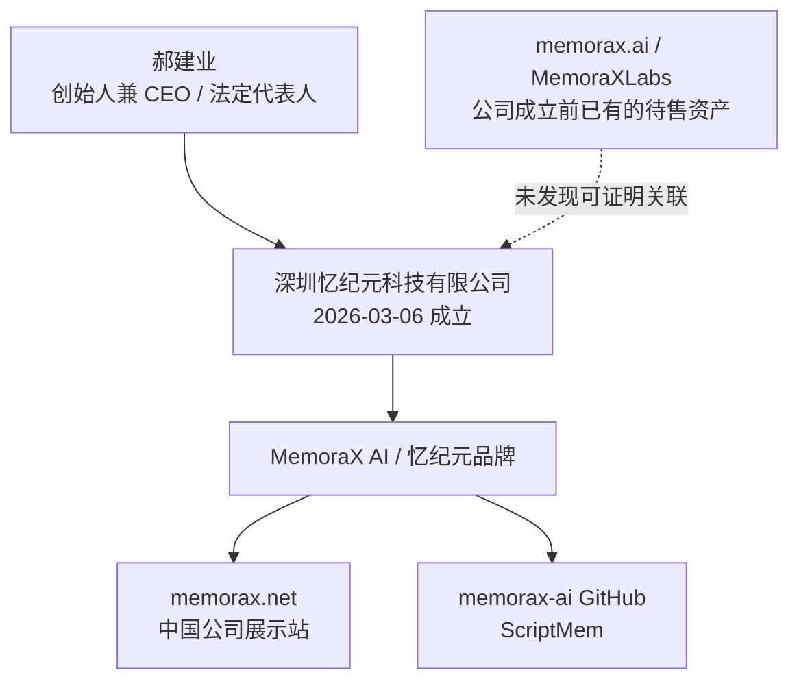
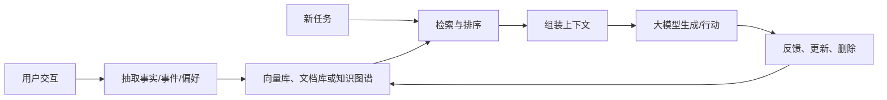

# MemoraX AI（忆纪元）公司深度分析报告

> **报告日期：** 2026-07-21  
> **研究对象：** MemoraX AI / 忆纪元，以及公开可对应的法人主体“深圳忆纪元科技有限公司”  
> **研究目的：** 求职、面试、Offer 决策及业务合作前尽调，重点核验公司主体、创始人、融资、技术可信度、产品成熟度、商业化、数据治理和组织风险  
> **来源等级：** A = 政府、监管、学术身份库或可复核的原始数据；B = 公司官网、代码仓库、公开基准；C = 投资机构、主流媒体或创投媒体；D = 招聘及工商聚合平台；E = 基于公开事实的分析推断  
> **重要限制：** 该公司成立时间很短，未上市公司的股权、资金到账、财务、客户合同和劳动条件不完整公开。融资及性能数据大量来自公司或财务顾问口径；“未找到”不等于“绝对不存在”。本报告不是审计、法律或投资意见。

---

## 一、执行摘要

### 1.1 一句话判断

> **MemoraX AI 是一家创始人学术与产业履历较强、融资速度快、切入问题有真实价值，但截至 2026-07-21 成立仅约四个半月、公开产品仍处技术验证期、融资和领先指标主要来自公关稿及团队相关基准的新公司。它值得强化学习、后训练和 Agent Memory 候选人继续面试，但应按“高潜、高波动、尚未证明商业闭环的早期技术创业公司”评估，不能按成熟 AI 基础设施平台定价。**

### 1.2 核心结论

| 维度 | 核验结论 | 置信度 |
|---|---|---:|
| 主体真实性 | 深圳忆纪元科技有限公司可由招聘/工商聚合页核到；统一社会信用代码、法人、地址完整 | 中高 |
| 成立时间 | 2026-03-06；截至报告日约四个半月 | 中高 |
| 创始人 | 郝建业，强化学习学术积累真实，天津大学和华为关联有学术数据库及多家媒体旁证 | 高（学术身份）；中高（具体职务） |
| 融资 | 公司宣布两轮累计超过 1 亿元人民币；机构组合较强，但未见投资协议、到账、估值或完整股权穿透 | 中 |
| 技术方向 | 用 Agentic RL 让记忆能力更“内生”，方向有研究价值；实际架构、模型、训练数据和成本未公开 | 中 |
| LoCoMo-Refined | 公开仓库确实列出 MemoraX 82.65%；但未公开该系统的预测、实现和复现实验 | 中（榜单存在）；低（领先可独立复现） |
| ScriptMem | 基准、题目和评测脚本真实开源；MemoraX 60.3% 由基准创建方维护的榜单给出 | 高（基准存在）；低至中（成绩独立性） |
| SWE-context-bench | 融资稿称 45% 任务解决率；未找到对应官方公开仓库、数据、提交或完整评测协议 | 低 |
| 论文成果 | 媒体称 10 篇论文入选 ICML 2026；公开稿未列论文题目、作者和与公司的权属关系 | 低至中 |
| 产品成熟度 | 官网为营销展示页；无可注册产品、API 文档、价格、客户案例、登录或有效法律文本 | 高 |
| 商业化 | B 端与 C 端均在规划；收入、客户、合同、付费率、毛利和续费均无公开证据 | 高（未知） |
| 团队扩建 | 猎聘公开算法招聘专家职位，说明正在建设技术人才招聘能力；当前人数和完整岗位仍未知 | 中高 |
| 求职判断 | 值得继续面试；是否接 Offer 取决于产品演示、现金 runway、创始人投入、IP、期权和工时核验 | 中高 |

### 1.3 最强正面信号

1. **创始人的专业方向与公司命题高度匹配。** 郝建业的主要研究脉络就是强化学习、多智能体和决策智能，不是临时追逐 Memory 概念。[S3][S10-S13]
2. **投资机构信号较强。** 公司宣布的两轮投资方包括 L2F 光源创业者基金、钟鼎资本、中金资本、达泰资本和华业天成。[S3-S5]
3. **Agent Memory 是真实需求。** 长期 Agent 必须处理偏好、事件、时间变化、冲突信息、遗忘和跨任务复用；这不是人为制造的问题。
4. **存在真实公开研究产出。** ScriptMem 和 LoCoMo-Refined 均可下载数据与评测代码，至少说明团队不是纯 PPT 项目。[S6-S8]
5. **研究与工程人才仍在扩建。** 唯一公开职位是算法招聘专家，职责覆盖算法人力规划、顶会和硕博招聘、竞对人才地图及高端人才挖猎。[S18]
6. **成立后融资和发布节奏快。** 从 3 月成立，到 4 月首轮、5 月种子+及两个基准，体现较强的融资、组织与外部传播能力。[S1][S3][S5-S8]

### 1.4 核心风险

1. **公司历史极短。** 四个半月不足以验证产品、客户留存、组织稳定性和商业模式。
2. **产品证据明显弱于融资声量。** 官网没有注册、API、定价、文档、客户案例或有效联系入口；公司自己也在 4 月预计“未来 12 个月”才推出首批标准化产品。[S2-S4]
3. **核心技术没有开放验证。** 未找到 MemoraX 模型权重、训练代码、核心论文、API、白皮书或可复现实验。
4. **基准存在利益相关。** ScriptMem 由团队参与创建，团队又在自有榜单排名第一；LoCoMo-Refined 的组织和提交身份披露也很有限。[S7][S8]
5. **融资不等于可用现金。** “千万美元”“累计超 1 亿元”是公司宣布和媒体披露，无法据此推导到账、估值、月度 burn 或 runway。[S3-S5]
6. **B 端和 C 端同时推进，早期战线过宽。** 企业知识管理、客服、Coding、个人助理、数字陪伴和终端的产品、渠道、合规及销售模式差异很大。
7. **记忆数据天然高敏感。** 长期偏好、工作记录、关系和对话比普通单轮提示词更敏感，而官网尚无可用隐私政策、删除机制或安全说明。[S2]
8. **“内生记忆”更难删除和审计。** 如果个体信息进入参数、适配器或持续训练流程，用户撤回、纠错、隔离和可证明删除会比外部数据库更难。
9. **品牌域名存在混淆。** `memorax.ai` 是另一方在公司成立前维护的概念规范和待售品牌资产，公开标价 40 万美元；中国公司的展示站实际为 `memorax.net`。[S2][S14-S16]
10. **实际用工条件不透明。** 招聘页提到“弹性工作、加班关怀、深夜打车报销”和“高目标压力”，但没有算法岗薪酬、期权、奖金、社保或工时数据。[S18]

### 1.5 结论先行：要不要去

**建议继续面试，但不建议只因创始人和融资直接接 Offer。**

更适合：

- 强化学习、后训练、长上下文、Agent Memory、模型评测和研究工程候选人；
- 希望在技术路线尚未固化时获得大范围影响力的人；
- 能承受产品方向改变、研究工程化压力、流程不成熟和较大结果波动的人；
- 把技术成长和潜在上行放在短期稳定性之前的人。

需要谨慎：

- 把稳定工时、成熟管理、明确晋升和可预测奖金放在首位的人；
- 期望加入已有大规模客户、稳定 API 和成熟平台工程的候选人；
- 岗位需要处理用户长期记忆或企业私有数据，但公司无法展示隔离、删除、审计和事故响应方案；
- 招聘方只讲“融资过亿”和 SOTA，不愿展示产品、客户、成本或复现实验。

---

## 二、主体、工商与研究边界

### 2.1 法人主体

招聘平台的工商聚合信息显示：[S1]

| 项目 | 信息 |
|---|---|
| 公司全称 | 深圳忆纪元科技有限公司 |
| 品牌 | MemoraX AI / 忆纪元 |
| 统一社会信用代码 | `91440300MAK7NJ3812` |
| 成立日期 | 2026-03-06 |
| 法定代表人 | 郝建业 |
| 注册资本 | 134.50 万元人民币 |
| 企业类型 | 有限责任公司（港澳台投资、非独资） |
| 经营状态 | 存续 |
| 登记机关 | 深圳市市场监督管理局 |
| 注册地址 | 深圳市南山区沙河街道深超总社区深湾二路 82 号神州数码国际创新中心东塔 1413 |
| 行业标签 | 计算机软件 / 软件和信息技术服务业 |
| 平台规模标签 | 1-49 人 |

经营范围覆盖 AI 基础与应用软件、算法软件、数据平台、系统集成、信息安全、软件及硬件销售等；第二类增值电信、互联网信息服务和网络文化经营属于许可项目，实际经营仍须取得相应许可。[S1]

**证据边界：**

- 上述信息来自猎聘页面中的工商聚合模块，不是本次直接调取的国家企业信用信息公示系统原档；
- `1-49 人` 是招聘平台标签，不是社保、个税或审计人数；
- 注册资本是股东承诺出资的法律口径，不能代表融资额、银行余额或可支配现金；
- “港澳台投资、非独资”提示存在相关投资主体，但公开页面没有给出股东、最终受益人和集团架构，不能自行推断具体红筹或控制关系。

### 2.2 公司年龄意味着什么

截至 2026-07-21，公司成立约 137 天。这个阶段公开信息少本身不异常，但会让以下关键问题无法通过历史数据判断：

- 产品能否稳定运行，而不是只在受控 Demo 中表现；
- 首批客户是否愿意续费、扩容或允许公开案例；
- 模型推理与训练成本能否支持毛利；
- 核心团队能否从研究协作转成产品组织；
- 决策、绩效、招聘和工程流程能否在扩张中保持稳定；
- 创始人个人资源能否转化为公司可持续的 IP、客户和管理能力。

因此，候选人应把它当作**“已经拿到强资本和强创始人信号的种子项目”**，而不是已有可验证经营历史的成熟企业。

### 2.3 公开关系图

---

## 三、官网与 `memorax.ai` 域名辨析

### 3.1 中国公司的实际公开站点是 `memorax.net`

<http://memorax.net/> 页面可以与深圳公司稳定对应：[S2]

- 标题为 `MemoraX AI — 忆纪元`；
- 创始人为郝建业；
- 页脚写 `MemoraX AI · 深圳 · 南山`；
- 技术、场景和团队描述与融资报道一致；
- 页面公开的最后修改时间为 2026-04-29。

但它当前更像融资和招聘展示页，而不是产品站：

| 检查项 | 截至 2026-07-21 的结果 |
|---|---|
| HTTPS | 握手失败；HTTP 可访问 |
| 开始试用 | 按钮无有效动作 |
| 预约演示 | 按钮无有效动作 |
| 立即联系我们 | 按钮无有效动作 |
| 注册/登录 | 未找到 |
| API 文档/SDK | 未找到 |
| 定价 | 未找到 |
| 客户案例 | 未找到 |
| 技术论文/白皮书 | 页脚链接为 `#`，无有效内容 |
| 隐私政策/服务条款/Cookie | 页脚链接均为 `#` |
| 联系邮箱/销售表单 | 未找到 |

**判断：** 该站能证明品牌、创始人和技术叙事，不能证明已有可用产品、商业客户、付费能力或合规体系。HTTP 和空法律链接也不适合承载真实用户数据。

### 3.2 `memorax.ai` 不是当前证据下的中国公司官网

搜索结果很容易把 <https://memorax.ai/> 与深圳忆纪元混在一起，但证据指向另一套资产：[S14-S16]

- 对应 GitHub 组织为 `MemoraXLabs`，最早公开提交在 2026-01-14，早于深圳公司成立；
- `/spec/` 明确称其为概念性、非实现型的 Memory Layer Specification；
- `/acquisition/` 明确写明买方“不是在收购软件”，资产包括域名、规范、品牌和社交账号；
- 公开收购价格为 **400,000 美元**；
- 社交账号统一为 `memoraxlabs`，与中国公司的 `memorax-ai` GitHub 不同。

因此，最稳妥的表述是：

> **现有证据不支持 `memorax.ai / MemoraXLabs` 与深圳忆纪元属于同一主体。深圳公司的实际展示站为 `memorax.net`。**

这不等于双方绝无授权、交易或接触，只是公开材料没有证明。对公司而言，这可能带来：

- 国际品牌搜索结果被另一方占据；
- `.ai` 域名无法直接使用或需要高价收购；
- 潜在客户误入无关页面；
- 商标、品牌和命名空间需要额外核查。

面试时应询问公司是否拥有 `MemoraX` 中英文商标、`memorax.net` 域名及 GitHub 组织，是否与 `MemoraXLabs` 存在协议或争议。

---

## 四、创始人及团队

### 4.1 郝建业的公开履历

公司和媒体对郝建业的主要履历描述为：[S2-S5]

- 2004 年进入哈尔滨工业大学计算机专业；
- 2009 年赴香港中文大学攻读博士，导师为梁浩锋；
- 后在 MIT CSAIL、新加坡科技设计大学从事博士后研究；
- 2015 年加入天津大学；
- 天津大学菁英教授、博士生导师，国家优秀青年科学基金获得者；
- 曾任华为决策与推理实验室主任、大模型算法实验室主任、医疗军团技术负责人及决策智能方向专家；
- 研究与产业经历集中于强化学习、多智能体、决策智能和大模型后训练。

官网还声称其团队/本人有 `150+` 篇 ICML、NeurIPS、ICLR 论文、4 次国际会议最佳论文奖、4 次 NeurIPS 竞赛冠军，以及特定 CSRankings 名次。[S2] 这些细项没有在官网提供逐项清单，本报告不把它们全部当作独立核验事实。

### 4.2 独立学术数据库核验

| 数据库 | 可核信息 | 截至报告日显示 |
|---|---|---:|
| ORCID | 身份标识 | `0000-0002-0422-8235` [S13] |
| DBLP | 计算机论文作者条目 | `Jianye Hao`，可见长期发表记录 [S12] |
| Semantic Scholar | 主要作者实体 | 203 篇、约 6,186 次引用、h-index 39 [S10] |
| OpenAlex | 作者归并口径 | 459 works、约 5,798 次引用、h-index 37 [S11] |
| OpenAlex 机构关联 | 历史关联 | 天津大学、华为、香港中文大学、新加坡科技设计大学等 [S11] |

这组数据足以支持“学术影响力真实且较强”。但要注意：

- Semantic Scholar 搜索结果存在多个同名或拆分作者实体；
- OpenAlex 的 works 可能包含更广文献类型和合并记录；
- 公司/媒体称 Google Scholar 引用超过 1.5 万次，与上述数据库不一致，可能来自覆盖范围、作者合并和更新时间差异；
- 引用量、论文数和排名必须始终注明数据库和日期，不能把不同口径拼成一个精确事实。

### 4.3 创始人能力与组织风险

**能力优势：**

- 强化学习研究与公司技术路线匹配；
- 同时有高校和大厂经历，理论上更理解论文、工程和产业交付之间的差距；
- 早期能吸引多家机构和高端人才关注；
- 过往产业项目为 B 端技术销售提供可信背书。

**仍需核验：**

- 创始人是否已全职投入公司，天津大学及其他职务如何安排；
- 公司核心 IP 与高校、华为、牛津合作方之间的边界；
- 谁是 CTO、首席科学家、产品负责人和商业负责人；
- 关键技术是否依赖创始人及少数学生/合作研究者；
- 论文成果如何转让或许可给公司；
- “过往项目创造的经济价值”是个人、原单位还是新公司的成果，不能混为公司业绩。

### 4.4 当前团队与招聘信号

猎聘把公司标为 `1-49 人`，目前公开职位页只显示 1 个“算法招聘专家”岗位，薪酬 15-23K，要求本科、3-5 年 AI/大模型算法招聘经验。[S1][S18]

岗位职责包括：

- 参与算法团队全年人力计划；
- 建立关键岗位画像、招聘策略和人才库；
- 负责高端算法人才挖猎；
- 追踪 AI、大模型、具身智能竞对组织和薪酬；
- 组织顶会、AI 学术论坛及硕博招聘；
- 对招聘漏斗、到岗周期和渠道 ROI 负责。

岗位还明确出现“能承受高目标压力”“弹性工作”“加班关怀”“深夜打车报销”等表述。[S18]

**解读：**

- 正面看，公司准备系统扩建算法团队，而不是只靠创始人临时招人；
- 反面看，专职招聘能力还在搭建，组织可能处于快速扩张和制度建设并行阶段；
- 深夜打车报销通常意味着晚间工作确实可能发生，不能把“弹性”理解为低强度；
- 公开职位少不等于只有一个岗位，也不能反向证明团队冻结招聘。

---

## 五、融资核验

### 5.1 时间线

| 时间 | 公司/媒体披露 | 投资方 | 证据性质 |
|---|---|---|---|
| 2026-04-28 | 千万美元种子轮 | L2F 光源创业者基金、钟鼎资本联合领投；知名投资人及产业方参与；光源资本担任财务顾问 | 投资界原创报道；36氪稿件作者为光源资本 [S3][S4] |
| 2026-05-20 | 数千万元人民币种子+轮 | 中金资本、达泰资本、华业天成联合领投；光源资本独家财务顾问 | 投资界根据公司宣布报道 [S5] |
| 2026-05-20 | 两轮累计超过 1 亿元人民币 | 同上 | 公司/媒体口径，非审计财务 [S5] |

两轮公开日期只相隔 22 天。可能的解释包括：连续交割、分批关闭、追加轮次或快速加注；公开材料不足以判断具体结构。

### 5.2 融资信号如何解读

**正面：**

- 多家投资机构共同下注，显著降低“无人认可的概念项目”概率；
- 两轮迅速完成，说明创始人、技术方向和早期团队具备较强募资能力；
- 机构组合可能帮助企业客户、产业资源、后续融资和人才引进。

**不能推出：**

- 资金已全部到账；
- 当前账户仍有超过 1 亿元；
- 公司估值、稀释和员工期权价格合理；
- 已有收入或客户；
- runway 足够两年以上；
- 下一轮融资一定能完成。

### 5.3 求职时需要的资本问题

1. 两轮融资各自的签约和到账日期是什么？
2. 是同一轮分批关闭，还是价格和估值不同的两轮？
3. 当前月度净 burn、账面现金和保守 runway 各是多少？
4. 未来 12 个月最大支出是算力、薪酬、数据、销售还是硬件？
5. 134.50 万元注册资本对应哪一层主体？融资资金在哪个境内外主体？
6. 员工劳动合同、发薪、社保和期权授予主体分别是谁？
7. 期权按哪一层 fully diluted 股本计算，行权价、归属和离职窗口如何规定？

如果招聘方只重复“融资过亿”，却不能给出 runway 的区间、资金主体和期权基数，应把财务透明度列为高风险。

---

## 六、技术路线：它究竟想解决什么

### 6.1 传统 Agent Memory 的基本链条

多数“外挂式”记忆系统大致如下：

优点是可插拔、可审计、易删除、模型无关；缺点是抽取错误、检索噪声、上下文膨胀和“知道但不会用”。

### 6.2 MemoraX 的公开主张

MemoraX 称其用 Agentic RL 将个性化记忆能力内化到模型，使系统学习：[S2-S5]

- 什么值得记住；
- 什么已经过时或应被遗忘；
- 何时召回哪段记忆；
- 如何把长期经验用于当前行动；
- 如何跨任务、跨场景复用。

官网把技术拆成：精准记忆编码、动态记忆检索和混合记忆系统。[S2] 这意味着实际产品很可能不是“完全不要外部存储”，而是把外部存储、检索与经过强化学习优化的模型策略组合起来。

### 6.3 为什么这条路线有价值

1. **检索不是最终目标。** Agent 需要用记忆改变计划和行动，而不只是把历史文本塞进提示词。
2. **长期对话存在状态变化。** 用户职业、偏好、关系和事实会更新，不能永久保留旧结论。
3. **记忆有价值密度差异。** 全量存储会增加延迟、成本和错误召回。
4. **个性化需要策略。** 相同事实对不同任务的重要性不同，需要学习召回和使用策略。
5. **企业经验可复用。** 如果能把解决路径沉淀为可迁移经验，价值高于简单知识库问答。

### 6.4 技术难点和反证条件

| 难点 | 为什么关键 | 面试应要求的证据 |
|---|---|---|
| 灾难性遗忘 | 新记忆可能破坏旧能力 | 连续学习曲线、回归集、能力保持率 |
| 错误固化 | 错误记忆进入模型后更难纠正 | 纠错、版本化、来源追踪和回滚演示 |
| 用户删除 | 参数化记忆不易精确移除 | 删除 SLA、机器遗忘或隔离架构 |
| 多租户隔离 | B 端不能泄露其他客户记忆 | tenant boundary、权限和红队结果 |
| 训练成本 | 持续适配可能吞噬毛利 | 每千用户/每百万记忆的 GPU 成本 |
| 模型兼容 | 绑定特定底模会削弱平台价值 | 支持底模、迁移成本和质量对比 |
| 可解释性 | 企业需要知道回答用了什么记忆 | provenance、审计日志和证据链 |
| 延迟 | 编码、检索、重排和更新都会增加耗时 | P50/P95/P99 与基线对比 |
| 记忆投毒 | 攻击者可植入长期错误指令 | 可信来源、隔离、衰减和冲突检测 |
| 评测外泛化 | 在一个基准领先不等于生产领先 | 多域、长周期、真实客户盲测 |

技术优势真正成立，至少需要同时证明：**更准、更便宜、更快、可删、可审计、跨模型、跨任务，而且不会明显损伤基础能力。** 当前公开材料只提供了部分准确率叙事。

---

## 七、性能指标与可复现性审查

### 7.1 公司披露的主要指标

| 指标 | 宣传结果 | 当前可核证据 | 结论 |
|---|---:|---|---|
| LoCoMo-Refined | 82.65%，比第二名高约 30% | 基准公开仓库列出该成绩 [S8] | 榜单存在；系统不可复现 |
| 训练效率 | 提升 400 倍 | 融资稿和投资方表述 [S3-S5] | 缺基线、硬件、成本和口径 |
| ScriptMem | 60.3%，第二名 42.9% | 公司 GitHub 榜单 [S7] | 基准可运行；领先结果不可独立复现 |
| SWE-context-bench | 45% 任务解决率，比第二名高约 50% | 种子+融资报道 [S5] | 未找到对应官方公开仓库 |
| ICML 2026 | 10 篇论文入选 | 种子+融资报道 [S5] | 未提供论文清单和公司贡献边界 |

“比第二名高 30%”还需区分相对提升与百分点提升。LoCoMo-Refined 公开表中 MemOS 为 63.60%，MemoraX 为 82.65%，差 19.05 个百分点；相对 MemOS 约高 30%。不能写成“高 30 个百分点”。[S8]

### 7.2 LoCoMo-Refined 审查

公开仓库 `mem-eval-suite/LoCoMo_refined` 提供：[S8]

- 1,382 个问题；
- 337 个经修订样本；
- 原始及公开数据；
- Qwen3-14B 评判器；
- F1、BLEU 和 LLM judge 代码；
- MemoraX 82.65% 的榜单记录。

但当前仓库没有：

- MemoraX 的实现、权重或 API；
- MemoraX 的完整预测文件；
- 训练配置、超参数和硬件；
- 独立第三方复现实验；
- 盲测提交机制和可验证提交记录；
- 清晰的作者、机构和利益关系披露。

这说明 **82.65% 是可定位的公开榜单声明，比单纯新闻稿更强；但仍不能由外部研究者从头复现。**

### 7.3 ScriptMem 开源审计

`memorax-ai/ScriptMem` 是公司 GitHub 组织目前唯一公开仓库，创建于 2026-05-07；截至报告日约 14 stars、1 fork、1 个 issue，仓库只有一个初始提交。[S6][S7]

它提供：

- 457 道题；
- 四部剧本/作品来源；
- 单选、多选、排序三类答案；
- 用户画像、事件跟踪、时间演化、社交关系、细粒度事实和经验六类能力；
- 数据、参考答案、提交模板和评测脚本；
- GPT-4o-mini 统一主干下的排行榜。

公开排行榜：[S7]

| 方法 | 准确率 |
|---|---:|
| MemoraX | 60.3% |
| EverMemOS | 42.9% |
| Mem0 | 42.0% |
| MemOS | 36.4% |
| M-Flow | 32.6% |

关键局限：

- 原始剧本文本因版权原因不在仓库中；
- 没有 MemoraX 方法实现；
- 没有各系统完整预测提交；
- 没有从数据构建到所有系统结果的端到端复现脚本；
- 榜单由基准创建方维护，而创建方自己的方法排名第一；
- README 称由 MemoraX AI 与牛津大学共同构建，但仓库未给作者、牛津单位主页或论文，合作关系尚不能独立穿透；
- 基准截至当前社区规模很小，尚未形成广泛外部验证。

**合理评价：** ScriptMem 能证明团队有真实基准设计和开源交付能力，不能单独证明商业系统在真实生活或企业场景领先 40%。

### 7.4 SWE-context-bench 审查

融资稿称公司与牛津大学构建并开源 `SWE-context-bench`，MemoraX 达到 45% 任务解决率。[S5] 但本次按准确名称搜索 GitHub，没有找到可对应的官方仓库；MemoraX GitHub 组织也只有 ScriptMem 一个公开仓库。[S6][S9]

可能原因包括尚未发布、改名发布、私有仓库或搜索未收录。报告只能写成：

> **公司/融资稿宣称存在该基准和成绩，但截至 2026-07-21 未完成公开核验。**

### 7.5 评测可信度分层

| 级别 | 证据状态 | 当前项目 |
|---|---|---|
| L0 | 只有口头/新闻稿数字 | SWE-context-bench、400 倍训练效率、10 篇 ICML 论文清单 |
| L1 | 有公开榜单，无预测或实现 | LoCoMo-Refined 的 MemoraX 结果 |
| L2 | 有数据和评测代码，无方法实现/完整提交 | ScriptMem |
| L3 | 有方法论文、代码、权重和完整预测，可外部复现 | 暂未达到 |
| L4 | 第三方盲测和真实客户长期 A/B 验证 | 暂无公开证据 |

公司当前最强的公开证据约在 L1-L2。求职者面试时最有价值的动作，不是争论 SOTA，而是要求看一份可复现的实验包或现场盲测。

---

## 八、产品成熟度与商业化

### 8.1 当前产品阶段

可把 AI 基础设施早期成熟度简化为：

| 阶段 | 标志 | MemoraX 当前公开证据 |
|---|---|---|
| 0. 概念 | 方向、团队和融资叙事 | 已超过 |
| 1. 研究验证 | 基准、离线实验、内部 Demo | 已达到 |
| 2. 可试用产品 | 注册、API、SDK、文档、配额 | 未公开 |
| 3. 设计伙伴 | 可核验客户、试点、SLA | 未公开 |
| 4. 可重复销售 | 标准价格、合同、续费、毛利 | 未公开 |
| 5. 规模化 | 多行业复制、可靠性和合规认证 | 未公开 |

因此更合适的判断是：**公开状态处于研究验证，尚未证明进入可重复产品阶段。**

这与公司 2026-04 的说法并不冲突：融资稿预计未来 12 个月推出面向 B 端企业知识管理和 C 端个性化交互的首批标准化产品。[S3][S4] 若以该时间点计算，关键观察窗口在 2027-04 前后。

### 8.2 潜在商业模式

可能路径包括：

| 模式 | 收费方式 | 优点 | 主要难点 |
|---|---|---|---|
| Memory API / SDK | 调用量、存储量、活跃用户 | 易集成、可规模化 | 与 Mem0、Zep 及大模型厂商直接竞争 |
| 企业私有化 | 项目费、许可费、年维护 | 客单高、数据可控 | 交付重、版本碎片化、回款慢 |
| 行业解决方案 | 席位、项目或效果收费 | 能展示业务 ROI | 易变成定制外包 |
| C 端助手/陪伴 | 订阅、增值服务 | 数据和使用频率高 | 获客、内容安全、隐私和留存困难 |
| 终端合作 | 授权、设备分成 | 进入高频入口 | 硬件周期长、议价权弱 |

公司同时讲 B 端与 C 端，早期看似市场空间大，实际会稀释：产品设计、销售团队、数据授权、模型部署、客服、安全标准和增长方式。最重要的战略问题是 **未来 12 个月只用哪一个场景证明 PMF。**

### 8.3 商业闭环需要回答的指标

公开材料没有收入、客户或价格，因此面试时应问：

- 现在有多少付费客户、付费设计伙伴和免费 PoC？
- 客户是谁不能公开时，能否给行业、规模、合同区间和使用频率？
- PoC 到付费、付费到续费的转化分别如何？
- 客户为什么不直接用向量数据库、Mem0、Zep 或大模型厂商自带记忆？
- 单次记忆写入、检索和更新成本是多少？
- 毛利中最大成本是 GPU、基础模型 API、数据标注还是私有化交付？
- 产品提升的是任务成功率、客服解决率、Coding 速度、留存还是收入？
- 销售周期和部署周期多长？

如果这些问题仍只能回答“正在接触”，公司就仍是技术验证阶段；这本身不等于不值得加入，但薪酬、期权和风险预期必须匹配。

---

## 九、竞争格局

### 9.1 直接与替代竞争者

| 类别 | 代表 | 核心特点 | 对 MemoraX 的压力 |
|---|---|---|---|
| 通用记忆层 | Mem0 | 开源 + 托管，接口简单，生态声量大 | 先发、社区、开发者采用 |
| 时序知识图谱 | Zep / Graphiti | 实时实体、关系和时间演化 | 可解释、可查询、易审计 |
| 有状态 Agent | Letta / MemGPT | Agent 状态和分层记忆 | 完整 Agent 运行时竞争 |
| 记忆操作系统 | MemOS / EverMemOS | 混合检索、跨任务复用 | 技术叙事与评测直接重叠 |
| 框架组件 | LangMem | 与 LangGraph/LangChain 生态结合 | 集成入口和开发者分发 |
| 基础数据库 | 向量库、搜索、图数据库 | 成熟、便宜、可控 | 企业可能自行搭建 |
| 大模型厂商 | OpenAI、Anthropic、Google 等 | 可把记忆做成模型/产品原生能力 | 独立中间层空间被压缩 |

截至报告日，GitHub 公开数据约为：Mem0 6.1 万 stars、Graphiti 2.9 万、Letta 2.4 万、MemOS 1.0 万；而 ScriptMem 约 14 stars。[S6][S17] Star 不等于收入、质量或生产采用，但足以说明 MemoraX 尚未建立同等级开发者生态。

### 9.2 MemoraX 的潜在差异化

如果其内生路线成立，可能优势是：

- 不只“找回事实”，还能让 Agent 学会如何使用经验；
- 减少上下文拼接和无关检索；
- 在长期任务中持续适应用户与环境；
- 把记忆编码、召回和决策放在统一训练目标中优化；
- 在 Coding、陪伴或企业专家等场景形成更强行为连续性。

但客户不会为“内生”这个术语付费，而会为以下结果付费：

- 任务成功率提升多少；
- 延迟和 token 成本下降多少；
- 接入现有模型需要几天；
- 能否部署在客户 VPC 或本地；
- 数据能否删除、回滚和审计；
- 替换底模是否要重训；
- 出错时是否能定位到具体记忆。

### 9.3 结构性威胁

1. **大模型厂商内建记忆。** 若底模和助手平台直接提供可靠长期记忆，独立中间层必须提供跨模型、中立部署或更强行业效果。
2. **开源方案足够好。** 对许多客户而言，80 分的可控、低成本系统可能优于 90 分但不可解释的训练方案。
3. **云厂商捆绑。** 数据库、搜索、模型和安全控制可以打包销售，初创公司获客成本更高。
4. **评测快速商品化。** 竞争者可以针对公开基准优化，SOTA 的营销半衰期很短。
5. **服务化陷阱。** 为每个客户训练和部署专用系统，会提高收入但限制毛利和扩张速度。

---

## 十、数据、隐私与安全风险

### 10.1 为什么 Memory 比普通聊天更敏感

长期记忆系统可能持续积累：

- 身份、偏好、健康、财务和关系；
- 企业会议、客户、合同和源代码；
- 用户行为模式、弱点和决策轨迹；
- 已删除或已经变化的历史事实；
- 多来源推断出的画像，而不只是用户主动提交的数据。

一旦这些数据用于检索、知识图谱、微调、强化学习或参数适配，数据生命周期会变复杂。

### 10.2 上线前应具备的控制

| 控制 | 最低要求 |
|---|---|
| 数据最小化 | 明确哪些内容不应进入长期记忆 |
| 用户可见性 | 能查看、导出、纠错和删除记忆 |
| 来源追踪 | 每条记忆关联原始事件、时间和权限 |
| 冲突处理 | 新旧事实冲突时可版本化而非静默覆盖 |
| 权限隔离 | 用户、部门、租户和环境分级 |
| 加密 | 传输、存储、密钥轮换和客户自管密钥 |
| 训练边界 | 默认是否用于训练，如何 opt out |
| 删除证明 | 数据库、缓存、日志、备份和模型适配器的删除范围 |
| 安全测试 | 记忆投毒、提示注入、越权召回和数据外泄红队 |
| 事故响应 | 检测、隔离、通知、取证和恢复流程 |

### 10.3 当前公开缺口

`memorax.net` 的隐私政策、服务条款和 Cookie 链接都是空链接，未公开：[S2]

- 数据控制者和处理者；
- 数据保存时间；
- 第三方模型与云服务商；
- 跨境数据路径；
- 用户删除和训练退出机制；
- 企业 DPA、SLA、子处理者和安全认证；
- 未成年人、医疗、金融等敏感场景规则。

在没有真实产品时，这些缺口可以理解；但在接触真实客户或用户前必须补齐。对于求职者，若岗位要立即处理生产数据，而公司仍没有这些基础治理，应视为高风险。

---

## 十一、组织与求职适配

### 11.1 可能的工作环境

根据公司年龄、招聘文案和技术目标，较可能出现：

- 研究、工程、产品边界频繁交叉；
- 论文和基准需要快速转成 Demo、SDK 和客户 PoC；
- 优先级随融资、客户和竞争变化；
- 少数人承担关键系统和领域知识；
- 招聘速度快于流程、文档和管理成熟速度；
- 对候选人的自主性、技术判断和交付速度要求高；
- 晚间工作和高目标压力并非偶发可能。[S18]

这是早期公司的合理推断，不是已核实的员工体验。需要通过同岗位成员访谈、面试安排和合同确认。

### 11.2 岗位适配

| 岗位 | 机会 | 主要风险 | 建议 |
|---|---|---|---|
| 强化学习/后训练 | 方向核心、创始人指导价值高 | 目标频繁变化、成果权属 | 强烈建议面试 |
| Agent Memory/评测 | 有基准和真实研究问题 | 自建评测偏差、产品化压力 | 建议面试，要求复现实验 |
| 研究工程 | 从论文到系统的影响力大 | 技术债、算力和数据约束 | 适合强执行候选人 |
| 平台/基础设施 | 可从零搭建训练与服务平台 | 产品未定、SLA 尚未验证 | 核查资源和负责人 |
| 数据/安全/隐私 | 问题重要、能建立核心能力 | 制度与授权可能滞后 | 需要管理层明确支持 |
| 产品经理 | 可定义新品类 | B/C 端分散、PMF 未证 | 要求明确单一主战场 |
| 商务/销售 | 强创始人和机构背书 | 无标准产品、交付边界不清 | 核查销售材料和回款 |
| 稳定维护型岗位 | 目前价值和边界不明确 | 变化大、流程早期 | 谨慎 |

### 11.3 薪酬和期权原则

- 现金薪酬不应因为“有期权”明显低于个人可接受下限；
- 期权必须写明授予主体、数量、fully diluted 比例、行权价、vesting、cliff、离职窗口和回购条款；
- “融资过亿”不能替代书面奖金、调薪和期权文件；
- 试用期薪资、加班补偿、社保公积金基数、竞业限制及补偿应写入文件；
- 若劳动合同主体与持有 IP、融资和期权的主体不同，应取得清晰的集团关系解释；
- 对教授型创始人公司，应额外核查职务发明、学校合作成果和员工论文发表规则。

---

## 十二、SWOT

| | 正面 | 负面 |
|---|---|---|
| **内部** | **Strengths**：创始人强化学习积累强；学术与产业交叉；融资机构组合较好；公开基准显示研发执行力 | **Weaknesses**：公司历史极短；无公开产品/API/客户；技术实现不开放；官网和合规基础薄弱；团队规模与核心管理层不透明 |
| **外部** | **Opportunities**：Agent 长期任务、企业知识、Coding 和个性化助手都需要记忆；大模型从聊天向持续行动迁移 | **Threats**：Mem0/Zep/Letta 等先发；大模型厂商原生记忆；数据监管；基准快速失效；品牌域名冲突；早期融资环境变化 |

---

## 十三、风险矩阵

| 风险 | 概率 | 影响 | 等级 | 观察/缓释方式 |
|---|---:|---:|---:|---|
| 产品无法在 12 个月内标准化 | 中高 | 高 | **高** | 看 API、文档、稳定 Demo 和正式版本计划 |
| 基准领先无法外部复现 | 高 | 高 | **高** | 要完整预测、实现、盲测和第三方报告 |
| B/C 双线导致资源分散 | 中高 | 高 | **高** | 明确唯一主战场、负责人和里程碑 |
| 客户和收入不足 | 中 | 高 | **高** | 核查付费客户、合同区间、续费和 PoC 转化 |
| 数据删除/隔离失败 | 中 | 极高 | **高** | 架构、安全评估、DPA、删除演示 |
| 持续训练成本过高 | 中高 | 高 | **高** | 单位经济、GPU 成本、缓存和模型策略 |
| 核心 IP 权属不清 | 中 | 高 | **高** | 高校/原单位/合作方协议、专利和代码归属 |
| 创始人非全职或过度依赖 | 中 | 高 | **高** | 时间投入、授权机制、二号位和决策流程 |
| 融资到账/runway 不及预期 | 中 | 高 | **高** | 现金区间、burn、到账主体和预算 |
| 大模型厂商功能替代 | 中高 | 高 | **高** | 跨模型中立、私有化、成本和行业壁垒 |
| 品牌/域名混淆 | 中 | 中 | **中** | 商标清单、域名策略、与 MemoraXLabs 关系 |
| 高强度导致人员流失 | 中高 | 中高 | **中高** | 团队 tenure、离职率、on-call 和加班制度 |
| 招聘平台工商数据误差 | 低至中 | 中 | **中** | Offer 前核对营业执照和官方工商档案 |

---

## 十四、面试核验问题

### 14.1 必问：产品与客户

1. 能否现场演示从记忆写入、更新、冲突、召回到删除的完整流程？
2. 当前是内部 Demo、私测、设计伙伴、付费 PoC 还是正式商用？
3. 有多少付费客户、试点客户和活跃终端用户？
4. 未来 12 个月只聚焦哪一个场景，为什么不是其他场景？
5. 客户用 MemoraX 后，哪一个业务指标发生了多少变化？
6. 标准产品与定制交付分别占多少研发投入？
7. 2027 年 4 月前“首批标准化产品”的验收标准是什么？

### 14.2 必问：技术和评测

1. `82.65%` 对应的模型、数据版本、预测文件和评测 commit 是什么？
2. 为什么 LoCoMo-Refined 仓库没有公开 MemoraX 完整预测？能否现场复跑？
3. `训练效率提升 400 倍` 的分母是什么：样本、step、GPU 小时、wall time 还是成本？
4. ScriptMem 是否有隐藏测试集、盲测服务器或外部提交者？
5. SWE-context-bench 的官方仓库、数据许可和完整排行榜在哪里？
6. “10 篇 ICML 2026”分别是什么论文，哪些 IP 属于公司？
7. 记忆究竟进入基础模型参数、LoRA/adapter、外部存储，还是混合架构？
8. 换底模时要重训什么，成本和效果如何变化？
9. 连续学习后基础能力回归如何控制？
10. 生产环境 P50/P95 延迟、单位成本和失败率是多少？

### 14.3 必问：数据与安全

1. 用户能否查看、纠错、导出和删除单条记忆？
2. 如果信息进入参数，如何证明删除？
3. 多租户如何做存储、检索、训练和日志隔离？
4. 是否默认用客户数据训练？客户如何退出？
5. 使用哪些第三方模型、云、数据标注和子处理商？
6. 如何防止记忆投毒、提示注入和跨用户召回？
7. 是否支持 VPC、本地部署、客户自管密钥和审计日志？
8. 隐私政策、DPA、SLA 和安全白皮书何时上线？

### 14.4 必问：组织与个人发展

1. 创始人每周在公司的投入比例和决策职责是什么？
2. 我的直属上级、同组人数和未来半年 headcount 是多少？
3. 研究、产品和客户需求冲突时谁定优先级？
4. 团队最近三个月有人离职吗？原因是什么？
5. 论文发表、开源、专利和署名规则是什么？
6. 晚间和周末工作的实际频率如何？是否有 on-call？
7. 试用期前三个月的明确交付和淘汰标准是什么？
8. 如果技术路线从“内生”改成混合架构，岗位是否仍然存在？

### 14.5 必问：融资、合同与期权

1. 两轮融资是否已全部到账，资金在哪个主体？
2. 当前现金 runway 在保守预算下有多少个月？
3. 劳动合同、发薪、社保、IP 和期权分别属于哪个主体？
4. 期权数量对应 fully diluted 的百分比是多少？
5. 最近一轮估值、行权价和清算优先权如何影响普通股？
6. 离职后行权窗口、回购价格、加速归属和 bad leaver 条款是什么？
7. 是否有竞业限制，期限、范围及补偿是多少？

---

## 十五、Offer 前应索取或现场查看的证据

按优先级排序：

### P0：不核清不建议签

- 营业执照及劳动合同主体；
- 书面 Offer：固定薪资、试用期、奖金、社保公积金、工作地点；
- 直属上级、岗位目标和试用期验收；
- 可工作的真实产品演示；
- 当前现金 runway 的可信区间；
- 期权授予主体、数量和 fully diluted 比例；
- IP/竞业/保密协议全文；
- 创始人全职投入和汇报关系。

### P1：技术岗位应核

- LoCoMo-Refined 或 ScriptMem 的完整复现实验；
- 模型、数据、训练平台和算力预算；
- 线上架构、监控、事故和回滚流程；
- 数据来源、许可和删除方案；
- 公司、高校、原单位及合作方之间的 IP 边界；
- 论文、开源和专利署名政策。

### P2：判断长期价值

- 付费客户或设计伙伴的匿名画像；
- 12 个月产品和融资里程碑；
- 管理层和核心团队完整名单；
- 历史离职、调薪和绩效周期；
- 商标、域名及海外主体规划。

---

## 十六、未来 6-12 个月观察指标

| 时间窗口 | 应出现的正面证据 | 若持续缺失意味着什么 |
|---|---|---|
| 1-3 个月 | 有效 HTTPS、联系入口、团队与论文清单 | 基础对外运营仍未补齐 |
| 3-6 个月 | API/SDK/文档、可试用 Demo、方法论文或可复现提交 | 技术仍停留在公关和基准叙事 |
| 6-9 个月 | 设计伙伴、匿名效果报告、安全/隐私文本 | B 端落地与合规进度偏慢 |
| 9-12 个月 | 标准化产品、付费客户、稳定性和单位经济指标 | 未兑现融资时的产品承诺 |
| 下一轮融资前 | 更透明的产品、团队、客户和技术证据 | 下一轮可能继续依赖创始人和概念溢价 |

---

## 十七、综合结论

### 17.1 对公司的最终评价

MemoraX AI 的“强”主要体现在三点：

1. 创始人在强化学习方向的真实积累；
2. 成立极早期即获得多家机构支持；
3. 团队围绕 Agent Memory 已经交付了公开基准和可见结果。

它的“不确定”也集中在三点：

1. 核心方法没有达到外部可复现；
2. 标准产品、客户和收入没有公开证据；
3. 数据治理、组织能力和商业聚焦仍待建立。

所以最准确的定位不是“已经领先的 AI 记忆平台”，而是：

> **一家由强学术/产业创始人带队、资本信号强、在 Agent Memory 上进行研究到产品转化、但尚未证明 PMF 和规模化能力的种子期公司。**

### 17.2 对求职者的最终建议

**值得继续面试。** 对强化学习、后训练、Agent Memory、评测和研究工程岗位，创始人方向匹配和早期影响力都有吸引力。

**接 Offer 前必须核验。** 至少要看真实产品、一个可复现实验、客户/收入阶段、现金 runway、核心 IP、创始人投入、期权文件和实际工时。

**不要用以下逻辑做决定：**

- “融资过亿，所以现金一定安全”；
- “创始人论文强，所以产品一定成功”；
- “自建榜单第一，所以生产效果一定领先”；
- “注册资本小，所以没有融资”；
- “官网写内生记忆，所以完全不使用外部存储”；
- “有顶级机构，所以劳动条件和期权条款自然合理”。

在拿到上述证据前，建议把机会定价为：**技术成长潜力高、履历稀缺度高、产品与组织风险也高。**

---

## 十八、来源与检索记录

> 所有页面最后访问日期均为 2026-07-21。动态数字会变化；GitHub stars 仅为当日快照。

### 主体、官网与招聘

- **[S1]** 猎聘，深圳忆纪元科技有限公司企业页：<https://www.liepin.com/company/21427889/>  
  用于主体名称、成立日期、统一社会信用代码、法人、注册资本、类型、状态、地址、经营范围和规模标签。属于工商聚合来源。
- **[S2]** MemoraX AI 中国公司展示站：<http://memorax.net/>  
  用于品牌、创始人、技术路线、场景、网站功能和法律链接核验。
- **[S18]** 猎聘，算法招聘专家职位：<https://www.liepin.com/job/1981747369.shtml>；公司职位页：<https://www.liepin.com/company-jobs/21427889/>  
  用于岗位、薪酬、职责、压力及福利文案。

### 融资与公司口径

- **[S3]** 投资界，2026-04-28，《首发｜华为大牛深圳创业，MemoraX AI 首轮融资千万美元》：<https://news.pedaily.cn/202604/563253.shtml>
- **[S4]** 36氪，2026-04-28，《MemoraX AI 完成千万美金种子轮融资，定义大模型“内生记忆”新范式》：<https://m.36kr.com/p/3785834045583875>  
  作者账号为光源资本，应视为融资相关方公关口径。
- **[S5]** 投资界，2026-05-20，《MemoraX AI 完成数千万元种子+轮融资》：<https://news.pedaily.cn/202605/564120.shtml>

### 代码、基准与技术核验

- **[S6]** MemoraX AI GitHub 组织：<https://github.com/memorax-ai>；ScriptMem 仓库 API：<https://api.github.com/repos/memorax-ai/ScriptMem>
- **[S7]** ScriptMem 仓库与 README：<https://github.com/memorax-ai/ScriptMem>
- **[S8]** LoCoMo-Refined 公开仓库：<https://github.com/mem-eval-suite/LoCoMo_refined>
- **[S9]** GitHub 仓库搜索，`SWE-context-bench`：<https://github.com/search?q=SWE-context-bench&type=repositories>  
  “未找到官方仓库”只表示本次公开检索未形成闭环，不证明绝对不存在。
- **[S17]** 竞争者官方开源仓库：Mem0 <https://github.com/mem0ai/mem0>；Graphiti <https://github.com/getzep/graphiti>；Letta <https://github.com/letta-ai/letta>；LangMem <https://github.com/langchain-ai/langmem>；MemOS <https://github.com/MemTensor/MemOS>

### 创始人学术记录

- **[S10]** Semantic Scholar Author API，`Jianye Hao`：<https://api.semanticscholar.org/graph/v1/author/search?query=Jianye%20Hao&limit=10&fields=name,affiliations,paperCount,citationCount,hIndex,url>
- **[S11]** OpenAlex Author API，Jianye Hao：<https://api.openalex.org/authors/https://openalex.org/A5047509839>
- **[S12]** DBLP，Jianye Hao：<https://dblp.org/pid/21/7664>
- **[S13]** ORCID，Jianye Hao：<https://orcid.org/0000-0002-0422-8235>

### 域名与品牌辨析

- **[S14]** `memorax.ai` 首页：<https://memorax.ai/>
- **[S15]** `memorax.ai` Strategic Acquisition 页面：<https://memorax.ai/acquisition/>
- **[S16]** `memorax.ai` Memory Layer Specification：<https://memorax.ai/spec/>；对应 GitHub：<https://github.com/MemoraXLabs/MemoraX>

---

## 附录：30 秒决策卡

| 问题 | 当前答案 |
|---|---|
| 公司真实吗？ | 是，有可对应深圳主体，但工商信息主要来自聚合页 |
| 创始人厉害吗？ | 学术与产业履历较强，学术记录有独立数据库支持 |
| 融资真实吗？ | 有多家媒体及机构相关方披露；具体到账、估值和条款未公开 |
| 技术领先吗？ | 有公开榜单成绩，但核心方法和结果尚不可独立复现 |
| 有成熟产品吗？ | 公开证据不足；官网仍是展示页 |
| 有客户和收入吗？ | 未找到可核公开数据 |
| 适合去吗？ | 适合高风险偏好的研究/算法/工程候选人继续面试 |
| 最大雷点？ | 产品未证、基准利益相关、数据删除/隔离、IP、runway 和工时 |
| Offer 前第一件事？ | 要求看真实产品、复现实验、runway 和期权/合同文件 |
