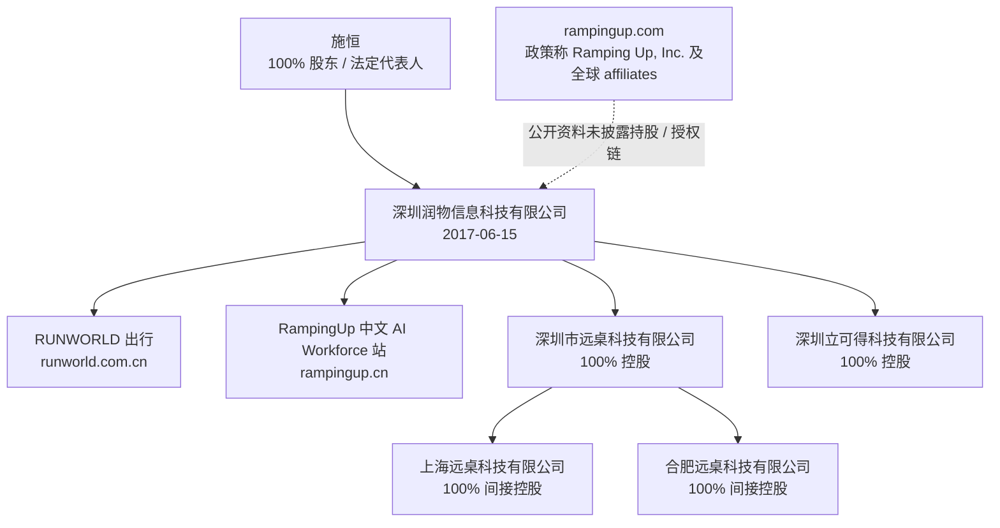

# RampingUp 公司深度分析报告

> **报告日期：** 2026-07-28
> **研究对象：** RampingUp 品牌、`rampingup.com`、`rampingup.cn`，以及可被公开资料较强关联的深圳润物信息科技有限公司（下称“深圳润物”）
> **研究目的：** 求职、面试、Offer 与业务合作前尽调；重点核验主体、业务沿革、产品真实性、商业化、融资、客户、技术、数据合规及岗位风险。
> **来源等级：** A = 政府/监管/域名注册原始记录；B = 公司官网、产品接口、公司法律文本、公司招聘原文；C = 客户或投资方的一手材料；D = 工商/招聘聚合平台；E = 基于前述事实的分析。
> **边界：** 未上市公司没有公开审计财务、完整境外股权链、银行余额、客户合同或劳动合同。“未找到”不等于“不存在”。本报告不是法律、审计或投资意见。

---

## 一、执行摘要

### 1.1 一句话判断

> **RampingUp 不是一个刚出现的纯 AI Agent 创业项目，而是一个有跨境工程团队、招聘/EOR/薪酬平台和出行 SaaS 沿革的混合型组织。其 EOR/HRMS 产品与后台系统有较强真实性证据；2025-2026 年集中宣传的“AI 数字员工”有明确投入信号，但公开产品、客户和技术证明明显不足。再叠加同期机器人软硬件招聘，组织同时推进的方向较多。对求职者而言，它更像“有存量业务支撑、正在多线转型的中型创业组织”，而非单一、成熟的 AI Workforce 软件公司。**

### 1.2 核心结论表

| 维度 | 核验结论 | 置信度 |
|---|---|---:|
| 中国运营主体 | `rampingup.cn` 的 ICP 后缀、RAMPING UP 商标申请、EOR 产品招聘均可与深圳润物交叉对应 | 高 |
| 境外主体与控制链 | 全球站隐私政策写 `Ramping Up, Inc. and its affiliates worldwide`，但未披露注册州、编号、地址、股权或与深圳润物的关系 | 低 |
| 公司沿革 | 全球站自述 2009 年起做海外研发/远程团队；深圳润物 2017 年成立，先后出现出行 SaaS、EOR/招聘、AI Agent 和机器人信号 | 中高 |
| EOR/HRMS 产品真实性 | 雇主端、员工端、SSO、后台、支持系统均在线；公开接口文档含 795 条路径、1,374 个 schema，覆盖合同、薪酬、审批、客户、报价和审计 | 高 |
| AI Workforce 产品成熟度 | 中文站为单页展示，22 个链接指向 `#`，没有登录、试用、API、价格、白皮书或实名客户案例；其 100+ 客户等数据均为自述 | 高（展示站状态）；低至中（业务规模） |
| AI Agent 研发投入 | 2026-06 的全栈岗位要求 LLM/Agent 架构，工作内容为 AI Marketing Agent；招聘材料可证实团队在投入，而非只做展示页 | 中高 |
| 机器人业务信号 | 同一主体 2026-06 招 ROS2、嵌入式、电机与机器人系统岗位，要求实机验证和传感器/驱动开发 | 中高 |
| 客户与收入 | 官方材料称服务 OpenArt、Creatify、Jampack，且有 $10M+ payroll under management；未找到客户侧或审计侧交叉确认 | 低至中 |
| 融资 | 招聘平台的“A 轮、100-499 人”标签不是融资证明；公开工商页未列投资机构或融资事件，境内主体由施恒 100% 持股 | 中高（未验证事实） |
| 数据与合规 | 业务触及身份证件、护照、银行账户、薪资、招聘、跨境传输；全球隐私政策覆盖较广但主体/分包商透明度有限，中文 AI 站没有可用条款 | 高 |
| 求职判断 | **建议继续面试；不建议仅因“AI 数字员工”叙事、客户 logo 或融资标签直接接 Offer。** 必须先确认业务线、签约主体、预算来源、真实客户、数据权限和权益 | 中高 |

### 1.3 最重要的正面信号

1. **核心 HRMS/EOR 系统不是 PPT。** `portal.rampingup.com` 和 `me.rampingup.com` 分别为雇主、员工入口；公开 API 的业务对象远超营销页，包含员工入职、Offer、合同签署、薪酬单、保险、报销、审批、发票、报价、CRM、飞书导入、OCR 和审计日志。[S10]
2. **有可追溯的长期交付沿革。** 全球官网自述 2009 年起提供 offshore development center/远程研发服务；深圳润物 2017 年成立，RUNWORLD 官方站仍展示出行 SaaS、调度、票务、结算和合规能力。[S1][S7][S8]
3. **EOR 不是空泛概念。** 官网将招聘、设备、工位、HR/admin/IT、全球薪酬和合规打成一套交付，并公开了 10%-15% 管理费与 20% 招聘成功费。[S8][S9]
4. **AI 研发招聘与宣传时间相近。** 2026-06 的上海全栈岗明确要求 React、Python/DevOps、LLM 应用、AI Agent 架构与 AI API 集成，职责是 AI Marketing Agent 的核心系统和增长工具开发。[S6]
5. **存在真实的跨地域扩张信号。** 深圳润物全资持有深圳市远桌科技有限公司和深圳立可得科技有限公司；远桌再全资持有上海、合肥公司。招聘同时覆盖深圳和上海。[S2][S5]
6. **国内主体不是壳公司式的新注册主体。** 其在 2017 年成立，有连续工商变更、2 件 2019 年软件著作权、商标和对外投资记录；爱企查当前未列经营异常、行政处罚、失信被执行人或被执行人记录。[S1][S2][S14][S15]

### 1.4 最重要的风险

1. **品牌、合同主体和控制关系没有闭环。** 中国品牌关联很强，但全球条款中的 `Ramping Up, Inc.` 没有披露注册信息；不能从品牌直接推断深圳润物、美国/新加坡实体和期权主体属于同一法律集团。[S1][S4][S11]
2. **“AI Workforce”证据弱于 EOR 系统证据。** 中文站没有可操作的产品入口，案例全部匿名；“100+ 企业、1000+ 数字员工、99.5% 可用性”没有计量口径、客户名单或第三方验证。[S13]
3. **组织可能存在多线并行与焦点稀释。** 出行 SaaS、EOR/招聘、AI Marketing Agent、通用数字员工、机器人系统和嵌入式研发均在同一主体或其紧密关联主体出现。它可以带来复用资源，也可能意味着岗位会被频繁换题。[S2][S5][S6][S7]
4. **客户、融资和“合作”宣传不可直接当事实。** Intro PDF 的客户、100% 留存和 payroll 数字是公司自述；岗位文案称“和 Anthropic research team 共建 agent 架构”，本次未找到 Anthropic 侧公开确认。[S6][S11]
5. **EOR 业务天然高合规、高现金流责任。** 平台处理薪资和身份数据，且在多国雇佣；全球隐私政策承认收集证件、银行及支付信息并称部分数据服务结束后保留 10 年。中文 AI 站没有可用隐私/服务条款。[S11][S13]
6. **国内主体的融资透明度较低。** 注册资本 1,000 万元不代表现金；工商页实缴字段为空，唯一自然人股东为施恒，公开页无投资机构或融资记录。招聘平台的轮次/人数标签应视为招聘口径。[S1][S3]
7. **存在三则开庭公告。** 两则民事案未公开案由，不能臆测为劳动纠纷；另有一则借款合同纠纷中深圳润物为原告。它们不是经营危机证据，但应在 Offer 前问清未决事项与用工争议处理机制。[S14]

### 1.5 是否值得去

**建议：继续面试，按“中等偏高机会、较高信息不透明和方向切换风险”处理。**

更适合：愿意做跨境 HR Tech、平台工程、Agent 产品、复杂 B 端交付，能在不完备流程下建立系统的人。若进入 Agent/机器人早期团队，确实可能获得较大技术与产品所有权。

需要谨慎：优先稳定工时、清晰晋升、成熟产品边界、可验证融资和明确期权归属的人；以及无法接受海外客户数据、薪酬数据、LLM 数据治理高要求的人。

---

## 二、主体、品牌与集团关系

### 2.1 已能较强确认的中国主体

| 项目 | 公开信息 |
|---|---|
| 公司 | 深圳润物信息科技有限公司 |
| 统一社会信用代码 | `91440300MA5EKHAT5M` |
| 成立日期 | 2017-06-15 |
| 法定代表人、执行董事、总经理 | 施恒 |
| 监事 | 谢莹 |
| 注册资本 | 1,000 万元人民币 |
| 股东 | 施恒 100%（自然人独资） |
| 实缴资本 | 工商聚合页显示 `-`，即本报告无法核验 |
| 当前登记地址 | 深圳市南山区白石路 3609 号深圳湾科技生态园二区 9 栋 B922 |
| 官网记录 | `www.runworld.com.cn` |

上述为工商聚合页的公开展示，并非本报告直接调取市场监管档案；但统一信用代码、自然人独资、人员和地址与多个子页一致。[S1][S3]

### 2.2 RampingUp 与深圳润物的关联强度



关联证据不是单点推测：

- `rampingup.cn` 页脚为 `粤ICP备17080459号-9`；深圳润物的已列备案域名 `runworld.com.cn`、`runworld.cn` 使用同一基础备案号 `粤ICP备17080459号`。[S3][S7][S13]
- 深圳润物在 2025 年申请了 `RAMPING UP` 第 42 类，以及第 9、35 类商标；这是中国品牌归属最直接的公开证据之一。商标记录是**申请记录**，不等于已经完成注册或覆盖全球权利。[S4]
- 深圳润物的产品经理招聘直接要求 EOR、Payroll、电子钱包/发卡和 AI Prompt 经验，与全球 RampingUp 的服务结构一致。[S5]

**应如何理解：** 中国品牌和业务运营关联为高置信度；但 `rampingup.com` 的条款只写 `Ramping Up, Inc. and its affiliates worldwide`，没有州、公司编号、注册地址、董事或与深圳润物的股权披露。因此不能把“品牌一致”升级为“境内外主体必然同一控制链”。拿 Offer 时，劳动合同、社保、公积金、保密/IP、期权和汇报线都须按实际主体核验。[S11]

`rampingup.com` 的 RDAP 记录显示域名最早注册于 2004-06-12，早于官网自述的 2009 年创立时间。域名可能发生过转让或用途变化，注册日期只能证明域名年龄，不能证明当前团队、公司主体或业务从 2004 年连续运营。[S12]

### 2.3 境内关联公司与用工含义

深圳润物直接对外投资两家公司，均为 100%：[S2]

| 公司 | 成立时间 | 注册资本 | 关系 | 对求职判断的含义 |
|---|---:|---:|---|---|
| 深圳市远桌科技有限公司 | 2023-06-16 | 1,000 万元 | 深圳润物全资 | 远桌再控上海、合肥公司；可能承接研发、区域用工或硬件/物联网事项，但公开资料未说明具体分工 |
| 上海远桌科技有限公司 | 未在本表展开 | - | 经深圳远桌 100% 间接持有 | 上海 Agent 岗的劳动合同主体需要核对 |
| 合肥远桌科技有限公司 | 未在本表展开 | - | 经深圳远桌 100% 间接持有 | 同上 |
| 深圳立可得科技有限公司 | 2023-09-15 | 10 万元 | 深圳润物全资 | 公开名称/商标提示可能与 Printogo 等新业务相关，未找到明确业务说明 |

**结论：** “在 RampingUp 面试”不等于一定与深圳润物签约。要求招聘方在 Offer 前写明雇主主体、社保缴纳主体、项目归属和知识产权归属，是必要动作。

---

## 三、业务沿革：至少四条线，而非单一 AI 招聘产品

### 3.1 可验证时间线

| 时间 | 事件 | 解读 |
|---|---|---|
| 2009（公司自述） | 全球官网称由亚洲 IT 专业人士创立，最初帮助跨国公司搭建 offshore development center | 公司自述，未获注册文件独立验证；可说明远程工程服务叙事早于中国公司 [S8] |
| 2017-06 | 深圳润物成立 | 中国运营载体的可核法律起点 [S1] |
| 2020-2021 | 经营范围和许可事项转向互联网信息、网约车/道路运输；RUNWORLD 对外提供出行 SaaS | 出行/物流软件是已留存的实际业务线，而非事后包装 [S2][S7] |
| 2021-11 | 一般经营范围改为软件、AI 应用、智能机器人、数据服务、软硬件制造等 | 机器人/AI 进入工商范围早于 2026 招聘，但范围本身不代表已经形成产品收入 [S2] |
| 2025-04 至 06 | 招产品经理/Python，产品经理职责涉及 EOR、薪酬、发卡和 AI Prompt | EOR/HRMS 产品建设有直接招聘证据 [S5] |
| 2025-08 至 12 | 深圳润物申请 RAMPING UP 商标 | 中国品牌扩张的明确时间信号 [S4] |
| 2025-09 | 经营范围增加职业中介、第二类增值电信、在线数据交易处理等许可项目表述 | 反映业务准备/扩张；实际许可证是否有效应单独查证 [S2] |
| 2026-06 | 招 AI Marketing Agent 全栈、机器人系统、ROS、嵌入式、电机岗位 | 同主体多线扩张的强招聘信号 [S5][S6] |
| 2026-07 | `rampingup.cn` 更新为 AI Workforce Operating System 单页 | 公开品牌叙事转向通用 AI 数字员工；页面最后修改为 2026-07-03 [S13] |

### 3.2 业务线拆解

#### A. RUNWORLD 出行 SaaS：有官网产品，客户均为公司侧展示

RUNWORLD 官网将深圳润物描述为“新一代智慧交通服务专家”，提供网约车、拼车、城际快线/定制公交、实名制、票务结算、司机端、调度、发票与合规能力。网站 logo 轮播列出优步中国、优步新加坡、狮城租车、SMOVE、滴滴出行、小马跨境、万顺叫车和顺丰科技，并称核心管理层来自优步中国、滴滴。[S7]

这足以支持“公司有出行/物流软件交付背景”，但不能证明这些客户当前仍在合作、合同金额、SaaS 自研比例或客户满意度。尤其 Uber、滴滴、顺丰等名称只出现在公司自己的网站，未找到客户侧确认，应标作**公司背书**而不是已独立确认的大客户。

#### B. 全球招聘、EOR、薪酬与远程团队：当前最可验证的商业产品

全球站提供招聘、EOR、薪酬、HR/admin/IT、设备、办公室和远程团队管理。它不是“只卖 AI 招聘助手”，而是 **软件 + 本地运营 + 人力交付 + 合规/发薪** 的混合服务。[S8][S9]

公开定价：[S9]

| 服务 | 公开价格/模式 |
|---|---|
| EOR、日常管理和 Payroll | 少于 20 人按雇员综合薪酬的 12%-15%/月；20 人以上 10%/月 |
| 招聘 | 成功入职时收取年基本薪酬的 20%；仅用招聘服务时也是 20% |
| 工位示例 | 官网样例为 $250/月 |
| 样例中的管理费 | 员工月综合薪酬 $4,400，15% 管理费为 $660/月 |

这一定价有两层含义：

1. 以 10%-15% 抽成而非统一低价月费，说明平台收入更接近“高服务密度 EOR/外包管理”而非纯 SaaS；对高薪员工，客户会与 Deel、Remote 等固定月费 EOR 做强比较。
2. 20% 招聘费属于传统猎头成功费的常见区间，能带来现金流，但人力交付、候选人供给和销售依赖也会降低纯软件毛利的想象空间。

#### C. HRMS 系统：产品真实性强于可见营销

截至报告日，以下子域名可访问：`portal`、`me`、`sso`、`admin`、`api`、`support`。其中雇主端和员工端的首页标题分别为 `RampingUp Employer`、`RampingUp Employee`；二者静态入口最后修改时间为 2026-07-15。公开 Swagger 文档名为 `RampingUp API v1`，含 **795 条路径、1,374 个 schema**。[S10]

接口分类中可见：

- Employee、Onboarding、EmployeeContract、JobOffer、Interview、JobApplicant；
- PayrollEntry、SalarySlip、SalaryStructure、ExpenseClaim、Leave；
- Contract、审批、供应商、账户应付、发票、报价、CRM；
- Feishu、OCR、审计日志、权限、租户、SSO、工单和知识内容。

这不等于每个模块都被客户大量使用，也不构成安全漏洞证明；但它足以说明背后有相当规模的业务系统开发。相反，**新 AI Workforce 展示站没有呈现同样级别的可操作产品证据。**

#### D. AI Workforce / AI 数字员工：叙事清晰，公开验证仍早期

中文站将自己定义为 “AI Workforce Operating System”，列出 AI Recruiter、AI SDR、AI Customer Support、AI Receptionist、AI Concierge、AI HR Assistant、AI Finance Assistant 和 Custom Employee。网站称已有 100+ 企业客户、覆盖 10+ 国家、部署 1,000+ 数字员工、平台可用性 99.5%。[S13]

但截至报告日：

- 22 个导航/内容链接是 `href="#"`；
- 没有注册、登录、试用、演示表单、开发者中心、API 文档、定价或可下载白皮书；
- 三个案例均为“某互联网企业/电商平台/连锁酒店集团”，没有客户名、联系人、合同周期、使用量、对照组或指标计算方法；
- 页面仅提供 `sales@rampingup.com`，最后修改于 2026-07-03。[S13]

因此，最稳妥结论是：**这个方向正在被明确包装和招人，但公开证据不足以验证其客户数量、生产稳定性、Agent 质量、毛利或续费。**

#### E. AI Marketing Agent 与机器人：真实招聘信号，也是战略聚焦风险

2026 年 6 月，深圳润物关联招聘页出现以下岗位：[S5][S6]

| 发布日期 | 岗位 | 地点 | 月薪 | 直接体现的业务信号 |
|---|---|---|---:|---|
| 2026-06-13 | 全栈工程师 | 上海 | 25k-50k | AI Marketing Agent、LLM、Agent、增长工程；明确上海线下、不支持远程 |
| 2026-06-22 | 全栈工程师（偏前端 + Agent） | 上海 | 30k-60k | AI Marketing Agent 核心系统、产品功能、增长工具、自动化、数据系统 |
| 2026-06-09/08 | 嵌入式软件工程师 | 深圳 | 30k-45k | 机器人传感器/电机驱动、控制器、协议栈 |
| 2026-06-17/20 | ROS / 机器人软件系统工程师 | 深圳 | 30k-60k | ROS2/DDS、雷达/相机/IMU、任务调度、实机验证、数据采集标注 |
| 2026-03-29 | 电机研发工程师 | 深圳 | 25k-35k | 物理硬件方向 |
| 2025-04-11 | 产品经理 | 深圳 | 20k-40k | EOR、Payroll、发卡、AI Prompt |

岗位页的 AI Marketing Agent 内容具体到技术栈和职责，因而可支持“团队正在开发 Agent 产品”。不过它没有说明该产品是否就是 `rampingup.cn` 展示的 AI Workforce、是否已有客户、由哪一家公司签约、是否单独融资。岗位里“与 Anthropic research team 共建 agent 架构”只是一则招聘文案，未发现 Anthropic 侧确认，不能称为已验证合作。[S6]

**对候选人的含义：** 这是高上行也高波动的地方。若岗位直接属于 Agent 核心，可能有较大 0→1 权限；若组织把 EOR、AI Marketing、通用数字员工和机器人并行推进，则路线变化、资源竞争和 KPI 重置的可能性很高。

---

## 四、客户、增长与商业化质量

### 4.1 官方数字应如何阅读

公司 Intro PDF 声称：管理年薪酬 $10M+、累计签约 500+ 员工、客户 100% 留存，并列 Creatify AI、Jampack、OpenArt AI 为案例；页面还含 OpenArt 联合创始人 John Qiao 的引述。它同时称覆盖硅谷、新加坡、中国、圣保罗、墨西哥城。[S11]

这些信息有价值，但证据等级只能是 **B（公司自述）**：

- `$10M+ payroll under management` 是经过平台流转/管理的薪酬规模，不等于平台收入、ARR、毛利或自由现金流；
- `500+ employees signed` 是累计值，无法推出当前活跃员工数和每个客户的留存；
- `100% client retention` 没有统计期间、客户定义、收入留存、基数和流失处理规则；
- 本次未在 OpenArt、Creatify、Jampack 的公开网站或 sitemap 中找到对 RampingUp 的独立确认。

### 4.2 一个有用但保守的单位经济学推演

若以公司公开的 10%-15% 管理费作为**极简假设**，且 $10M 年 payroll 全部适用该费率，则可对应每年约 $1.0M-$1.5M 的管理费收入区间，尚未扣除办公室、HR、设备、合规、支付、招聘交付、人力成本和坏账，也未计未收费/非同费率客户。

这个计算不代表真实收入，只说明：

```text
Payroll under management（资金/薪酬规模）
  ≠ 平台收入
  ≠ SaaS ARR
  ≠ 毛利
  ≠ 可自由支配现金
```

如果公司只讲“千万美元 payroll”或“100% 留存”，却不愿说明活跃雇员数、平均 take rate、招聘收入占比、毛利和客户集中度，应把它当作面试红旗。

### 4.3 竞争位置

| 赛道 | 典型竞品 | RampingUp 的可能优势 | 主要弱点/待证问题 |
|---|---|---|---|
| 全球 EOR/Payroll | Deel、Remote、Oyster、Multiplier | 工程人才招聘、办公室/设备/本地交付和发薪能打包；对中美/东南亚工程团队可能有实操积累 | 巨头的本地实体覆盖、合规资源、品牌与融资更强；RampingUp 的法实体覆盖、定价竞争力和服务 SLA 未公开 |
| 招聘/RPO | 猎头、RPO、Ashby、Greenhouse、Lever、Mercor | 直接把招聘接到雇佣、EOR 和 payroll，交付闭环更长 | 20% 成功费本质仍是人力交付；候选人网络、fill rate、time-to-hire 和复购无公开数据 |
| AI 招聘/Agent | Eightfold、SeekOut、Mercor、Moka 及 ATS 的 AI 功能 | 已有 HR/payroll 系统和客户数据，理论上可把 Agent 嵌入工作流 | 公开站没有可用 Agent、评测、客户、审计与监管说明；很难证明胜过通用大模型 + 现有 ATS |
| 通用 AI Workforce | ServiceNow、Salesforce、Glean、Intercom、企业自建 Agent | 可走“按岗位交付数字员工 + 人工服务”的方案，销售故事易懂 | 横跨招聘、销售、客服、前台、财务和酒店，场景过宽；需要每个场景的权限、知识库、责任边界和 ROI 证明 |

**战略判断：** RampingUp 最可防守的位置不是“做一个全行业通用 Agent”，而是把自身已有的跨境招聘、雇佣、薪酬和工程交付流程做成有可审计的垂直 Agent。如果产品实际走向泛营销 Agent、酒店礼宾和机器人等差异很大的市场，护城河会更依赖执行速度和销售关系，弱于单一场景深耕。

---

## 五、技术、数据与知识产权

### 5.1 可确认与不可确认的技术事实

**可以确认：** EOR/HRMS 系统存在复杂、持续更新的 Web/API 面；API 命名显示 ABP/.NET 生态组件、权限、审计、租户和多业务模块的使用痕迹。公开 Swagger 不应被解读为“数据泄露”，本次没有测试认证绕过或读取任何非公开数据。[S10]

**尚不能确认：** AI Workforce 的 Agent Runtime、模型路由、多 Agent 协作、记忆引擎、私有部署、SLA、推理成本、准确率、幻觉控制、人工升级、评测基线、客户隔离和生产客户数。中文站仅提供营销描述，不能证明这些能力已投入生产。[S13]

### 5.2 数据与安全风险

全球隐私政策表示会处理联系方式、登录标识、身份证/社保号/驾照/护照、银行账户、支付卡、交易记录、设备与网络数据，并可能用于跨境传输；还称服务完成后某类个人数据可保留 10 年。政策同时写公司可能作为 controller 或 processor，取决于服务模式。[S11]

对于 EOR/AI 招聘/数字员工，这不是普通 SaaS 的低敏数据：

| 数据/操作 | 主要风险 | 面试应查证 |
|---|---|---|
| 简历、候选人评分、AI Recruiter | 歧视、自动化决定、来源授权、跨境传输 | 人在回路、可解释性、申诉/删除、数据来源和保存期 |
| 身份证件、薪资、银行账户、发卡 | 身份盗用、支付欺诈、内部越权 | 加密、密钥、最小权限、第三方支付商、渗透测试、事故响应 |
| 企业知识库与客服 Agent | 越权回答、提示注入、商业秘密外泄 | RAG 权限继承、租户隔离、日志脱敏、模型供应商和数据不训练承诺 |
| 跨境 EOR 与全球 payroll | 数据出境、当地劳动/税务法冲突 | 实际 EOR 实体清单、DPA、SCC/标准合同、数据存储地域 |

中国《个人信息保护法》对敏感个人信息、自动化决策和个人信息出境提出了更高要求；生成式 AI 服务也受中国网信部门相关管理要求约束。具体适用取决于产品是否向公众提供、处理地点和数据流，但公司不能只靠通用“同意”文本处理这些问题。[S16][S17]

另外，`rampingup.cn` 的隐私、条款、开发者中心等入口目前不可用；RUNWORLD 站的 TLS 证书显示于 2026-01-27 到期。后者不证明核心 HRMS 也不安全，却是一个可见的基础 Web 治理信号。[S7][S13]

### 5.3 知识产权：品牌动作快，Agent IP 公开不足

- 深圳润物公开有 26 件商标申请/记录；其中 RAMPING UP 于 2025 年进入第 42 类及第 9、35 类申请记录。[S4]
- 2 件软件著作权为 2019 年的 Officeasy iOS/Android 软件，无法证明当前 HRMS 或 Agent 的权属。[S15]
- 唯一公开专利为 `CN120642765A`“生态灌溉决策动态优化方法及相关设备”，与招聘/EOR 或 Agent 平台的核心能力没有直接对应关系。[S15]

因此，不能从“有商标、专利”推导其拥有 Agent 核心技术壁垒。更要问的是：模型/工作流/数据/代码的 IP 在哪一个主体，员工、外包、客户共创与高校/大模型厂商的权利如何切分。

---

## 六、融资、治理与司法风险

### 6.1 融资和现金：公开证据不足

深圳润物当前是施恒 100% 持有的自然人独资公司，公开工商聚合页未列投资机构或融资事件。部分招聘页面把公司标为“A 轮、100-499 人”，但平台标签不是投资协议、到账证明或审计报表。[S1][S3][S5]

这有三种可能：

1. 融资发生在未披露的境外主体；
2. 有业务现金流或关联资金支持；
3. 标签只是招聘方自行填写或过期。

三者对候选人的薪酬、期权、runway 和团队稳定性影响完全不同。没有现金、月 burn、未来 12 个月预算和融资主体，不能把“A 轮”作为稳定性判断依据。

### 6.2 创始人与治理透明度

施恒是深圳润物唯一股东、法定代表人、总经理和执行董事；公开工商页另列谢莹为监事。公司资料称管理层来自 Uber China/滴滴，但本次未找到可可靠核验的施恒个人教育、过往任职、境外公司职位或完整管理团队履历。不要把公司级团队话术自动归到创始人个人履历。[S1][S3][S7]

2025-09 至 2026-01，公司数次修改经营范围和注册地址；这种扩张本身并非负面，但结合多业务线，应关注管理层对产品优先级、财务和风险的实际治理能力。[S2]

### 6.3 司法与行政风险

爱企查当前展示：[S14]

| 项目 | 公开结果 | 正确解读 |
|---|---|---|
| 开庭公告 | 3 条 | 2026-01-30 `(2025)粤0306民初95979号`、2025-09-28 `(2025)粤0305民初21913号` 的案由未披露；不能擅自归类为劳动争议 |
| 借款合同纠纷 | 2025-04-24 `(2024)粤0305民诉前调30846号` | 深圳润物为原告，不能解读为其欠款 |
| 行政处罚、经营异常、失信被执行、被执行人 | 聚合页当前未列 | 是有限的正面筛查，不能替代法院、税务、劳动仲裁和境外主体检索 |

公司历史上经营范围曾出现人才中介、网约车、电信等许可相关表述；2025 年又新增职业中介、在线数据处理等项目。**经营范围写有许可事项，不等于已经拥有每一地区、每一业务实际所需的有效许可证。** 若岗位负责 EOR、招聘、发薪或数据跨境，应该核实许可证、当地 EOR 合作实体、责任保险和合规负责人。

---

## 七、面试与 Offer 决策清单

### 7.1 必问的十个问题

1. **这个岗位属于哪一条业务线？** 是现有 RampingUp EOR/HRMS、AI Marketing Agent、`rampingup.cn` AI Workforce、RUNWORLD，还是机器人项目？未来 12 个月只对哪个 P&L/KPI 负责？
2. **劳动合同和社保由哪家主体签/缴？** 深圳润物、深圳/上海远桌、境外公司还是第三方？试用期、竞业、IP、补充医疗和个税由谁承担？
3. **Ramping Up, Inc. 与深圳润物的法律关系是什么？** 代码、客户合同、收入、商标、数据和期权分别在哪个主体？
4. **AI Agent 的真实生产客户有哪些？** 能否展示一个经客户允许的脱敏 workflow、月活/任务量、人工升级率、准确率、节省工时和续费案例？
5. **AI Marketing Agent 与 AI Workforce 是否同一产品/团队？** 若不是，为什么共用品牌与研发资源？本岗位被转线的条件是什么？
6. **“与 Anthropic research team 共建”的合作性质是什么？** 是正式合同、技术顾问、API 支持、联合研究，还是招聘宣传用语？可否给出可公开的证明？
7. **EOR 的活跃客户、活跃雇员、Payroll managed、净收入和毛利分别是多少？** 这些指标的统计口径和最近 12 个月趋势是什么？
8. **数据如何处理？** 招聘简历、身份/薪资、企业知识库分别存在哪里；哪些模型厂商可见；是否用于训练；如何执行删除、导出、审计与事件响应？
9. **机器人团队与本岗位有什么关系？** 共享预算、模型、数据或管理层吗？核心产品的资源优先级由谁决定？
10. **现金和权益如何落地？** 现金 runway、未来融资主体、期权授予主体、完全稀释比例、授予数量、行权价、归属/加速/离职条款分别是什么？

### 7.2 收到 Offer 前要拿到的材料

- 劳动合同样本、实际雇主营业执照、社保公积金缴纳说明；
- 岗位 JD 的业务线、汇报人、试用期目标、考核周期和预算来源；
- 期权/RSU 的授予主体、董事会批准、数量、行权价、归属期、税务与离职处理；
- 至少一个经许可的产品演示或客户指标说明，尤其是 Agent 岗；
- 涉及个人信息、薪资或知识库的权限矩阵、数据处理协议和 on-call/事故响应职责；
- 若被要求为“Anthropic 合作”“千万美元 payroll”“A 轮融资”背书，应要求可公开或可供候选人保密查阅的依据。

### 7.3 对不同岗位的建议

| 岗位方向 | 判断 | 重点核验 |
|---|---|---|
| HRMS/EOR 后端、支付、数据 | 平台基础更真实，问题域复杂、有积累 | 合规责任、支付账务、数据权限、业务值班、国际协作时间 |
| AI Agent/全栈 | 上行大，当前最像 0→1 | 客户、模型成本、负责人、产品归属、Agent 评测、是否频繁换方向 |
| 机器人/嵌入式/ROS | 招聘要求具体，技术深度可能较高 | 真正产品、样机/量产状态、硬件预算、供应链、团队规模、与 RampingUp 的关系 |
| 产品/增长 | 能接触多业务，但职责膨胀风险大 | 是否有 P&L/数据权限、一个主产品、资源配比、成功标准 |

---

## 八、最终结论

RampingUp 最值得肯定的部分，是它**已有一套能够承载复杂雇佣、合同、薪酬和客户流程的系统，以及长期工程/交付的业务沿革**。这使它和单页融资官网式的 AI 项目不同。

但对“AI 数字员工”要降低预期：公开页面的功能和客户验证还很早，招聘中出现的 AI Marketing Agent、机器人、EOR 和出行业务进一步说明公司是多业务并行组织。它的机会不是“加入一个已被证明的全球 AI Workforce 独角兽”，而是“进入一个有存量系统和交付能力、正在尝试把多种 AI/硬件方向产品化的组织”。

**适合继续面试；是否接 Offer 取决于三件事：** 该岗位是否真正归属有预算且有客户的核心线、劳动与期权主体是否清楚、以及招聘方能否用可验证产品和经营数据回答上面的关键问题。若三者不能回答，再高的职位名、AI 叙事或融资标签都不足以抵消风险。

---

## 来源与复核链接

| 编号 | 来源 | 类型 | 用途 |
|---|---|---|---|
| S1 | [深圳润物工商基本信息](https://aiqicha.baidu.com/company_basic_28498582448321) | D | 成立、法人、地址、范围、官网、股东/实缴展示 |
| S2 | [深圳润物变更记录](https://aiqicha.baidu.com/company_changeRecord_28498582448321) | D | 业务范围、地址、许可事项和时间线 |
| S3 | [股东信息](https://aiqicha.baidu.com/company_shares_28498582448321)、[对外投资](https://aiqicha.baidu.com/company_invest_28498582448321)、[控股企业](https://aiqicha.baidu.com/company_holds_28498582448321)、[网站备案](https://aiqicha.baidu.com/company_icp_28498582448321) | D | 股权、国内集团、ICP |
| S4 | [深圳润物商标记录](https://aiqicha.baidu.com/company_mark_28498582448321) | D | RAMPING UP 商标申请及时间 |
| S5 | [深圳润物招聘汇总](https://aiqicha.baidu.com/company_recruitmentinfo_28498582448321) | D | 岗位、城市、薪资、时间 |
| S6 | [AI Marketing Agent 全栈岗位](https://aiqicha.baidu.com/job?jobId=963c9f38c7d7cf175a11fa5d32b06dcd&pid=28498582448321)、[ROS 岗位](https://aiqicha.baidu.com/job?jobId=c810e174e97195a2bba6fe05d3e9312b&pid=28498582448321) | D（源自 BOSS 直聘） | 具体职责、技术要求和合作表述 |
| S7 | [RUNWORLD 出行官网](https://runworld.com.cn/) | B | 出行 SaaS、客户/团队自述、ICP；报告日其 TLS 证书已到期 |
| S8 | [RampingUp About](https://rampingup.com/about)、[主页](https://rampingup.com/) | B | 2009 远程工程服务自述、服务结构、地点自述 |
| S9 | [RampingUp Pricing](https://rampingup.com/pricing) | B | EOR/招聘/工位公开定价 |
| S10 | [RampingUp Swagger](https://api.rampingup.com/swagger/index.html)、[雇主端](https://portal.rampingup.com/)、[员工端](https://me.rampingup.com/) | B | 平台与 API 的产品真实性 |
| S11 | [隐私政策](https://rampingup.com/policy)、[公司 Intro PDF](https://rampingup.com/RampingUp-Intro.pdf) | B | 境外主体表述、数据政策、客户/规模公司自述 |
| S12 | [RampingUp 域名 RDAP](https://rdap.verisign.com/com/v1/domain/RAMPINGUP.COM) | A | 域名最早注册于 2004-06-12；不能据此推定当前经营主体起点 |
| S13 | [RampingUp 中文 AI Workforce 站](https://rampingup.cn/) | B | AI 数字员工宣传、ICP 后缀、页面可用性与链接状态 |
| S14 | [深圳润物开庭公告](https://aiqicha.baidu.com/company_opennotice_28498582448321) | D | 开庭公告及案号 |
| S15 | [专利信息](https://aiqicha.baidu.com/company_patent_28498582448321)、[软件著作权](https://aiqicha.baidu.com/company_copyright_28498582448321) | D | IP 公开记录 |
| S16 | [《个人信息保护法》全国人大原文](http://www.npc.gov.cn/npc/c2/c30834/202108/t20210820_313088.html) | A | 敏感个人信息、自动化决策、出境的合规背景 |
| S17 | [生成式人工智能服务管理暂行办法](https://www.cac.gov.cn/2023-07/13/c_1690898327029107.htm) | A | 中国生成式 AI 服务合规背景 |

**检索说明：** 报告通过官网、公开 API、工商/招聘公开页、域名 RDAP 和客户侧公开检索交叉完成。浏览器自动化在含中文工作目录的运行环境中无法建立会话，未使用登录态、付费数据库导出或任何绕过访问限制的方法。所有网页结论以报告日期为准。
