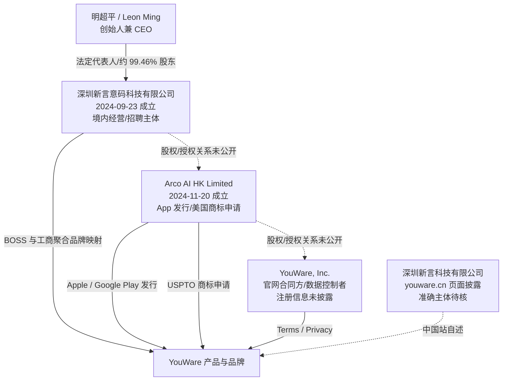

# YouWare 公司深度分析报告

> **报告日期：** 2026-07-17  
> **研究目的：** 求职、面试及业务合作前尽调，重点核验公司主体、创始人、融资、产品成熟度、真实用户规模、竞争位置、数据合规、知识产权与用工风险  
> **研究对象：** YouWare 品牌、深圳新言意码科技有限公司、Arco AI HK Limited、官网条款中的 `YouWare, Inc.`，以及 `youware.cn` 披露的“深圳新言科技有限公司”  
> **来源等级：** A = 政府、监管、应用商店或公开法律文本；B = 公司官网、官方文档、公司新闻稿和公司自述；C = 投资机构、主流媒体或专业创投媒体；D = 招聘、工商聚合、流量排名和用户评价平台；E = 基于公开事实的分析推断  
> **重要限制：** 未上市公司的股权、财务、劳动合同、期权池和投资交割材料不完整公开。“未找到”不等于“不存在”。本报告不是法律意见、审计报告或投资建议。

---

## 一、执行摘要

### 1.1 一句话判断

YouWare 是一家**产品真实、创始人产品履历较强、获得多家头部基金支持、增长速度快，但产品基础设施与公司治理仍明显处于早期阶段的深圳 AI 应用创业公司**。它比普通种子项目更有资本和市场声量，但还不是 Lovable、Replit 等赛道领导者；对求职者而言属于**上行空间高、组织与交付风险也高**的机会。

### 1.2 最重要的结论

| 维度 | 结论 | 置信度 |
|---|---|---:|
| 产品真实性 | 官网、文档、公开项目、iOS、Android、付费订阅和持续更新均可核，绝非 PPT 项目 | 高 |
| 公司起点 | 境内主体成立于 2024-09-23；核心产品在 2025-03 上线。“2025 年 3 月成立”更接近产品口径，不是公司法人起点 | 高 |
| 创始人 | 明超平（Leon Ming），武汉大学自动化背景，曾任 OnePlus、字节剪映/CapCut、月之暗面产品岗位 | 中高 |
| 资本背书 | 五源、高榕、真格、高瓴、IDG、红杉中国等有媒体和部分机构一手旁证 | 中高 |
| 融资金额/估值 | 公司称累计 5,000 万美元、估值 2 亿美元；未见投资协议、交割或财务文件，应按“公司宣布”处理 | 中 |
| 产品阶段 | 已形成 AI 生成、编辑、后端、部署和社区分发闭环；YouBase 仍处 beta 后的快速迭代期 | 中高 |
| 用户规模 | `1M+ creators`、50 万 MAU 是公司口径；Discord 约 5.97 万、Google Play 5 万+下载提供真实但较小的独立旁证 | 中 |
| 商业化 | Freemium + Credits + 订阅 + 充值 + 创作者激励；收入、付费率、毛利和续费均未公开 | 中高（模式），低（经营结果） |
| 竞争位置 | 有辨识度的第二梯队挑战者，社区 Remix 和移动创作突出；流量、企业能力和工程成熟度仍落后头部 | 中高 |
| 主体透明度 | 境内用工、香港发行/IP、官网合同与中国站披露至少出现四套名称，控制和授权关系未闭环 | 高（不一致事实） |
| 数据与 IP | 提示词/文件可传给第三方模型方；公开项目授予平台长期、可转授权的宽许可；AI 输出权属仍有歧义 | 高 |
| 求职建议 | **值得继续面试，但不建议仅凭融资与估值宣传直接接 Offer**；必须先核对合同主体、现金 runway、权益和工作强度 | 中高 |

### 1.3 正面信号

1. **真实产品与真实使用。** YouWare 已经不是概念验证：网页端、双移动商店、YouBase、代码编辑、付费体系、Discord 和 Product Hunt 都有可验证痕迹。[S1][S8][S9][S16-S22][S33][S34]
2. **创始人擅长消费产品。** 明超平的履历集中在手机影像、剪映/CapCut、生成式内容和 AI 产品，和“让非程序员创作软件”的方向匹配。[S25][S27][S31]
3. **资本支持明显强于普通早期公司。** 真格官网已将 YouWare 列入管理合伙人戴雨森的投资项目；主流创投媒体还列出五源、高榕、高瓴、IDG、红杉等。[S27-S30]
4. **产品闭环完整。** 从自然语言/语音/截图输入，到视觉与代码编辑、后端、部署、自定义域名、Remix 和创作者激励，路径比单点代码生成工具更完整。[S15-S22]
5. **差异化方向合理。** 社区项目可以被发现、体验、Remix 和再分发，理论上可能形成内容供给与网络效应，而不是只在模型能力上竞争。
6. **国际化从一开始就存在。** 香港发行主体、英文产品、Stripe、海外社区、香港法条款和多模型接入，都说明其目标市场并非仅中国大陆。[S7-S15]

### 1.4 核心风险

1. **合同与用工主体不透明。** BOSS/工商聚合指向深圳新言意码，应用发行和美国商标指向 Arco AI HK，官网合同与数据控制者却写 `YouWare, Inc.`，中国站又写“深圳新言科技有限公司”。[S2-S12]
2. **融资宣传口径不统一。** 行业数据库称天使、天使+、Pre-A 三轮；公司 PR 却把累计融资称为 `pre-seed`。投资方名单和估值口径也随时间变化。[S23-S30]
3. **增长数字缺乏独立审计。** 1M creators、500K MAU、1M projects 都来自公司；现有第三方信号能证明产品有规模，但不能证明上述活跃口径。[S2][S26][S33-S36]
4. **产品与文档漂移明显。** 当前定价是 Builder/Business，但官方文档仍写 Pro/Ultra；模型清单也不一致，YouBase 新旧后端存在不兼容。[S15][S17][S22][S23]
5. **稳定性和支持能力有压力。** Google Play 约 3.1-3.3 分，Trustpilot 出现付款未激活、数据库连接、生成排队、Credits 与客服响应投诉。[S9][S35][S37]
6. **企业数据不宜直接上传。** 隐私政策明确聊天、文件可传给第三方模型商和 Bot 开发者，后者可能保存匿名对话训练模型；只有 Business 套餐明确列出训练退出。[S12][S13][S15]
7. **公开项目授权很宽。** 创作者保留应用所有权，但同时向 YouWare 授予全球、免费、可转让、可再许可、可修改和衍生创作的长期许可。[S14]
8. **锁定与迁移成本存在。** 源码和数据库导出有付费门槛，Remix 项目不能下载源码，降级后 YouBase 访问和导出受限。[S17-S20][S23]
9. **盈利和 runway 未知。** 融资金额不能替代银行余额；没有 ARR、付费率、毛利、现金消耗、续费或审计财务数据。

### 1.5 求职结论

**建议继续面试，按“头部资本支持的早期 AI 应用公司”评估，而不是按“2 亿美元估值的成熟独角兽”评估。**

更适合：

- 希望参与 AI 应用、创作者工具、增长、社区或全栈平台从 0.5 到 10 的候选人；
- 能接受需求和架构频繁变化、较强结果导向、跨时区协作与早期流程缺失的人；
- 希望获得较大产品影响力，并能承受高强度和业务不确定性的人。

需要谨慎：

- 把稳定工时、成熟流程、清晰晋升和低波动作为首要目标的人；
- 岗位要直接处理客户源码、生产数据或高权限密钥，但公司无法提供审计、隔离、DPA 和权限治理说明；
- Offer 只写品牌名，不写劳动合同主体、固定薪资、社保城市、期权授予主体和归属规则；
- 招聘方用“5,000 万美元融资/2 亿美元估值”代替当前现金、收入和 runway 的回答。

---

## 二、名称、主体与法律边界

### 2.1 已发现的四套主体名称

| 名称 | 可确认角色 | 公开证据 | 未解决问题 |
|---|---|---|---|
| **深圳新言意码科技有限公司** | 高概率的境内经营、研发和用工主体 | BOSS 将 YouWare 绑定为其品牌；工商聚合与投资界数据列法定代表人明超平 [S4-S6] | 股东、最终控制、与香港/美国主体的合同和 IP 授权链 |
| **Arco AI HK Limited** | iOS/Android 发行主体、美国 `YOUWARE` 商标申请人 | 香港公司注册处、Apple、Google Play、USPTO [S7-S10] | 股东董事、与境内公司的控股/协议控制关系 |
| **YouWare, Inc.** | 官网条款合同方、隐私政策所称数据控制者 | 服务条款和隐私政策 [S11][S12] | 注册法域、登记号、注册地址、与上述主体的关系均未公开 |
| **深圳新言科技有限公司** | `youware.cn` 自称的平台打造方 | 中国站正文与 ICP 页脚 [S3] | 未找到与该准确名称匹配的可靠工商闭环；可能是关联方、简称或页面笔误 |

### 2.2 公开证据关系图



实线仅表示公开页面能直接支持的角色；虚线表示关系尚未由股权档案、集团架构图或授权合同闭环。

### 2.3 境内主体基本信息

工商聚合与投资界资料显示：[S5][S6]

| 项目 | 信息 |
|---|---|
| 公司全称 | 深圳新言意码科技有限公司 |
| 成立日期 | 2024-09-23 |
| 统一社会信用代码 | `91440300MAE07R0R5C` |
| 法定代表人 | 明超平 |
| 注册资本 | 100.543 万元人民币 |
| 聚合页所列实缴资本 | 30 万元人民币 |
| 注册地址 | 深圳市南山区粤兴三道 9 号华中科技大学深圳产学研基地大楼 B943 |
| 经营方向 | 软件开发、AI 基础/应用软件、技术服务、信息系统集成等 |
| 数据库人数标签 | 小于 50 人；不是社保人数或审计口径 |
| 聚合页所列当前股东 | 明超平认缴 100 万元、约 99.45993%；庄力认缴 0.543 万元、约 0.54007% |
| 2024 年报社保分项 | 养老 13、失业 13、医疗 13、工伤 14、生育 13；缴费基数选择不公示 |

注册资本很小并不等于融资少。风险投资常通过境外母公司、可转债、增资协议或红筹架构完成，境内运营公司注册资本无法代表集团资金实力。但在签 Offer 时，必须确认**实际发薪主体是否就是这家公司，以及它是否取得境外集团充分资金支持**。

爱企查结构化股权接口显示，深圳主体当前仅有明超平和庄力两名自然人股东；2025-03-25，公司由自然人独资变为有限责任公司、庄力入股，注册资本从 100 万元增至 100.543 万元，并同步调整章程。[S50][S51] 已披露的 VC 没有直接出现在这家境内公司的工商股东中，可能通过境外融资主体、协议权利或其他架构持有经济权益；公开材料尚未穿透，不能自行认定具体结构。

第三方工商聚合页在本次检索时显示失信、执行、立案、裁判文书、开庭、限高等司法计数为 0，并称暂无法律诉讼或经营风险；这只能表述为“公开商业聚合检索未发现”，不能替代法院、监管和公司征信档案，也不能证明绝无未公开纠纷。[S48][S52]

### 2.4 香港主体

- 香港公司注册处官方每周 CSV 与开放数据 API 显示，`Arco AI HK Limited` 于 2024-11-20 注册，商业登记号 `77349982`，注册地址为湾仔港湾道 18 号 Central Plaza 65 楼 6503 室。[S7][S53]
- Apple Lookup API 显示 YouWare 的 seller 为 `Arco AI HK Limited`，包名 `com.arco.youware`。[S8]
- Google Play 同样列该主体，公开地址为香港湾仔 `Central Plaza` 65 楼 6503 室，邮箱 `dev@youware.com`，电话 `+852 5425 2243`。[S9]
- USPTO `YOUWARE` 商标申请号 `99193552` 的 owner 为该香港公司，申请日 2025-05-20；申请地址为湾仔轩尼诗道 245-251 号 Success Commercial Building 11 楼 A1 室，与 Google Play 当前地址不同。[S10]

地址差异可能只是注册代理、商标代理或办公地址更新，不能单独视为异常。但公司应能解释哪一个是当前注册地址、通知地址和合同地址。

### 2.5 为什么主体不透明是求职 P0 问题

多主体本身在出海公司很常见，可能分别承担境内用工、海外收款、知识产权、应用商店和融资职能。真正的问题是公开文件没有说明：

1. 员工劳动成果最终转让给谁；
2. 期权授予的是哪一家公司的权益；
3. 海外融资资金如何支持境内工资和社保；
4. 客户签约、开票、收款和赔偿由谁承担；
5. 用户数据由谁决定用途、谁实际处理、谁接受监管；
6. 如果品牌/IP 在香港，境内公司是否有持续、可执行的使用许可。

---

## 三、创始人与团队判断

### 3.1 明超平（Leon Ming）

公开履历可整理为：[S25][S27][S31]

| 时间 | 经历 | 与 YouWare 的关联 |
|---|---|---|
| 1995 | 出生于湖北黄石 | 年轻创始人，2025 年约 30 岁 |
| 2014-2018 | 武汉大学自动化专业 | 工科基础，但公开定位主要是产品经理而非模型研究员 |
| 2018 起 | OnePlus 手机影像产品经理 | 消费电子、影像和用户体验 |
| 2020 起 | 字节跳动剪映/CapCut 移动端工具 | 大规模创作者产品与国际化经验 |
| 2023-2024 | 月之暗面核心产品岗位 | 参与 Noisee、Kimi 插件、Agent/多模态等方向 |
| 2024-09 | 离职创业；境内公司成立 | 法人和组织起点 |
| 2025-03 | YouWare 产品上线 | 核心产品起点 |

百度百科汇总称其入选 2025 Forbes China 30 Under 30。百科不是权威个人档案，但其核心职业路径与公司 PR、界面/蓝鲸及创投报道基本一致。[S25][S27][S31]

### 3.2 创始人能力画像

**优势：**

- 连续参与影像、视频和 AI 创作产品，理解“把专业能力包装成大众工具”的方法；
- 剪映/CapCut 经历对海外增长、模板、创作者生态和移动端交互有直接价值；
- 从公司成立到产品上线约半年，随后迅速扩展后端、移动端和社区，执行速度强；
- 能连续获得头部基金下注，说明融资表达、方向判断和核心团队吸引力较强。

**边界：**

- 公开证据更能证明其**产品与增长能力**，不能据此推导其本人具备顶级基础模型、分布式系统或安全工程能力；
- 产品定位和文化高度围绕创始人表达，组织可能存在较强 founder dependency；
- 年轻团队高速迭代常伴随优先级切换、技术债和管理制度滞后。

### 3.3 团队

官方称团队位于深圳，并有美国和日本成员；核心成员来自 ByteDance、OnePlus、Ant Group 和 Moonshot AI。[S2] 这属于公司自述，没有公开完整管理层、技术负责人或员工名册。

2024 年报结构化字段显示养老、失业、医疗和生育各 13 人，工伤 14 人，这解释了不同聚合摘要为何分别显示 13/14；当时公司只运营了约三个月。[S48][S54] 投资界当前给出“小于 50 人”标签，BOSS 搜索结果在检索日显示增长策略和后端全栈等少量在招岗位。[S6][S41] 这些数据支持“已有实际团队”，但 2025/2026 当前人数仍未核到，不应把 2024 年社保分项或“小于 50 人”当成实时精确值。

### 3.4 招聘与薪酬快照

职友集页面在 2026-04-01 的快照列出全栈 AI Agent、Web 前端、Android 和 iOS 四类深圳岗位，均标注本科、1-3 年和 25-50K 月薪；其近一年只有 10 条薪酬样本。[S49] BOSS 在检索日展示的岗位数量与之不同，说明平台快照并不同步。

这些数字只能用于建立谈薪区间，不能证明：

- 实际 Offer 一定落在 25-50K；
- 是否有 13 薪、奖金、期权或试用期折扣；
- 招聘量下降是否意味着收缩；
- 同职级、不同岗位和候选人的定级规则一致。

应以招聘方发出的书面 Offer 和劳动合同为准。

对候选人的现实含义：

- 个人职责边界可能很大，产出更容易被看到；
- 岗位名称未必等于实际分工，产品、工程、运营可能频繁交叉；
- 关键系统的值班、事故响应和数据责任可能落在少数人身上；
- 管理、晋升、绩效和培训体系大概率不如成熟公司稳定。

---

## 四、融资与估值核验

### 4.1 公开融资时间线

| 时间 | 媒体/数据库口径 | 投资方 | 金额/估值 | 证据判断 |
|---|---|---|---|---|
| 2024-12-01 | 天使轮 | 高榕、FunPlus、五源、真格 | 金额未披露 | 行业数据库 [S6] |
| 2025-01-10 | 天使+轮；累计完成两轮 | 高瓴、IDG；界面还列五源、高榕、真格 | 两轮“数千万美元”；估值 8,000 万美元 | 主流媒体转载蓝鲸 + 数据库 [S6][S27] |
| 2025-05 | 公司发布产品新闻稿 | 未完整列投资方 | “两轮、数千万美元、估值 8,000 万美元” | 公司自述 [S25] |
| 2025-06-30 | Pre-A | 红杉中国；部分老股东加注 | 金额未披露；估值“数亿美元”、较上轮翻倍以上 | 专业创投媒体 [S6][S28] |
| 2025-11-13 | 公司全球 PR | 重点写 IDG Capital、5Y Capital | 累计 `50M USD pre-seed`；估值 2 亿美元 | 公司自述 [S26] |

### 4.2 哪些投资方最可信

- **真格基金：高可信。** 真格英文官网在戴雨森履历中明确将 YouWare 列为其投资项目，这是投资机构一手确认。[S29]
- **五源、高榕、高瓴、IDG：中高可信。** 界面/蓝鲸和投资界的轮次资料相互支持，但当前投资机构官网未必公开完整 portfolio。[S6][S27]
- **红杉中国：中高可信。** 投资界 2025-07-01 报道明确写红杉中国参与新一轮，且部分老股东加注。[S28]
- **FunPlus：中等可信。** 目前主要来自投资界数据库的天使轮记录。[S6]

### 4.3 如何理解 5,000 万美元和 2 亿美元估值

这两个数字**可能真实，但现阶段只能写成“公司宣布”**，原因是：

1. 没有公开投资协议、交割凭证、股权表、审计报告或监管申报可直接证明到账金额；
2. 公司将累计融资统一称为 `pre-seed`，行业数据库却拆成天使、天使+和 Pre-A；
3. 公司 PR 只重点写 IDG 和五源，媒体披露的投资方更长，名单并不完整一致；
4. “估值”可能是 post-money、最新一轮定价或媒体估算，不能等于净资产或现金余额。

较合理的判断是：**YouWare 确实获得了多家顶级机构支持，融资能力很强；但 2026 年实际可用现金、月度 burn 和 runway 仍需向公司核验。**

### 4.4 融资叙事中的时间矛盾

2025-05 的公司新闻稿称，Leon 在 2025 年 3 月某晚看到 X 上的分享后，当晚做出 YouWare 第一版。[S25] 但境内公司 2024-09 已成立，2025-01 已完成两轮融资并被描述为面向海外的 AI Coding 项目。[S5][S27]

最温和、也最可能的解释是：**团队和公司先成立，最初方向或产品形态在 2025 年 3 月才收敛为 YouWare。** 因此不应把 PR 的创立故事理解为整个公司从零开始的法律和融资时间线。

---

## 五、产品、技术与商业模式

### 5.1 核心定位

YouWare 不是传统 IDE，也不只是 AI 建站器。它希望把以下三层合在一起：

1. **创作工具：** 用文本、语音、截图、录屏或 Figma 描述需求；
2. **应用平台：** AI 生成前后端、托管数据、部署域名并运行应用；
3. **内容社区：** 浏览、体验、分享和 Remix 他人项目，并向创作者分配激励。

官方将其描述为“one-stop vibe coding platform”和“one part creation tool, one part creative community”。[S1][S2]

### 5.2 功能闭环

| 环节 | 已公开能力 | 证据 |
|---|---|---|
| 输入 | 文本、语音、图片、录屏、Figma | 官网、商店与文档 [S1][S8][S9][S16] |
| 生成 | 多模型 AI Agent 生成网站、Web App、Dashboard、原型和小游戏 | [S1][S22] |
| 编辑 | AI 对话、Visual Editor、Code Editor、Boost、History/Rewind | [S16][S18][S24] |
| 后端 | YouBase 的 Auth、Database、Storage、Secrets、server-side logic | [S17] |
| 外部连接 | GitHub、Supabase、Notion、Google Maps、YouTube、arXiv、Figma 等 MCP | [S20][S21] |
| 部署 | `youware.app` 子域名、自定义域名、托管与发布 | [S1][S15-S17] |
| 分发 | Explore、Share、Remix、Creator Studio | [S19][S42] |
| 移动 | iOS/Android 客户端，支持语音、拍照/录屏描述和生成通知 | [S8][S9][S26] |

**重要边界：** 当前公开文档主要证明它生成和托管 Web 项目。没有充分证据表明 YouWare 能把生成结果直接编译、签名并提交为原生 iOS/Android App。移动应用首先是“在手机上创建和管理项目”的客户端，而非完整原生应用发行流水线。

### 5.3 多模型策略

官方文档称可在 OpenAI、Anthropic、Moonshot、Z.ai 等五个模型间切换，并展示速度、智能、成本、上下文和能力标签。[S22]

这带来三个好处：

- 降低单一模型故障或涨价带来的依赖；
- 让用户在质量和 Credits 消耗间选择；
- 可把低成本模型用于简单任务，把强模型用于复杂改动。

同时也增加：

- 不同模型输出质量和行为不一致；
- 用户数据流向更多第三方；
- Credits 定价更难理解；
- 平台需要维护复杂的路由、评测和回归体系。

### 5.4 YouBase 的价值与成熟度

YouBase 把认证、数据库、文件、Secrets 和服务端逻辑做成托管后端，让非技术用户不必单独配置 Supabase/Firebase。[S17] 这是 YouWare 从“生成漂亮页面”走向“生成可用应用”的关键。

但官方文档同时显示：[S17]

- YouBase beta 起点是 2025-12-16；
- 老项目使用的 YouWare Backend MCP 与新 Agent 不兼容；
- 部分老项目无法原地启用 YouBase；
- 新项目已经不能再启用旧 Backend MCP 或旧 AI API；
- beta 阶段部分数据库与存储配额写为 unlimited，并非稳定 SLA。

这说明后端架构仍在重构。对用户是迁移风险，对工程候选人则意味着会接触真实的多租户、数据隔离、迁移、可观测性、成本和兼容性问题。

### 5.5 代码与数据可迁移性

| 场景 | 当前公开规则 | 风险 |
|---|---|---|
| 查看源码 | 免费用户可查看 | 基础透明度较好 [S18] |
| 编辑/下载源码 | 主要要求付费 | 退出成本与订阅绑定 [S15][S18] |
| Remix 项目 | 不能下载源码 | 保护原作者，但限制二创者可迁移性 [S19] |
| 数据库导出 | 付费方案提供 | 需持续保留有权限的套餐 [S17][S23] |
| 降级 | YouBase 停用，数据有限期保留，恢复/导出可能需重新付费 | 业务连续性风险 [S17][S23] |
| GitHub | 文档明确能读取仓库上下文 | 未清楚证明成熟的自动双向同步 [S20] |

### 5.6 Supabase 高权限密钥风险

官方 Supabase 指南要求用户提供可绕过 Row Level Security 的 Service Role Key，以便 AI 理解数据库结构。[S21] 文档也提醒该密钥权限高、不能暴露在客户端。

这不是功能错误，但意味着平台必须具备可靠的 secrets 隔离、最小权限、访问审计、撤销和事故响应。企业用户在没有确认这些控制前，不应直接连接生产数据库。

### 5.7 商业模式

YouWare 的收入逻辑是：

```text
免费获客与社区内容
        ↓
更多项目 / 更强模型 / YouBase / 私密与域名需求
        ↓
订阅 + Credits 加购
        ↓
创作者激励带来更多模板、项目和新用户
```

主要变现来源：

- Builder/Business 月度订阅；
- Credits 充值；
- 未来可能的团队、企业支持与私有能力；
- 创作者和应用的支付/分成机制，具体比例由平台规则决定。[S14][S15]

核心经营变量不是注册数，而是：付费转化、每付费用户 Credits 消耗、模型 API 成本、YouBase 托管成本、退款、续费率和支持成本。以上数据均未公开。

### 5.8 当前价格与官方文档冲突

2026-07-17 订阅页显示：[S15]

| 套餐 | 页面显示价格 | 核心权益 |
|---|---:|---|
| Free | $0 | 最多 300 Credits/月、5 个项目、1 GB、`youware.app` 域名 |
| Builder | $17/月，旁列 $20 | 3,000 Credits、YouBase、自定义域名、源码下载、100 项目、20 GB |
| Business | $50/月，旁列 $60 | 9,000 Credits、私密访问、无限项目、100 GB、训练退出、专属支持 |

但官方文档仍出现 `Pro $20 / Ultra $200` 和不同 Credits 配额。[S23] 这说明价格、套餐名和模型库存仍在频繁调整。报告中的价格只能视为抓取日快照，不能当长期合同报价。

---

## 六、增长、用户规模与外部口碑

### 6.1 公司自报增长

| 时间 | 公司口径 | 来源 |
|---|---|---|
| 2025-05 | 上线后 48 小时访问从 1,000 增至 100 万；约 20 万项目 | 公司 PR [S25] |
| 2025-11 | 50 万月活、100 万项目、主要靠口碑 | 公司 PR [S26] |
| 2026 官网 | 1M+ creators；About 称半年内超过 100 万社区成员 | 官网自述 [S1][S2] |

这些口径分别是 visits、MAU、projects、creators/members，不能互换。官网没有公开去重规则、地域、付费率、留存或第三方审计。

### 6.2 可独立核验的采用度

| 指标 | 2026-07-17 公开值 | 如何理解 |
|---|---:|---|
| Discord | 约 59,678 成员、1,505 在线 | 强于普通早期产品，是真实社区旁证 [S33] |
| Google Play | 50K+ 下载；页面约 3.3/5、172 条评价 | 移动端有规模，但口碑偏弱 [S9] |
| Google Play 手机子集 | 3.1/5、161 条；约 75 个五星、64 个一星 | 明显两极化 [S9] |
| Apple App Store | 4.78/5，但只有 18 个评分 | 评分高但样本极小 [S8][S40] |
| Product Hunt | 2 次发布；4.8/5，仅 9 条评论 | 发布表现不错，样本与平台偏差大 [S34] |
| LinkedIn | 搜索索引约 2,670 关注者 | 品牌存在感旁证，不是用户数 [S38] |
| Trustpilot | 当前标题约 4.4/5，搜索索引约 39 条评价 | 规模较小，且正负体验并存 [S35] |

### 6.3 对“100 万创作者”的判断

可以确认：

- 产品真实；
- 至少有数万级公开社区；
- Web 和移动端均有持续用户；
- 项目数量快速增长在产品形态上具有可能性。

不能确认：

- 100 万是否为去重注册用户；
- 是否包含访客、导入项目、一次性生成者或活动用户；
- 50 万 MAU 是否按统一分析口径持续存在；
- 活跃、留存和付费是否与注册增长同步。

因此，`1M+ creators` 应按**宽口径累计规模**理解，不能直接当作当前 MAU。

### 6.4 用户好评集中点

- 非技术用户能快速做出可分享的网站或工具；
- UI、设计效果和 Boost 体验较好；
- YouBase 降低了认证和数据库门槛；
- 社区项目能提供灵感和 Remix 起点；
- 免费 Credits 和付费源码下载对个人创作者有吸引力。[S34][S35][S37]

### 6.5 用户投诉集中点

- 付款成功但订阅权益没有同步；
- 高峰生成排队、Credits 价格和消耗不透明；
- 复杂逻辑、数据库与前端连接稳定性不足；
- 客服邮件长时间无回复或只给通用答复；
- 调试体验和本地/远端同步不够成熟。[S9][S34][S35][S37]

Trustpilot 的具体公开评论包括：自定义域名问题两周未获回复；数据库与前端连接反复失败；顶级套餐支持仍不足。Google Play 也出现订阅未激活和排队约 1,100 位的投诉。[S9][S35]

这些是用户样本，不等于普遍故障；但多个平台出现相似主题，足以支持“增长速度可能快于支持与稳定性建设”的判断。

---

## 七、竞争格局与护城河

### 7.1 主要竞品比较

| 维度 | YouWare | Lovable | Bolt | Replit | v0 | Base44 |
|---|---|---|---|---|---|---|
| 核心用户 | 非技术创作者、产品和独立开发者 | 创业者与产品团队 | 偏开发者的浏览器全栈生成 | 开发者、团队、教育与企业 | 前端/设计与 Vercel 用户 | 非技术业务应用用户 |
| 核心差异 | 社区、Remix、移动语音、多模型 | 品牌、规模、团队协作 | 浏览器开发环境与开发者控制 | 完整 IDE、协作、部署、Agent | UI 生成、GitHub、Vercel 工作流 | 内置后端与业务功能 |
| 内置后端 | YouBase，仍较新 | 有 | 有/可接多后端 | 强 | 可接后端/Vercel 生态 | 强 |
| 社区分发 | **强强调** | 有模板/分享 | 相对弱 | 有社区 | 相对弱 | 相对弱 |
| 移动端创作 | **突出** | 非核心 | 非核心 | 有移动能力 | 非核心 | 非核心 |
| 工程成熟度 | 早期快速迭代 | 较成熟 | 较成熟 | 最成熟之一 | 依托 Vercel | 产品化较快 |
| 企业治理 | 公开材料有限 | 较完整 | 较完整 | 较完整 | 依托 Vercel | 企业能力较完整 |

### 7.2 流行度位置

Tranco 2026-07-15 的域名聚合排名显示：[S36]

| 域名/产品 | 排名 |
|---|---:|
| Replit | 4,008 |
| Lovable | 4,466 |
| Base44 | 25,814 |
| Bolt | 30,939 |
| v0.app | 34,095 |
| YouWare | 336,163 |

Tranco 是多来源相对流行度，不是访问量或收入，且会受域名拆分影响。但相差一个到两个数量级，足以说明 YouWare 当前仍是挑战者，而非全球头部。

### 7.3 价格位置

检索日各家公开付费入门价大致为：YouWare $17、Base44 年付月均约 $16、Replit Core 月付 $20（年付页面折后 $18）、Lovable/Bolt 约 $25、v0 约 $30/用户。[S15][S43-S47]

Credits、tokens、模型、后端和部署权益完全不同，不能直接把数字作性价比排名。YouWare 的低入门价适合获客，但长期毛利取决于模型和托管成本。

### 7.4 哪些能力容易被复制

- 接入多家模型；
- Prompt-to-app；
- 视觉编辑和一键美化；
- 托管数据库/认证；
- Credits 定价；
- 自定义域名和一键发布。

这些功能对资金充足的竞品并非长期壁垒。

### 7.5 最可能形成壁垒的部分

YouWare 真正的长期赌注是：

```text
更多公开作品
  → 更多可体验和 Remix 的起点
  → 新用户更快获得结果
  → 更多创作者获得曝光或收益
  → 继续贡献更多作品
```

如果创作者身份、作品关系、Remix 谱系、流量分发和收益机制形成闭环，会产生网络效应。但目前需要继续观察：

- 高质量公开项目占比；
- Remix 是否带来留存而非一次性复制；
- 创作者是否真正获得持续收益；
- 内容审核、侵权和低质 AI 内容是否压垮社区；
- 用户是否愿意把作品长期托管在 YouWare，而非导出离开。

### 7.6 综合竞争判断

**YouWare 是有真实差异化的第二梯队挑战者。** 它的优势是创作者产品经验、社区定位、移动创作和资本速度；短板是工程成熟度、企业治理、品牌规模、流量和公开安全证明。它最有可能在“非技术创作者 + 可 Remix 的轻应用社区”中建立位置，而不是在专业 IDE 上正面击败 Replit。

---

## 八、法律条款、知识产权与数据安全

### 8.1 AI 输出权属不够清楚

网页版隐私政策明确说，用户上传并发布内容的知识产权属于用户或原权利人。[S12]

但主服务条款同时：[S11]

- 把 User Submissions 和 AI-generated content 都纳入 `Content`；
- 仅授予用户全球、非独占、不可再许可、不可转让的使用许可；
- 表述为仅为使用服务之目的；
- 规定用户只作内部、个人、非商业用途，付费订阅允许的情况除外；
- 没有明确写“AI 生成代码所有权归用户”，也没有给出第三方不侵权保证。

因此：

- **上传内容所有权相对明确；**
- **AI 生成代码、免费方案商业使用权和第三方侵权责任仍有文本歧义；**
- “可以下载代码”不自动等于“平台完整转让所有权并保证可商业使用”。

企业使用前应取得书面许可说明，而不是只依赖价格页文案。

作为对照，Lovable 在官方价格 FAQ 中直接写明用户拥有代码、客户数据和 AI 输出（仍受底层第三方权利约束）。[S43] 这不能证明 YouWare 主张拥有用户生成代码，但说明 YouWare 当前法律文本在最重要的商业使用问题上不够清晰。

### 8.2 公开/创作者项目的宽授权

Creator Terms 规定，创作者保留 Applications 所有权，同时授予 YouWare：[S14]

- non-exclusive；
- transferable；
- sub-licensable；
- royalty-free、fully paid；
- worldwide；
- 可复制、公开、翻译、修改、制作衍生作品；
- 可用于服务运营、推广、广告、营销及平台、继承人和关联方业务；
- 许可期限为底层知识产权允许的最长期间；
- 在法律允许范围内放弃或不主张精神权利。

这不等于平台取得独占所有权，但授权范围很宽。**客户源码、未发布产品、商业秘密、受保密协议约束的设计和第三方素材不应作为公开 Creator Application 发布。**

### 8.3 Remix 的 IP 机制

官方文档称：

- 只有公开且允许 Remix 的项目才能复制；
- Remix 会链接并标注原作者；
- 原作者可关闭权限；
- Remix 项目不能下载源码。[S19]

这降低了直接源码搬运风险，但不能自动解决：生成内容侵权、素材许可不兼容、商标/肖像权、开源许可证传递和衍生作品边界。

### 8.4 数据如何进入第三方模型

隐私政策明确写明：[S12][S13]

- 第三方 LLM 提供商和 Bot 开发者可能收到聊天内容；
- 第三方开发者可查看和保存在其服务器上的匿名聊天，用于训练模型；
- 提供给 AI Agent 的信息和文件会分享给支持 Agent 的第三方模型商与开发者；
- 移动端第三方 Bot 可请求相机、麦克风、定位和存储权限；
- 某些第三方可能按自身政策处理生物识别数据。

这意味着用户不能假设“项目私密”就等于“数据不离开 YouWare”或“不被第三方模型处理”。

### 8.5 训练退出的套餐差异

当前价格页只有 Business 明确写 `Opt out of data training`。[S15]

可以得出的最稳妥结论是：

- Business 提供了明确的方案级退出卖点；
- Free/Builder 没有同等清晰的退出文案；
- 不能仅凭价格页断言所有低档用户数据一定被训练；
- 也不能假设退出同时覆盖所有历史数据、第三方模型商和日志副本。

企业客户应书面确认训练范围、第三方模型、历史数据、删除时限和退出是否追溯生效。

### 8.6 数据跨境与安全证明缺口

截至检索日，公开政策没有明确给出：[S12][S13]

- 完整子处理者名单；
- 服务器具体国家/地区和数据驻留选项；
- 各模型商保存和训练政策；
- SCC、IDTA 或其他跨境机制的具体文件；
- 第三方副本删除期限；
- 公开 DPA；
- SOC 2、ISO 27001 等独立认证证明；
- 面向中国个人信息保护法的专门披露。

“未找到公开材料”不等于公司内部没有这些控制，但企业客户和处理敏感数据的员工不能靠猜测。

### 8.7 应用商店披露张力

Google Play Data Safety 声称：[S39]

- No data shared with third parties；
- 可能收集个人信息、照片视频等；
- 传输中加密；
- 用户可请求删除。

官网隐私政策却明确说聊天和文件会传给第三方 AI 模型商/开发者。[S12][S13] Google 对“服务提供商传输”存在特定豁免，因此不能直接认定商店申报虚假，但两套披露明显需要公司解释。

Apple 页面还披露标识符可能用于跨 App/网站追踪，部分联系信息、标识符、使用与诊断数据可能关联到身份。[S40]

### 8.8 争议、终止和责任

主条款规定：[S11]

- 适用香港法；
- 争议交 HKIAC、香港仲裁、单一仲裁员、英文进行；
- 包含个人仲裁和集体诉讼放弃；
- 账户终止可能销毁内容，仅表示会尽量提前通知；
- 服务按现状提供，不承诺不侵权、不中断或无错误；
- 用户对上传内容与第三方权利承担保证和赔偿责任；
- 责任限制英文存在语法残缺，法律文本质量一般。

对个人用户最现实的措施是定期导出代码和数据；对企业客户则应单独签 DPA、SLA、保密和 IP 条款。

---

## 九、组织与求职风险分析

### 9.1 这家公司“厉害”在哪里

- 在成立一年左右获得多家顶级基金支持，融资速度显著高于普通创业项目；
- 创始人履历与创作者工具方向高度匹配；
- 很快从静态部署工具扩展到 AI Agent、YouBase、移动端和社区；
- 已有数万级 Discord 和可见海外用户，不是只在国内融资圈传播；
- 选择了 AI Coding 中具有真实需求、但竞争极强的高增长市场。

### 9.2 还不能证明什么

- 不能证明已盈利或接近盈亏平衡；
- 不能证明 5,000 万美元全部到账且仍有充足余额；
- 不能证明 50 万 MAU 持续、留存健康或付费增长同步；
- 不能证明产品达到企业关键生产系统标准；
- 不能证明组织已经有成熟职级、绩效、晋升、培训和可持续工时；
- 不能证明期权的授予主体与未来融资/退出主体一致。

### 9.3 岗位类型适配

| 岗位 | 机会 | 主要风险 | 综合判断 |
|---|---|---|---|
| 产品/增长 | 创始人强项、国际市场、数据反馈快 | 目标频繁变化、强结果压力 | 高机会、高强度 |
| 前端/全栈 | AI 生成、编辑器、运行时、社区全链路 | 技术债、需求切换、事故响应 | 技术成长快 |
| 后端/平台 | 多租户后端、模型路由、部署、数据与成本 | 稳定性和安全责任重，YouBase 尚新 | 挑战大，需强尽调 |
| AI 应用/Agent | 多模型、工具调用、评测、上下文工程 | 依赖外部模型，效果归因困难 | 适合应用工程型人才 |
| 安全/隐私 | 跨境、密钥、模型商、UGC 场景复杂 | 组织是否给足权限和预算未知 | 价值高但压力大 |
| 社区/内容 | Remix 与创作者网络是潜在壁垒 | 审核、侵权、低质内容和激励作弊 | 战略核心、运营复杂 |

### 9.4 风险矩阵

| 风险 | 概率 | 影响 | 说明 |
|---|---:|---:|---|
| 劳动/期权主体不一致 | 中高 | 高 | 多主体关系未公开 |
| 产品架构继续大改 | 高 | 中高 | YouBase 新旧系统已有迁移问题 |
| 工作强度与范围膨胀 | 高 | 中高 | 小团队、国际业务、高速迭代 |
| 用户增长不及宣传 | 中 | 高 | 缺少独立 MAU/留存审计 |
| 模型和托管成本挤压毛利 | 中高 | 高 | Credits 模式依赖 API 成本控制 |
| 稳定性/客服拖累续费 | 中高 | 中高 | 多平台投诉相互印证 |
| 数据或 IP 争议 | 中 | 高 | 第三方模型、公开 Remix、宽授权 |
| 资金短期断裂 | 低至中 | 高 | 投资方强，但现金与 burn 未公开 |
| 赛道头部挤压 | 高 | 高 | Lovable/Replit/Vercel/Wix 等资源更强 |

### 9.5 接受 Offer 的最低条件

1. 劳动合同全称、统一信用代码、工资、社保、公积金和个税主体明确；
2. 固定薪资、绩效、奖金、试用期折扣和发薪日写入书面 Offer；
3. 期权授予主体、完全稀释比例、行权价、归属、离职窗口和回购条款可解释；
4. 公司能说明当前现金 runway，而不是只重复历史融资和估值；
5. 汇报对象、团队人数、岗位前三个月目标、值班和加班预期明确；
6. 如岗位接触用户源码/数据，公司能说明权限、审计、隔离、事故响应和模型训练政策；
7. 竞业限制、保密和职务成果归属主体与补偿合法清楚；
8. 能说明近半年重大架构迁移、稳定性事故和客户支持积压如何解决。

---

## 十、面试与尽调问题清单

### 10.1 向 HR 问

1. 劳动合同由深圳新言意码、其他境内公司还是第三方签署？
2. 发工资、社保、公积金、个税分别由谁承担，是否完全一致？
3. 团队当前全职人数、深圳人数、美国/日本成员是雇员还是承包商？
4. 固定工资与浮动奖金各占多少，试用期是否打折？
5. 常规工作时间、周末上线、跨时区会议和 on-call 频率如何？
6. 过去 12 个月主动离职率和该岗位前任离开原因是什么？
7. 期权由哪家实体授予，最近一轮完全稀释股本是多少？
8. 竞业限制的期限、地域、范围和补偿标准是什么？

### 10.2 向直属经理问

1. 这个岗位入职 30/60/90 天分别交付什么？
2. 当前最重要的北极星指标是创建项目、发布、留存、付费还是 Remix？
3. 官方 1M creators、500K MAU 的准确定义和当前趋势是什么？
4. D1/D7/D30 留存、付费转化、ARPU 和续费率大致在哪个区间？
5. 当前最大用户流失点是生成质量、Credits、后端、部署还是客服？
6. 决策由创始人、产品负责人还是数据实验驱动？优先级多久调整一次？
7. 绩效如何评估，目标发生变化时如何处理？
8. 团队是否有裁撤、重组或短期大幅扩招计划？

### 10.3 向技术负责人问

1. YouBase 的租户隔离、备份、RPO/RTO、回滚和数据迁移怎样实现？
2. 旧 Backend MCP 与新 Agent 不兼容的迁移完成度如何？
3. 生产可用性、P95 生成时间、发布成功率和严重事故数量是多少？
4. 模型路由如何做质量评测、降级、成本控制和回归测试？
5. 用户提供 GitHub PAT、Supabase Service Role Key 后如何加密、隔离、审计和撤销？
6. 哪些团队成员能访问提示词、源码、数据库和生产日志？
7. 是否有 SOC 2/ISO 计划、渗透测试、漏洞响应和公开安全负责人？
8. 代码导出后能否完全脱离 YouWare 运行；YouBase 依赖如何替换？
9. Google Data Safety 的“不共享”与隐私政策的第三方模型共享如何统一解释？
10. Business 的训练退出是否覆盖所有模型供应商、日志和历史数据？

### 10.4 向创始人或高管问

1. 未来两年更重要的是 AI Coding 工具收入，还是社区分发网络？
2. 相比 Lovable、Replit 和 Base44，最难被复制的资产是什么？
3. 5,000 万美元累计融资是已交割现金还是包含承诺额度？
4. 当前月度 burn 和保守 runway 是多少？
5. `YouWare, Inc.`、Arco AI HK 和深圳新言意码的控制关系如何？
6. 下一阶段最可能失败的三个原因是什么？
7. 公司是否愿意为了可靠性放慢功能发布速度？
8. 创作者收益、公开项目授权和商业客户保密之间如何平衡？

---

## 十一、最终结论

### 11.1 公司质量

YouWare 在早期 AI 创业公司中属于**明显高于平均水平**的一类：创始人履历与方向匹配，融资机构强，产品和海外采用真实，迭代速度快。它不是伪 AI、外包包装或只有招聘页面的公司。

但“高于平均水平的早期公司”与“成熟、稳健、已跑通的全球领导者”是两回事。当前公开证据更支持：

- 真实且快速增长；
- 资本充足概率较高；
- 产品市场匹配正在形成；
- 基础设施、客服、法律文本和主体披露落后于增长；
- 收入质量、毛利、留存和组织健康仍未知。

### 11.2 求职建议

**建议进入后续面试，并争取拿到完整 Offer 后再做最终决定。**

可以接受的情形：

- 角色真正处于核心产品/平台/增长链路，有明确负责人和决策空间；
- 现金、团队和目标数据能经得起追问；
- 总包对高强度、高波动和主体风险给出足够补偿；
- 期权授予实体与融资主体一致，条款可执行；
- 技术团队正面承认稳定性、数据和迁移问题，并已有投入与路线图。

应暂停或拒绝的信号：

- 不愿告知劳动合同和期权的完整主体；
- 只谈估值、投资人和注册用户，不谈收入、留存、成本和 runway；
- 把 Business 的“不训练”口头扩展到所有套餐，却不愿提供书面政策；
- 要求员工直接访问客户源码、聊天或生产数据库，缺少审批和审计；
- 将长期加班、频繁周末上线和跨时区会议描述为“创业者精神”，但总包和权益没有补偿；
- 对 Google Play 低分、客服积压和 YouBase 迁移问题完全否认。

### 11.3 最终定性

> **YouWare 值得认真面试，但应当以“高潜、高速、高风险的早期公司”定价。** 资本和创始人让它具备成为重要玩家的资格；能否真正进入头部，取决于社区是否形成网络效应、YouBase 能否稳定承载生产应用、Credits 商业模型能否获得健康毛利，以及公司治理能否追上增长。

---

## 十二、仍需公司提供的非公开材料

| 材料 | 为什么重要 |
|---|---|
| 集团股权与授权架构图 | 闭环深圳、香港、`YouWare, Inc.` 和中国站主体 |
| 最近一轮交割/董事会摘要 | 核验融资金额、估值和期权池 |
| 现金余额、月度 burn、runway | 判断岗位稳定性 |
| ARR/MRR、付费率、留存、毛利 | 判断商业模式是否跑通 |
| 社保人数与组织架构 | 核验实际团队规模和用工主体 |
| 期权计划和授予协议 | 判断权益是否真实可执行 |
| DPA、子处理者和数据流图 | 判断企业数据与跨境风险 |
| 安全认证/渗透测试/事故记录 | 判断生产成熟度 |
| 代码和数据库退出方案 | 判断平台锁定与业务连续性 |
| 重大投诉与退款统计 | 判断增长是否透支支持体系 |

---

## 十三、主要来源

### A 级：监管、登记、应用商店与法律文本

- **[S7]** 香港公司注册处，每周新注册公司 CSV（2024-11-18 至 11-24）：[RNC063L_20241118.csv](https://www.cr.gov.hk/docs/wrpt/RNC063/RNC063L_20241118.csv)
- **[S8]** Apple iTunes Lookup API，YouWare `id6749667042`：[API JSON](https://itunes.apple.com/lookup?id=6749667042&country=us)
- **[S9]** Google Play，YouWare：[应用页](https://play.google.com/store/apps/details?id=com.arco.youware&hl=en&gl=US)
- **[S10]** USPTO TSDR，`YOUWARE` 商标序号 `99193552`：[状态页](https://tsdr.uspto.gov/statusview/sn99193552)
- **[S11]** YouWare 服务条款，生效 2025-04-27、更新 2025-05-12：[Terms of Service](https://www.youware.com/legal/terms-of-service)
- **[S12]** YouWare 网页隐私政策，更新 2025-05-12：[Privacy Policy](https://www.youware.com/legal/privacy-policy)
- **[S13]** YouWare 移动隐私政策，更新 2025-08-11：[Mobile Privacy Policy](https://www.youware.com/legal/mobile/privacy-policy)
- **[S14]** YouWare 创作者条款，生效/更新 2025-09-03：[Creator Terms](https://www.youware.com/legal/creator-terms-of-services)
- **[S39]** Google Play Data Safety：[数据安全页](https://play.google.com/store/apps/datasafety?id=com.arco.youware&hl=en&gl=US)
- **[S40]** Apple App Store：[YouWare 应用页](https://apps.apple.com/us/app/youware-vibe-code-apps-with-ai/id6749667042)

### B 级：公司官网、官方文档与公司自述

- **[S1]** YouWare 官网：[youware.com](https://www.youware.com/)
- **[S2]** YouWare About：[About Us](https://www.youware.com/about)
- **[S3]** YouWare 中国站及 ICP 页脚：[youware.cn](http://www.youware.cn/)
- **[S15]** 当前订阅页：[Pricing](https://www.youware.com/subscription)
- **[S16]** 官方 Quick Start：[Docs](https://docs.youware.com/)
- **[S17]** YouBase：[Introduction](https://docs.youware.com/youbase/introduction)
- **[S18]** Code Editor：[文档](https://docs.youware.com/features/code-editor)
- **[S19]** Remix：[文档](https://docs.youware.com/features/remix)
- **[S20]** GitHub Connection：[文档](https://docs.youware.com/connections/github-connection)
- **[S21]** Supabase Connection：[文档](https://docs.youware.com/connections/supabase-connection)
- **[S22]** Multi-Model Switching：[文档](https://docs.youware.com/features/multi-model-switching)
- **[S23]** 官方旧定价文档：[Plans and Pricing](https://docs.youware.com/introduction/plans-and-pricing)
- **[S24]** Credit Care：[文档](https://docs.youware.com/introduction/youware-credit-care)
- **[S25]** YouWare 发布新闻稿，2025-05-27：[PR Newswire](https://www.prnewswire.com/news-releases/youware-launches-as-the-first-ai-coding-platform-for-creators-302466538.html)
- **[S26]** 2 亿美元估值与移动端新闻稿，2025-11-13：[PR Newswire](https://www.prnewswire.com/news-releases/youware-announces-200m-valuation-and-expansion-to-mobile-with-app-launch-for-on-the-go-vibe-coding-302615070.html)
- **[S32]** 创始人自述：[Why I Founded YouWare](https://www.youware.com/blog/why-i-founded-youware)
- **[S42]** Creator Studio：[文档](https://docs.youware.com/features/creator-studio)
- **[S43]** Lovable 官方价格与权属 FAQ：[Pricing](https://lovable.dev/pricing)
- **[S44]** Bolt 官方价格：[Pricing](https://bolt.new/pricing)
- **[S45]** Replit 官方价格：[Pricing](https://replit.com/pricing)
- **[S46]** v0 官方价格：[Pricing](https://v0.dev/pricing)
- **[S47]** Base44 官方价格：[Pricing](https://base44.com/pricing)

### C 级：投资机构与媒体

- **[S27]** 界面新闻/蓝鲸，2025-01-10：[新言意码两轮融资](https://www.jiemian.com/article/12234112.html)
- **[S28]** 投资界，2025-07-01：[新一轮融资](https://news.pedaily.cn/202507/551724.shtml)
- **[S29]** 真格基金英文官网，戴雨森投资项目列 YouWare：[Team](https://en.zhenfund.com/Team)
- **[S30]** Pandaily，2025-05-30：[YouWare Takes AI Coding Mainstream](https://pro.pandaily.com/p/youware-takes-ai-coding-mainstream)

### D 级：工商聚合、招聘、评价与流量旁证

- **[S4]** BOSS 直聘，深圳新言意码/YouWare 品牌：[公司页](https://www.zhipin.com/companys/3abbb17c4a3b4a5e03Jy0t61FFU~.html)
- **[S5]** 爱企查，深圳新言意码：[公司页](https://aiqicha.baidu.com/company_detail_55277891831153)
- **[S6]** 投资界公司数据库：[新言意码](https://vc.pedaily.cn/company/713680.html)
- **[S31]** 百度百科（履历聚合，需结合原始来源）：[明超平](https://baike.baidu.com/item/%E6%98%8E%E8%B6%85%E5%B9%B3/65103285)
- **[S33]** Discord 公开邀请 API：[YouWare 社区计数](https://discord.com/api/v9/invites/6fBAZ2tzfK?with_counts=true&with_expiration=true)
- **[S34]** Product Hunt：[YouWare](https://www.producthunt.com/products/youware)
- **[S35]** Trustpilot：[youware.com 评价](https://www.trustpilot.com/review/youware.com)
- **[S36]** Tranco 域名排名：[youware.com](https://tranco-list.eu/domain/youware.com)
- **[S37]** 第三方实测，带导流关系，仅作体验样本：[VibeCoding.app Review](https://vibecoding.app/blog/youware-review)
- **[S38]** LinkedIn 公司页：[YouWareAI](https://www.linkedin.com/company/youwareai/)
- **[S41]** BOSS 品牌在招岗位：[职位页](https://www.zhipin.com/gongsi/job/2f76225d169782591HN93N67EFM~.html)
- **[S48]** 水滴信用，深圳新言意码工商与 2024 年报聚合：[公司页](https://shuidi.cn/company-3482a63bca58d64ee5b3ab4c0223e801.html)
- **[S49]** 职友集，YouWare 招聘与薪酬聚合快照：[公司页](https://www.jobui.com/company/23170338/)
- **[S50]** 爱企查股权结构化接口：[股权数据](https://aiqicha.baidu.com/stockchart/stockchartAjax?pid=55277891831153)
- **[S51]** 爱企查工商变更记录：[变更页](https://aiqicha.baidu.com/company_changeRecord_55277891831153)
- **[S52]** 爱企查司法信息结构化接口：[司法聚合](https://aiqicha.baidu.com/detail/judicialInfoAjax?pid=55277891831153)
- **[S53]** 香港公司注册处开放数据 API，BRN `77349982`：[公司数据](https://data.cr.gov.hk/cr/api/api/v1/api_builder/json/local/search?query%5B0%5D%5Bkey1%5D=Brn&query%5B0%5D%5Bkey2%5D=equal&query%5B0%5D%5Bkey3%5D=77349982)
- **[S54]** 爱企查 2024 年报结构化页（五险分项）：[年报](https://aiqicha.baidu.com/annualreport?pid=55277891831153&year=2024)

---

> **报告更新建议：** 用户数、商店评分、价格、招聘和公司登记会变化。若用于接受 Offer，建议在签署前 48 小时重新核验劳动合同主体、工商状态、在招团队、商店口碑和最新法律条款。
