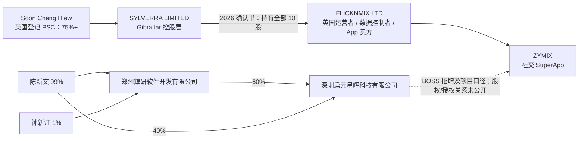

# ZYMIX / 深圳启元星晖科技有限公司深度分析报告

> **报告日期：** 2026-07-16<br>
> **研究目的：** 求职与面试前尽调，重点核验产品真实性、品牌与招聘主体关系、融资及控制权、用户增长、商业模式、数据与支付合规、岗位和劳动关系风险<br>
> **目标范围：** ZYMIX（`zymix.ai`）、英国 FLICKNMIX LTD、深圳启元星晖科技有限公司及公开招聘中出现的关联/合作主体<br>
> **重要前提：** 据求职者提供的 BOSS 直聘沟通信息，深圳启元星晖称“ZYMIX 是其公司产品”。本报告把这项说法作为需要核验的招聘口径，而不是直接当作股权、商标或知识产权归属证明。<br>
> **来源等级：** A = 政府、监管、应用商店或合同原文；B = 公司官网、公司新闻与公司自述；C = 招聘平台和工商信息聚合页；D = 用户评论、社交账号等弱信号；E = 基于公开事实的分析推断。<br>
> **阅读提醒：** “未找到公开证据”不等于事项一定不存在；未上市早期公司的融资、合同和集团架构可能不公开。报告中的求职评分不是投资评级或法律意见。

---

## 一、执行摘要

### 1.1 一句话判断

ZYMIX 是一个**真实可下载、2025 年秋才正式上线、目前仍处 Beta 和英国校园冷启动阶段的社交 SuperApp 项目**；深圳启元星晖确有 ZYMIX 招聘关联，但它于 2026 年 6 月才成立，公开股权链无法连接到英国发行主体，因此“是我们的产品”目前只能证明业务/招聘口径，不能证明法律所有权或同一控制。

### 1.2 对用户补充信息的直接回答

“深圳启元星晖说 ZYMIX 是他们公司的产品”与以下事实相容：

- 深圳、郑州、杭州、成都等中国团队正在为 ZYMIX 招聘研发和运营人员；
- 招聘岗位的技术栈、产品模块与 ZYMIX 官网及 App 功能高度对应；
- 深圳启元星晖可能是项目在中国新设的研发、招聘或区域运营载体。

但它**不能单独证明**：

- 深圳启元星晖持有 ZYMIX 商标、代码或其他知识产权；
- 深圳启元星晖是 FLICKNMIX LTD 或 Gibraltar 控股公司的子公司；
- 两者有相同的最终受益人；
- 中国员工一定是为品牌自营核心团队工作，而不是通过关联公司、服务商或外包安排交付。

截至报告日，可核法律文件仍把 ZYMIX 的运营者、数据控制者、用户合同相对方和 iOS 卖方统一写为 **FLICKNMIX LTD**。[S1-S4][S11][S16] 中国工商股权则向上指向陈新文和郑州耀研，尚未出现 FLICKNMIX、Sylverra 或其英国/境外控制人。[S24-S27]

因此，最准确的结论是：

> **招聘和项目关联：较强；股权、授权及知识产权归属：公开证据不足；“中国子公司”身份：尚未证实。**

### 1.3 综合判断

| 维度 | 判断 | 置信度 |
|---|---|---:|
| 产品真实性 | iOS、Android、官网、版本迭代和支付服务均可核 | 高 |
| 产品阶段 | 2025-10 首发，Google Play 明示 Beta；仍是早期产品 | 高 |
| 用户规模 | Android 仅显示 500+ 下载，iOS 英区 33 个评分；没有 DAU/MAU/留存 | 高 |
| 增长方式 | 以英国校园活动、大使制、基础报酬和按下载奖励冷启动 | 高 |
| 商业化 | 钱包、活动、Mini App、商城和创作者存在潜在收入路径，但未见收入或定价证明 | 中高 |
| AI 能力 | 官网有 AI 社交助手叙事，未披露模型、评测、使用量或已上线能力 | 中高 |
| 英国主体 | FLICKNMIX LTD 真实存续，2019 年成立，但 ZYMIX 品牌阶段始于 2025 年 | 高 |
| 中国招聘主体 | 深圳启元星晖真实存在且招募 ZYMIX 岗位，但仅成立约一个月 | 高 |
| 中英控制关系 | 有业务关联信号，没有公开股权或授权文件闭环 | 中高 |
| 融资 | 未找到可验证轮次、金额、投资方或估值；招聘平台“A轮”标签不能作为融资证明 | 中高 |
| 治理稳定性 | 英国主体在产品上线前后更换董事，并两次更换 75%+ 实际控制人 | 高 |
| 合规成熟度 | 已补充年龄保证、ICO 登记和 Mangopay，但商店数据披露、跨境研发和安全材料仍有明显缺口 | 中高 |
| 求职价值 | 核心工程岗可接触复杂的全球社交产品从 0 到 1；学习价值与不确定性都高 | 中 |

### 1.4 最重要的正面信号

1. **项目不是纯概念。** App 可下载、2026-07-15 仍在更新，覆盖 IM、音视频、社区、短视频、本地活动、钱包、Mini App 和小游戏。[S2][S11][S13]
2. **迭代速度快。** 公开版本记录显示 2025 年 Beta 以来持续更新，2026 年 5-7 月密集加入钱包、短视频、位置、话题、自动翻译和新闻等功能。[S34]
3. **英国运营链条可核。** 用户条款、隐私政策、App Store、Companies House 和 ICO 登记都能指向 FLICKNMIX LTD。[S3][S4][S11][S16][S21]
4. **支付基础设施不是自建空壳。** 条款明确使用 Mangopay UK Limited；Mangopay 的英国电子货币机构牌照可核。[S4][S22]
5. **中国团队招聘覆盖核心技术。** Go、原生 Android/iOS、SRE、测试、产品、设计和 AI Agent 岗位与实际产品复杂度相符，说明正在建设交付团队。[S35-S41]
6. **英国校园切入点具体。** 大使计划、校园活动、Hackathon 和 2026 年秋季大学推广形成了可理解的冷启动路径。[S7-S10]

### 1.5 最重要的风险

1. **主体关系没有法律闭环。** 对求职者最关键的不是“是否同一项目”，而是谁签合同、谁发薪、谁拥有 IP、谁给中国公司预算，以及项目终止时谁承担义务。
2. **用户规模非常早期。** 500+ Android 下载和 33 个 iOS 英区评分不足以证明产品市场匹配，更无法证明留存或校园网络密度。[S11-S13]
3. **增长含明显激励。** 校园大使可获得每月 £200-£400 和下载奖金；评分与下载不能直接解释为自然增长。[S7]
4. **融资与现金跑道完全不透明。** 未找到公开融资文件；英国旧主体 2024 年净资产仅 £10、平均员工 1 人，虽不能代表重组后资金，却说明当前项目不是该英国主体多年规模化经营的自然延续。[S19][S20]
5. **控制权快速变化。** 2025-12 与 2026-06 两次更换 75%+ PSC，且当前直接股东进入 Gibraltar 控股层；并购、重组或融资的真实经济安排未公开。[S18][S19][S31]
6. **范围过宽。** 以当前规模同时建设消息、短视频、内容推荐、LBS、直播/音视频、支付、商城、Mini App、AI 和内容安全，研发与合规负担极重。
7. **数据披露不一致。** Google Play Data Safety 页面与官方隐私政策在位置、联系人、消息、UGC、金融信息等类别上存在明显差异。[S3][S14]
8. **跨境研发责任未说明。** 隐私政策列出 UK/EU/US 传输和供应商，但未公开解释中国多主体团队如何访问英国用户数据、以何种处理者身份访问、采用何种传输机制。[S3]
9. **当前控制人存在需核实的同名风险线索。** 加拿大官方记录中的 `HIEW SOON CHENG` 控制过受证券监管警示的 8V 公司，姓名与英国 PSC 完全对应，但缺出生日期/国籍，尚不能确认是同一人，更没有证据显示相关事件与 ZYMIX 有关。[S18][S45-S48]

### 1.6 求职结论

**建议继续面试，但把它当成高不确定性的早期跨境创业项目，而不是成熟英国互联网公司。**

可以考虑的前提：

- 岗位明确属于 ZYMIX 核心产品，不是无期限客户项目或人力外包；
- 现金薪酬本身足够有吸引力，不依赖无法估值的期权；
- 招聘方能书面解释中英主体关系、预算来源、合同/发薪/社保主体；
- 能给出真实的 DAU、留存、校园活跃密度、现金跑道和 12 个月优先级；
- 数据、内容安全和支付功能有清楚的责任人及发布门禁。

应暂停或拒绝的信号：

- Offer 前仍不告知劳动合同全称、发薪主体或社保城市；
- 把 BOSS 的“A轮”“20-99人”当作融资与团队证明，却不给投资方和到账材料；
- 把 Mangopay 牌照表述为 ZYMIX 自有支付牌照；
- 只展示注册量或下载量，不给 D1/D7/D30 留存和校园级 DAU；
- 期权只写“视表现授予”，不写授予公司、股数、完全稀释比例和行权条款；
- 要求中国研发直接访问生产私信、位置或支付数据，却没有权限、审计和跨境数据文件。

---

## 二、目标识别与同名排除

本报告研究对象是官网 `zymix.ai`、包名仍为 `com.siuper.im` / `app.prod.Siuper` 的社交应用 ZYMIX。

公开网络上另有多个同名对象：

- 英国 `ZYMIX LIMITED`（Company No. 09860849）；
- 美国/拉斯维加斯混凝土与材料相关的 Zymix；
- 其他国家的同名技术或品牌页面。

这些对象都不是本报告目标。目标产品的用户条款、隐私政策、App Store 卖方和官网页脚均指向 **FLICKNMIX LTD（Company No. 12203063）**。[S1-S4][S11][S16]

`zymix.ai` 于 2025-09-16 注册，距 iOS 首发 2025-10-09 仅约三周。[S11][S15] 包名保留 `Siuper`，说明代码或内部项目名可能早于 ZYMIX 品牌；因此域名日期能证明 ZYMIX 公开品牌很新，但不能证明全部代码只开发了三周。

---

## 三、主体关系：可证实什么，不能证实什么

### 3.1 公开证据关系图



图中实线表示有英国公司登记或中国工商摘要支持的关系；虚线只表示招聘/业务关联。Sylverra 自身的最终股东无法从免费 Gibraltar 官方登记中独立核验，但英国 PSC 记录明确把 Soon Cheng Hiew 列为 FLICKNMIX 的 75%+ 实际控制人。[S18][S19][S31]

### 3.2 各主体概览

| 主体 | 可核信息 | 与 ZYMIX 的公开关系 | 关键问题 |
|---|---|---|---|
| **FLICKNMIX LTD** | 2019-09-12 成立，英国 Active 私营有限公司，No. 12203063 | 官网运营者、用户合同方、数据控制者、iOS 卖方 | 2025 后重组资金、研发团队和 IP 归属未披露 |
| **SYLVERRA LIMITED** | 公司自述为 Gibraltar 控股公司；英国 2026 确认书显示持有 FLICKNMIX 全部 10 股 | FLICKNMIX 直接股东层 | Gibraltar 股东、收购对价和集团资金来源不公开 |
| **深圳启元星晖科技有限公司** | 2026-06-15 成立，资本 200 万元，法定代表人陈新文 | BOSS 招聘方称 ZYMIX 为其产品 | 是否获品牌/IP 授权、是否签 DPA/研发服务协议 |
| **郑州耀研软件开发有限公司** | 2026-01-08 成立，资本 100 万元，陈新文 99%、钟新江 1% | 持深圳启元星晖 60%，并发布 ZYMIX 技术岗 | 是否为中国实际研发中心和资金中转主体 |
| **广州研智博耀科技有限公司** | 2025-12-26 成立，蔡汉忠 100% 持股 | 发布 ZYMIX 产品/UI/运营岗位 | 未见与陈新文或英国主体的股权关系 |
| **杭州文源智创科技有限公司** | 2026-04-02 成立，法定代表人陈新文 | 招聘测试、Go、AIGC、AI Agent | 与 ZYMIX 的合同关系和实际项目范围 |
| **成都耀研锦程软件科技有限公司** | 2026-04-14 成立，法定代表人陈新文 | 自称海外社交 IM 项目配套运营中心 | 工作内容、预算和用工责任 |
| **深圳市文合电子商务有限公司/文合优选** | 2018 年成立的陈新文旧业务主体 | 也发布过 ZYMIX 技术/设计岗 | 旧电商团队与新社交项目如何分账、分工 |

### 3.3 深圳启元星晖的工商链路

第三方工商摘要显示：[S24-S27]

- **统一社会信用代码：** `91440300MAKFTCTN08`；
- **成立日期：** 2026-06-15；
- **注册资本：** 200 万元人民币；
- **法定代表人：** 陈新文；
- **地址：** 深圳市南山区科兴科学园 A 栋 A4-507；
- **股东：** 郑州耀研 60%，陈新文 40%；认缴期限为 2031 年，公开摘要未显示实缴金额。

郑州耀研的公开摘要为：

- **统一社会信用代码：** `91410100MAK65DWX51`；
- **成立日期：** 2026-01-08；
- **注册资本：** 100 万元人民币；
- **法定代表人：** 陈新文；
- **股东：** 陈新文 99%，钟新江 1%；公开摘要未显示实缴金额。

若这些股比准确，陈新文对深圳启元星晖的穿透经济权益约为 `40% + 60% × 99% = 99.4%`，钟新江约为 0.6%。这是按公开摘要计算的推断，不替代完整工商档案或代持核验。

### 3.4 “是公司的产品”应如何验真

招聘人员口中的“我们的产品”可能对应至少五种法律现实：

1. 中国公司直接拥有商标、代码和产品资产；
2. 中国公司受英国主体委托研发，产品法律上属于英国公司；
3. 中英公司受同一未公开境外母公司控制；
4. 中国公司由创始人/合作方控制，但与英国公司只签服务协议；
5. 招聘公司只是人力、研发外包或区域交付供应商。

目前公开证据更支持“**参与研发/招聘/运营**”，尚不足以在 1-5 中确定具体一种。最直接的核验材料应是：

- ZYMIX 商标注册人和软件著作权/IP 转让文件；
- FLICKNMIX 与深圳启元星晖/郑州耀研之间的研发、许可或服务协议首页；
- 集团组织架构图及双方最终受益人说明；
- 中国团队预算、工资资金来源和内部汇报线；
- 数据处理协议（DPA）和跨境访问机制。

---

## 四、关键时间线

| 时间 | 事件 | 解读 |
|---|---|---|
| 2019-09-12 | FLICKNMIX LTD 在英国成立 | 是旧英国主体成立，不等于 ZYMIX 产品从 2019 年持续运营 [S16] |
| 2019-09 至 2025-12 | Jie Yin 为 75%+ PSC；并长期任董事 | 当前项目启动前的旧控制阶段 [S17][S18] |
| 2024-09-30 | 英国主体旧财年结束，平均员工 1 人、净资产 £10 | 说明旧主体规模极小；不能代表 2025 重组后现金 [S20] |
| 2025-04-29 | `flicknmix.io` 域名注册 | 品牌基础设施在 2025 年开始出现 [S42] |
| 2025-08-11 | Charles Daniel Murray 上任董事，居住 Gibraltar | 董事和地址进入重组阶段 [S17][S19] |
| 2025-09-16 | `zymix.ai` 注册 | ZYMIX 公开品牌很新 [S15] |
| 2025-10-09 | ZYMIX iOS 首次发布 | 当前产品阶段的合理起点 [S11] |
| 2025-10-30 | Jie Yin 辞任董事 | 旧管理阶段结束 [S17] |
| 2025-12-17 | Shengguang Yang 成为 75%+ PSC；股份进入 Sylverra 层 | 第一次可核控制权转移 [S18][S19] |
| 2025-12-26 | 广州研智博耀成立 | 中国项目招聘主体开始出现 [S28][S29] |
| 2026-01-08 | 郑州耀研成立 | 后续深圳主体的直接控股股东 [S26][S27] |
| 2026-01-22 | FLICKNMIX 以 ZYMIX 其他名称完成 ICO 登记 | 晚于 iOS 首发约三个月 [S21] |
| 2026-01 至 02 | Android 版本上线 | Google Play 公开规模仍为 500+ 下载 [S13][S34] |
| 2026-04 | 杭州文源智创、成都耀研锦程成立 | 中国研发/运营载体扩展 |
| 2026-05 | 隐私政策允许 16+，承认部分未成年人保护能力仍在实现 | 合规处于快速补课期 [S5] |
| 2026-05-09 | 1.1.0 重构消息核心并加入钱包、短视频 | 大版本升级，也出现旧版消息不能同步、需重装的迁移风险 [S34] |
| 2026-06-01 | Soon Cheng Hiew 成为当前 75%+ PSC | 半年内第二次控制权转移 [S18][S19] |
| 2026-06-15 | 深圳启元星晖成立 | 晚于 ZYMIX iOS 上线约八个月，不可能是其最初发行主体 [S24][S25] |
| 2026-07 | 用户最低年龄由 16 改为 18，并加入年龄保证 | 对英国 Online Safety Act 压力的快速响应 [S3-S5] |
| 2026-07-15 | iOS 1.1.10、Android 同日更新 | 产品仍在活跃开发 [S11][S13] |
| 2026 秋季（计划） | 官网称将在英国大学集中推广 | 当前更像上线前扩张/校园试点，而非已经大规模覆盖 [S8] |

时间线显示，**ZYMIX 品牌上线、英国董事/股权重组、中国多地公司成立和密集招聘几乎都发生在 2025-2026 年。** 最合理的工作假设是“旧英国公司被重组后承载新项目”，但公开文件不能确定这是收购、内部换股、融资还是单纯股权转让。

---

## 五、英国主体、控制权与治理

### 5.1 FLICKNMIX LTD 基本信息

Companies House 记录：[S16]

- Company No. `12203063`；
- 状态 Active；
- 2019-09-12 成立；
- 注册地址 `15 Fitzroy Street, London, England, W1T 4DG`；
- SIC：软件出版、软件开发、其他 IT 服务、Web portals；
- 当前唯一董事 Charles Daniel Murray，英国籍、居 Gibraltar，2025-08-11 上任。[S17]

官网没有公开创始人、CEO、核心高管或组织架构。Companies House 的董事是法定角色，不必然等于产品日常负责人；PSC 是控制权申报，也不等于经营管理者。因此面试应直接问清：谁是 CEO、产品负责人、CTO、预算批准人，以及其与 Murray、Hiew 和陈新文的关系。

### 5.2 实际控制权变化

英国 PSC 记录为：[S18]

| 阶段 | 75%+ PSC | 国籍/居住地 | 说明 |
|---|---|---|---|
| 2019-09-12 至 2025-12-17 | Jie Yin | 中国籍 / 英国 | 同时是历史董事 |
| 2025-12-17 至 2026-06-01 | Shengguang Yang | 瓦努阿图籍 / 新加坡 | 第一轮控制权变更 |
| 2026-06-01 起 | Soon Cheng Hiew | 马来西亚籍 / 马来西亚 | 当前控制人，持股控制 75%+ |

2025 年确认书将全部 10 股转至 Gibraltar 的 `SYLVERRRA LTD`（英国申报文件中的拼写），2026 确认书使用 `SYLVERRA LIMITED`；Sylverra 官网自述为 Gibraltar holding company。[S19][S31] 名称拼写差异和最终持股层应在正式尽调中核对。

这组变化不是自动的负面结论：它可能代表收购、新资金入场或集团重组。但对员工而言，它影响：

- 预算和现金由谁提供；
- IP 与产品资产是否已转移；
- 旧团队承诺和员工期权是否承接；
- 中国实体与英国实体是否签有稳定的长期协议；
- 控制人再次变化时中国团队如何处置。

### 5.3 2024 微型财务报表

截至 2024-09-30 的未经审计 micro-entity accounts：[S20]

| 项目 | 2024 | 2023 |
|---|---:|---:|
| Current assets | £161 | £415 |
| Prepayments and accrued income | £11,180 | £0 |
| 一年内债权人 | £10,958 | £10,959 |
| Accruals and deferred income | £373 | £253 |
| Net assets / liabilities | **£10** | **-£10,797** |
| 平均员工（含董事） | **1** | **1** |

正确解读：

- 该报表反映的是 ZYMIX 首发前的旧主体，不能用于推断 2026 年集团现金余额；
- 它没有公开损益表，不能据此计算收入、毛利或 burn；
- 但它足以说明截至 2024 年，该英国公司不是一个已有大团队和雄厚资产的社交平台；
- 2025-2026 的产品投入必须来自重组后的股东、集团借款、其他主体或新收入，具体来源没有公开。

### 5.4 融资核验

截至报告日，没有找到以下可独立验证信息：

- 公开融资轮次、金额、估值和到账日期；
- 可核投资机构名单；
- Companies House 的 SH01 增发记录；
- FLICKNMIX 名下已登记 charges；
- 主流商业媒体对融资的独立报道。

BOSS 等招聘平台的“A轮”是企业自填标签，不能等同于完成 A 轮。控制权转让也不能自动解释为融资，因为可能是老股收购或内部重组。[S19][S23]

FLICKNMIX 自有官网另称 ZYMIX “Launched in London in 2025”并“backed by a US-listed company”。[S44] 前半句与域名和 App 首发时间一致，后半句却没有披露上市公司全称、股票代码、支持方式、金额或监管公告。本次也未找到能把该说法闭环到具体上市公司的公开文件。因此它只能列为**公司自述的未验证背书**，不能据此推断已完成融资、上市公司提供担保，或 ZYMIX 属于上市公司并表子公司。

面试中应要求对方回答：

1. 最近一次实际到账时间与金额；
2. 当前可用现金；
3. 最近三个月平均月 burn；
4. 在收入不增长情况下的 runway 月数；
5. 所谓“US-listed company”全称、ticker、股权/借款/商业合作性质及可核公告。

### 5.5 当前控制人的同名身份风险信号（未完成身份闭环）

这部分必须严格区分“官方记录中的姓名相同”与“已经确认是同一人”。

Corporations Canada 显示，`EIGHT V TECHNOLOGY LTD.`（Corporation No. `1351684-9`）的唯一董事及直接持股 75%+ 的控制人为 **HIEW SOON CHENG**；公司于 2021-11-16 成立，并在 2026-07-15 由公司主动解散。[S45] 按华人姓名在不同登记系统中的常见顺序还原，该姓名与 FLICKNMIX 当前英国 PSC **Soon Cheng Hiew** 完全对应。[S18]

加拿大证券管理机构和魁北克 AMF 在 2023-05-11 对 Eight V Technology Ltd / 8V Exchange 发布投资者警示，称其未注册、无权在魁北克招揽投资。[S46][S47] `8v.com` 当前页面则显示域名已依据美国哥伦比亚特区联邦法院扣押令被 FBI 查封。[S48]

但公开加拿大页面没有给出该董事的出生日期或国籍，因而无法与英国记录中的“1984 年 12 月出生、马来西亚籍/居住马来西亚”完成唯一身份匹配；本次也没有证据显示 EIGHT V、8V Exchange 或相关监管事件与 ZYMIX/FLICKNMIX 的产品或资金有关。**不得把上述事件直接归因于 ZYMIX，也不得把两位同名者写成已确认同一人。**

对求职尽调而言，这仍是高优先级核验项。可向公司合规或管理层书面询问：

1. FLICKNMIX 当前 PSC 是否曾任 EIGHT V TECHNOLOGY LTD / 8V Exchange 董事或控制人；
2. 若为同一人，其与 8V 的历史角色、离任/解散和监管事项如何解释；
3. 8V 或任何相关主体是否向 FLICKNMIX、Sylverra、ZYMIX 或中国团队提供资金、IP、人员或技术；
4. 公司是否可提供当前资金来源、反洗钱及制裁筛查说明。

---

## 六、产品、技术与成熟度

### 6.1 产品矩阵

官网定位不是单一 AI 应用，而是“UK's First All-In-One Social SuperApp”。[S1][S2]

| 模块 | 官网/商店能力 | 主要技术与运营难点 |
|---|---|---|
| Messaging & Calls | 私聊、群聊、文件、多媒体、音视频、实时翻译 | 消息可靠性、离线同步、滥用治理、加密、音视频成本 |
| Community | 校园/兴趣社区、群组、社群管理 | 局部网络密度、管理员工具、内容安全 |
| The Mix / Moments | 短视频、动态、个性化内容和新闻 | 推荐、版权、审核、创作者供给、存储/CDN |
| Events / Local Discovery | 附近的人、活动、本地服务 | LBS 隐私、商家供给、线下安全、城市密度 |
| Wallet | P2P、分账、积分、活动/服务支付 | KYC、反欺诈、退款、清算、金融合规 |
| Mini Apps / Games | 免下载本地服务、小程序、电商和小游戏 | 容器安全、开发者生态、审核、支付分成 |
| ZYMIX AI | 社交助手、日程和问题解决；官网称 foundational AI model | 模型成本、能力真实性、隐私、幻觉与产品价值 |

产品广度已经接近多个成熟平台的合集。对早期团队而言，真正的风险不是功能能否做出 Demo，而是每个模块都要达到最低可靠性、安全性和供给密度。

### 6.2 商店事实

截至 2026-07-16：[S11-S13]

| 指标 | iOS（英国区） | Android（英国区） |
|---|---|---|
| 首发 | 2025-10-09 | 2026 年 1 月底/2 月初 |
| 当前版本 | 1.1.10 | 2026-07-15 更新 |
| 发行/开发主体 | FLICKNMIX LTD | FLICKNMIX LTD |
| 包名 | `app.prod.Siuper` | `com.siuper.im` |
| 商店分类/年龄 | Social Networking；17+ | PEGI 18 |
| 公开规模 | 4.67/5，33 ratings | 500+ downloads；未展示评分样本 |
| 状态 | 免费，约 504.9 MB，要求 iOS 18+ | 商店文案明确 Beta / active development |

注意：

- iOS 的 33 个评分不是下载数，也不是活跃用户；
- Google Play 的 500+ 是区间标签，只能说明达到 500 档，不能推断全平台总用户；
- 中国区 Apple Store 查不到该 App，与英国校园主市场定位一致；
- 约 505 MB 且仅支持 iOS 18+，会增加安装阻力，与“轻量、减少摩擦”的产品叙事存在张力。

### 6.3 更新速度与稳定性

公开版本档案显示 Beta 以来近 30 次更新，平均约 9 天一次；主要节点包括：[S34]

- 1.1.0：短视频、钱包，并重建消息核心；
- 1.1.2：实时位置和高级群管理；
- 1.1.4：话题、位置标签、水印；
- 1.1.6：弹幕；
- 1.1.7：自动翻译、Shake；
- 1.1.10：新闻频道。

频繁迭代说明团队有交付能力，但官网 1.1.0 升级提示曾要求用户删除旧版本后重装，且旧版本无法同步新消息。这是消息架构发生破坏性迁移的信号，也说明兼容、数据迁移和发布工程仍不成熟。[S1][S34]

### 6.4 AI 能力核验

官网把 ZYMIX AI 描述为“understands you”的社交助手，并声称有“Foundational AI model for social application”。[S2] 但未公开：

- 模型名称、是自研还是调用第三方；
- 上线入口、覆盖用户、调用量或留存；
- 离线/在线评测；
- 数据训练授权和模型安全措施；
- AI 功能收入或成本。

隐私政策能确认的 AI 用途主要是内容推荐、画像和 AI 辅助审核。[S3][S5] 招聘中的 LangChain/LangGraph、Planning、Memory 和 Tool Calling 岗位说明团队在建设 Agent 能力，但不能证明官网所称“基础模型”已存在。[S41]

因此，当前更稳妥的表述是：**ZYMIX 是在社交产品中建设 AI 功能，而不是已有可验证基础模型壁垒的 AI 公司。**

### 6.5 招聘岗位透露的技术侧面

招聘页面出现：[S35-S41]

- Go 后端和高并发服务；
- 原生 Android / iOS；
- IM、Feed、LBS、音视频、短视频/短剧、小程序容器、钱包和 AA 分账；
- SRE 负责生产、灰度、测试环境和高可用；
- 多端自动化/全端测试与 AI 辅助测试；
- AI Agent / AIGC；
- JD 中出现端到端加密要求。

这与官网范围相互印证，也暴露一个组织问题：每一项都是可独立养活一个团队的复杂系统。面试应问各模块正式员工数、on-call 轮值、质量指标和未来 12 个月真正的前三优先级。

JD 提到端到端加密，但官网条款和隐私政策没有承诺消息为 E2EE，只描述一般安全措施。应要求说明：哪些消息类型端到端加密、密钥如何管理、服务端审核如何与 E2EE 共存、备份和多设备同步如何处理。

---

## 七、真实增长信号与校园冷启动

### 7.1 当前能看到的规模

- Android：500+ 下载；[S13]
- iOS 英区：33 个评分；美国 3、加拿大 1、台湾 1，其他多个地区为 0；[S11]
- Apple RSS 可见 21 条英国评论，其中 20 条集中在 2026-06-03 至 07-12；[S12]
- Instagram `@zymix_official`：约 1,920 followers、15 posts；[S32]
- X `@zymix_official`：9 followers、0 posts，2025-12 加入。[S33]

这些是“产品已进入真实市场”的证据，但离“规模化社交平台”很远。公开资料没有 DAU、MAU、注册转激活、每用户好友数、消息发送、内容供给、留存或校园覆盖。

### 7.2 评分和评论如何解读

英国 iOS 公开评论约为 18 个五星、1 个四星、1 个三星和 1 个一星，整体 4.67。[S12] 正面评论提到小游戏、通勤和朋友推荐；一星评论声称活跃不足、语言异常切换和注册后接到垃圾电话。

不能据单条评论认定存在数据泄露，也不能据少量五星评价认定产品已形成口碑。样本小、时间集中，并与校园活动和付费拉新时间重合，应只作为弱信号。

### 7.3 校园大使计划

官网公开：[S7]

- Campus Events Lead：£200-£400/月 + bonus；
- Brand Advocate：£200-£400/月 + download bonus；
- 提供个人 referral code、活动二维码和 tracking dashboard；
- 有排行榜、绩效奖励和进一步岗位机会。

这是一套典型的校园地推与付费获客机制。它能快速制造局部下载和活动曝光，但关键不是下载总数，而是：

```text
付费触达 → 安装 → 注册 → 完成资料/年龄验证 → 添加真实好友
       → 加入校园群 → 首周产生消息/活动 → 30/90 天留存
```

如果漏斗在“安装”后快速流失，SuperApp 的功能数量不会形成网络效应。

### 7.4 活动与媒体曝光

公司称：

- 作为 VibeHack London 2026 title sponsor，活动有 300+ 学生和 £10,000 奖池；[S9][S10]
- 参加校园活动、London treasure hunt；
- 在 Henley Royal Regatta 期间展示品牌。

这些主要来自公司自有页面或新闻稿转载。本次未找到 UCL 对所谓合作的官方确认；Henley Royal Regatta 官网搜索也没有 ZYMIX 结果。[S9][S43] 因而应写成“公司举办/宣称参与”，不应升级为“UCL 官方合作伙伴”或“Henley 官方赞助商”。

### 7.5 面试必须索取的增长数据

1. 当前注册用户、DAU、WAU、MAU；
2. D1、D7、D30、D90 留存，按 iOS/Android 和自然/付费拆分；
3. 每个校园的 WAU、好友关系数、群聊密度和每 DAU 消息数；
4. 大使渠道每注册、每激活、每 D30 留存用户成本；
5. 新用户在 24 小时内找不到好友/内容的比例；
6. 钱包开户、KYC、首笔交易和复购转化；
7. 内容审核量、举报率、处理时长和申诉改判率；
8. 评分、下载和活动数据中付费激励所占比例。

---

## 八、商业模式与单位经济

### 8.1 当前变现状态

ZYMIX 可免费下载；iOS 未公开订阅/IAP 产品，Google Play 标记有 In-app purchases，但没有公开价格表。隐私政策称目前没有定向广告。[S3][S11][S13]

因此，公开资料无法验证产品已经产生收入，更无法验证收入规模、毛利或付费留存。

### 8.2 潜在收入路径

| 路径 | 依据 | 成立条件 | 当前证据强度 |
|---|---|---|---:|
| 支付/钱包交易收入 | 钱包、P2P、分账和 Mangopay | 用户愿意 KYC，交易频率高，合规成本可控 | 中 |
| 活动票务/商户佣金 | Events、local discovery | 有独家活动/商户供给和本地用户密度 | 中低 |
| Mini App 平台分成 | Mini Apps、本地服务、电商 | 有开发者、审核体系、支付闭环和用户量 | 低 |
| Point Mall / 电商 | 官网新闻介绍 Point Mall | 有商品、履约、售后和转化 | 低 |
| 创作者变现抽成 | 条款提及 creator monetisation | 有内容供给和消费规模 | 低 |
| 品牌活动/推广 | 校园活动和大使体系 | 品牌方愿为可量化校园触达付费 | 低 |
| AI 增值订阅 | ZYMIX AI 叙事 | 能力差异化且推理成本可控 | 低 |
| 未来广告 | 当前明确无定向广告 | 用户规模、同意机制和广告系统成熟 | 低 |

“有很多可变现入口”不等于商业模式已验证。SuperApp 往往要先补贴用户、商户和开发者三端，现金消耗可能早于平台收入。

### 8.3 单位经济的核心矛盾

校园大使每月有固定成本和下载奖金，另有活动、奖池、云服务、音视频、短信验证、内容审核及工程成本。真正需要计算的是：

```text
每个留存用户 CAC
= 大使基础报酬 + 下载奖金 + 活动/奖池 + 市场人员成本
  ----------------------------------------------------
        30/90 天后仍活跃且形成真实连接的用户数
```

收入侧则需要看用户是否从社交行为迁移到钱包、活动、商城或 Mini App。没有支付频次和 take rate，就无法支撑 LTV 计算。

### 8.4 比较合理的产品切入点

当前最有逻辑的楔子不是“一次取代英国所有社交和支付应用”，而是：

> **选少数校园，以活动发现 + 社团群聊 + 好友分账形成高密度闭环，再逐步增加本地商户和 Mini App。**

如果公司没有收缩优先级，而是同时以 WhatsApp、TikTok、Revolut、Eventbrite 和微信为竞品，执行风险会显著上升。

---

## 九、竞争格局与护城河

### 9.1 分层竞品

| 用户任务 | 主要竞品 | ZYMIX 的可能差异 | 难点 |
|---|---|---|---|
| 私聊/群聊 | WhatsApp、Telegram、Discord、iMessage | 与校园活动、钱包和本地发现整合 | 迁移全部社交关系几乎不现实 |
| 短视频/动态 | TikTok、Instagram、Snapchat | 校园本地内容和真实活动 | 内容供给、推荐质量和创作者激励 |
| 校园匿名/社群 | Fizz、Sidechat、Discord/WhatsApp 社团 | 一体化身份、活动和支付 | 每个校园都要重新做局部冷启动 |
| 好友发现 | Yubo、Wizz、Snap Map | 活动场景与附近发现 | 线下安全、骚扰和年龄保证 |
| 活动票务 | Eventbrite、Fever、DICE、Luma、Meetup | 群聊内发现、组织和分账 | 商家/主办方供给和履约 |
| 分账与支付 | Monzo、Revolut、Splitwise、PayPal | 社交原生、群内 AA | 用户信任、KYC 和牌照依赖 |
| Mini App | WeChat、LINE、Telegram Mini Apps | 面向英国本地服务 | 开发者生态和分发规模 |
| AI 助手 | Meta AI、Snap My AI、ChatGPT、Gemini | 利用社交/活动上下文 | 数据许可、成本和差异化 |

### 9.2 护城河判断

当前没有证据支持以下成熟壁垒：

- 大规模独有社交图谱；
- 高留存校园网络；
- 独家商户/活动供给；
- 自研基础模型；
- 已验证支付频率；
- 高规模 Mini App 开发者生态。

最可能形成的壁垒是“少数校园的高密度真实关系 + 活动/商家供给 + 社交支付行为数据”。但这需要校园级留存而非全国总下载，且成熟平台可以复制单个功能。

### 9.3 战略风险

1. **网络效应反向作用。** 用户进来找不到朋友或内容时，功能越多也越显空。
2. **多边市场同时冷启动。** 用户、创作者、活动方、商户和 Mini App 开发者都需要供给。
3. **信任门槛高。** 新社交产品要求手机号、联系人、位置、内容和 KYC，用户切换成本不只是安装。
4. **合规成本先于收入。** 内容安全、年龄保证、支付、隐私和跨境数据都必须在小规模阶段投入。
5. **AI 不是天然壁垒。** 若主要调用通用模型，能力容易被 Meta、Snap 或独立助手复制。

---

## 十、支付、隐私、内容安全与跨境合规

### 10.1 支付牌照的正确理解

官网称钱包“Built within UK and Gibraltar e-money regulatory frameworks”。[S2] 但用户条款明确：[S4]

- 支付由 **Mangopay UK Limited** 处理；
- 用户可能需要完成 Mangopay 的 KYC；
- ZYMIX 对第三方支付系统造成的延迟或错误作出责任限制。

Mangopay 官方法律页显示其英国电子货币机构 FCA FRN 为 `984753`。[S22] 本次没有找到 FLICKNMIX/ZYMIX 自身的 FCA EMI 牌照。

因此更准确的说法是：**ZYMIX 集成持牌支付基础设施，而非已证明自己是持牌电子货币机构。** 官网未解释 Gibraltar 在支付链路中的具体实体、牌照号和责任边界，应要求产品/法务说明。

### 10.2 收集和处理的数据

2026-07 隐私政策列出：[S3]

- 手机号、生日、资料、头像；
- 用户帖子、图片、音频、视频和私信；
- 精确或近似位置、联系人；
- 设备标识、IP、日志、搜索和行为；
- 支付相关金融信息；
- 推荐画像、内容互动和审核记录；
- AI 与人工审核可能处理文本、图片、音频和视频。

供应商包括 AWS、Cloudflare、Twilio、Agora、Sentry、Axiom、Resend、AssemblyAI 和 Mangopay；数据主要在 UK/EU，部分传往美国，并声称采用 IDTA/SCC 等保障。[S3]

### 10.3 Google Play 披露不一致

Google Play Data Safety 页面主要申报 Device or other IDs，并显示与广告/营销等用途有关；页面同时出现 location sharing 标记。[S14] 官方隐私政策则承认处理手机号、资料、UGC、消息、联系人、位置、行为和金融数据。[S3]

两者存在表面上的重大不一致。可能原因包括商店表单过期、SDK/场景理解不同或填报错误，但无论原因，都是需要修正的发布合规问题。不能据此直接断言已违法或泄露数据。

### 10.4 年龄政策快速变化

2026-05 版政策：[S5]

- 最低年龄 16；
- 16-17 岁推荐和位置原则上默认关闭；
- 承认部分保护能力尚未技术实现，仍在优先建设。

2026-07 版：[S3][S4]

- 改为仅限 18+；
- 对消息、发帖、视频、成人内容和公开资料等功能引入年龄保证；
- 使用年龄确认/面部年龄估算；
- 公司称不保留自拍，只保留年龄段结果和时间戳。

两个月内从 16+ 改为 18+，说明团队在积极响应英国 Online Safety Act，也说明产品此前的年龄治理设计并未稳定。人脸年龄估算供应商未被明确命名，仍有生物特征、偏差、申诉和供应链风险。

### 10.5 ICO 登记

ICO 登记 `ZC083088` 可核，登记时间 2026-01-22，Other name 为 ZYMIX。[S21] 但登记地址写成 `15 Fitzroy Street, London, EC3A 8BE`：街道对应当前地址，邮编却接近旧 St Mary Axe 地址，而 Companies House/官网为 `W1T 4DG`。[S3][S16][S21]

这更像正式登记的数据质量问题，不能仅凭邮编错误认定无效。另一个值得追问的点是：ICO 登记晚于 iOS 首发约三个月，公司在首发时采用何种数据保护登记与治理安排。

### 10.6 内容与平台安全

产品包含公开内容、私信、附近的人、短视频、活动和支付，风险面包括：

- 骚扰、诈骗、成人内容和线下人身安全；
- 非法内容、版权、深度伪造和自伤内容；
- 私信举报、证据保全和未成年误入；
- 推荐算法放大有害内容；
- KYC、账户盗用、洗钱和支付争议；
- 内容删除、账号封禁和申诉。

隐私政策称使用 AI 与人工审核，但没有公开透明度报告、审核覆盖率、响应 SLA、独立安全审计或算法风险评估。政策还使用“compliance programme is ongoing / working towards full DSA compliance”之类措辞，说明合规体系仍在建设。[S3]

### 10.7 安全成熟度

公开材料未见：

- SOC 2 或 ISO 27001；
- 独立渗透测试摘要；
- 漏洞披露/Vulnerability Disclosure Policy；
- 端到端加密白皮书；
- 内容安全透明度报告；
- 数据泄露响应说明；
- 中国研发访问生产数据的公开处理者清单。

官网只足以确认传输安全等一般承诺，不能确认所有私信为 E2EE 或静态数据加密。对于持有私信、位置和支付行为的产品，这是重要成熟度缺口。

### 10.8 中国研发与跨境数据

若深圳、郑州、杭州或成都实体能够远程访问英国用户的生产数据，至少需要澄清：

- 中国公司是 FLICKNMIX 的处理者、分处理者还是共同控制者；
- 是否签署 DPA、UK IDTA/SCC 或采用其他合法机制；
- 哪些数据可在中国访问，是否默认脱敏；
- 生产权限、堡垒机、审批、日志和离职回收；
- 私信、精确位置、人脸年龄估算和支付信息是否禁止境外研发直接查看；
- 中国员工个人信息跨境到英国时的告知、同意和内部制度。

这是中国技术岗位的实质责任问题，而不只是法务文件问题。

---

## 十一、中国招聘、岗位与实际用工风险

### 11.1 多主体招聘现象

公开岗位显示，同一 ZYMIX 或同类海外社交 IM 项目由至少以下主体招人：

- 深圳启元星晖科技有限公司；
- 郑州耀研软件开发有限公司；
- 广州研智博耀科技有限公司；
- 杭州文源智创科技有限公司；
- 成都耀研锦程软件科技有限公司；
- 深圳市文合电子商务有限公司/文合优选；
- 个别页面使用“某互联网公司”等模糊主体。

陈新文/郑州耀研体系可以解释深圳、郑州、杭州、成都和文合之间的经营关联线索；广州研智博耀由蔡汉忠 100% 持股，未找到股权连接，更可能是服务、合作或独立交付主体。[S28-S30]

多主体本身不等于有问题，跨城市创业团队常用不同公司招聘。但它会带来四个必须拆开的身份：

```text
品牌/产品方 ≠ 劳动合同主体 ≠ 工资社保主体 ≠ 日常实际用工方
```

### 11.2 公开岗位

| 岗位 | 招聘主体/地点 | 公开线索 |
|---|---|---|
| 高级 Go | 郑州耀研 | 社交后端、高并发、IM 等 [S35] |
| 资深 Android | 郑州耀研 | 原生 Android、核心社交模块 [S36] |
| 资深 iOS | 郑州耀研 | 从 0 到 1、CI/CD、单元/UI 测试 [S37] |
| 高级 SRE/运维 | 郑州耀研 | 生产/灰度/测试环境、高可用 [S38] |
| 技术支持 | 郑州耀研 | 项目支持和问题处理 [S39] |
| 产品经理 | 广州研智博耀 | 7-12K 页面；描述中又出现安全平台市场 [S40] |
| UI/设计 | 广州/文合 | 部分聚合页曾显示 15-30K |
| AI Agent | 杭州文源智创 | LangChain/LangGraph、Planning、Memory、Tool Calling [S41] |
| 本地化/社群/素材运营 | 成都耀研锦程 | 海外社交 IM 配套运营 [S30] |

郑州主要技术岗的公开搜索摘要多次没有薪资字段。广州产品 7-12K、文合后端/设计 15-30K 等只是特定页面曾展示的区间，不能推断深圳岗位薪酬。

### 11.3 招聘口径中的不一致

- JD 同时出现“计划 2025 年在英国启动”“于 2025 年启动”和“计划 2026 年启动”；
- 有“大陆远程人才”措辞，也有郑州、深圳、广州、杭州、成都固定工作地；个别摘要甚至出现北京/后厂村；
- 广州产品经理岗位又描述“国内外安全平台市场”，可能是模板复用或其他业务线；
- “20-99 人”“50-99 人”“100-499 人”“A轮”分属不同主体的自填标签，不能相加为 ZYMIX 集团人数或融资；
- “股票期权”没有公开授予主体和计划。

这些不一致不必然意味着欺诈，更可能来自多公司、多招聘人员和快速变化。但对候选人而言，它说明口头承诺必须落到 Offer 与合同。

### 11.4 团队规模与舆情

中国主体大多在 2025-12 至 2026-06 才成立，尚没有可用年度社保人数。招聘平台人数是企业自填；不能把多个主体人数相加，也不能把文合旧电商业务人数归入 ZYMIX。

截至 2026-07-16，未找到针对 ZYMIX、深圳启元星晖、郑州耀研或广州研智博耀的可信欠薪、诈骗报道或成体系员工评价。这只能标为**信息不足**，不能标为“没有风险”或“口碑良好”。

### 11.5 岗位的真实机会

如果岗位确属核心产品，技术学习面较强：

- 全球社交产品从 0 到 1；
- IM、音视频、Feed、LBS、支付、内容安全和推荐；
- 多平台发布、灰度、国际化和跨时区协作；
- 英国 Online Safety Act、UK GDPR 和支付服务接入；
- 校园增长和局部网络效应实验。

但对应代价是：

- 需求范围大、优先级可能频繁变化；
- 生产稳定性与合规债务同时存在；
- 团队分散、多主体协作成本高；
- 中国晚上可能需要覆盖英国白天；
- 项目资金、期权价值和组织持续性不可公开验证。

---

## 十二、管理与文化判断

公开信息无法可靠识别完整创始团队、CTO、产品负责人和中国区负责人，也没有足够员工评价样本。现阶段不能对“扁平、国际化、双休、管理好”等文化标签作事实判断。

招聘方自报的双休、宿舍、下午茶、带薪年假、绩效、年终奖和股票期权，都应逐项写入文件。尤其注意：

- “双休”不等于没有英国时区晚会或线上 on-call；
- “年终奖”不等于有固定月数，应看公式和发放条件；
- “绩效”若占现金比例高，应看试用期和末位规则；
- “期权”只有授予主体、股数、完全稀释比例、行权价和归属条款齐全才有价值；
- “包住”应确认是否扣费、退宿条件和离职搬离期限。

最需要在面试现场观察的不是福利文案，而是直属经理能否清楚回答产品优先级、线上指标、失败复盘、排期取舍和数据责任。

---

## 十三、情景分析

### 13.1 乐观情景

- Gibraltar/英国重组带来充足新资金；
- 中国多地团队是低成本但有明确治理的研发和运营体系；
- 2026 秋季在少数大学形成高密度网络；
- 群聊、活动和分账形成真实留存；
- Mangopay 和年龄保证降低支付/未成年人合规门槛；
- 团队随后收缩范围，以校园闭环而非全功能竞争。

结果：核心员工能获得高成长的从 0 到 1 经历，项目有机会扩展到更多英国城市。

### 13.2 基准情景

- 产品继续快速迭代，但自然增长弱，主要依赖校园大使和活动；
- 功能广、质量与合规持续补课；
- 商业化在 12-24 个月内仍不明确；
- 中国团队职责变化快，多主体并存；
- 岗位学习价值高，稳定性和流程成熟度一般。

### 13.3 悲观情景

- 校园安装不能转化为好友关系和留存；
- 多模块分散资源，消息可靠性、内容安全或数据披露出现事故；
- 钱包 KYC 转化低，Mini App 和商家供给起不来；
- 新股东资金或集团协议中断；
- 中国主体之间调整合同、裁撤城市或改为项目外包；
- 期权因授予主体与英国资产脱节而没有实际价值。

### 13.4 领先指标

判断项目更接近哪个情景，不要等新闻稿，观察：

1. 单校园 D30/D90 留存是否连续改善；
2. 非激励自然新增占比是否上升；
3. 每 DAU 好友数、群消息和线下活动参与是否形成密度；
4. 核心团队是否停止无边界加功能；
5. 中国公司是否稳定发薪、交社保并统一汇报线；
6. 隐私、商店标签、安全和内容透明度是否持续完善；
7. 资金和控制权是否在未来 12 个月保持稳定。

---

## 十四、面试追问清单

### 14.1 公司主体、融资与治理

1. 深圳启元星晖与 FLICKNMIX LTD、SYLVERRA LIMITED 的法律关系是什么？有股权、许可还是研发服务协议？
2. ZYMIX 商标、代码仓库、App Store/Google Play 账号和域名分别由谁拥有？
3. 为什么中国核心招聘主体到 2026 年 6 月才成立？此前研发由谁承担？
4. 2025-12 和 2026-06 两次英国 PSC 变化分别是什么交易？
5. 当前 CEO、CTO、中国区负责人和预算批准人是谁？
6. 最近一轮资金实际到账金额、日期、投资方、月 burn 和 runway 是多少？
7. BOSS 的“A轮”对应哪一主体、哪一轮融资？
8. 当前 PSC 与加拿大 EIGHT V TECHNOLOGY LTD 的同名董事是否为同一人？如是，是否与 ZYMIX 存在资金或业务关系？
9. 若英国股东再次变化，中国劳动合同和项目预算如何保证？

### 14.2 产品与增长

1. 当前注册、DAU、WAU、MAU、D1/D7/D30/D90 留存分别多少？
2. 数据能否按校园、渠道、iOS/Android 和自然/激励拆分？
3. 500+ Android 下载之后，完成注册、年龄验证、加好友和首周活跃的漏斗是多少？
4. 每所重点大学的活跃用户和群聊密度是多少？
5. 校园大使每个 D30 留存用户 CAC 多少？
6. 2026 秋季推广成功与失败的量化阈值是什么？
7. 未来 12 个月三个最高优先级是什么，哪些模块明确不做？
8. 钱包、活动、Mini App、商城、广告和 AI 中，首个收入来源是什么？

### 14.3 技术、AI 与稳定性

1. 1.1.0 为什么需要删除重装，如何保证消息不丢失？
2. 消息 SLO、发送成功率、P95 延迟、崩溃率和重大事故记录是什么？
3. 哪些内容真正端到端加密？服务端审核与密钥管理如何兼容？
4. AI 助手是否已上线？底层模型、自研比例、调用成本和核心指标是什么？
5. 推荐系统优化的是停留、连接、活动参与还是安全？
6. SRE/on-call 如何轮值，英国晚间事故由谁响应？
7. 当前正式工程师、外包和供应商分别多少人？
8. 技术债、功能交付和合规修复如何分配人力？

### 14.4 数据、内容和支付合规

1. Google Play Data Safety 与隐私政策的数据类别为何不一致，何时修正？
2. 中国团队能访问哪些 UK/EU 用户生产数据？DPA、IDTA/SCC 和权限审计在哪里？
3. 年龄估算供应商是谁，误判率、申诉和人工复核怎样做？
4. 当前 Online Safety Act 风险评估、非法内容职责和透明度报告进度？
5. 内容审核 SLA、举报率、申诉改判率和重大安全事件？
6. FLICKNMIX 是否持有任何支付许可，还是完全依赖 Mangopay？
7. 官网所称 Gibraltar e-money framework 对应哪个实体和牌照号？
8. 是否有渗透测试、Vulnerability Disclosure Policy、SOC 2/ISO 27001 路线图？

### 14.5 岗位、用工与直属经理

1. 劳动合同、工资、个税、社保、公积金分别由哪个主体承担？
2. 岗位是 ZYMIX 自营核心团队、关联公司交付，还是客户/外包项目？
3. 我直接汇报给谁？对方属于英国还是中国哪个主体？
4. 岗位是新增还是替补？过去 12 个月团队进出人数？
5. 入职 30/60/90 天目标和可控制资源是什么？
6. 英国时区会议、晚间发布、周末 on-call 的真实频率？
7. 项目失败或城市团队撤销后的转岗、赔偿和工作地点安排？
8. 绩效、年终奖和试用期工资的书面公式？
9. 期权由哪个公司授予，能否提供计划和 cap table 百分比？
10. 面试作业是否会进入真实生产，知识产权和使用范围如何约定？

---

## 十五、Offer 前文件清单

至少获得并核对：

1. 加盖公章的 Offer 与劳动合同样本；
2. 合同主体营业执照、统一社会信用代码和注册地址；
3. 发薪、社保、公积金和个税主体及城市；
4. 工作地点、远程政策、出差、英国时区会议和 on-call 规则；
5. 固定工资、绩效、试用期、奖金公式、发薪日和加班/调休；
6. 员工手册、考勤、绩效与解除制度；
7. ZYMIX 项目归属和岗位说明；若为跨公司交付，取得三方关系书面说明；
8. 保密、知识产权、竞业限制及竞业补偿；
9. 期权授予公司全称、股数、完全稀释比例、行权价、vesting、cliff、离职窗口和并购处理；
10. 若接触生产数据，取得员工隐私政策、数据访问制度和跨境处理说明；
11. 若使用个人设备，明确 MDM、监控、截图、日志和离职删除策略；
12. 直属经理或 HR 对主体、薪资、工作地和汇报线口头承诺的邮件/盖章确认。

如果合同主体、发薪主体、社保主体和实际用工方不一致，要求三方协议或至少加盖公章的关系说明。不要把招聘人员微信中的“都是一家公司”视为替代文件。

---

## 十六、最终评价

### 16.1 求职视角评分

| 维度 | 评分（10分） | 说明 |
|---|---:|---|
| 赛道与产品想象力 | 7.0 | 校园社交、活动和分账有真实场景，但竞品极强 |
| 产品真实性 | 7.5 | App、版本、官网、支付和活动可核 |
| 产品成熟度 | 4.0 | Beta、规模小、破坏性迁移和范围过宽 |
| 增长验证 | 2.5 | 公开用户量很小，付费校园拉新，缺留存 |
| 商业模式验证 | 3.0 | 入口很多，但无收入、价格和单位经济证明 |
| 融资透明度 | 2.0 | 未核融资轮次、投资方、金额或 runway |
| 治理/主体透明度 | 2.5 | 英国控制权快速变化，中英关系无公开闭环 |
| 数据与平台合规 | 4.0 | 正在补强，但披露不一致、跨境和安全材料不足 |
| 技术学习价值 | 7.5 | 核心岗可接触复杂全球社交产品全链路 |
| 工作稳定性 | 3.5 | 新主体、多城市、早期增长和资金不透明 |
| **综合求职吸引力** | **4.8** | 可以面试；是否接受高度依赖岗位真实性、现金薪酬和文件透明度 |

评分较低主要由“证据缺口和早期风险”拉低，不代表产品必然失败。对于愿意承担创业风险、岗位确属核心架构/增长且现金回报充分的人，个人学习价值可能高于综合分；对于追求稳定、清晰劳动关系和成熟流程的人，风险明显偏高。

### 16.2 最终结论

**ZYMIX 的正确标签：**

- 不是成熟的英国大型社交平台；
- 不是已验证基础模型能力的 AI 公司；
- 不是公开可证的深圳启元星晖自有独资产品；
- 是一个以英国校园为切入口、由英国运营主体承载、由中国多地团队参与建设、仍在快速重组和冷启动的早期 SuperApp 项目。

**对深圳启元星晖的正确标签：**

- 是真实注册、正在招聘 ZYMIX 岗位的新公司；
- 与郑州耀研/陈新文体系的股权关系可从工商摘要看到；
- 由于成立极新，尚无年度社保、经营和履约历史；
- 与英国 FLICKNMIX/Sylverra 的股权、授权和资金关系必须线下文件核验。

**决策建议：**

> 继续面试的价值在于获取非公开的主体、资金和产品指标。只有当对方能够用文件解释中英关系，用真实数据解释留存，用现金和 runway 解释稳定性，并把岗位明确锁定在核心产品上，Offer 才值得进入最终比较。

在上述信息未核清前，合理策略是：**不预设对方虚假，也不把招聘品牌叙事当作完成尽调；现金薪酬按确定价值评估，期权按接近零估值，稳定性按早期创业公司计价。**

---

## 十七、关键事实与置信度

| 事实/说法 | 核验结论 | 置信度 |
|---|---|---:|
| ZYMIX 产品真实存在 | iOS、Android 和持续更新可核 | 高 |
| ZYMIX 从 2019 年持续运营 | 不成立；2019 是旧主体成立，产品公开阶段始于 2025 | 高 |
| 当前仍是 Beta | Google Play 明示 | 高 |
| Android 已有大规模用户 | 不支持；仅显示 500+ 下载 | 高 |
| iOS 口碑已充分验证 | 不支持；英区仅 33 ratings，样本小且集中 | 高 |
| 深圳启元星晖在招 ZYMIX | BOSS/岗位口径支持 | 中高 |
| 深圳启元星晖拥有 ZYMIX | 未找到 IP、商标或授权证明 | 低 |
| 深圳启元星晖是英国公司的子公司 | 中国股权链不含英国主体，未证实 | 中高 |
| FLICKNMIX 是用户合同和 App 发行主体 | 官网法律文件和 Apple 支持 | 高 |
| 英国主体控制权在 2025-2026 连续变化 | Companies House 支持 | 高 |
| ZYMIX 已完成 A 轮融资 | 只有招聘平台标签，未核到轮次或投资方 | 低 |
| ZYMIX 获美国上市公司支持 | FLICKNMIX 官网如此自述，但未披露上市公司或支持形式 | 低 |
| 当前 PSC 与加拿大 8V 控制人为同一人 | 姓名完全对应，但缺 DOB/国籍等唯一标识，身份未闭环 | 低 |
| 加拿大 8V 监管事件与 ZYMIX 有关 | 未找到两项目资金或业务连接，不应归因 | 低 |
| 2024 英国主体很小 | 净资产 £10、平均员工 1 人 | 高 |
| 当前集团只有 £10 | 不成立；旧报表早于重组，不能外推 | 高 |
| ZYMIX 自持电子货币牌照 | 未找到；公开链路是 Mangopay | 中高 |
| ZYMIX 有成熟 AI 基础模型 | 官网有宣称，无模型和效果证据 | 低 |
| 中国有多地研发/运营招聘 | 多主体岗位支持 | 高 |
| 没有欠薪/诈骗风险 | 不能得出；只是暂未找到可信报道 | 高 |

---

## 十八、主要来源

### A 级：政府、监管、应用商店与法律/平台原文

- **[S11] Apple iTunes Lookup API — ZYMIX（GB）**
  https://itunes.apple.com/lookup?id=6751567683&country=gb
- **[S12] Apple RSS — ZYMIX 英国区用户评论**
  https://itunes.apple.com/gb/rss/customerreviews/id=6751567683/sortBy=mostRecent/json
- **[S13] Google Play — ZYMIX App**
  https://play.google.com/store/apps/details?id=com.siuper.im&hl=en_GB&gl=GB
- **[S14] Google Play — Data Safety**
  https://play.google.com/store/apps/datasafety?id=com.siuper.im&hl=en_GB&gl=GB
- **[S15] Identity Digital RDAP — `zymix.ai`**
  https://rdap.identitydigital.services/rdap/domain/zymix.ai
- **[S16] UK Companies House — FLICKNMIX LTD Overview**
  https://find-and-update.company-information.service.gov.uk/company/12203063
- **[S17] UK Companies House — Officers**
  https://find-and-update.company-information.service.gov.uk/company/12203063/officers
- **[S18] UK Companies House — Persons with Significant Control**
  https://find-and-update.company-information.service.gov.uk/company/12203063/persons-with-significant-control
- **[S19] UK Companies House — Filing History**
  https://find-and-update.company-information.service.gov.uk/company/12203063/filing-history
- **[S20] UK Companies House — 2024 Micro Company Accounts（iXBRL）**
  https://find-and-update.company-information.service.gov.uk/company/12203063/filing-history/MzQ2Nzk1NjAwOWFkaXF6a2N4/document?format=xhtml&download=1
- **[S21] UK ICO — FLICKNMIX LTD / ZYMIX Registration ZC083088**
  https://ico.org.uk/ESDWebPages/Entry/ZC083088
- **[S22] Mangopay — Legal Notice / UK EMI Information**
  https://mangopay.com/legal-notice
- **[S45] Corporations Canada — EIGHT V TECHNOLOGY LTD.**
  https://ised-isde.canada.ca/cc/lgcy/fdrlCrpDtls.html?corpId=13516849
- **[S46] Canadian Securities Administrators — Eight V Technology / 8V Investor Alert**
  https://www.securities-administrators.ca/investor-alerts/eight-v-technology-ltd-eight-v-exchange-8v-exchange-8v-com-global/
- **[S47] Autorité des marchés financiers — Eight V Technology Investor Warning**
  https://lautorite.qc.ca/en/general-public/media-centre/investor-warnings/investor-warnings-sheet/eight-v-technology-ltd
- **[S48] `8v.com` — Current FBI Seizure Notice**
  https://8v.com/

### B 级：ZYMIX 与相关公司一手材料

- **[S1] ZYMIX — Homepage**
  https://www.zymix.ai/en/
- **[S2] ZYMIX — Features**
  https://www.zymix.ai/en/feature/
- **[S3] ZYMIX — Privacy Policy（2026-07）**
  https://www.zymix.ai/en/privacy-policy/
- **[S4] ZYMIX — Terms of Use（2026-07）**
  https://www.zymix.ai/en/terms-of-use/
- **[S5] ZYMIX — Privacy Policy（2026-05 旧版）**
  https://www.zymix.ai/en/privacy-policy-202605/
- **[S6] ZYMIX — Terms of Use（2026-05 旧版）**
  https://www.zymix.ai/en/terms-of-use-202605/
- **[S7] ZYMIX — Ambassador Program**
  https://www.zymix.ai/en/ambassador/
- **[S8] ZYMIX Newsroom — Autumn 2026 University Launch 相关页面**
  https://www.zymix.ai/en/news/page/2
- **[S9] ZYMIX — VibeHack London 2026**
  https://www.zymix.ai/en/hackathon/
- **[S10] ZYMIX — VibeHack Winners**
  https://www.zymix.ai/en/news/zymix-vibehack-london-2026-winners/
- **[S31] Sylverra — Company Website**
  https://www.sylverra.io/
- **[S44] FLICKNMIX LTD — Company Website / ZYMIX Introduction**
  https://flicknmix.io/

### C 级：招聘平台、工商聚合与版本数据库

- **[S23] BOSS 直聘 — 深圳启元星晖科技有限公司**
  https://www.zhipin.com/gongsi/485e5246c7ee647203x80967Fls~.html
- **[S24] 启信宝 — 深圳启元星晖公司摘要**
  https://m.qixin.com/company/c1fc646a-6869-11f1-8aab-05ac88deba58
- **[S25] 启信宝 — 深圳启元星晖股东页**
  https://m.qixin.com/partners/c1fc646a-6869-11f1-8aab-05ac88deba58
- **[S26] 启信宝 — 郑州耀研公司摘要**
  https://m.qixin.com/company/7f9c7066-ec60-11f0-abb8-5254003a8dc1
- **[S27] 启信宝 — 郑州耀研股东页**
  https://m.qixin.com/partners/7f9c7066-ec60-11f0-abb8-5254003a8dc1
- **[S28] 水滴信用 — 广州研智博耀**
  https://shuidi.cn/company-f89c78420232fd1ec0fbdcde242d1401.html?from=toutiao
- **[S29] 猎聘 — 广州研智博耀公司页**
  https://www.liepin.com/company/21380823/
- **[S30] 水滴信用 — 成都耀研锦程**
  https://shuidi.cn/company-b28b96e8fe87df72d9b39917cf581c01.html?from=toutiao
- **[S34] Apptopia — ZYMIX iOS Version History**
  https://apptopia.com/ios/app/6751567683/about
- **[S35] BOSS — 高级 Go（郑州耀研）**
  https://m.zhipin.com/job_detail/d0d94e59524646eb0nV52NW7FFBS.html
- **[S36] BOSS — 资深 Android（郑州耀研）**
  https://www.zhipin.com/job_detail/fc5c933817a0f0ad0nZ_0tS1EVNV.html
- **[S37] BOSS — 资深 iOS（郑州耀研）**
  https://www.zhipin.com/job_detail/d68584109b64ad550nZ_2NS9F1ZW.html
- **[S38] BOSS — 高级 SRE/运维（郑州耀研）**
  https://www.zhipin.com/job_detail/72d072ffe6aaf81b0nZy3dW-FVpS.html
- **[S39] BOSS — 技术支持（郑州耀研）**
  https://m.zhipin.com/job_detail/1fac0e5e21861ed80nV70tS7EVBS.html
- **[S40] BOSS — 产品经理（广州研智博耀）**
  https://www.zhipin.com/job_detail/135451ede2b168b40nVy3t60EVZS.html
- **[S41] BOSS — AI Agent（杭州文源智创）**
  https://www.zhipin.com/job_detail/25d5962852b1593d0ndz39y8F1VR.html
- **[S42] Identity Digital RDAP — `flicknmix.io`**
  https://rdap.identitydigital.services/rdap/domain/flicknmix.io

### D 级：社交与外部弱信号

- **[S32] Instagram — `@zymix_official`**
  https://www.instagram.com/zymix_official/
- **[S33] X — `@zymix_official`**
  https://x.com/zymix_official
- **[S43] Henley Royal Regatta 官网搜索 — ZYMIX**
  https://www.hrr.co.uk/?s=ZYMIX

### 竞品官方页面（用于定位，不代表逐家公司尽调）

- WhatsApp：https://www.whatsapp.com/
- Discord：https://discord.com/
- Fizz：https://fizz.social/
- Sidechat：https://sidechat.lol/
- Eventbrite：https://www.eventbrite.co.uk/
- Fever：https://feverup.com/en/london
- Revolut：https://www.revolut.com/
- Monzo：https://monzo.com/
- Telegram Mini Apps：https://core.telegram.org/bots/webapps
- LINE Mini Apps：https://developers.line.biz/en/docs/line-mini-app/

---

## 十九、仍需线下核验的信息

公开检索不能替代以下文件级证据：

- 深圳启元星晖与 FLICKNMIX/Sylverra 的股权、许可、研发服务和资金协议；
- ZYMIX 商标、代码、域名、应用商店账号和数据资产的所有权；
- 2025-2026 控制权变化的交易文件、对价和投资方；
- 当前现金、burn、runway、应付工资和未来 12 个月预算；
- DAU/MAU、留存、校园密度、自然/激励渠道拆分和收入；
- 英国与中国团队真实人数、正式/外包结构和离职率；
- 中国研发访问 UK/EU 用户数据的 DPA、跨境机制和权限审计；
- Mangopay、Gibraltar 实体与 FLICKNMIX 的完整支付责任链；
- 年龄估算供应商、风险评估、内容安全流程和独立安全测试；
- 本次岗位的真实合同主体、汇报线、工作地点、工时和项目撤销安排。

在这些问题获得可信回答前，最合理的态度是：**承认 ZYMIX 有真实产品、快速迭代和有挑战性的技术机会，同时对主体、融资、增长、商业化、控制权和合规保持实质性保留。**
