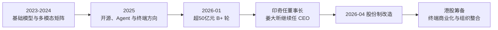
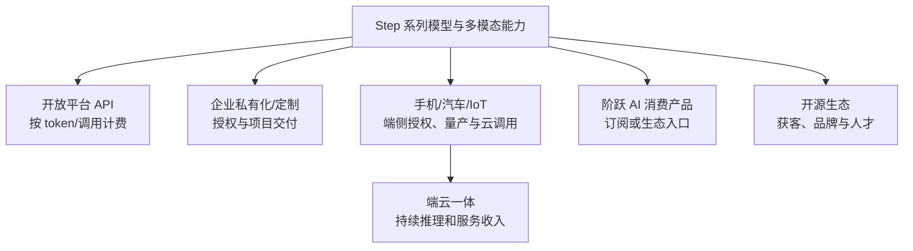

# 上海阶跃星辰智能科技股份有限公司深度分析报告

> **报告日期：** 2026-07-29
> **研究对象：** 上海阶跃星辰智能科技股份有限公司（StepFun / 阶跃星辰）
> **研究目的：** 求职、面试、Offer 决策及业务合作前尽调
> **来源等级：** A = 政府、监管、工商原始登记；B = 公司官网、官方文档、官方代码仓库及公司自述；C = 主流媒体、投资机构或合作方材料；D = 商业数据库、招聘平台与搜索快照；E = 基于公开事实的分析推断
> **表达约定：** “可确认”表示有直接公开证据；“公司/内部人士称”不等于审计事实；“媒体报道”不等于公司确认；“分析”表示本报告的判断。
> **重要限制：** 公司仍未公开招股书和经审计财务，完整股权、收入、亏损、现金、客户合同、装机口径、薪酬和员工流失率无法从公开资料核验。“未检出”不等于“不存在”。本报告不构成投资、法律或劳动仲裁意见。

---

## 一、执行摘要

### 1.1 一句话判断

> **阶跃星辰是一家技术团队强、模型和代码交付真实、资本储备显著增强，并正在从“多模态基础模型公司”转向“高效 Agent 模型 + 开源生态 + 智能终端商业化”的头部大模型创业公司。它不是 PPT 项目，但也还没有公开财务证明其大规模装机已经转化为高质量收入。2026 年的董事长更替、组织整合、股份制改造和港股筹备，使它同时具有很高的技术上行空间和较高的组织、交付及 IPO 节奏风险。对求职者的结论是：值得重点面试，按具体业务线和直属负责人定价，不宜只因 50 亿元融资、明星团队或上市预期直接接 Offer。**

### 1.2 核心结论表

| 维度 | 核验结论 | 置信度 |
|---|---|---:|
| 主体真实性 | 2023-04-06 成立，统一信用代码、登记地址、官网备案、算法备案和公开产品均可交叉验证 | 高 |
| 当前名称 | 官网已使用“上海阶跃星辰智能科技股份有限公司”；媒体称 2026-04-02 由有限公司改制为股份公司 | 高/中高 |
| 当前治理 | 印奇任董事长，负责战略节奏和技术方向；姜大昕继续任 CEO、负责日常经营 | 中高（媒体原文） |
| 融资 | 2026-01 完成超 50 亿元 B+ 轮，国资、产业资本及腾讯、启明、五源等参与 | 中高（主流媒体；未见交割文件） |
| 港股状态 | 公司被报道已为赴港上市进行股份制改造；拟募 5 亿美元、估值及申报时间均属媒体消息，未见港交所申请版本 | 中 |
| 技术真实性 | 语言、视觉、音频、视频、图像编辑、GUI Agent 均有产品或开源仓库；不是只发榜单和新闻稿 | 高 |
| 当前主模型 | Step 3.7 Flash 为约 198B 总参数、11B 激活的稀疏 MoE 多模态模型，支持 256K 上下文和多种部署框架 | 高（官方规格） |
| 榜单领先性 | 官方给出的 Agent、搜索和软件工程成绩较强，但多数为公司自测或混合口径，独立复现仍不足 | 中 |
| 开源影响力 | 官方 GitHub 有 32 个公开仓库，覆盖多个模态；多个仓库达到数百至数千 Star | 高（公开 API） |
| 商业方向 | 云 API、开发者生态、汽车、手机、IoT、具身设备及端云一体授权并行，终端是当前最明确主轴 | 中高 |
| 客户/装机 | “覆盖 60% 头部手机品牌、4200 万装机、近 2000 万日服务”来自内部人士，未获客户或审计侧完整确认 | 低至中 |
| 收入/估值 | 2025 年约 5 亿元收入、2026 年约 12 亿元预测、40亿至60亿美元估值等均为媒体转述，不能当财务事实 | 低 |
| 招聘规模 | 官方招聘入口存在；BOSS 搜索索引显示数百岗位，说明扩张积极，但不能反推实际净增人数 | 中 |
| 重大不利记录 | 本次可访问公开渠道未检出重大处罚、失信或高额执行记录；数据库覆盖不完整 | 中低 |
| 求职建议 | **继续面试，优先核心模型、Agent/系统、端侧部署和平台基础设施；接 Offer 前必须核验组织、KPI、股权与工时** | 中高 |

### 1.3 最强正面信号

1. **技术交付的可验证性强。** StepFun 官方代码组织截至查询日有 32 个公开仓库，覆盖基础模型、视频、音频、图像编辑、GUI Agent、Deep Research、3D 和基础设施；这比只开放 API 或只发布技术报告更有说服力。[S6-S12]
2. **基础模型与产品矩阵完整。** 当前公开矩阵涵盖 Step 3.7/3.5/3、StepAudio 2.5、Step Audio R1.5、Step Image Edit 2、Step-1o Vision、Step GUI、阶跃 AI App 和开放平台。[S2][S3]
3. **50 亿元以上融资显著提高容错空间。** 参投方同时包含上海国资、保险资金、产业资本和既有市场化基金，说明公司不仅获得财务投资，也在争取终端、制造和地方产业资源。[S13]
4. **“AI + 终端”比泛行业解决方案更聚焦。** 手机、汽车、电脑、IoT 和具身设备共享端侧推理、语音、多模态、Agent 与云端协同能力，技术复用逻辑成立。[S13][S14]
5. **人才密度高。** CEO 姜大昕、首席科学家张祥雨、系统/工程负责人朱亦博及董事长印奇都具有可追溯的技术或产业经历。[S13][S14]
6. **Step 3.7 Flash 的工程定位清楚。** 11B 激活参数、256K 上下文、视觉输入、多档推理和本地/云端多种量化部署，直接面向 Agent 成本、吞吐和可部署性，而不只是追求总参数规模。[S4][S5]
7. **API 价格透明。** 中国区公开了缓存命中输入 0.27 元、未命中输入 1.35 元、输出 8.1 元/百万 tokens，候选客户能够直接试算成本。[S5]

### 1.4 核心风险

1. **商业数字的证据明显弱于技术证据。** 装机、日活、手机品牌覆盖、汽车上车量和行业客户多来自公司或内部人士；公开资料没有合同金额、活跃口径、续费率、毛利和应收账款。[S13]
2. **模型榜单大多不是统一第三方盲测。** Step 3.7 官方页明确写有内部评测、固定版本和复现实验；不同模型还可能使用不同工具、harness 或 benchmark 版本。[S4]
3. **战略仍然很宽。** 基础模型、语音、视频、图像、GUI、Deep Research、消费 App、API、手机、车、IoT、具身和多个行业同时存在，资源取舍会持续发生。
4. **组织处于重构期。** 董事长加入后，公开报道提到算法与工程整合、数据团队汇报线调整；这可能提高效率，也意味着权责、绩效和项目优先级尚未完全稳定。[S14]
5. **董事长兼任千里科技董事长带来协同，也带来治理问题。** 车端渠道和商业化资源是真实优势，但相关交易定价、IP 归属、客户优先级及人员资源分配需要更清楚的制度边界。[S13][S14]
6. **IPO 准备可能改变短期目标。** 股份制改造、收入增长、客户验收、内控和披露会同时加压；对一线员工可能表现为更快版本、更重交付和更严格流程。[S15-S17]
7. **估值与收入传闻不可用于薪酬定价。** 港股募资约 5 亿美元、40亿至60亿美元融资估值、百亿美元上市估值、2025/2026 年收入数字都没有招股书或审计支持。[S16][S17]

### 1.5 求职结论先行

**综合评分：7.8/10，属于“高上行、高强度、高组织变化”的机会。**

| 项目 | 评分 | 核心理由 |
|---|---:|---|
| 技术与人才 | 9.0 | 技术负责人强，模型/代码/平台均有交付 |
| 资金与资源 | 8.8 | 大额融资、国资与产业资源较强 |
| 产品真实性 | 8.5 | 多模态产品和开放平台可直接核验 |
| 商业确定性 | 6.7 | 终端方向清晰，但收入质量和客户数据不透明 |
| 组织稳定性 | 6.2 | 新董事长、团队整合、股改和 IPO 同期发生 |
| 工作可持续性 | 6.5 | 缺少可信工时证据；高频模型发布和客户交付天然高压 |
| 股权兑现可见度 | 7.3 | 股份制和 IPO 准备提高可能性，但具体条款决定真实价值 |

优先考虑：基础模型训练/推理、Agent、模型系统、AI Infra、端侧模型、语音、多模态、评测、安全、开放平台，以及有明确量产客户的终端交付岗位。

谨慎考虑：岗位归属不清的“创新业务”、主要做演示或售前包装的 AI 岗、以 IPO 期权替代现金薪酬的 Offer、同时服务多个不相关产品线且没有明确优先级的岗位。

---

## 二、公司主体与 2026 年阶段变化

### 2.1 基本身份

| 项目 | 可核验信息 | 证据说明 |
|---|---|---|
| 当前公司名 | 上海阶跃星辰智能科技股份有限公司 | 官方平台页脚当前名称 [S2] |
| 原公司名 | 上海阶跃星辰智能科技有限公司 | 工商聚合旧页与媒体历史资料 [S1][S15] |
| 统一社会信用代码 | `91310104MACE0YX639` | 工商聚合公开页 [S1] |
| 成立日期 | 2023-04-06 | 工商聚合公开页 [S1] |
| 原有限公司注册资本 | 2,394.3586 万元 | 旧工商页；股改后股本口径需以最新登记为准 [S1] |
| 法定代表人 | 印奇 | 当前工商聚合展示；建议用国家企业信用公示系统复核 [S1] |
| 原登记地址 | 上海市徐汇区云锦路 701 号 30 层 | 旧工商页 [S1] |
| 官网当前办公地址 | 上海市徐汇区丰谷路 315 弄 24 号 1-3 层 | 官方平台页脚 [S2] |
| 登记机关 | 上海市徐汇区市场监督管理局 | 工商聚合公开页 [S1] |
| ICP | 沪ICP备2023019222号-3 | 官方平台页脚 [S2] |
| 公安备案 | 沪公网安备31010402333581号 | 官方平台页脚 [S2] |
| 算法备案 | `310104654638201240037`、`310104654638201240029` | 官方平台页脚 [S2] |

旧工商聚合页仍保留有限公司名称、原注册资本、原地址、50-99 人和 76 名参保人员等字段。后两项很可能是较早年度口径，**不能据此断言当前只有 76 人**；同理，官网办公地址变化也不等于工商注册地址已经同步。[S1][S2]

### 2.2 股份制改造意味着什么

2026-04 的公开报道显示，公司已于 2026-04-02 从“有限公司”更名为“股份有限公司”，公司被引述确认此举是为港股上市做准备。[S15]

这至少说明：

- 股权正在从有限公司份额转为股份制口径；
- 公司需要完善董事会、监事/审计、员工持股、关联交易和财务内控；
- 股份制改造是上市准备的重要步骤，但**不等于已经递交 A1、通过聆讯或确定上市**；
- 求职者需要确认期权授予的是哪一个主体、股份改制后的换股比例及离职回购规则。

### 2.3 公司已进入第二阶段

公司 2023-2025 年更像创始人姜大昕主导的技术创业公司；2026 年后更接近“双中心治理 + 大额资金 + 产业落地 + 资本市场准备”的平台型组织：

这不是简单的“融资后扩招”。它意味着战略权力、技术路线、客户资源、财务目标和组织流程都在同步变化。

---

## 三、融资、估值与 IPO：事实和传闻分开看

### 3.1 可较强确认的融资

澎湃新闻 2026-01-26 原文称，阶跃星辰完成**超过人民币 50 亿元的 B+ 轮融资**，投资方包括：[S13]

- 上国投先导基金、浦东创投、徐汇资本等上海国资；
- 国寿股权、无锡梁溪基金、厦门国贸；
- 华勤技术等产业投资方；
- 老股东腾讯、启明创投、五源资本继续跟投。

报道同时称资金用于基础模型研发和“AI + 终端”战略。未见公司公告、验资报告或投资协议公开，因此可以确认的是“主流媒体报道完成该轮”，不能进一步假设：

- 50 亿元全部是当期到账现金；
- 所有投资方使用相同估值和同类股权条款；
- 资金全部可自由用于员工扩张；
- 公司因此已经盈利或不存在下一轮融资需求。

### 3.2 早期融资

媒体资料称 2024-12 的 B 轮规模为“数亿美元”，腾讯参与过多轮；本次未找到完整交割材料，因此不把精确金额写成已审计事实。[S16]

### 3.3 IPO 信息分层

| 信息 | 状态 | 应如何理解 |
|---|---|---|
| 2026-04 改制为股份公司 | 媒体报道且官网名称已更新 | 港股准备的强信号，不等于已申报 [S2][S15] |
| 公司筹备香港 IPO | 公司被媒体引述确认股改目的 | 中高置信度 [S15] |
| 拟募资约 5 亿美元 | 彭博知情人士消息，经 36Kr/智东西转述 | 未确认，规模与时间可变 [S16] |
| 上市前估值 40亿至60亿美元 | 媒体转述《财经》等消息 | 未审计，融资批次和优先权会影响含义 [S17] |
| 目标上市估值约 100 亿美元 | 媒体消息 | 目标不等于市场定价 [S17] |
| 2025 收入近 5 亿元、2026 预计 12 亿元 | 媒体消息 | 没有审计、收入确认和现金流口径 [S17] |
| 申报/上市时间 | 多个报道给出不同节点 | 以港交所正式申请版本为准 |

### 3.4 对求职者真正有用的解读

**正面：** 融资降低短期现金紧张风险；股份制和港股准备提高股权形成流动性的可能；国资和产业投资者可能带来客户与合规资源。

**反面：** 大额融资对应更高增长预期；IPO 前需要收入、毛利、回款、治理和研发资本化/费用化口径同时经受审视；期权是否有价值依然取决于授予价格、优先权、稀释、回购和上市锁定，而不是新闻中的估值。

**不能做的推导：** 用“百亿美元目标估值 × 期权比例”直接算个人收益。普通股价值与优先股融资估值并不相等，且还存在期权行权价、税、稀释、归属和离职条款。

---

## 四、领导层、治理与组织信号

### 4.1 关键人物

| 人物 | 公开角色与履历 | 对公司的实际意义 |
|---|---|---|
| 印奇 | 董事长；1988 年生，清华姚班背景，2011 年参与创办旷视，现亦任千里科技董事长 | 负责战略节奏和技术方向；带来融资、产业和车端资源，也形成关联治理议题 [S13][S14] |
| 姜大昕 | 创始人、CEO；前微软全球副总裁，研究覆盖 NLP、机器学习、数据挖掘和生物信息 | 继续负责日常经营，是技术文化和组织连续性的核心 [S13][S14] |
| 张祥雨 | 首席科学家；ResNet 论文作者之一，相关工作获 2016 CVPR 最佳论文 | 提升视觉、多模态和基础研究可信度 [S13] |
| 朱亦博 | 系统/工程技术负责人；微软研究院、字节 AI Infra、Google Cloud GPU 等经历 | 对训练/推理基础设施、工程效率和大规模系统落地重要 [S14] |

### 4.2 “董事长管战略技术，CEO 管日常经营”的模糊地带

公开分工听起来清楚，但以下决策仍可能交叉：

- 模型路线与终端客户交付冲突时，谁做最终取舍；
- 千里/吉利项目与通用开放平台争抢算力和人力时如何排序；
- 研究指标、产品指标和收入指标如何进入同一绩效体系；
- CTO、首席科学家、业务负责人分别向谁汇报；
- 董事长在千里科技与阶跃星辰之间投入多少时间。

这些不是负面结论，而是 2026 年组织最值得在面试中核验的权力边界。

### 4.3 公开组织调整信号

时代财经/新浪报道提到算法与工程团队整合、数据团队汇报关系向算法侧调整。[S14] 对技术岗位可能带来两种相反效果：

- **正向：** 数据、算法、Infra 和评测共同对端到端指标负责，减少部门墙；
- **风险：** 组织职责、晋升标准和资源归属重新划分，旧项目可能被合并或降级。

接受 Offer 前应拿到“当前版本”的组织图，而不是只听招聘方介绍历史团队。

---

## 五、产品与技术路线

### 5.1 产品矩阵

| 层级 | 代表产品 | 主要用途 | 成熟度证据 |
|---|---|---|---|
| 通用/Agent 模型 | Step 3.7 Flash、Step 3.5 Flash、Step 3 | 推理、编程、搜索、工具调用、视觉理解 | 模型页、API、代码和权重 [S3-S8] |
| 语音 | StepAudio 2.5 Realtime/TTS/ASR、Step Audio R1.5 | 实时对话、识别、合成、语音推理 | 官方平台及代码仓库 [S2][S9] |
| 视觉/内容 | Step-1o Vision、Step Image Edit 2 | 图像理解、生成式编辑 | 官方平台及仓库 [S2][S10] |
| 视频/3D | Step-Video-T2V、Step1X-3D | 文生视频、3D 内容生成 | 开源仓库 [S11] |
| 交互 Agent | GELab-Zero、StepDeepResearch | GUI 操作、搜索与研究工作流 | 官方仓库及文档 [S7][S12] |
| 消费产品 | 阶跃 AI Web/App/桌面端 | 通用对话、搜索、创作、智能体体验 | 官网入口 [S2] |
| 开发者平台 | Open Platform、Studio、Model Lab、Step Plan | API、调试、评测、工具/Agent 构建 | 官方文档 [S3][S19][S20] |
| 行业/终端 | 手机、汽车、IoT、具身设备及行业解决方案 | 端云协同、授权、量产交付 | 公司与媒体口径 [S2][S13] |

### 5.2 演进时间线

| 时间 | 公开发布/信号 | 解读 |
|---|---|---|
| 2024-03 | Step-1、Step-1V 进入公开发布阶段 | 以语言和视觉基础模型建立品牌 |
| 2024-07 | Step-2、Step-1.5V、Step-1X 等扩展 | 快速扩展语言、多模态与图像能力 |
| 2025-02 至 03 | Step-Video 开源活动 | 进入高算力视频生成赛道 [S11] |
| 2025-07 | Step 3、Step Audio 2 | 通用模型与语音并进 [S8][S9] |
| 2025-11 至 12 | GELab-Zero 4B 模型、工程基础设施与 MCP Server 陆续开放 | 从对话模型向可本地部署的 GUI Agent 扩张 [S12] |
| 2026-02 | Step 3.5 Flash | 强化高效 MoE 与 Agent 场景 [S7] |
| 2026-05-29 | Step 3.7 Flash | 加入视觉、长上下文和更完整部署生态 [S4][S5] |

早期月份主要来自官方仓库、发布页和媒体时间戳，不能等同于模型内部立项或首次交付时间。

### 5.3 Step 3.7 Flash 的技术定位

官方资料给出的主要规格：[S4][S5]

| 指标 | 官方规格 | 实际含义 |
|---|---:|---|
| 架构 | 稀疏 MoE 视觉语言模型 | 每 token 不激活全部参数，目标是降低推理成本 |
| 参数 | 196B 主体 + 1.8B ViT，约 198B 总参数 | 总参数规模大，但不应直接等于计算量 |
| 激活参数 | 11B | 决定单 token 主要计算成本的重要指标 |
| 上下文 | 256K | 适合长文档、代码库和长轨迹 Agent；实际稳定性仍需任务测试 |
| 输入 | 文本、图像、视频 | 将视觉理解直接带入工具和 Agent 工作流 |
| 推理强度 | 三档 | 可在速度、成本与质量之间调节 |
| 吞吐 | 官方称最高 400 TPS | 高度依赖硬件、批处理、量化、输入输出长度，不能视为通用 SLA |
| 部署 | BF16、FP8、NVFP4、GGUF | 覆盖数据中心到统一内存工作站 |
| 框架 | vLLM、SGLang、Transformers、llama.cpp | 降低开发者接入和本地部署成本 |
| 本地设备 | 官方称至少 128GB 统一内存设备可运行相应版本 | “能加载”不等于高并发或低延迟生产部署 |

中国区 API 公开价格：[S5]

| 计费项 | 单价（每百万 tokens） |
|---|---:|
| 输入，缓存命中 | 0.27 元 |
| 输入，缓存未命中 | 1.35 元 |
| 输出 | 8.10 元 |

定价体现了“以低输入成本促进 Agent 长上下文和高频调用”的策略。真正总成本还要加入输出长度、重试、工具调用、搜索、缓存命中率、并发限制和工程运维，不能只比较输入单价。

### 5.4 官方榜单应该怎样读

Step 3.7 发布页列出的部分成绩包括：[S4]

| Benchmark | 官方成绩 | 适用能力 | 主要限制 |
|---|---:|---|---|
| SWE-Bench Pro | 56.3% | 软件工程 | 公司评测配置和模型工具链会显著影响结果 |
| SWE-Bench Verified | 76.5% | 真实代码修复 | 不同 Agent scaffold 不宜直接横比 |
| Terminal-Bench 2.1 | 约 59.6% | 终端操作 | 版本、环境和重试策略敏感 |
| Toolathlon | 49.5% | 多工具编排 | 官方说明使用内部固定版本 |
| ClawEval 1.1 | 67.1% | 日常自主任务 | 新 benchmark 的长期稳定性尚待观察 |
| BrowseComp | 75.8% | 搜索与浏览 | 搜索后端、工具预算和时效影响很大 |
| HLE with Tools | 47.2% | 高难知识与工具 | 带工具成绩不能与纯模型成绩混用 |

**结论：** 成绩足以证明模型在 Agent、搜索和编码上具有竞争力，但不能据此宣布“全面超过所有闭源模型”。更强的证据应是第三方使用相同 harness、相同 token/tool 预算的复现，以及真实客户的成本—成功率数据。

### 5.5 开源与工程生态

GitHub API 在 2026-07-29 显示 StepFun 组织有 32 个公开仓库、约 1,708 名组织关注者。[S6] 查询时 Star 较高的仓库包括：

| 仓库 | Star（查询时） | 方向 |
|---|---:|---|
| Step-Video-T2V | 3,186 | 文生视频 |
| gelab-zero | 2,242 | Agent/研究工具 |
| Step1X-Edit | 2,240 | 图像编辑 |
| Step-3.5-Flash | 2,095 | 高效通用模型 |
| Step-Audio2 | 1,487 | 语音 |
| Step-Audio-EditX | 956 | 音频编辑 |
| Step1X-3D | 878 | 3D |
| Step-Audio-R1 | 692 | 语音推理 |
| NextStep-1 | 692 | 研究模型 |
| SteptronOss | 579 | 基础设施/工具 |
| StepDeepResearch | 570 | 深度研究 Agent |
| Step3 | 454 | 通用模型 |
| Step3-VL-10B | 409 | 视觉语言模型 |
| Step-3.7-Flash | 287 | 最新通用多模态模型 |

大多数仓库采用 Apache-2.0，部分视频项目采用 MIT。Star 是关注度，不是生产调用量；新发布仓库不能与已存在一年以上的仓库直接比较。Hugging Face 在本次检索中不可稳定访问，因此没有把下载量写入结论。

**技术判断：** 阶跃星辰的开源广度在国内创业公司中较强，足以吸引开发者并降低客户对闭源供应商锁定的顾虑；但整体社区体量仍明显小于 Qwen、DeepSeek 等头部生态。其优势更偏“多模态广度 + 终端协同”，不是单靠开发者规模取胜。

---

## 六、商业模式与收入质量

### 6.1 可能的收入来源

| 模式 | 优点 | 风险/核验点 |
|---|---|---|
| 公有云 API | 标准化、可计量、边际扩展快 | 价格战、算力成本、客户切换成本低 |
| 私有化/定制 | 客单价高、数据和合规适配强 | 定制重、验收慢、回款和人力成本高 |
| 终端授权 | 可形成大规模分发和长生命周期 | 装机不等于付费；需区分一次性授权、按设备和云调用分成 |
| 汽车量产 | 合同期长、进入壁垒高 | 车规验证慢、定点与 SOP 相隔久、客户集中度高 |
| 消费 App | 获取真实反馈与品牌入口 | 用户获取成本高，需与大厂超级 App 竞争 |
| 开源 | 促进采用、人才和行业标准 | 无法直接等同收入，可能被云厂商低成本托管 |

### 6.2 终端数据的证据边界

澎湃新闻援引内部人士称：[S13]

- 已与国内 60% 的头部手机品牌深度合作；
- 模型装机量超过 4,200 万台；
- 日均服务接近 2,000 万人次；
- 与千里科技、吉利推出 AgentOS 智能座舱；
- 吉利银河 M9 上市三个月销量接近 4 万辆；
- 预计 2026 年大模型上车超过 100 万辆。

这些数字显示商业化可能已经进入量产阶段，但仍缺少四个关键定义：

1. 4,200 万是累计出厂、可用设备、激活设备还是月活设备；
2. “日均服务人次”是独立用户、会话、请求还是设备调用；
3. 装机收入是一次性授权、按设备收费、云调用费还是联合研发费；
4. 100 万辆是已定点、预计 SOP、出货目标还是实际交付。

因此可以把它们视为“强商业信号”，不能视为审计收入或活跃用户。

### 6.3 收入质量比收入规模更重要

即使媒体所称 2025 年近 5 亿元、2026 年预计 12 亿元最终接近真实，仍需看：[S17]

- 模型/API、软件授权、硬件配套、项目交付分别占多少；
- 毛利是否扣除了推理算力、渠道分成和客户定制；
- 前五大客户及千里/吉利相关业务占比；
- 应收账款和验收周期；
- 研发投入、算力预付款和资本开支；
- 收入增长是否来自可重复消费，而非一次性定制或关联项目。

在招股书出现前，外部无法可靠判断公司是否接近盈亏平衡。

### 6.4 “AI + 终端”战略的合理性

这条路线具备现实逻辑：

- 终端能形成稳定分发，降低独立 App 获客成本；
- 端侧模型降低延迟、云成本和部分隐私压力；
- 云端保留复杂推理、搜索、更新和跨设备编排；
- 语音、视觉、GUI 和 Agent 能在车、手机与 IoT 之间复用。

但它也把公司带入华为、字节、阿里、腾讯、百度、手机厂商自研和车企自研的交叉竞争。阶跃星辰必须证明自己的模型在**单位成本、定制速度、端侧占用、数据闭环和中立性**上比大厂更有吸引力。

---

## 七、竞争格局

### 7.1 竞争不是一张总榜

| 公司/体系 | 主要优势 | 相对阶跃星辰的压力 | 阶跃星辰可能的差异化 |
|---|---|---|---|
| DeepSeek | 推理/编码品牌、成本效率、全球开发者关注 | 单模型心智和生态扩散强 | 多模态、语音、GUI 和终端交付更完整 |
| 阿里 Qwen | 模型尺寸覆盖、开源生态、云和企业渠道 | 社区、算力和商业客户规模大 | 更灵活地做中立终端伙伴，决策链可能更短 |
| 字节豆包 | 消费入口、云、内容生态、模型迭代和价格能力 | 获客、数据、算力和价格竞争极强 | 避免与客户争夺终端入口，提供定制与私有化 |
| 月之暗面 Kimi | 长文本、搜索、消费产品和用户品牌 | C 端心智及产品迭代强 | 更强调模型开源、多模态和设备量产 |
| MiniMax | 多模态、消费应用、海外产品及资本市场窗口 | 商业化叙事与国际化更成熟 | 国内终端渠道、车端协同及高效 Agent 模型 |
| 智谱 | 政企客户、全栈模型、国产化和上市融资 | 政企渠道、资本市场透明度增强 | 终端/车载主轴更聚焦，开源多模态组合不同 |
| 手机/车企自研 | 掌握硬件入口、用户数据和系统权限 | 可能把第三方模型降为可替换供应商 | 中立、研发规模共享、快速迭代和多客户摊销 |

### 7.2 阶跃星辰真正需要证明的护城河

1. **模型成本优势能持续。** 开源模型和 API 价格下降很快，单次领先窗口短。
2. **终端客户不是一次性项目。** 需要可复用 SDK、评测、端云调度和持续收费。
3. **相关方客户之外也能增长。** 千里/吉利是重要起点，但独立客户能验证市场化能力。
4. **多模态广度能转化为统一平台。** 若每个模态是独立团队和独立交付，广度可能变成成本。
5. **开源能带来使用和收入。** Star 和下载只是上游漏斗，最终要转为 API、企业部署或终端授权。

### 7.3 当前竞争位置

综合公开证据，阶跃星辰更像**国内大模型创业公司第一梯队中的多模态/终端型选手**，而不是开发者生态、消费用户或企业收入的绝对第一。它的技术可信度高于商业透明度，资本实力强于组织成熟度；能否在 2026-2027 年形成可重复的终端收入，是估值与 IPO 叙事能否成立的关键。

---

## 八、合规、数据与法律风险

### 8.1 已能确认的合规基础

- 官网展示 ICP 与公安备案；[S2]
- 官网展示两项算法备案编号；[S2]
- 开放平台提供模型使用、API 和安全相关文档；[S3]
- GUI Agent 项目公开了本地部署、任务录制/回放、多设备分发及 AndroidDaily 评测框架。[S12]

这些说明公司至少已经建立生成式 AI 产品上线所需的基础备案和产品安全框架，但备案不等于所有输出、数据和客户场景自动合规。

### 8.2 主要合规面

| 风险面 | 典型问题 | 求职相关岗位 |
|---|---|---|
| 训练数据 | 版权、个人信息、来源授权、删除与可追溯 | 数据、预训练、法务、评测 |
| 生成内容 | 幻觉、有害内容、深度合成标识、未成年人保护 | 产品、安全、算法、平台 |
| 企业客户数据 | 数据隔离、日志、模型训练使用、跨境和私有化 | 平台、SRE、解决方案、安全 |
| 终端权限 | 麦克风、相机、联系人、车辆控制和支付确认 | 手机、汽车、GUI Agent |
| 开源许可证 | 权重许可、训练数据声明、第三方代码和商用边界 | 开源、法务、研发负责人 |
| 汽车安全 | 功能边界、驾驶分心、错误指令、OTA 和车规验证 | 车载语音、AgentOS、交付 |

### 8.3 司法和处罚检索边界

本次可访问的官网、媒体和公开商业搜索未检出足以构成重大经营风险的行政处罚、失信被执行或重大诉讼闭环。由于国家企业信用信息公示系统、裁判文书、执行信息和商业数据库并非全部可稳定访问，正确表述是**“本次未检出”而不是“公司没有任何案件或处罚”**。

签约或重大合作前建议再次核验：

- 国家企业信用信息公示系统的最新股改、董事和股东；
- 中国执行信息公开网、裁判文书及开庭公告；
- 网信办算法备案的算法名称、用途和状态；
- 劳动合同主体与知识产权/竞业限制条款。

---

## 九、招聘、组织与工作体验

### 9.1 公开招聘信号

公司官网跳转至 Moka 的社会招聘与校园招聘入口。[S21][S22] 2026-07 的 BOSS 公开索引显示约 327 个职位；2026-01 媒体曾统计官网约 98 个岗位，涉及北京、上海、深圳和 AI Agent 产品、行业应用、售前解决方案等。[S14][S23]

两个数字不能直接比较：

- 时间不同；
- BOSS 可能包含重复、长期挂置和不同城市版本；
- 官网与平台的岗位分类口径不同；
- 职位数不等于实际 HC，更不等于净增员工数。

合理结论只有：公司正在较大范围招聘，终端、Agent、行业商业化和研发仍需大量人员。

### 9.2 没有足够证据回答的事情

本次没有找到可代表公司的可靠数据来确认：

- 是否普遍 996；
- 平均下班时间和周末加班；
- 年终奖平均兑现比例；
- 试用期通过率、裁员比例和团队流失率；
- 晋升周期和薪酬倒挂；
- 哪个团队氛围最好或最差。

大模型发布、训练集群、线上 API 和车端 SOP 天然可能产生夜间/周末保障，但不能把行业压力直接写成全公司工时事实。必须核验到具体团队。

### 9.3 不同岗位的机会与风险

| 岗位类型 | 机会 | 主要风险 | 面试核验重点 |
|---|---|---|---|
| 预训练/后训练 | 顶级人才、算力、真实大模型迭代 | 方向切换快、指标和发布压力高 | 算力预算、数据责任、论文/开源权利 |
| AI Infra/推理 | MoE、量化、训练和端云部署含金量高 | On-call、成本 KPI、故障压力 | 集群规模、故障责任、值班和技术债 |
| Agent/评测 | 当前核心方向，接近真实任务 | Benchmark 追逐、产品边界快速变化 | 线上成功率、工具预算、评测与业务闭环 |
| 语音/多模态 | 公司传统强项，终端复用多 | 多产品线争资源 | 是否有量产客户、数据闭环和负责人 |
| 手机/车载端侧 | 量产、性能、工程经验稀缺 | 客户驻场、SOP 节点、定制和相关方依赖 | 已定点/已 SOP 区分、差旅、验收主体 |
| 开放平台/SRE | 接触真实开发者和商业使用 | 低价竞争、稳定性和夜间告警 | SLA、峰值 QPS、on-call 补偿、成本归属 |
| 消费 App | 产品反馈快，用户场景丰富 | 与大厂入口竞争、战略优先级可能下降 | MAU/留存、获客方式、团队预算 |
| 行业售前/交付 | 直接接触收入和客户 | 定制、投标、回款、频繁出差 | 销售与交付边界、奖金确认和坏账责任 |

### 9.4 组织风险观察

2026 年可能同时发生：新董事长建立治理机制、算法工程整合、股改、上市准备、车/手机量产、Step 3.7 迭代和大规模招聘。对员工而言，最可能的风险不是“公司突然没有方向”，而是：

- 方向太多导致优先级频繁调整；
- 项目被并入新组织，汇报线变化；
- 研究目标被短期客户交付替代；
- IPO 节点将原本长期任务压缩为季度指标；
- 期权口头承诺与正式文件存在差异。

---

## 十、风险矩阵

| 风险 | 概率 | 影响 | 当前证据 | 建议 |
|---|---:|---:|---|---|
| 多产品线稀释资源 | 高 | 高 | 模型、应用、终端和行业矩阵很宽 | 问岗位未来 12 个月唯一北极星指标 |
| 组织重构导致权责变化 | 高 | 中高 | 董事长更替及算法/工程整合报道 [S14] | 核对当前汇报线和近半年调整 |
| 商业数据低于宣传口径 | 中 | 高 | 装机/日服务多为内部人士口径 [S13] | 问活跃、付费、收入确认和客户侧证据 |
| 终端客户集中 | 中高 | 高 | 千里/吉利协同被重点宣传 | 问前五客户、关联业务占比和定价 |
| API 价格战/算力毛利压力 | 高 | 中高 | 输入价格极低 [S5] | 问单请求成本、缓存率和毛利 KPI |
| 自测榜单无法转化为产品 | 中 | 中高 | 官方注明内部评测 [S4] | 看线上任务成功率与客户续费 |
| IPO 延期或估值波动 | 中高 | 中高 | 尚无港交所正式申请可核 | 期权按保守情景估值，不牺牲过多现金 |
| 关联方治理 | 中 | 高 | 董事长同时任千里科技董事长 | 问 IP、人员、定价和客户归属制度 |
| 工时与 on-call 压力 | 中高 | 中高 | 业务性质推断，缺少员工数据 | 问最近四周真实发布/值班记录 |
| 数据、版权和终端安全 | 中 | 高 | 多模态训练与敏感终端权限 | 问数据来源、红队、事故流程和责任边界 |
| 大额融资后低效扩张 | 中 | 中 | 职位数和业务面快速扩大 | 问 HC 审批、预算期限和项目停损机制 |

---

## 十一、面试反问清单

### 11.1 优先问直属负责人

1. **这个岗位现在属于基础模型、Agent、开放平台、阶跃 AI、手机、汽车还是行业交付？未来 12 个月唯一的第一优先级是什么？**
2. **印奇董事长与姜大昕 CEO 在本业务线的决策边界是什么？我的直接负责人最终向谁汇报？**
3. **算法、工程和数据整合后，团队当前组织图、接口人和绩效归属是什么？过去半年调整过几次？**
4. **这个 HC 是新增、替补还是项目迁移？前任为什么离开或转岗？**
5. **岗位 KPI 中，模型质量、API 收入、设备出货、客户验收、成本下降和 IPO 准备各占多少？**
6. **最近一个季度团队主动离职人数、试用期未通过人数和平均在岗年限是多少？**
7. **过去四周团队最晚发布/故障处理到几点？周末值班频率、补休和补偿怎样执行？**

### 11.2 技术岗位重点问

1. Step 3.7 的对外 benchmark 使用什么 harness、工具预算、重试策略和测试集污染检查？哪些结果有第三方复现？
2. 团队线上最重视的指标是 token 成本、TPS、首 token 延迟、任务成功率还是客户留存？
3. 训练、后训练、评测、推理和端侧团队如何共享数据与事故复盘？
4. 128GB 本地部署的实际 tokens/s、量化损失和支持上下文是多少，而不仅是“可以运行”？
5. 我能否提交上游开源、发表论文或参与专利署名？审批周期和离职后的成果归属是什么？
6. 线上事故由谁 on-call？SLA、峰值 QPS、算力容量和回滚机制怎样？

### 11.3 商业化与终端岗位重点问

1. “4,200 万装机”是累计出厂、激活设备、月活设备还是可调用设备？“近 2,000 万日服务”按用户、会话还是请求计数？
2. 终端收入按一次性授权、每台设备、云端调用、联合研发还是收入分成确认？
3. 2026 年“上车超百万辆”中，已定点、已 SOP、已出货分别多少？
4. 千里/吉利相关业务占本团队收入、算力和 HC 的比例是多少？关联交易如何定价，模型 IP 归谁？
5. 除关联方外，最大三个客户的项目是否已量产和回款？客户流失或延期的主要原因是什么？
6. 售前承诺、产品标准化和客户定制冲突时，由谁批准例外？

### 11.4 HR、薪酬和股权必须问

1. 劳动合同、发薪、社保、公积金和期权分别由哪个法律主体承担？
2. 股权是期权、限制性股份还是持股平台份额？对应股份公司的普通股还是其他权益？
3. 授予数量占完全稀释股本的比例、行权价、归属期、cliff、税务和最近一轮稀释后比例是多少？
4. 离职后行权窗口多长？公司按成本、净资产、公允价值还是董事会价格回购？
5. 港股上市时是否自动转换、是否锁定、若 IPO 延期是否延长行权窗口？
6. 年终奖的目标月数、近两年同团队实际中位数、绩效分布和入职首年折算规则是什么？
7. 竞业限制范围、期限、补偿标准和公司决定启动/解除的时间点是什么？

### 11.5 观察答案的红旗

- 把“装机”直接回答成“收入”，却说不清付费口径；
- 把媒体目标估值当成确定的期权价值；
- 说团队“扁平”，但说不清最终决策人；
- 只展示 benchmark，不提供线上任务成功率、成本或客户留存；
- 说“不怎么加班”，却不愿给最近四周真实发布和值班频率；
- 期权只在口头 Offer 中出现，正式文件没有主体、数量、行权价和回购条款；
- 车端项目只说“合作/定点”，不区分定点、SOP、出货、验收和回款。

---

## 十二、Offer 决策框架

### 12.1 建议接受的组合

- 业务线属于核心模型、Agent、AI Infra、端侧部署或已经量产的终端产品；
- 直属负责人稳定，能明确 12 个月路线与资源；
- 固定现金不因“即将 IPO”大幅打折；
- 股权文件完整，最坏情形下即使上市延期也可接受；
- 值班、发布、差旅与补偿透明；
- 能接触真实模型、系统或客户数据闭环，而非只做外层 Demo。

### 12.2 建议谨慎或拒绝的组合

- 岗位在多个业务线间共享，没有明确预算和汇报人；
- 主要 KPI 是无法归因的“装机/合作/品牌曝光”；
- 高薪依赖不写入 Offer 的年终奖或上市后兑现；
- 期权仅给“价值金额”，不提供股数、比例、行权价和回购条款；
- 团队近期多人离职，却只用“业务升级”解释；
- 需要长期驻场或夜间 on-call，但没有补偿和轮值机制；
- 相关方项目占绝大多数资源，IP 与收入归属又说不清。

### 12.3 建议的薪酬定价方式

把总包拆成三层：

1. **确定现金：** 月薪 × 12 + 写入 Offer 且规则明确的固定部分；
2. **风险现金：** 年终奖、绩效和项目奖，按团队历史实际兑现率折价；
3. **股权：** 在拿到完整条款前按 0 计入刚性收入；拿到后用上市成功、延期和不上市三种情景估值。

不应因为“超 50 亿元融资”接受低于市场的固定现金，也不应因为“筹备港股”把期权当作一年内可变现资产。

---

## 十三、最终结论

阶跃星辰当前最有价值的不是“又一家大模型独角兽”标签，而是三项已经形成组合的能力：

1. 有真实、较广的多模态模型和开源交付；
2. 有足够资金继续训练、降本和建设终端生态；
3. 通过印奇、千里科技及产业投资者获得手机、汽车和设备分发资源。

它最需要证明的也有三项：

1. 装机和合作能否转成可持续、高毛利、非关联的收入；
2. 新治理结构能否在研究、平台和终端交付之间稳定分配资源；
3. 自测榜单和产品矩阵能否形成开发者采用、客户续费和现金流。

**求职建议：值得认真面试，综合评级 7.8/10。** 对核心技术与量产工程岗位，它可能提供国内一线的大模型系统经验；对追求稳定边界、温和节奏和成熟晋升体系的人，2026 年的组织重构与 IPO 准备会构成明显风险。最终决定必须落到具体团队、负责人、KPI、工时和股权文件，而不是公司级融资新闻。

---

## 十四、来源与证据索引

> 访问日期均为 2026-07-29。部分商业/招聘页可能需要登录或动态渲染；Star、岗位数等为查询时快照。

| 编号 | 来源 | 等级 | 支持内容与限制 |
|---|---|---:|---|
| [S1] | [信查查：上海阶跃星辰智能科技有限公司](https://www.xcc.cn/enterBody/19935556d0b911eeab1400163e350731) | D | 统一代码、成立日期、旧注册资本、地址、法定代表人；页面可能滞后 |
| [S2] | [阶跃星辰官网](https://www.stepfun.com/) / [开放平台](https://platform.stepfun.com/) | B | 当前公司名、地址、备案号、产品入口及解决方案；解决方案不等于已签客户 |
| [S3] | [开放平台：模型与基本概念](https://platform.stepfun.com/docs/zh/guides/basic-concepts) | B | 当前模型体系、API 和平台概念 |
| [S4] | [Step 3.7 Flash 官方发布页](https://static.stepfun.com/blog/step-3.7-flash/) | B | 规格、部署、Benchmark 和评测说明；多数成绩为公司口径 |
| [S5] | [Step 3.7 Flash 官方文档](https://platform.stepfun.com/docs/zh/guides/models/step-3.7-flash) | B | 256K、多模态、计费、框架适配 |
| [S6] | [StepFun GitHub 组织](https://github.com/stepfun-ai) / [GitHub API](https://api.github.com/orgs/stepfun-ai/repos?per_page=100) | B/A（平台原始数据） | 公开仓库数量、Star、许可证和更新时间；数字会变化 |
| [S7] | [Step-3.5-Flash GitHub](https://github.com/stepfun-ai/Step-3.5-Flash) | B | Step 3.5 的权重、代码和部署信息 |
| [S8] | [Step3 GitHub](https://github.com/stepfun-ai/Step3) | B | Step 3 开源交付证据 |
| [S9] | [Step-Audio2 GitHub](https://github.com/stepfun-ai/Step-Audio2) | B | 语音模型与代码交付 |
| [S10] | [Step1X-Edit GitHub](https://github.com/stepfun-ai/Step1X-Edit) | B | 图像编辑模型与代码交付 |
| [S11] | [Step-Video-T2V GitHub](https://github.com/stepfun-ai/Step-Video-T2V) | B | 视频生成开源证据 |
| [S12] | [GELab-Zero GitHub](https://github.com/stepfun-ai/gelab-zero) / [StepDeepResearch](https://github.com/stepfun-ai/StepDeepResearch) | B | 可本地部署的 GUI Agent 模型/基础设施、AndroidDaily 评测及 Deep Research |
| [S13] | [澎湃新闻：阶跃星辰完成超50亿元B+轮融资，印奇出任董事长](https://www.thepaper.cn/newsDetail_forward_32463044) | C | 融资、投资方、领导分工、终端数据；装机/日服务为内部人士口径 |
| [S14] | [时代财经/新浪：阶跃星辰新任董事长印奇及组织调整](https://finance.sina.com.cn/tech/roll/2026-01-26/doc-inhiryst8859936.shtml) | C | 领导履历、算法工程整合、招聘和战略变化 |
| [S15] | [腾讯新闻：阶跃星辰完成股份制改造、为港股上市做准备](https://news.qq.com/rain/a/20260407A05DZV00) | C | 2026-04 股改和公司回应；访问时存在 WAF，按媒体证据处理 |
| [S16] | [36Kr/智东西：阶跃星辰被曝考虑赴港 IPO](https://www.36kr.com/p/3698736132812421) | C | 彭博知情人士称拟募约 5 亿美元、最早年内上市；公司当时未回应 |
| [S17] | [36Kr：阶跃星辰 IPO 与商业化分析](https://www.36kr.com/p/3704466512671491) | C | 估值、收入和申报时间等二手消息；均未审计、未获公司确认 |
| [S18] | [NVIDIA NIM：StepFun 模型检索](https://build.nvidia.com/explore/discover?search=stepfun) | B/C | NVIDIA 生态可用性；具体地区和版本可能变化 |
| [S19] | [开放平台 Model Lab](https://platform.stepfun.com/docs/zh/llm/model-lab) | B | 模型实验与评测工具 |
| [S20] | [开放平台 Step Plan](https://platform.stepfun.com/step-plan) | B | 开发者/Agent 工具与生态入口 |
| [S21] | [阶跃星辰社会招聘](https://app.mokahr.com/social-recruitment/step/94904#/) | B | 官方社会招聘入口；动态页面可能重定向 |
| [S22] | [阶跃星辰校园招聘](https://app.mokahr.com/campus-recruitment/step/94905#/) | B | 官方校园招聘入口；动态页面可能重定向 |
| [S23] | [BOSS 直聘：阶跃星辰公司页](https://www.zhipin.com/gongsi/0591ce5cac2618c303N43dm0F1o~.html) | D | 岗位数量和招聘描述快照；不可视为实际 HC 或员工人数 |

---

## 十五、尽调待办清单

- [ ] 在国家企业信用信息公示系统复核股份公司最新注册资本、董事、股东和变更日期。
- [ ] 查询港交所披露易，确认是否已出现正式 A1 申请版本及保荐人。
- [ ] 要求招聘方明确劳动合同、社保、公积金、奖金和股权主体。
- [ ] 获取当前业务线组织图及岗位 12 个月路线图。
- [ ] 核对 4,200 万装机、2,000 万日服务和百万辆上车的统计定义。
- [ ] 区分终端项目的定点、SOP、出货、验收、回款和收入确认。
- [ ] 核对千里/吉利相关项目的收入、IP、定价和人员边界。
- [ ] 让技术负责人解释外部榜单的 harness、工具预算和独立复现。
- [ ] 获取同团队最近两年年终奖中位数、晋升分布和主动离职数据。
- [ ] 将期权股数、完全稀释比例、行权价、归属、回购、税和 IPO 处理写入正式文件。
- [ ] 用最近四周真实发布、值班和差旅记录核验工时，而不是只问“加班多不多”。
- [ ] 入职前复核竞业、保密、开源贡献、论文发表和职务成果条款。
