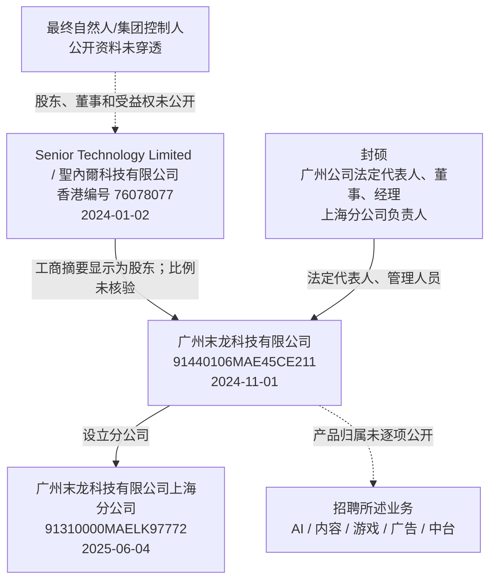
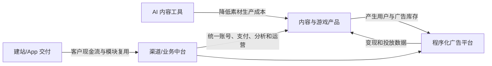

# 广州末龙科技有限公司深度分析报告

> **报告日期：** 2026-07-27
> **研究对象：** 广州末龙科技有限公司、广州末龙科技有限公司上海分公司、香港股东 Senior Technology Limited，以及 SPROUT/末龙科技相关业务
> **研究目的：** 求职、面试、Offer 决策与合作前尽调
> **来源等级：** A = 政府、监管及域名注册原始记录；B = 公司官网及公司招聘自述；C = 商标、招聘与内容平台页面；D = 商业工商数据库、招聘统计和搜索快照；E = 基于公开事实的分析推断
> **表达约定：** “可确认”表示有直接公开证据；“公司自述”不等于经审计事实；“分析”表示本报告推断；“未核验”表示证据不足，不作肯定结论。
> **重要限制：** 该公司是成立时间较短的非上市企业，未公开审计财务、收入、客户名单、产品经营数据、融资文件、完整股东名册、最终受益人及劳动用工细节。未检索到不等于不存在。本报告不构成法律或投资建议。

---

## 一、执行摘要

### 1.1 一句话判断

> **广州末龙不是简单的空壳公司：广州主体、香港股东、上海分公司、官网、持续招聘及 2025 年约 93 人的商业年报口径均留下了真实经营痕迹。更合理的画像是 Senior Technology Limited 在境内搭建的多产品研发、运营和用工节点，业务横跨定制建站、海外 AI 内容工具、程序化广告与开放世界冷兵器游戏。问题在于，其公开透明度明显落后于招聘中“1 亿级活跃、约 20 个工区、150 人、全球科技集团”的叙事：没有一款产品名称、商店页面、客户、收入、融资或最终控制人完成公开闭环，唯一能识别的游戏商标还出现了驳回通知。求职者可以继续面试，但应把具体产品、现金流、合同主体和岗位边界作为接受 Offer 的前置条件。**

### 1.2 核心结论

| 维度 | 结论 | 置信度 |
|---|---|---:|
| 主体真实性 | 广州公司、上海分公司均有工商痕迹；香港股东可在香港公司注册处官方名单中核验 | 高 |
| 广州主体 | 2024-11-01 成立，统一代码 `91440106MAE45CE211`，注册资本 2,000 万元，法定代表人封硕 | 中高（商业工商数据） |
| 上海分公司 | 2025-06-04 成立，统一代码 `91310000MAELK97772`，负责人封硕，状态存续 | 中高（商业工商数据） |
| 香港股东 | 聖內爾科技有限公司 / Senior Technology Limited，香港编号 `76078077`，2024-01-02 注册 | 高（香港公司注册处原始 CSV） |
| 最终控制人 | 公开资料尚不能从香港公司继续穿透到最终自然人或集团母公司 | 低 |
| 团队规模 | 公开口径同时出现参保 9、年报员工 93、官网 100+、招聘自述 150、平台标签 100-499 人 | 中低，口径冲突 |
| 产品真实性 | 招聘能识别出 AI 内容、冷兵器游戏和程序化广告三条线，但没有产品名、可用 Demo 或商店主体闭环 | 中低 |
| 官网定位 | 官网以零代码建站、视频/社区 App、数据分析、渠道和广告管理为主，和招聘中的集团多产品定位并不完全一致 | 高（页面事实） |
| 融资与财务 | 未找到可核验融资公告、投资人、融资金额、审计收入、利润或现金数据；BOSS 的“不需要融资”标签不能替代财务证据 | 中高（公开边界） |
| 知识产权 | 找到“冷兵战场”第 41 类申请；流程显示 2025-12-10 驳回通知书发文，不能视为已注册商标 | 高（页面状态） |
| 司法与行政风险 | 截至检索日未发现可确认的重大诉讼、执行、失信、欠薪、欠税或行政处罚 | 中，成立短且索引有限 |
| 技术机会 | AI 应用、广告系统和多人游戏均有真实工程复杂度，但含金量高度依赖实际产品阶段和个人负责边界 | 中 |
| 求职判断 | **值得继续面试、必须强核验；现有公开证据不足以支持盲签或因“集团/1 亿用户”而溢价接受** | 中高 |

### 1.3 最强正面信号

1. **法律主体链有真实记录。** 香港公司注册处官方每周名单明确列出 Senior Technology Limited / 聖內爾科技有限公司、编号 `76078077` 和注册日期；广州及上海主体也能用统一社会信用代码区分。[S3][S6][S7]
2. **广州主体不是明显的零人壳。** 商业数据库的 2025 年员工人数口径约为 93，虽然不能替代社保或工资流水，但和持续、多城市、多技术栈招聘能够相互支持。[S6][S9][S10]
3. **招聘岗位具有较强产品研发特征。** Unity/UE5、大地图多人同步、PBR、美术管线、SSP/ADX、广告中台、AI 图形内容平台等关键词，比普通网站外包岗位更具体。[S8][S9][S10]
4. **境内扩张动作清晰。** 广州公司成立后数月设立上海分公司，上海招聘又集中在游戏、产品和数据岗位，说明至少做过区域化团队投入。[S7][S10]
5. **基础数字化交付能力与官网吻合。** 官网展示响应式网站、Android/iOS 视频或社区 App、数据分析、渠道及广告管理，与部分广告中台和内容业务有逻辑关联。[S1]
6. **香港股东至少有独立官网和业务描述。** Senior 官网自述大陆有深圳、广州公司，提供 IT 咨询、软件、AI、API、网络和电子 OEM/ODM 服务；不是只有一个工商名字。[S4]
7. **薪资报价对中高级技术人才有一定竞争力。** 可见岗位主要集中在 20-50K，游戏、数据和远程 PHP 个别报价更高；前提是薪资结构、奖金和发薪主体真实兑现。[S9][S10]

### 1.4 核心风险

1. **产品闭环是最大缺口。** 招聘中声称已有 AI 平台、游戏、广告业务及 1 亿级活跃，但未公开任何对应产品名、URL、App Store/Google Play/Steam 页面、客户或第三方流量证据。[S8]
2. **业务叙事分裂。** 官网像定制建站和 App 交付商，BOSS 又像覆盖 AI、广告、内容、游戏的全球产品集团。两种模式对收入质量、工程文化和职业路径的含义完全不同。[S1][S8]
3. **财务完全不透明。** 注册资本 2,000 万元不是银行现金，也不是融资；“不需要融资”可能代表自有现金流，也可能只是招聘平台标签，无法据此判断 runway。
4. **规模数据没有统一口径。** 参保 9、员工 93、官网 100+、BOSS 150 和平台 100-499 不能相加。差异可能来自社保缴纳地、年报时点、集团/分公司、外包或宣传口径，但目前没有解释。[S1][S6][S8]
5. **最终控制链不透明。** 香港股东可确认，公司却没有公开董事、股东、集团母公司、受益所有人或封硕与香港公司的权利关系。
6. **资源摊薄风险高。** 若 93-150 人同时承担定制开发、AI 平台、程序化广告和开放世界多人游戏，除非底层平台高度复用或还有未披露关联团队，否则很容易出现项目争抢、频繁转向和职责膨胀。
7. **知识产权沉淀弱。** 未检索到可核验专利和软件著作权；唯一可识别的“冷兵战场”商标不是软件核心类别的完整保护，且已经收到驳回通知。[S14]
8. **官网治理成熟度有限。** `sproutlife.ltd` 于 2025-06 才注册，官网是轻量单页、使用通用图片，缺少客户案例、产品入口、价格、隐私政策、服务条款、安全认证和公开 ICP 号。[S1][S2]
9. **另一备案域名状态异常。** 第三方备案摘要将 `gzit.com` 与公司联系，但备案号相互冲突；截至检索日该域名使用疑似到期处理 DNS，HTTP 503、HTTPS 重置，不能当作稳定运营资产。[S12][S13]
10. **上海注册地址和招聘办公地址不同。** 工商地址为合川路 2679 号 A 座 702B，招聘办公信息为同园区 B 栋 3A01。办公与注册分离可以正常存在，但入职前应实地核验。[S7][S10]
11. **匿名面经样本极少。** 一篇 AI 测试面经只能证明有人经历过相应流程，评论里的“业务乱/像外包”属于个人意见，不能外推为公司事实。[S15][S16]
12. **成立时间短。** 广州主体至报告日不足两年，上海分公司约一年；公开司法记录少既可能是干净，也可能只是存续期和数据沉淀不足。

### 1.5 求职建议先行版

**建议继续面试，但按“早期、多业务、低透明度公司”定价风险。**

较适合：

- 想做 AI 应用工程、图像/内容工具、模型评测与工程化，而不是基础模型研究；
- 熟悉广告技术、实时数据、归因、反作弊、SSP/ADX 或投放平台；
- 有 Unity/UE5、多人同步、服务器、开放世界、动作系统或技术美术经验；
- 能适应职责边界变化，愿意用产品 Demo 和数据来判断方向；
- 能接受跨城市、跨主体、可能远程或集团共享服务的协作模式。

需要谨慎：

- 把成熟晋升、稳定工时、固定业务边界和大厂流程放在首位；
- 目标是大模型预训练、前沿算法论文或超大规模 AI 基础设施；
- 面试方始终不肯展示产品、数据后台、研发计划或团队组织图；
- 劳动合同、发薪、社保、个税由不同主体承担，却没有书面解释；
- 高薪主要依赖不确定年终奖、绩效系数或口头承诺；
- 游戏仍是概念阶段，却用成熟上线项目的强度招全栈团队。

---

## 二、法律主体、股权与控制链

### 2.1 广州末龙科技有限公司

| 项目 | 公开记录 |
|---|---|
| 公司名称 | 广州末龙科技有限公司 |
| 统一社会信用代码 | `91440106MAE45CE211` |
| 工商注册号 | `440106011395750` |
| 成立日期 | 2024-11-01 |
| 状态 | 开业/存续 |
| 法定代表人 | 封硕 |
| 注册资本 | 2,000 万元人民币 |
| 类型 | 有限责任公司（港澳台投资、非独资） |
| 注册地址 | 广州市天河区员村西街 2 号大院 19 号 1067 房 |
| 主要人员 | 封硕任董事、经理 |
| 工商联系方式 | `molongxingzheng@sproutling.cn`；电话摘要 `1882627****` |

以上信息主要来自爱企查、企查查等商业工商页面及搜索快照，应以广州市市场监督管理部门最新档案为最终依据。[S6]

**注册地址与官网办公地址不同：** 官网写“广州市天河区 T.I.T 智慧园 A2-01”。这并不自动构成异常，注册地可能是集群登记、行政收件或早期地址，办公地也可能后来变化；但求职者应确认日常上班地点、租赁关系和团队是否实地办公。[S1]

### 2.2 股权变化

公开工商变更摘要显示：

- 公司设立初期为自然人独资；
- 2024-12-10 前后企业类型改为港澳台投资、非独资；
- 2024-12-12 左右新增股东“圣内尔科技有限公司”，封硕持股下降，经营范围发生变更；
- 公开免费页面未给出当前双方精确持股比例，本报告不作猜测。[S6]

这组变化说明香港股东是在广州公司成立后较快进入，而不是一开始就以完整跨境结构设立。可能解释包括业务装入、集团重组或外资持股安排。没有股权协议、增资文件和香港周年申报，无法判断交易价格、控制权、代持或是否存在其他权益安排。

### 2.3 香港股东 Senior Technology Limited

香港公司注册处官方“新成立/注册公司名单”CSV 中存在以下原始记录：[S3]

```csv
"1672","Senior Technology Limited","聖內爾科技有限公司","76078077","02-01-2024",""
```

由此可确认：

| 项目 | 信息 |
|---|---|
| 中文繁体名 | 聖內爾科技有限公司 |
| 英文名 | Senior Technology Limited |
| 香港公司编号 | `76078077` |
| 注册日期 | 2024-01-02 |

它与广州工商摘要中的“圣内尔科技有限公司”名称高度对应。香港官网也自述成立于 2024 年 1 月，并称在中国大陆深圳、广州设有科技公司。[S4]

但现有公开证据仍不能确认：

- Senior Technology Limited 的当前董事和股东；
- 最终受益所有人；
- 封硕是否直接或间接持有香港公司；
- 深圳公司具体是哪一主体；
- 香港公司对广州公司的精确持股比例；
- 是否另有境外母公司、协议控制或员工期权池。

### 2.4 上海分公司

| 项目 | 公开记录 |
|---|---|
| 名称 | 广州末龙科技有限公司上海分公司 |
| 统一社会信用代码 | `91310000MAELK97772` |
| 成立日期 | 2025-06-04 |
| 状态 | 存续 |
| 负责人 | 封硕 |
| 工商注册地址 | 上海市闵行区合川路 2679 号 8 幢（A 座）702B 室 |
| 招聘办公地址 | 上海合川路 2679 号 B 栋 3A01 |

分公司不具有独立法人资格，其民事责任通常归属总公司。求职时需要问清劳动合同是否与广州总公司签署，还是由上海分公司盖章、总公司承担；发薪、社保、公积金和个税是否全部在上海。[S7][S10]

> **排错提示：** `91310112MACFFFMEXH` 属于上海掌之淘信息技术有限公司，不是末龙上海分公司。本报告采用 `91310000MAELK97772`。

### 2.5 当前可以支持的关系图



实线表示公开记录可以直接支持；虚线表示强关联、公司自述或尚未闭环。

### 2.6 注册资本不是融资，也不是现金

2,000 万元注册资本只说明股东认缴责任上限和工商登记安排，不能直接证明：

- 已实缴 2,000 万元；
- 银行账户当前有 2,000 万元；
- 公司获得了 2,000 万融资；
- 公司有足够现金覆盖未来工资和遣散；
- 香港股东已经按同等金额向境内汇款。

要判断稳定性，应看实缴、收入、月度 burn、应收账款质量、现金余额和未来 12-18 个月预算，而不是注册资本。

---

## 三、关键时间线

| 时间 | 事件 | 证据/意义 |
|---|---|---|
| 2010-07-24 | `gzit.com` 原始注册 | 域名远早于末龙成立，不能仅凭域名年龄归为公司历史资产 [S13] |
| 2024-01-02 | Senior Technology Limited 在香港注册 | 香港公司注册处官方记录 [S3] |
| 2024-11-01 | 广州末龙科技有限公司成立 | 广州境内主体形成 [S6] |
| 2024-12 | 新增香港股东、企业类型和经营范围变化 | 境外持股结构快速进入 [S6] |
| 2025-03-25 | `seniortechhk.com` 注册 | 香港公司成立约 15 个月后才上线域名 [S5] |
| 2025-06-04 | 上海分公司成立 | 开始形成第二城市研发/招聘节点 [S7] |
| 2025-06-10 | `sproutlife.ltd` 注册 | 广州品牌官网域名形成 [S2] |
| 2025-07-22 | 第三方备案站显示 `gzit.com` 审核记录 | 备案号和网站名存在冲突，未获工信部原始页确认 [S12] |
| 2025-09-25 | 上海分公司申请“冷兵战场”商标 | 与游戏岗位方向吻合 [S14] |
| 2025-12-10 | 商标流程出现“驳回通知书发文” | 不能称为已注册成功 [S14] |
| 2026-04 | 出现 AI 测试岗位匿名面经 | 证明至少开展过该岗位面试，不代表整体口碑 [S15] |
| 2026-07-25 | `gzit.com` RDAP 更新，注册商变为聚名 | 结合到期 DNS/503，疑似资产状态变化 [S13] |
| 2026-07-27 | 本报告检索日 | 广州官网、香港官网可访问，`gzit.com` 运营状态异常 |

从时间线看，公司在成立后一年内同时扩上海、建官网、申请游戏商标并大量招聘，速度很快。正面含义是执行和投入积极；风险含义是多个重资产方向同时启动，组织稳定性和资金效率尚未经历时间验证。

---

## 四、官网、域名与外部形象

### 4.1 广州官网 `sproutlife.ltd`

官网标题是“SPROUT 末龙科技 - 专业定制您的专属 APP/网站”，展示的能力包括：[S1]

- 零代码响应式网站，宣称 3 分钟上线；
- 视频、短视频、社区类 Android/iOS App；
- 用户留存、画像、渠道、内容、地域和转化分析；
- 渠道管理、产品上下架、内容审核、流量监控、权限角色；
- 智能广告管理系统和高转化落地页模板；
- 技术服务和定制交付。

官网自述团队由“20 年+经验”技术专家领衔、成员“人均 10 年+”、核心团队来自阿里和腾讯，并有“100+名资深工程师、产品专家和设计师”。联系方式是 `020-38637031`、`postmaster@sproutling.cn` 和广州 T.I.T 智慧园 A2-01。[S1]

这些信息能证明公司主动对外建立了业务展示，但不能单独证明人数、履历或交付规模。页面没有列出任何成员姓名、客户 Logo、可点击案例、产品登录、应用商店链接、报价、合同条款或验收标准。

### 4.2 官网成熟度审查

| 项目 | 状态 | 判断 |
|---|---|---|
| HTTPS | 可访问 | 基础运营正常 |
| 中英文切换 | 有 | 有跨境展示意图 |
| 产品/服务说明 | 有 | 以通用能力模块为主 |
| 客户案例 | 未见 | 无法验证交付质量和客户归属 |
| 产品入口/Demo | 未见 | 无法独立试用或验证技术 |
| 应用商店链接 | 未见 | 无法对应自营 App |
| 隐私政策/服务条款 | 未见 | 若收集线索或提供 SaaS，治理不足 |
| ICP 备案展示 | 页面未见 | 不等于没有备案，但官网缺乏常见展示 |
| 安全/质量认证 | 未见 | 无法证明 ISO、等保、SOC 2 等 |
| 团队实名介绍 | 未见 | “阿里、腾讯、100+”无法逐项核验 |
| 页脚版权 | 源码中未见正常展示 | 对外内容治理偏轻量 |
| 图片 | 多为通用展示素材 | 不能当作自有产品截图或客户案例 |

**分析：** 这是一个足以承接销售线索的单页官网，但还不是成熟 B2B 软件公司的证据中心。若公司真的拥有多个亿级产品，通常至少可以在不泄密的前提下展示品牌矩阵、应用商店主体、媒体报道、客户案例或聚合数据方法；目前均缺失。

### 4.3 `sproutlife.ltd` 域名

RDAP 可确认：[S2]

- 注册日期：2025-06-10；
- 到期日期：2027-06-10；
- 最近变更：2026-06-24；
- 注册商：阿里云/万网；
- Nameserver：Cloudflare；
- 当前状态：active。

域名在广州公司成立约七个月后注册。域名年龄短不是风险本身，但不能用该网站证明 2024 年以前的经营历史。

### 4.4 `sproutling.cn` 的关联

工商邮箱 `molongxingzheng@sproutling.cn` 和官网商务邮箱 `postmaster@sproutling.cn` 共用该域名，说明它与公司关联度较高。检索日 DNS 显示：

- A 记录：`38.246.250.237`；
- MX：阿里企业邮箱 `mx1/2/3.qiye.aliyun.com`。

以上为检索日实时 DNS 结果，不代表服务器归属或长期配置不变。[S11]

这比单纯免费邮箱更专业，但邮箱域名与公开官网域名不一致，求职者应检查 Offer 邮件、电子签平台和合同盖章是否来自可解释的公司域名体系。

### 4.5 香港股东官网

`seniortechhk.com` 自述：[S4]

- 公司于 2024 年 1 月成立；
- 提供 IT 咨询、企业软件开发、NLP/图像识别/预测模型、AI API、网络与安全支持；
- 与台湾制造商合作电子产品 OEM/ODM；
- 中国大陆在深圳、广州设有科技公司，英国负责欧美推广；
- 联系地址为 `ROOM 701 UNIT 108 7/F TOWER B NEW MANDARIN PLAZA, 14 SCIENCE MUSEUM ROAD, TSIM SHA TSUI`。

域名 RDAP 显示 2025-03-25 注册，GoDaddy 为注册商；网页源代码显示由 GoDaddy Website Builder 生成，主要视觉素材来自 Getty。[S5]

**判断：** 香港官网与官方注册月份、广州股东名称相互印证，但内容仍是通用能力介绍。没有客户、案例、价格、团队姓名、专利、认证、财务或可用产品。它能增加“主体确实存在”的置信度，不能增加“技术与营收规模已验证”的置信度。

### 4.6 `gzit.com` 备案与当前状态

第三方备案网站曾将 `gzit.com` 主办单位指向广州末龙，网站名却显示“广州京杭网络科技有限公司公众 IT 站”，并出现两个相互冲突的备案号：`粤ICP备2025408956号-6` 与 `粤ICP备2025454842号`。[S12]

本次未能从工信部官方公开原始页面完成对应记录验证，因此不能把任何一个备案号写成确定事实。检索日还观察到：[S13]

- Nameserver 为 `EXP1.JUDNS.COM`、`EXP2.JUDNS.COM`；
- HTTP 返回 503；
- HTTPS 连接被重置；
- RDAP 显示 2026-07-25 最近变更，注册商为合肥聚名；
- 域名原始注册于 2010 年，远早于广州末龙成立。

综合信号更像域名到期接管、停放或所有权变化。即使它过去曾备案到广州末龙，也不应再被视为稳定的当前产品资产。

---

## 五、业务与产品矩阵

### 5.1 两套公开定位

**官网定位：数字化定制交付商。**

- 帮客户建网站和视频/社区 App；
- 提供数据分析、渠道、广告、内容和权限模块；
- 收入逻辑更可能是项目开发费、维护费、托管费或模板/SaaS 费。

**招聘定位：多产品科技集团。**

- 数字娱乐、内容创作、游戏开发；
- AI 应用和 AI 平台；
- 程序化广告；
- 广告、渠道与业务管理中台；
- 海外业务和“技术+内容”双引擎；
- 公司自述多个产品 DAU/月活达到 1 亿级、全球约 20 个工区，覆盖广州、上海、杭州、深圳、成都、武汉、台湾及海外。[S8]

这两套定位并非完全矛盾：建站/内容/广告中台可以是集团共同基础设施。但招聘端所述规模远超官网展示强度，必须以产品和经营数据补证。

### 5.2 海外 AI 图形与内容创作平台

招聘信息把该产品描述为已有稳定核心能力、正在进入推广和规模化阶段，岗位涉及 AI 应用、图形内容、产品、增长或测试。[S8][S9]

**可能的技术构成（分析，不是已核验事实）：**

- 文生图、图生图、局部重绘和图片编辑模型接入；
- 工作流编排、Prompt 模板、模型路由和 GPU 推理；
- 用户素材存储、任务队列、CDN、内容审核与版权投诉；
- 海外订阅、支付、归因、增长实验和单位推理成本控制；
- RAG、Agent 或 Dify 可能用于部分内部/产品工作流。

**当前不能确认：**

- 产品名称和域名；
- 使用第三方 API、开源模型自部署还是自研训练；
- MAU、D1/D7/D30 留存、付费率和订阅收入；
- GPU 成本、毛利和内容审核成本；
- 用户生成内容的版权条款与训练数据来源；
- 产品是否由广州末龙、香港股东或其他关联主体发行。

所以它可能是很好的 AI 应用工程机会，也可能只是调用外部模型的早期包装。面试时应要求看真实 Demo、发布记录和质量评测，而不是只聊“AI 平台”。

### 5.3 开放世界冷兵器游戏

上海招聘岗位反复出现以下特征：[S10]

- 参考《骑马与砍杀》《战意》《荣耀战魂》；
- 开放世界、骑马战斗、近战连击；
- 大地图联机、多人同步、客户端与服务器；
- Unity/UE5；
- PBR 国风场景、角色/动作、模型和技术美术。

这些描述已经足以判断项目不是普通休闲小游戏概念，而是尝试做高复杂度多人动作或沙盒项目。真实技术挑战包括网络同步、命中判定、动画状态机、AI 群体行为、服务端容量、内容生产和性能优化。

同时，这也是公司最容易高估预算和周期的方向：

- 大地图、多人、骑战和动作手感每一项都能单独形成高风险项目；
- 美术资产量和内容消耗速度很高；
- 需要服务器、客户端、策划、美术、QA、发行和 LiveOps 完整团队；
- 国内发行还涉及版号和内容审查；海外发行也需要商店、社区和反作弊；
- 目前未找到 Steam、TapTap、Epic 或其他商店页面，也没有公开视频、测试招募或版号信息。

“冷兵战场”商标与这条招聘线方向一致，但商标本身不能证明游戏已经进入可玩或量产阶段。[S14]

### 5.4 海外程序化广告与业务中台

岗位信息涉及 SSP、ADX、App 开发者、媒体资源、广告系统、投放中台、渠道中台和业务管理中台。[S8][S9][S10]

这条业务若真实运行，工程和商业问题都很具体：

- 高并发竞价、低延迟、预算节奏和频控；
- 设备/广告标识符、归因、反作弊和异常流量；
- 媒体结算、广告主回款、汇率和渠道账期；
- GDPR/CCPA、Consent Management、儿童与敏感数据限制；
- Apple ATT、Android Privacy Sandbox 及平台政策变化；
- 广告和内容业务之间的数据隔离。

程序化广告能为 AI/内容产品提供流量变现和投放能力，也可能是主要现金流来源。负面情况是现金被应收账款占用、无效流量扣款、渠道政策突变，以及工程岗位实际变成内部运营支持。

### 5.5 定制开发与“集团中台”的关系

当前公开信息支持三种可能商业结构：

1. **项目交付为现金流，内部产品为增长期权。** 网站/App 定制带来相对短周期回款，资金投入 AI 和游戏。
2. **广告业务为现金流，中台同时服务自有产品。** 内容 App 提供流量，广告系统变现，AI 和游戏是新产品。
3. **集团共享研发节点。** 广州末龙负责招聘和研发，真实产品和营收落在其他未披露境内外主体。

三种结构都合理，但对员工影响完全不同。第一种会受客户项目和交付期限驱动；第二种受广告收入和平台政策驱动；第三种则涉及成本中心地位、跨主体 IP 和裁员优先级。面试必须让业务负责人明确当前岗位属于哪一种。

### 5.6 产品矩阵的证据强弱

| 业务 | 直接证据 | 缺失证据 | 验证度 |
|---|---|---|---:|
| 建站/App 定制 | 官网能力页、联系方式 | 客户、合同、案例、价格 | 中 |
| AI 图形内容平台 | 招聘描述、AI 测试面经 | 产品名、Demo、商店、用户和收入 | 中低 |
| 冷兵器游戏 | 多类岗位、商标申请 | 可玩版本、视频、商店、版号和上线计划 | 中低 |
| 程序化广告 | SSP/ADX/数据岗位描述 | 平台入口、媒体/广告主、请求量和收入 | 中低 |
| 业务/广告/渠道中台 | 招聘岗位和官网模块 | 内部用户、系统截图、SLA 和复用范围 | 中低 |
| 内容运营 | “末龙AIBots资讯”账号摘要 [S17] | 与商业产品的转化关系 | 低中 |

### 5.7 “1 亿活跃”应如何理解

BOSS 自述中的“多个产品 DAU/月活超 1 亿”存在两个基础问题：[S8]

- DAU 和 MAU 是不同指标，不能混写；
- “多个产品”可能指集团、关联公司、历史项目、服务客户或自营产品，归属不清。

在没有产品列表、第三方分析平台、应用商店、统计周期和去重方法前，这只能作为招聘宣传，不能进入估值、稳定性或个人影响力判断。有效证据至少应包括：产品名、统计后台截屏、近 12 个月趋势、国家分布、自然/买量来源、去重逻辑，以及广州末龙在其中的权属和研发职责。

---
## 六、组织、招聘与薪酬

### 6.1 五组人数不能相加

| 来源 | 口径 | 数字 | 可信度/边界 |
|---|---|---:|---|
| 爱企查搜索摘要 | 参保人数 | 9 | 可能只含广州缴纳社保、特定年报时点 |
| 企查查搜索摘要 | 2025 年员工人数 | 93 | 商业数据库转录年报，需看原始年报字段 |
| 广州官网 | 工程师、产品、设计师 | 100+ | 公司营销自述，可能为集团或合作团队 |
| BOSS 公司介绍 | 现有员工 | 150 | 招聘自述，可能含分公司、关联公司、外包 |
| 招聘平台标签 | 公司规模 | 100-499 | 平台区间标签，不是审计人数 |

最稳妥的解释不是选一个“真数”，而是承认统计边界不同。93 人年报口径使广州公司不太像纯零人壳，但 9 人参保意味着大量员工可能在上海、其他关联主体、异地社保、劳务或外包体系中。招聘方有责任解释差异。[S1][S6][S8]

**入职前至少索要四个数字：** 当前全职劳动合同人数、广州主体缴纳社保人数、上海分公司人数、外包/顾问人数。再问近 12 个月入职、离职和仍在岗人数，才能判断净增长与流失。

### 6.2 招聘地域与节奏

职友集广州公司页的搜索快照显示：[S9]

- 近一年约 62 条工资样本；
- 约 85.5% 岗位报价位于 20-50K；
- 本科岗位展示平均约 28.3K；
- 2025 年约 45 个岗位，2026 年约 28 个，页面估算同比下降约 38%；
- 地区主要是广州，3-10 年经验和技术岗较多。

上海分公司页的 2026-04 快照显示：[S10]

- 约 43 条工资数据；
- 公司页约 14 个岗位；
- 展示平均招聘薪酬约 25.9K；
- 产品经理 20-50K，样本均值约 28.3K；
- PHP 远程岗 30-40K；
- 游戏前端 20-35K·14薪；
- 程序化广告高级数据分析师历史报价 30-60K·16薪。

这些数据反映岗位报价，不是员工实际到手平均工资。高区间岗位可能长期挂招，且“14/16薪”通常附带在职、绩效、公司经营或发放日条件，必须看书面制度。

### 6.3 招聘下降如何解读

2026 年职位数量低于 2025 年，可能是：

- 早期团队搭建完成，进入稳定研发；
- 招聘平台统计窗口尚未覆盖完整年度；
- 岗位从广州转移到上海或其他城市；
- 项目缩减、暂停或招聘预算收紧；
- 同一岗位合并、下架或更换招聘主体。

因此不能直接下结论“公司收缩 38%”。更有效的核验是让 HR 给出最近 12 个月月末人数和各业务线 HC 变化。

### 6.4 组织结构的合理推断

结合岗位和两地分布，可能存在以下组织形态：

- 广州承担广告、AI 应用、内容、平台中台和通用职能；
- 上海更偏游戏研发、产品、数据和部分远程工程；
- 香港承担持股、境外合同或全球业务接口；
- 其他城市和海外“工区”可能属于关联主体或共享团队。

这是分析，不是公司公开组织图。若岗位需要跨主体汇报，应特别确认绩效由谁打、需求由谁排、预算由谁批、代码和数据属于谁。

### 6.5 “远程 PHP”岗位的额外风险

远程高薪岗位看起来有吸引力，但应明确：

- 是正式劳动合同、劳务合同还是 EOR；
- 社保公积金按工作地还是公司注册地缴纳；
- 设备、网络、VPN、监控和数据出境规则；
- 工作时间、在线要求、On-call 和加班补偿；
- 代码、开源贡献和离职 IP 的归属；
- 若跨境发薪，汇率、税务和争议管辖地。

### 6.6 面试口碑样本

一篇 2026-04-01 的匿名 AI 测试岗位面经列出：[S15]

- 自我介绍；
- RAG 项目如何评测；
- 是否使用 Dify 工作流；
- 是否部署过“龙虾”；
- 候选人反问。

发帖者认为问题偏基础，并称未通过可能与“一年跳槽两家、稳定性不足”有关。评论中有人质疑业务线混乱、像外包。另一帖子只是询问是否有人了解公司，暂无有效评论。[S16]

这些内容可以帮助准备面试，但不能据此判断技术团队整体水平、加班或文化。匿名样本只有一个，且无法确认面试官、岗位和录用决策细节。

### 6.7 薪酬谈判重点

比月薪区间更应关注：

1. 基本工资和绩效工资比例；
2. 14/16 薪中固定与浮动部分；
3. 年终奖发放日是否要求在职；
4. 试用期折扣和转正 KPI；
5. 加班、调休、餐补、交通和夜间上线补偿；
6. 调薪窗口及最近一次实际调薪比例；
7. 社保公积金基数是否按全额；
8. 若有期权，授予主体、股数、完全稀释比例和离职行权期。

---

## 七、技术与 AI 能力判断

### 7.1 技术复杂度是真实的，技术壁垒未被证明

末龙招聘覆盖的技术问题并不简单：

- AI 图像/内容：模型接入、推理队列、工作流、成本、审核和增长；
- 广告技术：高并发、低延迟竞价、数据流、归因和反作弊；
- 游戏：实时网络、动作系统、开放世界、服务端和内容管线；
- 中台：多业务权限、配置、财务和运营流程；
- 建站/App：多租户、模板、跨端发布、渠道和数据分析。

但“招聘复杂岗位”只证明公司想做这些事，不证明已经做成。未找到技术博客、开源仓库、论文、专利、架构分享、性能指标或实名技术负责人，因此不能把上述复杂度自动转换为公司能力。

### 7.2 AI 面经透露的信号

RAG 评测、Dify 工作流和 Agent 部署问题说明面试关注应用层落地，而非基础模型训练。[S15]

正面理解：

- 团队可能重视快速构建可用流程；
- 候选人需要懂检索质量、端到端评测和部署；
- Dify 等工具可以降低产品试验成本。

谨慎理解：

- 问题偏工具使用，未显示模型训练、推理优化或评测体系深度；
- “是否用过某工具”不能替代系统设计和业务指标；
- 如果岗位 title 是算法工程师，实际工作可能更接近 AI 应用集成。

### 7.3 AI 岗位应核验的技术问题

1. 产品使用哪些闭源 API、开源模型和自研模型？
2. 自研部分是训练、微调、评测、工作流、数据还是 UI？
3. 线上质量由哪些任务集和指标定义？是否有人审和 A/B？
4. RAG 如何做召回评测、答案正确性、引用和权限隔离？
5. 图像模型如何处理版权、肖像、成人内容和风格侵权？
6. 每次生成的 GPU/API 成本、失败率和 P95 延迟是多少？
7. 付费用户重度使用时，毛利是否仍为正？
8. 模型供应商故障、限流或下架时如何降级？
9. 用户数据是否用于训练，删除请求如何传播到供应商？
10. 当前岗位未来半年交付的三个可衡量结果是什么？

### 7.4 游戏岗位应核验的技术问题

1. 当前是概念、原型、Vertical Slice、Alpha 还是可玩测试？
2. 引擎最终选择 Unity 还是 UE5，为什么岗位同时出现两者？
3. 单局/同屏/大地图目标人数和网络模型是什么？
4. 骑战、近战和连击是否已有手感 Demo？
5. 服务器是自研、商业方案还是云托管？
6. 当前核心团队有几位上线过同规模项目的人？
7. 美术资产生产速度、外包比例和返工率如何？
8. 预算、里程碑、版号/海外发行和最晚止损点是什么？
9. On-call、Crunch 和里程碑加班如何补偿？
10. “冷兵战场”商标驳回后是否复审或更名？

### 7.5 广告技术岗位应核验的技术问题

1. 公司是 SSP、ADX、DSP、代理商还是自营 App 流量方？
2. 日请求量、峰值 QPS、P95/P99 延迟和可用性目标是多少？
3. 接入哪些主要媒体和需求方，回款账期与坏账率如何？
4. 归因使用哪些 SDK/MMP，ATT 后有效信号来自哪里？
5. IVT/作弊率、扣量和申诉机制如何？
6. 哪些国家是主市场，隐私同意和数据出境如何落地？
7. 数据团队支持业务决策还是主要做渠道对账？
8. 高峰故障和数据延迟如何值班、追责与复盘？

### 7.6 技术成长性的分层判断

| 岗位方向 | 潜在成长 | 主要风险 | 条件性评级 |
|---|---|---|---:|
| AI 应用/平台 | 真实用户反馈、模型路由、评测、成本优化 | 仅做 API 拼装、产品未公开 | 6.5/10 |
| 广告后端/数据 | 高并发、实时数据、归因和商业闭环 | 渠道支持、合规、坏账 | 7.0/10 |
| 游戏客户端/服务端 | 动作、网络、开放世界技术深 | 项目阶段早、预算和上线风险 | 6.8/10 |
| 技术美术/3D | PBR、性能、内容管线 | 资产返工、外包管理、Crunch | 6.5/10 |
| 中台后端/前端 | 多业务复用和流程抽象 | 需求碎、内部工单化 | 6.0/10 |
| 定制建站/App | 交付完整、接触客户 | 技术深度和产品所有权有限 | 5.3/10 |

这些评分不是公司整体分数，而是假设相关产品真实、岗位边界清楚后的机会值。若面试无法展示产品和团队，所有方向应至少下调 1-2 分。

---

## 八、知识产权与产品资产

### 8.1 “冷兵战场”商标

阿里云商标详情页显示：[S14]

| 项目 | 信息 |
|---|---|
| 商标名称 | 冷兵战场 |
| 注册号 | `87810699` |
| 类别 | 第 41 类 |
| 申请日 | 2025-09-25 |
| 申请人 | 广州末龙科技有限公司上海分公司 |
| 代理机构 | 河南中细软知识产权代理有限公司 |
| 页面当前状态 | 待审中 |
| 2025-11-11 | 受理通知书发文 |
| 2025-12-10 | **驳回通知书发文** |

申请服务包括培训、教育、组织竞赛/演出、书籍出版、健身俱乐部、娱乐服务和摄影。第 41 类覆盖娱乐服务，与游戏品牌方向有关，但并不等于已保护软件本体、下载服务、服务器、虚拟商品或所有商业类别。

页面顶部“待审中”和流程里的“驳回通知书”同时存在，可能是页面状态延迟，也可能进入复审阶段。正确表述是：**已申请，且公开流程出现驳回通知；是否复审及最终结果待核验。** 不能写成“已注册商标”。

### 8.2 未发现的资产

以公司名、分公司名、香港股东名、SPROUT、Sproutling 和“冷兵战场”检索，未找到可核验的：

- 中国专利；
- 软件著作权或作品著作权清单；
- 以相关主体作为开发者/发行人的 App Store、Google Play 或 Steam 产品；
- 公开 GitHub/Gitee 组织；
- 技术论文、标准参与或安全认证。

这不表示公司绝对没有相关资产，数据库可能有更新延迟，产品也可能由其他关联主体发行。真正重要的是让公司在面试中给出权属主体和登记编号。

### 8.3 IP 风险对员工的影响

多主体、多产品公司尤其需要明确：

- 员工代码、模型、Prompt、数据集和美术素材归广州、上海还是香港主体；
- 使用外包和第三方素材时，是否取得商用和再许可权；
- AI 生成内容如何处理训练数据和风格侵权；
- 游戏名称被驳回时，已投入的品牌、商店和素材是否要返工；
- 员工离职后的竞业、开源贡献和个人作品展示边界。

---

## 九、融资、财务与商业可持续性

### 9.1 未找到可核验融资

截至检索日，未找到公司或香港股东公开披露的：

- 融资轮次、金额和交割日期；
- 投资机构或股东公告；
- 估值、可转债、股权众筹或政府基金；
- 审计收入、利润、现金余额和债务；
- 重大客户或采购合同。

BOSS 公司标签“不需要融资”最多说明招聘页面选择了该状态，可能是自有资金、现金流融资或不主动募资。它不能证明盈利，也不能证明资金充足。[S8]

### 9.2 可能的收入结构

结合官网和招聘，可以构造但不能确认以下收入来源：

| 业务 | 可能收入 | 现金流特点 | 主要风险 |
|---|---|---|---|
| 网站/App 定制 | 项目费、维护费、托管费 | 预付款可改善现金流 | 回款、需求变更、人力线性增长 |
| AI 内容平台 | 订阅、点数、API | 可形成经常性收入 | 推理成本、留存、同质化 |
| 程序化广告 | 流量分成、平台费、代理差价 | 规模化快 | 媒体结算、坏账、作弊和政策 |
| 游戏 | 买断、内购、广告、发行分成 | 上线前长期负现金流 | 研发延期、版号、获客和内容成本 |
| 中台 | 内部降本或对外 SaaS | 若内部使用不直接产生收入 | 容易成为成本中心 |

关键矛盾是：定制和广告可能提供短期现金，AI 与大型游戏持续消耗研发预算。如果公司不愿说明各业务收入占比和预算分配，求职者无法判断自己所在项目是核心收入、战略投资还是随时可停的试验。

### 9.3 判断 runway 的正确问题

与其问“公司有钱吗”，不如问：

1. 最近 12 个月收入区间和同比增长；
2. 经常性收入、广告收入、项目收入各占多少；
3. 毛利为正的业务有哪些；
4. 月度固定成本与现金可覆盖月份；
5. 最大客户/渠道收入占比；
6. 广告应收账款平均账期和逾期比例；
7. 游戏未来 12 个月预算是否已经批准；
8. 若收入下降 30%，是否仍不需要融资；
9. 工资是否发生过延迟；
10. 新项目的止损标准和人员转岗方案。

### 9.4 财务危险信号

- 只谈注册资本、估值或“老板有钱”，不谈现金和收入；
- 把集团产品用户数当作广州公司收入证明；
- 以商业秘密为由拒绝给任何收入/现金区间；
- 年终奖占总包很高，却没有历史发放率；
- 游戏/AI 同时扩张，但预算按月临时审批；
- 广告收入增长很快，却回避媒体结算和应收账款；
- 劳动合同与实际用工主体不同，且工资由个人或第三方代发。

---

## 十、合规、司法与运营风险

### 10.1 公开风险检索结果

以广州公司名、上海分公司名和两个统一社会信用代码检索，截至 2026-07-27 未发现可确认的：

- 重大诉讼或劳动争议；
- 被执行、限制高消费或失信记录；
- 欠薪、欠税或经营异常；
- 行政处罚；
- 重大招投标或政府采购。

这只能表述为“截至检索日未发现”。公司成立短、商业数据库索引不完整、裁判文书可能不公开，不能推导为绝对零风险。

### 10.2 广告业务合规

若公司真实开展海外程序化广告，应重点审查：

- GDPR、CCPA/CPRA 和各国隐私法的法律基础；
- CMP、IAB TCF、用户撤回同意和删除链路；
- Apple ATT、Google Play 数据安全和广告 ID 政策；
- 儿童、健康、金融等敏感广告限制；
- SDK 数据最小化、供应商清单和跨境传输；
- 无效流量、恶意软件、品牌安全和广告内容审核；
- 渠道合同的扣量、赔偿和争议条款。

官网没有隐私政策和安全说明，不能证明公司内部没有制度，但公开成熟度偏低。[S1]

### 10.3 AI 内容平台合规

应关注：

- 用户上传图片、声音、文字是否含个人信息；
- 生成内容是否默认公开或用于训练；
- 模型供应商和数据存储国家；
- 人脸、未成年人、色情、政治和侵权内容的审核；
- DMCA/版权投诉、删除和申诉流程；
- 中国团队是否接触海外用户原始内容；
- 自动生成结果的免责声明和错误补偿。

### 10.4 游戏业务合规

如果面向中国市场，需要确认版号主体、内容审查、防沉迷、实名和数据安全；若面向海外，需要处理商店政策、退款、未成年人、虚拟货币、社区内容、反作弊和税务。商标被驳回还会增加品牌切换和发行节奏风险。[S14]

### 10.5 用工合规

组织跨广州、上海、香港及远程岗位时，常见风险包括：

- 劳动合同、实际管理和社保地不一致；
- 分公司不独立承担责任，员工却不清楚总公司责任；
- 远程监控和设备数据收集缺少告知；
- 境外项目要求访问个人数据，但没有授权和培训；
- 竞业限制覆盖过宽、补偿过低；
- 年终奖、期权和奖金只存在口头承诺。

Offer 前应要求所有关键条件写入劳动合同、Offer 附件或盖章制度，聊天记录只能作为补充。

### 10.6 地址与域名治理

工商地址、官网办公地址、上海招聘地址存在差异，`gzit.com` 又出现第三方备案冲突和当前不可用。它们单独都不是严重违法信号，但组合起来说明基础企业信息管理和公开资产治理需要提升。求职者可通过实地办公、前台标识、租赁/门禁、企业邮箱和盖章主体快速验证。

---
## 十一、市场竞争与商业可行性

### 11.1 公司不是处在一条赛道，而是四条

| 方向 | 主要竞争能力 | 末龙公开信号 | 最大短板 |
|---|---|---|---|
| 定制网站/App | 获客、交付、模板复用、售后和成本 | 官网模块完整 | 无客户案例和定价 |
| AI 内容工具 | 产品分发、留存、模型质量、推理毛利 | 招聘称进入规模化 | 产品未公开 |
| 程序化广告 | 供需网络、流量质量、回款、合规和算法 | 岗位覆盖 SSP/ADX/数据 | 无平台和交易量证据 |
| 开放世界游戏 | 核心玩法、内容产能、预算、发行和 LiveOps | 岗位及商标方向一致 | 无 Demo、商店和版号 |

这意味着公司不存在一个简单可比较的单一对手。它在每条线上都要面对专业公司，而内部还要争夺同一批工程、产品和管理资源。

### 11.2 定制开发的商业性

建站和 App 定制门槛不在“能不能开发”，而在稳定获客、需求控制、模板复用、按期验收和回款。末龙官网强调“3 分钟上线”“60 秒响应”，适合销售表达，但若实际项目高度定制，交付成本仍与人力近似线性增长。[S1]

值得核验的指标：

- 最近一年签约客户数和复购率；
- 平均合同额、毛利和回款周期；
- 标准模块复用比例；
- 延期、返工、坏账和售后工单；
- 公司自营产品与客户项目的人力冲突规则。

没有这些数字，官网无法区分“成熟交付平台”和“销售展示页”。

### 11.3 AI 内容平台的竞争性

AI 图形与内容工具面临三层挤压：

- Adobe、Canva 等成熟工具把生成能力整合进已有工作流；
- 大模型供应商直接提供图像/视频生成和编辑；
- 大量创业产品使用相同基础模型，功能复制速度快。

可持续优势通常来自特定场景工作流、专有数据、分发渠道、创作者社区、单位成本或企业合规，而不是“接入 AI”。末龙当前没有公开证据证明其中任何一项。若产品确有 1 亿级流量，分发本应是最强资产，更应能够在保密条件下展示聚合留存和收入。

### 11.4 程序化广告的竞争性

广告平台的网络效应来自优质媒体供给、广告主需求、低作弊率和可靠回款。技术系统是必要条件，却不是充分条件。新平台容易出现：

- 为扩规模接入低质量流量；
- 交易量很高但平台净收入低；
- 应收和应付账期错配；
- 因隐私或商店政策失去数据和流量；
- 大客户/大渠道集中度过高。

如果广告业务是公司主要现金流，它可能提高稳定性；如果只是为自营产品搭建内部中台，则收入能力取决于那些产品是否真实且可持续。

### 11.5 开放世界游戏的竞争性

冷兵器开放世界项目不是依靠一个技术亮点就能成功。玩家最终评价的是战斗手感、内容密度、网络稳定、经济系统和长期运营。末龙需要同时证明：

- 核心玩法已经可玩，而不是岗位 JD 集合；
- 团队有完整上线经验；
- 预算能够覆盖数年研发而非几个月原型；
- 发行、社区和商业化负责人已经到位；
- 项目取消时有明确转岗或补偿安排。

在没有 Demo 前，这条线的上行空间很大，失败概率也明显高于定制和广告业务。

### 11.6 多业务协同是否成立

最理想的协同路径是：



如果底层账号、支付、数据、内容、广告和 AI 能力能够真正复用，多业务可能形成正循环。反之，各项目独立技术栈、独立用户和独立团队时，“协同”只是把四家早期公司的风险装进同一家公司。

### 11.7 商业可行性的当前结论

**公开资料只证明公司在尝试构建多业务组合，没有证明任何一条已经形成可持续商业闭环。** 对求职者，产品归属、收入贡献和预算期限比市场故事更重要；对合作方，客户案例、合同主体、验收、数据处理和售后 SLA 比官网功能列表更重要。

---

## 十二、SWOT 分析

### Strengths：优势

- 香港股东、广州主体和上海分公司形成跨境、多城市结构；
- 商业年报员工口径和持续招聘支持真实团队存在；
- 同时具备 AI、广告、内容、游戏和通用平台岗位；
- 中高级岗位薪资报价有一定竞争力；
- 广告、内容、AI 和中台理论上具有业务协同；
- 公司成立后执行速度快，上海游戏团队搭建动作明显；
- 香港股东官网表达了大陆研发和全球市场意图。

### Weaknesses：劣势

- 产品名称、客户、用户、收入和融资均不透明；
- 最终控制人和精确股权未穿透；
- 官网定位与招聘集团叙事差异大；
- 人数口径冲突，参保人数明显低于宣传；
- 多业务对百人规模团队的资源压力很大；
- 未见专利、软著、技术博客和安全认证；
- 唯一可识别商标出现驳回通知；
- 官网缺乏条款、隐私、案例和产品入口；
- 品牌、域名和备案治理不够统一。

### Opportunities：机会

- AI 内容生成和工作流仍在快速渗透；
- 自营内容流量与广告平台可以形成内部变现闭环；
- 海外市场可绕开部分国内游戏发行约束；
- 开放世界冷兵器题材有明确玩家认知和差异化空间；
- 共享中台可降低多个产品的启动成本；
- 定制开发可为内部产品提供现金流与真实客户需求；
- 广州与上海有较成熟的互联网、游戏和广告人才供给。

### Threats：威胁

- AI 工具同质化和基础模型厂商向应用层下沉；
- 程序化广告受隐私、商店和平台政策持续挤压；
- 开放世界多人游戏预算和周期严重超支；
- 国内游戏版号、海外发行和获客成本；
- 多项目并行导致关键人才分散与频繁转向；
- 主要收入依赖少数客户、渠道或关联公司；
- 跨境数据、AI 内容版权和广告合规风险；
- 早期公司招聘降速或现金流收紧；
- 产品和品牌缺乏公开资产，难以建立候选人、客户与合作方信任。

---

## 十三、风险矩阵

| 风险 | 概率 | 影响 | 等级 | 建议观察/缓释 |
|---|---:|---:|---:|---|
| 产品和 1 亿活跃无法核验 | 高 | 高 | **高** | 要求产品名、Demo、后台口径和权属 |
| 收入、现金和 runway 不透明 | 高 | 高 | **高** | 获取收入区间、burn、现金可覆盖月份 |
| 多业务资源摊薄/项目转向 | 高 | 高 | **高** | 明确业务线 HC、预算和止损机制 |
| 合同/发薪/社保主体不一致 | 中高 | 高 | **高** | 写入 Offer 和合同附件 |
| 游戏延期或取消 | 中高 | 高 | **高** | 看可玩版本、里程碑、预算和发行计划 |
| 广告回款、作弊与平台政策 | 中高 | 高 | **高** | 看账期、扣量、客户集中和合规流程 |
| AI 产品毛利与留存不足 | 中高 | 高 | **高** | 看 D30、付费率、推理成本和毛利 |
| 人数与组织口径不实 | 高 | 中高 | **高** | 核验当前合同人数、社保和分线 HC |
| 最终控制人不透明 | 中 | 高 | **中高** | 获取集团组织图和股权说明 |
| 跨境数据与隐私 | 中 | 高 | **中高** | 核验数据分区、DPA、访问和删除流程 |
| 知识产权/素材侵权 | 中 | 高 | **中高** | 核验模型、数据、素材和代码授权 |
| “冷兵战场”品牌需更换 | 中高 | 中 | **中高** | 确认复审、备选品牌和返工预算 |
| 官网/域名治理不足 | 高 | 中 | **中高** | 统一官网、备案、条款和主体展示 |
| 注册与办公地址不一致 | 中 | 中 | **中** | 实地核验实际办公和租赁 |
| 已知重大司法处罚 | 当前低 | 高 | **中** | 定期复查；低概率基于短期公开记录 |

### 13.1 三个最高优先级风险

1. **看不到产品。** 这是公司所有大规模叙事最核心的证据缺口。
2. **看不到现金流。** 多项目同时做需要远高于普通百人软件公司的预算纪律。
3. **不知道自己为谁工作。** 广州、上海、香港及可能关联团队之间的合同、汇报和 IP 必须书面化。

---

## 十四、综合评分与最终结论

### 14.1 评分

| 维度 | 评分（10 分） | 说明 |
|---|---:|---|
| 主体真实性 | 7.8 | 香港官方记录、境内公司和分公司可对应 |
| 组织真实性 | 6.8 | 年报员工与招聘支持团队存在，人数口径冲突 |
| 产品真实性 | 4.8 | 业务岗位具体，但没有一款产品完成公开闭环 |
| 商业验证 | 3.8 | 客户、收入、留存、毛利和回款均未公开 |
| 技术机会 | 6.7 | AI、广告和游戏问题真实，阶段未知 |
| 技术壁垒 | 4.5 | 未见专利、软著、公开架构或自研模型证据 |
| 资本与财务 | 4.0 | 未见融资和财务，注册资本不能代替现金 |
| 治理透明度 | 3.8 | 控制人、集团关系、产品权属和人数都不清晰 |
| 合规成熟度 | 4.8 | 暂无重大处罚，但官网政策与跨境披露不足 |
| 求职成长性 | 6.5 | 小团队职责广、复杂项目多，依赖具体负责人 |
| 求职稳定性 | 5.0 | 成立短、多项目、财务未知、招聘节奏下降 |

**综合判断：约 5.5/10。属于“值得面试、谨慎尽调、条件性接受”，不是公开证据充分的稳健型雇主。**

评分不是财务或信用评级，而是从求职者可获得的公开信息出发。若公司能现场展示真实产品、稳定收入、12-18 个月现金和明确组织图，评分可以显著上调；若继续回避，则应下调。

### 14.2 公司是不是“靠谱”

可以分成三个问题：

- **是不是实际存在？** 是，且证据强度中高。广州、上海、香港和官网并非同名误匹配。[S1][S3][S6][S7]
- **是不是有团队在做事？** 大概率是。93 人年报口径、两地招聘和商标动作支持真实投入。[S6][S9][S10][S14]
- **是不是已经跑通规模化产品和商业模式？** 公开证据不足。1 亿活跃、20 个工区和多产品没有可独立核验的产品级支撑。[S8]

所以最准确的标签不是“空壳”，也不是“成熟全球集团”，而是：

> **有真实组织和研发投入、业务野心很大，但产品与财务验证明显滞后的跨境多项目公司。**

### 14.3 最终求职建议

**面试阶段：建议继续。**

岗位覆盖的问题有技术深度，薪资也可能有竞争力。一次和业务负责人、直属技术主管的深聊，能够快速检验公开信息的关键缺口。

**Offer 阶段：仅在满足以下条件时接受。**

- 现场或可信远程方式看到岗位对应的真实产品、代码/系统边界或可玩 Demo；
- 明确产品所属法律主体、目前阶段、核心指标和未来 12 个月预算；
- 劳动合同、发薪、社保、公积金、个税和办公地一致或有书面合理解释；
- 固定现金部分满足预期，不把高比例总包压在不确定绩效/年终奖；
- 直属上级能说明团队人数、近一年离职和你入职后的三个目标；
- 公司愿意至少给出收入、现金 runway 和工资稳定性的区间答案；
- 加班、On-call、远程监控、竞业和 IP 条款可接受。

**出现以下情况建议放弃。**

- 以保密为由拒绝展示任何产品或匿名指标；
- 反复用“1 亿用户、全球 20 个工区”替代岗位的产品和收入回答；
- 劳动合同主体直到入职当天才告知；
- 工资、社保和个税由不同无关联主体或个人承担；
- 只给概念、没有 Demo，却要求游戏/AI 团队长期高强度赶上线；
- 年终奖占总包很高且无历史发放数据；
- 面试官无法说清项目预算、停止条件和人员转岗方案。

### 14.4 不同求职目标的建议

| 求职目标 | 建议 |
|---|---|
| 快速积累 AI 应用经验 | 可推进，前提是有真实线上产品、评测与成本责任 |
| 深耕大模型训练/研究 | 匹配度较低，当前信号偏应用和工作流 |
| 广告系统/实时数据 | 可重点面，要求验证真实交易量和数据链路 |
| 游戏客户端/服务器 | 技术吸引力高，但必须看可玩版本和资金计划 |
| 产品经理/增长 | 先确认具体产品和指标权限，否则易变成协调岗位 |
| 追求稳定和成熟制度 | 谨慎，当前公开透明度和成立年限不足 |
| 远程高薪 | 条件性考虑，合同、社保、监控和 On-call 要书面化 |
| 应届生 | 风险偏高，需确认导师、代码评审和培养机制 |

---

## 十五、面试与 Offer 前核验问题

### 15.1 给创始人/业务负责人

1. 当前岗位对应哪个产品？请提供产品名、URL、应用商店页面或 Demo。
2. 所谓“多个产品 DAU/月活超 1 亿”分别是哪些产品、什么统计周期、如何去重？
3. 这些产品由广州末龙、香港 Senior 还是其他关联公司持有？
4. 广州、上海和香港公司的法律、财务及汇报关系是什么？
5. 香港公司的最终控制人是谁，封硕在集团中承担什么角色？
6. 当前收入来自定制开发、广告、AI 订阅还是游戏？各自占比多少？
7. 哪条业务已盈利，哪条仍在投入？
8. 公司现金 runway 多久？“不需要融资”具体代表盈利、自有资金还是暂不融资？
9. 2025 年 93 名员工、9 名参保、官网 100+ 和招聘 150 人如何解释？
10. 最近 12 个月全职人数和离职人数分别是多少？
11. 多个项目之间如何分预算，什么条件会停止一个项目？
12. 最大客户或渠道占收入多少，广告回款平均账期多久？
13. 香港官网所称深圳公司具体是哪一家，和广州末龙有什么关系？
14. 为什么官网只展示定制建站，不展示招聘中的 AI、广告和游戏产品？

### 15.2 给技术负责人

1. 当前团队人数、职能结构和核心成员上线经验是什么？
2. 我的代码服务哪个产品，最终部署在哪个主体和区域？
3. 未来 90 天和一年最重要的技术里程碑是什么？
4. 线上请求量、用户量、可用性、故障率或测试规模能否给区间？
5. 代码评审、测试、灰度、回滚、On-call 和事故复盘怎样执行？
6. 哪些组件自研，哪些来自第三方或关联公司？
7. 数据如何在广州、上海、香港和海外之间隔离？
8. 当前最大的技术债是什么，为什么尚未解决？
9. 最近一次严重事故是什么，团队如何处理？
10. 研发人员过去一年平均任职时间和核心离职原因是什么？

### 15.3 AI 产品专项

1. 使用哪些基础模型，自研部分具体是什么？
2. 是否有离线回归集、人工标注和线上 A/B？
3. 质量、延迟、失败率和单位推理成本各是多少？
4. 付费留存、生成频次和重度用户毛利如何？
5. 用户素材是否用于训练，版权和删除如何处理？
6. Dify/RAG 是生产核心还是原型工具？

### 15.4 游戏专项

1. 当前是原型、立项、Vertical Slice、Alpha 还是可玩测试？
2. 能否现场试玩当前版本？
3. 目标平台、引擎、同屏人数和服务器架构是什么？
4. 预算和上线时间是否已经批准？
5. 国内版号或海外商店计划是什么？
6. “冷兵战场”商标驳回后是否复审或改名？
7. 项目停止时员工转岗还是裁撤？

### 15.5 广告业务专项

1. 公司在广告链条中是 SSP、ADX、DSP 还是流量主？
2. 日请求量、峰值 QPS、填充率和净收入能否给区间？
3. 主要市场、媒体、需求方和 MMP 是哪些？
4. 欺诈率、扣量、账期和坏账如何控制？
5. GDPR/CCPA、ATT 和数据出境由谁负责？
6. 数据分析岗位有实验和决策权限，还是主要做对账报表？

### 15.6 给 HR

1. 劳动合同、发薪、个税、社保和公积金分别由哪个主体承担？
2. 实际办公地址是哪里，是否需要跨广州/上海或远程？
3. 试用期工资、转正 KPI 和延长/解除规则是什么？
4. 14/16 薪中有几薪固定，过去两年实际发放率是多少？
5. 最近一年加班频率、最晚下班时间和周末上线次数？
6. 加班是调休、加班费还是包含在薪资中？
7. 当前团队人数、近一年入离职和平均任职时间？
8. 远程岗位如何考勤、监控、提供设备和补偿网络？
9. 竞业限制范围、期限、补偿和触发条件是什么？
10. 若提供期权，授予哪一家公司、多少股、占完全稀释股份多少？
11. 公司主体调整时，工龄、年假、补偿和期权如何连续？
12. 是否可以在入职前查看员工手册、绩效和奖金制度？

### 15.7 给未来同事

1. JD 和实际工作最不一致的地方是什么？
2. 过去三个月需求变更和项目切换频率如何？
3. 技术决策由谁做，产品和老板是否频繁越级改优先级？
4. 团队最近一次主动砍掉什么需求，为什么？
5. 平均几点下班，周末是否需要在线？
6. 年终奖和调薪是否按承诺兑现？
7. 你认为公司最可能失败的原因是什么？
8. 如果重新选择，你还会加入吗？

---

## 十六、快速决策清单

### 16.1 建议推进

- [ ] 看到了真实产品/Demo，而非只有 PPT；
- [ ] 产品指标和“1 亿活跃”口径可解释；
- [ ] 直属上级有相关产品的上线经验；
- [ ] 当前业务线至少有 12 个月明确预算；
- [ ] 劳动、发薪、社保和个税主体明确；
- [ ] 固定现金满足预期，奖金只是上行；
- [ ] 团队人数、离职和加班回答具体且一致；
- [ ] 能接受项目阶段、职责范围和技术栈；
- [ ] 数据、IP、竞业和远程监控条款合理；
- [ ] 至少和一位未来同事交叉验证。

### 16.2 暂缓并补证

- [ ] 只能展示脱敏截图，无法确认线上状态；
- [ ] 产品属于关联公司，广州末龙只是成本中心；
- [ ] 业务收入有，但现金被广告应收或客户拖款占用；
- [ ] 游戏有原型，但预算和发行尚未批准；
- [ ] 14/16 薪很高，但固定部分较低；
- [ ] 合同、社保和实际办公地不一致；
- [ ] 团队扩张很快，但导师、评审和管理未跟上。

### 16.3 建议拒绝

- [ ] 始终拒绝展示产品和匿名经营数据；
- [ ] 多位面试官对产品、人数或主体说法互相矛盾；
- [ ] 工资或社保由个人/无关第三方承担；
- [ ] 试用期 KPI、年终奖和加班只口头承诺；
- [ ] 要求使用个人设备处理用户或广告数据且无安全方案；
- [ ] 游戏没有 Demo，却承诺短期上线并长期高强度加班；
- [ ] 对现金 runway 和工资稳定性完全回避；
- [ ] 入职前临时更换岗位、城市或合同主体。

### 16.4 100 分 Offer 评分卡

| 项目 | 权重 | 得分说明 |
|---|---:|---|
| 产品真实且岗位直接相关 | 20 | 有可用产品/后台/代码边界得高分 |
| 业务和现金可持续 | 20 | 收入、毛利、runway 回答具体 |
| 直属主管和团队能力 | 15 | 有上线经验、分工与反馈机制 |
| 固定薪酬与兑现 | 15 | 固定现金高、奖金历史清楚 |
| 合同和用工合规 | 10 | 主体、社保、个税、办公一致 |
| 工作强度与自主性 | 10 | On-call、加班、远程规则可接受 |
| 技术成长和个人所有权 | 10 | 有关键结果责任而非纯工单 |

建议阈值：

- **75 分以上：** 可以认真接受；
- **60-74 分：** 只在薪酬补偿风险或个人强匹配时接受；
- **60 分以下：** 更适合作为面试练习或备选，不建议签约。

---

## 十七、最终结论（便于快速复述）

广州末龙有真实公司、真实股东和真实招聘投入，不能因为成立时间短或官网简单就直接归为“空壳”。香港股东的官方注册记录、广州约 93 人年报口径、上海分公司及大量专业岗位，共同支持它是一个实际运行的研发/运营节点。

但它最重要的公开主张还没有完成证据闭环：看不到任何一款所谓 1 亿级产品，看不到 AI 平台和游戏的可用版本，看不到程序化广告的交易规模，也看不到收入、融资、现金或最终控制人。团队人数口径从 9 到 499，官网、招聘和域名体系又呈现不同定位。对一家同时押注 AI、广告和大型游戏的百人级公司，这些不是小瑕疵，而是 Offer 决策中的核心不确定性。

**最终建议：继续面试，强制产品核验，有条件接受。** 最理想的结果是公司能够用 Demo、聚合经营数据、组织图和合同文件迅速补齐缺口；如果仍然只重复集团规模和用户故事，应把它视为高波动早期项目，不要用成熟公司标准估计稳定性，也不要用未兑现奖金和期权补偿现金薪资。

---

## 十八、来源清单

> 网页均于 2026-07-27 访问或复核。招聘、工商、商标和域名状态会变化；商业数据库可能滞后，以监管原始记录和公司盖章文件为最终依据。

### A 级：政府、注册及技术原始记录

- **[S2]** `sproutlife.ltd` RDAP：<https://rdap.org/domain/sproutlife.ltd>
- **[S3]** 香港公司注册处 2024-01-01 至 2024-01-07 新成立/注册公司名单 CSV：<https://www.cr.gov.hk/docs/wrpt/RNC063/RNC063L_20240101.csv>
- **[S5]** `seniortechhk.com` RDAP：<https://rdap.org/domain/seniortechhk.com>
- **[S11]** `sproutling.cn` DNS A/MX 记录：检索日使用公共 DNS/`dig` 实时查询；`.cn` 未从 RDAP.org 返回可用注册记录
- **[S13]** `gzit.com` RDAP：<https://rdap.org/domain/gzit.com>；HTTP/HTTPS 和 DNS 为检索日实时查询

### B 级：公司一手自述

- **[S1]** SPROUT / 广州末龙科技官网：<https://www.sproutlife.ltd/>
- **[S4]** Senior Technology Limited 官网：<https://seniortechhk.com/>
- **[S8]** BOSS 直聘公司与岗位搜索，关键词“广州末龙科技有限公司”：<https://www.zhipin.com/web/geek/job?query=%E5%B9%BF%E5%B7%9E%E6%9C%AB%E9%BE%99%E7%A7%91%E6%8A%80%E6%9C%89%E9%99%90%E5%85%AC%E5%8F%B8>；公司规模、业务和用户数据均属于招聘自述

### C/D 级：工商、招聘、商标和口碑

- **[S6]** 爱企查、企查查公司搜索：<https://aiqicha.baidu.com/s?q=%E5%B9%BF%E5%B7%9E%E6%9C%AB%E9%BE%99%E7%A7%91%E6%8A%80%E6%9C%89%E9%99%90%E5%85%AC%E5%8F%B8>、<https://www.qcc.com/web/search?key=%E5%B9%BF%E5%B7%9E%E6%9C%AB%E9%BE%99%E7%A7%91%E6%8A%80%E6%9C%89%E9%99%90%E5%85%AC%E5%8F%B8>
- **[S7]** 企查查上海分公司搜索：<https://www.qcc.com/web/search?key=%E5%B9%BF%E5%B7%9E%E6%9C%AB%E9%BE%99%E7%A7%91%E6%8A%80%E6%9C%89%E9%99%90%E5%85%AC%E5%8F%B8%E4%B8%8A%E6%B5%B7%E5%88%86%E5%85%AC%E5%8F%B8>
- **[S9]** 职友集广州公司页：<https://www.jobui.com/company/23422138/>
- **[S10]** 职友集上海分公司页：<https://www.jobui.com/company/24836287/>
- **[S12]** 51 链备案查询入口：<https://www.51link.com/icp/>；`gzit.com` 的主办单位、网站名和备案号仅为第三方快照，且不同来源冲突
- **[S14]** 阿里云“冷兵战场”商标详情：<https://tm.aliyun.com/detail/850f_87810699_41>
- **[S15]** 牛客 AI 测试面经：<https://www.nowcoder.com/feed/main/detail/ca616128404a4f4eab5a115b38babbb3>
- **[S16]** 牛客公司询问帖：<https://www.nowcoder.com/feed/main/detail/f02e698c2a9e43029da9155ed92fcae0>
- **[S17]** 好看视频搜索“末龙AIBots资讯”：<https://haokan.baidu.com/web/search/page?query=%E6%9C%AB%E9%BE%99AIBots%E8%B5%84%E8%AE%AF>

### 证据边界说明

- 香港 CSV 只确认公司名称、编号和注册日期，不披露当前股东、董事和最终受益人；
- 工商商业数据库可能滞后，精确股比、参保和员工数应以市场监管档案及原始年报为准；
- BOSS 的公司介绍和“1 亿活跃、20 个工区、150 人、不需要融资”均为公司/平台口径，未经审计；
- 职友集工资是职位报价和页面统计，不是员工实际平均工资；
- 官网陈述团队履历、人数和响应速度属于营销承诺，不是第三方认证；
- 商标页面同时显示“待审中”和“驳回通知书发文”，应以国家知识产权局最新档案及复审文件为准；
- 第三方备案数据互相冲突，本报告没有把任何备案号当作工信部官方事实；
- 匿名面经和评论只代表个体体验，不能推断公司整体文化；
- 未发现产品、专利、软著、诉讼或处罚，不等于绝对不存在；
- 报告中的竞争、组织和商业模式判断均为基于公开信息的分析，不是公司内部事实。
