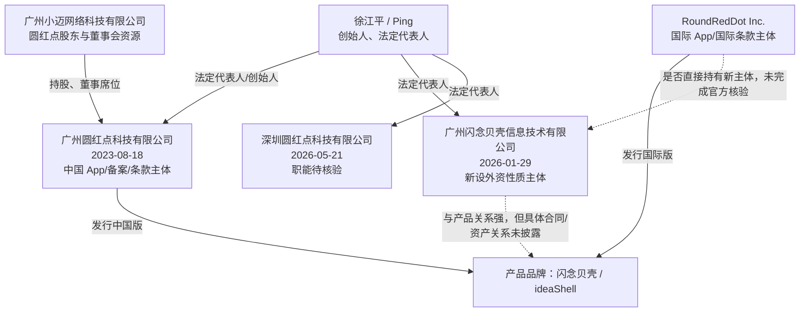
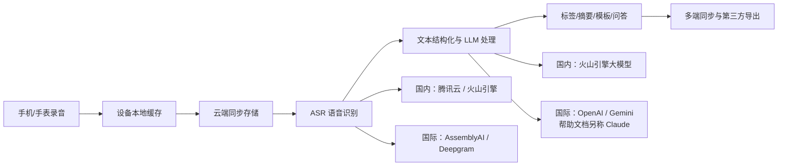

# 广州闪念贝壳 / RoundRedDot / ideaShell 公司深度分析报告

> **报告日期：** 2026-07-23  
> **研究对象：** 广州闪念贝壳信息技术有限公司、广州圆红点科技有限公司、RoundRedDot Inc. 与其产品“闪念贝壳 / ideaShell”  
> **研究目的：** 求职、面试、Offer 决策、业务合作与产品使用前尽调  
> **来源等级：** A = 政府/监管/应用商店原始记录；B = 公司官网、合同、隐私政策和创始人主页；C = 招聘平台、主流垂直媒体；D = 商业工商数据库、应用目录和用户评论；E = 基于公开事实的分析推断  
> **表达约定：** “事实”表示有直接公开证据；“公司自述”不等于经审计事实；“分析”表示本报告推断；“未核验”表示证据不足，不作肯定结论。  
> **重要限制：** 研究对象均为非上市小型公司，完整股权协议、审计财务、付费用户、留存、收入、现金余额、劳动用工和服务器架构未公开。本报告不构成法律或投资建议。

---

## 一、执行摘要

### 1.1 一句话判断

> **闪念贝壳不是空壳项目，而是一款已经获得显著全球分发、持续高频迭代的 AI 语音笔记产品：Google Play 显示 50 万+安装、约 1 万条评价，中国区 App Store 有 4,360 个评分。它最值得肯定的是设计驱动的产品力、Apple Watch 等快速入口和跨境双产品栈；最需要警惕的是公司法律主体正在重组、融资和财务透明度低、核心 AI/ASR 依赖第三方，以及录音类产品的隐私文本、商店标签和实际数据链路仍有明显不一致。**

### 1.2 核心结论

| 维度 | 核验结论 | 置信度 |
|---|---|---:|
| 产品真实性 | 中国区与国际区各有独立 App Store 应用，国内 Android 多商店上线，国际 Android 已达 Google Play `500K+` 安装 | 高 |
| 中国核心运营主体 | 当前中国官网、服务条款、隐私政策、App Store 提供者和 Android 备案均指向 **广州圆红点科技有限公司** | 高 |
| 用户所指新主体 | **广州闪念贝壳信息技术有限公司**于 2026-01-29 成立，与圆红点法定代表人相同、注册地址相邻，但尚未取代圆红点成为公开产品合同主体 | 高（存在）；中（具体职能） |
| 国际主体 | 国际官网、国际 App Store 和 Google Play 使用 **RoundRedDot Inc.**，Google Play 列出 Albany, New York 地址 | 高（平台展示）；中（完整官方注册档案） |
| 创始人 | Ping 自称 RoundRedDot 创始人；公开邮箱、履历与法定代表人徐江平形成强关联，合理判断为同一人 | 中高 |
| 创始人背景 | 个人主页自述曾任 3G 门户设计负责人、淘宝设计专家、爱范儿 VP/Partner，外部微博摘要曾称其为爱范儿副总裁兼首席设计官 | 中高 |
| 产品规模 | Google Play `500K+` 安装、4.6 分及约 1 万评价；中国 App Store 4.9 分/4,360 个评分；国际 iOS 4.75 分/542 个评分 | 高（平台快照） |
| 融资 | 未找到可验证的 VC 轮次、金额、估值或融资新闻；广州小迈网络已进入圆红点股权和董事会，但不能据此等同于公开融资轮 | 中高 |
| 团队规模 | 圆红点商业数据库显示参保人数 3；该指标可能滞后且不含新主体、外包和境外团队，不能当作实时总人数 | 中 |
| 商业模式 | 免费增值订阅 + AI 点数；中国普通会员约 ¥19/月或 ¥149/年，另有 Plus 和点数包 | 高 |
| 技术属性 | 产品层 AI 编排公司，而非自研基础模型公司；国内依赖腾讯云、火山引擎，国际依赖 AssemblyAI、Deepgram、OpenAI、Gemini 等 | 高 |
| 核心优势 | 设计和交互、语音快速捕捉、Watch/Siri/组件入口、自动整理、开放导出、跨中外市场运营 | 中高 |
| 核心短板 | Web/API 尚未完成，AI 功能容易被平台和大厂复制，底层供应商依赖强，公开单位经济模型缺失 | 中高 |
| 隐私与合规 | 已公开 SDK/AI 服务商并称不用于模型训练，但数据驻留、密钥、删除证明、跨境机制和独立安全认证披露不足 | 高 |
| 求职建议 | **值得继续面试，适合产品、客户端、后端、AI 应用工程和增长岗位；接 Offer 前必须核验签约主体、现金 runway、组织人数和数据合规** | 中高 |

### 1.3 最强正面信号

1. **产品规模显著超过普通早期独立 App。** 国际 Google Play 显示 50 万+安装、4.6 分和约 1 万条评价；这比官网自报下载量更有参考价值。[S7]
2. **中国市场也存在真实用户基础。** 中国区 App Store 为 4.9 分、4,360 个评分；应用宝、小米商店均有独立发行和用户评论痕迹。[S5][S6][S8]
3. **迭代频率高。** iOS 2026 年上半年持续发布 1.9.33 至 1.9.48，最新版为 2026-07-11；Android 国内版在 7 月中旬也有更新。[S5][S6][S8]
4. **产品定位不只是转录。** 语音捕捉后继续做结构化、摘要、标签、模板、AI 对话、待办和导出，价值链比单纯 ASR 更完整。[S1-S4]
5. **Apple 生态打磨较深。** 支持 Apple Watch、Siri、操作按钮、锁屏组件、快捷指令、iPad、Apple Silicon Mac，这类系统级入口是实际体验壁垒。[S4][S5]
6. **创始人产品与设计履历匹配。** Ping 的公开主页显示其长期从事移动产品设计，并经历 GO Launcher、淘宝、爱范儿和消费硬件产品，和闪念贝壳的设计导向一致。[S14][S15]
7. **国内外供应商分栈较清晰。** 国内使用本地 ASR/大模型，国际使用 AssemblyAI、Deepgram、OpenAI、Gemini，说明团队具备多模型路由和跨区域运营能力。[S9][S10][S13]
8. **已经有战略产业方治理痕迹。** 广州小迈网络关联人士梁国盛进入董事会，较纯个人工作室多了一层产品孵化和商业化资源。[S16][S17]

### 1.4 核心风险

1. **法律主体复杂且正在变化。** 2026 年新设“广州闪念贝壳信息技术有限公司”和“深圳圆红点科技有限公司”，但中国 App 的合同、备案和知识产权仍主要在广州圆红点名下。[S5][S6][S16][S19]
2. **新主体是外资性质，但境外股东未完成原始登记核验。** 它可能是境外架构下的 WFOE，也可能承担招聘或研发；公开证据不足以确认具体控制链。
3. **未找到公开融资轮。** 小迈入股是积极信号，但没有金额、估值、交割公告和投资协议；不能把注册资本、实缴资本直接解释为可用现金。
4. **财务指标完全不透明。** 下载量不能代表 MAU、付费用户或收入；订阅很便宜，而录音转写和大模型调用产生持续可变成本。
5. **AI 技术护城河有限。** 国内文本能力明确依赖火山引擎，国际依赖 OpenAI/Gemini；未见自研模型、独家语音数据或算法论文。[S9][S10]
6. **官网、文档和商店权益不同步。** 官网写 Premium 每月 150 万点数，版本记录称已提高到 200 万；官网年付折算 ¥144，App Store 年付显示 ¥149。[S2][S4][S5]
7. **“免费录音”口径冲突。** 官网免费版仍写 1 分钟限制，帮助中心则写单次少于 10 分钟不限次转写且不耗点数；应以 App 内最终购买页为准。[S2][S4]
8. **“仅本人可访问”不等于端到端加密。** 产品需要把音频或文本发送给第三方 ASR/LLM；未公开端到端加密、用户独占密钥或零知识架构。[S9][S13]
9. **跨境披露不充分。** 政策允许数据跨境，却没有清楚说明中国用户数据是否出境、各区域存储位置、传输法律机制和具体保留期。[S9][S13]
10. **国际模型披露存在差异。** 帮助中心称海外主要使用 OpenAI、Gemini、Claude，国际隐私政策只列 OpenAI 和 Google，未列 Anthropic。[S4][S13]
11. **年龄分级不一致。** 服务条款要求至少 17 岁，中国 App Store 却标为 4+；Google Play 标为 Everyone 并显示遵循 Families Policy。[S5][S7][S10]
12. **Android 权限与数据标签需要进一步解释。** 小米商店列出电话信息、日历、麦克风、蓝牙、存储、安装包等权限；Google Play 数据安全页又称可能收集位置等数据。[S7][S8]
13. **Web/API 仍未兑现。** 官网导航长期展示 Web/API，帮助中心截至 2025-11 仍称 Web 开发中、未来希望提供 API。[S4]
14. **单一产品集中度高。** 公司官网把 ideaOS 标为进行中，当前能确认的成熟收入产品仍只有闪念贝壳。[S12]
15. **公开招聘与实时组织信息很少。** 能核验的主要岗位是历史高级 Java 招聘；无法从公开页面确认当前完整团队和汇报线。[S18]

### 1.5 求职判断先行版

**建议继续面试，但把它当作“已有全球用户的设计驱动型小团队”，而不是成熟大厂或基础模型公司。**

更适合：

- 想直接影响消费级 AI 产品、接受快速迭代和广职责边界的人；
- iOS/Watch/Android、多端同步、音频、AI 应用后端、模型路由和增长工程方向；
- 对产品设计和用户体验敏感，愿意处理真实用户反馈的人；
- 能接受早期公司信息不完整、需要在面试中主动做商业和合规核验的人。

需要谨慎：

- 希望做基础模型训练、论文研究或大规模模型基础设施的人；
- 把稳定工时、成熟晋升、明确岗位边界放在首位的人；
- Offer 只写新设公司名称，却不解释和圆红点、RoundRedDot Inc. 的关系；
- 期权来自境外主体，但对授予实体、股数、完全稀释比例和行权规则含糊；
- 面试方只谈下载量，不愿披露活跃、留存、付费、收入和 runway。

---

## 二、名称与主体识别

### 2.1 “广州闪念贝壳”至少涉及三个层次

| 层次 | 名称 | 已确认角色 |
|---|---|---|
| 产品品牌 | 闪念贝壳 / ideaShell | AI 语音笔记、会议、日记和思考工具 |
| 中国既有运营主体 | 广州圆红点科技有限公司 | 中国官网、服务协议、隐私政策、iOS 提供者、Android 开发者、ICP备案和 App 备案主体 |
| 中国新设主体 | 广州闪念贝壳信息技术有限公司 | 2026 年新设、法定代表人相同、同楼相邻地址，公开招聘数据库出现 |
| 国际运营主体 | RoundRedDot Inc. | 国际官网、国际 iOS、Google Play 的开发者和合同主体 |
| 可能关联主体 | 深圳圆红点科技有限公司 | 2026 年新设，法定代表人徐江平；具体业务尚未公开 |

因此，**“广州闪念贝壳”不能简单等同于一个公司名称。** 对消费者而言，当前中国区合同相对方仍是广州圆红点；对求职者而言，劳动合同可能由 2026 年新设的广州闪念贝壳公司签署，必须在 Offer 前确认。

### 2.2 公开关系图



实线表示有公开证据支撑；虚线表示合理关联但控制链未完全核验。

### 2.3 必须排除的同名产品

另有独立产品“闪念 / IdeaSnap”：

- 官网为 <https://ideasnap.xyz/>；
- App Store ID 为 `1397149726`；
- 页面称由独立开发者“北城”维护。

它与本报告的“闪念贝壳 / ideaShell”不是同一产品。任何关于 IdeaSnap 的下载量、作者、价格或评价均不能归到圆红点名下。

---

## 三、工商主体与治理

### 3.1 广州圆红点科技有限公司

| 项目 | 公开记录 |
|---|---|
| 统一社会信用代码 | `91440106MACW418L58` |
| 成立日期 | 2023-08-18 |
| 状态 | 开业/存续 |
| 法定代表人 | 徐江平 |
| 当前注册资本 | 商业数据库最新摘要为 105 万元；早期记录为 100 万元 |
| 实缴资本 | 商业数据库摘要为 25 万元 |
| 类型 | 有限责任公司（自然人投资或控股） |
| 地址 | 广州市天河区天河路 621 号 1001 房之 E26 |
| 董事长、经理 | 徐江平 |
| 董事 | 胡敏婷、梁国盛 |
| 监事 | 胡家兴 |
| 参保人数 | 商业数据库当前展示 3 人，具体对应年报年份和统计范围需再确认 |
| ICP | `粤ICP备2023155405号`，官网分别展示 `-2`、`-3` |
| App 备案 | 闪念贝壳 `粤ICP备2023155405号-5A` |

官网、应用商店和商业数据库对公司名、统一代码、地址与法定代表人能够相互对应。[S5][S6][S8][S16]

**对注册资本的正确理解：**

- 注册资本是股东承诺的出资责任，不等于公司银行账户现金；
- 实缴资本是工商/年报口径中的已缴出资，也不等于当前余额；
- 不能从 105 万注册资本或 25 万实缴资本推导公司的 burn、收入或 runway；
- 注册资本从 100 万变为 105 万，说明发生过股权/资本调整，但不是“获得 5 万融资”的充分证据。

### 3.2 广州闪念贝壳信息技术有限公司

| 项目 | 公开记录 |
|---|---|
| 统一社会信用代码 | `91440106MAK7AN9A62` |
| 成立日期 | 2026-01-29 |
| 状态 | 存续 |
| 法定代表人 | 徐江平 |
| 注册资本 | 100 万元人民币 |
| 地址 | 广州市天河区天河路 621 号 1001 房之 E27 |
| 类型 | 招聘平台归类为外商独资/中外合资；搜索工商摘要更具体称外国法人独资 |
| 经营范围 | 软件开发、数字技术、数据处理、AI 基础/应用软件、AI 行业系统集成等 |

该公司与广州圆红点有三项强关联：[S19]

1. 法定代表人同为徐江平；
2. 注册地址只相差 E26/E27；
3. 公司名称直接使用产品品牌“闪念贝壳”。

但截至报告日：

- 中国版 App Store 提供者仍是广州圆红点；
- Android 开发/运营/备案主体仍是广州圆红点；
- 中国版服务条款与隐私政策仍由广州圆红点签署；
- 未看到官网正式解释两家公司之间的资产、知识产权、数据处理或用工关系。

**分析判断：** 新公司很可能用于外资架构下的研发、招聘、跨境结算或后续业务承接，但这只是高概率解释，不是已确认事实。若劳动合同由它签署，应要求 HR 解释境外股东、发薪与社保、IP 归属以及和广州圆红点的服务协议。

### 3.3 RoundRedDot Inc.

国际版形成另一套完整发行链：[S7][S10][S11][S13]

| 项目 | 公开信息 |
|---|---|
| 国际官网 | <https://ideashell.com/>、<https://www.roundreddot.com/> |
| 国际 iOS 开发者 | RoundRedDot Inc. |
| 国际 iOS Bundle ID | `com.rrd.ideaShell` |
| Google Play 包名 | `com.rrd.ideaShell` |
| 国际条款主体 | RoundRedDot Inc. |
| Google Play 地址 | 418 Broadway, Albany, NY 12207, United States |
| 联系方式 | `feedback@ideashell.com`、公开美国联系电话 |

本次未取得纽约州政府公司档案原件，故不能确认：

- 法人注册编号和准确设立日；
- 董事、股东和最终控制人；
- Albany 地址是注册地址、代理地址还是实际办公地点；
- RoundRedDot Inc. 是否直接持有广州闪念贝壳信息技术有限公司。

不过国际官网、Apple 和 Google 三方一致使用该名称，足以确认它不是临时写在页面上的孤立名号。

### 3.4 深圳圆红点科技有限公司

公开招聘/地图摘要显示该公司于 2026-05-21 成立，法定代表人为徐江平，地址为深圳市南山区粤海街道大冲社区科发路 91 号华润置地大厦 D 座 802，公司类型为法人独资。[S20]

由于成立时间很短，公开资料还不能确认其股东、团队、用工和与 ideaShell 的具体分工。它至少说明团队可能在广州之外扩展办公或搭建新组织，但不应据此推断深圳已有成熟研发中心。

### 3.5 治理结构变化的含义

最新工商摘要显示：[S16][S17]

- 广州小迈网络科技有限公司对广州圆红点的持股曾由 25% 稀释至约 23.8095%；
- 小迈网络董事长梁国盛进入广州圆红点董事会；
- 圆红点当前注册资本为 105 万元。

小迈网络自称“开发者孵化运营平台”，其价值可能包括渠道、买量、商业化、海外发行和后台运营。[S17]

这是一项积极但需要克制解读的信号：

- **可以确认：** 存在机构股东和董事会治理参与；
- **可以合理推断：** 圆红点获得过产业资源，而不完全依赖创始人个人；
- **不能确认：** 投资金额、估值、现金到账、优先权条款、控制权和退出安排；
- **不能称为：** 已公开的天使轮、Pre-A 或其他标准 VC 轮次。

---

## 四、创始人和团队

### 4.1 Ping / 徐江平

Ping 的个人主页写明自己是 RoundRedDot 创始人，并列出以下经历：[S14]

| 时间 | 个人主页自述经历 |
|---|---|
| 2010-2014 | 3G 门户 GO Launcher 系列，Design Lead |
| 2013-2014 | Klook，Lead UX Designer（External Partner） |
| 2014-2017 | 淘宝/阿里巴巴，Design Expert |
| 2017-2023 | 爱范儿，VP & Partner |
| 2021-2023 | 制糖工厂，VP & Partner |
| 2024 至今 | RoundRedDot，Founder |

外部微博搜索摘要曾把 Ping 标为“爱范儿副总裁兼首席设计官”，为其中一段经历提供了旁证。[S15]

个人主页并未直接写中文全名，但以下证据形成强关联：

- RoundRedDot 法定代表人为徐江平；
- 个人网站联系邮箱为 `jiangpinghsu@gmail.com`；
- 商业目录中的历史设计公司也出现相同邮箱与 `ping@ifanr.com`；
- Ping 自称 RoundRedDot 创始人且所在地为广州。

因此本报告将 Ping 与徐江平视为高概率同一人，但在需要法律证明的场景仍应以身份证明、工商档案或本人确认为准。

### 4.2 创始人能力画像

**优势：**

- 长期移动端产品和视觉交互背景，和当前产品的 UI、Watch、小组件优势高度一致；
- 经历工具产品、内容媒体、消费硬件和电商，理解产品、品牌与渠道的交叉；
- 能把个人审美转为清晰品牌语言，RoundRedDot 与 ideaShell 的视觉一致性强；
- 国际版已经获得 50 万+ Android 安装，说明不只会做设计，也具备发行和迭代能力。

**可能短板：**

- 公开履历更偏设计、产品和品牌，尚未看到其 AI 研究、后端基础设施或企业安全背景；
- 公司对技术负责人、CTO、数据保护负责人和其他核心成员披露极少；
- 关键人物依赖可能较高，创始人同时承担法定代表人、董事长、经理和产品公众形象。

### 4.3 团队规模不能简单看“参保 3 人”

商业数据库显示广州圆红点参保人数为 3，但该数字可能存在：[S16]

- 对应上一年度年报而非当前日期；
- 新员工签在广州闪念贝壳或深圳圆红点；
- 境外成员签在 RoundRedDot Inc.；
- 部分设计、开发、增长或客服由股东小迈网络提供；
- 使用外包、灵活用工或顾问。

因此可以判断团队偏小，但无法严谨写成“公司只有 3 人”。面试时应直接问：全职人数、各职能人数、劳动合同主体、外包占比和岗位汇报对象。

---

## 五、产品与发展轨迹

### 5.1 产品时间线

| 时间 | 事件 | 证据性质 |
|---|---|---|
| 2023-08 | 广州圆红点成立 | 工商记录 [S16] |
| 2023-12 | `粤ICP备2023155405号` 备案审核 | ICP/第三方备案摘要 [S12][S16] |
| 2024-03 | RoundRedDot/ideaShell 开始公开品牌叙事 | 官网与媒体资料 [S3][S12] |
| 2024-05-28 | 国际 iOS 版发布 | Apple Lookup [S11] |
| 2024-07-11 | 中国 iOS 版发布 | Apple Lookup [S5] |
| 2024-10 | 少数派发布体验文章，披露含营销/推广信息 | 垂直媒体 [S21] |
| 2025 | Android 版本陆续进入中国应用市场；产品加强会议、模板和多端体验 | 商店与版本记录 [S5][S8] |
| 2025-09 | 圆红点工商结构变化，小迈持股被稀释，核准信息更新 | 工商数据库摘要 [S16] |
| 2025-11 | 10 分钟以内免费转写、会员点数提高、分享网页和设备管理等上线 | Apple 版本历史 [S5] |
| 2026-01 | 广州闪念贝壳信息技术有限公司成立 | 工商/招聘数据库 [S19] |
| 2026-05 | 深圳圆红点科技有限公司成立 | 招聘/地图摘要 [S20] |
| 2026-07 | 中国/国际 iOS 均迭代至 1.9.48；中国 Android 为 1.8.21 | 应用商店 [S5][S6][S8][S11] |

### 5.2 产品功能地图

**记录层：**

- 语音、键盘、图片、扫描、手绘；
- Apple Watch、Siri、操作按钮、锁屏/桌面组件、快捷指令；
- 外部录音导入、会议课堂、说话人识别；
- 离线记录与回听，联网后再转写。

**AI 处理层：**

- 语音转文字；
- 去口语、结构化、分段、标题、摘要、标签；
- 智能卡片/模板；
- 笔记对话、Ask AI、个人知识检索；
- 待办、邮件、脚本、工作报告等内容生成。

**输出层：**

- 系统提醒事项、Things、OmniFocus；
- Notion、Craft、Bear、Ulysses、Word/WPS 等；
- 图片、网页分享、创建新笔记。

**尚未完全落地：**

- Web 端仍标为开发中；
- API 仍是未来计划；
- 官网标星的情感日记、Ask/个人知识库部分能力长期写有“即将推出”；
- ideaOS 仍为“进行中/设计中”。[S1-S4][S12]

### 5.3 真正的产品差异

它不是用“转写准确率”单点竞争，而是试图完成：

```text
快速捕捉 -> AI 清洗整理 -> 继续对话 -> 形成行动/内容 -> 导出到现有工作流
```

这个定位比普通录音机更接近“AudioPen + 个人知识库 + 轻量工作流”。

最有价值的差异包括：

1. **输入摩擦低。** Watch、Siri、操作按钮和组件让“想到就说”成立；
2. **不强迫 All-in-One。** 产品主动强调导出和连接现有工具；
3. **设计辨识度高。** 复古录音机和温和视觉语言在同质化 AI 工具中更容易形成品牌记忆；
4. **中外双栈。** 国内外应用、包名、模型供应商和定价独立，有利于合规和本地化；
5. **个人场景和会议场景兼容。** 可以做灵感、日记，也可以做长音频和说话人区分。

### 5.4 技术路线判断

公开隐私政策给出的技术链大致如下：[S9][S10][S13]



这意味着公司的核心技术资产更可能是：

- 音频切分、上传、失败恢复和多端同步；
- 供应商路由、语言/方言选择和成本控制；
- Prompt、模板、结构化输出和上下文构建；
- 笔记检索、标签和个人知识库；
- 原生客户端体验与系统集成；
- 订阅、点数、风控和增长系统。

**不是公开证据支持的能力：** 自研基础大模型、自研通用 ASR、自研芯片或独家模型训练平台。

---

## 六、应用商店与用户规模审计

### 6.1 中国 iOS

截至 2026-07-23：[S5]

| 项目 | 数值 |
|---|---:|
| App ID | `6476344403` |
| 开发者/卖方 | RoundRedDot Tech Co., Ltd. |
| 中国法定提供者 | 广州圆红点科技有限公司 |
| Bundle ID | `com.roundreddot.ideashell` |
| 首发日期 | 2024-07-11 |
| 最新版本 | 1.9.48 |
| 最新更新 | 2026-07-11 |
| 评分 | 约 4.9 / 5 |
| 评分数 | 4,360 |
| 大小 | 约 199.8 MB |
| 最低系统 | iOS 15 |

4,360 是“评分数”而非文本评论数，也不是下载量。它仍然说明产品在中国 iOS 已经跨过极早期验证阶段。

### 6.2 国际 iOS

| 项目 | 数值 |
|---|---:|
| App ID | `6478199476` |
| 开发者/卖方 | RoundRedDot Inc. |
| Bundle ID | `com.rrd.ideaShell` |
| 首发日期 | 2024-05-28 |
| 最新版本 | 1.9.48 |
| 最新更新 | 2026-07-12 |
| 美国区评分 | 约 4.75 / 5 |
| 美国区评分数 | 542 |

中国版和国际版不是同一个 App Store 条目，也不是同一个 Bundle ID。这有利于模型、条款和数据流分区，但也增加双版本维护成本。[S11]

### 6.3 国际 Android

Google Play 是当前最强规模信号：[S7]

| 项目 | 公开快照 |
|---|---:|
| 开发者 | RoundRedDot Inc. |
| 安装量 | `500K+` |
| 评分 | 4.6 |
| 评价数 | 页面顶部约 10.3K；设备评分区约 9.76K |
| 最近更新 | 2026-07-14 |
| 内容分级 | Everyone |
| 商业模式 | App 内购买 |

`500K+` 表示 Google Play 安装区间下限，不代表 50 万 MAU，也不包含卸载、重复设备和其他市场下载。但对于成立约三年的小团队，这仍是很强的分发结果。

### 6.4 中国 Android

- 应用宝：版本 1.8.21、7,315 下载、4 条评论，开发/运营/备案均为广州圆红点；[S6]
- 小米应用商店：版本 1.8.21、44 次评分，更新时间 2026-07-15；[S8]
- 官网还列出华为、OPPO、VIVO、荣耀和官方 APK 渠道。[S3]

国内 Android 单个平台数字明显低于 Google Play，但平台之间数据不能直接相加，部分商店不展示下载量。更合理的判断是：**国际 Android 是当前最大公开用户来源，中国 iOS 是中国市场的主要强信号。**

### 6.5 版本迭代能力

中国 iOS 版本历史显示 2026 年截至 7 月至少发布 15 个可见版本，其中既有稳定性修复，也有 Watch Ultra 操作按钮、转写和追加笔记优化。[S5]

这说明：

- 团队仍处于活跃产品期，不是长期无人维护；
- 客户端 release 工程和审核流程运转顺畅；
- 大量“修复错误/稳定性”也意味着复杂多端、音频和同步场景持续产生维护成本；
- 版本号极密集不等于每次都有重大产品进展。

---

## 七、商业模式与单位经济

### 7.1 中国价格

官网价格页：[S2]

| 方案 | 官网权益 |
|---|---|
| 免费版 | 1 分钟录音限制、30,000 试用点数、500MB、多设备同步 |
| Premium 年付 | ¥12/月折算、每月 150 万点数、25GB、无限设备 |
| Premium 月付 | ¥19/月 |

App Store 当前内购：[S5]

| 内购 | 价格 |
|---|---:|
| 月度高级会员 | ¥19 |
| 年度高级版 | ¥149 |
| 50 万点数 | ¥6 |
| 100 万点数 | ¥12 |
| 200 万点数 | ¥23 |
| 500 万点数 | ¥58 |
| Plus 周付 | ¥25 |
| Plus 月付 | ¥58 |
| Plus 年付 | ¥298 |

### 7.2 点数经济

帮助中心称：[S4]

- 单次小于 10 分钟的录音，所有用户不限次转写、不耗点数；
- 单次大于等于 10 分钟才消耗点数；
- 每分钟约消耗 3,000-4,000 点；
- 一小时约消耗 10-15 万点；
- 会员周期点数可累积，有效期一年；
- 对话、模板和 Ask AI 也消耗点数。

按官网 150 万点/月计算，纯长录音约覆盖 10-15 小时；按版本记录所称 200 万点，则约覆盖 13-20 小时。实际还要扣除对话和生成内容消耗。

**商业含义：**

- 短录音免费可以强化日常习惯和留存；
- 长会议、课堂和播客属于高成本场景，用点数限制毛利风险；
- 额外点数接近线性定价，说明公司正在把推理成本显式传给重度用户；
- 年费 ¥149 相当低，若重度用户大量使用 ASR/LLM，毛利取决于模型路由、缓存、批处理和供应商折扣。

### 7.3 国际价格

国际官网显示：[S22]

- 免费版：50,000 试用点数、500MB；
- Premium：年付折算 `$4.16/月`；
- 月付 `$5.99/月`；
- 每月 150 万点数、25GB。

国际定价高于中国，有利于覆盖海外模型成本和渠道费用，但仍低于很多专业会议转录 SaaS。

### 7.4 官网和 App 内权益漂移

至少存在以下差异：

| 项目 | 页面 A | 页面 B | 风险 |
|---|---|---|---|
| 免费录音 | 官网：1 分钟限制 | 帮助中心：小于 10 分钟不限次、不耗点 | 转化页陈旧或定义不同 |
| 月点数 | 官网：150 万 | 2025-11 版本记录：升级为 200 万 | 购买预期不清 |
| 年费 | 官网折算 12×12 = ¥144 | App Store：¥149 | 渠道差价或页面未同步 |
| 点数有效期 | 中国帮助中心：一年 | 旧 App 评论曾称两年 | 规则已改变 |
| 高级层级 | 官网只突出 Premium | App Store 另有 Plus | 官网未完整呈现套餐 |

对消费者，这是信息透明问题；对求职者，这反映官网、App 内购、帮助中心和条款的配置治理仍不成熟。

### 7.5 收入和盈利不能由下载量推导

本次未找到可信的：

- MAU/DAU；
- 注册用户；
- 付费用户和付费率；
- MRR/ARR；
- 续费率和退款率；
- 商店收入；
- ASR/LLM 单位成本；
- 毛利率；
- 获客成本和回收周期。

Google Play 50 万+安装是需求和分发信号，不是财务证明。面试方若用下载量替代上述指标，应该继续追问。

---

## 八、用户口碑与产品质量

### 8.1 正面反馈主题

应用商店和少数派文章中的正面主题主要是：[S5][S7][S21]

- 说完即得到结构化笔记，降低打字和整理负担；
- Apple Watch 录音适合会议、走路和临时灵感；
- UI 简单、有辨识度；
- 语音识别在清晰发音下表现较好；
- 智能卡片和导出能接入 Notion 等现有工作流；
- 离线记录后联网转换适合通勤场景。

少数派作者尤其肯定快速输入、设计和知识管理工作流。但该文章页面明确标有“文中包含营销和推广信息”，且文章部分内容使用闪念贝壳 AI 优化，因此应视为**带披露的体验/推广内容**，而不是完全独立测评。[S21]

### 8.2 负面反馈主题

可见评论暴露了几类真实问题：[S5][S7]

1. **异常退出与录音恢复。** 有中国 iOS 付费用户称手机没电后录音消失；开发者回复可在“设置-恢复录音”找缓存。说明已有恢复机制，但用户对数据安全感仍不足。
2. **外部音频格式兼容。** 用户称小米录音导入后不能转写；开发者解释不同机型/应用导出格式可能不同。
3. **点数限制。** 早期用户希望高级会员增加点数，开发者曾回复目标是最终取消限制；当前仍保留点数体系。
4. **语言错误。** Google Play 用户曾称详细摘要把其他语言转为中文；开发者要求升级版本并提供支持邮箱。
5. **Web/API 缺失。** 2024 年评测已提出多平台和自动同步不足；Android 后来上线，但 Web/API 截至帮助文档更新仍未完成。
6. **少量文本评论与高评分的代表性。** 中国 App Store 评分很多，但公开页面只展示少量文本评论，无法据此判断长期留存和重度会议场景质量。

### 8.3 口碑信号如何解读

| 信号 | 正确解读 | 不应得出的结论 |
|---|---|---|
| Google 50 万+安装 | 国际发行有效、产品有广泛试用 | 有 50 万活跃用户 |
| Google 约 1 万评价 | 有大规模评价痕迹 | 所有评价均自然获得 |
| 中国 iOS 4.9/4,360 | 用户满意度总体高 | 录音永不丢失或所有功能成熟 |
| 版本更新频繁 | 团队仍积极维护 | 公司财务健康 |
| 开发者回复差评 | 客服仍在运转 | 已彻底解决同类问题 |

未找到可靠证据证明刷榜或大规模虚假评论，也未找到独立证据证明评价增长完全自然。最稳妥的结论是：**口碑整体好，且规模真实可见，但评价获取渠道和留存质量仍需内部数据验证。**

---

## 九、隐私、安全与 AI 数据链路

### 9.1 国内数据处理

中国隐私政策称：[S9]

- 账户收集昵称、邮箱/手机号等；
- 笔记同时存于设备和云端；
- 传输和存储过程加密；
- 不把笔记用于基础模型训练；
- Firebase 用于统计、崩溃和性能；
- 腾讯云和火山引擎用于语音识别；
- 火山引擎用于文本理解、生成、总结和问答；
- 可能向关联公司、收购方、执法机构或必要服务商提供数据；
- 数据可能发生跨境传输；
- 用户可申请访问、修改、删除，Android 政策称 15 个工作日响应。

### 9.2 国际数据处理

国际隐私政策在 2026-07-22 更新，列出：[S13]

- AssemblyAI、Deepgram：音频/音频 URL 和 ASR 请求信息；
- OpenAI、Google Gemini：文本、指令、上下文和任务数据；
- Firebase/Google：设备、系统、网络和使用统计；
- 数据加密传输；
- 不主动授权供应商把音频、转写、输入输出用于训练基础模型；
- 可能进行跨境传输。

帮助中心另称海外主要使用 OpenAI、Gemini、Claude，但国际隐私政策未列 Anthropic。可能原因包括：文档滞后、Claude 只在特定功能/地区使用，或已停止使用。无论哪一种，隐私清单应与实际生产调用保持一致。[S4][S13]

### 9.3 “只有你能看到”应如何理解

官网文档说数据加密、只有用户可见、与模型交流匿名。[S4]

这并不能证明：

- 端到端加密；
- 公司后台技术上无法解密；
- 第三方处理器无法在任务处理期间看到内容；
- 用户独占密钥；
- 删除请求可立即清除所有备份和供应商副本；
- 录音不会用于故障排查或合规保留。

更准确的理解是：**公司承诺控制访问并限制用途，但为了提供 ASR 和 AI，系统仍会处理和转发用户内容。** 对一般灵感记录可能可接受，对董事会、医疗、法律、客户隐私或未公开商业会议则需要更高标准。

### 9.4 商店隐私标签与政策差异

Apple 中国页由开发者自报：[S5]

- 与身份关联：邮箱、电话号码、用户 ID、设备 ID；
- 未与身份关联：音频、产品交互、崩溃和性能数据；
- Apple 明确表示该信息未经 Apple 验证。

Google Play 数据安全页：[S7]

- 称不与第三方“分享”数据；
- 可能收集位置、个人信息等 8 类数据；
- 传输中加密；
- 可请求删除；
- 遵循 Families Policy。

“不分享”通常不把受托处理服务商按广告出售意义计入，但隐私政策事实上会向 ASR/LLM 服务商传输内容。消费者容易把两种定义混为一谈。

### 9.5 Android 权限面

小米商店展示的权限包括：[S8]

- 麦克风、相机、文件/图片；
- 日历读写；
- 手机信息（页面描述包括手机号、IMEI、IMSI）；
- 蓝牙/WLAN、网络；
- 前台麦克风服务、媒体投屏；
- 精确闹钟、通知、快捷方式；
- 请求安装包。

部分权限可能用于会议内录、桌面组件、导出待办、更新 APK 或兼容旧系统，并不证明应用实际滥用。但录音笔记本身高度敏感，公司应说明：

- 每项权限的必要性和触发时机；
- 是否按 Android 版本做最小化；
- 为什么需要电话标识和请求安装包；
- Google Play“位置”数据来自何处；
- 权限拒绝后的降级行为。

### 9.6 仍未公开的安全能力

本次未找到以下公开材料：

- SOC 2、ISO 27001、等保或独立渗透测试证明；
- 加密算法、密钥管理和密钥轮换；
- 中国/海外具体数据中心地区；
- RTO/RPO、备份保留和灾难恢复指标；
- 安全事件响应和漏洞披露计划；
- 企业版 DPA、子处理商清单变更通知；
- 账户导出、删除完成证明；
- 执法请求透明度报告。

这不代表公司没有这些措施，只代表公开透明度尚不足以支持企业敏感会议场景。

### 9.7 年龄与未成年人问题

中国和国际服务条款均要求用户至少 17 岁；中国 App Store 标为 4+，Google Play 标为 Everyone 并显示遵循 Families Policy。[S5][S7][S10][S13]

这是明显的产品合规口径差异。可能只是“内容分级”和“合同使用年龄”定义不同，但普通用户不会自然理解。若产品实际面向学生课堂记录，更需要统一年龄门槛、监护人同意和未成年人数据政策。

---

## 十、竞争格局

### 10.1 竞争不是单一赛道

| 类别 | 代表产品 | 它们相对闪念贝壳的优势 | 闪念贝壳的机会 |
|---|---|---|---|
| 个人语音思考 | AudioPen、Voicenotes | 定位直接、海外品牌成熟、Web 能力较强 | 中文/方言、Watch 和设计体验 |
| 会议转录 | Otter、Notta、通义听悟、飞书妙记 | 会议协作、企业权限、日历/视频会议集成 | 从会议结果继续变成个人知识与行动 |
| AI 录音硬件 | Plaud Note/NotePin | 独立硬件、电话/随身录音、专用入口 | 无需购买硬件、跨设备输入 |
| 轻量笔记 | flomo、苹果备忘录、Google Keep | 低成本、生态、用户习惯和快速文本输入 | AI 自动整理、语音优先 |
| 知识库/文档 | Notion、Obsidian、Craft | Web/桌面、插件、协作、成熟数据结构 | 作为它们的语音前端和预处理器 |
| 系统级 AI | Apple Intelligence、Pixel Recorder、Gemini、豆包 | OS 权限、免费捆绑、算力和分发 | 更专注的工作流、跨生态和品牌体验 |

### 10.2 竞争优势能否持续

**较难复制：**

- 多年积累的原生端细节和 Apple Watch 使用体验；
- 中外双版本、多模型供应链和商店运营经验；
- 设计品牌和“记录-思考-行动”的完整交互；
- 已经形成的用户笔记库和使用习惯。

**容易复制：**

- 语音转写、摘要、标签和通用聊天；
- Prompt 模板；
- 基于第三方模型的情绪分析；
- 基础导出和分享。

**结论：** 闪念贝壳当前的护城河是产品执行、分发和习惯，不是基础算法专利。只有继续把多端、检索、个人上下文、可靠性和成本路由做深，才能避免被系统级功能压缩。

### 10.3 市场机会

- 用户越来越愿意用说话代替打字；
- AI 把非结构化语音转换成可行动内容，显著提高笔记价值；
- 可穿戴设备增加低摩擦输入场景；
- 中英文和方言、多模型路由适合全球化；
- 个人知识上下文可能成为 AI 助手的重要资产。

### 10.4 市场威胁

- ASR 和总结能力快速商品化；
- 手机 OS、会议平台和办公套件可免费捆绑；
- 录音同意、隐私和跨境监管成本上升；
- 用户可以轻易切换，除非导入/导出和长期知识价值足够强；
- 低订阅价与高推理成本可能挤压毛利；
- AI 输出错误在会议纪要、医疗和法律场景会放大责任。

---

## 十一、融资、资本与财务判断

### 11.1 已确认资本信号

- 广州小迈网络是广州圆红点股东；
- 梁国盛进入圆红点董事会；
- 注册资本和股权比例发生过调整；
- 2026 年出现外资性质的广州新主体和国际发行主体。

### 11.2 未找到的融资证据

未发现以下一手或高可信来源：

- 机构官网投资组合公告；
- 创业媒体融资报道；
- 融资轮次、金额和估值；
- FA 或公司新闻稿；
- Crunchbase/PitchBook 可交叉验证的交易详情；
- 政府基金或产业基金公示。

因此报告结论是：**有产业股东，但无可验证的公开融资轮。**

### 11.3 为什么资本结构仍值得关注

小迈网络的开发者孵化和增长背景，可能帮助：[S17]

- Android 渠道分发；
- 海外买量与素材；
- 订阅、广告或 IAP 商业化；
- 数据分析、客服和合规；
- 招聘与后台职能。

但它也可能造成：

- 创始团队与产业股东的增长目标冲突；
- 对买量渠道依赖；
- 数据和技术服务在关联方之间流动；
- 员工实际服务多个主体或产品。

### 11.4 面试中必须拿到的财务答案

至少应问清：

1. 最近 12 个月收入、订阅收入占比和增长率；
2. Google Play 50 万+安装对应的 MAU、D30 留存和付费率；
3. 中国/国际收入占比；
4. App Store/Google Play/国内 Android 的获客成本；
5. 每小时转写和每次 AI 处理的真实成本；
6. 毛利率和重度用户是否亏损；
7. 当前现金和按现有 burn 的 runway；
8. 小迈是财务投资、控股孵化还是渠道合作；
9. 新设外资主体的资金来源和职能；
10. 是否计划下一轮融资，以及触发条件。

---

## 十二、招聘与工程组织判断

### 12.1 公开招聘痕迹

BOSS 历史页面能确认圆红点招聘过高级 Java 开发工程师：[S18]

- 广州天河区体育中心；
- 3-5 年、本科；
- 搜索结果关联薪资约 15-30K；
- 职责摘要包括核心模块、高性能可扩展 API、多端接入、与前端和产品协作；
- 公司招聘页自称“AI 语音笔记产品 #1、量子位 AI 产品榜单产品”，未找到对应榜单原始页，不把 `#1` 当作已验证事实。

截至本次检索，未找到稳定公开的完整职位列表。猎聘的新主体页面主要是工商介绍和同行业推荐，不等于该公司正在招聘那些职位。[S19]

### 12.2 工程挑战真实存在

对于后端/客户端岗位，这家公司可提供的真实问题包括：

- 大文件分片上传、断点续传、异常恢复；
- iPhone/Watch/Android/Mac 多端同步与冲突处理；
- ASR 异步任务、说话人识别和长音频处理；
- 多模型路由、降级、质量评测和成本控制；
- 用户个人知识检索和上下文管理；
- App 内购、点数账本、权益和退款；
- 中外数据分区、供应商和合规；
- 高增长下的客服、日志、可观测性和隐私最小化。

这比单纯套壳聊天 App 更有工程深度。

### 12.3 组织风险

- 产品、法务、数据和用工分散在多个主体；
- 团队小，岗位可能同时承担开发、运维、客服排障和合规支持；
- 高频发布可能伴随高节奏和较多线上问题；
- 单一产品意味着业务波动直接传导到团队；
- 没有公开 CTO/技术 VP，技术决策与汇报线需确认；
- 新公司成立不足一年，没有完整年报和劳动争议历史可供观察。

### 12.4 Offer 前核验清单

| 问题 | 理想答案 | 风险答案 |
|---|---|---|
| 劳动合同主体 | 明确为哪家公司，并解释集团关系 | 面试品牌、Offer、发薪、社保四个主体不同且无解释 |
| 社保公积金 | 入职当月足额按工资基数缴纳 | 最低基数、第三方代缴或试用期不缴 |
| 团队人数 | 给出全职人数和职能拆分 | 只说“增长很快”，拒绝给数字 |
| 汇报对象 | 明确技术负责人及决策流程 | 所有人直接向创始人、无工程 owner |
| 现金 runway | 给出月 burn、现金或至少可支撑月份 | 用下载量或注册资本回避 |
| 收入质量 | 能说明订阅、续费、退款和毛利 | 只报安装量和评分 |
| On-call | 有轮值、告警、补偿和故障复盘 | 个人 7×24 随时处理 |
| 数据安全 | 有分区、加密、审计、删除和供应商管理 | 只说“我们很重视隐私” |
| 期权 | 写明授予主体、股数、稀释比例、归属和行权 | 只承诺“以后有期权” |
| 试用期 | 目标量化、薪资不打折或合理约定 | 随意延长、模糊淘汰标准 |

---

## 十三、SWOT 分析

### Strengths：优势

- 国际 Google Play 50 万+安装，已有真实规模；
- 中国 iOS 评分数量和口碑较强；
- 创始人设计和产品背景突出；
- Watch/Siri/组件和原生端体验成熟；
- AI 处理覆盖记录、整理、思考和行动；
- 国内外供应商分栈，具备全球化基础；
- 小迈网络带来产业渠道和治理资源；
- 高频迭代证明团队仍有执行力。

### Weaknesses：劣势

- 无公开融资和财务数据；
- 团队、技术负责人和组织结构不透明；
- 依赖第三方 ASR/LLM；
- Web/API 和部分愿景功能未完成；
- 权益、点数和价格页面不一致；
- 法律主体、数据主体和用工主体复杂；
- 安全认证和企业合规材料不足；
- 基础 AI 功能可替代性高。

### Opportunities：机会

- 语音输入成为 AI 时代高频入口；
- 个人上下文/记忆将成为 Agent 的核心；
- 可穿戴设备让随时记录更自然；
- 国内外低价订阅可扩大用户基数；
- 从个人笔记扩展到会议、课堂和创作；
- API/Web 完成后可进入自动化和生态集成。

### Threats：威胁

- Apple、Google、微软、字节、阿里和飞书系统级竞争；
- Plaud 等硬件占据专用录音入口；
- 大模型和 ASR 供应商涨价、限流或政策变化；
- 录音同意和跨境数据监管；
- 用户对录音丢失的容忍度极低；
- 低价导致增长但毛利不足；
- 隐私事故会直接伤害品牌信任。

---

## 十四、风险矩阵

| 风险 | 概率 | 影响 | 评级 | 观察/缓释 |
|---|---:|---:|---:|---|
| 用工主体与产品主体不一致 | 高 | 中高 | 高 | Offer 写明主体及关联服务安排 |
| 收入/runway 不透明 | 高 | 高 | 高 | 要求披露月 burn、现金和收入区间 |
| 录音或同步丢失 | 中 | 高 | 高 | 核验恢复率、备份、RPO 和事故数据 |
| 隐私/跨境合规 | 中高 | 高 | 高 | 数据分区、DPA、子处理商、删除证明 |
| 第三方模型依赖 | 高 | 中高 | 高 | 多供应商路由、缓存、降级和成本上限 |
| 大厂功能替代 | 高 | 中高 | 高 | 深化个人知识、工作流和跨平台体验 |
| 低价与推理成本冲突 | 中高 | 高 | 高 | 看毛利、重度用户分层和点数策略 |
| 核心人物依赖 | 中高 | 中高 | 中高 | 明确技术/产品二线负责人 |
| 页面权益不一致 | 高 | 中 | 中高 | 统一产品配置和法律文本发布流程 |
| 团队过小、职责过宽 | 中高 | 中 | 中高 | 明确岗位边界、On-call 和补偿 |
| 评价或下载质量低于表面 | 中 | 中高 | 中高 | 核验 MAU、留存、自然/付费来源 |
| 商标/知识产权不足 | 低中 | 中 | 中 | 已有 22 项商标摘要，继续核验核心权属 |

---

## 十五、综合评分与结论

### 15.1 评分

| 维度 | 评分（10 分） | 说明 |
|---|---:|---|
| 产品真实性 | 9.0 | 多平台、双区域、持续更新 |
| 用户与分发 | 8.0 | 50 万+ Google 安装和较多评分 |
| 产品体验潜力 | 8.2 | 设计、Watch、工作流差异明显 |
| 技术深度 | 6.8 | 工程复杂度真实，但基础模型依赖第三方 |
| 创始团队 | 7.5 | 创始人产品设计履历强，其他成员透明度低 |
| 资本与治理 | 6.0 | 有小迈股东和董事，但无公开融资轮 |
| 商业透明度 | 4.5 | 收入、留存、毛利和 runway 均未披露 |
| 安全与合规 | 5.5 | 已披露供应商，但关键技术和跨境机制不足 |
| 求职成长性 | 7.5 | 影响面大、问题真实，适合能扛责任的人 |
| 求职稳定性 | 5.8 | 小团队、单产品、多主体、财务未知 |

**综合判断：约 6.9/10，建议进入下一轮并做强核验。**

### 15.2 最终结论

闪念贝壳已经跨过“有没有产品”和“有没有用户”的阶段。Google Play 安装量、中国 App Store 评分、双版本发行和连续迭代共同证明，它是一家有实际执行力的消费级 AI 公司。

它尚未跨过的是：

- 商业可持续性证明；
- 组织和法律架构透明；
- 企业级安全与合规证明；
- 从产品差异走向长期技术/数据壁垒；
- 从单一创始人驱动走向成熟管理团队。

对求职者而言，最大的潜在回报是进入一个已经有全球分发、仍处于产品塑形期的小团队，工作可以直接影响几十万级安装用户。最大的风险则是你可能承担远超岗位描述的职责，而公司的现金、组织和合规能力并没有公开数据支撑。

**建议决策：**

- **面试阶段：继续。** 产品和用户信号足够强，值得和创始人/技术负责人深入聊；
- **Offer 阶段：有条件接受。** 必须拿到签约主体、团队人数、收入/现金区间、工作节奏和数据安全的明确回答；
- **遇到回避时：降低评级。** 尤其是只展示下载和评分，却拒绝谈留存、付费、毛利和 runway；
- **作为用户：普通灵感和个人笔记可尝试。** 高敏感会议、客户录音、医疗/法律内容应先确认授权与数据处理要求。

---

## 十六、面试建议问题

### 16.1 给创始人/业务负责人

1. Google Play 50 万+安装中，最近 30 天 MAU 和 D30 留存是多少？
2. 中国 iOS、国际 Android、国际 iOS 的收入和增长占比分别是多少？
3. 当前付费率、年订阅续费率和退款率是多少？
4. 小迈网络在资本、渠道和经营上分别承担什么角色？
5. 广州闪念贝壳信息技术有限公司为什么在 2026 年新设，境外股东是谁？
6. 产品、知识产权、用户数据和员工分别属于哪个主体？
7. 当前现金 runway 多久？下一轮融资的目标条件是什么？
8. Web/API/Agent 的优先级和明确时间表是什么？
9. 公司认为三年后最难复制的能力是什么？
10. 如果 Apple/Google 免费提供同类功能，公司靠什么留住用户？

### 16.2 给技术负责人

1. 国内和国际数据是否物理隔离，分别存在哪个区域？
2. 长音频上传、断点恢复和多端冲突怎么设计？历史录音丢失率是多少？
3. 如何评测腾讯/火山/AssemblyAI/Deepgram 的准确率、延迟和成本？
4. OpenAI/Gemini/Claude 如何路由，隐私政策为何未完整列出 Claude？
5. 是否有 Prompt 回归集、ASR/摘要质量基准和人工标注流程？
6. 笔记检索是否使用向量库，如何做租户隔离和删除？
7. 加密密钥由谁控制，是否支持 envelope encryption 和定期轮换？
8. RPO/RTO、备份保留、灾难恢复和事故复盘是什么标准？
9. On-call 如何轮值，夜间故障频率和补偿如何？
10. 为什么 Web/API 长期未发布，主要瓶颈是产品、资源还是架构？

### 16.3 给 HR

1. 劳动合同、发薪、社保和个税分别由哪个公司承担？
2. 试用期工资、考核标准和转正流程是什么？
3. 是否双休，平均下班时间和紧急上线频率如何？
4. 年终奖、调薪、加班调休和带薪年假规则是什么？
5. 当前全职员工总数、研发人数和一年离职率是多少？
6. 若提供期权，授予的是哪家公司、占完全稀释股份多少？
7. 公司主体变化时，工龄、补偿和期权如何连续？

---

## 十七、来源清单

> 所有网页均于 2026-07-23 访问。应用商店数据会随时间变化。

### A/B 级：官方与一手来源

- **[S1]** 闪念贝壳中国官网：<https://ideashell.cn/>
- **[S2]** 中国价格页：<https://ideashell.cn/pricing>
- **[S3]** 中国下载页、关于与愿景：<https://ideashell.cn/download>、<https://ideashell.cn/about>、<https://ideashell.cn/vision>
- **[S4]** 闪念贝壳帮助中心：<https://docs.ideashell.cn/zh-cn>；点数规则：<https://docs.ideashell.cn/zh-cn/getting-started/recording-duration-and-points-overview>；模型说明：<https://docs.ideashell.cn/zh-cn/others/which-llm-does-ideashell-use>；数据安全：<https://docs.ideashell.cn/zh-cn/others/data-security-and-privacy-policies>；Android/Web/API：<https://docs.ideashell.cn/zh-cn/others/android-web-and-api>
- **[S5]** 中国 App Store：<https://apps.apple.com/cn/app/id6476344403>；Apple Lookup：<https://itunes.apple.com/lookup?id=6476344403&country=cn>
- **[S6]** 应用宝中国 Android 页：<https://sj.qq.com/appdetail/com.roundreddot.ideashell>
- **[S7]** 国际 Google Play：<https://play.google.com/store/apps/details?id=com.rrd.ideaShell&hl=en_US&gl=US>
- **[S8]** 小米应用商店：<https://app.mi.com/details?id=com.roundreddot.ideashell>
- **[S9]** 中国通用隐私政策、Android 隐私政策：<https://www.roundreddot.cn/privacy>、<https://www.roundreddot.cn/android-privacy>
- **[S10]** 中国服务条款：<https://www.roundreddot.cn/terms>
- **[S11]** 国际 App Store Lookup：<https://itunes.apple.com/lookup?id=6478199476&country=us>；App Store：<https://apps.apple.com/us/app/id6478199476>
- **[S12]** 广州圆红点官网与媒体资料：<https://www.roundreddot.cn/>、<https://www.roundreddot.cn/mediakit>
- **[S13]** 国际官网、隐私政策与服务条款：<https://www.roundreddot.com/>、<https://www.roundreddot.com/privacy>、<https://www.roundreddot.com/terms>
- **[S14]** Ping 个人主页与履历：<https://pingchn.com/>、<https://pingchn.com/about>
- **[S15]** Ping 微博公开搜索页：<https://weibo.com/u/3492185093>

### C/D 级：工商、招聘、媒体与目录

- **[S16]** 爱企查/企查查/水滴信用的广州圆红点企业摘要：<https://aiqicha.baidu.com/s?q=广州圆红点科技有限公司>、<https://www.qcc.com/web/search?key=广州圆红点科技有限公司>、<https://shuidi.cn/>
- **[S17]** 广州小迈网络官网与企业摘要：<https://www.xmiles.cn/>、<https://aiqicha.baidu.com/s?q=广州小迈网络科技有限公司>
- **[S18]** BOSS 直聘圆红点公司与高级 Java 岗位：<https://www.zhipin.com/job_detail/3794418dfbe33a9d03N_3N27GVBX.html>、<https://www.zhipin.com/gongsi/f8164955b00b3c8c1XN83N69E1Y~.html>
- **[S19]** 猎聘广州闪念贝壳信息技术有限公司：<https://m.liepin.com/company/gs131829586/>
- **[S20]** 智联招聘深圳圆红点科技有限公司搜索页：<https://www.zhaopin.com/sou/jl765/kw深圳圆红点科技有限公司>
- **[S21]** 少数派体验文章《闪念贝壳：从灵感捕捉到反思行动，让懒人爱上记录的 AI 语音笔记》：<https://sspai.com/post/92912>
- **[S22]** ideaShell 国际价格页：<https://ideashell.com/pricing.html>

### 证据边界说明

- 工商商业数据库可能滞后，股权和实缴信息应以市场监管部门最新档案为最终依据；
- BOSS/猎聘页面可能是历史缓存，岗位存在不代表当前仍开放；
- App Store 和 Google Play 的评分、评价和安装区间是平台快照；
- 公司隐私政策和帮助中心属于公司承诺，不等于已通过独立安全审计；
- 未检索到的信息不等于不存在，尤其是未公开融资、内部安全认证和境外公司档案。
