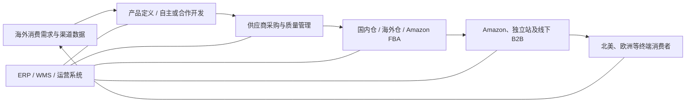
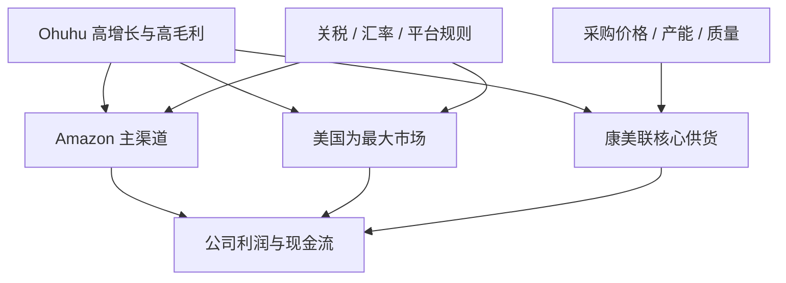

# 深圳千岸科技股份有限公司深度分析报告

> **报告日期：** 2026-07-20  
> **用户原始名称：** 深圳干岸科技股份有限公司  
> **实际研究对象：** 深圳千岸科技股份有限公司（Shenzhen Thousandshores Technology Co., Ltd.）  
> **研究目的：** 求职、面试、Offer 决策及业务合作前尽调，重点分析公司真实性、业务质量、财务、股权治理、供应链、平台与地区集中度、监管问询、合规及岗位适配  
> **信息截止：** 2026-07-20；当日为公司北交所公开发行网上申购日，上市日期尚未公告  
> **来源等级：** A = 监管申报、发行公告、经审计财务及公司法律文件；B = 公司官网、品牌官网和官方招聘；C = 主流媒体或专业行业资料；D = 招聘平台及搜索快照；E = 基于公开事实的分析推断  
> **重要限制：** 本报告不是审计报告、法律意见或投资建议。招聘信息、岗位数量和薪酬会动态变化；“未发现”不等于“绝对不存在”。

---

## 一、身份纠错与研究边界

### 1.1 “干岸”还是“千岸”

对“深圳干岸科技股份有限公司”的精确名称检索，没有找到能与该名称稳定对应的官网、监管申报、证券公告或可信工商主体。与用户描述最接近、且存在完整公开信息链的是：

- **深圳千岸科技股份有限公司**；
- 官网品牌为 `1000shores`；
- 原新三板证券代码 `874600`；
- 北交所发行代码 `920065`；
- 统一社会信用代码 `91440300559872352Y`。[S1][S5][S6][S7]

因此，本报告将“干岸”视为输入或 OCR 误差，按“千岸科技”展开。若用户实际指向另一家公司，本报告结论不能直接套用。

### 1.2 这家公司到底是什么

千岸科技是一家**以自有品牌为核心、整合中国供应链、通过 Amazon 等渠道向海外消费者销售艺术创作、消费电子、运动户外和家居庭院产品的跨境消费品公司**。[S1]

它拥有研发、产品定义、供应商协同、ERP、WMS 和跨境运营系统，但收入本质仍来自**实物商品销售**，不是对外销售软件订阅、AI 模型或云服务。

### 1.3 一句话判断

> **这是一家经营真实、盈利和现金流较强、已走到北交所发行阶段的品牌型跨境消费品公司；最大价值来自 Ohuhu 品牌、供应链整合和跨境运营，最大风险来自 Amazon、美国市场和康美联供应商三重集中。对求职者而言值得继续面试，但不能把“即将上市”“高新技术企业”误读为低风险或纯技术平台。**

---

## 二、执行摘要

### 2.1 核心结论

| 维度 | 结论 | 置信度 |
|---|---|---:|
| 主体真实性 | 2010 年成立，官网、四个品牌、经审计财务、两轮问询和发行文件完整可核 | 高 |
| 当前资本市场状态 | 已获发行注册并进入北交所发行流程；2026-07-20 网上申购，**尚不能称为已上市公司** | 高 |
| 商业本质 | 自有品牌跨境消费品，而非软件、AI 或传统硬科技公司 | 高 |
| 经营规模 | 2025 年营收 19.81 亿元，净利润 2.20 亿元，员工 460 人 | 高 |
| 增长质量 | 2023-2025 营收连续约 19% 增长，净利润增长更快，经营现金流持续为正 | 高 |
| 利润质量 | 2025 经营现金流/净利润约 104.7%，扣非净利润接近净利润 | 高 |
| 核心增长引擎 | Ohuhu 艺术创作业务；2025 收入 8.24 亿元，同比增 53.13%，毛利率 50.15% | 高 |
| 渠道风险 | 2025 Amazon 占主营收入 85.55%，虽逐年下降但仍是绝对主渠道 | 高 |
| 地区风险 | 境外收入 99.68%，美国单一市场约占 51.40% | 高 |
| 供应商风险 | 康美联占成品采购 34.39%，且约 92% 收入依赖千岸；采购价格公允性被监管重点问询 | 高 |
| 技术属性 | 有真实产品研发与内部系统，但 2025 自主研发模式收入仅 14.17%，研发费率 1.56% | 高 |
| 治理 | 何定、何文姐弟合计控制 54.78%，创始人控制稳定，同时存在家族控制风险 | 高 |
| 合规 | 未见重大违法或重大诉讼，但多国税务延迟、产品标签和第三方店铺问题显示跨境内控压力 | 中高 |
| 2026 动能 | 一季度收入增 3.95%，净利润降 14.98%；高增长已明显放缓，汇率是公司解释的重要因素 | 高 |
| 求职判断 | 适合品牌、产品、跨境运营、供应链、硬件/化学研发及内部数字化岗位；纯 AI/云平台候选人需谨慎 | 中高 |

### 2.2 最强的正面信号

1. **不是概念项目。** 公司成立超过 15 年，四个品牌均有真实独立站和长期产品运营。[S7-S11]
2. **增长与盈利同时存在。** 2023-2025 年营收从 14.00 亿元增至 19.81 亿元，净利润从 0.96 亿元增至 2.20 亿元。[S1]
3. **利润含金量较好。** 三年经营现金流分别约 2.07、1.72、2.30 亿元，均为正；2025 年扣非净利润为 2.13 亿元。[S1]
4. **财务结构改善。** 货币资金从 1.65 亿元增至 3.85 亿元，负债率按合并口径由约 45.5% 降至约 26.0%。[S1]
5. **品牌化出现成果。** Ohuhu 已成为明确的增长和高毛利核心，而不是完全依赖泛品铺货。[S1][S9]
6. **监管穿透程度较高。** 北交所围绕收入真实性、采购价格、存货、平台费、募投和 IT 控制进行了两轮问询。[S2][S3]
7. **员工规模在扩大。** 2023-2025 年员工由 357 人增至 460 人，并存在员工持股平台和 IPO 员工战略配售。[S1][S5]

### 2.3 最值得警惕的风险

1. **平台集中：** Amazon 收入占比 85.55%，封店、规则、佣金、广告和流量变化都可能直接影响经营。[S1]
2. **地区集中：** 美国收入约占 51.40%，同时受关税、汇率、消费周期和产品合规影响。[S1]
3. **供应商集中：** 康美联与千岸形成强经济依赖，且向千岸销售价格显著低于其他相似配置客户。[S3]
4. **单品牌增长集中：** 最近两年增长主要由 Ohuhu 拉动；数码电子 2025 年已经下降，家居庭院占比持续收缩。[S1]
5. **2026 增速换挡：** 一季度收入仅增 3.95%，利润同比下降；不能继续机械外推 2023-2025 的利润增速。[S1]
6. **全球合规复杂：** 多个境外主体发生税务滞纳或罚款，CPSC/CBP 曾因标签问题暂停销售并扣押两批货物。[S1][S2]
7. **家族控制：** 董事长兼总经理及副总经理为姐弟实际控制人，上市后仍能显著影响战略、预算和人事。[S1]
8. **技术标签易被夸大：** 研发费率只有 1.56%，自主研发模式收入占比 14.17%，公司不是以技术许可或 SaaS 收入为核心。[S1]

### 2.4 求职建议先行版

**建议继续面试，但按岗位分化判断。**

- 品牌、海外营销、Amazon 运营、供应链、产品开发、艺术材料/化学、消费硬件：业务场景真实，较匹配。
- ERP、WMS、数据平台、测试和内部系统：有真实复杂度，但技术主要服务公司内部商品业务。
- 纯 AI 算法、基础设施、开发者平台、云原生：公开材料不能证明这些是核心收入或核心组织重心。
- 财务、税务、法务、合规：场景丰富，但工作复杂度和责任压力会显著高于单一市场公司。
- 把稳定工时、成熟流程、低业务波动放在首位的人，应重点核查团队实际工作节奏和绩效机制。

---

## 三、公司基本信息与发行状态

### 3.1 主体信息

| 项目 | 信息 |
|---|---|
| 公司全称 | 深圳千岸科技股份有限公司 |
| 英文名称 | Shenzhen Thousandshores Technology Co., Ltd. |
| 统一社会信用代码 | `91440300559872352Y` |
| 有限公司成立 | 2010-08-02 |
| 股份公司成立 | 2020-12-08 |
| 法定代表人 | 何定 |
| 注册资本 | 7,275 万元 |
| 注册地址 | 深圳市南山区南山大道 3186 号莲花广场 B 栋 1101 |
| 官网 | <https://www.1000shores.cn/> |
| 原新三板代码 | `874600` |
| 北交所发行代码 | `920065` |

以上信息来自最终招股书和发行公告。[S1][S5][S6]

### 3.2 截至 2026-07-20 的准确上市状态

公司已取得中国证监会同意公开发行注册的批复，并进入北交所公开发行流程。发行公告安排如下：[S5][S6]

| 项目 | 数值/状态 |
|---|---:|
| 网上申购日 | 2026-07-20 |
| 发行价格 | 24.30 元/股 |
| 新发行股份 | 1,750 万股 |
| 战略配售 | 175 万股 |
| 网上发行 | 1,575 万股 |
| 发行后总股本 | 9,025 万股 |
| 预计募资总额 | 4.2525 亿元 |
| 预计募资净额 | 3.7240 亿元 |
| 发行后扣非摊薄市盈率 | 10.28 倍 |
| 按发行价计算发行后市值 | 约 21.93 亿元 |
| 计划代码切换日 | 2026-07-22 |
| 上市日期 | 待后续公告 |

必须区分：

- **已通过审核并获注册**：是；
- **已开始公开发行**：是；
- **已完成发行结果确认**：截至本报告日尚待后续公告；
- **已在北交所挂牌交易**：截至本报告日不能这样表述。

代码切换公告也明确提示，公开发行可能因中止、暂缓或代码切换失败而无法上市。[S6] 这属于标准风险揭示，但足以说明“即将上市”不等于“已经上市”。

### 3.3 募集资金投向

| 项目 | 项目总投资 | 拟用募资 |
|---|---:|---:|
| 产品开发中心建设 | 2.207879 亿元 | 2.207879 亿元 |
| 供应链及运营中心系统建设 | 1.228542 亿元 | 1.228542 亿元 |
| 品牌建设和渠道推广 | 1.706159 亿元 | 0.287579 亿元 |
| 合计 | 5.142580 亿元 | 3.724000 亿元 |

这套投向与公司商业本质一致：加强产品、供应链系统和品牌渠道，而不是投入基础模型、通用软件或芯片研发。[S1]

**分析判断：**

- 产品中心和供应链系统有助于提高 SKU 开发、预测、库存和履约效率；
- 品牌推广项目总投资较大，但只有部分由本次募资覆盖，公司仍需用自有资金投入；
- 2025 年末公司已有 3.85 亿元货币资金，募投必要性和资金使用效率因此受到监管问询并不意外；
- 募投建设期通常不会立即转化为收入，应关注新增人员、设备、折旧和营销支出对短期利润的影响。

---

## 四、业务模式与品牌矩阵

### 4.1 业务链条

千岸不是自己大规模建厂制造所有商品，而是通过产品定义、合作开发、供应商采购、品牌、渠道和数字化运营整合价值链。[S1]

### 4.2 四个主要品牌

| 品牌 | 主要品类 | 公开定位 | 业务判断 |
|---|---|---|---|
| **Ohuhu** | 马克笔、绘画工具、美术用品 | 面向艺术创作者 | 当前最强品牌、最主要增长引擎 |
| **Tribit** | 蓝牙音箱、耳机 | 消费音频 | 有品牌积累，但竞争激烈，2025 所属数码品类承压 |
| **Sportneer** | 健身器材、户外和自行车用品 | 运动户外 | 稳定增长，品类较分散 |
| **iClever** | 儿童耳机、键鼠等 | 儿童与办公电子 | 有安全音量等产品能力，仍属于红海消费电子 |

品牌官网均可独立访问，说明品牌和产品并非仅存在于招股书中：[S8-S11]

- Ohuhu：<https://www.ohuhu.com/>
- Tribit：<https://tribit.com/>
- Sportneer：<https://sportneer.com/>
- iClever：<https://www.iclever.com/>

### 4.3 2025 年品类结构

| 品类 | 主营收入 | 占主营收入 | 毛利率 | 2025 变化 |
|---|---:|---:|---:|---|
| 艺术创作 | 8.237 亿元 | 41.93% | 50.15% | 同比 +53.13% |
| 数码电子 | 4.009 亿元 | 20.41% | 39.99% | 收入同比下降 |
| 运动户外 | 4.434 亿元 | 22.57% | 38.62% | 同比 +17.40% |
| 家居庭院 | 2.965 亿元 | 15.10% | 37.34% | 收入大致稳定，占比继续下降 |

数据来自最终招股书。[S1]

最重要的结构变化是：

- 艺术创作占比从 2023 年 24.87% 升至 2025 年 41.93%；
- 数码电子占比从 30.93% 降至 20.41%；
- 家居庭院占比从 22.36% 降至 15.10%；
- 公司主动精简了部分低盈利家居庭院 SKU；
- 公司的增长故事正从“多品类跨境卖家”向“Ohuhu 为核心的品牌组合”倾斜。

### 4.4 Ohuhu 为什么重要

Ohuhu 同时贡献：

1. 最高的品类收入；
2. 最高的品类毛利率；
3. 最近两年最快的增长；
4. Amazon 等渠道上的品牌搜索和用户认知；
5. 对康美联马克笔供应链的深度协同。

这意味着 Ohuhu 是公司的主要护城河，也是新的单点风险。若艺术创作热度、平台排名、产品口碑或康美联供货发生明显变化，公司增长和毛利会同时受影响。

### 4.5 渠道结构

2025 年主要渠道占主营收入：[S1]

| 渠道 | 占比 |
|---|---:|
| Amazon | 85.55% |
| 品牌独立站 | 5.68% |
| 速卖通 | 1.09% |
| 其他线上渠道 | 约 1.87% |
| 线下 B2B | 5.81% |

从销售方式看，线上 B2C 占 94.07%，线下 B2B 占 5.81%。

积极面是 Amazon 占比已由 2023 年 93.42% 降至 2025 年 85.55%，独立站和线下 B2B 占比上升。风险面是 85.55% 仍然极高，所谓“渠道多元化”尚处早期。

### 4.6 地区结构

| 地区 | 2025 主营收入占比 |
|---|---:|
| 北美洲 | 62.69% |
| 欧洲 | 26.61% |
| 亚洲 | 6.71% |
| 大洋洲 | 2.45% |
| 南美洲 | 1.50% |
| 非洲 | 0.04% |

其中：[S1]

- 境外收入占 99.68%；
- 美国单一市场占约 51.40%；
- 北美与欧洲合计占 89.30%。

公司虽然是“全球销售”，但实际经济暴露高度集中于欧美，尤其是美国。

---

## 五、“技术公司”标签纠偏

### 5.1 有哪些真实技术能力

公开材料显示，公司确实建设并使用：

- 跨境电商 ERP；
- WMS 仓储管理系统；
- 订单、库存、采购、物流和运营数据系统；
- 消费电子、音频、儿童耳机安全音量等产品研发能力；
- 马克笔配方、材料、结构和使用体验相关研发；
- 面向产品和运营的数据分析能力。[S1-S3]

这些能力对管理数千个 SKU、多国家、多仓库、多店铺和高交易量非常重要，不应被低估。

### 5.2 为什么仍不应定义为纯技术公司

2025 年按开发模式划分；收入占比见最终招股书，SKU 数量见第一轮问询回复：[S1][S2]

| 开发模式 | 收入 | 收入占比 | SKU 数量 |
|---|---:|---:|---:|
| 自主研发 | 2.784 亿元 | 14.17% | 458 |
| 合作开发 | 11.221 亿元 | 57.12% | 2,469 |
| 直接选品 | 5.640 亿元 | 28.71% | 1,446 |
| 合计 | 19.645 亿元 | 100% | 4,373 |

同时：

- 2025 年研发投入占营收 1.56%；
- 销售费用率为 24.85%；
- 研发人员 62 人，占员工 13.48%；
- 营销人员 233 人，占员工 50.65%。[S1]

**结论：**

公司的核心能力是“品牌 + 产品 + 供应链 + 渠道 + 数字化运营”的组合，而不是单一技术专利或外售软件。高新技术企业资格说明其满足相关认定条件，不代表收入结构与软件公司相同。

### 5.3 对技术岗位的现实含义

**可能有价值的技术场景：**

- 多平台订单、库存、结算和广告数据集成；
- 全球仓储、补货和需求预测；
- 多店铺权限、财务对账和审计追踪；
- 移动端、硬件固件、音频算法、测试自动化；
- 产品生命周期、供应商和质量数据管理。

**可能的边界：**

- 技术组织是内部效率部门还是战略核心，需要面试核验；
- 公开财务不能证明内部系统对外商业化；
- AI 是否进入生产、产生何种可量化收益，公开材料没有充分披露；
- 对希望做基础模型、开发者生态或高并发互联网平台的人，岗位成长路径未必匹配。

---

## 六、股权、创始人与治理

### 6.1 发行前股权

| 股东 | 发行前持股 |
|---|---:|
| 何定 | 43.56% |
| 刘治 | 15.77% |
| 王文生 | 12.37% |
| 何文 | 11.21% |
| 千岸聚新员工持股平台 | 10.31% |
| 上海联新 | 3.91% |
| 蒋纯望 | 2.87% |

数据来自最终招股书。[S1]

### 6.2 实际控制人

- 何定与何文为姐弟；
- 双方签署一致行动协议；
- 何定直接及间接合计持有约 43.57%，任董事长、总经理；
- 何文直接持有 11.21%，任董事、副总经理；
- 两人合计持有 54.78%。[S1]

### 6.3 何定履历

招股书披露：[S1]

- 1974 年出生，博士研究生学历；
- 2007-2008 年任 Sun Microsystems 高级软件工程师；
- 2008-2010 年任 Sunvalleytek International 副总经理；
- 2010 年起参与创办和经营千岸；
- 现任董事长兼总经理。

这段履历说明创始人有软件工程和跨境业务背景，也解释了公司为何较早重视内部信息系统。但公司今天的收入主轴仍是品牌商品。

### 6.4 治理的两面性

**积极面：**

- 控制权稳定，长期战略不易因股东分散而摇摆；
- 创始人深度参与经营，品牌和供应链决策链可能较短；
- 公司已建立董事会、审计委员会等公众公司治理框架。[S1]

**风险面：**

- 董事长兼总经理权力集中；
- 姐弟共同控制，关键岗位存在家族治理色彩；
- 中小股东和职业经理人的制衡效果仍需观察；
- 对员工而言，组织制度是否能约束临时决策、绩效变更和资源倾斜，不能仅由上市流程推断。

### 6.5 员工持股与 IPO 战略配售

- 千岸聚新持股 10.31%，是员工持股平台；
- 招股书披露该平台包含多名高管和员工合伙人；
- IPO 的两个员工战略配售资管计划拟分别认购约 3,076.49 万元和 976.00 万元，合计约 4,052.49 万元；
- 相关战略配售股份限售期为 12 个月。[S1][S5]

这证明公司存在真实员工权益安排，但不能推导普通新员工一定能获得股权。候选人应核验：

1. Offer 中写的是期权、限制性股票、持股平台份额还是奖金；
2. 授予主体、数量、价格和归属期；
3. 离职、裁员、未上市/已上市转换及回购规则；
4. 口头承诺是否进入盖章文件。

---

## 七、财务深度分析

### 7.1 三年核心财务

单位：亿元，比例除外。[S1]

| 指标 | 2023 | 2024 | 2025 |
|---|---:|---:|---:|
| 营业收入 | 14.00 | 16.67 | 19.81 |
| 净利润 | 0.964 | 1.442 | 2.195 |
| 扣非净利润 | 0.914 | 1.430 | 2.134 |
| 综合毛利率 | 39.86% | 41.35% | 43.42% |
| 净利率 | 6.89% | 8.65% | 11.08% |
| 经营现金流 | 2.072 | 1.719 | 2.298 |
| 货币资金 | 1.648 | 2.901 | 3.846 |
| 存货净额 | 1.681 | 2.297 | 2.399 |
| 总资产 | 6.389 | 8.198 | 9.326 |
| 总负债 | 2.905 | 3.232 | 2.424 |
| 股东权益 | 3.484 | 4.966 | 6.902 |
| 加权 ROE | 30.49% | 34.13% | 37.31% |

### 7.2 增长速度

- 2024 年营收同比约 +19.09%；
- 2025 年营收同比约 +18.82%；
- 2023-2025 营收复合增速约 18.95%；
- 2024 年净利润同比约 +49.53%；
- 2025 年净利润同比约 +52.24%；
- 两年净利润复合增速约 50.86%。

净利润增速显著高于营收，主要与产品结构向高毛利 Ohuhu 倾斜、综合毛利率提升、规模效应和费用率变化有关。[S1]

但这组利润增速不能直接外推：2026 年一季度已经显示增长放缓和汇率波动。

### 7.3 现金流与利润含金量

| 年份 | 经营现金流/净利润 |
|---|---:|
| 2023 | 214.89% |
| 2024 | 119.20% |
| 2025 | 104.70% |

三年经营现金流均覆盖当年净利润，说明利润不是主要依靠应收账款堆积或非现金项目形成。扣非净利润也与净利润接近。[S1]

需要注意：

- 现金流高于利润不代表每年都能维持；
- 跨境电商现金流会受平台结算周期、备货和旺季库存影响；
- 募投开始后，资本开支和营销投入可能显著增加。

### 7.4 资产负债与流动性

按合并报表粗算：

| 年份 | 总负债/总资产 |
|---|---:|
| 2023 | 约 45.5% |
| 2024 | 约 39.4% |
| 2025 | 约 26.0% |

2025 年末：[S1]

- 货币资金约 3.846 亿元；
- 短期借款约 4,512 万元；
- 无长期借款余额；
- 存货净额约 2.399 亿元。

流动性总体较强，短期借款明显低于货币资金。对求职者而言，这比只会讲融资故事但无收入的创业公司稳定得多。

### 7.5 存货质量

存货净额由 2023 年 1.68 亿元增至 2025 年 2.40 亿元，增幅低于同期收入增幅。公司使用海外仓、Amazon FBA、自营仓和在途库存，存货核验天然复杂。[S1-S3]

监管重点关注：

- 海外仓和平台库存真实性；
- 在途商品权属和截止；
- SKU 较多情况下的跌价准备；
- 店铺关闭后的存货回收；
- IT 系统与财务记录的一致性。[S2][S3]

最终通过问询并不等于库存永远无风险，但说明保荐、审计及监管已对其进行了比普通未上市公司更深入的核验。

### 7.6 费用结构

2025 年：[S1]

- 销售费用率：24.85%；
- 研发投入率：1.56%；
- 销售平台费：2.613 亿元，占营收 13.19%；
- 市场推广费：1.242 亿元，占营收 6.27%；
- 关税成本：8,226 万元，同比增加 120.54%。

平台费与市场推广合计已接近 3.86 亿元，远高于研发投入。这再次说明公司经济模型的关键是渠道效率、品牌转化和供应链毛利，而不是研发投入规模。

### 7.7 为什么 ROE 很高

2025 年加权 ROE 为 37.31%，显著高于可比公司。可能的主要来源包括：[S1][S3]

1. 高毛利 Ohuhu 快速增长；
2. Amazon 为主的轻资产渠道模式；
3. 自有工厂占比较低，主要整合供应商；
4. 经营现金流强，资产周转效率较好；
5. 康美联较低采购价格对毛利形成支持。

第五点是理解高盈利时最不能忽略的因素，详见供应商风险章节。

---

## 八、2026 年经营动能

### 8.1 2026 年一季度

| 指标 | 2026 Q1 | 同比 |
|---|---:|---:|
| 营业收入 | 4.558 亿元 | +3.95% |
| 净利润 | 5,197 万元 | -14.98% |
| 扣非净利润 | 5,090 万元 | -14.21% |
| 经营现金流 | 8,824.85 万元 | 正向 |

公司解释，美元兑人民币汇率下降带来汇兑损失，导致收入和利润变动不一致。[S1]

**分析：**

- 汇率解释有财务逻辑，但不应掩盖营收增速已从约 19% 降至 3.95%；
- 单季度有季节性，不能直接代表全年；
- 即使剔除部分汇兑影响，也要关注 Ohuhu 增速是否正常化；
- 现金流仍为正，是相对积极信号。

### 8.2 2026 年上半年预计

招股书披露的未经审计预计：[S1]

| 指标 | 预计区间 | 同比变化 |
|---|---:|---:|
| 营业收入 | 9.4-9.6 亿元 | +5.25% 至 +7.49% |
| 归母净利润 | 1.10-1.16 亿元 | -4.49% 至 +0.72% |
| 扣非净利润 | 1.07-1.13 亿元 | -4.65% 至 +0.70% |

该数据未审计，也不构成盈利预测。它支持“2026 年增长换挡”的判断，而不是“经营崩塌”。

### 8.3 后续最应观察的指标

1. Ohuhu 收入是否仍能维持两位数增长；
2. 康美联采购占比和价格差是否下降；
3. Amazon 占比能否继续降到 80% 以下；
4. 独立站和线下 B2B 增长是否带来更低平台费率；
5. 关税能否通过提价、供应链迁移或产品组合消化；
6. 汇率套保政策和汇兑损益波动；
7. 募投后的新增折旧、人员和市场费用；
8. 上市后首份定期报告与招股书预计是否一致。

---

## 九、三大集中度风险

### 9.1 Amazon 集中

Amazon 主营收入占比：[S1]

| 年份 | 占比 |
|---|---:|
| 2023 | 93.42% |
| 2024 | 90.30% |
| 2025 | 85.55% |

趋势在改善，但绝对集中度仍高。主要风险包括：

- 账号冻结、店铺审查和关联账号识别；
- 平台佣金、FBA 和广告费上涨；
- 搜索与推荐算法变化；
- 评论、退货和知识产权投诉；
- 平台扣款、结算延迟和库存限制；
- 平台政策要求使用特定主体或本地资料。

2025 年销售平台费占营收 13.19%，说明 Amazon 不只是流量来源，也是重要成本决定者。[S1]

### 9.2 美国市场集中

美国占主营收入约 51.40%，对公司影响最大的外部变量包括：[S1]

- 中美关税与贸易政策；
- 美元兑人民币汇率；
- 美国消费周期；
- CPSC、FCC、儿童产品、标签和知识产权合规；
- 海运、港口和海外仓成本。

2025 年关税成本同比增长 120.54%，已经证明政策变化能快速进入利润表。[S1]

### 9.3 康美联供应商集中

青岛康美联文化用品有限公司是 Ohuhu 马克笔的核心供应商。2025 年：[S3]

- 千岸向康美联采购约 2.014 亿元；
- 占成品采购约 34.39%；
- 康美联向千岸销售额占其自身收入约 92.00%；
- 千岸历史上持有康美联 5% 股权，2025 年 5 月以 500 万元转让。

这不是普通的“大客户/供应商关系”，而是明显的双向经济依赖：

- 千岸依赖康美联的马克笔供货、配方、产能和协同；
- 康美联更依赖千岸订单生存；
- 双方即使法律上不构成控制，业务上也高度绑定。

### 9.4 采购价格争议

第二轮问询披露：[S3]

| 销售对象 | 2025 年相似产品单价 |
|---|---:|
| 康美联向千岸 | 约 1.30 元/支 |
| 康美联向其他相似配置客户 | 约 1.60-1.80 元/支 |

监管要求按其他客户价格模拟。结果显示，如果千岸按 1.60-1.80 元/支采购，2025 年综合毛利率可能从 43.42% 降至约 39.51%-41.08%，下降约 2.34-3.91 个百分点。[S3]

公司与中介的主要解释是：

- 千岸采购规模远大于其他客户；
- 产品定制、订单稳定性和长期协同不同；
- 中介核查康美联及实控人资金流水，未发现代垫成本费用；
- 公司不控制康美联的重大决策。

**本报告判断：**

- “未发现代垫费用”降低了财务舞弊疑虑；
- 规模折扣可以解释一部分价差；
- 但价差对 2025 毛利率影响已经达到数个百分点，不能称为完全不重要；
- 康美联的独立议价、持续经营和替代供应能力仍是实质经营风险；
- 如果该供应关系失衡，Ohuhu 的供货、成本和质量可能同时受影响。

### 9.5 三重风险如何叠加

三项集中不是互相独立。核心品牌在核心平台卖向核心国家，又依赖核心供应商，因此单一外部冲击可能沿多个环节放大。

---

## 十、监管问询、内控与合规

### 10.1 第一轮问询关注点

北交所第一轮问询主要覆盖：[S2]

1. 业务模式与创新属性；
2. 经营合法合规；
3. 电商销售真实性；
4. 采购价格公允性；
5. 存货真实性；
6. 平台费核算；
7. 大额固定资产；
8. 其他财务问题；
9. 募投必要性；
10. 其他事项。

### 10.2 第二轮问询关注点

第二轮进一步聚焦：[S3]

1. 核心竞争力与创新；
2. 收入增长和核查程序；
3. 关联采购与毛利率；
4. 募投合理性；
5. 收入确认、跨境转移定价和 IT 控制。

这两轮问题说明监管并未简单接受“品牌、高新技术、收入增长”的叙述，而是穿透到平台店铺、供应商、银行流水、库存和系统控制。

### 10.3 多店铺与第三方主体

报告期新增店铺：[S2]

- 2023 年 15 个；
- 2024 年 13 个；
- 2025 年 19 个。

关闭店铺：[S2]

- 2023 年 11 个；
- 2024 年 8 个；
- 2025 年 8 个。

公司称关闭主要因资源集中、订单量低等经营原因，并在关闭前处理库存和款项。店铺增减本身是跨境运营常态，但大量店铺和主体会增加：

- 账号关联和平台规则风险；
- 权限与离职交接风险；
- 收入、退款和平台费对账复杂度；
- 税务、银行账户和第三方回款风险；
- IT 主数据和财务截止控制难度。

### 10.4 第三方店铺与回款

问询回复披露，第三方注册店铺产生的主营收入占比约为：[S2]

- 2023 年 2.68%；
- 2024 年 2.93%；
- 2025 年 2.72%。

部分店铺销售款先进入第三方账户，再与千岸对账结算。公司称相关款项均已回款，且第三方与公司无关联关系。[S2]

**判断：** 占比不足 3%，不是公司主要收入来源；但这种结构不是最标准的自有主体闭环，持续的协议、流水、权限和对账控制仍有必要。

### 10.5 税务处罚与滞纳

公开问询和招股书披露，德国、英国、美国、加拿大等境外主体曾出现：[S1][S2]

- 预缴不足；
- 延迟申报或延迟缴税；
- 进项税更正；
- 税务代理未及时处理；
- 相应滞纳金、利息或小额罚款。

公司及中介认为单项金额较小，不构成重大违法。这个法律结论可以接受，但管理层面应另作判断：多个国家反复出现类似事项，说明全球税务日历、代理管理和复核机制存在持续复杂度。

### 10.6 产品标签事件

2023 年，美国千岸收到美国消费品安全委员会（CPSC）违规通知，因两批产品标签上的合规声明不明显，被暂时停止销售；美国海关及边境保护局（CBP）随后扣押两批货物，货值约 7,627.92 美元。[S1]

金额不大，但事件揭示：

- 消费品合规不只是产品质量，还包括标签、声明、测试和文件；
- 儿童耳机、电子产品、美术材料面对不同监管体系；
- 小错误也可能触发停销、扣押和平台下架；
- 新市场拓展会持续增加合规成本。

### 10.7 其他历史事项

申报材料还披露：[S1-S3]

- 历史股权代持已解除；
- 部分境外投资手续曾不够规范，实控人作出损失承担承诺；
- 部分租赁未办理备案；
- 报告期未见重大诉讼、仲裁；
- 未见重大资金占用或违规对外担保；
- 2025 年内部控制审计结论为有效；
- 报告期不存在劳务派遣。

### 10.8 如何理解“通过监管问询”

合理结论是：

- 财务、收入和供应链已受到较深的外部核查；
- 重大造假或重大违法未被当前审核发现；
- 公开透明度显著高于普通未上市公司。

不合理结论是：

- 所有数据永远准确；
- 供应商、平台和税务风险已经消失；
- 上市后不会业绩下滑；
- 劳动强度、奖金和管理体验已经被监管背书。

证券审核关注投资者保护和发行条件，不替员工验证团队文化与具体 Offer。

---

## 十一、竞争格局

### 11.1 与招股书可比公司的 2025 年对比

单位：亿元。[S1]

| 公司 | 营收 | 净利润 | 净利率 | 主要特点 |
|---|---:|---:|---:|---|
| 赛维时代 | 118.17 | 2.83 | 2.39% | 规模大、服饰等多品牌跨境 |
| 三态股份 | 16.92 | 0.49 | 2.87% | 跨境零售与物流 |
| 致欧科技 | 87.01 | 3.36 | 3.86% | 家居品牌和全球渠道 |
| **千岸科技** | **19.81** | **2.20** | **11.08%** | Ohuhu 等品牌，盈利率突出 |

### 11.2 千岸的位置

- 规模远小于赛维时代和致欧科技；
- 与三态股份营收接近，但利润明显更高；
- 2025 综合毛利率 43.42%，高于三家可比公司；
- 净利率和 ROE 明显突出；
- 高盈利与 Ohuhu 品类结构、平台运营效率和康美联采购价格都有关系。[S1][S3]

### 11.3 护城河拆解

| 能力 | 强度判断 | 原因 |
|---|---|---|
| Ohuhu 品牌认知 | 中高 | 高增长、高毛利、用户和渠道积累已形成 |
| 多品牌矩阵 | 中 | 真实存在，但除 Ohuhu 外增长和差异化不均衡 |
| Amazon 运营 | 中高 | 规模、店铺和多年数据积累明显 |
| 供应链协同 | 中高 | 与核心供应商深度绑定，但也形成集中风险 |
| 内部数字化系统 | 中 | 对效率重要，公开证据不足以证明不可复制 |
| 自主技术/IP | 中低至中 | 有专利和产品技术，但自主研发收入占比较低 |
| 独立渠道 | 中低 | 独立站增长，但 2025 仅占 5.68% |
| 线下零售 | 中低 | 正在增长，当前占比仍小 |

### 11.4 最可能的竞争挑战

1. 美术用品品牌和传统线下渠道向 Amazon/独立站加速；
2. 中国跨境品牌复制马克笔套装、定价和内容营销；
3. Amazon 广告竞价抬高获客成本；
4. 消费电子品类价格战和更新速度；
5. 平台自有品牌或渠道规则变化；
6. 关税促使供应链向其他国家转移；
7. Ohuhu 之外的新品牌未能形成同等级增长。

---

## 十二、员工、招聘与工作环境判断

### 12.1 员工规模

| 年末 | 员工人数 |
|---|---:|
| 2023 | 357 |
| 2024 | 406 |
| 2025 | 460 |

两年净增 103 人，约增长 28.9%，与业务扩张方向一致。[S1]

### 12.2 2025 年人员结构

| 类型 | 人数 | 占比 |
|---|---:|---:|
| 营销 | 233 | 50.65% |
| 供应链 | 88 | 19.13% |
| 管理 | 77 | 16.74% |
| 研发 | 62 | 13.48% |

组织结构再次验证其主要资源投向：市场和供应链是主轴，研发是重要支撑，但不是人数最多的核心。[S1]

### 12.3 年龄与学历

2025 年：[S1]

- 21-30 岁：251 人，占 54.57%；
- 31-40 岁：155 人，占 33.70%；
- 本科：276 人，占 60.00%；
- 硕士：52 人，占 11.30%；
- 博士：2 人，占 0.43%。

团队年轻化通常意味着执行速度较快，也可能意味着中层管理密度、培训体系和岗位边界仍在形成。后半句是分析推断，不能仅凭年龄直接断言加班或管理混乱。

### 12.4 社保、公积金与派遣

2025 年末境内员工 439 人：[S1]

- 养老、失业、医疗、生育各缴纳 428 人；
- 工伤缴纳 436 人；
- 公积金缴纳 427 人；
- 差额主要解释为退休返聘、当月新入职和港籍员工；
- 报告期不存在劳务派遣；
- 未见人社、公积金领域行政处罚。

公开数据没有显示系统性社保缺缴，但个人仍应核验社保城市、缴费基数及试用期规则。

### 12.5 招聘平台快照

官方招聘入口：<https://1000shores.zhiye.com/>。[S12]

猎聘公司页在调查时显示约 44 个岗位，并使用以下雇主自述：[S13]

- 9:30-19:00；
- 周末双休；
- 弹性工作；
- 年终奖、季度奖、股票期权。

这些是招聘宣传，不是劳动合同事实。BOSS 快照显示的岗位数量明显少于猎聘，不同平台数据不同步，不能仅凭岗位数判断公司扩张或收缩。[S13][S15]

### 12.6 薪酬样本

调查时可见岗位样本：[S13][S14]

| 岗位 | 页面薪酬样本 |
|---|---:|
| 软件测试（Android/iOS） | 10-15K |
| Flutter 多端开发 | 15-25K |
| HRBP | 18-22K·16薪 |
| 海外品牌经理 | 20-35K |
| 产品线负责人 | 25-45K·16薪；另有页面为 20-28K |
| 产品总监 | 30-50K·16薪 |
| 化学研发总监 | 35-60K·15薪 |
| 硬件研发总监 | 50-70K·16薪 |

平台区间只能建立谈薪参照，不能证明实际 Offer。尤其要确认：

- `14/15/16薪` 是保证月数还是目标奖金；
- 绩效系数、发放时间和在职条件；
- 试用期是否折薪；
- 股票期权是否真实授予；
- 年终奖是否因上市、部门利润或个人绩效变化。

### 12.7 工作强度判断

目前没有足够的一手员工样本证明公司普遍加班或严格执行双休。某产品线负责人岗位明确要求“能承受较大工作压力”，与跨境多时区、旺季、平台活动和供应链异常场景相符。[S14]

合理推断是：

- Amazon 大促、黑五、Prime Day 和新品期可能有峰值；
- 海外市场岗位可能涉及时差；
- 供应链、质量、财务和系统故障具有突发性；
- 具体强度高度依赖团队、直属经理和岗位。

不能仅用公司统一作息宣传替代对目标团队的核验。

---

## 十三、岗位适配分析

### 13.1 品牌与海外增长

**匹配度：高。**

优势：

- 四品牌和真实销售数据；
- Amazon、独立站、社媒和线下 B2B 多渠道；
- Ohuhu 正处品牌放大阶段；
- 欧美市场有足够业务规模。

需要问：

- 岗位负责 GMV、净收入、毛利还是广告 ROAS；
- 品牌预算和 P&L 权限；
- 是否只做 Amazon 站内投放；
- 归因、增量和复购如何衡量；
- 2026 增长目标是否仍按过去两年外推。

### 13.2 产品开发、工业设计与品类负责人

**匹配度：高。**

公司有 4,373 个 SKU、自主/合作/选品三种模式和多个品类，产品岗位会直接影响收入和毛利。[S1]

需要问：

- 是负责完整 P&L 还是只做需求文档；
- 自主研发、合作开发和选品的决策权；
- 供应商选择、质量和库存责任；
- 新品成功率、淘汰率和奖金口径；
- “承受压力”具体对应旺季、业绩还是管理跨度。

### 13.3 化学、美术材料与质量研发

**匹配度：中高至高。**

Ohuhu 的高增长为材料、颜色、墨水、笔头、耐久和合规研发提供真实业务价值。

需要特别问：

- 核心配方和专利归千岸还是供应商；
- 实验室、设备和研发团队建设计划；
- 康美联之外的第二供应源；
- REACH、CPSIA、ASTM 等测试责任；
- 研发 KPI 是专利、成本、质量还是收入。

### 13.4 硬件、音频与嵌入式

**匹配度：中等。**

Tribit、iClever 有真实硬件业务，但数码电子 2025 年收入下降，需确认该岗位是战略投入还是成熟产品维护。

应核验：

- 自研深度到 ID、结构、电子、声学、固件中的哪一层；
- ODM/OEM 权责；
- 量产和售后质量；
- 产品路线是否获得持续预算；
- 硬件团队与深圳供应链的实际控制力。

### 13.5 ERP、WMS、数据与内部系统

**匹配度：中高，但职业路径取决于组织定位。**

真实复杂度包括：

- 多店铺、多主体、多币种；
- 海内外仓、FBA 和在途库存；
- 平台结算、广告、退款和税务；
- 补货预测和供应商协同；
- 财务内控与上市公司审计。

必须问：

- 技术负责人向谁汇报；
- 技术团队人数、职级和预算；
- 自研与采购 SaaS 的边界；
- 是否有生产事故值班；
- 上市后内控需求会不会压过产品创新；
- AI/数据项目是否有真实上线指标。

### 13.6 财务、税务、法务与合规

**匹配度：高，压力也高。**

公司覆盖多个国家、平台、仓库和主体，又已进入公众公司阶段，岗位专业价值明确。反面是各国税务、转移定价、产品法规和平台规则会形成持续责任。

应核验：

- 国家/区域责任边界；
- 外部税务代理管理方式；
- 历史问题由谁承担；
- 是否有足够团队与预算；
- 合规 KPI 是否与业务 KPI 冲突；
- 事故升级和高管支持机制。

### 13.7 纯 AI、基础设施或开发者平台

**匹配度：低至中，除非招聘方能提供明确项目证据。**

公开材料没有证明：

- AI 产品对外收费；
- 大模型训练或推理是核心壁垒；
- 开发者平台是公司战略业务；
- 大规模云基础设施是核心成本。

若招聘描述大量使用“AI、智能化、平台化”，应要求面试官说明：生产用户、数据、预算、团队、里程碑和业务收益，而不是只听技术愿景。

---

## 十四、SWOT

| 类型 | 内容 |
|---|---|
| **Strengths 优势** | 15 年经营；四个真实品牌；Ohuhu 高增长高毛利；现金流强；盈利率优于可比公司；跨境运营和供应链经验；公众公司级披露 |
| **Weaknesses 劣势** | Amazon、美国和康美联集中；多品牌发展不均衡；自主研发收入占比较低；研发费率低；家族控制；国际合规反复出现小问题 |
| **Opportunities 机会** | Ohuhu 全球化与线下渠道；独立站提高用户资产和降低平台费；美术材料新品；新兴市场；募投提升供应链、产品和数据能力 |
| **Threats 威胁** | 关税、汇率、Amazon 政策；供应商议价和产能；竞品价格战；欧美消费波动；产品标签/税务/IP 合规；2026 增速继续放缓 |

---

## 十五、风险矩阵

| 风险 | 概率判断 | 影响 | 证据 | 求职者关注点 |
|---|---|---|---|---|
| Amazon 规则或流量变化 | 中高 | 高 | 收入占比 85.55% | 目标、预算和奖金是否过度绑定 GMV |
| 美国关税/汇率 | 高 | 高 | 美国占 51.40%，关税成本大增 | 利润承压是否转化为冻结招聘/奖金 |
| 康美联供应中断或涨价 | 中 | 高 | 采购占比 34.39%，价差显著 | 备选供应商和研发权属 |
| Ohuhu 增长放缓 | 中 | 高 | 公司增长集中于艺术创作 | 新品管线与 2026 实际数据 |
| 其他品牌竞争力不足 | 中高 | 中高 | 数码下降、家居占比收缩 | 所在业务线是否战略收缩 |
| 多国税务/产品合规 | 中高 | 中高 | 多次小额处罚和标签事件 | 团队资源、责任归属和事故机制 |
| 募投扩张不达预期 | 中 | 中 | 5.14 亿元项目、建设期 36 个月 | 新团队预算是否稳定 |
| 家族治理 | 中 | 中高 | 姐弟控制 54.78% | 汇报线、授权和职业经理人空间 |
| 奖金/股权不确定 | 中 | 中高 | 招聘宣传多种薪数和期权 | 必须写入 Offer 与授予文件 |
| 工作强度波动 | 中高 | 中 | 旺季、多时区、跨境异常 | 问目标团队，不问公司平均 |

---

## 十六、面试与 Offer 前核验清单

### 16.1 向 HR 问

1. 劳动合同、发薪、个税、社保和公积金分别由哪个法人主体承担？
2. 试用期多久，试用期工资是否打折？
3. 招聘页面的 `14/15/16薪` 中，多少是固定、多少是绩效？
4. 奖金发放日、在职条件和入职不足一年的折算规则是什么？
5. 过去两年目标团队奖金实际发放中位数是多少？
6. 股票期权或员工持股由哪个主体授予，何时出正式文件？
7. 上市后股权激励是否已有董事会/股东大会计划？
8. 竞业限制范围、期限和补偿标准是什么？
9. 目标团队过去 12 个月招聘、离职和晋升人数是多少？
10. 岗位是新增、替补还是组织调整？前任为什么离开？

### 16.2 向直属经理问

1. 这个岗位未来 6 个月最重要的三个结果是什么？
2. 目标是按收入、毛利、库存、ROAS、上线进度还是质量衡量？
3. 2026 年预算是否已批准，谁有权调整？
4. 一季度增速放缓后，团队目标是否下调？
5. 团队人数、职级结构和关键空缺是什么？
6. 跨部门冲突时，产品、品牌、供应链和财务谁最终决策？
7. 最近一次项目失败是什么，复盘后改了什么？
8. 黑五、Prime Day 和新品期的实际工作节奏如何？
9. 晚间会议、周末值班和调休的真实频率是多少？
10. 绩效末位、调岗和裁员规则如何执行？

### 16.3 向业务负责人问

1. 2026 年 Ohuhu、Tribit、Sportneer、iClever 各自的收入与利润目标是什么？
2. Ohuhu 高增长来自用户增长、提价、新品还是渠道扩张？
3. Amazon 收入占比计划何时降至 80% 以下？
4. 独立站的复购、获客成本和贡献毛利是多少？
5. 线下 B2B 的账期、退货和渠道冲突如何管理？
6. 康美联第二供应源和切换周期是多少？
7. 若康美联价格上升 10%，谁承担毛利压力？
8. 美国关税通过提价、供应链迁移还是降本消化？
9. 数码电子 2025 年下降的原因是什么，2026 是否继续投入？
10. 上市后最优先解决的经营短板是什么？

### 16.4 向技术负责人问

1. ERP/WMS/数据平台团队共有多少人，技术负责人向谁汇报？
2. 核心系统自研比例和外购系统边界是什么？
3. Amazon、多店铺、多币种数据如何保证一致性？
4. 库存、订单和财务系统的审计追踪如何实现？
5. 生产权限、离职回收、密钥和第三方账号如何治理？
6. 海外仓和平台接口异常的 SLO、告警和值班机制是什么？
7. AI 项目有哪些已上线功能和可量化收益？
8. 技术债和业务需求的资源比例是多少？
9. 上市内控要求对研发交付造成了哪些变化？
10. 工程师的职级、晋升和技术评审由谁决定？

### 16.5 必须写进 Offer 或附件

- 劳动合同主体；
- 固定月薪和固定薪数；
- 绩效奖金目标、计算和发放条件；
- 试用期薪资；
- 社保、公积金城市和基数；
- 职级、岗位和汇报对象；
- 工作地点与出差要求；
- 股权类型、数量、价格、归属和离职规则；
- 竞业限制及补偿；
- 招聘方承诺的特殊条款。

---

## 十七、情景分析

### 17.1 基准情景

假设：

- Ohuhu 保持增长但速度回落；
- Amazon 占比继续缓慢下降；
- 关税和汇率带来波动但可控；
- 康美联合作稳定；
- 募投按计划实施。

结果判断：公司保持盈利和正现金流，但 2026-2027 净利润增速明显低于 2023-2025。对员工而言，组织继续扩张，但绩效会更强调利润和效率。

### 17.2 乐观情景

假设：

- Ohuhu 进入更多线下渠道和新市场；
- 独立站提高复购并降低平台费；
- 新品类形成第二增长曲线；
- 供应链系统降低库存和物流成本；
- 关税通过提价或供应链调整被消化。

结果判断：公司有机会从“单一强品牌带动的跨境组合”升级为更稳定的全球品牌集团，技术、产品、品牌和供应链岗位都会获得更大空间。

### 17.3 悲观情景

假设：

- Amazon 流量或账号受限；
- 美国需求和汇率同时不利；
- 康美联涨价或供应中断；
- Ohuhu 增长明显放缓；
- 募投形成费用但未带来增量。

结果判断：收入、毛利率和净利润可能同时承压。公司现金储备可以提供缓冲，但奖金、招聘和非核心品牌预算可能首先被压缩。

这些是分析情景，不是公司盈利预测。

---

## 十八、综合结论

### 18.1 公司质量

千岸科技的真实性和经营成熟度较高：

- 经营超过 15 年；
- 2025 年接近 20 亿元营收和 2.20 亿元净利润；
- 现金流、现金储备和负债结构较好；
- 四个品牌和海外销售均有真实证据；
- 已完成严格的公开发行审核与注册流程。[S1-S6]

它不是需要担心“产品是否存在、工资靠不靠下一轮融资”的早期项目。

### 18.2 不能被上市叙事掩盖的事实

- 当前仍不是已经挂牌交易的北交所上市公司；
- 2026 年增长已明显放缓；
- Amazon、美国和康美联集中度高；
- 高利润部分受 Ohuhu 和核心供应价格支持；
- 多国税务和产品合规会持续消耗组织能力；
- “高新技术企业”不改变其消费品与跨境零售本质。

### 18.3 最终求职建议

**可以继续面试，是否接受 Offer 取决于岗位。**

优先考虑：

- 能直接影响品牌、产品、毛利、供应链或核心系统的岗位；
- 汇报线清晰、预算已批准、业务线仍增长的岗位；
- 固定薪资和奖金规则清楚、股权有正式文件的 Offer。

谨慎考虑：

- 所在品牌已经收缩，却仍以集团高增长包装岗位；
- 技术岗位只有“AI/平台化”愿景，没有生产系统和业务指标；
- 16 薪主要依赖不透明绩效；
- 工作强度只给统一宣传，不愿说明目标团队实际情况；
- 以“马上上市”替代对薪酬、团队流失和 2026 预算的回答。

### 18.4 最终定性

> **千岸科技是一家质量高于普通跨境卖家、盈利能力优于多数可比公司、但集中度风险也非常鲜明的品牌型跨境消费品企业。它最值得认可的是 Ohuhu、供应链运营和现金流，最需要折价的是 Amazon/美国/康美联三重依赖与 2026 增速换挡。求职上属于“可认真推进、必须按具体业务线核验”的机会，而不是仅凭上市标签闭眼接受。**

---

## 十九、证据来源

### A 级：监管、发行与经审计材料

- **[S1] 最终招股说明书（2026-07-16）**  
  <https://pdf.dfcfw.com/pdf/H2_AN202607161827026848_1.pdf?1784223718000.pdf>  
  用于主体、股权、财务、品牌、渠道、地区、员工、合规、募投及风险数据。

- **[S2] 第一轮审核问询回复（2026-03-20 披露版本）**  
  <https://pdf.dfcfw.com/pdf/H2_AN202603201820675380_1.pdf?1774039924000.pdf>  
  用于电商销售真实性、多店铺、第三方回款、税务、存货与合规分析。

- **[S3] 第二轮审核问询回复（2026-03-20 披露版本）**  
  <https://pdf.dfcfw.com/pdf/H2_AN202603201820675514_1.pdf?1774040114000.pdf>  
  用于康美联采购价格、毛利率模拟、核心竞争力、收入核查、募投和 IT 控制。

- **[S4] 2025 年年度报告**  
  <https://pdf.dfcfw.com/pdf/H2_AN202603171820603578_1.pdf?1773774136000.pdf>  
  用于与最终招股书交叉验证年度经营和财务数据。

- **[S5] 向不特定合格投资者公开发行股票并在北交所上市发行公告**  
  <https://pdf.dfcfw.com/pdf/H2_AN202607161827026852_1.pdf?1784223481000.pdf>  
  用于发行价、股数、申购日、募资、PE 和员工战略配售。

- **[S6] 证券代码变更提示性公告**  
  <https://pdf.dfcfw.com/pdf/H2_AN202607161827027367_1.pdf?1784224478000.pdf>  
  用于 `874600` 至 `920065` 的计划切换，以及“上市前仍为新三板挂牌公司”的状态判断。

### B 级：公司与品牌官方材料

- **[S7] 千岸科技官网**  
  <https://www.1000shores.cn/>

- **[S8] 公司发展历程**  
  <https://www.1000shores.cn/about-us>

- **[S9] Ohuhu 官网**  
  <https://www.ohuhu.com/>

- **[S10] Tribit 官网**  
  <https://tribit.com/>

- **[S11] Sportneer 与 iClever 官网**  
  <https://sportneer.com/>  
  <https://www.iclever.com/>

- **[S12] 千岸科技官方招聘**  
  <https://1000shores.zhiye.com/>

### D 级：招聘平台旁证

- **[S13] 猎聘公司职位页**  
  <https://www.liepin.com/company-jobs/8692143/>  
  仅用于动态岗位、薪酬和雇主宣传快照，不作为财务或劳动条件的确定证据。

- **[S14] 猎聘产品线负责人岗位样本**  
  <https://www.liepin.com/job/1967470305.shtml>  
  用于职责、薪酬和“工作压力”描述样本。

- **[S15] BOSS 直聘公司页**  
  <https://www.zhipin.com/gongsir/f244648279fe0d3203Z53tm-.html>  
  仅用于招聘数量差异的旁证；平台快照可能不同步。

---

## 二十、方法与限制

1. 财务与股权优先采用最终招股书和发行公告，招聘平台只用于低等级旁证。
2. 百分比因四舍五入可能与原文有极小差异。
3. “发行后市值约 21.93 亿元”为发行价乘发行后总股本的静态计算，不代表上市后交易价格。
4. 2026 年上半年数据是公司预计、未经审计，不构成盈利预测。
5. 康美联价格模拟是监管问询中的假设测算，不等于实际成本一定上升或历史利润错误。
6. 工作强度、团队文化、奖金兑现和个人绩效无法由证券申报材料直接证明，必须通过目标团队和书面 Offer 核验。
7. 本报告截至 2026-07-20；发行结果、上市日期、股价和招聘状态将在此后变化。
