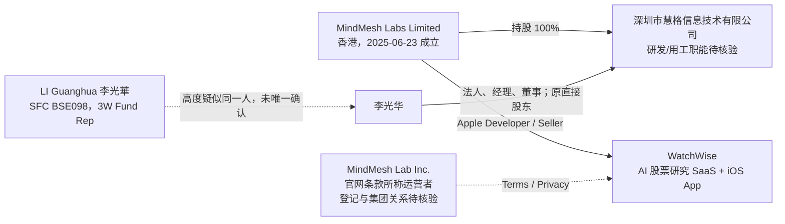

# 深圳市慧格信息技术有限公司深度分析报告

> 调研对象：深圳市慧格信息技术有限公司 
> 统一社会信用代码：`91440300MAERMXYF69` 
> 重点人物：李光华（法定代表人；招聘平台角色为 CTO） 
> 调研截止：2026-07-16（Asia/Shanghai） 
> 报告用途：公司背景调查、面试与 Offer 决策，不构成法律、证券或征信意见

---

## 1. 执行摘要

### 1.1 一句话结论

**深圳慧格是一家成立不足一年的小型跨境 AI 金融科技团队，当前可验证的核心产品是面向北美股票研究的 WatchWise；产品和技术方向真实，但付费规模、收入质量、最终控制人、三地主体关系及核心团队履历仍缺乏公开闭环。**

从求职角度看，它属于**可以继续面试、但必须在签约前做高强度核验的早期团队**。风险评级为“中高”，主要来自成立时间短、商业牵引未验证和主体透明度不足，而不是因为本次调查发现了明确违法或重大负面记录。

### 1.2 最重要的八项发现

| 发现 | 判断 | 证据强度 |
|---|---|---|
| 深圳慧格真实存续，李光华任法定代表人、经理、董事 | 已确认 | 较高：多家工商数据源一致 [S18][S19][S20] |
| 当前唯一股东是香港 `MindMesh Labs Limited`，持股 100% | 已确认直接股东层级 | 较高：工商聚合数据；香港主体由官方注册名单确认 [S1][S18][S19] |
| 关联产品是 WatchWise AI 股票研究平台 | 已形成强闭环 | 很高：官网 Careers 使用 MindMesh Labs 名义，Apple 卖方与香港股东同名 [S2][S3][S7][S10] |
| WatchWise 已有网页端和 iOS App，并持续更新 | 已确认 | 很高：Apple 官方元数据；官网可用 [S2][S3] |
| WatchWise 是订阅制研究 SaaS，而非已证实的量化基金 | 高置信判断 | 较高：产品、定价和法律条款均指向研究工具 [S7][S9][S11] |
| 产品仍处极早期 | 已确认阶段信号 | 较高：iOS 2026-06-05 首发、美国区评分数为 0；Substack 仅 8 名订阅者 [S2][S15] |
| 李光华可能与香港证监会持牌人 `BSE098` 为同一人 | 高相关候选，未完成唯一身份核验 | 中等：姓名、香港身份、金融业务高度相容，但没有身份证件、简历或邮箱闭环 [S4][S5] |
| 官网法律主体、Apple 卖方和深圳雇主并不一致 | 已确认文件差异 | 很高：条款写 `MindMesh Lab Inc.`，Apple 写香港 `MindMesh Labs Limited`，劳动主体可能是深圳慧格 [S2][S11][S12] |

### 1.3 对候选人的直接建议

**建议继续面试的理由：**

- 产品不是 PPT 项目，官网、iOS App、付费方案和持续版本更新均可核验。
- 技术问题具有实际复杂度，包括金融数据、AI Agent、研究记忆、工作流、云基础设施和高成本推理控制。
- 6 人参保口径与早期小团队相符，个人可能获得较大职责范围和直接决策权。

**未核验前不建议直接接受 Offer 的原因：**

- 未知美国 Inc、香港 Ltd、深圳慧格分别承担什么职能，合同、收入、数据和 IP 可能分属不同主体。
- 没有可核验的 MRR、付费用户、留存、客户名单、现金储备或融资文件。
- “Top Tier 国际对冲基金背景”“超行业 package”“股权激励”等仍只是雇主自述。
- 当前实际办公地址出现三个口径，且 WFH、奖金、股权归属与回购条件均未公开。

---

## 2. 调研方法与证据等级

### 2.1 证据等级

| 等级 | 定义 | 本报告中的典型来源 |
|---|---|---|
| A | 官方登记或官方平台原始数据 | 香港公司注册处、香港证监会、Apple Lookup、域名 RDAP |
| B | 公司或产品第一方页面、招聘平台原始页面 | WatchWise 官网、法律条款、BOSS 直聘 |
| C | 企业信息聚合、搜索快照、第三方目录 | 水滴信用、企查查、猎聘、智联、D&B、COLTD.HK |
| D | 基于多条事实的分析性判断 | 商业模式、组织职能、竞争位置、求职风险 |

### 2.2 重要限制

- 中国和香港部分公司查册字段需登录或付费，MindMesh Labs 的董事、股东和最终受益所有人未完成官方文件级核验。
- “未检出诉讼/处罚/知识产权”只表示本次可访问公开来源没有精确匹配，不等于官方证明为零。
- 招聘页会下线或缓存，岗位数量、办公地址和在招状态只能视为调研时点快照。
- 公司极新，年报、司法、招聘和用户评价均可能存在明显滞后。

---

## 3. 公司主体与股权结构

### 3.1 工商基础信息

| 项目 | 内容 |
|---|---|
| 企业全称 | 深圳市慧格信息技术有限公司 |
| 统一社会信用代码 | `91440300MAERMXYF69` |
| 工商注册号 | `440300280727217` |
| 成立日期 | 2025-08-18 |
| 登记状态 | 存续 |
| 法定代表人 | 李光华 |
| 主要人员 | 李光华：经理、董事 |
| 注册资本 | 300 万元人民币 |
| 实缴资本 | 公开聚合页显示“-”，未核验到实缴金额 |
| 企业类型 | 有限责任公司（港澳台法人独资） |
| 唯一股东 | `MINDMESH LABS LIMITED`，持股 100%，认缴 300 万元 |
| 登记行业 | 应用软件开发 / 软件和信息技术服务业 |
| 2025 年报参保人数 | 6 人；年报于 2026-06-04 公示 |
| 当前注册地址 | 深圳市前海深港合作区南山街道梦海大道 5035 号前海华润金融中心 T5 写字楼 3209G3 |
| 完整公开联系方式 | 未找到；水滴信用仅展示部分掩码电话和邮箱 |

上述信息以水滴信用、企查查、智联、猎聘和 D&B 的公开数据交叉核对。[S18][S19][S20][S21][S22]

### 3.2 关键工商变更

| 时间 | 事件 | 应如何理解 |
|---|---|---|
| 2025-08-18 | 深圳慧格成立，初始注册资本 100 万元；企业类型为港澳台自然人独资，李光华为股东 | 李光华曾直接持有深圳主体 |
| 2026-01-08 | 新增香港法人股东 `MINDMESH LABS LIMITED`；李光华退出股东 | 直接持股关系转移到香港主体 |
| 2026-01-08 | 注册资本由 100 万元增至 300 万元 | 这是认缴资本变更，不能直接等同于到账 200 万元或完成融资 |
| 2026-01-08 | 企业类型变为港澳台法人独资 | 与当前 100% 香港法人持股一致 |
| 变更记录所示 | 地址由南山区招商街道五湾社区海湾路 4 号百安隆 2 栋 103 迁至前海华润金融中心 | 注册地址发生过迁移，仍需核验实际办公场地 |

变更信息来自工商聚合页面，底层注明来源为国家企业信用信息公示系统。[S18][S19]

**不能从这次变更直接推出：**

- MindMesh Labs 获得外部融资；
- 李光华已不再是最终控制人；
- 300 万元注册资本已经全部实缴；
- 香港主体就是基金管理公司。

这些结论均需要香港公司董事/股东文件、深圳公司章程、验资或出资凭证进一步确认。

### 3.3 香港母公司

香港公司注册处 2025-06-23 当周新成立公司官方 CSV 显示：[S1]

| 项目 | 内容 |
|---|---|
| 英文名 | MindMesh Labs Limited |
| 中文名 | 未登记 |
| 商业登记号码 | `78347850` |
| 成立日期 | 2025-06-23 |
| 类型 | 私人股份有限公司 |
| 状态 | 第三方公开目录显示 Live；官方本次仅核验到成立记录 |
| 第三方目录所列注册地址 | Unit 2405, 24/F, World Wide House, 19 Des Voeux Road Central, Central, Hong Kong |

香港成立日期比深圳慧格早约两个月，之后又成为深圳慧格唯一股东，时间线合理。注册地址来自第三方目录，不能证明该处是实际团队办公室。[S28]

### 3.4 当前可验证的跨境结构

**最稳妥的组织判断：**深圳慧格很可能是 MindMesh Labs 在深圳的研发和用工实体，但公开资料尚不能证明 WatchWise 的 IP、合同收入或数据控制权归属于深圳慧格。

---

## 4. WatchWise 产品与商业模式

### 4.1 产品归属闭环

WatchWise 与目标公司的关联不是名称猜测，而是由三条独立线索形成闭环：

1. WatchWise Careers 页面直接使用“Why MindMesh Labs?”，并以该团队名义招聘。[S10]
2. Apple 官方 Lookup 和 App Store 将开发者/卖方列为 `MindMesh Labs Limited`。[S2][S3]
3. 同名香港公司是深圳慧格的 100% 股东。[S18][S19]

因此，可以确认 **MindMesh Labs 集团运营 WatchWise，深圳慧格处于同一公司链条中**。但没有公开文件直接写明“WatchWise 由深圳慧格开发”或“深圳慧格拥有 WatchWise 商标/IP”。

**同名排除：**搜索 `MindMesh` 还会出现 `mindmeshapp.com` 的 “MindMesh: Cognitive Workspace”。Apple 官方数据将该 App 的卖方列为个人 `C J JR DANDREA`，Bundle ID 也为 `com.mindmesh.ios`，与香港 `MindMesh Labs Limited`、深圳慧格及 WatchWise 均没有法律主体闭环，应视为无关产品。[S33][S34]

### 4.2 产品定位与功能

WatchWise 将自己定位为 AI investment research platform，目标是把股票研究流程结构化、可重复并保留长期上下文。[S7][S8]

| 模块 | 公开功能 | 对用户的价值 |
|---|---|---|
| Mira AI Research | 围绕股票、市场和投资假设生成研究结果 | 减少资料搜集和初稿时间 |
| Research Workflow | 将问题转换为可审阅、批准后执行的研究流程 | 提高可控性，区别于一次性聊天 |
| Research Memory | 保存框架、观察列表、风险规则和输出偏好 | 形成跨会话研究上下文 |
| Market Monitoring | 监控财报、指引、新闻、估值信号和观察列表变化 | 发现催化剂和风险变化 |
| Structured Briefs | 输出市场背景、催化剂、风险和决策含义 | 便于复核与记录 |
| Watchlist / Prices | 观察列表、实时价格和关键指标 | 提供日常研究入口 |
| Earnings Calendar | 财报日历，可同步 Apple/Google Calendar | 支持事件驱动研究 |
| Personalized News | 个性化市场新闻与摘要 | 提高信息筛选效率 |

官网明确强调：WatchWise 是研究和工作流工具，不替代用户判断，也不是持牌投资顾问。[S8][S11]

### 4.3 定价与收入模型

官网当前定价如下：[S9]

| 方案 | 价格 | Credits | 主要权益 |
|---|---:|---:|---|
| Starter | $0/月 | 每日 2,000 | Mira、观察列表、报告预览 |
| Monthly Pro | $199/月 | 每月 40,000，另有每日 2,000 | 专业股票分析、计划任务、月付灵活性 |
| Annual Pro | $1,999/年 | 每月 40,000，另有每日 2,000 | 年付约折合 $166.58/月 |

商业模式是 **Freemium + 高客单订阅 + Credits 控制 AI 调用成本**。其目标用户更像活跃个人投资者、独立研究者和小型专业团队，而非大众免费行情用户。

值得注意的是，App Store 描述称新用户每日获得 10,000 免费 credits，而官网当前写 2,000；这可能是渠道差异或 App 文案未更新，面试时应确认实际计费规则。[S2][S9]

### 4.4 产品成熟度

项目时间线显示这是一个从 2025 年开始搭建、2026 年第二季度才正式面向 App 用户的产品：

| 时间 | 可验证事件 |
|---|---|
| 2025-02-10 | `watchwise.ai` 域名注册；当前使用 AWS Route 53 名称服务器 [S6] |
| 2025-06-23 | 香港 MindMesh Labs Limited 成立 [S1] |
| 2025-08-18 | 深圳慧格成立 |
| 2026-01-08 | 香港 MindMesh Labs 成为深圳慧格 100% 股东 |
| 2026-04 至 05 | WatchWise 开始在 Substack 发布公开研究内容 [S15] |
| 2026-06-05 | WatchWise iOS 1.0 首发 [S2][S3] |
| 2026-07-03 | iOS 2.0.2 发布 [S2][S3] |

Apple 官方数据截至调研日显示：[S2][S3]

| 指标 | 状态 |
|---|---|
| App 名称 | WatchWise AI - Stock Analysis |
| Bundle ID | `com.WatchWiseai.WatchWise` |
| iOS 首发 | 2026-06-05 |
| 当前版本 | 2.0.2，2026-07-03 更新 |
| 包体 | 约 42.4 MB |
| 语言 | 英文 |
| 美国区评分数 | 0 |
| 订阅内购 | $199/月、$1,999/年 |
| App 隐私披露 | 购买、联系方式、用户内容、搜索历史、标识符和使用数据等可能与身份关联 |

这说明产品已经交付并快速迭代，但截至调研日只上线约六周。**“产品真实”已经确认，“产品市场匹配”尚未确认。**

公开牵引信号仍很弱：

- 美国区 App Store 没有评分；这不等于零用户，但无法提供社会验证。
- WatchWise Substack 调研时显示 8 名订阅者，并有 2026 年 4 月、5 月的研究内容。[S15]
- 未找到公开客户名单、用户数、MAU、付费转化率、MRR/ARR、续费率、媒体评测或机构案例。
- 官网 FAQ 页底部仍显示 `Beta 1.2.5`，与 iOS 2.0.2 可能是不同端版本，也反映产品仍处快速变化阶段。[S14]

### 4.5 业务定位纠偏

招聘自述包含“AI 金融、上市公司研究、北美市场、非 Web3”，这一部分已由 WatchWise 产品得到强验证。[S7][S23][S27]

但以下说法不能继续沿用旧报告的强结论：

| 招聘自述 | 公开证据能支持什么 | 不能推出什么 |
|---|---|---|
| Top Tier 国际对冲基金背景 | 团队可能有相关从业经历；另有同名 SFC 持牌人线索 | 不能确认具体基金、职位、业绩或团队整体背景 |
| 自有资金，无融资需求 | 至少招聘时不以 VC 融资作为卖点 | 不能解释为使用自有资金进行证券自营交易 |
| 量化研究岗位 | 团队曾探索量化/AI 投研能力 | 不能证明公司本身是量化基金或管理客户资产 |
| 香港/深圳两地办公 | 跨境主体和招聘口径与此相容 | 不能证明员工可自由选择劳动合同或税务主体 |

**更准确的定性是：AI 股票研究 SaaS 公司，而不是已被验证的基金管理机构。**

---

## 5. 技术栈、团队与招聘

### 5.1 官网招聘所列技术栈

WatchWise Careers 页面列出以下目标栈：[S10]

| 领域 | 技术 |
|---|---|
| Web | React |
| 后端/API | Python、FastAPI |
| 数据库 | PostgreSQL |
| 云平台 | AWS |
| AI/ML | Python、TensorFlow、PyTorch、NLP、金融市场知识 |
| DevOps | Docker、Kubernetes、CI/CD、Monitoring |

这些内容可以证明团队正在按该方向招聘，但页面较模板化，不能据此认定每项技术都已在生产环境完整落地。

### 5.2 当前与历史岗位

调研时 BOSS 公司页显示 0-20 人、在线直聘 1 个岗位；页面中的岗位数和“热招 Boss”缓存存在不一致。[S23]

**当前公开岗位：IT 工程师** [S24]

- 深圳，1-3 年经验，硕士；匿名公开页未显示可靠薪资。
- 发布人为“李先生·CTO”，页面显示 01 月 05 日发布。
- 结构化技能包括 Nginx、Docker、PostgreSQL、MySQL、Redis、MongoDB、Python、云计算、架构设计和运维开发。

**历史已下线岗位：**

- 基本面量化策略研究员 [S25]
- 量化策略研究员 [S26]
- 搜索快照还出现过大模型微调、强化学习、策略生成和风险分析等 AI 投研内容，但原职位页现已无法稳定访问。

岗位演变与产品从研究能力建设转向上线后的系统稳定性、数据和运维建设相容，但这只是合理解释，不是公司官方路线图。

### 5.3 团队规模

- BOSS：0-20 人。[S23]
- 2025 年报：参保人数 6 人。[S18][S19]
- 智联和猎聘只提供宽泛规模或工商信息，不能用于精确计算当前人数。[S20][S21]

“参保 6 人”是最有用的硬指标，但它是 2025 年报口径，不代表 2026 年 7 月实时人数，也不包含可能由香港、美国主体雇佣或以顾问方式合作的成员。

### 5.4 办公与用工口径不一致

| 来源 | 地址/工作方式 |
|---|---|
| 工商注册地址 | 前海华润金融中心 T5 写字楼 3209G3 |
| BOSS 结构化招聘地址 | “深圳南山区 i深港国家高新技术企业孵化基地32” |
| BOSS 公司自述 | 工作地前海；深圳/香港可选；50% 时间 WFH 可选 |
| 搜索快照 | 另出现“南山区科技园”口径 |

这不必然表示异常，早期团队可能有注册地址、孵化器和实际工位之分。但候选人应在签约前现场确认：**日常工位、考勤地点、出差香港频率、远程比例由谁批准，以及劳动合同写哪个地址。**

---

## 6. 李光华身份与履历核验

### 6.1 已确认信息

| 信息 | 状态 | 来源 |
|---|---|---|
| 深圳慧格法定代表人 | 已确认 | 工商聚合多源一致 [S18][S19][S20] |
| 深圳慧格经理、董事 | 已确认 | 工商主要人员 [S18][S19] |
| 深圳慧格原直接股东 | 已确认 | 2026-01-08 变更记录 [S18][S19] |
| CTO | 招聘平台角色，可合理关联但非工商职务 | BOSS 发布人显示“李先生·CTO” [S24] |
| D&B Key Principal / Legal Representative | 已确认 D&B 记录 | [S22] |
| 学历、前雇主、技术履历、公开演讲、论文、专利、GitHub | 未找到可唯一归属的公开闭环 | 公开检索 |

因此，报告中应称其为“**法定代表人李光华；招聘平台显示一名李先生以 CTO 身份招聘**”。用户提供的“CTO 李光华”与这些信息相容，但 CTO 头衔不是工商登记职务。

### 6.2 香港证监会同名持牌人

香港证监会官方登记显示：[S4][S5]

- `LI Guanghua 李光華`，中央编号 `BSE098`；
- 2022-02-25 起持牌；
- 挂靠 `3W Fund Management Limited`（中央编号 `BAF393`）；
- 受规管活动为第 9 类资产管理；
- 角色为 **Representative（持牌代表）**，不是 Responsible Officer（负责人员）；
- 3W Fund 自 2012-11-16 起持有第 9 类资产管理牌照。

### 6.3 是否为同一人

| 匹配因素 | 支持程度 |
|---|---|
| 中文名完全一致：李光华/李光華 | 支持 |
| 英文名 Guanghua Li / LI Guanghua 一致 | 支持 |
| 深圳公司最初是港澳台自然人李光华独资 | 较强支持其有港澳台身份连接 |
| 慧格业务是北美股票研究，候选持牌人从事资产管理 | 业务背景高度相容 |
| 香港股东 MindMesh Labs 与 3W Fund 的公开公司关系 | 未找到 |
| 身份证件、出生日期、同一邮箱/电话 | 未找到 |
| MindMesh Labs 董事文件写明李光华 | 未完成官方查册 |
| 公司或本人公开简历承认 3W Fund 经历 | 未找到 |

**结论：高度疑似同一人，但只能给出中等置信度，不能写成已证实履历。**

即便确为同一人，SFC 记录也只证明其自 2022 年起是 3W Fund 的持牌代表，不能证明其是基金负责人、股东、投资组合经理，更不能自动验证“Top Tier 国际对冲基金背景”或历史业绩。

### 6.4 面试中最有效的闭环问题

1. “您是否是香港证监会中央编号 BSE098 的持牌代表？若是，在 3W Fund 的具体职责和时间投入是什么？”
2. “MindMesh Labs Limited 的董事、股东和最终受益所有人分别是谁？”
3. “您目前是否仍受雇于或挂靠 3W Fund？与 WatchWise 是否存在投资、客户、技术或人员关系？”
4. “招聘所称 Top Tier 对冲基金具体是哪家、何种职位、可否由公开履历或推荐人验证？”

正常、成熟的管理者应能清楚区分可披露履历、保密信息和受监管职责，而不是只重复模糊品牌背书。

---

## 7. 法律、牌照与数据合规

### 7.1 产品法律定位

WatchWise Terms 明确声明：[S11]

- 内容仅供信息和研究用途；
- 不提供个性化税务、法律、保险或投资建议；
- AI 输出可能存在错误、偏差和不准确；
- `MindMesh Lab Inc.` 不是持牌证券交易商、经纪商、美国投资顾问或投资银行；
- 条款适用 Delaware 法律。

这与产品“研究工具”的定位一致，也说明公司知道投顾边界。公开检索未发现 WatchWise、MindMesh Labs 或深圳慧格名下的 SFC、SEC 或 FINRA 机构牌照；同名个人的 SFC 牌照不能替代产品运营主体的牌照。

是否需要牌照取决于实际功能和营销行为。如果产品持续提供非个性化研究、不给用户执行交易、不替用户管理资产，监管风险相对可控；如果未来输出针对个人风险和持仓的具体买卖建议、代客交易或收取与业绩挂钩费用，监管边界会明显变化。

### 7.2 三地主体文件不一致

| 位置 | 显示主体 |
|---|---|
| Apple Developer / Seller | `MindMesh Labs Limited`（香港）[S2][S3] |
| WatchWise Terms / Privacy | `MindMesh Lab Inc.`（单数 Lab，美国 Inc.）[S11][S12] |
| 中国招聘及可能劳动合同 | 深圳市慧格信息技术有限公司 [S23] |

本次未找到 `MindMesh Lab Inc.` 的独立州登记、注册号、地址或其与香港公司的股权文件。Terms 的 Contact Information 段也未展示完整实体地址和具体联系信息。

这可能只是集团内合法分工或文档更新滞后，**不是违法证据**；但它会直接影响：

- 用户与谁签订订阅合同；
- Apple 内购收入进入哪个主体；
- 谁是个人数据控制者/处理者；
- 谁拥有代码、模型、商标和研究内容；
- 深圳员工为哪个主体创造 IP；
- 发生劳动、数据或商业纠纷时适用何地法律。

### 7.3 数据与隐私

Privacy Policy 称可能收集：[S12]

- 姓名、邮箱、电话、邮寄地址、IP 和设备标识；
- 年龄、投资经验；
- 证券组合、观察列表、交易模式、目标、风险承受能力、支付和订阅信息；
- AI 提问与回答、搜索查询、使用行为和语言；
- 基于上述数据推断的投资偏好和行为画像。

数据可能共享给 AWS、支付、邮件、CRM、分析、AI 服务和安全服务提供商。Cookie Policy 还列明 Google Analytics 和 Contentsquare。[S13]

对于技术候选人，这意味着需要追问：

1. 数据存放区域和跨境传输路径是什么？
2. 哪个法律主体是 data controller，深圳团队是 controller 还是 processor？
3. 用户问题和组合数据是否用于模型训练，如何脱敏和删除？
4. 第三方大模型供应商能否保留数据？
5. 是否有数据分类、审计日志、密钥管理、最小权限和事故响应制度？
6. 面向美国、欧洲、香港和中国用户时如何分别满足隐私法规？

### 7.4 金融数据授权

产品宣称实时价格、关键指标、新闻和财报数据，但公开页面没有披露完整数据供应商和授权范围。金融数据通常是该类产品的重要成本和合规变量。面试应确认：

- 实时行情是交易所授权、第三方聚合还是延迟数据；
- 财务报表、电话会、新闻和分析师数据的许可范围；
- App、网页、AI 生成内容能否按合同向终端用户再分发；
- 数据源失败、修订和点时数据（point-in-time）如何处理。

---

## 8. 融资、财务与商业质量

### 8.1 已知与未知

| 项目 | 公开状态 |
|---|---|
| 外部融资 | 未找到；BOSS 自述“自有资金，无融资需求” [S23][S27] |
| 注册资本 | 300 万元人民币 |
| 实缴资本 | 未公示/未核验 |
| 收入、利润、现金储备 | 未公开 |
| MRR/ARR | 未公开 |
| 付费用户、转化率、留存、退款率 | 未公开 |
| 客户名单或机构案例 | 未找到 |
| 产品价格 | $199/月或 $1,999/年，另有免费层 [S9] |

“无融资需求”可能意味着创始人自筹、已有其他现金流、暂不融资，或只是招聘宣传。它不能替代银行余额、预算、营收或 runway 数据。

### 8.2 单位经济的关键变量

WatchWise 的收入公式相对简单：

`订阅收入 = 付费用户数 × ARPU`

但毛利受以下项目显著影响：

- 大模型推理、搜索、向量存储和 Agent 多步骤调用成本；
- 实时行情、财务、新闻和研报数据许可费；
- AWS 计算、数据库、监控和日志成本；
- Apple 内购渠道费用；
- 金融内容质量控制、客服和合规成本。

Credits 机制有助于限制重度用户成本，但月费 $199 会提高用户对数据覆盖、准确性、速度和可解释性的期望。产品必须证明节省的研究时间和决策质量明显高于通用 AI 与低价金融工具的组合。

### 8.3 面试中应索取的商业指标

不必要求公司披露绝对收入，可以要求给出区间或趋势：

- 最近 3 个月付费用户和 MRR 的环比变化；
- 免费到付费转化率；
- 月付用户第二个月留存、年付占比和退款率；
- 单次完整研究工作流的平均模型/数据成本；
- 最活跃用户每周使用频率；
- 未来 12 个月预算和无新增融资情况下的 runway；
- 创始团队是否按市场薪资领取报酬。

如果公司完全不愿提供任何区间、趋势或验证方法，应把“商业牵引”继续视为未证实。

---

## 9. 竞争格局

WatchWise 同时面对三类竞争者：

| 类型 | 代表 | 优势 | WatchWise 的挑战 |
|---|---|---|---|
| 通用 AI | ChatGPT、Claude、Perplexity | 模型强、用户基础大、价格低、工具生态广 | 必须证明金融数据、长期记忆和研究工作流显著更好 |
| 投资研究平台 | Koyfin、Seeking Alpha、Fiscal.ai/FinChat | 数据覆盖、品牌、用户和内容积累更成熟 | 新产品需要建立信任和数据授权壁垒 |
| 企业市场情报 | AlphaSense 等 | 企业客户、专有内容、搜索和合规能力强 | WatchWise 暂无企业案例或团队协作证据 |

### 9.1 价格位置

官方定价页面的时点对比：[S9][S16][S17]

| 产品 | 公开价格示例 | 备注 |
|---|---:|---|
| WatchWise Pro | $199/月；$1,999/年 | AI 研究、计划任务、credits |
| Koyfin Plus / Premium | $39/月 / $79/月（年付页面口径） | 数据、图表、筛选、组合分析 |
| Koyfin Advisor Core | $209/月 | 顾问报告、客户组合和托管集成 |
| Seeking Alpha Premium | $299/年续费 | 内容、Quant Ratings、AI 助手 |
| Seeking Alpha PRO | $2,400/年续费 | 专业观点、组合和更高频信号 |

功能并非完全可比，但 WatchWise 的价格明显不是大众工具档，接近专业用户或顾问工具。对一个没有公开客户案例、评分和留存数据的新产品，这是较激进的定价。

### 9.2 可能的差异化

WatchWise 公开展示的差异化包括：

- 可复用的研究工作流，而不是一次性问答；
- 用户可先审阅 Agent 计划再运行；
- 长期保存投资框架、风险规则和输出偏好；
- 观察列表和催化剂持续监控；
- 将市场背景、催化剂、风险和决策含义统一成结构化 Brief。

这些方向合理，但护城河仍未被公开证据证明。真正需要验证的是：

- 是否有专有或合法授权的数据层；
- 金融回答评测集和事实准确率是否领先；
- 用户记忆是否形成高迁移成本；
- 工作流是否能稳定节省专业用户时间；
- 是否有独特分发渠道或受信任的研究品牌。

---

## 10. 司法、行政与知识产权检索

截至 2026-07-16，按公司全称和统一社会信用代码检索信用中国、中国执行信息公开网、裁判文书网、深圳市市场监管局及搜索引擎，本次可访问来源**未检出精确匹配的诉讼、被执行、失信或行政处罚记录**。[S29][S30][S31][S32]

水滴信用页面也显示“自身风险 0”“关联风险 0”，并未展示具体诉讼或经营风险条目。[S18]

这个结果只能作为弱正面信号，原因是：

- 公司成立不足一年；
- 官方平台存在验证码、检索和收录延迟；
- 尚未经历足够长的合同、劳动和业务周期；
- 香港和美国关联主体不在中国主体风险结果内。

知识产权方面，本次未在深圳慧格名下检出公开专利、商标、软件著作权或 ICP 备案。不能据此判断产品没有 IP，因为 WatchWise 的资产可能登记在香港或美国主体名下；外向型 AWS 网站也不一定需要以深圳主体完成 ICP。

---

## 11. 求职风险矩阵

| 风险 | 级别 | 已知事实 | 签约前验证方式 |
|---|---|---|---|
| 三地主体关系不透明 | 高 | Terms、Apple 卖方、深圳雇主名称不同 | 索取集团结构图、各主体注册证书和主体职责说明 |
| 商业牵引未验证 | 高 | App 上线约六周、0 评分、无公开客户/收入 | 询问 MRR、付费用户、留存、runway 的区间和趋势 |
| 最终控制人未知 | 中高 | 香港直接股东明确，但 UBO 未官方核验 | 查看香港 NAR1/董事股东文件、深圳章程 |
| CTO 履历未闭环 | 中高 | 法人身份明确；SFC 同名线索未唯一确认 | 本人确认 BSE098、提供可验证履历或推荐人 |
| 产品监管边界 | 中高 | 条款主动声明非持牌投顾 | 了解功能审查、内容审核和美国法律意见 |
| 金融数据授权 | 中高 | 数据供应商未公开 | 查看供应商类别、实时/延迟标识和再分发授权 |
| 数据跨境与隐私 | 中高 | 收集投资画像和 AI 问答，使用多类服务商 | 询问数据地图、DPA、保留/删除和模型训练政策 |
| 小团队关键人风险 | 中高 | 2025 年参保 6 人 | 了解汇报链、替补机制、on-call 和核心代码所有权 |
| 高定价的 PMF 风险 | 中高 | $199/月，外部社会验证弱 | 查看转化、续费、使用频率和用户访谈结果 |
| 薪酬与股权可执行性 | 中高 | 只有“超行业 package + 股权”自述 | Offer 写清工资、奖金公式、授予主体、比例、归属、回购 |
| 实际办公地不一致 | 中 | 注册地、招聘地、公司自述不同 | 现场访问，写入合同或书面确认考勤地点 |
| 公开司法/处罚信号 | 暂低但观察期短 | 本次未检出精确匹配记录 | 入职前再次查官方平台，并覆盖香港/美国主体 |

---

## 12. 面试与 Offer 前核验清单

### 12.1 第一优先级：决定是否签约

1. **劳动主体**：合同由深圳慧格、香港 MindMesh 还是其他主体签？工资、个税、社保、公积金分别由谁缴？
2. **集团结构**：`MindMesh Lab Inc.`、`MindMesh Labs Limited`、深圳慧格之间的股权、董事和职能关系是什么？
3. **IP 归属**：WatchWise 商标、域名、代码、模型、App Store 账户和数据合同分别属于谁？员工成果如何转让？
4. **现金与收入**：当前付费用户、MRR 区间、月度留存和无融资情况下的 runway 是多少？
5. **核心履历**：李光华是否为 SFC `BSE098`？3W Fund 经历与 WatchWise 有何关系？
6. **实际办公**：日常工位在哪里？50% WFH 是制度、试用期后福利还是逐次审批？
7. **薪酬**：月薪、13 薪/年终奖、试用期折扣、发薪主体和日期必须写入 Offer/合同。
8. **股权**：授予哪个主体的何种权益？完全稀释比例、行权价、vesting、cliff、离职回购、税务和流动性如何？

### 12.2 第二优先级：判断技术质量

1. Mira 使用哪些模型，是否多模型路由，如何控制幻觉和成本？
2. 金融回答的评测集、事实引用、时间一致性和回归测试怎样做？
3. 行情、财报、新闻、电话会数据来自哪里，如何处理授权和源数据修订？
4. Research Memory 如何隔离租户、删除、加密并防止提示注入？
5. Agent 的工具调用是否可审计，失败如何重试，如何避免循环和成本失控？
6. AWS 架构、容灾目标、RPO/RTO、on-call、日志和告警是什么水平？
7. 是否真的在使用 Kubernetes；若用户规模尚小，采用它解决了什么实际问题？
8. 当前最严重的三个生产事故或技术债是什么，团队如何复盘？

### 12.3 对 AI/量化岗位的专项问题

- 如何避免 look-ahead bias、survivorship bias 和财务数据修订导致的回测污染？
- 公司所称“量化策略”用于产品研究、内部模型评测还是实际资金交易？
- AI 输出是否给出来源、置信度和反例，怎样衡量 analyst-grade quality？
- 是否有人工金融研究员进行黄金集标注和高风险输出审核？
- 若用户保存持仓和风险偏好，系统如何避免跨过个性化投顾边界？

### 12.4 建议索取或目视核验的文件

- 深圳慧格最新营业执照、公司章程和社保开户主体；
- MindMesh Labs Limited 的香港公司注册证书、最新周年申报表或董事/股东证明；
- `MindMesh Lab Inc.` 的州注册证书和与香港公司的关系说明；
- 正式 Offer、劳动合同模板、员工手册、奖金规则；
- 股权激励计划、授予协议和 fully diluted cap table 摘要；
- 金融数据供应商类别和授权范围说明；
- 隐私、信息安全、事故响应和知识产权归属制度。

若公司以保密为由不提供副本，至少应允许现场查看关键字段，并通过正式邮件确认结论。

---

## 13. 综合评价

| 维度 | 评价 | 依据 |
|---|---|---|
| 公司主体真实性 | 较强 | 深圳与香港主体均可核验 |
| 产品真实性 | 强 | 官网、iOS、Apple 卖方和付费方案闭环 |
| 产品成熟度 | 早期 | iOS 上线约六周，仍处 Beta/快速迭代 |
| 商业牵引 | 未验证 | 无公开收入、用户、留存和客户案例 |
| 技术挑战 | 中高 | 金融数据、AI Agent、记忆、监控、云成本均有真实难度 |
| 团队透明度 | 偏低 | 只有 6 人参保口径，核心成员履历不公开 |
| 管理层履历可信度 | 部分支持、未闭环 | SFC 同名持牌人提高可信度，但尚未唯一确认 |
| 合规成熟度 | 有意识但文档需完善 | 明确非投顾，但主体、联系方式和数据控制者不清晰 |
| 求职稳定性 | 偏低至中 | 新公司、小团队、PMF 与 runway 未公开 |
| 上升空间 | 高波动 | 成功时职责和成长快，失败时调整、裁撤和融资风险也高 |

### 最终判断

这家公司最有价值的地方，是已经把 AI 金融概念做成了可访问产品，而不是只有招聘叙事。最需要警惕的地方，也不再是“有没有产品”，而是：

1. 产品是否有人愿意持续支付每月 199 美元；
2. 美国、香港、深圳三个主体是否有清晰、可执行的法律和财务关系；
3. CTO 和团队的金融/技术背景能否被独立验证；
4. 数据授权、AI 质量和隐私治理能否支撑专业投资研究产品。

**求职决策建议：可以进入后续面试；只有当劳动主体、现金 runway、实际付费牵引、股权条款和李光华履历五项至少获得书面或文件级说明后，才适合接受 Offer。**

---

## 14. 主要来源

### 官方与高可信来源

| 编号 | 来源 | 用途 |
|---|---|---|
| S1 | [香港公司注册处：2025-06-23 当周新成立公司 CSV][S1] | MindMesh Labs 成立日期、商业登记号 |
| S2 | [Apple iTunes Lookup API][S2] | App 卖方、首发、版本、价格、评分数 |
| S3 | [Apple App Store：WatchWise][S3] | 产品功能、版本历史、隐私披露 |
| S4 | [香港证监会：LI Guanghua / BSE098][S4] | 个人牌照、角色、挂靠机构 |
| S5 | [香港证监会：3W Fund / BAF393][S5] | 机构第 9 类牌照 |
| S6 | [`.ai` 域名 RDAP：watchwise.ai][S6] | 域名注册日期、AWS DNS |
| S33 | [Apple Lookup：无关同名 MindMesh App][S33] | 排除同名产品归属 |
| S34 | [Verisign RDAP：mindmeshapp.com][S34] | 排除同名域名归属线索 |

### 公司与产品第一方来源

| 编号 | 来源 | 用途 |
|---|---|---|
| S7 | [WatchWise 首页][S7] | 产品定位、功能 |
| S8 | [WatchWise About][S8] | 团队定位、非投顾边界 |
| S9 | [WatchWise Pricing][S9] | 商业模式与价格 |
| S10 | [WatchWise Careers][S10] | MindMesh 关联、技术栈、岗位 |
| S11 | [WatchWise Terms][S11] | 运营主体声明、Delaware 法、牌照免责声明 |
| S12 | [WatchWise Privacy][S12] | 数据收集、使用和共享 |
| S13 | [WatchWise Cookie Policy][S13] | Analytics 与 Cookie |
| S14 | [WatchWise FAQ][S14] | Beta 版本、研究定位 |
| S15 | [WatchWise Substack][S15] | 对外内容与订阅者快照 |

### 工商、招聘与第三方来源

| 编号 | 来源 | 用途 |
|---|---|---|
| S18 | [水滴信用：深圳慧格][S18] | 工商、股权变更、参保、风险栏目 |
| S19 | [企查查：深圳慧格][S19] | 工商与变更交叉核对 |
| S20 | [智联招聘：深圳慧格][S20] | 工商与经营范围交叉核对 |
| S21 | [猎聘：深圳慧格][S21] | 工商、公开联系方式状态 |
| S22 | [Dun & Bradstreet][S22] | 英文名、地址、Key Principal |
| S23 | [BOSS 直聘公司页][S23] | 公司自述、规模、当前招聘 |
| S24 | [BOSS：IT 工程师][S24] | 当前岗位与技能 |
| S25 | [BOSS：基本面量化策略研究员][S25] | 历史岗位 |
| S26 | [BOSS：量化策略研究员][S26] | 历史岗位 |
| S27 | [DuckDuckGo 对 BOSS 页的公开索引][S27] | 完整招聘自述快照 |
| S28 | [COLTD.HK：MindMesh Labs][S28] | 香港注册地址和第三方状态 |

### 风险复核入口与竞品来源

| 编号 | 来源 | 用途 |
|---|---|---|
| S16 | [Koyfin Pricing][S16] | 竞品价格比较 |
| S17 | [Seeking Alpha Subscriptions][S17] | 竞品价格比较 |
| S29 | [信用中国][S29] | 行政与信用风险复核入口 |
| S30 | [中国执行信息公开网][S30] | 执行/失信复核入口 |
| S31 | [中国裁判文书网][S31] | 裁判文书复核入口 |
| S32 | [深圳市市场监督管理局][S32] | 深圳行政监管复核入口 |

[S1]: https://www.cr.gov.hk/docs/wrpt/RNC063/RNC063L_20250623.csv
[S2]: https://itunes.apple.com/lookup?id=6761813374&country=us
[S3]: https://apps.apple.com/us/app/watchwise-ai-stock-analysis/id6761813374
[S4]: https://apps.sfc.hk/publicregWeb/indi/BSE098/details?locale=en
[S5]: https://apps.sfc.hk/publicregWeb/corp/BAF393/details?locale=en
[S6]: https://rdap.identitydigital.services/rdap/domain/watchwise.ai
[S7]: https://watchwise.ai/
[S8]: https://watchwise.ai/about
[S9]: https://watchwise.ai/pricing
[S10]: https://watchwise.ai/careers
[S11]: https://watchwise.ai/terms
[S12]: https://watchwise.ai/privacy
[S13]: https://watchwise.ai/cookie-policy
[S14]: https://watchwise.ai/faq
[S15]: https://substack.com/@watchwiseaiofficial
[S16]: https://www.koyfin.com/pricing/
[S17]: https://seekingalpha.com/subscriptions
[S18]: https://shuidi.cn/company-c624b7fd16d76ca9507f728a26f84001.html
[S19]: https://www.qcc.com/firm/8a234889d655477666263f19c6062275.html
[S20]: https://www.zhaopin.com/companydetail/91445PORCJ7YGLNAWD.htm
[S21]: https://m.liepin.com/company/gs127020418/
[S22]: https://www.dnb.com/business-directory/company-profiles.shenzhen_huige_information_technology_co_ltd.8413acaa6e0b37ca0ba54c37f5ae86bf.html
[S23]: https://www.zhipin.com/companys/e5acafd6cf5aa28d0nVy3t-0GVY~.html
[S24]: https://www.zhipin.com/job_detail/f4cc28a60c79273e03N93t68F1NZ.html
[S25]: https://www.zhipin.com/job_detail/2d151f01652fd5860nV53tu9FlNY.html
[S26]: https://www.zhipin.com/job_detail/5b6f2ecdfe08cd0c031909m_FldW.html
[S27]: https://html.duckduckgo.com/html/?q=%22%E6%85%A7%E6%A0%BC%E4%BF%A1%E6%81%AF%22+WFH
[S28]: https://coltd.hk/company-78347850-details.htm
[S29]: https://www.creditchina.gov.cn/
[S30]: https://zxgk.court.gov.cn/
[S31]: https://wenshu.court.gov.cn/
[S32]: https://amr.sz.gov.cn/
[S33]: https://itunes.apple.com/lookup?id=6760329805&country=us
[S34]: https://rdap.verisign.com/com/v1/domain/mindmeshapp.com
