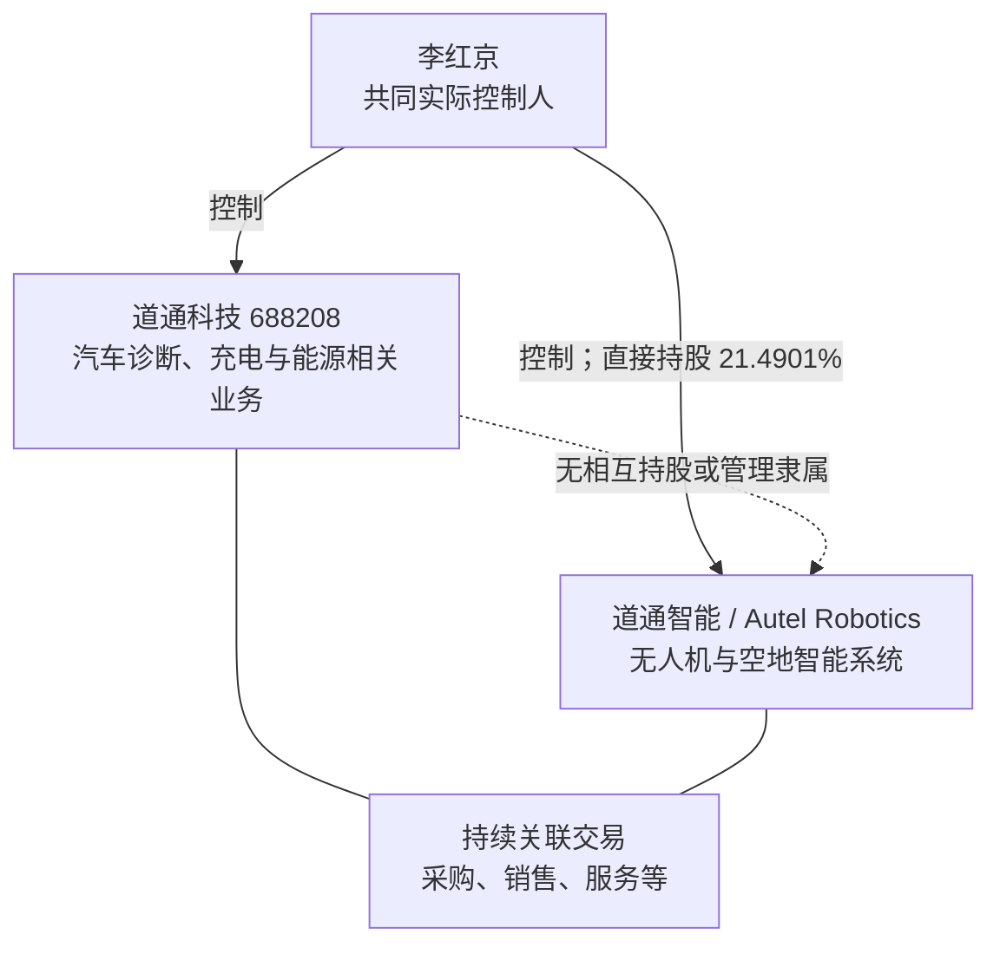
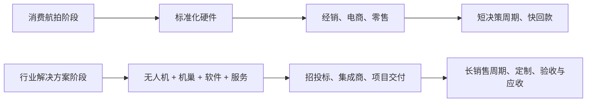
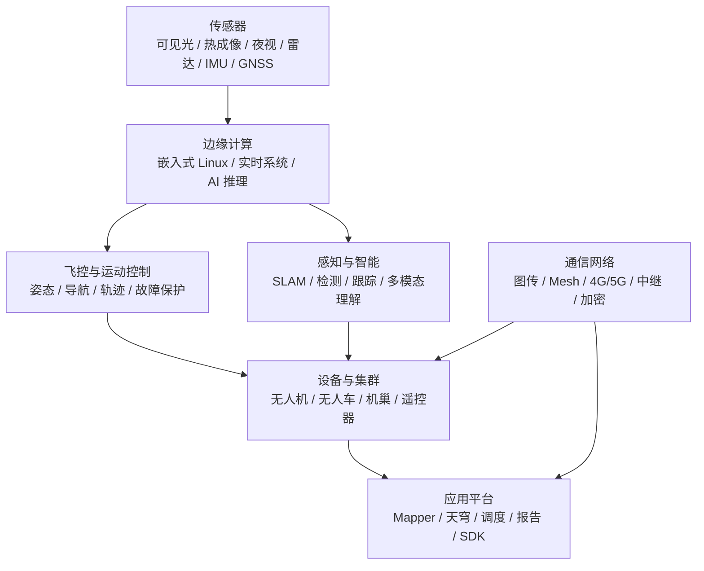

# 深圳市道通智能航空技术股份有限公司深度分析报告

> **报告日期：** 2026-07-27
> **研究对象：** 深圳市道通智能航空技术股份有限公司（Autel Robotics Co., Ltd.，品牌 Autel Robotics / 道通智能）
> **研究目的：** 求职、面试、Offer 决策及合作前尽调
> **来源等级：** A = 政府、监管、交易所及司法原始文件；B = 公司官网、官方招聘及公司自述；C = 主流媒体或专业机构；D = 商业工商、招聘平台及搜索快照；E = 基于公开事实的分析推断
> **表达约定：** “可确认”表示有直接公开证据；“公司自述”不等于审计事实；“分析”表示本报告推断；“未核验”表示证据不足，不作肯定结论。
> **重要限制：** 道通智能仍是非上市公司，尚未公开招股书、审计财务、完整客户和供应商结构、订单与回款数据。未检索到不等于不存在。本报告不构成法律、出口管制或投资建议。

---

## 一、执行摘要

### 1.1 一句话判断

> **道通智能不是概念型“低空经济公司”，而是一家已有十余年产品、全球渠道、完整无人机软硬件栈和约数百人团队痕迹的真实硬科技企业。它正在从消费航拍无人机第二梯队，转向“行业无人机 + 机巢 + 指挥平台 + AI 智能体 + 空地集群”。技术岗位的工程含金量可以很高，但公司同时处于三种高压之下：美国 Entity List、美国国防部 1260H 和 FCC 新型号准入限制；产品线扩张与战略聚焦矛盾；以及 IPO 前治理、内控和公开财务透明度不足。综合结论是：值得面试，适合用具体团队和产品做强核验，不适合仅因“拟上市、全球第二、低空经济、AI”标签盲签。**

### 1.2 核心结论

| 维度 | 结论 | 置信度 |
|---|---|---:|
| 主体真实性 | 2014 年成立，统一代码、官方产品、全球售后、专利、招聘及监管记录完整 | 高 |
| 当前法定代表人 | 2026-07 官方辅导备案写明为**胡昆会**；部分商业数据库仍显示成转鹏，存在更新时差 | 高（官方新材料优先） |
| 控制人 | 官方辅导备案写明李红京为控股股东，直接持股 21.4901%；最新完整间接控制比例尚未公开 | 高/中 |
| 与道通科技关系 | 2017 年已从上市公司道通科技剥离，双方无相互持股或管理隶属，但同受李红京控制并持续关联交易 | 高 |
| 当前资本市场状态 | 仍在 IPO **辅导备案阶段**；2026-07 已更换为申万宏源并披露第二期进展，不是交易所已受理 | 高 |
| 产品真实性 | 多旋翼、倾转旋翼、机巢、遥控器、测绘/指挥软件均有公开产品与长期迭代 | 高 |
| 转型方向 | 消费产品明显收缩，重心转为公共安全、能源、交通、应急及空地一体集群 | 高 |
| AI 属性 | AI 用于感知、规划、决策、任务编排、视频理解和报告生成；不是基础模型公司 | 中高 |
| 技术实力 | 多飞行平台、飞控、图传、影像、SLAM、集群、机巢和软件一体化，工程门槛较高 | 中高到高 |
| 专利 | 官网截至 2026-03-31 自述申请 3,152 项、授权 1,831 项、授权发明 861 项 | 中高（公司口径） |
| 经营规模 | 商业年报快照称 2024 年员工 687 人；招聘平台规模标签更大，口径不能相加 | 中 |
| 财务透明度 | 未公开可核验营收、利润、现金、订单、客户集中度或估值；不能套用道通科技财务 | 低 |
| 美国供应链风险 | Entity List 对所有受 EAR 管辖物项实施许可要求且推定拒绝，影响最实质 | 高、严重 |
| 美国市场风险 | 1260H 影响政府采购和机构信任；FCC 新规限制外国制造无人机取得新的设备授权 | 高、严重 |
| 官网安全治理 | 多个官网页面存在博彩 SEO 文本和异常外链，另有产品页占位文案；属于明显发布治理问题 | 高（页面事实） |
| 司法风险 | 可见案件数量不大，近年出现劳动合同纠纷；未找到重大失信或高额执行闭环 | 中 |
| 求职建议 | **继续面试、按团队定价；核心研发值得看，接受 Offer 前必须核验业务、工时、奖金和合规影响** | 中高 |

### 1.3 最强正面信号

1. **产品与技术链条真实。** 公司不是只有一款航拍机，而是覆盖飞控、整机、影像、通信、机巢、测绘、指挥系统和售后服务的完整体系。[S4-S8]
2. **同时掌握多旋翼和倾转旋翼平台。** 这比只做单一消费四旋翼的工程复杂度高，涉及不同气动、控制、导航、能源和任务系统。[S4][S5]
3. **行业化转型已经进入产品层。** EVO III、道通探索者、AGX Station 均把多机协同、无 GNSS 导航、多模态交互和任务报告写入公开产品，而不是只停留在招聘口号。[S6-S8]
4. **专利与国际知识产权作战经验较强。** 大量专利自述需要进一步审计，但其在美国 ITC 与 DJI 持续多年的诉讼记录是真实存在的。[S4][S18-S20]
5. **存在全球经营基础。** 官网自述业务覆盖 80 多个国家和地区，在美国、欧洲、中东、东南亚设运营或研发节点，并有多地售后和渠道痕迹。[S4]
6. **资本市场准备正在实质推进。** 当前辅导由申万宏源、中伦和天健参与，已经明确到战略、治理、会计和内控整改，而不只是媒体传闻。[S1][S2]
7. **技术招聘跨度和深度较高。** 可见岗位覆盖飞控、嵌入式、Linux/C++、感知、SLAM、目标跟踪、通信、导航控制、Android SDK、云台相机、集群、大模型和世界模型。[S25-S27]

### 1.4 核心风险

1. **美国 Entity List 是最直接的供应链风险。** 当前官方条目要求所有受 EAR 管辖物项取得许可证，审查政策为“推定拒绝”。高端芯片、EDA/开发工具、软件、传感器和生产设备都可能受供应商穿透审查影响。[S12][S13]
2. **美国市场形成三层约束。** Entity List 管供应；1260H 管政府与机构信任；FCC 规则管外国制造新型号取得设备授权。三者不是同一法律效果，但会互相放大。[S13-S16]
3. **官方辅导报告直接指出战略和产品组合问题。** 2026-07 第二期报告称未来战略及产品组合需结合趋势和竞争格局继续优化，并要求聚焦主业；这说明多平台扩张已被中介机构视为需要整改或论证的事项。[S2]
4. **治理与内控尚未达到上市公司状态。** 同一报告称治理和内控体系“有待进一步验证补充和完善”，不能把辅导备案误读成治理已成熟。[S2]
5. **财务完全不透明。** 没有公开审计收入、毛利、亏损、现金流、库存、应收账款、客户和地区集中度，无法从外部判断行业化转型是否改善商业质量。
6. **与道通科技仍有持续关联交易。** 双方虽已剥离，但同一实控人控制。2026 年道通科技预计与智能航空、塞防科技的合计日常关联交易额度约 4.23 亿元，不能把该总额全部算给道通智能。[S21]
7. **行业项目制会带来验收和回款压力。** 公共安全、能源和交通项目往往销售周期长、定制多、招投标和数据合规复杂，与消费电商的快周转模式不同。
8. **产品线扩张可能摊薄资源。** 无人机、倾转旋翼、机巢、遥控器、操作系统、AI 工作站和无人车同时推进，对 600-1,000 人量级组织是明显挑战。
9. **官网存在严重的内容完整性问题。** About、数据安全、隐私等页面源码出现博彩 SEO 外链；AGX Station 页还有“内容待补充”等占位文案。不能据此认定产品或云端被攻破，但 CMS、发布审查或第三方维护显然失控。[S4][S8-S10]
10. **匿名员工评价长期分化。** 旧评论同时出现技术团队强、福利较好，以及加班重、试用期和年终奖不确定等说法。样本陈旧且不可验证，必须核验到具体部门。[S25-S28]

### 1.5 求职建议先行版

**建议继续面试。是否接受 Offer，取决于具体产品线、直属负责人、薪酬兑现和岗位受出口管制影响程度。**

优先考虑：

- 飞控、导航、控制、视觉感知、SLAM、目标跟踪、多传感器融合；
- 嵌入式、Linux/C++、Android、实时系统、图传和 Mesh 自组网；
- 机巢、指挥平台、任务编排、设备接入和集群调度；
- 能接触真实飞行数据、整机联调、户外测试与量产闭环的算法或系统岗位；
- 希望积累机器人/无人系统工程经验，能接受业务和组织快速变化的人。

谨慎考虑：

- 只想做基础大模型训练、论文研究或纯互联网推荐算法；
- 极度看重稳定工时、固定职责和成熟晋升流程；
- 岗位名称是 AI/大模型，但实际只做演示、方案包装或投标材料；
- 岗位强依赖美国客户、美国新型号、受限芯片或美国供应商，却没有明确替代路线；
- 高薪主要依赖口头年终奖、IPO 期权或模糊的“上市后兑现”。

---

## 二、主体身份与最新工商口径

### 2.1 基本信息

| 项目 | 最新可核验信息 |
|---|---|
| 公司全称 | 深圳市道通智能航空技术股份有限公司 |
| 英文名 | Autel Robotics Co., Ltd. |
| 品牌 | Autel Robotics / 道通智能 |
| 统一社会信用代码 | `91440300306077254B` |
| 成立日期 | 2014-05-29 |
| 公司类型 | 其他股份有限公司（非上市） |
| 注册资本 | 36,557.5425 万元 |
| 最新官方法定代表人 | **胡昆会** |
| 控股股东 | 李红京，直接持股 21.4901% |
| 最新官方注册地址 | 深圳市前海深港合作区南山街道桂湾五路 128 号基金小镇基金 9 米商业平台 29-24（一照多址企业） |
| 主要经营/研发痕迹 | 深圳南山智园 B1 栋、深圳光明、北京、西安、杭州等 |
| 官网 | <https://www.autelrobotics.cn/> |
| 招聘入口 | <https://iwpirwbutbu.jobs.feishu.cn/index> |

注册资本、法定代表人、控股股东及最新地址来自 2026-07-09 的官方辅导备案报告，应优先于尚未更新的商业工商页面。[S1]

### 2.2 为什么网上仍大量显示“成转鹏”

爱企查、企查查及搜索快照在报告日仍有页面显示法定代表人为成转鹏，注册地址为南山智园。官方最新辅导材料已经写成胡昆会和前海地址，因此更合理的解释是：

- 公司在 2026 年 6-7 月前后完成或正在完成法定代表人与注册地址变更；
- 商业数据库、搜索索引和公司隐私政策页面尚未同步；
- 前海地址标注“一照多址”，不代表南山智园研发办公已经搬空。

这类更新时差不自动构成风险，但求职者必须核对劳动合同、发薪主体、社保主体和实际办公地点。

### 2.3 注册资本翻倍不能直接理解为融资到账

公开商业快照显示，公司注册资本大致经历：

| 时点 | 注册资本 |
|---|---:|
| 2021 年前后 | 约 12,222.2222 万元 |
| 2022 年前后 | 约 15,908.3536 万元 |
| 2025 年末前 | 约 17,408.3536 万元 |
| 2025-12 后 | 36,557.5425 万元 |

最后一次增幅约 110%。但注册资本增加可能来自增资、股份制安排、资本公积转增或股本重整，不能直接写成“获得约 1.9 亿元现金融资”。当前没有公开验资、投资协议、估值或资金到账文件形成闭环。[S1][S23][S24]

### 2.4 组织与地域节点

公开信息至少能看到：

- 深圳南山总部/研发办公痕迹；
- 深圳光明分公司及生产研发地址；
- 西安分公司，商业快照显示参保人数约 25-34 人，口径随年份变化；
- 北京业务或研发主体；
- 2025-02 成立的杭州道通智能航空科技有限公司；
- 官网自述在美国、德国、意大利、荷兰、阿联酋、新加坡和越南设境外分公司或研发基地。[S4][S24]

境外节点属于公司自述，本报告未逐个穿透当地公司注册、实际人数和交易规模。

---

## 三、与道通科技的关系：最容易被误解的部分

### 3.1 不是道通科技当前的无人机子公司

道通智能最初来自深圳市道通科技股份有限公司（`688208`）的无人机业务。2017 年 8 月，道通科技将智能航空 100% 股权转让给通元合创，由原股东按原持股比例承接，完成剥离。[S22]

当前可以支持的关系是：

因此，以下说法均不准确：

- “道通智能是道通科技的全资子公司”；
- “买道通科技股票等于持有道通智能”；
- “道通科技营收和净利润就是道通智能业绩”；
- “道通科技上市公司治理完全覆盖道通智能”。

### 3.2 为什么双方仍然高度相关

尽管法律和管理上独立，双方仍有：

- 同一实际控制人；
- 历史上的资产、人员、品牌与供应链联系；
- 采购、销售和服务等日常关联交易；
- 相近的 Autel 英文品牌体系；
- 资本市场和美国监管事件中的舆论联动。

2026 年 3 月，道通科技预计与智能航空、塞防科技发生的日常关联交易总额不超过约 3.98 亿元；6 月再增加 2,500 万元，合计约 4.23 亿元。[S21]

> **边界提示：** 4.23 亿元是道通科技与“智能航空 + 塞防科技”的合计预计额度，不是道通智能收入，也不能全部归给道通智能。预计额度也不等于实际发生额。

### 3.3 求职层面的含义

正面：

- 能共享创始人资源、供应链经验、国际渠道和品牌积累；
- 同一控制人已有上市公司治理经验；
- 关联采购与服务可能降低部分建设成本。

风险：

- 上市审核会重点问询独立性、关联交易公允性和同业/资源边界；
- 招聘品牌、合同主体、业务汇报线可能被候选人混淆；
- 同一实控人多业务扩张时，资金、人员和管理注意力存在分配风险。

---

## 四、关键时间线

| 时间 | 事件 | 意义 |
|---|---|---|
| 2014-05 | 道通智能成立 | 无人机主体形成 |
| 2017-08 | 从道通科技剥离 | 当前不再是上市公司子公司 |
| 2018-08/10 | Autel Robotics USA 对 DJI 发起美国 ITC 337 调查 | 展示国际专利诉讼能力，也带来高额法律成本 |
| 2020-08 | ITC 对一项专利认定侵权并发布但暂缓执行救济；PTAB 同期认定相关权利要求不可专利 | 结果复杂，不能简化为一方全面获胜 |
| 2021-03 | 与中信证券启动首轮上市辅导 | 首次明确冲刺资本市场 |
| 2021-09 | Autel 与 DJI 共同和解，ITC 永久撤销救济命令 | 该轮美国 337 争议结束 |
| 2021-2022 | 中信证券累计开展多期辅导，后终止 | 第一轮 IPO 路径未落地 |
| 2024-06-18 | 被列入美国 BIS Entity List | 供应链许可与推定拒绝生效 |
| 2025-01-07 | 被列入美国国防部 1260H 清单 | 美国政府采购、合作与声誉压力上升 |
| 2025-02 | 杭州道通智能航空科技有限公司成立 | 新增研发/业务节点 |
| 2025-12-22 | FCC 将外国制造 UAS 及关键组件纳入 Covered List | 美国新型号设备授权受限 |
| 2025-12-24 | 与国泰海通启动新一轮 IPO 辅导 | 资本路径重启 |
| 2026-06-10 | 美国国防部发布更新 1260H 名单并保留 Autel Robotics | 监管状态延续且给出更明确理由 |
| 2026-06-27 | 与国泰海通终止辅导协议 | 辅导机构再变更 |
| 2026-07-01 | 与申万宏源签署新辅导协议 | 辅导期可连续计算 |
| 2026-07-09 | 申万宏源重新备案 | 法定代表人、地址、资本等最新官方口径披露 |
| 2026-07-21 | 披露第二期辅导进展 | 明确战略、产品组合、治理和内控仍需完善 |

---

## 五、业务本质与战略转型

### 5.1 过去：高端消费航拍无人机挑战者

Autel 早期主要依靠 EVO 系列进入全球消费航拍市场，典型竞争维度包括：

- 相机与影像质量；
- 飞行时间、便携性和避障；
- 图传距离和稳定性；
- 不同地区的经销、售后与固件支持；
- 与 DJI 产品在中高端价格带的竞争。

这一阶段为公司积累了整机、飞控、云台相机、图传、App、量产和海外渠道能力，但消费市场面对 DJI 的规模、生态和品牌优势，持续投入回报压力很大。

### 5.2 现在：行业无人系统解决方案商

官网当前消费产品导航只突出 EVO II Pro V3，行业和生态产品明显更多。这说明产品重心已经转向：[S5]

- 公共安全与应急；
- 海防缉私、要地安保和巡逻防控；
- 输电线路、变电站、油气管线巡检；
- 桥梁、高速、事故处理与道路执法；
- 无人值守机巢；
- 多机协同和空地集群；
- AI 驱动的任务理解、规划和报告。

### 5.3 商业模式的变化

行业化的优势：

- 单项目客单价可能更高；
- 硬件、软件、服务和运维可以形成更深绑定；
- 机巢与指挥平台有机会带来持续服务收入；
- 产品更能发挥全栈能力，而不是只比相机参数。

行业化的代价：

- 客户预算和政策周期影响大；
- 售前、招投标、交付、定制和验收成本上升；
- 回款周期通常更长；
- 需要行业数据、合规资质和本地服务伙伴；
- 研发容易被项目需求打散，标准产品与定制功能冲突。

---

## 六、产品与技术矩阵

### 6.1 当前公开产品

| 层级 | 产品 | 主要价值 |
|---|---|---|
| 行业多旋翼 | Autel Alpha、EVO Max 4T/4N V2、EVO Lite 行业系列、EVO II 行业/RTK/Dual V3 | 热成像、夜视、巡检、安防、测绘 |
| 新一代多旋翼 | Autel EVO III 系列 | AI 智能体、多模态交互、11 节点互联、多机协同、无 GNSS 导航 |
| 倾转旋翼 | 道通龙鱼 Standard、Pro、龙鱼-25 | 垂直起降与固定翼长航时结合 |
| 无人值守 | 多旋翼机巢、龙鱼机巢 | 自动起降、充电、远程任务、无人值守 |
| 通信与控制 | 龙鱼中继、智能跟踪天线、智能遥控器 V3/SE、AGX Station | 图传、中继、多机监控、AI 任务交互 |
| 软件 | Autel Mapper、道通指挥中心/道通天穹 | 测绘、任务规划、态势感知、远程控制 |
| 地面机器人 | 道通探索者 | 陆空两栖、无 GNSS、AI 任务、32 节点异构协同 |
| 2026 路线 | Autel Apex、道通开拓者-150、AthenaOS、多旋翼机巢 2 | 仍需核验量产、交付和收入状态 |

[S4-S8]

### 6.2 EVO III：AI 不只是营销词，但成熟度仍待验证

EVO III 官网描述包括：[S6]

- 基于 AI 智能体架构完成感知、识别、规划、决策、执行和交互；
- 语音/文本下达任务；
- 自动规划航线和生成作业流程；
- 11 节点自由组网、多机任务协同和信息共享；
- 视觉 SLAM、多源融合导航、毫米波雷达和视觉避障；
- 无 GNSS、弱光和复杂环境下自主飞行；
- 任务接力热替换和多机协同避障。

这些功能对应真实的工程问题，并非普通 SaaS 的提示词包装。但官网参数不等于已经在客户现场大规模稳定运行，面试时应追问：

- 已经量产还是工程样机；
- 11 节点在何种距离、带宽和干扰条件下测试；
- 无 GNSS 定位漂移、故障恢复和安全冗余指标；
- AI 任务成功率、人工接管率与误识别率；
- 是否已有付费客户和验收报告。

### 6.3 道通探索者：战略从“飞行器”扩到“具身智能”

道通探索者公开页显示，它是一款可地面行驶、短时飞行和隐蔽侦察的陆空两栖平台，支持：[S7]

- 语音/文本任务指令；
- AI 路径规划、目标识别、视频理解和任务报告；
- 无 GNSS、低光/无光和狭小空间作业；
- 约 2 小时地面续航和超过 24 小时待机；
- Mesh 自组网与 32 节点异构多机协同。

这说明公司在把无人机的感知、通信和控制栈迁移到地面机器人。它可能扩大市场，也增加了机械结构、轮式运动、室内导航、可靠性和产品认证的新负担。

### 6.4 AGX Station：控制终端正在变成边缘 AI 工作站

AGX Station 公开能力包括：[S8]

- 多模态指令、任务规划和自动报告；
- 多机协同与外部 AI 应用扩展；
- 四路画面、40 公里图传、4G/5G 增强；
- 存储、传输和身份认证加密；
- 面向警务、能源和巡检。

但该页面同时存在“内容待补充”的占位描述，并出现“五重加密/四重加密”口径不一致。合理结论是：方向和产品真实，但网站上线与内容审校明显赶工，成熟交付状态需要单独核验。

### 6.5 技术栈拆解

真正有壁垒的不是某一个模型，而是：

1. 多传感器在飞行振动、弱光、雨雾和干扰环境下可靠工作；
2. 控制、感知与通信形成实时闭环；
3. 算法能在受限算力和功耗下运行；
4. 失败时能够安全降级、返航或人工接管；
5. 产品经过量产、现场和法规验证；
6. 设备、机巢、云平台和客户系统能够长期运维。

---

## 七、技术实力与专利质量

### 7.1 官网专利口径

截至 2026-03-31，公司官网自述：[S4]

| 指标 | 数量 |
|---|---:|
| 全球专利申请 | 3,152 项 |
| 全球授权专利 | 1,831 项 |
| 授权发明专利 | 861 项 |

2025 年末的辅导媒体摘要曾引用申请 2,959 项、授权 1,752 项、授权发明 656 项。两组数据统计时点不同，不能相加；后者也可能采用不同专利家族或地区口径。[S23]

### 7.2 数量不是全部

判断专利质量需要进一步看：

- 同一发明是否在多个国家重复计为多件；
- 当前有效、缴费和剩余保护期限；
- 是否覆盖核心飞控、图传、避障、结构与算法；
- 是否容易绕开；
- 是否已经许可、诉讼或形成产品收入；
- 专利权归境内主体、美国子公司还是关联公司。

因此，本报告将专利储备评为“强信号”，但不把 1,831 项授权直接等同于 1,831 个独立技术护城河。

### 7.3 与 DJI 的美国专利战：准确版本

2018 年，Autel Robotics USA 向美国 ITC 提起 337 调查，主张 DJI 侵犯三项专利。[S18]

过程并不是“Autel 三项专利全部胜诉”或“全部败诉”：

1. 2020 年 ITC 对其中 `'184` 专利认定部分 DJI 产品构成侵权，对另外两项未认定违规；
2. ITC 发布有限排除令和停止令，但因美国专利审判和上诉委员会（PTAB）已认定相关权利要求不可专利，决定暂停执行；
3. 2021 年双方撤回上诉、提交和解协议，ITC 永久撤销救济命令。[S19][S20]

这段经历说明：

- 公司有能力在美国组织专利、律师、专家和产业证据；
- 对 DJI 的技术竞争并非纯营销；
- 国际诉讼结果高度复杂且成本昂贵；
- 专利数量并不保证权利要求经得住无效挑战。

---

## 八、市场、客户与竞争格局

### 8.1 客户和场景证据

官网称 EVO Max 和龙鱼系列曾用于：[S4]

- 甘肃积石山地震救援；
- 深圳南山半程马拉松安保；
- 深圳大鹏森林防火巡查；
- 东莞虎门海防打私；
- 河南郑州暴雨抢险救援。

官网还展示 2025 深圳国际无人机展中的多旋翼、倾转旋翼、机巢、天穹、无人车和 Athena OS 方案。[S11]

这些能证明公司持续做行业推广并有任务使用痕迹，但不能替代：

- 客户合同金额；
- 采购与验收文件；
- 复购率和续费率；
- 事故率和可用率；
- 客户集中度与应收账款。

### 8.2 主要竞争者

| 类型 | 竞争者 | 道通面临的压力 |
|---|---|---|
| 全球综合无人机 | DJI | 产品、供应链、渠道、影像、生态和品牌规模领先 |
| 国内行业无人机 | 纵横股份、飞马机器人、复亚智能、云圣智能等 | 测绘、巡检、无人值守和行业关系竞争 |
| 农业与行业 | 极飞科技 | 农业、自动化作业和服务体系 |
| 美国本土 | Skydio、BRINC、Teal 等 | 受益于美国政府采购与本土化政策 |
| 欧洲品牌 | Parrot 等 | 合规、本地政府客户和区域供应链 |
| 低空资本叙事 | 亿航、峰飞等 | 不完全同类，但争夺人才、政策和资本关注 |

### 8.3 道通的差异化

最有价值的差异不是“全球第二”标签，而是：

- 多旋翼与倾转旋翼双平台；
- 消费级量产经验向行业产品迁移；
- 影像、飞控、图传、机巢、软件和服务一体化；
- 在 DJI 之外提供相对完整的替代生态；
- 海外渠道和售后历史；
- 正在推进空地异构集群。

### 8.4 “全球第二”应谨慎使用

多个媒体把道通称为“全球第二民用无人机企业”或“市占率仅次于大疆”，但未见同期、同口径、可复核的权威市场份额数据。消费无人机、行业无人机、出货量、收入和地区市场的排名可能完全不同。

更稳妥的表述是：

> 道通是 DJI 之外少数具有全球品牌、长期消费产品历史和较完整行业产品栈的中国无人机厂商之一。

---

## 九、IPO 与资本路径

### 9.1 当前准确状态

截至 2026-07-27：

- 公司拟在境内申请首次公开发行股票并上市；
- 当前辅导机构为申万宏源承销保荐；
- 律师为北京市中伦律师事务所；
- 会计师为天健会计师事务所；
- 备案日期沿用 2025-12-24；
- 2026-07-21 已披露第二期辅导进展报告；
- **尚未发现交易所受理、问询、上会或注册文件。**[S1][S2]

公司仍在第一个节点，距离上市存在多道不确定环节。

### 9.2 三轮/多次调整脉络

1. **2021 年：** 与中信证券开展辅导，公开记录显示至少持续多期，后终止。[S3]
2. **2025-12：** 与国泰海通重启辅导。[S2][S23]
3. **2026-06/07：** 与国泰海通终止，改聘申万宏源；申万宏源书面认可原辅导工作，因此辅导期可连续计算。[S2]

频繁更换辅导机构不是违法或失败定论，但代表：

- 项目执行和申报节奏存在变化；
- 中介判断、板块选择或商业准备可能调整；
- 求职者不能把“IPO 辅导”折算成短期必然上市的期权价值。

### 9.3 官方报告点出的两项核心问题

2026-07 第二期辅导报告明确写出：[S2]

**战略规划与产品组合：**

- 需要结合最新行业趋势与竞争格局继续优化；
- 战略需符合产业导向和拟申报板块定位；
- 应聚焦主业并具备核心竞争力。

**公司治理与内控：**

- 需要按上市板块要求修改完善；
- 随业务扩大，治理和内控体系仍需验证、补充和完善。

这比媒体的“低空经济龙头重启 IPO”更有分析价值。它说明公司当前最大的上市准备工作，不只是补材料，而是要证明：

- 无人机、无人车、AI 和平台业务仍然是一条聚焦的主线；
- 产品线不会造成资源分散；
- 关联交易和实控人体系下的独立性足够；
- 财务、资产、人员和业务能够规范运行。

### 9.4 法定代表人和接受辅导人员变化

第二期报告还显示：

- 成转鹏、潘相熙不再列为接受辅导人员；
- 王越璐新列入接受辅导人员；
- 最新备案法定代表人变更为胡昆会。[S1][S2]

公开材料没有解释全部人事背景，不能据此推断冲突或离职。但在 IPO 重启和战略转型同期发生管理人员变化，值得面试时问清组织职责。

---

## 十、财务与融资透明度

### 10.1 当前看不到什么

公开资料没有形成以下数据闭环：

- 2023-2025 年收入、毛利和净利润；
- 消费、行业、软件和服务收入占比；
- 国内与海外收入占比；
- 美国市场收入和受限前后变化；
- 前五大客户、经销商和供应商；
- 库存、应收账款、经营现金流和有息负债；
- 融资金额、投资方、估值与优先权条款；
- 当前现金余额和 runway；
- 机巢、EVO III、无人车等新产品订单和验收。

### 10.2 最常见的错误推断

| 错误推断 | 为什么错 |
|---|---|
| 注册资本 3.66 亿元 = 融资 3.66 亿元 | 注册资本可能来自股本调整，不等于现金 |
| 道通科技年报 = 道通智能业绩 | 两家公司已剥离，无相互持股 |
| 4.23 亿元关联交易 = 道通智能收入 | 是两个关联方合计的预计额度，且包含购销多种类型 |
| 全球 80 国 = 收入高度分散 | 可能只是有渠道或售后，不代表收入占比 |
| 1,831 项授权专利 = 高利润 | 专利与商业化、毛利没有一一对应关系 |
| IPO 辅导 = 财务已达上市要求 | 辅导报告明确仍在整改战略、治理和内控 |

### 10.3 可以做的有限判断

正面：

- 能连续开发复杂硬件、维持海外渠道并承担多年诉讼，说明公司历史上获得过相当资源；
- 687 人的商业年报口径与持续招聘说明存在实际组织；
- IPO 中介团队愿意继续推进，表明至少具备一定规范化基础。

负面：

- 在没有财务数据的情况下，无法判断公司目前盈利还是依赖股东/融资；
- 从消费转行业可能同时增加库存和应收；
- 美国限制可能带来供应链替代、认证和库存减值成本；
- 过多新产品会显著增加研发资本需求。

---

## 十一、美国监管三重风险

### 11.1 BIS Entity List：供应链约束最强

美国商务部 2024-06-18 生效的官方条目列出：[S12][S13]

- `Shenzhen Daotong Intelligent Aviation Technology Co., Ltd.`；
- 别名 `Autel Robotics`、`Daotong Intelligence`；
- 覆盖深圳、香港、北京、西安等多个地址；
- 许可要求：**所有受 EAR 管辖的物项**；
- 审查政策：**推定拒绝（Presumption of denial）**。

#### 关键纠错：当前条目未显示 footnote 3

部分二手资料把道通智能描述为“带脚注 3 的俄罗斯/白俄罗斯军事最终用户”。但本报告检查了官方 CFR 当前条目，企业名称旁没有 footnote 3 上标，条目依据为 §744.11，许可范围和推定拒绝如上。[S13]

因此应采用官方条目，不把“脚注 3”写成已核验事实。

#### 可能影响

- 美国原产芯片、传感器、射频器件、软件和设备采购；
- 含美国技术或达到最低含量规则的第三国物项；
- 海外供应商的 KYC、合同与出口合规审查；
- 云服务、开发工具、测试仪器与固件支持；
- BOM 国产化、替代验证和产品迭代速度；
- IPO 对供应链连续性和制裁风险的披露。

它不是 OFAC 全面资产冻结，也不自动禁止全球所有主体与道通交易，但对硬件企业的供应链实质影响通常远大于普通声誉名单。

### 11.2 美国国防部 1260H：政府与机构信任风险

2025-01，美国国防部将 Autel Robotics 列入 1260H“中国军事企业”名单。[S14]

2026-06 的更新官方通知继续列出 Autel Robotics，并给出美国政府的认定理由：认为公司因“专精特新小巨人”等政府产业支持而属于相关法律定义下的“军民融合贡献者”。[S15]

必须区分：

- 这是美国国防部依据美国法律作出的行政认定；
- 它不等于本报告独立证明公司从事军品业务；
- 清单本身不等于 OFAC 资产冻结；
- 它会明显影响美国政府采购、承包商合作、机构尽调和品牌信任。

2025 年道通科技曾回应，被列入的是独立的道通智能，而非道通科技。到 2026 年的更新名单中，Autel Intelligent Technology（道通科技）也被单独列出，因此旧回应只能解释 2025 年当时状态，不能覆盖 2026 年新变化。[S15][S22]

### 11.3 FCC Covered List：新型号美国准入

FCC 在 2025-12-22 发布 `DA 25-1086`，将外国制造的无人机系统和关键组件作为类别加入 Covered List。[S16][S17]

关键效果是：

- Covered Equipment 不能取得新的 FCC 设备授权；
- 申请人必须声明设备不属于受管制设备；

该规则按“生产地类别”覆盖外国制造 UAS，并非只点名道通或 DJI。

#### 不能夸大为“美国全面禁售所有存量 Autel 无人机”

FCC 公告直接说明的是设备授权影响。它会限制新型号和新增关键组件准入，但公告本身没有自动撤销所有既有型号的授权。[S16]

实际商业影响可能包括：

- 新产品无法按原路径在美国上市；
- 经销商更谨慎控制库存；
- 存量产品售后和长期生态信心下降；
- 美国市场研发优先级降低；
- 公司转向其他地区或行业客户。

### 11.4 三层风险如何叠加

| 机制 | 主要对象 | 核心影响 | 对求职者的直接含义 |
|---|---|---|---|
| BIS Entity List | 受 EAR 管辖供应 | 芯片、软件、设备和供应商审批 | 国产化、替代、验证工作量上升 |
| DoD 1260H | 美国政府与机构关系 | 采购、合作、声誉与尽调 | 海外项目减少或合规成本上升 |
| FCC Covered List | 外国制造 UAS 新设备授权 | 新型号美国准入 | 美国向产品路线被压缩 |

若岗位涉及芯片选型、射频、图传、海外云、供应链、美国销售或合规，应把这部分作为面试核心，而不是只问一般业务发展。

---

## 十二、数据安全、隐私与官网治理

### 12.1 公司公开的数据安全措施

官网安全声明称：[S9]

- 敏感账户信息云端使用 AES-256；
- 图传链路使用 AES-256，数传使用 AES-128；
- App 与服务器之间使用 HTTPS/TLS；
- 飞行日志默认保存在本地，需用户授权才能用于售后；
- 媒体文件不自动上传；
- 支持账号注销、数据清除和恢复出厂；
- 支持免注册、免登录和离线升级。

这些设计方向与公共安全客户要求相符，但官网声明不是渗透测试、等保、SOC 2、ISO 27001 或第三方审计报告。

### 12.2 隐私政策的关键边界

2025-09-04 更新的隐私政策说明：[S10]

- 会收集账户、设备标识、IP、日志、交易和客服信息；
- 飞行日志备份默认关闭；
- 按中国法规需要上报识别码、实名登记号、位置、时间、速度、轨迹和运行状态等飞行动态数据；
- 个人信息可能跨境传输、存储和处理；
- 美国补充条款允许将部分个人信息用于开发和训练 AI 算法与模型；
- 合规联系邮箱为 `compliance@autelrobotics.com`。

“媒体不自动上传”与“某些授权数据可能跨境或用于模型训练”并不必然矛盾，但需要产品、地区和授权粒度层面的清晰说明。

### 12.3 官网博彩 SEO 注入或内容污染

对官网源码和文本检查发现：

- 数据安全页出现 `bitcoin online casino`、`non gamstop casino`、`pay by phone bill casino` 等内容；
- About、数据安全、隐私等页面页脚出现 `qh88.vet`、`qh88.ski`、`qh88.click`、`cleanmissouri.org` 等异常外链；
- AGX Station 产品页保留“内容待补充”占位文字，并有加密口径不一致。[S4][S8-S10]

最合理的风险表述是：

> **官网当前存在明显博彩 SEO 注入或内容管理污染迹象，说明 WordPress/CMS、发布流程、插件或第三方维护的完整性存在严重问题。它不能直接证明飞控、固件、App、客户云或公司内网已被攻破，也不能证明发生数据泄露。**

对一家强调公共安全和数据安全的企业，这个反差值得高度重视，因为它可能影响：

- 搜索信誉和品牌；
- 客户安全尽调；
- 官网访问者被异常链接引流；
- 安全事件发现与响应能力的外部评价；
- IPO 网络安全和信息系统审查。

### 12.4 面试应如何追问，而不显得武断

建议问：

1. 官网安全、产品安全和企业 IT 是否由不同团队负责？
2. 当前是否已发现并清理 SEO 注入，根因是什么？
3. WordPress 插件、第三方运维和发布权限如何管理？
4. 产品固件、App、云平台是否采用独立供应链、代码签名和安全审计？
5. 是否有 SBOM、漏洞响应、渗透测试和客户安全报告？

---

## 十三、司法、行政与劳动风险

### 13.1 公开司法痕迹

商业数据库搜索快照显示历史司法案件约 6 件、无当前被执行和失信记录的口径；近年可见至少两起劳动合同纠纷开庭信息，包括：

- `(2024)粤0305民诉前调18773号`；
- `(2025)粤0305民初33995号`。[S24]

免费公开页面没有完整判决、金额和结果，因此不能据此判断公司败诉、违法或普遍用工问题。

### 13.2 行政风险

截至检索日，未找到可以确认的重大行政处罚、严重违法、失信或高额执行闭环。该结论置信度为中等，原因是：

- 商业数据库免费页面信息不完整；
- 裁判文书和执行索引存在延迟；
- 海外子公司的诉讼和行政记录未逐国全面检索；
- 美国清单属于出口管制和国家安全行政措施，不应混入国内行政处罚统计。

### 13.3 匿名用工口碑

公开匿名评价主要集中在 2019-2022 年，存在互相冲突的说法：[S25-S28]

正面样本称：

- 技术团队有来自知名硬件和通信企业的人才；
- 餐食、打车、体检、期权和年终奖等福利较多；
- 业务增长和人数扩张较快。

负面样本称：

- 研发加班较重；
- 试用期较长或淘汰压力大；
- 年终奖发放时间晚、金额不稳定；
- 领导风格和部门体验差异大。

这些样本陈旧、匿名且可能混淆道通科技与道通智能，不能当成当前公司事实。它们的价值只在于提示核验主题。

---

## 十四、招聘、薪资与组织判断

### 14.1 人员规模

| 来源 | 口径 |
|---|---|
| 企查查商业年报快照 | 2024 年员工人数约 687 |
| 西安分公司商业快照 | 参保约 25-34，随年份变化 |
| 职友集规模标签 | 1,000-4,999 人 |
| 猎聘旧标签 | 500-999 人 |
| 官网 | 只披露研发人员占非生产人员 50.1%，未披露总人数 |

更稳妥的判断是：公司主体和关联运营节点合计大概率处于**数百至千人级**，但公开证据不足以确认当前准确在职人数。平台标签、集团口径、境内外人员和外包都可能造成差异。[S4][S24-S27]

### 14.2 当前招聘方向

公开岗位覆盖：[S25-S27]

- 飞控、导航、控制与仿真；
- 视觉感知、目标检测跟踪、SLAM、多传感器融合；
- 嵌入式、Linux、C/C++、Android SDK；
- 图传、通信、射频感知、无线芯片协议；
- 云台相机、图像质量、ISP 与硬件测试；
- 机巢、设备接入、集群调度和指挥系统；
- 大模型、AI Agent、世界模型、多模态交互；
- 海外售前、行业方案、政府事务和知识产权；
- 测试、飞手、交付和现场支持。

招聘中出现“大模型、世界模型”不代表公司训练通用基础模型。结合产品页，更可能是把外部或自研模型用于：

- 自然语言任务理解；
- 多模态视频和地图理解；
- 航线/任务编排；
- 目标识别、事件分析；
- 自动生成任务报告；
- 机器人仿真与策略学习。

### 14.3 薪资公开口径

职友集 2026 搜索快照称：[S25]

- 岗位以 30-50K 以上区间较多；
- 本科月薪统计约 38.8K；
- 硕士约 45.8K；
- 博士约 43.3K；
- 应届生约 13.8K；
- 深圳约 37.7K，北京约 41.4K。

另一时点页面称深圳本科约 36.8K、硕士约 48.2K、应届约 17.5K，样本来自近一年招聘报价而非实际工资单。

这些统计存在明显的岗位、职级、样本和招聘广告偏差，只适合判断“中高端岗位报价不低”，不能用来推算个人 Offer。

### 14.4 薪酬必须拆开核验

至少确认：

- 固定月薪和试用期比例；
- 一年按 12、13、14 还是更多月发放；
- 年终奖目标、保底、发放时间和离职资格；
- 绩效系数和末位规则；
- 加班调休、餐食、打车和出差补贴；
- 期权授予主体、股数、行权价、归属期、离职回购和上市失败处理；
- 社保公积金基数；
- 劳动合同、发薪、个税和社保是否同一主体。

---

## 十五、岗位含金量分层

### 15.1 高含金量岗位

| 岗位 | 为什么值得 | 主要风险 |
|---|---|---|
| 飞控/导航/控制 | 实时闭环、复杂动力学、多平台迁移 | 测试压力、安全责任大 |
| SLAM/感知/融合 | 无 GNSS、弱光、多传感器是真实难题 | 数据质量和算力限制明显 |
| 图传/Mesh/通信 | 多节点、低延迟、抗干扰与边缘网络 | 受射频器件和出口管制影响 |
| 嵌入式/Linux/C++ | 连接传感器、飞控、AI 与产品量产 | 调试周期长、现场问题多 |
| 集群调度/机巢平台 | 跨设备、云边端、任务可靠性复杂 | 容易被项目定制打散 |
| 影像/云台/ISP | 有长期产品和量产反馈 | 消费线收缩可能影响资源 |

### 15.2 中高含金量但要看落地的岗位

| 岗位 | 需要确认 |
|---|---|
| 大模型/AI Agent | 是否负责模型、评测、工具调用和真实任务闭环，还是只做 Demo |
| 世界模型/强化学习 | 是否有仿真、飞行数据和上机验证，还是预研 PPT |
| 云平台/后端 | 是否承担大规模设备接入、实时视频、调度与多租户，而非简单管理后台 |
| Android/地面站 | 是否负责实时图传、地图、任务和设备协议，而非普通 App 页面 |
| SDK/开发者生态 | 外部开发者数量、API 稳定性、版本策略和商业价值 |

### 15.3 工作强度可能较高的岗位

- 飞行测试、系统测试和可靠性；
- 客户现场交付、售前与行业方案；
- 海外售后和时区支持；
- 供应链替代、认证和出口合规；
- 临近量产或客户验收的跨模块系统岗位。

这些岗位不一定“差”，但需要把出差、户外、夜间测试、事故响应和加班规则写进个人决策模型。

---

## 十六、竞争力与商业质量分析

### 16.1 护城河强度

| 能力 | 强度判断 | 原因 |
|---|---:|---|
| 整机与飞控 | 强 | 十年以上产品、多平台、量产和现场积累 |
| 影像与云台 | 中高 | 长期消费产品积累，可迁移行业 |
| 图传与通信 | 中高 | 多节点和中继路线明确，但公开指标仍需实测 |
| 行业软件 | 中 | 产品存在，客户规模和持续收入未公开 |
| 机巢与无人值守 | 中高 | 是当前主流行业需求，竞争也很激烈 |
| AI 与大模型 | 中 | 应用方向清晰，实际评测和客户价值未公开 |
| 空地集群 | 中高潜力 | 异构平台差异化强，但新产品成熟度待验证 |
| 全球渠道 | 中高 | 有历史基础，美国市场受限显著 |
| 品牌 | 中高 | Autel 在无人机用户中有认知，但远弱于 DJI |
| 资本与治理 | 中 | IPO 重启，但辅导报告仍指出明显整改项 |

### 16.2 未来增长的关键变量

1. EVO III 和无人车是否按期量产并形成付费交付；
2. 机巢、天穹和 AGX 是否带来软件/服务复购；
3. 美国以外的欧洲、中东、亚洲市场能否填补美国限制；
4. 国产芯片、传感器和工具替代是否影响性能与成本；
5. 行业客户验收、回款和复购质量；
6. 是否能聚焦少数高价值行业，而不是全场景铺开；
7. IPO 整改能否解决关联交易、战略和内控问题；
8. 官网和产品安全治理能否达到公共安全客户要求。

---

## 十七、SWOT

| 类型 | 内容 |
|---|---|
| **Strengths** | 多旋翼 + 倾转旋翼；完整飞控/影像/图传/机巢/软件栈；全球品牌与渠道；专利和国际诉讼经验；真实行业场景 |
| **Weaknesses** | 财务不透明；规模远小于 DJI；产品线扩张快；治理内控仍整改；官网内容治理失控；与实控人体系关联交易 |
| **Opportunities** | 中国低空经济、公共安全和能源巡检；无人值守机巢；AI 智能体与多机协同；美国以外市场；国产替代形成新技术积累 |
| **Threats** | Entity List、1260H、FCC；美国供应链和市场双重收缩；国内价格战；行业项目回款；人才与资本竞争；安全事件或产品事故 |

---

## 十八、风险矩阵

| 风险 | 概率 | 影响 | 等级 | 观察指标 |
|---|---:|---:|---:|---|
| 美国供应链受限 | 高 | 极高 | **红色** | BOM 替代率、产品延期、供应商许可 |
| 美国新型号无法准入 | 高 | 高 | **红色** | FCC 授权、美国新品和渠道库存 |
| 行业转型不及预期 | 中高 | 高 | **红色** | 项目订单、验收、复购、回款 |
| 产品线资源摊薄 | 中高 | 高 | **红色** | 路线砍减、团队频繁转向、延期 |
| IPO 进度延后 | 中高 | 中高 | **橙色** | 辅导验收、申报受理、券商再变更 |
| 关联交易与独立性问询 | 中 | 高 | **橙色** | 交易占比、公允性、人员资产边界 |
| 官网/CMS 安全治理 | 高（问题已存在） | 中高 | **橙色** | 异常链接清理、根因和安全审计 |
| 财务与现金流不透明 | 高 | 高 | **红色** | 审计数据、应收、库存、融资 |
| 劳动强度和奖金不确定 | 中 | 中高 | **橙色** | 团队工时、试用期淘汰、发奖时间 |
| 无人系统安全事故 | 中 | 极高 | **红色** | 事故率、召回、保险、故障闭环 |

---

## 十九、三种情景推演

### 19.1 乐观情景

- EVO III、机巢和无人车完成稳定量产；
- 公共安全、能源和交通形成可复制方案；
- 美国以外收入增长抵消美国收缩；
- 国产替代不显著牺牲性能；
- 2026-2027 年进入交易所申报并逐步完成审核；
- 软件、运维和平台收入占比上升。

结果：公司从硬件挑战者升级为有平台粘性的行业无人系统公司，核心技术岗位成长性较强。

### 19.2 基准情景

- 行业业务增长，但项目定制和回款压力较高；
- 消费线继续收缩；
- 美国受限，其他地区缓慢补位；
- 多产品并行导致部分路线延期；
- IPO 继续推进但时间较长。

结果：公司保持真实技术平台和中等增长，组织强度较高，岗位体验高度依赖具体负责人。

### 19.3 悲观情景

- 受限器件和工具替代造成产品延期或成本上升；
- 美国渠道显著萎缩；
- 行业客户订单碎片化、验收与回款变慢；
- 无人车、AI、机巢和多平台投入同时消耗现金；
- IPO 因财务、独立性或战略定位继续延后；
- 组织缩编或频繁重组。

结果：高薪岗位仍可能有技术挑战，但奖金、期权、项目连续性和人员稳定性显著承压。

---

## 二十、综合评分

> 评分为求职尽调工具，不是投资评级；10 分代表该维度公开证据非常强或风险很低。

| 维度 | 评分 | 说明 |
|---|---:|---|
| 主体与产品真实性 | 9.0 | 产品、监管、招聘和多年经营痕迹完整 |
| 技术平台 | 8.3 | 全栈与多平台能力强，部分新功能仍待实证 |
| 市场竞争力 | 6.8 | 全球替代价值存在，但 DJI 差距和政策约束大 |
| 成长空间 | 7.3 | 行业、机巢、AI 和集群有空间 |
| 财务透明度 | 2.5 | 无公开审计经营数据 |
| 治理成熟度 | 5.2 | IPO 整改中，官方报告明确指出问题 |
| 监管与地缘安全 | 2.0 | 三重美国约束，供应链影响严重 |
| 核心研发成长性 | 8.0 | 有真实硬件、算法、系统和现场闭环 |
| 工作稳定与可预期性 | 4.8 | 转型、IPO、监管和匿名口碑共同增加波动 |
| Offer 综合吸引力 | 6.5 | 值得谈，必须按团队和条款强核验 |

### 最终求职结论

> **推荐等级：B+，值得继续面试；核心研发岗位可以认真争取，Offer 不能盲签。**

最适合的人：

- 想从互联网软件转向机器人、无人机和具身智能；
- 看重复杂工程、实机验证和跨软硬件协作；
- 能接受较高强度、快速变化和现场问题；
- 愿意承担国产替代、合规和产品化的长期难题。

最不适合的人：

- 只接受成熟大厂流程和稳定工时；
- 期待短期 IPO 套现；
- 目标是基础模型研究但岗位无法提供算力、数据和研究自由；
- 不愿参与测试、交付或跨模块问题；
- 无法承受业务重组或海外市场变化。

---

## 二十一、面试与 Offer 核验清单

### 21.1 业务与产品

1. 我所在团队对应哪一款产品、哪个客户场景和哪个收入单元？
2. 产品是量产、客户试点、送样、预研还是概念阶段？
3. 最近 12 个月有多少付费客户、验收项目和复购？
4. 团队今年最重要的三个交付里程碑是什么？已经延期过吗？
5. EVO III、探索者、AGX、AthenaOS 各自的量产和商业化状态是什么？
6. 哪些功能是标准产品，哪些主要来自客户定制？

### 21.2 技术与岗位边界

7. 我的代码最终运行在飞行器、遥控器、机巢、边缘站还是云端？
8. 是否能接触真实飞行数据、仿真、实机测试和量产问题？
9. 无 GNSS、弱光、干扰和故障场景的核心指标是什么？
10. 多机协同目前稳定支持多少节点，压力测试环境如何？
11. AI 岗位用哪些模型和数据？负责训练、微调、评测、部署还是应用编排？
12. 模型功能的成功率、人工接管率、延迟和功耗怎样考核？
13. 技术债、代码评审、自动化测试、硬件在环和飞行安全流程如何执行？

### 21.3 美国限制与供应链

14. Entity List 后，受影响最大的器件、软件和工具是什么？
15. 当前国产/非美替代率、验证周期和性能差距如何？
16. FCC 新规后，美国新产品路线是否暂停或转向？
17. 我的岗位是否会因供应商许可、云服务或美国客户而调整？
18. 公司如何做出口管制分类、供应商筛查和研发工具合规？

### 21.4 团队与管理

19. 直属团队现有多少人，过去一年新增、离职和内部转岗各多少？
20. 直属负责人在该产品上做了多久？如何处理飞行事故和延期？
21. 周一到周五通常几点离开？周末、夜间飞测和出差频率？
22. 试用期考核项、通过率和历史不通过原因是什么？
23. 岗位是扩编、替补还是项目临时增加？
24. 成转鹏退出接受辅导人员、法定代表人变更后，业务汇报线是否变化？

### 21.5 薪酬与期权

25. 固定工资按多少个月发放？年终奖是否写入 Offer？
26. 最近两年本团队年终奖的中位数、发放月份和离职规则？
27. 绩效分布、强制比例和调薪周期？
28. 期权由哪个主体授予？股数、行权价、归属期和回购条款？
29. 若 IPO 延后、换板块或未上市，期权如何处理？
30. 劳动合同、发薪、社保、公积金和个税分别由哪个主体承担？

### 21.6 数据安全与官网问题

31. 官网博彩 SEO 异常是否已经立项处置，根因和影响范围是什么？
32. 官网、产品云、固件发布和企业内网是否完全隔离？
33. 是否有代码签名、SBOM、渗透测试和第三方安全审计？
34. 飞行数据跨境、模型训练和客户数据隔离如何落地？

### 21.7 红线判断

以下情况出现两项以上，建议显著降低 Offer 评价：

- 不肯说明具体产品和量产状态；
- 用“上市后值很多钱”替代期权条款；
- 年终奖只口头承诺，发放时间和资格不明确；
- 面试官回避 Entity List、FCC 或供应链替代；
- AI 岗无法说明数据、模型、评测和上机闭环；
- 直属团队一年内频繁换负责人或大规模离职；
- 合同、发薪和社保主体不一致且无书面解释；
- 对官网异常完全不知情或否认页面事实；
- 岗位长期承担夜间飞测、周末交付，却没有调休和补偿规则。

---

## 二十二、调查方法与证据边界

本报告进行了以下交叉核验：

- 直接读取中国证监会资本市场电子化信息披露平台的最新辅导备案和进展 PDF；
- 读取公司官网产品、关于我们、数据安全、隐私政策和页面源码；
- 读取美国联邦法规、Federal Register、美国国防部 1260H 公告和 FCC 原始公告；
- 读取美国 ITC 337 调查的 Federal Register 原始记录；
- 检索道通科技交易所公告、关联交易和剥离历史；
- 对商业工商、招聘平台和匿名评价只作辅助使用；
- 对无法获得审计闭环的数据明确标注未知。

最重要的证据优先顺序：

1. 2026-07 官方辅导文件；
2. 美国政府法规与公告；
3. 公司产品和隐私原始页面；
4. 道通科技交易所披露；
5. 商业数据库与招聘统计；
6. 匿名口碑和媒体推断。

---

## 二十三、来源清单

### A. 中国监管与资本市场

- **[S1]** 中国证监会资本市场电子化信息披露平台，《关于深圳市道通智能航空技术股份有限公司首次公开发行股票并上市辅导备案报告》，2026-07-09。
  <http://eid.csrc.gov.cn/mnt/storage/stock/pre_ipo/2026/7/9/PREIPO_F0101_V01_20260709_35474_Q/05E34FEA3921408C8D9D8DF5C81F8832/关于深圳市道通智能航空技术股份有限公司首次公开发行股票并上市辅导备案报告.pdf>
- **[S2]** 中国证监会资本市场电子化信息披露平台，《关于深圳市道通智能航空技术股份有限公司首次公开发行股票并上市辅导工作进展报告（第二期）》，2026-07-21。
  <http://eid.csrc.gov.cn/mnt/storage/stock/pre_ipo/2026/7/21/PREIPO_F0101_V01_20260721_36270_Q/813AA6C48EBF4F9993E799F6D2837775/关于深圳市道通智能航空技术股份有限公司首次公开发行股票并上市辅导工作进展报告（第二期）.pdf>
- **[S3]** 中信证券，2021 年道通智能辅导备案公告及第一、二期辅导进展。
  <https://www.cs.ecitic.com/newsite/tzgg/ipoqyfdgg/202103/t20210319_1150109.html>
  <https://www.cs.ecitic.com/newsite/tzgg/ipoqyfdgg/202106/t20210623_1154785.html>
  <https://www.cs.ecitic.com/newsite/tzgg/ipoqyfdgg/202110/t20211026_1158403.html>

### B. 公司官网、产品与招聘

- **[S4]** 道通智能，关于我们：主体、全球布局、专利、发展路线和案例。
  <https://www.autelrobotics.cn/about-us/>
- **[S5]** 道通智能官网首页与产品矩阵。
  <https://www.autelrobotics.cn/>
- **[S6]** Autel EVO III 系列产品页。
  <https://www.autelrobotics.cn/productdetail/evo3/>
- **[S7]** 道通探索者产品页。
  <https://www.autelrobotics.cn/productdetail/ugrmini/>
- **[S8]** Autel AGX Station 产品页。
  <https://www.autelrobotics.cn/productdetail/autel-agx-station/>
- **[S9]** 道通智能航空用户数据安全保护声明。
  <https://www.autelrobotics.cn/data-security/>
- **[S10]** 道通智能隐私政策，更新于 2025-09-04。
  <https://www.autelrobotics.cn/privacy/>
- **[S11]** 道通智能，2025 深圳国际无人机展空地一体方案。
  <https://www.autelrobotics.cn/news/20250526/>
- **[S25]** 职友集，道通智能公司、招聘和薪资统计页；平台统计口径，仅作参考。
  <https://www.jobui.com/company/17087134/jobs/>
  <https://www.jobui.com/company/17087134/salary/shenzhen/>
- **[S26]** BOSS 直聘，道通智能招聘与员工体验页；平台/匿名口径。
  <https://www.zhipin.com/web/geek/job?query=道通智能航空>
- **[S27]** 猎聘，道通智能招聘搜索；岗位会动态变化。
  <https://www.liepin.com/zhaopin/?key=道通智能航空>
- **[S28]** 牛客、知乎、百度知道等匿名讨论；样本陈旧且不可验证，仅用于形成核验问题。
  <https://www.nowcoder.com/search?query=道通智能航空>

### C. 美国出口管制、国防与 FCC

- **[S12]** Federal Register，`89 FR 51644`，2024-06-18，BIS 对俄/白出口管制与 Entity List 更新。
  <https://www.federalregister.gov/documents/2024/06/18/2024-13148/implementation-of-additional-sanctions-against-russia-and-belarus-under-the-export-administration>
- **[S13]** GovInfo / eCFR，15 CFR Part 744 Entity List 官方条目；道通智能条目为所有 EAR 物项、推定拒绝，未显示 footnote 3。
  <https://www.govinfo.gov/content/pkg/CFR-2025-title15-vol2/xml/CFR-2025-title15-vol2-part744.xml>
- **[S14]** Federal Register，2025-01-07 版 1260H 中国军事企业名单，列出 Autel Robotics。
  <https://www.govinfo.gov/content/pkg/FR-2025-01-07/html/2025-00070.htm>
- **[S15]** Federal Register，2026-06-10 更新 1260H 名单及认定理由。
  <https://www.govinfo.gov/content/pkg/FR-2026-06-10/html/2026-11571.htm>
- **[S16]** FCC `DA 25-1086`，2025-12-22，将外国制造 UAS 和关键组件纳入 Covered List。
  <https://docs.fcc.gov/public/attachments/DA-25-1086A1.pdf>
  <https://docs.fcc.gov/public/attachments/DA-25-1086A1.txt>
- **[S17]** FCC Covered List 官方入口。
  <https://www.fcc.gov/supplychain/coveredlist>

### D. 美国 ITC 专利诉讼

- **[S18]** 美国 ITC，2018 年启动 Autel 对 DJI 无人机 337 调查。
  <https://www.govinfo.gov/content/pkg/FR-2018-10-02/html/2018-21362.htm>
- **[S19]** 美国 ITC，2020 年最终决定：一项专利认定侵权，救济因 PTAB 决定暂停执行。
  <https://www.govinfo.gov/content/pkg/FR-2020-08-26/html/2020-18695.htm>
- **[S20]** 美国 ITC，2021 年根据双方和解永久撤销相关救济命令。
  <https://www.govinfo.gov/content/pkg/FR-2021-09-16/html/2021-19977.htm>

### E. 道通科技关系、工商与辅助来源

- **[S21]** 上海证券交易所，道通科技 2026 年度日常关联交易预计及增加额度公告。
  <https://static.sse.com.cn/disclosure/listedinfo/announcement/c/new/2026-03-21/688208_20260321_NX2T.pdf>
  <https://static.sse.com.cn/disclosure/listedinfo/announcement/c/new/2026-06-10/688208_20260610_VKRP.pdf>
- **[S22]** 上海证券交易所《道通科技首次公开发行股票并在科创板上市招股说明书》；金融界转引科创板日报对 2025 年清单及主体独立性的采访。
  <https://static.sse.com.cn/disclosure/listedinfo/bulletin/star/c/688208_20200210_1.pdf>
  <https://24h.jrj.com.cn/2025/01/07112347193434.shtml>
- **[S23]** 21 世纪经济报道及瑞财经对 2025 年 IPO 辅导备案、历史辅导和工商变更的报道；用于补充历史口径，最终以 [S1][S2] 为准。
  <https://www.21jingji.com/article/20251226/herald/f41adec28a2228ab3dc92f6b9114a530.html>
  <https://caifuhao.eastmoney.com/news/20251226091459044527640>
- **[S24]** 爱企查、企查查商业工商与司法搜索页；可能存在更新延迟。
  <https://aiqicha.baidu.com/s?q=深圳市道通智能航空技术股份有限公司>
  <https://www.qcc.com/web/search?key=深圳市道通智能航空技术股份有限公司>

---

## 二十四、最终摘要

道通智能的核心价值来自真实、复杂且跨软硬件的无人系统工程，而不是“低空经济”四个字。它拥有十余年产品史、全球品牌、多飞行平台、机巢、软件、专利和行业场景，核心研发岗位有机会积累稀缺经验。

但这不是低风险公司。美国供应与市场约束已经进入实质阶段；官方 IPO 辅导报告明确指出战略、产品组合、治理和内控仍需完善；财务数据无法公开验证；官网安全治理又暴露出与公共安全定位不相称的问题。

因此，最合理的行动是：

> **去面试、看实物、问数据、核验直属团队；拿到 Offer 后把固定现金、工时、产品阶段和出口管制影响放在 IPO 与期权故事之前。**
