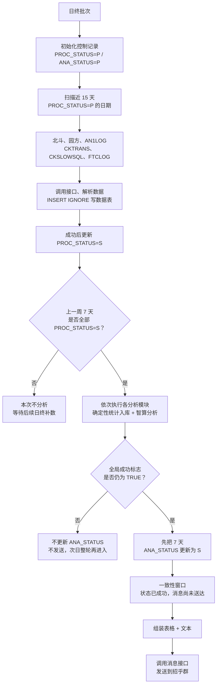

# AI 周报系统专项面试问答

> 项目口径：公司内部 AI 周报系统。事实依据以简历和 `项目/详设.md` 为主。本文全部给出口语化答案，并明确区分当前实现与下一版改进。

## 1. 先把项目讲清楚

### Q1：用一分钟介绍这个项目

> 这个项目主要解决的是运维周报长期依赖人工采集和整理的问题。原来每周要从多个系统拉取错误日志、慢 SQL、大事务、失败交易、TPS 和响应时间等数据，再人工汇总分析，一轮大概要八到十个小时。我从零搭了一条自动化链路：日终任务先采集并校验数据，等上一周七天的数据都完整后，再按模块做确定性统计，把需要解释的异常交给大模型分段分析，最后统一组装和推送周报。上线后整套流程大约二十分钟能完成。这个项目真正难的不是调用模型，而是多源数据口径、任务幂等、失败回补、数字正确性和端到端状态一致性。

### Q2：画一下完整架构

> 我会按真实执行顺序讲。日终先建控制记录，再扫描近十五天没有下载成功的日期，调用多个数据源并写对应数据表；只有上一周七天的 `PROC_STATUS` 都是成功，才会进入周报分析。每个模块先做统计和入库，再调用智算平台；某个模块失败后，后面的模块还会继续，但全局成功标志会变成失败。只有所有模块都成功，程序才先把七天 `ANA_STATUS` 更新成成功，然后组装表格加文本并发到招乎群。
>
> 这里我会主动指出一个当前边界：状态更新发生在消息发送之前。如果消息接口在这两步之间失败，数据库会显示分析成功，但群里可能没收到周报。这不是我画图漏了，而是当前详设里真实存在的一致性窗口，下一版应该拆发送状态并引入 Outbox 或可重试发送记录。

### Q3：LLM 在这里到底做什么，不做什么

> 当前边界比较清楚：TPS、响应时间、日志量等统计和 `PROC_STATUS`、`ANA_STATUS` 判断由程序完成，模型主要做异常解释、趋势归纳和文字组织。也就是说，模型不是数据入库和流程状态的裁决者。不过我不会因此说模型输出里的每个数字都已自动校验，现有详设没有证明这一点；当前是先把确定性结果算好，下一版再补事实引用和输出复核。

### Q4：不用 LLM，模板和脚本不能做吗

> 能做一部分，而且当前确定性统计本来就是程序完成的。模板适合稳定展示数字，但跨模块归纳、异常解释和文字组织会比较僵，所以我把这些表达性工作交给智算平台。这里我不会说当前已经有模板降级：从详设能确认的是，模型调用失败会让当前模块失败，最终整份周报不发送。确定性模板兜底是我认为下一版应该补的能力，不是已经上线的事实。

## 2. 数据与批处理

### Q5：T 和 T-1 到底怎么定义

> 日终运行日是 T，真正处理的业务数据是 T-1。详设里 `PROC_DATE` 有一处写 T-1，赋值处又写成 T，这两个表述是冲突的。我会明确拆成 `business_date=T-1` 和 `batch_date=T`，控制表用业务日期做幂等和数据完整性判断，运行日期只做调度审计。这样月末、年末和补跑时不会把两个概念混在一起。

### Q6：为什么要回溯十五天

> 因为日终如果只处理当天，上游一次失败就会永久留下数据缺口。当前做法是每天扫描近十五天仍然处于 `PROC_STATUS=P` 的日期，逐个补采；单次调用失败后，按照配置的固定间隔休眠，再重试配置的次数。十五天是一个可配置的补数窗口，不代表系统已经有优先级队列、`next_retry_at` 或按数据源限流，这些属于下一版在积压较大时要补的调度能力。

### Q7：怎么判断外部 API 返回的数据是完整的

> 当前系统里的“完整”主要是流程完整：接口调用成功、返回内容能正常解析并写入数据表，然后当天控制记录更新成 `PROC_STATUS=S`；周报层再要求上一周七天的控制记录全部成功。这个判断能防止明显缺天，但它不能证明上游分页总数、每个业务维度和每一条记录都完整。分页总数、cursor、checksum、manifest、staging 校验后原子发布，都是我会在生产增强版补上的数据质量能力，不能说成当前已经有。

### Q8：`INSERT IGNORE` 就等于幂等吗

> 不等于。它只有在唯一约束设计正确时，才能避免重复插入，而且还可能把数据问题静默吞掉。真正的幂等需要稳定业务键，比如 `business_date + module + dimension`，还要定义重复请求到底是忽略、覆盖还是生成新版本。输入被上游修正时，系统要支持 upsert 或版本化，并记录 input hash，不能永远 ignore。

### Q9：两个实例同时执行会不会重复跑

> 从当前详设看，有 `INSERT IGNORE` 和 `P/S` 状态，但没有看到原子抢占、运行中状态、owner 或 lease，所以我不能保证两个实例绝不会同时执行。`INSERT IGNORE` 最多降低重复落表的影响，并不能阻止重复调用上游、重复调用模型或重复发消息。下一版我会用条件更新把 `PENDING` 原子抢成 `RUNNING`，写入 owner 和租约，并在结果表和发送端继续保留业务幂等键。

### Q10：固定 sleep 重试有什么问题

> 当前实现就是配置固定的 `RETRY_DELAY_SECONDS`，失败后 sleep，再重试到 `MAX_RETRIES`。它的优点是简单，但任务一多容易同一时间一起重试，也没有针对 429、5xx、参数错误做差异化处理。指数退避、jitter、尊重 `Retry-After`、总时间预算和熔断，都是我会做的改进；面试时我会先把当前固定重试讲清楚，再讲为什么要升级。

## 3. 分析与模型可靠性

### Q11：五千条慢 SQL 超过上下文怎么处理

> 当前详设能确认的是，程序会先计算请求长度，超过模型限制时做截断或者分批，再调用智算平台。我不会把它说成已经实现了 SQL 指纹聚合、P95/P99、固定 JSON Schema 和证据 ID，因为现有材料没有证明这些能力。更稳妥的下一版是先按 SQL 指纹聚合频次、总耗时和分位数，只把高风险候选分批给模型，并保存候选和原始 SQL 的映射，最后再汇总子结果。

### Q12：模型把 12.3% 写成 123% 怎么办

> 当前系统已经把 TPS、响应时间、日志量等确定性计算先做完并写库，再把整理后的数据交给模型，所以模型不是原始数字的唯一来源。但现有详设没有证明输出里有 `fact_id`，也没有证明会把模型写出的每个数字和数据库做二次校验。因此当前能做的是从统计表复核，下一版我会让事实带稳定 ID，模型只能引用这些事实，渲染前再做数字、单位和范围校验。

### Q13：怎么避免模型幻觉

> 当前最重要的控制是职责分层：确定性统计和状态判断由程序完成，模型主要负责分析和文字表达；模型失败时模块会失败，整份报告不会被标成全部成功。这个设计能降低模型直接改写业务真值的风险，但现有材料没有证明已经做了 Schema 校验、引用核对、数字回查或模板降级。后面我会把这些确定性校验补上，让模型输出可以被程序拒绝，而不是只靠 Prompt 约束。

### Q14：日志里有提示注入怎么办

> 这个问题我会明确分成“当前事实”和“生产加固”。当前详设只说明把日志、SQL 和指标整理后发给内部智算平台，没有足够证据证明已经有完整的提示注入检测、PII 脱敏和输出泄漏校验。生产上这些内容都应该按不可信数据处理：只传最小字段，先脱敏，把数据和系统指令隔离，模型不给写库或执行 SQL 的权限，输出再做敏感信息检查。这里不能为了显得安全，把应该做的措施说成已经做完。

### Q15：Text-to-SQL 怎么避免删库和越权

> 当前周报链路不是 Text-to-SQL：SQL 查询和统计逻辑是程序预先写好的，模型接收的是整理后的数据，不会让模型自由生成 SQL 去查库。如果未来扩展成自然语言查数，我才会设计只读账号和只读副本、AST 白名单、行列权限、超时和扫描量限制、执行前 `EXPLAIN` 以及完整审计。这个回答可以体现安全设计，但必须先说明它不是当前项目已经上线的能力。

## 4. 状态、一致性与故障恢复

### Q16：`PROC_STATUS` 和 `ANA_STATUS` 两个状态够吗

> 对最初版本来说能跑，但不足以表达生产生命周期。它分不清运行中、可重试失败、永久失败和发送结果。更完整的模型会把下载、分析和发送状态拆开，每条记录带 attempt、last_error、next_retry_at、owner 和 lease_until。状态迁移用条件更新约束，例如只能从 `PENDING` 抢到 `RUNNING`，不能任意把成功改回待处理。

### Q17：为什么一个模块失败后还继续执行

> 因为错误日志、慢 SQL、失败交易和 TPS 等模块之间依赖比较弱，所以某个模块重试耗尽后，程序只把全局成功标志改成失败，后面的模块仍然继续跑。这样本轮能尽量留下已经写入的统计和模型结果，但当前只有进程内的模块成功标志，没有持久化的模块状态。第二天会重新进入整段周报分析，依赖 `INSERT IGNORE` 等幂等写降低重复影响，不能说成“只精确重跑失败模块”。要做到精确重跑，需要给每个模块保存状态、输入版本和尝试次数。

### Q18：数据库事务成功，为什么周报仍可能丢

> 因为数据库事务只能保证库内操作，不能把外部消息发送一起变成原子事务。比如先把分析状态写成成功，随后发送接口超时，下次任务看到分析成功就跳过，结果就是报告存在但用户没有收到。下一版我会把分析态和发送态拆开，用 outbox 在同一事务写报告和待发送事件，由发送 worker 独立重试，消息端按唯一 `report_id` 去重。

### Q19：讲一个最难的故障

> 如果内部没有事故记录，我不会编成一个真实线上故障。我会把它讲成设计评审里发现的高风险问题：详设先把七天 `ANA_STATUS` 更新成成功，再组装并调用消息接口；如果发送阶段失败，下次任务看到分析已经成功就可能直接跳过。这个发现说明局部数据库成功不等于端到端送达。我的改进方案是增加独立发送状态和 Outbox，发送 Worker 按 `report_id` 幂等重试；但在没有代码或上线记录证明前，我不会说这个改造已经完成。

### Q20：上游连续故障三天，恢复后怎么办

> 当前恢复机制是每天扫描近十五天的 `PROC_STATUS=P` 日期，并按固定间隔、固定次数重试，所以三天故障恢复后，任务会在后续日终里逐步补回来。它能补数，但还没有材料证明有优先级、QPS 限制或 `next_retry_at`。如果积压量大，我会按当前周报优先、历史日期次之来排队，对每个数据源单独限流并计算清 backlog 的吞吐，否则恢复流量本身可能再次把上游打挂。

## 5. 质量、监控与价值

### Q21：怎么评估周报质量

> 当前材料没有证明已经建立历史 Gold Set 和自动评测平台，所以我会把它作为评估方案来回答。事实层对照数据库统计和人工周报，覆盖层看已知异常有没有识别，可读性用固定 Rubric 做盲评，行动层看研发人员是否确认异常并采取处理。可以选历史八到十二周做回放，但这是我建议的验证方法，不是当前已经跑过的实验。模型接口成功率只能说明调用成功，不能代表周报质量。

### Q22：系统要监控什么

> 当前能确认的是控制表状态、`TECH_TRACE_ID`、维护时间、版本号和各步骤日志，这些可以支持按一次运行排查下载、分析和发送过程；但不能说已经有完整监控大盘和告警阈值。下一步我会补业务、数据、任务、模型和发送五层指标，重点看周报是否按时送达、七天完整率、Pending age、重试、模块耗时、模型失败和发送失败，再用 `trace_id/report_id` 把链路串起来。

### Q23：八到十小时降到二十分钟怎么证明

> 先把口径讲清：原来的八到十小时包含采集、统计、分析和排版，按八小时工作日算，大约就是每周一个人日；系统的二十分钟应该从任务开始算到周报成功送达，补数和人工复核另外记录。粗略按一年五十个工作周计算，是大约五十个毛人日，不是净收益。最终还要扣掉人工复核、系统维护和异常处理，并用多个周次的中位数、P95 和样本数证明，不能只拿最好的一周外推。

### Q24：数据量增长一百倍先优化哪里

> 这是容量设计题，不是当前系统已经支持一百倍数据量。我会先压测确认瓶颈，再分别处理：采集做分页、增量和限流；数据库统计优化分区、索引和扫描；独立模块受控并行；模型前先聚合和筛选高风险候选，再做批量、缓存和模型分级。最后分别看数据库、网络、CPU、模型排队和发送吞吐，不能直接说“加机器就行”，也不能把这些方案包装成已经上线。

### Q25：这个项目最有技术含量的是什么

> 不是调用一次大模型，而是把它放进一条可控制的批处理流程。当前真正有价值的能力是：确定性统计先算好，七天数据不完整就不分析，采集和模块都有有限重试，一个模块失败不会阻止后续模块保留结果，最后只有全局成功才更新分析状态并进入发送。它仍有模块状态不持久、发送一致性和模型结果校验不足等缺口，所以我不会宣称已经支持精确模块重跑或模板降级。

## 6. 个人贡献与边界

### Q26：你说独立负责，具体负责什么

> 这题我不会根据源码替自己补团队事实。面试前我会先按真实 RACI 填清楚：谁提需求，谁做方案和评审，我亲自写了哪些模块，谁负责测试、发布、运维和验收。我的口语答案会是：“这个项目里我确认负责的是【按真实记录填写】，可以拿【设计文档、代码模块、联调记录或发布单】来证明；【其他角色】负责【真实职责】。所以我说的独立负责是【技术主线/某些模块/端到端交付中的真实一种】，不是说所有需求、测试、发布和运维都只有我一个人做。” 在 RACI 没填完之前，我不会直接说从需求到上线稳定性全部由我负责。

### Q27：如果重做，你最先改什么

> 第一是把下载、分析和发送状态彻底拆开，并增加 lease，解决并发抢占和精确重跑；第二是用 outbox 保证报告和发送事件最终一致；第三是让规则统计、异常检测和模型叙述分层，每条关键结论绑定 fact_id；第四是建立历史回放评测以及 prompt、model、schema 版本；第五是把七个模块改成显式 DAG。这里我会明确说这是下一版改进，不把它包装成当前已经上线的能力。

## 7. 真实面试补充追问

### Q28：这是员工工作周报，还是系统运营周报

> 这是面向网联研发人员的运营保障周报，不是从 Git、Jira、CI 里统计员工提交和任务进度。当前数据来自北斗、园方、AN1LOG、CKTRANS、CKSLOWSQL、FTCLOG 等业务指标、交易和日志系统，内容包括错误日志、大事务、慢 SQL、失败交易、TPS 和响应时间等。面试时如果把它说成员工周报，后续的数据源、指标和价值都会对不上。

### Q29：这些数据到底是什么格式，一周有多少量

> 当前能确认的是结构化 API 返回和数据库记录，程序按业务日期解析后写到对应数据表，再做周维度统计。具体是 JSON 还是其他报文、每个接口多少字段、每天和每周多少条、单条多大，现有材料没有完整数字，所以我不会临场编。比较稳妥的说法是先讲结构化处理链路，再明确告诉面试官，精确格式和量级要以内部接口文档、表统计和运行记录为准。

### Q30：你们只是把多源数据放在一起，还是做了真正的根因分析

> 当前系统能做的是按同一个周窗口汇总多个来源的确定性指标，再让模型做异常解释和跨模块关联提示。它可以提出“错误日志上升和某类失败交易同时发生”这样的相关性线索，但没有证据证明已经建立调用链、因果图或自动实验去确认根因。所以我会说它提供排查方向和风险提示，不会把相关性包装成已经完成的根因证明，最终根因仍要结合 Trace、变更和人工验证。

### Q31：实际用了什么模型，为什么选它，后面怎么升级

> 当前材料只能确认调用公司内部智算平台，不能确认具体厂商、模型名、版本和上下文长度。我会先如实说到这里，然后补充选型方法：用真实周报样本比较事实正确性、结构遵循、中文表达、长输入、延迟、成本和数据合规；升级时固定输入集做回归，模型、Prompt 和输出 Schema 分别版本化，先灰度再切换。具体型号必须在面试前从配置或调用记录确认。

### Q32：最后交付的是 Dashboard、邮件，还是一份文件

> 当前详设写得很明确：系统把各模块结果按统一模板组装成“表格加文本”，再通过消息接口发送到内部招乎群。它不是一个独立 Dashboard，也不是让用户下载 PDF。以后可以补历史查询、重发和质量看板，但面试时先把当前交付形态讲准确。

### Q33：为什么日批用数据库控制表，不直接上 MQ

> 这个任务是按业务日期运行的日批，最核心的问题是“哪一天下载成功、哪一周七天齐不齐、是否分析过”，数据库控制表天然适合做日期状态、回溯查询和人工核对，而且团队已经有日终调度，复杂度更低。MQ 更适合高吞吐事件驱动和实时解耦，但消息被消费不等于某天数据完整，还要额外做状态汇总。当前量级下控制表是务实选择；如果以后数据源很多、需要实时处理和大规模并行，可以让 MQ 负责分发，数据库仍负责业务状态真相。

### Q34：分区清理在跨月、跨年和失败时有什么坑

> 当前设计按周一所在月份计算分区键，并在下载、分析都成功后检查上月分区是否可以清理；清理前还会逐表检查分区是否已经为空。这能避免明显的未处理先删数据，但还有几个边界要盯住：只用两位月份时，跨年能不能区分同名分区；跨月的一周到底归哪个月；上月计算在一月是否正确回到十二月；控制表成功和目标分区行数是否真的对应。
>
> 另外，`TRUNCATE PARTITION` 属于 DDL，很多数据库会隐式提交，不能因为代码写了事务和 rollback 就认为一定能回滚。我会在执行前做白名单和空分区检查，记录清理批次与行数，失败后按实际数据库语义恢复，而不是依赖普通 DML 事务假设。

### Q35：`TECH_VERSION` 每次加一，为什么还不算乐观锁

> 因为单纯 `TECH_VERSION=TECH_VERSION+1` 只是记版本变化，没有阻止两个实例同时基于旧状态更新。真正的乐观锁要在更新条件里带旧版本，例如 `WHERE id=? AND TECH_VERSION=?`，同时更新新状态和版本，然后检查影响行数；零行说明别人已经抢先修改，当前实例必须放弃或重读。版本号是否存在和是否真的参与 Compare-and-Swap，是两回事。

## 8. 当前实现与下一版边界

### Q36：面试时怎么快速区分当前实现和未来设计

> 我会先把能从详设直接证明的能力讲完，再用“如果做下一版，我会……”引出改进。这样既能体现架构判断，也不会让面试官顺着不存在的代码追问。

| 主题 | 当前能确认 | 下一版设计，不能说成已上线 |
| --- | --- | --- |
| 补数 | 近 15 天扫描 Pending，固定间隔有限重试 | `next_retry_at`、优先级、按源限流、指数退避与熔断 |
| 完整性 | API 成功、解析写表成功、上一周 7 天 `PROC_STATUS=S` | 分页总数、checksum、manifest、staging 原子发布 |
| 并发 | `INSERT IGNORE` 和 P/S 状态 | lease、owner、原子抢占、fencing token |
| 模型输入 | 计算长度后截断或分批 | SQL 指纹聚合、Token Budget、证据 ID |
| 模型输出 | 确定性统计先入库，模型负责分析文本 | Schema、fact_id、数字回查、引用校验、模板降级 |
| 模块恢复 | 进程内模块标志；失败后次日整轮再进入 | 持久化模块状态和精确失败模块重跑 |
| 发送 | 先更新 `ANA_STATUS=S`，再发招乎群 | 独立发送态、Outbox、幂等重发和送达对账 |
| 评测监控 | 控制状态、Trace 字段和步骤日志 | Gold Set、自动回放、完整 Dashboard 和告警阈值 |

### Q37：上游迟到修正了已经成功日期的数据，系统怎么发现、重算并更正已经发送的周报

**当前实现：**

> 我从详设能确认的是，下载链路扫描近十五天仍处于 `PROC_STATUS=P` 的日期，成功后用 `INSERT IGNORE` 写数据并把状态改成 `S`；上一周七天分析都成功后，又会把七天的 `ANA_STATUS` 改成 `S`。当前没有输入 Manifest、内容 Hash、数据版本、报告 Revision，也没有“上游数据变化后让派生结果失效”的状态。

**风险：**

> 这意味着某个日期一旦成功，后来上游对同一业务日期做迟到补录或纠错，正常扫描未必还会选中它；即使再次执行，`INSERT IGNORE` 也更偏向忽略已有行，不等于更新旧值。我既无法可靠判断哪份周报受了影响，也没有自动重算、撤回或更正通知的闭环，群里已经发送的旧结论可能继续被当成正确版本。

**下一版修复：**

> 下一版我会给“数据源 + 业务日期”保存输入版本、行数、最大更新时间和内容 Hash，先写 Staging 并完成完整性校验，再原子发布新版本。输入版本变化后，系统按依赖关系把对应统计、LLM 分析和周报版本标为失效，用稳定 `report_id` 加递增 `revision` 重算；如果旧版已经发送，再发送明确的更正消息，并把旧版、新版、变化原因和发送结果都留在审计记录里。

**口语化回答：**

> 这个问题当前系统其实还没闭环。现在某天下载成功以后状态就是 `S`，周报成功以后分析状态也是 `S`，但没有记录这批输入到底是哪一个版本。所以上游后来把历史数据改了，系统不一定能发现，`INSERT IGNORE` 也不会自动把旧值更新掉。下一版我会给每天每个数据源做版本和内容 Hash，变化后自动让受影响的统计和周报失效，再生成新的 Revision；旧周报发过的话，还要补一条更正通知并保留前后版本审计。这样我才能回答清楚“怎么发现、重算了什么、谁收到了更正”。

### Q38：上游故障或遗漏超过十五天以后，Pending 数据还能自动补回来吗

**当前实现：**

> 当前正常补数任务只查询过去 `TRACEBACK_DAYS`，详设里的配置值是十五天，并且只处理窗口内 `PROC_STATUS=P` 的日期。我没有看到一条独立的历史补数任务会继续扫描十五天以前的 Pending 记录。

**风险：**

> 所以如果上游故障持续超过十五天，或者某条遗漏直到窗口外才被发现，那条记录即使一直是 `P`，也不会再进入每天的正常补数链路。它可能长期挂住，只能靠临时改参数或人工补跑；积压一大时，盲目放大窗口还可能同时打满上游 API、数据库和日终批次。

**下一版修复：**

> 下一版我会把日常回溯和历史 Backfill 拆开。日常任务继续处理近端缺口；补数任务接受明确的数据源、起止日期和原因，按最老优先分页扫描，保存游标、重试次数和每批完成水位，同时配置优先级、并发、限流和暂停恢复。补完以后再按控制表、源端 Manifest 和目标表行数做对账，不能只看任务返回成功。

**口语化回答：**

> 按当前实现，超过十五天以后不能保证自动补回来，因为日常任务只看最近十五天的 Pending。这个窗口能控制每天的补数成本，但也会让窗口外的历史缺口脱离正常链路。生产化以后我会单独做 Backfill 作业，明确补哪个数据源、哪段日期，按最老数据优先分批跑，带游标、限流、暂停和重试，最后再做源端和落库对账。这样既不会永久漏数，也不会为了补历史把当天批次拖垮。

## 9. 面试前必须确认的数字

下面这些内容不能靠临场编造，面试前需要用内部记录补齐：

- 实际使用的模型、版本和模型服务部署边界。
- 多源 API 的具体数量、单周数据量、峰值和平均处理耗时。
- 八到十小时、二十分钟、年节省五十人天各自的样本数和计算公式。
- 上线后的周报数量、失败率、重试率、人工复核时间和真实用户范围。
- 已经投产的可靠性能力，以及仍然只是改进设计的能力。
