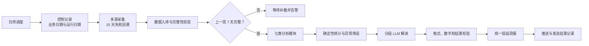

# AI 周报系统专项面试问答

> 项目口径：公司内部 AI 周报系统。事实依据以简历和 `项目/详设.md` 为主。本文全部给出口语化答案，并明确区分当前实现与下一版改进。

## 1. 先把项目讲清楚

### Q1：用一分钟介绍这个项目

> 这个项目主要解决的是运维周报长期依赖人工采集和整理的问题。原来每周要从多个系统拉取错误日志、慢 SQL、大事务、失败交易、TPS 和响应时间等数据，再人工汇总分析，一轮大概要八到十个小时。我从零搭了一条自动化链路：日终任务先采集并校验数据，等上一周七天的数据都完整后，再按模块做确定性统计，把需要解释的异常交给大模型分段分析，最后统一组装和推送周报。上线后整套流程大约二十分钟能完成。这个项目真正难的不是调用模型，而是多源数据口径、任务幂等、失败回补、数字正确性和端到端状态一致性。

### Q2：画一下完整架构

> 我一般先讲六个部分：调度、采集、控制、分析、生成和发送。调度每天跑，但分析只在上一周七天数据完整时执行。采集失败会在十五天窗口内回补；分析模块彼此相对独立，某个模块失败不会抹掉其他模块已经完成的结果。规则程序负责计算和筛选，模型负责解释和组织语言，最后再统一校验、组装和推送。

### Q3：LLM 在这里到底做什么，不做什么

> 我的边界划得很清楚：数字计算、状态判断、数据完整性、权限和幂等全部由程序负责；模型主要做异常解释、趋势归纳和文字组织。比如 TPS、响应时间分桶和环比都是代码算好后作为事实输入，模型不能重新计算关键数字。这样模型即使不稳定，影响的也是表达层，不会直接破坏业务真值。

### Q4：不用 LLM，模板和脚本不能做吗

> 能做一部分，而且确定性部分本来就应该用脚本。纯模板的问题是只能罗列固定指标，很难把不同模块的异常、环比变化和上下文组织成可读结论。我的设计不是用 LLM 替代规则，而是规则负责把事实算准、把异常筛出来，LLM 再把高价值异常解释成自然语言。模型不可用时仍然可以回退到确定性模板，所以系统价值不是“所有东西都交给模型”。

## 2. 数据与批处理

### Q5：T 和 T-1 到底怎么定义

> 日终运行日是 T，真正处理的业务数据是 T-1。详设里 `PROC_DATE` 有一处写 T-1，赋值处又写成 T，这两个表述是冲突的。我会明确拆成 `business_date=T-1` 和 `batch_date=T`，控制表用业务日期做幂等和数据完整性判断，运行日期只做调度审计。这样月末、年末和补跑时不会把两个概念混在一起。

### Q6：为什么要回溯十五天

> 因为上游不是每次都能按时返回。日终任务如果只处理当天，一次故障就会永久留下数据缺口。回溯窗口让任务能够自动发现最近十五天仍处于 Pending 的业务日期并补采。十五天不是越大越好，它要结合上游最长恢复时间、周报 SLA 和恢复吞吐来定；同时要用 `next_retry_at` 和并发限流，避免每天把所有失败日期重新打满一遍。

### Q7：怎么判断外部 API 返回的数据是完整的

> 不能只看 HTTP 200，也不能看写入条数大于零。优先核对分页总数、cursor、watermark、checksum 或上游 manifest；所有分页完成后，再检查日期范围、关键维度、唯一键和数量。比较稳妥的做法是先写 staging，全部校验通过后再原子切换为正式版本并更新成功状态。如果上游不给总数，就把状态标成“完整性未知”，通过历史基线和关键维度对账，不能直接当成功。

### Q8：`INSERT IGNORE` 就等于幂等吗

> 不等于。它只有在唯一约束设计正确时，才能避免重复插入，而且还可能把数据问题静默吞掉。真正的幂等需要稳定业务键，比如 `business_date + module + dimension`，还要定义重复请求到底是忽略、覆盖还是生成新版本。输入被上游修正时，系统要支持 upsert 或版本化，并记录 input hash，不能永远 ignore。

### Q9：两个实例同时执行会不会重复跑

> 只靠先查状态再更新会有竞争条件。需要用数据库条件更新或者租约抢占，比如只有 `PENDING` 状态才能原子更新成 `RUNNING`，同时写 `owner` 和 `lease_until`；更新行数为零的实例就不能继续。最终写入仍然要有业务唯一键，发送端还要按 `report_id` 去重。锁解决并发执行，幂等键解决重复结果，两层都需要。

### Q10：固定 sleep 重试有什么问题

> 固定间隔会让大量任务在同一时间重新请求，容易形成惊群，也不能适配限流。我的改进方案是先区分错误：超时、限流和 5xx 才重试，参数错误和数据校验错误直接进入人工处理；重试采用指数退避加 full jitter，并尊重 `Retry-After`，同时设置单次超时、总时间预算和最大次数。连续失败时用 circuit breaker 保护上游。

## 3. 分析与模型可靠性

### Q11：五千条慢 SQL 超过上下文怎么处理

> 我不会按字符直接硬切。先用确定性程序按 SQL 指纹聚合，计算频次、P95/P99、总耗时和环比，只保留高风险候选；再按应用和业务模块分组，每组控制 token budget。模型按固定 JSON 输出异常、证据 ID、风险等级和建议，最后第二阶段只汇总子结果。SQL 指纹和原始记录之间的映射会保留，最终结论可以回查。

### Q12：模型把 12.3% 写成 123% 怎么办

> 关键数字不让模型自由生成。程序先产生带 `fact_id` 的事实表，prompt 要求模型只能引用事实；生成后再解析输出里的数字、单位和引用，和允许值集合做校验。校验失败就 repair retry，仍然失败就回退到确定性模板。最终渲染时，关键数字最好根据 `fact_id` 从数据库替换，而不是直接相信模型文本。

### Q13：怎么避免模型幻觉

> 我把幻觉拆成三类处理。事实幻觉靠结构化事实、引用 ID 和生成后校验；推理幻觉要求模型把“已确认事实、相关候选、待验证假设”分开；格式幻觉通过 schema 校验、有限重试和模板回退处理。重点不是把 temperature 调成零，而是让模型输出始终能被程序验证和拒绝。

### Q14：日志里有提示注入怎么办

> 日志、SQL 和上游文本都属于不可信数据，不能和系统指令放在同一层解释。输入只给完成分析所需的最小字段，敏感信息先脱敏，工具账号只读且最小权限；模型没有直接执行 SQL 或调用写接口的能力。输出还要做敏感数据和引用校验。关键词过滤只能辅助，真正的安全边界必须在权限、数据隔离和代码校验层。

### Q15：Text-to-SQL 怎么避免删库和越权

> 第一层直接使用只读账号和只读副本，从数据库权限上禁止 DDL 和 DML；第二层使用 SQL parser 解析 AST，只允许单条 SELECT，并限制 schema、table、function 和系统表；第三层注入行列权限，设置 statement timeout、扫描行数和 cost 上限；第四层先 EXPLAIN 再执行；最后记录用户、生成 SQL、策略命中和查询结果。只靠关键词黑名单不够。

## 4. 状态、一致性与故障恢复

### Q16：`PROC_STATUS` 和 `ANA_STATUS` 两个状态够吗

> 对最初版本来说能跑，但不足以表达生产生命周期。它分不清运行中、可重试失败、永久失败和发送结果。更完整的模型会把下载、分析和发送状态拆开，每条记录带 attempt、last_error、next_retry_at、owner 和 lease_until。状态迁移用条件更新约束，例如只能从 `PENDING` 抢到 `RUNNING`，不能任意把成功改回待处理。

### Q17：为什么一个模块失败后还继续执行

> 因为错误日志、慢 SQL、失败交易和 TPS 等模块之间数据依赖比较弱。继续执行能保留本轮已经完成的工作，下次只补失败模块，恢复时间更短。但这个前提是每个模块有独立状态、输入版本和幂等键。真正有依赖的模块要显式建 DAG 和前置条件，不能一律继续。

### Q18：数据库事务成功，为什么周报仍可能丢

> 因为数据库事务只能保证库内操作，不能把外部消息发送一起变成原子事务。比如先把分析状态写成成功，随后发送接口超时，下次任务看到分析成功就跳过，结果就是报告存在但用户没有收到。下一版我会把分析态和发送态拆开，用 outbox 在同一事务写报告和待发送事件，由发送 worker 独立重试，消息端按唯一 `report_id` 去重。

### Q19：讲一个最难的故障

> 我会讲“分析成功但消息没有送达”这个一致性问题。原流程把生成和发送看成一个结果，中间失败以后状态无法准确表达。我先通过 trace_id 对齐数据库、模型和发送日志，确认不是模型生成失败，而是状态提前成功。之后把状态拆成分析态和发送态，并补上幂等发送设计。这个问题让我真正意识到，局部事务成功不等于端到端业务成功。

### Q20：上游连续故障三天，恢复后怎么办

> 恢复时最怕积压任务同时打向上游。调度器要按业务优先级和日期排序，当前周报优先于历史补数；每个数据源有独立并发和 QPS 限制；任务通过 `next_retry_at` 延迟调度，不做无脑全量扫描。还要提前算恢复吞吐，如果消费速度不大于新任务产生速度，积压永远清不完。

## 5. 质量、监控与价值

### Q21：怎么评估周报质量

> 我会分四层：事实正确性看数字和引用自动校验；异常覆盖率看历史 gold anomalies 有没有被识别；可读性用固定 rubric 做盲评；行动价值看用户点击、追问、确认异常和处理时长。上线前用历史八到十二周做回放并和人工周报对比，上线后收集“有用、错误、漏报”反馈。模型接口成功率不能代表周报质量。

### Q22：系统要监控什么

> 业务层看周报是否按时送达、模块完整率和实际节省时间；数据层看上游成功率、数据新鲜度、Pending age 和对账差异；任务层看重试次数、各模块 P50/P95 和 backlog；模型层看 token、成本、格式失败和数字校验失败；发送层看成功率、重复率和延迟。每轮用 `trace_id/report_id` 串起调度、API、数据库、模型和发送日志。

### Q23：八到十小时降到二十分钟怎么证明

> 我不会只报一个漂亮数字。基线来自原来人工采集、统计、分析和排版的完整耗时，连续记录多个周次；新系统耗时从调度开始到周报成功送达，异常补数和人工复核要单独统计。最后同时给中位数、P95、样本周数和统计口径。年节省人天还要扣掉人工复核和系统维护成本，不能用单周最好成绩直接外推。

### Q24：数据量增长一百倍先优化哪里

> 先通过指标确认瓶颈，不默认一定是模型。采集侧做分页、增量 watermark、连接池和限流；统计尽量下推数据库并优化分区索引；独立模块受控并行；模型前先聚合和筛 top anomalies，再做批量请求、缓存和模型分级。大结果走异步任务。容量规划要分别看数据库扫描、网络、CPU、模型排队和发送吞吐。

### Q25：这个项目最有技术含量的是什么

> 不是调用大模型，而是把不确定的模型放进确定性的生产流程里。数字由程序计算，数据不完整就不生成，模块失败可以精确重跑，结果有证据可追溯，模型失败还能回退。再往深一层，最难的是跨系统数据口径和端到端状态一致性。模型只是一个能力节点，不是整个系统的中心。

## 6. 个人贡献与边界

### Q26：你说独立负责，具体负责什么

> 我负责的是从需求澄清、数据链路和状态模型，到核心开发、模型接入、联调、上线和后续稳定性的完整主线。我会和数据源负责人确认接口和口径，和业务用户确认周报内容，也会经过团队评审和发布流程。所以“独立负责”不是说项目里没有其他人参与，而是架构方案、核心实现和交付结果由我端到端推动。

### Q27：如果重做，你最先改什么

> 第一是把下载、分析和发送状态彻底拆开，并增加 lease，解决并发抢占和精确重跑；第二是用 outbox 保证报告和发送事件最终一致；第三是让规则统计、异常检测和模型叙述分层，每条关键结论绑定 fact_id；第四是建立历史回放评测以及 prompt、model、schema 版本；第五是把七个模块改成显式 DAG。这里我会明确说这是下一版改进，不把它包装成当前已经上线的能力。

## 7. 面试前必须确认的数字

下面这些内容不能靠临场编造，面试前需要用内部记录补齐：

- 实际使用的模型、版本和模型服务部署边界。
- 多源 API 的具体数量、单周数据量、峰值和平均处理耗时。
- 八到十小时、二十分钟、年节省五十人天各自的样本数和计算公式。
- 上线后的周报数量、失败率、重试率、人工复核时间和真实用户范围。
- 已经投产的可靠性能力，以及仍然只是改进设计的能力。

