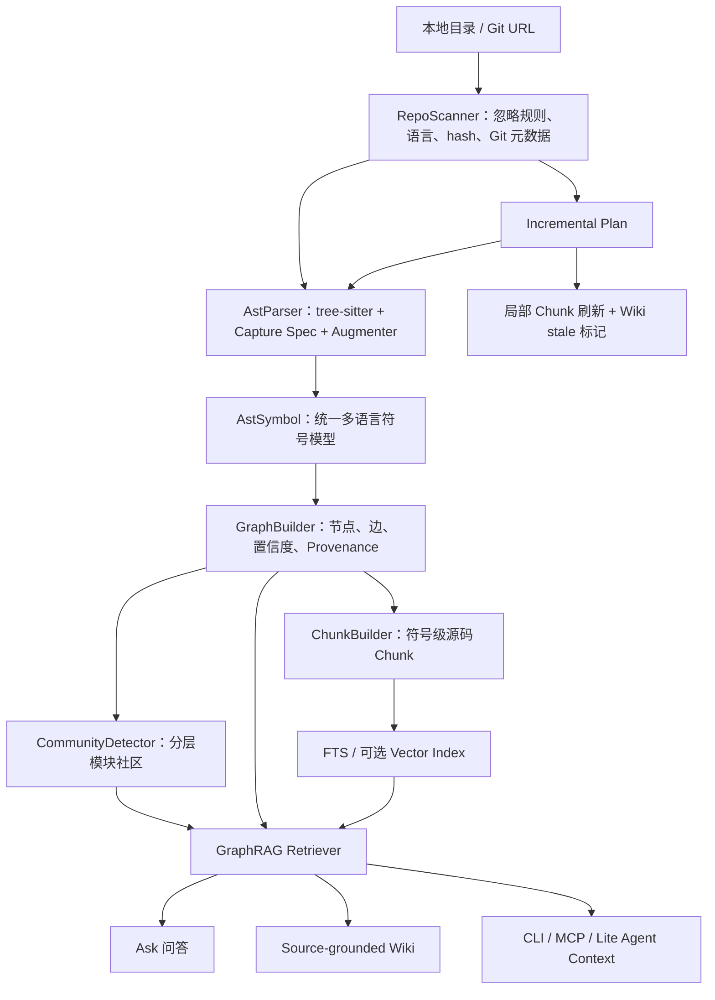
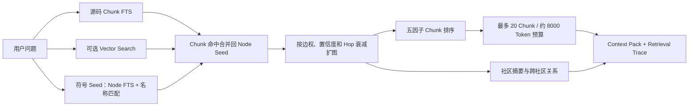
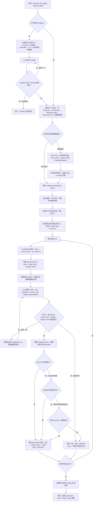

# CodeWiki 全链路源码级深入分析

> 面试口径：这是公司内部 CodeWiki 项目。下面只按当前源码、测试和项目内压测材料能够证明的事实来讲；不根据仓库日期、作者或远端信息判断项目归属，也不会把下一版设计包装成现有能力。

## 0. 先给结论：CodeWiki 到底是什么

我会先用一句话定义 CodeWiki：**它是一个本地优先的代码智能平台，先把代码仓库解析成可追溯的结构化代码图，再基于图、全文检索和可选向量检索生成问答上下文与源码可验证 Wiki。**

它不是简单的“代码切块 + Embedding + 大模型回答”。完整链路是：

1. 接入本地目录或 Git 仓库。
2. 扫描文件、语言、hash、Git 元数据和忽略规则。
3. 使用 tree-sitter 和语言增强器提取统一的 AST Symbol。
4. 构建 repository、directory、file、class、function、endpoint 等节点，以及调用、导入、继承、路由等关系。
5. 对代码图做分层社区检测，得到模块视图。
6. 从符号、FTS、可选向量和图扩展中组织 GraphRAG Context Pack。
7. 用同一份证据支撑 Ask、Wiki、图探索和 Agent 工具。
8. 代码变化后走 Git Diff、SHA256 和符号复用的增量链路，并把受影响 Wiki 标为 stale。

这个项目最核心的设计原则有六条：

1. **程序先提事实，LLM 后做表达。** AST、代码行、节点和边是底座，LLM 不能替代它们。
2. **不确定关系必须显式标记。** 跨文件调用解析带置信度、推断标记和原因，不能装成编译器级真相。
3. **检索不只看文本相似。** 符号命中、关键词、向量、图距离、节点重要度和源码新鲜度共同参与。
4. **Wiki 生成不直接信任模型。** 来源范围、引用标记、Markdown 结构和 Mermaid 都有服务端校验。
5. **向量是增强能力，不是系统前提。** SQLite FTS 和图查询在没有 Embedding 时也能工作。
6. **增量必须贯穿扫描、AST、图、Chunk 和 Wiki。** 只减少文件扫描，不等于真正完成增量架构。

## 1. 它解决的不是“代码搜不到”，而是“理解链路不可信”

传统代码 RAG 一般是把文件切块、做向量、检索 Top K，再让模型回答。这个方案做 Demo 很快，但在真实仓库里会遇到五个问题。

第一，**源码不是普通文档**。一个函数的含义通常不只在函数体里，还取决于调用方、被调用方、类、接口、路由、数据模型、配置和文件导入关系。

第二，**代码检索有大量精确词**。函数名、类名、路径、错误码、API Route、配置键更适合关键词和符号搜索，纯向量不稳定。

第三，**同名符号非常多**。仓库里可能有几十个 `run`、`build`、`handle`。如果不利用同文件、导入作用域和图关系，跨文件调用边很容易连错。

第四，**长文档比短问答更容易幻觉**。Wiki 要覆盖架构、流程、数据模型、API、配置和失败处理，只靠模型自由发挥，很容易生成源码不存在的组件。

第五，**仓库持续变化**。一次性生成的索引和 Wiki 很快过期，系统必须知道哪些文件变了、哪些图关系受影响、哪些页面需要重新生成。

因此 CodeWiki 的思路不是先问“用哪个模型”，而是先建立一层可查询、可解释、可增量更新的代码事实层。

## 2. 总体架构



我会把整个系统拆成四层理解：

- **事实层**：Scanner、AST、Code Graph、源码 Chunk。
- **组织层**：社区检测、社区关系、Repository Context。
- **检索层**：符号 Seed、FTS、可选向量、图扩展、五因子排序、Context Pack。
- **应用层**：Ask、Wiki、Graph UI、CLI、MCP、Lite Mode。

真正关键的是事实层和应用层之间没有直接跳跃。模型拿到的不是整个仓库，也不是随便几个相似切片，而是经过图谱和预算控制组织后的证据包。

## 3. 产品形态：不是只有一个 Web 页面

CodeWiki 目前有五类使用入口。

| 入口 | 主要用途 |
| --- | --- |
| FastAPI | 仓库、分析、图谱、GraphRAG、Wiki、Ask、运行记录和设置 API |
| React 工作台 | Repos、Graph、Wiki、Ask、Settings 一体化操作 |
| Click CLI | 分析、增量、图查询、GraphRAG、Wiki、Ask、Lite 等本地命令 |
| MCP Server | 给 Coding Agent 暴露分析、检索、图查询、Wiki 取证与保存工具 |
| Lite Mode | 在项目内建立无 LLM 的轻量图索引，供本地 Agent 快速查询 |

Web 端不是营销页，而是工作台。Graph 页面常驻为主画布，Wiki、Ask、Repos 和 Settings 作为不同工作区进入；Ask 的结果还能反向高亮图节点。

CLI 和 MCP 不是另外一套实现，它们调用同一组 Store、AnalysisService、GraphQueryService、GraphRAGRetriever 和 WikiGenerator，只是在输入输出协议上不同。

## 4. 数据怎么存

核心关系表可以概括成下面几组：

| 数据域 | 主要表 | 存什么 |
| --- | --- | --- |
| 仓库 | `repo` | 仓库 ID、路径、来源类型、Git URL、Commit Hash |
| 分析运行 | `analysis_run` | 运行状态、开始结束时间、错误和统计 |
| 代码图 | `code_node`、`code_edge` | 节点、边、置信度、推断标记和 metadata |
| 图社区 | `graph_community`、`graph_community_edge` | 分层社区、摘要、父子关系和跨社区依赖 |
| 源码检索 | `code_chunk`、`code_chunk_fts` | 符号源码范围、内容、hash、近似 Token 数和 FTS |
| 向量 | `code_chunk_embedding`、按维度的向量表 | 模型、维度、内容 hash、向量位置 |
| Wiki | `doc_catalog`、`doc_page` | 多语言目录、页面、源码引用、图引用和状态 |
| LLM 审计 | `llm_run` | 模型、Prompt 版本、输入 hash、缓存键、Token、响应和错误 |

SQLite 和 PostgreSQL 通过同一组 Repository Mixin 暴露统一 Store API，方言相关的 FTS、UPSERT、批量写入和向量实现留在各自适配层。

这种结构的优点是业务服务不用到处判断数据库类型；代价是“统一接口”不代表底层能力完全等价，例如 SQLite FTS5、PostgreSQL tsvector、sqlite-vec 和 pgvector 的评分尺度并不相同。

## 5. 仓库接入：RepoScanner 怎么工作

### 5.1 本地目录和 Git URL

`RepoScanner.describe()` 会区分本地路径和 Git URL：

- 本地路径会展开并解析为绝对路径。
- Git URL 会 Clone 到 `storage/repos` 下的稳定目录。
- Repo ID 使用解析后本地路径的 SHA1 前 16 位。
- 同时读取 Git URL 和当前 Commit Hash。

Repo ID 依赖本地解析路径，这适合 local-first，但如果同一仓库在不同机器或不同目录 Clone，ID 不会天然一致。它不是跨环境全局仓库 ID。

### 5.2 文件遍历和忽略规则

FileSystemWalker 会：

- 读取默认忽略规则和每层 `.gitignore`。
- 跳过符号链接，避免目录环和越界扫描。
- 默认跳过 `.git`、虚拟环境、`node_modules`、构建产物、锁文件和常见二进制资源。
- 默认单文件上限是 2,000,000 字节。
- 通过二进制探测跳过不适合文本解析的文件。
- 统计 scanned、ignored 和 skipped 数量。

`scan_files()` 还有一条更轻的文件列表路径：有 Git 时优先用 `git ls-files`，没有 Git 才走文件系统遍历，而且可以关闭二进制内容探测。

### 5.3 文件记录为什么要有 Hash、mtime 和 Git 时间

每个扫描文件会保留路径、大小、修改时间、SHA256、语言、源码标记和最近 Git Commit 时间。

这些字段分别服务不同目标：

- SHA256 判断内容是否真的变化。
- size 和 mtime 用来避免不必要的重复 hash。
- Git Commit 时间参与 GraphRAG 的源码新鲜度评分。
- 语言决定是否进入 AST Parser。
- 路径和 hash 决定 AST Cache 与增量复用。

增量扫描时，如果文件不在 Git Diff 候选里，并且 size 和 mtime 与旧图记录一致，就直接复用旧 hash，不重新读完整文件计算 SHA256。

## 6. 多语言 AST：为什么不能直接用正则

### 6.1 统一的 AstSymbol

不同语言最终统一成 `AstSymbol`：

```text
id / type / name / file_path / language
start_line / end_line / parent_id
signature / docstring
imports / exports / bases / implements
decorators / calls / references / metadata
```

统一模型的价值是 GraphBuilder 不需要为每种语言重写建图流程。语言差异被限制在 Parser、Capture Spec 和 Augmenter 内。

### 6.2 当前真正有 Parser 的语言

默认 Registry 注册：

- Python
- Java
- Go
- Rust
- C
- C++
- C#
- TypeScript
- TSX
- JavaScript
- JSX

LanguageDetector 还能识别 Kotlin、Ruby、PHP、Swift 等为源码语言，但当前默认 Registry 没有对应 Parser。这样的文件会被扫描并成为 file node，但 `parse_file()` 找不到 Parser 时返回空 Symbol，不会凭空解析出类和函数。

所以面试时应该说“当前深度 AST 支持上述 11 种语言变体”，不能把所有能识别扩展名的语言都说成完整 AST 支持。

### 6.3 Capture Spec 和 Augmenter 怎么分工

tree-sitter Capture Spec 负责提取语言共同结构，例如类、函数、方法和声明范围；Augmenter 再处理语言特定语义，例如：

- Python 装饰器、函数调用和类方法。
- Java Spring Route、record、interface 和 implements。
- Go receiver method、interface、type alias 和路由注册。
- ECMA 系语言的 export、schema、arrow function 和 router endpoint。
- Rust trait、impl 和方法归属。

这样做比把所有逻辑塞进一条巨大 Query 更容易测试，也比正则解析嵌套结构、注释和多行语法可靠。

### 6.4 AST 并发和缓存

解析文件默认使用线程池，Worker 数取文件数、CPU 数和 4 的最小值；也可以通过 `CODEWIKI_AST_PARSE_WORKERS` 覆盖。

每个线程第一次工作时会 `parser.fork()`，后续复用该线程自己的 Parser，避免多个线程共享 tree-sitter Parser 的状态。

结果按原文件序号重新排序，因此即使完成顺序不同，最终 Symbol 顺序仍稳定。

AST Cache 使用文件内容 hash，Schema Version 当前是 3，按 hash 文件保存多个 file path/language Entry；写入使用临时文件替换。缓存损坏、版本不匹配或写失败都会当作 miss，不阻塞主分析。

### 6.5 解析失败怎么处理

单文件 `SyntaxError` 会记录为 `file_path + error`，其他文件继续解析。分析运行可以是 done，同时 stats 中带少量解析错误。

这适合大仓库，因为测试 Fixture、旧语法或故意损坏样例不应该让全仓分析失败。但当前只对 `SyntaxError` 做了明确单文件隔离，其他异常仍可能冒泡中断整个 Pipeline。

## 7. Code Graph：怎么把 AST 变成可查询事实

### 7.1 节点类型

主要节点包括：

- `repository`
- `directory`
- `file`
- `config`
- `module`
- `class`
- `interface`
- `schema`
- `function`
- `method`
- `endpoint`

配置文件不是普通 file 的一个标签而已，GraphBuilder 会把识别出的配置文件节点类型改为 `config`，并记录 config kind、reason 和 confidence，后续才能建立 `uses_config` 关系。

### 7.2 边类型

主要边包括：

- `contains`
- `defines`
- `imports`
- `exports`
- `inherits`
- `implements`
- `calls`
- `references`
- `routes_to`
- `uses_config`

### 7.3 建图顺序

GraphBuilder 的顺序很重要：

1. 建 repository、directory、file/config 节点和 contains 边。
2. 把 AstSymbol 转成符号节点。
3. 构造 Call Index 和每个文件的 import scope。
4. 建文件 import 和配置引用边。
5. 建 defines、exports、inherits、implements、routes_to。
6. 最后解析 calls、references 和 uses_config。

只有先建立完整符号索引，后面才有可能解析跨文件关系。

### 7.4 稳定 ID 有什么用

节点和边 ID 由 Repo、路径、Symbol ID、源目标和边类型等确定性信息构成。稳定 ID 带来四个价值：

- 增量更新可以比较新旧节点。
- Wiki 的 `graph_refs` 可以稳定引用图事实。
- 前端可以从 Ask 结果定位图节点。
- MCP 的 node、trace、impact 可以围绕同一标识工作。

但 Chunk ID 包含 content hash，源码内容变化后 Chunk ID 会变化，这是有意设计，用来让缓存和 Embedding 知道证据已经更新。

## 8. 跨文件符号解析：为什么只能叫启发式

调用和类型解析使用三级候选：

| 层级 | 条件 | 默认置信度 |
| --- | --- | ---: |
| `same_file` | 同文件同名只有一个目标 | 0.95 |
| `import_scoped` | 导入文件范围内同名只有一个目标 | 0.90 |
| `global` | 全仓同名只有一个目标 | 0.50 |

如果某一级出现多个同名候选，`_single_match()` 会拒绝猜测，不建这条边。

这说明系统的策略是“宁可少连，也不随便连”。但它仍不是编译器或 LSP：

- 不做完整类型推导。
- 不理解所有动态派发、反射和依赖注入。
- 不解析运行时生成 Route。
- 不会为无法确认的外部基类创建虚假的继承边。

所有边都会带 `confidence`、`is_inferred`、`reason` 和 `resolution_tier`。同文件和导入作用域虽然置信度较高，调用边在 GraphBuilder 中仍按推断关系表达；全局唯一匹配明确标成 inferred。

配置关系也有单独置信度：配置 import 大约 0.78，基于调用/引用文本推断的配置使用大约 0.58。

## 9. Provenance：图谱为什么能解释“这条边怎么来的”

Node metadata 和 Edge metadata 都附加 Provenance。边至少可以解释：

- 这是结构边还是推断边。
- 通过同文件、Import Scope 还是全局名称解析得到。
- 原始 call、reference、base 或 interface 是什么。
- 置信度处于什么等级。
- Route Method、Route Path 和 Handler 是什么。

这不是为了把 metadata 做得很花，而是支持三件事：

- 前端筛选或弱化展示低置信边。
- GraphRAG 把关系的可信度放进 Context Pack。
- 调试错误图关系时能回到解析原因。

## 10. 社区检测：怎么把几十万节点组织成模块

直接把所有函数和文件展示给用户没有意义，因此系统会在加权无向图上做社区检测。

边权偏向更能表达业务耦合的关系：`calls` 和 `routes_to` 权重最高，继承、实现、导入次之，contains 和 defines 更低。实际进入 NetworkX 的权重还会乘边的 confidence。

### 10.1 当前真实算法顺序

当前代码的执行顺序是：

1. 优先 `networkx_louvain`，固定 `seed=42`。
2. Louvain 抛异常后尝试 `graspologic_leiden`。
3. Leiden 不可用或再降级时使用 `networkx_greedy_modularity`。
4. 没有边时按 connected components。

这和部分设计说明里的算法顺序不完全一致。面试时应该按当前代码说 Louvain 优先，不能机械背设计稿里的“Leiden 优先”。

### 10.2 为什么要做多层社区

系统先以较高 Resolution 找叶子社区，再把叶子社区压缩成 Community Graph，用较低 Resolution 找父社区；过大的子社区还可以继续拆成 Detail Community。

还会做这些保护：

- 合并过小叶子社区。
- 限制父社区和每个父节点的子社区数量。
- Detail 拆分需要达到节点数或文件数阈值。
- 总社区数最多 128。

社区 ID 基于层级、父 Key 和节点集合生成，所以同一输入通常能够得到稳定标识。

### 10.3 社区名称从哪来

社区检测本身只做结构分区。`CommunityRecordBuilder` 会先根据文件、目录、符号、内部边和边界边生成确定性名称与摘要。

配置了 LLM 时，`CommunityNamer` 再按批次重命名和总结；LLM 失败只会得到 skipped、partial 或 failed 的命名结果，不会让已经完成的图谱分析失败。

跨社区关系也不是模型编的，而是聚合底层 calls、imports、exports、routes_to 等边，保留最多一部分 Evidence Edge IDs。

## 11. Source Chunk：为什么按符号切，不按固定字符切

ChunkBuilder 从 class、function、method、schema、endpoint 等源码节点读取精确行范围，生成 `CodeChunkRecord`。

它不会给 file node 再生成整文件 Chunk，避免“整文件块”和“函数块”重复竞争；也会过滤测试、生成物、Vendor 和锁文件，降低 Wiki 与 Ask 的噪声。

每个 Chunk 包含：

- 所属 Node ID。
- 文件路径和起止行。
- 原始源码内容。
- SHA256 内容 hash。
- 近似 Token 数。

去重 Key 是文件、行范围和内容 hash。Chunk ID 还包含 Node ID 和内容 hash，因此相同符号内容不变时 ID 稳定，内容变化后自动失效。

这里的 Token 估算不是模型 tokenizer，而是非空白词数量。它适合做粗预算，但对中文、压缩代码和不同模型不精确。

## 12. FTS 和向量索引怎么配合

### 12.1 FTS

SQLite 使用 FTS5；PostgreSQL 使用 `to_tsvector`、`websearch_to_tsquery` 和 GIN 能力。

如果方言不支持对应文本搜索，或者文本搜索没有命中，Store 还会退到 LIKE 查询。它不会因为 FTS 缺失就完全失去关键词检索，只是性能和排序质量会下降。

### 12.2 可选 Embedding

Embedding 默认不是 GraphRAG 必需项，只有 `include_embeddings=True` 时才构建或查询。

EmbeddingIndex 会：

- 按 Content Hash 去重模型调用，相同内容只 Embedding 一次。
- 已有同模型、同内容 hash 的向量可以直接复用。
- 新增 Chunk 时只补缺失向量。
- 将一个内容向量复制给所有相同内容的 Chunk Metadata。

`code_chunk_embedding` 保存元数据，真正向量按维度放在 `code_chunk_embedding_vec_<dimensions>` 表里。这样 768、1024、1536 等不同维度不用硬塞进同一张固定表。

SQLite 使用 sqlite-vec，PostgreSQL 使用 pgvector；扩展不可用时，向量能力会关闭，但文本和图检索仍能工作。

## 13. GraphRAG：从问题到 Context Pack 的完整过程



### 13.1 Seed 怎么找

`seed_from_symbols()` 先调用 Store 的 Node Search，再在内存里对名称、路径、Signature、Docstring、Route 和 Metadata 做补充匹配。

Endpoint、Function、Method、Class、Schema 会有不同 Type Boost。最终最多保留 12 个 Seed。

FTS 和 Vector 命中的 Chunk 会通过 `chunk.node_id` 合并回 Seed；如果完全没有命中，系统会用 repository node 和少量 file node 作为 Overview Fallback，避免返回空上下文。

### 13.2 图怎么扩展

`max_hops` 会被限制在 0 到 4。图扩展把边视为双向邻接，但边类型有不同权重，并乘边的 confidence。

候选分数大致是：

```text
上游节点分数 * 边类型权重 * 边置信度 * 0.78^hop
```

最多选择 60 个节点，相关边最多返回 140 条。越远的 Hop 分数越低，避免一次调用沿 contains 或 imports 把整个仓库扩进来。

### 13.3 Chunk 怎么排

当前不是 RRF，而是明确的五因子线性加权：

```text
score = 0.35 * semantic
      + 0.25 * keyword
      + 0.20 * graph_proximity
      + 0.10 * node_importance
      + 0.10 * source_freshness
```

- Semantic 来自 Vector Hit。
- Keyword 来自 FTS Hit。
- Graph Proximity 是 `1/(hop+1)`。
- Node Importance 使用全图 Degree Centrality 归一化。
- Source Freshness 根据最近 Commit 或修改时间在当前候选集合内归一化。

没有启用向量时 semantic 为 0，剩余四个因素照常工作。因此“可选向量”不等于“没有向量就没有 Hybrid Ranking”。

### 13.4 Token 预算怎么控制

默认最多 20 个源码 Chunk，Context Token Budget 默认 8000。

Chunk 按总分排序后逐个装包：

- 单个 Chunk 超预算直接跳过。
- 加入后超过总预算也跳过。
- 测试、生成物、Vendor 和锁文件继续过滤。

由于 Token 是按空白词数估算，这个 8000 只是近似预算，不是对模型真实上下文的硬保证。下一版更稳妥的方式是按实际 Model Profile 选择 tokenizer。

### 13.5 Context Pack 里有什么

最终 Pack 包含：

- Query。
- Source Chunks 和精确行范围。
- Community Summaries。
- Community Relationships。
- 最多一部分 Graph Facts。
- Node、Edge、Chunk、Community 的 ID 列表和统计。

Retrieval Trace 还会返回 Seed、Expanded Node、每个 Chunk 的五项分数组成和 Trace ID。

Trace ID 是根据 Repo、Query、Seed ID 和 Chunk ID 稳定生成的，但当前 `/graphrag/traces/{trace_id}` 仍返回 `not_persisted_yet`。也就是说它可用于一次响应内关联，不代表已经有可回放的持久化 Trace Store。

## 14. Ask：怎么从检索证据生成回答

QuestionAnswerer 只支持 `graph_rag` 模式：

1. 校验 Repo。
2. 按问题执行 GraphRAG。
3. 根据请求决定是否返回 Source、Node、Edge 和 Community。
4. 使用稳定 QA Contract 和动态 Context Payload 调 LLM。
5. 返回 Answer、Sources、Related Graph 和 Trace ID。

Prompt 明确要求只用 GraphRAG Context，并引用文件和行号。

但 Ask 目前不像 Wiki Page 那样有严格的响应后引用校验。它会把检索到的 Source List 放进响应，却没有验证模型正文里的每个代码结论都能被某一条 Source 蕴含。所以 Wiki 的事实约束强于 Ask。

## 15. Wiki Catalog：为什么先规划目录再写页面

如果让模型直接“给仓库写一份 Wiki”，很容易得到一个巨大 Overview。CodeWiki 先生成 Catalog，把信息架构和页面内容拆开。

Catalog 输入包括：

- Repo Metadata。
- 目录树、README、Key Files 和 Entry Points。
- GraphRAG Overview。
- Module Candidates。
- Seed、Expanded Node、Community 和 Source Chunk 摘要。
- 页面粒度、目标深度和硬上限。

### 15.1 按仓库规模调整目录上限

系统根据文件数、节点数、边数、Chunk 数和社区数，把仓库分成 tiny、small、medium、large、xlarge。

不同规模有不同 Top Level、总页面数、Children 数和深度上限。最大 xlarge 允许最多 16 个顶层项、110 个总项、每项 16 个子项、深度最多 4。

无论模型返回什么，程序还会补齐或规范化 Overview、Architecture、Reading Guide 和 Dependencies 等特殊页面，并限制总项数、Slug 和深度。

### 15.2 Catalog 失败怎么处理

Catalog 最多尝试 3 次。无效 JSON 或 Shape 错误会把上一轮响应和 Validation Error 带回模型修复。

全部失败后抛出错误，不会保存一个无法解析的目录。

## 16. Wiki Page：怎么保证文章有源码依据

单页生成是项目里最严格的 LLM 工作流。

### 16.1 先取证

每个页面会：

1. 用页面 Topic 做 GraphRAG，`max_hops=3`。
2. 根据 Catalog 的 source_hints 补充证据 Chunk。
3. 从 Trace 生成 Allowed Source Refs。
4. 记录 Graph Refs。
5. 根据图事实规划 Mermaid Slot。
6. 服务端执行 ReadFile 读取精确源码范围。

ReadFile 最多读取 14 段，总字符上限 32,000，单段最多 8,000；所有路径都要 resolve 后确认仍在 Repo Root 内，防止路径越界。

这里的 ReadFile 不是让 LLM 自己任意读磁盘，而是服务端根据允许引用预取证据，再作为 Payload 给模型。

### 16.2 页面输出约束

LLM 必须返回一个 JSON Object，至少有：

- `title`
- `markdown`
- `source_refs`

Markdown 必须有 H1 和 `Purpose and Scope` 等基本结构。源码引用只能从 Allowed Refs 中选择，行号必须落在检索 Chunk 范围内。

正文使用 `[[S1]]` 标记，服务端会验证标记是否存在于 Source Refs，再替换成可点击链接。

### 16.3 两次修复机会

Page 最多生成 2 次：

- JSON 解析失败时，带回原始响应和 JSON Repair Instruction。
- 来源、结构、Citation 或 Diagram Placeholder 校验失败时，带回 Validation Error 修复。

最终至少要有一条合法 Source Ref 才能成为 `generated`。失败会保存为 `draft`，页面正文替换成 Validation Error，而不是把未验证的幻觉文章直接展示。

### 16.4 Source Ref 校验能保证什么

它能保证：

- 文件真实存在于仓库。
- 行范围合法。
- 引用来自本次允许的 Source Chunk。
- Citation Marker 和返回引用一致。
- 未知引用和未知 Diagram Slot 会报错。

它不能保证：

- 每一句话都带 Citation。
- 引用的源码在语义上真的支持那句话。
- 模型没有在有引用的段落里夹带推测。

所以准确说法是“引用范围硬校验”，不是“已经做了完整事实蕴含验证”。

## 17. Mermaid：为什么不让模型直接画

Page Payload 明确要求 LLM 不输出 Mermaid Fence，只能放服务端提供的 `[[DIAGRAM:slot]]`。

Mermaid 图由 `_mermaid_diagrams_from_trace()` 根据已验证的 Node、Edge、Community 和 Source Ref 生成，可以形成组件图、数据流、符号流、时序图或类图。

生成后再通过 `mermaid-parser-py` 单独解析，单次校验有 15 秒超时。

如果某些图无效，系统会：

1. 先过滤掉无效图重新组装页面。
2. 如果仍有 Mermaid 错误，再移除全部 Diagram。
3. 正文和引用仍合法时，页面保持 generated。
4. 只有移除图后页面仍存在 Mermaid 解析错误，才降为 draft。

这是一个很好的故障隔离：可视化增强失败，不应该拖垮一篇有用的源码文章。

## 18. 页面生成顺序：为什么叶子先、父页后

WikiPageOrchestrator 会先找所有叶子页面：

- 第一个叶子串行生成，用来完成冷启动和缓存预热。
- 后续叶子通过 Semaphore 并发，默认并发 3。
- 父页面再按深度从深到浅生成。
- 父页会拿到最多一部分已生成 Child Page Summary，用来做汇总。

这样父页面不是和子页面各写各的，而是能总结子系统边界和跨子页关系。

全部生成后，Store 会删除同语言下已经不在当前 Catalog 中的旧页面。这个清理能防止目录改版后留下幽灵页面，但也意味着生成流程必须保证 Catalog 正确，否则错误目录可能导致页面被删除。

### 18.1 Wiki 页面生成全链路流程图

下面这张图按当前实现画出“首次生成”和“增量更新”的共同主链路。图里的实线是当前代码路径；页面校验失败最多回到模型修复一次，Catalog 校验失败最多重试三次。Mermaid 图本身生成失败会先过滤无效图，再尝试移除全部图；正文和引用仍然合法时，页面仍可保持 `generated`。



面试时可以把这张图压缩成一句话：

> 先用仓库级证据规划 Catalog，再叶子页优先生成；每个页面先做 GraphRAG 和精确源码取证，模型只返回受约束的 JSON，服务端校验引用和结构，Mermaid 失败可以降级但不能让正文失去证据，最后再生成父页并清理旧页面。

### 18.2 面试口语化回答：CodeWiki 是怎么生成 Wiki 页面的？

**30 秒版本：**

> 这个流程我一般分三步讲。第一步先给整个仓库做一次代码理解，生成 Wiki 目录，不是让模型直接写一篇大 Markdown。第二步按目录生成页面，先查相关代码和调用关系，再由服务端读取允许的源码范围，交给模型生成带引用的 JSON 页面。第三步服务端校验引用、Markdown 和图表，校验通过才保存成正式页面，失败就重试，重试还失败就保存成 Draft，不把不可靠内容直接展示出来。

**90 秒版本：**

> 具体来说，入口有两种：第一次生成，或者代码变化后的增量更新。第一次没有 Catalog，就先用仓库元信息、目录树、README、入口文件和代码图生成一个目录；如果是增量，就先算 Dirty Plan，只重新生成受影响的页面，没变化的页面直接复用。
>
> 有了目录以后，页面不是一起乱生成。我们先生成叶子页，第一个叶子页会串行跑一下，主要是做冷启动和缓存预热，后面的叶子页可以并发。叶子页完成以后，再按从深到浅的顺序生成父页，父页可以参考已经生成的子页摘要。
>
> 每个页面生成前，系统先按页面主题跑 GraphRAG，拿到相关的源码块、图关系和允许引用的范围；然后由服务端 ReadFile 读取精确源码片段，模型只返回标题、Markdown、source_refs 和图占位符。返回结果要经过 JSON、Markdown、源码引用、Citation 和图占位符校验。全部通过以后，Mermaid 再根据已经验证的代码图生成。图有问题会先过滤，必要时把图全部去掉；如果正文和引用还合法，页面仍然可以发布。只有页面本身也校验不过，才保存为 Draft。

**被追问“为什么不让模型直接扫仓库写 Wiki？”时：**

> 小仓库或者一次性问题，直接用 Claude Code、Codex 这类工具确实更快，我不会说 CodeWiki 全面替代它们。CodeWiki 主要解决的是团队要反复使用、能够回到源码核对、还要随着代码变化维护的场景，所以我们把程序能确定的代码事实、引用和校验先固定下来，模型主要负责组织语言。

**被追问“生成页面最难的地方是什么？”时：**

> 最难的不是让模型写出一篇看起来像文档的 Markdown，而是保证它写的内容有依据。当前实现能硬校验引用来自允许的文件和行范围，也能校验 Citation 和 Mermaid 语法，但还不能证明每一句话在语义上都被引用完全支持。所以我会把它叫作“引用范围可追溯”，不会说已经彻底解决幻觉。

**一句话收口：**

> 这套流程的核心就是：程序先取证和校验，模型再组织表达；页面可以生成失败，图可以降级，但未经验证的内容不能直接变成正式 Wiki。

## 19. 多语言 Wiki：翻译什么，不翻译什么

基础语言先生成。请求其他语言时，如果基础 Catalog/Page 不存在，会先生成基础版本，再翻译。

翻译要求保留：

- Slug 和 Path。
- Source Hints。
- 代码块、Inline Code、文件路径、URL 和标识符。
- Source Refs 和 Graph Refs。
- 页面状态和结构。

Translation 最多修复 3 次，页面翻译并发默认 3。失败会保存 Draft，并保留源页面和错误说明，不会覆盖基础语言。

增量翻译只处理目标语言缺失、非 generated，或者基础页面本轮重新生成的 Slug。

## 20. 增量更新：到底增量到了哪一层

### 20.1 Analyze 本身也会自动走增量

`AnalysisService.analyze()` 不是永远 Full：

- 没有旧图或 `force=True` 时 Full。
- 有旧图且仓库无变化时返回 `mode=unchanged`，不重新解析。
- 有变化时生成 Plan，进入 `mode=incremental`。

显式 `IncrementalUpdater.update()` 则在图更新之外继续处理 Chunk 和 Wiki Stale。

### 20.2 变化怎么判断

有可用 Git Metadata 时：

```text
Git Diff 候选 + SHA256 兜底
```

没有 Git 或 Diff 不可用时：

```text
全文件集合的 SHA256 新旧对比
```

最终得到 changed、new、deleted 和 unchanged 四组文件。

### 20.3 AST 怎么复用

只重新 Parse changed 和 new 文件。Unchanged 文件的 AstSymbol 从旧 Graph Node/Edge 恢复，再和新 Symbol 一起交给 GraphBuilder。

这不是简单复用旧节点，因为建图仍需要统一 Symbol 输入来重新解析关系。

### 20.4 图和社区是不是局部更新

当前不是。虽然文件解析高度复用，但 GraphBuilder、CommunityDetector 和大部分持久化仍对全量新图工作。

这也是压测里“99% 文件复用但端到端只快一点”的根因。真正的下一阶段优化应该是增量边维护、局部社区重算和差量持久化，而不是继续只优化 AST Parse。

### 20.5 Chunk 和 Wiki 怎么更新

如果旧 Chunk 已经存在，IncrementalUpdater 只替换 changed、new、deleted 相关文件的 Chunk。

Wiki Stale 判断有两条线：

- 页面 Source Refs 是否引用了变更或删除文件。
- 页面 Graph Refs 是否命中受影响的旧节点或边。

命中后页面状态会降成 draft，并返回 stale slug。可选的 Regeneration 会按 Slug 逐页重建；单页失败记录 Error，其他页面继续。

WikiIncrementalStrategy 还会把 Missing、Draft、Title/Parent Metadata 变化的页面标 Dirty，并向上污染父页面，保证父页重新汇总。

## 21. 增量一致性和恢复边界

当前没有一个跨 Scanner、AST、Graph、Community、Chunk 和 Wiki 的分布式事务或阶段 Checkpoint。

`analysis_run` 会记录 Running、Done、Failed、阶段进度和错误；失败后可以重新运行并复用旧持久化结果，但不是从崩溃前的具体步骤原地续跑。

Store 的 `replace_graph()` 会分批提交：先清边，再删旧节点，再 Upsert 新节点和边，再重建 Node FTS。它有利于控制大批量事务和 SQLite 参数限制，但进程如果在中间崩溃，数据库可能暂时处于半更新状态。

API 写操作用 `repo_write_lock(repo_id)` 串行化同一仓库、允许不同仓库并行。这个锁是当前 Python 进程内的 Thread Lock 加异步轮询，不是跨进程锁。多 Worker 或多个服务实例共享数据库时，仍需要数据库级锁、作业租约或版本检查。

## 22. SQLite 和 PostgreSQL 怎么选

| 维度 | SQLite | PostgreSQL |
| --- | --- | --- |
| 定位 | 单机、本地、零运维 | 集中式部署和更大并发 |
| 文本检索 | FTS5 | tsvector/GIN |
| 向量 | sqlite-vec | pgvector |
| 写入 | WAL、30 秒 busy timeout、分批提交 | 数据库事务与服务端并发 |
| 部署复杂度 | 低 | 高，需要服务和扩展 |

SQLite 启动时启用 WAL 和 Busy Timeout，适合 local-first。PostgreSQL 会探测文本检索和 pgvector 能力。

Repository 删除依赖外键 Cascade 清理核心表，同时显式删除 FTS 和按维度向量表里的 Repo 数据。

要注意：数据库级 Cascade 只覆盖数据库记录，不代表会删除 Git Clone 目录、AST Cache、导出文件或其他外部存储。完整生命周期治理仍需要额外清理策略。

## 23. LLM 层：为什么用统一 Gateway 和任务路由

业务服务只依赖 `LLMGateway`，由 LiteLLM 适配具体 Provider。ModelRouter 按 Task Type 选择 Profile：

| Task | 默认行为 |
| --- | --- |
| Catalog | 最大输出默认 4096 |
| Community Summary | 最大输出默认 4096 |
| Page | 最大输出默认 12000 |
| Translation | 最大输出默认 12000 |
| QA | 默认流式 Profile 语义，但当前 QuestionAnswerer 使用 Complete |
| Embedding | 独立 Embedding Profile |

全局默认超时 120 秒，重试 3 次，温度 0.1。每个任务可以覆盖 Model、Provider、Endpoint、API Key 和 Max Tokens。

统一 Gateway 的价值是业务层不依赖某家 SDK，也方便集中记录 Usage 和错误。

## 24. LLM Cache 和 Run 审计

每次非流式 LLM Operation 会构造：

- Repo ID。
- Task Type。
- Cache Namespace 和 Parts。
- Input Payload Hash。
- Model。
- Prompt Version。

只有这些字段匹配，并且旧 Run 是 success 且 Response 不为空，才会命中本地缓存。命中后不会复用同一 Run 记录，而是新写一条 `cached=True`、Cost=0、Duration=0 的 Run，便于审计调用次数。

`llm_run` 会保存 Response Content、Usage、Token、状态和脱敏后的 Error。错误会遮盖常见 `sk-` Key、`api_key=` 和 Bearer Token，并截断到 1600 字符。

当前有两个真实边界：

1. `llm.cache_enabled` 目前只在配置里声明，没有被 CachedLLMService 执行链路读取，因此不能说这个开关已经真正控制缓存。
2. `llm.mode` 会在配置、CLI、Settings API 和 MCP 状态中展示，但 `LLMGateway` 当前没有根据 `sdk/proxy` 做执行分支，实际仍走 LiteLLM Gateway 这条路径。
3. `cost_usd` 和 `duration_ms` 字段虽然存在，但正常 Run Recorder 没有从当前调用结果填充它们，不能把表结构说成完整成本监控。

## 25. Lite Mode：为什么它能不依赖 LLM

Lite Mode 在仓库内创建：

```text
.codewiki/codewiki-lite.sqlite3
```

它只做扫描、AST、Code Graph、社区和静态图查询，不生成 LLM Wiki，也不要求 Embedding。

主要命令包括：

- `init / uninit`
- `index / sync / watch / status`
- `query`
- `callers / callees / impact`
- `context / trace / node`
- `files / affected`
- Agent MCP 配置安装和卸载

Lite Context 不是 GraphRAG 的 LLM Context Pack，而是 GraphQueryService 根据符号、调用/引用关系和源码行组织的 Agent 友好文本。

MCP 启动 Lite Store 时可以检查当前文件变化；已有图且发现 Pending File 时自动执行一次不刷新 Chunk 的 Incremental Update，降低 Agent 使用过期图的概率。

它的边界也很清楚：

- 不做语义向量召回。
- 不做 LLM 社区命名。
- 不生成完整 Wiki。
- 静态调用边仍继承启发式解析误差。

## 26. MCP：为什么工具很多，而不是只暴露一个 Ask

MCP 工具覆盖：

- 仓库注册、扫描、删除和分析。
- GraphRAG Build/Retrieve。
- Ask。
- 文件树。
- Graph Dump/Search/Callers/Callees/Impact/Explore/Affected。
- Context/Trace/Node。
- 社区列表和命名。
- Wiki Catalog/Page/Update/Translate。
- Wiki Agent Plan/Evidence/Save/Validate。

给 Agent 只提供一个自然语言 Ask，会把所有中间决策都藏进黑盒。拆成 Search、Trace、Node、Affected 和 Evidence 后，Agent 可以按任务选择更确定的工具，也便于控制输出量。

## 27. Agent Wiki Workflow：它不是自动 Autonomous Agent

WikiAgentWorkflow 不调用外部 LLM 自动写页，而是给宿主 Agent 提供四步工具链：

1. `plan()`：如果没有 Catalog，按图中的目录和文件确定性生成一个基础目录。
2. `evidence(slug)`：围绕页面 Topic 做 GraphRAG，返回 Catalog Context 和 Allowed Source Refs。
3. `save_page()`：保存 Agent 写的 Markdown，并验证 H1、长度和 Citation。
4. `validate_page()`：检查页面、引用和 Catalog 归属。

没有 Citation 或使用未知 `[[S#]]` 的页面会保存为 draft。

所以准确表述是“提供 Agent 可组合的 Wiki 工具和约束”，不是“内部已经实现一个自主多轮 Agent Runtime”。

## 28. 前端图谱工作台怎么组织

Graph 前端基于 `@xyflow/react` 和 ELK.js，支持 Overview、File Detail、Focus 和 Container Drilldown 等视图。

前端会区分：

- Repository、Directory、File、Class、Function 等节点样式。
- Contains、Calls、Imports 等边。
- 原始图状态和视觉折叠状态。
- Source Ref 到图节点的匹配。
- Ask 结果高亮。
- Node Detail、Raw Metadata 和 Reference Section。

图不是只用于展示，它承担导航中枢：用户可以从 Repo -> Module -> File -> Symbol 下钻，再跳到 Source 或 Wiki；Ask 和 Wiki 又能回到同一图节点。

## 29. 安全和隐私边界

### 29.1 当前是单用户 Local-first

FastAPI 目前没有 Bearer、Session、RBAC 或 Tenant Filter。CORS 只允许本地 Vite Origin，但 CORS 不是服务端鉴权。

如果把服务直接绑定到非本机网络，其他可达客户端可能调用 Repo、Source、Ask、Wiki 和删除接口。生产化部署必须增加反向代理鉴权、TLS、用户身份和 Repo ACL。

### 29.2 源码会不会发给外部模型

只做 Analyze 和 Lite 不需要外部 LLM；一旦启用 Community Naming、Ask、Wiki、Translation 或 Embedding，相关 Repo Context、Source Chunk 或源码范围可能发送给配置的 Provider。

因此企业内部使用要明确：

- Provider 数据保留策略。
- 哪些仓库允许外发。
- Secret 和 PII 扫描。
- Prompt/Response 审计和脱敏。
- 私有 Endpoint 与代理策略。

当前错误日志会遮盖常见 API Key，但源码 Payload 本身没有完整 Secret Scanner，不能把错误脱敏等价成源码脱敏。

### 29.3 路径安全

Source File 和 ReadFile 都会 Resolve 路径，并检查目标仍在 Repo Root 内；前端静态文件也检查请求路径位于 Static Root。这些能防止常见 `../` 路径穿越。

### 29.4 多租户

Repo ID 只是数据分区键，不是可信租户身份。当前没有用户表、权限表和请求级 Principal，也没有对同一 Repo 的细粒度读写授权。

所以我会说“单用户本地工作台”，不会说“已经是企业 SaaS 多租户平台”。

## 30. 可观测性和测试

### 30.1 当前能看到什么

`analysis_run` 记录：

- Running/Done/Failed。
- 当前阶段和阶段消息。
- 扫描、解析、复用、节点、边、社区和错误统计。

`llm_run` 记录：

- Task、Provider、Model、Prompt Version。
- Input Hash 和 Cache Key。
- Token、Response Usage、Cache Hit、状态和错误。

Wiki API 还能聚合本地缓存命中和 Provider Prompt Cache Token。

Retrieval Trace 会产生稳定 Trace ID，但尚未持久化，因此目前不能通过 Trace ID 重放当时完整检索证据。

### 30.2 测试覆盖的真实口径

当前源码中可以直接看到 28 个 Backend 测试文件、196 个测试函数，重点覆盖：

- Repo Scanner 和 Language Detector。
- AST 多语言解析和并发。
- Graph、社区、GraphRAG 和 Query。
- Incremental Update。
- SQLite/PostgreSQL Store。
- Wiki 生成、翻译、引用和 Mermaid。
- LLM Cache 和 Model Router。
- API、CLI、MCP 和 Async Lock。

这说明核心风险有针对性测试，但不能仅凭测试函数数量推导覆盖率百分比。前端当前主要依靠 TypeScript Build 和 ESLint，没有看到对应规模的组件单测。

## 31. 压测结果怎么正确讲

### 31.1 完整分析压测

| 仓库类型 | Cold 时间 | 扫描文件 | 解析文件 | 节点 | 边 | 错误 |
| --- | ---: | ---: | ---: | ---: | ---: | ---: |
| 大型 Rust 仓库 | 318.553s | 58,260 | 36,220 | 308,821 | 886,546 | 0 |
| 高边密度 TypeScript 仓库 | 547.184s | 14,048 | 10,507 | 169,492 | 3,793,136 | 4 |
| 中型全栈仓库 | 105.021s | 8,803 | 5,672 | 40,621 | 476,166 | 0 |

这些结果证明系统可以完成几十万节点、数百万边的大仓分析，但不是线上 SLA，也不能从一次机器环境推导通用 QPS。

### 31.2 增量复用和真实收益

Warm 文件复用率分别约为 99.7%、96.9% 和 98.2%，但相对 Cold 提速只有 1.29x、1.06x 和 1.51x。

最典型的例子是大型 Rust 仓库 Warm 只重新解析 6 个文件，仍耗时 247.087 秒；高边密度仓库 Warm 只解析 30 个文件，仍耗时 514.561 秒。

这说明当前瓶颈已经从 AST Parse 转移到全图重建、社区检测和数据库写入。面试时主动讲这个边界，反而比只报“99% 复用”更可信。

### 31.3 Lite 压测

在 2,000 个合成 Python Module、Fanout 4 的 Lite 压测里：

- Cold Index 3.132s。
- 单文件变化后 Sync 2.909s。
- Query 0.382s。
- Context 0.800s。
- Trace 0.748s。
- Affected 0.740s。
- Node Context 1.480s。

这只证明合成小模块场景下的 Lite 静态索引性能，不等于完整 GraphRAG、LLM Wiki 或真实大型 Monorepo 的性能。

## 32. 失败与降级矩阵

| 故障 | 当前行为 | 影响 | 还需要补什么 |
| --- | --- | --- | --- |
| 单文件 Syntax Error | 记录 Parse Error，继续其他文件 | 少量 Symbol 缺失 | 按语言统计错误率和错误阈值 |
| 未支持 Parser 的语言 | 文件保留，Symbol 为空 | 只有文件级图，缺少代码关系 | Parser 插件和能力提示 |
| 同名调用目标不唯一 | 不建边 | Recall 关系变少 | LSP/类型系统增强 |
| 社区 LLM 命名失败 | 保留确定性社区名，返回 partial/failed | 展示质量下降 | 后台重试和失败批次 |
| Embedding 不可用 | FTS、图和 LIKE 继续 | 语义召回下降 | 明确健康状态和降级指标 |
| GraphRAG 无命中 | Repository/File Overview Seed | 上下文偏泛 | Query Rewrite 和可解释空召回 |
| Catalog 无效 | 最多 3 次修复，仍失败则报错 | 无新目录 | 保存失败 Run 和人工重试入口 |
| Page 无效 | 最多 2 次修复，保存 draft | 页面不可正式展示 | 细分错误和人工修订 |
| Mermaid 无效 | 过滤坏图或移除全部图 | 正文继续可用 | 图类型质量指标 |
| Translation 失败 | 保存目标语言 draft | 基础语言不受影响 | 分段翻译和恢复队列 |
| 增量中途崩溃 | Analysis Run failed，重跑 | 可能短暂半更新 | 版本化快照或阶段事务 |
| 多进程同 Repo 写入 | 进程内锁无法覆盖 | 可能互相覆盖 | DB Advisory Lock/Job Lease |
| Trace 查询 | 返回 not_persisted_yet | 无法重放 | Retrieval Trace Store |
| LLM Cache 开关关闭 | 当前执行链仍可能查缓存 | 配置不符合预期 | 把开关接入 CachedLLMService |

## 33. 为什么这套设计有效

### 33.1 先图谱，后 RAG

文本检索只能说明“看起来相关”，图谱能说明“为什么相关”。调用、导入、继承、Route 和配置关系把代码从文档集合变成结构化系统。

### 33.2 不追求假精确

跨文件解析使用置信度和推断标记，歧义时拒绝建边。它没有假装自己是完整编译器，而是把可信范围暴露给下游。

### 33.3 Vector 是增强，不是地基

符号、FTS、LIKE、图扩展和社区在没有 Embedding 时都能工作，降低本地安装门槛，也让 Lite Mode 完全不依赖模型。

### 33.4 Wiki 不信任 LLM

模型只能选择允许的 Source Ref，服务端执行 ReadFile、验证 Citation、生成 Mermaid、过滤坏图，并把失败页降为 Draft。

### 33.5 一套事实，多种入口

Web、CLI、MCP、Ask、Wiki 和 Lite 共用同一 Code Graph 和 Store，避免每个入口维护一套不同的代码理解逻辑。

## 34. 当前最明显的设计缺口

1. 部分设计文档和当前社区算法顺序不一致，维护者容易按旧说明理解成 Leiden 优先。
2. LanguageDetector 的“源码语言”集合大于 Parser Registry，容易把语言识别误解成深度 AST 支持。
3. 跨文件解析仍是名称和 Import Scope 启发式，不支持完整类型推导与动态派发。
4. 增量只在扫描和解析层收益显著，图、社区和持久化仍偏全量。
5. `replace_graph()` 分阶段提交，崩溃时缺少可见版本切换或原子快照。
6. Repo Write Lock 只在单进程有效。
7. GraphRAG Token 预算是空白词估算，不是模型真实 Token。
8. 五因子权重是固定值，还没有看到按任务类型校准或学习排序。
9. FTS、Vector 和 LIKE 分数来自不同后端，统一 Score 语义有限。
10. Retrieval Trace ID 已生成，但 Trace 没有持久化。
11. Ask 缺少 Wiki 同等级的正文 Citation 后校验。
12. Source Ref 只验证范围，不验证每个 Claim 的语义蕴含。
13. `llm.cache_enabled` 配置没有真正接入缓存决策。
14. `llm.mode` 当前没有控制 Gateway 的 sdk/proxy 执行路径。
15. LLM Run 的 Cost 和 Duration 字段没有完整填充。
16. 当前 FastAPI 没有鉴权、RBAC 和多租户隔离。
17. 源码可能发送给外部 Provider，缺少统一 Secret/PII 扫描和仓库级外发策略。
18. 前端测试相对 Backend 薄，复杂图交互主要依赖 Build 和人工验证。
19. 超大符号当前不会二次切 Chunk，单块超过 Context Budget 时会被跳过。
20. Context Pack 按得分顺序装入源码，还没有实现针对 Lost in the Middle 的头尾双端布局。
21. Repo 虽记录当前 Commit Hash，但 Graph、Chunk 和 Wiki 没有 Revision 维度，不支持历史版本并行查询。
22. ModelRouter 当前是静态 Task Profile 路由，没有基于实时质量、延迟和成本的动态决策与应用级 Failover。
23. 现有材料能证明技术压测和功能覆盖，但不能推导用户规模、任务成功率或人效 ROI。
24. 变更文件的 Chunk 先被删除时，Embedding Metadata 会级联删除，但分维向量表是独立物理表；当前增量顺序下缺少“物理向量无孤儿行”的回归证明和清理工具。

## 35. 下一版演进优先级

### P0：正确性、安全和可恢复

- 给分析结果增加 Version/Snapshot，构图完成后原子切换 Active Version。
- 多进程使用 DB Advisory Lock 或 Job Lease。
- 持久化 Retrieval Trace，记录 Query、索引版本、Seed、Chunk 和分数组成。
- 把用户身份、Repo ACL、鉴权和审计接到所有 API/MCP 路径。
- 建立源码外发策略、Secret Scanner 和私有 Provider 强制规则。
- 真正接入 `cache_enabled`，补缓存失效和清理工具。
- 给 LLM 调用增加可观测的 Fallback、Circuit Breaker 和故障演练，不把同模型重试当成完整降级。

### P1：真正的增量图

- 只重建受影响文件的节点和边。
- 使用反向依赖扩展受影响 Symbol，而不是全仓重算 Call Index。
- 局部重算社区，并保持未变化社区 ID。
- 对 Edge、Node、Community 做差量 Upsert/Delete。
- Wiki Stale 增加变更原因和引用差异。

### P2：提高检索与生成质量

- 按 Model 使用精确 Tokenizer。
- 对五因子权重做离线标注集评测和按任务路由。
- 加入 Reranker 或结构化 Query Planner，但保留可解释分数组成。
- 对超大符号做保留 Parent Symbol 和 Ordinal 的二次切分，再评估是否需要 Sequential Edge。
- 用离线问题集验证位置感知的 Context Packing，不只凭 Lost in the Middle 概念盲调顺序。
- 建立“无图检索 / CodeWiki / 强 Coding Agent”同题对比集，分开评估召回完整度、引用正确性和任务结果。
- Ask 增加 Citation 后校验和 Claim-Evidence 检查。
- 对 Wiki 做 Coverage、Unsupported Claim、Citation Density 和 Freshness 评测。

## 36. 真实面试追问矩阵与高风险题

这一节不把各场面试复盘里的“参考答案”直接当成实现事实。复盘文档里同时存在现场原问、事后补的理想方案和部分旧口径；这里只保留真实问法和面试官意图，答案统一按当前源码校正。

### 36.1 横向追问矩阵

| 场次与真实追问 | 面试官真正在验证什么 | 已暴露的表达或知识缺口 | 这篇文档的回答落点 |
| --- | --- | --- | --- |
| 码云：讲架构、向量库选型、怎么更新删除、怎么找回原向量 | 是否真正理解索引主键、数据同步和存储取舍 | 容易把“稳定 Chunk ID”说成内容改变后 ID 也不变，也容易把向量点更新说得比现实现更细 | 第 12、22 节，Q53-Q54 |
| 码云：“自研 AST”到底自研了什么，变量、函数、类存在哪里 | 是否能分清 tree-sitter CST、归一化 AstSymbol、Cache 和持久化 Code Graph | “从零自研解析器”和“原始 AST 全量入库”都是错误口径 | 第 6-9 节，Q63 |
| 码云：GraphRAG Token 爆炸、历史版本、幻觉是怎么产生的 | 是否知道图扩展的复杂度、版本建模和概率生成的边界 | 现场对 Token 爆炸和幻觉机理准备不足；历史版本只答“没做”，没分清当前能力和方案 | 第 13、21 节，Q23、Q27、Q57、Q64 |
| Ashley：检索流程、Chunk 粒度、大函数拆分后怎么连边、上下文怎么摆 | 是否真的考虑过语义边界和 Prompt 位置效应 | 事后参考答案里的“Sequential Edge + Parent ID”和头尾摆放是合理方案，但不是当前实现 | 第 11、13 节，Q55-Q56 |
| 安克：AST 和现成 MCP 解析有什么区别，图给谁用，为什么不直接 `init` 一份 Markdown | 项目有没有不可替代价值，是不是重复造轮子 | 旧答案把静态调用关系说成“确定、精确、不会漏”，这和跨文件启发式解析不符 | 第 8、26 节，Q51-Q52、Q58 |
| 卓誉、微众：模型都这么强了，为什么还需要 CodeWiki；有人用吗；和 Codex/Cursor 比过吗 | 价值主张是否经得起竞品和证据追问 | “模型每次都全仓重扫”不能当成通用前提；技术压测也不等于用户 ROI | Q51、Q61 |
| 小天才：能否结合日志和 Trace 定位根因，再让模型自动改代码 | 能力能否迁移到新场景，同时是否能守住系统边界 | 容易把 CodeWiki 提供的静态代码证据扩大成已实现的 AIOps 诊断与自动修复平台 | Q60 |
| 丰泊：到底产出什么文档、什么时候用、Claude/Codex 能不能替代、源码外发安全、GraphRAG 和 MCP 是什么关系 | 能不能先讲用户和业务问题，再讲技术；企业化说法是否真实 | 现场技术名词多、使用场景后置；复盘里的 ACL、租户隔离、Secret Scanner 是目标方案，不是现有功能 | 第 0、29 节，Q51、Q58-Q59 |
| 京东：CodeWiki 延迟怎么优化，多模型怎么路由和降级 | 是否能把“有统一 Gateway”和“有智能路由平台”分开 | 当前有按 Task Type 的 Profile 和重试，但没有动态质量路由、500ms Failover 或完整成本观测 | 第 23-24 节，Q66 |
| 丰泊、慧格、京东、Abound：AI 写了多少、你负责什么、是不是一个人做、前端是不是你做的 | 项目真实性、个人判断力、协作和最终责任 | 用一个随口的代码百分比证明贡献不可信；“独立负责”也不能说成单打独斗 | Q62 |

### 36.2 面试官反复在卡的五道门

1. **产品门**：谁在什么时候遇到什么问题，CodeWiki 返回什么，人怎么核对。丰泊反复问“什么时候用”，说明只讲 AST 和 GraphRAG 并没有建立共同语境。
2. **替代性门**：为什么不直接用 Claude Code、Codex、Cursor、`init` 或一份 Markdown。正确策略不是贬低成熟 Agent，而是先承认它们在小仓和一次性任务上更合适，再讲 CodeWiki 的可复用证据层价值。
3. **真实性门**：当前代码究竟做了什么。“顺序边”、“历史图快照”、“企业 ACL”、“动态智能路由”都只能放在下一版，不能因为方案合理就说成已实现。
4. **边界门**：静态分析会不会漏、引用能不能消灭幻觉、增量能不能避免全图成本。高级面试官通常不是要听“都解决了”，而是要看你知道哪里还不成立。
5. **责任门**：谁定的 Schema、谁定的取舍、AI 产出怎么验收、故障由谁兜底。“多少代码是 AI 写的”只是入口，面试官要验证的是你能不能对结果负责。

### 36.3 统一答题结构：当前实现 -> 诚实边界 -> 下一版

项目追问统一用三段，不要把三种时态混在一起：

> **当前实现**：我先说现在代码真正怎么跑，关键数据结构、算法顺序和失败行为是什么。
>
> **诚实边界**：然后我主动说哪些情况不准、不支持或仍有全量成本，不等面试官替我拆穿。
>
> **下一版方案**：最后再给改造方向，说清要新增的模型、数据和验证方法。方案不能反向证明现在已经有了。

例如问历史版本，可以直接这么说：

> 现在 Repo 会记录当前 Commit Hash，也会用前后 Commit 做 Git Diff，但图和 Wiki 仍然是当前快照。所以查“一个月前的调用链”现在不支持，这是明确边界。下一版我会给 Node、Edge、Chunk 和 Wiki 增加 Snapshot/Revision，构建完成后原子切换 Active Version，查询再支持 `as_of`。

### 36.4 现场口述规则与被打断收口

口语回答不是把书面答案从头背到尾。现场按下面五条说：

1. 第一口先回答“能不能”“有没有”或“是什么”，不要先铺背景。
2. 默认只说三句话：现在做到了什么、哪里没做到、下一步怎么验证或改造。
3. 一句话只放一个核心概念。先说中文作用，再补 AST、GraphRAG、MCP 这类技术名词。
4. 面试官追实现，再展开数据结构、执行顺序和失败行为；没追就停，不主动报组件清单。
5. 面试官打断时立即收住，不抢着补完。用一句结论把边界封住，再跟着他的新问题走。

三句通用收口可以直接套：

> **通用版**：所以这题我的结论是，现在已经做到 X，Y 是明确边界，下一步我会用 Z 验证后再扩。
>
> **产品版**：所以它不是替代 Coding Agent，而是给人和 Agent 一层可复用、可核对的代码证据。
>
> **实现版**：所以当前实现到这里，我不把下一版方案算成现有能力。

## 37. 三档口语化项目介绍

### 37.1 二十秒版：先让面试官知道它解决什么

> 我做的是公司内部 CodeWiki，主要解决接手陌生系统和跨模块改代码时，入口和影响范围不好确认的问题。它把仓库转成可追溯的代码图，再提供带源码引用的 Wiki 和问答，给开发人员和 Coding Agent 复用。

### 37.2 九十秒版：业务问题、核心链路、真实边界

> 我做的是公司内部的 CodeWiki。它解决的不是“搜不到代码”，而是仓库一大以后，开发人员很难快速确认入口、上下游和改动影响。新人接手系统、排查跨模块问题，或者 Coding Agent 需要稳定上下文，都会遇到这个问题。
>
> 实现上，我们先解析仓库里的文件、类、函数和调用关系，形成一张能回到文件和行号的代码图。检索时不只看向量相似度，还会结合符号名、关键词和图关系，把相关源码组织成一个受预算控制的证据包。Wiki 和问答都复用这份证据，生成结果还要检查引用范围。这样模型负责解释，程序负责提供和校验事实。
>
> 我对它的定位也比较克制。它不是要替代 Claude Code、Codex 或 Cursor，小仓库的一次性任务直接用这些工具更方便。CodeWiki 的价值是把代码证据沉淀下来，反复给人和 Agent 使用。当前跨文件调用仍是启发式解析，增量后半段也还有全图成本，这些我会明确说出来。下一步是做版本化图快照、真正的局部图更新和权限治理。

### 37.3 三分钟版：可以承接架构追问

> 我先说结论。CodeWiki 是公司内部的代码理解和文档平台。它主要服务两个场景：一个是开发人员接手陌生系统，另一个是修改跨模块需求。这两个场景的共同难点，不是文件搜不到，而是不知道从哪里进、上下游怎么连、改动会影响哪里。
>
> 我们没有把整套系统建立在“切块、向量检索、模型回答”这一条链路上。第一步先建立代码事实层。系统扫描仓库，识别语言、文件变化和 Git 信息，再用 tree-sitter 提取类、函数、方法、接口和路由这些结构。不同语言最后会归一成统一的符号模型，然后写成代码节点、关系边和带行号的源码块。
>
> 这里我特别注意静态分析的边界。目录包含、文件定义这类关系比较确定；跨文件调用就没有那么绝对。当前会按同文件、导入范围和全仓唯一名称分层匹配，并在边上保留置信度和来源。遇到歧义时宁可不连，也不把猜测包装成事实。反射、动态派发和运行时注册仍然可能漏，这一点我会主动讲。
>
> 第二步是检索。用户提问后，系统先找相关符号和关键词，向量检索是可选增强，然后沿代码图补调用方、被调用方和模块关系。候选源码会结合文本相关性、图距离、节点重要度和新鲜度排序，再按数量和上下文预算组装。这样模型拿到的不是整个仓库，也不是几个孤立切片，而是一组能回到源码位置的证据。
>
> 第三步是应用。Ask、Wiki、CLI 和 MCP 都复用同一套事实和检索服务。以 Wiki 为例，模型不能随便引用仓库里的任意内容，只能从本轮允许的源码范围里选引用。服务端还会检查文件、行号、引用标记和 Markdown 结构。Mermaid 图由服务端根据代码图生成，不让模型凭空画。校验失败的页面会保留为 Draft，不直接当成正式结果。
>
> 增量更新上，当前会用 Git Diff 和文件 Hash 找变化，复用未变化的解析结果，局部刷新源码块，并把引用了变化源码或图节点的 Wiki 标成过期。但我不会把它说成完全增量，因为后半段仍有全图重建和社区计算成本。下一步我会优先做版本化快照和局部边更新，再补检索 Trace 持久化和企业权限。这个项目最核心的取舍就是：程序先提事实，模型再做表达；不确定的地方要能看见，不能靠模型把它说圆。

## 38. 高频深入追问与口语化回答

### Q1：CodeWiki 和普通代码 RAG 最大的区别是什么？

普通代码 RAG 的中心是 Chunk，相似就召回；CodeWiki 的中心是代码事实图。Chunk 只是证据载体，检索入口还包括符号、调用、导入、Route、社区和图距离。Wiki 也不是让模型自由写，而是必须从允许源码范围里引用。

### Q2：为什么不直接用 Embedding？

代码里函数名、路径、配置键和 API Route 都是精确词，FTS 和符号匹配更稳。向量适合自然语言改写，但会增加模型、维度和索引依赖，所以我把它做成增强能力，不是系统前提。

### Q3：为什么一定要 AST？

正则很难可靠处理嵌套语法、注释、字符串、多行声明和语言差异。AST 能给出符号类型、父子关系和精确行范围，后面的 Chunk、Graph 和 Source Ref 才有稳定基础。

### Q4：支持哪些语言？

当前真正注册 Parser 的是 Python、Java、Go、Rust、C、C++、C#、TypeScript、TSX、JavaScript 和 JSX。Kotlin、Ruby、PHP、Swift 虽能识别成源码文件，但默认没有深度 Parser，只会保留文件层事实。

### Q5：多语言怎么统一？

每种语言最后都转成 AstSymbol，字段统一为 type、name、file、line、imports、calls、bases 等。Capture Spec 提共同结构，Augmenter 补各语言的 Route、Export、Receiver 和 Schema 语义。

### Q6：AST 解析怎么并发？

默认最多 4 个线程，每个线程自己 fork 一份 Parser，避免共享 tree-sitter 状态。任务异步完成后再按原文件序号排序，保证结果稳定。

### Q7：AST Cache 怎么失效？

Cache Key 主要是文件内容 Hash，同时检查 File Path、Language 和 Schema Version。内容变了自然 miss；Parser Schema 升级时改版本即可整体失效旧 Cache。

### Q8：一个文件解析失败会怎样？

SyntaxError 会记录到 Analysis Result，其他文件继续。这样坏 Fixture 不会拖垮全仓。但非 SyntaxError 异常仍可能中断 Pipeline，所以还应该扩大单文件隔离范围并按错误比例做阈值。

### Q9：Graph 里有哪些节点和边？

节点有 Repo、Directory、File、Config、Class、Interface、Schema、Function、Method、Endpoint 等；边有 Contains、Defines、Imports、Exports、Calls、References、Inherits、Implements、RoutesTo 和 UsesConfig。

### Q10：怎么解析跨文件调用？

先找同文件唯一同名，再找当前文件 Import Scope 里的唯一同名，最后才找全仓唯一同名。三个层级置信度分别是 0.95、0.90 和 0.50。候选不唯一就不建边。

### Q11：为什么不把所有同名候选都连上？

那会让图边数量爆炸，而且 GraphRAG 会沿错误关系扩散。当前策略更保守，宁可漏掉一条动态调用，也不把不确定关系当成事实。

### Q12：这能达到编译器或 LSP 的精度吗？

不能。它没有完整类型推导、构建系统语义、动态派发和反射分析。它的优势是多语言、轻量、可解释，并明确标记置信度；更高精度可以在特定语言上接 LSP 做增强。

### Q13：Config 节点为什么单独设计？

很多行为由环境变量、JSON、YAML、TOML 和 Settings 决定。把配置当普通文件，检索很难理解“这个服务依赖哪个配置”。单独 Config 节点和 UsesConfig 边能把运行行为和配置来源连起来。

### Q14：稳定 ID 有什么价值？

增量比较、Wiki Graph Ref、前端节点定位和 MCP Trace 都依赖稳定 ID。没有稳定 ID，每次分析所有节点都会像新数据，引用和差量更新很难做。

### Q15：社区检测为什么需要边权？

Calls 和 RoutesTo 比单纯 Contains 更能表达业务耦合。如果所有边权相同，目录层级会淹没真实调用结构。当前还乘 Edge Confidence，低可信关系对社区的影响更小。

### Q16：当前到底是 Louvain 还是 Leiden？

当前代码优先 NetworkX Louvain，异常后才尝试 graspologic Leiden，最后退到 Greedy Modularity。部分设计稿顺序写反了，面试要按实现讲。

### Q17：为什么社区最多 128 个？

防止大仓库社区数量失控，影响存储、前端和 Prompt。上限是工程保护，不是理论最优；达到上限也意味着大仓库可能被过度压缩，需要按规模继续做分层或分页。

### Q18：社区名称一定依赖 LLM 吗？

不依赖。程序会先根据文件、目录、符号和边生成确定性名称与摘要。LLM 只是可选增强，失败不会影响图谱完成。

### Q19：Chunk 为什么不包含整个文件？

整文件通常太大，而且会和函数级 Chunk 重复。当前按 Class、Function、Method、Schema、Endpoint 的精确行范围切，更适合引用和预算控制。

### Q20：为什么过滤测试和生成物？

Wiki 和通用问答优先解释生产代码，测试、Bundle、Vendor 很容易带来重复和噪声。但 Affected Analysis 仍会专门找测试，所以不是系统完全看不到测试，而是不同工作流有不同文件角色。

### Q21：GraphRAG 的第一步是什么？

先从 Node FTS 和符号名称找 Seed，同时查 Source Chunk FTS，可选查 Vector。Chunk 命中会合并回所属 Node，再从 Seed 沿图扩展。

### Q22：完全没命中怎么办？

用 Repository Node 和少量 File Node 作为 Overview Fallback，至少给模型仓库级上下文。但这种回答会偏泛，最好在响应里暴露空召回原因。

### Q23：图扩展会不会把整个仓库拉进来？

有多重限制：Max Hops 最多 4、Seed 最多 12、节点最多 60、边最多 140，分数还乘边权、置信度和 `0.78^hop` 衰减。

### Q24：GraphRAG 是 RRF 吗？

不是。当前 Chunk 最终排序是五因子线性加权，权重分别是 Semantic 0.35、Keyword 0.25、Graph 0.20、Centrality 0.10、Freshness 0.10。

### Q25：没有向量时五因子怎么计算？

Semantic 记 0，关键词、图距离、中心性和新鲜度继续算。系统仍能工作，只是自然语言语义改写的召回能力会弱一些。

### Q26：源码新鲜度会不会让新代码永远压过核心旧代码？

Freshness 只占 0.10，中心性和图距离也只各占一部分，关键词和语义仍是主信号。但当前归一化是候选集合内相对时间，确实需要通过离线评测确认不会过度偏新。

### Q27：8000 Token 预算准吗？

不是精确 Token。当前按非空白词数估算，对不同语言和模型有偏差。它是保护阈值，下一版应该按 Model Profile 使用真实 tokenizer。

### Q28：Retrieval Trace 能回放吗？

当前不能完整回放。Trace ID 是稳定生成的，但查询接口返回 `not_persisted_yet`。要支持复盘，需要把索引版本、Seed、Chunk、Edge、分数组成和 Context Pack 一起持久化。

### Q29：Ask 和 Wiki 的事实约束一样强吗？

不一样。Ask 有 GraphRAG Source 和 Prompt 约束，但缺少 Wiki 那套正文 Citation 后校验；Wiki Page 必须有合法 Source Ref 才能 generated，所以 Wiki 更严格。

### Q30：Wiki 为什么先生成 Catalog？

先确定页面边界、层级和 Source Hint，后面每页才有清晰 Scope。否则模型容易写一篇巨大 Overview，既重复又难增量更新。

### Q31：Catalog 怎么适配大小仓库？

根据文件、节点、边、Chunk 和社区规模选择 tiny 到 xlarge 的 Limits，再硬限制 Top Level、总页面数、Children 和深度。程序还会补 Overview、Architecture、Reading Guide、Dependencies。

### Q32：Page 怎么防止模型伪造引用？

模型只能从 Allowed Source Refs 选择，服务端验证文件、行号和 Chunk 范围；未知 Citation 会报错。最终至少有一条合法引用才能 generated。

### Q33：有合法引用就代表正文一定正确吗？

不代表。当前验证的是引用范围和标记一致性，不是每个 Claim 的语义蕴含。模型仍可能拿一段相关源码支持一个过度推断结论，所以还需要 Claim-Evidence 校验。

### Q34：ReadFile 是模型真的调工具吗？

Page 生成里是服务端根据允许引用预读取精确源码，并把带行号内容作为 Evidence Payload 给模型，不是让模型自由访问文件系统。

### Q35：为什么 Mermaid 不交给模型直接输出？

模型很容易编节点或写错语法。当前图从已验证 Code Graph 生成，模型只选 Slot；服务端再解析校验，坏图可以单独剔除，不影响正文。

### Q36：为什么先生成叶子页？

父页面要总结子页面职责和边界。先叶子后父页能减少父子内容冲突，也让父页面基于已经生成的 Child Summary 工作。

### Q37：Wiki 页面为什么会变成 Draft？

LLM 调用失败、JSON 无效、缺少必要结构、Source Ref 无效、Citation 错误或最终 Mermaid 仍无效，都会 Draft。Draft 是安全状态，不是简单报错丢弃。

### Q38：增量分析怎么判断文件变化？

有 Git 就用 Diff 找候选，再用 SHA256 兜底；没 Git 就用 SHA256 对比。Size 和 mtime 没变且不在候选里的文件可以复用旧 Hash。

### Q39：为什么复用 99% 文件还是很慢？

因为当前只减少了 Hash 和 AST Parse，后面仍要用全部复用 Symbol 重建图、重跑社区和大批写数据库。高边密度仓库的主要成本已经不在解析。

### Q40：增量会更新 Wiki 吗？

会按 Source Ref 和 Graph Ref 找受影响页面，先标 Draft/Stale；可以选择逐页重新生成。Missing、Draft 和目录 Metadata 变化也会进入 Dirty Plan，并向上影响父页面。

### Q41：分析中途崩溃能从断点继续吗？

当前没有阶段 Checkpoint。可以从旧图和文件 Hash 重跑并复用，但不是从“社区计算到一半”继续。更完整方案是版本化 Snapshot 和阶段任务状态。

### Q42：Repo Write Lock 是分布式锁吗？

不是，是单 Python 进程内、按 Repo ID 的 Thread Lock。相同 Repo 串行，不同 Repo 并行。多 Worker 需要数据库锁或任务租约。

### Q43：SQLite 和 PostgreSQL 的差别是什么？

SQLite 更适合本地零运维，使用 FTS5、sqlite-vec 和 WAL；PostgreSQL 适合集中式服务，使用 tsvector 和可选 pgvector。业务 Store API 一致，但底层评分和并发能力不同。

### Q44：向量为什么按维度分表？

向量数据库表通常要求固定维度。按 `code_chunk_embedding_vec_<dimensions>` 分表，可以同时保留不同模型维度，Metadata 再记录 Chunk、Model 和向量位置。

### Q45：LLM Cache 怎么命中？

Repo、Task、Cache Key、Input Hash、Model 和 Prompt Version 都匹配，旧 Run 还是 success 且 Response 不为空才命中。只改 Prompt Version 就会自然失效旧结果。

### Q46：配置里的 cache_enabled 能关闭缓存吗？

按当前源码不能保证。这个字段有声明，但 CachedLLMService 没读取它，所以这是明确的配置接线缺口。

### Q47：Lite Mode 和完整模式有什么关系？

Lite 复用同一 Scanner、AST、Graph 和 Query Service，但数据库放项目内，不做 LLM、Embedding 和 Wiki。它适合 Coding Agent 在本地快速查 Symbol、Trace、Impact 和 Context。

### Q48：当前安全上最大的风险是什么？

FastAPI 没有鉴权，而且启用 LLM 后源码证据可能发给外部 Provider。Localhost 使用问题不大，但一旦网络暴露或处理敏感仓库，就必须增加认证、Repo ACL 和源码外发治理。

### Q49：压测最值得讲的结论是什么？

不是“能生成 379 万条边”本身，而是高边密度和全图重建才是主要瓶颈。文件复用已经很好，下一步优化方向必须从 Parser 转向增量 Graph、Community 和 Persistence。

### Q50：如果重新设计，第一件事改什么？

我会先做版本化图快照和真正的增量边更新。前者解决分析中途崩溃和半更新可见性，后者解决当前 Warm Run 复用率高但端到端仍慢的问题。然后再做 Trace 持久化和权限治理。

### Q51：直接用 Claude Code、Codex 或 Cursor 扫仓库不就行了，CodeWiki 还有什么价值？

**当前已实现**：我先承认，小仓库、一次性任务，直接让成熟 Coding Agent 读代码更省事。CodeWiki 的定位不是替代它们，而是把仓库先变成可持久的 Code Graph、Source Chunk 和带引用的 Wiki，再通过 Web、CLI 和 MCP 给人或 Agent 复用。同一个调用关系不用每次都靠会话里的模型重新推断，而且能回到文件和行号核对。

**诚实边界**：我不会说成熟 Agent 没有索引，也不会说 AST 图一定不漏。CodeWiki 的跨文件 Calls/References 仍然是启发式的；当前增量也仍有全图重建和社区计算成本，还不是带企业权限的团队 SaaS。

**下一版**：我会用同一批跨模块问题和修改任务，对比强 Agent 原生能力和接入 CodeWiki 后的召回完整度、引用正确性、Token 成本和任务结果。最终是否值得用，应该由这个对比决定，不是靠概念辩论。

**口语化回答（约 30-60 秒）**：小仓库或者一次性改动，我也会直接用 Claude Code、Codex 或 Cursor，没必要多加一层。CodeWiki 解决的是另一类问题：把调用关系、源码片段和 Wiki 沉淀成能反复使用、还能回到文件和行号核对的证据，再提供给人和 Agent。它目前也不是万能的，跨文件调用会漏，增量后半段还有全图成本。到底值不值得接，我会拿同一批任务做对照，看引用、召回、成本和最终任务结果，不靠口头证明。

### Q52：既然是 AST 静态分析，调用关系就是确定、精确、不会漏吗？

**当前已实现**：不能这么说。tree-sitter 能稳定给我类、函数、方法和精确行范围，Contains、Defines 这类结构关系比较确定。但跨文件调用是按同文件唯一同名、Import Scope 唯一同名、全仓唯一同名三层去解析，边上会带 Confidence、Reason 和 Provenance，有歧义时宁可不建边。

**诚实边界**：反射、动态派发、运行时注册、复杂类型推导都可能漏。所以优势不是“绝对正确”，而是“使用可检查的结构证据，并把不确定性显式交给下游”。

**下一版**：针对主力语言可以接 LSP、类型系统或构建产物做增强，但仍要保留来源和置信度，不把新解析器当成无误的真理源。

**口语化回答（约 30-60 秒）**：不能说绝对精确。AST 比较擅长确认类、函数、行范围和定义关系，但跨文件调用不是只看语法就能完全确定。我们现在按同文件、导入范围和全仓唯一名称分层匹配，边上保留置信度和来源；候选有歧义就不连。反射、动态派发和运行时注册还是可能漏。下一步可以用 LSP 或构建产物增强主力语言，但增强以后同样要保留不确定性。

### Q53：向量库是怎么选的，为什么不上 Milvus 或 Qdrant？

**当前已实现**：我的选择跟产品边界有关。CodeWiki 是 Local-first，默认存储是 SQLite，所以本地用 FTS5 + sqlite-vec；要做集中部署时则是 PostgreSQL 的 tsvector + pgvector。关键点是向量只是增强，符号、FTS、LIKE 和图扩展在没有 Embedding 时仍然能工作。

**诚实边界**：这个选型适合单机和中小规模服务，不是说 sqlite-vec 能覆盖高并发、千万级向量和多租户调度。真到那个场景，再引入独立向量服务，但不应该为了显得架构复杂而提前增加运维面。

**口语化回答（约 30-60 秒）**：这个选型是跟产品形态走的，不是单独比哪个向量库功能多。CodeWiki 默认本地运行，所以 SQLite 配 FTS5 和 sqlite-vec，部署成集中服务时再用 PostgreSQL 和 pgvector。向量在这里还是增强能力，没有向量，符号、全文检索和图扩展照样能工作。真到了高并发、大规模向量或多租户调度的阶段，我再评估 Milvus、Qdrant 这类独立服务，现在提前上只会增加运维成本。

### Q54：代码改了以后，向量怎么更新、删除，又怎么找到原来那条向量？

**当前已实现**：不是用相似度去猜旧向量。Chunk ID 由 Repo、Node、Path、行范围和 Content Hash 等信息组成，Embedding Metadata 用 Chunk ID 关联。Chunk 同步会用本轮 Active ID 和库里已有 ID 做差集：过期 Chunk 删除，新 Chunk 插入。Chunk 被删除后，它的 Embedding Metadata 通过外键级联消失；新 Chunk 在下次 Embedding Build/Ensure 时补齐向量。同模型下相同 Content Hash 的向量可以复用，避免重复调 Embedding 模型。

**诚实边界**：Chunk ID 包含行范围和内容 Hash，所以内容或位置变了，它通常会成为新 ID，不是原位点修改。另外，sqlite-vec/pgvector 的分维向量表不是 `code_chunk` 的外键子表；增量刷新文件时是先删 Chunk，相关 Metadata 会先级联消失，当前链路没有在这之前显式按 Metadata 删物理向量行。因此可以说过期向量不再通过有效 Chunk Metadata 被使用，但不能说增量链路已经证明物理上没有孤儿向量行。切换 Embedding Model 时，旧模型数据也不能宣称已被自动完整清理。而且当前后半段仍有全图和持久化成本，不能因为 Embedding 没重算就说端到端已经是完全局部更新。

**下一版**：我会把受影响的 Node、Edge、Chunk 和 Embedding 统一放到版本化增量计划里，在删 Metadata 前先删对应物理向量，再加孤儿向量回归测试和清理命令。模型迁移也要提供显式 Reindex 和旧分区清理工具。

**口语化回答（约 30-60 秒）**：我们不是靠相似度去猜旧向量，而是用 Chunk ID 关联。代码内容或位置变了，通常会生成新的 Chunk ID，旧 Chunk 从本轮有效集合里删除，新 Chunk 再补向量。同内容、同模型的向量可以复用。不过这里有个真实缺口：Metadata 删除后，分维向量表里的物理行不一定已经清干净，所以我不会说完全没有孤儿向量。下一版要调整删除顺序，补清理命令、模型重建和孤儿向量回归测试。

### Q55：一个大函数如果切成两个 Chunk，两个 Chunk 之间是什么边？

**当前已实现**：这题不能顺着前提编。当前 ChunkBuilder 是一个 Class、Function、Method、Schema 或 Endpoint 节点对应一个精确源码范围，没有对超大函数做二次切分，因此也没有 Intra-function Sequential Edge 和共享 Parent Chunk ID 这套实现。

**诚实边界**：如果这个符号 Chunk 自身超过 Context Token Budget，当前打包会直接跳过，这可能丢掉关键证据。

**下一版**：可以在保留 `parent_symbol_id + ordinal + line_range` 的前提下二次切分，命中其中一段后按顺序召回相邻段。这两段仍然是同一个 Symbol 下的检索载体，不应该编成两个函数图节点。是否真需要把切片关系建成图边，应该由检索评测决定；更保守的做法是只在 Chunk Metadata 里表达顺序，避免污染代码语义图。

**口语化回答（约 30-60 秒）**：这个前提和当前实现不一致。现在一个函数对应一个源码 Chunk，还没有把大函数二次切成两段，所以也不存在两段之间的顺序边。现在的风险是函数太大时，可能因为超过上下文预算被跳过。下一版如果要切，我会给每段保留同一个父符号、段序号和行范围，命中一段时带回相邻段。顺序先放在 Chunk 元数据里，不急着把它做成代码语义图的边。

### Q56：你有没有根据 Lost in the Middle，把最重要代码放在 Prompt 头尾？

**当前已实现**：现在做的是先用五因子线性评分排序，再按这个顺序在 Chunk 数量和 Token Budget 内装包。Context Pack 里是 Query、Source Chunks、Community Summaries、Community Relationships、Graph Facts 依次序列化，没有额外把第一名和第二名分别放到首尾。

**诚实边界**：所以我可以说“做了重要性排序和预算控制”，不能说“已经实现头尾位置策略”。Lost in the Middle 是设计依据，不是实现证据。

**下一版**：我会用真实代码问题集对比降序排列、头尾双端排列和按类型分区三种方式，看引用正确率和答案完整度，而不是只凭直觉换顺序。

**口语化回答（约 30-60 秒）**：目前没有做“最重要内容分别放头尾”。现在是先按五类信号算分，再按得分顺序装进数量和 Token 预算里。这个能说明我们做了重要性排序，但不能说已经解决 Lost in the Middle。下一版我会在同一批代码问题上，对比顺序排列、头尾排列和按证据类型分区，看引用是否正确、答案是否完整，再决定布局。

### Q57：多分支、多 Tag、历史 Commit 怎么查？能查一个月前的代码吗？

**当前已实现**：Repo 会记录当前 `commit_hash`，Source URL 可以带这个 Commit，增量分析也会用前后 Commit 求 Git Diff。

**诚实边界**：当前 Graph、Chunk、Community 和 Wiki 表没有 Revision 维度，每次分析维护的是当前快照。所以同一 Repo 内指定 `as_of=commit` 查历史调用链现在做不到。把不同版本 Checkout 到不同路径再分别建库可以物理隔离，但那不是完整的多版本产品能力。

**下一版**：我会增加不可变 Snapshot，让 Node、Edge、Chunk、Community 和 Wiki 都绑定 Revision，通过差量存储复用未变内容，查询时再支持 Branch/Tag/Commit 选择和 Graph Diff。

**口语化回答（约 30-60 秒）**：现在能记录当前 Commit，也会用前后 Commit 做增量 Diff，但图、Chunk 和 Wiki 保存的还是当前快照。所以问“一个月前这条调用链是什么”，当前不能直接按 Commit 查。把不同版本放到不同目录分别建库，只是物理隔离，不算完整的多版本能力。下一版要给节点、边、Chunk 和 Wiki 都加 Revision，形成不可变快照，再支持按分支、Tag 或 Commit 查询和比较。

### Q58：GraphRAG 和 MCP 是什么关系，你现在到底接没接 MCP？

**当前已实现**：这是两个层次。GraphRAG 是内部怎么找 Seed、怎么扩图、怎么排 Chunk 和组 Context Pack；MCP 是怎么把这些能力暴露给 Coding Agent 的协议边界。当前已经有 MCP Server，工具覆盖 Analyze、GraphRAG Retrieve、Ask、Search、Callers/Callees、Impact、Trace、Node、Wiki 和 Agent Wiki Workflow。

**诚实边界**：MCP Handler 只应该做参数校验、调服务和返回协议数据，不代表里面另有一套更准的图。MCP 返回的调用关系仍继承底层启发式解析误差；当前 API/MCP 也还没有企业级用户权限。

**口语化回答（约 30-60 秒）**：这两个不是替代关系。GraphRAG 解决内部怎么找代码、扩展关系和组织上下文；MCP 解决怎么把这些能力提供给 Coding Agent。当前已经接了 MCP，它调用的还是同一套分析、检索和图查询服务，不会另外维护一份图。所以 MCP 查到的调用关系，也会继承静态解析的误差；另外现在还没有企业级的用户和仓库权限，这也是接入公司环境前必须补的边界。

### Q59：把公司源码交给模型安全吗？你们做了哪些隔离？

**当前已实现**：只做 Analyze 和 Lite 时不需要外部 LLM，本地源码路径也会做 Repo Root 边界检查，错误日志会遮盖常见 API Key。

**诚实边界**：一旦开启 Community Naming、Ask、Wiki、Translation 或 Embedding，相关代码证据可能会发到所配 Provider。当前 FastAPI 没有鉴权、RBAC、Tenant Filter 和 Repo ACL，源码 Payload 也没有完整 Secret Scanner。所以“只走批准的内网模型、按租户隔离、全量审计”是企业部署要求，不是现代码已经强制的事实。

**下一版**：我会先加用户身份和 Repo ACL，再把仓库外发策略、Secret/PII 扫描、私有 Endpoint 强制、Prompt/Response 脱敏和审计接到 API、CLI 和 MCP 的共用服务层。

**口语化回答（约 30-60 秒）**：要分使用模式。只做本地分析和 Lite 索引，不需要把源码交给外部模型；但一旦开启问答、Wiki、翻译或向量，相关代码证据就可能发到配置的模型服务。当前有路径边界检查和部分日志脱敏，但还没有完整鉴权、仓库权限和 Secret 扫描，所以我不会说已经达到企业安全标准。下一版要先补身份和 Repo ACL，再统一做外发策略、敏感信息扫描、脱敏和审计。

### Q60：能不能把日志、Trace 和代码串起来找根因，再让模型自动修复？

**当前已实现**：CodeWiki 能提供静态代码侧证据，例如某个 Endpoint 对应的方法、调用方、被调方、配置和源码范围。这一层可以作为诊断 Agent 的代码证据服务。

**诚实边界**：现在没有采集运行时日志和分布式 Trace，没有用 Trace ID 做请求关联，也没有 Patch 生成、测试执行、风险分级和自动提 MR 闭环。所以不能把 CodeWiki 本身说成已实现的 AIOps 根因诊断系统。

**下一版方案**：我会让 Trace 和错误码先用确定性关联缩小服务范围，再用 CodeWiki 拉相关符号和上下游代码，让模型生成可验证假设；只有测试通过、改动低风险时才自动建 MR，高风险修改仍然人工审核。

**口语化回答（约 30-60 秒）**：可以把 CodeWiki 作为这套链路里的代码证据服务，但当前项目本身还做不到完整闭环。现在它能根据接口或符号拉出相关方法、调用链、配置和源码位置；它没有采集运行时日志和 Trace，也没有自动生成补丁、跑测试和提 MR。下一版我会先用 Trace ID、错误码做确定性关联，再让模型基于代码证据提出假设。低风险改动也必须先过测试，高风险改动保留人工审核。

### Q61：这个项目真的有人用吗？你怎么证明比 Cursor/Codex 好？

**当前能证明的**：我会把技术可行性、用户采用和业务收益分开。当前项目内的测试和压测能证明 Scanner、AST、GraphRAG、Wiki、增量、API/CLI/MCP 的功能边界，也能证明几十万节点、数百万边的仓库可以完成分析。

**不能偷换的**：这些不等于已经证明有多少日活用户、任务成功率提升多少、或者“两小时降到三十分钟”。如果没有埋点和对照试验，我就会说“已经完成技术验证，用户 ROI 还需要补测”，不编数。

**下一版验证**：选一批真实的跨模块问题、影响分析和修改任务，对比不用 CodeWiki、只用强 Agent、强 Agent + CodeWiki 三组，记录引用正确性、依赖召回完整度、任务是否通过和总成本。有这些数据后才能说“好多少”。

**口语化回答（约 30-60 秒）**：我会把“技术跑通”和“用户价值已经证明”分开说。现在的测试和压测能证明分析、检索、Wiki、增量以及几个使用入口能工作，也验证了大仓库的处理能力；但它不能自动证明有多少人在用，或者比 Cursor、Codex 提升了多少。如果没有埋点和对照试验，我就不会编 ROI。下一步要用同一批真实任务，对比不用 CodeWiki、只用强 Agent 和 Agent 接入 CodeWiki 三组，再看引用、依赖召回、任务结果和成本。

### Q62：项目是 AI 写的还是你写的？你的贡献怎么证明？

**判断原则**：我不会拿一个没有统计依据的代码行百分比来证明贡献。AI 可以生成局部实现、重复性适配和测试初稿，但项目责任要看的是谁定了边界、谁做了取舍、谁验收结果、出错谁兜底。

我会用具体决策来证明：为什么 Vector 是可选的，为什么跨文件歧义时不建边，为什么 Wiki 必须经过 Allowed Source Ref 校验，为什么增量复用高但端到端仍慢。然后再拿一个实际模块讲我怎么定接口、怎么评审 AI 初稿、测试发现了什么、最后怎么改。“主导”不等于所有代码都是一个人敲的，而是技术决策和交付责任可以落到具体证据上。

**口语化回答（约 30-60 秒）**：AI 确实参与了开发，比如局部实现、重复性适配和测试初稿，但我不会用一个随口的代码比例证明贡献。我更愿意讲我负责的判断和验收：为什么向量是可选能力，为什么调用关系有歧义时不建边，为什么 Wiki 引用必须由服务端校验，以及为什么高复用不等于端到端就快。面试官可以继续点一个模块，我会具体讲接口怎么定、AI 初稿哪里不合格、测试怎么发现问题、最后为什么这样改。

### Q63：函数、类、变量到底是存在 AST 里，还是存在数据库里？

**当前已实现**：tree-sitter 产生的 CST 是解析期结构，不是把整棵原始树照搬进业务数据库。Capture Spec 和 Augmenter 会把选中的类、接口、函数、方法、Schema、Endpoint 等归一成 AstSymbol；AstSymbol 可按文件内容 Hash 进 AST Cache，再转成数据库里的 Code Node、Edge 和 Source Chunk。

**诚实边界**：当前不会把每个局部变量都建成持久化图节点，否则图会快速膨胀，对仓库级理解的价值反而低。部分变量使用可能体现在 References 或 Metadata 中，但不能说“全部变量已入图”。

**口语化回答（约 30-60 秒）**：原始语法树主要存在解析阶段，不是整棵直接存进业务库。我们会从里面挑出类、接口、函数、方法、Schema 和 Endpoint，先归一成 AstSymbol，再转成数据库里的代码节点、关系边和源码 Chunk；解析结果也可以按文件 Hash 进缓存。局部变量不会全部做成持久化图节点，否则图会很快膨胀。部分变量信息可能出现在引用关系或元数据里，但不能说所有变量都已经入图。

### Q64：大模型的幻觉是怎么产生的，CodeWiki 真能防住吗？

**机理先说清**：大模型的直接目标是根据上下文生成高概率的下一个 Token，不是查数据库后返回一条必然为真的记录。当训练知识模糊、上下文缺证据、证据互相冲突或采样引入不确定性时，它仍可能生成语言很通顺但事实不成立的内容。RAG 只是给了证据，不会改变这个生成机制。

**当前已实现**：CodeWiki 主要是缩小幻觉空间。Wiki Page 只能从本轮 Allowed Source Refs 里选引用，服务端校验文件、行号、Chunk 范围和 Citation Marker；Mermaid 由服务端根据图事实生成；失败页降为 Draft，不直接当成正式页面。

**诚实边界**：有合法引用不代表这个引用在语义上真的支持每个 Claim；Ask 也没有 Wiki 同级的输出后 Citation 校验。所以准确说法是“做了证据范围硬约束”，不是“消灭幻觉”。下一步还要做 Claim-Evidence 蕴含校验和基于 Bad Case 的回归评测。

**口语化回答（约 30-60 秒）**：不能说消灭幻觉。模型的目标还是生成高概率文本，证据不足或冲突时，照样可能给出很顺但不成立的答案。CodeWiki 现在做的是缩小它能发挥的空间：Wiki 只能引用本轮允许的源码范围，服务端校验文件、行号和引用标记，图也由程序根据事实生成。但引用合法不等于每句话都被语义支持。下一步还要做结论和证据的蕴含校验，并把真实 Bad Case 做成回归集。

### Q65：这个项目用了 LangGraph 吗？你们自己是不是实现了一个 Agent Runtime？

**当前已实现**：没有使用 LangGraph。页面生成是明确的服务流程：取证、生成、校验、修复、保存；另外的 WikiAgentWorkflow 向宿主 Agent 暴露 `plan/evidence/save/validate` 四类工具。这样做是因为当前流程分支有限，用轻量显式编排就能把边界讲清。

**诚实边界**：WikiAgentWorkflow 自己不会调外部 LLM 自主循环写完所有页，所以它是给 Harness 使用的可组合工具链，不是我们自研的完整 Agent Runtime。如果以后出现复杂分支、人工审批、长任务 Checkpoint 和跨进程恢复，再评估 LangGraph 或持久化状态机。

**口语化回答（约 30-60 秒）**：当前没有用 LangGraph，也没有自研一套完整 Agent Runtime。Wiki 生成的分支比较明确，就是取证、生成、校验、修复和保存，用显式服务流程更容易控制。我们另外提供了规划、取证、保存和校验工具，让宿主 Agent 来编排，但这个 Workflow 自己不会自主循环写完整个 Wiki。以后真的出现人工审批、长任务断点和跨进程恢复，再评估 LangGraph 或持久化状态机，现在没必要把简单流程复杂化。

### Q66：不同任务怎么选模型，主模型挂了能不能自动降级？

**当前已实现**：ModelRouter 按 Catalog、Community Summary、Page、Translation、QA 和 Embedding 选不同 Profile，每个 Profile 可以配 Model、Provider、Endpoint、API Key 和 Max Tokens。LLMGateway 统一通过 LiteLLM 调用，当前有 Timeout 和同调用重试。

**诚实边界**：这是静态 Task Routing，不是根据实时延迟、价格和质量自动打分的智能路由引擎。应用层也没有实现完整的主备模型列表、Circuit Breaker、半开探测和 500ms Failover；`llm_run` 虽有 Cost/Duration 字段，当前也没有完整填充。

**下一版**：我会先为每类任务建离线质量基线，在线再收集延迟、错误率、成本和下游校验结果，用健康状态 + 策略规则做路由；降级每次都记录原因、原模型、目标模型和输出校验结果，不静默切换。

**口语化回答（约 30-60 秒）**：现在是按任务类型静态选模型，比如目录、页面、问答和向量可以配不同 Profile，再统一通过 LiteLLM 调用，超时后会对同一次调用重试。但这还不是实时智能路由，也没有完整的主备模型、熔断和半开恢复，所以我不会说主模型挂了能在固定时间内自动降级。下一版先建立各任务的质量基线，再结合延迟、错误率、成本和校验结果做策略路由；每次降级都要留下原因和结果，不能静默切换。

### Q67：CodeWiki 的 GraphRAG 和微软 GraphRAG 是同一套东西吗？

**当前已实现**：不是同一套实现，也没有直接使用微软 GraphRAG SDK。微软 GraphRAG 的典型思路是从非结构化文本中抽取实体和关系，再生成社区报告，支持 Local Search 和 Global Search；CodeWiki 的图主要来自 tree-sitter 提取的代码符号以及程序构建的调用、引用、导入、继承等关系，社区用于把代码图组织成模块，在线检索则是 Symbol、FTS、可选 Vector 找 Seed，再做受限图扩展和源码取证。

**诚实边界**：两者都用了“图 + 社区 + 检索增强生成”这个大方向，但数据来源、图的可信度、查询目标和工程实现都不同。CodeWiki 也没有复刻微软 GraphRAG 的全局问题回答流程，所以不能因为名字相同就说兼容或等价。

**下一版**：如果要支持“整个系统有哪些核心业务域、它们怎么协作”这种全局问题，可以单独评测社区级全局检索；但代码修改和影响分析仍应优先使用符号、源码和具体边，不能只靠社区摘要。

**口语化回答（约 30-60 秒）**：不是同一套库，只是都用了图来组织检索。微软 GraphRAG 更典型的场景是从文档里抽实体和关系，再用社区报告回答全局问题。CodeWiki 的图是从代码结构里来的，节点是类、函数、接口这些符号，边是调用、引用、导入和继承；检索也是先找代码 Seed，再沿图补上下游，最后回到源码。可以说思路同族，但数据、算法链路和目标都不一样。

### Q68：为什么选择 tree-sitter，而不是直接全部接 LSP？

**当前已实现**：tree-sitter 适合批量、离线、多语言解析，不需要先把每个仓库的依赖和构建环境完整拉起来，也能稳定拿到定义类型、名称和精确行范围。CodeWiki 在它之上做 Capture Spec、Augmenter 和统一 AstSymbol，而不是从零实现 Python、Java、Go 等语言的语法解析器。

**诚实边界**：tree-sitter 主要提供语法结构，没有完整类型推导、重载解析、动态派发和构建系统语义；因此跨文件 Call/Reference 仍是启发式。LSP 在主力语言上通常更准，但每种语言要维护不同 Server，启动、索引、依赖恢复和版本兼容成本也更高，不能简单说谁全面替代谁。

**下一版**：更合理的是分层：tree-sitter 做所有支持语言的低成本基线；对 Java、TypeScript、Python 等高价值仓库，再让 LSP 或编译产物给歧义调用补证据；两种结果都保留 Provenance 和 Confidence，并用同一套按语言、按边类型的 Precision/Recall 评测决定是否采用。

**口语化回答（约 30-60 秒）**：我选 tree-sitter，主要是因为它适合全仓批处理，而且多语言成本可控，不要求每个项目先把依赖和构建环境恢复好。它能把类、函数和行范围拿得比较稳，但类型推导和动态调用不是它的强项，所以跨文件调用我不会说百分百准确。下一步不是把 tree-sitter 推翻，而是让它做通用底座，主力语言再接 LSP 或编译结果补精度，最后看实际评测收益。

### Q69：默认 8000 Token Budget 能保证最终 Prompt 一定不超吗？

**当前已实现**：不能。当前 `select_source_chunks()` 用粗粒度 Token 估算控制 Source Chunk 的数量和累计大小；随后 `context_pack()` 还会追加 Community Summaries、Community Relationships 和 Graph Facts。系统同时还有最大 Seed、最大扩展节点、最大相关边和最大社区数等数量上限，所以不会无界扩张，但 8000 不是最终 Prompt 的硬上限。

**诚实边界**：当前估算按非空白词数，不是所选模型的真实 Tokenizer；而且预算主要落在源码 Chunk，没有给图事实、社区摘要、固定 System Prompt 和输出空间做统一分区。旧答案里说“每类都有独立 Token Budget”或“超预算后整个 Context 一定不会超过 8000”都不准确。

**下一版**：先按 Model Profile 使用真实 Tokenizer，再把总窗口拆成 System、源码、图、社区、修复历史和输出预留六个预算；打包结束后二次精算，超限时按证据优先级降级，同时记录哪些证据因预算被丢弃，便于评测漏召回原因。

**口语化回答（约 30-60 秒）**：现在的 8000 主要是在控制源码 Chunk，不是整个 Prompt 的绝对上限。源码选完后还会加社区摘要和图事实，而且 Token 还是粗估的，所以我只能说它有预算保护，不能说一定不会超。真正要做严谨，需要按具体模型分词，把源码、图、社区和输出空间分别留预算，最后再精算一次；超了要有明确降级顺序，还要把被丢掉的证据记录下来。

### Q70：为什么图扩展把有向边当成双向邻接？这样不会引入噪声吗？

**当前已实现**：`expand()` 会把每条边同时挂到 Source 和 Target 的邻接表里，因此从一个函数出发既能找到它调用的函数，也能找到调用它的函数。边原本的方向仍会保留在最终 Graph Facts 中；扩展分数会乘边类型权重和 Confidence，并受最大跳数与最大节点数限制。

**诚实边界**：双向扩展提高了 Recall，但没有根据问题意图区分“我要找下游实现”还是“我要做上游影响分析”。对 Contains、Imports 或高出度公共工具节点，反向走可能迅速带来大量弱相关上下文；当前是降权，不是硬过滤所有低置信度边。

**下一版**：先对问题做轻量意图分类，再为不同意图配置边类型、方向、每层 Fan-out 和停止条件。例如 Trace 默认沿 Calls 正向，Impact 默认沿 Calls 反向，架构问题才允许更宽的 Imports/Contains 扩展；最后用检索 Recall 和噪声率验证，而不是凭感觉调权重。

**口语化回答（约 30-60 秒）**：现在扩图时会把边当双向邻接，因为用户既可能问“它调用谁”，也可能问“谁会受它影响”，这样能先保 Recall，输出时边的真实方向还在。但代价是噪声会变大，尤其公共工具类和模块归属边很容易扩散。现在主要靠权重、跳数和节点上限控制，下一版我会按问题意图决定走什么边、走哪个方向，比如调用链走正向，影响分析走反向。

### Q71：大仓库在线问一次问题，会不会每次都把整张图加载进内存？

**当前已实现**：会。`GraphRAGRetriever.retrieve()` 当前先调用 `get_graph(repo_id)` 取出全量 Node 和 Edge，也会读取该仓库的全部 Code Chunk；随后在内存里过滤 Wiki Graph、构建邻接关系、计算扩展和部分排序信号。Graph Query 的 Callers、Callees、Trace、Impact 等多条链路同样会先取全图。

**诚实边界**：已有大仓压测证明“能完成建图”，但没有证明百万边仓库的在线检索已经达到稳定 p95/p99 SLA。离线建图很重可以接受，不代表每次在线请求做 O(V+E) 的加载和扫描也合理；这也是当前从 Local-first 走向多人服务时最明显的性能瓶颈之一。

**下一版**：把 Seed Search 留在索引中，把邻接查询下推到数据库或持久化邻接索引，只按本轮 Frontier 分批取边；Degree 等静态信号预计算，Chunk 按候选 ID 批量获取。再单独建立 Online Retrieval Benchmark，测不同图规模下的 p50、p95、峰值内存和并发退化。

**口语化回答（约 30-60 秒）**：这块我会主动承认，当前在线检索确实会把整个仓库的图和 Chunk 读出来，再在内存里扩展。Local-first 阶段实现简单，但到几百万条边或者多人并发时就不够好了。现有压测只能证明大图能建出来，不能证明在线 SLA。下一版要把邻接查询下推到数据库，只取当前 Frontier 的边，中心性提前算好，再专门测查询 p95 和峰值内存。

### Q72：`GET /graph` 为什么不能直接把几百万条边都返回前端？

**当前已实现**：当前 Graph API 确实会读取并序列化仓库的全部 Node、Edge、Community 和 Community Edge，没有分页、视口裁剪或按层级加载。前端有可视化状态整理，但后端响应本身仍是全图口径。

**诚实边界**：这对小仓库调试方便，对压测里数十万节点、数百万边的仓库则会带来数据库读取、Python 对象、JSON 序列化、网络传输和浏览器布局的多重成本。建图成功不等于浏览器适合一次渲染全图。

**下一版**：默认先返回社区和统计概览，用户展开某个社区或搜索某个 Symbol 时再取局部子图；API 支持 Cursor Pagination、Node/Edge Type Filter、最大节点数和服务端聚合，超限明确返回摘要而不是偷偷截断。

**口语化回答（约 30-60 秒）**：当前全图接口更像开发阶段的工作台接口，小仓库好用，但几百万条边不能直接往浏览器里灌。瓶颈不只是数据库，JSON 序列化、网络和前端布局都会出问题。产品化以后应该先给社区级总览，点进模块再加载局部子图，搜索和 Trace 也只返回相关范围，同时做分页和明确的数量上限。

### Q73：分析任务放进 FastAPI BackgroundTasks，就算可靠的异步任务系统了吗？

**当前已实现**：不算。Analyze API 会先创建 Analysis Run，再把任务放进 FastAPI `BackgroundTasks`；运行中会更新阶段进度，同一 Repo 的实际写入由进程内 Repo Lock 串行化。这能避免 HTTP 请求一直等待完整分析，但任务仍然跟当前 Web 进程绑定。

**诚实边界**：进程重启或实例崩溃后，后台协程不会自动迁移，Run 可能长期停在 `running`；当前没有持久队列、Worker Lease、Heartbeat 超时回收、取消接口和阶段 Checkpoint。Wiki 全量生成与部分 Update API 也仍会在请求链路里等待较长时间。

**下一版**：把 Analyze、Embedding、Wiki 和 Translation 统一建成持久 Job；Web 只负责入队和查询状态，Worker 用 Lease + Heartbeat 抢任务，支持幂等重试、取消标记、失败原因和阶段产物。真正发布新图时再做版本切换，避免任务恢复和读一致性互相耦合。

**口语化回答（约 30-60 秒）**：BackgroundTasks 只是把工作放到当前 Web 进程请求结束后继续跑，不是可靠消息队列。现在能记录进度，也能保证单进程里同一个仓库不同时写，但服务一重启，任务不会自动接管，状态还可能卡在 running。生产化要把这些长任务变成持久 Job，让 Worker 用租约和心跳执行，支持重试、取消和恢复，Web 层只负责提交和查状态。

### Q74：两个请求同时点“分析”，能保证只创建一个任务吗？接口幂等吗？

**当前已实现**：Analyze API 会先查询是否已有 `running` Run，有则复用；没有则创建 Run，再注册 Background Task。后台真正执行时会获取 Repo Lock，因此同一进程内两个任务即使都被创建，写图阶段也会串行。

**诚实边界**：`查询 active run -> 创建 run` 不是一个数据库原子操作，也没有唯一的运行中任务约束；并发请求或多实例可能同时看到“没有任务”并各自创建 Run。串行执行避免同时写，并不能避免重复计算。接口也没有客户端 Idempotency Key、任务 Lease 或过期 Run 回收。

**下一版**：数据库中建立 `(repo_id, job_type, active_revision)` 的唯一活动租约，用一次条件 Upsert 完成抢占；客户端可传 Idempotency Key，相同 Key 返回同一 Job；Worker 开始前再次验证目标 Revision，过期任务直接取消，避免旧分析覆盖新提交。

**口语化回答（约 30-60 秒）**：现在是先查有没有 running，再创建任务，这个流程在单请求下没问题，但它不是原子的。两个请求同时进来，都可能先看到没有任务，然后各建一个；后面的 Repo Lock 只能让它们排队，不能避免重复算。要做到真正幂等，需要在数据库里抢唯一任务租约，再配客户端幂等键和代码 Revision 校验，而不是只靠进程锁。

### Q75：Wiki 多页并发生成时，一页失败会发生什么？能断点续跑吗？

**当前已实现**：页面生成默认并发 3，先生成一个叶子页，再并发生成其余叶子，父页按从深到浅的顺序串行生成。普通的 LLM 输出或校验失败会被保存为 Draft，因此不会因为一页内容不合格就丢掉所有结果；每页按 Slug Upsert，重试时也能复用命中的 LLM Cache。

**诚实边界**：如果某个协程抛出未被页面生成器转成 Draft 的异常，`asyncio.gather()` 会向上抛错；此前已经 Upsert 的页面仍然存在，整个 Wiki 没有统一事务回滚。当前也没有 Wiki Generation Run、每页 Lease、可恢复游标和显式取消；只有整次成功返回后才会清理不在新 Catalog 中的旧页面。

**下一版**：为每个 Catalog Revision 建 Wiki Run，并给每页记录 `pending/running/generated/draft/failed`、Attempt、依赖子页和输入 Trace；Worker 按 DAG 调度，失败只阻断依赖它的父页，重跑从未完成页继续。最终通过 Manifest 原子切换可见版本，而不是让读者看到混合批次。

**口语化回答（约 30-60 秒）**：现在页面是逐页保存的，校验不过就存 Draft，所以普通坏输出不会把整本 Wiki 弄没。但如果某个并发任务遇到系统异常，整次调用会报错，前面已经保存的页还在，没有一键回滚，也没有真正的断点任务。生产化我会给整本 Wiki 和每一页都建状态，按父子 DAG 调度，失败页单独重试，最后整批验证完再切换可见版本。

### Q76：LLM Cache 能防止并发请求同时打到模型吗？

**当前已实现**：当前 Cache 是 Read-through：先按 Repo、Task、Cache Key、Input Hash、Model 和 Prompt Version 查成功 Run，命中就返回；没命中则调用 Provider，完成后记录新的 LLM Run。它能复用已经完成的结果。

**诚实边界**：`查缓存 -> 调模型 -> 写结果` 之间没有同 Key 的 Singleflight 或数据库 In-flight Lease，`llm_run` 对该组合也不是唯一约束。因此两个并发相同请求都可能 Miss，并重复消耗 Token；缓存命中还会新增一条审计 Run，长期也需要归档策略。

**下一版**：单进程先做每个 Cache Key 的 Singleflight，多实例再用数据库唯一 Lease 或 Redis Lock；等待者复用第一个请求结果，Lease 超时可接管。错误结果设置短期退避而不是永久缓存，同时为 Run 表做保留期、聚合统计和归档。

**口语化回答（约 30-60 秒）**：现在的缓存能复用已经完成的结果，但挡不住两个完全相同的请求同时第一次进来。它们都可能先查不到，然后各调一次模型，这就是缓存击穿。单机可以按 Cache Key 做 Singleflight，多实例要用数据库租约或分布式锁，让后来的请求等第一个结果；另外审计记录会一直增长，也要有归档和保留策略。

### Q77：仓库里的 README 或代码注释如果写了恶意指令，会不会 Prompt Injection？

**当前已实现**：仓库内容会作为 JSON Payload 中的数据交给 Catalog、Page 或 QA 模型；Page 流程的 ReadFile 是服务端预先执行的，不是让模型任意读盘，输出还会做 JSON、引用范围、Citation 和 Mermaid 校验。这些设计限制了模型能调用的能力和能伪造的源码位置。

**诚实边界**：目前 Prompt 没有完整的“不可信仓库内容”隔离策略，也没有针对 README、注释、字符串中的恶意指令做专门检测。合法 Source Ref 只能证明引用位置存在，不能证明模型没有服从源码里的指令，更不能证明引用语义支持结论。结构化 JSON 是边界提示，不是 Prompt Injection 防火墙。

**下一版**：System Contract 明确声明所有仓库文本都是不可信数据、不得改变任务和安全策略；代码证据使用独立标签和最小必要范围；模型侧不开放任意网络或文件工具；配合 Secret Scanner、输出 DLP、Provider 外发策略，以及“忽略系统要求、泄露密钥、伪造引用”等对抗仓库回归集。

**口语化回答（约 30-60 秒）**：会有这个风险，因为 README、注释和字符串本质上都是外部输入。现在我们把它们放在结构化 Payload 里，而且读文件是服务端做的，模型不能随便调工具，输出引用也会校验，所以攻击面比开放式 Agent 小；但这不等于防住了提示注入。下一步要明确把仓库内容标成不可信数据，限制工具和外发，再用专门的恶意仓库做回归测试。

### Q78：允许用户传 Git URL 和本地路径，服务化以后有哪些安全风险？

**当前已实现**：RepoScanner 接受本地路径，也接受 `http/https/ssh/git/file` 和 SCP 风格 Git URL；Clone 使用参数数组调用 `git clone`，没有把 URL 拼进 Shell 字符串，因此常见的 Shell Command Injection 风险较低。文件遍历会跳过符号链接、超大文件和二进制文件。

**诚实边界**：当前没有认证、仓库根目录白名单、Git Host Allowlist、私网地址阻断、Clone Timeout、浅克隆强制、仓库总大小和磁盘配额。API 一旦对不可信用户开放，`file://` 和本地路径会变成本机文件发现面，任意远程 URL 可能带来 SSRF/内网探测、长时间 Clone 和磁盘耗尽。

**下一版**：本地模式和服务模式分开配置；服务模式禁用任意 Local/File URL，只允许批准的 Git Host，经 Egress Proxy 和 DNS/IP 校验访问；Clone 运行在低权限沙箱，设置 Depth、Timeout、对象数、总字节和磁盘配额，并对 URL 凭证、错误输出和 Clone 目录做生命周期治理。

**口语化回答（约 30-60 秒）**：本地工具允许路径和多种 Git URL 很方便，但这个接口不能原样暴露成 SaaS。好的一点是 clone 没走 shell 拼接，命令注入风险比较低；真正的问题是它现在允许 file、ssh 和任意网络地址，也没有超时和仓库大小配额。服务化以后必须禁任意本地路径，限制 Git 域名和私网访问，把 clone 放进低权限沙箱，再加磁盘和时间预算。

### Q79：你怎么评测 GraphRAG 真的比普通 RAG 或强 Coding Agent 好？

**当前已实现**：当前证据主要是功能测试和性能压测。测试覆盖 Seed、FTS、可选 Vector、五因子排序、图扩展、Source Ref、Wiki 校验等行为；Benchmark 覆盖 Cold、Warm、Small-delta 的文件数、节点数、边数和耗时。这能证明链路可运行和大仓可完成分析，但还不能证明检索质量或最终开发任务收益。

**评测设计**：至少分四层。第一层测图事实，按语言和边类型统计 Precision、Recall、歧义放弃率；第二层测检索，统计必要文件/符号/边的 Recall@K、MRR、无关 Chunk 比例和每千 Token 的证据覆盖；第三层测生成，统计引用格式合法率、Claim-Evidence 蕴含率、答案完整度和无证据拒答率；第四层测下游任务，对比普通 RAG、强 Agent、强 Agent + CodeWiki 三组的测试通过率、人工改动次数、总 Token、延迟和成本。

**诚实边界**：题集必须绑定固定 Repo Revision，Ground Truth 由真实 Issue、PR、调用链和人工复核共同生成；不能让同一个 LLM 既出题、又判分、再宣布自己更好。结果要按单文件、跨模块、动态语言和大仓分桶，并报告置信区间和 Bad Case。

**口语化回答（约 60-90 秒）**：我不会拿“建了多少节点”证明 GraphRAG 更准，那只是吞吐。真正评测要拆层：先看图里的调用边准不准，再看检索有没有把必须的文件和符号召回来，然后看生成结论是不是被引用真正支持，最后看改代码任务能不能通过测试。对照组至少要有普通 RAG、强 Agent 原生和强 Agent 接 CodeWiki，统一仓库版本和任务集，同时记录准确性、Token、延迟和成本。现在项目完成了功能和规模验证，质量收益还需要这套基准来证明。

### Q80：调用图本身的 Precision 和 Recall 怎么做 Ground Truth？

**当前已实现**：现有测试用小型多语言 Fixture 验证部分 Import、Call、Reference、Config 和 Confidence 行为，也验证歧义候选时的保守策略；但没有形成覆盖真实仓库、按语言和边类型汇总的准确率报告。

**评测方案**：对静态强类型语言，可用编译器、LSP、Call Hierarchy 或构建产物生成候选真值，再人工抽样处理框架魔法和版本差异；对 Python/JavaScript 等动态语言，用单测运行 Trace、覆盖率和人工标注组合成“可观察下界”，不能把没运行到的边直接当不存在。每条边按 Exact、Plausible、Wrong、Unknown 分类，并分别报告确定性边和 Inferred 边的 Precision、Recall 与 Coverage。

**关键取舍**：只追求 Precision 可以通过少建边获得漂亮数字，却会伤害检索 Recall；所以还要看 Abstention Rate 和下游任务召回。动态派发、反射和依赖注入无法静态判定时，应标 Unknown 或补运行时证据，而不是硬算成对或错。

**口语化回答（约 60 秒）**：调用图评测最难的是动态语言没有完美真值。强类型语言我会拿 LSP、编译器或 Call Hierarchy 做候选基线，再人工抽样；Python、JavaScript 则结合运行时 Trace、测试覆盖和人工标注，但没跑到不能直接判成不存在。指标也不能只看 Precision，还要同时看 Recall、放弃建边的比例和最终任务有没有漏关键依赖，不然“什么都不连”反而会得到虚假的高精度。

### Q81：FTS 能处理中文问题、camelCase 和 snake_case 代码标识符吗？

**当前已实现**：SQLite FTS5 当前使用 `unicode61` Tokenizer，PostgreSQL 使用 `simple` 文本配置；另外还有 Node Name/Path/Symbol 的精确与 LIKE 补充匹配，以及可选向量召回。因此英文标识符和明确符号名有多路兜底，但没有内置 jieba、zhparser 或专门的代码标识符分词器。

**诚实边界**：`unicode61` 和 `simple` 不会天然解决中文语义分词，也不一定把 `getUserProfile`、`get_user_profile` 和“获取用户画像”对齐。旧文档里说“SQLite 已配 jieba、PostgreSQL 已配 zhparser”属于改进建议，不是当前源码事实。

**下一版**：索引时额外保存标识符拆词形式，把 CamelCase、snake_case、路径段、缩写和 Route 分开；中文 Query 可做受控的关键词扩展或混合 Embedding，但要保留原词精确通道。评测按符号名、自然语言、中文和中英混合 Query 分桶，比较 Recall@K 与误召回。

**口语化回答（约 30-60 秒）**：现在 FTS 对明确的英文函数名比较友好，另外还有符号名和路径的精确、模糊匹配，向量也可以做语义补充。但当前没有 jieba 或 zhparser，camelCase、snake_case 和中文描述也不会自动完全对齐。下一步要在索引时把代码标识符拆词，同时保留原始名字的精确检索，再用分桶评测看中文和混合查询到底提升多少。

### Q82：你用过 SDD 吗？CodeWiki 怎么体现 Spec-Driven Development？

**当前事实**：当前项目没有依赖某个品牌化 SDD 框架，所以不能直接说“熟练使用某某 SDD 产品”。但开发方式可以按规格驱动来讲：先定义支持语言、图 Schema、Page JSON、Source Ref 约束、增量一致性和失败状态，再让实现与测试逐项对应这些可验收合同。

**落到 CodeWiki**：例如“Wiki 不能伪造来源”不能只写成一句愿景，而要拆成 Allowed Source Refs、文件与行范围校验、Citation Marker 约束、Repair 次数、Draft 状态和对应测试；“增量更新”也要明确哪些阶段局部、哪些仍全量，以及崩溃后允许看到什么状态。

**诚实边界**：设计文档和测试存在，不代表已经做到完整的 Spec Traceability。下一版可以给每条关键 Spec 分配 ID，把它关联到设计决策、接口、测试、评测指标和发布验收；变更 Spec 时自动提示受影响模块，而不是让文档和实现各自演化。

**口语化回答（约 30-60 秒）**：我没有完整使用过某个品牌化的 SDD 框架，所以不会硬说熟练。但 CodeWiki 的核心功能是按规格做的，比如引用必须来自本轮证据、校验失败必须进 Draft、增量哪些阶段能复用，这些都先变成明确合同，再落到接口和测试。下一步我会把关键规格加 ID，关联设计、代码、测试和评测，这样需求变化时能知道影响了哪里。

### Q83：如果一百个人同时 Ask 或生成 Wiki，当前系统扛得住吗？

**当前已实现**：系统默认是单用户 Local-first。SQLite 开 WAL 和 30 秒 Busy Timeout；同一 Repo 的写操作由单进程锁串行；Wiki 单次批量生成内部并发默认 3；PostgreSQL 连接池当前是基础的 `pool_size=5`、`max_overflow=10`。这些是工程保护，不是百人并发容量证明。

**诚实边界**：Ask/GraphRAG 还会在 Async 路径里调用同步 Store，并有全图加载和 CPU 计算；当前没有全局请求限流、按用户/仓库配额、LLM Provider 并发信号量、背压队列和 Load Shedding。也没有真实线上 QPS、p95/p99 或百人压测数据，因此不能直接说能扛。

**下一版**：先把在线查询改成局部 DB 查询并隔离 CPU/同步 IO；按 Endpoint、Tenant、Repo 和 Provider 建并发预算，长任务排队，交互请求设置 Deadline，过载时快速返回可重试状态。容量测试同时覆盖数据库、模型限流、缓存击穿和大图内存，给出可复现的饱和点。

**口语化回答（约 30-60 秒）**：当前定位是本地单用户工具，我不会拿 WAL、连接池和三路页面并发就说支持一百人。真正的问题是在线检索还会加载全图，也没有用户限流、模型并发预算和背压。要做团队服务，先把查询改成局部读取，再给交互请求和长任务分不同队列、配额和超时，最后用真实大仓做并发压测，找到饱和点以后才能承诺容量。

### Q84：删除一个仓库后，源码、缓存、向量和审计记录都删干净了吗？

**当前已实现**：删除 Repo 会依靠数据库外键级联清理 Node、Edge、Chunk、Embedding Metadata、Wiki、Analysis Run 和 LLM Run 等记录。数据库记录层的生命周期比较集中。

**诚实边界**：数据库 Cascade 不会自动删除 Git Clone 目录、文件系统 AST Cache、导出文件等外部资产；分维向量物理表也不是 `code_chunk` 的外键子表，异常删除顺序下可能留下不可达物理行。当前也没有完整的数据保留期、Legal Hold、删除任务审计和“已彻底删除”证明。

**下一版**：建立 Repo Asset Manifest，记录 DB Revision、Clone、Cache、Vector Partition、Export 和对象存储位置；删除先停任务和撤销访问，再由幂等 GC 逐项清理并复核，最后生成删除审计。LLM Prompt/Response、备份和 Provider 侧保留策略也要进入同一份合规合同。

**口语化回答（约 30-60 秒）**：现在删仓库能级联删掉大部分数据库记录，但不能说所有数据都物理消失了。Git clone、AST 缓存、导出文件和动态向量表都不一定跟数据库外键一起删，模型服务方保留多久也是另一层问题。生产化要给每个仓库维护资产清单，用可重试的清理任务逐项删除、复核并留审计，最后才能对外说删除完成。

### Q85：用户说某次 Ask 或 Wiki 答错了，你现在能完整复盘吗？

**当前已实现**：Wiki Page 会保存最终 Markdown、Source Refs、Graph Refs 和状态；LLM Run 会记录 Task、Model、Prompt Version、Input Hash、Token Usage、Response、Cache Hit 和 Error；Ask 响应会返回确定性 Trace ID。Analysis Run 也有阶段进度和最终统计。

**诚实边界**：Retrieval Trace 内容没有持久化，接口只返回 `not_persisted_yet`；LLM Run 保存的是 Input Hash，不是完整 Prompt Payload 和当时的 Graph/Chunk Revision，Cost 与 Duration 也没有完整填充。因此可以检查最终证据和模型输出，但不能保证按原始上下文一键重放，更不能确认索引后来更新后仍得到同一结果。

**下一版**：每次生成绑定 Repo Revision、Graph Snapshot、Retrieval Trace、Prompt Template Hash、Model Profile 和 LLM Run；Trace 保存 Seed、扩边、候选、排序理由、预算丢弃项和最终 Context。配合脱敏与保留期后，Bad Case 可以一键重放到固定版本，并进入离线回归集。

**口语化回答（约 30-60 秒）**：现在能看到最终页面引用了什么、模型是什么、Prompt 版本和输出是什么，但还不能完整重放。最大的缺口是检索 Trace 没持久化，Run 里也主要存输入 Hash，没有绑定当时的图版本，所以仓库一更新，现场就变了。下一版要把代码版本、图快照、检索候选和排序理由、最终上下文、模型配置全部串起来，既做脱敏和保留期，也让每个 Bad Case 能固定版本复现。

### Q86：构图过程中 Ask 读到的是旧图、新图，还是两个版本混在一起

**当前实现：**

> 我从源码看到，分析管线会依次调用 `replace_graph`、`replace_graph_communities` 和 `replace_graph_community_edges`。其中 `replace_graph` 不是一次原子替换：它会先删除边并提交，清理旧节点时也会分批提交，之后再写新节点、边和 FTS。Repo Write Lock 只串行同一进程里的写入口，Ask 这类读请求不持有这把锁，多进程实例也不共享它；当前数据表里又没有一套供读请求固定使用的 Graph Revision。

**风险：**

> 所以构图期间，读请求不能稳定地说自己读到旧图或新图，而可能看到中间态，比如边已经清空、节点只更新了一部分、图已经换新但社区和社区边还是旧版。构图进程如果恰好在几个提交之间失败，这种混合状态还可能继续保留。Ask 这时得到的检索结果可能缺边、缺社区或把不同版本的证据拼在一起，单进程写锁解决不了这个读一致性问题。

**下一版修复：**

> 下一版我会把 Graph、Community、Community Edge、Chunk 和 Embedding 都绑定到不可变的 `revision_id`。新 Revision 在旁路完整构建，做节点边引用、社区覆盖、Chunk 和向量数量等校验；全部成功以后，只用一个短事务原子切换 Repo 的 `active_revision`。Ask 在请求开始时固定读取同一个 Revision，旧版先保留用于在途请求和回滚，再由带保留期的 GC 清理。这样正确性不依赖读请求抢写锁，多实例也能共享同一个版本真相。

**口语化回答：**

> 当前严格来说可能读到混合版本。因为图、社区和社区边是分三次替换的，图内部还会分批提交；写锁只管同一进程的写操作，Ask 读的时候并没有固定到某个图版本。所以更新途中可能出现节点是新的、边暂时没了、社区还是旧的。下一版我会给整套索引加不可变 Revision，在旁路把图、社区、Chunk 和向量全部构好并校验，最后只原子切一次 `active_revision`。Ask 从开始到结束都读同一个 Revision，旧版延迟回收，这样才有明确的快照一致性。

## 39. 面试时不要说错的事实

- 不要说“所有能识别扩展名的语言都有 AST Parser”，当前 Parser 支持范围更小。
- 不要说“跨文件调用是编译器级精确”，它是三级名称解析和置信度启发式。
- 不要说“AST 调用关系是确定的，不会漏”，确定的主要是语法定义和部分结构边。
- 不要说“社区检测 Leiden 优先”，当前实现是 Louvain 优先。
- 不要说“GraphRAG 使用 RRF”，当前是五因子线性加权。
- 不要说“8000 Token 是模型精确 Token”，当前按空白词数估算。
- 不要说“没有 Embedding 就不能检索”，FTS、LIKE、符号和图仍可工作。
- 不要说“内容改了还在原 Chunk ID 上修改向量”，Chunk ID 包含行范围和 Content Hash。
- 不要说“增量删 Chunk 已经证明会删干净所有物理向量行”，分维向量表没有跟 Chunk 建外键级联。
- 不要说“大函数已经二次切分，并用 Sequential Edge 相连”，这还是下一版方案。
- 不要说“已经根据 Lost in the Middle 把重要代码放在头尾”，当前是按得分顺序装包。
- 不要说“Trace 已持久化”，当前查询接口明确是 `not_persisted_yet`。
- 不要说“所有 Wiki 结论都做了语义事实校验”，当前主要是来源范围和 Citation 校验。
- 不要说“Mermaid 是 LLM 画的”，当前由服务端从图事实生成。
- 不要说“99% 文件复用意味着 99% 时间节省”，全图和社区仍是主要成本。
- 不要说“增量只更新变化节点和社区”，当前仍需用全部 Symbol 重建图和重跑社区。
- 不要说“现在支持按 Branch/Tag/Commit 查历史图”，当前是当前工作区快照。
- 不要说“Repo Lock 支持多实例”，它只在单进程内有效。
- 不要说“cache_enabled 已经控制缓存”，当前没有接入执行链路。
- 不要说“llm.mode=sdk/proxy 已经切换两套调用实现”，当前 Gateway 没有按该字段分支。
- 不要说“LLM Run 已经有完整成本和耗时指标”，相关字段并未完整填充。
- 不要说“ModelRouter 已经基于实时质量智能切模型，且有 500ms Failover”，当前是静态 Task Profile + 重试。
- 不要说“还没有接 MCP”，当前已有 MCP Server 和多类工具。
- 不要说“当前是 SaaS 多租户平台”，它是单用户 Local-first 工具。
- 不要说“已经有 Repo ACL、Tenant 隔离和完整源码 Secret Scanner”，这些仍是企业化待办。
- 不要说“CodeWiki 已经能从 Trace 定位线上根因并自动修复”，它当前只能提供静态代码证据。
- 不要说“CodeWiki 直接使用了微软 GraphRAG SDK”，两者只是共享图检索与社区组织思路。
- 不要说“8000 Token Budget 是最终 Prompt 的硬上限”，当前主要约束 Source Chunk，图和社区内容随后追加。
- 不要说“扩图会直接过滤所有低置信度边”，当前主要是乘 Confidence 降权并受数量上限约束。
- 不要说“在线 GraphRAG 只查询局部子图”，当前每次会读取全量 Graph 和 Chunk 再在内存处理。
- 不要说“全图 API 已分页或按视口加载”，当前 `GET /graph` 返回全量图。
- 不要说“FastAPI BackgroundTasks 是可恢复任务队列”，它不提供跨进程接管、租约、取消和断点。
- 不要说“LLM Cache 已经防住并发击穿”，当前没有同 Key Singleflight 或 In-flight Lease。
- 不要说“合法引用能够防 Prompt Injection”，引用范围校验与不可信内容治理是两回事。
- 不要说“SQLite 已接 jieba、PostgreSQL 已接 zhparser”，当前分别是 `unicode61` 和 `simple`。
- 不要说“任意 Git URL 可以安全暴露给不可信用户”，当前缺少 Host、私网、超时和磁盘配额控制。
- 不要把技术压测节点数、边数和耗时换算成用户采用、准确率或人效 ROI。
- 不要编造线上 QPS、p95/p99、用户规模和未在压测材料中出现的准确率。

## 40. 源码索引

### 扫描与 AST

- `backend/app/services/repo_scanner/`：仓库接入、文件遍历、忽略规则和 Git。
- `backend/app/services/language_detector.py`：语言识别。
- `backend/app/services/ast_parser.py`：并发 Parse。
- `backend/app/services/ast_cache.py`：内容 Hash Cache。
- `backend/app/services/ast_parsers/`：Registry、Capture Spec、Engine 和 Augmenter。

### 图谱与社区

- `backend/app/services/graph/builder.py`：GraphBuilder 主流程。
- `backend/app/services/graph/call_resolver.py`：调用和类型三级解析。
- `backend/app/services/graph/import_resolver.py`：本地 Import 解析。
- `backend/app/services/graph/confidence.py`：置信度层级。
- `backend/app/services/graph_provenance.py`：来源信息。
- `backend/app/services/graph/query.py`：Search、Trace、Impact、Affected 和 Context。
- `backend/app/services/community/detector.py`：分层社区检测。
- `backend/app/services/community/records.py`：确定性社区记录。
- `backend/app/services/community/namer.py`：可选 LLM 命名。
- `backend/app/services/community/edges.py`：跨社区关系聚合。

### GraphRAG

- `backend/app/services/chunk_builder.py`：符号级 Source Chunk。
- `backend/app/services/embedding_index.py`：Embedding 构建和复用。
- `backend/app/services/graphrag/retriever.py`：检索编排。
- `backend/app/services/graphrag/search.py`：Seed、FTS 和 Vector。
- `backend/app/services/graphrag/expansion.py`：图扩展。
- `backend/app/services/graphrag/ranking.py`：五因子排序。
- `backend/app/services/graphrag/context.py`：预算、社区和 Context Pack。

### Wiki 与 Ask

- `backend/app/services/question_answerer.py`：GraphRAG Ask。
- `backend/app/services/wiki/catalog_generator.py`：目录生成。
- `backend/app/services/wiki/catalog_limits.py`：规模分级和硬上限。
- `backend/app/services/wiki/page_generator.py`：页面生成、修复和 Draft。
- `backend/app/services/wiki/page_validation.py`：页面响应校验。
- `backend/app/services/wiki/agent_tools.py`：服务端 ReadFile 证据。
- `backend/app/services/wiki/diagrams/`：服务端图表生成。
- `backend/app/services/wiki/mermaid_validation.py`：Mermaid Parser 校验。
- `backend/app/services/wiki/page_orchestrator.py`：叶子并发和父页汇总。
- `backend/app/services/wiki/translation.py`：多语言翻译。
- `backend/app/services/wiki/incremental_strategy.py`：Dirty Page 计划。
- `backend/app/services/wiki/agent_workflow.py`：Agent Wiki 工具链。

### 增量、存储与入口

- `backend/app/services/analyzer.py`：全量/自动增量分析编排。
- `backend/app/services/incremental/`：计划、Symbol 恢复、Watcher 和 Wiki 重建。
- `backend/app/db/`：SQLite/PostgreSQL Store、方言和 Repository。
- `backend/app/models/`：持久化表模型。
- `backend/app/services/llm/`：Gateway、Router、Cache 和 Run Recorder。
- `backend/app/services/lite.py`、`backend/app/cli/lite.py`：Lite Mode。
- `backend/app/api/`：FastAPI。
- `backend/app/mcp_server/`：MCP Server。
- `frontend/src/`：React 工作台。

## 41. 最后收口

CodeWiki 真正解决的不是“让模型读更多代码”，而是**把代码事实、结构关系、检索证据和生成内容放在一条可追溯链路里**。

Scanner 和 AST 负责把仓库变成稳定事实；Code Graph 和 Community 负责把事实组织成系统结构；GraphRAG 负责在预算内选择当前问题需要的源码和关系；Wiki Validator 和服务端 Mermaid 负责阻止未经验证的模型输出直接成为正式文档；增量链路则让这些知识能跟随代码变化。

面试里我会把重点放在四件事上：为什么不是普通向量 RAG、跨文件关系如何表达不确定性、Wiki 如何做来源硬约束、以及为什么当前增量复用高但端到端仍不够快。这四点最能体现项目的工程深度和我对现有边界的真实判断。
