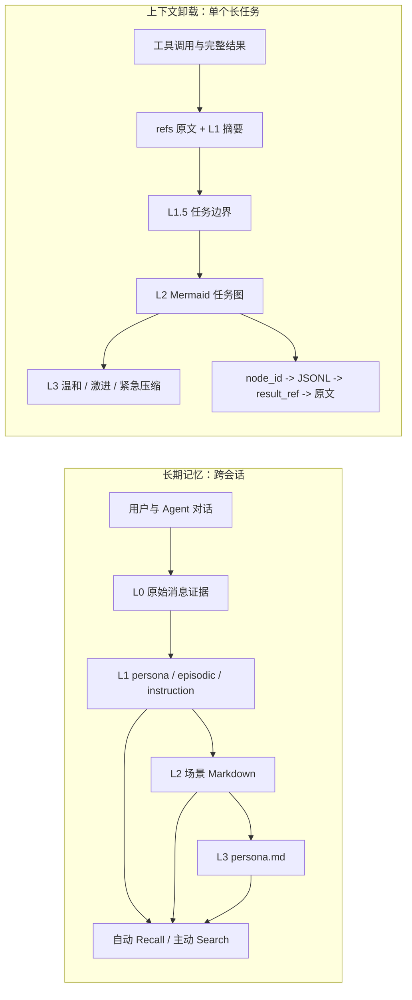
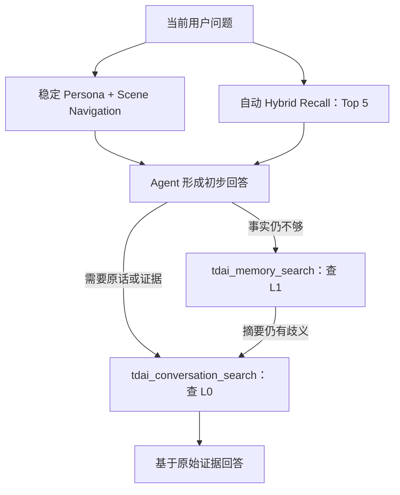
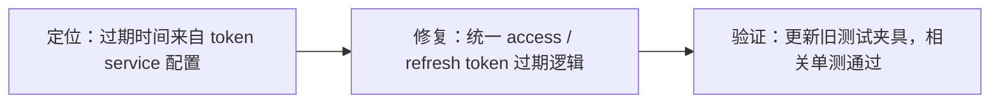

# AI 记忆系统全链路源码级深入分析

> 面试口径：这是公司内部的 Agent Memory 项目。下面所有结论都按当前源码能证明的事实来讲，不根据代码日期、仓库信息推断项目归属，也不把规划中的能力说成已经上线。

## 0. 先给结论：这个项目到底解决什么问题

我会先用一句话定义这个项目：**它不是简单给大模型外挂一个向量库，而是同时解决 Agent 的长期记忆和长任务上下文失控问题。**

这两个问题看起来都叫“记忆”，其实完全不是一回事：

- 长期记忆解决的是跨会话问题。比如用户偏好、历史经历、长期指令，下一次开新会话时还要能想起来。
- 上下文卸载解决的是单个长任务问题。比如 Agent 连续调用几十次工具后，原始日志把上下文塞满了，但任务进度、关键结论和原始证据又不能丢。

所以我把系统拆成两条独立但互补的链路：

1. **长期记忆链路**：L0 原始对话 -> L1 原子记忆 -> L2 场景块 -> L3 用户画像 -> 自动召回和主动检索。
2. **短期上下文链路**：完整工具结果 -> L1 工具摘要 -> L1.5 任务边界 -> L2 Mermaid 任务图 -> L3 分级压缩 -> 按需追溯原文。

最重要的设计原则可以概括成五句话：

1. **原始证据和抽象知识分开存。** 摘要可以错，原文必须能追。
2. **前台链路尽量轻，重处理放后台。** Embedding、抽取、去重、场景聚合不能卡住用户对话。
3. **检索不能只靠一种信号。** 精确词匹配用 BM25，语义相似用向量，再用 RRF 合并排名。
4. **压缩不是直接删除。** 先把原文外移，再保留摘要、任务图和引用关系，最后才按上下文压力替换或删除旧消息。
5. **失败时优先保住对话和证据。** 模型、Embedding、向量库、聚合任务失败时都允许降级，不能把主对话拖死。

## 1. 为什么普通 RAG 不够

如果只做“对话切块 + Embedding + 向量检索”，很快会遇到四类问题。

第一类是**噪声问题**。用户一句“好的”“继续”，或者模型输出的大段代码，都不适合作为长期记忆。直接切块会把大量低价值内容放进索引。

第二类是**语义层级问题**。原始对话只能回答“当时说了什么”，但很难直接回答“这个用户长期偏好什么”“最近主要在做哪些项目”。这需要从消息提炼到事实，再从事实组织成场景和画像。

第三类是**冲突和重复问题**。用户先说喜欢 Java，后来又说现在主要写 Go。纯向量库只知道两条都相似，不知道应该保留、跳过、更新还是合并。

第四类是**上下文容量问题**。RAG 解决的是从库里找资料，但长任务里已经进入 prompt 的几十万 Token 工具日志依然存在。检索做得再好，也不会自动把旧日志从上下文里移出去。

所以这个项目不是在一个向量库上做小修小补，而是把“记忆形成、记忆组织、记忆召回、上下文卸载、证据恢复”做成了一条完整的数据链路。

### 1.1 长上下文到底让什么变差

这是实际面试里被追得最细的问题之一。回答时不能只说“上下文越长准确率越低”，因为这句话太泛，也不严谨。更准确的拆法是：

- **精确约束容易被稀释。** 文件路径、参数值、否定条件、输出格式这类点状信息，被大量工具日志包围后更容易漏掉或混淆。
- **相似工具结果容易串扰。** 连续读取多个结构相似的文件时，模型可能把 A 文件的字段、错误码或配置归到 B 文件。
- **过期证据容易继续影响判断。** 早期失败尝试和后续成功结果同时留在上下文里，如果没有状态和时间关系，模型可能继续引用已经失效的结论。
- **重复噪声会被错误放大。** 同一报错因为多次重试反复出现，不代表它更正确，却可能让模型把它当成主要证据。

也不要反过来说“长了以后什么都会下降”。当前任务的大方向、最近几轮内容和高频主题通常仍然比较容易保持；真正高风险的是中远期的精确值、来源归属、先后状态和长期约束。

面试官继续问“给一个十几轮后的具体例子”时，应该讲自己真正复现或记录过的 bad case；如果没有可核验的线上案例，就明确说“我用一个可复现的例子说明”，不要把假设案例包装成生产事故。例如可以描述：先读调度配置，后读压缩配置，继续执行时把前一个文件的阈值误当成后一个文件的参数。重点不是编一个戏剧化故事，而是说清**输入里有什么干扰、模型错在什么字段、系统哪一层针对这个问题**。

对应关系是：精确约束和跨会话规则交给 L1/L3 沉淀；大量工具结果交给 Context Offload 外移；结果的新旧关系和任务阶段交给 MMD 组织；需要核对时再沿引用回到原文。

## 2. 两条链路的总体架构

这里最容易讲混的是两套 L0/L1/L2/L3 命名。它们属于不同命名空间，面试时必须先说明。



两条链路有三个共同点：

- 都是先保留证据，再生成抽象。
- 都把 LLM 放在可降级的后台处理位置，而不是让 LLM 输出直接成为唯一真相。
- 都保留了从高层摘要回到低层原文的路径。

但它们的生命周期不一样：长期记忆按用户和会话积累，面向未来会话；上下文卸载按当前 Agent 任务积累，主要服务当前长 Session。

## 3. 核心边界：为什么要有 TdaiCore

主入口是 `src/core/tdai-core.ts`。我会把 `TdaiCore` 定义成一个宿主无关的记忆内核，它对外主要提供：

- `handleBeforeRecall`：模型调用前召回记忆并准备注入。
- `handleTurnCommitted`：一轮对话提交后做 L0 捕获和后续调度。
- `searchMemories`：查 L1 结构化记忆。
- `searchConversations`：查 L0 原始对话。
- `handleSessionEnd`：会话结束时刷新未处理数据。

OpenClaw 插件和独立 Gateway 都接在这层上。这样设计的价值是：

- 记忆逻辑不依赖某个 Hook 框架。
- 插件模式和 Sidecar 模式能复用同一套存储、召回和调度逻辑。
- 测试时可以围绕 Core 验证，不需要每次启动完整宿主。
- 将来接新的 Agent 平台时，只需要实现 Host Adapter，不需要重写记忆流水线。

### 3.1 历史数据怎么接入

除了实时 Capture，Gateway 还提供 `/seed` 入口。历史会话会先经过输入校验、格式归一和时间补齐，再进入同一套 L0 到 L1 处理链路。

我不会另写一套“迁移专用记忆格式”，因为实时数据和历史数据如果走两套抽取逻辑，后续很容易在类型、来源 ID 和去重语义上分叉。Seed 的核心价值就是复用正式流水线，让已有会话也能成为同一种 L0 证据和 L1 记忆。

当前 Seed 虽然也挂接了 L2/L3 Runner，但执行结束只明确等待 L1 空闲，随后就销毁 Pipeline。也就是说，最新 L2 场景和 L3 Persona 可能还在处理中，不能承诺一次 Seed 返回时四层产物已经全部完成。

## 4. 数据到底怎么存

### 4.1 长期记忆的数据分层

| 数据层 | 主要载体 | 存什么 | 主要用途 |
| --- | --- | --- | --- |
| L0 | `conversations/YYYY-MM-DD.jsonl` | 原始用户和助手消息、消息 ID、会话标识、时间 | 审计、原话检索、L1 抽取依据 |
| L0 检索索引 | SQLite/TCVDB | 元数据、全文索引、向量 | 快速搜索原始对话 |
| L1 | `records/YYYY-MM-DD.jsonl` | persona、episodic、instruction 原子记忆 | 结构化召回、去重、场景聚合 |
| L1 检索索引 | SQLite/TCVDB | 记忆元数据、全文索引、向量 | 自动召回和主动搜索 |
| L2 | `scene_blocks/*.md` | 按工作、偏好、项目等场景聚合的记忆 | 提供主题上下文和导航 |
| L3 | `persona.md` | 稳定、紧凑的用户画像 | 每轮提供长期稳定背景 |
| 调度状态 | `.metadata/recall_checkpoint.json` | runner 游标、pipeline 计数和定时状态 | 增量处理、重启恢复、防重复 |

### 4.2 上下文卸载的数据分层

| 数据 | 典型文件 | 作用 |
| --- | --- | --- |
| 卸载索引 | `offload-<sessionId>.jsonl` | 保存摘要、`tool_call_id`、`node_id`、`result_ref` 等映射 |
| 原始结果 | `refs/*.md` | 保存经过基础清洗后的完整工具结果 |
| 任务图 | `mmds/*.mmd` | 保存当前任务及历史任务的 Mermaid 状态图 |
| 运行状态 | `state.json` | 当前活跃 MMD、压缩和任务边界状态 |
| 会话注册表 | `sessions-registry.json` | 会话和卸载文件之间的关系 |

一个 `OffloadEntry` 至少包含：时间、`node_id`、工具调用、摘要、`result_ref`、`tool_call_id`、`session_key` 和 `score`。

这里的 `score` 是 0 到 10 的“摘要可替代程度”，不是事实置信度。分数越高，说明原始结果越适合在 prompt 里被摘要替换；分数低，说明原文细节更可能仍然重要。

目录隔离粒度是 Agent：不同 Agent 进入不同子目录；同一个 Agent 的不同 Session 各自有 `offload-<sessionId>.jsonl`，但共享 `refs/`、`mmds/` 和 `state.json`。L2 会读取同一 Agent 目录下的多份 Offload JSONL，因此这里解决的是 Agent/Session 文件组织，不等于企业租户级授权隔离。

## 5. L0：原始对话怎么可靠地存下来

### 5.1 为什么按天写 JSONL

L0 使用 `conversations/YYYY-MM-DD.jsonl`，每行一条消息。所有 Session 可以共享当天文件，但每行都带 `sessionKey` 和 `sessionId`。

我选择这种方式，主要是因为：

- JSONL 追加写简单，单行损坏不会让整个文件不可读。
- 按天分片方便保留策略、人工排查和批量迁移。
- 不需要为大量短 Session 创建海量小文件。
- L0 本质是审计证据，追加日志比频繁更新一个复杂文档更合适。

它的代价也很明确：如果要按 Session 读取，不能只靠目录定位，必须依赖行内会话字段或 SQLite 索引；文件和数据库也会形成两套存储口径。

### 5.2 增量捕获怎么避免重复

捕获入口在 `src/core/hooks/auto-capture.ts`，记录逻辑在 `src/core/conversation/l0-recorder.ts`。

系统会优先根据缓存的消息数量做位置切片，只处理新追加的消息；如果位置判断不可靠，还会用每个 Session 的时间戳游标做兜底。

`CheckpointManager.captureAtomically()` 会把“读取游标 -> 执行捕获回调 -> 推进游标”放在同一个异步锁里。它能避免两个并发 `agent_end` 同时读到旧游标后重复处理，但这个锁只解决并发顺序，不代表捕获内容已经成功提交。

当前 `recordConversation()` 在 JSONL 追加失败时会记录错误，却仍可能把已经过滤出的消息返回给外层；外层随后仍可能推进 `last_captured_timestamp`。所以这里准确的结论是“单进程临界区被串行化，Checkpoint 文件用临时文件加 rename 更新”，不能说成“L0 写入与 Cursor 推进已经原子提交”。这个数据正确性缺口在 Q82 单独展开。

### 5.3 为什么要清洗后再存

记忆系统最危险的故障之一是“把自己注入的记忆再次记住”。如果 Recall 把 `<relevant-memories>` 放进用户 prompt，下一轮 Capture 又把整段增强后的 prompt 当成用户原话保存，就会形成自我强化的反馈循环。

当前实现做了几类处理：

- 尽量用缓存中的原始用户输入替换被增强过的用户消息。
- 去掉系统注入标签、记忆工具说明和已知框架噪声。
- 过滤 session bootstrap、reset 指令、预压缩提示、`NO_REPLY` 等非业务内容。
- Assistant 消息中的 fenced code block 不进入 L0 记忆捕获，避免大段代码污染检索。
- 对注入边界相关 XML 标签做转义，降低记忆内容突破 prompt 分区的风险。

这说明 Capture 不是简单地把消息数组 dump 到文件，而是先区分“用户真实表达”和“框架合成上下文”。

### 5.4 L0 文件、FTS 和向量怎么配合

以 SQLite 后端为例：

- `l0_conversations` 保存原始消息和元数据。
- `l0_fts` 用 FTS5 做关键词检索。
- `l0_vec` 用 sqlite-vec 做向量检索。

正常写入路径里，元数据和 FTS 同步完成，Embedding 通过后台 `embedBatch` 补齐。Embedding 慢或者暂时失败时，已成功落下的 JSONL、元数据和 FTS 仍可作为证据和关键词检索基础；但这句话只描述 Embedding 降级，不能反向证明 JSONL 追加失败时原始证据也不会丢。

关闭 Core 时会 drain 后台 Embedding 任务再关存储，避免进程退出时迟到写入打到已经关闭的数据库。

## 6. L1：怎么从聊天里抽出真正值得记的东西

### 6.1 L1 只保留三类记忆

L1 抽取入口是 `src/core/record/l1-extractor.ts`，Prompt 在 `src/core/prompts/l1-extraction.ts`。

系统只允许三类：

- `persona`：相对稳定的身份、偏好、习惯和能力特征。
- `episodic`：发生过的事件、项目经历和阶段性活动。
- `instruction`：用户希望 Agent 长期遵守的指令。

这三类的边界可以这样理解：

- “我主要写 Go”是 persona。
- “我上周完成了支付网关迁移”是 episodic。
- “以后代码评审先给风险再给总结”是 instruction。

临时任务指令、寒暄、低价值确认、模型自己推测出来的信息都不应该进入长期记忆。

### 6.2 为什么抽取时要分“新消息”和“背景”

Prompt 明确要求模型只从本批新增消息提取记忆，历史上下文只能帮助理解，不能重复抽取。

这是一个很关键的幂等意图。如果每次把整个 Session 都交给模型自由总结，同一条事实会在每批处理时反复生成。当前通过 L0 游标和 Prompt 双重约束限定增量范围，但还不能把它说成无遗漏保证：Q83 说明积压超过五十条时的倒序截取和单时间戳 Cursor 可能跳过更早消息，Q84 说明软失败也可能错误推进水位。

每条记忆还会保留 `source_message_ids`。它的价值是建立 L1 到 L0 的证据关系，后续可以解释“这条记忆来自哪几句话”。

但要注意一个真实边界：源码要求 LLM 返回来源 ID，不等于系统已经对每个 ID 做了严格的 L0 存在性和内容蕴含校验。面试时不能说成“完全杜绝模型幻觉”。

### 6.3 去重不是一个固定余弦阈值

当前去重是两阶段：

1. **候选召回**：优先用向量找相似记忆，向量不可用时退到 FTS5。
2. **批量 LLM 判断**：对新记忆和候选旧记忆做一次批量语义判断，返回 `store`、`skip`、`update` 或 `merge`。

四种动作分别表示：

- `store`：没有冲突，新增一条。
- `skip`：和已有记忆重复，不再写。
- `update`：新信息替代某条旧记忆。
- `merge`：把多条相关信息合成一条更完整的记忆。

为什么不直接用 `cosine > 0.92` 自动合并？因为高相似不等于同一事实。“我喜欢 Java”和“我不再喜欢 Java”向量可能很近，但语义是冲突的；“项目开始时间”和“项目完成时间”也可能属于互补信息。向量只负责缩小候选范围，最终动作需要结合语义关系判断。

如果向量和 FTS 都不可用，当前逻辑会跳过冲突检测并直接保存。它保证了可用性，但也意味着降级期间重复率可能升高。

### 6.4 L1 为什么要先写 JSONL，再写检索库

L1 Writer 会先把新的规范记录追加到 `records/YYYY-MM-DD.jsonl`，再写 VectorStore。

发生 update/merge 时：

- 检索库里的旧记录会被实时删除，新的规范记录成为 Recall 的当前真相。
- JSONL 仍然保持 append-only，旧版本不会因 update/merge 被原地回写删除，因此在保留期内保留审计历史；过期日期分片仍可能被 Cleaner 清理。

这形成了一个明确的双口径：

- **JSONL 是历史证据和审计日志。**
- **VectorStore 是在线检索真相。**

好处是任何一边失败都不容易让数据彻底丢失；代价是两边可能暂时甚至长期不一致。因此生产治理上需要对账、重建索引和孤儿记录清理，不能假设双写天然强一致。

## 7. L2：为什么还要做场景块

L1 是原子事实，适合检索，但不适合直接承担完整用户背景。假设一个用户有几百条工作记忆，单条召回只能看到局部，全部注入又太贵。

L2 在 `src/core/scene/scene-extractor.ts` 中把相关 L1 组织成场景 Markdown，例如工作项目、技术偏好、沟通习惯等。它不是简单聚类，而是允许 LLM 创建、更新或合并场景文件。

当前实现有几层约束：

- 默认最多 15 个场景，接近上限时 Prompt 会更强地要求更新或合并，而不是继续创建。
- LLM 没有任意命令执行权限，只能在限定目录内操作场景文件。
- 删除通过 `[DELETED]` 软标记表达，后处理再清理被软删除或只有 META 的文件。
- 文件名会规范化，再重建 scene index。
- 生成前备份 `scene_blocks/`，失败时恢复备份。

这里的核心思想是：**L1 负责可检索的细粒度事实，L2 负责把事实组织成可阅读、可导航的主题块。**

## 8. L3：Persona 怎么生成，为什么要保守

L3 在 `src/core/persona/persona-generator.ts` 中生成 `persona.md`。它不是把所有记忆重新总结一遍，而是：

- 读取现有 persona，但先去掉 scene navigation。
- 只加载自上次生成后变化的场景块。
- 区分首次生成和增量更新。
- 把画像正文限制在大约 2000 字符内。
- 去掉 LLM 自己写入的导航，转义危险 XML 标签，再由程序附加最新 scene navigation。
- 生成前备份旧 persona，任务失败时保留旧版本。

为什么导航一定由程序生成？因为场景文件可能重命名、合并或删除，如果让 LLM 自由维护链接，很容易出现旧链接和虚构文件。程序根据实际 scene index 重建导航，确定性更强。

Persona 的触发优先级包括：

- 用户显式要求更新。
- 冷启动时已有场景文件。
- persona 缺失或损坏后的恢复。
- 第一次场景抽取完成。
- 自上次画像生成后新增记忆达到阈值，默认是 50 条。

必须讲清楚一个限制：当前 Persona 仍然是 LLM 编写的 Markdown。源码里没有可证明的“稳定字段级锁”和“字段级冲突回滚”，所以不能说它已经像结构化主数据那样严格一致。

### 8.1 抽取准确性和冲突治理：当前实现、真实缺口、下一版

这部分在多场实际面试里都被追问过，也是最容易把理想方案说成现状的地方。先把事实摆清楚：

| 问题 | 当前实现能证明什么 | 当前不能说成已实现 | 下一版可以怎么补 |
| --- | --- | --- | --- |
| 抽取有没有原文来源 | L1 要求返回 `source_message_ids`，L0 保留对应消息 | 没有逐条验证来源 ID 一定存在，也没有验证记忆内容一定被原文蕴含；这不等于严格 span 校验 | 校验 ID 存在性，再做原文蕴含判断；失败条目进入隔离区 |
| “置信度”怎么计算 | L1 有 `priority`，表示重要程度；Offload 有 `score`，表示摘要可替代程度 | 两者都不是事实置信度；当前没有“基础分 + 频次 - 冲突惩罚”的置信度字段和公式 | 单独增加 evidence confidence、来源数、最近确认时间和冲突状态，不能复用 priority |
| 新旧事实冲突怎么办 | 先召回相似候选，再由 LLM 判断 `store/skip/update/merge`；update/merge 会替换在线 Store 中的旧记录 | 没有可变/不可变属性 Schema、自动过期标记、冲突候选区或多次确认后晋升机制 | 先做实体、属性和作用域识别，再区分可变状态与稳定属性；无法判定时并存且降权 |
| 错误记忆能不能回滚 | L0、L1 JSONL 留有证据和追加历史，在线 Store 保留当前规范记录 | 没有完整的用户纠错工作流、隐式反馈回流和一键恢复旧版本能力 | 把纠错建成审计事件，支持查看来源、撤销、重新抽取和索引重建 |
| 是否依赖用户确认 | 当前流水线没有“遇到冲突就弹窗确认”的机制 | 不能说公司当前通过用户确认保证正确，也不能说隐式反馈已经自动闭环 | 普通冲突不打断用户；高风险场景可选择性确认，同时利用明确纠正语句作为后续信号 |
| 能否保证被遗忘权 | 有按保留期清理和部分 Profile 删除能力 | 不能保证一次请求已覆盖 L0/L1、索引、Scene、Persona、refs、MMD 和备份 | 做用户级删除编排、幂等重试、引用扫描和最终删除证明 |

面试时可以直接这样答：

> 当前不是靠一个“置信度分数”兜底。我们已经做的是增量抽取、来源 ID、候选召回加 LLM 四动作判断，以及原始记录可追溯。真实缺口是来源还没有硬校验，priority 也只是重要度，不是事实可信度；多次确认晋升、可变/不可变属性冲突和隐式反馈闭环都是下一版治理方案。我宁可把边界讲清楚，也不把 Prompt 约束说成确定性校验。

这个回答比“我们有 span、置信度、冲突检测、用户确认五层防护”更可信，因为后一句混在了一起：其中有当前能力，也有尚未实现的理想设计。

## 9. 后台调度怎么设计

### 9.1 为什么不能每轮都跑 L1/L2/L3

如果每轮对话都调用三次 LLM，会带来成本、延迟和重复抽取。当前调度把它们拆成不同节奏：

| 阶段 | 默认触发策略 |
| --- | --- |
| L1 | 暖启动批次阈值 `1 -> 2 -> 4 -> 5`，稳定后每 5 个 conversation；或空闲 600 秒；或会话结束/进程退出刷新 |
| L2 | L1 完成后延迟 10 秒；同 Session 最小间隔 900 秒；最大间隔 3600 秒 |
| L3 | 新记忆累计 50 条，或显式、冷启动、修复等高优先级条件 |

暖启动的 `1 -> 2 -> 4 -> 5` 是每一批的触发阈值，不是绝对第 1、2、4、5 轮。第一次尽快产出记忆，随后逐步放大批次，最后进入稳定吞吐。

### 9.2 L2 的 downward-only timer

L2 定时器只能被提前，不能被推迟。

例如已经计划 30 分钟后跑一次，又完成了一批重要 L1，那么可以把它提前到 10 秒后；但新的事件不能把一个已经更早的定时任务往后顺延。这样既能在有新记忆时尽快聚合，又不会因为持续有新消息导致 L2 永远被 debounce 掉。

最小间隔防止频繁重写场景，最大间隔保证活跃 Session 最终一定会聚合。

### 9.3 串行队列和全局 L3

L1、L2、L3 都使用 `SerialQueue`，避免同一阶段并发修改游标或文件。

L3 还限制为全局并发 1，并用 pending 标记合并重复触发。原因是 Persona 是全局汇总文件，如果多个 Session 同时重写，最后写入者可能覆盖前一个 Session 刚生成的画像。

这里仍然有一个边界：跨 Session 的 L1 语义去重不是一个全局事务。两个 Session 同时召回到同一份旧候选，都可能各自判断应该新增，最终产生重复记录。下一版可以考虑按用户做更细的全局写入串行化，或者在 Store 层加入稳定语义键和乐观并发控制。

## 10. Checkpoint 怎么保证重启后接着跑

Checkpoint 文件是 `.metadata/recall_checkpoint.json`，状态刻意拆成两部分：

- `runner_states`：L0 捕获游标、L1 消费游标、最近场景等数据处理进度。
- `pipeline_states`：累计会话数、暖启动阈值、L2 pending 和调度状态。

为什么要拆？因为 Runner 和 Scheduler 是不同写入方。如果它们各自拿一份旧 JSON 全量覆盖，就可能把对方刚更新的字段写回旧值。拆分状态所有权后，每个模块只更新自己负责的部分。

并发和持久化上还做了三件事：

- 同一 checkpoint 文件在多个 `CheckpointManager` 实例之间共享异步锁。
- 文件更新用 tmp + rename，降低写一半进程崩溃造成损坏的概率。
- Scheduler 启动用共享的 in-flight Promise 防重，避免并发启动时重复初始化和覆盖状态。

这套设计实现的是“可恢复的增量处理”，但不是分布式一致性协议。如果同一数据目录被多个独立进程同时写，单进程内异步锁并不能替代跨进程文件锁或数据库事务。

## 11. 记忆怎么取：自动 Recall 全链路

### 11.1 Recall 的输入和超时

自动召回在 `src/core/hooks/auto-recall.ts` 中执行。默认配置是：

- 最大结果数 5。
- 检索策略 `hybrid`。
- 分数阈值 0.3。
- 整体超时 5000 毫秒。
- `maxCharsPerMemory=0` 和 `maxTotalRecallChars=0`，表示默认没有额外字符上限。

Recall 会先清洗用户查询，再调用后端检索。超时就跳过本轮注入，不能因为“想起历史”而阻塞当前对话。

默认字符预算关闭是一个真实风险：虽然结果条数只有 5 条，但单条异常长记忆仍可能占用较多 prompt。生产配置里应该基于模型上下文和任务类型显式设置单条、总量 Token 或字符预算。

### 11.2 关键词检索

本地关键词检索走 SQLite FTS5 和 BM25 排名。中文文本在可用时会先用 jieba 分词，提高中文词项命中。

当前实现没有在 FTS 不可用时退回 O(N) 内存扫描。这是合理的可用性取舍：宁可本轮少召回，也不在主链路突然全表扫描把延迟打爆。

对于很小的结果集，绝对 BM25 分数有时不稳定，代码会更信任 FTS 的匹配排名，而不是机械套一个阈值把唯一相关结果过滤掉。

### 11.3 向量检索

向量检索把查询编码成向量，用余弦相似度找语义相关内容。它擅长处理用户换了一种说法、关键词不完全重合的情况。

它依赖 Embedding 服务和向量表能力。Embedding 不可用时，系统仍然可以用 FTS；如果本地连 FTS 都不可用，本轮召回会退化，而不是扫描全部 JSONL。

### 11.4 本地 Hybrid 和 RRF

本地 Hybrid 会并行取 FTS 候选和向量候选，候选数通常是最终 `maxResults * 3`，再按记录 ID 用 RRF 合并：

```text
RRF(record) = Σ 1 / (60 + rank + 1)
```

RRF 不直接比较 BM25 分数和余弦分数，只比较各自列表中的名次。这样避免了两种分数尺度完全不同的问题。

一个同时出现在关键词榜和向量榜前列的记录，会获得两部分分数相加，自然排到前面。

这里有三个不能说错的点：

- 当前没有默认 `RRF > 0.01` 的硬截断。
- RRF 只按同一个 record ID 去重，不会把两个不同 ID 的语义重复记忆自动合并。
- 当前本地 Hybrid 的 RRF 排名不等于对最终结果再次应用统一的 `scoreThreshold`，阈值语义在不同策略下并不完全一致。

### 11.5 TCVDB 后端

云向量后端使用原生 Hybrid Search，把 dense、sparse 和 RRF 放在服务端完成。Sparse 向量由客户端 BM25 Encoder 编码，dense 可以由服务端生成，因此代码里会出现 `NoopEmbeddingService` 这种占位实现。

本地 SQLite 和 TCVDB 的差别可以这样讲：

| 维度 | SQLite | TCVDB |
| --- | --- | --- |
| 部署 | local-first，依赖少 | 需要远端服务配置 |
| 关键词 | 本地 FTS5/BM25 | Sparse 检索 |
| 向量 | sqlite-vec | 服务端 dense 检索 |
| 融合 | 客户端 RRF | 服务端原生 Hybrid/RRF |
| 规模扩展 | 适合单机和个人 Agent | 更适合集中式和横向扩展场景 |
| 故障边界 | 本地文件/进程 | 还要考虑网络、鉴权和服务端可用性 |

不能笼统说“云后端挂了会自动退本地 FTS”。只有实际同时配置并维护了本地 Store，才有这个降级基础；当前后端抽象本身不等于双后端自动主备。

## 12. 召回内容为什么分两处注入

召回内容分成动态部分和稳定部分：

- 本轮查询相关的 L1 记忆放在 user prompt 前缀。
- 稳定 Persona、完整 Scene Navigation 和记忆工具说明放在 system prompt 后缀。

这样做不仅是语义分区，还有 Prompt Cache 的考虑。Persona 和导航变化频率低，放在稳定的 system 区域更容易命中缓存；每轮都变的 L1 相关记忆放在用户侧，避免把整个 system prompt 的缓存前缀打穿。

注入并不是越多越好。自动 Recall 只应该给当前问题最相关的少量事实，剩余信息让 Agent 通过工具主动取。

## 13. 自动召回不够时，Agent 怎么主动查

系统提供两个主动工具：

- `tdai_memory_search`：查 L1 结构化记忆，可以按 type 和 scene 过滤。
- `tdai_conversation_search`：查 L0 原始对话，可以按 Session 过滤。

工具指南限制一轮最多总共调用 3 次，防止 Agent 反复搜索把延迟和 Token 成本拖高。

这两个工具的职责要分清：

- 问“我长期偏好什么”“以前做过哪些项目”，先查 L1。
- 问“我当时原话怎么说”“那条报错完整内容是什么”，查 L0。
- 如果 Persona 导航里有明确场景，Agent 还可以沿导航读取对应 `scene_blocks/*.md`。

这里要专门纠正面试复盘里常见的一句话：“L3/L2 常驻，L1 按需，L0 兜底。”它只能当抽象思路，不能当当前实现的精确描述。当前自动注入的是：

- L3 Persona 正文和完整 Scene Navigation 放在稳定的 system 区域。
- 与本轮 query 相关的少量 L1 记忆放在 user 前缀，默认最多 5 条。
- L2 场景正文不是每轮全量常驻；Agent 根据导航按需读取具体场景。
- L0 也不会自动全量下钻；需要原话时，由 Agent 调 `tdai_conversation_search` 主动检索。

所以更准确的口语答案是：

> 默认只给模型稳定画像、场景目录和少量相关 L1，不把 L2 正文和 L0 原话全部塞进去。信息不够时先沿场景导航或搜 L1；涉及原话、争议和精确证据时再搜 L0。保存可以完整，注入一定要稀疏。

整个召回漏斗是：先用稳定画像给方向，再自动召回少量相关事实，不够时搜 L1，要求原话时下钻到 L0。



## 14. Context Offload：为什么它是另一套系统

长期记忆处理的是用户知识，Context Offload 处理的是工具执行轨迹。它默认关闭，因为它会修改进入模型的消息上下文，属于影响行为更大的能力，应该显式开启和验证。

它的核心目标不是“把所有日志总结一下”，而是做到：

1. 完整工具结果先落盘。
2. Prompt 中逐渐只保留轻量摘要。
3. 多个工具步骤聚合成任务图。
4. 上下文接近上限时，按压力分级替换或删除旧消息。
5. Agent 需要精确细节时，仍然能从任务图追溯到原文。

这也回答了“它是不是让模型窗口变大”和“宿主已经有 compact，为什么还要做”两个实际追问：它**不会改变模型的物理上下文上限**，只是重新安排固定窗口里的热数据。宿主自带的通用 Compaction 和本系统也不是非此即彼：通用 Compaction 负责把整段会话继续压短；这里重点管理高体积 Tool Result，并保留 `tool_call_id -> node_id -> result_ref` 的恢复链。Mermaid 只负责任务状态和导航，不应该被单独包装成压缩算法。

比较外部产品时不要说“对方一定是黑盒截断、没有证据恢复”，除非手里有对应版本的可核验资料。最稳的表述是：

> 我不评价宿主内部没公开的实现。我能证明的差异是，我们这层可以独立配置、能看到每次替换和删除、完整工具结果落在 refs，并且有明确引用路径。宿主原生 compact 仍然可以作为更上层的兜底，两者职责不同。

### 14.1 三种运行模式

| 模式 | L1/L1.5/L2 在哪执行 | 是否启用这套 L3 Context Engine | 适合什么场景 |
| --- | --- | --- | --- |
| `local` | 插件通过 AI SDK 调本地配置的模型，未单配时可回落到主 Agent 模型 | 启用 | 本地部署、依赖少、先验证能力 |
| `backend` | 通过远端 Backend 服务调用 | 启用 | 统一模型配置、集中服务和治理 |
| `collect` | 仍异步执行 L1/L1.5/L2，要求 Backend | 不注册这套 Context Engine，不做 L3 压缩和 MMD 注入，沿用原有 compaction | 只采集和评估，不改变当前上下文行为 |

没有可用 LLM Client 时，L1/L1.5/L2/L4 会关闭，但 L3 压缩逻辑仍可能存在于已注册的上下文链路中。这里必须依赖启动日志和运行模式确认，不能只看 `offload.enabled` 就假设所有层都正常工作。

## 15. Offload L1：工具结果怎么外移

### 15.1 工具调用和结果必须先配对

after-tool hook 会把 `tool_call` 和对应 `tool_result` 配成一组。这样做是为了保持消息结构合法：不能只删结果不删调用，也不能把结果挂到错误的调用 ID 上。

Pending Pair 默认达到 4 组会强制触发 L1。当前 flush 固定使用 `L1_BATCH_SIZE=5`，即使一次积累了很多 Pair，也会拆成多次、每次最多 5 对的请求。

配置里虽然还定义了默认 `maxPairsPerBatch=20`，但当前这段实际 flush 没有用它控制 LLM 请求大小。这是一个配置与实现不完全收口的维护点，面试时应该按实际 5 对来讲。

### 15.2 先存原文，再让 LLM 总结

每个完整工具结果会先经过基础清洗并写入 `refs/*.md`，然后 LLM 才生成摘要。成功后写入 `OffloadEntry`，并按 `tool_call_id` 去重。

顺序必须是“原文先落盘”：如果先摘要、后保存原文，那么进程在两步之间退出，会只剩一段无法验证的摘要。

L1 摘要调用最多重试 3 次。连续失败后也不会丢结果，而是生成一个降级 Entry：

- 摘要使用截断后的内容。
- `score=0`，表示不应该轻易用这个摘要替换原文。
- `result_ref` 继续指向完整原始文件。

这体现了系统的故障优先级：摘要质量可以降级，证据链不能断。

## 16. L1.5：怎么识别任务边界

Agent 在同一个 Session 里可能先修登录问题，再查数据库慢 SQL。两段日志不能都塞进同一张 Mermaid 图，所以 L1 和 L2 之间增加了 L1.5。

L1.5 会比较当前用户意图、活跃 MMD 和最多 10 个历史 MMD，判断：

- 上一个任务是否已经完成。
- 当前是否是原任务的继续。
- 当前任务是不是长任务，值不值得建 MMD。
- 新任务应该叫什么。

边界最终会映射成一段 OffloadEntry 索引范围和目标 MMD 文件。

如果任务切换，系统会先刷新旧任务剩余但还没达到 L2 阈值的 Entry，再激活新 MMD，避免旧任务最后几步永远没有进入图。

L1.5 有一次重试；仍失败时会按短任务做 fail-safe，并关闭这段的 MMD 处理。这个策略保住主任务，但可能让一次真实长任务失去图结构。

## 17. Mermaid 节点到底怎么划分

这是项目最容易被追问的地方。先给结论：**不是一个工具调用一个节点，而是按任务意图、阶段和结论聚合成宏观节点。**

### 17.1 节点划分原则

一组工具调用满足下面条件时，倾向合并到同一个节点：

- 服务于同一个意图。
- 只是重复查询、翻页、读取相邻文件等例行步骤。
- 产出的结论可以用一句稳定摘要表达。
- 中间步骤没有形成独立决策或关键证据。

出现下面情况时，倾向拆成新节点：

- 任务进入新阶段，例如从定位问题转到实现修复。
- 出现改变后续方向的关键发现。
- 形成了可以独立复用的结果。
- 出现有价值的失败路径，需要保留为 `blocked` 墓碑，防止以后重复踩同一条路。

节点摘要优先控制在约 150 个中文字符内，只写已经发生的事实和当前状态，不提前创建尚未发生的计划节点。状态可以是 `done`、`doing`、`paused` 或 `blocked`。整张图目标控制在约 4000 字符，避免“为了压缩生成了一张更大的图”。

### 17.2 Tool Call 和节点的基数关系

每个 `tool_call_id` 必须映射到一个节点，但一个节点可以包含多个工具调用，所以关系是：

```text
多个 tool_call_id  ->  一个 node_id
一个 tool_call_id  ->  不能同时属于多个 node_id
```

小更新用 `replace` 局部修改现有图，大规模结构调整才用 `write` 重写整张图。

### 17.3 一个具体例子

假设 Agent 做了这些工具调用：

1. 搜索登录接口。
2. 读取 controller。
3. 读取 token service。
4. 搜索 refresh token 配置。
5. 修改 token 过期逻辑。
6. 运行单测失败，发现测试夹具仍用旧配置。
7. 修改夹具并重跑通过。

合理的节点不是 7 个，而可能是：



前四次读取和搜索都服务“定位配置来源”，可以合成 N1；修改形成 N2；测试失败虽然是中间问题，但它改变了验证工作，可以和最终修复测试一起写进 N3。

## 18. L2 什么时候触发，映射失败怎么办

L2 默认有两个触发条件：

- 同一个长任务下，符合条件且 `node_id=null` 的 Entry 达到 4 条。
- 距离上次处理达到 300 秒，并且出现了新的可处理 Entry。

系统会跳过 heartbeat，只处理被 L1.5 判定为长任务的边界，按目标 MMD 分组，按 `tool_call_id` 去重，单批最多处理 30 条左右。

送给 L2 前，待处理 Entry 会先标成 `wait`，避免同一批被并发调度重复取走。L2 返回 `node_mapping` 后，再把每个 `tool_call_id` 回填成具体 `node_id`。

如果映射失败，默认 120 秒后重试。兜底逻辑可能使用本批最常见的节点，或者 MMD 中最新节点。

这个兜底能避免 Entry 永久悬空，但有明显风险：它可能把一条证据挂到错误节点。下一版更稳妥的做法是：

- 回填前验证 `tool_call_id` 覆盖率和节点存在性。
- 未映射条目保持 unresolved，而不是猜一个节点。
- 后台做语义重对齐，并给低置信映射打标。

这些是改进建议，不能说成当前已经完整实现。

## 19. 系统怎么判断需要追溯原始工具结果

这里必须纠正一个容易想当然的说法：**当前没有一个独立的“是否需要原文”分类器。**

系统做的是把可追溯关系暴露给 Agent：

```text
Mermaid node_id
  -> offload JSONL 中同 node_id 的 Entry
  -> Entry.result_ref
  -> refs/*.md 完整工具结果
```

Agent 先看到任务图和摘要。如果当前问题只需要“做到了哪一步”，摘要就够了；如果需要下面这些细节，Agent 会主动沿引用下钻：

- 精确报错文本或错误码。
- 文件行号、参数值、命令输出。
- 摘要里被省略的边界条件。
- 两条摘要互相冲突，需要回到原文判断。
- 要引用证据，而不是只给概括结论。

所以“确定要不要回溯”本质上是 Agent 基于当前任务和可见摘要做推理，不是存储层自动猜测。存储层的职责是保证一旦要追，链路是确定的。

如果希望把它进一步工程化，可以增加一个受控的 detail-needed 策略：基于问题类型、摘要缺失字段、冲突标记和工具 schema 决定是否自动读取原文。但这属于下一版设计。

## 20. L3 上下文压缩：温和、激进和紧急

上下文窗口优先读取模型实际配置，取不到时默认按 200,000 Token。系统还会估算 system prompt 和 tool schema 开销，缺少实测缓存时默认按 12%。MMD 总预算默认不超过窗口的 20%。

当前精确计数模式默认使用 tiktoken 的 `cl100k_base`。它是工程估算，不保证和所有模型的真实 tokenizer 完全一致，所以阈值必须保留安全余量，不能等到理论上的 100% 才处理。

如果面试官换一个 128K、200K 或其他窗口的模型追问“到多少 K 开始压”，不要现场拍一个固定 K。当前实现按窗口比例算，先从模型配置取得窗口，再换算三档阈值；真正上线还要给 system prompt、tool schema、下一轮最大输出和 tokenizer 偏差预留空间。也就是说 50%/85%/95% 是当前默认策略，不是对所有模型都最优的行业定律。

### 20.1 温和压缩：50%

当上下文使用达到约 50% 时，系统开始把高可替代分数的旧 tool result 换成摘要和引用。

它会从高分开始选，必要时逐步把分数阈值从 7 降到 1，同时保护用户消息和最近尾部，保证调用与结果结构仍然合法。

这一步主要是替换，不是大段删除。目标是尽早减缓上下文增长速度。

### 20.2 激进压缩：85%

达到约 85% 时，仅替换高分结果往往不够。系统会删除更老的消息范围，同时注入相关历史 MMD，让模型仍然知道之前完成了什么、为什么走到现在。

激进压缩按消息边界和调用结果对处理，不能从中间切断一个 tool call/result 结构。

当前删除逻辑会保护最后一条真实用户消息不被头部删除，但更早的用户消息并不是永久不可删除。面试时不能把它说成“所有用户消息绝对保留”。

### 20.3 紧急压缩：95% -> 60%

达到约 95% 时触发最后的进度保护，持续删除到大约 60%。这一步的目标不是信息最优，而是避免下一次模型调用直接超过上下文上限。

必须承认它仍然是有损的。即使原始结果留在 `refs`，模型当前能看到的对话组织、措辞和局部关联可能已经消失；如果任务图或映射本身不准，恢复质量也会受影响。

Emergency 的目标是“先让下一次模型调用还能发生”，不是保证语义等价。头部删除被最后一条用户消息挡住时，代码还会尝试删除体积较大的非用户工具组，必要时截断超大消息。因此能承诺的是结构上尽力保住最近用户意图和工具配对，不能承诺旧对话每一句都保留。

### 20.4 为什么不能只靠模型自动 Compaction

如果通用 Compaction 采用“把整段历史压成一篇摘要”的策略，会有这些问题：

- 摘要粒度不可控。
- 很难定位某个工具结果的原始证据。
- 多任务混在一起时容易串线。
- 压缩后的摘要继续被摘要，会逐轮丢细节。

当前方案通过 refs、Entry、node_id 和 MMD 保留结构化索引，让压缩不再是一次不可逆的“黑箱总结”。

## 21. 中断和恢复怎么工作

恢复不是把所有原始日志重新塞回 prompt，而是按层恢复：

1. 读取 `state.json` 和 `sessions-registry.json`，定位当前 Session 和活跃 MMD。
2. 把当前任务图注入上下文，先恢复任务目标、已完成阶段、关键结论和阻塞点。
3. 读取 `offload-<sessionId>.jsonl`，恢复节点到工具调用、摘要和原文引用的映射。
4. 只有当前步骤需要精确细节时，才读取对应 `refs/*.md`。

这叫“先恢复工作集，再按需恢复证据”。如果重启就把全部 refs 重新注入，之前节省的 Token 会一次性全部反弹。

## 22. 一致性模型：哪些是强的，哪些是最终一致

| 环节 | 当前保证 | 不能过度承诺的地方 |
| --- | --- | --- |
| L0 捕获游标 | 单文件共享异步锁，读写游标临界区串行 | 不是多进程分布式锁 |
| Checkpoint 写入 | tmp + rename，runner/pipeline 状态分区 | 磁盘和跨进程异常仍需恢复策略 |
| L0/L1 文件与 Store | 文件优先，Store 失败可降级 | 两边不是原子双写，可能漂移 |
| L1 去重 | 候选召回 + LLM 四动作 | 跨 Session 同时写仍可能重复 |
| L2 场景 | 串行、备份、失败恢复 | LLM 内容质量不是确定性的 |
| L3 Persona | 全局并发 1、pending 合并、备份 | 没有结构化字段级冲突锁 |
| Offload 映射 | tool_call_id 去重、wait 状态、回填 | fallback 可能误挂 node_id |
| Tool 消息压缩 | 保持 call/result 结构 | 紧急压缩仍然有损 |

总体上这是一套“证据优先、在线可用、后台最终一致”的系统，不是要求每层同步事务提交的强一致系统。

## 23. 失败和降级矩阵

| 故障 | 当前行为 | 用户影响 | 后续治理重点 |
| --- | --- | --- | --- |
| Embedding 超时/失败 | L0/L1 元数据和 FTS 仍写，向量暂缺 | 语义召回变弱，主对话继续 | 后台补嵌入、监控欠账量 |
| FTS 不可用 | 尝试向量；不会 O(N) 扫 JSONL | 精确词召回变弱 | 启动自检和索引重建 |
| L1 抽取失败或坏 JSON | Provider 异常可能变成 `success=false`，解析失败可能变成空数组；当前 Runner 未可靠做成功门禁，Cursor 仍可能推进 | 这批消息可能静默漏抽，且不会自动重试 | 区分合法空结果与失败，成功后再提交 Cursor，并增加重试、死信和游标审计 |
| L1 去重服务失败 | 可能跳过去重直接存 | 重复记忆增加 | 离线去重和冲突审计 |
| Store 写失败 | JSONL 证据保留 | 在线 Recall 暂时查不到 | 对账和重放工具 |
| L2 生成失败 | 恢复 scene backup | 场景暂不更新 | 记录失败批次并重试 |
| L3 生成失败 | 旧 Persona 继续使用 | 画像短期过期 | 失败告警和手动重建 |
| Recall 超过 5 秒 | 跳过本轮注入 | 本轮回答可能缺历史 | 分后端延迟指标、熔断 |
| Offload L1 连续失败 | 截断摘要、score=0、原文 ref 保留 | 压缩空间变小 | 重试队列和模型质量监控 |
| L1.5 失败 | 该段按短任务处理，不建 MMD | 长任务恢复能力下降 | 边界评测、人工可纠正标签 |
| L2 node mapping 失败 | 延迟重试，最后可能启发式挂节点 | 证据可能错挂 | unresolved 状态和映射校验 |
| 上下文接近上限 | 进入 emergency，压到约 60% | 可能丢局部语境 | 提前触发、保护关键节点 |
| Offload 文件损坏/被清理 | 引用链可能断 | 无法恢复某些原文 | 校验和、引用完整性扫描、备份 |

## 24. 清理、保留和磁盘治理

长期记忆清理按本地自然日计算保留窗口，扫描 `conversations` 和 `records` 日期分片；数据库侧也按 cutoff 删除过期记录。

代码里有最小保留量保护：

- L0 总量不超过 50 条时跳过数据库过期删除。
- L1 总量不超过 20 条时跳过数据库过期删除。

这个保护避免配置错误一把清空小数据集，但也意味着 TTL 不是绝对删除承诺。真正做合规删除时，不能只依赖当前 Cleaner 的“保底保留”策略。

Context Offload 有独立 Reclaimer，保留天数低于 3 时不启用回收。它会分步骤清理：

- 过期 `offload-*.jsonl`。
- 没有被存活 JSONL 引用且已过期的 `refs/*.md`。
- 过期 MMD，同时保护活跃 MMD。
- 过大的 debug log。
- 失效的会话注册表条目。

每一步独立 try/catch，一步失败不阻塞后续步骤。

需要继续完善的治理包括：删除请求在 L0、L1、FTS、向量、L2、L3、offload refs 和备份之间的完整传播；孤儿引用定期扫描；加密、访问审计和不同敏感级别的保留策略。

## 25. 安全和隐私边界

### 25.1 Prompt Injection

当前实现会清理已知注入段、过滤框架噪声、转义可能突破 `<user-persona>` 等边界的标签。这能降低记忆回灌和标签逃逸风险。

但这不是完整的内容安全系统。恶意指令可能以自然语言存在于历史记忆或工具输出里，单纯转义 XML 标签挡不住语义级 Prompt Injection。更完整的方案应该把“记忆事实”和“可执行指令”分权限处理，并对 instruction 类型设置更严格的来源和确认策略。

同样，`sanitizeText` 主要处理注入标签、框架元数据、媒体噪声、Base64 图片和控制字符，不是完整的 PII、API Key、Token 或密码识别器。把 Tool Result 写入 refs 之前调用它，不能等价成“敏感信息已经脱敏”。

### 25.2 Gateway

Gateway 暴露 `/recall`、`/capture`、`/search/memories`、`/search/conversations`、`/session/end` 和 `/seed` 等接口。

它支持 Bearer API Key，并使用 `timingSafeEqual` 做等长密钥比较；CORS 可以配置 allowlist。`GET /health` 始终无需鉴权，方便健康检查。

关键边界是：API Key 未配置时，除 health 外的接口也会保持开放兼容行为，只在启动日志里明确警告。若绑定非 loopback 地址又没配 Key，存在真实暴露风险。

### 25.3 多租户

有 `sessionKey`、`sessionId`、`userId` 字段，不代表已经完成多租户隔离。当前 `TdaiCore.handleBeforeRecall` 中 `actorId` 仍传入 `default_user`，这说明真实多用户身份传播还没有完全收口。

要做到企业级多租户，还需要：

- 请求身份经过可信认证后传到 Core，不能信任客户端随便填的 userId。
- Store 查询和写入强制带 tenant/user scope。
- 文件目录、向量集合、Profile 和 Offload 数据按租户隔离。
- 删除、导出、审计和密钥轮换都按租户授权。
- 防止一个 Session 通过工具参数搜索另一个用户的 L0/L1。

所以面试时我会说“当前具备会话标识和部分用户字段，完整 RBAC 与租户隔离是明确的生产化边界”，不会说“天然支持多租户”。

## 26. Profile 同步：L2/L3 怎么在本地和 Store 间同步

`src/core/profile/profile-sync.ts` 会给 L2/L3 文件生成稳定 ID，并用内容 MD5 和版本基线判断变化。

拉取时会先写临时目录，验证内容 MD5，再整体替换本地 `scene_blocks` 和 `persona.md`，随后重建 scene index 和导航。并发 rename 竞争时，允许另一个等价拉取结果胜出。

推送时只同步相对 baseline 发生变化的 Profile，并删除远端已经不存在于本地的旧 Profile。

这个设计降低了部分写入造成的半成品状态，但 MD5 只是完整性校验，不是安全签名；baseline version 也需要后端真正执行乐观并发语义，才能避免跨节点覆盖。

## 27. 可观测性应该看什么

项目里有本地 Reporter，按 JSON 记录 `METRIC` 事件，带 instanceId、插件版本和时间；上报失败不会阻塞业务。

Context Offload 的状态报告还会记录：

- 压缩前后 Token 和消息数。
- 本次、累计节省量。
- Mild 替换数、Aggressive 删除数、Emergency 次数和删除数。
- Context Window、触发阈值和使用率。
- 当前活跃 MMD、pending 数、已确认和已删除条目数。
- Prompt patch 是否生效。

如果面试官问生产监控，我会按四层讲：

| 层 | 重点指标 |
| --- | --- |
| Capture | 新消息数、去噪数、重复捕获数、Checkpoint 推进延迟 |
| Memory Pipeline | L1/L2/L3 成功率、队列等待、抽取条数、去重动作分布、Embedding 欠账 |
| Recall | 各策略延迟、超时率、空召回率、点击/工具下钻率、答案证据命中率 |
| Offload | 原始 Token、压缩后 Token、各级触发次数、node mapping 覆盖率、ref 读取率、引用断链数 |

当前源码能证明有日志和部分状态上报，但不能直接推导完整线上监控面板、告警阈值或 p95/p99 数字。

### 27.1 自动化测试的真实边界

当前能直接看到的 TypeScript 测试主要覆盖时间处理、文本清洗和 Offload 鉴权 Profile Key；Hermes 侧还有 Gateway 关闭资源泄漏和恢复路径的 Python 测试。仅凭这些文件不能声称核心流水线已经有很高覆盖率，也不能编造覆盖率百分比。

我会优先补下面这些高风险测试：

- 两个并发 `agent_end` 对 L0 和 Checkpoint 游标的幂等测试。
- 文件已写、Store 未写，以及 Store 已写、Embedding 未写时的重放对账测试。
- L1 `store/skip/update/merge` 四种动作和跨 Session 重复写竞态。
- FTS、向量、Hybrid 三种策略的中文召回与降级测试。
- Embedding 模型或维度变化后的向量表重建测试。
- L1/L2/L3 定时器、最小最大间隔、关机 drain 和失败备份恢复测试。
- L1.5 任务切换、L2 全量 mapping、`wait` 重试和错误 fallback 测试。
- Mild/Aggressive/Emergency 后 Tool Call/Result 结构仍合法的属性测试。
- Reclaimer 不误删活跃 MMD 和仍被引用 refs 的测试。
- 多用户越权搜索、Gateway 未鉴权暴露和端到端删除传播测试。

## 28. 评测结果怎么正确解释

当前项目材料里能直接引用的结果包括：

| 能力 | Benchmark | 基线 | 加入系统后 | 变化 |
| --- | --- | ---: | ---: | ---: |
| 短期记忆 | WideSearch 通过率 | 33% | 50% | 相对提升 51.52% |
| 短期记忆 | WideSearch Token | 221.31M | 85.64M | 降低 61.38% |
| 短期记忆 | SWE-bench 通过率 | 58.4% | 64.2% | 相对提升 9.93% |
| 短期记忆 | SWE-bench Token | 3474.1M | 2375.4M | 降低 33.09% |
| 短期记忆 | AA-LCR 通过率 | 44.0% | 47.5% | 相对提升 7.95% |
| 短期记忆 | AA-LCR Token | 112.0M | 77.3M | 降低 30.98% |
| 长期记忆 | PersonaMem 准确率 | 48% | 76% | 相对提升约 59% |

这些只能叫**特定 Benchmark、特定配置下的结果**，不能直接说成所有线上任务平均都节省 61.38%，也不能把 PersonaMem 的 76% 当成所有用户记忆问题的准确率。

比较严谨的口语回答是：

> 我们在 WideSearch 这类长任务评测里看到 Token 从 221.31M 降到 85.64M，同时通过率从 33% 提到 50%；PersonaMem 上准确率从 48% 到 76%。这说明分层记忆和结构化卸载在这些基准上是有效的，但我不会把单个 Benchmark 的最好结果包装成通用线上均值。线上还要按任务类型观察召回质量、压缩率、原文下钻率和失败恢复率。

### 28.1 准确性、幻觉和扩展性怎么评测

面试官问“怎么保证准确”时，不要只给一个总准确率。记忆系统至少要拆成六段评测：

| 环节 | 样本怎么构造 | 核心指标 | 最危险的错误 |
| --- | --- | --- | --- |
| L1 抽取 | 原始消息加人工标注记忆 | Precision、Recall、来源 ID 有效率 | 原文没有说，系统却生成了长期事实 |
| 去重与冲突 | 新记忆、候选旧记忆、人工动作标签 | `store/skip/update/merge` Macro-F1 | 把否定关系 merge，或用新噪声 update 正确旧值 |
| L2/L3 组织 | 多会话、场景和画像金标 | 事实一致性、过期事实残留率、导航有效率 | Persona 把一次性事件写成稳定人格 |
| Recall | query、应召回 ID 和干扰项 | Recall@K、MRR、NDCG、过期记忆命中率 | 召回了一条相关但已经失效的事实 |
| 最终回答 | 带记忆与不带记忆的成对任务 | 答案正确率、证据一致率、错误注入率 | 原本能答对，注入错误记忆后反而答错 |
| Offload | 长工具任务和完整执行轨迹 | Token 节省、任务通过率、映射覆盖率、ref 下钻成功率 | 图或摘要看起来合理，但恢复后任务做不下去 |

评测集要专门加入对抗样本：否定句、同名实体、作用域不同的项目配置、随时间变化的状态、用户自我纠正、工具结果互相矛盾、摘要遗漏精确数字，以及被错误挂到 Mermaid 节点的 ref。否则普通正样本很容易把系统评得虚高。

扩展性也不能只看 QPS。至少还要压测：单用户记忆持续增长时 Recall 延迟是否退化；大量短 Session 是否造成文件和 checkpoint 压力；Embedding 欠账能否追平；L2/L3 队列是否堆积；单 Agent 的共享 `state.json`、refs 和 MMD 在并发 Session 下是否竞争；TCVDB 集中部署后 tenant filter、网络超时和热点用户是否正确。没有实测数据时，只讲测试设计，不编容量数字。

## 29. 这个系统真正带来什么价值

### 29.1 对用户

- 新会话不需要反复解释身份、偏好和长期任务背景。
- Agent 能找回原话，而不是只给一段可能失真的总结。
- 长任务不容易因为上下文爆掉而半途丢失进度。

### 29.2 对模型效果

- Persona、场景和相关事实分层注入，减少无关历史噪声。
- BM25 和向量互补，提高精确词和语义改写两种问题的命中率。
- Mermaid 任务图保留阶段、依赖和阻塞关系，比线性摘要更适合恢复复杂任务。

### 29.3 对成本和性能

- L0 写入和 FTS 可先完成，Embedding 异步补齐，前台延迟更可控。
- 工具原始日志落盘后逐级卸载，减少重复携带大段 Tool Result 的 Token。
- L1/L2/L3 分批运行，不需要每一轮都调多个模型。

### 29.4 对工程治理

- JSONL 在保留期内保存追加历史，Store 提供在线检索。
- source_message_ids、tool_call_id、node_id、result_ref 构成证据链。
- Checkpoint、备份、串行队列和降级路径让后台任务失败后可恢复。

## 30. 当前最值得承认的设计缺口

我不会把项目讲成没有问题。当前至少有这些明确边界：

1. 两套 L0/L1/L2/L3 命名容易让维护者和面试官混淆，应该在代码和监控里改成 `memory.*` 与 `offload.*` 命名空间。
2. JSONL 和 VectorStore 可能漂移，需要正式的 reconciliation、重放和索引重建工具。
3. `source_message_ids` 是 Prompt 约束，不是完整的来源蕴含校验。
4. 跨 Session 同时写入语义重复记忆仍可能竞态。
5. Hybrid RRF 只按 ID 去重，不能消除不同 ID 的语义重复；统一阈值语义也不够清楚。
6. Recall 默认没有字符总预算，长记忆可能挤占 prompt。
7. 当前没有时间衰减，旧偏好和新偏好的排序主要依赖内容与去重更新，不会按 30 天半衰期自动降低权重。
8. Persona 是 LLM 维护的 Markdown，没有结构化稳定字段锁。
9. L1.5 和 L2 都增加额外模型成本，而且任务边界和节点映射可能误判。
10. Mapping fallback 可能把证据挂错节点。
11. Emergency 虽有 refs 兜底，但仍然是有损压缩。
12. Offload 原文、MMD、JSONL、备份的保留和敏感信息治理还需要统一策略。
13. 会话 ID 和 userId 不等于完整多租户隔离，`default_user` 仍是明显边界。
14. 部分旧代码注释和实现已经不完全一致，例如注释可能提到 JSONL/Jaccard，实际本地 Recall 已经走 FTS5 且没有 O(N) fallback。维护时应以测试和实现为准并清理陈旧注释。

## 31. 下一版怎么演进

如果让我排优先级，我会分三阶段。

### P0：先补数据正确性和安全

- 做 L0/L1 JSONL、FTS、向量索引的对账和可重放工具。
- 对 L1 的 `source_message_ids` 做存在性校验，并增加来源蕴含或人工可解释标记。
- 把 tenant/user identity 从 Gateway/Host 一直传到文件、Store 和检索过滤层。
- 做端到端删除传播和引用完整性扫描。
- Gateway 非 loopback 默认强制鉴权，敏感原文加密存储。

### P1：提高检索和组织质量

- 给记忆增加有效期、最近确认时间和可配置时间衰减，但不能机械抹掉稳定 persona。
- 用结构化 Persona Schema 管稳定字段，Markdown 只做展示层。
- 对跨 Session L1 写入增加用户级串行化或乐观并发。
- 统一 Hybrid 各策略的阈值、校准和评测口径。
- 对 node mapping 增加覆盖率校验，未解析条目进入待修复队列。

### P2：优化成本和自适应

- 根据任务类型和上下文增长速度动态调整 L1/L2 阈值。
- 根据原文下钻率校准 offload score：经常被回读的类型不应该过早替换。
- 对 MMD 做图质量评测，控制节点爆炸、孤立节点和错误依赖。
- 建立按任务类型的 Recall/Offload A/B 评测，而不是只看总 Token。

## 32. 面试中的三档项目介绍

三档介绍都按同一个顺序说：先讲遇到了什么问题，再讲业务和工程价值，最后才展开怎么存、怎么取、怎么卸载。面试官在任何一档打断，都可以停在当句，不需要强行把准备好的内容背完。

### 32.1 20 秒版本：只讲问题和价值

> 我做的是公司内部 Agent Memory，解决两件事：新会话记不住历史，长任务又会被工具日志挤满上下文。系统把长期信息分层存、按需取，把大结果移出上下文但保留原文引用。它不扩大模型窗口，而是让 Agent 记得住、做得久，也查得到证据。

### 32.2 90 秒版本：讲清两条链路

> 这个项目的起点不是“给模型加个向量库”，而是我们发现 Agent 有两类不同的问题。第一类是跨会话遗忘，用户以前说过的偏好、经历和长期要求，新会话里用不上；第二类是单个任务做得很长以后，工具结果不断堆积，真正重要的约束和证据反而容易被淹没。这个项目的价值，就是让历史信息能按需回来，同时控制当前上下文的体积，而且摘要有问题时还能追到原文。
>
> 长期记忆这条链里，我先把原始对话保存成 L0，再在后台抽取 L1 原子记忆，往上组织成 L2 场景和 L3 Persona。取的时候不是四层全塞进去，而是 BM25 和向量并行找少量相关 L1，再用 RRF 合并；稳定 Persona 和场景导航常规注入，需要细节时再查 L2 或 L0。
>
> 长任务这条链里，完整工具结果先落到 refs，prompt 里逐步换成摘要、任务节点和引用。Mermaid 图只负责保留任务阶段和证据导航，真正省 Token 的是原文外移以及后续的消息替换、删除。这样 Agent 平时只带着当前工作集，需要错误原文、参数或行号时，再沿引用读回来。

### 32.3 3 分钟版本：讲到实现、工程和边界

> 我负责的是公司内部 Agent Memory 的技术主线。项目最初要解决的不是模型知识不够，而是 Agent 在两个时间尺度上的信息失控：跨会话时，稳定偏好、历史经历和长期指令容易丢；单次长任务里，大量搜索、读文件和命令输出又会持续占用上下文，导致精确约束、新旧状态和工具结果归属越来越难判断。这个项目的价值，是在不改变模型物理窗口的前提下，让 Agent 只带当前需要的信息，同时保留完整证据链。
>
> 我把它拆成长期记忆和 Context Offload 两条链路。长期记忆先保真：原始对话按天追加到 L0 JSONL，同时写全文和向量索引。后台只处理增量消息，抽取 persona、episodic、instruction 三类 L1 原子记忆。新记忆入库前先召回相似候选，再由模型判断 store、skip、update、merge，不用一个固定余弦阈值直接覆盖。L1 往上组织成 L2 场景块和 L3 Persona，但 L2、L3 都是抽象层，L0 原话一直作为审计和纠错依据。
>
> 取记忆时也不是把四层全部塞进 prompt。系统并行跑 BM25 和向量检索，用 RRF 合并后只取少量相关 L1；稳定 Persona 和场景导航放在 system 后缀，动态记忆放在 user 前缀。模型需要某个主题时再读 L2，需要核对用户原话时再搜 L0。这样既控制注入量，也保留从画像回到原始证据的路径。
>
> Context Offload 解决的是当前长任务。每个工具结果先完整写进 refs，再生成轻量摘要；L1.5 判断任务边界，L2 按任务意图、阶段和稳定结论，把多次工具调用聚成 Mermaid 宏节点。节点通过 `node_id -> Offload Entry -> result_ref` 能回到原文。上下文达到默认的 50%、85%、95% 左右时，系统分别做温和替换、激进删除和紧急保护。这里要讲清楚，Mermaid 本身不是压缩算法，真正释放空间的是原文外移和消息替换、删除。
>
> 工程上我重点处理了增量游标、Checkpoint 原子更新、串行队列、异步 Embedding、备份恢复和失败降级，目标是增强链路出问题时不能拖死主对话。项目材料里的 PersonaMem 和 WideSearch 是特定数据集下的离线结果，我会按对应配置讲，不把它说成通用线上指标。当前边界也很明确：来源 ID 还没有做逐字 span 或内容蕴含硬校验，没有独立的事实置信度和自动晋升机制，企业级多租户隔离、全链路删除传播也还需要继续补。

## 33. 高频深入追问与口语化回答

### Q1：这个项目和普通 RAG 最大的区别是什么？

我觉得最大区别有两个。第一，普通 RAG 重点是把外部资料找回来，我们还要把对话逐层变成长期记忆；第二，RAG 不负责清理当前 Session 里已经堆积的工具日志，我们有一条独立的 Context Offload 链路。简单说，RAG 主要解决“去哪找”，这个系统还解决“什么值得记、怎么长期组织、上下文满了怎么办、摘要错了怎么回原文”。

### Q2：为什么 L0 和 L1 都要存，直接存 L1 不行吗？

不行。L1 是模型提炼出来的，天然可能遗漏或者表达偏差。L0 保存用户原话，是审计和纠错依据。没有 L0，用户问“我当时具体怎么说的”，我们只能拿摘要猜；去重或画像出了错，也没有证据可以重建。

### Q3：为什么 L0 按天分片，不按 Session 分文件？

按天分片更适合追加、清理和迁移，也避免大量短 Session 产生很多小文件。代价是按 Session 查不能只靠文件路径，所以行里必须保存 Session 标识，在线查询主要走 SQLite/TCVDB 索引。

### Q4：L0 写入失败和向量写入失败有什么区别？

L0 文件写入失败是证据落盘失败，严重程度最高；向量写入失败主要影响语义检索，元数据、FTS 和 JSONL 仍然可以保留。设计上就是要让 Embedding 故障退化成“召回变弱”，不能退化成“聊天记录丢了”。

### Q5：怎么避免把 Recall 注入的内容再次记住？

Capture 时会优先恢复缓存的原始用户文本，并清理 `<relevant-memories>`、工具指南等注入段，还会过滤框架产生的 bootstrap、reset、pre-compaction 和 `NO_REPLY` 噪声。这个问题本质是防止记忆系统自我回灌形成反馈循环。

### Q6：L1 抽取为什么只分三类？

三类刚好覆盖“用户是谁和偏好什么”“发生过什么”“以后要遵守什么”。类型太多会让 Prompt 和检索过滤复杂，类型太少又会把稳定偏好、时间事件和长期指令混在一起。当前三类是一个偏实用的平衡，不代表永远不能扩展。

### Q7：怎么区分 instruction 和普通临时命令？

关键看作用域和持续时间。“这次把日志打印出来”是当前任务命令，不该长期记；“以后做代码评审先给风险列表”明确要求跨会话持续生效，才是 instruction。Prompt 里也要求丢掉临时指令。

### Q8：L1 怎么防止重复抽取？

第一层靠 Checkpoint，只把 L0 游标之后的新消息送去抽取；第二层 Prompt 明确说历史只是背景，只能从新消息抽；第三层再做候选召回和语义去重。它不是靠单一机制，而是增量范围和内容去重两层一起做。

### Q9：为什么不用 0.92 余弦阈值直接去重？

因为向量相似只说明主题接近，不说明事实相同。否定、更新和互补信息都可能有很高相似度。当前方案先用向量或 FTS 缩小候选，再让模型判断 store、skip、update、merge，语义更完整。

### Q10：LLM 去重会不会也出错？

会，所以 JSONL 保留追加历史，L0 还保留来源证据。当前在线 Store 采用模型判断后的规范记录，但不是不可逆地抹掉所有历史。后续还应该增加冲突审计和基于来源的硬校验。

### Q11：Update 和 Merge 后，为什么 JSONL 里还有旧记录？

因为 JSONL 的职责是在保留期内记录追加历史，Store 的职责是在线检索。旧记录从 Store 删除，避免 Recall 命中过期信息；JSONL 不因 update/merge 原地回写，方便知道系统做过什么变化，但过期分片仍会按保留策略清理。代价就是两套口径要有对账工具。

### Q12：L2 场景和 L3 Persona 有什么区别？

L2 是分主题的详细背景，比如某个项目、技术偏好、沟通习惯；L3 是更短、更稳定的全局画像。Persona 里只保留高层结论和场景导航，具体细节需要沿导航读 L2，避免每轮把所有场景都塞进 prompt。

### Q13：为什么场景上限默认是 15？

这是一个防止场景无限碎片化的工程限制。达到上限后，模型更应该更新或合并已有场景。15 不是理论最优值，应该结合用户记忆规模和导航 Token 做评测，但源码能证明的默认值就是 15。

### Q14：Persona 怎么防止每次被模型改得面目全非？

当前做了增量输入、长度约束、备份和失败保留旧版，也把导航改成程序确定性生成。但它仍然是 LLM 写 Markdown，没有严格字段锁。要进一步解决，应该把稳定画像拆成结构化字段，更新时做字段级来源、版本和冲突控制。

### Q15：Warm-up 的 1、2、4、5 是第几轮触发吗？

不是绝对轮次，是每一批需要累计的 conversation 数。第一批 1 条就跑，第二批再积累 2 条，第三批 4 条，之后稳定为每批 5 条。这样冷启动快，稳定期成本又不会太高。

### Q16：L2 定时器为什么只能提前不能延后？

持续有新消息时，如果每次都把定时器向后 debounce，L2 可能永远不跑。downward-only 保证新的重要 L1 可以让聚合更早发生，但不能把已经更早的任务推迟；再配合最小和最大间隔控制频率。

### Q17：为什么 L3 要全局串行？

因为 Persona 是全局文件。两个 Session 同时生成，各自都基于旧版本，最后一个写入可能覆盖另一个刚加入的信息。全局并发 1 加 pending 合并至少避免单进程内的并行覆盖。

### Q18：Checkpoint 为什么要拆 runner_states 和 pipeline_states？

Runner 和 Scheduler 更新频率、字段所有权不一样。如果都拿旧 JSON 全量覆盖，很容易把对方的新状态写没。拆开后每个模块只更新自己的状态域，再用共享文件锁和 tmp rename 保证更新过程更稳。

### Q19：SQLite 的 WAL 有什么作用？

WAL 让读写并发更友好，Recall 查询不需要和后台写入完全互斥。项目还设置了 busy timeout 和自动 checkpoint。但 WAL 不是无限并发方案，长事务、磁盘慢和多进程竞争仍然要监控。

### Q20：Embedding 模型换维度怎么办？

SQLite 会保存 Embedding provider、model、dimension 元数据。元数据和 FTS 可以继续保留，向量表可以按新维度重建。不能拿旧维度向量硬塞进新表，也不能因为换模型把原始记忆一起删掉。

### Q21：BM25 和向量各自解决什么问题？

BM25 擅长错误码、函数名、产品名这类精确词；向量擅长换一种说法但意思相近的问题。两者互补，再用 RRF 按名次融合，避免直接比较两个完全不同尺度的分数。

### Q22：RRF 的 k=60 是什么意思？

每个榜第 `rank` 名贡献 `1/(60+rank+1)`。k 越大，头部和尾部的差距越平滑；越小越强调头部。60 是常用默认值，当前源码直接采用它。要调整必须用自己的召回集做 NDCG、MRR 或答案正确率评测，不能拍脑袋改。

### Q23：Hybrid 为什么各取 `maxResults * 3` 候选？

因为最终 Top N 之前需要给两个召回器留一定融合空间。如果每边只取 N，一条在两个列表里都排第 N+1 的高共识结果永远进不来。乘 3 是成本和召回覆盖的启发式平衡，不是数学保证。

### Q24：Recall 超时为什么直接跳过？

记忆增强是辅助能力，当前对话可用性优先。默认 5 秒已经是用户可感知的等待，超时后继续回答比把整轮卡死更合理。之后可以根据后端拆分更细的超时、缓存和熔断。

### Q25：为什么动态记忆放 user 前缀，Persona 放 system 后缀？

动态记忆每轮都变，Persona 和导航相对稳定。这样分能让稳定 system 部分更容易命中 Prompt Cache，同时把当前问题相关事实放在靠近用户查询的位置。

### Q26：两个搜索工具为什么不能合成一个？

L1 是提炼后的事实，L0 是原始证据，返回结构和使用场景不同。分开后 Agent 能明确选择“我要结论”还是“我要原话”，也方便给原始对话更严格的权限和审计策略。

### Q27：Offload 为什么默认关闭？

因为它会改写实际进入模型的消息，错误压缩可能直接影响任务行为。长期记忆 Recall 失败通常只是少想起一点，Offload 压错可能丢当前任务上下文，所以需要显式开启、按模型和任务评测。

### Q28：为什么原始 Tool Result 要单独写 refs？

摘要不是证据，而且工具结果往往特别长。单独落盘后，prompt 可以只带摘要和引用，真正需要精确细节时再读原文。这样既省 Token，又保留可恢复性。

### Q29：Offload score 是置信度吗？

不是，它表示摘要能在多大程度上替代原始结果。比如一次“测试全部通过”的输出很容易替代，分数可以高；复杂报错栈、精确 diff 细节更难替代，分数应该低。摘要是否真实是另一个质量维度。

### Q30：怎么知道某个 Tool Result 应该追溯原文？

当前没有单独分类器。Agent 看当前问题和节点摘要，如果需要精确错误、行号、参数、冲突消解或引用证据，就沿 `node_id -> Entry -> result_ref` 读取原文。系统负责提供确定链路，是否下钻由 Agent 当前推理决定。

### Q31：Mermaid 是真正的压缩吗？

Mermaid 自己只是任务状态和证据索引。真正释放上下文的是原始 Tool Result 已经外移到 refs，并且 prompt 里的旧结果被摘要替换或旧消息被删除。只生成一张图、不移走原日志，Token 一点也不会少。

### Q32：为什么不是一个 Tool Call 一个 Mermaid 节点？

那样节点数会跟工具调用数线性增长，图会变成另一份日志。节点应该表达任务阶段和稳定结论，同一意图下的搜索、翻页、连续读文件可以合成一个宏节点；关键发现、阶段切换和有价值的失败再单独成节点。

### Q33：怎么保证每条工具结果都能找到节点？

L2 返回 `node_mapping`，按 `tool_call_id` 回填 `node_id`，关系是一条调用对应一个节点、多条调用可以聚到一个节点。失败会重试并有启发式 fallback。但我会承认 fallback 可能误挂，下一版应该允许 unresolved 而不是强行猜。

### Q34：L1.5 为什么最多看 10 个历史 MMD？

它需要判断当前意图是继续旧任务还是新任务，但把全部历史图都塞进去会快速增加成本和干扰。最多 10 个是一个有限回看窗口，能覆盖近期任务切换，同时控制 Prompt 大小。更远历史可以先检索候选，而不是全量加载。

### Q35：Mild、Aggressive、Emergency 三档分别做什么？

默认 50% 开始用摘要替换高可替代结果；85% 会删除更老的消息范围并补任务图；95% 是最后保护，压到大约 60% 让下一轮还能调用模型。越往后越有损，所以应该尽量在 Mild 阶段就控制增长。

### Q36：Emergency 会不会删除用户消息？

当前实现对最后一条真实用户消息有明确保护，工具调用和结果也尽量成组处理；但更早的用户消息可能在 Aggressive 或 Emergency 中被删，不能说“用户消息一条不丢”。Emergency 本质是避免下一轮超窗的有损兜底，refs 只保证工具原文还能追，不保证被删掉的普通对话都能逐字恢复。

### Q37：恢复时为什么不把全部 refs 加载回来？

那会让上下文立刻回到压缩前。恢复应该先加载任务图和摘要形成工作集，只有当前步骤需要某条精确证据时才读取对应 ref，这才是真正的按需分页。

### Q38：Offload 文件怎么清理，怎么防止 ref 成孤儿？

Reclaimer 会先清过期 Session JSONL，再根据存活 JSONL 建引用集合，删除过期且未被引用的 ref；还会清过期 MMD、日志和注册表。它是 best-effort 治理，仍应该补定期引用完整性扫描和合规删除链路。

### Q39：用户要求删除记忆，当前能保证删干净吗？

不能过度承诺。数据可能存在 L0/L1 JSONL、FTS、向量、场景、Persona、offload refs、MMD 和备份里。当前有保留清理和部分 Profile 删除，但完整的用户级删除传播、验证报告和备份过期策略还需要系统化建设。

### Q40：有 sessionId，为什么还不能说支持多租户？

Session 标识只解决数据关联，不解决身份可信、授权和存储隔离。当前还有 `default_user` 这样的边界。真正多租户需要认证身份一路下传，所有查询强制 tenant filter，文件和远端集合隔离，再加审计和删除权限。

### Q41：Gateway 安全上最需要注意什么？

Bearer Key 是可选的，没配置时接口保持开放；如果又绑定到非本机地址，capture、seed 和 search 都可能暴露。生产上至少要默认强制鉴权、限制 CORS、走 TLS，并把用户身份从可信网关注入。

### Q42：系统是强一致还是最终一致？

整体是证据优先的最终一致。单文件游标更新、队列和 rename 有较强的局部保证，但 JSONL、FTS、向量、L2/L3 不是一个分布式事务。设计目标是某一层失败时主对话和原始证据还在，之后可以重放恢复。

### Q43：怎么做数据对账？

我会以 JSONL 的 record/message ID 为基线，扫描 Store 中缺失、重复和多余 ID；检查 FTS、向量元数据与 Embedding 维度；再核对 L1 source IDs、MMD node mapping 和 result_ref 文件存在性。对缺失索引做幂等重放，对孤儿数据先隔离再清理。

### Q44：当前有没有时间衰减？

没有源码证据表明 Recall 使用了 30 天半衰期之类的 time decay。旧事实主要靠 update/merge 和内容相关性处理。下一版可以给 episodic 加衰减，但稳定 persona 和长期 instruction 不能机械按时间降权。

### Q45：如果记忆抽错了，怎么纠正？

短期可以让用户显式提供新事实，通过 update/merge 替换在线记录；排查时沿 source IDs 回 L0 看原话。系统层面还应该提供查看、编辑、删除和标记错误记忆的入口，并把纠正动作作为审计事件，而不是直接静默改文件。

### Q46：项目性能瓶颈最可能在哪？

前台主要是 Recall 的远端网络、Embedding 和 Hybrid 查询；后台主要是 L1/L2/L3 的 LLM 调用、SQLite 写竞争和大文件扫描；Offload 还会增加摘要和任务边界模型调用。瓶颈判断要看实际 trace，不能从源码编造 p99 或 QPS。

### Q47：怎么评估记忆准确率？

我会拆成捕获覆盖、抽取事实正确率、去重动作准确率、Recall 命中、答案引用正确率和用户纠错率。只看“搜到了没有”不够，搜到错误或过期记忆反而更危险。离线可以做 PersonaMem 一类评测，线上要看分任务的有帮助率和错误注入率。

### Q48：怎么评估上下文压缩质量？

至少同时看 Token 节省、任务通过率、原文下钻率、映射覆盖率、恢复后继续执行成功率和摘要事实一致性。只看压缩率会鼓励系统删得越多越好，可能把任务成功率做坏。

### Q49：为什么 benchmark 里 Token 降了，通过率反而可能升？

长上下文不是越多越好。大量过期工具日志会稀释当前目标，模型也更难定位关键证据。结构化卸载保留任务骨架、移走低价值细节，既减少 Token，也可能降低上下文干扰。但这是评测观察，不代表任何任务压缩后都会提升。

### Q50：如果让你重新设计，第一件事改什么？

我会先补数据身份和一致性基础：真正的 tenant/user scope、JSONL 与 Store 对账重放、source ID 硬校验、删除传播和引用完整性。这些决定系统能不能安全进入生产。检索算法和摘要 Prompt 可以持续优化，但底层证据链和权限一旦错了，影响更难挽回。

### 33.1 实际面试追问地图

把面试分析目录里的真实问题横向放在一起，面试官并不是随机问细节，而是在沿五条证据链验证项目：

| 追问链 | 实际出现过的问法 | 主要场次 | 面试官真正想确认什么 |
| --- | --- | --- | --- |
| 问题是否真实 | 为什么做长期记忆；长上下文到底哪里变差；是不是让窗口变大 | 微众、丰泊、卓誉 | 不是看你会不会背“上下文爆炸”，而是看方案有没有具体 bad case 驱动 |
| 存取是否闭环 | 四层是什么；什么时候存；怎么取；以前的细节还能不能分析 | Ashley、丰泊、码云 | 能不能从原始消息一路讲到抽取、索引、注入和回到原文 |
| 错误如何治理 | 反事实怎么办；抽取幻觉怎么办；置信度怎么算；用户为什么愿意确认 | Ashley、微众、趣搭、码云 | 是否把概率模型的输出误当真相，是否把规划能力吹成现状 |
| 压缩是否有价值 | 宿主已经有 compact 为什么还做；读回原文后不又满了吗；Mermaid 算什么压缩 | 微众、安克、慧格 | 能否区分 Offload、任务图、通用 Compaction 和长期记忆的边界 |
| 工程是否可信 | 接在什么 runtime；能不能换宿主；谁设计的；延迟、评测、并发和删除怎么做 | 京东、小天才、卓誉、丰泊、Abound | 项目是不是自己真正做过，能否讲清取舍、限制和生产化缺口 |

### 33.2 现场口述规则：先回答，随时能收口

下面这些答案都分成两层：“口语化回答”是现场先说的 30 到 60 秒版本，“展开依据”只在面试官继续追问时使用。不要一上来就把两层连着背。

口述时统一遵守四条规则：

1. 第一秒先回答“是、不是、能、不能、当前有没有”，不要先铺背景。
2. 接着只讲两到三个当前实现，句子尽量短；面试官点头就停。
3. 当前缺口用“目前还没有”明确切开，规划用“下一版可以做”，不要把二者连成一句让人误解。
4. 被打断时不要抢着补完，可以按题型用一句话收口：长期记忆题收在“原文保底、分层抽象、按需召回”；Offload 题收在“省掉的是长期常驻，不是删掉原始证据”；工程题收在“主链路保响应，后台链路做增强，失败允许降级”；个人贡献题收在“我对技术主线负责，但不把团队交付说成一个人包办”。

下面这些题专门覆盖实际被问过、而前面 50 题没有完整展开的追问。展开依据按“当前实现 -> 真实缺口 -> 下一版”组织。

### Q51：这个系统是不是把模型的上下文窗口变大了？

> **口语化回答（约 30 秒）**
>
> 不是，它没有改模型的物理窗口。我们做的是让固定窗口用得更有效：跨会话信息放到长期记忆里，需要时再召回；当前任务里的大工具结果先放到 refs，prompt 只留摘要、任务状态和引用。真要核对细节，再沿引用读原文。所以一句话，它做的是上下文分层，不是把 128K 变成更大的窗口。

**展开依据：**

不是。模型是 128K 还是 200K，物理上限没有被我们改变。我们做的是提高固定窗口的有效利用率：跨会话信息放到长期记忆里按需召回，当前长任务里的大 Tool Result 先外移到 refs，只在 prompt 里保留摘要、任务状态和引用。需要精确证据再回读，所以它更像上下文的冷热分层，不是扩容模型窗口。

### Q52：长上下文为什么会降低准确性，哪些会下降，哪些不一定下降？

> **口语化回答（约 40 秒）**
>
> 我不会笼统地说“上下文越长，所有能力都越差”。真正容易出问题的是中间很久以前的精确值、否定条件、工具结果属于哪个文件，以及一个结论后来有没有失效。比如连续读多个相似配置，模型可能把 A 文件的参数记到 B 文件。最近几轮、任务大方向和反复出现的主题通常没那么容易丢。所以我的处理也分两类：稳定约束进长期记忆，大体积工具日志做 Offload。

**展开依据：**

我不会说“所有能力都线性下降”。风险主要集中在中远期的精确约束、工具结果归属、新旧状态和否定条件：日志一多，路径和参数可能串到别的文件，早期失败证据也可能继续干扰。当前任务的大方向、最近几轮和反复出现的主题通常没那么容易丢。这个观察直接对应两种设计：稳定约束进入长期记忆，大体积工具日志进入 Offload。没有经过复现的具体线上案例，我会用假设案例解释机制，不会编成生产事故。

### Q53：记忆什么时候存，怎么存，为什么不在每轮同步做完四层？

> **口语化回答（约 45 秒）**
>
> 一轮对话提交以后，我先同步保住 L0 原始消息和基础索引，因为这是证据，不能丢。Embedding、L1 抽取、L2 场景聚合和 L3 Persona 更新放到后台，按批次、空闲时间或阈值触发。原因很直接：如果每轮都同步跑完四层，一次模型抖动就会把用户响应一起拖慢。代价是上层记忆是最终一致，刚说完的内容不保证马上进入 L2、L3，但原文会先留下来。

**展开依据：**

当前一轮提交后先捕获 L0 原始消息，按天追加 JSONL，同时写元数据和 FTS，Embedding 后台补。L1 按暖启动批次、稳定批次、空闲时间或会话结束触发；L2 在 L1 后延迟聚合；L3 按显式、冷启动、修复或新增记忆阈值触发。这样主链路先保住原文和响应，重模型任务在后台最终一致。缺点是刚说完的新事实不一定立刻出现在 L2/L3；会话结束可以刷新未处理的 L1，但不能承诺返回时四层同时最新。

### Q54：这是跨会话记忆吗？隔离粒度是什么？

> **口语化回答（约 40 秒）**
>
> 是，设计目标就是跨会话。每条 L0、L1 都保留 Session 来源，L2 场景和 L3 Persona 可以汇总多个 Session，新会话再按需召回以前的信息。不过我要把边界说清楚：跨会话不等于企业级多租户已经完成。当前还有默认用户身份以及文件、检索、授权、删除没有完全按 tenant 闭环的问题，所以我会说它支持跨会话记忆，不会说多租户已经完整落地。

**展开依据：**

设计目标是跨会话：L0/L1 记录 Session 来源，L2 场景和 L3 Persona 会跨 Session 汇总，新会话能召回以前的相关 L1 和稳定画像。但“跨会话”不等于“多租户已经完成”。当前还有 `default_user` 身份传播边界，文件、检索过滤、授权和删除也没有形成完整 tenant 闭环，所以我只能说具备跨会话能力和部分用户字段，不能说企业级多租户已经落地。

### Q55：L0 到 L3 分别是什么，什么时候加载？

> **口语化回答（约 45 秒）**
>
> 我一般把它说成“原话、原子记忆、场景、画像”四层。L0 是用户和 Agent 的原始消息，负责保真；L1 是 persona、episodic、instruction 三类可检索记忆；L2 把相关记忆组织成场景；L3 是更短、更稳定的 Persona。它们不是每轮全加载。平时注入 Persona、场景导航和少量相关 L1；要看某个主题再读 L2，要核对原话再搜 L0。核心就是原文保底、分层抽象、按需召回。

**展开依据：**

长期记忆这条链里，L0 是原始消息证据，L1 是 persona、episodic、instruction 三类原子记忆，L2 是场景 Markdown，L3 是紧凑 Persona。当前不是“四层每轮全塞”：每轮稳定注入 Persona 和 Scene Navigation，自动召回少量相关 L1；需要某个主题时沿导航读 L2，要求原话时主动搜 L0。面试复盘里把 L1 说成会话摘要、把 L2 说成结构化实体事实，是旧口径，不符合当前源码。

### Q56：这里的用户画像是谁？是从 Git commit 给开发者画像吗？以前的细节还找得到吗？

> **口语化回答（约 35 秒）**
>
> 这里画像的是正在和 Agent 交互的用户，不是拿 Git commit 给开发者贴标签。Persona 只放稳定偏好、能力背景和长期规则这种高密度信息，不会把全部历史都塞进去。以前的细节并没有因为画像变短就被删掉：场景在 L2，原子事实在 L1，用户当时的原话还在 L0。需要争议核对时，可以逐层往下找。

**展开依据：**

这里的用户是正在和 Agent 交互的人，画像主要来自对话中明确表达的稳定偏好、能力和长期规则，不等于根据 Git commit 给员工打标签。Persona 只保存高密度背景，不承担全部历史；详细场景留在 L2，原子事实留在 L1，原话留在 L0。正常回答只带少量相关内容，发生争议或要具体细节时再逐层下钻，所以“画像短”不等于“历史被删了”。

### Q57：今天说叫 A，明天说叫 B，当前到底是覆盖还是纠错？

> **口语化回答（约 45 秒）**
>
> 当前不是看到新值就直接覆盖。系统会先找相似记忆，再让模型在新增、跳过、更新、合并四个动作里判断；如果是 update，在线检索库会换成新记录，JSONL 仍保留追加历史，方便回查。但我不会把它说成完整的冲突治理，因为现在还没有“主体、属性、作用域、生效时间”这套确定性 Schema。像名字变更这种不能判断的情况，下一版更稳的做法是保留来源和冲突状态，而不是硬选一个。

**展开依据：**

当前实现先用向量或 FTS 找相似候选，再让 LLM 在 `store/skip/update/merge` 里选动作。明确 update 时，在线 Store 删除目标旧记录并写入新规范记录，JSONL 保留追加历史。它比简单相似度覆盖多了一层语义判断，但还不是完整纠错系统：没有实体属性 Schema，也没有“可变属性自动覆盖、不可变属性标冲突”的确定性规则。下一版应该先识别主体、属性、作用域和生效时间；无法判断的冲突并存降权，而不是强行选一个。

### Q58：大模型抽取错了，怎么保证长期记忆准确？

> **口语化回答（约 50 秒）**
>
> 我不会说能百分之百保证，因为 L1、L2、L3 都有模型参与。当前主要做四层保护：只抽新增消息；要求每条记忆带来源消息 ID；L0 原文一直保留；入库前先找相似候选，再判断新增、跳过、更新还是合并。这样出了错至少能追到原文，也能重建。但现在的来源 ID 还没有做逐字 span 和内容蕴含硬校验，也没有统一事实核验器，所以“完全防幻觉”不是当前能力。

**展开依据：**

当前有四个基础保护：只从新增消息抽取；Prompt 要求 `source_message_ids`；L0 原文保留；新记忆入库前做候选召回和四动作语义判断。真实缺口也要同时说：source ID 没有做严格存在性和内容蕴含校验，L2/L3 仍是 LLM 生成，召回后也没有统一的事实核验器。所以不能说“完全防幻觉”。下一版先补来源硬校验、冲突状态和人工可解释的纠错审计，再评估是否增加高风险场景的二次验证。

### Q59：置信度怎么制定？是不是出现多次就自动晋升 L3？

> **口语化回答（约 35 秒）**
>
> 当前没有事实置信度公式，也没有“出现三次就自动晋升 L3”这套状态机。系统里的 `priority` 是记忆重要程度，Offload 的 `score` 是摘要能不能替代原文，它们都不是事实可信度。要做置信度，我会单独建 evidence confidence，考虑独立来源、最近确认时间、冲突和作用域；但这是下一版设计，不能拿现有字段换个名字就说已经实现了。

**展开依据：**

这是旧面试答案必须纠偏的地方。当前 `MemoryRecord` 有 `priority`，表示记忆重要程度；Offload 的 `score` 表示摘要可替代原文的程度。两个都不是事实置信度。源码里没有“基础分 + 频次 - 冲突惩罚”的公式，没有候选区，也没有多次出现自动晋升 L3。下一版如果做，应该单独建 evidence confidence，记录独立来源数、最近确认时间、冲突状态和适用范围，不能拿 priority 冒充。

### Q60：遇到冲突为什么让用户确认？用户根本不会配合怎么办？

> **口语化回答（约 40 秒）**
>
> 当前系统其实没有“发现冲突就弹窗让用户确认”的通用闭环，所以不能把准确性寄托在用户配合上。现在主要还是模型做 update 或 merge 判断，确实可能出错。更合理的方向是普通冲突尽量无感处理：能判断是状态变化就更新，判断不了就并存并标冲突；只有高风险、确实缺少关键信息时才问用户。用户明确说“不对”可以当纠错信号，但隐式反馈自动回流目前也没有实现。

**展开依据：**

当前实现本来就没有“冲突后弹窗让用户确认”的通用闭环，所以我不会再说靠用户确认保证质量。现在主要靠 LLM 的 update/merge 判断维护在线记录，错误仍可能发生。下一版普通冲突应该无感处理：可判定的状态变化按作用域更新，不可判定的并存降权；用户明确说“不对”时，可以把这句话作为纠错信号，但隐式反馈自动回流目前也没有实现。只有高风险、确实需要确认的业务才选择性打断用户。

### Q61：结构化和非结构化记忆怎么更新、怎么删除？

> **口语化回答（约 50 秒）**
>
> 当前几层的更新方式不一样。L0、L1 的 JSONL 偏追加式，L1 更新时，在线 Store 删旧 ID、写新记录，但历史行还留在 JSONL；L2 场景和 L3 Persona 是 Markdown，会做更新或重写，Persona 写前有备份。系统也有保留期清理，但我要明确说，这还不等于完整的用户级硬删除。真正的“删干净”要同时覆盖 JSONL、全文索引、向量、场景、画像、refs、任务图和备份，并能对账证明，当前还没有这个完整闭环。

**展开依据：**

当前 L0/L1 JSONL 都偏追加式：L0 保留原始消息；L1 update/merge 不回写旧行，而是在线 Store 删除旧 ID、JSONL 追加新版本。L2 场景是 Markdown，可更新、合并并通过 `[DELETED]` 标记后清理；L3 Persona 也是 Markdown，增量重写前会备份，失败保留旧版。保留期 Cleaner 和 Offload Reclaimer 能清部分过期数据，但这不等于完整“被遗忘权”。用户级硬删除还要覆盖 JSONL、FTS、向量、场景、Persona、refs、MMD 和备份，并给出可验证结果；当前不能承诺“一条不留”。

### Q62：现有 Agent Runtime 已经能 compact，为什么不直接用？

> **口语化回答（约 40 秒）**
>
> 两者不是替代关系。宿主的通用 compact 适合把整段会话压短，让对话继续；我们更关注 coding agent 里体积很大的工具结果。每个结果先保留原文，再用摘要替换，并通过任务图和引用保留“这一步做了什么、证据在哪”。所以宿主 compact 可以继续做上层兜底，我们补的是工具结果级的可追溯卸载。我只讲自己的数据链，不会猜外部 Runtime 内部一定怎么压。

**展开依据：**

我不会贬低宿主的 compact。通用 Compaction 更适合把整段长会话压短继续聊；我们的重点是 coding agent 里高体积、可引用的工具结果。每个结果先保存原文，再按可替代程度换成摘要，并通过任务图保留阶段关系和回查路径。宿主 compact 可以继续作为上层兜底。能证明的差异是我们自己的数据链和可观测性，不会猜测外部产品内部一定怎么实现。

### Q63：换成一个 128K 的模型，到多少 K 开始压？

> **口语化回答（约 40 秒）**
>
> 当前不是写死某个 K，而是先拿模型窗口，再按比例算。按默认 50%、85%、95% 换算到 128K，大约是 64K 开始温和替换、109K 左右进入激进处理、122K 左右做紧急保护。不过这只是默认阈值，实际还要给 system prompt、工具 Schema、下一轮输出和 tokenizer 误差留余量，所以我不会直接说“到 100K 再压”适用于所有任务。

**展开依据：**

当前配置先取实际 context window，再按比例计算，默认大约 50% 温和替换、85% 激进删除、95% 紧急保护，紧急目标约 60%。所以不能脱离模型直接背“到 100K 才压”。真正配置还要扣掉 system prompt、tool schema、下一轮输出和 tokenizer 误差。不同任务的 Tool Result 增长速度不同，下一版还应该根据预计下一轮增量和 ref 下钻率动态调阈值。

### Q64：把原文读回来后上下文不是又变大了吗？Offload 到底解决了什么？

> **口语化回答（约 35 秒）**
>
> 会，读回一条原文当然会重新占 Token，Offload 不是让信息免费存在。它解决的是不让几十条大结果一直同时常驻。Agent 平时只看任务图和摘要，当前步骤真需要错误原文、参数或行号时，只读对应的一两条，用完以后还可以再次卸载。所以省掉的是长期常驻的上下文，不是删掉原始证据。

**展开依据：**

读回一条原文当然会占 Token，Offload 不是让信息免费存在。它解决的是不再让几十条原始结果长期同时常驻：模型先看任务图和摘要，只回读当前节点需要的一两条证据，用完后后续还可以再次卸载。真实缺口是如果摘要、节点映射或 Agent 的下钻判断不准，可能多读、漏读或读错；所以要评测原文下钻率、下钻后的任务成功率和映射错误率，不能只看压缩比例。

### Q65：系统怎么知道哪条工具结果要回原文？

> **口语化回答（约 40 秒）**
>
> 当前没有一个独立分类器，能自动精准判断“这次一定要读哪条原文”。系统先把路径暴露给 Agent：摘要里带 `node_id` 和 `result_ref`，任务图也能定位对应 Entry。Agent 如果只问进度，用摘要就够；如果要精确报错、参数、行号、边界条件或冲突证据，就沿引用下钻。也就是说，存储层保证“想追就追得到”，是否要追目前主要由 Agent 根据任务判断。

**展开依据：**

当前没有独立分类器自动判定。替换后的轻量文本会直接带 `node_id`、`result_ref` 和“需要完整结果时读取该文件”的提示；MMD 也说明如何从节点到 Offload Entry 再到 ref。Agent 根据当前问题决定：要错误原文、行号、参数、边界条件或冲突证据时下钻，只问任务进度就用摘要。下一版可以加入 detail-needed 策略，但当前不能说已经自动精准识别。

### Q66：Mermaid 节点为什么这样划，一个 Tool Call 一个节点不行吗？

> **口语化回答（约 45 秒）**
>
> 不建议一个调用一个节点，那样工具一多，图就重新变成了日志。当前是按任务意图、阶段和稳定结论划宏节点：连续搜索、读相邻文件可以合并；关键发现、方向切换、实现、验证和有价值的失败再拆开。每个 `tool_call_id` 要归到一个节点，但一个节点可以包含多次调用。这样图保留的是任务骨架。不过节点划分和映射有模型参与，当前 fallback 也可能挂错，所以不能说图一定准确。

**展开依据：**

一个调用一个节点会把图重新做成日志，调用越多图越失控。当前 Prompt 要求按意图、阶段和稳定结论做宏节点：连续搜索和读相邻文件可以合并；关键发现、方向切换、实现、验证和有价值的失败应该拆开。每个 `tool_call_id` 必须映射到一个节点，一个节点可以接多条调用。真实缺口是划分和 mapping 都由 LLM 参与，fallback 还可能误挂；下一版应允许 unresolved，并用覆盖率、孤立节点率和人工金标评估图质量。

### Q67：能不能接到任何 Agent 工具里？

> **口语化回答（约 40 秒）**
>
> 不能说零改造接任何 Agent。核心通过 `TdaiCore` 尽量保持宿主无关，现在有 Hook 和 HTTP Gateway 两种接入形态。新宿主至少要给我两个生命周期点：模型调用前能注入 recall，一轮提交后能 capture；如果还要做 Offload，就得拿到规范的 tool call/result ID，并允许调整消息上下文。宿主缺这些能力，就要写 Adapter，甚至只能先接长期记忆的一部分。

**展开依据：**

不能说“零改造接任何工具”。当前核心通过 `TdaiCore` 保持宿主无关，已经有 Hook 方式和 HTTP Gateway 方式这两类接入形态。新宿主至少要能在模型前提供 recall 注入点，在一轮提交后提供 capture 事件；如果还要做 Offload，就要拿到规范的 tool call/result ID 和可修改的消息上下文。宿主不给这些生命周期能力，就需要额外 Adapter，甚至只能使用长期记忆的一部分。

### Q68：这套架构是谁设计的，为什么要看论文和开源方案？

> **口语化回答（约 45 秒）**
>
> 我是这个内部项目的技术 Owner，负责架构主线和核心实现，但我不会说分层记忆、Hybrid Recall、Context Offload 这些概念都是我原创的。看论文和开源方案，是为了先确认业界已经解决了什么、哪些地方容易失败，再结合我们的宿主接口、数据形态和部署约束做取舍。我的价值主要体现在把两条链路组合落地，并把增量处理、Checkpoint、双写、降级和恢复这些工程问题收住；团队协作部分我也会按实际边界讲清楚。

**展开依据：**

业务问题和内部项目目标来自公司场景，我负责的口径应该落到具体责任：问题拆解、核心架构、接口契约、关键模块和验证分别做了什么，协作模块由谁承担。分层记忆、Hybrid Recall、Context Offloading 都不是凭空发明，调研论文和开源实现是为了确认已有方法、适用边界和失败模式。真正能体现个人价值的是把它们按宿主约束组合起来，并处理 checkpoint、双写、降级和恢复，不能把公共概念包装成个人原创。

### Q69：参考过 Mem0、Letta、CoCo 等方案，差异是什么？

> **口语化回答（约 50 秒）**
>
> 我会先限定口径：这些方案我参考的是和长期记忆、记忆操作、上下文管理相关的公开设计，没有完整审计过的部分，我不会做源码级结论。我们这套能明确讲的特点有四个：长期记忆和单任务 Offload 分成两条链；L0、L1 追加证据和在线 Store 分工；召回用 BM25、向量和 RRF；工具结果通过 refs、Entry、Mermaid 保留恢复路径。我不会直接说“全面优于竞品”，因为 span 硬校验、事实置信度、完整冲突治理和被遗忘权目前仍是我们的缺口。

**展开依据：**

只讲自己实际看过的文档和代码范围。最稳的回答是：我参考了业界关于长期记忆、记忆操作和上下文管理的思路，但没有完整审计过的产品不做源码级断言。我们的可证明特点是两条链路分开、L0/L1 审计与在线 Store 分工、BM25 加向量 RRF、Tool Result refs 和 MMD 恢复链。span 硬校验、事实置信度、完整冲突治理和被遗忘权仍是缺口，不能拿这些规划项去宣称“比竞品强”。

### Q70：这个系统的延迟和扩展瓶颈在哪里？

> **口语化回答（约 50 秒）**
>
> 我会把瓶颈分前台和后台。前台主要是 Recall，包括本地全文、向量查询、远端网络和整体超时，它直接影响首 Token；后台主要是 Embedding 欠账、L1 到 L3 的模型调用、串行队列、SQLite 写竞争和大文件扫描；Offload 还会增加 L1、L1.5、L2 的模型成本。集中部署后还要看租户过滤、热点用户和跨进程写入。当前源码能说明风险点和监控指标，但没有可靠的 p99、QPS、容量上限数据，我不会现场编数字。

**展开依据：**

前台主要看 Recall：本地 FTS、向量查询、远端网络和 5 秒整体超时；后台主要看 Embedding 欠账、L1/L2/L3 模型调用、串行队列、SQLite 写竞争和大文件扫描；Offload 还增加 L1、L1.5、L2 的模型成本。扩展到集中服务时，还要处理 tenant filter、热点用户、跨进程写入和远端 Store 可用性。当前能讲设计和指标体系，不能从源码编出 p99、QPS 或容量上限。

### Q71：每次调用模型前都要从数据库捞记忆，吞吐和延迟怎么控制？

> **口语化回答（约 45 秒）**
>
> 当前的原则是前台少做、并行做、超时就降级。每次只取少量候选，FTS 和向量并行，默认 Top 5；整段 Recall 有 5 秒超时，超时就不带记忆继续回答，不能卡死主链路。写入侧先保住 L0 和基础索引，Embedding、抽取和聚合放后台。稳定 Persona 放在 system 后缀，也有利于 Prompt Cache。通用 Recall 缓存和中台级容量数据目前还不完整，短 TTL 缓存、热点隔离这些属于扩展方案，不是现状。

**展开依据：**

当前前台只取少量候选，FTS 和向量并行，默认 Top 5，并给整段 Recall 5 秒超时；超时就跳过记忆继续回答。写入侧 L0 和索引先落，Embedding、L1/L2/L3 放后台，避免把抽取耗时放到用户链路。稳定 Persona 放 system 后缀也有利于 Prompt Cache。真实缺口是源码不能证明有完整的通用 Recall 结果缓存和中台级容量数据；扩展成集中服务后再考虑按用户版本做短 TTL 缓存、热点隔离、批量向量请求和熔断，不能把这些规划说成现状。

### Q72：你说“独立负责”，是一个人全做吗？怎么和同事协作？

> **口语化回答（约 40 秒）**
>
> “独立负责”对我来说，是技术主线和交付结果由我推进，不是项目里只有我一个人。我负责需求拆解、架构设计和核心实现；协作部分我会换成真实经历来讲，比如“[补充一个真实的协作模块，以及一次评审、联调或验收例子]”。没有证据的团队人数和代码占比我不会编。简单说，我对技术结果负责，但不把团队交付包装成个人包办。

**展开依据：**

“独立负责”应该解释成技术责任边界，不是单打独斗。我会把自己实际负责的架构、接口、调度或核心实现逐项说清，把同事完成的数据接入、宿主适配、测试或产品协作也如实说清。协作流程只讲有记录、能举例的部分，例如设计文档、接口契约、评审意见和验收结果；没有真实团队人数、PM 流程或个人代码占比证据时不填数字。面试官真正要确认的是我能不能对设计负责，同时在团队里交付。

### Q73：用户先说身高 167，后来 165，又说穿鞋 170，应该压成哪个值？

> **口语化回答（约 45 秒）**
>
> 这三条不能直接压成一个值，因为它们可能不是同一个测量条件。穿鞋 170 应该作为带条件的事实单独保留；裸足 165 和 167 还要结合时间和用户是不是在纠正前值。当前系统只能先找相似候选，再让模型做新增、更新或合并，还没有单位、测量条件和生效时间的结构化规则。所以当前更安全的是保留来源和条件，判断不了就保留冲突，不要为了数据看起来干净而选一个错误值。

**展开依据：**

不能直接选“最新”或“最高置信”一个值，因为三句话可能描述不同测量条件。当前系统只能召回相似候选后让 LLM 选 store、update 或 merge，可能把条件合进一条，但没有结构化单位、测量条件和有效时间规则。下一版应先归一成“实体 + 属性 + 数值 + 单位 + 条件 + 时间”：裸足 165/167 本身还需判断测量误差或更正，穿鞋 170 应作为带条件的事实并存。无法确定时保留冲突和来源，不应该压成看似干净但错误的单值。

### Q74：你之前把 L1 说成会话摘要、L2 说成结构化事实，现在为什么变了？

> **口语化回答（约 45 秒）**
>
> 这个地方我会主动纠正旧口径。当前长期记忆链路里，L0 是原始对话，L1 是 `persona`、`episodic`、`instruction` 三类原子记忆，L2 是场景 Markdown，L3 才是长期 Persona。会话摘要这个说法容易和另一条 Context Offload 链路混在一起。旧回答里还提过候选区、事实置信度、多次出现自动晋升和 L2/L3 每轮常驻，这些都没有当前源码证据。我宁可现场纠正，也不会为了前后听起来一致继续讲错。

**展开依据：**

这里不是架构临时改名，而是要把两套层级分开：长期记忆负责跨会话沉淀，Context Offload 负责单个长任务里的工具结果卸载。当前 `MemoryRecord.priority` 表示重要程度，Offload `score` 表示摘要替代原文的可信程度，都不是事实置信度；源码也没有“低置信度进候选区、多次出现自动晋升 L3”的状态机。Recall 稳定注入的是 Persona 和 Scene Navigation，L2 场景正文需要时再下钻。面试时以当前实现为准，不沿用早期概念稿。

### Q75：Offload 里有 user ID，为什么还不能把它当成可信用户身份？

> **口语化回答（约 40 秒）**
>
> 因为当前这个 user ID 更像后端存储的路由键，不是认证系统签发的主体。配置里有值就用配置值；没配时会退到机器的非回环 IPv4，再失败就用 `unknown-host`。IP 会变化，多个人也可能共用一台机器，`unknown-host` 还可能碰撞，所以它不能证明“请求是谁发的”。生产上必须由可信网关下传稳定的 tenant 和 subject，并且查询、目录、向量集合和删除都强制带这个作用域。

**展开依据：**

`src/offload/user-id.ts` 的解析顺序是配置值、主机 IPv4、`unknown-host`，结果还会在进程内缓存。这个设计可以给单机上报提供相对稳定的键，但不是认证、授权或租户隔离。真正的身份链要从认证入口产生，不信任客户端任意填写；Core、Store、Profile、Offload 和审计日志都要传递相同的 tenant/user scope。面试里只能说“已有路由字段”，不能说“已经完成多用户身份治理”。

### Q76：Gateway 配了 Bearer Key 就安全吗？

> **口语化回答（约 50 秒）**
>
> 还不能这么说。当前 Bearer Key 是一个可选的共享密钥，没配置时除 health 外的接口仍然开放；即使配了，也没有自动变成完整的企业安全网关。现在的请求体会在内存里完整累积，没有看到明确的 body size 和租户级 rate limit；异常信息也可能直接回给调用方。生产部署至少还要补默认强制鉴权、TLS 或 mTLS、请求体和并发上限、标准化错误、审计、密钥轮换，以及按用户授权的搜索和删除。

**展开依据：**

`src/gateway/server.ts` 使用原生 Node HTTP：`parseJsonBody` 收集全部 chunks 后再解析，当前没有显式请求体上限；路由总异常会把 error message 作为 500 响应返回。`/seed` 还是可能运行数分钟的同步接口，因此还要防止单个大请求占满资源。CORS 只约束浏览器，不是服务端访问控制；共享 Bearer 只能证明“知道同一个秘密”，不能提供用户级权限。

### Q77：Recall 五秒超时以后，底层检索真的停止了吗？

> **口语化回答（约 40 秒）**
>
> 当前不能保证。五秒超时是用 `Promise.race` 控制用户最多等多久，超时后这一轮不注入记忆，主链路可以继续；但如果底层全文、向量或网络调用没有收到取消信号，它们仍可能在后台跑完。平时这只是多耗一点资源，后端持续抖动时就可能积累悬空请求。下一步要把统一 deadline 和 AbortSignal 传到 Embedding、TCVDB 和检索层，再加并发上限、熔断和超时后的任务统计。

**展开依据：**

`src/core/hooks/auto-recall.ts` 的整体超时保护解决的是响应延迟上界，不等于取消语义。要做到真正的端到端超时，调用链上每一层都要接受剩余时间或取消信号，并在取消后释放连接和计算资源。面试时要区分“调用方停止等待”和“被调用任务停止执行”，不能把 `Promise.race` 描述成已经终止所有底层工作。

### Q78：Seed 接口返回成功，是不是说明 L0 到 L3 全部生成完成了？

> **口语化回答（约 40 秒）**
>
> 不是。当前 Seed 复用了线上 Capture 和 Pipeline，返回前明确等待的是 L1 空闲；虽然 L2、L3 Runner 也挂上了，但任务结束时它们可能还在队列里，随后 Runtime 就进入销毁流程。所以 Seed 成功更准确的含义是输入通过校验、历史消息完成灌入，并且 L1 主流程已经收住，不能承诺最新场景和 Persona 一定都生成好了。

**展开依据：**

历史导入与实时链路共用 Pipeline 是优点，因为不会维护两套抽取逻辑；但完成条件必须逐层定义。面向调用方应该分别暴露 validation、L0 capture、L1 extraction、L2 scene、L3 persona 的状态，或者提供 `wait_until` 参数。当前没有这组完成语义时，面试里不能把一个 HTTP 200 解释成“四层数据全部一致”。

### Q79：历史 Seed 中途断了，怎么续跑，重复提交会不会生成重复记忆？

> **口语化回答（约 45 秒）**
>
> 当前这块还不是完整的任务系统。Gateway 的 `/seed` 是同步阻塞调用，每次会创建新的输出目录，没有正式的 job id、断点游标和跨请求幂等状态。消息 ID 和后续去重能降低一部分重复，但不能等价成“整批导入 exactly-once”。生产化我会把它改成异步作业：先给输入批次算稳定 ID，按 session 和 message ID 落游标，失败后从最后确认点续跑，并且让每一层都能查询、重试和对账。

**展开依据：**

可靠的历史导入至少需要四类状态：输入批次及校验版本、每个 Session 的读取游标、L0/L1/L2/L3 的完成水位、失败原因与重试次数。重提同一批数据时，应命中同一个幂等键，而不是仅靠 LLM 去重兜底。当前源码可以证明输入校验和 Pipeline 复用，不能证明跨进程断点续跑与整批 exactly-once。

### Q80：这些 Benchmark 数字怎么复现，换模型以后还成立吗？

> **口语化回答（约 50 秒）**
>
> 我会把它限定成特定数据集、模型和配置下的结果。要让别人复现，至少要固定数据集版本和划分、基础模型、tokenizer、上下文窗口、Prompt、工具版本、随机种子、并发和通过判定器；还要重复多轮给均值和方差。换模型以后相对收益可能变化，甚至某类任务会变差，所以必须重新跑同一套 baseline 和 treatment。当前材料没有完整记录这些实验元数据时，我只引用已有表格，不把最好一次结果说成线上平均收益或普遍规律。

**展开依据：**

WideSearch、SWE-bench、AA-LCR 和 PersonaMem 衡量的能力不同，Token 统计口径和任务判定也不同。公平对比要求除“是否开启记忆/Offload”外其余条件一致，并报告失败样本、重试政策、超时和成本。线上还要按任务类型看错误记忆注入率、原文下钻成功率和恢复成功率。Benchmark 证明的是方案值得继续验证，不等于已经证明所有生产场景都受益。

### Q81：你怎么和 Mem0、Letta、Zep、LangChain Memory 做对比，才不会变成踩竞品？

> **口语化回答（约 50 秒）**
>
> 我不会用“竞品没有某功能、我们全面更强”这种说法，除非我真的固定版本做过源码和同条件测试。Mem0、Letta、Zep、LangChain Memory 各自在记忆操作、Agent 状态、时序组织、服务化和生态集成上有不同重点。我们能证明的差异，是把跨会话长期记忆和单任务 Tool Result Offload 拆成两条链，并用 L0、source IDs、result refs 和任务图保留证据路径。我们的短板也要一起讲：事实置信度、时序冲突、多租户、硬删除和托管治理还不完整。

**展开依据：**

竞品比较必须注明版本、部署形态和比较维度，至少包括写入策略、冲突与时间语义、召回、证据链、上下文管理、租户隔离、删除合规和运维成本。最稳妥的结论不是“谁绝对最好”，而是选型：如果只需要成熟的通用记忆服务，优先评估现成方案；如果核心痛点是 Coding Agent 大工具结果的可恢复卸载，我们这条 refs、Entry、MMD 链路更贴合。最终仍然要用同一业务集实测。

### Q82：L0 JSONL 追加失败以后，为什么 Capture Cursor 仍然可能往前推进？

**当前实现：**

> 我从源码看到，`recordConversation()` 写 JSONL 时会捕获 `appendFile` 异常并记日志，但仍然返回已经过滤出的消息。`auto-capture` 的回调只要拿到非空消息，就计算最大时间戳并把结果返回给 `captureAtomically()`；后者据此推进 `last_captured_timestamp`。也就是说，当前返回值表达的是“这些消息应该被处理”，不是“L0 证据已经持久化成功”。

**风险：**

> 如果部署里还有可用 Store，后续索引路径可能留下数据库副本，但 JSONL 审计证据已经缺失，两个存储会分叉；如果没有 Store 或后续写入也失败，这批消息就可能直接漏记。更关键的是 Cursor 已经越过它们，下一次 Capture 会把它们当成旧消息过滤掉，单纯重启不能自动补回。磁盘满、权限错误和文件系统短写都可能触发这个问题。

**下一版修复：**

> 下一版我会让 L0 写入返回明确的 Commit Result，至少包含成功状态、稳定 Message ID、目标分片和已提交水位；只有选定的持久化真相源确认成功，`captureAtomically()` 才能推进 Cursor。失败时保留原水位并进入可重试队列，重放依靠稳定 Message ID 和唯一约束做到幂等。如果 JSONL 和 Store 都要保留，还要明确谁是主副本并做缺口对账，同时加入磁盘满、权限失败、进程崩溃和重复重放测试。

**口语化回答：**

> 这是当前实现里一个比较关键的数据正确性缺口。JSONL 追加失败以后，函数只是记了错误，还是把消息数组返回；外层看到有消息，就把 Capture Cursor 推到了最大时间戳。这样下次不会再抓这批消息，有 Store 时是 JSONL 和数据库不一致，没有 Store 时甚至可能直接漏记。下一版我会把“筛出了消息”和“消息已经提交”拆成两个结果，只有主存储确认成功才推进 Cursor，失败就保留水位并按稳定 Message ID 幂等重放。

### Q83：L1 积压超过五十条时，为什么更早的消息可能永远漏掉？

**当前实现：**

> 当前 SQLite、TCVDB 和 JSONL 回退路径都把单次读取限制为五十条，而且取的是 Cursor 之后最新的五十条。L1 Runner 处理完这批后，会把 Cursor 更新为这批消息里最大的 `recorded_at`。Cursor 只有时间戳，没有 `record_id` 这个并列排序键。

**风险：**

> 假设 Cursor 后积压了一百条，第一次会先拿到后面的五十条，然后水位直接跳到最新时间；前面的五十条已经落在新水位之前，后续按 `recorded_at > cursor` 查询时就再也拿不到。同一毫秒写入多条消息时，单时间戳加严格大于也会出现边界遗漏。五十在这里不是安全分页大小，而可能变成数据截断点。

**下一版修复：**

> 下一版我会按最老优先读取，使用 `(recorded_at, record_id)` 复合游标和稳定升序；每次处理固定批量，整批抽取与写入成功后才提交这批最后一条的复合水位，然后循环排空积压。抽取和写入都用稳定来源 ID 保证重放幂等。测试必须覆盖五十一条、一百条、同毫秒多条、处理中崩溃和提交后重复执行，证明没有跳读也没有重复副作用。

**口语化回答：**

> 因为当前拿的不是最老五十条，而是最新五十条。比如 Cursor 后面积压一百条，我先处理第 51 到 100 条，再把 Cursor 推到第 100 条，前五十条就永远落在 Cursor 后面查不到了。同一毫秒多条消息也有类似问题。下一版我会改成最老优先，用时间加 Record ID 做复合游标，一批成功才推进到这一批的最后一条，再循环把队列排空，并用五十一条、一百条和崩溃重放用例把这个不变量测死。

### Q84：L1 模型异常或返回坏 JSON 时，为什么 Cursor 仍然可能推进？

**当前实现：**

> `extractL1Memories()` 遇到模型调用异常时会返回 `success=false`；如果模型返回的内容找不到 JSON 数组或解析失败，解析函数会返回空数组，这又可能被当成“合法地没有抽出记忆”。L1 Runner 只累加 `extractedCount` 和 `storedCount`，没有检查每个分组的 `success`，循环结束后仍会调用 `markL1ExtractionComplete()` 推进 Cursor。

**风险：**

> 这样“这批消息确实没有可记忆内容”“模型供应商失败”和“返回格式损坏”在水位提交时没有被可靠区分。只要错误被转换成返回值而没有抛到 Runner，消息就可能被标成处理完成，后续不会自动重试；从监控上看还可能只是抽取零条，而不是一次数据处理失败。

**下一版修复：**

> 下一版我会把结果明确区分为 `valid_empty`、`parse_failed`、`provider_failed` 和 `committed`，Runner 对所有 Session 分组做成功门禁：只有有效空结果或记忆已经幂等写入，才能提交这批 Cursor。供应商失败按退避策略重试，坏 JSON 可以做有限次数修复；超过阈值进入 DLQ，保留原消息 ID、模型响应摘要和错误类型，修复后可以从原水位重放。Cursor 提交和 L1 写入还要建立可对账关系。

**口语化回答：**

> 当前问题是 Runner 只看抽出了多少、存了多少，没有真正检查 `success`。模型调用失败会返回失败结果，坏 JSON 又可能被解析成空数组，但最后 Cursor 还是会往前走，于是“真的没有记忆”和“这次根本没处理成功”混在一起。下一版我会把合法空结果、解析失败和供应商失败分开，所有分组都通过成功门禁以后才提交水位；失败按类型重试，重试不了进 DLQ，修好后还能按原消息 ID 幂等重放。

### Q85：开启 Opik 后，会不会把完整对话、代码、工具参数和结果发出去？

**当前实现：**

> 我从源码能确认的是，Opik 配置只要没有显式设成 `false`，逻辑上就会尝试启用；如果运行环境安装了 `opik` 包，Tracer 会按配置或环境变量初始化。`messages-snapshot` 会序列化完整消息文本，Tool Use 会带输入参数，Tool Result 会带结果内容，没有统一截断和脱敏；Trace 名称、Metadata 和 Tag 里还会带 `sessionKey`。至于真实部署是否安装了包、实际是否启用、Endpoint 指向哪里，我必须查部署配置和网络记录，不能只凭源码说已经外发或没有外发。

**风险：**

> 一旦该链路启用并连接到外部或共享的 Opik 服务，对话里的公司代码、日志、工具参数、工具结果、凭据和个人信息都可能进入观测系统；原始 `sessionKey` 还可能造成身份关联。即使是内网部署，也要面对访问权限、保存期限、备份、导出和删除问题。观测平台能帮助排障，不代表天然符合最小披露原则。

**下一版修复：**

> 下一版我会把 Tracing 改成默认关闭、按环境显式 Opt-in，并先做 Endpoint Allowlist 和数据分级。默认只上报长度、角色、阶段、耗时、Token 和错误类型等 Metadata；确需内容采样时，先经过统一 Redaction/DLP，移除凭据、源码和个人信息，限制单条大小与采样率，把 `sessionKey` 换成带盐哈希。再配合租户权限、TLS、保留期、删除审计和出站网络策略，并用自动测试证明 Tool 输入和结果不会绕过脱敏。

**口语化回答：**

> 从当前源码看，有这个风险，但我不会直接说真实环境已经泄露。原因是 Opik 只要没显式关闭、包又安装了，就会初始化；消息快照会把完整正文、工具参数和工具结果序列化出去，还带 Session Key，没有统一脱敏和截断。我要先核实部署到底有没有启用、Endpoint 在哪里。下一版应该默认关闭、显式开通，平时只传元数据；确实要采样内容时，先做 DLP 脱敏、大小和保留期限制，Session ID 也改成哈希。

### Q86：如果从本地插件升级成多租户记忆中台，整体架构怎么拆？

**口语化回答：**

> 我会先把现状和迁移设计分开。当前系统总体还是 local-first，SQLite、JSONL 和本地 Profile 是主要形态；虽然也有 TCVDB、Gateway 和一些 user 字段，但身份链、权限和跨实例任务状态还没有闭环，所以我不会说现在已经是一套多租户记忆中台。
>
> 真要中台化，我会拆成四层。入口层由可信网关完成认证，生成 `tenant_id + user_id + agent_id`，客户端和模型都不能自己填身份；在线读层负责低延迟 Recall，只做权限过滤、Query 处理、Hybrid 检索、轻量重排和预算裁剪；写入层先把带稳定消息 ID 的 L0 事件耐久落下，再把 L1、L2、L3 放进持久队列；后台 Worker 按用户串行、跨用户并行，保证同一个人的画像不会并发覆盖。存储层再根据规模选择共享集合加强制分区、热点租户独立分片，或者高敏租户物理隔离。
>
> 每条派生记忆都要保留来源、版本和租户作用域，删除和权限变化也要沿 L0、L1、Scene、Persona、索引、缓存和备份传播。最后我会用 Recall p95/p99、队列积压、错误注入率、跨租户越权测试和单位成功任务成本做容量验收。这里是迁移方案，不是当前已投产能力。

### Q87：记忆中台为什么不能只给 Recall 结果加一个普通 TTL 缓存？

**口语化回答：**

> 因为 Recall 结果不仅由 Query 决定，还由用户身份、权限、记忆版本、检索策略、Embedding 模型和预算共同决定。如果 Cache Key 只有 Query，相似问题很容易跨用户复用；只有 tenant 也不够，同租户不同用户和部门仍可能越权。普通 TTL 还解决不了用户刚纠正一条事实后，旧结果在缓存里继续命中的问题。
>
> 当前源码没有一套完整的通用 Recall Cache，我不会把 Prompt Cache 当成 Recall Cache。中台化以后，我会让 Key 至少包含可信主体、Authz Version、Memory Revision、Query 规范化结果、检索策略和索引版本。写入、纠错、删除或权限收回时先推进对应 Revision，让旧缓存立即不可再命中；后台再异步清理物理条目。Persona 这类小而稳定的对象可以做版本化对象缓存，动态 Top-K 只做很短的受控缓存，并在返回前重新鉴权。
>
> 这样缓存优化的是重复计算，不会成为新的记忆真相源。命中率、陈旧命中率、权限拒绝和纠错后的失效延迟要一起看，不能只追求 Cache Hit。

### Q88：L1 到 L3 都是异步的，用户刚纠正完事实，下一轮怎么保证读到新值？

**口语化回答：**

> 当前同一个 Session 里，用户刚说的话还在近期对话上下文中，正常情况下模型不必等 L1、L2、L3 才能看到；L0 也会先进入捕获路径。但如果用户立刻换新 Session，或者后台 L1 还没处理完，当前系统不能保证新事实已经进入结构化 Recall，更不能保证 Persona 已更新。这是最终一致带来的可见性窗口。
>
> 中台化时我会把“耐久写入成功”和“派生层已更新”分开。用户明确纠正时，入口先写一条带版本的 Correction Event，并把这条 Session Delta 放进用户级短期 Overlay；下一轮 Recall 先查 Overlay，再查已提交的 L1/L2/L3，冲突时新 Correction 优先，但仍保留原来源。后台完成抽取和冲突处理后，再把 Overlay 合并进规范记录并推进 Memory Revision。
>
> 对外响应也要明确水位，比如返回 `accepted_revision` 和 `materialized_revision`，而不是一个 HTTP 200 就说所有层都最新。普通偏好可以最终一致；涉及权限、支付或合规的关键事实，如果还没完成确定性校验，我宁可暂停或显式提示待确认，也不会拿旧画像继续做高风险动作。

### Q89：热点用户、后台积压和 Store 故障时，记忆中台怎么保证不拖垮主 Agent？

**口语化回答：**

> 我会先把在线 Recall 和后台抽取彻底隔离资源池。入口按租户和用户做令牌桶、并发上限和公平队列；后台事件按用户分区，同一用户串行保证顺序，不同用户并行扩吞吐。热点用户不能无限占满全局 Worker，要有单用户队列上限、批量合并和降采样；积压超过阈值时优先保 L0，延后 L2、L3 这类可重建产物。
>
> 当前实现能证明的只是 Top 5、五秒 Recall 超时、后台队列和失败时跳过本轮记忆，不能证明已有中台级分片、缓存和容量数据。迁移后，Store 变慢时先熔断语义检索，按能力退到已验证的 FTS 或最近稳定 Persona；两者都不可用时，普通对话可以无记忆降级，高风险任务则不能假装记得，应该阻断或转人工。
>
> 我会重点监控每个租户的排队时间、最老事件年龄、Embedding 欠账、Recall 超时、悬空请求、降级率和数据新鲜度。扩容不是只加 Worker，还要确认下游 Store、Embedding 和模型额度能同步承受，否则只会把积压从一层推到下一层。

### Q90：一个 Mermaid 节点挂了很多条 Ref，Agent 怎么选中真正需要的那一条？

**口语化回答：**

> 当前没有一个独立分类器能保证一次选准。一个宏观节点可以聚合多次工具调用，Agent 能看到每条 Entry 的工具描述、摘要、时间、`tool_call_id` 和 `result_ref`，通常会根据当前问题先缩小范围：问精确报错就优先看测试或命令结果，问某个实现就优先看对应文件读取，问时间线就结合时间顺序。但这仍然是模型基于摘要做判断，不是存储层的确定性排序。
>
> 下一版我会在节点内再做一次受控候选检索，把当前问题和 Entry 的工具类型、目标资源、摘要、时间、新鲜度与冲突标记一起打分，只返回少量候选 Ref；如果摘要互相冲突或问题要求审计，再扩大读取范围。选择过程要写进 Trace，包括候选、被丢弃原因和最终读取的 Ref。
>
> 我不会用一个“相关度分数最高”就直接当真。真正的验收指标是正确 Ref 命中率、平均下钻次数、漏读率、误读 Token 和下钻后的任务成功率。

### Q91：原始 Tool Result 本身有十万行，读回以后上下文不是又爆了吗？

**口语化回答：**

> 会，所以 Offload 只能保证原文没有丢，不能保证整份原文免费读回来。当前 refs 保存完整结果，轻量 Stub 会提示 `result_ref`；现有材料不能证明已经有统一的分页、行范围、正则搜索和单次读取 Token 上限。因此如果 Agent 直接整文件读取，确实可能把上下文重新撑满，这个边界必须承认。
>
> 下一版我不会给模型一个任意 `read_file(ref)` 就结束，而是做受控证据工具：先返回文件大小、内容类型、行数、内容哈希和可检索字段；Agent 先用关键词、错误码、路径或时间范围搜索，再按行区间读取小片段。每轮限制读取次数、单段和总 Token，并保留相邻上下文。需要比较多段时先生成新的临时摘要，完成当前判断后仍可再次卸载。
>
> 这样解决的是“同时常驻几十份大结果”变成“当前只读取一两段必要证据”，不是宣称下钻没有成本。评测也要同时看读回 Token、证据覆盖和最终任务成功，不能只看压缩率。

### Q92：Ref 被清理、损坏、篡改或跨用户访问时怎么办？

**口语化回答：**

> 当前 Reclaimer 正常路径会根据存活 Offload JSONL 建引用集合，再清理过期且未被引用的 refs；但这里有一个已经确认的失败语义：如果引用集合构建失败，当前实现会退化成只看文件 `mtime` 清理，可能误删仍被 JSONL 引用的旧 Ref，而不是保守地停止清理。另外，现有材料也不能证明每个 Ref 都有加密签名、内容哈希校验、企业级 ACL 和完整删除证明。所以一条 `result_ref` 存在，不等于文件一定完整、可信、仍在保留期内，也不等于当前调用者有权读取。
>
> 生产化我会把 Ref 当受保护的 Artifact，而不是裸文件路径。Entry 保存稳定 Artifact ID、租户、创建版本、内容哈希、大小、敏感级别和保留状态；读取时由服务端根据可信身份解析真实位置，重新鉴权并校验哈希，模型永远不能自己拼路径。损坏或缺失要返回稳定错误并标记证据链断裂，不能静默改读别的文件；篡改要告警和隔离。
>
> GC 采用 Mark-and-Sweep：先从活跃 Session、MMD、Entry 和审计保留建立存活集合，再延迟删除未引用 Artifact，并保留可恢复窗口。用户删除则走单独的幂等删除编排，覆盖 Ref、索引、备份和审计元数据，而不是等普通 TTL 自然过期。

### Q93：并行 Tool Call 的结果乱序、重复或缺失，Offload 怎么正确配对？

**口语化回答：**

> 正常路径里，after-tool hook 会尝试用 `tool_call_id` 把 Tool Call 和 Tool Result 配成 Pair，再生成 OffloadEntry，所以它不是单纯按数组位置关联；但当前只能算 Best-effort，不能说已经正确覆盖并行乱序和重复。`writeRefMd` 的文件名只由毫秒时间戳生成，同一毫秒的并行结果可能覆盖同一个文件，甚至让两条 Entry 指向同一份内容；JSONL 去重只检查落盘的既有 ID，没有消除同一批里的重复 ID，而且“先读再追加”不是原子事务。迟到、缺失和进程中断也没有完整调用状态机。
>
> 更完整的设计应该给每个调用维护 `issued/running/succeeded/failed/orphaned` 状态，Key 至少包含可信 Run、Session 和 `tool_call_id`。结果迟到时先查调用账本；同 ID 同内容可以幂等忽略，同 ID 不同内容要报协议冲突；超过 Deadline 没有结果时生成明确的 Tombstone，而不是把下一条结果顺序挂上去。进程恢复后从 Pending Ledger 重建 Pair，不能只依赖内存数组。
>
> L2 只有在 Pair 状态明确后才能做节点 Mapping。测试要专门打乱完成顺序、重复投递、丢结果、同 ID 冲突和中途重启，证明不会把 A 工具的证据挂到 B 节点。

### Q94：Mermaid Node ID 在多批更新和并发修改后稳定吗？

**口语化回答：**

> 当前系统会优先用 `replace` 做小更新，大改时用 `write` 重写 MMD，并把新的 Tool Call 映射回 `node_id`。但节点划分和 ID 生成有 LLM 参与，`state.json` 和活跃 MMD 又是 Agent 目录级共享状态；当前没有可证明的跨进程 CAS、MMD Revision 和稳定 Node Lineage。因此我不能保证同一语义节点在整图重写后 ID 永远不变，也不能保证两个实例同时更新时不会后写覆盖先写。
>
> 下一版我会把显示标题和稳定 Node ID 分开。Node ID 由任务 ID、阶段类型和创建序号生成，标题和摘要可以改，ID 不跟着文案变化；合并、拆分和替换要记录 `supersedes/merged_from/split_from`。每次更新带 `base_revision`，服务端用 Compare-and-Swap 提交；冲突时重新读取新图做三方合并，不能最后写入者直接获胜。
>
> Entry 回填也要绑定 MMD Revision，旧节点被替换后仍能沿 Lineage 找到新节点或历史图。当前这些属于演进设计，面试时只能先承认现有稳定性边界。

### Q95：怎么证明 Mermaid 节点划分真的有用，而不是另一份好看的摘要？

**口语化回答：**

> 我不会只看图能不能解析，也不会把节点越少当成越好。离线先选一批长 Coding 任务，让人工标注任务边界、关键阶段、阻塞路径和 Tool Call 归属；然后看边界 Precision、Recall、Mapping Coverage、错挂率、孤立节点率和状态准确率。图太粗会把不同阶段混在一起，图太细又会退化成日志，这两个方向都要罚。
>
> 端到端还要做成对实验：同一模型、同一任务和同一工具轨迹，对比原始历史、线性摘要和 Mermaid 加 Ref 三组，观察 Token、恢复后第一步选择、重复走死路次数、正确 Ref 下钻率和最终通过率。再做中断恢复测试，看隔天或重启以后 Agent 能否从正确节点继续，而不是仅仅复述图上的文字。
>
> 当前 Reporter 能记录部分压缩和 Mapping 指标，项目材料也有长任务 Benchmark，但没有一份完整的人工作图金标报告，所以我会把这套评测说成验收方案，不冒充已经跑完的线上结论。

## 34. 面试时绝对不要说错的事实

- 不要说“余弦相似度超过 0.92 就自动合并”，当前是候选召回加 LLM 四动作判断。
- 不要说“RRF 小于 0.01 会被过滤”，当前没有这个默认规则。
- 不要说“Hybrid 会自动消除所有语义重复”，它只按相同 record ID 合并。
- 不要说“召回有 30 天半衰期”，当前没有时间衰减实现证据。
- 不要说“Persona 有字段级强一致锁”，当前主要是 Markdown、备份和串行生成。
- 不要把长期记忆的 L1 说成“会话摘要”、L2 说成“实体属性表”；当前 L1 是三类原子记忆，L2 是场景 Markdown。
- 不要说“L3/L2 正文每轮常驻”；当前稳定注入的是 Persona 和 Scene Navigation，L2 正文按需读取。
- 不要把 `source_message_ids` 说成已经做了逐字 span 或内容蕴含硬校验。
- 不要把 `priority` 或 Offload `score` 说成事实置信度；当前没有事实置信度公式。
- 不要说“低置信度先放候选区、多次出现后自动晋升 L3”，当前没有这套状态机。
- 不要说“可变属性直接覆盖、不可变属性自动标冲突”已经实现；当前主要是候选召回加 LLM 四动作。
- 不要说系统已经依靠用户确认或隐式反馈自动修正记忆，这两条闭环当前都没有。
- 不要说“云后端故障一定自动回退本地”，是否有本地副本取决于实际部署。
- 不要说“Mermaid 自己就压缩了上下文”，真正压缩来自原文外移和消息替换/删除。
- 不要说“系统自动精准判断每次是否读取原文”，当前主要由 Agent 根据任务按需下钻。
- 不要说 Aggressive/Emergency 永远不删用户消息；当前明确保护最后一条真实用户消息，更早消息仍可能被删除。
- 不要说“有 userId 就完成了多租户”，身份、授权和存储隔离仍有缺口。
- 不要说“按 userId 已经全链路物理删除、一条不留”，当前保留清理不等于完整被遗忘权。
- 不要把外部 Runtime 的 compact 描述成确定的“黑盒截断”，除非有对应版本的可靠证据。
- 不要编造线上 p95、p99、QPS、容量上限、事故案例和全量删除覆盖率。
- Benchmark 最好结果只能按具体数据集和配置表述，不能说成通用线上平均值。

## 35. 源码索引

### 长期记忆核心

- `src/core/tdai-core.ts`：宿主无关核心入口。
- `src/core/hooks/auto-capture.ts`：自动捕获 Hook。
- `src/core/conversation/l0-recorder.ts`：L0 JSONL 记录。
- `src/core/record/l1-extractor.ts`：L1 抽取。
- `src/core/record/l1-dedup.ts`：L1 候选召回与去重动作。
- `src/core/record/l1-writer.ts`：L1 JSONL 和 Store 写入。
- `src/core/scene/scene-extractor.ts`：L2 场景生成。
- `src/core/persona/persona-generator.ts`：L3 Persona 生成。
- `src/core/persona/persona-trigger.ts`：Persona 触发判断。
- `src/core/profile/profile-sync.ts`：L2/L3 本地与 Store 同步。
- `src/core/hooks/auto-recall.ts`：自动召回和注入。
- `src/core/tools/memory-search.ts`：L1 主动搜索。
- `src/core/tools/conversation-search.ts`：L0 主动搜索。

### 存储、调度和治理

- `src/core/store/sqlite.ts`：SQLite 元数据、FTS5、sqlite-vec。
- `src/core/store/tcvdb.ts`：TCVDB 存储和原生 Hybrid。
- `src/core/store/search-utils.ts`：RRF 合并。
- `src/utils/pipeline-manager.ts`：L1/L2/L3 调度。
- `src/utils/checkpoint.ts`：Checkpoint 锁和原子更新。
- `src/utils/serial-queue.ts`：串行队列。
- `src/utils/memory-cleaner.ts`：长期记忆保留清理。
- `src/utils/sanitize.ts`：消息、标签和 JSON 清洗。
- `src/core/report/reporter.ts`：本地指标事件。
- `src/gateway/server.ts`：HTTP Gateway、鉴权和 CORS。

### Context Offload

- `src/offload/hooks/after-tool-call.ts`：工具调用结果配对。
- `src/offload/storage.ts`：Offload JSONL、refs 和状态存储。
- `src/offload/local-llm/prompts/l1-prompt.ts`：工具结果摘要。
- `src/offload/local-llm/prompts/l15-prompt.ts`：任务边界判断。
- `src/offload/local-llm/prompts/l2-prompt.ts`：Mermaid 节点生成规则。
- `src/offload/pipelines/l2-mermaid.ts`：L2 触发和 node mapping。
- `src/offload/hooks/llm-input-l3.ts`：Prompt 侧分级压缩。
- `src/offload/l3-helpers.ts`：Mild/Aggressive/Emergency 辅助逻辑。
- `src/offload/mmd-injector.ts`：MMD 注入。
- `src/offload/state-manager.ts`：Offload 运行状态。
- `src/offload/state-reporter.ts`：压缩指标和状态报告。
- `src/offload/reclaimer.ts`：Offload 数据回收。
- `src/offload/types.ts`：数据结构和默认参数。

## 36. 最后一段收口

这个项目真正有价值的地方，不是“记住更多”，而是**让 Agent 在不同时间尺度上只保留当前需要的信息，同时始终保留回到原始证据的能力**。

长期记忆通过 L0 到 L3 把原话、事实、场景和画像分开；短期上下文通过 refs、Entry、任务边界和 Mermaid 图把重日志变成可恢复的工作集；调度、Checkpoint、串行队列和降级路径则保证这些后台智能处理不会反过来拖垮主对话。

面试里我会把重点放在三件事上：为什么要拆两条链路、为什么证据和摘要必须分层、以及失败以后系统怎么继续工作。算法只是其中一部分，真正的工程难点是数据正确性、上下文预算、异步一致性和可追溯性一起成立。
