# Agent 记忆知识体系与开源项目面试题

> 联网口径：截至 2026-07-27。项目能力优先依据官方仓库、官方文档和论文；Awesome List 只用于发现候选项目。任何项目官网或 README 中的 Benchmark 都视为项目方自报结果，只有固定版本、同一数据集、同一 Reader/Extractor、同一 Token 与延迟预算重跑后才能横向比较。
>
> 项目口径：公司内部 Agent Memory 的实现事实仍以本目录的源码级分析为准。本文件用于回答通用知识、开源项目和选型题，不能把“某开源项目支持”反向说成公司内部项目已经实现。

---

## 一、先背这套总框架

### 1. 30 秒总回答

> 我理解的 Agent 记忆不是“把聊天记录扔进向量库”。它是一条完整的数据生命周期：先保留原始证据，再判断什么值得记，抽成带作用域、时间、来源和不确定性的记忆；随后建立关键词、向量或图索引。使用时还要做身份过滤、查询理解、混合召回、重排、Token 裁剪和证据下钻。最后通过纠错、反馈、合并、失效和删除持续治理。真正难的不是存进去，而是长期保证记对、找对、用对、删得掉。

### 2. 完整生命周期

```mermaid
flowchart LR
    OBS["Observation<br/>消息、工具轨迹、文件、反馈"] --> ADMIT["Admission<br/>是否值得记"]
    ADMIT --> RAW["Raw Evidence<br/>原文、时间、来源、作用域"]
    RAW --> DERIVE["Derive<br/>事实、事件、画像、流程"]
    DERIVE --> COMMIT["Commit<br/>幂等写入与版本"]
    COMMIT --> INDEX["Index<br/>BM25、Vector、Graph、Time"]
    INDEX --> RECALL["Recall<br/>鉴权、路由、混合召回"]
    RECALL --> RERANK["Rerank<br/>相关性、时间、重要性、信任"]
    RERANK --> BUILD["Context Build<br/>预算裁剪与证据引用"]
    BUILD --> ACT["Agent Action"]
    ACT --> FEEDBACK["Feedback<br/>确认、纠错、成功、失败"]
    FEEDBACK --> DERIVE
    COMMIT --> GOVERN["Govern<br/>合并、失效、遗忘、删除、审计"]
    GOVERN --> INDEX
```

### 3. 记忆类型不要混着说

| 类型 | 回答重点 | 常见存储形态 | 是否每轮常驻 |
| --- | --- | --- | --- |
| Working / Short-term | 当前任务状态和最近消息 | Agent State、Checkpoint | 视任务而定 |
| Semantic | 用户偏好、事实、实体关系 | Profile、Memory Collection、Graph | Profile 可常驻，Collection 按需检索 |
| Episodic | 发生过什么、当时怎么做、结果怎样 | Event/Trajectory/Case Collection | 按任务召回 |
| Procedural | 以后应该怎么做 | Prompt、Policy、Skill、Runbook | 小规则可常驻，大流程按需加载 |
| Resource | 文档、代码、图片和工具原始产物 | Artifact/Object Store + 索引 | 不应整份常驻 |
| Persona / Identity | 用户和 Agent 的稳定画像 | 受控 Profile、Memory Block | 通常小而稳定 |

### 4. 用五个正交维度描述记忆

同一条记忆可以同时属于多个分类，面试时不要把不同维度互相替代。例如，“用户偏好 Java 21”可以是跨 Session 的长期记忆、Token 级表征、事实/语义记忆，并经历编码、存储、提取和失效。

| 维度 | 主要分类 | 回答的问题 |
| --- | --- | --- |
| 时间范围 | Short-term / Long-term | 记忆在当前 Session 内使用，还是跨 Session 保留 |
| 表征位置 | Token-level / Parametric / Latent | 信息以文本、模型参数还是内部激活承载 |
| 功能目的 | Working / Factual / Experiential | Agent 此刻在处理什么、知道什么、学到了什么 |
| 内容性质 | Semantic / Episodic / Procedural / Resource | 信息是事实、事件、流程还是原始资源 |
| 生命周期操作 | Encode / Store / Retrieve / Consolidate / Reflect / Forget | 记忆当前处于怎样的加工和治理阶段 |

---

## 二、基础概念与边界（Q001-Q015）

### Q001. Agent Memory 到底是什么？

**口语化回答：**

> 我会把它定义成 Agent 跨步骤、跨会话保存并重新利用信息和经验的机制。它不只是数据库，还包含什么时候写、写成什么结构、怎么更新冲突、什么时候召回、怎么塞回上下文以及怎么删除。只做 `vectorStore.add()` 和 `similaritySearch()`，只能叫有一个检索库，不能叫完整记忆系统。

### Q002. Context Window 和 Memory 是一回事吗？

**口语化回答：**

> 不是。Context Window 是模型这一次推理能直接看到的工作区，Memory 是上下文之外可持久、可检索、可治理的信息。Memory 最终通常还要被选择性放回 Context 才能影响模型。简单说，Context 是当前桌面，Memory 是档案系统；档案很多不代表这轮全摆在桌上。

### Q003. 短期记忆、Checkpoint、长期记忆、缓存怎么区分？

**口语化回答：**

> 短期记忆描述当前 Thread 正在发生什么；Checkpoint 是这份运行状态的可恢复快照；长期记忆保存跨 Thread 仍有价值的事实和经验；缓存只是对某次计算结果的复用优化。Checkpoint 不能自动变成用户画像，Cache TTL 也不能当遗忘策略，因为四者的真相来源、生命周期和一致性要求不同。

### Q004. Semantic、Episodic、Procedural Memory 分别是什么？

**口语化回答：**

> Semantic 是“知道什么”，例如用户偏好 TypeScript；Episodic 是“发生过什么”，例如上次迁移数据库时在哪一步失败；Procedural 是“以后怎么做”，例如发布前必须先跑哪几项检查。面试里我会继续说明落地形态：Semantic 常做 Profile 或事实集合，Episodic 常做带时间和结果的 Case，Procedural 更适合 Prompt、Policy、Skill 或 Runbook。

### Q005. Working Memory 为什么不能直接等于聊天历史？

**口语化回答：**

> 聊天历史只是事件流，Working Memory 应该表达当前目标、计划、约束、未完成动作、工具结果引用和预算。把全部历史当工作记忆，会让模型自己从噪声里反复恢复状态，既费 Token 又容易误判。更稳妥的是原始消息保留证据，当前任务状态单独结构化维护。

### Q006. Profile 和 Memory Collection 怎么选？

**口语化回答：**

> Profile 是一份有固定 Schema 的当前状态，适合姓名、沟通偏好、当前目标这类小而明确、需要直接读取和人工编辑的信息；Collection 是多条独立记忆，适合长期积累和按 Query 检索。Profile 的风险是并发覆盖和把复杂历史压成一个结论，Collection 的风险是过度抽取、重复和召回噪声。很多系统会两者并用，但必须定义谁是当前真相。

### Q007. User、Session、Agent、Project、Organization Scope 为什么必须分开？

**口语化回答：**

> 因为“谁能看到”和“这条记忆对谁有效”不是一回事。用户偏好可以跨 Session，但不一定能跨公司；项目约定可以给团队共享，但不能污染个人生活画像；Agent 自己学到的工具经验也未必应该交给另一个 Agent。我的 Key 和鉴权至少会把 Tenant、User、Agent、Project、Session 分开建模，不能让模型自己填写可信身份。

### Q008. 原始记录和派生记忆为什么要同时保留？

**口语化回答：**

> 原始记录回答“当时到底说了什么、做了什么”，派生记忆回答“以后怎样低成本使用”。只存原文会检索慢、上下文大；只存摘要又会失去语气、不确定性和证据，抽错后无法复核。我的原则是原文是证据层，事实、场景、画像和流程是可重建视图，两层用 Source ID 或 Artifact Ref 连起来。

### Q009. 为什么不能把所有消息都写成长期记忆？

**口语化回答：**

> 长期记忆的价值来自选择，不是容量。把寒暄、临时路径、重复 Tool Result 和模型猜测全部写入，会让索引越来越稀释，错误还会跨会话放大。写入前至少要判断持久性、未来可用性、信息增量、来源可信度、敏感性和是否已存在；不值得长期记的内容可以只留在原始会话或按保留期归档。

### Q010. 一份滚动摘要为什么不是完整长期记忆？

**口语化回答：**

> 滚动摘要适合压缩当前会话，但每次重写都会丢细节、时间和来源，早期错误还可能层层放大。它也很难回答“去年第一次怎么说”和“后来为什么改了”。长期记忆通常需要原始证据、可独立更新的事实/事件以及时间线；摘要可以是检索入口或 Working Set，不能自动当唯一真相。

### Q011. 模型已经支持百万 Token，上下文还需要记忆吗？

**口语化回答：**

> 仍然需要。标称能放进去不等于能稳定找到中间证据，而且每轮全量输入会增加成本、延迟、隐私暴露和注意力竞争。跨月、跨用户、跨项目的数据还会持续增长，最终一定超过窗口。长上下文可以减少短期压缩频率，但不能替代选择、版本、权限、纠错、删除和跨会话索引。

### Q012. Agent Memory 和 RAG 有什么区别？

**口语化回答：**

> RAG 主要挂载企业文档、产品知识或实时查询结果等共享知识，Memory 主要沉淀和特定用户、Agent、项目相关的偏好、状态与经验。区别不是“静态对动态”，因为 RAG 也可以接实时数据，而是主体绑定、写入来源、时间语义和治理责任不同。两者可以共用向量库、关键词检索和 Reranker，但应分别鉴权与召回，再做融合排序；Memory 还可以扩展 RAG Query，用户偏好也可以参与 RAG 个性化重排。

### Q013. Agent Memory 和 GraphRAG 有什么区别？

**口语化回答：**

> GraphRAG 是一种知识组织与检索方式，Memory 是更大的生命周期问题。图适合实体关系、多跳和时间冲突，但记忆系统仍要解决 Admission、原始证据、写入幂等、用户作用域、遗忘和上下文预算。不是用了 Neo4j 就自然有长期记忆，也不是所有个人偏好都值得建成图。

### Q014. Memory、Skill 和 Fine-tuning 怎么区分？

**口语化回答：**

> Memory 保存可变、可追溯、需要按主体或任务选择的信息；Skill 保存可复用的明确流程和资源；Fine-tuning 把模式写进权重，更新慢、难逐条删除。用户昨天改了偏好应该更新 Memory；团队稳定的发布流程可以做 Skill；跨大量样本的通用输出风格才可能考虑微调。三者不能因为都让模型“以后表现不同”就混为一谈。

### Q015. “Memory OS” 是真正操作系统吗？

**口语化回答：**

> 通常是架构类比，不是内核级操作系统。它强调把有限 Context 当工作内存，把外部记忆当持久层，并统一做分层、调度、迁移、压缩和回收。面试时我会讲清具体对象和 API，而不是只复述 OS 术语；不同项目叫 MemGPT、MemOS、MemoryOS，内部数据模型并不相同。

---

## 三、写入、抽取与巩固（Q016-Q035）

### Q016. 一条消息从产生到成为长期记忆，完整链路是什么？

**口语化回答：**

> 我会先给原始事件分配稳定 ID，带上主体、时间、来源和权限后耐久落盘；Admission 判断是否值得长期记；Extractor 生成事实、事件或流程候选；Normalizer 做实体、时间和单位规范化；Resolver 和旧记忆比较，决定插入、失效、更新或忽略；提交成功后再建索引并推进水位。任何一步失败都要知道能否重试，不能模型调用结束就算写入成功。

### Q017. Admission Policy 应该看哪些信号？

**口语化回答：**

> 我通常看六类：是不是用户明确要求记住、未来复用价值、信息是否稳定、相对已有记忆有没有增量、来源可信度、敏感性和合规成本。临时验证码、凭据、一次性路径即使相关也不该存；高风险身份和权限信息不能靠模型猜。策略可以由规则和模型共同完成，但最终约束要由代码执行。

### Q018. Hot Path 写记忆和 Background 写记忆怎么选？

**口语化回答：**

> Hot Path 适合用户明确纠错、马上会影响下一步的关键事实，优点是立即可见，代价是增加延迟并占用 Agent 的决策注意力。Background 适合批量抽取、模式归纳、去重和画像更新，不拖慢当前回复，但会有可见性窗口。生产里常用“原始事件同步提交、轻量 Overlay 立即可读、重型派生异步完成”的组合。

### Q019. 记忆应该由 Agent 自己写、系统自动抽取，还是用户确认？

**口语化回答：**

> 三种模式对应不同风险。Agent Tool 写最灵活，但可能漏写或乱写；后台自动抽取覆盖稳定，但可能把猜测当事实；用户确认最可靠，但交互成本高。我会按风险分层：普通偏好可自动写并给可见通知，用户纠正和关键设置立即写，高风险身份、权限、医疗或财务事实必须确认或走确定性数据源。

### Q020. 怎么防止 Extractor 抽出用户根本没说过的记忆？

**口语化回答：**

> 第一层让输出必须带 Source Message ID 和原文片段；第二层做蕴含或规则校验，区分原话、合理推断和模型猜测；第三层把不确定性原样保留，不把“可能”“听说”改成确定事实；第四层高风险候选进入待确认区。最终还要抽样人工审计，因为 Structured Output 只能保证格式，不能保证事实来自输入。

### Q021. 记忆的 Importance、Confidence、Priority 是一回事吗？

**口语化回答：**

> 不是。Importance 表示以后值不值得保留，Confidence 表示这条陈述有多可信，Priority 表示当前调度或上下文里先处理谁。用户明确说“我对青霉素过敏”可能重要性高，但系统仍要区分自述和医疗记录的可信等级。把一个相似度或 LLM 分数同时当三种语义，会让召回和治理都不可解释。

### Q022. 写入为什么必须幂等？

**口语化回答：**

> 对话 Hook、消息队列和后台任务都可能重试，同一消息可能被处理多次。如果没有稳定 Event ID、Source ID 和唯一约束，一次网络超时就可能生成多份近义记忆。幂等不只是向量去重，我会让原始事件、派生记录和索引更新都有确定 Key，并保证失败重放不会重复产生副作用。

### Q023. Collection 里的事实应该原地更新还是 Append-only？

**口语化回答：**

> 只关心当前状态的小 Profile 可以版本化覆盖，但需要历史和审计的事实更适合 Append-only：新事实写新版本，旧事实标记失效或被替代。这样能回答“现在是什么”和“当时为什么这样认为”。直接覆盖实现简单，却会丢掉来源和变化过程；永远只追加又会增加查询和巩固成本，所以要有 Active View。

### Q024. Add、Update、Delete、No-op 四个动作怎么决定？

**口语化回答：**

> 我先检索同一主体和属性的候选，再比较语义、时间和来源。新信息独立且有价值就 Add；明确修正当前事实就生成新版本并失效旧版本；用户要求遗忘或数据无合法保留依据才 Delete；重复或低增量就是 No-op。这个动作不能只靠余弦阈值，否则反义事实也可能因为词很像被误合并。

### Q025. “用户身高 167、后来 165、穿鞋 170”怎么处理？

**口语化回答：**

> 我不会粗暴压成一个数字。先解析属性和条件：裸足身高、测量时间、穿鞋身高是不同 Slot；如果两个裸足值冲突，就保留来源和时间，把最新自述作为当前候选，旧值进入历史，并根据业务风险决定是否追问。记忆系统的目标不是强行消灭冲突，而是把冲突结构化到可以解释和确认。

### Q026. 当前事实和历史事实怎么同时查询？

**口语化回答：**

> 数据层要把有效区间和来源版本保存下来，查询默认走 Current View；用户问“以前”“什么时候改的”时切到 History View。旧事实不是物理删除，而是有 `valid_to` 或 `superseded_by`。这样 Recall Router 能按问题意图选择当前状态、时间切片或完整变化链。

### Q027. Valid Time 和 Transaction Time 有什么区别？

**口语化回答：**

> Valid Time 是事实在现实世界什么时候成立，Transaction Time 是系统什么时候知道并写入它。比如 7 月 20 日才得知用户 7 月 1 日换了公司，两个时间不同。时序记忆只存一个 `created_at` 会答错历史问题；真正需要审计时要保存双时间，并明确迟到事件如何修正当前视图。

### Q028. 为什么要保存来源类别和信任等级？

**口语化回答：**

> 用户明确陈述、模型推断、工具返回、企业主数据和第三方网页的可信度不同。召回时不能只按相关性把它们混成一段确定事实。我会保存 Source Class、Source ID、提取方式和验证状态，高风险决策优先权威来源；来源冲突时展示差异或阻断，而不是让最新向量结果自动获胜。

### Q029. 什么是 Memory Consolidation 的“置信度清洗”风险？

**口语化回答：**

> 2026 年的研究特别提醒：摘要器可能把“我好像听说”“也许可以”改写成一句有日期、语气确定的事实，后续 Agent 又把它当高可信指令。这不需要攻击者也会发生。我的修复是保留原语气、来源和不确定性，派生事实不能拥有高于来源的信任等级，高风险动作还要回到独立权威数据源确认。

### Q030. Assistant 自己说的话能不能成为记忆？

**口语化回答：**

> 可以，但必须分类。Agent 已经真正完成并有工具回执的动作，可以形成操作事件；模型只是承诺“我会做”或推测出来的内容不能当外部事实。写入时要区分 User Claim、Assistant Claim、Tool Evidence 和 Verified Outcome，否则模型很容易把自己的幻觉循环强化成长期记忆。

### Q031. Tool Trace 适合怎样进入记忆？

**口语化回答：**

> 原始 Tool Call、参数、结果和状态先作为证据事件保存；长期层只抽取可复用结论，例如环境坑、成功路径和失败原因。十万行日志不应该整份 Embedding，也不应该常驻 Prompt，而是存成 Artifact，再对摘要、错误码、文件路径和时间建索引。需要审计时按 Ref 分页下钻。

### Q032. Procedural Memory 怎样从成功和失败中学习？

**口语化回答：**

> 我会把 Episode 结构化成目标、环境、关键决策、动作、结果和证据，只有结果可验证才进入候选流程。多次在相似条件下成功，才能归纳成 Policy 或 Skill；一次失败可以保存“不要走这条路”的局部教训，但不能直接改全局 Prompt。新流程上线还要灰度和回归，防止一个案例过拟合所有任务。

### Q033. Reflection、Dreaming、Auto-consolidation 是什么？

**口语化回答：**

> 它们都是后台巩固：把一批碎片事件聚合成更高层事实、场景、画像或流程。好处是减少在线延迟并能跨多次事件发现模式；风险是重写时丢证据、制造错误关联和不断自我强化。我会要求每个派生产物保留输入版本、可回滚、能 Dry-run，并限制一次巩固的作用域和写入权限。

### Q034. Memory Evolution 为什么可能越改越错？

**口语化回答：**

> 如果新记忆的输入又包含旧的模型摘要，而不是原始证据，错误会形成闭环；如果每次读取或点赞都提高“强度”，误召回还会被当成正反馈。我的做法是把用户确认、任务成功、模型自评三类反馈分开，派生层可以重建但不能篡改证据层，并给演化策略做版本、对照组和回滚。

### Q035. 后台写记忆失败时，主对话应该怎么办？

**口语化回答：**

> 普通对话不应该被低优先级画像更新拖死，所以我会先保证原始事件耐久提交，再让派生失败进入可观测的重试队列；主对话可以降级成无新记忆继续。用户明确要求“记住”时则要返回真实状态，不能明明没写成功还说记住了。重试耗尽进入 DLQ，并保留 Source ID、模型版本和错误类型，修复后可以幂等重放。

---

## 四、JavaGuide 专题增补（Q036-Q054）

### Q036. Token-level、Parametric、Latent Memory 分别是什么？

**口语化回答：**

> Token-level Memory 把信息存成外部可读文本或结构化记录，例如 Markdown、JSON 和向量库文本块，容易审计、更新和删除；Parametric Memory 把模式固化进模型权重，例如预训练、SFT 或 LoRA，推理时直接生效，但更新和逐条删除很难；Latent Memory 用 KV Cache、Hidden State 等内部表示承载近期计算结果，访问快，但生命周期、可解释性和跨版本复用受限。业务长期记忆通常优先从 Token 级做起。

### Q037. 三种记忆表征之间可以迁移吗？

**口语化回答：**

> 可以把它看成冷热分层，而不是自动升级路线：文本记忆可以预计算成 KV Cache，稳定且高频的共性模式也可能离线训练成 Adapter；反过来，参数和激活中的知识很难无损还原成带来源的文本。迁移前要评估复用频率、延迟收益、训练成本、租户隔离和删除要求。尤其是用户事实变化快、必须可纠错时，不应该轻易写进模型参数。

### Q038. Short-term Memory 和 Working Memory 应该完全等同吗？

**口语化回答：**

> 很多资料会近似混用，但工程上我会区分：Short-term Memory 是当前 Session 内可用的暂存集合，包括最近消息和工具 Observation；Working Memory 是其中为当前目标组织好的活动状态，例如计划、约束、未完成步骤和结果引用。聊天记录是事件流，Working Memory 是可执行状态，两者必须对齐，但不能简单画等号。

### Q039. Encode、Store、Retrieve、Consolidate、Reflect、Forget 怎样落到工程链路？

**口语化回答：**

> Encode 把原始交互抽成带 Schema 的候选，Store 做幂等持久化和版本控制，Retrieve 做鉴权过滤、混合召回和精排，Consolidate 把碎片事件合并成事实、画像或流程，Reflect 从任务结果提取可复用经验，Forget 则做衰减、失效、压缩或硬删除。它们是语义阶段，不一定各对应一个服务；关键是保留输入、输出、版本和失败状态，保证能回放、重建和审计。

### Q040. Context Reduction、Offloading、Isolation 有什么区别？

**口语化回答：**

> Reduction 直接减少进入模型的历史，例如滑动窗口、裁剪和摘要，代价是可能丢信息；Offloading 把大 Tool Result、网页或文件移到外部存储，Prompt 只保留摘要和可回读引用；Isolation 在多 Agent 场景只给子 Agent 必需的任务片段，避免完整历史被重复广播。三者可以组合，但 Offload 必须处理引用失效、读取超时、大小上限和降级，Isolation 还要保证子任务拥有完成工作所需的最小证据。

### Q041. 长期记忆的 Record 和 Retrieve 两条链路各有什么风险？

**口语化回答：**

> Record 负责筛选、抽取、去重、冲突处理和持久化，主要风险是漏抽、幻觉、重复写入和并发覆盖，所以要保留原文、使用源消息 ID 加批次 ID 做幂等，并用版本控制解决并发；Retrieve 负责 Query 理解、过滤、召回、精排和上下文注入，主要风险是跨租户泄漏、误召回和拖慢 TTFT。浅层画像可预载，深层记忆可异步检索或与生成流水线重叠，但不能用延迟优化绕过鉴权。

### Q042. VectorStore、GraphStore、Reranker 在记忆架构里怎样分工？

**口语化回答：**

> VectorStore 负责语义近邻召回，适合意图相近但字面不同的内容；GraphStore 保存实体、关系和时间边，适合多跳、冲突和关系查询；Reranker 对初召回候选结合 Query 做二次排序，降低“语义像但业务无关”的结果进入 Prompt。不是所有系统都要三件套，简单场景先用关系库或文件加 BM25，把 Trace、权限和评测跑通，再按数据和问题形态增加向量或图。

### Q043. Letta、Zep/Graphiti、MemOS 的核心差异是什么？

**口语化回答：**

> Letta 延续 MemGPT 的虚拟内存思路，重点是有限主上下文与外部上下文如何换入换出；Zep 当前应和 Graphiti 的时序知识图谱能力一起看，重点是事件、实体关系、有效时间和边失效；MemOS 强调统一调度文本、激活和参数等不同记忆形态。三者解决的问题并不完全相同，选型要看是长会话管理、时序关系检索还是多形态记忆调度，不能只按 Benchmark 或 Star 数横向排名。

### Q044. 为什么把长期记忆固化进 LoRA 要格外谨慎？

**口语化回答：**

> LoRA 适合从大量稳定样本中学习共性行为，不适合频繁变化、按用户隔离、需要逐条查看和删除的事实。数据库删一行可以留下审计记录，但某条事实进入参数后很难定位并完全移除，还会遇到 Adapter 版本、动态挂载和推理服务隔离成本。用户偏好或业务状态默认留在可版本化的外部记忆层，只有稳定模式经过离线评测后才考虑参数化。

### Q045. Reflection 和 Consolidation 有什么区别？

**口语化回答：**

> Consolidation 侧重压缩和组织已有记忆，例如把十条重复项目背景合成一个带来源的当前视图；Reflection 侧重从任务结果中形成更高层的判断或策略，例如总结失败原因和以后该怎么做。两者都可能由后台任务执行，也都会把不确定描述“洗成”确定结论，所以派生产物必须保留输入版本、置信度和来源，允许 Dry-run、回滚与重建。

### Q046. 时间衰减公式应该怎样用于记忆检索？

**口语化回答：**

> 一个常见启发式是 `score = relevance * importance * decay(t)`，其中 `decay(t)` 可以是指数衰减。但我不会在向量库里每次扫描全量记忆算动态分，通常先做静态语义或关键词召回，再在候选集的 Reranker 阶段结合时间、重要性、可信度和当前有效状态。法律依据、稳定身份事实或用户明确置顶内容也不能机械地随时间衰减。

### Q047. 为什么常说先优化 Recall，再加复杂写入策略？

**口语化回答：**

> 用户感觉“没记住”不一定是没有写入，也可能是 Query 改写、租户过滤、时间范围、融合权重或精排出了问题。先看 Retrieval Trace 和标注集，能更快区分写入缺失、索引延迟、召回漏失与上下文裁剪；如果 Recall 已经拿到正确记忆，再优化写入只会增加噪声和成本。顺序应该由错误归因决定，而不是把更多 LLM 调用堆到抽取链路。

### Q048. 什么场景适合用 Markdown 做 Agent Memory？

**口语化回答：**

> 当记忆规模可控、内容明确、人工可读和版本审查比语义检索更重要时，Markdown 很合适，例如项目命令、技术栈、团队约定、用户表达偏好和踩坑记录。它天然支持 Git、Diff、Review 和回滚，部署成本也低。但它本质上通常是全量或按路径加载，不会自动拥有语义召回、并发合并、细粒度权限和硬删除证明。

### Q049. Markdown、向量库、RAG 和 Mem0 一类框架怎么选？

**口语化回答：**

> 小规模、稳定、需要人机共编的规则优先 Markdown；大量非结构化个性记忆需要按 Query 找片段时用向量或混合检索；企业共享文档问答属于 RAG；多源抽取、冲突更新、图关系和托管 API 等复杂生命周期可以评估 Mem0 一类框架。实际系统可以组合，例如 Markdown 保存团队规则，数据库保存当前画像，向量库检索历史事件，RAG 提供公共知识。

### Q050. `CLAUDE.md` 里适合写什么，不适合写什么？

**口语化回答：**

> 适合写模型仅靠读代码不容易稳定推断的信息，例如技术栈版本、构建测试命令、架构决策及原因、团队流程和项目特有陷阱。格式化规则应交给 Linter，大段通用框架知识应链接到文档，完整日志、实时数据和密钥更不能塞进去。规则要具体、可验证，禁令同时给替代方案；每一条最好都能对应一次真实失败，否则只会稀释真正重要的约束。

### Q051. `CLAUDE.md` 的层级、`@` 引用和 path-scoped rules 有什么区别？

**口语化回答：**

> 用户级文件作用于个人所有项目，项目级文件由团队共享，本地文件保存不提交的个人环境信息，子目录或 path-scoped rules 约束局部模块。`@` 引用主要改善组织结构，被引用内容仍可能在启动时加载，并不等于节省 Context；path-scoped rules 只在匹配路径时启用，更适合后端、测试、文档等局部规则。具体加载顺序、大小限制和版本行为要以当前 Claude Code 官方文档为准。

### Q052. `AGENTS.md` 和 `CLAUDE.md` 是什么关系？

**口语化回答：**

> 它们都是给 Coding Agent 的仓库级指令文件，但面向的工具生态不同。`CLAUDE.md` 是 Claude Code 的原生入口，`AGENTS.md` 被 Codex 等工具采用；仓库需要多工具共用时，可以维护一份稳定的公共规则，再由各工具入口引用或补充工具专属说明。不能假设每个 Agent 都会自动读取另一种文件，实际支持范围和优先级必须查对应工具文档并测试。

### Q053. Auto Memory 和团队共享的 Markdown Memory 有什么区别？

**口语化回答：**

> Auto Memory 是工具从个人会话中自动积累的笔记，适合调试模式和个人工作偏好，但容易随会话增长出现矛盾或过时；团队共享文件是人工审查、提交到仓库并对所有成员生效的约定。自动笔记不能未经确认就升级成团队规则，也不适合 CI 积累环境噪声。重要经验应先追溯证据、合并去重，再通过 Review 进入共享层。

### Q054. Markdown Memory 怎样维护到可生产使用？

**口语化回答：**

> 我会采用错误驱动的增量维护：真实出现重复问题才加规则，定期删除无效或过时内容，用 Git Review 记录原因和回滚点；敏感信息、账号和 Token 通过 Secret Manager 管理。多人并发编辑要解决冲突，加载失败和超长文件要有检测，规则还要用代表性任务做回归。数据量、租户数或检索需求超过文件边界时，就把 Markdown 保留为可审计入口，把动态事实和历史事件迁到数据库与检索层。

---

## 五、来源与整理说明

- 主要整理来源：[JavaGuide：AI Agent 记忆系统：短期记忆、长期记忆与记忆演化机制](https://javaguide.cn/ai/agent/agent-memory.html)，访问与整理日期：2026-07-27。
- 本文按面试表达重新归纳，没有照搬原文；产品版本、上下文长度、基准分数和 Claude Code 行为都可能变化，使用前应回到官方文档复核。
- JavaGuide 和开源项目描述只用于通用知识与选型讨论，不能作为公司内部 Agent Memory 已实现能力的证据。
