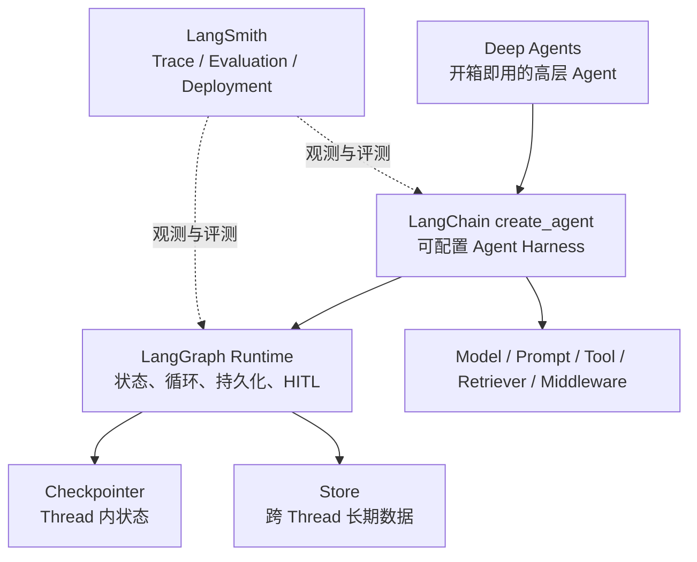
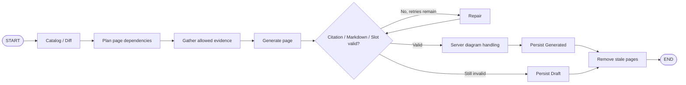

# LangChain、LangGraph 与主流 AI 框架面试题

> 版本口径：截至 2026-07-17 联网核对。题目来源包括 LangChain/LangGraph 官方文档、其他主流框架官方文档、2026 年公开面试题库，以及本目录记录的实际面试追问。技术答案以官方当前文档为准；公开题库只用于识别重复出现的题型，不代表严格的真实面试频率统计。
>
> 项目口径：CodeWiki、Agent Memory 都按公司内部项目回答；没有直接使用 LangGraph 的地方必须如实说明，不能为了迎合题目把显式服务流程包装成 LangGraph。

---

## 一、先背这套总口径

### 1. 30 秒框架总览

> 我现在会把 LangChain 理解成高层的 Agent Harness，它负责把模型、Prompt、工具和 Middleware 组合起来；LangGraph 是下面的编排运行时，负责显式状态、分支、循环、持久化、暂停和恢复；LangSmith 负责 Trace、评测和线上观测。简单 Agent 我会先用 `create_agent`，固定线性流程用 Runnable/LCEL，只有流程复杂到需要显式控制状态和恢复时，我才直接写 `StateGraph`。框架只是执行载体，真正决定效果的还是上下文、工具协议、检索、校验和评测。

### 2. 当前生态关系图



### 3. 面试优先级

| 优先级 | 必须掌握的问题 |
| --- | --- |
| 第一优先级 | LangChain 与 LangGraph 区别、`create_agent`、Agent Loop、Tool、State/Node/Edge、Reducer、Checkpointer 与 Store |
| 第二优先级 | Prompt、Structured Output、Embedding/切块、Hybrid RAG、Middleware、Interrupt/Resume、幂等、Streaming、LangSmith 评测 |
| 第三优先级 | `Command`、`Send`、super-step、pending writes、子图持久化、多 Agent、框架选型 |
| 高级岗位加分 | 同一 Thread 并发、故障恢复、图升级兼容、租户隔离、成本与延迟预算、离线和在线评测 |

### 4. 2026 版本陷阱

| 容易说旧的概念 | 当前更准确的回答 |
| --- | --- |
| `initialize_agent`、`AgentType` | 不作为新项目首选；当前入口是 `langchain.agents.create_agent` |
| `langgraph.prebuilt.create_react_agent` | 是 v1 之前的推荐入口；当前迁移指南推荐 `create_agent` |
| `LLMChain`、`SequentialChain` | 已移到 `langchain-classic`；线性流程用 Runnable/LCEL，复杂流程用 LangGraph |
| `AgentExecutor` | LangChain 的旧版内置 Agent 执行器，现属 `langchain-classic`；新项目优先 `create_agent` |
| `ConversationBufferMemory` 等旧 Memory 类 | 面试可以解释历史概念，但新设计应讲 Checkpointer、Store 和 Middleware 摘要 |
| `MessageGraph` | 已弃用；使用 `StateGraph` 加 `MessagesState` 或 `messages` 字段 |
| “LCEL 已废弃” | 错。Runnable 和 `|` 仍然有效，只是不适合复杂有状态控制流 |
| “让模型按 Prompt 输出 JSON” | 优先用 Provider/Tool Structured Output，并继续做服务端业务校验 |
| “Interrupt 从暂停那一行继续” | 错。恢复时当前 Node 从函数开头 replay，`interrupt()` 返回 Resume 值 |
| “Checkpoint 保证 Exactly-once” | 错。外部副作用仍需幂等键、唯一约束、事务或 Outbox |
| “Recursion limit 默认 25” | 旧资料。官方当前文档说明从 1.0.6 起默认 1000；生产仍应显式设业务上限 |
| “Streaming 只有 values/updates” | 旧 `stream_mode` 仍可用；当前新项目优先事件流 `version="v3"` 的独立投影 |
| “MCP 远程传输就是旧 HTTP+SSE” | 旧 HTTP+SSE 已被 Streamable HTTP 替代；当前还要讲 Origin 校验、Session、事件恢复和 OAuth 2.1 |
| “A2A 只有 JSON-RPC，Task 只能轮询” | A2A 1.0 的规范源是 Protobuf，公开了 JSON-RPC、REST、gRPC Binding，并支持 Stream、Subscribe 和 Push |
| “OpenAI Agents SDK 完全没有恢复或 Durable 能力” | 旧口径。核心有 RunState/HITL，官方还有 Dapr、Temporal、Restate、DBOS 集成；但普通 Runner 不自动提供 Exactly-once |
| “CrewAI Flow 开了 `@persist` 就是完整 Durable Workflow” | `@persist` 支持 State 快照、Resume 和 Fork，但外部副作用、并发和业务事务仍要自己治理 |
| “Google ADK 有多语言 SDK，所以 Graph 能力完全一致” | 错。当前 ADK 2.0 Graph Workflow 官方只标注 Python 和 Go，其他能力也要按目标 SDK 逐项核对 |
| “Deep Agents 的文件权限就等于 OS Sandbox” | 错。内置文件工具权限只约束对应 Tool；任意命令执行仍需要进程、网络、挂载和资源级隔离 |

---

## 二、LangChain 高频问题

### Q01.【必问】现在的 LangChain 到底是什么？

**口语化回答：**

> 我不会把 LangChain 说成一个大模型，也不会再用“六大组件”这种老教程口径概括它。现在它更像一个高层 Agent Harness，核心入口是 `create_agent`，把模型、系统提示词、工具和 Middleware 组合成一个可运行的 Agent。它帮我统一不同模型和工具接口，底层有状态执行由 LangGraph 负责。

**面试官想确认：** 你学的是当前版本，不是只背过 2023 年的 Chain API。

### Q02.【必问】为什么官方说 Agent = Model + Harness？

**口语化回答：**

> 模型本身只负责根据输入预测输出，它不知道怎么执行工具、怎么保存状态、什么时候重试，也不知道哪些操作要人工审批。Harness 就是模型外面的那层工程系统，包括 Prompt、工具协议、循环、上下文管理、状态、权限、校验和观测。模型决定“想做什么”，Harness 决定“允许它怎么做、做完怎么继续”。

### Q03.【必问】`create_agent` 的执行循环是怎样的？

**口语化回答：**

> 用户消息先进入模型，模型如果能直接回答就结束；如果返回 Tool Call，运行时会校验参数并执行对应工具，再把工具结果作为 `ToolMessage` 放回消息历史，重新调用模型。这个“模型判断、工具执行、结果回填”的循环会一直跑到模型不再请求工具，或者触发步骤、时间、费用等上限。

> 我不会把停止条件只交给模型。生产里还会有最大模型调用次数、最大工具调用次数、总耗时、Token 和费用预算。

### Q04.【高频】Chain、Workflow 和 Agent 有什么区别？

**口语化回答：**

> Chain 或 Workflow 的下一步主要由代码决定，所以路径稳定、延迟和成本容易估算；Agent 的下一步由模型根据上下文决定，灵活，但路径和成本不固定。我的原则是能用确定性流程解决就先用流程，只把确实需要判断的部分交给模型，不能为了显得智能把所有业务都做成 Agent。

### Q05.【必问】什么是 Runnable 和 LCEL？

**口语化回答：**

> Runnable 是 LangChain 的统一执行接口，常见能力包括 `invoke`、`ainvoke`、`batch`、`stream`。LCEL 的 `|` 就是把一个 Runnable 的输出接到下一个输入，比如 `prompt | model | parser`。它的价值不是少写几个函数，而是让整条线性链统一获得同步、异步、批量和流式接口，并能用 `.with_retry()`、`.with_fallbacks()` 等方式统一配置重试与降级。

### Q06.【必问】什么时候用 LCEL，什么时候用 LangGraph？

**口语化回答：**

> Prompt 到 Model 再到 Parser，或者固定的检索再生成，这种线性流程我会用 LCEL，简单直接。只要出现条件分支、循环、多 Agent、持久状态、人工审批或者崩溃恢复，我就会考虑 LangGraph。两者不是替代关系，LangGraph 的一个 Node 里面完全可以放一条 LCEL Chain。

### Q07.【版本题】`create_agent`、`create_react_agent`、`AgentExecutor` 怎么区分？

**口语化回答：**

> `AgentExecutor` 是旧式执行器思路，`create_react_agent` 是 LangChain v1 之前官方推荐的 LangGraph 预构建入口。当前迁移指南已经推荐 `langchain.agents.create_agent`。所以新项目我会先用 `create_agent`；如果控制流已经复杂到高层入口不合适，就直接写 `StateGraph`，而不是回到旧的 `AgentExecutor`。

### Q08.【必问】Middleware 是什么？常见 Hook 有哪些？

**口语化回答：**

> Middleware 是横切 Agent Loop 的扩展层，不是另一个运行时。`before_agent` 在 Agent 开始时运行，`after_agent` 在 Agent 正常完成后运行；`before_model` 在每轮模型调用前运行，`after_model` 在模型成功返回后运行；`wrap_model_call` 和 `wrap_tool_call` 可以包住实际调用，做替换、重试、短路或者错误转换。

> 执行顺序也要讲清楚：Before 通常按配置顺序进入，After 反向退出，Wrap 是洋葱模型一层套一层。After Hook 不是异常场景的 `finally`；模型或工具异常的拦截与重试应放在对应 Wrap Hook。因此鉴权、PII、重试、日志的排列顺序本身就是设计。

### Q09.【高频】Middleware 可以解决哪些生产问题？

**口语化回答：**

> 我会用它做动态 Prompt、动态模型和工具选择、长上下文摘要、模型或工具重试、Fallback、调用次数限制、PII 脱敏、Guardrail 和人工审批。关键是按职责拆开，不能写一个万能 Middleware 把所有逻辑塞进去，否则状态修改和执行顺序会非常难排查。

### Q10.【必问】一个好的 Tool Schema 应该怎么设计？

**口语化回答：**

> Tool 本质是一个输入输出明确的函数。工具名要体现动作，Docstring 要说清什么时候用、什么时候不要用，参数尽量少而且类型明确，枚举就不要放任意字符串。像用户身份、租户、数据库连接这种可信信息不应该让模型填写，而是由运行时注入。

> 工具内部仍要做鉴权、参数白名单、超时、幂等和审计。模型只负责提出调用意图，不代表它获得了底层权限。

### Q11.【进阶】ToolRuntime 里的 State、Context、Store 怎么区分？

**口语化回答：**

> State 是当前 Thread 内会变化、会参与流程的短期状态；Context 是这次运行传入的只读业务依赖，比如 userId、tenantId 或连接对象；Store 是跨 Thread 保存的长期数据。简单说，State 是“这次任务进行到哪”，Context 是“这次以什么身份和环境运行”，Store 是“跨会话还要记住什么”。

### Q12.【必问】Structured Output 应该怎么做？

**口语化回答：**

> 我会先定义 Pydantic、TypedDict 或 JSON Schema，让框架约束并验证输出，而不是只在 Prompt 里说“请返回 JSON”。在 Agent 里用 `response_format`，模型原生支持结构化输出时优先 `ProviderStrategy`，否则可以用 `ToolStrategy`。最终结果会出现在 Agent State 的 `structured_response` 里。

### Q13.【高频】ProviderStrategy 和 ToolStrategy 有什么区别？

**口语化回答：**

> ProviderStrategy 使用模型厂商原生的结构化输出能力，约束更靠近服务端，通常可靠性更高；ToolStrategy 把目标结构模拟成一次工具调用，适用于支持 Tool Calling 的模型。如果 Agent 同时还有业务 Tool，模型还必须支持业务 Tool 与结构化输出一起使用。直接传 Schema 时 LangChain 可以根据模型 Profile 自动选择，但 Profile 仍是会变化的能力数据，生产里我不会取消自己的业务校验和失败兜底。

### Q14.【追问】Tool Calling 和 Structured Output 是一回事吗？

**口语化回答：**

> 底层可能都利用结构化参数，但目的不同。Tool Calling 是让模型表达“我要调用哪个外部函数或能力以及参数是什么”，其中写操作可能产生真实副作用；Structured Output 是让最终业务结果符合固定 Schema。后者主要用于得到可验证的数据对象，不能因为都长得像 JSON 就混在一起。

### Q15.【必问】当前 LangChain 的短期记忆和长期记忆怎么做？

**口语化回答：**

> 短期记忆放在 Agent State 里，通过 Checkpointer 按 `thread_id` 保存，解决同一个会话的连续对话、暂停恢复和状态历史。长期记忆放 Store，按 Namespace 和 Key 保存，可以跨 Thread 读取，比如用户偏好或稳定事实。Checkpointer 记住“这条会话”，Store 记住“这个用户或业务实体”。

### Q16.【高频】对话太长了怎么办？

**口语化回答：**

> 我会把“模型本轮看到什么”和“存储里还保留什么”分开。调用模型前可以 Trim，只保留系统消息和最近几轮；也可以用 Summarization Middleware 把旧消息压成摘要；不再需要的消息可以显式删除。稳定事实要抽成结构化长期记忆，不能只埋在几百轮聊天里。

> Trim 只是减少本轮输入，不一定减少 Checkpoint 里的历史；如果存储膨胀，还要配合删除、归档和保留策略。

### Q17.【必问】官方的 2-Step、Agentic、Hybrid RAG 怎么区分？

**口语化回答：**

> 2-Step RAG 是每次固定先检索再生成，延迟和路径最好控制，适合 FAQ 和企业知识问答；Agentic RAG 把检索当 Tool，由模型决定什么时候查、查几次，适合开放研究，但成本更不稳定；Hybrid RAG 在中间加入查询改写、检索判定、重排、证据或答案校验，在可控性和质量之间取平衡。

### Q18.【高频】Vector Store 和 Retriever 有什么区别？

**口语化回答：**

> Vector Store 是具体的向量存储和相似度搜索基础设施；Retriever 是上层统一检索接口，输入问题，返回 Document。Retriever 后面可以是向量库、BM25、数据库、图检索或混合检索。这个抽象让我替换召回策略时不用重写生成链路。

### Q19.【必问】RAG 答案不准，怎么排查？

**口语化回答：**

> 我会先把检索和生成拆开。第一步直接看召回文档里有没有答案；没有就查解析、切块、Embedding、关键词召回、Metadata Filter、Top-K 和重排；证据已经正确但答案仍错，再查 Prompt、上下文排列、引用约束和模型。不能一看到最终答案差就先换大模型，因为很多时候模型根本没拿到正确证据。

### Q20.【高频】Streaming 和 Batch 有哪些注意点？

**口语化回答：**

> Streaming 降低的是感知延迟，不一定降低总耗时。整条 Runnable 能不能及时流式输出，取决于中间每一步能不能处理流式 Chunk；中间有阻塞步骤，首 Token 还是会被卡住。`batch()` 通常是客户端并发，不等同于模型厂商的离线 Batch API；生产还要用 `max_concurrency` 控制并发。

### Q21.【必问】LangSmith 是干什么的？怎么做评测？

**口语化回答：**

> LangSmith 主要解决 LLM 应用内部过程不可见的问题。Trace 里能看到模型、检索、工具、状态、耗时、Token 和错误。Offline Eval 是在固定 Dataset 上跑版本对比和回归，可以有 Reference Output；Online Eval 针对真实 Run 或 Thread，通常没有标准答案，更适合看安全、格式、延迟、质量趋势和异常样本。

### Q22.【高级判断题】什么时候不应该用 LangChain？

**口语化回答：**

> 如果只有一次模型调用或者两三步固定逻辑，厂商 SDK 加普通函数通常更简单；如果极度在意协议细节和性能，也可能自研很薄的一层。LangChain 的价值在组件复用、工具循环、状态、Middleware 和观测，如果这些能力都用不上，引入框架反而增加版本和排障成本。

> 下面这组 `Q22A-Q22M` 是联网公开题库反复出现、但容易被新版 Agent API 掩盖的基础题。编号使用字母后缀，是为了不改变后文已经被总览引用的 `Q23-Q133`。

### Q22A.【基础高频】`PromptTemplate` 和 `ChatPromptTemplate` 有什么区别？

**口语化回答：**

> `PromptTemplate` 最终组织的是一段字符串，适合普通文本补全或者很简单的单轮模板；`ChatPromptTemplate` 组织的是带 System、Human、AI、Tool 等角色的消息序列，更适合聊天模型和 Agent。多轮历史通常通过消息占位符放进去，而不是先把所有消息手工拼成一大段字符串。

> 我更看重角色边界，不只是模板语法。用户变量不能因为字符串插值就混进 System 权限区，工具结果也要保留 Tool Message 语义；否则模板看起来能跑，实际会破坏 Tool Call 对齐，还会放大 Prompt Injection 风险。

### Q22B.【基础高频】Few-shot 示例怎么选？是不是越多越好？

**口语化回答：**

> Few-shot 是用少量输入输出示例告诉模型任务边界和格式。任务稳定、示例很少时可以固定放；示例库较大时，可以按语义相似度、长度或业务标签动态挑选。不是越多越好，过多示例会挤占上下文，互相冲突的示例还会让模型更不稳定。

> 生产里我会给示例做版本和来源管理，按真实评测集验证收益。动态选例必须带租户和权限过滤，不能因为“相似”就把别人的敏感案例放进 Prompt；示例只是在教模型怎么答，也不能当作事实证据。

### Q22C.【版本高频】`with_structured_output`、`response_format` 和 Output Parser 怎么选？

**口语化回答：**

> 直接调用 Chat Model 时，我会优先用 `with_structured_output(schema)`；使用 `create_agent` 并要求最终结果有固定结构时，用 `response_format`，让框架选择 ProviderStrategy 或 ToolStrategy。Output Parser 是在模型已经输出文本以后再解析，适合普通 Runnable、旧链路或者模型不支持原生和 Tool Structured Output 的场景，但可靠性通常不如在生成阶段就约束。

> 这三种方式都只能先解决结构问题。金额范围、引用是否真实、跨字段关系和权限仍要由服务端校验；解析或校验失败要区分可让模型修复的错误、业务拒绝和系统故障，不能统一无限重试。

### Q22D.【版本高频】旧版 Memory 类和 `RunnableWithMessageHistory` 现在怎么回答？

**口语化回答：**

> Buffer、Window、Summary、VectorStore Memory 是旧版教程常见的记忆策略，我会解释它们分别是全量保留、保留最近窗口、摘要旧历史和按语义召回，但不会说它们是新 Agent 的首选入口。当前 Agent 的 Thread 内短期状态主要讲 Checkpointer，长上下文处理讲 Trim 或 Summarization Middleware，跨 Thread 数据讲 Store。

> `RunnableWithMessageHistory` 仍适合给普通 Runnable 包一层按 `session_id` 读写的消息历史，但它不等于 LangGraph Checkpoint，也没有自动获得中断恢复、状态历史和副作用治理。面试官如果问 Memory，我会先确认他问的是历史 API、普通 Chain，还是当前 Agent Runtime。

### Q22E.【RAG 必问】Embedding 是什么？上线最容易踩什么坑？

**口语化回答：**

> Embedding 是把文本映射成向量，让语义接近的内容在向量空间里更靠近。建库文档和查询通常要使用兼容的模型、维度和版本；更换 Embedding 模型后，旧向量不能想当然继续混用，一般要重新索引或做明确的双索引迁移。

> 线上最容易忽略的是距离度量、是否归一化、语言和领域适配、查询前缀、批量限流以及模型版本。Cosine、Dot Product 和 Euclidean 的分数含义不同，阈值不能跨模型照搬；最终要用自己的查询集看 Recall@K 和业务答案，而不是只凭二维可视化说效果好。

### Q22F.【RAG 必问】Chunk Size 和 Overlap 怎么定？

**口语化回答：**

> 我不会先拍一个“500 Token 加 50 Overlap”的固定答案。先按文档结构切，例如标题、段落、表格、函数、类和配置块，确实过长再按 Token 递归切；Overlap 主要用来缓解边界信息被切断，不是越大越好。Chunk 太小容易丢上下文，太大又会降低检索精度、增加噪声和生成成本。

> 我会保留 Source、版本、标题路径、ACL 和父子关系，必要时小块召回、父块补上下文。像 CodeWiki 这类代码知识库会优先按 AST 的函数、类和符号关系切，不按自然语言段落硬切。参数最终由真实查询上的召回、忠实度、延迟和成本共同决定。

### Q22G.【RAG 高频】Similarity、MMR 和 Hybrid Search 怎么选？

**口语化回答：**

> Similarity Search 直接拿最相似的 Top-K，简单但结果可能高度重复；MMR 在相关性和多样性之间做平衡，适合相似段落很多、希望覆盖不同证据的场景；Hybrid Search 把向量语义召回和 BM25 一类关键词召回组合起来，再通过 RRF、加权融合或 Reranker 排序，适合既有同义表达又有精确编号、类名和错误码的知识库。

> MMR 和 Hybrid 都不是无条件更好。MMR 可能为了多样性牺牲最相关结果，融合还会引入分数校准、重复文档和额外延迟。我会分别评估召回层和重排层，并按查询类型看收益，不拿一套参数覆盖所有数据。

### Q22H.【RAG 进阶】Multi-query Retriever 和 Self-query Retriever 有什么区别？

**口语化回答：**

> Multi-query 是让模型把一个问题改写成多个不同表达，分别检索后去重合并，主要解决单一问法召回不全；Self-query 是让模型把自然语言拆成语义查询和结构化 Metadata Filter，例如“找 2025 年以后支付模块的 Java 文档”，主要解决过滤条件提取。

> 两者都会增加模型调用和不可控性。Multi-query 要限制改写数量并做好去重；Self-query 只能使用服务端允许的字段和操作符，TenantId、权限和数据范围必须由服务端强制注入，不能让模型生成一个 Filter 就越权查询。

### Q22I.【基础对比】FAISS、Chroma、pgvector 这类 Vector Store 怎么选？

**口语化回答：**

> 我不会只背产品名。先看数据量、查询延迟、Metadata Filter、增量更新和删除、一致性、多租户、备份、运维能力和成本。FAISS 更像本地向量索引库，适合算法验证和可控的单机索引；Chroma 常用于快速原型和轻量部署；已经大量使用 Postgres、需要事务数据和 Metadata 一起治理时会评估 pgvector。具体能力仍要按当时版本和托管形态核对。

> 真正上线还要验证索引类型与参数、扩容和重建时间、过滤后的召回、备份恢复、删除同步和租户隔离。LangChain 的 Vector Store 抽象能降低接入差异，但不会抹平底层数据库在一致性、过滤和性能上的区别。

### Q22J.【工程高频】自定义 Document Loader 和 Text Splitter 要考虑什么？

**口语化回答：**

> Loader 不只是“把文件读成字符串”。它要稳定产出正文和 Metadata，包括 Source URI、业务主键、版本、更新时间、权限和内容哈希；重复采集要幂等，删除和更新要能传到索引。解析失败要记录到可重试的死信或任务状态，不能静默少数据。

> Splitter 要尊重领域结构，例如 PDF 标题和表格、代码 AST、工单字段和聊天轮次，再处理超长块。每个 Chunk 必须能追溯到原文区间和权限主体。上线前我会专门测乱码、扫描 PDF、超大文件、空文档、重复文档和权限变化，而不是只拿一篇干净 Markdown 演示。

### Q22K.【版本辨析】Callback、Middleware 和 LangSmith Trace 有什么区别？

**口语化回答：**

> Callback 更像执行事件监听，用来观察模型、Chain、Tool 的开始、结束、Token 和错误；Middleware 位于 Agent Loop 内，可以改 Prompt、换模型、包住 Tool、重试、短路或触发审批，属于会影响控制行为的扩展；LangSmith 是把这些 Run 和 Span 收集起来做 Trace、评测和线上分析的平台。

> 我的原则是纯观测尽量放 Callback 或 Telemetry，权限、重试和上下文变换放职责明确的 Middleware，业务真相仍放业务服务。不要在一个日志 Callback 里偷偷改状态，也不要因为接了 LangSmith 就认为指标、脱敏、保留期和告警已经自动设计好。

### Q22L.【RAG 评测】怎么证明检索优化真的有效？

**口语化回答：**

> 我会把检索和生成分开评。检索层有标注证据时看 Recall@K、Precision@K、MRR 或 nDCG，还要看 Metadata Filter 是否正确；生成层看答案正确性、对证据的忠实度、引用覆盖和拒答。最终再一起看任务成功率、P95 延迟、Token、检索和重排成本。

> 数据集要来自真实问题，按文档类型、语言、长尾查询和无答案问题分层。每次调整 Chunk、Embedding、Top-K、Hybrid 权重或 Reranker 都跑同一套回归，并人工复核代表性失败。只展示三条“看起来更相关”的结果，不能证明系统整体变好。

### Q22M.【生产高频】Prompt Cache、Response Cache、Embedding Cache 有什么区别？

**口语化回答：**

> Provider 的 Prompt Cache 通常复用稳定前缀的推理计算，减少重复输入成本或延迟，但模型仍会生成新结果；Response Cache 是命中后直接返回之前的最终响应；Embedding Cache 是避免同一内容反复计算向量。检索结果、工具结果也可以缓存，但它们各自有不同的一致性和权限风险。

> Cache Key 至少要考虑模型、参数、Prompt 版本、Tool/Schema 版本、租户和数据版本。用户权限、知识库内容或索引版本变化时要失效；敏感数据不能跨租户共享，带副作用的 Tool 也不能因为“结果一样”就跳过真实状态检查。缓存是性能策略，不是正确性来源。

### Q22N.【LCEL 高频】`RunnableParallel` 和 `RunnablePassthrough` 是干什么的？

**口语化回答：**

> `RunnableParallel` 是把同一份输入同时交给多条相互独立的 Runnable，再把结果按 Key 组装成一个字典；`RunnablePassthrough` 是把输入原样保留下来，必要时再补几个派生字段。RAG 里很常见，比如一边让 Retriever 生成 `context`，一边把原问题透传成 `question`，最后一起交给 Prompt。

> 并行只适合真正没有前后依赖的步骤，而且还要设 `max_concurrency`、超时和限流。返回字典的字段名就是下游契约，不能随手改；其中一个分支失败时，是整条链失败、给默认值还是降级，也要提前定义，不能把并行当成自动容错。

### Q22O.【LCEL 高频】`.with_retry()` 和 `.with_fallbacks()` 怎么用，为什么不能无脑套？

**口语化回答：**

> Retry 是同一个能力遇到临时错误后再试，适合网络抖动、429 和部分 5xx；Fallback 是主 Runnable 失败后换另一条实现，比如换模型或走降级链。我会先做短次数、带退避和抖动的 Retry，再按错误类型决定是否 Fallback，并把原异常、尝试次数和最终命中路径写进 Trace。

> 401、参数校验失败、内容策略拒绝这类错误，重试通常没意义。模型 Fallback 也不是只换一个名字：上下文长度、Tool Calling、Structured Output 和多模态能力必须兼容。对有副作用的 Tool，框架级重试前还要有业务幂等键，否则一次超时可能变成两次付款或两次发布。

### Q22P.【Structured Output】解析或校验失败时怎么处理？

**口语化回答：**

> 我先区分三类问题：文本根本解析不成目标结构，这是语法问题；结构能解析但字段类型或必填项不对，这是 Schema 问题；Schema 全过但金额、引用或状态不合理，这是业务语义问题。前两类可以把精确的校验错误反馈给模型做有限次数修复，第三类必须经过业务 Validator、查库或人工确认，不能只让模型“再想一次”。

> 重试要保留原始输出和失败原因，限制次数，并防止再次执行前面的写 Tool。能用模型厂商原生 Structured Output 时我优先用它，但仍保留业务校验和最终失败分支；不能为了让 Parser 成功，静默丢字段或给关键字段乱填默认值。

### Q22Q.【RAG 进阶】多模态 RAG 怎么设计，和纯文本 RAG 最大区别是什么？

**口语化回答：**

> 多模态 RAG 不只是把图片 OCR 成文字。入库时我会保留原文件、页码、区域坐标和模态类型，文本走解析和切块，图片、表格、音视频可以走描述、专用 Embedding 或多向量索引；查询时根据问题决定搜文本、视觉内容还是两边都搜，再把证据按模型支持的 Content Block 传给多模态模型。

> 最大难点是跨模态对齐和可追溯。比如命中的是图表标题，真正答案可能在图里的折线；只返回 OCR 文本会丢布局，只返回整页图片又太贵。我会用稳定资源 ID 把文字块、图片区域和原页关联起来，评测时分别看文本召回、视觉证据召回、跨模态答案正确性和引用定位，权限与删除也必须覆盖原文件、派生描述和向量。

### Q22R.【LangSmith 高频】Prompt 怎么做版本管理、灰度和 A/B 实验？

**口语化回答：**

> 我会把 Prompt 当成可发布配置，不在生产里直接覆盖“最新版”。每次改动形成不可变版本，绑定模型、参数、Tool Schema 和 Eval 数据集；先在固定数据集上跑实验对比，看质量、格式、成本和延迟，再把通过的版本提升到 Staging，最后用环境标签或稳定版本号进入 Production。

> 线上 A/B 要按用户或会话稳定分桶，避免同一个人一会儿走 A、一会儿走 B；除了点击和满意度，还要看安全拒答、工具错误、Token 和长尾延迟。LangSmith 能管理 Prompt Commit、环境和实验对比，但发布门槛、样本代表性、回滚条件和业务指标仍然要由我自己定义。

### Q22S.【生产设计】多模型供应商路由、重试和故障切换怎么做？

**口语化回答：**

> 我会先按任务能力路由，而不是把所有模型当等价 HTTP 接口。路由条件包括是否支持 Tool Calling、Structured Output、多模态、上下文长度、数据区域、延迟和预算；主模型遇到可恢复故障，只在整条请求的剩余 Deadline 允许时做有限重试，确认是供应商级故障、限流或时间已经不够后，再切到能力兼容的备用模型。

> 切换时必须固定归一化的消息、工具和输出 Schema，并对供应商差异做 Adapter。已经执行过 Tool 的 Agent Loop 不能从头盲目换模型重跑，应该从受控状态继续；否则可能重复副作用。还要做熔断、分供应商限流、健康探测、成本保护和 Trace 标记，最后用同一套 Eval 证明备用路径不是“能返回就算可用”。

---

## 三、LangGraph 高频问题

### Q23.【必问】LangGraph 是什么？什么时候才值得用？

**口语化回答：**

> LangGraph 是面向长时间运行、有状态 Agent 的低层编排框架和运行时。它不负责训练模型，重点解决状态怎么流转、什么时候分支或循环、怎么持久化、怎么暂停和恢复。简单线性任务我不会硬上；需要显式状态、复杂控制流、HITL 或故障恢复时，它的价值才明显。

### Q24.【必问】State、Node、Edge 分别是什么？

**口语化回答：**

> State 是整条流程当前的结构化快照；Node 是真正执行工作的函数，可以调用模型、工具或普通业务代码；Edge 决定接下来运行哪个 Node。简单记就是 State 保存“现在是什么情况”，Node 负责“做事”，Edge 负责“下一步去哪”。

### Q25.【进阶】LangGraph 底层为什么会讲 super-step？

**口语化回答：**

> 它受 Pregel 的批同步模型影响。一轮 super-step 里被激活的多个 Node 可以并行执行，而且它们看到的是这一轮开始前已经提交的同一份状态；这一批结束后，更新才按 Reducer 合并，再进入下一轮。这个概念决定了并行可见性、Checkpoint 边界和失败恢复方式。

### Q26.【必问】Reducer 是什么？默认行为是什么？

**口语化回答：**

> Reducer 定义某个 State 字段收到更新时怎么把旧值和新值合并。没配置时默认是新值覆盖旧值。计数器、消息列表、并行结果这类累积字段要显式配置 Reducer；否则两个并行 Node 同一轮写同一个 Key，运行时无法判断怎么合并，通常会报 `InvalidUpdateError`，而不是悄悄挑一个结果。

```python
import operator
from typing import Annotated, TypedDict

class State(TypedDict):
    # 并行分支返回的列表会累加，而不是互相覆盖。
    results: Annotated[list[str], operator.add]
    status: str
```

### Q27.【高频】`add_messages` 和 `operator.add` 有什么区别？

**口语化回答：**

> `operator.add` 基本就是普通列表拼接；`add_messages` 理解消息语义，新消息会追加，相同 Message ID 可以更新已有消息，还能把字典反序列化为 LangChain Message。涉及人工修改历史消息、删除消息或 Tool Call 对齐时，应该使用消息专用 Reducer，不能只做列表相加。

### Q28.【必问】Node 要不要返回完整 State？

**口语化回答：**

> 通常不要。Node 返回自己负责的 Partial Update，运行时再按每个字段的 Reducer 合并。每个 Node 都返回完整 State 会增加耦合，还可能拿着旧快照把其他并行分支的更新覆盖掉。状态字段也要按职责拆清楚，不能把所有临时变量都塞进一个大 Dict。

### Q29.【必问】普通 Edge、Conditional Edge、`Command`、`Send` 怎么选？

**口语化回答：**

> 固定从 A 到 B 用普通 Edge；只需要根据 State 选择下一跳，用 Conditional Edge；既要更新 State 又要决定下一跳，用 `Command(update=..., goto=...)`；运行时才知道要展开多少个并行任务，而且每个任务输入不同，用 `Send`。`Send` 典型就是动态 Map-Reduce；多个并行任务写同一个聚合字段时，该字段必须配置 Reducer。

### Q30.【陷阱题】Node 同时有静态 Edge，又返回 `Command(goto=...)` 会怎样？

**口语化回答：**

> 两条路径都会执行，`goto` 不会覆盖静态 Edge。这个很容易制造意外并发和重复副作用。所以对同一个 Node，我会明确选择静态路由、Conditional Edge 或 Command 中的一种主路由方式，不会混着写再猜运行时会优先谁。

### Q31.【必问】Checkpointer、Thread、Checkpoint 分别是什么？

**口语化回答：**

> Checkpointer 是具体的持久化实现；Thread 是一条连续会话或任务轨迹，`thread_id` 是定位它的关键标识；Checkpoint 是这个 Thread 在某个 super-step 边界的状态快照。要继续一条暂停的流程，必须使用同一个 `thread_id`，否则运行时不知道该加载哪条历史。

### Q32.【必问】Checkpointer 和 Store 有什么区别？

**口语化回答：**

> Checkpointer 保存某个 Thread 的图状态，用于多轮上下文、暂停恢复、时间旅行和容错；Store 保存应用定义的跨 Thread 长期数据，比如用户偏好、业务事实或共享知识。Store 也不天然等于向量库，只有配置了 Embedding 等能力才有语义检索。

### Q33.【高级】Checkpoint 是在哪个粒度保存的？什么是 pending writes？

**口语化回答：**

> 完整 State Snapshot 在 super-step 边界形成。同时，每个 Node 完成后，它的 task-level write 可以先持久化为 pending write。如果同一轮三个并行 Node 中有一个失败，整轮状态不会提交成下一份完整 State，但另外两个成功 Node 的 write 已经保存，恢复时不需要把成功分支全部重跑。

> 所以要同时理解两件事：State 提交是 super-step 级的，恢复优化又有 Node/Task 级的 pending writes。

### Q34.【必问】Agent 执行一半进程崩了，怎么恢复？

**口语化回答：**

> 普通崩溃或 Drain 后，我会用相同 Config 调 `graph.invoke(None, config)`，从已保存的 Checkpoint 继续；传普通 Dict 表示给这个 Thread 新增一轮输入，不是断点续跑。能恢复到多新的位置取决于 Durability：`exit` 无法恢复中途硬崩溃的进度，`async` 也可能丢最近还没写完的异步 Checkpoint。
>
> Graph API 中，同一个失败 super-step 里已经落下 pending writes 的成功 Node 不必重跑；Functional API 的 `@task` 结果则可以在 Entrypoint Replay 时复用。它保存的不是 Python 调用栈，所以未完成代码仍可能重新执行，外部副作用必须幂等。

### Q35.【必问】`interrupt()` 和 `Command(resume=...)` 是怎么工作的？

**口语化回答：**

> 这项能力有两个前提：图在编译时配置了 Checkpointer，而且首次调用与恢复调用都提供同一个 `thread_id`。Node 调用 `interrupt(payload)` 后，本次执行会暂停并保存状态，调用方拿到可序列化的 Payload。人工或外部系统作出决定后，再传 `Command(resume=value)`。恢复时当前 Node 从函数开头重新执行，跑到同一个 `interrupt()` 时，它会直接返回这个 Resume Value。

```python
from langgraph.types import Command, interrupt

def approval_node(state):
    approved = interrupt({"action": state["action"], "risk": state["risk"]})
    return Command(goto="execute" if approved else "cancel")

# 恢复时必须沿用原 thread_id
graph.invoke(Command(resume=True), config)
```

### Q36.【高频】Interrupt 最容易踩哪些坑？

**口语化回答：**

> 第一，不要用一个裸 `try/except` 把它内部用于暂停的异常吞掉；第二，同一 Node 有多个 Interrupt 时不要随便改变顺序，因为恢复值需要和调用位置匹配；第三，Payload 要可序列化；第四，Interrupt 前面的代码会 replay，所以发邮件、扣款、写外部系统这类副作用要放在批准后的独立 Node，或者保证幂等。

### Q37.【必问】Checkpoint 能保证 Exactly-once 吗？

**口语化回答：**

> 不能。Checkpoint 能减少已经持久化完成的步骤被重复计算，但不能替业务系统保证一次且仅一次。付款、发消息、创建订单这些操作要带业务幂等键，数据库侧做唯一约束或 Upsert，复杂场景用事务、Outbox 或补偿。恢复后还要先查询外部操作是否已成功，再决定要不要重试。

### Q38.【进阶】`exit`、`async`、`sync` 三种 durability 怎么选？

**口语化回答：**

> `sync` 是每一步持久化完成后再往下走，可靠性最高但延迟也最高，适合资金和审批；`async` 在执行和持久化之间做平衡，普通对话或一般任务更合适；`exit` 只在流程退出时保存，中途进程崩溃可能丢中间进度。选型看丢一个 Step 的业务代价，不是只看吞吐。

### Q39.【高级】Retry、Timeout、Error Handler 的顺序是什么？

**口语化回答：**

> Node 先执行；出现超时或异常后，由 Retry Policy 判断是否重试；重试耗尽以后，Error Handler 才接手，可以返回 `Command` 路由到补偿或降级节点。`interrupt()` 不属于普通失败，不会进入 Retry 或 Error Handler。当前官方的 Node Timeout 和 Error Handler 是较新的 1.2 能力，而且 Timeout 只支持 Async Node，面试时我会先确认实际版本。

### Q40.【高频】Time Travel 是不是数据库回滚？

**口语化回答：**

> 不是。Replay 是从旧 Checkpoint 重新执行后续路径，模型和外部 API 可能再次被调用；Fork 是从旧状态创建一条新的执行分支，原历史仍然存在。它只管理图状态的历史和分支，不会自动撤销已经发生的支付、邮件或数据库副作用。

### Q41.【进阶】子图为什么需要区分三种 Checkpointer 模式？

**口语化回答：**

> `checkpointer=None` 是默认的每次调用隔离，继承父图的单次持久化能力，适合多数一次性子任务；`True` 会让子图在同一 Thread 中跨调用累计状态，适合真正需要连续记忆的子 Agent；`False` 完全无 Checkpoint，把子图当普通无状态函数。前两种模式要获得 Interrupt、恢复和状态检查能力，父图本身也必须配置 Checkpointer。Per-thread 的 `True` 模式不能并行调用同一个子图，因为它们会写同一 Checkpoint Namespace。

### Q42.【版本题】LangGraph 现在怎么做 Streaming？

**口语化回答：**

> 旧 `stream_mode` API 仍然有 `values`、`updates`、`messages`、`custom`、`checkpoints`、`tasks` 和 `debug`。截至当前官方 1.2 文档，新项目更推荐 `stream_events(..., version="v3")`：分别迭代 `stream.messages`、`stream.values` 和 `stream.subgraphs`，暂停后检查 `stream.interrupted` 并读取 `stream.interrupts`，完成后读取 `stream.output`。面试时不能把旧 Stream v1、统一格式 v2 和 Event v3 的返回结构混着说。

### Q43.【陷阱题】Recursion limit 是什么？默认够不够？

**口语化回答：**

> 它限制一次执行允许经过多少个 super-step，防止图无限循环。官方当前说明从 1.0.6 起默认是 1000，不是旧资料常写的 25。但默认值不是业务安全线，生产 Agent 我会按任务显式设更小的步骤、模型调用、工具调用、时间和费用上限，并在到达上限前尝试优雅收尾。

### Q44.【高频】Graph API 和 Functional API 怎么选？

**口语化回答：**

> 复杂分支、并行、共享 State、需要可视化和显式状态机时，我用 Graph API。已经有一段自然的 Python 控制流，只想较少改动就加 Checkpoint、Task 和 Interrupt，可以考虑 Functional API。Functional API 恢复时会 Replay Entrypoint，所以非确定分支和副作用更需要包进 Task。

### Q45.【高级】怎么避免 State 和 Checkpoint 越来越大？

**口语化回答：**

> State 只放路由和后续 Node 真正需要的数据。大文档、工具原文、二进制和长列表外置存储，只在 State 里放稳定 ID、摘要和引用；消息做 Trim、摘要或删除；长期事实沉淀到 Store；持久化层做保留、归档和清理。否则每个 Step 都在重复序列化一大坨历史，延迟和存储会一起上升。

### Q46.【高级】同一个 Thread 同时来两次请求怎么办？

**口语化回答：**

> 不能让两个运行无保护地并发修改同一条 Thread。一般做法是按 Thread 串行排队；强一致场景可以拒绝第二个请求；交互型任务可以让新请求中断旧运行；明确不要旧结果时才做 Rollback。无论采用哪种策略，已经发生的外部副作用都不可能只靠图状态回滚，仍要补偿。

### Q47.【必问】生产环境 Checkpointer 怎么选？

**口语化回答：**

> `InMemorySaver` 只适合开发，进程重启就丢。生产通常选异步 PostgresSaver 或团队已有的持久化实现，并考虑 Setup、索引、连接池、序列化、加密、租户隔离、Checkpoint 保留和恢复演练。把 InMemory 换成 Postgres 只是第一步，不代表持久化设计已经完成。

### Q48.【高级】图升级以后，旧的暂停任务怎么恢复？

**口语化回答：**

> 旧 Checkpoint 恢复时会使用新部署的图代码，所以在途 Thread 对应的 Node 不能贸然删除或改名，State 字段改名也要做迁移。我的做法是在 State 里带 `flow_version`，新图用条件路由兼容旧版本，先清理或迁移所有在途任务，再删除旧节点。

### Q49.【高级】LangGraph 怎么优雅停机？

**口语化回答：**

> 当前 1.2 提供 Drain 思路，让正在运行的 super-step 完成并在边界协作停止。要在进程重启后继续，图必须使用持久化 Checkpointer，再用同一 Config 调 `graph.invoke(None, config)`。它不是强杀线程或协程，所以容器的终止宽限期、Node 超时和外部任务取消仍然要单独设计。

### Q49A.【基础高频】`START`、`END` 和 `compile()` 分别做什么？

**口语化回答：**

> `START` 是虚拟入口，用来声明用户输入先激活哪个 Node，也可以从 `START` 做条件路由；`END` 是虚拟终点，表示这条路径没有后续动作。它们本身不执行业务代码，真正工作还是在普通 Node 里完成。

> `compile()` 会检查图结构并生成真正可调用的 Compiled Graph，同时挂载 Checkpointer、Store、Cache 和断点等运行能力。Builder 只是定义，没编译不能执行。编译能发现部分结构问题，但不会替我证明路由一定终止、Reducer 一定正确、权限安全或者副作用幂等，这些仍然要靠测试和运行时治理。

### Q49B.【工具节点】什么时候用 `ToolNode`，什么时候自己写 Tool 执行 Node？

**口语化回答：**

> `ToolNode` 是官方预构建的工具执行节点，能读取模型产生的 Tool Call，处理并行工具调用、错误和 State/Context 注入。标准的“模型判断是否调用工具，调用后再回模型”循环，用它能少写很多协议胶水；路由条件只负责看最后一条消息有没有 Tool Call，再决定去工具节点还是结束。

> 如果我要做严格的权限审批、分批并发、业务事务、特殊补偿或跨服务任务编排，我会在外面增加显式节点，必要时自己写执行 Node。无论哪种方式，ToolNode 都不会替业务接口完成鉴权、幂等和沙箱；模型给出的参数仍是不可信输入，工具返回 `Command` 改 State 时也要考虑并行 Reducer。

### Q49C.【HITL 进阶】人工修改 State 应该用 Resume Payload 还是 `update_state()`？

**口语化回答：**

> 如果流程正停在 `interrupt()`，而人工输入本来就是这个节点需要的决定或编辑内容，我优先用 `Command(resume=value)`，让值回到对应的 Interrupt，再由节点按正常逻辑校验和更新。如果我要从某个历史 Checkpoint 改 State、探索另一条路径，才用 `update_state()` 创建新的 Checkpoint 分支。

> `update_state()` 不是原地改历史，也不是数据库回滚；它会经过字段 Reducer，并影响后续从哪个节点继续，必要时才显式指定 `as_node`。审批服务还要绑定 Thread、Checkpoint 和动作哈希，做鉴权和并发控制，不能允许前端拿任意字段直接改整份 State。

---

## 四、生产系统设计与多 Agent

### Q50.【必问】什么时候一个 Agent 加多个 Tool 就够了？

**口语化回答：**

> 能用一个 Agent 解决，我优先一个 Agent。只有在上下文需要隔离、权限需要隔离、不同步骤确实需要不同模型或专业 Prompt，或者子任务天然能独立并行时，多 Agent 才值得。否则它只会增加消息传递、状态一致性、延迟、费用和循环失控的问题。

### Q51.【高频】Supervisor、Handoff、Subagent、Router 怎么选？

**口语化回答：**

> Supervisor 适合一个中心统一拆任务和汇总；Handoff 适合当前 Agent 把会话主导权交给另一个专家；Subagent 适合主 Agent 把一个封闭任务当 Tool 委派出去，完成后只拿结果，能隔离上下文；Router 适合先分类，再把请求送到一个或多个独立处理器。选择依据是控制权、上下文是否共享、任务能否并行和结果由谁汇总。

### Q52.【系统设计】设计一个可恢复的研究 Agent，你会怎么拆？

**口语化回答：**

> 我会先定义 State，至少包含用户问题、计划、待办子任务、证据引用、阶段、重试次数、预算和最终结果。图上是计划、并行检索、证据去重和重排、撰写、引用校验、必要时修复、最终保存。动态子任务用 `Send` Fan-out，结果字段用 Reducer 聚合；Checkpointer 用持久化后端，大原文放对象存储只留引用。

> 可靠性方面，每个外部调用有超时和有限重试，整条任务有 Step、Token、费用和时间上限；高风险发布动作前 Interrupt；所有写操作有幂等键。观测上记录每个 Node 的输入摘要、路由、延迟、Token、工具结果引用和校验结果。

### Q53.【必问】HITL 应该放在哪里？

**口语化回答：**

> 我按 Blast Radius 放，不是每一步都让人审批。只读搜索通常不需要；对外发消息、修改数据库、执行代码、付款、删除资源、使用敏感数据这些高风险动作，在真正副作用之前暂停，把动作、参数、依据和影响范围给人看，支持批准、编辑或拒绝。审批后进入独立执行节点，避免恢复时重复跑审批前副作用。

### Q54.【高频】Agent 的权限和 Prompt Injection 怎么防？

**口语化回答：**

> 第一，检索文档和 Tool Result 都是不可信数据，不能把其中指令提升成 System Instruction；第二，工具集合按用户权限和当前阶段动态缩小；第三，身份、TenantId 和权限由服务端 Context 注入，不能让模型生成；第四，工具内部再次鉴权、白名单校验和审计；第五，高风险动作 HITL，代码执行放沙箱并限制网络、文件和资源。

### Q55.【高频】怎么控制 Agent 的成本和延迟？

**口语化回答：**

> 先减少无效工作：缩小工具集合、提高检索质量、压缩历史、减少无意义反思和多 Agent 往返。然后做模型分级、无依赖步骤并行、Embedding 和稳定结果缓存、Prompt Cache、流式输出和批处理。每个任务都要有 Token、模型调用、工具调用、Step、时间和费用预算，监控不能只看平均延迟，还要看 P95、首 Token 和任务成功率。

### Q56.【高级】Agent 怎么评测，为什么不能只看最终答案？

**口语化回答：**

> Agent 可能最终答对，但中间调用了错误工具、泄露了数据或者绕了十倍成本，所以要同时评最终结果和 Trajectory。结果层看正确性、忠实度、引用、格式和拒答；过程层看工具选择、参数、顺序、无效循环、权限和成本；系统层看延迟、成功率、恢复率和人工介入率。

> 离线用固定数据集做回归和版本对比，线上从 Trace、用户反馈和失败案例抽样评测，再把典型失败回流到离线集。

### Q57.【高频】线上 Agent 出错时怎么定位？

**口语化回答：**

> 我会沿 Trace 分层定位：先看输入和上下文是不是错了，再看模型决策、检索证据、工具参数和返回、State 更新、路由、重试，最后看输出校验。每个 Span 都要带 ThreadId、RunId、Node、模型和 Prompt 版本、租户、Token、延迟和错误类型。只看最终答案或者只打应用日志，很难重建 Agent 为什么走到这一步。

### Q58.【高级】LangChain/LangGraph 项目怎么测试？

**口语化回答：**

> 普通 Node 和 Tool 先当纯函数做单测，模型和外部服务用 Fake 或录制响应；Router 测每个分支；Reducer 测并行和重复更新；Graph 做端到端状态快照测试；Interrupt 测暂停、编辑、恢复和拒绝；故障注入测试超时、进程崩溃、重复执行和恢复。最后用固定 Dataset 做质量回归，不能把“代码能跑”当成 Agent 测试通过。

### Q59.【高频】怎么避免被框架锁死？

**口语化回答：**

> Tool 尽量写成普通函数，业务 DTO 用自己的类型，模型调用、向量库、Checkpointer 和 Trace 都经过适配层。框架 State 只承载流程需要的数据，不让业务库到处依赖框架 Message 类型。这样换框架时主要替换编排和 Adapter，而不是把整个业务逻辑推倒重写。

### Q60.【必问】选 AI 框架时，你看哪些维度？

**口语化回答：**

> 我先问系统最难的部分是什么：是数据接入和检索，是长流程状态恢复，是角色化协作，还是类型和企业治理。然后看控制流、状态模型、持久化、HITL、可观测、评测、安全、语言生态、部署、社区维护状态和迁移成本。最后用一个代表性流程做小型验证，比较代码复杂度、失败恢复、延迟和可测试性，不根据 GitHub Star 直接拍板。

---

## 五、主流框架对比题

### Q61.【必问】LangChain、LangGraph、Deep Agents、LangSmith 怎么分工？

**口语化回答：**

> Deep Agents 是带规划、文件系统、上下文压缩和 Subagent 等能力的高层开箱方案；LangChain 的 `create_agent` 是可定制 Harness；LangGraph 是低层编排运行时；LangSmith 是观测、评测和部署平台。我的选择顺序是先看高层能力是否够用，需要自定义 Harness 就用 LangChain，需要完全控制状态图才直接用 LangGraph。

### Q62.【常见对比】LangGraph 和 CrewAI 怎么选？

**口语化回答：**

> LangGraph 强调显式 State、Node、Edge、Checkpoint 和恢复，适合我需要精确控制流程和可靠性的场景。CrewAI 更强调角色、目标、Task 和团队协作，上手表达“研究员、审核员、写作员”这类关系更快。CrewAI 当前也强调 Crew 加 Flow：开放分析交给 Crew，状态和关键业务路径由 Flow 控制。需要底层控制我选 LangGraph，需要高层角色协作快速落地我会评估 CrewAI。

### Q63.【常见对比】LlamaIndex 和 LangChain 还是“一个做 RAG，一个做 Agent”吗？

**口语化回答：**

> 现在不能这么二分。LlamaIndex 已经有 Agent、多 Agent 和事件驱动 Workflow，LangChain 也有完整 RAG 能力。区别更多是设计重心：LlamaIndex 更围绕数据连接、解析、Node、Index、Retriever 和 Query Engine，适合数据与上下文增强是主矛盾的系统；LangChain 更偏模型、工具和应用组件统一接入；复杂持久状态编排再单独评估 LangGraph。

### Q64.【进阶】LlamaIndex Workflow 和 LangGraph 有什么不同？

**口语化回答：**

> LlamaIndex Workflow 更偏事件驱动，Step 接收 Event，再产出其他 Event，事件类型推动后续流程；LangGraph 更强调共享的类型化 State、Node、Edge 和 State Update 的合并。数据型 Agent 和事件流用 LlamaIndex 很自然，显式状态机、Checkpoint、暂停恢复和 HITL 用 LangGraph 表达更直接。控制模型不同，不是简单判断谁更强。

### Q65.【进阶】Haystack 和 LangGraph 怎么选？

**口语化回答：**

> Haystack 的中心是模块化 Component 和 Pipeline，检索器、排序器、生成器、路由器可以显式连接、替换和单测，适合透明、组件化、生产型 RAG 和多模态搜索。LangGraph 的中心是 Agent 共享状态和状态迁移，更擅长长任务、暂停恢复和人机协作。做可观察的 RAG Pipeline 我会认真考虑 Haystack，做有状态 Agent Runtime 我更偏 LangGraph。

### Q66.【版本必问】AutoGen 现在还能作为新项目首选吗？

**口语化回答：**

> 我了解 AutoGen 原来的优势：Core 偏消息传递和事件驱动 Runtime，AgentChat 提供高层多 Agent 会话，Extensions 接模型和代码执行。但它的官方仓库现在已经明确标记 Maintenance Mode，不再新增功能，微软建议新用户使用 Microsoft Agent Framework。所以我会把 AutoGen 当成需要理解和迁移的存量技术，而不是新项目默认选型。

### Q67.【常见对比】Microsoft Agent Framework 和 Semantic Kernel 是什么关系？

**口语化回答：**

> 微软把 Microsoft Agent Framework 定义为 AutoGen 和 Semantic Kernel 的直接继任者，提供 Agent、Harness、图工作流、Checkpoint、HITL、Middleware 和 Telemetry。新微软项目我会优先评估它；存量 Semantic Kernel 项目则评估 Plugin、状态和编排的迁移成本。AutoGen 已明确进入 Maintenance Mode，但 Semantic Kernel 没有同样的停止维护声明，只能说官方提供了向 Agent Framework 的迁移路线。

### Q68.【常见对比】OpenAI Agents SDK 和 LangGraph 怎么选？

**口语化回答：**

> OpenAI Agents SDK 的特点是抽象少，内置 Agent Loop、Tool、Handoff、Guardrail、Session 和 Tracing，使用 OpenAI 生态并希望快速实现常规 Agent 时很直接。LangGraph 更像通用低层编排运行时，显式 State、复杂图控制、Checkpoint 和多模型组合空间更大。前者适合轻量和厂商生态集成，后者适合复杂可控工作流；我还会考虑供应商锁定和团队已有基础设施。

### Q69.【常见对比】Google ADK 的特点是什么？

**口语化回答：**

> Google ADK 生态已经有 Python、TypeScript、Go、Java 等 SDK 或文档，Kotlin 也出现了早期支持，但不能理解成这些语言能力齐平。比如当前 ADK 2.0 的 Graph Workflow 只覆盖 Python 和 Go，Kotlin 的可用范围更有限；选型时必须按目标 SDK 逐项核对 Agent、Session、Memory、Plugin 和部署能力。它对 Gemini 和 Google Cloud 的部署体验最好，但也提供其他模型和部署适配。团队主要在 Google Cloud 时我会重点评估，否则仍要比较能力对齐和迁移成本。

### Q70.【常见对比】PydanticAI 和 LangChain 有什么区别？

**口语化回答：**

> PydanticAI 更像“用 FastAPI 的类型体验做 Agent”，强调类型安全的依赖注入、Tool 参数和结构化输出、测试和 Logfire 观测。当前它也有 Graph、Eval、持久执行集成和 Harness 能力。Python 团队非常看重静态类型、Pydantic Schema 和较薄抽象时很有吸引力；LangChain 的优势还是集成生态、Middleware、LangGraph 和 LangSmith 的完整组合。

### Q71.【常见对比】DSPy 和 LangGraph 是竞争关系吗？

**口语化回答：**

> 不是一个层次。DSPy 更关注怎么把 LLM 任务写成 Signature 和 Module，再根据数据集与 Metric 自动优化 Prompt 或示例；LangGraph 关注运行时的状态、路由、恢复和人机协作。一个负责“这一步怎样通过数据优化得更好”，一个负责“很多步骤怎样可靠地跑起来”，完全可以把优化后的 DSPy Module 放进 LangGraph Node。

### Q72.【总结题】给你一个新项目，最终怎么选？

**口语化回答：**

> 单次调用先用原生 SDK；线性组合用 Runnable/LCEL；常规工具 Agent 用 `create_agent`；复杂有状态流程用 LangGraph；数据解析、索引和复杂检索是核心就重点看 LlamaIndex 或 Haystack；角色协作想快速表达可以看 CrewAI；微软或 Google 技术栈分别评估 Agent Framework 和 ADK；强类型 Python 场景看 PydanticAI；需要数据驱动优化 Prompt 和模块看 DSPy。

> 这不是固定答案。真正的判断标准是最难的问题、团队能力、可恢复性、可观测性和退出成本。

---

## 六、结合你的实际项目怎么回答

### Q73.【实际面试】你用过 LangGraph 这类 Agent 框架吗？

**口语化回答：**

> 我系统了解 LangGraph 的设计和当前 API，也做过流程映射，但我公司这两个项目没有直接把 LangGraph 作为运行依赖，所以我不会说成生产上用过。CodeWiki 的 Wiki 生成是显式服务编排流程加服务端校验，Agent Memory 是给多个 Agent Host 接入的记忆和上下文治理中间件。它们解决了和 LangGraph 部分相似的问题，但实现载体不同。

> 如果面试官要继续考框架，我可以具体讲 State、Reducer、Checkpointer、Interrupt、Store、`Command`、`Send` 和恢复幂等；如果问项目事实，我会回到实际代码，不混淆“理解过”与“项目使用过”。

**为什么这版更好：** 既不虚构经验，也不会只用一句“没用过”把话题结束。

### Q74.【实际面试】CodeWiki 当前为什么没有直接使用 LangGraph？

**口语化回答：**

> 从当前代码看，CodeWiki 没有把 LangGraph 作为运行依赖。Wiki 生成走的是显式流程：先做目录规划和证据收集，再生成页面，经过服务端校验、有限修复后落库；同时把 `plan`、`evidence`、`save`、`validate` 这些能力暴露给上层 Agent 调用。所以更准确地说，它现在是“确定性服务流程加 Agent 工具接口”，还不是一套完整的自主 Agent Runtime。

> 至于当时为什么没有选 LangGraph、这个决定是不是我做的，我会以 ADR、PR 和实际 RACI 为准，不会只根据今天的代码倒推出一段历史。如果后面出现大量并行页面、跨天任务、人工审批、多 Agent 协作和复杂恢复，我可以做一版 LangGraph PoC，把 State、Checkpoint、Interrupt、并行合并和迁移成本都测出来，再决定要不要重构；这属于迁移设计，不会说成已经落过地。

### Q75.【高频追问】如果用 LangGraph 重构 CodeWiki，State 和 Node 怎么设计？

**口语化回答：**

> 我会把项目、Catalog、生成模式、待生成页面队列、当前页面、允许引用的 Source Ref、Graph Ref、Diagram Slot、生成结果、校验错误、修复次数和页面状态放进 State。大段源码和工具结果不直接放 State，只保存内容哈希和外部引用。

> Node 可以拆成 Catalog 生成与校验、增量 Diff、页面依赖规划、证据收集、页面生成、引用与 Markdown 校验、有限修复、图表处理、页面落库和旧页面清理。`validate -> repair` 是条件回环，超过次数仍失败就落 Draft；叶子页面可以按依赖分批 Fan-out，父页面等子页面完成后再合成。



### Q76.【架构追问】为什么 Allowed Source Refs 和原始工具结果不应该全塞进 State？

**口语化回答：**

> State 是恢复和路由用的工作状态，每个 Checkpoint 都可能序列化它。把整仓源码、检索原文和大工具结果放进去，会造成存储膨胀、恢复变慢，还扩大敏感数据暴露面。我会把原文放证据存储，只在 State 中保存稳定 Ref、哈希、摘要、权限范围和必要 Metadata，需要时由服务端按权限读取。

> 这也能防止模型自己伪造路径：模型只能引用 Allowed Ref，服务端再校验这个 Ref 是否真的来自本次证据集。

### Q77.【架构追问】CodeWiki 的校验和修复为什么不能只交给 Agent 自我反思？

**口语化回答：**

> 因为模型自评仍然是概率判断，它可能把自己的幻觉再次解释成正确。Source Ref、Citation、Markdown、Diagram Slot 和 JSON 结构是否合规，都由服务端确定性规则判定；校验错误可以回灌给模型做有限修复，但模型没有最终裁决权。修复次数到上限仍不通过，就保存成 Draft，而不是把不可信内容发布成 Generated。

> 如果用 LangGraph，这就是 `validate -> repair` 的有界回环，退出条件由程序控制，不由模型自己说“我觉得好了”。

### Q78.【项目结合】Agent Memory 和 LangGraph 的 Checkpointer/Store 有什么关系？

**口语化回答：**

> 两者有交集，但不能画等号。LangGraph Checkpointer 主要保存一个 Thread 的执行状态，Store 保存跨 Thread 的应用数据；我们的 Agent Memory 更关注跨 Host 的长期记忆治理、L0-L3 分层、混合检索、冲突处理和可追溯原文，同时还有短期 Tool Result Offload。

> 如果接入 LangGraph，我会让 Checkpointer 继续负责 Graph State，把 Agent Memory 作为长期记忆和上下文服务，通过 Store 适配器、Tool 或 Middleware 接入。不能用语义记忆替代事务状态，也不能把 Checkpoint 当成完整记忆产品。

### Q79.【项目结合】上下文卸载怎么接到 LangChain Middleware？

**口语化回答：**

> 我会在 `wrap_tool_call` 或 Tool 执行层拿到大结果，先完整写入外部 `refs`，生成稳定 `result_ref`、内容哈希和摘要，再把小的 ToolMessage 放回 Agent State。`before_model` 根据 Token 预算决定保留原文、摘要还是只保留引用；模型确实需要细节时，通过受控 Read Tool 按 Ref 取回。

> 关键顺序是先可靠落盘，再替换上下文；如果外部保存失败，不能把原结果从消息中删掉。读取时还要校验 Thread、租户、权限、哈希和生命周期。

### Q80.【项目结合】Mermaid Canvas 和 LangGraph Checkpoint 是一回事吗？

**口语化回答：**

> 不是。Mermaid Canvas 是给模型和人看的任务摘要与证据索引，帮助知道做过什么、当前在哪、原文到哪里下钻；Checkpoint 是运行时可恢复的结构化状态快照。Canvas 可以从状态生成，也可以丢了再重建；Checkpoint 则承担恢复正确性。更不能说 Mermaid 本身释放了上下文，真正释放 Token 的是把大 Tool Result 外移，只保留摘要和 Ref。

### Q81.【挑战题】既然 LangGraph 有 Store，为什么还需要你们的 Agent Memory？

**口语化回答：**

> Store 是通用持久化抽象，解决“跨 Thread 放数据和取数据”；记忆系统还要解决“什么值得记、怎么分层、怎么召回、冲突怎么办、怎么删除、怎样审计和下钻原文”。我们的价值不在重新做一个 Key-Value API，而在记忆治理、Hybrid RRF、跨 Host 适配、上下文卸载和原文可追溯。

> 反过来我也不会贬低 Store。接入 LangGraph 时，完全可以用 Adapter 把我们的一部分能力暴露成 Store 或 Tool，各自负责擅长的层次。

### Q82.【总结题】自研流程和用框架，怎么证明不是重复造轮子？

**口语化回答：**

> 我会列出当时真正需要的能力和框架引入成本。像 CodeWiki 最难的是 AST、代码图、证据边界和引用校验，这些无论用什么 Agent 框架都要自研；当时控制流比较明确，显式服务流程已经覆盖落库、有限重试和可重跑复用，所以没有必要引入更重的通用编排。

> 但我也会持续对照成熟框架。如果需求发展到动态图、多 Agent、复杂 HITL、并发恢复和统一观测，继续扩展自研编排层的边际成本变高，我会迁移或组合使用，而不是为了维护“自研”这个标签拒绝成熟方案。

---

## 七、极速追问

### Q83. `create_agent` 的自定义 State 能用 Pydantic 吗？

**口语化回答：**

> 当前 `create_agent` 的自定义 State Schema 只支持 `TypedDict`；原始 `StateGraph` 的 State 选择范围更广。面试时要先说清问的是哪一层 API。

### Q84. Runtime Context 为什么不直接放 State？

**口语化回答：**

> Context 是每次调用的只读依赖，不应被模型或 Node 随意修改，也没必要反复 Checkpoint；State 是流程中变化并需要恢复的数据。

### Q85. 为什么预绑定了 Tool 的 Model 在 `create_agent` 结构化输出场景会有问题？

**口语化回答：**

> 当前 `create_agent` 不再接受已经绑定 Tool 或配置的 Model，业务工具应交给 `tools=`，结构化策略交给 `response_format=`。唯一例外是动态模型函数在没有 Structured Output 时可以返回预绑定模型。

### Q86. 并行分支返回结果的顺序稳定吗？

**口语化回答：**

> 不应该依赖完成顺序。需要稳定顺序时让每个结果带序号或业务 ID，汇总后显式排序。

### Q87. `Command(update=...)` 能不能作为一轮新对话的输入？

**口语化回答：**

> 普通新消息传 Dict；`Command(resume=...)` 才是从 Interrupt 恢复的输入。把只含 Update 的 Command 当普通输入，可能从最新 Checkpoint 恢复到错误位置。

### Q88. Tool 返回 `Command` 更新消息时要注意什么？

**口语化回答：**

> 更新消息历史时必须包含与原 Tool Call 对应的 `ToolMessage`，否则消息序列对模型厂商来说是不合法的。使用官方 ToolNode 能减少手工处理错误。

### Q89. `compile()` 只是语法形式吗？

**口语化回答：**

> 不是。它会校验图结构、生成可执行对象，并挂载 Checkpointer、Store、Cache 等运行能力；实际 Invoke 的是编译后的图。

### Q90. Store 一定是向量数据库吗？

**口语化回答：**

> 不一定。它首先是 Namespace/Key 形式的长期数据存储；配置 Embedding 或相应实现后才支持语义检索。

### Q91. Structured Output 通过 Schema 就一定业务正确吗？

**口语化回答：**

> 只能提高格式和类型可靠性，不能证明语义正确；范围、跨字段关系、权限和数据库事实仍需业务校验。

### Q92. Streaming 时能不能把完整 State 发给前端？

**口语化回答：**

> 技术上可以，安全上通常不应该。前端只接收需要展示的 Token、进度和安全 Metadata，工具原文、内部 Prompt、凭证和推理状态要留在服务端。

### Q93. Checkpointer 开了以后所有并发都自动安全了吗？

**口语化回答：**

> 没有。State 合并需要 Reducer，同一 Thread 的并发 Run 需要队列或冲突策略，外部资源还需要锁、事务、幂等和限流。

### Q94. Multi-agent 一定比单 Agent 准吗？

**口语化回答：**

> 不一定。多 Agent 可能通过上下文隔离和专业分工提高部分任务质量，也会增加协调误差、Token、延迟和失败点，必须用评测证明收益。

### Q95. 模型 Profile 能不能当成永远准确的能力表？

**口语化回答：**

> 不能。自动策略选择依赖较新版本，Profile 本身仍是易变数据；关键能力应在部署前做探测和集成测试，并允许显式覆盖。

### Q96. LangGraph 可以完全脱离 LangChain 吗？

**口语化回答：**

> 可以把它当低层编排运行时独立使用；实际项目常复用 LangChain 的 Model、Message 和 Tool 接口，但这不是强制绑定。

### Q97.【LangGraph 子图】父图和子图的 State 不一样，怎么传数据？`Command.PARENT` 是什么？

**口语化回答：**

> 如果父子图共用同一组 State Key，可以把编译后的子图直接当 Node；如果子图有自己的私有 State，我会在外面包一层普通 Node，显式把父 State 转成子图输入，再把子图输出映射回父 State。这样边界最清楚，也不会把子 Agent 的草稿、工具日志全部污染父图。

> 子图需要跳回父图某个 Node 时，可以返回指向父图的 `Command`，也就是把 Graph 目标设成 `Command.PARENT`。这时更新父 State 的字段必须在父图 Schema 中存在，并正确配置 Reducer。它解决的是跨图路由，不等于自动解决父子状态映射、权限和 Checkpoint Namespace。

### Q98.【LangGraph 并发】`Send` 一次展开几千个任务会怎样？

**口语化回答：**

> `Send` 能做动态 Map-Reduce，但它不是“并发越多越快”。任务数一大，会同时压模型限流、连接池、Checkpoint 写入和 Reducer 合并。我会先做批次和最大 Fan-out，按 Provider、Tenant 和工具分别设 Semaphore；每个子任务带稳定业务 ID，聚合结果按 ID 显式排序，不能依赖完成顺序。

> 部分分支失败时，要区分可重试和永久失败。已经有 pending writes 的成功分支尽量复用，失败分支有限重试，最终把成功、失败和原因一起交给汇总节点。外部写操作仍然必须幂等；Reducer 最好满足结合律，顺序敏感结果就不要直接并行累加。

### Q99.【LangGraph Store】Store 的 Namespace 怎么设计，才能支持多租户和数据删除？

**口语化回答：**

> Namespace 不能让模型自由拼。我会由服务端按 `tenant / application / user-or-entity / memory-type / schema-version` 生成，读写时再做 ACL 校验。Key 用稳定业务 ID，内容和可检索字段分开；只有允许语义搜索的字段进 Embedding，密钥、原始隐私数据和权限字段不进向量索引。

> Store 只是持久化抽象，不自动提供租户隔离、TTL、加密、删除证明和冲突治理。生产还要有保留期、软删与物理删策略、索引同步、审计和 Schema Migration。用户要求删除记忆时，正文、向量、缓存和备份都要进入同一个生命周期流程。

### Q100.【LangGraph Interrupt】恢复审批接口怎么防止重复审批和伪造 Resume？

**口语化回答：**

> `Command(resume=...)` 只是恢复机制，不是授权机制。审批记录要绑定 Tenant、Thread、Checkpoint、Interrupt ID、待执行动作哈希、审批人和过期时间；服务端先重新鉴权并确认动作内容没变，再用 Compare-and-Swap 把状态从 pending 改成 approved 或 rejected，只有成功抢到的人能 Resume。

> 如果两个人同时点批准，第二个请求应该拿到“已处理”，不能再执行一次。过期审批、图版本变化、参数被编辑或者用户权限被撤销，都要重新发起审批。Resume Payload 也要走服务端 Schema，不能把前端传来的任意 Dict 直接塞回图。

### Q101.【LangChain 异步】用了 `ainvoke`，为什么服务仍然会卡？超时取消怎么做？

**口语化回答：**

> `ainvoke` 不会把 Node、Tool 和数据库驱动自动变成非阻塞。如果异步链里调用同步 HTTP、同步数据库或 CPU 重活，仍然会堵事件循环。能用原生 Async Client 就用原生；不可避免的同步 IO 放受控线程池，CPU 重活放进程池或任务 Worker，并限制并发。

> 超时要用端到端 Deadline 往下传，模型、工具和数据库都取剩余时间，而不是每层重新给 30 秒。取消也是协作式的，客户端断开不代表下游付款或写库一定停了，所以副作用还要用幂等键、状态查询和补偿来收口。

### Q102.【OpenAI Agents SDK】`Runner` 的 Agent Loop 是怎么结束的？它自带 Durable Execution 吗？

**口语化回答：**

> Runner 会把输入交给当前 Agent；模型返回最终输出就结束，返回 Tool Call 就执行工具并把结果送回模型，发生 Handoff 就切换当前 Agent，再继续循环。同步、异步和流式只是调用方式不同，生产仍要设置最大 Turn、工具次数、总时间和费用预算，不能只等模型自己停。

> 这个问题现在不能再简单回答“完全没有”。核心 `Runner`、Session 和 RunState 能管理对话与审批暂停恢复；官方还列出了 Dapr、Temporal、Restate、DBOS 的 Durable 集成。但 Durable 能力来自这些集成运行时，不是普通 `Runner` 自动把任意业务代码变成可恢复事务。进程崩溃后从哪个业务步骤恢复、外部副作用是否执行过、任务怎样租约和重试，仍要按所选运行时设计并验证。

> 所以我的准确表述是：SDK 已经有官方 Durable 接入路径，但不能把“装了 SDK”说成“Exactly-once 已解决”。如果流程需要显式图状态，我会评估 LangGraph；如果是跨天等待、活动重放和强工作流语义，我会评估 Temporal、Restate、DBOS 或 Dapr，并继续给外部写操作加幂等键和执行账本。

### Q103.【OpenAI Agents SDK】Handoff 和“把 Agent 当 Tool”有什么区别？

**口语化回答：**

> Handoff 是把当前会话主导权交给另一个 Agent，后续通常由新 Agent 面向用户继续处理，适合分诊后转给退款、技术支持这类专家。Agent-as-tool 是经理 Agent 调一个专家完成封闭子任务，拿到结果后控制权仍回经理，适合研究、翻译、分析这种委派。

> 选择关键看谁持有对话、谁汇总结果、上下文要暴露多少。Handoff 前要过滤历史和敏感字段，不能把原会话全部无条件转交；Agent-as-tool 的输入输出要有窄 Schema、超时和预算，避免子 Agent 自己无限展开。

### Q104.【OpenAI Agents SDK】Guardrail 能不能代替工具鉴权？

**口语化回答：**

> 不能。Input Guardrail 检查入口，Output Guardrail 检查最终结果，Tool Guardrail 可以检查具体工具调用；触发 Tripwire 能尽早终止流程。但它们仍是 Harness 里的校验层，不能代替下游系统的身份、权限和业务约束。付款接口必须自己验证用户、金额、状态和幂等键。

> 高风险入口 Guardrail 应先阻断再运行 Agent；如果为了延迟选择并行检查，就要接受主 Agent 可能已经开始消耗 Token，甚至触发动作的风险。Handoff 后每个专家和每个工具仍要各自防守，不能只在最外层查一次。

### Q105.【OpenAI Agents SDK】Session 和 Tracing 上生产最容易踩什么坑？

**口语化回答：**

> Session 解决消息历史，不是业务事务。多个请求并发写同一 Session 仍要串行、乐观版本或冲突策略；历史也要 Trim、摘要、TTL 和删除。不能把订单状态、审批结果只存在聊天 Session 里，业务真相仍由业务库负责。

> Tracing 很适合看 Agent、Tool、Handoff 和 Guardrail，但默认可观测内容可能包含 Prompt、工具参数和输出。生产要按数据级别脱敏，控制是否记录敏感内容、谁能查看、保留多久，并把业务 Trace ID 与 SDK Trace 串起来；“能追踪”不等于“可以全量记录”。

### Q106.【Google ADK】LLM Agent、Sequential/Parallel/Loop Agent 和 Graph Workflow 怎么选？

**口语化回答：**

> LLM Agent 让模型根据上下文选择工具和下一步，适合开放判断；Sequential、Parallel、Loop 这类 Workflow Agent 用代码确定控制流，适合固定步骤、并行采集和有界迭代；Graph Workflow 适合依赖关系更复杂、需要显式节点和边的流程。原则还是确定性路径用工作流，局部不确定性再交给 LLM Agent。

> 我不会因为都叫 Agent 就全混在一起。比如“收集三路数据再生成报告”可以 Parallel 加 Sequential；“用户问题由哪个专家处理”才需要模型路由。每层都要有终止、重试、超时和事件观测，Loop 不能没有业务上限。

### Q107.【Google ADK】Session、State、Memory 和 Artifact 分别解决什么？

**口语化回答：**

> Session 是一条交互或任务的事件容器；State 是这条 Session 当前可读写的结构化数据；Memory 是跨 Session 可检索、可复用的信息；Artifact 用来保存文件、图片、报告这类不适合塞进消息和 State 的大对象。简单说，Session 管这次过程，State 管当前变量，Memory 管跨会话知识，Artifact 管文件产物。

> 这几个层次不能互相偷换。大文件只把引用放 State，长期用户事实要经过治理后进 Memory，业务主数据仍放业务库。生产还要为 State Key、Memory Namespace 和 Artifact URI 做租户隔离、版本、权限、TTL 和删除。

### Q108.【Google ADK】Callbacks、Plugins 和 Event Log 怎么用于生产治理？

**口语化回答：**

> Callback 是模型、工具或 Agent 生命周期上的拦截点，适合做单点校验、动态修改、日志和短路；Plugin 更适合把一组横切能力统一装到 Runner，例如策略、观测和安全；Event 则是一次运行中消息、动作和状态变化的可观察记录。三者分别是 Hook、可复用治理包和运行事实，不是同一个东西。

> Callback 顺序和异常策略必须固定，不能一个改 Prompt、另一个又悄悄覆盖。Event 落库也不自动保证外部副作用 Exactly-once；恢复时仍要用稳定动作 ID、幂等写和状态核对。涉及敏感数据时，事件与 Trace 先脱敏再持久化。

### Q109.【PydanticAI】`RunContext` 和 Dependencies 为什么比把所有数据塞进 Prompt 更好？

**口语化回答：**

> Dependencies 是运行时可信依赖，比如用户身份、数据库仓储、HTTP Client 和配置；Tool 或 Dynamic Instruction 通过类型化 `RunContext[Deps]` 使用它。这样模型只负责业务意图，不需要生成 TenantId、连接对象和密钥，也便于测试时替换 Fake 依赖。

> 依赖注入不等于自动安全。Tool 内仍要基于 Context 鉴权，跨请求的可变对象要考虑并发和生命周期，不能把一个 Session 的事务或用户对象复用给另一个请求。Prompt 只放模型需要知道的信息，可信控制数据留在运行时。

### Q110.【PydanticAI】有了 `output_type` 和 Pydantic 校验，为什么还会答错？`ModelRetry` 怎么用？

**口语化回答：**

> `output_type` 主要保证结构和字段类型，不能证明金额合理、引用真实或跨字段一致。业务规则放 Output Validator；校验失败可以要求模型修复，工具发现参数或外部条件不满足时也可以返回可重试反馈。重试信息要具体，告诉模型哪个约束失败，不能只说“再试一次”。

> Retry 必须有上限，还要区分可修复格式错误、业务拒绝和系统故障。重复模型调用会增加成本，重复工具调用可能产生副作用，所以写 Tool 要幂等。高风险字段最好由确定性服务填写或复核，不要把所有正确性寄托在 Pydantic 上。

### Q111.【PydanticAI】怎么测试 Agent，避免单测偷偷调用真实模型？

**口语化回答：**

> Tool 和 Validator 先当普通函数测试；Agent 层用测试模型或函数模型固定模型行为，覆盖工具选择、结构化输出、重试和失败分支；Dependencies 换成 Fake Repository 和 Fake Client。测试环境默认禁止真实模型请求，确实做集成测试时再显式打开并单独标记。

> 另外要保存关键消息和 Usage 做快照或断言，但不要把供应商自然语言逐字相等当稳定测试。质量部分用固定 Dataset 和 Eval，代码单测负责协议与控制流，两者分开。

### Q112.【LlamaIndex Workflows】事件驱动 Workflow 怎么做 Fan-out 和 Join？

**口语化回答：**

> Step 消费某类 Event，再产生后续 Event。运行时需要动态并行时，可以为每个子任务发送带 Correlation ID 的 Event；汇总 Step 收集预期数量或满足结束条件的结果，再发出下一阶段 Event。它比共享大 State 更解耦，但必须明确“等哪些事件、等多久、缺一个怎么办”。

> 大 Fan-out 同样要有并发上限、批次和背压。Event 到达顺序不稳定，聚合要按业务 ID 去重和排序；超时后要把部分成功、失败和缺失状态显式交给下游，不能一直等。写外部系统的 Step 仍要幂等。

### Q113.【LlamaIndex Workflows】有 `Context` 或 Checkpoint，就代表可以任意崩溃恢复吗？

**口语化回答：**

> 不能这么说。Context 保存 Workflow 的状态、事件和资源，Checkpoint 能提供恢复锚点，但恢复正确性还取决于哪些对象可序列化、在哪个 Step 落盘、事件是否可重放、代码版本是否兼容。模型调用、随机数、当前时间和外部 API 都可能让 Replay 结果变化。

> 生产要给 Event Schema 和 Workflow 版本化，把大对象外置，只留引用；每个副作用用幂等键或事务，恢复前先核对外部状态。HITL 也要把审批和原任务版本绑定，不能把旧的人工决定恢复到已经变化的新输入上。

### Q114.【AutoGen】存量 AutoGen 项目迁到 Microsoft Agent Framework，最难的是什么？

**口语化回答：**

> 不能把类名一一替换就算迁移。先盘点 AutoGen Core 的消息协议和 Runtime、AgentChat 的 Team/终止条件、Extensions 的模型与执行器、持久状态、Telemetry 和自定义 Hook，再映射到 MAF 的 Agent、Workflow、Middleware、Checkpoint 和 Hosting。

> 我会先冻结一组代表性对话和工具轨迹，做 Adapter 双跑，对比终止原因、工具参数、消息历史、Token 和失败行为；先迁无状态 Tool 和模型适配，再迁团队编排与在途状态。旧任务能否继续、人工审批是否重复、代码执行权限是否变化，都是发布门槛。

### Q115.【AutoGen】Code Executor 为什么不能直接跑在宿主机？

**口语化回答：**

> 模型生成的代码是不可信输入。即使框架提供 Executor，也不代表默认环境足够安全。我会放进临时、低权限沙箱或容器，文件系统只挂必要目录，网络默认关闭，限制 CPU、内存、进程、执行时间和输出大小，凭证不注入，运行结束销毁环境。

> 高风险命令要人工审批，依赖安装走允许列表，输出和产物做扫描。容器也不是绝对隔离，还要考虑镜像供应链、内核逃逸和宿主挂载，所以敏感场景会用更强的虚拟化或远程执行服务。

### Q116.【CrewAI】为什么生产系统通常是 Flow 管主链路，Crew 只负责开放子任务？

**口语化回答：**

> Crew 擅长用 Role、Goal、Task 表达自主协作，适合研究、分析和内容生成；Flow 用显式 State、Start、Listener 和 Router 管确定性流程。生产里我会让 Flow 负责输入校验、权限、状态、重试、审批、落库和结束条件，把一个边界清楚的开放任务交给 Crew，拿到结构化结果后再回 Flow 校验。

> 这样既保留多 Agent 的灵活性，又不会让角色对话直接控制付款、发布或删库。CrewAI Flow 当前提供 `@persist`，可以保存结构化或非结构化 State；传入已有 State ID 可以 Resume，`restore_from_state_id` 可以从旧快照 Fork 新运行。但我仍不会把“开了 `@persist`”直接等同于 Exactly-once Durable Workflow：恢复点粒度、并发写、外部副作用和数据库事务仍要单独核对。

> 我的做法是把 Flow 快照当控制流恢复依据，把订单、审批、发布等业务真相放业务库；副作用用稳定动作 ID 和执行账本防重。Resume 与 Fork 也要分清，Fork 应使用新的 State ID，不能让两个分支继续共用一个持久化键互相覆盖。

### Q117.【CrewAI】Hierarchical Process 有 Manager，就一定比 Sequential 更好吗？

**口语化回答：**

> 不一定。Hierarchical 会让 Manager 动态分配、委派和校验，任务开放、专家多时更灵活；但它会增加模型调用、上下文传递和错误路由，Manager 本身也可能漏任务或反复委派。步骤和依赖已经明确时，Sequential 更便宜、更稳定、更容易测试。

> 我会限制委派深度、迭代次数、总 Token 和工具权限，Task 定义明确的 Expected Output 和结构化 Schema，再用 Guardrail 或确定性 Validator 验收。是否值得上 Hierarchical，要用任务成功率、成本和人工返工对照，不靠“更像团队”判断。

### Q118.【Semantic Kernel】Kernel、Plugin、Function 和 Filter 分别是什么？

**口语化回答：**

> Kernel 是模型服务、Plugin、Prompt、Memory 和依赖的组合容器；Plugin 是一组按业务域组织的能力；Function 是真正可调用的原生函数或 Prompt Function；Filter 是函数调用、Prompt 渲染等生命周期上的拦截点，可做鉴权、日志、重试和策略。

> 模型看到的只应该是当前用户有权调用的 Function。Plugin 注册成功不代表安全，Function 内仍要再次鉴权、校验参数和幂等；Filter 的顺序和异常策略也要固定。Kernel 适合做组合入口，不应该变成所有业务都依赖的全局 Service Locator。

### Q119.【Semantic Kernel】迁到 Microsoft Agent Framework，哪些东西能复用，哪些不能直接搬？

**口语化回答：**

> 纯业务 Plugin、DTO、模型和 Tool Adapter 通常最容易复用；但 Planner/Process 的控制语义、Chat History、Agent Thread、Filter/Middleware、Checkpoint、Telemetry 和 Hosting 生命周期不一定一一对应。在途会话尤其不能只换包名，因为旧状态可能找不到新 Node 或新 Schema。

> 我会用适配层让新旧编排同时调用同一批业务函数，先迁无状态路径，再做状态转换和灰度。对照集要包含正常、工具失败、审批、超时和恢复，验证的不只是最终文字，还要验证工具轨迹和副作用次数。

### Q120.【Dify】Chatflow、Workflow 和 Agent 应用怎么区分？

**口语化回答：**

> Chatflow 面向多轮对话，重点是会话变量、问题理解和持续回复；Workflow 面向一次输入到一次结果的自动化流程，更适合批处理、抽取和固定业务管道；Agent 让模型动态选择工具和步骤，适合路径无法预先写死的开放任务。能画成稳定 DAG 的需求，我优先 Workflow，不会因为有 Agent Node 就把整条链都交给模型。

> 三者都可能用知识库、模型和 Tool，但状态范围、触发方式和结束条件不同。面试时我会先问是聊天产品、后台流程还是自主任务，再谈选型。

### Q121.【Dify】Dify 和 LangGraph 怎么选，能不能一起用？

**口语化回答：**

> Dify 更像带 UI 的 LLM 应用平台，优势是可视化编排、知识库、模型与插件管理、发布和运营门槛低；LangGraph 是代码级状态编排运行时，复杂 Reducer、Checkpoint、动态并发、HITL 和自定义测试更容易精细控制。业务团队快速搭应用我会评估 Dify，核心复杂 Agent Runtime 更偏 LangGraph。

> 可以组合，例如 Dify 负责入口、Prompt 和运营配置，后端把复杂任务作为一个受控 API Tool 调 LangGraph；也可以 LangGraph 调 Dify 暴露的稳定能力。关键是只保留一个系统作为任务状态真相，避免两边都重试、都保存会话，最后出现重复副作用。

### Q122.【Dify】自托管以后就安全了吗？上线前要审什么？

**口语化回答：**

> 自托管只改变部署位置，不自动解决安全。我要审模型 Endpoint 和数据外发、Dataset/Workspace 权限、Secret 管理、Plugin 供应链、Code Node 沙箱、SSRF 和出网、文件上传、日志脱敏、租户隔离、备份与删除。高风险 Tool 仍要服务端鉴权和 HITL。

> 工程上还要把 DSL 和配置纳入版本管理，区分开发、测试、生产变量，做发布回滚；压测 API、Worker、队列、向量库和模型限流，建立 Trace、失败重放和 Eval。可视化能让流程容易搭，不代表流程天然可测试、可恢复或可审计。

### Q123.【MCP 必问】MCP 的 Host、Client、Server 以及 Tools、Resources、Prompts 是什么？

**口语化回答：**

> Host 是承载模型和用户体验的 AI 应用，例如 IDE 或 Agent；Host 内部为每个 MCP Server 建 Client 连接；Server 负责暴露能力。Tool 是可以执行的动作，可能有副作用；Resource 是可读取的上下文数据；Prompt 是由 Server 提供、通常由用户或 Host 选择的可复用模板。

> MCP 解决的是 Host 与外部能力之间的标准协议，不是模型，也不是 Agent 编排框架。模型是否看见某个 Tool、调用后怎么继续、状态怎么恢复，仍由 Host 的 Harness 决定。

### Q124.【MCP】为什么初始化要做 Capability Negotiation？

**口语化回答：**

> MCP 是有生命周期的协议。Client 和 Server 先交换协议版本、实现信息和各自支持的 Capability，再进入正常运行。这样 Client 只调用双方都声明支持的能力，例如 Tools、Resource Subscription 或其他可选特性，而不是根据 Server 名字猜功能。

> Capability 是能力声明，不是权限授权。Server 声明有写工具，不代表当前用户可以用；Host 仍要按用户、租户和会话做 Tool Allowlist 与审批。版本或能力不兼容时应明确拒绝或降级，不能静默调用另一套语义。

### Q125.【MCP】`stdio` 和 Streamable HTTP 怎么选？远程连接要处理什么？

**口语化回答：**

> `stdio` 适合同机子进程，部署简单、天然不对网络暴露，但 Host 要负责进程启动、退出、stderr 和崩溃重启。Streamable HTTP 适合远程和共享服务，更容易走网关、认证和扩缩容，但会引入网络超时、重连、会话、代理缓冲和服务端资源治理。

> 远程调用必须有 TLS、认证、Origin/Host 校验、请求大小和并发限制、Deadline 与取消。断线重连不能假设上一次写 Tool 没执行，要靠业务 Idempotency Key 或查询状态确认；传输协议不会自动给业务 Exactly-once。

### Q126.【MCP】什么时候应该设计成 Tool，什么时候是 Resource 或 Prompt？

**口语化回答：**

> 要执行查询、写入或计算，并且需要参数和明确结果，用 Tool；要让 Host 读取文件、Schema、日志片段或只读知识，用 Resource；要给用户提供一个可选择、可参数化的工作模板，用 Prompt。不能为了让模型“方便调用”把所有 Resource 都包装成无约束 Tool。

> 有副作用的 Tool 要在名字和描述中说清风险，输入 Schema 要窄，并支持幂等与审批。Resource URI 也不是权限凭证，读取时仍要重新鉴权；Prompt 内容同样是不可信扩展输入，Host 不能让它覆盖 System Policy。

### Q127.【MCP 安全】Confused Deputy、Token Passthrough、SSRF 和 Session Hijacking 怎么防？

**口语化回答：**

> Confused Deputy 是 Server 借 Host 的高权限替低权限用户做了不该做的事，所以每次调用都要绑定真实用户、资源和 Scope，敏感动作要明确同意。Token Passthrough 是把上游拿到的 Token 原样交给下游，接收方无法确认 Audience 和授权边界，规范明确不应该这么做；应为目标服务单独走 OAuth，校验 Audience、Issuer、Scope 和过期时间。

> OAuth Discovery 和远程 URL 要防 SSRF，只允许可信 Scheme/Host 并阻断私网绕过；Session ID 必须不可预测、绑定用户和连接、设置过期并防重放。再加最小权限、Tool 白名单、参数校验、审计和高风险 HITL。MCP 标准化了连接，不会替应用自动完成安全治理。

### Q128.【MCP 可靠性】JSON-RPC 有 Request ID，为什么写 Tool 仍然需要业务幂等键？

**口语化回答：**

> JSON-RPC Request ID 主要用来匹配这次请求和响应，不是订单、付款或发布动作的业务唯一键。网络超时后 Client 不知道 Server 是没收到、执行中还是已经成功；如果只换一个 Request ID 重试，可能重复产生副作用。

> 写 Tool 要接收或由 Host 注入稳定 Idempotency Key，服务端用唯一约束记录执行状态；超时后先查状态，再决定重试。长任务最好返回 Task/Operation ID，支持进度、取消和最终结果查询。取消也只是请求，不能假设下游一定及时停止。

### Q129.【MCP 多服务】接十几个 MCP Server，为什么 Tool 越多 Agent 反而越差？

**口语化回答：**

> Tool 列表会占上下文，名称和描述相似时模型更容易选错；不同 Server 还可能重名、Schema 冲突、权限等级不同。工具越多，路由成本、Token、安全面和失败点都会增加，不是“接上就都给模型看”。

> 我会给 Tool 加 Server Namespace 和稳定 ID，按用户权限、当前阶段和意图动态选择少量候选；高频 Tool 做本地 Registry 与健康检查，失败 Server 熔断。还要固定版本或记录 Schema Hash，防止 Server 升级后同名 Tool 语义改变，历史任务却按旧参数恢复。

### Q130.【协议辨析】MCP 和模型 Function Calling、框架 Tool 有什么区别？

**口语化回答：**

> Function Calling 是模型 API 表达“要调用哪个函数和参数”的输出格式；LangChain、PydanticAI 等框架 Tool 是应用内的函数抽象和执行包装；MCP 是 Host 与外部 Server 之间发现、读取和调用能力的协议。三层可以串起来：模型产生 Tool Call，框架 Harness 校验和调度，再由 MCP Client 调远程 Server。

> MCP 不保证模型一定选对 Tool，也不替工具做业务鉴权；Function Calling 也不负责远程发现、生命周期和传输。面试时把这三层分开，才能说清问题究竟出在模型决策、Harness 还是协议服务。

### Q131.【A2A 必问】A2A 和 MCP 有什么区别，为什么说两者互补？

**口语化回答：**

> MCP 主要解决 Agent/Host 怎样连接工具、资源和 Prompt，偏“Agent 到能力”；A2A 解决一个 Agent 怎样发现并委派任务给另一个独立 Agent，偏“Agent 到 Agent”。前者通常是能力调用，后者要表达对方的身份、能力、任务状态、消息和产物，尤其适合跨团队、跨平台的长任务协作。

> 一个采购 Agent 可以通过 A2A 把询价交给供应商 Agent，而供应商 Agent 内部再通过 MCP 查库存和价格。协议能组合，但都不负责决定业务计划，也不会自动建立信任。

### Q132.【A2A】Agent Card、Message、Task、Artifact 分别是什么？长任务怎么跟踪？

**口语化回答：**

> Agent Card 是能力与接入信息的发现入口；Message 是 Agent 之间的沟通内容，由不同类型的 Part 组成；Task 是有 ID、有状态的工作单元；Artifact 是任务产生的报告、文件或结构化结果。简单请求可以直接返回消息，长任务则围绕 Task ID 更新状态，并通过流式事件、轮询或通知获取进度与最终 Artifact。

> Task ID 不是业务幂等键。委派方要保存远端 Agent、能力版本、输入哈希和本地业务 ID；断线后先查询任务状态，不能盲目再创建一个。Artifact 也要校验类型、大小、哈希和安全性，不能因为来自“另一个 Agent”就直接执行。

### Q133.【A2A 安全】发现了 Agent Card，就可以直接信任和调用吗？

**口语化回答：**

> 不可以。Agent Card 是能力声明，不是可信证明，可能过期、被篡改或指向恶意 Endpoint。生产要从受信 Registry 或允许域发现，校验 TLS、签名或组织身份，认证和授权按每次 Task 执行；卡片里的认证方案也不能让模型自己选择和填凭证。

> 还要防 SSRF、跨租户数据泄漏、任务重放、恶意 Artifact 和无限委派。给每次委派设置 Scope、Deadline、预算和最大层级，记录完整委派链；高风险动作仍由本地策略和人审批。A2A 解决互操作，不保证远端 Agent 正确、诚实或安全。

### Q134.【版本题】MCP 2025-11-25 相比旧资料，最值得面试准备的变化是什么？

**口语化回答：**

> 我会先说版本口径：当前稳定规范页面是 `2025-11-25`。这版加入了实验性的 Tasks，让长请求可以返回任务再轮询或延迟取结果；Elicitation 增加 URL 模式；Sampling 可以带 Tool；授权侧强化了 Client ID Metadata、Protected Resource Metadata 和 Resource Indicator；Schema 默认口径也更新到 JSON Schema 2020-12。

> 但我不会把“规范有了”说成“所有 SDK 和 Client 都已经支持”。初始化时仍要做 Capability Negotiation，记录 Client、Server 和协议版本，并为缺少新能力的实现保留降级路径。尤其 Tasks 目前明确是 Experimental，接口和行为还可能变化。

### Q135.【MCP Tasks】Tasks 解决什么？`tasks/get`、`tasks/result` 和 `tasks/cancel` 怎么配合？

**口语化回答：**

> Tasks 解决的是一次 Tool、Sampling 或 Elicitation 请求无法在当前连接内快速完成的问题。接收方先返回 Task ID 和状态；调用方用 `tasks/get` 看状态并尊重 `pollInterval`，完成后从 `tasks/result` 取回与原请求类型匹配的结果，支持时可以用 `tasks/cancel` 请求取消。TTL 管的是任务资源保留，不是业务结果的永久保存时间。

> 可靠性上我不会只保存一个 Task ID。还要保存租户、Server、原请求哈希、业务幂等键和创建时间；断线后先查状态再决定是否重建。通知是可选的，不能因为收到了几次通知就停止状态核对；Cancel 也只是请求，外部副作用是否已经发生仍要靠业务状态和幂等记录确认。

### Q136.【MCP 工具发现】什么是 Progressive Tool Discovery？为什么不能把所有 Tool 都塞给模型？

**口语化回答：**

> MCP Host 连接很多 Server 后，如果每轮都把几百个 Tool 的完整 Schema 塞进上下文，会浪费 Token、破坏 Prompt Cache，还会让相似工具互相干扰。Progressive Discovery 的做法是 Host 先维护 Tool Catalog，只给模型一个轻量搜索入口；模型找到候选后再 Inspect 单个 Tool 的完整 Schema，最后才执行。

> 我会按权限先过滤 Catalog，再按任务和 Server Namespace 搜索，不能让模型通过发现接口看到无权使用的 Tool。Schema 可以在 Host 侧缓存，但 Server 发出 `notifications/tools/list_changed` 后要刷新索引；新定义加入上下文时还要考虑 Provider 的前缀缓存，不能为了省 Schema Token 反而造成更大的 Cache Miss。

### Q137.【MCP 演进】Tool Schema 在任务执行中变化了，旧任务还能直接恢复吗？

**口语化回答：**

> 不能默认可以。`list_changed` 只告诉 Host 列表变化，不保证同名 Tool 的参数和语义向后兼容。我会给每次调用记录 Server 身份、Tool 稳定 ID、协议版本和 Schema Hash；恢复前重新检查兼容性。新增可选字段通常容易兼容，删除字段、改类型或改变副作用语义就要阻断并重新规划。

> 对高风险写 Tool，我还会固定允许版本或要求重新审批。否则用户批准的是旧参数，恢复时却按新语义执行，这属于授权对象发生变化。Tool Registry 需要版本、健康状态、灰度和回滚，不能把 MCP 的动态发现误解成“永远调用最新版本”。

### Q138.【MCP OAuth】远程 MCP 为什么要讲 OAuth 2.1、Audience 和 Resource Indicator？

**口语化回答：**

> 远程 MCP Server 是 Resource Server，Client 代表用户申请 Token。当前规范要求通过 Protected Resource Metadata 发现授权服务，Client 在授权和换 Token 时带 Resource Indicator，Server 再校验 Token 的 Issuer、Audience、Scope、过期时间和签名。PKCE、State、HTTPS 和安全的 Redirect URI 也是授权码流程的基本要求。

> 关键点是 Token 必须绑定目标资源，不能把上游 Token 原样透传给另一个服务。Gateway 也不能因为自己拿到了高权限 Token，就替低权限用户调用越权能力；每次 Tool Call 仍要绑定真实用户、租户、资源和最小 Scope。OAuth 解决“谁被授权访问什么”，不会替业务服务判断订单是否允许退款。

### Q139.【MCP Apps】`ui://` Resource 和普通 Tool Result 有什么区别？安全边界在哪？

**口语化回答：**

> MCP Apps 允许 Tool 通过 `_meta.ui.resourceUri` 指向一个 `ui://` Resource，Host 取回 HTML 后在受控界面里渲染。App 和 Host 通过基于 `postMessage` 的 JSON-RPC 通道交互，可以展示 Tool 输入输出，也可以经 Host 代理再调用允许的 Tool。它解决的是交互界面，不是把第三方页面直接嵌进主应用。

> Host 必须使用 Sandbox Iframe、严格 CSP、Origin 和消息来源校验，只开放明确的 Tool、链接、相机或麦克风能力。App 里的按钮不能绕过用户身份和业务鉴权；高风险动作仍应重新确认或 Step-up Authorization。即使页面来自已连接的 MCP Server，也要按不可信第三方代码处理。

### Q140.【A2A 1.0】JSON-RPC、REST 和 gRPC 三种 Binding 怎么兼容？

**口语化回答：**

> A2A 1.0 的规范事实源是 Protobuf，Agent Card 的 `supported_interfaces` 会声明 URL、协议 Binding 和 `protocol_version`，当前可以是 JSON-RPC、HTTP/REST 或 gRPC。它们承载的是同一组 Task、Message、Artifact 和事件语义，不应该各自发明一套业务状态。

> Client 先按 Agent Card 和自身能力选共同 Binding，再做契约测试，不能只看到 URL 就假设是 JSON-RPC。跨语言系统我会用规范测试覆盖字段映射、枚举、流式事件、错误码和取消；协议版本不兼容时明确拒绝或走受测的降级版本，不靠“字段差不多”硬解析。

### Q141.【A2A 长任务】`context_id`、`task_id`、List 和 Subscribe 分别解决什么？

**口语化回答：**

> `context_id` 表示一段相关交互上下文，同一个上下文里可以产生多个 Task；`task_id` 只标识其中一个具体工作单元。`ListTasks` 用于按条件分页找历史任务，`GetTask` 看当前状态，`SubscribeToTask` 让断开后重新订阅已有任务，`SendStreamingMessage` 则是发起或继续消息时直接接收流式事件。

> 我会把本地业务 ID、远端 Agent、Context 和 Task 四者都持久化。重连先查旧 Task，不盲目再发一个；流里用事件身份或状态版本去重，Artifact 的 Append 与 Last Chunk 也要按协议合并。Task 进入 `INPUT_REQUIRED` 或 `AUTH_REQUIRED` 时是暂停等输入，不应该当成失败自动重试。

### Q142.【A2A 安全】Extended Agent Card 和 Push Notification 为什么要单独防护？

**口语化回答：**

> 公开 Agent Card 适合放基础发现信息，认证后的 `GetExtendedAgentCard` 才适合返回更详细的能力和接口；但认证后拿到也不等于永久可信，仍要校验组织身份、版本和缓存有效期。这样能减少把内部 Skill、Endpoint 和安全要求全部公开出去的风险。

> Push Notification 本质是远端 Agent 回调我的 Webhook。我会用 HTTPS、签名或 mTLS、Timestamp、Nonce、Task ID 和事件 ID 防伪造与重放，先持久化去重再处理；回调 URL 要经过 Allowlist 和 SSRF 防护。Webhook 只提示“状态可能变化”，关键业务仍应主动 `GetTask` 核对，不能收到一个 completed 字符串就直接执行本地副作用。

### Q143.【LangChain 新版必问】Context Engineering 到底是什么，为什么不只是 Prompt Engineering？

**口语化回答：**

> 我理解的 Context Engineering，是在 Agent 每一次模型调用前，决定模型现在应该看到哪些指令、消息、工具、数据和输出约束，并且控制这些内容的格式和优先级。Prompt Engineering 主要关注指令怎么写，Context Engineering 还包括历史怎么裁剪、工具怎么动态暴露、检索证据怎么选择、长期记忆怎么注入，以及哪些信息根本不该给模型。

> 实际排障时，我不会先怪模型。我会先看 Trace：模型有没有拿到正确证据，工具描述是否误导，历史里有没有冲突指令，权限上下文有没有混进用户文本。然后用固定评测集比较调整前后的任务成功率、工具选择、引用正确性、Token、延迟和安全失败，不能凭一两个 Demo 判断上下文更好了。

### Q144.【Context Engineering】Model Context、Tool Context、Lifecycle Context 怎么区分？

**口语化回答：**

> Model Context 是某一次模型调用真正看到的内容，比如 System Prompt、消息、可用工具、模型和 Response Format，它可以只对本轮临时生效。Tool Context 是工具能读取和写入的 State、Store、Runtime Context，以及工具返回给 Agent 的结果。Lifecycle Context 是模型调用和工具调用之间的处理，例如摘要、Guardrail、日志、重试和人工审批，它往往会永久修改后续运行看到的状态。

> 我会把“临时展示”和“持久写入”分开。Trim 一次模型输入不等于删除 Checkpoint 历史；Summarization Middleware 如果回写 State，就会影响后续轮次。用户身份、权限和密钥只从可信 Runtime Context 注入，不能因为用户在消息里写了“我是管理员”，就把它升级成 Tool Context 的真实权限。

### Q145.【Context Engineering】动态 Prompt、动态 Tool、动态 Model 和动态输出 Schema 怎么做才安全？

**口语化回答：**

> 我会让 Middleware 根据可信 State、Store 和 Runtime Context，在每轮调用前选择 Prompt、工具集合、模型和输出 Schema。比如只读用户看不到写工具，普通问题走低成本模型，复杂问题再升级；不同业务动作返回不同的 Pydantic Schema。这样是在服务端缩小模型的选择空间，不是把所有能力都交给模型自己挑。

> 动态选择本身也要可测试、可追踪和有默认路径。租户、角色、预算和环境不能只从自然语言推断；Tool List 变化要记录原因；模型升级和 Schema 切换要有版本。没有匹配规则时我宁可拒绝或走最小权限配置，也不会默认暴露全部工具。

### Q146.【多 Agent 新版题】Subagents、Handoffs、Skills、Router、Custom Workflow 怎么选？

**口语化回答：**

> Subagents 是主 Agent 把封闭任务当工具委派出去，结果再回主 Agent，适合并行研究和上下文隔离；Handoff 是把当前对话控制权交给另一个专家，适合客服分诊后由专家直接面对用户；Skills 是一个 Agent 按需加载专业指令和知识，适合不想增加 Agent 数量但又要渐进加载上下文；Router 是先分类再把请求发给一个或多个专家；Custom Workflow 则用 LangGraph 把确定性步骤和 Agent 节点显式组合。

> 我选择时会问四件事：谁最终面向用户、任务能不能并行、是否需要连续多跳、专业上下文有多大。简单任务优先单 Agent 加工具；只是缺一段领域知识时先用 Skill；需要强隔离或并行才上 Subagent；业务步骤明确就直接用 Workflow，不能为了“多 Agent”多做几轮模型调用。

### Q147.【多 Agent 深挖】为什么说 Subagent 的核心价值是 Context Isolation？

**口语化回答：**

> Subagent 每次在新的上下文里完成一个边界清楚的任务，主 Agent 不需要看到它的全部检索过程、工具日志和中间推理，只接收一份压缩结果。这样能避免多个专业领域的长 Prompt 相互污染，也能让不同子任务并行执行。代价是每次委派都要重新建立上下文，跨调用记忆不能默认存在。

> 我会把委派接口设计成窄 Schema：输入包含目标、范围、预算、允许的数据和截止条件；输出包含结论、证据引用、不确定性和失败状态。主 Agent 不能只收一句结论就相信，更不能让子 Agent 把自己的权限带回来。需要追溯时保存原始 Artifact 或 Trace 引用，而不是把所有中间内容重新塞回主上下文。

### Q148.【Deep Agents】Deep Agents、`create_agent` 和手写 `StateGraph` 怎么选？

**口语化回答：**

> Deep Agents 是基于 LangChain 和 LangGraph 的高层 Agent Harness，已经组合了规划、虚拟文件系统、Skills、Memory、摘要与卸载、Subagent 和 HITL。常规工具 Agent 只需要少量 Middleware 时，我会用 `create_agent`；复杂业务要完全控制 State、Edge、Checkpoint 和恢复点时，我会手写 `StateGraph`；任务天然需要文件操作、长时间研究和子任务隔离时，才优先评估 Deep Agents。

> 高层 Harness 不是免费能力。默认工具面更大、上下文规则更多，版本变化和安全审计成本也更高。我会先做最小 PoC，确认文件权限、沙箱、恢复、流式事件和成本都满足要求，再决定是否采用，不能因为开箱功能多就把业务控制权全部交出去。

### Q149.【Deep Agents 安全】虚拟文件系统权限和真正的 Sandbox 是一回事吗？

**口语化回答：**

> 不是。虚拟文件系统把 `read_file`、`write_file`、`edit_file`、`glob`、`grep` 等能力映射到可插拔 Backend，权限规则可以限制模型通过这些内置工具访问哪些路径。Sandbox 解决的是代码或命令真正在哪个隔离环境执行，包括进程、网络、文件挂载、CPU、内存和生命周期。Tool Allowlist 只能缩小工具面，不能替代操作系统级隔离。

> 尤其要注意，官方文档明确区分了文件工具权限和带 `execute` 的 Sandbox Backend。只要 Agent 能执行任意命令，我就会把它放在低权限、短生命周期的沙箱里，默认不挂凭证和宿主目录，网络按 Allowlist 开放，限制资源并扫描产物。子 Agent 还要单独核对权限继承，不能默认主 Agent 的限制一定自动覆盖所有声明式子 Agent。

### Q150.【Deep Agents 上下文】Skills、Memory、Summarization 和 Context Offloading 有什么区别？

**口语化回答：**

> Skills 是按需加载的专业工作流和知识，启动时只暴露简短描述，需要时再读完整内容；Memory 是跨会话都要保留的稳定指令、偏好和约定，通常在启动时加载；Summarization 是把旧对话压缩成更短的语义摘要；Context Offloading 是把大工具结果或中间材料放到文件或外部存储，只在上下文里保留索引和必要片段。

> 我不会把四者混成一个“记忆库”。Skill 要有版本和适用条件，Memory 要有来源、权限、过期和删除，摘要要能回溯原始记录，卸载对象要有稳定引用和租户隔离。否则 Token 是省了，但错误事实、越权数据和过期规则会被长期放大。

### Q151.【LangGraph Runtime】`Runtime`、`context_schema` 和 State 到底怎么分？

**口语化回答：**

> State 是图的业务进度，会被 Node 更新并可能进入 Checkpoint；`context_schema` 定义一次运行传入的可信只读上下文，比如 Tenant、User、环境和服务配置；Node 通过 `Runtime` 访问这些 Context，以及 Store、Stream Writer、Execution Info、Heartbeat 和协作停机控制。简单说，State 是“任务发生了什么”，Runtime 是“这次任务在什么受控环境里运行”。

> 数据库连接、HTTP Client、密钥和权限对象不应该序列化进 State。反过来，审批状态、业务版本和需要恢复的步骤也不能只放 Runtime，因为进程重启后可能丢失。Runtime Context 仍然要由服务端创建并鉴权，不能把前端 JSON 原样当成可信 Context。

### Q152.【LangGraph State】Input Schema、Output Schema、Overall State 和 Private State 有什么作用？

**口语化回答：**

> Overall State 定义图内部可以使用的主要 Channel；Input Schema 限制调用方允许传进来的字段；Output Schema 限制图最终对外返回的字段；Node 还可以声明 Private State Channel，在内部节点之间传递临时数据。这样可以让外部契约更窄，同时保留图内部需要的中间状态。

> 但 Schema Filter 不是安全边界。内部字段即使不出现在最终 Output，也可能进入 Checkpoint、Trace 或日志，所以敏感数据仍要最小化、脱敏和设置保留期。Private State 也不代表只有某个 Node 能读，我还会靠模块边界、权限和测试防止误用。

### Q153.【LangGraph Reducer】什么时候用 `Overwrite`，它和普通 Reducer 有什么不同？

**口语化回答：**

> Reducer 定义旧值和多个更新怎么合并，比如列表追加、消息按 ID 合并；没有自定义 Reducer 时通常是覆盖语义。`Overwrite` 用在某个 Channel 已经配置了 Reducer，但这一次更新明确要绕过合并、直接替换整个值的场景，例如用压缩摘要替换旧的聚合内容。

> 我会把 `Overwrite` 当成少量、显式的控制动作，因为并行分支同时覆盖同一个 Channel 很容易产生歧义或冲突。它也不会删除外部存储里的旧数据，更不会自动解决并发。使用前要确认唯一写入者、Super-step 顺序和恢复后的重放结果。

### Q154.【LangGraph Cache】Node Cache 和 Checkpoint 有什么区别，缓存键怎么设计？

**口语化回答：**

> Node Cache 是根据 Node 输入复用计算结果，目的是减少重复耗时和费用；Checkpoint 保存图在 Super-step 边界的状态和待执行任务，目的是恢复、历史和 HITL。缓存命中不能证明这个 Thread 已经执行过该业务步骤，Checkpoint 也不应该被当成通用结果缓存。

> 我只缓存近似纯函数 Node。Key 至少要包含真正影响结果的输入、Tenant、模型与参数、Prompt 或代码版本、知识库版本和权限范围，敏感结果还要加密并限制 TTL。写库、付款、发消息这类副作用 Node 不靠 Cache 防重，而是用业务幂等键和执行账本。

### Q155.【LangGraph 循环】`RemainingSteps` 比只捕获 `GraphRecursionError` 好在哪里？

**口语化回答：**

> `recursion_limit` 控制的是最大 Super-step 数，不是 Python 函数递归深度。只在外层捕获 `GraphRecursionError`，说明图已经被强制终止；把 `RemainingSteps` 放进 State 后，Node 可以在剩余步骤很少时主动停止继续研究，转到总结或降级节点，返回当前最好的部分结果。

> 我会同时做两层：图内用 `RemainingSteps` 优雅收口，图外仍捕获异常作为最后兜底。官方当前默认值虽然已经比旧资料大，但生产必须按业务显式设置更小的步骤、工具、时间和费用上限；默认 1000 绝不能理解成可以放心循环 1000 次模型调用。

### Q156.【LangGraph 运行时】Heartbeat 和协作停机能解决哪些问题，不能解决哪些问题？

**口语化回答：**

> 当前 Runtime 可以给 Node 提供 Heartbeat 和协作停机相关控制，适合长 Node 主动刷新空闲超时，并在服务 Drain 时尽快走到可保存的边界。它解决的是“运行时知道任务还活着”和“协作式结束”，不是强制杀掉任意阻塞调用，也不自动保存第三方系统的中间状态。

> 我会把长任务再拆成可恢复 Step，给模型、HTTP、数据库和子进程设置独立 Deadline；容器停机先摘流量、停止领新任务，再等待当前 Step 完成或保存 Lease。超过宽限期仍可能被强杀，所以恢复要靠持久 Checkpoint，外部副作用仍靠幂等和状态核对。

### Q157.【OpenAI 当前选型】什么时候直接用 Responses API，什么时候用 Agents SDK？

**口语化回答：**

> 如果流程很短，我想自己掌握 Tool Dispatch、状态和重试，或者只需要一次模型响应，我会直接用 Responses API。需要现成 Agent Loop、Function Tool、Handoff、Guardrail、Session、HITL、Tracing，或者要把多个 Agent 组合起来时，我会评估 Agents SDK。SDK 默认也可以使用 Responses API，它们是上下层关系，不是二选一的模型接口。

> 我不会整个平台只选一种。确定性、性能敏感的路径可以直接调 API，开放工具任务用 SDK；无论哪条路径，业务鉴权、幂等、预算和评测都留在自己的服务边界里，避免框架一换，核心业务语义也跟着重写。

### Q158.【OpenAI Agents SDK 新题】Sandbox Agents 解决什么，当前能不能直接当稳定生产能力？

**口语化回答：**

> Sandbox Agents 给 Agent 一个可持续的工作区，能搜索和编辑文件、执行命令、生成 Artifact，并通过 Manifest、Capability、Sandbox Client、Snapshot 或 Session State 恢复工作区。它适合代码、文档和仓库类长任务，不只是把一个 Python 函数注册成 Tool。

> 截至这次核查，官方仍把它标成 Beta，所以我会锁版本、隔离试点、做数据和权限审计，不能默认 API 和行为已经稳定。持久工作区也不等于业务工作流完整恢复；文件快照、对话 RunState、业务数据库和外部副作用分别是什么真相源，要在设计里说清楚。

### Q159.【OpenAI Agents SDK Durable】官方已有 Dapr、Temporal、Restate、DBOS 集成，还需要自己做什么？

**口语化回答：**

> 官方集成能把 Agent Run 放进可恢复的工作流环境，支持长等待、失败重试、进程重启和人工审批。但我还要定义每个 Activity 的边界、哪些输入输出可以序列化、重放时哪些代码必须确定性、工具副作用怎么幂等，以及版本升级后旧实例怎么继续。

> 我会先根据基础设施选一个运行时，而不是把四个都接上。然后做进程 Kill、网络超时、重复回调、审批跨天和版本升级测试，断言最终业务状态和副作用次数。能恢复 Agent 对话不等于订单只扣一次款，这两件事必须分别证明。

### Q160.【CrewAI Flow】`@persist` 的 Resume 和 Fork 有什么区别？

**口语化回答：**

> Resume 是传入已有 State ID，先 Hydrate 最新快照，再沿用同一个 `flow_uuid` 执行；Fork 是从某个旧 State ID Hydrate 内容，但默认给新运行分配新的 State ID，让后续写入形成独立 Lineage。它们恢复的是持久化 State，不是程序计数器或“精确从下一行继续”，对应方法仍可能重跑。

> 我不会让两个 Fork 继续共用同一个持久化 Key，否则后写会覆盖前写。SQLite 默认 Backend 更适合本地和单机验证，分布式生产还要评估并发、事务、锁、备份和自定义 FlowPersistence。恢复后的方法可能重跑，发邮件、写库和发布仍要幂等。

### Q161.【Haystack Pipeline】Loop、AsyncPipeline、类型校验和序列化分别解决什么？

**口语化回答：**

> Haystack Pipeline 用 Component 的命名输入输出显式连接数据流，连接时会校验组件、端口和类型；Loop 适合“生成、校验、不通过再修复”，但必须有最大运行次数；AsyncPipeline 会在依赖允许时并行跑 Retriever、模型或其他 IO 分支；序列化把 Component 配置和连接保存成可加载定义。

> 我不会因为 Pipeline 能序列化，就认为运行到一半也能自动恢复。配置序列化、运行状态持久化和外部副作用是三件事。并行还要限制并发和总预算；Loop 的 Validator 要有确定性标准；自定义 Component 必须保证输入输出契约和序列化逻辑一致。

### Q162.【Haystack Agent】`state_schema` 和 `exit_conditions` 为什么重要？

**口语化回答：**

> Haystack Agent 是一个循环组件，会让聊天模型选择 Tool、更新 State，直到满足 `exit_conditions`。`state_schema` 把运行时 State 的字段和类型明确下来，Tool 可以通过映射从 State 取输入、把输出写回 State；`exit_conditions` 则定义什么时候停止，不能只等模型自然结束。

> 我会限制最大 Agent Step、Tool 次数、时间和费用，并给 Tool State 写入做业务校验。State Schema 只能保证结构，不保证内容真实；退出条件也要覆盖拒答、错误和预算耗尽。把 Agent 放进更大的 Pipeline 后，还要避免 Pipeline Loop 和 Agent Loop 两层相互放大。

### Q163.【LlamaIndex 基础深挖】Document、Node、Index、Retriever、Query Engine 怎么串起来？

**口语化回答：**

> Document 是加载进来的原始逻辑文档和 Metadata；解析与切分后得到更细粒度的 Node；Index 组织 Node 及其检索结构；Retriever 根据 Query 找相关 Node；Query Engine 再把检索、后处理和 Response Synthesis 组合成一次问答。这样我能分别替换解析、索引、召回、重排和生成，而不是把 RAG 写成一段黑盒函数。

> 真正上线时，我会给 Document 和 Node 稳定 ID，记录来源版本、权限、时间和 Transform 配置。删除或重建文档要传播到所有索引；Retriever 命中只是候选证据，Query Engine 输出仍要引用、数字校验和拒答，不能因为用了框架就默认有 Grounding。

### Q164.【LlamaIndex 数据治理】Ingestion Pipeline 为什么要做确定性 ID、缓存和版本？

**口语化回答：**

> Ingestion Pipeline 会对文档执行解析、切分、Metadata 提取、Embedding 等 Transform。确定性 Document/Node ID 能识别同一对象，缓存可以避免内容和配置没变时重复做昂贵 Transform，版本则告诉我这批 Node 是由哪套 Parser、Chunk、Embedding 和权限规则生成的。

> Cache Key 不能只看正文 Hash，还要包含会影响结果的 Transform 配置、模型版本、租户和权限标签。换 Embedding 时我会建新索引并双读评测，再切 Alias，不能在旧集合里静默混写不同向量空间。源文档删除、权限撤回和 Restatement 也要有传播与对账流程。

### Q165.【DSPy 必问】Signature、Module、Metric、Optimizer 分别是什么？

**口语化回答：**

> Signature 声明任务输入输出和字段语义；Module 决定怎么执行这个任务，比如 Predict、ChainOfThought、ReAct；Metric 定义什么结果算好；Optimizer 根据训练样本和 Metric 搜索或生成更合适的指令、示例或参数，再 Compile 出优化后的 Program。它更像数据驱动地编译 LLM Program，而不是手工反复改 Prompt。

> 我会先把任务契约和 Metric 做对，再谈 Optimizer。字段名和类型本身会影响模型理解；Metric 如果只奖励格式，优化器就可能得到格式漂亮但事实错误的结果。Compile 出来的 Prompt、示例、模型和 DSPy 版本都要落版本，线上仍走独立测试集和灰度。

### Q166.【DSPy 评测】为什么 Optimizer 很容易产生数据泄漏和“指标作弊”？

**口语化回答：**

> Optimizer 会反复在 Train 或 Validation 样本上试候选指令，所以如果 Test 数据参与了选 Prompt、调 Metric 或人工观察，最终分数就不再是独立泛化能力。LLM Judge 还可能被候选答案里的指令影响；一个有漏洞的 Metric 也会让优化器学会投机满足评分规则。

> 我会按时间或业务实体隔离 Train、Validation、Test，Test 只在冻结候选后运行；给 Judge 做输入分区、顺序随机化和人工校准；同时保留确定性校验、分组指标、成本和延迟。每次 Compile 记录数据集 Hash、Metric 版本和随机种子，不能只保存最后一个高分 Prompt。

### Q167.【PydanticAI Durable】PydanticAI 支持 Durable Execution，是否代表 Agent 自己就是工作流引擎？

**口语化回答：**

> 不是。PydanticAI 提供适合被 Durable Runtime 调用的 Agent API，并有 Temporal、DBOS、Prefect、Restate 等官方集成；真正负责历史、重试、调度和进程恢复的是所选工作流系统。Pydantic 类型可以保证序列化结构更清楚，但不会自动让外部 Tool 变成幂等，也不会保证业务 Exactly-once。

> 我会把模型调用、只读工具和写副作用拆成清晰 Activity，固定输入输出 Schema，给重试设置分类和上限。工作流重放时不能偷偷读取当前时间或随机数造成不确定结果；支付、通知和发布仍通过业务幂等键与执行账本收口。

### Q168.【Microsoft Agent Framework】Agent、Agent Harness 和 Workflow 怎么选？

**口语化回答：**

> Agent 是最小的模型加指令和工具；Agent Harness 在外面加 Session、Context、Middleware、Telemetry 等常用能力；Workflow 用显式图来组合 Agent、函数、分支、并发和 HITL。开放对话先用 Agent 或 Harness，步骤、审批和失败路径明确时用 Workflow。官方也明确建议：普通函数能解决的任务就先写函数，不必强行上 Agent。

> 微软把它定位为 AutoGen 和 Semantic Kernel 的直接继任者，但迁移不是改包名。我会逐项核对消息语义、Plugin/Tool Schema、状态、并发、Checkpoint、Telemetry 和模型连接器，再做契约与恢复测试。第三方模型和 Agent 的数据流、地域与授权仍由应用方负责。

### Q169.【Google ADK 2.0】Graph Workflow、Dynamic Workflow 和预构建 Workflow Agent 怎么选？

**口语化回答：**

> Graph Workflow 用声明式 Node 和 Edge 表达确定性路由，适合结构稳定、要清楚展示数据流的流程；Dynamic Workflow 用普通代码写循环、递归和复杂条件，适合静态图很难表达的控制流；Sequential、Parallel、Loop 这些预构建 Workflow Agent 适合常见组合，代码最少。一个 Node 里仍然可以放 LLM Agent、Tool 或普通函数。

> 截至本轮官方文档，ADK 2.0 Graph Workflow 标注支持 Python 和 Go，不能看到 ADK 有五种语言 SDK 就假设图能力完全齐平；官方还列出 Graph Live Streaming 等限制。我会按目标语言逐项验证 Session、Memory、Graph、Streaming、HITL 和部署能力，再决定选型。

### Q170.【框架选型实战】你会怎么做一个公平的框架 PoC？

**口语化回答：**

> 我会先选同一个真实任务和同一组模型、工具、数据、预算、超时，不让某个框架偷偷多拿上下文。测试集至少覆盖正常、工具失败、长上下文、并发、审批、进程重启、权限攻击和版本升级。指标看任务成功率、引用与结构正确率、P50/P95 延迟、Token 和费用、恢复成功率、重复副作用以及开发排障成本。

> PoC 不能只做 Happy Path，也不能拿厂商 Demo 当结论。我会要求团队各自实现同样的最小业务闭环，再做故障注入和 Trace 对照，最后把能力缺口、退出成本和学习成本写进 ADR。最优解经常是原生 SDK 加薄封装，不一定是功能最多的框架。

### Q171.【框架升级】有暂停任务和长期 State 时，框架怎么升级？

**口语化回答：**

> 我会同时版本化 Graph/Workflow 定义、State Schema、Prompt、Tool Schema、模型和依赖。发布前用真实旧 Checkpoint 或 Session 做回放；新旧版本并存一段时间，在路由层按 `flow_version` 恢复到兼容 Worker；字段新增给默认值，重命名做显式迁移，删除 Node 前先确认没有在途任务停在那里。

> 对无法兼容的运行，我会选择完成旧版本、人工迁移或明确取消，不能让新代码直接猜旧状态。升级测试要覆盖 Interrupt、并行分支、Tool Call、序列化和副作用，回滚也要保证旧二进制仍能读新写入的数据，否则“可以回滚镜像”只是表面安全。

### Q172.【框架供应链】AI 框架、Integration、Plugin 和 MCP Server 怎么做依赖治理？

**口语化回答：**

> 我会固定依赖版本和 Lockfile，记录 SBOM、License、维护状态和来源；升级先看 Changelog、Migration Guide 和安全公告，再跑离线评测、契约测试、恢复测试和权限测试。Integration 往往比 Core 更新更快，不能因为名字带官方框架就默认同样稳定。

> Plugin、Tool 和 MCP Server 都是可执行能力，不只是依赖包。我会固定 Server 身份与版本，校验 Tool Schema 变化，限制网络、文件和密钥，禁止未经评审的自动发现直接进入生产。发现维护模式、所有权变化或发布链异常时，先冻结升级并准备替换路径，不能让依赖供应链变成 Agent 的隐形最高权限。

### Q173.【LangGraph State】`TypedDict`、`dataclass` 和 Pydantic State 怎么选？

**口语化回答：**

> 我一般把 `TypedDict` 当默认选择，它轻量，适合图内部高频流转；State 需要默认值时，我会考虑 `dataclass`；如果要对入口嵌套数据做运行时校验，可以用 Pydantic，但性能和序列化成本会更高。当前官方还明确写了一个限制：Pydantic 校验只发生在图输入到第一个 Node 时，后续 Node 更新和最终输出不会自动逐步校验，所以关键业务字段仍要在对应 Node 显式验证。

> 还有一个版本边界要说清楚：手写 `StateGraph` 支持 Pydantic State，但当前高层 `create_agent` 不支持把 Pydantic 模型直接当自定义 State Schema。外部请求我通常先用 Pydantic 做边界校验，再转成图内部的轻量 State，不会为了全程强校验把连接、密钥或大对象塞进 State。

### Q174.【LangGraph Compile】`compile()` 能检查什么，为什么编译通过还会线上死循环？

**口语化回答：**

> `compile()` 会把 Builder 变成可执行图，做一部分结构检查，比如孤立 Node，并在这里挂 Checkpointer、Store、Cache 和断点配置。它能发现的是静态结构问题，不能证明条件路由一定能走到结束，也不能证明并行写没有语义冲突、Tool 有权限、外部副作用幂等。

> 所以编译通过只是第一关。我还会给每条条件路由做单测，给循环设置 Step、时间、Token、Tool 和费用上限，再做超时、重复执行、进程中断和无合法路由的故障测试。能画出图，不等于这张图在所有输入上都能正确收敛。

### Q175.【LangGraph 可视化】图画出来和实际运行轨迹为什么可能不一样？

**口语化回答：**

> 可视化展示的是声明出来的可能拓扑，不是某一次请求真实走过的路径。普通 Edge 最容易画准；Node 返回 `Command` 时，要用 `Command[Literal[...]]` 标出可能目标，渲染器才知道动态边；Tool 里的动态跳转、运行时生成的 `Send` 和外部条件，静态图也不一定能完整表达。

> 我会把图当设计说明，把 Trace、Stream Event 和 Checkpoint History 当运行证据。排障时我看这次到底执行了哪些 Node、每次输入输出、重试和路由原因，而不是指着一张 Mermaid 图说系统一定按这条线走。图和代码版本也要绑定，不然旧图很容易误导。

### Q176.【LangGraph 数据泄露】Private State 会不会被 Streaming 暴露？

**口语化回答：**

> 会有这个风险。Input、Output 和 Private Schema 主要控制 Node 读什么、`invoke()` 最终返回什么，不是保密机制。官方当前文档明确提醒，`values` Streaming 默认可能发出全部 State Channel，Private Channel 也可能在里面；需要时要用 `output_keys` 限定字段，或者只消费经过服务端转换的 `updates` 和业务事件。

> 我的原则是敏感数据先别进 State；确实需要时做最小化、加密、脱敏和保留期。服务端再定义单独的前端 DTO 和事件白名单，Trace、Checkpoint、日志、调试接口也一起审计。字段叫 `private`，不代表它天然不会出现在流、存储或观测系统里。

### Q177.【LangGraph 参数边界】State、`RunnableConfig` 和 Runtime Context 怎么分？

**口语化回答：**

> State 放需要随任务推进、可能进入 Checkpoint 的业务进度；`RunnableConfig` 放这次调用的执行配置和观测信息，比如 `thread_id`、Tag、Metadata、Callback、并发或递归限制；Runtime Context 放服务端注入的用户、租户、环境和依赖。数据库连接、HTTP Client 和密钥不应该被序列化进 State。

> 但这些名字本身不构成信任边界。前端传来的 `thread_id`、Metadata 和用户 ID，我都会先做认证、归属校验和限额，再生成服务端可信 Context。需要恢复的审批结果不能只放进进程内 Context，需要审计的业务版本也不能只写 Tag；我会按“是否参与业务真相、是否需要恢复、是否允许客户端控制”来分。

### Q178.【LangChain 工具边界】Node、普通 Tool 和 Headless Tool 有什么区别？

**口语化回答：**

> Node 是工作流控制单元，由 Edge 或 Command 调度；普通 Tool 是暴露给模型的有名能力，模型根据名称、描述和参数 Schema 决定要不要调用，函数通常在服务端执行。Headless Tool 只有名称、描述和参数 Schema，真正实现放在浏览器或其他客户端，服务端收到 Tool Call 后先 Interrupt，客户端执行完再 Resume。

> 我只在确实依赖本地环境时用 Headless Tool，比如剪贴板、文件选择器或 Canvas。客户端执行不代表可以绕过鉴权，服务端仍要校验 Tool Call、用户、参数和 Resume 结果，高风险动作还要确认和审计。能由确定性业务流程决定的步骤，我会直接做 Node，不会多绕一次模型 Tool 选择。

### Q179.【LangChain ToolRuntime】为什么 `config` 和 `runtime` 不能随便做 Tool 参数？

**口语化回答：**

> 当前工具接口把 `config` 和 `runtime` 作为保留参数名。模型只应该看到真正需要它填写的业务参数；State、Context、Store、Stream Writer、Execution Info、Server Info、Callback 和 Tool Call ID 这些由框架通过 `ToolRuntime` 注入，不应该让模型在 JSON 参数里伪造。

> 我会把 Tool Schema 做得窄而清楚，把用户身份、权限和租户从服务端 Runtime 取出来，再在 Tool 内做资源级授权。隐藏参数只是减少模型输入面，不等于自动安全；Tool 仍要校验对象归属、操作范围、幂等键和审计字段，也不能把 Runtime 里的密钥拼回模型可见结果。

### Q180.【Tool 排障】模型调 Tool 失败后，应该把什么反馈给模型？

**口语化回答：**

> 我先分四类。参数格式错，可以返回短、结构化、可修复的错误，让模型最多重试一两次；限流和网络抖动由执行层退避重试，不浪费一次模型推理；权限不足或业务拒绝直接给稳定错误码，不允许模型换个说法绕过；未知异常对模型只给安全摘要，详细堆栈留在 Trace。

> 关键是不能把数据库错误、内部 URL、Token 或大段 HTML 原样塞回上下文。写操作每次重试都带同一个业务幂等键，执行前后记账；连续失败就走降级、人工处理或失败节点。让模型知道“下一步能做什么”有用，让模型看到全部内部异常通常既不安全，也不利于恢复。

### Q181.【Server-side Tool】模型厂商内置的 Web Search、Code Interpreter 和本地 Tool 有什么不同？

**口语化回答：**

> 本地 Tool 的 Schema、执行代码、网络和日志主要由我的应用控制；Server-side Tool 是模型厂商在它的服务侧执行，应用通常拿到调用记录和结果，但看不到同样粒度的内部执行过程。它接入快，但数据会进入哪一侧、能访问哪些网络、怎么计费、引用能不能复核，都要按具体 Provider 文档确认。

> 我不会因为它是官方内置就默认可信。内部数据能不能发给这个 Tool，要经过出域和合规策略；返回内容仍按不可信外部输入处理，防 Prompt Injection 和恶意链接；高风险副作用仍放自己的受控 Tool。需要完整沙箱、网络白名单和审计时，我更倾向自己托管执行环境。

### Q182.【限流与重试】Model Rate Limiter、Node Retry 和 Circuit Breaker 怎么配合？

**口语化回答：**

> Rate Limiter 是调用前主动控速，避免持续撞 Provider 配额；Node Retry 处理已经发生的瞬时失败，要按异常类型、退避和总 Deadline 决定；Circuit Breaker 在下游持续异常时快速失败，给系统恢复空间。LangChain 的内存限流器只能管单进程请求速率，不能替代分布式租户配额，也不能按 Token 大小自动限流。

> 我会统一一次请求的 Deadline、重试预算和费用预算，避免 SDK、HTTP Client、Node 和队列四层各重试三次，把一次请求放大几十次。限流按 Provider、模型、租户和优先级分桶；熔断后走备用模型、排队、降级或明确失败。写 Tool 不跟着模型重试盲目重放，还是用业务幂等和状态核对收口。

### Q183.【异步并发】用了 `ainvoke()`、`batch()` 和 `max_concurrency`，为什么系统还是会被打挂？

**口语化回答：**

> 异步只是在等待 IO 时不占住线程，不会凭空增加数据库连接、Provider 配额、内存和下游吞吐。`batch()` 往往是在客户端并发调用，也不等于厂商的离线 Batch API；`max_concurrency` 只控制它覆盖到的那一层，如果 Graph、Tool、HTTP Client 和队列各自再展开，并发仍会乘起来。

> 我会从入口到下游统一做有界队列、Semaphore、连接池、超时、租户公平和背压，动态 Fan-out 还要限制任务数量和每批大小。监控不能只看平均延迟，还要看排队时间、活跃任务、连接池等待、429、内存、取消量和 P95/P99。过载时宁可排队、降级或拒绝，也不能无限创建协程。

### Q184.【LangGraph Send】动态 Fan-out 一次生成几千个 `Send`，怎么防止并发爆炸？

**口语化回答：**

> `Send` 适合运行时才知道数量的 Map-Reduce，但我不会把输入列表原样全部展开。先做数量和单项大小上限，再按批次或分页生成任务，配合全局和租户并发限制；结果 Channel 用明确 Reducer 聚合，每个子任务带稳定 ID，重试时可以去重。

> 并行完成顺序通常不能当业务顺序，我会按稳定 Key 排序或在 Reducer 里保留索引。单个分支失败时，是允许部分结果、重试这一项、降级还是整批失败，要在 State 里明确。几千个 `Send` 能表达出来，不代表数据库、模型和 Checkpointer 扛得住，容量要用压测和故障注入证明。

### Q185.【Streaming 生产题】客户端断线后，Agent 是继续、取消还是恢复？

**口语化回答：**

> Streaming 是结果交付通道，和后台任务生命周期不是一回事。客户端断线后是否取消，要按业务决定：短聊天可以传播取消，长研究任务通常继续跑并把状态持久化。Checkpoint 能恢复图状态，但不会自动替我补发已经展示过的 Token，也不能证明外部 Tool 没重复执行。

> 我会给事件加 Run ID、单调序号和类型，服务端保存关键业务事件或最终 Artifact，前端重连时先查 Run 状态，再从可用游标补事件；补不了逐 Token 时就返回当前快照和最终结果。取消也要协作式处理：停止领新步骤、保存可恢复边界，写操作先确认结果，不能断线就粗暴重跑整条图。

### Q186.【失败收口】LangGraph 里怎么做 Circuit Breaker、补偿和 Dead-letter？

**口语化回答：**

> 这些不是加一个 Checkpointer 就自动拥有的。瞬时错误先由 Retry Policy 处理，重试耗尽后可以用 Error Handler 或条件路由进入降级、补偿或失败节点；持续下游故障的熔断状态通常放共享基础设施；最终无法自动处理的任务写入业务失败表或消息系统的 Dead-letter，并保存错误分类、输入引用、Graph 版本、Checkpoint 和幂等键。

> 补偿也不是简单执行反向函数。发消息可以再发撤回通知，转账却要走独立冲正流程和权限审批。我会先查原动作是否真的成功，再决定重试、补偿还是人工处理；修复后从明确 Checkpoint 或新任务恢复，并保证同一个失败事件只被认领一次。最终业务状态以业务库为准，不以 Trace 里最后一个 Node 名称为准。

### Q187.【可观测性】LangChain/LangGraph 上线后，最少要看哪些指标？

**口语化回答：**

> 我会分四层看。业务层看任务成功率、正确率、人工接管和用户放弃；图层看每个 Node 的延迟、错误、重试、超时、循环步数和路由分布；模型与 Tool 层看 Token、费用、429、Tool 选择、参数校验和副作用成功率；基础设施层看队列、并发、连接池、Checkpoint 大小和存储增长。

> 每次运行用统一 Trace ID、Run ID、Thread ID 和业务 ID 串起来，但敏感输入只记摘要或引用。告警要对 SLO 和错误预算负责，比如成功率下降、P95 超预算、重复副作用或 Checkpoint 激增，而不是“日志里有 Exception”就全报警。Trace 帮我解释单次失败，指标帮我发现系统性回归，两者不能互相替代。

### Q188.【LangGraph 测试】怎么分别测试 Node、局部路径、恢复和整张图？

**口语化回答：**

> 纯业务函数先普通单测；编译后的 `graph.nodes[...]` 可以单独调用某个 Node，但官方明确提醒，这会绕过挂在图上的 Checkpointer，所以不能拿它证明恢复正确。局部路径可以用独立 Checkpointer，先通过 `update_state(..., as_node=...)` 构造前置状态，再在目标 Node 后设置 Interrupt；整图测试则固定模型和 Tool Stub，断言路由、State 和输出契约。

> 恢复测试我会真的在 Node、Tool 和 Interrupt 附近注入超时、进程终止和重复 Resume，检查哪些步骤重放、写操作是否重复、旧 Checkpoint 能否被新版本读取。每个测试使用独立 Thread 和存储，避免状态串用；再用少量真实模型做离线评测，不能让单元测试偷偷依赖网络模型，也不能只测 Happy Path。

### Q189.【LangGraph Functional API】`@entrypoint`、`@task` 和 Graph API 怎么选？

**口语化回答：**

> Functional API 用 `@entrypoint` 包住现有工作流函数，用 `@task` 标记可独立记录和执行的调用，可以继续写普通的 `if`、`for` 和函数调用；Graph API 则显式定义 State、Node、Reducer 和 Edge。两者共用底层 Runtime，也可以组合，不是两套互斥产品。

> 已有 Python 流程想少改代码地加持久化、Streaming、HITL，我会先看 Functional API；需要团队看清拓扑、并行合并和状态契约时，我会用 Graph API。Functional API 的动态图不支持同样的静态可视化，而且它的局部变量不是跨函数共享 State；不能因为代码像普通函数，就忽略 Checkpoint 和 Replay 语义。

### Q190.【Functional API Replay】为什么恢复时会从 `entrypoint` 开头重放，`@task` 还要幂等？

**口语化回答：**

> 恢复不是从暂停那一行继续执行。Functional API 会从 `entrypoint` 开头 Replay，但已经完成的 Task 和子图结果会从 Checkpointer 取回，不再重新计算；已经开始但没有完成的 Task 仍可能重跑。所以当前时间、随机数、外部读取和副作用应该放进独立 `@task`，让重放能对齐保存过的结果。

> `@task` 也不是 Exactly-once。发送邮件、写库、扣款这类动作仍要用稳定幂等键、执行账本或先查后写；多个 Interrupt 的顺序也必须保持稳定，因为 Resume Value 是按顺序匹配的。代码升级如果改变 Task 或 Interrupt 的顺序，要用旧 Checkpoint 做兼容测试，不能假设装饰器会自动迁移历史。

### Q191.【Persistence 运维】生产 Checkpointer 除了换成 Postgres，还要做什么？

**口语化回答：**

> 我会先区分 OSS LangGraph 和 Agent Server。OSS 里我要自己选 Saver、初始化表结构、管理连接池、事务、序列化、加密、备份、迁移和清理；Agent Server 默认把 Checkpoint 放 PostgreSQL，也可以按当前文档切 MongoDB 或自定义 Backend，但 Assistant、Thread、Run 等核心资源仍需要 PostgreSQL，不能理解成整个 Server 都换走了。

> 运维上我会给 Thread 和 Tenant 建明确索引，限制单个 Checkpoint 大小，配置 TTL 或归档，验证删除能覆盖 Checkpoint、Store、Trace 和 Artifact；序列化格式、Graph 版本和 State Schema 一起版本化。发布前用旧快照做恢复，数据库故障时验证写入模式和业务降级。能把 State 存进去只是起点，长期增长、隐私删除和升级才是生产难点。

### Q192.【Checkpoint 深挖】`thread_id`、`checkpoint_id` 和 `checkpoint_ns` 分别解决什么？

**口语化回答：**

> `thread_id` 标识一条连续运行历史，决定我在恢复哪次会话或任务；`checkpoint_id` 定位这条 Thread 里的某个具体快照，用于查看历史或从旧状态分叉；`checkpoint_ns` 用来隔离父图、子图或不同 Checkpoint 命名空间。它们都应该由服务端做租户归属校验，不能让用户猜 ID 读取别人的 State。

> 从旧 Checkpoint 继续通常会形成新的后续历史，不是把外部数据库一起回滚。做 Time Travel 前，我会确认这条分支是否允许重新调用 Tool，并给新 Run 和外部动作新的 Lineage 与幂等约束。清理 Thread 时还要处理子图 Namespace、Store 和 Artifact，不能只删最新一条快照就宣称完成被遗忘权。

### Q193.【Agent Server】Graph、Assistant、Thread 和 Run 是什么关系？

**口语化回答：**

> Graph 是部署的代码和控制流蓝图；Assistant 是同一张 Graph 的一组配置实例，比如不同 Prompt、模型和 Tool；Thread 是保存对话或任务 State 的容器；Run 是一次执行，把某个 Assistant、输入和可选 Thread 组合起来。没有 Thread 的 Stateless Run 适合一次性任务，有 Thread 的 Run 才会沿用这条状态历史。

> Agent Server 还提供持久化和任务队列，API Server 接请求，Queue Worker 执行 Graph、写 Checkpoint 并发布事件。这些是部署产品的能力，不是只安装 `langgraph` OSS 包就自动拥有。我仍要做身份映射、租户隔离、配额、版本路由和业务幂等，Assistant 配置也要和 Graph、Prompt、Tool Schema 一起审计。

### Q194.【Agent Server 并发】同一个 Thread 同时来两条消息，`enqueue`、`reject`、`interrupt`、`rollback` 怎么选？

**口语化回答：**

> 同一条 Thread 的 State 不能让两个 Run 随便并发覆盖。官方 Server 给了不同 Double-texting 策略：`enqueue` 保留原 Run，把新 Run 排后面；`reject` 拒绝新请求；`interrupt` 中断原 Run，再处理新请求；`rollback` 还会把 Thread 恢复到原 Run 之前的状态后再跑新输入。具体参数和状态变化要按当前 Server 版本确认。

> 普通聊天可以排队或中断，支付、发布这类有副作用的流程更适合拒绝或进入显式业务队列。即使选择 Rollback，已经发生的外部副作用也不会自动撤销；Cancel 也可能在当前调用返回后才生效。所以我会结合业务状态、幂等账本和补偿策略选，不把并发策略当数据库事务。

### Q195.【LangChain MCP Adapter】`MultiServerMCPClient` 默认为什么是无状态的？什么时候要持久 Session？

**口语化回答：**

> 当前 `langchain-mcp-adapters` 里，`MultiServerMCPClient` 默认每次 Tool 调用新建一个 `ClientSession`，执行完就清理，服务端之间也不会自动共享状态。这样生命周期简单，适合无状态查询；如果某个 MCP Server 要跨多次调用保留会话能力、订阅或协商结果，我才用 `client.session(server_name)` 显式管理持久 Session，再从这个 Session 加载 Tool、Resource 或 Prompt。

> 长 Session 要处理断线、重连、超时、服务升级和凭证刷新，而且不能跨用户复用。Stdio 子进程和 Streamable HTTP 的资源模型也不同，我会给每个 Server 做健康检查、并发上限和关闭流程。Session 连着不代表业务事务还有效，恢复后仍要重新核对远端状态。

### Q196.【MCP Interceptor】怎样把用户身份和 Trace 传给 MCP Tool，又不泄露给模型？

**口语化回答：**

> LangChain MCP Adapter 的 Tool Interceptor 可以在真正调用 Server 前读取 `ToolRuntime` 的 State、Context 和 Store，注入授权 Header、租户、Trace ID，做限流、参数改写、结果过滤或错误转换。模型只看到业务 Tool Schema，不需要也不应该生成 Bearer Token、用户角色或内部 Header。

> 但 Interceptor 不是唯一授权点。Host 先决定哪些 Tool 对这个用户可见，Interceptor 做调用前策略，MCP Server 还要再次做资源级鉴权和审计；凭证只短时获取，不写进 State、Prompt 和 Tool Result。多个 Interceptor 是洋葱式嵌套，我会固定顺序并测试认证、重试和日志不会重复或相互绕过。

### Q197.【MCP 生产题】Server 的 Tool Schema 变化、重名或断线，Host 怎么处理？

**口语化回答：**

> 我不会把 `get_tools()` 的结果当永久真相。每个 Server 要有稳定身份和版本，Tool 用 Server Namespace 加名称做唯一键，保存 Schema Hash；发现名称冲突、必填参数变化或权限扩大时，先阻止自动上线，跑契约测试和审批。正在暂停的 Run 还要绑定原 Tool Schema 版本，不能恢复时直接拿新版参数猜。

> 断线时区分传输失败、Session 失效和 Tool 返回业务错误，按幂等性决定重连、重试或失败；动态工具发现也要有最大数量、缓存 TTL 和 Allowlist。写 Tool 调用前后保存动作 ID 与状态，重连后先查远端结果。MCP 标准化的是协议，不会自动解决版本治理、工具冲突和 Exactly-once。

### Q198.【现场排障】LangGraph 最常见的几类错误，你怎么快速定位？

**口语化回答：**

> `InvalidUpdateError` 我先查同一个 Super-step 是否有多个分支写了没有 Reducer 的同一字段；`GraphRecursionError` 查终止条件、路由和剩余步骤；启用 Checkpointer 后无法恢复，先查 `thread_id` 是否一致；Interrupt 反复出现，查 Node 是否从头重放、Interrupt 顺序是否变化；模型报消息非法，查 Tool Call ID 和对应 `ToolMessage` 是否成对。

> Streaming 没 Token，我会看模型本身是否支持流、是否调用了流式入口、哪个中间 Runnable 阻塞了 Chunk，以及异步环境有没有正确传 Config。所有问题都从最小复现、Graph 版本、Trace、Checkpoint State 和实际路由开始，不先靠多重 Retry 掩盖。修复后加一条能稳定复现原错误的回归测试。

### Q199.【Java 框架】Spring AI 的 `ChatClient`、Advisor、ToolCallback、VectorStore 和 MCP 怎么串？

**口语化回答：**

> `ChatClient` 是调用 Chat Model 的 Fluent API，支持同步和流式；Advisor 是请求前、响应后的可组合拦截链，可以做 Memory、RAG、Guardrail 和观测；ToolCallback 把 Java 方法或外部能力注册成模型 Tool；VectorStore 承接 Embedding 检索；MCP Starter 用来接或暴露标准化工具。对 Spring Boot 团队，这些抽象和依赖注入、配置、Micrometer、Security 比较容易接起来。

> 我会特别注意 Advisor 顺序是栈式的，流式与非流式接口也不同；ToolCallingAdvisor 能跑工具循环，但不等于已经有 Durable Graph Runtime。流程只有少量调用时 Spring AI 很合适；需要复杂分支、Checkpoint、Interrupt 和跨进程恢复时，我会再评估 LangGraph、Temporal 或自己的状态机，而不是把所有控制流塞进 Advisor。

### Q200.【Java 框架】LangChain4j 的 AI Services、Tools、ChatMemory 和 RAG 怎么理解？

**口语化回答：**

> LangChain4j 的 AI Services 很像 Spring Data 风格的接口代理：我定义 Java Interface、System Message 和返回类型，框架负责模型消息转换和结构化结果；再接 `@Tool` 方法、`ChatMemory`、Content Retriever、Embedding Store 和 RAG 组件。它也有 Spring Boot、Quarkus、MCP 和多模型集成，适合 Java 团队快速把模型能力放进服务层。

> 我不会把它旧的 Chains 当当前主路线，官方已经标成 Legacy；ChatMemory 也是窗口和存储抽象，不是长期事实治理或工作流 Checkpoint。Spring AI 和 LangChain4j 我会用同一个任务比较模型支持、Tool Schema、Memory 隔离、RAG 可定制、Streaming、观测和升级成本。复杂 Durable Workflow 仍交给专门编排层，不能因为框架能循环 Tool 就说生产恢复已经解决。

---

## 八、推荐练习顺序

1. 先口述 Q01、Q06、Q15、Q23、Q26、Q31、Q32、Q35、Q37、Q50、Q60 和 Q73。
2. 手写一个 `StateGraph`：一个模型 Node、一个 Tool Node、一个条件回环、一处 Interrupt、一个持久化 Checkpointer。
3. 故意制造两个并行 Node 写同一个无 Reducer 字段，观察并修复 `InvalidUpdateError`。
4. 在 Interrupt 前后各放一个模拟副作用，验证 Resume 时 Node 会从开头 Replay，再改成幂等或拆 Node。
5. 用一组真实问题分别测试 2-Step RAG 和 Agentic RAG，记录召回、最终正确率、延迟和 Token。
6. 用 CodeWiki 流程完成一次白板映射，但开场必须先说明“这是重构映射，不是当前生产实现”。
7. 用同一个“研究后发布”场景分别画 LangGraph、OpenAI Agents SDK、ADK、CrewAI Flow 和 Dify Workflow，比较状态真相、恢复点、HITL 与副作用边界。
8. 手写一个最小 MCP Host/Client/Server 交互说明，能口述初始化、能力协商、工具调用、超时重试和 OAuth 安全；再说明它与 A2A 委派的分层关系。
9. 对 Q97-Q172 每个框架或协议至少准备一个“不该选它”的场景，避免面试只会背优点。
10. 对 Q173-Q188 做一次生产故障口述：任选一个请求，连续回答状态边界、并发、断线、重试、补偿、监控和恢复。
11. 对 Q189-Q200 做一次框架迁移演练：把同一条 Java 或 Python Agent 流程分别映射到 Functional API、Agent Server、Spring AI 和 LangChain4j，并指出恢复与权限边界。

---

## 九、联网来源

### 9.1 官方当前文档：用于确定答案

#### LangChain / LangGraph

1. [LangChain Overview](https://docs.langchain.com/oss/python/langchain/overview)
2. [LangChain Agents](https://docs.langchain.com/oss/python/langchain/agents)
3. [LangChain v1 Migration](https://docs.langchain.com/oss/python/migrate/langchain-v1)
4. [LangChain Middleware](https://docs.langchain.com/oss/python/langchain/middleware)
5. [LangChain Structured Output](https://docs.langchain.com/oss/python/langchain/structured-output)
6. [LangChain Models](https://docs.langchain.com/oss/python/langchain/models)
7. [LangChain Retrieval](https://docs.langchain.com/oss/python/langchain/retrieval)
8. [LangChain Short-term Memory](https://docs.langchain.com/oss/python/langchain/short-term-memory)
9. [LangChain Multi-agent](https://docs.langchain.com/oss/python/langchain/multi-agent)
10. [LangGraph Overview](https://docs.langchain.com/oss/python/langgraph/overview)
11. [LangGraph Graph API](https://docs.langchain.com/oss/python/langgraph/graph-api)
12. [LangGraph Checkpointers](https://docs.langchain.com/oss/python/langgraph/checkpointers)
13. [LangGraph Stores](https://docs.langchain.com/oss/python/langgraph/stores)
14. [LangGraph Interrupts](https://docs.langchain.com/oss/python/langgraph/interrupts)
15. [LangGraph Subgraphs](https://docs.langchain.com/oss/python/langgraph/use-subgraphs)
16. [LangGraph Streaming](https://docs.langchain.com/oss/python/langgraph/streaming)
17. [LangGraph Event Streaming](https://docs.langchain.com/oss/python/langgraph/event-streaming)
18. [LangGraph Fault Tolerance](https://docs.langchain.com/oss/python/langgraph/fault-tolerance)
19. [LangGraph Time Travel](https://docs.langchain.com/oss/python/langgraph/use-time-travel)
20. [LangSmith Observability Concepts](https://docs.langchain.com/langsmith/observability-concepts)
21. [LangSmith Evaluation Concepts](https://docs.langchain.com/langsmith/evaluation-concepts)
22. [LangChain Long-term Memory](https://docs.langchain.com/oss/python/langchain/long-term-memory)
23. [Deep Agents Overview](https://docs.langchain.com/oss/python/deepagents/overview/)
24. [LangGraph Choosing APIs](https://docs.langchain.com/oss/python/langgraph/choosing-apis)
25. [LangGraph Backward Compatibility](https://docs.langchain.com/oss/python/langgraph/backward-compatibility)
26. [LangChain Text Splitters](https://docs.langchain.com/oss/python/integrations/splitters)
27. [LangChain Embedding Models](https://docs.langchain.com/oss/python/integrations/embeddings)
28. [LangChain Vector Stores](https://docs.langchain.com/oss/python/integrations/vectorstores/)
29. [LangChain Retrievers](https://docs.langchain.com/oss/python/integrations/retrievers/)
30. [LangChain Runnables Reference](https://reference.langchain.com/python/langchain-core/runnables/)
31. [LangGraph Workflows and Agents](https://docs.langchain.com/oss/python/langgraph/workflows-agents)
32. [LangSmith Manage Prompts](https://docs.langchain.com/langsmith/manage-prompts)
33. [LangSmith Compare Experiment Results](https://docs.langchain.com/langsmith/compare-experiment-results)
34. [LangChain Context Engineering](https://docs.langchain.com/oss/python/langchain/context-engineering)
35. [LangChain Tools](https://docs.langchain.com/oss/python/langchain/tools)
36. [LangGraph Runtime](https://docs.langchain.com/oss/python/langgraph/runtime)
37. [LangGraph Test](https://docs.langchain.com/oss/python/langgraph/test)
38. [LangGraph Use Graph API](https://docs.langchain.com/oss/python/langgraph/use-graph-api)
39. [LangGraph Functional API](https://docs.langchain.com/oss/python/langgraph/functional-api)
40. [LangGraph Use Functional API](https://docs.langchain.com/oss/python/langgraph/use-functional-api)
41. [LangSmith Agent Server](https://docs.langchain.com/langsmith/agent-server)
42. [LangSmith Assistants](https://docs.langchain.com/langsmith/assistants)
43. [LangSmith Runs](https://docs.langchain.com/langsmith/runs)
44. [LangSmith Configure Checkpointer](https://docs.langchain.com/langsmith/configure-checkpointer)
45. [LangChain MCP Adapter](https://docs.langchain.com/oss/python/langchain/mcp)
46. [Spring AI Reference](https://docs.spring.io/spring-ai/reference/)
47. [Spring AI ChatClient](https://docs.spring.io/spring-ai/reference/api/chatclient.html)
48. [Spring AI Advisors](https://docs.spring.io/spring-ai/reference/api/advisors.html)
49. [Spring AI Tool Calling](https://docs.spring.io/spring-ai/reference/api/tools.html)
50. [LangChain4j Overview](https://docs.langchain4j.dev/intro/)
51. [LangChain4j AI Services](https://docs.langchain4j.dev/tutorials/ai-services/)
52. [LangChain4j Tools](https://docs.langchain4j.dev/tutorials/tools/)
53. [LangChain4j Chat Memory](https://docs.langchain4j.dev/tutorials/chat-memory/)
54. [LangChain4j RAG](https://docs.langchain4j.dev/tutorials/rag/)

#### 其他框架

1. [LlamaIndex Official Overview](https://developers.llamaindex.ai/python/framework/)
2. [LlamaIndex Workflows](https://developers.llamaindex.ai/python/llamaagents/workflows/)
3. [Haystack Introduction](https://docs.haystack.deepset.ai/docs/intro)
4. [CrewAI Introduction](https://docs.crewai.com/en/introduction)
5. [AutoGen Official Repository](https://github.com/microsoft/autogen)
6. [Microsoft Agent Framework Overview](https://learn.microsoft.com/en-us/agent-framework/overview/)
7. [Microsoft Agent Framework Repository](https://github.com/microsoft/agent-framework)
8. [OpenAI Agents SDK](https://openai.github.io/openai-agents-python/)
9. [Google Agent Development Kit](https://adk.dev/)
10. [PydanticAI](https://pydantic.dev/docs/ai/overview/)
11. [DSPy](https://dspy.ai/)
12. [Haystack Pipelines](https://docs.haystack.deepset.ai/docs/pipelines)
13. [Haystack Agent](https://docs.haystack.deepset.ai/docs/agent)
14. [CrewAI Crews](https://docs.crewai.com/en/concepts/crews)
15. [CrewAI Flows](https://docs.crewai.com/en/concepts/flows)
16. [Semantic Kernel Official Repository](https://github.com/microsoft/semantic-kernel)
17. [Semantic Kernel to Microsoft Agent Framework Migration](https://learn.microsoft.com/en-us/agent-framework/migration-guide/from-semantic-kernel/)
18. [AutoGen to Microsoft Agent Framework Migration](https://learn.microsoft.com/en-us/agent-framework/migration-guide/from-autogen/)
19. [ADK 2.0 Graph Workflows](https://adk.dev/graphs/)
20. [ADK Sessions and Memory](https://adk.dev/sessions/)
21. [LangGraph Persistence](https://docs.langchain.com/oss/python/langgraph/persistence)
22. [LangChain MCP](https://docs.langchain.com/oss/python/langchain/mcp)
23. [OpenAI Agents SDK - Running Agents](https://openai.github.io/openai-agents-python/running_agents/)
24. [OpenAI Agents SDK - Handoffs](https://openai.github.io/openai-agents-python/handoffs/)
25. [OpenAI Agents SDK - Guardrails](https://openai.github.io/openai-agents-python/guardrails/)
26. [OpenAI Agents SDK - Sessions](https://openai.github.io/openai-agents-python/sessions/)
27. [OpenAI Agents SDK - Tracing](https://openai.github.io/openai-agents-python/tracing/)
28. [OpenAI Agents SDK - MCP](https://openai.github.io/openai-agents-python/mcp/)
29. [Google ADK - Agents](https://adk.dev/agents/)
30. [Google ADK - Workflow Agents](https://adk.dev/agents/workflow-agents/)
31. [Google ADK - Callbacks](https://adk.dev/callbacks/)
32. [Google ADK - Artifacts](https://adk.dev/artifacts/)
33. [PydanticAI - Dependencies](https://pydantic.dev/docs/ai/core-concepts/dependencies/)
34. [PydanticAI - Output](https://pydantic.dev/docs/ai/core-concepts/output/)
35. [PydanticAI - Testing](https://pydantic.dev/docs/ai/guides/testing/)
36. [PydanticAI - Evals](https://pydantic.dev/docs/ai/evals/evals/)
37. [Semantic Kernel Overview](https://learn.microsoft.com/en-us/semantic-kernel/overview/)
38. [Semantic Kernel Plugins](https://learn.microsoft.com/en-us/semantic-kernel/concepts/plugins/)
39. [Dify Documentation](https://docs.dify.ai/)
40. [Dify Official Repository](https://github.com/langgenius/dify)
41. [MCP Specification 2025-11-25](https://modelcontextprotocol.io/specification/2025-11-25)
42. [MCP Architecture](https://modelcontextprotocol.io/specification/2025-11-25/architecture)
43. [MCP Security Best Practices](https://modelcontextprotocol.io/specification/2025-11-25/basic/security_best_practices)
44. [A2A Protocol Documentation](https://a2a-protocol.org/latest/)
45. [A2A Official Repository](https://github.com/a2aproject/A2A)
46. [MCP 2025-11-25 Changelog](https://modelcontextprotocol.io/specification/2025-11-25/changelog)
47. [MCP Authorization](https://modelcontextprotocol.io/specification/2025-11-25/basic/authorization)
48. [MCP Streamable HTTP Transport](https://modelcontextprotocol.io/specification/2025-11-25/basic/transports)
49. [MCP Tasks](https://modelcontextprotocol.io/specification/2025-11-25/basic/utilities/tasks)
50. [MCP Client Best Practices](https://modelcontextprotocol.io/docs/develop/clients/client-best-practices)
51. [MCP Security Best Practices](https://modelcontextprotocol.io/docs/tutorials/security/security_best_practices)
52. [MCP Apps Overview](https://modelcontextprotocol.io/extensions/apps/overview)
53. [A2A 1.0 Official LLM Index](https://a2a-protocol.org/llms.txt)
54. [OpenAI Agents SDK - Sandbox Agents](https://openai.github.io/openai-agents-python/sandbox_agents/)
55. [OpenAI Agents SDK - Durable Integrations](https://openai.github.io/openai-agents-python/running_agents/#durable-execution-integrations-and-human-in-the-loop)
56. [PydanticAI - Durable Execution Overview](https://pydantic.dev/docs/ai/integrations/durable_execution/overview/)
57. [DSPy - Signatures](https://dspy.ai/getting-started/expanding-signatures/)
58. [DSPy - Modules](https://dspy.ai/getting-started/changing-modules/)
59. [DSPy - GEPA Optimization](https://dspy.ai/getting-started/gepa-optimization/)

### 9.2 公开题库：只用于判断常见题型

1. [Index.dev：Top 50 LangChain Developer Interview Questions](https://www.index.dev/interview-questions/langchain-developer)
2. [Interview Coder：LangChain Interview Questions 2026](https://www.interviewcoder.co/blog/langchain-interview-questions)
3. [Interview Coder：LangGraph Interview Questions 2026](https://www.interviewcoder.co/blog/langgraph-interview-questions)
4. [Interview Coder：Agentic AI Interview Questions 2026](https://www.interviewcoder.co/blog/agentic-ai-interview-questions)
5. [LangGraph 社区题库](https://github.com/interviewroadmap/langgraph-interview-questions)
6. [LangGraph 72 题社区题库](https://github.com/shahshrey/langgraph-interview-questions)

> 公开题库里仍混有 `LLMChain`、旧 Memory、`create_react_agent` 和旧 Streaming API。本文只借用其题目主题，答案已经按官方当前文档重新校正。
>
> 联网核查结论：Interview Coder 的 2026 题单确实集中在 Runnable/LCEL、Prompt、Structured Output、Memory、RAG、Tool、State/Reducer、Checkpoint、HITL、Streaming 和生产排障，但其中仍有 `MessageGraph`、`create_react_agent` 等旧入口；Index.dev 的题面覆盖 Hybrid RAG、Loader/Splitter、缓存、PII、多模型和系统设计，但答案里能看到旧包路径、`AgentExecutor` 以及模板化的 STAR 指标。GitHub 的 250 题社区清单还集中追问编译、State 类型、动态并发、故障收口、监控和测试，因此本轮把这些去重后补成 Q173-Q188；社区题库仍不足以证明真实面试频率。这里不复用任何公开题库里的“上线规模、准确率、降本比例、事故恢复时间”等数字。

### 9.3 你的真实面试来源

- [码云 CodeWiki 岗面试整理](../../面试分析/码云-CodeWiki岗-面试整理与答案.md)：实际追问过“是否了解/使用 LangGraph”“图中的 State 怎么设计”。
- [Ashley AI 应用开发岗面试整理](../../面试分析/Ashley-AI应用开发岗-面试整理与答案.md)：实际追问过“用过哪些 Agent 框架”。
- [真实面试追问题库早期版](../90-补充与历史题库/真实面试追问题库-早期版.md)：汇总了上述追问和原始回答风险。

---

## 十、一句话收尾

> 我不会把框架熟练度理解成记住多少构造函数。真正能证明我懂框架的是：能把业务建成清晰状态和控制流，知道哪里会重复执行，能控制权限、成本和副作用，出错后还能从 Trace 和 Checkpoint 解释并恢复。
