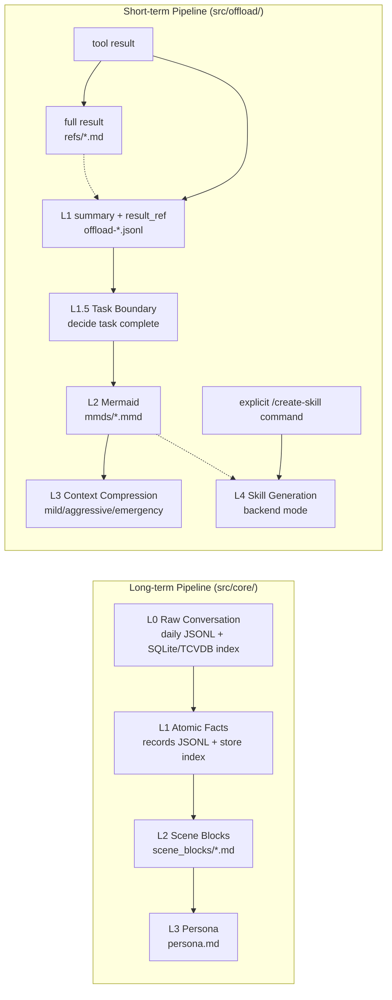
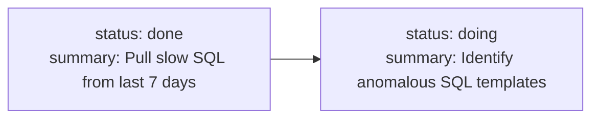
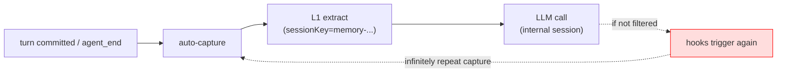
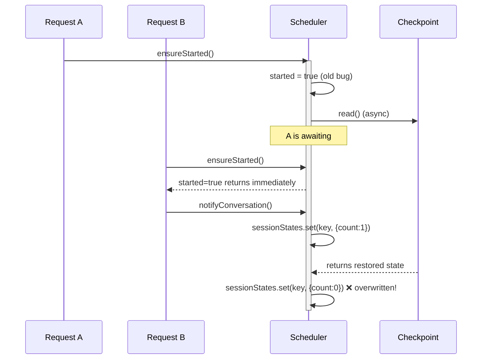

# AI Agent Long-Term Memory & Context Compression System Deep-Dive (In-House Edition)

> Evidence boundary: this is English supplementary material, not an independent source of facts. Current behavior must match `../03-Agent-Memory/Agent-Memory-端到端系统深挖.md`, the checked-in TypeScript source, and stored benchmark reports. WideSearch and PersonaMem values are benchmark-specific, not production-wide averages. Production tenure, business-channel adoption, traffic, operational impact, recovery time, compliance process, team interaction, and personal ownership require internal records. Rollout, scale-out, failure response, and bank-compliance sections are scenario/design answers unless a paragraph explicitly names a source-verified mechanism.

> This blog is an expanded version of Chapter 2 (Agent Memory) from the *AI-Agent Interview Deep-Dive Blog*, focused on the resume entry "AI Agent Long-Term Memory & Context Compression System (Independently Owned)."
>
> Content positioning: a host-neutral Agent Memory implementation and a set of interview design drills. It covers architecture decisions, source-visible failure modes, benchmark evidence, and hypothetical productionization.
>
> How to read: always label an answer as current implementation, recorded benchmark, fact requiring confirmation, or scenario design. Do not use the presence of code safeguards as proof that a corresponding operational event occurred.

---

## 0. The "Hook" This Project Provides on a Resume

Source-safe interview version:

> I worked on an L0–L3 memory architecture, Hybrid RRF recall, and recoverable context offload. In the stored benchmark configuration, WideSearch token usage fell by 61.38% while pass rate moved from 33% to 50%, and PersonaMem final-answer accuracy moved from 48% to 76%. These are benchmark results; business-channel adoption and production scope must be supported separately.

**Hook keywords**: tiered memory, symbolic compression, dual pipeline, Mermaid, Hybrid RRF, host-neutral integration, prompt-cache stability, and checkpoint recovery. Any one of these can lead to a deep follow-up.

**One-sentence business context**:

> The implementation separates a host-neutral `TdaiCore` from its adapters. OpenClaw integrates in process through hooks, Hermes can use the HTTP Gateway, and standalone modes reuse the same core. That proves multiple integration shapes; it does not prove adoption by named business teams or a particular user population.

---

# Part 1: Justification & Design Decisions

## 1.1 Why not directly adopt an open-source Memory solution when the project kicked off?

**Typical question:** The industry already has fact-extraction, rolling-summary, and research-oriented Memory solutions. Why did we still build an in-house system?

**Interview answer:**

I would not claim that every open-source product was benchmarked or categorically rejected unless I had the comparison record. The defensible answer is that the project needed a specific combination of capabilities:

First, long-term memory and short-term Tool Result offload are separate problems. This project preserves large tool outputs outside the prompt and keeps `node_id` / `result_ref` references for recovery.

Second, a deployer may need local-first storage, approved model endpoints, provenance, retention, deletion, and audit controls. Those are application responsibilities even when a framework provides part of the plumbing.

Third, L0 evidence, L1 atomic memories, L2 scenes, and L3 persona have different trust and lifecycle requirements. The stored PersonaMem benchmark reports 48% and 76% for its recorded variants, but without an ablation report I would not assign that gain to one layer.

Fourth, the host-adapter boundary lets the same core run in process or behind a Gateway. That is the project's concrete integration choice, not proof that no competing library supports multiple hosts.

So the scoped judgment is: for this project, Memory is a lifecycle of capture, extraction, aggregation, recall, offload, drill-down, and update rather than only `add` and `search`. Competitor capabilities must be checked against their current versions.

**Key drilling points:**
- If asked about differentiation, describe the evidence chain, recoverable Tool Result offload, explicit pipeline scheduling, and host adapters. Do not say the project is universally superior.
- If asked why not fork a framework, compare extension points, data model, deployment, licensing, migration cost, and team familiarity for the exact version under consideration.
- If asked "what specifically does compliance require": see Section 1.6.

---

## 1.2 Why "two pipelines" instead of one unified pipeline? ⚠️

**Typical question:** Your long-term L0–L3 pipeline and your short-term offload pipeline both look like layering at the surface — why not merge them?

**Interview answer:**

This is one of the easiest points to get smacked on in an interview, so I'll be explicit.

**They don't solve the same problem:**

- **The long-term pipeline** performs **cross-session** semantic distillation: raw utterances → atomic facts → scenes → persona. Capture starts when a turn is committed. L1 is then scheduled by the warm-up/conversation threshold, an idle timeout, or an explicit flush. L2 has its own post-L1 and maximum-interval scheduling, and L3 is considered after L2. So `session_end` is only one flush path; it is not the only trigger for the long-term pipeline.
- **The short-term pipeline** performs **intra-session** token governance: from tool results → summary + refs → Mermaid canvas → context compression. Trigger is `after_tool_call` / `before_prompt_build`, running **in real time**. The goal is to save tokens right now, in the current LLM call.

**Current implementation:** these are independent data paths. An Offload Mermaid canvas is not automatically promoted into a long-term L2 scene, and there is no frequency-based SOP promotion. Offload L4 is a separate, explicit `/create-skill` flow in backend mode: the user selects an MMD, the backend generates a Skill, and the result is written under `skills/`. That stays inside the Offload feature; it is not a bridge into long-term memory.

**Next version:** if I wanted Offload results to become long-term memory, I would add an explicit, reviewed ingestion contract with provenance, deduplication, and deletion semantics. I would not silently copy an MMD file into `scene_blocks/` because those two L2 labels have different meanings.

**Why not merge? Because merging causes big problems:**

1. The long-term pipeline is asynchronous, degradable, failure-tolerant; the short-term pipeline must return in real time (otherwise it blocks the LLM call). Their SLOs are completely different.
2. The long-term pipeline's "L1 extraction" is structured facts produced by an LLM; the short-term pipeline's "L1" is tool-result summaries. One writes long-term records and search indices; the other writes Offload entries and result references. Forcing them into one type hierarchy would mix unrelated semantics and lifecycles.
3. Triggers are completely different: long-term is turn-level; short-term is tool-call-level. Stuffing them into the same scheduler means a problem in one affects the other.

⚠️ **Don't be fooled by the names.** The code lives in two separate areas, `src/core/` and `src/offload/`. They are packaged into the same in-house integration, but they do not share layer semantics, data structures, schedulers, state machines, or checkpoint files.



**Key drilling points:**
- "What if short-term output also needs to be stored in the long-term store?": that is not implemented today. My next-version design would send selected evidence through an explicit ingestion API and the normal extraction/dedup path, rather than treating an Offload MMD as a long-term L2 scene.

---

## 1.3 Storage selection: why SQLite plus an optional cloud vector backend?

**Typical question:** When building a Memory system in-house, how do you choose the storage backend?

**Interview answer:**

The current implementation uses an `IMemoryStore`-style capability boundary rather than a hard-coded PG migration story. The local path combines SQLite metadata, FTS5/BM25, and optional vector capability; the cloud path uses TCVDB-style dense/sparse retrieval. The exact backend is selected by configuration and capability.

SQLite fits local-first, zero-configuration use and keeps structured records, keyword search, and local artifacts close together. Its limits are sustained write contention, multi-process topology, and large multi-tenant operation. A service-backed vector store is appropriate when shared access, operational scale, and server-side retrieval justify its network and governance cost.

I would choose or migrate backends using a reproducible workload: corpus size, tenant filters, recall quality, p50/p95/p99, write throughput, rebuild time, cost, and failure behavior. The source does not establish a measured migration threshold or a completed backend switch.

---

## 1.4 Why host-neutral? How much complexity did this abstraction add?

**Typical question:** You built a host-neutral abstraction to support multiple in-house Agent platforms — isn't that over-engineering?

**Interview answer:**

The source-backed answer is architectural. `TdaiCore` contains the memory behavior; host-specific code translates lifecycle events and runtime services into the core API. OpenClaw registers hooks and tools in process. Hermes can use the HTTP Gateway. Standalone modes reuse the same core. `LLMRunner` and storage capabilities are also abstracted so the core is not tied to one provider or backend.

The trade-off is more interfaces, lifecycle handling, and compatibility testing. The benefit is that capture, recall, scheduling, and offload logic do not need to be copied into every host. The source does not establish a particular onboarding history, named internal adopters, or quantified delivery savings.

---

## 1.5 Why Mermaid instead of JSON / custom DSL?

**Typical question:** For the short-term task canvas, you used Mermaid. Why not JSON? Isn't JSON more structured?

**Interview answer:**

I would answer this as a format trade-off, not as a claim that we ran three formal experiments.

**If I used JSON**, it might look like this:

```json
{
  "task": "Work Order #20240312-A8821 Investigation",
  "nodes": [
    {"id": "001-N1", "status": "done", "summary": "..."}
  ],
  "edges": [{"from": "001-N1", "to": "001-N2"}]
}
```

The trade-offs would be:

1. **Structural overhead**: repeated keys, quotes, and brackets can consume more tokens; the exact difference depends on content and tokenizer.
2. **Strict parsing**: one malformed comma or quote can invalidate the whole payload unless I add schema validation and repair.
3. **Topology is less scannable**: JSON is good for machines, but a task's main path and branches are harder to see at a glance.

**If I used a custom DSL**, it might look like this:

```
[001-N1 done] -> [001-N2 doing] -> [001-N3 todo]
```

The trade-offs would be:

1. I would own the grammar, escaping rules, parser, compatibility, and validation.
2. I would also need a renderer or a conversion layer if I wanted to inspect the task graph visually.

**The current implementation uses Mermaid**:



Why it fits this implementation:

1. **Compact topology**: node and edge syntax expresses the task structure without repeating a large object schema.
2. **Model familiarity**: many models understand Mermaid, although I still need validation and fallback behavior.
3. **Standard rendering**: the same artifact can be rendered by a Mermaid-compatible viewer when I need to inspect the graph.
4. **Recoverable IDs**: the implementation can extract IDs such as `001-N1` and use them to drill down through the Offload entry to `result_ref`.

⚠️ I would not quote a Mermaid token-saving percentage without a same-content, same-tokenizer benchmark. The defensible reasons are compact topology, human readability, renderability, and recoverable node IDs.

**Key drilling points:**
- "Why encode node_id as `\d{3}-N\d+`?": the first three digits come from the MMD sequence and the suffix is the node ordinal. That separates canvases inside the same Offload data scope; it is not a globally unique identifier.
- "What if the LLM writes bad Mermaid syntax?": the L2 backend does `replaceBlocks` incremental patching; if patching fails, it falls back to rewriting `mmdContent` in full; if that also fails, it keeps the old mmd and marks it `node_id="wait"` for the next retry round.

---

## 1.6 Regulated-production scenario: compliance, audit, and PII

**Typical question:** If this in-house system handles regulated data, what compliance controls would you need?

**Interview answer:**

The current source performs targeted cleaning: it removes gateway metadata, base64/media payloads, injected-memory blocks, and sensitive tokens from selected error paths. That is not a complete bank-grade PII, tenancy, or regulatory-audit implementation, and I would not claim a `PiiScrubber`, Luhn pipeline, KYC lexicon, private audit platform, or measured false-positive rate without source and deployment evidence.

If I were designing this for regulated production, I would start with data classification and purpose limitation. Raw conversations, derived memories, embeddings, prompts, responses, and logs need separate retention and access policies. I would use approved model endpoints, encryption, secret management, least privilege, tenant/user filtering at every read and write, deletion/export workflows, immutable security audit events, and redaction tested against representative sensitive-data fixtures.

The hard boundary is that compliance policy comes from the organization's legal and security owners. Technical controls implement that policy; this repository alone cannot prove a bank retention period, mandatory gateway, egress firewall, or regulator-approved workflow.

---

# Part 2: Evaluation

## 2.1 How was the evaluation set designed?

**Typical question:** Your resume says long-term memory accuracy improved from 48% → 76%, tokens dropped by 61%, task pass rate +52%. How were these measured?

**Interview answer:**

The stored reports establish two benchmark results, and I keep their scopes separate:

**PersonaMem benchmark (long-term memory)**

- Recorded final-answer accuracy: 48% baseline and 76% for the configured memory system.
- The result is specific to the stored model, plugin, dataset, and scorer configuration.
- This draft does not independently establish the dataset size, a business-data annotation workflow, or a different baseline architecture.

**WideSearch benchmark (long-task offload)**

- Recorded pass rate: 33% to 50%, a 51.52% relative lift.
- Recorded token usage: 221.31M to 85.64M, a 61.38% reduction.
- These are benchmark totals, not proof of a particular number of real work-order traces or an online traffic average.

There is no source-backed online A/B result in this draft. NPS, second-inquiry rate, online token reduction, canary percentage, and run duration require dashboards or experiment records before they can be quoted.

**Three key evaluation principles:**

**First, preserve the benchmark workload.**
Long-session results depend on the exact task sequence, context window, model, tool outputs, and plugin version. Report those with the score.

**Second, keep the comparison reproducible.**
Hold model, temperature, prompt, tools, dataset, retry policy, and cache policy constant; repeat runs and report variance where the benchmark allows it.

**Third, define the scorer.**
Task pass rate and answer accuracy are meaningless without the rubric, judge, and failure policy. Use the scorer recorded by the benchmark; do not invent a business-QA process.

⚠️ Never claim dual adjudication, human calibration, or an internal judge unless the evaluation artifact proves it.

**Key drilling points:**
- "How was Token -61.38% calculated?": `(221.31M - 85.64M) / 221.31M`, for the recorded WideSearch configuration.
- "Can you generalize it?": no. Change the model, task sequence, context window, or baseline and the result can change.

---

## 2.2 How is the offline and online metrics framework structured?

**Typical question:** If this were operated as a production service, which online metrics would you add, and how would they relate to offline benchmarks?

**Interview answer:**

I would structure metrics into a three-tier pyramid:

```
              ┌──────────────────────────┐
              │  L3 Business Metrics     │  <- ultimate North Star
              │  NPS / Second-Inquiry Rate│
              ├──────────────────────────┤
              │  L2 Behavioral Metrics   │  <- actual user behavior
              │  Re-search Rate / Correction Rate │
              ├──────────────────────────┤
              │  L1 System Metrics       │  <- system health
              │  P95 Latency / Recall Duration │
              │  Cache Hit / Error Rate  │
              └──────────────────────────┘
```

**Offline evaluation** primarily looks at L3 (task pass rate, memory accuracy) to ensure no algorithmic regression.

**Online evaluation** primarily looks at L1+L2, since there's no complete ground truth online. Specific metrics:

| Type | Metric | Why it matters |
|---|---|---|
| Latency | recall, capture, and extraction p50/p95/p99 | Separates foreground blocking from background work |
| Cost | input/output/cached tokens by model and prompt version | Detects context growth, retries, and cache instability |
| Behavior | correction, re-search, and task completion | Gives proxy signals when online ground truth is absent |
| Health | parse failures, queue age, retries, fallback rate | Shows pipeline pressure and degradation |
| Safety | unsupported memory, cross-tenant access, deletion/audit failures | Validates trust boundaries |

Thresholds must be derived from an agreed SLO and measured baseline. The repository does not prove a particular monitoring stack or alert threshold.

Re-search rate can be one proxy, but it is not inverse recall accuracy: users may search for other reasons, and an Agent may fail without searching. Combine it with sampled judgments, corrections, retrieval traces, and task outcomes; derive any threshold from a baseline.

---

## 2.3 Evaluation pitfall: self-feedback contamination

**Typical question:** Did you encounter any data-contamination issues during evaluation?

**Interview answer:**

This is a source-visible contamination risk, not a verified runtime or benchmark event. Internal LLM sessions use recognizable session keys, and hook entry points need to exclude them so memory processing does not capture its own generated traffic.

**How I would validate it**:

1. Tag every host and internal model call with a traceable session identity.
2. Compare captured sessions with the internal-session naming pattern.
3. Verify that auto-capture, auto-recall, and offload hooks short-circuit internal Memory sessions.
4. Add a regression test showing internal extraction cannot create another captured user turn.

The source uses an internal-session classifier and guards hook paths. The exact naming pattern and covered entry points should be quoted from the current source version.

**What this case taught me**:

1. **Every model call needs a traceable identity** so internal and external work can be separated.
2. **Every system injected with hooks must have an "internal vs external" classification tag.** Otherwise the system's own LLM calls contaminate its own metrics and data.
3. **Before evaluation, run a contamination test**. Two runs need not have identical token counts because models and retries can be nondeterministic, but unexpected extra internal calls must be explainable in the trace.



⚠️ An in-process flag is insufficient when work can cross process or HTTP boundaries. A propagated, validated context field is safer than assuming the session-key prefix is the only possible mechanism.

---

# Part 3: Productionization Scenarios and Source-Visible Reliability Controls

## 3.1 Scenario: Canary rollout using safe defaults and staged exposure

**Typical question:** For a heavyweight memory system like this, how do you control risk during rollout?

**Interview answer:**

The source proves safe configuration defaults, not a completed four-channel canary. If I were rolling this out, I would combine feature exposure with workload exposure:

### Dimension 1: Feature canary (within the same Agent)

**Tier 1: Default zero config**
```jsonc
{ "memory": { "enabled": true } }
```
Short-term offload is off by default. This reduces blast radius, but does not guarantee zero behavioral or latency impact. Recall has a bounded timeout and capability-based fallbacks; every host still needs failure-path tests.

**Tier 2: Opt-in offload**
```jsonc
{
  "memory": {
    "config": { "offload": { "enabled": true } }
  }
}
```
Enables short-term context compression. This tier requires the business side to do two additional things:
- Register the mid-tier in the Agent framework's `slots.contextEngine`.
- Run a patch script once to patch the Agent framework (so that after-tool-call events can be taken over by the mid-tier).

Because context-engine integration changes hook behavior, it should be explicit, versioned, tested, and reversible. I would not claim a specific partner-run patch process unless the deployment record proves it.

**Tier 3: Advanced tuning**
```jsonc
{
  "embedding": { ... },
  "llm": { "enabled": true, ... },
  "offload": { "mildOffloadRatio": 0.4, "aggressiveCompressRatio": 0.8 }
}
```
Advanced thresholds are configuration, not adoption percentages. Changes should be validated against a benchmark before rollout.

### Dimension 2: Workload canary

I would use phases like these; they are a design template, not rollout history:

| Phase | Exposure | Exit Evidence |
|---|---|---|
| 0 | Offline replay on a fixed dataset | No critical regression in quality, cost, latency, or safety |
| 1 | Shadow execution with no answer impact | Trace comparison and fallback behavior meet the agreed SLO |
| 2 | Small, reversible low-risk cohort | Guardrails, support process, and rollback are verified |
| 3 | Gradual expansion by risk tier | Each cohort meets predeclared quality and operational gates |

In a shadow design, the candidate memory result is recorded for comparison but does not affect the answer. Sensitive content still needs access control and retention limits even when it is “only in logs.”

Feature flags can control cohort exposure, while configuration controls which capabilities are enabled. I would use both, but I do not claim a specific in-house flag platform from the repository.

---

## 3.2 Scenario: diagnosing prompt-cache instability

**Typical question:** If cost increased after dynamic recall was enabled, how would you investigate?

**Interview answer:**

This is a diagnostic drill based on a real source-level design concern, not a verified launch event.

**Observed signal to validate**: billable input cost changes while traffic, model, prompt length, retries, and tool volume appear stable.

**Investigation approach**:

1. Control for traffic, model, prompt version, question length, tool volume, and retries.
2. Inspect provider-reported cached tokens if the provider exposes them.
3. Diff adjacent prompt prefixes and identify changing blocks.
4. Form the hypothesis that dynamic L1 recall inside a reusable prefix reduces cache reuse.
5. Test that hypothesis with a fixed benchmark; do not infer a percentage cost impact from token count alone.

**Fix**: split recall into two categories:

```
Stable context (appendSystemContext) → appended at end of system prompt, cacheable
  - L3 Persona
  - L2 Scene Navigation
  - Memory tools invocation guide

Dynamic context (prependContext) → prepended to user prompt, changes per turn
  - Current-turn L1 relevant memories
```

The source separates stable and dynamic memory injection. Exact line numbers can move, so cite the current function rather than memorizing a stale range.

Whether the split improves cache hit rate and cost for a provider must be measured. The repository does not prove a particular hit-rate recovery or a return-to-baseline production result.

**Design lessons**:

1. **An Agent system's cost depends not only on context length, but also on context stability.** A stable prefix may be cacheable, while a changing prefix may not be. The billing difference is provider- and model-specific, so I would read cache-usage telemetry instead of quoting a multiplier.
2. **For any content injected into the prompt, first think about whether it's stable or dynamic**, and physically isolate them.
3. **Provider cache usage is useful telemetry** when available, but it must be interpreted with the provider's documented semantics.


⚠️ Cache semantics are provider-specific. Use the selected provider's current documentation and usage fields; do not claim a private gateway implementation without evidence.

---

## 3.3 Source-visible risk: embedding work on the foreground path

**Typical question:** How would you prevent embedding work from blocking turn-commit capture?

**Interview answer:**

The source exposes deferred-embedding capability and background-task draining. That supports an engineering answer, not a claim about a measured user-facing incident.

If turn-commit capture becomes slow, I would time JSONL persistence, metadata/FTS writes, embedding, and vector writes separately.

**Investigation**:

The hypothesis to test is whether a remote embedding call sits on the foreground path. The size of any latency impact requires telemetry and is not a source fact.

**Fix**: split into two paths:

**Path A (a backend that supports deferred embedding)**:
- Synchronous phase writes the durable record and keyword index.
- Embedding runs in background fire-and-forget; when done, update the vector column.
- The turn-commit capture path does not wait for that embedding call.

**Path B (a backend that requires a vector or embeds server-side)**:
- Use the backend capability explicitly and keep fallback behavior observable.

In code, this is differentiated via the `vectorStore.supportsDeferredEmbedding` capability flag.

**Another pitfall in implementation details**:
Background embedding is fire-and-forget, but **if the process shuts down while an embedding is still in flight, and the DB is already closed, the write will explode with "database is not open."**

Current safeguard:
- `TdaiCore` maintains a `bgTasks: Set<Promise<void>>`.
- Every background embedding promise registers into it; on completion, finally removes itself.
- `destroy()` waits for those tasks with a bounded timeout before closing the store and embedding service.

⚠️ **Interviewer drilling minefields**:

- "Why not batch embeddings?": measure batch size, queue delay, provider throughput, and partial-failure semantics.
- "During deferred embedding, what if the user searches immediately?": keyword retrieval may still find the record, while vector recall is temporarily incomplete; the product must decide whether that consistency window is acceptable.

---

## 3.4 Source-commented concurrency defect: scheduler startup race

**Typical question:** Any concurrency bugs you encountered?

**Interview answer:**

I would be careful with the wording here. The source comment documents the race mechanism and the current safeguard; it does not prove that I observed it in live operation.

**The risky pattern** would look like this:

```typescript
private started = false;
async ensureSchedulerStarted() {
  if (this.started) return;
  this.started = true;          // ← set to true early
  const cp = await checkpoint.read();
  scheduler.start(cp.states);   // ← writes state back into sessionStates Map
}
```

If two turn-commit calls interleave during startup, this can happen:

```
T0: request A sets started=true and waits for checkpoint.read()
T1: request B sees started=true and updates scheduler state
T2: request A restores checkpoint state over the state written by B
```

**Current implementation:** `ensureSchedulerStarted` uses a promise gate:

```typescript
private schedulerStartPromise?: Promise<void>;

private ensureSchedulerStarted() {
  if (this.schedulerStartPromise) return this.schedulerStartPromise;
  this.schedulerStartPromise = (async () => {
    const cp = await checkpoint.read();
    scheduler.start(cp.states);
  })();
  return this.schedulerStartPromise;
}
```

Every concurrent caller awaits the same promise; only when initialization completes does capture proceed. The comment supports the defect mechanism, not a claim about where or how often it occurred.

**What I would say in the interview:**

1. **Any "set flag first → do async work later" pattern is a race trap.** Even in Node.js single-threaded, it's unsafe because `await` yields the event loop.
2. **A promise gate is the async version of a mutex**: the first call starts the work; subsequent calls await the same promise.
3. **The test I require** starts two calls around a delayed checkpoint read and verifies that both await one initialization and that restored state cannot overwrite a later update. I would not claim a named test exists unless it is present in the test suite.



---

## 3.5 Source-commented scope defect: session end versus process shutdown

**Typical question:** What is the difference between ending one session and shutting down the whole process?

**Interview answer:**

The source comment makes this semantic boundary explicit. It does not prove a live occurrence, affected-user count, or multi-tenant deployment.

**Defect mode**: if one session's end handler destroys a process-global scheduler, other sessions lose in-memory timers and pending work.

The source comment says an earlier implementation conflated the two operations. Conceptually, the risky version was:

```typescript
async handleSessionEnd(sessionKey) {
  await scheduler.destroy();              // ❌ destroys the entire scheduler
  scheduler = createPipelineManager(...);  // ❌ creates a new empty one
}
```

The scope is wrong because process shutdown may tear down shared resources, while `on_session_end` or `POST /session/end` should only flush one session. Destroying the scheduler from a session callback can discard other sessions' in-memory timers, buffers, and pending state.

**Current implementation:** the two semantics are separate:

```typescript
async destroy() {
  // Full shutdown: scheduler, vectorStore, embedding, bgTasks all torn down
}

async handleSessionEnd(sessionKey: string) {
  if (!sessionKey) return;
  await scheduler.flushSession(sessionKey);  // only flush this one
}
```

`flushSession` does exactly three things:

1. Cancel this session's idle timer.
2. If there are still messages in the buffer, immediately trigger one L1 processing pass (trigger="flush").
3. Await the L1 queue to drain, but **do not touch other sessions**.

The code comment spells out the invariant. In an interview, I would explain the current boundary and the test I would write, without turning the comment into a personal incident story.

⚠️ **This case also yielded a deeper lesson**:

> **Whenever an API says "end," "stop," or "close," I first ask what the scope is: one session or the whole process. Those lifecycles should not share one teardown implementation.**

---

## 3.6 Data retention and cleanup strategy

**Typical question:** If all L0 raw text is retained, won't the disk fill up? How would you handle regulated retention requirements?

**Interview answer:**

The current implementation has configurable L0/L1 retention behavior, cleanup guardrails, Session GC, and separate offload artifacts. It does not prove seven-year/three-year/one-year bank retention rules, a `deleteByCustomerId` approval workflow, or the previously listed scheduler timings.

For a regulated deployment, retention must be defined per data class and legal purpose. Raw evidence, derived memory, embeddings, Tool Results, traces, and backups may need different schedules. Deletion must cover primary records, derived indices, cached copies, and provenance while preserving only legally required audit evidence. Exact periods come from policy owners, not from an interview answer.

Scene-count prompts and cleanup thresholds are engineering guardrails, not legal retention controls. Prompt guidance also needs deterministic enforcement when exceeding a hard storage or compliance boundary.

---

# Part 4: Dev-Time Pitfalls

This section covers source-visible implementation pitfalls and design risks. Explain the mechanism and current safeguard; do not present every item as a personally observed event unless an internal record supports it.

## 4.1 LLM "soft delete": when the LLM has no unlink tool

**Typical question:** SceneExtractor lets the LLM read and write Markdown files directly. How do you keep destructive operations under engine control?

**Interview answer:**

Our design principle: **the LLM is a content producer; the engine is the ultimate authority on facts.**

Specific approach:

1. **The LLM has no `exec` / `unlink` tools.** It can only `read_file` / `write_to_file` (and the write tool even refuses to write empty files).
2. **To "delete" a scene, the LLM must write the `[DELETED]` placeholder string into the file.**
3. After the LLM finishes, the engine performs "soft-delete cleanup": scans all .md files; those containing `[DELETED]` or META-only (only a header, no content) are unlinked by the engine.

This is a whitelist-style destruction path: all destructive actions must go through the engine; the LLM cannot directly effect them.

```typescript
// scene-extractor.ts Phase 5
for (const file of allFiles) {
  const raw = await fs.readFile(filePath, "utf-8");
  if (raw.trim().length === 0 || raw.trim() === "[DELETED]") {
    await fs.unlink(filePath);
  } else {
    const block = parseSceneBlock(raw, file);
    if (!block.content || block.content.trim().length === 0) {
      await fs.unlink(filePath);  // META-only, also cleaned
    }
  }
}
```

**Current backup behavior:** before the LLM run, the engine takes a rolling directory backup under `.backup/scene_blocks/`. The default `sceneBackupCount` is 10, so retention is count-based. If the LLM runner throws, the engine attempts to restore the latest directory backup. This path does not currently create a separate soft-delete store or a structured deletion-audit event.

There is an important limit: if the LLM run returns successfully but marks the wrong scene as `[DELETED]`, the cleanup phase will remove it. The backup still gives me recovery material, but the current code does not automatically detect that semantic mistake and restore the file.

⚠️ **Drilling points**:

- "What if the LLM writes `[DELETED]` as the scene content by mistake?": the rolling backup gives me a recovery point. Automatic restore only runs when the LLM runner fails; a successful but semantically wrong deletion needs separate detection or manual recovery.
- "How does the LLM know 'writing [DELETED] equals deletion'?": explicitly stated in the system prompt: "When you want to merge a scene, replace the old file's content with `[DELETED]`."
- "What would you add next?": I would add a deletion manifest, reason, trace identifier, and a review or validation rule for high-value scenes. That is a next-version design, not current behavior.

---

## 4.2 LLM filename bugs: filename normalization

**Typical question:** Sounds like letting the LLM write files is dangerous — any pitfalls encountered?

**Interview answer:**

I would describe this as a source-visible defensive measure, not as a claimed live failure. An LLM-generated scene name can contain spaces or punctuation even when the prompt asks for a clean filename. That can break navigation parsing and make file paths inconsistent across downstream readers.

**Current implementation:** Phase 5b runs `filename-normalizer.ts` after soft-delete cleanup and before index sync:

```
"Daily Rhythm in Shanghai.md" → "Daily-Rhythm-in-Shanghai.md"
"日常生活 健康管理.md"         → "日常生活-健康管理.md"
"Coffee (Yirgacheffe).md"     → "Coffee-Yirgacheffe.md"
```

The normalizer is idempotent, so running it again keeps the canonical name unchanged. Running it before index sync means `scene_index.json` is rebuilt from the normalized filenames.


⚠️ **Drilling points**:

- "Why not rely only on the prompt?": a prompt is a soft constraint. The engine still needs deterministic path validation and normalization.
- "Why normalize before index sync?": it ensures `scene_index.json` records canonical names and downstream readers such as PersonaGenerator and recall use the same path.

---

## 4.3 Scheduler warm-up field backward compatibility

**Typical question:** Your warm-up threshold was added as a later feature — what about old checkpoints?

**Interview answer:**

This is a practical file-schema compatibility problem.

**Current implementation:** the checkpoint is the local file `.metadata/recall_checkpoint.json`, not a database field. `CheckpointManager.readRaw()` parses that file, merges top-level defaults, migrates the legacy combined `session_states` shape into `runner_states` and `pipeline_states`, and then fills missing per-session fields from defaults.

For `warmup_threshold`, the safe default is `0`, which means the session has graduated from warm-up and should use `everyNConversations`:

```typescript
const DEFAULT_PIPELINE_STATE = {
  // ...other fields...
  warmup_threshold: 0,
};

cp.pipeline_states[key] = {
  ...DEFAULT_PIPELINE_STATE,
  ...state,
};
```

That avoids restarting warm-up just because an older checkpoint lacks the field. The same manager also uses a per-file async lock and temp-file-plus-rename for atomic updates; compatibility and write atomicity are separate concerns.

**How I explain the pattern:**

1. A missing field needs an explicit semantic default, not just a TypeScript optional marker.
2. A structural migration, such as splitting `session_states`, should be explicit and deterministic.
3. I would test both the legacy shape and a current checkpoint with selected fields missing, then verify that reading and rewriting preserves both runner-owned and pipeline-owned state.

⚠️ **Drilling points**:

- "Why not reset the checkpoint?": because the checkpoint contains capture and extraction cursors. Resetting it can cause expensive reprocessing and duplicate pressure, so compatibility is safer when the old state is still meaningful.
- "What if more fields are added?": I would add a documented default and a compatibility test for each field. If the semantic conversion is not backward-compatible, I would use an explicit schema version and migration instead of stacking ad hoc defaults.
- "Does the source prove a named migration test?": no. I can describe the test that should exist, but I should not invent a test name or fixture.

---

## 4.4 Repeated registration and singleton state

**Typical question:** How do you keep Offload registration consistent if the host invokes plugin registration more than once?

**Interview answer:**

The source comment says the host lifecycle can call registration multiple times with different API instances, and only the latest API instance remains live. I would state that fact without inventing reconnect, configuration-center, or deployment stories.

**Current implementation:**

1. **Hooks register on the API instance supplied by that lifecycle call.** Earlier API instances are discarded by the host according to the source contract.
2. **Context Engine uses singleton + hot-update**:

```typescript
let _sharedEngine: OffloadContextEngine | null = null;

if (!_sharedEngine) {
  _sharedEngine = new OffloadContextEngine(engineOpts);
} else {
  _sharedEngine.update(engineOpts);  // hot-update internal closures
}
```

3. **SessionRegistry and scheduler-related state are module-level**, so hooks and the Context Engine resolve the same session managers across registration calls.
4. **Context Engine registration is attempted once.** Later calls update the existing engine's closures. If the configured slot belongs to another engine or registration is rejected, Offload sets `_contextEngineRejected` and the hooks become no-ops.

```typescript
if (result?.ok === false) {
  _contextEngineRejected = true;
  return; // all subsequent hooks become no-op
}
```

The no-op guard is necessary because this integration does not have an unregister path in the API surface used here:

```typescript
api.on("after_tool_call", (...args) => {
  if (_contextEngineRejected) return;
  return handler(...args);
});
```

⚠️ **What I would say in the interview:** registration and runtime state have different lifecycles. Shared state needs one owner, repeated setup needs idempotent behavior, and closures that depend on the latest API/config need an explicit update path. The repository proves this mechanism; it does not prove why a particular internal deployment invoked registration again.

---

## 4.5 fastEstimate vs exact tokenization: implementation and benchmark boundary

**Typical question:** In your context compression, you mentioned replacing tiktoken with fastEstimate — how much did you save?

**Interview answer:**

The source supports a fast-estimate path and exact counting near decision boundaries. It does not, by itself, establish an end-to-end latency improvement.

**Problem**: every `assemble()` call (before every LLM invocation) must calculate the current prompt's tokens to decide whether to compress.

Exact tokenization costs CPU on the prompt-building path, especially for long messages. The actual duration depends on tokenizer, hardware, message shape, and cache state, so I would measure it rather than quote a remembered latency.

**Our optimization**:

1. **fastEstimate**: use a character-based approximation to cheaply decide whether the prompt is far from a compression boundary.
2. **Three-stage decision logic**:

```
If fastEst < aggressive_threshold * 0.85:
    → skip tiktoken, use fastEst directly (85% safety margin satisfied)
If fastEst >= aggressive:
    → must use tiktoken for exact count (need to decide exactly how many messages to trim)
Otherwise:
    → fastEst in mild range, also use fastEst (mild doesn't need exact count)
```

3. **Boundary incremental estimate**: after compression, cache the kept-message boundary and fingerprint; if the prefix is unchanged, estimate only newly appended messages.

```
incrementalEst = lastBoundaryTokens + fastEstimate(newMessagesOnly)
```

As long as incrementalEst < aggressive threshold, **the entire tiktoken call is skipped.**

To quantify this optimization, I would benchmark the same prompt corpus with and without the fast path, recording estimate error, exact-tokenizer calls avoided, prompt-build p50/p95, overflow rate, and end-to-end latency. The source alone does not establish the fast-path hit rate or latency improvement.

⚠️ **Drilling points**:

- "How was the safety margin determined?": it is a heuristic policy and should be calibrated on representative prompts. Do not claim a ±10% error bound without a benchmark artifact.
- "What is tail-accumulate?": when there's no boundary yet before the first compression, accumulate tokens from the tail backward until 60% of budget, trimming the front. Much faster than multi-round aggressive from the head.
- "What if inaccuracy causes a token overflow?": there's an emergency fallback — if the LLM call actually errors out due to token overflow, emergencyCompress forces compression to 60%. That's the last line of defense.
- "Why optimize this path?": prompt assembly occurs before the model can respond, so unnecessary CPU work directly consumes the interaction latency budget. The exact SLO requires product evidence.

---

## 4.6 Tool-pair safety: the easiest thing to break during compression

**Typical question:** What in context compression must never be touched?

**Interview answer:**

`tool_use` ↔ `tool_result` pairs **must absolutely never be split apart.**

**Background**: many model APIs require valid `tool_use` / `tool_result` structure:

- An assistant message containing a `tool_use` block must be immediately followed by a `tool_result` (or a user message containing a tool_result).
- Orphaned calls or results can cause schema rejection or corrupt the model's understanding, depending on the provider.

**Scenarios where compression can break pairing**:

- Mild compression replaces `tool_result` with a summary (OK — the summary itself is still toolResult role).
- Aggressive compression deletes messages from the head; **the cut point happens to remove a `tool_use` but the `tool_result` is in the keep zone** — orphan tool_result.
- Aggressive compression removes a `tool_result` but the `tool_use` is in the keep zone — orphan tool_use.
- Boundary splice can also produce both situations.

**Our protection**:

1. **Forward extension**: if the next message after the cut point is also a tool_result, keep extending forward until a non-tool_result (consuming all consecutive tool_results).
2. **Backward extension**: if the first message in the keep zone is an assistant tool_use, but its tool_result is before the keep zone (impossible but defensive), extend deletion to include it.
3. **Mixed message strip**: when an assistant message has both text and tool_use, separately strip only those tool_use blocks whose corresponding results were deleted, keeping the text.

The code contains explicit pair-safety logic. Module size is not evidence of correctness and should not be quoted from memory.

⚠️ **Drilling points**:

- "What if IDs don't match?": validate and preserve or remove the pair as a unit; do not rely only on the upstream API to catch it.
- "Has this happened online?": the repository does not establish an occurrence count. Describe the invariant and tests instead.

---

## 4.7 jieba soft dependency and Chinese BM25

**Typical question:** How did you implement Chinese BM25?

**Interview answer:**

For Chinese BM25, tokenization is critical. The local implementation can use the native jieba module with a soft-dependency fallback:

**Why soft dependency**:

- The jieba native module has precompiled binaries for macOS arm64 / Linux x64 / Windows x64.
- Alpine/musl and unsupported runtime combinations are common examples where a native dependency may fail to install.
- We don't want the mid-tier to fail to start because of this.

**Approach**: lazy require + singleton cache + silent fallback:

```typescript
let _jieba: JiebaInstance | null | undefined; // undefined = not yet attempted

function getJieba(): JiebaInstance | null {
  if (_jieba !== undefined) return _jieba;
  try {
    const { Jieba, dict } = require("<in-house tokenizer extension module>");
    _jieba = Jieba.withDict(dict) as JiebaInstance;
  } catch {
    _jieba = null;  // mark unavailable, don't retry next time
  }
  return _jieba;
}
```

**FTS query builder fallback**:

- jieba available → `cutForSearch`, search-engine-mode tokenization, best recall.
- jieba unavailable → unicode regex `/[\p{L}\p{N}_]+/gu`, split by word boundary; for Chinese this splits by sentence (since there are no spaces), but **it still works**.

The fallback keeps the process available, but recall quality and even token boundaries can change. That degradation should be surfaced and benchmarked.

Domain dictionaries are a reasonable future enhancement, but this draft does not prove an in-house banking lexicon or joint ownership with an algorithm team.

⚠️ **Drilling points**:

- "Why not use the IK tokenizer across the board?": IK is Java-ecosystem; our Node.js / Python heterogeneous deployment makes it inconvenient.
- "Why so few stop words (25)?": intentional. BM25 + IDF naturally down-weights high-frequency words; over-filtering actually hurts precision.

---

## 4.8 Test strategy and evidence boundary

**Typical question:** How do you ensure quality in such a system?

**Interview answer:**

**Current evidence:** the checked-in Vitest tests cover the auth-profile key fallback, sanitization rules, and time utilities. The repository also has Vitest and E2E configuration, but configuration is not test coverage. Scheduler startup, session-scoped shutdown, parser, RRF, checkpoint, and Mermaid safeguards are visible in source; I should not say they have tests unless those test files are actually present.

**Next-version test plan:** I would use three layers:

1. **Deterministic unit and integration tests** for parsing, storage, retrieval fusion, checkpointing, compression boundaries, and Tool-pair invariants.
2. **Concurrency and lifecycle tests** for repeated registration, concurrent startup, session flush, process shutdown, pending background work, and recovery.
3. **Recorded-model and benchmark tests** for malformed JSON, extraction quality, conflict handling, token/cost regression, and drill-down recovery.

If multi-tenancy or regulated PII handling is added, isolation, deletion, redaction, and audit completeness become release gates. They are design requirements here, not proof of an existing bank CI process.

⚠️ **Drilling points**:

- "What's the coverage?": quote only a current coverage report. The checked-in configuration does not establish a coverage percentage, test count, runtime, or repeated-run stability.
- "How do you test LLM output?": inject a fake `LLMRunner` and feed deterministic valid, fenced, extra-text, malformed, and empty responses through the real caller. If I later keep sanitized provider-response fixtures, I would version their model and prompt metadata; those fixtures are not present in the current checked-in tests.
- "What happens if a safety gate fails?": in a proposed release policy, the affected capability should not roll out until the failure is resolved or formally risk-accepted. Do not claim a mandatory internal process without evidence.

---

# Part 5: Collaboration & Coordination

## 5.1 Source-backed cross-host integration and collaboration answer

**Typical question:** How can the same Memory core integrate with different Agent hosts, and how would you coordinate that work?

**Interview answer:**

The current core is TypeScript, not Python. OpenClaw integrates in process through hooks and tools. Hermes can call the HTTP Gateway. Standalone/CLI modes reuse `TdaiCore`. That is the source-backed multi-host story.

For cross-team delivery, I would start with an interface contract for capture, recall, search, and session lifecycle; define identity, error, timeout, retry, and idempotency semantics; provide a mock; and phase the integration so basic capture/recall works before optional offload. Deployment topology, mTLS, service discovery, K8s, gRPC, SDK languages, latency, line counts, and delivery-time savings all require separate internal evidence.

⚠️ **Drilling points**:

- "What if a host team doesn't want to integrate?": keep the feature optional and demonstrate value with a workload relevant to that host.
- "Who owns failures?": define ownership, support, rollback, and escalation before rollout; do not invent an existing SLA or weekly meeting.

---

## 5.2 Compatibility with the LLM platform / algorithm team

**Typical question:** What contract would you need with a model or embedding platform team?

**Interview answer:**

This is a collaboration/design answer. The repository supports configurable model and embedding providers but does not prove a named internal platform team or past platform failures.

### 5.2.1 With the in-house AI-compute gateway (LLM gateway)

The LLM-provider contract should cover auth, model identity, timeouts, retry semantics, rate limits, usage fields, structured-output/tool-call schemas, cache semantics, audit fields, and version-change policy. Add contract tests and compatibility mapping rather than relying on an undocumented schema.

### 5.2.2 With the algorithm team (Embedding / in-house LLM)

The embedding-provider contract should expose provider, model, dimensions, batching, quota, and failure behavior.

**Pitfall 1: embedding model change causing dimension mismatch**

If dimensions change, existing vector indices become incompatible. Persist model/dimension metadata, detect mismatch, and rebuild derived vectors while preserving stable records.

**Fix**: store `provider/model/dimensions` sentinel in the DB. On startup, detect changes → trigger `reindexAll` full re-embedding.

Reindexing can be expensive, so make it explicit, observable, resumable, and degradable to keyword retrieval. Exact commands and approval flow must match the current implementation.

**Pitfall 2: embedding call quota**

If an embedding service returns 429 or exposes a quota, the caller should use bounded concurrency, `retry-after`, backoff, a total deadline, and resumable batch checkpoints. A provider should also protect itself, but this draft does not establish a holiday cluster failure.

⚠️ **Drilling points**:

- "How do users perceive an embedding model change?": I cannot claim the effect is slight without a measurement. During reindexing, vector coverage may be incomplete, while keyword retrieval can still provide a fallback. In the next version I would expose reindex progress, compare retrieval quality before and during the rebuild, and choose rollout communication from the measured impact.
- "Why not use an external embedding service?": decide from data classification, approved vendors, quality, latency, cost, and operational control. Do not claim a blanket compliance prohibition or comparable quality without policy and benchmark evidence.

---

# Part 6: High-Frequency Follow-Up Expansion

This section specifically collects the detail questions interviewers **love to drill into most.**

## 6.1 ⚠️ Series: trap questions

### Q1: Why is L1 scheduled instead of running on every turn?

**Answer**:

**Current implementation:** turn commit captures L0 first. L1 is queued when the warm-up/conversation threshold is reached, when the session goes idle, or when an explicit flush happens. `handleSessionEnd` is one flush path and waits for the L1 queue; it is not the only trigger, and I cannot quote a fixed blocking time without traces.

The reason for scheduling is that extraction is model-backed work that can be batched and retried. I do not want every normal turn to wait for it. The trade-off is eventual consistency: a newly captured fact may not be available as L1 memory immediately, and I now need a scheduler, checkpoint state, retries, and lifecycle handling.

**Next version:** if measured backlog or recovery requirements outgrow the in-process queues, I would move extraction jobs to a durable external queue. I would only do that after measuring queue age and restart behavior.

---

### Q2: What happens to the entire turn if L0 write-to-disk fails?

**Answer**:

There is a subtle current-behavior detail here. `recordConversation()` catches a JSONL append failure, logs it, and still returns the filtered messages. Because the callback returns a non-empty result, `captureAtomically()` can advance the capture cursor. The code then continues with store indexing and scheduler notification.

So I would not say, "the cursor stays put and the next turn retries." That is not what this path guarantees. If the SQLite/TCVDB upsert succeeds, L1 may still read the messages from the store, but the daily JSONL evidence copy is missing. If both copies fail, there can be a real durability gap. The benefit is that capture failure does not automatically crash the host turn; the cost is that fail-soft behavior can hide missing evidence unless it is measured.

**Next version:** I would return an explicit `{ persisted, messages }` result, advance the durable cursor only after the chosen source of truth succeeds, and put failed writes into a bounded retry or dead-letter path. I would also expose a metric for "cursor advanced without JSONL persistence" rather than assuming an external alert already exists.

---

### Q3: What if the LLM returns a malformed JSON?

**Answer**:

`l1-extractor`'s `parseExtractionResult` has three layers of defense:

1. Strip markdown code fences (` ```json ... ``` `).
2. Use `\[[\s\S]*\]` to extract a JSON array (tolerates extra text before/after).
3. `sanitizeJsonForParse` fixes control characters (the LLM occasionally writes bare `\n` inside strings).

If parsing still fails, the current parser logs a warning and returns an empty array. That avoids throwing from the parser, but it also means this result is indistinguishable from a valid "no memories" result at the caller. The L1 runner can then advance its batch cursor, so I would not claim that the next round automatically retries the malformed response.

**Next version:** I would return a typed status such as `ok | empty | parse_error`. A parse error should preserve the raw response, use bounded retries, and move to a dead-letter path if it still fails. This answer does not depend on claiming that one internal model is worse than another.

---

### Q4: Why does sceneExtractor use LLM agent mode instead of structured output?

**Answer**:

I would describe the current design, not claim an undocumented structured-output experiment.

**Current implementation:** `SceneExtractor` runs a tool-enabled LLM runner with its workspace restricted to `scene_blocks/`. The model can inspect existing scene files and update the files it needs instead of returning every scene as one large response. The engine still owns the destructive step: the model can write `[DELETED]`, but only cleanup code calls `unlink`.

This design fits a multi-file workspace, but it is not free. Tool calls add orchestration complexity, partial writes are possible, and actual latency depends on the configured model and workload. That is why the current path takes a rolling backup before the run, restores it if the runner throws, normalizes filenames, and rebuilds the index afterward. I would quote model limits or latency only from the actual runtime configuration and traces.

**Next version:** I would compare this with a typed operation plan such as `create/update/delete` plus engine-applied writes. That could improve validation, but I would only switch after testing output size, merge quality, recovery, and latency on the same scene workload.

---

### Q5: What if node_ids from two tasks collide in the Mermaid canvas?

**Answer**:

Within one Offload data scope, `node_id = {mmdPrefix}-N{n}` uses the three-digit MMD sequence plus a node ordinal. Different task canvases therefore use different prefixes:

```
001-N1, 001-N2, 001-N3  ← task 1's nodes
002-N1, 002-N2          ← task 2's nodes
```

When L1.5 chooses a new task, the implementation creates a new MMD sequence; when it resumes an existing task, it can target that existing MMD. This scheme is scoped, not globally unique. Isolation by the Agent data directory and the Offload mappings is part of the identity boundary.

---

### Q6: What if the compliance audit platform goes down?

**Answer**:

This is a system-design scenario. The correct policy depends on data classification and the organization's compliance rules; the repository does not prove a particular audit platform or mandatory synchronous behavior.

I would design an explicit failure policy:

1. Classify operations into fail-closed and temporarily bufferable categories.
2. For bufferable events, persist them durably with encryption, integrity protection, bounded retention, and a retry queue.
3. For high-risk writes that require an audit record before execution, fail closed or require human approval.
4. When the sink recovers, replay idempotently and reconcile gaps; reject new high-risk writes if the durable buffer is full.

The trade-off should be documented as part of the SLO and threat model rather than asserted as a universal rule.

---

## 6.2 Scenario-based system design follow-up questions

### Q1: Given a year to continue optimizing, what would you do?

**Answer**:

Ranked by ROI:

1. **Retrieval traces and evaluation**: persist why each memory was recalled, then build labeled conflict, freshness, and drill-down tests.
2. **Identity and deletion governance**: add explicit tenant/user scope, provenance validation, export, correction, and deletion semantics.
3. **Scalable background execution**: externalize queue/checkpoint state only after a workload proves the in-process scheduler is the bottleneck.
4. **Operational visibility**: expose queue age, recall composition, fallback, token, latency, and unsupported-memory signals.
5. **Optional workflow promotion**: evaluate whether repeated successful task patterns can become reviewed Skills or SOPs; do not auto-promote solely from frequency.

---

### Q2: What worries you most about 10x project scale?

**Answer**:

Three things worry me most:

**First, scheduler state and timers.**
At larger scale, I would measure active-session cardinality, heap, GC, timer count, queue age, and recovery time. If the in-process design becomes the bottleneck, shard ownership and externalize durable queue/checkpoint state. A scale multiplier does not imply an absolute entry count without a baseline.

**Second, storage and retrieval.**
Measure write contention, corpus growth, filtered recall latency, rebuild time, and tenant isolation. SQLite and a cloud vector backend have different limits; I would not quote 5,000 ops/s, PG, 16 shards, or a migration threshold without a benchmark.

**Third, model and embedding quotas.**
Use bounded concurrency, batch where appropriate, coalesce triggers, prioritize fresh/high-value work, and degrade safely. Extraction skipping needs an explicit rule and evaluation because “no significant information” is itself a model decision.

---

### Q3: If you could rebuild it from scratch, what would you change?

**Answer**:

Three things I'd most want to change:

1. **Define host and provider contracts early**, while avoiding abstractions that are not justified by a second implementation.
2. **Make provenance and conflict policy structural**, rather than relying mainly on prompt instructions.
3. **Add concurrency and lifecycle tests early** for startup, session end, shutdown, checkpoint writes, and background work.
4. **Design privacy, tenant identity, deletion, and retention before ingesting sensitive data.** This is a lesson and proposed design principle, not a claim about a two-week unredacted production window.

---

## 6.3 Counter-question phase

If interviewing for an Agent platform / Memory Infra role, you can counter-ask:

1. "Is your team's current Memory system based on a modified open-source solution, or fully self-built?"
2. "In Agent long-session scenarios, what's your biggest pain point — token cost, long-term memory accuracy, or tool-log explosion?"
3. "Does your Agent evaluation system use public benchmarks or internal business data?"
4. "How does your team position memory persistence — as a core data asset (requiring rigorous backup) or as a cache (rebuildable)?"
5. "For finance / government / enterprise clients, where does compliance and audit rank in your priorities?"

---

# Conclusion

The easiest way to tell a shallow version of this project is to only talk about the tiered architecture and Hybrid RRF. But **what really makes an interviewer nod is**:

- I can explain the project's concrete requirements and compare current framework versions without absolute competitor claims.
- I can explain the prompt-cache instability scenario and how I would verify it.
- I can explain source-commented defects such as session-scoped flush versus process-scoped shutdown without inventing operational impact.
- I can explain **why LLM soft-delete writes `[DELETED]` instead of granting an unlink tool.**
- I can explain the fast-estimate optimization and the benchmark needed before quoting latency savings.
- I can separate current cleaning behavior from a regulated-production privacy, audit, and tenancy design.

Remember one sentence:

> **A Memory system is not only a retrieval problem. It also requires evidence fidelity, lifecycle control, concurrency, degradation, observability, privacy, and deletion governance. The strongest interview answer separates what the source implements, what a benchmark measured, and what I would still design for production.**
