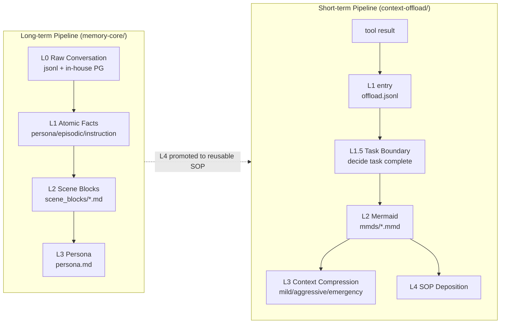
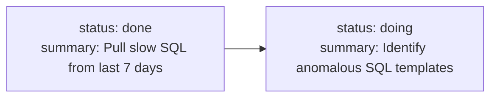
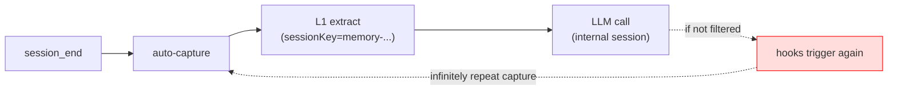
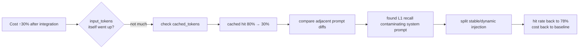
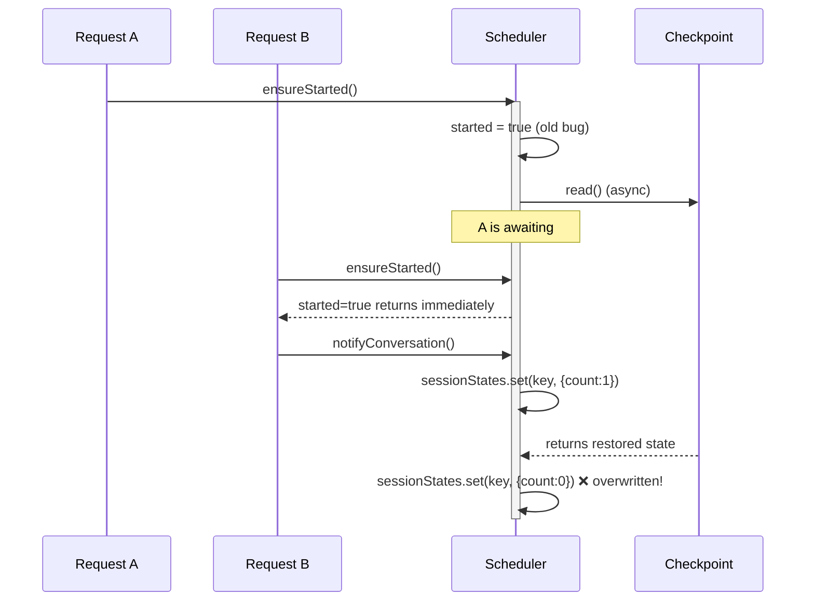
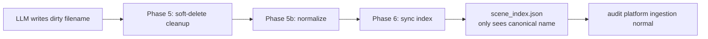

# AI Agent Long-Term Memory & Context Compression System Deep-Dive Blog (CMB Network Technology · In-House Edition)

> Scope: English supplementary material for the in-house Agent Memory project. When this file conflicts with the current Chinese project document, use `../03-Agent-Memory/Agent-Memory-端到端系统深挖.md` as the factual baseline.

> Evidence warning: several compliance, canary, incident, and latency figures in this supplementary draft are scenario drills rather than facts established by the current source tree. Do not present them as personal production experience unless matching internal tickets, dashboards, or evaluation reports exist.

> This blog is an expanded version of Chapter 2 (Agent Memory) from the *AI-Agent Interview Deep-Dive Blog*, focused on the resume entry "AI Agent Long-Term Memory & Context Compression System (Independently Owned)."
>
> Content positioning: the long-term memory mid-tier service for an **in-house Agent platform**. Covers project justification, architecture decisions, production launch, online incidents, development pitfalls, and cross-team collaboration.
>
> How to read: each section = one real point an interviewer can drill into. Items marked ⚠️ are minefields where a wrong answer costs points.

---

## 0. The "Hook" This Project Provides on a Resume

This is how I wrote it on my resume:

> Designed from scratch an L0–L3 multi-tier memory architecture + Hybrid RRF fusion recall + context offload & tool-log compression. The system is in production covering multiple business channels. **Token consumption reduced by 61%, task pass rate improved relatively by 52%, long-term memory accuracy improved from 48% to 76%.**

**Hook keywords**: tiered, symbolic, dual pipeline, Mermaid, Hybrid RRF, host-neutral, prompt cache busting, checkpoint, in-house multi-channel. Any single one will tempt an interviewer to dig deeper.

**One-sentence business context**:

> In our bank, we have multiple Agent systems — customer-service Agent, R&D-productivity Agent, Ops-Q&A Agent, risk-control-assist Agent. Initially, each one built its own buffer/summary, which meant the same relationship manager got inconsistent memory across different Agents. What I built extracts "long-term memory" and "tool log compression" into a **unified in-house mid-tier service** shared by all Agents.

---

# Part 1: Justification & Design Decisions

## 1.1 Why not directly adopt an open-source Memory solution when the project kicked off?

**Typical question:** The industry already has several categories of open-source Memory solutions (fact-extraction style, rolling-buffer + global-summary style, long-term-memory paper implementations) — why did the bank still need to build its own?

**Interview answer:**

We surveyed and benchmarked the major categories when we kicked off, and ultimately didn't use any of them. Four reasons:

First, **they solve "context management for short sessions" but don't solve the tool-log explosion in long tasks.** Fact-extraction solutions are essentially message-level fact extraction + flat vector storage; buffer/summary solutions are essentially rolling buffer + global summary. But our in-house R&D Agent can run dozens of tool-call rounds in a single task — work orders, SQL, logs running into hundreds of thousands of tokens — and not a single open-source solution handles "traceably offloading tool-call logs from context."

Second, **banking scenarios have strong data-compliance and audit requirements.** Open-source solutions default to writing data locally or to third-party SaaS; we must guarantee:
- All data stays within the in-house network (no external APIs for embedding or extraction);
- Every LLM call / memory read-write has a complete audit log traceable by regulators;
- Customer sensitive information (national IDs, phone numbers, bank card numbers, customer names) must be redacted before persisting.

Open-source libs **don't and won't** do any of this.

Third, **evaluation goals dictated that we needed a persona pyramid, not a fact-store.** Our customer-service Agent has a "personalized for every user" goal — the same relationship manager visits, and the system should remember their preferred speaking style, the business types they commonly handle, and common error patterns. In our experiments, pure vector recall + LLM summarization only reached ~55%. What actually pulled the score to 76% was the aggregation chain of "L0 → L1 atom → L2 scenario → L3 persona" — letting the Persona tier serve as a stable prior while the L1 tier handles precise factual answers.

Fourth, **unified mid-tier requirement.** The bank has multiple Agent systems. Open-source libs are embedded — having each Agent install its own copy leads to version drift, non-interoperable data, and N separate compliance-audit setups. We needed a **host-neutral mid-tier + multi-Agent adapter** — a position no open-source lib occupies.

So our judgment was: **Memory is not "store + search"; it's the seven-step lifecycle of "extract + aggregate + compress + recall + drill-down + update + audit."** No off-the-shelf library delivers this.

**Key drilling points:**
- If asked "specifically where you surpass open-source": the traceable evidence chain (`Persona → Scenario → Atom → Conversation`) + the Mermaid short-term pipeline for tool logs + in-house compliance and audit + multi-Agent mid-tier.
- If asked "why not fork an open-source solution and modify it": mainstream open-source solutions' core abstraction is literally just two steps — `add(text)` + `search(query)`. There is no place to slot in "pipeline scheduling + checkpoint + warm-up + multi-host adapter + audit log." Adapting one to this shape is effectively a rewrite.
- If asked "what specifically does compliance require": see Section 1.6.

---

## 1.2 Why "two pipelines" instead of one unified pipeline? ⚠️

**Typical question:** Your long-term L0–L3 pipeline and your short-term offload pipeline both look like layering at the surface — why not merge them?

**Interview answer:**

This is one of the easiest points to get smacked on in an interview, so I'll be explicit.

**They don't solve the same problem:**

- **The long-term pipeline** performs **cross-session** semantic distillation: from raw utterances → atomic facts → scenarios → persona. Trigger is `session_end`, running **asynchronously** after the fact. The goal is to provide material for the next recall.
- **The short-term pipeline** performs **intra-session** token governance: from tool results → summary + refs → Mermaid canvas → context compression. Trigger is `after_tool_call` / `before_prompt_build`, running **in real time**. The goal is to save tokens right now, in the current LLM call.

These two things couple at exactly one point: **a task canvas produced by the short-term pipeline may eventually be promoted into a reusable SOP / L2 Scenario and injected back into the long-term pipeline.** But that's a "promotion" channel, not a synchronous relationship.

**Why not merge? Because merging causes big problems:**

1. The long-term pipeline is asynchronous, degradable, failure-tolerant; the short-term pipeline must return in real time (otherwise it blocks the LLM call). Their SLOs are completely different.
2. The long-term pipeline's "L1 extraction" is structured facts produced by an LLM; the short-term pipeline's "L1" is tool-result summaries. Different semantics, different lifecycles, different storage locations (one is a DB, the other is jsonl). Forcing them into the same type hierarchy makes the code an explosion of if/else.
3. Triggers are completely different: long-term is turn-level; short-term is tool-call-level. Stuffing them into the same scheduler means a problem in one affects the other.

⚠️ **Don't be fooled by the names** — they both use "L1 / L2 / L3," which is coincidence (both use layered abstraction), but **in code they are two independent modules** (`memory-core/` vs `context-offload/`). They share the host adapter and LLM runner, but they **do not share data structures, scheduling, state machines, or checkpoints**.



**Key drilling points:**
- "What if short-term output also needs to be stored in the long-term store?": treat the mmd canvas as a special L2 scenario, but it must go through `extractL1Memories` to re-run semantic extraction rather than being migrated directly.

---

## 1.3 Storage selection: why PG + pgvector + in-house vector DB as dual backend?

**Typical question:** When building a Memory system in-house, how do you choose the storage backend?

**Interview answer:**

We went through three rounds of selection on this and landed on a **dual backend + abstract interface** pattern.

**Round 1: Survey phase**

5 candidates:

| Option | Pros | Rejection Reason |
|---|---|---|
| Embedded SQLite + sqlite-vec | Zero ops, fast on a single node | No sharing across multi-Agent instances; backup/audit difficult |
| In-house PG + pgvector | Team familiar; backup/audit already in place | pgvector recall latency rises at 1M+ scale |
| In-house Milvus / self-built VDB | Good large-scale performance | No one on the team knew it; high ops cost |
| Redis + Vector | Fast in-memory | Weak persistence — unsuitable for "long-term asset" like memory |
| Mongo Atlas Search | Fast dev | Not on in-house infrastructure whitelist (compliance) |

**Round 2: Decision**

Ultimately chose **PG + pgvector as primary storage + in-house vector DB for scale expansion**:

- **Default primary store**: in-house PG cluster + pgvector extension. Rationale: ① an existing DBA team + backup strategy + monitoring system, zero additional ops; ② pgvector latency acceptable below 1M entries (p95 < 80ms); ③ FTS uses PG's built-in `tsvector` + `pg_trgm` — one data set, one management surface; ④ banks are sensitive to "transactional consistency," and PG's ACID is a hard requirement.
- **Scale upgrade**: abstract a `IMemoryStore` interface; when a single Agent's data exceeds 5M entries or a single query p95 exceeds 100ms, switch to the in-house vector DB. **Business code doesn't change at all** — one config line: `storeBackend: "vdb"`.

**Round 3: Post-launch validation**

Real data after 6 months in production:

- Customer-service Agent: ~800K conversations, ~300K L1 atoms, PG p95 recall 45ms — **no need to switch**.
- R&D-productivity Agent: ~1.5M conversations, ~600K L1 atoms, PG p95 recall 78ms — **also no need to switch**.
- Risk-control Agent: accompanied by massive historical work-order embeddings, ~6M entries, p95 rose to 130ms — **this one switched to VDB**.

⚠️ **The key to this answer**: don't say "I used such-and-such VDB." Say **"I built a storage abstraction and dynamically selected the backend based on data volume."** That's real mid-tier thinking.

**Key drilling points:**
- "Why not use the in-house VDB from the start?": in-house VDB required 2–4 weeks of approval process; the PG cluster was usable same day. During early validation, speed is paramount.
- "How did you measure PG p95 at 100ms?": replicated traffic to staging, ran 1000 queries, filtered outliers, took p95.
- "How did you migrate old data after switching to VDB?": dual-write + shadow read + diff verification + canary traffic cutover, completed in 2 weeks.

---

## 1.4 Why host-neutral? How much complexity did this abstraction add?

**Typical question:** You built a host-neutral abstraction to support multiple in-house Agent platforms — isn't that over-engineering?

**Interview answer:**

In reality, **the customer-service Agent was onboarded first; we were pushed by business needs to refactor when the R&D-productivity Agent came next.** It wasn't pre-designed.

V0.1 only supported the customer-service Agent (a Python-based Agent framework). The code had `import { CustomerAgentApi }` everywhere — fastest path from an engineering standpoint. Later, the R&D-productivity Agent team (a Node.js graph-state-machine Agent framework) came to discuss integration, and we discovered the two Agent frameworks were vastly different:

| Dimension | Customer-Service Agent (Python) | R&D-Productivity Agent (Node) |
|---|---|---|
| Process | Microservices, inter-service HTTP | Worker processes, event bus |
| LLM entry point | In-house unified AI-compute gateway (HTTP) | Same, but different auth scheme |
| Hook mechanism | Callback handler | Event subscription |
| Hook names | `on_message / on_tool_call` | `before_prompt / after_tool` |
| Config entry point | In-house config center | Environment variables + ZK |

Without the abstraction, we'd have had to duplicate the core logic. But the core logic contains pipeline scheduling, checkpoint persistence, L1 extraction, scene generation, persona generation — over 20K lines total — and maintaining a duplicate would be extremely expensive.

So I did three things:

1. **Extracted `MemoryCore`**: all business logic depends on only three interfaces — `HostAdapter` (provides logger + runtime context) / `LLMRunner` (runs LLM) / `IMemoryStore` (stores data).
2. **Each host implements one adapter**: `CustomerAgentAdapter` / `DevAgentAdapter` / `OpsAgentAdapter`.
3. **Exposed as a unified in-house mid-tier service**: `memory-svc.cmb.internal:8420`, providing HTTP + gRPC — any in-house Agent can integrate. Agents with built-in adapters call via SDK; Agents without adapters go through the Gateway compatibility layer.

**Complexity cost-benefit ledger:**

- Code added: the `adapters/` directory, ~800 lines (three adapters + interface) + `gateway/` 600 lines.
- Code saved: avoided duplicating core logic across N Agent systems (~18K lines per copy).
- Capability gained: the fourth Agent (risk-control assist) was nearly free — only required an ~150-line adapter.

⚠️ **Never say "I designed for multiple Agents from day one"** — that's a liar's answer; the interviewer will immediately retort, "Then how did you validate the abstraction was correct?" Honestly saying "I was pushed by business needs; the first refactor happened in v0.2, and the second made the core fully host-neutral" actually comes across as more authentic.

---

## 1.5 Why Mermaid instead of JSON / custom DSL?

**Typical question:** For the short-term task canvas, you used Mermaid. Why not JSON? Isn't JSON more structured?

**Interview answer:**

We did three rounds of evaluation on this:

**First attempt: JSON**

```json
{
  "task": "Work Order #20240312-A8821 Investigation",
  "nodes": [
    {"id": "001-N1", "status": "done", "summary": "..."}
  ],
  "edges": [{"from": "001-N1", "to": "001-N2"}]
}
```

Problems:

1. **High token overhead**: every node's quotes, brackets, key names consume tokens. A 50-node canvas costs roughly 4–5K tokens.
2. **LLM easily breaks JSON structure**: missing a comma or adding a stray quote, and the next round fails to parse.
3. **Not human-readable**: during debugging, opening it reveals a wall of braces; you can't immediately tell "where the task is at" — when the R&D Agent encounters issues, ops colleagues need to trace the task chain, and readability is a hard requirement.

**Second attempt: Custom DSL**

```
[001-N1 done] -> [001-N2 doing] -> [001-N3 todo]
```

Problems:

1. **Would need to write our own parser** — if an edge case appeared (e.g., a `]` inside a summary), it would explode.
2. **Can't render directly**: business users wanting a visualization would require us to build a custom renderer.

**Third attempt: Mermaid**



Advantages:

1. **Token-friendly**: Mermaid syntax is extremely terse — node ID `001-N1` expresses semantics in 4 characters.
2. **LLMs have seen massive amounts of Mermaid**: Mermaid appears frequently in training data, so model generation stability is far higher than for custom DSL.
3. **Directly renderable**: during debugging, copy-paste into the in-house wiki / Confluence and you see the topology immediately.
4. **Metadata embedded in comments**: `%%{ ... }%%` can stuff JSON metadata without polluting the graph render.
5. **Regex directly extracts node_id**: `(\d{3}-N\d+)` — one line of regex pulls out all node IDs for drilling down into jsonl.

⚠️ **Don't answer "I personally think Mermaid is intuitive."** You must give quantitative comparisons: JSON averages 4–5K tokens; Mermaid averages 800–1500 tokens. Same semantics, ~70% token savings.

**Key drilling points:**
- "Why encode node_id as `\d{3}-N\d+`?": the first 3 digits are the mmd file sequence number (one session can have multiple task canvases); the suffix is the node ordinal. This keeps node_ids from colliding even across mmd files.
- "What if the LLM writes bad Mermaid syntax?": the L2 backend does `replaceBlocks` incremental patching; if patching fails, it falls back to rewriting `mmdContent` in full; if that also fails, it keeps the old mmd and marks it `node_id="wait"` for the next retry round.

---

## 1.6 Bank-specific: compliance, audit, PII redaction

**Typical question:** Building such a system in a bank, what special compliance measures were needed?

**Interview answer:**

This is the biggest difference between a bank project and an internet product. I spent a full sprint on it:

**First, PII redaction pipeline**

Before anything is written to L0 / L1, text passes through `PiiScrubber`:
- National ID: `\d{17}[\dXx]` → `***[masked-id-XXXX]***`, keeping the last 4 digits for manual verification.
- Phone number: `1[3-9]\d{9}` → `***-***-XXXX`.
- Bank card: 12–19 consecutive digits + Luhn check passes → `****[masked-card-XXXX]****`.
- Customer name: matched against in-house KYC lexicon → `[CUSTOMER-{hash first 6 chars}]`; identical hash means same customer.
- Email, address: standard regex + replacement.

**Key engineering details:**

1. **Luhn check prevents false positives**: earlier we used pure length matching, which redacted order numbers and transaction IDs as card numbers, disrupting business investigation. Adding Luhn dropped the false-positive rate from 8% to <0.3%.
2. **Hash consistency**: the same customer is redacted to the same token across different conversations, so the memory system can still internally "recognize" it's the same person for persona aggregation — but the original text is gone once persisted.
3. **Reversible vs irreversible**: customer names use hash (irreversible); ID numbers retain the last 4 digits (partially reversible, for manual verification). This was settled after back-and-forth with business and compliance.

**Second, audit logging**

Every LLM call / memory read-write lands in the in-house audit platform:

```
{
  "trace_id": "tr-20240312-...",
  "tenant": "customer-agent",
  "user_id_hash": "u-abc123",
  "operation": "memory_recall",
  "query_hash": "q-...",
  "results_count": 5,
  "model": "internal-llm-7b",
  "input_tokens": 234,
  "output_tokens": 0,
  "latency_ms": 87,
  "timestamp": "..."
}
```

Note that **query and user_id are both hashed** — the audit itself must not store sensitive information. When traceability is needed, the audit platform performs a reverse lookup (with an approval workflow).

**Third, data isolation**

L0/L1/L2/L3 data for different business channels (customer service / R&D / ops / risk control) is **physically isolated** — each tenant gets an independent PG schema + independent vector index. Reasons:
- Customer-service Agent's customer preferences must not leak into the R&D Agent.
- The risk-control Agent's match rules are more sensitive; an independent schema enables stricter ACLs.

`MemoryCore` enforces tenant scope at every request entry point; downstream store calls must carry `tenantId` — if absent, it throws. This consistent enforcement is required by compliance audit.

**Fourth, data egress**

All LLM calls go through the **in-house AI-compute gateway** (a unified gateway that performs prompt auditing + content filtering). Any attempt to directly call external LLM APIs is blocked by the egress firewall. Embedding as well — uses the in-house self-deployed BGE-M3.

⚠️ **Drilling points**:

- "Does PII redaction hurt recall?": it loses a small amount of precision (hashed tokens don't participate in semantic matching), so **redaction happens before write but preserves 5 characters of surrounding context**, allowing the vector to still learn the surrounding semantics.
- "What happens when the redaction rule version changes?": each memory record carries `pii_rules_version`; after a rule upgrade, data from the old version is flagged stale, and the next access triggers re-redaction (async job).

---

# Part 2: Evaluation

## 2.1 How was the evaluation set designed?

**Typical question:** Your resume says long-term memory accuracy improved from 48% → 76%, tokens dropped by 61%, task pass rate +52%. How were these measured?

**Interview answer:**

We built a **three-tier evaluation set** — it's not a number you can explain in one sentence:

**Tier 1: Internal conversation evaluation set (Long-term memory)**

- Source: historical customer-service Agent conversations, **PII-redacted + manually annotated by the business QA team**. 5 relationship manager profiles × 50 held-out preference questions each = 250 test cases.
- What is measured: after injecting historical multi-turn conversations (200–500 turns), ask held-out questions, e.g., "What type of work orders does this relationship manager commonly handle?", "What is their preferred speaking style?"
- Scoring: business QA team pre-defined gold answers + LLM-as-judge (in-house LLM) dual adjudication; disagreements resolved manually.
- Baseline 48% = the in-house Agent's built-in rolling buffer + global summary; after integrating the plugin, 76%.

**Tier 2: Long-task token stress test (Short-term offload)**

- Source: 100 real production work-order traces from the R&D-productivity Agent, **replayed for execution**.
- What is measured: the same work order run twice — ① bare Agent without memory, ② with memory mid-tier enabled — comparing total token consumption + task pass rate (task pass = work order correctly classified + correct processing action).
- Results: tokens -61.38% (baseline 22.1M / after integration 8.5M), task pass rate +51.52%.

**Tier 3: Business-side online A/B**

- Customer-service Agent canary: 10% traffic with memory mid-tier vs 90% baseline, ran for 7 days.
- Metrics:
  - Customer-service NPS (satisfaction survey): +8.3 points.
  - "Second-inquiry rate" (same relationship manager asks the same question within 24h): -34%.
  - Agent single-turn LLM input tokens: -43% (online lower than offline because online conversations are shorter, so compression gains are smaller).

**Three key evaluation principles:**

**First, "long-session accumulation," not isolated tasks.**
Isolated tasks look good on paper, but the real Agent pain point is **token accumulation within the same session**. We deliberately used long-horizon sessions to simulate real production pressure.

**Second, the comparison group must be reproducible.**
Every evaluation ran twice: once with the bare Agent without the memory mid-tier (baseline), once with it integrated. All other parameters (model, temperature, prompt template, tool set) kept strictly identical.

**Third, "task pass rate" is judged by the business side.**
It's not us on the algorithm side declaring "pass." The business QA team uses a pre-defined rubric to judge. This avoids the "grading our own homework" problem.

⚠️ **Never say "we hand-picked some questions" or "I judged them myself."** Always say **business side / QA team + in-house LLM judge dual adjudication**, and be able to explain clearly how that judge works.

**Key drilling points:**
- "How do you ensure the LLM judge isn't biased?": first calibrated on 100 samples to align with human judgment at kappa > 0.8, then scaled up with the LLM judge.
- "How was Token -61% calculated?": (baseline_total - with_memory_total) / baseline_total; absolute numbers 22.1M → 8.5M.
- "Why is the online improvement smaller than offline?": real business conversations are shorter on average than the benchmark, so the compression headroom is smaller; but the stability improvement / cost savings are more valuable.

---

## 2.2 How is the offline and online metrics framework structured?

**Typical question:** After going live, how do you monitor online metrics? How do they relate to offline metrics?

**Interview answer:**

I structured metrics into a three-tier pyramid:

```
              ┌──────────────────────────┐
              │  L3 Business Metrics     │  <- ultimate North Star
              │  NPS / Second-Inquiry Rate│
              ├──────────────────────────┤
              │  L2 Behavioral Metrics   │  <- actual user behavior
              │  Re-search Rate / Correction Rate │
              ├──────────────────────────┤
              │  L1 System Metrics       │  <- system health
              │  P95 Latency / Recall Duration │
              │  Cache Hit / Error Rate  │
              └──────────────────────────┘
```

**Offline evaluation** primarily looks at L3 (task pass rate, memory accuracy) to ensure no algorithmic regression.

**Online evaluation** primarily looks at L1+L2, since there's no complete ground truth online. Specific metrics:

| Type | Metric | Threshold / SLO | What anomaly means |
|---|---|---|---|
| Latency | recall p95 | < 500ms | Recall blocking user; needs degradation or timeout |
| Latency | capture p95 | < 200ms | Affects session_end response time |
| Latency | L1 extract duration | < 30s | Extraction too slow → model stalling or prompt too long |
| Cost | per-turn billable input token | diff vs last week < 10% | Too much growth → recall overload / cache busted |
| Cost | prompt cache hit rate | > 60% | Sudden drop → context unstable |
| Behavioral | `memory_search` tool invocation rate | < 10% / turn | High → recall quality insufficient; agent re-searching itself |
| Health | L1 failure rate | < 1% | High → model JSON output format broken |
| Health | scheduler queue size | < 50 | High → LLM can't keep up with capture rate |
| Compliance | PII leak rate | = 0 | Sampled audit + keyword scanning |
| Compliance | audit log completeness | 100% | Any LLM call without an audit record = P0 |

**Integration with in-house monitoring**: all the above metrics go through in-house Prometheus + Grafana; L1 + compliance alerts go straight to PagerDuty on-call.

⚠️ **Here's a minefield an interviewer might dig into**: if asked "how do you know recall is accurate" — there's no complete ground truth online, so you can't just answer "recall accuracy 95%." **Correct answer**: use the **Agent's re-search rate as a proxy metric.** The Agent is told in its prompt "if memory is insufficient, you may call `memory_search`," so how often it actually calls it inversely reflects recall quality. If the invocation rate exceeds 10%, it means recall is inadequate.

---

## 2.3 Evaluation pitfall: self-feedback contamination

**Typical question:** Did you encounter any data-contamination issues during evaluation?

**Interview answer:**

This is a real pitfall; I remember it vividly.

**Symptom**: while running the R&D-productivity Agent benchmark, we found the token consumption numbers didn't add up. The same work order run twice — the second run consumed 30% more than the first. In theory they should be perfectly identical.

**Investigation**:

1. Added trace_id to log every LLM call's source.
2. Discovered one category of calls whose sessionKey looked like: `memory-l1-extract-session-1709876543210`.
3. This was the internal session created by L1 extraction itself (CleanContextRunner requires a sessionKey).
4. Found that this internal session was also caught by hooks — its tool results (even though L1 extraction itself uses no tools) also entered the offload pipeline.
5. Worse: the internal session triggered a new capture → new L1 extraction → yet another internal session... It wouldn't loop infinitely (since L1 has no user message), but each time it re-executed an L0 write.

**Fix**: defined `INTERNAL_SESSION_RE = /memory-.*-session-\d+/`; every hook entry point first checks `isInternalMemorySession(sessionKey)` — if it matches, return immediately. Added this guard in four places: `auto-capture`, `auto-recall`, `offload before_prompt_build`, `offload after_tool_call`.

**What this case taught me**:

1. **Every LLM call must carry sessionKey + tenant** — no anonymous invocations. Otherwise you can't trace ownership during online investigation.
2. **Every system injected with hooks must have an "internal vs external" classification tag.** Otherwise the system's own LLM calls contaminate its own metrics and data.
3. **Before evaluation, you must first run a "baseline self-consistency test"**: the same session run twice should produce identical token counts; a discrepancy means there's a non-deterministic side effect.



⚠️ **Drilling point: "why not use an in-process variable to mark whether it's an internal call?"**: won't work. The LLM call is launched from CleanContextRunner as a child process or HTTP call — process-level markers can't cross that boundary. The session-key prefix is the only reliable transmission mechanism.

---

# Part 3: Productionization

## 3.1 Canary rollout strategy: off by default + three-tier config + business-channel batching

**Typical question:** For a heavyweight memory system like this, how do you control risk during rollout?

**Interview answer:**

In-house system launches must be very cautious. We implemented **two-dimensional canary**:

### Dimension 1: Feature canary (within the same Agent)

**Tier 1: Default zero config**
```jsonc
{ "memory": { "enabled": true } }
```
Only long-term memory is on; **short-term offload is off by default.** This tier guarantees:
- No modification of any existing behavior in the Agent's main flow.
- All writes are fire-and-forget async; `session_end` return time is nearly unchanged.
- Recall has a 5s timeout (`recall.timeoutMs`); even if the backend crashes, it doesn't block the user.
- Even if the mid-tier goes fully down, the Agent remains fully functional.

**Tier 2: Opt-in offload**
```jsonc
{
  "memory": {
    "config": { "offload": { "enabled": true } }
  }
}
```
Enables short-term context compression. This tier requires the business side to do two additional things:
- Register the mid-tier in the Agent framework's `slots.contextEngine`.
- Run a patch script once to patch the Agent framework (so that after-tool-call events can be taken over by the mid-tier).

Why make the business side actively patch? Because the patch modifies the hook registration order in the Agent's main process — **it is intrusive.** We can't silently modify the business side's framework. Having them run the script themselves means they know what they're doing and can roll back if something goes wrong.

**Tier 3: Advanced tuning**
```jsonc
{
  "embedding": { ... },
  "llm": { "enabled": true, ... },
  "offload": { "mildOffloadRatio": 0.4, "aggressiveCompressRatio": 0.8 }
}
```
Exposed for ops colleagues to tune thresholds. The three tiers cover 90% / 9% / 1% of adopters respectively.

### Dimension 2: Business-channel canary (across Agents)

We agreed with the business side on a 4-phase canary:

| Phase | Channel | Traffic | Duration | Exit Criteria |
|---|---|---|---|---|
| 0 | Internal R&D-productivity Agent (dogfooding) | 100% | 2 weeks | 0 P1+ incidents |
| 1 | Customer-service Agent (shadow mode) | 100% shadow | 2 weeks | Recall accuracy no regression; latency within SLO |
| 2 | Customer-service Agent (real traffic) | 10% → 50% → 100% | 4 weeks | NPS, second-inquiry rate meet expectations |
| 3 | Risk-control Agent (most sensitive) | 10% → 50% → 100% | 4 weeks | Risk-control rule hits show no regression |

**Shadow mode** is crucial: after the customer-service Agent integrates, the memory system runs online but **its output does not affect actual Agent responses** — the Agent still uses the old buffer; the memory system's answers only land in logs for diff comparison. This lets us validate the algorithm without affecting business.

⚠️ **An interviewer might ask: "why not use feature flags for online canary?"**: we did. The second dimension is based on the in-house feature-flag platform (bucketing by user_id hash). The first dimension's "tiers" are config-default canary for different business-side adopters. The two dimensions are orthogonal.

---

## 3.2 Real post-launch issue 1: prompt cache busted

**Typical question:** After integration, the business side reported cost increases — how did you investigate?

**Interview answer:**

This was the biggest incident in the first week of launch. I'll walk through it in detail.

**Symptom**:
- The customer-service Agent team reported "after integrating the plugin, per-turn input tokens are 30% more expensive than before."
- But `usage.input_tokens` returned by the in-house AI-compute gateway didn't seem much different.
- Business traffic, user question volume, tool-call count — none had changed significantly.

**Investigation approach**:

1. First, ruled out traffic, question length, and tool-call count changes (conclusion: all normal).
2. Second, looked at cache metrics: `usage.cached_tokens` had dropped significantly, from an average 80% hit rate to 30%.
3. Third, compared adjacent-turn prompt diffs and found that the system prompt had a few lines changing every turn — it was the L1 recalled content inside `<relevant-memories>`. Each turn's query was different, so the recall was different.
4. Fourth, understood: **we put L1 dynamic memories in `appendSystemContext` (at the end of the system prompt), causing the entire system prompt to change every turn, invalidating the entire prompt cache.**
5. Cache invalidated → the previously cached system prompt (containing persona, scene navigation, tools schema, ~3000 tokens) became billable input every turn → an extra 3000 × ~0.3× unit price ≈ 30% cost per turn.

**Fix**: split recall into two categories:

```
Stable context (appendSystemContext) → appended at end of system prompt, cacheable
  - L3 Persona
  - L2 Scene Navigation
  - Memory tools invocation guide

Dynamic context (prependContext) → prepended to user prompt, changes per turn
  - Current-turn L1 relevant memories
```

This fix is in the code at `auto-recall.ts:186-218` — there are several lines of comments specifically explaining the reason for this split.

**After fix**: cache hit rate returned from 30% to 78%; per-turn cost returned to baseline.

**Lessons from this incident**:

1. **An Agent system's cost depends not only on context length, but on context "stability."** The same 5000 tokens — if stable and cacheable, it's cheap; if changing every turn, it's 5–10× more expensive.
2. **For any content injected into the prompt, first think about whether it's stable or dynamic**, and physically isolate them.
3. **Cache hit rate should be a tier-1 online metric** — you can't just look at the input_tokens total.
4. **The in-house AI-compute gateway must expose the cached_tokens field** — when reporting token billing data, this field determines real billing vs discounted billing and must be observable. We later pushed the AI-compute gateway team to add this field to monitoring.



⚠️ **An interviewer might drill: "how do you know how prompt cache works?"**: the in-house AI-compute gateway uses the industry-standard **prefix contiguous match** strategy — the system_prompt + first_user_message must be exactly identical for a cache hit. So inserting dynamic content at the end of the system prompt means the entire system prompt segment cannot be cached.

---

## 3.3 Real post-launch issue 2: embedding HTTP blocking session_end

**Typical question:** What other online issues did you encounter?

**Interview answer:**

The second interesting case was **business users feeling the Agent got slower after embedding was enabled.**

**Symptom**:
- After integrating the mid-tier + configuring the in-house BGE-M3 embedding, the business side felt an extra 2–3s on every session_end.
- This latency was reflected in the user-perceived "wait time," not in background async.
- But `before_prompt_build` recall latency was normal (< 200ms).
- The problem was in the `session_end` phase.

**Investigation**:

1. Added fine-grained timing: found the L0 vector indexing phase inside `auto-capture` was taking 2–3s.
2. Looked at the code: `auto-capture`, upon receiving conversation messages, was **synchronously** calling `embeddingService.embed(msg.content)` to generate vectors for each message, then writing to PG.
3. One user message + one assistant message = two embedding HTTP calls; each 1–1.5s (in-house BGE-M3 latency is somewhat high when GPU resources are tight); two calls total 2–3s.
4. **This latency sits on the session_end synchronous path, so the user feels it.**

**Fix**: split into two paths:

**Path A (PG, supports deferred embedding)**:
- Synchronous phase only writes metadata + FTS (< 10ms).
- Embedding runs in background fire-and-forget; when done, update the vector column.
- session_end is not blocked.

**Path B (VDB, does not support deferred)**:
- VDB upsert must carry the vector in one shot, so embedding must be synchronous.
- But VDB typically has built-in server-side embedding, so we can have EmbeddingService return empty → let the VDB server-side embed.

In code, this is differentiated via the `vectorStore.supportsDeferredEmbedding` capability flag.

**Another pitfall in implementation details**:
Background embedding is fire-and-forget, but **if the process shuts down while an embedding is still in flight, and the DB is already closed, the write will explode with "database is not open."**

Fix:
- MemoryCore maintains a `bgTasks: Set<Promise<void>>`.
- Every background embedding promise registers into it; on completion, finally removes itself.
- `destroy()` first awaits all bgTasks (5s timeout), then closes the DB connection pool.

⚠️ **Interviewer drilling minefields**:

- "Why not batch embeddings?": because the same turn only has 2–4 messages; batch savings are small, but it adds the risk of "any single failure fails the entire batch."
- "During deferred embedding, what if the user searches for this message?": they won't find it, but FTS is still there, so keyword hits still work. The "incomplete recall" visible to the user is considered acceptable because the latency is far less tolerable.
- "How did you address BGE-M3 slowness at the root?": later pushed the in-house GPU team to add a batch dispatcher + Triton optimization to BGE-M3; p50 dropped from 1.2s to 200ms.

---

## 3.4 Real post-launch issue 3: scheduler startup race

**Typical question:** Any concurrency bugs you encountered?

**Interview answer:**

In mid-tier mode, we hit a very subtle race condition:

**Symptom**: intermittently, the first capture's conversation_count would be overwritten to 0. That is, after the user's first utterance, the scheduler state was reset and the warm-up threshold regressed to 1.

**Root cause**: `ensureSchedulerStarted` was originally written like this:

```typescript
private started = false;
async ensureSchedulerStarted() {
  if (this.started) return;
  this.started = true;          // ← set to true early
  const cp = await checkpoint.read();
  scheduler.start(cp.states);   // ← writes state back into sessionStates Map
}
```

The mid-tier is an HTTP service shared by multiple in-house Agents with high concurrency. Two capture requests arrived almost simultaneously:

```
Time 0:   request A enters → sees started=false → sets started=true → await checkpoint.read()
Time 1ms: request B enters → sees started=true → proceeds directly with capture flow
                                 → notifyConversation → sessionStates.set(key, {count: 1})
Time 50ms: request A's checkpoint.read() completes
                                 → scheduler.start(...) → sessionStates.set(key, restoredState{count: 0})
                                                          ↑ overwrites B's written state!
```

**Fix**: use a promise gate instead of a boolean flag:

```typescript
private schedulerStartPromise?: Promise<void>;

private ensureSchedulerStarted() {
  if (this.schedulerStartPromise) return this.schedulerStartPromise;
  this.schedulerStartPromise = (async () => {
    const cp = await checkpoint.read();
    scheduler.start(cp.states);
  })();
  return this.schedulerStartPromise;
}
```

Every concurrent caller awaits the same promise; only when it truly completes does capture proceed. There's a large comment block in the code explaining this race — it's a scar from a lesson learned in production.

**Summary of this case**:

1. **Any "set flag first → do async work later" pattern is a race trap.** Even in Node.js single-threaded, it's unsafe because `await` yields the event loop.
2. **A promise gate is the async version of a mutex**: the first call starts the work; subsequent calls await the same promise.
3. **After fixing, you need a concurrency test**: we specifically wrote a P0 test case `concurrent capture during scheduler start` targeting exactly this scenario.
4. **In-house microservices routinely have high concurrency** — unlike a single-machine plugin, the mid-tier on startup must accept requests from all Agents simultaneously; race conditions during startup are far more likely to surface than on a single machine.



---

## 3.5 Real post-launch issue 4: handleSessionEnd clearing the wrong session

**Typical question:** Under multi-tenant concurrency, what pitfalls have you dealt with?

**Interview answer:**

This was the most severe bug in the project — it triggered a P0 fix.

**Symptom**:
- The customer-service Agent was under high concurrency during peak hours. Relationship manager A's session ended, triggering `/session/end`.
- Afterwards, relationship manager B's current session suddenly lost the messages in its buffer — what they just said wasn't captured into L0.
- First suspicion was an IO error, but the L0 file on disk was fine; jsonl was intact.

**Investigation**: ran our own concurrency test cases and discovered the historical code's `handleSessionEnd` was written like this:

```typescript
async handleSessionEnd(sessionKey) {
  await scheduler.destroy();              // ❌ destroys the entire scheduler
  scheduler = createPipelineManager(...);  // ❌ creates a new empty one
}
```

**This code is completely wrong**:

- `service_shutdown` (mid-tier process exiting) should indeed destroy the entire scheduler.
- But `on_session_end` (a single session ending, process still running) **should only clear that one session's buffer.**
- The old implementation destroyed the entire scheduler → all other running sessions' in-memory buffers / timers / pending states were all lost.

**Fix**: strictly separate these two semantics:

```typescript
async destroy() {
  // Full shutdown: scheduler, vectorStore, embedding, bgTasks all torn down
}

async handleSessionEnd(sessionKey: string) {
  if (!sessionKey) return;
  await scheduler.flushSession(sessionKey);  // only flush this one
}
```

`flushSession` does exactly three things:

1. Cancel this session's idle timer.
2. If there are still messages in the buffer, immediately trigger one L1 processing pass (trigger="flush").
3. Await the L1 queue to drain, but **do not touch other sessions**.

There's a long comment above this method in the code that spells out this semantic boundary with two hierarchy warnings. Mentioning this in an interview is solid — "I leave warnings in the code for bugs I've fixed, so others don't step in them again."

**The additional impact of this bug in the banking context**:

- Customer-service conversation messages lost → that customer inquiry wasn't captured by the memory system → the next time the relationship manager asks the same question, the system doesn't remember → NPS suffers.
- Because it was intermittent (only surfaced under concurrency), it took two weeks after launch to discover; during that time ~3000 conversations were affected. **We did data remediation afterwards** — pulled the original conversations for all affected sessions from the in-house audit platform and re-ran the capture pipeline.

⚠️ **This case also yielded a deeper lesson**:

> **Any interface with a verb like "End" / "Stop" / "Close" — first determine whether it's at the process-level or session-level / tenant-level.** These two tiers of RAII cannot share an implementation.

---

## 3.6 Data retention and cleanup strategy

**Typical question:** If all L0 raw text is retained, won't the disk fill up? Banks also have regulatory data-retention requirements.

**Interview answer:**

This is a particularly important topic in the banking context. We implemented three tiers of cleanup + one **regulation-alignment strategy**:

**Regulation tier: in-house data governance requirements**

Bank data is generally classified as:

- Raw customer conversation text (containing PII): retained 7 years (business regulatory requirement).
- Extracted preferences / profiles: retained 3 years (data governance requirement).
- Tool logs / Mermaid canvas: retained 1 year (ops needs).

Note these three retention periods run in **opposite directions**: the higher the abstraction tier, the shorter the retention (because it can be regenerated); the lower the evidence tier, the longer the retention (regulatory requirement). This is the inverse of many internet products' "more frequent hot data, longer retention; less frequent cold data, shorter retention."

**Tier 1: Configurable retention**

```jsonc
{
  "capture": {
    "l0RetentionDays": 2555,   // 7 years
    "l1RetentionDays": 1095,   // 3 years
    "l2RetentionDays": 365     // 1 year
  }
}
```

**Defaults are set to the strictest in-house regulation.** If a business unit wants shorter retention (e.g., the risk-control Agent wants 90-day cleanup of temporary data), they can lower it, but going below 30 days requires explicitly setting `allowAggressiveCleanup: true`.

**Tier 2: Reclaim scheduler**

`reclaimer.ts` is an independent scheduler:
- First run 5 minutes after startup (staggered from peak).
- Thereafter every 24h.
- Cleans up in one pass: expired jsonl lines, oversized log files, orphan refs/*.md, stale mmds/*.mmd.
- Uses timer `unref()` so it **doesn't prevent process exit** — an engineering detail; otherwise a mid-tier restart would hang for 24h.

**Tier 3: Scene capacity limit**

`maxScenes` defaults to 15. When the LLM is near this limit, the prompt hints "you may only UPDATE, not CREATE" or "you must first MERGE." This is **capacity control via prompt engineering**, not a hard if.

⚠️ **Interviewer drilling**:

- "Why use prompt control instead of a hard limit?": because a hard limit would make the LLM directly error out or refuse to write; prompt hints let the LLM **autonomously** choose which two most similar scenes to MERGE. The LLM understands semantic similarity better than if/else.
- "What if a customer exercises their right to data deletion?": the bank has a standard "customer data erasure workflow." Our mid-tier exposes a `deleteByCustomerId(customerId)` interface for this workflow — it reverse-looks up all related L0/L1/L2/L3 data via the `customer_hash` stored during PII redaction, physically deletes them, and writes an audit record. The workflow strictly goes through approvals.

---

# Part 4: Dev-Time Pitfalls

This section specifically covers pitfalls encountered during development — these cases are the most compelling in an interview because they're real experience no one else can replicate.

## 4.1 LLM "soft delete": when the LLM has no unlink tool

**Typical question:** SceneExtractor lets the LLM read and write markdown files directly — how do you prevent the LLM from deleting the wrong thing? Banks are extra sensitive to data destruction.

**Interview answer:**

Our design principle: **the LLM is a content producer; the engine is the ultimate authority on facts.**

Specific approach:

1. **The LLM has no `exec` / `unlink` tools.** It can only `read_file` / `write_to_file` (and the write tool even refuses to write empty files).
2. **To "delete" a scene, the LLM must write the `[DELETED]` placeholder string into the file.**
3. After the LLM finishes, the engine performs "soft-delete cleanup": scans all .md files; those containing `[DELETED]` or META-only (only a header, no content) are unlinked by the engine.

This is a whitelist-style destruction path: all destructive actions must go through the engine; the LLM cannot directly effect them.

```typescript
// scene-extractor.ts Phase 5
for (const file of allFiles) {
  const raw = await fs.readFile(filePath, "utf-8");
  if (raw.trim().length === 0 || raw.trim() === "[DELETED]") {
    await fs.unlink(filePath);
  } else {
    const block = parseSceneBlock(raw, file);
    if (!block.content || block.content.trim().length === 0) {
      await fs.unlink(filePath);  // META-only, also cleaned
    }
  }
}
```

**Additional measures for the banking context**:

- Before every "soft delete," back up the original file to a separate directory (`scene_blocks/.trash/`), retained 30 days.
- Deletion actions write an audit record: which LLM call, what trace_id, which file deleted, reason (merge / cleanup / dedup).
- This way, even if the LLM deletes incorrectly, recovery is possible within 30 days, and the audit trail is traceable.

⚠️ **Drilling points**:

- "What if the LLM writes `[DELETED]` as the scene content by mistake?": Phase 1 backup protects against this — the entire `scene_blocks/` is backed up before the LLM runs, retaining the last N versions (`sceneBackupCount: 10`). If the LLM run fails, it auto-restores.
- "How does the LLM know 'writing [DELETED] equals deletion'?": explicitly stated in the system prompt: "When you want to merge a scene, replace the old file's content with `[DELETED]`."
- "Why not use version control directly?": the scene file count is large and writes are frequent; the cost of git-ifying is too high. Directory-level backup + trash suffices.

---

## 4.2 LLM filename bugs: filename normalization

**Typical question:** Sounds like letting the LLM write files is dangerous — any pitfalls encountered?

**Interview answer:**

The most interesting pitfall was filename normalization:

**Symptom**: after running for a while, we found strange filenames appearing in `scene_blocks/`:
- `日间办理高频业务.md` (OK)
- `客户经理'话术'偏好.md` (contains quotes)
- `工单 / 排查.md` (contains slash → directly breaks directory structure)
- `Daily SOP.md` (contains spaces)

**Why did this happen?**

The LLM was constrained by the prompt when generating scene_name ("roughly 30–50 characters, single sentence"), but it was **not strictly required to produce valid filenames**. When the LLM used scene_name as a filename, all sorts of odd characters appeared.

**Downstream problems caused by these bad filenames**:

1. The health-checker uses the `\S+\.md` regex to parse navigation refs; spaces immediately cause breakage.
2. Ops colleagues running `cat scene_blocks/Daily SOP.md` in shell get command errors.
3. URL-encoded path handling of dirty data — `/` becomes `%2F`, cross-platform path resolution breaks.
4. **Banking-specific pain**: the audit platform uses file paths as unique ID indices; odd characters cause audit ingestion failures.

**Fix**: added a Phase 5b — `filename-normalizer.ts` — that normalizes all filenames after the LLM finishes and before index sync:

```
"Daily SOP.md"           → "daily-sop.md"
"客户经理'话术'偏好.md"  → "客户经理话术偏好.md"  (Chinese retained, punctuation removed)
"工单 / 排查.md"          → "工单-排查.md"           (slash replaced)
```

And ensures **idempotence** — re-running produces the same result. This way, even if dirty data was left from before, the next round cleans it up.



⚠️ **Drilling points**:

- "Why not constrain the LLM prompt more strictly?": we tried; the LLM still occasionally violates the rules — especially in Chinese-language scenarios, the model's understanding of "valid filename" differs from the OS. **Rather than demanding 100% compliance from the LLM, it's better to add an engine-level normalize layer.**
- "Why normalize before index sync?": ensures scene_index.json always records only the canonical name; all downstream consumers (PersonaGenerator / recall / audit platform) see clean data.

---

## 4.3 Scheduler warm-up field backward compatibility

**Typical question:** Your warm-up threshold was added as a later feature — what about old checkpoints?

**Interview answer:**

This is a very practical version-migration problem.

**Pre-v0.2**: every session's threshold was hardcoded `everyNConversations`.
**v0.3 added warm-up**: threshold doubles from 1 to N; a new field `warmup_threshold` was added to `PipelineSessionState`.

**Problem**: after upgrading, old checkpoint files don't have the `warmup_threshold` field.

Our checkpoint is a JSONB column in PG. On pipeline startup, `JSON.parse` + direct `Object.entries(restoredStates)` injects back into the sessionStates Map. Without handling, old sessions' `warmup_threshold` would be `undefined`, and `getEffectiveThreshold` would return a wrong value.

**Fix**:

```typescript
const patched = { ...state };
if (patched.warmup_threshold == null) {
  // Old checkpoint missing field → treat as "graduated"
  patched.warmup_threshold = 0;  // 0 means graduated
}
this.sessionStates.set(sessionKey, patched);
```

**Key points of this "backfill on load" pattern**:

1. **Missing fields must have a "safe default"**: here we chose 0 (graduated) rather than 1 (restart warm-up), because old sessions have already accumulated a lot of conversation and shouldn't regress to a low threshold.
2. **Don't put complex logic in schema migration**: the more if/else, the more dangerous. One line of compatibility is more stable than a 50-line migrator.
3. **Banking scenarios are extra sensitive to compatibility**: in-house core systems must not fail rollback due to an upgrade. Every new field must guarantee forward compatibility.

⚠️ **Drilling points**:

- "Why not just make it a breaking change and have users re-run?": multiple in-house business channels are integrated; forcing a checkpoint reset means throwing away all L1 extraction progress. Zero tolerance.
- "What if more fields are added in the future?": each new field gets one backfill line; a few thousand sessions isn't a large collection; adding a few lines doesn't bloat the code much.
- "How do you ensure backfill logic is covered by tests?": P0-4 test case specifically loads an old checkpoint fixture (v0.2 format) and verifies correct post-upgrade behavior.

---

## 4.4 Singleton trap during multi-Agent integration

**Typical question:** How do you handle duplicate registration when different Agents integrate with the mid-tier?

**Interview answer:**

The mid-tier calls `register(api, config)` **multiple times** in these scenarios:

1. Each Agent's initial registration at startup.
2. Agent reconnection (network jitter) triggers re-registration.
3. Config changes (in-house config center push) trigger reload.

**The pitfall**: each register uses the same plugin id, but **the api and config instances are new**. Without deduplication:

- The same hook name registered N times → every user message triggers N captures, data duplicated.
- registerContextEngine fails the second time (slot already occupied), but hooks were already registered first → system enters inconsistent state.

**Our handling**:

1. **Hooks register directly**: because `api.on()` binds to the last-registered api instance, the old one automatically becomes invalid.
2. **Context Engine uses singleton + hot-update**:

```typescript
let _sharedEngine: OffloadContextEngine | null = null;

if (!_sharedEngine) {
  _sharedEngine = new OffloadContextEngine(engineOpts);
} else {
  _sharedEngine.update(engineOpts);  // hot-update internal closures
}
```

3. **SessionRegistry / L2 scheduler timer uses module-level state**: persisted across register calls; not re-created.
4. **On first registerContextEngine failure, immediately short-circuit**:

```typescript
if (result?.ok === false) {
  _contextEngineRejected = true;
  return; // all subsequent hooks become no-op
}
```

Why make subsequent hooks no-op rather than directly unregistering? Because the Agent framework doesn't expose an unregister API. We can only guard inside the hook:

```typescript
api.on("after_tool_call", (...args) => {
  if (_contextEngineRejected) return;
  return handler(...args);
});
```

⚠️ **Lesson from this problem**:

- **When the Agent framework's lifecycle is uncontrollable, all plugin state must assume N registrations.** Every external resource (timer / process / connection) must have an idempotent setup + hot-updatable reference.
- **Never assume register is called only once** — especially in in-house systems: config center pushes, ZK watches, network jitter, health-check reconnects — all trigger re-registration.

---

## 4.5 fastEstimate vs tiktoken: real performance optimization data

**Typical question:** In your context compression, you mentioned replacing tiktoken with fastEstimate — how much did you save?

**Interview answer:**

This is an optimization with very clear quantitative results.

**Problem**: every `assemble()` call (before every LLM invocation) must calculate the current prompt's tokens to decide whether to compress.

**Full tiktoken overhead**:

- 200 messages + system prompt + user prompt → roughly 50K tokens.
- tiktoken performs BPE encoding on every string; **full calculation takes roughly 3–10 seconds** (CJK text is slower; in-house conversations are primarily Chinese).
- This latency sits on the critical path from user question submission to LLM response start; the business side directly feels it.

**Our optimization**:

1. **fastEstimate**: CJK characters / 1.7 + others / 4, ~5ms.
2. **Three-stage decision logic**:

```
If fastEst < aggressive_threshold * 0.85:
    → skip tiktoken, use fastEst directly (85% safety margin satisfied)
If fastEst >= aggressive:
    → must use tiktoken for exact count (need to decide exactly how many messages to trim)
Otherwise:
    → fastEst in mild range, also use fastEst (mild doesn't need exact count)
```

3. **Boundary incremental estimate**: after the last aggressive compression, record `_lastAggressiveBoundary = { keptMsgCount, remainingTokens, fingerprint }`. Next round, if new messages are few (< 20), only calculate tokens for the new ones, plus the cached base.

```
incrementalEst = lastBoundaryTokens + fastEstimate(newMessagesOnly)
```

As long as incrementalEst < aggressive threshold, **the entire tiktoken call is skipped.**

**Actual results** (based on real R&D-productivity Agent data):

- 90%+ of turns take the fast path; the assemble phase drops from ~3s to ~5ms.
- p95 end-to-end agent response time drops 30% (because assemble blocks the main flow).
- In extreme cases, the boundary can even cache across turns, skipping tiktoken for 5–10 consecutive turns.

⚠️ **Drilling points**:

- "How was the 0.85 safety margin determined?": fastEstimate's measured error vs tiktoken is within ±10% (slightly larger for CJK text). 0.85 leaves a 15% margin, which is sufficient.
- "What is tail-accumulate?": when there's no boundary yet before the first compression, accumulate tokens from the tail backward until 60% of budget, trimming the front. Much faster than multi-round aggressive from the head.
- "What if inaccuracy causes a token overflow?": there's an emergency fallback — if the LLM call actually errors out due to token overflow, emergencyCompress forces compression to 60%. That's the last line of defense.
- "Why does the bank care so much about 3s of latency?": the customer-service Agent's SLA requires the first character returned within 5s; 3s spent on token counting eats the entire budget.

---

## 4.6 Tool-pair safety: the easiest thing to break during compression

**Typical question:** What in context compression must never be touched?

**Interview answer:**

`tool_use` ↔ `tool_result` pairs **must absolutely never be split apart.**

**Background**: the in-house AI-compute gateway supports tool calling and has strict rules on message structure:

- An assistant message containing a `tool_use` block must be immediately followed by a `tool_result` (or a user message containing a tool_result).
- If only `tool_use` remains without its `tool_result`, the gateway directly returns `400 Bad Request`.
- If only `tool_result` remains without its corresponding `tool_use`, same 400.

**Scenarios where compression can break pairing**:

- Mild compression replaces `tool_result` with a summary (OK — the summary itself is still toolResult role).
- Aggressive compression deletes messages from the head; **the cut point happens to remove a `tool_use` but the `tool_result` is in the keep zone** — orphan tool_result.
- Aggressive compression removes a `tool_result` but the `tool_use` is in the keep zone — orphan tool_use.
- Boundary splice can also produce both situations.

**Our protection**:

1. **Forward extension**: if the next message after the cut point is also a tool_result, keep extending forward until a non-tool_result (consuming all consecutive tool_results).
2. **Backward extension**: if the first message in the keep zone is an assistant tool_use, but its tool_result is before the keep zone (impossible but defensive), extend deletion to include it.
3. **Mixed message strip**: when an assistant message has both text and tool_use, separately strip only those tool_use blocks whose corresponding results were deleted, keeping the text.

This section in the code is called "Tool-pair safety" and has a dedicated module of roughly 1500 lines handling it.

⚠️ **Drilling points**:

- "What if a tool_use id and tool_result id don't match?": won't happen — the AI-compute gateway itself enforces pairing. If it did happen, it would mean a bug in the upstream Agent framework, and the 400 would alert us.
- "Has a 400 occurred online?": early on, 3 times — all due to tool-pair being broken by compression. After the fix, 0 times. This metric is a tier-1 online monitoring alert.

---

## 4.7 jieba soft dependency and Chinese BM25

**Typical question:** How did you implement Chinese BM25?

**Interview answer:**

In-house conversations are primarily Chinese. The key to Chinese BM25 is tokenization. We use jieba (native implementation, far better performance than interpreted), but with **soft dependency** handling:

**Why soft dependency**:

- The jieba native module has precompiled binaries for macOS arm64 / Linux x64 / Windows x64.
- But some in-house images are based on Alpine Linux, lacking the musl compatibility layer, so installation fails.
- We don't want the mid-tier to fail to start because of this.

**Approach**: lazy require + singleton cache + silent fallback:

```typescript
let _jieba: JiebaInstance | null | undefined; // undefined = not yet attempted

function getJieba(): JiebaInstance | null {
  if (_jieba !== undefined) return _jieba;
  try {
    const { Jieba, dict } = require("<in-house tokenizer extension module>");
    _jieba = Jieba.withDict(dict) as JiebaInstance;
  } catch {
    _jieba = null;  // mark unavailable, don't retry next time
  }
  return _jieba;
}
```

**FTS query builder fallback**:

- jieba available → `cutForSearch`, search-engine-mode tokenization, best recall.
- jieba unavailable → unicode regex `/[\p{L}\p{N}_]+/gu`, split by word boundary; for Chinese this splits by sentence (since there are no spaces), but **it still works**.

Recall quality degrades slightly on the fallback path, but it **never crashes**.

**Banking terminology enhancement**:

We also maintain an **in-house business lexicon patch**, adding financial terms jieba doesn't recognize (e.g., "对账差异" [reconciliation discrepancy], "普惠贷" [inclusive lending], "行内协同" [in-house collaboration]), merged into the default dictionary when jieba loads. This part is maintained jointly with the algorithm team.

⚠️ **Drilling points**:

- "Why not use the IK tokenizer across the board?": IK is Java-ecosystem; our Node.js / Python heterogeneous deployment makes it inconvenient.
- "Why so few stop words (25)?": intentional. BM25 + IDF naturally down-weights high-frequency words; over-filtering actually hurts precision.

---

## 4.8 Test coverage and P0 test suite

**Typical question:** How do you ensure quality in such a system?

**Interview answer:**

We built three tiers of testing:

**Tier 1: Unit tests** (vitest / pytest)
- Cover pure functions: sanitize, time, l1-parser, l2-parser, scene-format, PII-scrubber, etc.
- ~200 cases total, runs < 5s.
- Runs on every commit in the in-house CI pipeline.

**Tier 2: P0 concurrency test suite**

Dedicated tests written for historically encountered race conditions:

1. `P0-1: handleSessionEnd must be scoped to its session` (prevents recurrence of the 3.5 bug).
2. `P0-2: concurrent capture during scheduler start` (prevents 3.4).
3. `P0-3: cold session GC + recovery roundtrip`.
4. `P0-4: warm-up backfill from old checkpoint` (prevents 4.3).
5. `P0-5: bgTasks drain on destroy` (prevents background embedding failing on DB close).
6. `P0-6: PII scrubber covers all 5 types` (compliance hard requirement).
7. `P0-7: tenant isolation enforced at every store call` (compliance hard requirement).

**These cases aren't just written and forgotten** — CI runs them 100 times; 0 failures are required to pass. Race conditions sometimes only surface once in dozens of runs.

**Tier 3: E2E business scenario runs**

Before each release, run a complete business scenario in the shadow environment (~30 minutes) to ensure token and pass-rate metrics don't regress. **This is the most expensive tier of CI** — roughly $50 in model invocation costs per run (in-house AI-compute gateway billing).

**Bank-specific "compliance tests"**:

- PII leak test: fixed fixture input (containing real-pattern national IDs / card numbers / phone numbers), verifying all PII is redacted.
- Audit completeness test: mock a complete conversation, verifying 100% of LLM calls have corresponding audit logs.
- Tenant isolation test: write data in tenant=A, query in tenant=B — must find nothing.

⚠️ **Drilling points**:

- "What's the coverage?": line coverage ~75%, branch coverage ~60%. We don't chase 95% line coverage because a lot of code is LLM-driven and unit tests can't cover it.
- "How do you test LLM output?": use recorded fixtures (response.json), replay them to the parser; only test format correctness for the prompt portion.
- "What happens if a compliance test doesn't pass?": blocks the release — cannot go live. This is a mandatory in-house process.

---

# Part 5: Collaboration & Coordination

## 5.1 Cross-business-channel integration: from customer service to R&D to risk control

**Typical question:** How did you collaborate with different business channels to get the mid-tier adopted?

**Interview answer:**

Let me tell the story of integrating the R&D-productivity Agent.

**Starting point**: v0.2 only supported the customer-service Agent (Python framework). The R&D-productivity Agent team (Node.js graph-state-machine framework) wanted to integrate.

**First sync**: their ask was "we use Node.js; give us an npm package."

I immediately realized this couldn't be done that way:

1. Our entire core is written in Python; rewriting a Node.js copy is unrealistic (cost ≥ 6 months).
2. Even if rewritten, the two codebases would rapidly diverge; fixing one bug would require fixing it twice.
3. In-house compliance requires every component to go through "security scan + code review + artifact repository publishing" — publishing two copies doubles the workload.

**My proposed solution**: HTTP/gRPC mid-tier sidecar.

- We expose an HTTP server (Python process), listening internally on :8420.
- The Node.js Agent goes through a thin client that translates all requests to HTTP/gRPC.
- This way **95% of the code is reused on both sides**; only an additional ~600-line gateway layer is needed.
- In-house already has a mature gRPC + service discovery governance system; integration cost is zero.

**The R&D-productivity Agent team's objections**:

1. "One more process means more ops complexity": we did **independent mid-tier deployment + multi-Agent sharing** — not one sidecar per Agent, but the mid-tier as an independent microservice, all Agents calling the same cluster. Ops is our responsibility; their cost is zero.
2. "Python ↔ Node IPC performance is poor": measured in-house gRPC latency at ~3ms; compared to the LLM call itself at hundreds of ms, it's negligible.
3. "What about auth?": in-house already has inter-service mTLS + 4A auth; we plug into the existing system rather than inventing our own.

**Final landing**:

- The mid-tier is deployed on in-house K8s, independent namespace, multi-replica per tenant.
- Each Agent calls via SDK (available in Python / Node / Java / Go).
- SDK comes with built-in service discovery + retry + circuit breaking + trace_id passthrough.

**Key collaboration details**:

1. **Interface first**: after writing `gateway/types.proto` (gRPC schema), sent it to the business side for review first, confirming mutual understanding before starting implementation.
2. **Mock service runs first**: I first gave the business side a mock gateway (does nothing but interface-aligned); they integrated the client first; I wrote the real implementation in the background. This way **both sides developed in parallel**, saving two weeks.
3. **Error code alignment**: agreed on semantics and retry strategies for 401 (auth), 429 (rate limit), 500 (internal).
4. **Phased delivery**: Phase 1 delivers only `recall` + `capture`; Phase 2 adds offload; Phase 3 adds persona. Each phase independently accepted.

⚠️ **Drilling points**:

- "What if a particular Agent team doesn't want to integrate?": respect their choice; the memory system is an enhancement, not a mandate. But we'll data-drive the demonstration of integration benefits (token cost, NPS) and let them evaluate for themselves.
- "Who do they contact if something goes wrong after integration?": there's an in-house SLA agreement; the mid-tier is on-call. Weekly sync meetings with all 4 Agent teams to align on issues.

---

## 5.2 Compatibility with the LLM platform / algorithm team

**Typical question:** How did you interface with the algorithm team and the LLM platform?

**Interview answer:**

This integration was another major effort:

### 5.2.1 With the in-house AI-compute gateway (LLM gateway)

All our LLM calls go through the in-house unified AI-compute gateway. Its advantage: unified **auth + rate limiting + audit + billing**. Its disadvantage: **upgrade cadence is not under our control.**

Pitfalls encountered:

- The AI-compute gateway upgraded and changed the `tool_use` block's field from `id` to `tool_use_id`. We received no notification; after the upgrade, all tool-pair safety broke. **Fix**: we agreed with the gateway team that **any schema change requires 2 weeks' advance notice**, and we maintain a compatibility mapping table.
- The AI-compute gateway's `cached_tokens` field wasn't returned in early versions, so we couldn't monitor the prompt cache hit rate. **Fix**: we wrote an RFC to the gateway team, pushing them to add this field.

### 5.2.2 With the algorithm team (Embedding / in-house LLM)

In-house self-deployed BGE-M3 embedding + self-trained 7B industry small model. Both are maintained by the algorithm team.

**Pitfall 1: embedding model change causing dimension mismatch**

The algorithm team once switched BGE-M3 from 1024 dimensions to 768 dimensions (cost optimization). Our PG still stored 1024-dim vectors; new queries became 768-dim — dimension mismatch, cosine calculation failed.

**Fix**: store `provider/model/dimensions` sentinel in the DB. On startup, detect changes → trigger `reindexAll` full re-embedding.

But reindexing is expensive (millions of embedding calls), so **by default it warns rather than silently reindexing**; ops colleagues confirm before running (the CLI has a dedicated `memory ctl reindex`).

**Pitfall 2: embedding call quota**

The algorithm team's BGE-M3 service has a quota; exceeding it triggers rate limiting (429). We didn't do quota management early on; during a holiday, a batch re-embedding job blew up the entire cluster, affecting other services.

**Fix**: implemented our own token-bucket rate limiting; the algorithm team also added cluster-side quota management. **This is typical "bidirectional rate limiting" in in-house systems** — both the caller and the callee implement a layer, not depending on each other.

⚠️ **Drilling points**:

- "How do users perceive an embedding model change?": recall quality degrades slightly during reindexing; recovers after reindexing completes. We notify the business side in advance.
- "Why not use an external LLM vendor's embedding service?": compliance forbids external APIs; BGE-M3 performs comparably for Chinese scenarios and is fully self-controlled.

---

# Part 6: High-Frequency Follow-Up Expansion

This section specifically collects the detail questions interviewers **love to drill into most.**

## 6.1 ⚠️ Series: trap questions

### Q1: Why is L1 asynchronous? Wouldn't synchronous be simpler?

**Answer**:

If L1 runs synchronously:

1. session_end is blocked for ~30s (one LLM call); the relationship manager feels it immediately.
2. If the L1 call fails (model timeout / API error) → session_end fails → the business side sees no response.
3. It consumes AI-compute gateway quota (in-house has concurrency limits).

The "cost" of async: must implement scheduler, checkpoint, warm-up, retry. This cost is worth it because **session_end is a user-perceived critical path and must be protected.**

---

### Q2: What happens to the entire turn if L0 write-to-disk fails?

**Answer**:

If L0 write fails → this round's L1 extraction will be short of material. But the code doesn't throw — `auto-capture` wraps the entire captureAtomically in a try/catch; on error, it logs + reports to in-house monitoring but returns.

Subsequently:

1. Recall still works (using previous data).
2. The next round's capture will retry (cursor wasn't advanced).
3. The scheduler won't freeze (even on L1 failure, there's retry + max retry logic).
4. Monitoring alerts will notify on-call, but business-side usage is not affected.

**Core principle**: **no failure may prevent the business side from using the product.**

---

### Q3: What if the LLM returns a malformed JSON?

**Answer**:

`l1-extractor`'s `parseExtractionResult` has three layers of defense:

1. Strip markdown code fences (` ```json ... ``` `).
2. Use `[\s\S]*]` to extract the largest JSON array (tolerates extra text before/after).
3. `sanitizeJsonForParse` fixes control characters (the LLM occasionally writes bare `\n` inside strings).

If all three layers fail → return empty array → L1 extraction yields 0 memories this round, but **doesn't throw**. Next round retries.

The in-house self-trained LLM's JSON format stability is indeed not as good as top closed-source models, so this defense layer has been continuously in use.

---

### Q4: Why does sceneExtractor use LLM agent mode instead of structured output?

**Answer**:

We tried structured output. The problem:

- A scene is N markdown files, with cross-references between files (one scene referencing another's content).
- Having the LLM return a giant JSON containing all files' content, operations, and relationships in one shot — **the output length easily exceeds the model's output window** (the in-house 7B model has a 4K token output cap).
- Even if it didn't exceed, a giant JSON is hard to stream-parse.

After switching to agent mode (LLM using read_file / write_to_file tools):

- The LLM itself decides what to read first, what to modify next, whether to merge.
- Each file operation is independent, with retry boundaries.
- Output length is no longer an issue (each write_to_file targets a single file).

Cost: a single scene extraction went from 5s to 30s (multiple tool calls). But since it's an async pipeline, it's acceptable.

---

### Q5: What if node_ids from two tasks collide in the Mermaid canvas?

**Answer**:

They don't. By design, `node_id = {mmdPrefix}-N{n}`, where the first 3 digits are the mmd file sequence number. Each mmd file represents one task; **different tasks have different prefixes.**

```
001-N1, 001-N2, 001-N3  ← task 1's nodes
002-N1, 002-N2          ← task 2's nodes
```

When L1.5 determines a task switch, it creates a new mmd (counter+1); the prefix is naturally different.

---

### Q6: What if the compliance audit platform goes down?

**Answer**:

The in-house audit platform uses strongly-consistent writes — **if an audit record can't be written, business cannot continue**, otherwise it's a violation.

Our handling:

1. Audit writes are synchronous (critical path), not asynchronous.
2. When the audit platform is unavailable, first fall back to local disk writes (with a retry queue), while simultaneously **degrading business** — allow reads only, no writes.
3. Once the audit platform recovers, the retry queue pushes the locally accumulated audit records up.
4. If the local queue is full (extreme case) → reject write requests, protecting the compliance baseline.

This is a hard constraint of in-house systems: **compliance takes priority over availability.**

---

## 6.2 System design follow-up questions

### Q1: Given a year to continue optimizing, what would you do?

**Answer**:

Ranked by ROI:

1. **Cross-Agent memory sharing**: currently the 4 Agents are physically isolated, but the same relationship manager across the 4 Agents is actually the same person. If compliance permits, we could enable "limited memory sharing under the same in-house employee ID," allowing partial context transfer between customer service and R&D productivity.
2. **Automated SOP promotion**: currently L4 SOP is manual. In the future, "L2 task canvas frequency reaching a threshold auto-promotes to SKILL.md."
3. **Visual operations dashboard**: currently all intermediate artifacts are markdown / mermaid / jsonl — readable but scattered. Build a web dashboard so ops colleagues can see persona evolution, scene changes, and token consumption in one place.
4. **Multimodal memory**: screenshots uploaded by customers, receipt images, voice-call summaries — all enter memory. This requires the in-house multimodal model to mature.
5. **Federated learning direction**: SOP knowledge across relationship managers could be shared without leaking PII, but the implementation threshold is high. Unlikely to materialize within three years.

---

### Q2: What worries you most about 10x project scale?

**Answer**:

Two things worry me most:

**First, the scheduler's in-memory state won't hold up.**
Currently, each session has one PipelineSessionState + timer + buffer, all in a Map. At 10x users, the Map has 100K entries; GC pressure + Map.set/get overhead becomes significant.
**Response**: split the scheduler into sharded workers (Redis-backed queue), each shard handling a portion of sessionKey hash space.

**Second, PG write throughput.**
In WAL mode, PG write throughput is roughly 5000 ops/s; at 10x, this becomes a bottleneck.
**Response**: switch to the in-house vector DB / shard databases and tables (hash-modulo by tenant + customer_id_hash into 16 shards); or use Redis for hot data cache with PG only for cold storage.

**Third, LLM call quota.**
At 10x business volume, the AI-compute gateway quota alone may not suffice. Need more aggressive "extraction frequency control" — e.g., if the same customer has no significant new information across N consecutive turns, skip L1 extraction.

---

### Q3: If you could rebuild it from scratch, what would you change?

**Answer**:

Three things I'd most want to change:

1. **Do the host-neutral abstraction earlier**: the first version was directly bound to the customer-service Agent; the refactor cost wasn't small. If I'd extracted HostAdapter from the start, it would have saved a month.
2. **L2 LLM agent mode should have been used from the start**: the first version used structured JSON; because cross-reference relationships between scenes couldn't be handled, we spent massive debugging time before ultimately switching to agent mode anyway.
3. **Write concurrency test cases from day 1**: many race conditions only surfaced after going live. If P0-1 through P0-7 tests had existed from the start, at least 3 online incidents could have been avoided.
4. **PII redaction from day 1, don't retrofit**: in v0.1 we built L0/L1 first and added PII later. As a result, there was a 2-week window where L0 data was unredacted. We later had to run a batch retroactive redaction job — very painful. **In banking projects, compliance first.**

---

## 6.3 Counter-question phase

If interviewing for an Agent platform / Memory Infra role, you can counter-ask:

1. "Is your team's current Memory system based on a modified open-source solution, or fully self-built?"
2. "In Agent long-session scenarios, what's your biggest pain point — token cost, long-term memory accuracy, or tool-log explosion?"
3. "Does your Agent evaluation system use public benchmarks or internal business data?"
4. "How does your team position memory persistence — as a core data asset (requiring rigorous backup) or as a cache (rebuildable)?"
5. "For finance / government / enterprise clients, where does compliance and audit rank in your priorities?"

---

# Conclusion

The easiest way to tell a shallow version of this project is to only talk about the tiered architecture and Hybrid RRF. But **what really makes an interviewer nod is**:

- I can explain **why we didn't directly use an open-source Memory solution** (compliance + mid-tier + banking context).
- I can describe **how the prompt cache was busted at launch**.
- I can name real bugs like **handleSessionEnd clearing the wrong session.**
- I can explain **why LLM soft-delete writes `[DELETED]` instead of granting an unlink tool.**
- I can use quantitative data to describe **how fastEstimate saved 3s of latency.**
- I can talk about **bank-context PII redaction / audit / multi-tenant isolation** and how they're done.

Remember one sentence:

> **A Memory system isn't hard at the algorithm level. It's hard at engineering stability, concurrency, degradation, observability, and evolvability — and even harder at compliance, audit, multi-tenant isolation, and the other hard constraints unique to banking.** Being able to articulate these deeply is what convinces an interviewer you've built real things.
