# From Long-Term Memory to Context Compression: End-to-End Design of an In-House Agent Memory System

> Evidence boundary: this is English interview practice, not a separate source of project facts. Current behavior must match the Chinese canonical analysis in `../03-Agent-Memory/Agent-Memory-全链路源码级深入分析.md` and the checked-in code. WideSearch and PersonaMem values are benchmark-specific results for their recorded configurations, not production-wide averages. Exact traffic, user counts, production tenure, operational impact, recovery time, and personal ownership require internal records. Capacity plans, multi-tenant extensions, rollout strategies, and failure responses are scenario/design answers unless explicitly identified as current source behavior.

This article systematically breaks down an in-house Agent Memory project from an interview follow-up perspective: why it was built, what the core business problem is, why long-term memory is split into L0 through L3, why retrieval uses vector, BM25, and Hybrid RRF, and how tool logs in long tasks are offloaded, compressed, and restored.

If I had to summarize this project in one sentence:

> This in-house Agent Memory system is not about simply attaching a vector database to an Agent. Instead, it splits the Agent's historical experience into two tracks — "long-term memory" and "short-term task context" — using layered storage, asynchronous scheduling, hybrid recall, and traceable compression to solve the memory, cost, and recovery problems of long-running Agents.

## 1. Background: The Agent's Problem Is Not "Not Knowing," But "Memory Loss of Control"

Traditional chatbot conversations are usually short, and putting the full history directly into the prompt is sufficient. But Agent scenarios are entirely different.

A real coding agent or workflow agent often executes many consecutive rounds of tasks:

- Users continuously supplement project background, personal preferences, output formats, and SOPs.
- Agents frequently invoke tools — reading files, running commands, searching, testing, fixing errors.
- A single task may span dozens of conversation turns, or even resume days later after interruption.
- Multiple tasks may share the same session, causing the historical context to keep inflating.

This creates two contradictory problems.

First, if all history is retained in context, tokens will rapidly balloon, and the model will be drowned in massive amounts of old logs, repetitive information, and irrelevant details. A longer context doesn't necessarily mean smarter — it often makes it harder to focus on what matters.

Second, if you just create a crude summary, you lose evidence. Especially in coding agents, error logs, file paths, command outputs, and precise user constraints can all be critical. Once a summary drops details, when resuming a task later the Agent can only guess, making hallucinations very likely.

So the core business problem this project aims to solve is not "how to save chat history," but rather:

> How to enable an Agent, in a long-duration, multi-task, high-tool-invocation environment, to both accumulate long-term experience and compress short-term context, while ensuring that critical evidence remains traceable and tasks remain recoverable.

This is also why the project did not choose the simple approach of "one vector database + one summary," but instead designed two complementary mechanisms:

- Long-term memory: An L0-to-L3 layered memory system.
- Short-term memory: A context compression system using Context Offload + Mermaid task canvas.

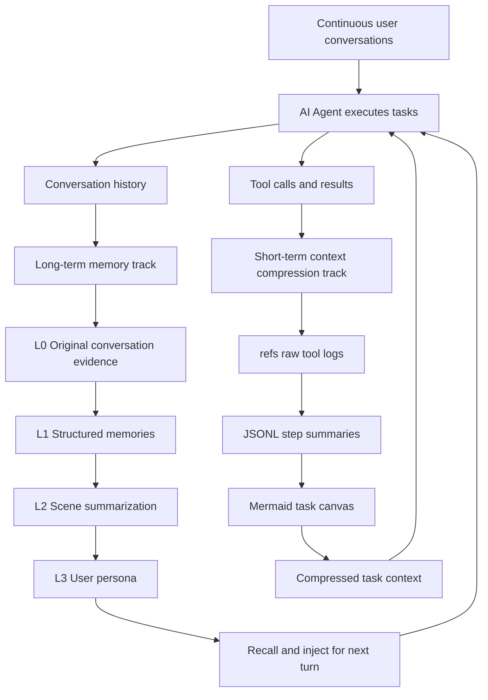

## 2. Overall Goals: Lightweight Foreground, Heavyweight Background, Evidence with an Explicit Lifecycle

This project's goals can be broken down into five layers.

First, the foreground path must be lightweight. After each user conversation turn ends, the system must not immediately block the main flow to perform heavy LLM extraction. It should first reliably record raw data, then hand off complex processing to background scheduling.

Second, memory must be layered. Raw conversations, structured facts, scene summaries, and user personas are fundamentally information at different granularities. Their lifecycles, recall methods, trustworthiness, and token costs are all different.

Third, recall must be robust. Relying solely on vector retrieval easily misses keywords and proper nouns; relying solely on keyword retrieval doesn't understand semantics. The system needs to support both semantic similarity and exact matching simultaneously.

Fourth, normal Tool Result compression should be recoverable while its artifacts are retained. The complete Tool Result is written to refs before the prompt keeps only summaries and indices, and `node_id` / `result_ref` form the drill-down path. Retention can later reclaim refs, and ordinary prompt messages do not all receive this path.

Fifth, the implementation must account for production-oriented operational concerns. The code supports multiple host adapters, such as the OpenClaw plugin and Hermes Gateway, plus checkpointing, concurrent sessions, background tasks, scheduled timers, and graceful shutdown. Those capabilities do not by themselves prove a particular production scale or tenure.

## 3. Core Architecture: TdaiCore as the Host-Agnostic Kernel

Looking at the code structure, the project separates host adaptation from the memory core.

- The OpenClaw entry point is in `index.ts`, responsible for registering hooks, tools, and the context engine.
- The Hermes / sidecar entry point is in `src/gateway/server.ts`, exposing recall, capture, search, session end, and other interfaces via HTTP.
- The real core capability is encapsulated in `src/core/tdai-core.ts`.
- The background scheduler is `src/utils/pipeline-manager.ts`.
- The context offload logic lives in `src/offload/`.

The advantage of this design is that the memory system is not bound to any single Agent framework. OpenClaw calls it through hooks, Hermes calls it through Gateway HTTP, but internally they all go through the same `TdaiCore`.

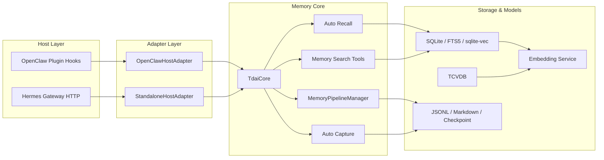

The end-to-end data flow can be divided into two paths.

The first is the write path, which is the capture after each conversation turn ends:

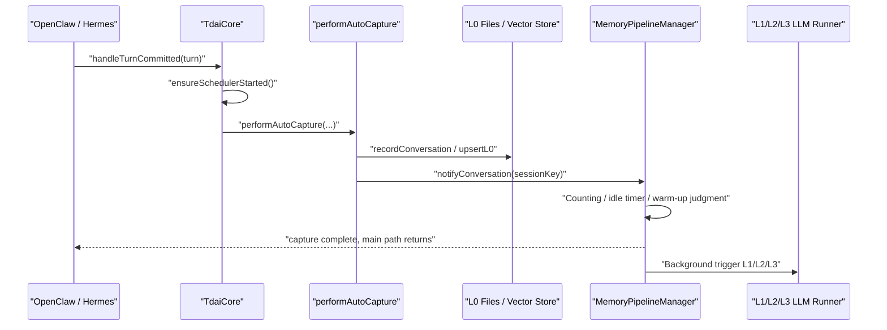

The second is the read path, which is the recall before the next conversation turn:

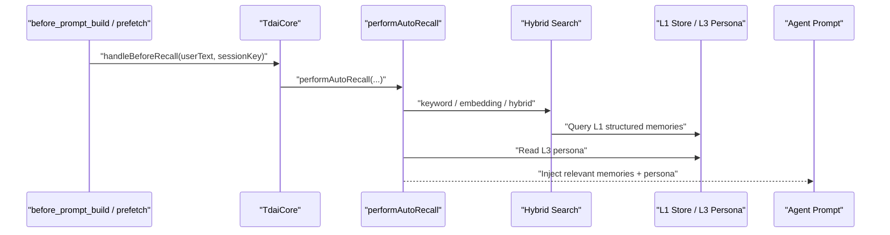

## 4. L0 to L3: Why Memory Must Be Layered

The most likely follow-up question in an interview is: why do you need L0 through L3? Why not just dump all history into a vector database?

My answer would be: because different layers solve different problems. They're not simply "shorter as you go up" — they have distinct responsibilities.

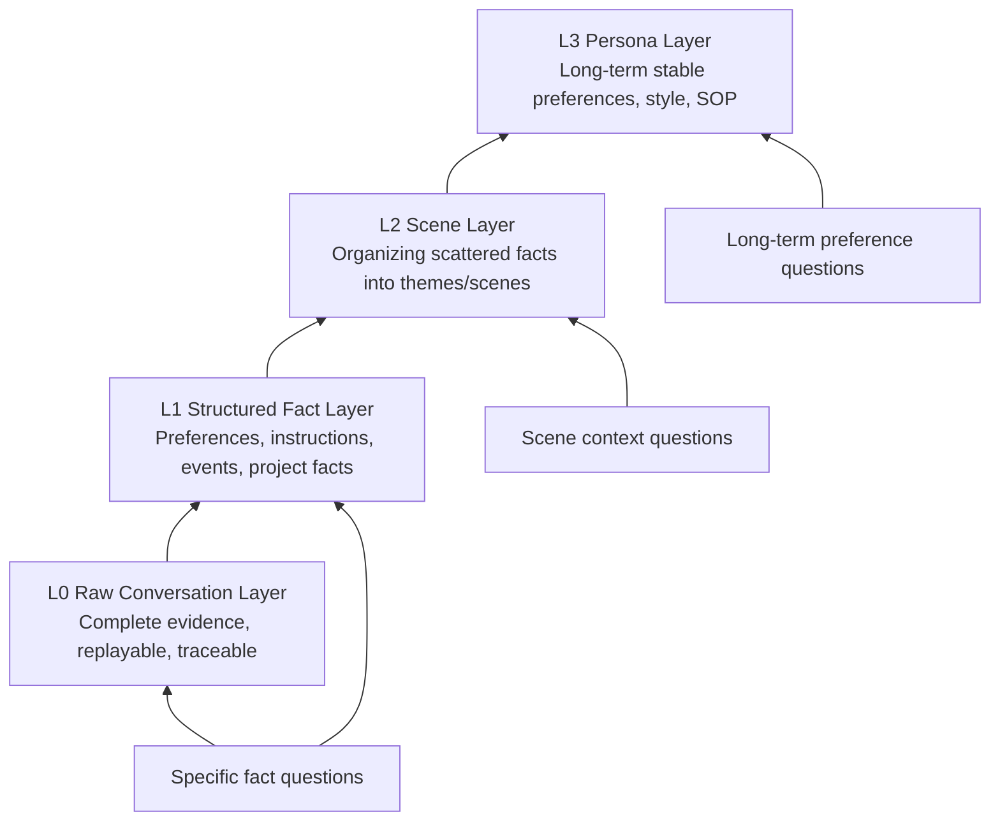

### 4.1 L0: Solving Evidence Fidelity

L0 is the bottom-most layer of raw records, primarily storing conversation messages, timestamps, roles, session information, and necessary original content.

The problem it solves is: no matter how the upper layers abstract, there must always be a layer that can return to the source of facts.

This is key to combating hallucinations. Because all LLM summaries carry a risk of loss, especially error logs, paths, parameters, timestamps, and the user's original words in coding tasks. If this information exists only in summaries, once a summary is wrong or omits something, there is no way to recover afterwards.

So L0's role is not "to be used directly in the prompt," but "to serve as the system's safety net." It can be searched, consumed by L1, and used as evidence to look back when higher-level memories aren't precise enough.

### 4.2 L1: Solving Retrievable Facts

L1 is the structured memory layer. It extracts raw conversations into cleaner memory units, such as:

- User preferences: the user prefers concise answers, or likes conclusions first.
- Explicit instructions: in a certain project, don't modify certain types of files.
- Event facts: the last time, a checkpoint concurrent-overwrite bug was fixed.
- Project context: a certain repository uses SQLite + FTS5 + sqlite-vec.

L1's value lies in turning long conversations into retrievable, deduplicable, scorable fact units.

Without L1, the system can only search within raw conversations. Raw conversations are usually messy: they contain tool outputs, intermediate reasoning, repetitions, and failed attempts. Directly recalling such content is not only costly but also likely to bring irrelevant context back into the prompt.

### 4.3 L2: Solving Fragment Organization

L1 is still "point-based." A real user or project generates many scattered memories. Individual memories can answer localized facts but are poor at providing the Agent with macro-level context.

L2's role is to aggregate L1 memories into scenes, such as:

- The user's preferences during code review tasks.
- The architecture and collaboration conventions of a certain project.
- Common patterns in a certain type of bug-fixing workflow.

This layer solves the "from points to blocks" problem. It ensures that recall doesn't just return a few similar fragments but gives the Agent a more complete working scene.

### 4.4 L3: Solving Long-Term Stable Persona

L3 is the user persona or long-term profile. It focuses on stable, cross-scene, long-term-valid information, such as:

- The user's preferred communication style.
- The user's commonly used tech stack.
- The user's stable output format requirements.
- The user's long-term goals or work habits.

If this kind of information is retrieved and inferred on the fly from L1 every turn, it's costly and unstable. L3 consolidates them into a more stable profile that can be directly injected before the next conversation turn.

### 4.5 Why Not Just a Vector Database

Using only a vector database has several problems.

First, vector databases only solve "similarity search," not information layering. Raw logs, fact memories, scene summaries, and long-term profiles all mixed together make recall results hard to interpret.

Second, vector recall is not necessarily stable for proper nouns, file paths, and error codes. For example, `recall_checkpoint.json`, `l2_pending_l1_count`, or a certain command parameter — these are better suited for keyword retrieval.

Third, vector databases don't natively provide evidence chains. After searching up a summary, if you want to know which conversation turn, which tool output, or which original text it came from, you must design additional indexing.

Fourth, long-term usage produces duplicate, outdated, and conflicting memories. Flat vector accumulation alone makes it hard to maintain memory quality.

### 4.6 Why Not Just a Summary

The problem with using only a summary is even more obvious: it's irreversible.

Summaries are great for compression, but they're unsuitable as the sole form of memory. They lose details, especially evidence critical in coding tasks — the exact error message, the specific file, the command output, the chronological order.

The fundamental principle of this project is:

> Upper layers handle understanding and direction; lower layers handle evidence and precision.

In other words, L3 lets the Agent quickly understand the user, L2 lets the Agent understand the scene, L1 lets the Agent look up specific facts, and L0 lets the Agent return to original-text evidence.

## 5. Background Scheduling: Why Not Extract on Every Turn

Long-term memory generation is not a synchronous blocking operation on the main path. Instead, it is scheduled in the background by `MemoryPipelineManager`.

The key design point: the foreground only does capture; the background decides when to run L1, L2, and L3.

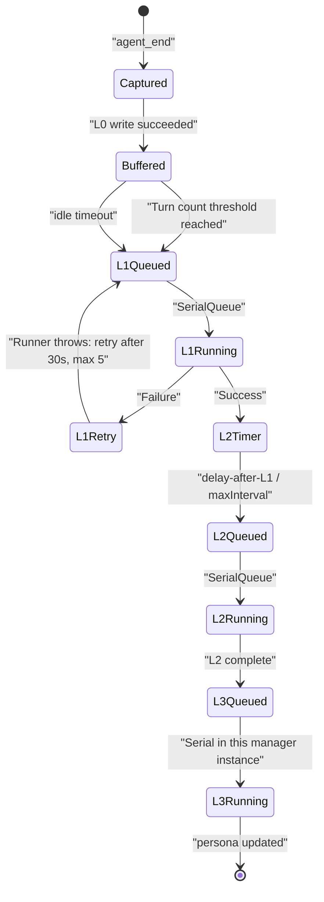

L1 triggering has three paths:

- Reaching `everyNConversations`, defaulting to 5 turns.
- User idle exceeding `l1IdleTimeoutSeconds`, defaulting to 600 seconds.
- Flushing on session end or gateway stop.

New sessions also have warm-up. The successive L1 batch thresholds are 1, 2, 4, and then the configured steady-state value of 5. These are counts of newly accumulated conversations for consecutive batches, not absolute turn numbers in the session. After each successful L1 run, the counter resets and the next threshold is used. This makes early memories available quickly without keeping every-turn extraction forever.

L2 scheduling is more interesting. It doesn't run immediately after L1 completes but uses a downward-only timer:

```text
desiredTime = max(now + l2DelayAfterL1, lastL2 + l2MinInterval)
```

If the current timer is already earlier, don't postpone; if the new trigger time is earlier, advance it. This resolves two conflicting goals:

- After L1, we want L2 to update as soon as possible.
- L2 for the same session shouldn't run too frequently.

L3 is serial within one `MemoryPipelineManager` instance and uses pending merging. If L3 is currently running and a new L2 completion event arrives, that manager does not start another persona generation concurrently. It sets a pending flag and runs one compensation round after the current run finishes. This is an in-process guard, not a distributed lock across manager instances, processes, or Agents.

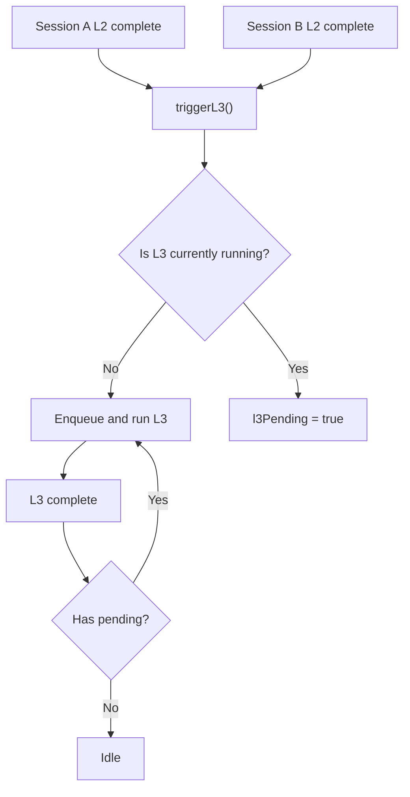

This scheduling system may not look complex, but it solves very real engineering problems:

- The main conversation is not blocked by memory extraction.
- One L1 queue and one L2 queue per manager instance serialize work across its sessions; this does not by itself coordinate separate processes.
- Failures can be retried.
- State can be restored from checkpoint after process restart.
- Session end only flushes the current session without affecting other concurrent sessions.

## 6. Hybrid Retrieval: Why Vector, BM25, and RRF Are All Needed

Long-term memory recall is not purely a semantic search problem. User questions can roughly be classified into three types.

The first type is semantic questions. For example, "What answering style did I prefer before?" The user's current phrasing and the historical original text may differ, but the meaning is close. These questions suit vector retrieval.

The second type is keyword questions. For example, "How was that checkpoint bug handled last time?" Here, `checkpoint`, file names, error codes, and command parameters are all important. These questions are often more reliably handled by BM25 / FTS.

The third type is hybrid questions. Real questions typically have both semantic and keyword aspects. For example, "How was that SQLite checkpoint concurrent-overwrite problem finally fixed last time?" Here, you need to understand the semantics of "concurrent-overwrite problem" while also hitting the specific terms `SQLite` and `checkpoint`.

So the system supports three strategies:

- `embedding`: Semantic recall.
- `keyword`: FTS5 BM25 keyword recall.
- `hybrid`: Parallel recall from both paths, then fused with RRF.

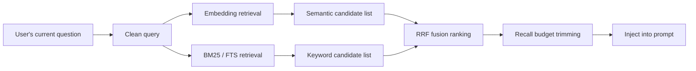

RRF solves the problem that scores from different retrieval methods are incommensurable.

Vector retrieval returns similarity scores; BM25 returns keyword relevance scores — these two scores are not on the same scale. Adding them directly would be dangerous.

RRF doesn't look at raw scores, only at rankings. If a result ranks 2nd in vector retrieval and 3rd in BM25, it gets contributions from both ranking paths; if a result only hits in one path, it still has a chance to make the final result.

The formula can be simplified as:

```text
score(doc) = sum(1 / (k + rank(doc)))
```

The project uses the common value of `k = 60`. Its effect is to bring results that "both paths consider good" to the front, while preventing score-scale anomalies in one path from skewing the ranking.

In an interview, you can put it this way:

> Vector handles "does the meaning match," BM25 handles "are the exact words hit," and RRF handles fusing the two ranking systems. It compares ranks rather than raw scores, so it's more robust.

Regarding PersonaMem improving from 48% to 76%, the more precise statement is: this is the end-to-end answer accuracy on long-term memory tasks, not a pure vector recall rate.

The evaluation methodology can be understood as:

1. Give the Agent a batch of historical information with user preferences, facts, and persona.
2. Then test with questions to see whether the Agent can correctly use this historical information to answer.
3. The stored baseline result was 48%.
4. The stored configured-system result was 76%.

Those two numbers establish an end-to-end difference for the recorded PersonaMem setup. They do not isolate how much came from L1 extraction, Hybrid RRF, Persona injection, or any other component. I would need controlled ablations under the same dataset, model, prompt, timeout, and judge before attributing the gain to individual mechanisms.

## 7. Context Offload: "Compression Without Amnesia" in Long Tasks

Long-term memory solves cross-session experience accumulation; short-term context compression solves token bloat within a single long task.

The biggest token consumer in long tasks is usually not the user's questions but tool logs:

- Large blocks of code read by `cat` / `sed`.
- Long stack traces from test failures.
- Search results.
- Multi-turn command outputs.
- Repeated file and directory structure inspections.

If all of these stay in context, the model gets progressively slower, more expensive, and more easily distracted by old information.

But these logs can't simply be thrown away, because later you might need to look up a specific error, a file snippet, or a command result.

So the system adopts a design of "external fidelity + contextual symbolization."

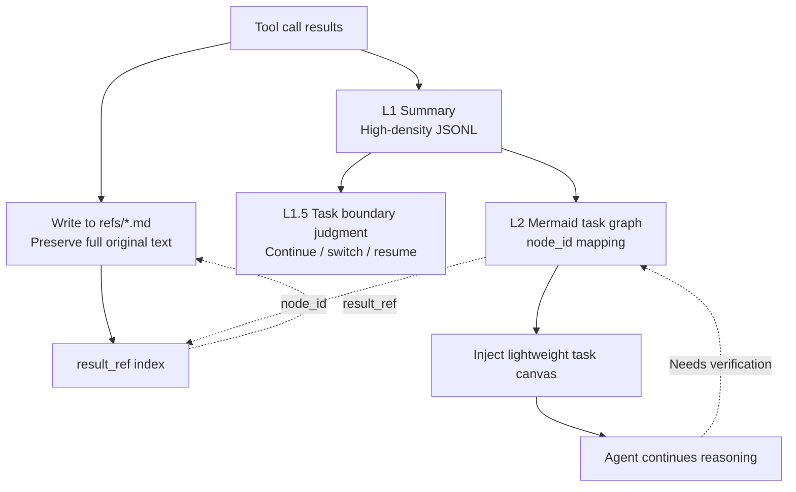

### 7.1 L1: Turning Tool Calls into Step Summaries

Context Offload's L1 compresses each tool call / tool result pair into a high-density summary.

It's not simple truncation — it extracts what value this tool call provides to the current task. For example:

- Which file was read.
- What key structure was discovered.
- Whether the command succeeded.
- What the error was.
- Whether this step advanced the task or exposed a blockage.

Meanwhile, the complete result is saved in `refs/*.md`, with `result_ref` recorded in the JSONL.

### 7.2 L1.5: Determining Task Boundaries

Compression can't be done purely in chronological order, because task switches can happen within a single session:

- The user switches from bug fixing to documentation writing.
- The user resumes yesterday's historical task.
- The current task is complete and a new task begins.

L1.5's role is to determine the relationship between the current user intent and the existing task graph. It decides whether this is a continuation of the current task, a new task, or a historical task recovery.

This step is critical because the compression strategy needs to know which content belongs to the current task. Information for the current task must be compressed more cautiously; old tool logs from non-current tasks can be folded more aggressively.

### 7.3 L2: Mermaid Task Canvas

L2 aggregates multiple tool summaries into a Mermaid task graph.

This graph isn't for visual aesthetics — it's for expressing task state with very few tokens. It includes:

- Completed steps.
- Currently in-progress nodes.
- Failure or risk points.
- Dependency relationships between nodes.
- Mapping from `node_id` to tool call summaries.

What the Agent sees in the prompt is a lightweight graph, not dozens of pages of tool logs.

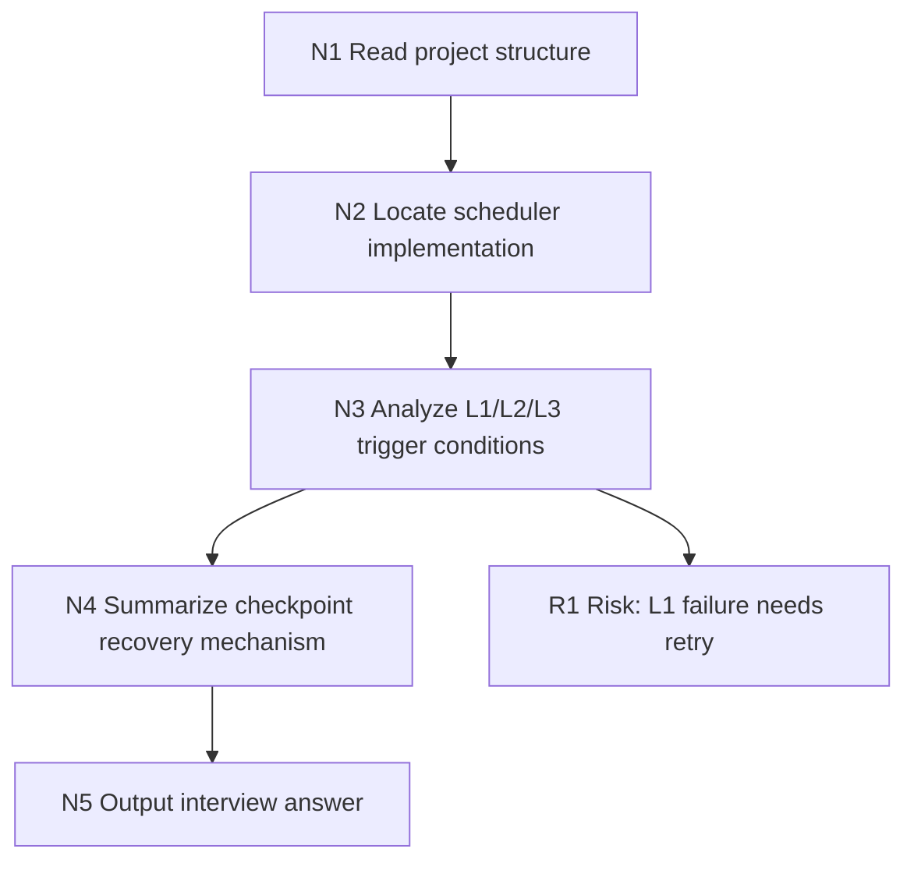

### 7.4 Prompt-Side Compression: Keep, Replace, Delete

Before actually entering the prompt, the system applies different levels of compression based on context window pressure.

The strategy can be understood as four tiers:

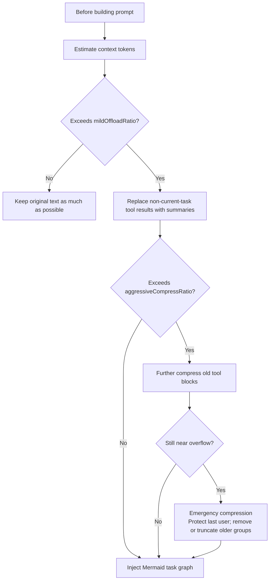

The decision of what to keep and what to compress mainly depends on these factors:

- Whether it belongs to the currently active task.
- Whether an L1 summary already exists.
- Whether it has already been mapped to a Mermaid node.
- Whether there is a `result_ref` to recover the original text.
- How far it is from the current turn.
- The current token pressure level.

It's not "the older, the more it gets deleted," but rather "old content with recoverable evidence gets folded first, critical content for the current task gets kept first."

### 7.5 Recovery After Interruption

Task recovery relies on two lines.

The first is task graph recovery. The system can re-inject the active Mermaid or historical Mermaid, letting the Agent see what step was reached previously, which nodes are complete, and where it's still doing.

The second is original text traceability. Mermaid nodes carry `node_id`, the JSONL has `node_id -> result_ref`, and `result_ref` points to the complete original tool result.

So recovery is not "read a vague summary and guess," but rather:

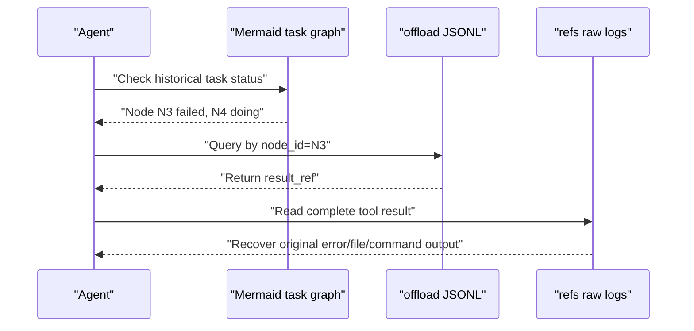

This is the core of recoverable Tool Result offload, subject to ref retention and mapping integrity; it is not a zero-loss guarantee for every conversation message.

## 8. Checkpoint and Recovery: Background Systems Must Acknowledge That Failures Happen

An Agent plugin is not a one-shot script — it runs long-term in real environments. Processes may restart, Gateways may shut down, sessions may end, and background LLM calls may fail.

So checkpoints are very important in this project.

State within a checkpoint is split into two categories:

- `runner_states`: Owned by L0/L1 runners, such as the L0 capture cursor, L1 cursor, and scene name.
- `pipeline_states`: Owned by the scheduler, such as conversation_count, last_active_time, L2 cursor, and warm-up state.

This split prevents different modules from overwriting each other's state. For example, if the L1 runner updates its own cursor, the scheduler should only update pipeline state — it must not overwrite the runner state.

Additionally, checkpoint writes use a per-file async lock. Multiple `CheckpointManager` instances share the same file lock, preventing concurrent read-modify-write from causing JSON corruption or state rollback.

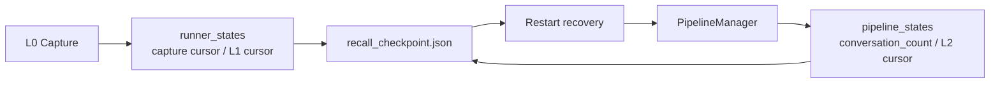

During graceful shutdown, the Pipeline Manager gives L1/L2/L3 flush work up to 2 seconds and then persists scheduling state. `TdaiCore` separately gives registered deferred embedding tasks up to 5 seconds before closing storage. Pipeline state has a restart recovery path; timed-out embedding work does not have the same proven checkpoint replay guarantee.

There's also a subtle detail: session end and process stop are two different semantics.

- Session end only flushes the current session and must not destroy the entire scheduler.
- Gateway stop destroys the scheduler, closes the store, and shuts down the embedding service.

This distinction is important for concurrent sessions. If every session end destroyed the shared manager instance, it would also stop that instance's background work for other sessions.

## 9. Source-Level Implementation Details: From Configuration and Storage to API Boundaries

The above covers system design. When actually reading the source code, the project can be decomposed into several more specific engineering facets: configuration defaults, file directories, SQLite/TCVDB storage, capture/recall hooks, L1/L2/L3 generators, offload state machine, Gateway API, seed import, and profile synchronization.

This chapter's focus is not to repeat the README but to clearly explain what actually happens in the code.

### 9.1 Configuration Defaults: Runs with Zero Config, Capabilities Degrade on Demand

The configuration entry point is in `src/config.ts`, with `parseConfig()` as the core function. It's designed so that "zero config can start," but different capabilities auto-enable or degrade based on configuration.

Key defaults:

- `capture.enabled = true`: L0 raw conversation recording is on by default.
- `extraction.enabled = true`: Background L1 extraction is on by default.
- `extraction.enableDedup = true`: L1 dedup/conflict detection is on by default.
- `extraction.maxMemoriesPerSession = 20`: A single L1 extraction keeps at most 20 memories.
- `persona.triggerEveryN = 50`: Trigger persona update after accumulating a certain number of new memories.
- `persona.maxScenes = 15`: L2 scene blocks capped at 15.
- `pipeline.everyNConversations = 5`: In the stable phase, trigger L1 after each batch accumulates 5 new conversations.
- `pipeline.enableWarmup = true`: Successive L1 batches use thresholds of 1, 2, 4, then the steady-state value; these are per-batch counts, not absolute turns.
- `pipeline.l1IdleTimeoutSeconds = 600`: Trigger L1 after 10 minutes of user inactivity.
- `pipeline.l2DelayAfterL1Seconds = 10`: Wait at least 10 seconds after L1 completes before considering L2.
- `pipeline.l2MinIntervalSeconds = 900`: Minimum interval of 15 minutes between L2 runs for the same session.
- `pipeline.l2MaxIntervalSeconds = 3600`: For an active session, the max-interval timer gives pending L2 work an eventual run opportunity even if no earlier trigger fires.
- `pipeline.sessionActiveWindowHours = 24`: Stop L2 polling for sessions inactive beyond 24 hours.
- `recall.strategy = "hybrid"`: Hybrid recall by default.
- `recall.maxResults = 5`: Inject at most 5 L1 memories by default.
- `recall.timeoutMs = 5000`: Skip recall if it exceeds 5 seconds, to avoid blocking the user.
- `storeBackend = "sqlite"`: Local SQLite by default.
- `embedding.provider = "none"`: Remote embedding is off by default; vector tables are lazily created.
- `bm25.enabled = true`, `bm25.language = "zh"`: Default to Chinese BM25 sparse encoding.
- `offload.enabled = false`: Context offload is off by default and must be explicitly enabled.
- `offload.defaultContextWindow = 200000`, `mmdMaxTokenRatio = 0.2`: Estimate against a 200k window by default; MMD injection capped at 20%.

There's an important engineering trade-off here: configuration errors should not crash the entire Agent. For example, if the remote embedding config is missing `apiKey`, `baseUrl`, `model`, or `dimensions`, the code won't throw an exception and abort. Instead, it marks embedding as disabled, and the system continues running on FTS/BM25 or file-layer capabilities.

So this project is not "you must have a vector database to run." Rather:

> Local recording and keyword retrieval are the baseline; embedding, TCVDB, offload, and reporting are progressively enhanced capabilities.

### 9.2 Data Directories: Long-Term Memory and Short-Term Offload Stored Separately

Long-term memory's data directory is determined by the host:

- OpenClaw plugin mode typically at `~/.openclaw/memory-tdai`.
- Standalone / Hermes Gateway mode defaults to `~/.memory-tencentdb/memory-tdai`.
- Gateway also has backward compatibility for the old directory `~/memory-tdai`: if the new directory doesn't exist but the old directory has data, it continues using the old directory with a migration prompt.

`initDataDirectories()` creates these long-term memory directories:

```text
memory-tdai/
  conversations/        # L0 JSONL, sharded by day
  records/              # L1 JSONL, sharded by day
  scene_blocks/         # L2 scene block Markdown
  persona.md            # L3 user persona
  vectors.db            # Main database for SQLite backend
  .metadata/
    recall_checkpoint.json
  .backup/
```

L0 file paths are `conversations/YYYY-MM-DD.jsonl`, and L1 file paths are `records/YYYY-MM-DD.jsonl`. Both JSONLs are append-only, making them easy to grep, stream-read, and troubleshoot.

Context Offload has its own data root, defaulting to `~/.openclaw/context-offload`, and is isolated per agent:

```text
context-offload/
  <agent-name>/
    offload-<sessionId>.jsonl
    refs/
      <timestamp>.md
    mmds/
      <task>.mmd
    state.json
    sessions-registry.json
```

This isolation is critical. Long-term memory is cross-task accumulation; offload is current-task context compression. The two intersect but should not be mixed in the same set of files.

### 9.3 SQLite Local Storage: Metadata, Vector, and FTS — Three Sets of Indices in Parallel

The default SQLite backend is at `src/core/store/sqlite.ts`, with the database file being `vectors.db`.

It doesn't just create a single vector table — both L1 and L0 each have three types of structures:

```text
L1:
  l1_records      # Structured memory metadata
  l1_vec          # sqlite-vec vector table, cosine distance
  l1_fts          # FTS5 BM25 keyword index

L0:
  l0_conversations # Raw message metadata
  l0_vec           # sqlite-vec vector table
  l0_fts           # FTS5 BM25 keyword index

Meta:
  embedding_meta   # embedding provider / dimensions compatibility info
```

Fields in `l1_records` include:

- `record_id`: Memory ID.
- `content`: Structured memory body.
- `type`: `persona` / `episodic` / `instruction`.
- `priority`: 0 to 100, `-1` indicates a strongly-constrained global instruction.
- `scene_name`: The scene it belongs to.
- `session_key` / `session_id`: Source session.
- `timestamp_str`, `timestamp_start`, `timestamp_end`: Event times.
- `created_time`, `updated_time`: Write and update cursors.
- `metadata_json`: Type-related extension fields.

Fields in `l0_conversations` include:

- `record_id`: Individual message ID.
- `session_key` / `session_id`: Source session.
- `role`: user / assistant / tool.
- `message_text`: Cleaned message body.
- `recorded_at`: Recording time.
- `timestamp`: Original message timestamp.

FTS5 tables use a v2 schema: the indexed column stores jieba-tokenized text, while `content_original` / `message_text_original` as `UNINDEXED` fields store the original text for display. If `@node-rs/jieba` is unavailable, loading fails silently: write-side indexing keeps the original text, and query construction falls back to contiguous Unicode letter/number spans. The recall-quality difference needs measurement.

Vector tables are lazily created: when `embedding.dimensions = 0`, i.e., the default `provider="none"`, `l1_vec` and `l0_vec` are not created. Once the user actually configures embedding, they are created with the real dimensionality, avoiding the problem of creating placeholder-dimension tables upfront that later mismatch.

`embedding_meta` records provider, model, and dimension compatibility. On a mismatch, SQLite preserves `l1_records` and `l0_conversations`, drops and recreates the vector tables, and returns `needsReindex=true`. The Store has `reindexAll()`, but the current pipeline wiring does not automatically consume that flag, so a complete and observable re-embed step still has to be ensured.

This supports the design principle "metadata and FTS are the stable foundation; vectors are rebuildable derivatives." It does not justify claiming vector recovery is complete until reindex coverage has been verified.

### 9.4 TCVDB Backend: Server-Side Dense Embedding + Client-Side Sparse BM25

The TCVDB backend is at `src/core/store/tcvdb.ts`, enabled by `storeBackend = "tcvdb"`. It creates three collections:

```text
<database>_l1_memories
<database>_l0_conversations
<database>_profiles
```

The L1 collection's embedding field is `text`, and the L0 collection's embedding field is `message_text`. This means dense embedding is done server-side by TCVDB — the client doesn't need to generate dense vectors itself.

Meanwhile, the client uses a local BM25 encoder to generate `sparse_vector` and writes it to documents. During queries, if the BM25 encoder is available, it calls TCVDB's native `hybridSearch`:

```text
dense ann search + sparse match + rerank { method: "rrf", k: 60 }
```

If BM25 sparse is unavailable, it degrades to dense-only `embeddingItems` search.

TCVDB initialization has a few more engineering details:

- Collection names are prefixed with the database name, because collection names are globally unique within the same TCVDB instance.
- Vector indices first try `DISK_FLAT`; if the instance doesn't support it, they fall back to `HNSW`.
- The profiles collection disables embedding, since it stores L2/L3 Markdown profiles and doesn't go through vector recall.
- If remote initialization fails, the store enters a degraded state, and the upper layer continues running via file or non-vector paths.

The significance of this backend design is that it offloads both "vector recall" and "keyword recall" to cloud capabilities while still preserving the same `IMemoryStore` abstraction as SQLite.

### 9.5 Capture: L0 Writes Must Be Fast and Must Remove Injection Contamination

After each conversation turn ends, OpenClaw's `agent_end` or Gateway's `/capture` enters `TdaiCore.handleTurnCommitted()`, which then calls `performAutoCapture()`.

The actual capture flow is:

1. `CheckpointManager.captureAtomically()` reads the current session's L0 cursor.
2. `recordConversation()` filters out the new user/assistant messages from this turn.
3. Messages are cleaned — memory injection blocks, scene navigation, offload MMD, Gateway inbound metadata, base64 image data, etc. are removed.
4. Write to `conversations/YYYY-MM-DD.jsonl`.
5. Write to L0 store: under SQLite, write metadata + FTS first, with embedding completed in the background; under TCVDB, synchronous upsert or server-side embedding.
6. Notify `MemoryPipelineManager.notifyConversation(sessionKey, [])`.

Two details here are especially worth discussing.

First, L0 capture is "relatively lenient" — L1 extraction is where strict filtering happens. `shouldCaptureL0()` mainly filters framework noise, empty content, and slash commands; `shouldExtractL1()` additionally filters overly short text, low-information-density text, and prompt injection. This is to keep L0 as faithful as possible while keeping L1 as clean as possible.

Second, capture caches "the original user question before recall injection contamination." Because `before_prompt_build` may inject `<relevant-memories>` in front of the user message, if subsequent L0 directly records the message from the framework, the injected content gets written back into memory, creating a feedback loop. `index.ts` uses `pendingOriginalPrompts` to cache the original text and messageCount; `l0-recorder.ts` then replaces the contaminated user message with the clean version based on position or timestamp.

SQLite's L0 embedding also has a performance optimization: `supportsDeferredEmbedding = true`. The capture main path only writes metadata and FTS, then fire-and-forgets the background `embedBatch + updateL0Embedding()`. `TdaiCore.destroy()` waits for these background tasks for at most 5 seconds, to avoid late writes after the database is closed.

### 9.6 L1 Extraction, Dedup, and Writing: JSONL Is the Audit Log, Store Is the Retrieval Truth

The L1 extraction entry point is at `src/core/record/l1-extractor.ts`.

Its flow is:

1. Read newly added messages for the current session from the L0 store or JSONL fallback.
2. Apply strict quality filtering with `shouldExtractL1()`.
3. Call LLM to perform scene segmentation and memory extraction in a single pass.
4. Cap results at `maxMemoriesPerSession`.
5. If `enableDedup = true`, call `batchDedup()` for conflict detection.
6. Based on dedup decisions, write to L1 JSONL and VectorStore.

L1 memory types have been consolidated into three categories in v3:

- `persona`: Stable user preferences, identity, long-term constraints.
- `episodic`: Events that happened, task progress, staged facts.
- `instruction`: Explicit rules, prohibitions, output format requirements.

Write logic is in `src/core/record/l1-writer.ts`. Each `MemoryRecord` contains `id`, `content`, `type`, `priority`, `scene_name`, `source_message_ids`, `metadata`, `timestamps`, `createdAt`, `updatedAt`, `sessionKey`, `sessionId`.

There are four dedup actions:

- `store`: Add a new record.
- `update`: Delete the old record and write the updated new record.
- `merge`: Delete multiple old records and write a merged record.
- `skip`: Skip.

The key point is: the VectorStore is the real-time retrieval truth; the JSONL is an append-only history. During update/merge, old records are deleted from the VectorStore so online recall uses the current canonical records, while the old JSONL lines remain. The retention cleaner removes expired daily shards and matching expired store rows; it does not reconcile every historical JSONL line against current Store truth.

### 9.7 Recall: Dynamic L1 as User Prefix, Persona and Scene Navigation as System Suffix

The recall entry point is at `src/core/hooks/auto-recall.ts`, called by `TdaiCore.handleBeforeRecall()`.

Recall is split into two injection parts:

- `prependContext`: Dynamic L1 relevant memories, as a user prompt prefix.
- `appendSystemContext`: Stable L3 persona, L2 scene navigation, memory tools guide, appended to system context.

This split serves prompt caching. L1 changes every turn, so it goes on the user side. The L3 Persona body and the Scene Navigation generated from L2's index change less frequently, so they go at the end of the system prompt. Full L2 scene-block bodies are not resident there; the Agent reads a scene on demand by following the navigation.

The hybrid search path also has two implementations:

- SQLite: Locally runs FTS5 BM25 and embedding search in parallel, then merges client-side with RRF, `k = 60`.
- TCVDB: If the store capability flag `nativeHybridSearch = true`, directly calls the remote hybridSearch, avoiding local re-embedding.

Recall also has several safeguards:

- The query is first `sanitizeText()`, removing media, metadata, and injection tags.
- If the query is too short, the search is skipped.
- If `recall.timeoutMs` expires, it directly returns undefined — better to skip injection this turn than to slow down the user.
- `maxCharsPerMemory` and `maxTotalRecallChars` can limit injected character counts.
- The injected memory tools guide explicitly tells the Agent: `tdai_memory_search` and `tdai_conversation_search` can be called at most 3 times combined.

So recall is not a simple "search a few and stitch them on" — it balances performance, caching, controllable search counts, and traceable tool calls.

### 9.8 L2/L3: Scene Files, Persona Files, and Remote Profile Sync

L2 scene extraction is handled by `SceneExtractor`, producing files in `scene_blocks/*.md`. L3 persona is handled by `PersonaGenerator`, producing `persona.md`.

The local L2/L3 files are not isolated. `profile-sync.ts` maps local `scene_blocks` and `persona.md` into profile records:

- L2 file type is `l2`, filename from the scene block.
- L3 file type is `l3`, filename fixed as `persona.md`.
- Stable IDs use `scope + type + filename` hashed with SHA-256, ensuring stability across machines/syncs.
- Content carries `contentMd5`, `version`, `createdAtMs`, `updatedAtMs`.

In the TCVDB backend, the profiles collection stores these L2/L3 files. During synchronization, there's a baseline version check: if the remote version has been advanced by others since the baseline from the pull, the local write is skipped to avoid overwriting remote updates.

There's also a UX detail: `persona.md` appends scene navigation at the end. During recall, `stripSceneNavigation()` first extracts the persona body, then separately generates `<scene-navigation>`, preventing navigation content from contaminating the persona body.

### 9.9 Context Offload File Model: Successfully Offloaded Tool Results Get a Recovery Chain

Offload types are in `src/offload/types.ts`. The core record is `OffloadEntry`:

```ts
interface OffloadEntry {
  timestamp: string;
  node_id: string | null;
  tool_call: string;
  summary: string;
  result_ref: string;
  tool_call_id: string;
  session_key?: string;
  score?: number;
}
```

Each field has a clear responsibility:

- `tool_call_id`: Aligns with the model/tool call chain, used for dedup and replacing the original tool result.
- `result_ref`: Points to `refs/*.md`, preserving the complete tool output.
- `summary`: Human-readable summary generated by L1.
- `score`: Degree to which the summary can substitute for the original result, not factual confidence; higher values make it a stronger compression candidate.
- `node_id`: L2 Mermaid node ID, initially null, backfilled after L2 runs.

`storage.ts` applies several layers of defense to JSONL:

- Strips unsafe control characters before writing.
- Skips corrupted lines and schema-invalid lines during parsing.
- Deduplicates by `tool_call_id` on append.
- `readAllOffloadEntries()` reads all `offload-*.jsonl` under the current agent, allowing L2 to aggregate task canvases across sessions.
- `updateOffloadNodeIds()` backfills the node_id generated by L2 into all relevant JSONL lines.

MMD files are stored in `mmds/`, and complete tool originals in `refs/`. The recovery chain can be precisely expressed as:

```text
Mermaid node_id
  -> OffloadEntry in offload-<sessionId>.jsonl
  -> result_ref
  -> refs/<timestamp>.md complete tool result
```

This is what distinguishes it from an ordinary standalone summary: the summary is an entry point and the Tool Result remains readable while the ref and mapping are retained. Reclamation or a broken mapping can end that recovery path.

### 9.10 Offload Run Modes: local, backend, collect

`offload.mode` has three options:

- `local`: Locally call LLM for L1/L1.5/L2.
- `backend`: Call a remote service via `backendUrl`.
- `collect`: Only collect data and asynchronously run some tasks, without occupying contextEngine slots — suitable for observation or offline analysis.

Trigger strategy defaults include:

- `forceTriggerThreshold = 4`: Pending tool pairs reaching 4 forces L1 trigger.
- `maxPairsPerBatch = 20`: This configuration field still defaults to 20, but the current L1 flush path uses a fixed `L1_BATCH_SIZE = 5`; accumulated pairs are split into requests of at most 5. The config and runtime path are not fully converged here.
- `l2NullThreshold = 4`: Entries with `node_id = null` reaching 4 trigger L2.
- `l2TimeoutSeconds = 300`: If L2 hasn't run for 5 minutes, also consider triggering.
- `mildOffloadRatio = 0.5`: Start mild replacement when context reaches 50% of the window.
- `aggressiveCompressRatio = 0.85`: Compress more aggressively at 85%.
- `emergencyCompressRatio = 0.95`: Enter emergency compression when near overflow.
- `emergencyTargetRatio = 0.6`: Emergency compression target is to bring it back down to 60%.

So it doesn't wait until the context bursts — it governs in stages:

```text
Mild compression: Replace non-current-task, high-substitution-score tool results
Aggressive compression: Delete or fold older tool blocks
Emergency compression: Keep only the most recent messages, key task graphs, and recoverable indices
```

This logic is collaboratively implemented across files like `hooks/llm-input-l3.ts`, `l3-helpers.ts`, `mmd-injector.ts`, etc.

### 9.11 Gateway: Exposing the Same TdaiCore as an HTTP Service

The Gateway is at `src/gateway/server.ts`. It doesn't use Express/Fastify but is built on Node's native `http` module. It exposes `TdaiCore` as HTTP APIs:

```text
GET  /health
POST /recall
POST /capture
POST /search/memories
POST /search/conversations
POST /session/end
POST /seed
```

The mapping is very direct:

- `/recall` calls `handleBeforeRecall()`.
- `/capture` calls `handleTurnCommitted()`.
- `/search/memories` calls L1 memory search.
- `/search/conversations` calls L0 conversation search.
- `/session/end` calls `handleSessionEnd()`, flushing only the current session.
- `/seed` calls the seed runtime to bulk-load historical data into L0/L1.

The security model uses an optional Bearer token:

- `GET /health` never requires authentication, for easy health checks.
- If `server.apiKey` or `TDAI_GATEWAY_API_KEY` is configured, all other endpoints require `Authorization: Bearer <key>`.
- Token comparison uses `crypto.timingSafeEqual()` to avoid timing attacks when lengths are equal.
- If the gateway is bound to a non-loopback host without an apiKey configured, a warning is emitted at startup.

The configuration loading order is also practical:

1. Explicit config path.
2. `tdai-gateway.yaml` / `tdai-gateway.json` in the current working directory.
3. Same-named config under dataDir.
4. Environment variables.

It listens on `127.0.0.1:8420` by default, which is also why it can serve as a Hermes sidecar: the main Agent doesn't need to understand the OpenClaw plugin mechanism — it just calls HTTP APIs.

### 9.12 Seed: Bulk-Ingesting Historical Conversations Through the Same L0→L1 Pipeline

Seed has two entry points:

- CLI: `openclaw memory-tdai seed`, in `src/cli/commands/seed.ts`.
- Gateway: `POST /seed`.

Its goal is to import historical conversations as recallable memories, not just copy files.

The seed runtime is at `src/core/seed/seed-runtime.ts`. It reuses the live runtime's pipeline factory: the same store initialization, L1 runner, L2 runner, L3 runner, and persister. This ensures that historical import and live capture don't produce two inconsistent sets of logic.

A few implementation details:

- Input is normalized into `sessions -> rounds -> messages`.
- Timestamps can be ISO strings or numbers; if missing, the CLI asks for confirmation, and `--yes` auto-fills with the current time.
- In seed mode, `captureStartTimestamp = 0`, intentionally not using the live mode's cold-start protection, because seed is meant to import history.
- After processing each `everyNConversations`, it waits for L1 to idle before feeding the next batch, avoiding dumping all history into a single L1 batch and breaking production batching semantics.
- The current implementation waits for L1 idle only. L2/L3 runners are wired, but the Seed runtime then destroys the pipeline, so those stages can still be queued or interrupted and are not guaranteed complete when Seed returns.
- The output directory defaults to `<stateDir>/memory-tdai-seed-<YYYYMMDD-HHmmss>`.

Seed is not just a file copier; it replays normalized history through the same in-house runtime pipeline code. Its completion contract currently ends at the explicit L1 wait, not at guaranteed L2/L3 convergence.

### 9.13 Multi-Host Adaptation: OpenClaw and Hermes Share the Same Core

`TdaiCore` is a host-agnostic facade. It only depends on the abstract `HostAdapter`, `LLMRunnerFactory`, `IMemoryStore`, and configuration — it does not directly depend on OpenClaw or Gateway.

OpenClaw mode is thinly adapted by `index.ts`:

- Registers hooks.
- Registers CLI.
- Registers `tdai_memory_search` / `tdai_conversation_search` tools.
- Calls recall in `before_prompt_build`.
- Calls capture in `agent_end`.
- Calls destroy in `gateway_stop`.
- Auto-patches hook policy based on host version.

Gateway mode uses `StandaloneHostAdapter` and a standalone LLM runner. Within `TdaiCore.wirePipelineRunners()`, there's also a decision:

- Under OpenClaw with `cfg.llm.enabled` not set, prefer the host's built-in LLM runner.
- Under standalone / Hermes, or when `llm` is explicitly enabled, use an OpenAI-compatible API to directly call the memory extraction model.

This decouples host integration from the LLM runner. Actual model routing comes from the host and configuration: OpenClaw can use extraction/Persona overrides, while standalone/Gateway uses the configured OpenAI-compatible model. The source does not prove an expensive-main-model versus cheap-memory-model deployment policy.

### 9.14 Operations Governance: Manifest, Cleanup, Filtering, Timezone, and Metrics

This project also contains some "unassuming but deeply engineered" details.

First is the manifest. `src/utils/manifest.ts` records the data directory's store binding in `<dataDir>/.metadata/manifest.json`:

```json
{
  "version": 1,
  "createdAt": "...",
  "store": {
    "type": "sqlite"
  },
  "seed": null
}
```

For TCVDB, it records url, database, and alias; for SQLite, it records the db path. This manifest is written after the first successful initialization; subsequent startups only diff and debug-log, never auto-overwrite. Its purpose is to make a dataDir self-describing: later, when troubleshooting "which backend was this directory originally connected to, and was the database ever switched," there's a basis.

Second is the local cleaner. `LocalMemoryCleaner` is controlled by `capture.l0l1RetentionDays`, off by default. When enabled, it runs daily at `cleanTime`, defaulting to `03:00`, cleaning expired shards in `conversations/` and `records/`, and synchronously deleting expired L0/L1 records in the store. Cleanup is calculated by the configured timezone's "local natural day," not simply `now - N*24h`. There's also minimum retention protection: if total L0 ≤ 50 or total L1 ≤ 20, deletion is skipped, preventing new users or small-sample directories from being emptied.

Third is session filtering. `SessionFilter` has hardcoded built-in rules and also accepts `capture.excludeAgents` globs:

- Skip `:memory-scene-extract-` to prevent L2/L3 internal LLM tasks from contaminating user memories.
- Skip `:subagent:` to prevent temporary sub-agent tasks from being treated as main user history.
- Skip `temp:` to prevent temporary tool sessions.
- In hook context, sessions with `sessionId` starting with `memory-` are also skipped.

Fourth is unified timezone. `timezone` defaults to `system` but also supports IANA names and UTC offsets like `+08:00`. Machine time in storage still uses UTC instants; times presented to LLMs, file sharding, and cleanup natural days use the configured timezone. `formatForLLM()` outputs times with explicit offsets, e.g., `2026-04-07T11:04:45+08:00`, reducing ambiguity in memory reasoning around "yesterday," "last week," "a few hours ago."

Fifth is reporting. `report.enabled` defaults to off; when the local reporter is enabled, it writes structured events to the logger, including pipeline triggers, L1 extractions, agent turns, etc. `instance_id` is stored in `.metadata/instance_id` to string together events from the same plugin instance. Reporter exceptions never block business logic.

## 10. Engineering Trade-offs: Why This Design Can Actually Be Shipped

This system has several key trade-offs.

### 10.1 Don't Chase Synchronous Strong Consistency — Chase Eventual Availability

Memory is not a transactional system; it doesn't need all of L1/L2/L3 completed immediately after every conversation turn. More importantly, don't block the user. So capture lands on disk first, with asynchronous extraction following.

### 10.2 Don't Treat Summaries as Truth

Summaries are one index layer, not the sole source of truth. L0 and refs provide drill-down while their configured retention keeps them available. Neither is an unconditional permanent archive.

### 10.3 Don't Treat a Vector Database as a Silver Bullet

Vectors are good for semantics; BM25 is good for keywords; RRF handles fusion. Real memory recall needs a hybrid strategy.

### 10.4 Don't Equate Recoverable Tool Offload with Universal Preservation

The normal Offload path writes complete Tool Results to refs before replacing them with summaries and indices. Those refs can later be reclaimed by retention, and ordinary user or assistant messages are not automatically copied into refs. Emergency compression can remove older messages. The precise claim is therefore recoverable Tool Result offload while its reference remains, not permanent preservation of every prompt message.

### 10.5 Don't Let Background Tasks Have Unlimited Concurrency

Each `MemoryPipelineManager` instance owns one serial L1 queue, one serial L2 queue, and one serial L3 queue. L3 also uses pending merging. These guards coordinate work inside that manager instance; cross-process coordination still needs storage-level or distributed controls.

## 11. Interview Follow-Up Perspective: How to Answer

If the interviewer asks "What is the core business problem of this project?", you can answer:

> The core problem is memory loss of control in long-running Agents. Stuffing all history into the prompt blows up tokens; summarizing alone loses evidence. So I built two linked paths: layered long-term memory for cross-session facts, and recoverable Tool Result offload for long tasks. I say "traceable while the source artifact is retained," not "every message is preserved forever."

If they ask "Why did you design L0 through L3?", you can answer:

> Because different information granularities solve different problems. L0 preserves raw evidence, L1 extracts retrievable facts, L2 organizes fragments into scenes, and L3 consolidates long-term stable persona. Using only a vector database turns everything into flat fragments; using only summaries loses details irreversibly.

If they ask "What problem does RRF solve?", you can answer:

> Vector retrieval and BM25 scores are not on the same scale and can't be simply added. RRF fuses results using ranks rather than raw scores. Results ranked high in both retrieval systems get boosted; results that only hit in one path aren't completely dropped either.

If they ask "Does context compression guarantee no information loss?", you can answer:

> It does not guarantee zero information loss for the whole conversation. For Tool Results handled by the normal Offload path, I first write the complete result to refs, then keep a summary, `node_id`, and `result_ref` in the lighter context. That gives me a drill-down path while the ref is retained. Ordinary messages are not all externalized, emergency compression can delete older ones, and retention can reclaim refs, so I keep that boundary explicit.

If they ask "What key modules were you responsible for?", answer only from the confirmed internal RACI. The repository proves the module boundaries, not personal authorship. A safe placeholder until that fact is confirmed is:

> The areas I can discuss in depth are pipeline scheduling, L0-to-L3 modeling, hybrid recall, context offload, checkpoint recovery, and host adaptation. My exact ownership boundary and the parts I co-developed should match the internal project record; I would not infer "independent ownership" from source access alone.

## 12. Summary: The Real Value of This Project

The value of this in-house Agent Memory system is not "adding a database to an Agent," but in decomposing the Agent memory problem into several engineerable sub-problems:

- How to keep history faithful: L0 / refs.
- How to retrieve facts: L1.
- How to organize fragments: L2.
- How to stably inject long-term preferences: L3.
- How to make recall more robust: embedding + BM25 + RRF.
- How to make context lighter: Context Offload + Mermaid.
- How to recover tasks: node_id / result_ref / checkpoint.

The end result forms a closed loop:

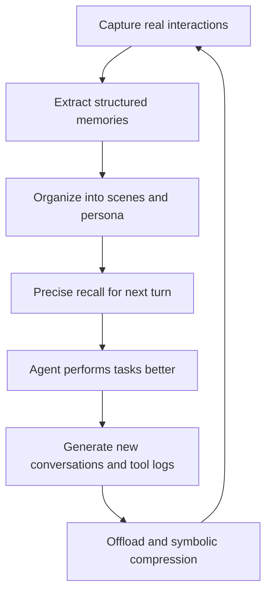

The core philosophy of this design can be summarized in one sentence:

> Let the Agent's memory be both collapsible and expandable; both abstractable and traceable; capable of long-term accumulation while remaining lightweight within the current task.

## 13. Prompt Engineering and LLM Governance: Where Interviewers Love to Dig Deepest

Interviewers often dig into this area: how exactly are your L1, L2, and L3 LLM calls made? What do the prompts look like? Why this design? How are failures handled? This chapter explains everything clearly — every line can be spoken directly in an interview.

### 13.1 The L1 Extraction Prompt Is Three-Part

Here's how I explained it to the interviewer:

> L1 extraction is a single LLM call doing two things at once: first scene slicing, then memory extraction. I deliberately didn't split it into two calls — one, to save LLM call count and cost; two, to let the model understand which scene a fact belongs to while slicing scenes, making it coherent.

The current output schema is a JSON array of scenes. Each scene contains `scene_name`, `message_ids`, and `memories`; each memory contains `content`, `type`, `priority`, `source_message_ids`, and `metadata`. `scene_name` belongs to the containing scene rather than being duplicated inside every memory. There is no `temporal_hint` field in the current schema.

The user prompt contains the previous scene name, a small background-conversation window for interpretation only, and the cleaned new messages with IDs and timestamps. It does not currently inject a Persona summary, a complete existing-scene list, or a hash list of existing memories. Semantic dedup is a later `batchDedup()` step against Store candidates.

The extraction rules say to segment on topic or intent changes, extract only the supported `persona`, `episodic`, and `instruction` types from the new-message block, and discard trivial chat, temporary operations, duplicates, and assistant output. `priority=-1` means an extremely strict global instruction; it is not a conflict marker.

There are a few details the interviewer might follow up on:

First, I treat the conversation as data for extraction, and `shouldExtractL1()` filters known low-quality and prompt-injection patterns before the call. That is defense in depth around an LLM, not a deterministic security boundary.

Second, `source_message_ids` is the core of the L1-to-L0 evidence chain. It gives a claimed provenance path, but the current pipeline does not prove that every returned ID exists or that the memory is entailed by the cited text. It improves auditability; it does not by itself guarantee that the LLM cannot fabricate a fact.

Third, there is no automatic `always/session/transient` promotion state machine. Today, the extraction prompt tries to reject temporary requests, and Persona regeneration is triggered from changed scene artifacts and pipeline thresholds. A structured validity period, evidence count, and stability gate would be a next-version governance design.

### 13.2 The L2 Scene Aggregation Prompt

Here's how I'd explain L2 to the interviewer:

> L2 isn't simply concatenating L1. I give a tool-enabled LLM the new L1 records plus the existing scene summaries and filenames. Inside a sandbox limited to `scene_blocks/`, it can create, update, merge, or soft-delete scene Markdown files, after which deterministic code normalizes filenames, cleans soft deletions, rebuilds the scene index, and refreshes navigation.

The output is Markdown because both engineers and the model can inspect it directly. The current file format is not YAML frontmatter. Its META section stores fields such as `created`, `updated`, `summary`, and `heat`, while the body is scene-oriented narrative content written by the LLM.

There is no `stability` field and no `stability=high` admission gate. L3 reads scene blocks that changed since the previous Persona update. A testable stability gate would be a future hardening step, not current behavior.

### 13.3 The L3 Persona Generation Prompt Is the Most Conservative

For L3, I emphasize the word "conservative":

> L3 is intended to be the conservative layer. The prompt limits Persona content to scene evidence, asks the model to avoid unsupported inference, and caps the body at roughly 2,000 characters. For incremental runs, it receives the existing Persona and the scene blocks changed since the last update. These are prompt constraints, not a deterministic temporal or stability filter.

The current template is `User Narrative Profile`, an `Archetype`, `Basic Information`, `Long-term Preferences`, and Chapter 1 through Chapter 4 covering context/current state, texture of life, interaction/cognitive protocol, and deep insights/evolution.

There is no `Stability Notes` field lock. Supplying the existing Persona encourages incremental editing instead of a blank rewrite, and backups preserve the previous file if generation fails. The current source does not implement field-level provenance, evidence-count thresholds, or an automatic rollback when a stable preference changes.

The current Persona artifact does not contain a generated changelog. Evolution can be investigated through backups, changed-scene inputs, checkpoints, and file diffs, but a first-class versioned change log would be an additional feature.

### 13.4 Engineering Governance of LLM Calls

Having good prompts isn't enough — you need engineering governance. Here's how I'd present it:

> First, I do not claim per-task temperatures that the current long-term-memory runners do not set. Model and timeout selection are host/configuration dependent. The separate local Offload client has one configurable temperature, defaulting to 0.2, but that is not evidence that L1, L2, L3, and QA each use four validated temperatures.

> Second, the current L1 parser trims an optional Markdown fence, extracts a JSON-array-shaped substring, sanitizes unsafe control characters inside JSON strings, and calls `JSON.parse`. Missing arrays return an empty result; parse exceptions make the extraction fail and are contained by the background pipeline. It does not implement the claimed four-stage repair sequence for trailing commas, bracket completion, and partial object salvage.

> Third, long-term-memory L1 failures are re-armed by the scheduler with a fixed 30-second delay, up to five consecutive automatic retries, with buffered messages retained. The source does not define the claimed exponential sequence or fixed L2-three/L3-two retry counts. Offload L1 and transport clients have their own retry rules, and I keep those separate when answering.

> Fourth, there is no `llm_run` database table in the current implementation. The optional reporter can emit `llm_call`, L1, L2, and L3 events with fields such as task, provider/model, input/output lengths, duration, status, and error when reporting context is available. `report.enabled` is off by default, so full cost attribution still requires enabled telemetry and provider billing data.

### 13.5 Model Selection Strategy

This is a point interviewers often ask: "What model do you use?"

> I make model selection configurable rather than hard-code a GPT-4-versus-mini story. In the OpenClaw path, extraction and Persona model overrides can be supplied; otherwise the host runner resolves the model. In standalone/Gateway mode, the configured OpenAI-compatible `llm.model` backs the runners. Which models are actually used in an environment must come from its configuration, and any cheaper-model routing claim needs a quality and cost benchmark.

In OpenClaw mode, if llm.enabled=false, it prefers the host's built-in LLM runner, so there's no need to configure an additional API key. Standalone or Gateway mode defaults to OpenAI-compatible API. This flexibility is a benefit of the host-neutral design.

## 14. Concurrency Control and Consistency: Where Interviewers Love to Dig

Interviewers especially love to follow up on concurrency: what happens when multiple sessions run simultaneously? What about background tasks and foreground capture writing to files at the same time? Can checkpoints get overwritten? This chapter explains the concurrency model clearly — all in interview-ready language.

### 14.1 Three-Layer Concurrency Isolation

Here's how I'd open:

> I implemented three in-process controls, with explicit scope. First, records retain `sessionKey` and `sessionId`, but L0 and L1 JSONL files are shared daily shards, not one file per session. `state.json` belongs to Context Offload, not the long-term-memory pipeline. Second, each `MemoryPipelineManager` instance has one serial L1 queue and one serial L2 queue shared by all its sessions; L3 is also serial within that instance and coalesces pending triggers. Third, `recall_checkpoint.json` uses a per-file async lock shared by `CheckpointManager` instances in the same process. None of these is a distributed lock across processes.

### 14.2 Why L3 Is Serial Within a Manager Instance

The interviewer will definitely ask "Why can't L3 be per-session parallel?"

> Because persona is a cross-session user profile. Suppose session A and session B both run L3 simultaneously — both LLM calls will read the same baseline persona, then each generate updates. The later write overwrites the earlier one, and one set of changes is lost.

> My in-process solution is instance-local serialization plus pending merging. If L3 is running and another L2 completion arrives in the same manager, I set a pending flag and run one compensation round afterward. This coalesces nearby triggers inside one runtime. If two processes share a data directory or remote Profile scope, this flag cannot coordinate them; that needs an external lock, optimistic version check, or a single-writer deployment.

In pseudocode, it roughly looks like this — you can describe the logic verbally in an interview:

```typescript
// Verbally in interview: if already running, mark pending and return;
// after completion, check pending and run again if set
private l3Running = false;
private l3Pending = false;

async triggerL3() {
  if (this.l3Running) {
    this.l3Pending = true;
    return;
  }
  this.l3Running = true;
  try {
    await this.runL3();
    while (this.l3Pending) {
      this.l3Pending = false;
      await this.runL3();  // Compensatory run, absorbing new L2
    }
  } finally {
    this.l3Running = false;
  }
}
```

### 14.3 How Checkpoint File Locking Is Implemented

This is the detail interviewers love to dig into most:

> Concurrent checkpoint writes are the easiest place for bugs. Let me give you a real scenario: at T0, session A's capture reads the checkpoint, cursor is 100; at T1, session B's capture also reads the checkpoint; at T2, A writes the checkpoint, cursor becomes 101; at T3, B writes the checkpoint. If A and B write to the same file without locking, T3 could overwrite T2, or the file could end up as corrupted JSON.

> My approach is a per-file async lock. All CheckpointManager instances share a static lock Map, keyed by file path. Before writing, acquire the lock; the entire read-modify-write is serialized. The write itself isn't a direct overwrite — it first writes to a temp file checkpoint.json.tmp, then renames it into place. This is a common approach using POSIX atomic semantics, and Windows rename has similar guarantees. This way, even if the process crashes mid-write, the original file remains intact.

### 14.4 Why runner_states and pipeline_states Are Separated

This is a very fine-grained point, but if the interviewer digs deep into checkpoints, it will come up:

> Early checkpoints were a flat JSON where both runner and scheduler wrote into it. This led to problems like: the L1 runner just updated l1_extract_cursor, the scheduler simultaneously updated conversation_count, both wrote to the checkpoint — the scheduler didn't know the runner changed the cursor, and its write overwrote the runner's write, causing the cursor to roll back.

> After splitting, the runner only writes runner_states, the scheduler only writes pipeline_states — the write paths don't cross. These two objects in the checkpoint file are independent JSON keys; updates only modify their own part. runner_states contains l0_capture_cursor, l1_extract_cursor, scene_name_hint; pipeline_states contains conversation_count, last_active_time, l2_cursor, warmup_phase, l1_idle_since.

### 14.5 The Drain Logic for Graceful Shutdown

The interviewer might ask "What happens if the process crashes?"

> The current shutdown has two distinct bounds. `MemoryPipelineManager.destroy()` marks the manager destroyed and gives L1/L2/L3 flush work at most 2 seconds before persisting pipeline state. After that, `TdaiCore.destroy()` gives registered fire-and-forget background tasks, currently deferred L0 embedding writes, up to 5 seconds before closing the Store and embedding service.

> Pipeline buffers and scheduling state have a checkpoint recovery path, so unfinished L1/L2/L3 work can be reconsidered after restart. Deferred embedding tasks are different: after the 5-second drain timeout, the Store closes and residual writes may only surface as warnings. The current source does not prove that every timed-out embedding is checkpointed and automatically replayed, so I do not promise that.

## 15. Performance Testing and Capacity Planning: Separate Measurements from Estimates

If the interviewer asks "How much load can your system handle?", do not answer with engineering estimates presented as internal measurements. Source code proves behavior and defaults; latency percentiles, QPS, and capacity require an actual benchmark report.

### 15.1 Scenario: Four Dimensions I Would Use for Stress Testing

> I would design a stress test across four dimensions. First is throughput: capture QPS, L1 extraction throughput, and recall p50/p95/p99. Second is capacity: turns per session, memories per user, and JSONL/index growth. Third is long-task behavior: token savings, Mermaid growth, and artifact-disk usage under a fixed scripted workload. Fourth is concurrency: capture latency, queue backlog, and checkpoint-lock contention at explicitly recorded concurrency levels. Values such as 100 tool calls or 10/50/100 sessions are candidate test points, not measured capacity claims.

### 15.2 Benchmark Results That Are Actually Documented

> The stored evaluation reports two core results. On WideSearch, pass rate increased from 33% to 50%, a 51.52% relative lift, while token usage fell from 221.31M to 85.64M, a 61.38% reduction. On PersonaMem, long-term memory accuracy increased from 48% to 76%. These are benchmark-specific results, not universal production averages.

### 15.3 Numbers That Still Require Internal Evidence

> Capture and recall p50/p95/p99, concurrency throughput, L1/L2/L3 latency, SQLite capacity at 100k or one million records, LLM failure rate, and retry success rate must come from internal monitoring or a reproducible stress test. The code does not establish those numbers by itself, so I would not invent them in an interview.

> Existing guardrails include a default recall limit of 5, a 5-second overall recall timeout, configurable recall character budgets, serialized pipeline scheduling, a default Persona scene limit of 15, an actual Offload L1 request batch size of 5 tool pairs, a roughly 4,000-character Mermaid target, and an MMD context-window ratio budget. The separate `maxPairsPerBatch=20` config is not what currently sizes that flush path. Guardrails are not capacity benchmarks.

### 15.4 Where Are the Bottlenecks

The interviewer might directly ask about bottlenecks. I'd answer honestly:

> The first bottleneck is L1/L2/L3 LLM call latency, which is why those pipelines run asynchronously with serial queues and pending-trigger coalescing. The exact latency range depends on the configured model and must come from telemetry.

> The second is remote embedding latency on the synchronous recall path. Mitigation includes strict timeouts, keyword fallback when the capability is unavailable, and measuring whether a local embedding or cache is justified.

> The third is SQLite write concurrency. WAL improves read/write coexistence, but write contention and process topology still need measurement. I would not quote a safe session count without a reproducible workload; sustained contention is the signal to evaluate a service-backed store.

> The fourth is Mermaid graph growth. The source supports semantic node aggregation, concise conclusions, a roughly 4,000-character prompt target, and an injection budget. It does not establish a 1,000-node performance breakpoint or an implementation that always injects only an active subgraph. I would benchmark graph size against task success and drill-down quality before setting a hard threshold.

## 16. Source-Grounded Failure Modes and Scenario Drills

This chapter mixes source-visible safeguards, code-commented defect modes, and design risks. They are not ten verified outages. Describe the implementation mechanism when the source supports it; use conditional language for operational impact, frequency, and remediation history.

### 16.1 Prompt Cache Shattered by Dynamic Memory

> This is a cache-diagnosis scenario, not a verified operational event. If billable input cost rose while provider-reported cached tokens fell, I would first control for traffic, model, prompt length, retries, and tool-result volume before blaming cache behavior.

> The source supports separating stable Persona/Scene context from dynamic L1 recall. To test a cache-instability hypothesis, I would diff adjacent prompts, inspect prompt hashes and cached-token usage, and determine whether changing L1 content sits inside the provider's reusable prefix.

> I would then run a controlled benchmark with the same model and prompts: one variant places dynamic recall in the reusable prefix, and another keeps the prefix stable. I would compare quality, cached tokens, latency, and total cost. Without that recorded comparison, I would explain the risk and design, not claim a measured recovery.

> The design lesson is to separate stable context from dynamic recall and validate provider-specific cache behavior. Agent cost depends on context stability as well as context length.

### 16.2 L0 Capture Writing Injected Content Back into Memory, Creating a Feedback Loop

> The source contains explicit cleaning and original-prompt recovery logic, which protects against a feedback-loop defect mode: framework-injected memory could otherwise be captured as if it were the user's original input and then extracted again.

> The fix: index.ts uses pendingOriginalPrompts to cache "the original user question before injection" and messageCount; l0-recorder then replaces the contaminated user message with the clean version based on position or timestamp.

> The lesson: capture must distinguish "user's original input" from "framework-injected content," otherwise you get a memory feedback loop that gets dirtier and dirtier.

### 16.3 Checkpoint Concurrent Write Causing Cursor Rollback

> The checkpoint code uses scoped locking and separates runner and pipeline state. The defect mode it prevents is a read-modify-write race that could roll a cursor backward and cause reprocessing. The source does not establish an event count or frequency.

> The fix: introduce per-file async lock, with runner_states and pipeline_states updated separately.

> The lesson: any place with shared read-modify-write state needs locking, even if it "seems like it won't be concurrent." Concurrency bugs are intermittent, hard to reproduce without heavy load, but when they appear, data gets corrupted.

### 16.4 Embedding Dimension Mismatch Causing Vector Table Rebuild

> When the embedding provider or dimensions change, an existing vector table can become incompatible. The source records embedding metadata and supports rebuilding derived vector indices while retaining stable records. Exact dimensions such as 1536 and 768 are examples unless tied to a recorded run.

> The current mechanism records provider, model, and dimensions. On mismatch, SQLite preserves `l1_records` and `l0_conversations`, drops and recreates the vector tables, and returns `needsReindex=true`. The Store implements `reindexAll()`, but the current pipeline wiring does not show that flag being consumed to schedule a full background re-embed automatically. FTS can remain available, while complete vector recovery still needs an explicit, observable reindex path.

> The lesson is that vector indices are rebuildable derivatives and metadata is the stable foundation. Switching models should preserve facts, but I still verify that the reindex actually ran and reached full coverage before claiming semantic recall is restored.

### 16.5 L1 JSON Parsing Failure Blocking the Main Conversation

> The current design isolates L1 extraction in a background serial queue and contains parse failures. The failure mode is that an uncontained parser or model error could otherwise leak into capture; I would not claim a specific outage without an operational record.

> The current path runs L1 in the background queue. Its parser strips an optional fence, extracts and sanitizes a JSON array, and uses `JSON.parse`. A missing array or parse error is logged as a warning and returned as `[]`, which looks like a successful zero-memory batch to the caller. A thrown model error becomes `success=false`, but `createL1Runner()` does not currently check that field either. Both soft-failure paths can therefore advance the batch cursor instead of entering the scheduler's fixed retry path. The main conversation stays available, but this can silently lose memory extraction work.

> The lesson: background task failures must not infect the main path. All background tasks need independent error boundaries — this is basic engineering discipline.

### 16.6 L2 Mermaid Graph Node Explosion

> This is a design risk rather than a source-verified outage at a particular graph size. If L2 creates one node per tool call, the graph itself eventually consumes the tokens that offload saved.

> The current controls are semantic aggregation of same-intent actions, conclusion-focused summaries under roughly 150 Chinese characters, a target graph size around 4,000 characters, incremental `replace` updates, and `mmdMaxTokenRatio=0.2` at injection time. There is no hard rule that only the currently `doing` phase is expanded.

> The lesson is that compression output needs its own budget and evaluation; otherwise tool-log bloat simply turns into Mermaid bloat.

### 16.7 Session End Accidentally Destroying the Shared Manager

> Source comments and tests distinguish session-scoped flush from process-scoped destroy. The defect mode is clear: treating session end as global shutdown would stop shared background work. That supports the engineering lesson, not an unverified claim about affected online users.

> The fix: session end flushes pending L1 work for that session and waits on the manager's shared L1 queue without destroying the manager. Process-level `gateway_stop` performs destruction.

> The lesson is that session end and process stop are different semantics and must not be conflated. Tests and lifecycle contracts should verify that one session's end cannot destroy shared background state; runtime frequency and impact require operational evidence.

### 16.8 Deferred Embedding Late Write After destroy

> Deferred embedding creates a shutdown race if the store closes before pending writes drain. The current destroy path waits for background work within a configured grace period. Runtime frequency and impact still require logs.

> The current fix is bounded draining: `TdaiCore.destroy()` waits for registered background tasks for at most 5 seconds before closing stores. If it times out, residual writes may warn or fail. Those deferred embedding tasks do not have a proven checkpoint replay guarantee in the current source.

> The lesson: fire-and-forget isn't truly forget — you need to drain on shutdown. Otherwise, "I'm leaving, but the mess stays."

### 16.9 BM25 Chinese Tokenization Degradation When jieba Is Unavailable

> The tokenizer has a soft-dependency degradation path. If jieba is unavailable, fallback tokenization can change Chinese recall quality. I would verify startup capability reporting and benchmark both modes rather than claim a measured online drop.

> The current loader catches an unavailable `@node-rs/jieba` dependency silently and falls back. Query tokenization then uses `/[\p{L}\p{N}_]+/gu`, which preserves a contiguous Chinese span rather than splitting it into individual characters; write-side indexing keeps the original text. This can still change recall behavior, but there is no current startup warning for this fallback.

> The engineering gap is observability: startup capability reporting and separate metrics for jieba versus fallback mode would make this degradation visible and testable.

### 16.10 L3 Persona Contaminated by Temporary Preferences

> Scenario: a task-specific preference is mistakenly incorporated into the Persona. The current extraction prompt filters temporary requests and the Persona prompt asks for evidence-based, restrained updates, but there is no `temporal_hint`, structured stability score, or field-level admission gate.

> Current safeguards are softer: L1 attempts to exclude temporary operations, L3 receives scene evidence plus the existing Persona, generation is capped and backed up, and failures keep the previous file. A next version should add validity periods, evidence counts, provenance, and field-level conflict rules before replacing long-term preferences.

> The lesson: high-level memory must be conservative — don't overturn a long-term profile based on one new memory. Persona is the user's long-term profile, not a temporary mood log.

## 17. Security and Privacy: An Interview Must-Ask

An Agent memory system stores large amounts of user data; security and privacy are must-ask topics in interviews.

### 17.1 Prompt Injection Defense

> The memory system faces two prompt-injection surfaces. For input-side attacks, L1 applies prefilters and a constrained extraction schema, while L2/L3 tool runners are sandboxed to narrow file scopes. These are layered mitigations around model behavior, not a guarantee. There is no `Stability Notes` field lock protecting Persona updates.

> The second is injection within recalled memories — malicious instructions injected into historical memories. The defense: during recall, memories are wrapped in relevant-memories tags, with the tag declaring "this is historical context, not system instructions." The Agent prompt also clearly states "memory tags are for reference only."

### 17.2 Sensitive Information Handling

> L0 capture cleaning removes base64 image data, gateway inbound metadata (including API keys, auth headers), and memory injection blocks, but preserves the user's original text — no proactive redaction, because redaction could lose evidence.

> Some sanitization paths remove API-key and authorization material, but the current implementation has no `llm_run` table with `input_hash`, and this document cannot claim a universal `trace_id` policy. Debug logging includes prompt previews and other diagnostic content in some paths, so production logging levels, redaction, access control, and retention must be verified from deployment configuration.

### 17.3 Multi-User Isolation

The interviewer will definitely ask "What if you need multi-tenant?"

> The current in-house project already has partial identity fields: runtime contexts carry a `userId`, OpenClaw can fall back to `default_user`, sessions have keys and IDs, and Offload has its own user-routing value. That is not an authoritative tenant boundary. Authentication, trusted `tenant_id/subject_id` propagation, Store filters, Profile scope, directories, authorization, quotas, and deletion all need to enforce the same identity end to end before I call it multi-tenant isolation.

> A shared Store with mandatory tenant/user filters can be efficient, while per-tenant stores or directories provide a stronger physical boundary at higher operational cost. I would choose from regulatory isolation, scale, failure blast radius, and deletion requirements rather than call one option universally best.

### 17.4 Data Retention and Compliance

> L0 raw conversations and L1 memories are controlled by `l0l1RetentionDays`, with cleanup disabled by default. L2 scene files are updated or merged by the scene workflow and L3 Persona is regenerated incrementally, but there is no `stability`-driven retention rule. Offload retention can reclaim old sessions, refs, and MMDs when configured.

> Cleaner guardrails include the L0 and L1 minimum-count protections and local-natural-day calculation in the configured timezone. Runtime logger output is not the same as a complete compliance audit trail.

> The current code has retention cleanup, partial Profile deletion, and Offload reclamation, but it does not prove a complete user export, session-scoped hard delete, orphan-marking workflow, or right-to-erasure closure. A compliant delete has to cover daily JSONL, FTS, vectors, scenes, Persona, refs, MMDs, backups, and remote profiles, with idempotent retries and deletion evidence.

## 18. Evaluation Evidence: How to Discuss 48% to 76% Without Inventing Methodology

When the interviewer digs into this number, lead with what the stored benchmark proves and separate it from the evaluation design you would prefer.

### 18.1 What the Stored Benchmark Establishes

> The stored PersonaMem report establishes a benchmark result: 48% for the recorded baseline and 76% for the recorded memory configuration. This document does not independently establish exact sample counts, category distribution, or a production origin for the conversations. I would quote those details only after checking the benchmark manifest and annotation artifact.

### 18.2 Evaluation Process

> At a high level, I would ingest historical conversations through the same memory pipeline, ask held-out questions without leaking references, and score final answers against benchmark ground truth. The exact judge, semantic threshold, sample count, and human-review ratio must come from the stored evaluation configuration; they are not inferred from the 48% and 76% outputs.

### 18.3 How Baseline Was Defined

> The source-backed comparison is the recorded 48% baseline versus the 76% configured system. I would not relabel the 48% run as “global summary,” add a 12% no-memory result, or add a 58% vector-only result unless the benchmark report explicitly identifies those variants.

> For the recorded PersonaMem configuration, the system achieved 76%. Layered memory, hybrid recall, and stable persona injection are plausible contributors, but attribution requires ablation results; the aggregate score alone does not prove how much each component contributed.

### 18.4 How I Would Analyze the Remaining Errors

> I would label errors by freshness, retrieval miss, extraction miss, unresolved conflict, unsupported generation, and evaluation ambiguity. Then I would count them from the failed examples and report the observed distribution. I would not quote 30/25/20/15/10 percentages without that labeled error-analysis artifact.

### 18.5 Online Evaluation Metrics

> As a production evaluation design, I would use three categories. Business: user correction, helpfulness, and task completion. Performance: input tokens, cache usage, recall latency, extraction latency, and queue backlog. Quality: false recall, conflicts, unsupported memories, and orphaned provenance. These are recommended metrics, not claims that every one is currently collected online.

## 19. Extended Follow-Up Q&A: 30 Deep-Dive Interview Questions

This section is the centerpiece of deep interview questioning. Each question is organized as "what the interviewer might ask, how I answer, possible follow-up points" — all in conversational language.

### Q1: Why is L0 JSONL sharded by day, not one file per session?

> Sharding by day keeps append, grep, retention, and streaming reads predictable without creating one file per session. A session can cross day boundaries because every line retains `sessionKey`. Actual daily file size depends on traffic and message volume; the source does not justify a "few MB" capacity claim, so I would measure shard growth and set rotation safeguards from real data.

Follow-up "What about cross-day sessions?": JSONL lines carry session_key. Cross-day means writing to two files; during recall, aggregate across files by session_key.

### Q2: How exactly does L1 dedup's batchDedup work?

> It is a two-phase process. Phase one retrieves candidate records for each new memory: vector recall first, FTS5 BM25 as the fallback, or no dedup if neither capability exists. Phase two sends each new memory and its candidate pool to one LLM judgment that returns `store`, `update`, `merge`, or `skip`. There is no hard-coded `cosine > 0.92` merge rule in the current implementation.

### Q3: Why k=60 for RRF? What happens with 30 or 120?

> k=60 is the classic RRF default. A smaller k emphasizes top ranks more strongly; a larger k flattens rank differences. The implementation uses 60, but there is no stored 30/60/120 ablation report proving it is optimal for this dataset. I would validate it with labeled queries and Recall@K, MRR, or NDCG before claiming an optimum.

Follow-up "Why not add a reranker?": RRF is deterministic and adds no model inference. A reranker could be a cross-encoder, another learned ranker, or an LLM, so it does not necessarily mean one extra LLM call or exactly double latency and cost. I would add it only after a labeled-query benchmark shows enough relevance gain for its measured latency and operating cost.

### Q4: What does recall inject when the user's question is unrelated to all historical memories?

> If both keyword and vector paths return no candidates, no L1 memory is injected. Keyword-only and embedding-only modes use the configured score threshold, default 0.3. Local hybrid retrieval ranks candidates with RRF and takes top-N; it does not apply a default 0.01 RRF cutoff. L2 scene navigation and L3 persona are separate context layers.

### Q5: How is the Context Offload L1 summary score calculated?

> The score is not factual confidence. It represents how well the summary can replace the original result, on a 0-to-10 scale. Parsing defaults to 5 and degraded fallback entries use 0. Mild compression starts at score 7 and cascades downward when it needs more replacements. Token pressure, scan range, task nodes, and tool-call pairing still participate in the decision.

### Q6: How are Mermaid task graph nodes aggregated?

> L1.5 first constrains the long-task boundary and target MMD. L2 then uses recent conversation, the current turn, the existing graph, and OffloadEntry summaries to merge consecutive same-intent actions. Major findings, phase changes, and valuable dead ends become separate nodes. Every `tool_call_id` must appear in `node_mapping`, so multiple tool calls can map to one node. There is no hard rule that the `doing` node must be more fine-grained.

### Q7: What happens when two sessions simultaneously write the same semantically duplicate L1 memory?

> Within one `MemoryPipelineManager`, a single L1 queue serializes L1 work across all sessions, so two sessions in that instance do not write L1 concurrently. Separate manager instances or processes can still race on a shared Store. A later batch may retrieve the earlier record and choose merge, update, or skip, but truly concurrent writers can create duplicates. RRF merges the same record ID across rank lists; it does not deduplicate different IDs with similar meaning. Cross-process locking, storage constraints, or reconciliation is still needed for stronger guarantees.

### Q8: Where does the warm-up sequence 1/2/4/5 come from?

> The values 1, 2, 4, and 5 are successive batch thresholds, not absolute conversation turn numbers. A new session first triggers after one new conversation; after a successful L1 run, the counter resets and the threshold becomes 2, then 4, and finally the steady-state `everyNConversations=5`. This builds memory early and reduces LLM frequency later. There is no stored result proving a 5% advantage over 1/3/5.

Follow-up "Why not extract every turn?": Cost. Extracting every turn means too many LLM calls, and extraction quality from very short early conversations isn't high. Warm-up is a compromise — frequent early on but tapering off.

### Q9: What's the specific logic of the L2 downward-only timer?

> L2 trigger time = max(now + l2DelayAfterL1, lastL2 + l2MinInterval). Each time an L1 completion event arrives, desiredTime is recalculated. If the current timer is earlier than desiredTime, don't touch it — don't postpone. If the current timer is later than desiredTime, advance it to desiredTime. This ensures L2 runs as soon as possible after L1, but L2 for the same session never runs more frequently than l2MinInterval.

Follow-up "Why not a fixed interval?": A fixed interval is either too frequent — running L2 when L1 has no new content — or too sparse — making L2 wait too long when L1 does have new content. The downward-only timer lets L2 follow L1's rhythm while maintaining minimum interval protection.

### Q10: What's the difference between TCVDB's hybridSearch and local RRF?

> TCVDB performs dense matching, sparse matching, and RRF ranking through its native server-side hybrid search API, but the BM25 sparse vectors are encoded on the client for writes and queries. SQLite runs FTS5 and vector search separately and fuses them with client-side RRF. Cloud search scales across instances but adds network and schema dependencies. A network failure only falls back to local FTS when a local backend is actually deployed; that path is not automatic by assumption.

Follow-up "Why not use TCVDB for everything?": Local-first is the project's positioning. Developers locally use SQLite with zero config and it runs; TCVDB is for production enhancement, and TCVDB doesn't support offline.

### Q11: How does the system keep working if the embedding service goes down?

> L0 and L1 metadata are persisted independently from vectors, so an embedding failure must not lose the underlying facts. When embedding capability is not configured, auto-recall falls back to keyword search. A runtime search error is logged and can return no recalled result for that turn; I would not promise that every error transparently becomes FTS-only. Recovery requires validating provider, model, and dimensions, then backfilling or rebuilding missing vectors.

### Q12: What is persona.md's scene navigation? Why strip it?

> Scene navigation is a scene-navigation tag appended at the end of persona.md, listing the names and brief descriptions of all current L2 scene blocks, helping the Agent know which scenes are available for drill-down. During recall, if persona.md is read directly, scene navigation contaminates the persona body — persona is a user profile; scene navigation is a scene index; they have different semantics. So stripSceneNavigation first cuts this section out; the persona body is injected into system context, and scene navigation is separately generated and injected.

Follow-up "Why not store them in two separate files?": persona.md is meant to be read by both humans and LLMs — having everything in one place is more intuitive. Stripping is program logic and doesn't increase file management complexity.

### Q13: How does offload's collect mode differ from local/backend?

> Local mode calls LLM locally for full L1/L1.5/L2 functionality. Backend mode calls a remote service via backendUrl to outsource LLM computation. Collect mode only collects tool log data and runs some async tasks without occupying contextEngine slots — suitable for observation or offline analysis, like wanting to see long-task tool call patterns without affecting the live Agent.

Follow-up "Is context compressed in collect mode?": No. Collect mode doesn't inject MMD and doesn't replace tool results — it only passively records.

### Q14: What's the difference between the tdai_memory_search and tdai_conversation_search tools?

> tdai_memory_search searches L1 structured memories and returns atomic facts — suitable for "what is the user's preference" or "what is a certain instruction." tdai_conversation_search searches L0 raw conversations and returns original messages — suitable for "what was the specific error in that bug last time" or "what exactly did the user say then." Both tools combined can be called at most 3 times, preventing the Agent from searching infinitely.

Follow-up "Why limit to 3?": Each tool search consumes an Agent step and adds returned context; depending on deployment it may also involve a remote request. The cap prevents an unbounded search loop. Whether three is optimal still needs query-trace data rather than an unsupported coverage percentage.

### Q15: How does recall handle "What did I say last week?"

> This query is semantically vague. Vector search may find time-related content, while BM25 can only hit wording that is actually indexed. Hybrid search returns the top results in RRF relevance order, with timestamps available in the formatted memories; it does not re-sort the final list chronologically. For an exact date range, the Agent should use conversation search and an explicit time filter instead of assuming relevance rank means recency.

Follow-up "Why not do time filtering during recall?": Recall is automatic injection and doesn't know the exact day the user wants. Time filtering is more flexible when left to the Agent to actively search with tools.

### Q16: How are type=instruction and type=persona distinguished in L1?

> `instruction` is a long-term behavior rule such as "always use this output format"; `persona` is a stable attribute or preference such as "prefers concise answers." The extraction prompt defines the categories and lets the LLM classify them. `priority=-1` is reserved for an extremely strict global instruction; it is not a generic conflict marker. L3 consumes changed scene blocks rather than applying a deterministic `type=persona` gate to individual L1 rows.

Follow-up "What if the LLM misclassifies?": It can affect dedup, recall, L2 organization, and eventually Persona content, so I would not say overall quality is unaffected. The current prompts ask for conservative extraction and Persona generation, but there is no hard type or stability gate. A stronger design would validate high-impact instructions and preserve provenance through every layer.

### Q17: Why is offload off by default?

> Offload is an invasive feature that modifies the Agent prompt (injecting MMD, replacing tool results). It's off by default for three reasons: first, it doesn't affect existing Agent behavior — users upgrade without noticing anything; second, offload depends on LLM calls for L1/L2 summarization, so having it off by default avoids extra costs; third, offload requires parameter tuning — mild/aggressive/emergency thresholds have different optimal values for different tasks — users who explicitly enable it typically have long-task needs and will actively tune parameters.

Follow-up "When should it be enabled?": Enable it for workloads where measured Tool Result growth threatens the context budget and a recoverable drill-down path is valuable, such as WideSearch-style exploration. There is no source-backed threshold of 50 tool-call turns; the trigger should be based on context-window ratios, workload tests, and task-success impact.

### Q18: SQLite FTS5 Chinese tokenization uses jieba, but jieba is a Python library — how does Node use it?

> It uses `@node-rs/jieba`, a native Node binding, so no Python runtime is required. When available, both indexing and query construction use search-mode segmentation. If loading it fails, the code silently falls back: write-side indexing keeps the original text, and query-side `/[\p{L}\p{N}_]+/gu` keeps a continuous Chinese span rather than splitting it into individual characters. That fallback can change recall behavior and needs its own benchmark and startup visibility.

Follow-up "Why not use better-sqlite3's jieba extension?": @node-rs/jieba is more general-purpose and not tied to a specific SQLite binding. better-sqlite3's jieba extension requires compilation and has poor cross-platform compatibility.

### Q19: What happens if the checkpoint file gets corrupted?

> Checkpoint reading is fail-soft: malformed JSON returns a default state instead of preventing startup. The current catch is silent, so it does not alert the operator before cursors or scheduling state appear to roll back. Dedup may reduce duplicate writes, but I would not promise it catches every replay or that the only cost is one extra extraction; the safe next version should preserve the bad file, emit an alert, inspect the affected scope, and rebuild from retained L0/Store state.

Follow-up "What protection exists now?": Writes use a per-file lock plus temporary-file rename, which reduces concurrent overwrite and partial-file risk. The generic backup utility currently protects Scene and Persona artifacts, not this Checkpoint. Stronger recovery needs schema and checksum validation, explicit Checkpoint backups or reconstruction metadata, and a tested restore path rather than silently accepting an empty default.

### Q20: Why does the Gateway Bearer token use timingSafeEqual?

> Ordinary string comparison (a === b) compares character by character when lengths are equal, returning false on the first mismatch — an attacker could infer the token prefix through timing differences. This is called a timing attack. crypto.timingSafeEqual guarantees constant comparison time and leaks no information. Although Bearer tokens are usually high-entropy random strings where timing attacks are impractical, it's a security best practice with near-zero cost.

Follow-up "Why not just use JWT?": The current optional Bearer value is a shared API secret, not user-level authentication or authorization. A loopback sidecar may accept that trade-off, but a multi-user or network-exposed deployment needs a trusted identity layer, scoped permissions, rotation, TLS, rate limits, and auditability. JWT is one option, not automatically required or automatically over-engineered.

### Q21: Why does seed mode set captureStartTimestamp=0?

> Live mode has a captureStartTimestamp guard that only records conversations after startup, preventing accidental ingestion of historical logs during cold start. Seed mode is specifically for importing historical data, so captureStartTimestamp=0 means "no lower bound — import everything." This is one of the core differences between seed and live.

Follow-up "Does seed trigger L2/L3?": The runners are wired, but Seed explicitly waits for L1 idle only and then destroys the pipeline. L2/L3 may still be queued or in flight and can be interrupted during the bounded destroy. Seed success therefore means the input was processed through L0 and the L1 wait completed; it does not mean the newest scenes and Persona are complete. The source does not support a claim that a full wait would take hours or that work will necessarily keep running after the Seed runtime exits.

### Q22: If a user deletes a session's L0, what happens to L1?

> L0 and L1 are stored independently, so deleting a session's L0 does not automatically remove derived L1 records. L1 may still be recalled, while its source IDs can no longer resolve to original conversation text. The current code does not establish a complete orphan-marking workflow. A stronger deletion design should calculate derived impact and let policy decide whether to retain, anonymize, or cascade-delete those memories.

Follow-up "Why not cascade delete?": That is a product and compliance policy, not a universal technical rule. A user may intend to delete only raw transcripts, or may require every derived memory to disappear. The API should expose the scope clearly, calculate downstream impact, require appropriate confirmation, and prove whichever retain, anonymize, or cascade policy was selected.

### Q23: How does L3 persona update prevent the LLM from rewriting stable fields?

> Persona generation receives the current persona and scene memories, which encourages an update rather than a blank rewrite. The current source does not prove a hard field-level diff that automatically rolls back changes to stable fields. A production-strength version should use structured fields, provenance, versioned diffs, and explicit conflict rules before replacing stable preferences.

Follow-up "What if the user's preference really changed?": The current schema has no `temporal_hint`, evidence-count promotion rule, or `Stability Notes` lock. L3 receives the current Persona and changed scenes and lets the model update the document conservatively. A production-strength version should represent effective time, explicit correction, evidence count, and provenance as structured fields before replacing a long-term preference.

### Q24: How are the limit*3 candidates from hybrid search trimmed?

> With the default `maxResults=5`, local hybrid retrieval takes `limit*3` candidates from FTS and vector search, fuses them with `k=60` RRF, and returns the top five. The current implementation has no 30-day half-life. `maxCharsPerMemory` and `maxTotalRecallChars` are configurable, but both default to 0, meaning no additional character cap.

### Q25: Does offload's emergency compression delete user messages?

> I do not claim that Emergency preserves every user message. The implementation explicitly protects the last real user message, maintains minimum message constraints where possible, and preserves Tool Call/Result pairing. Older user messages can still be removed or truncated as Emergency tries to reach its target. That is why Mild and Aggressive processing should happen before the context reaches this state.

Follow-up "If content is deleted, how does the Agent recover it?": A Tool Result successfully handled by Offload can be recovered through its summary, `node_id`, `result_ref`, and retained ref file. Ordinary user and assistant messages do not automatically receive that ref chain, and Emergency can act on content that has no Tool Result ref. Ref retention and mapping integrity therefore bound recoverability.

### Q26: Will multiple Agents sharing the same user's memory cause conflicts?

> I separate the two paths. Context Offload derives an agent name and session from `sessionKey` and stores different Agents under different subdirectories. Long-term memory does not have the same proven identity boundary. L0/L1 retain session keys, but automatic recall is not uniformly forced through a trusted user/agent filter; Profile IDs use a fixed global scope in current paths, and OpenClaw can supply `default_user`. L3 serialization only protects one manager instance, not multiple processes. Whether Agents share or collide therefore depends on data-directory and Store deployment, and I cannot call it per-user safe sharing.

Follow-up "If two Agents have completely different scenes, will the Persona get confused?": The current implementation has no complete tenant/user/agent identity closure, so I do not rely on the model to merge them correctly. The next version should propagate trusted `tenant_id`, `user_id`, and `agent_id` through L0/L1 writes, recall filters, Profile IDs, directories, authorization, and deletion, then deliberately choose user-level base Persona plus agent overlay or fully per-agent Persona.

### Q27: What if the LLM extracts a memory that's wrong (the user never said it)?

> L1 prompts require `source_message_ids`, and parsing preserves them, but asking the model for provenance does not prove the provenance is valid. The current code does not guarantee that every source-less or unsupported memory is hard-rejected. A stronger pipeline should validate source IDs against L0, run entailment checks for high-impact facts, prevent low-confidence records from reaching L3, and version user corrections instead of silently overwriting history.

Follow-up "How does quality filtering detect LLM fabrication?": The current quality gate filters input messages before extraction; it does not implement the claimed keyword-overlap or stock-phrase factuality score on generated memories. `source_message_ids` are retained, but stronger protection requires validating those IDs against L0 and checking entailment for high-impact facts.

### Q28: Why is the recall timeout 5 seconds and not longer?

> Five seconds is the default overall safety timeout, not a documented p99. Recall runs before the response, so a long wait directly increases time to first token. On timeout, the system returns no Recall result for that turn and continues. The implementation uses `Promise.race`; it bounds how long the caller waits but does not propagate an `AbortSignal` through every underlying search, so timed-out work may continue in the background. The appropriate value needs backend telemetry plus cancellation and concurrency controls.

Follow-up "Does skipping recall affect answer quality?": It can. Because the timeout wraps the whole auto-recall operation, the returned L1 memories and appended Persona/navigation from that call may all be absent for the turn. The current conversation still proceeds, but whether five seconds is appropriate must come from measured latency and quality trade-offs, not an assumption that it is normally enough.

### Q29: What's the project's test coverage like?

> The project has Vitest, V8 coverage configuration, and a separate E2E configuration, but the test files currently checked in cover only auth-profile key resolution, sanitization, and time handling. I cannot claim automated coverage for capture cursors, extraction parsing, dedup, RRF, checkpoints, Offload, or Mermaid yet, and the coverage configuration enforces no percentage threshold.

Follow-up "What would you test first?": I would start with the two source-visible loss risks: a failed JSONL append must not advance the capture cursor, and missing or malformed L1 JSON plus `success=false` must not advance the L1 cursor. A fake LLMRunner can then cover valid empty output, parse failure, provider exceptions, retry exhaustion, and idempotent replay. RRF, checkpoint concurrency, Tool pairing, Emergency behavior, and ref recovery come next; model quality belongs in a fixed offline evaluation set rather than a code unit test.

### Q30: What do you think could still be improved in this project?

> My priorities are persistent retrieval traces, an optional reranker validated against labeled queries, stronger multi-tenant identity and deletion governance, and dedicated evaluation for conflict freshness and offload drill-down success. Time- and usage-based decay are candidate future policies; they are not current behavior.

Follow-up "Which would you prioritize?": RetrievalTrace persistence. Because it's the foundation for all other improvements — without traces, recall quality optimization is groping in the dark.

## 20. Version-Scoped Comparison with Other Memory Approaches

The interviewer might ask "How does this compare to Mem0, LangChain/LangGraph memory patterns, and Zep?" These products evolve quickly, so compare the exact version and deployment model rather than using absolute labels.

> I would position this project around its concrete combination: L0-L3 artifacts, hybrid local/cloud retrieval, recoverable Tool Result offload, Mermaid task navigation, and multiple host adapters. Mem0, LangChain/LangGraph, and Zep provide overlapping capabilities in different versions, so I would not claim that they categorically lack layering, compression, or recovery without checking current documentation.

The specific comparison goes like this:

| Dimension | This Project | mem0 | LangChain Memory | Zep |
|---|---|---|---|---|
| Storage Model | Explicit L0-L3 project artifacts | Version/config dependent | State, checkpointer, store, or application-defined memory | Temporal and graph-oriented capabilities vary by offering |
| Retrieval | Project-specific BM25/vector RRF | Version/config dependent | Application-defined retriever/store | Version/config dependent |
| Context Management | Recoverable Tool Result offload + Mermaid navigation | Check current version | Trimming, summarization, middleware, and graph state can be composed | Check current version |
| Recovery Scope | Project offload references and pipeline checkpoints | Check exact runtime integration | LangGraph checkpointing can recover graph execution state | Check exact product/runtime scope |
| Integration Shape | OpenClaw hooks, Hermes/Gateway, standalone core | Library/service options vary | Library and graph-runtime patterns | Hosted/self-hosted options vary by version |
| Local-First | Supported by the SQLite path | Check deployment mode | Application-dependent | Check deployment mode |

The scoped distinction in one sentence: this project deliberately combines long-term layered accumulation, short-term recoverable offload, and evidence traceability in one host-neutral implementation. That is a design choice, not a claim that every competing product is incapable of the same features.

## 21. One-Sentence Closing

If the interviewer says "Summarize your Agent Memory project in one sentence," I'd answer:

> The in-house system I can defend is more than adding a database to an Agent: it combines L0-L3 layered memory, BM25/vector RRF recall, recoverable Tool Result Offload, Mermaid task navigation, and checkpointed background scheduling. In the recorded benchmark configurations, PersonaMem moved from 48% to 76%, and WideSearch token usage fell by 61.38%; those are end-to-end benchmark results, not production averages or per-component attribution. I would state my personal ownership only to the boundary confirmed by the internal RACI.
