# AI Agent Backend Interview Deep-Dive Preparation: From Project Experience to System Design

> Evidence boundary: this is an English speaking aid, not an independent source of project facts. All three projects are treated as in-house projects. Source-level behavior comes from the current Chinese project analyses and repository reports linked from `../README.md`. WideSearch and PersonaMem numbers are benchmark results for their recorded configurations, not production-wide averages. Production tenure, traffic, adoption, operational timelines, and personal ownership still require internal evidence and must not be inferred from this document. Every Agent-engine, rollout, failure-response, and scale-out section is a scenario/design answer unless it explicitly cites a source-verified implementation.

> Target Role: Backend Development Engineer — AI Agent Track  
> How to Use: This is not a resume recap. Separate what the code currently does, what a stored benchmark measured, and what you would design for a hypothetical production scenario. Do not turn a design drill into a personal outage story.

## 0. Interview Main Thread

These projects weave together into one clear capability thread:

1. AI Weekly Report System: Applying LLMs to an in-house business workflow, with multi-source ingestion, bounded retry, transactional consistency, and batch-state control.
2. CodeWiki: Anchoring LLMs on ASTs, code graphs, GraphRAG, and source-reference verification to solve reliability in code understanding and documentation generation.
3. In-House Agent Memory: Addressing long-running Agent tasks with long-term memory, context compression, tool-log traceability, token cost, and runtime stability.
4. Agent Execution Engine Design: Abstracting the above experience into a graph state machine, tool runtime, Human-in-the-loop, observability, and recoverability architecture.

In the interview, don't just say "I called a large model." Emphasize repeatedly:

- I treat the LLM as an unreliable reasoning component within a system, not the entire system.
- Controllable facts, state, tools, memory, evaluation, traceability, and observability are what make Agent engineering real.
- I can explain how I would govern cost, latency, and stability after launch; I only claim post-launch events that can be supported by internal records.

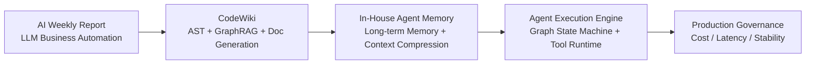

---

# 1. Opening Introduction

## 1.1 45- to 90-Second Self-Introduction

**Interview Answer:**

Hello, my name is Chen Bairun. I graduated from Shenzhen University with a bachelor's degree in Software Engineering. I currently work as a backend engineer on the Core Application Development team at CMB Network Technology, with three years of experience in backend development and AI application delivery.

In my work, I have mainly contributed to three AI projects. The first was an AI weekly-report system that implemented the complete workflow from multi-source data collection and LLM analysis to report generation and automatic delivery. It reduced the weekly-report effort from eight to ten hours to about twenty minutes and saved approximately fifty person-days per year. The second was CodeWiki, a code intelligence platform where I used Python, FastAPI, TypeScript, React, AST parsing, and GraphRAG to implement code retrieval, dependency analysis, and source-code documentation generation. It reduced the time needed to understand cross-module code from about two hours to thirty minutes. The third was an Agent long-term memory and context-compression system. I designed an L0-to-L3 layered memory architecture and combined vector search, BM25, and Hybrid RRF. The system reduced token consumption by 61%, improved the task pass rate by 52%, and increased memory accuracy from 48% to 76%.

That is the main story of my background. I would be happy to discuss any of these projects in more detail.

**Follow-up Points:**

- If asked "which experience best matches this role": answer In-House Agent Memory, because it directly maps to memory, tool logs, long-running tasks, cost, and stability.
- If asked "how does your backend capability show": answer with state persistence, async scheduling, storage adapter, interface abstraction, observability, and fault recovery — not just prompt writing.
- Before using this introduction, confirm the official English name of the CMB Network Technology team and employment entity.

---

# 2. Project 1: In-House Agent Memory

## 2.1 End-to-End Project Walkthrough

**Typical Question:**  
Can you walk through the In-House Agent Memory system end-to-end — background, goals, architecture, current implementation, and benchmark results?

**Interview Answer:**

This is our In-House Agent Memory project. It addresses two recurring problems in long-running Agent tasks.

First, tool call logs, search results, and code snippets would quickly blow up the context window. Reasoning quality degraded, and costs spiked. Second, Agents had no stable memory across sessions — users had to repeat their SOPs, project background, preferences, and historical issues every time.

The design goal was not to build a chat-log search tool, but memory infrastructure for the Agent runtime. One track supports long-term memory by extracting facts, scenes, and Persona from historical conversations. The other governs short-term context by offloading large tool results and keeping a smaller working state in the prompt. The implementation also supports different host entry points such as OpenClaw and the Gateway/Hermes path.

The overall architecture has two main tracks:

The first is the long-term memory track, using tiered L0 through L3. L0 keeps captured conversation evidence. L1 contains structured atomic memories. L2 aggregates related memories into scenes. L3 is the long-term Persona. Retrieval combines vector search, BM25 full-text search, and Hybrid RRF fusion ranking.

The second is the short-term context-governance track. After a tool call, the full result is offloaded to external storage such as `refs/*.md`, a compact entry is created, and a lightweight Mermaid task diagram provides navigation. The Agent still needs the current request, system instructions, working messages, and selected summaries; the diagram is a compact task index, not the whole reasoning context.

The current codebase has four major areas I can explain in detail: the host-neutral `TdaiCore`; the long-term memory pipeline from L0 capture through L1 extraction, L2 scenes, L3 Persona, and recall; the Context Offload path with tool-result capture, prompt-time compression, Mermaid navigation, `node_id` lookup, and token thresholds; and the surrounding Gateway, host adapters, async scheduling, cleanup, and reporting code. That describes the implementation surface. It does not by itself prove that I personally owned every module, so I would map my actual contribution to the RACI before using an ownership claim.

For measured results, I keep the scope explicit. In one recorded WideSearch configuration, token use decreased by 61.38% and pass rate improved from 33% to 50%, which is a 51.52% relative increase. In one recorded PersonaMem configuration, final-answer accuracy moved from 48% to 76%. These numbers describe those stored benchmark runs; they are not production-wide averages and do not isolate the contribution of each component.

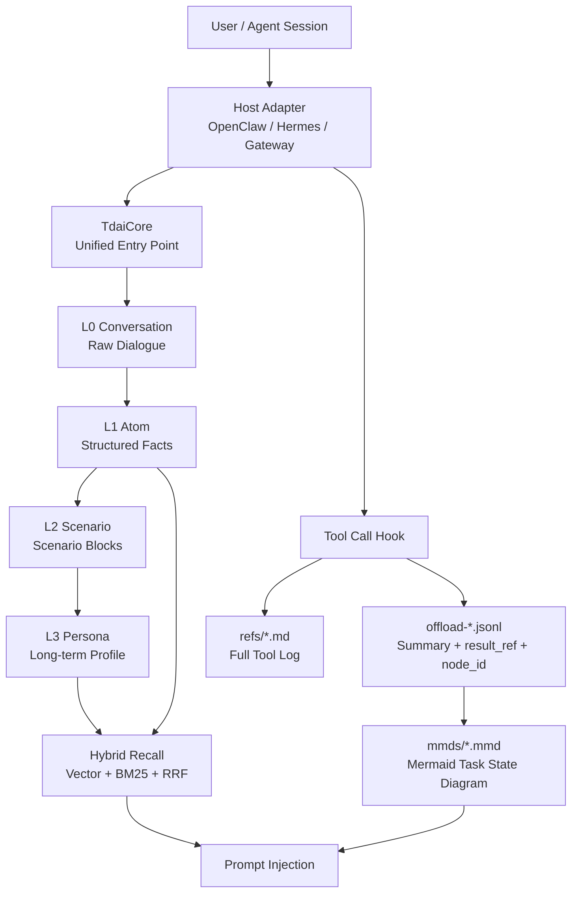

---

## 2.2 What Each L0–L3 Layer Solves

**Typical Question:**  
What exactly does each L0–L3 layer do? Why not just use a single vector database or a global summary?

**Interview Answer:**

The core philosophy of L0–L3 is: lower layers preserve evidence; higher layers preserve structure. Lower layers are responsible for traceability; higher layers are responsible for injectability and decision support.

L0 is the raw-conversation layer. It appends captured user and assistant messages, IDs, session context, and timestamps, giving the higher layers an evidence base. "Raw" here does not mean a forensic byte-for-byte transcript: the capture path removes known framework-injected blocks and noise. L1, L2, and L3 all involve model extraction or summarization, so retaining the captured L0 text is important for diagnosis and reprocessing.

L1 is the atomic-memory layer, extracting structured `persona`, `episodic`, and `instruction` records from new L0 messages. The prompt filters temporary requests and asks for structured output. Before writing a new record to the online store, the pipeline retrieves similar candidates and asks the model for a `store`, `skip`, `update`, or `merge` action. That reduces noise and duplication, but it is not deterministic fact validation or a complete conflict-governance system.

L2 is the scenario layer, organizing multiple related L1 facts into a scenario block — for example, "development conventions for a certain project" or "SOP for a certain type of production issue." It solves the problem of fragmented memories lacking context. A single fact may be very short, but when an Agent is actually executing a task, it needs to understand the relationships among a group of facts.

L3 is the Persona or long-term-profile layer. Its prompt is intended to summarize relatively durable preferences such as tech stack and communication style from changed scenes and the existing Persona. It supplies a compact prior, but current durability is a soft prompt goal rather than a hard stability field or gate.

Why not use a single vector database? Because vector databases are good for similar-text retrieval, but they don't natively understand hierarchy, freshness, conflicts, and evidence chains. They might recall a few similar snippets, but they don't know which is the latest, which belong to the same scenario, which contradict each other, or whether to give the Agent a single fact, a scenario, or a long-term preference.

Why not use a global summary? Global summaries are very token-efficient, but they are irreversible, prone to over-compression, and become increasingly chaotic over time. If an early summary is wrong, the error keeps being inherited. Once details are summarized away, the Agent cannot retrieve them when it needs to verify evidence.

The design principle is that Agent memory cannot stop at "store and search." It also needs extraction, aggregation, recall, update, and evidence-oriented diagnosis, while Context Offload separately handles the active prompt.

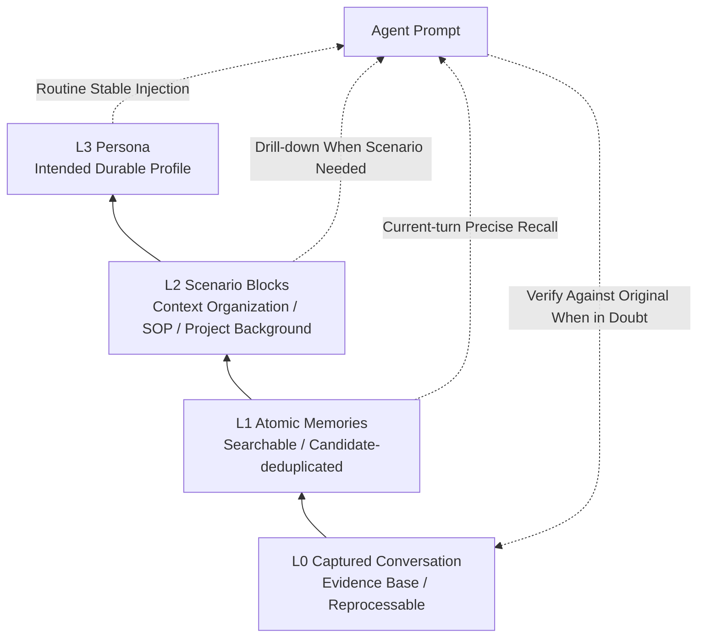

**Follow-up Points:**

- If asked "how does L1 reduce dirty data": prompt-level noise filtering, structured output, and candidate-based `store/skip/update/merge`; then state clearly that source entailment and full conflict governance are not hard-validated today.
- If asked "difference between L2 and L3": L2 is a scene-level Markdown abstraction; L3 is an intended cross-scene Persona, with durability enforced only through conservative prompting today.
- If asked "when to update L3": can be triggered by new memory count, scenario changes, or time intervals; supports incremental updates.

---

## 2.3 Hybrid Recall: Vector Search, BM25, and RRF

**Typical Question:**  
Why use vector search, BM25, and Hybrid RRF simultaneously? What specific problem does RRF solve?

**Interview Answer:**

We use hybrid recall because queries in Agent memory are highly unstable — a single retrieval method can't cover everything.

Vector search excels at semantic similarity. For example, when a user asks "what was that deployment standard I had before," it can recall memories like "production release SOP" or "canary check process" even if the phrasing differs. But it's not sensitive enough to exact symbols — like project names, API names, error codes, table names, commands, or version numbers — which are critical in Agent scenarios.

BM25/FTS perfectly fills this gap. It is more sensitive to keywords, proper nouns, code identifiers, and error text — content like `TDAI_GATEWAY_API_KEY`, `OpenClaw`, `sqlite-vec`.

So the default is Hybrid: two parallel recall paths, fetching more candidates, say `limit * 3`, then merging and ranking with RRF.

The core problem RRF solves is that BM25 scores and vector similarity scores are on different scales and cannot be directly summed. BM25 scores are influenced by term frequency, document length, and corpus size, while vector similarity follows a completely different distribution. RRF doesn't care about raw scores — it only cares about each result's rank within its own list.

The formula is roughly:

```text
score = Σ 1 / (k + rank)
```

We use the common `k` of 60. If a memory ranks high in both BM25 and vector search, its RRF score compounds and gets boosted. If it ranks high in only one path, it's still preserved. This avoids the score normalization problem and allows semantically relevant results and exact keyword matches to reinforce each other.

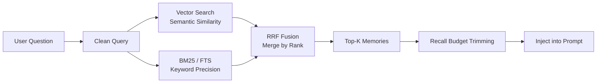

**Follow-up Points:**

- Why not use a reranker: the current implementation uses RRF and therefore needs no separate ranking model. A reranker may improve relevance, but that requires a controlled quality, latency, and cost comparison; the existing material does not prove RRF is optimal.
- Why clean the query: strip gateway metadata, base64, media markers to avoid retrieval bias.
- How to degrade: fall back to FTS when embedding is unavailable; fall back to embedding when FTS is unavailable; inject nothing if both are unavailable.
- How to evaluate recall quality: offline, I would measure final-answer accuracy, relevant-memory Top-K recall, incorrect injection, evidence drill-down, and token use. In an online deployment, I would instrument user correction, useful recall, drill-down, recall latency, and injection cost; I would not imply those dashboards already exist.

**Strategy choices can be supplemented as follows:**

- Vector cosine: suitable for natural language expressions, paraphrasing, user preferences, and SOPs — semantic memories.
- BM25/FTS: suitable for project names, variable names, error codes, config keys, commands, API names — precise symbols.
- Hybrid RRF: the default mixed-query strategy; when a query contains both natural language and technical identifiers, the two candidate lists can complement each other. Its real quality still needs task-specific evaluation.

---

## 2.4 How Long-Term Memory Accuracy Went from 48% to 76%

**Typical Question:**  
Long-term memory accuracy went from 48% to 76%. How was this metric evaluated?

**Interview Answer:**

The source-backed statement is narrow: the stored PersonaMem benchmark reports final-answer accuracy moving from 48% to 76% under its recorded model, plugin, dataset, and scoring configuration. It is not a universal production accuracy number and it does not prove a particular online user population.

At a high level, the benchmark feeds historical conversations through the memory pipeline, asks held-out questions, and compares final answers with the benchmark references. If I am asked for exact sample counts, category percentages, judge thresholds, or manual-review ratios, I would read them from the stored benchmark artifact rather than inventing them from memory.

Within that specific PersonaMem run, the baseline was 48% and the configured memory system reached 76%. I would report both the configuration and the result together.

What makes this metric more meaningful to me is that it tests whether the Agent can ultimately use historical information correctly — not simply whether the vector database found a piece of text. Because in real scenarios, the value of a memory system is not "was it retrieved," but "was it injected at the right moment, at the right granularity, for the Agent."

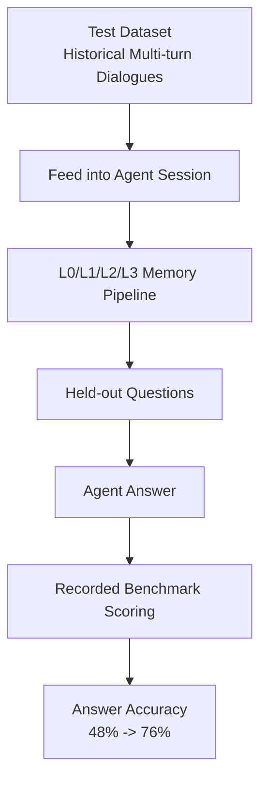

**Follow-up Points:**

- Be careful to say "final answer accuracy," not "retrieval accuracy."
- If pressed on scoring risk: say the exact judge, thresholds, and review procedure must come from the stored benchmark artifact; do not invent a sampled manual-review step.
- If asked about online metrics: say I would measure useful recall, incorrect-memory injection, user correction, original-evidence drill-down, recall latency, token cost, and task outcomes. The current benchmark does not prove that an online dashboard already exists.

---

## 2.5 Context Offloading and Tool Log Compression

**Typical Question:**  
When tool logs and historical messages bloat, how do you decide what to keep, compress, or discard? How do you recover after a task interruption?

**Interview Answer:**

The current implementation does not use a single one-shot summary. It applies tiered context governance: offloaded tool results are written to external artifacts before those tool messages are replaced, while the prompt keeps a smaller working set. Later aggressive or emergency message deletion is still lossy, so this principle must not be expanded into a claim that every deleted conversation can be recovered.

After each tool call completes, `after_tool_call` captures the tool name, parameters, result, duration, and `tool_call_id`. The full raw result is written to `refs/*.md`, while simultaneously generating an `offload-<session>.jsonl` record containing the tool call summary, `result_ref`, `tool_call_id`, timestamp, and a replaceability score `score`. Later, L2 links it to a `node_id` in the Mermaid diagram.

The decision to compress is driven primarily by two classes of signals: token watermarks and information value.

The first tier is mild compression. The implementation can use a cheap character-based estimate when the prompt is safely below a boundary and an exact tiktoken count when a threshold decision is close. If usage exceeds the mild threshold, 50% of the context window by default, it replaces eligible historical tool results with summaries. Priority is given to records where the L1 `score` indicates that the summary can replace the original more safely. The replacement retains the summary, `node_id`, and `result_ref`.

The second tier is aggressive compression. If tokens approach the aggressive threshold, e.g., 85% by default, replacing with summaries alone is no longer enough, so earlier historical message prefixes are deleted. But deletion is only removal from the current prompt, not from storage. By this point, those tool logs already have jsonl summaries, refs originals, and Mermaid node mappings.

The third tier is the emergency fallback. If the context nears 95% of the context window, the system enters lossy emergency compression and aims to reduce usage to roughly 60%. The current deletion logic explicitly protects the latest real user message and tries to keep tool-call/result structure valid, but earlier user messages can still be removed. If head deletion is blocked, it can remove large non-user tool groups and may truncate oversized messages. This tier is an availability safeguard, not semantic equivalence.

On-the-spot recovery relies on three types of persisted information: `state.json` records the active MMD and session state; `offload-*.jsonl` records tool-call summaries, IDs, node mappings, and original references; `mmds/*.mmd` stores the Mermaid task navigation. On re-entry, the Agent first reloads a compact task view, then follows `node_id -> offload entry -> result_ref` only when it needs a specific tool result. This is selective recovery, not replay of the entire old prompt. `refs` preserve offloaded tool originals, but they do not guarantee that deleted ordinary conversation, wording, or local relationships can all be reconstructed.

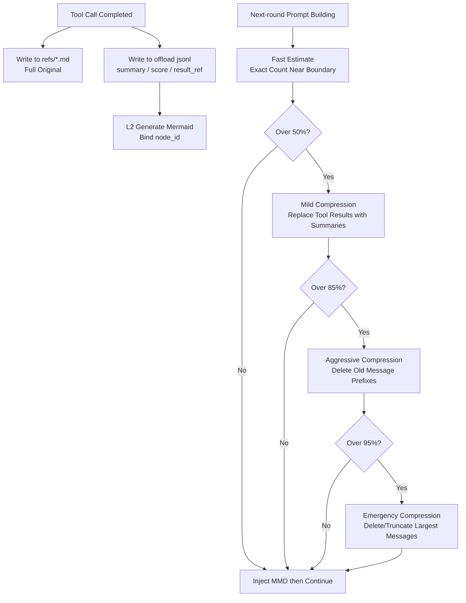

**Follow-up Points:**

- Why not just delete: need traceability; deletion is prompt-layer removal only.
- How to avoid breaking tool_use/tool_result structural pairing: maintain tool call pairing during compression and deletion.
- Why Mermaid: high information density, clear topological structure, readable by both LLMs and humans.
- How to limit reasoning damage: preserve the latest real user request and tool-call/result structure, keep task navigation and references where possible, and drill down to a required tool original on demand. Emergency compression is still lossy, and a missing or incorrect mapping can prevent recovery.
- Where did 61.38% come from: compared total token consumption before and after integrating the plugin in a long-session benchmark — e.g., OpenClaw raw tokens vs. plugin-compressed tokens in the WideSearch scenario, using relative reduction.

---

## 2.6 Scenario Drill: Diagnosing Prompt-Cache Instability from Dynamic Memory

**Typical Question:**  
If token cost suddenly increased after enabling dynamic memory, how would you diagnose whether prompt-cache instability was the cause?

**Interview Answer:**

I would not present this as a source-verified outage. The implementation does expose a real design concern: the Persona and Scene Navigation are relatively stable, while current-turn L1 recall changes frequently. Putting changing L1 content inside an otherwise reusable prefix can reduce prefix-cache reuse. The full L2 scene text is not a routine stable injection; it is read on demand through Scene Navigation.

In a diagnosis, I would first compare billable input tokens, cached input tokens, traffic, prompt length, tool-result volume, model, and prompt version. A cost increase alone is not enough to blame cache behavior.

Next, I would compare adjacent-turn prompt hashes or diffs. If only the recalled L1 block changes inside an otherwise stable prefix, that is evidence for a cache-instability hypothesis. It is still a hypothesis until provider usage data and a controlled comparison support it.

I would validate it in three steps:

First, compare adjacent prompts and isolate the exact dynamic block.

Second, check provider-reported cached-token usage, while holding model and request shape constant.

Third, run a controlled benchmark: one variant keeps dynamic L1 in the stable prefix; the other keeps stable instructions, Persona, and Scene Navigation in the cacheable prefix and moves dynamic recall later. Compare answer quality, cache reuse, effective input tokens, and latency. I would only claim an improvement after recording those results.

The design I would test is splitting memory injection into two categories:

```text
Stable context: L3 Persona, Scene Navigation derived from L2, tool instructions -> system prompt
Dynamic context: current-turn L1 relevant memories -> user prompt prefix
```

The engineering lesson is that Agent cost depends on context stability as well as context length. Dynamic content should not casually invalidate a reusable prefix, but the actual cache behavior must be verified against the selected provider.

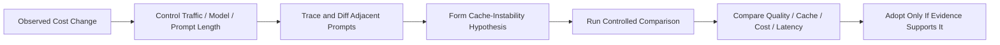

---

# 3. Project 2: CodeWiki Code Intelligence Platform

## 3.1 End-to-End Chain: From Code Lookup to Document Generation

**Typical Question:**  
Starting from a single user request to look up code or generate documentation, walk through the entire chain — source parsing, AST/dependency graph, GraphRAG retrieval, to LLM document generation.

**Interview Answer:**

The user first registers a repository with CodeWiki. The system runs an analysis pipeline: `RepoScanner` scans the repository, handling `.gitignore`, binary files, file size limits, language detection, and Git metadata. Then the AST layer uses tree-sitter and language augmenters to parse source code, extracting unified `AstSymbol` representations — e.g., file, class, function, method, endpoint, schema — while recording imports, calls, references, inherits, routes, and other information.

Next, `GraphBuilder` transforms these AST facts into a Code Graph. Nodes include repository, directory, file, class, function, endpoint, etc. Edges include contains, defines, imports, calls, inherits, routes_to, uses_config, and so on. Here, I did not let the LLM judge code relationships. Instead, I used AST and static rules to generate deterministic facts as much as possible. For relationships that are not fully certain — like cross-file calls and import resolution — provenance information such as confidence, reason, and is_inferred is recorded.

When a user submits a query, e.g., "how does the payment callback chain work," GraphRAG first finds seed nodes at the symbol layer: matching function names, class names, endpoints, file names. Simultaneously, it searches source chunks via FTS, and optionally via vector index. Hit chunks are reverse-merged onto graph nodes. Then, from the seed node, it performs limited-hop graph expansion along calls, imports, contains, routes, and other edges. Finally, the system selects source snippets, related nodes, related edges, and community summaries within a token budget, packaging them as a context pack for the LLM.

For documentation generation, the flow is similar but adds a catalog/page workflow. First, a directory structure is generated. Then, for each page, GraphRAG retrieval is performed per topic to obtain source snippets, graph relationships, source_refs, and optional Mermaid diagrams. The LLM writes each page based solely on this evidence, outputting JSON. The server validates the JSON, verifies that source_refs come from allowed source snippets, checks citation markers, and validates Mermaid. If validation fails, it feeds the errors back to the LLM for repair. If repair still fails, it degrades to draft — hallucinated documentation is never directly marked as generated.

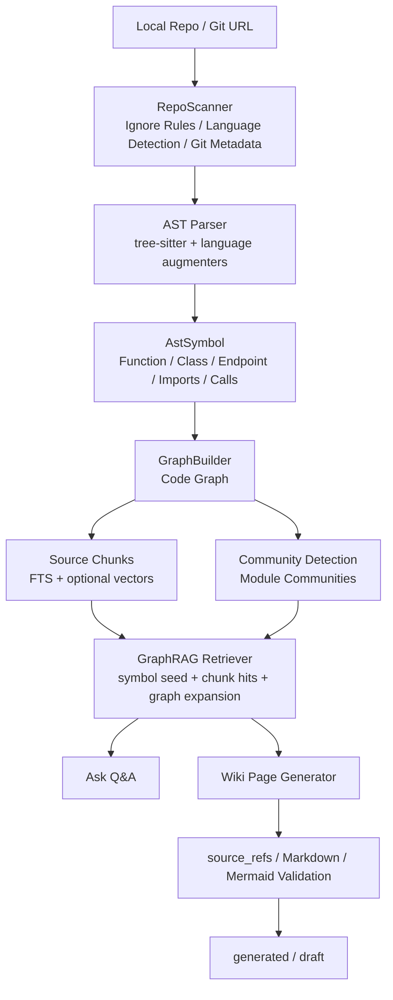

**Follow-up Points:**

- Where LLM is used: community naming, Wiki catalog/page, Q&A; core code relationships do not depend on the LLM.
- Why a graph is better than plain RAG: can expand context along real dependency relationships, avoiding only recalling similar text.
- How to control hallucinations: only allow citing retrieved source_refs, enforced by server-side validation.

---

## 3.2 CodeWiki's Hardest Technical Challenge

**Typical Question:**  
What was the hardest technical challenge in this project?

**Interview Answer:**

I think the hardest part was how to anchor "unreliable LLM generation" on "reliable code facts."

In code understanding, the most dangerous outcome is a plausible answer that cannot be traced back to source code. The current implementation uses three layers of constraints:

First, facts should come from AST and graph whenever possible, not LLM guesses. Multi-language parsing uses a unified `AstSymbol` contract, converting functions, classes, endpoints, schemas, imports, and calls across different languages into the same intermediate representation.

Second, retrieval isn't pure text RAG. It's symbol seed + FTS/vector + graph expansion. For example, if a user asks about an API chain, the system first locates the endpoint or handler, then expands along edges like `routes_to`, `calls`, `imports`, and `contains`, giving the model both source code near the call chain and the graph relationships.

Third, generated output must carry source references and pass server-side validation. After the LLM outputs JSON, the server checks whether source_refs come from allowed chunks, whether citation markers in the Markdown are valid, and whether Mermaid is parseable. If validation fails, it enters repair. If repair still fails, it's saved as draft.

Difficulties also include cross-language AST discrepancies, uncertainty in cross-file call resolution, graph scale for large repositories, and incremental updates. The implementation's trade-off is to mark uncertain static resolutions as inferred with provenance fields instead of presenting them as deterministic facts.

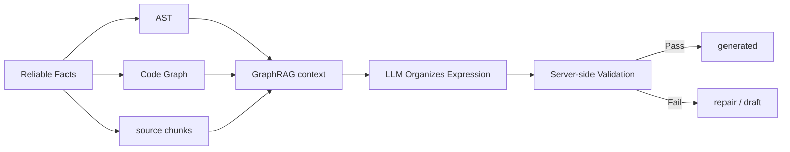

---

## 3.3 How to Prove CodeWiki Improves Code Comprehension Efficiency

**Typical Question:**  
How did you prove it actually improved code comprehension efficiency?

**Interview Answer:**

I look at two categories of metrics.

One is engineering capability metrics. The stored repository benchmarks include Rust, VS Code, and Superset. For Rust, the cold run covered over 36,000 files and produced roughly 300,000 nodes and 880,000 edges. For VS Code, it produced roughly 160,000 nodes and 3.79 million edges. The warm-file reuse rates were 99.7%, 96.9%, and 98.2% for Rust, VS Code, and Superset, while the corresponding end-to-end speedups were only 1.29x, 1.06x, and 1.51x. That gap is important: file reuse is high, but graph rebuild, community computation, and persistence still limit end-to-end acceleration.

The second category would be human task efficiency and adoption, but I have to separate that from the repository benchmark. The older narrative mentions more than 50 daily queries, a change from about two hours to 30 minutes, and use in onboarding or code review. Without query logs, a defined task protocol, sample details, and before-and-after records, I would not quote any of those as verified results.

To prove comprehension efficiency, I would define representative cross-module tasks on a fixed repository, compare the same success criteria with and without CodeWiki, and record completion rate, time to a source-verified answer, citation correctness, and follow-up effort. For adoption, I would use auditable query logs and distinguish unique users, sessions, automated calls, and failed requests. Until those records are available, the defensible result is engineering benchmark capability, not a claimed productivity gain.

I think this closed loop is critical: it's not about making people trust the model, but about letting the model help you locate entry points and organize dependency relationships, so you can quickly verify against source references.

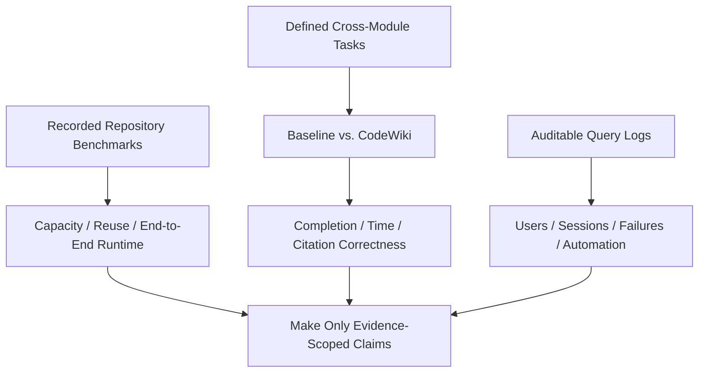

**Follow-up Points:**

- Engineering metrics: large-repo runs, node/edge scale, parse errors, warm-file reuse, and end-to-end speedup.
- Human-efficiency metrics I would measure: task success, time to a verified answer, citation correctness, and follow-up effort.
- Adoption metrics require source logs: unique users, human versus automated queries, sessions, failures, and repeat use.
- Quality metrics: source-ref validation and draft outcomes can come from the generation pipeline; user follow-up behavior requires source query logs.

---

## 3.4 Why GraphRAG Is Not Just Plain RAG

**Typical Question:**  
What's the difference between CodeWiki's GraphRAG and plain RAG?

**Interview Answer:**

Plain RAG is primarily query-to-chunk similarity retrieval — suitable for document Q&A, but code understanding has two problems: first, what users ask about might be a functional chain, not necessarily lexically similar to the source text; second, code relationships matter — calls, imports, routes, and inheritance often explain the system better than individual chunks.

So CodeWiki's GraphRAG first finds seeds at the symbol layer: functions, classes, endpoints, files, modules. Then chunks hit via FTS or vectors are reverse-merged onto nodes, followed by limited-hop expansion along the graph. The final context pack includes not only source chunks, but also related nodes, related edges, and community summaries.

This way, what the LLM receives isn't a pile of similar texts, but "the local code subgraph relevant to this question." It can answer things like "the chain from entry point to handler to service," and can provide source references.

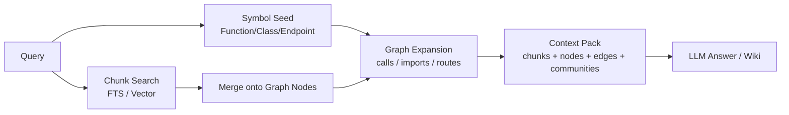

---

## 3.5 How Multi-Language AST and Call Resolution Work

**Typical Question:**  
How do you unify multi-language ASTs? How do you handle uncertainty in cross-file call resolution?

**Interview Answer:**

The parser layer maps Python, TypeScript, Java, Go, Rust, C/C++, and C# into a unified `AstSymbol` contract with fields such as id, type, name, file path, line range, signature, imports, calls, references, bases, implements, and metadata. I would claim personal ownership of that contract only if the RACI confirms it.

Language differences are handled in two layers: the first layer is capture specs, using tree-sitter queries to extract basic structure. The second layer is language augmenters, supplementing language-specific information — e.g., TS/JS exports, HTTP endpoints, schemas; Go receiver methods; Python decorator routes.

Cross-file call resolution doesn't pretend to be 100% accurate. The system first builds a call index, then performs multi-level resolution combined with import scopes. If it can be determined, it generates `calls` or `routes_to` edges. If it's only inferred, it records `confidence`, `reason`, `resolution_tier`, and `is_inferred`. Both the frontend and retrieval can see the credibility of each edge.

The benefit of this approach: the graph can serve retrieval and visualization, but inferred facts are never disguised as certain facts.

---

# 4. Project 3: AI Weekly Report System

## 4.1 End-to-End Walkthrough of AI Weekly Report

**Typical Question:**  
What exactly did the AI Weekly Report system do? Where were the difficulties?

**Interview Answer:**

The AI Weekly Report system targets a bank workflow where operations data has to be collected, summarized, and analyzed across multiple sources. Earlier project material estimates the manual process at roughly 8 to 10 hours per week, but I would treat that as an estimate until the calculation and source records are confirmed.

The current pipeline works as follows: after the end-of-day batch triggers, it initializes download control records. It then backtracks by date to check recent unsuccessful records, calls multi-source APIs, persists successful results, and updates the control table. Once all seven days of the previous week have successful download status, it enters the LLM analysis phase. My exact ownership of each step should follow the verified RACI rather than the breadth of this architecture description.

LLM analysis does not dump all data in at once. Instead, it splits work by module — for example, error-log volume, large or long transactions, slow SQL, and asynchronous-posting monitoring. Each module first computes and stores structured statistics, then assembles a prompt for the internal AI platform. The current flow has length control and finite retries. A module failure changes an in-process global success flag, while later modules can continue. It does not persist a separate durable status per module, so the next batch re-enters the weekly analysis flow rather than precisely rerunning only the failed module. Only a globally successful round updates the weekly analysis status and proceeds to report assembly and push.

Earlier project material estimates an automated run at about 20 minutes and derives roughly 50 person-days per year from the manual-time assumption. I would present both as estimates that need job timestamps and labor-baseline evidence. The available material does not establish production tenure or post-launch operational stability.

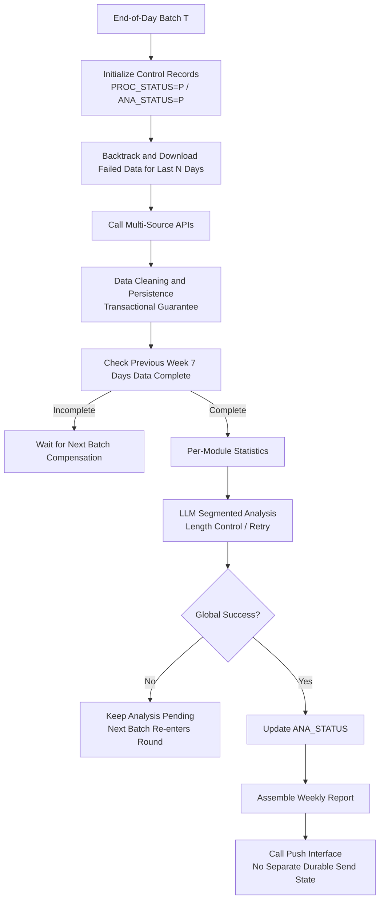

---

## 4.2 Engineering Highlights of AI Weekly Report

**Typical Question:**  
What distinguishes this project from a simple script?

**Interview Answer:**

I think it's far from a simple script, mainly reflected in several engineering points:

First, it has control-table-driven batch state. Every date has download and analysis status, so a failed collection can remain pending and later batches can revisit it. This protects against obvious missing days, but it does not prove upstream pagination completeness or end-to-end delivery.

Second, it has transaction boundaries. Data persistence and status updates are placed within transactions, preventing scenarios where data is written but status isn't updated, or status succeeds but data is incomplete.

Third, LLM calls have length control and module-level execution boundaries. Operations data can be long, so the flow splits it by business module and can truncate or batch input when necessary. A module failure does not stop later modules in the same round, and a process-local global flag determines whether the whole round succeeds. The current version does not have a durable per-module state machine or precise failed-module rerun.

Fourth, it has partial duplicate protection. Control records and result tables use `INSERT IGNORE`, which can suppress duplicate rows when the relevant unique key matches. That is not full end-to-end idempotency: the current material does not prove an atomic job lease, and repeated runs can still duplicate upstream calls, model calls, or push attempts.

These designs make it a stateful batch workflow rather than a one-click demo. Whether it met a particular production stability target, for how long, and under what operating load still requires deployment and operations evidence.

## 4.3 Most Failure-Prone Links and Stability Design

**Typical Question:**  
In the chain of data collection, LLM segmented analysis, weekly report assembly, and push delivery, which link fails most easily? What retry, idempotency, transaction, or alerting mechanisms did you design?

**Interview Answer:**

There are three main failure-prone links.

The first is upstream multi-source API collection. Upstream systems may time out, return empty data, have late-arriving data, or fail for one date. The current flow uses a download control table where each date has a `PROC_STATUS`; failures remain pending, and later batches scan a recent window for compensation. API calls have a bounded retry count and interval, and a failed collection is not marked successful. My personal contribution to this control design still needs to match the verified RACI.

The second is LLM analysis. Operations data can be long; the model may time out, return abnormal formats, or fail on a particular module. The current flow processes modules separately and uses bounded retry. If a module still fails, it logs the failure and sets the process-local `IS_ALL_ANALYSIS_SUCCESS = false`; later modules can still run, but the whole round is not marked successful. Because module outcomes are not durably persisted as an independent state machine, I would not describe this as precise failed-module rerun.

The third is persistence and status updates. Database writes and related control-state updates use transaction boundaries, and `INSERT IGNORE` reduces duplicate rows for matching unique keys. But the external push is outside the database transaction. The current flow updates analysis status before calling the push interface and has no independently verified send state or Outbox, so a send timeout can leave "analysis succeeded" without proven delivery. Durable send state, an Outbox, and idempotent delivery would be next-version controls.

For observability, the current evidence supports control-table states, `TECH_TRACE_ID`, maintenance/version fields, and step logs. It does not prove that a complete dashboard, alert thresholds, or an on-call workflow was already implemented. In a production-hardened version, I would alert on pending age, repeated collection failures, module retry exhaustion, report deadlines, and send failures, with a `trace_id` or `report_id` connecting the evidence. I would present that last sentence as next-version design, not current behavior.

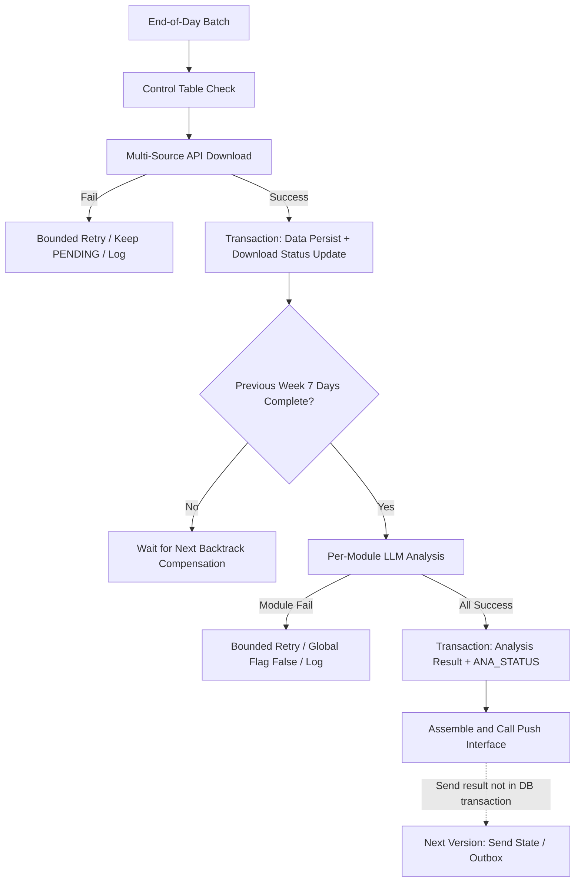

---

# 5. Scenario Design: Agent Execution Engine

## 5.1 Designing an Extensible Agent Execution Engine from Scratch

**Typical Question:**  
If you were to build an extensible Agent execution engine from scratch after joining, supporting ReAct, Plan-and-Execute, tool calling, retry, and Human-in-the-loop, how would you abstract it?

**Interview Answer:**

If I were to build an Agent execution engine from scratch, I wouldn't make it a simple `while true` calling an LLM. I would abstract it as a persistable graph state machine. Because Agent tasks naturally involve planning, execution, tool calling, failure retry, human approval, and state recovery — all of which are well-suited to expression through nodes and edges.

For state, I'd design a unified `AgentRunState` that holds the task objective, current mode, message history, plan list, current step, tool results, memory references, budget, retry count, and checkpoint. After executing each node, I'd persist the state. This way, even if a worker crashes or a task enters a pending human approval state, it can be recovered from the last checkpoint.

For nodes, I'd abstract LLM reasoning, plan generation, tool calling, result validation, human confirmation, context compression, and final answer into different node types. For example, ReAct mode is a cycle of `Reason -> Tool -> Observation -> Reason`. Plan-and-Execute is `Planner -> Executor -> Validator`, with failed validation looping back to re-planning. Edges are conditional: if the model decides to call a tool, it goes to ToolNode; if it judges the task complete, it goes to FinalNode; if it hits a high-risk operation, it goes to HumanGateNode.

For the tool layer, I'd build a standardized Tool Registry. Every tool has name, description, input schema, permission scope, timeout, retry strategy, whether it requires human approval, and whether it's idempotent. The LLM is only responsible for producing the tool name and parameters. The actual parameter validation, authorization, rate limiting, timeout, retry, and result archiving are handled by the Tool Runtime. Large results are not stuffed back into context directly — they're stored as artifacts, and only the summary and reference are handed back to the Agent.

ExecutionContext is abstracted separately, containing user identity, tenant, model configuration, tool registry, memory system, artifact store, event bus, trace id, deadline, and cancellation token. This ensures isolation and facilitates model routing, cost control, and end-to-end tracing.

Human-in-the-loop is handled as a special node type. For high-risk tools like sending emails, deleting data, or calling production APIs, execution enters HumanGateNode before proceeding — the run status changes to paused, and a pending approval is persisted. After the user confirms, execution resumes from the next edge. If rejected, it follows the cancel, rollback, or re-plan branch.

For the deployment architecture, I'd use FastAPI or gRPC to provide run creation and query APIs. PostgreSQL stores runs, steps, events, checkpoints, tool_calls, and human_tasks. Redis handles queues, leases, and short-lived state. Workers execute nodes asynchronously. An artifact store holds large tool results. A vector database or pgvector handles long-term memory.

To summarize, I'd split the Agent engine into three parts: the Graph Runtime handles flow, the State Machine handles recovery and consistency, and the Tool Runtime handles external-world interaction. This way, ReAct, Plan-and-Execute, and multi-Agent collaboration are just different graph templates — the underlying state, tool, approval, retry, and observability capabilities are all reusable.

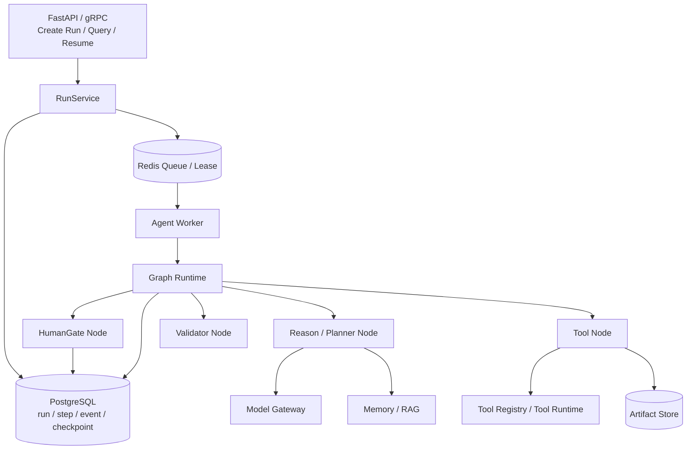

---

## 5.2 How to Unify ReAct and Plan-and-Execute

**Typical Question:**  
Do ReAct and Plan-and-Execute require two separate engines?

**Interview Answer:**

I wouldn't build two separate engines. I'd abstract them as different graph templates.

ReAct's template is a cycle of Reason, Tool, Observation — each round the model decides whether to call a tool, continue reasoning, or give a final answer.

Plan-and-Execute's template: the Planner first generates a plan, then the Executor executes step by step, and the Validator determines whether the current step is complete. If the plan becomes invalid, it loops back to the Planner for re-planning.

Underneath, both reuse the same state persistence, tool runtime, retry, approval, and event recording. The only difference is node composition and edge conditions.

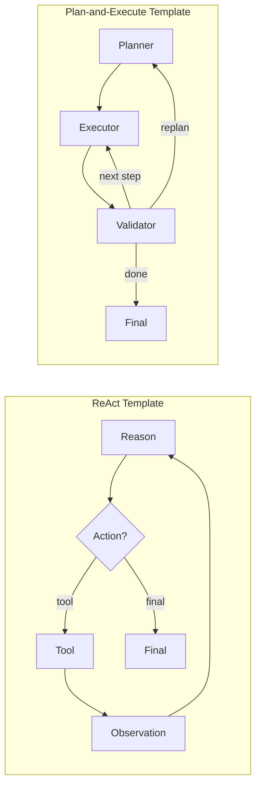

---

## 5.3 How to Troubleshoot Production Latency, Cost, and Tool Failures

**Typical Question:**  
When overall Agent service latency increases, token costs are high, and occasional tool call failures occur, which metrics do you look at first? How do you optimize?

**Interview Answer:**

I wouldn't start by tweaking prompts based on intuition. Instead, I'd first break down a single Agent run into an observable chain: `Run -> Step -> LLM Call -> Tool Call -> Memory/RAG -> DB/Queue`. Every run must have a trace_id so that latency, tokens, and errors can be correlated.

I'd look at three categories of metrics first.

The first category is latency metrics: end-to-end p50/p95/p99, queue wait time, per-step duration, LLM time-to-first-token and total duration, tool call duration, RAG retrieval duration, database and Redis duration. This tells me whether it's slow queuing, a slow model, slow tools, or too many Agent loops.

The second category is cost metrics: input/output tokens per run, context length distribution, per-turn injected memory/RAG tokens, tool log tokens, retry consumption tokens, model call ratio by tier, prompt cache hit rate. If cost spikes suddenly, I focus on context bloat, excessive retrieval recall, uncompressed tool results, or failed retries causing multiple expensive model calls.

The third category is stability metrics: tool call success rate, timeout rate, 4xx/5xx rate, retry count, circuit-breaker trip count, parameter validation failure rate, LLM JSON parse failure rate, Agent max-loop trigger count, and final task success rate.

After pinpointing, for latency: if the LLM is slow, do model routing, parallel retrieval/tool calls, streaming responses, prompt caching. If the queue is slow, scale workers, split priority queues, and prevent long tasks from blocking short ones. If tools are slow, add timeouts, connection pools, async calls, and result caching.

For cost, the core is context control: offload large tool results, only give summaries and artifact_refs; RAG recall with token budget and top-k limits; tiered historical message summaries; semantic cache for repeated questions; set max steps, max retries, and run token budgets.

For stability: standardize the tool runtime — parameter schema validation, permission checks, idempotency keys, timeout control, exponential backoff retry, failure classification. Add circuit breakers and fallbacks for external services. Add Human-in-the-loop for high-risk tools. Use checkpoints for long tasks, recovering from the last step on failure.

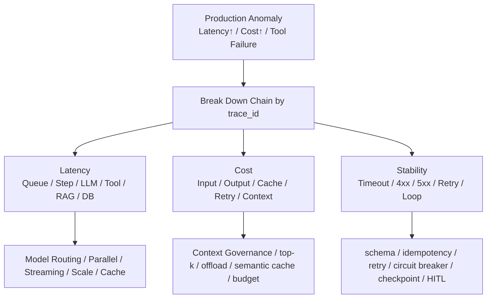

---

# 6. Behavioral-Answer Boundary and Scenario Framework

## 6.1 How I Would Drive Progress When Requirements Are Vague

**Typical Question:**  
Tell me about an experience where you drove a project forward despite unclear requirements.

**Interview Answer:**

I need to be careful with this question. The current project artifacts verify architecture and scoped benchmark results, but they do not verify the origin of the requirements, stakeholder positions, experiment chronology, delivery order, rollout status, or decision-artifact history. I would not turn plausible details into a personal STAR story.

If my internal records confirm a real episode, I would answer with the actual stakeholders, my RACI, the decision I owned, the options we considered, and a result that has evidence. Until then, my honest spoken answer would be: "I can explain how I would structure an unclear Agent-memory problem, but I don't want to invent a collaboration event that the project documentation doesn't prove."

As a scenario answer, I would first separate the problem into cross-session memory and within-session Context Offload, because they have different data and success criteria. I would define acceptance measures before choosing an architecture: final-answer quality and evidence traceability for long-term memory; token use, task outcome, and original-result drill-down for offload. Then I would test the smallest viable interfaces against fixed cases, document the current-versus-next-version boundary, and only expand integration after the results justify it.

The recorded WideSearch and PersonaMem numbers can support the benchmark discussion, but they cannot prove a collaboration narrative or rollout chronology.

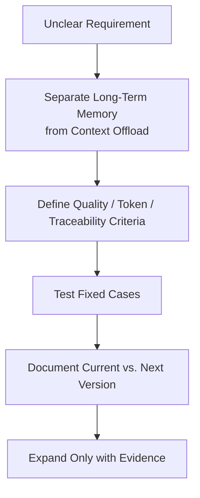

---

# 7. High-Frequency Follow-Up Question Bank

## 7.1 In-House Agent Memory

### Q1: What if L1 extraction produces wrong results?

**Answer:**  
L1 is an LLM extraction layer, so I don't treat it as absolute fact. L0 preserves the raw conversation, and the L1 prompt asks each memory to carry `source_message_ids`. Before online storage, the pipeline also performs structural checks and candidate-based `store`, `skip`, `update`, or `merge` decisions. But the current implementation does not hard-validate every source ID or prove that the source text entails the extracted memory, and I would not claim that L2 and L3 provide a complete end-to-end provenance chain. When investigating an error, I use the available source IDs and L0/L1 artifacts as evidence, while acknowledging that strict span validation is a next-version requirement.

### Q2: What if incorrect memories are recalled?

**Answer:**  
I separate what the current Recall path does from what stronger governance would add. The current implementation uses a configured top-k and a selected keyword, embedding, or Hybrid strategy. Pure keyword or embedding paths can use the configured score threshold, while local Hybrid merges two ranked candidate lists with RRF and takes the top results; it does not apply a documented default unified RRF cutoff. The current Recall path also does not provide a complete type-and-scene filter chain. Recalled text is labeled as historical context, and the current user request should take priority, but hard conflict verification and richer type/scene policy are next-version controls.

### Q3: Why is Mermaid suitable for short-term memory?

**Answer:**  
Because in long tasks, what the Agent needs most is a sense of direction: what the goal is, which steps have been done, where something failed, and where it currently is. Mermaid expresses topology and state with very few tokens — more compact than natural language summaries, and more human-readable than JSON. Crucially, each node carries a `node_id` that can be used to drill back into jsonl and refs for original evidence.

### Q4: How to prevent long-term memory contamination?

**Answer:**  
Don't describe the current system as if it has a hard stability gate. L0 keeps the raw evidence, L1 extracts atomic memories, L2 organizes scenes, and the L3 prompt asks the model to update Persona conservatively from changed scenes and the existing Persona. But there is no structured `stability` field or rule such as `stability=high` before information can enter L3. Filtering temporary information more rigorously, requiring repeated evidence, and representing conflicts explicitly are next-version governance ideas.

### Q5: What do offline and online evaluation look at respectively?

**Answer:**  
Offline, I would measure final-answer accuracy, relevant-memory recall, incorrect injection, token use, evidence drill-down, and task outcomes on a versioned dataset. For an online deployment, I would measure user correction, helpfulness, original-evidence drill-down, per-turn tokens, recall latency, cache behavior, and task outcomes by task type. Those are metrics I would instrument; the current project material does not verify that a complete online metric pipeline already exists.

---

## 7.2 CodeWiki

### Q1: Why not just have the LLM read the repo directly and generate docs?

**Answer:**  
Reading the repo directly is easily bottlenecked by context window limits and is prone to hallucination. CodeWiki first establishes deterministic facts via AST and graph, then uses GraphRAG to select relevant source code and dependency relationships, and finally lets the LLM organize the expression. This way, the LLM's freedom is constrained by source_refs and server-side validation.

### Q2: What if GraphRAG retrieval fails?

**Answer:**  
There are multiple levels of fallback. First symbol seed, then FTS, then optional vector. If none match, it falls back to repository/file overview seeds, at least providing repository-level context. For document generation, there are also source hints that can forcibly supplement page-relevant files.

### Q3: How to ensure consistency across languages in parsing?

**Answer:**  
Unified intermediate representation `AstSymbol`. Language differences are handled in capture specs and augmenters. Graph construction only consumes the unified contract and doesn't directly care about language specifics. Adding a new language mainly involves adding a parser, capture spec, augmenter, and tests.

### Q4: How to control performance on large repositories?

**Answer:**  
The scanning phase handles ignore rules, binary detection, and size limits. AST has content-hash caching. Incremental updates reuse symbols from unchanged files. Graph and community detection are phased. LLM calls are cached. Stress test results show we can handle real large repos like Rust and VS Code, but incremental graph construction and high-edge-density repositories remain optimization priorities.

### Q5: How to ensure documentation quality?

**Answer:**  
Page generation must carry source_refs. Server-side validation checks that references come from allowed source snippets, Markdown structure, and Mermaid validity. Failed validation triggers repair. If repair still fails, it's saved as draft — never passed off as generated.

---

## 7.3 AI Weekly Report

### Q1: What if LLM analysis results are unstable?

**Answer:**  
First, structure the input around deterministic statistics and business definitions. Second, fix the prompt template and split work by module to reduce per-call complexity. Third, persist traceable results and the underlying statistics so they can be inspected later. Fourth, use bounded retry within the module run, but keep the current limitation clear: module outcomes are not durably persisted for precise failed-module rerun.

### Q2: What if multi-source APIs fail?

**Answer:**  
Use a control table for state management. Failures remain pending, and the next end-of-day batch backtracks the last N days for compensation. Individual calls have a max retry count and retry interval. Data persistence and status updates are in a transaction to ensure consistency.

### Q3: How to avoid duplicate batch runs?

**Answer:**  
Control records and result tables use idempotent writes, e.g., `INSERT IGNORE`. Each date has a status field; cycles already successfully downloaded or analyzed won't be regenerated.

---

# 8. Final Questions to Ask the Interviewer

At the end of the interview, you can ask a question that's highly relevant to the role:

**Template:**

I'd like to understand: is the team's most core Agent scenario currently more about internal R&D efficiency/code understanding, or more about business process automation? This would influence whether I'd prioritize investing in the execution engine, tool ecosystem, or long-term memory and evaluation framework after joining.

You can also ask:

1. Is the current biggest bottleneck in the Agent system more around accuracy, cost, latency, or tool ecosystem?
2. Does the team currently have a unified Agent evaluation set and online tracing system?
3. Is the team currently leaning more toward extending frameworks like LangGraph/DSPy, or building a lightweight custom execution engine?

---

# 9. One-Page Cheat Sheet

## In-House Agent Memory

- Background: long-task context bloat, no cross-session memory.
- Architecture: L0 originals, L1 atomic facts, L2 scenarios, L3 Persona.
- Retrieval: Vector + BM25 + RRF.
- Compression: refs originals, jsonl summaries, MMD state diagrams.
- Mental model: token-level external memory first; parametric memory only for stable shared patterns; latent memory has a narrower runtime lifecycle.
- Context engineering: reduction removes content, offloading externalizes evidence with refs, and isolation limits each sub-agent to a sufficient task slice.
- Markdown memory: useful for small, stable, reviewed rules; dynamic facts and large event histories belong in versioned stores and retrieval layers.
- Recorded benchmarks: WideSearch tokens 221.31M -> 85.64M and pass rate 33% -> 50%; PersonaMem final-answer accuracy 48% -> 76%. These are configuration-scoped offline results.
- Keywords: traceability, tiered, context governance, prompt cache, state recovery.

## CodeWiki

- Background: slow cross-module code comprehension.
- Architecture: RepoScanner -> AST -> Code Graph -> GraphRAG -> Wiki/Ask.
- Difficulty: LLM generation must be anchored on deterministic source-code facts.
- Safeguards: source_refs validation, Mermaid validation, repair/draft.
- Recorded results: large-repository capacity plus warm-file reuse of 99.7% / 96.9% / 98.2% and end-to-end speedup of 1.29x / 1.06x / 1.51x for Rust / VS Code / Superset. Daily-query and 2-hours-to-30-minutes claims still require source logs and a defined study.
- Keywords: AST, graph, GraphRAG, source-grounded, provenance.

## AI Weekly Report

- Background estimate: earlier material says the manual workflow took 8–10 hours; confirm the measurement before quoting it.
- Architecture: end-of-day batch, control table, backtrack download, per-module statistics, LLM analysis, assembly and push.
- Safeguards: retry, transactions, idempotency, length control.
- Estimated result: earlier material says about 20 minutes and derives roughly 50 person-days/year; this requires timestamps, labor assumptions, and deployment evidence.

## Agent Execution Engine

- Abstraction: graph state machine, not a while loop.
- State: RunState, StepState, ExecutionContext.
- Nodes: Planner, Reason, Tool, Validator, HumanGate, Summarizer, Final.
- Tools: Tool Registry + Tool Runtime.
- Engineering: PostgreSQL checkpoint/event, Redis queue, worker, artifact store, memory store.
- Keywords: persistable, recoverable, observable, approvable, extensible.

---

# 10. Extended Deep-Dive Question Bank

This section is suitable for second-round interviews or when a tech lead continues probing. You don't need to memorize all the answers, but you should know the "engineering lever" for each question.

## 10.1 In-House Agent Memory Extended Questions

### Q1: Why build a host-neutral `TdaiCore`?

**Answer:**  
Because a memory system should not be tied to a single Agent host. OpenClaw, Hermes, and Gateway have different event models, logging, and LLM invocation patterns, but the core memory capabilities are the same: capture, recall, search, pipeline.  
The code converges host differences into `HostAdapter` and `LLMRunnerFactory`, with the core layer depending on abstract interfaces. This allows the same L0–L3 logic to be reused across plugins, HTTP Gateways, or standalone modes.

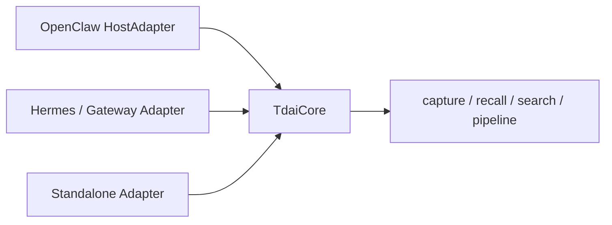

### Q2: How is the memory pipeline scheduled? How to avoid blocking user conversations?

**Answer:**  
The user conversation's main path only does necessary capture and recall. The heavy L1 extraction, L2 scenario aggregation, and L3 Persona generation are offloaded to async scheduling as much as possible — e.g., triggered every N conversation turns, triggered on idle timeout, or triggered more frequently during the warm-up phase.  
Recall also has timeout protection. If retrieval or Persona reads time out, memory injection is skipped without blocking the user's current request.

### Q3: How to ensure state consistency under concurrency?

**Answer:**  
The current isolation is partial, so I separate scheduling from storage. Each Session has its own key, counters, timers, and in-memory buffer, but long-term L0/L1 JSONL is sharded by day rather than stored one file per Session; Context Offload has a separate Agent/Session directory model. One `MemoryPipelineManager` also shares one serial queue per layer across its Sessions. Checkpoint writes use a per-file in-process lock and atomic rename, while deferred Embedding tasks are drained before Store shutdown. None of that is a cross-process distributed lock or a complete tenant boundary.

### Q4: Why support both SQLite and cloud vector database backends?

**Answer:**  
SQLite/sqlite-vec suits local-first, zero-config, developer-tool scenarios. The current TCVDB adapter provides a cloud-backed option with a different indexing and embedding path.

`IMemoryStore` reduces upper-layer coupling, but it does not make an existing-data migration automatic. A real cutover still needs schema mapping, embedding-model and dimension checks, index creation, backfill, reconciliation, dual-read or shadow validation, rollback, and identity-scope verification.

### Q5: How to clean up long-term memory? How to avoid accidental deletion?

**Answer:**  
Cleanup must be conservative. The current local Cleaner is optional, applies retention days to L0/L1 daily shards and Store rows, skips deletion when total L0 or L1 counts are at their minimum guardrails, and emits a cleanup summary event when reporting is enabled. It does not implement a deletion-percentage cap or a complete compliance audit trail. L2 Scene, Persona, Offload refs/MMDs, remote Profiles, and backups have different lifecycles, so a user deletion cannot be described as one TTL job; the next version needs an explicit scope, downstream-impact calculation, idempotent propagation, and deletion evidence.

### Q6: How to prevent Prompt Injection from contaminating memory?

**Answer:**  
First, L0 can record the original text while capture sanitization removes known framework-injected blocks and noise. Second, the L1 extraction prompt tells the model to extract memory facts rather than execute instructions from historical text. Third, recalled memories are wrapped as historical context rather than system instructions. Fourth, the Persona prompt asks the model to be conservative. These are useful soft controls, but there is no hard `stability` gate or complete semantic prompt-injection defense in the current implementation.

### Q7: What if the LLM's extracted JSON format is broken?

**Answer:**  
I would first state the current behavior: the L1 parser strips an optional fence, extracts a JSON array, sanitizes control characters, and calls `JSON.parse`. Missing or malformed JSON is logged as a warning and returned as an empty array. That keeps the user conversation available, but the caller can mistake it for a valid zero-memory result and advance the batch cursor, so this is a silent-loss risk rather than a complete failure policy. The next version should distinguish `valid_empty` from `parse_failed`, advance the cursor only on success, use provider Structured Output where available, and put failed batches into an idempotent replay queue.

### Q8: Why have mild / aggressive / emergency tiers for short-term context compression?

**Answer:**  
Because the objectives differ at different watermarks. The mild phase replaces eligible tool results with summaries. The aggressive phase can delete older prompt messages while retaining offloaded tool references. The emergency phase is a lossy last resort that protects the latest real user message but can remove earlier user messages or truncate oversized content. `refs` preserve offloaded tool originals, not every deleted conversation message. The three tiers make the quality-versus-availability trade-off explicit.

### Q9: How do token-level, parametric, and latent memory differ?

**Answer:**

Token-level memory is external and inspectable, such as Markdown, JSON, database records, or text attached to vector entries. Parametric memory changes model weights through pre-training, fine-tuning, or adapters. Latent memory reuses internal runtime representations such as KV cache or hidden state. For user facts and business state, I start with token-level memory because it supports provenance, correction, tenant isolation, and deletion. I reserve parameterization for stable patterns supported by offline evaluation.

### Q10: How do context reduction, offloading, and isolation differ?

**Answer:**

Reduction prunes or summarizes history and can lose information. Offloading moves large evidence outside the prompt and leaves a summary plus a recoverable reference. Isolation gives a sub-agent only the task state and evidence it needs. They solve different pressure points and can be combined; offloading needs ref integrity and bounded reads, while isolation needs a tested minimum evidence contract.

### Q11: When would you use Markdown memory instead of a vector store or memory framework?

**Answer:**

I use Markdown for small, stable, human-reviewed rules such as commands, architecture decisions, and repository pitfalls. I use vector or hybrid retrieval for large personal-event collections, RAG for shared document knowledge, and a memory framework when extraction, conflict updates, graph relations, or managed lifecycle features justify the additional machinery. A practical system can combine all of them rather than forcing one storage model onto every memory type.

---

## 10.2 CodeWiki Extended Questions

### Q1: Why not use regex for AST parsing?

**Answer:**  
Code structure is not a plain-text pattern. Function nesting, comments, strings, generics, decorators, and multi-line syntax all make regex unreliable. AST/tree-sitter can capture structured syntax nodes, then capture specs and augmenters add language-specific enhancements — far more suitable for building a stable graph.

### Q2: Why does GraphBuilder record edge provenance?

**Answer:**  
Because a code graph has both deterministic edges and inferred edges. For example, file-contains-function is deterministic; cross-file calls may depend on import resolution and are inferred. By recording confidence, reason, and is_inferred, the frontend can filter, the LLM can know which relationships are more trustworthy, and troubleshooting graph issues becomes easier.

### Q3: What is community detection used for?

**Answer:**  
Large repositories have too many nodes and edges — showing the full graph to users is meaningless. Community detection clusters highly cohesive code regions into modules, used for graph navigation, Wiki catalogs, and supplementing GraphRAG context. It's not an absolute definition of business modules, but candidate modules on the graph structure.

### Q4: Why does Wiki generation use a two-phase catalog + page workflow?

**Answer:**  
Catalog first, then page — this allows planning the document structure upfront, avoiding each page being generated in isolation. The catalog determines page topics and hierarchy; pages then retrieve evidence per topic. This way, the documentation is more like a systematic Wiki rather than a pile of fragmented Q&A.

### Q5: What specifically does source_refs validation solve?

**Answer:**  
It solves the problem of the LLM fabricating file names, line numbers, and conclusions. The LLM's output references must come from the retrieved allowed source refs. Citation markers appearing in Markdown must also correspond to source_refs. If validation fails, it goes to repair or draft — it's never directly published as generated.

### Q6: How does incremental update work?

**Answer:**  
First, scan file hashes and Git changes, distinguishing changed/new/deleted/unchanged. Unchanged files reuse old symbols; changed files are re-parsed; then the graph and communities are rebuilt. The current benefit is mainly in reducing AST parsing cost. For repos with very high edge density like VS Code, graph reconstruction and persistence remain bottlenecks — this is the subsequent optimization direction.

### Q7: What's the difference between Lite Mode and Full Mode?

**Answer:**  
Lite Mode targets local Agent fast context — no heavy flows like LLM Wiki or GraphRAG embedding. The focus is on symbol search, context construction, tracing, and affected-file analysis. Full Mode targets visualization, Wiki, Ask, and documentation generation.

### Q8: What if GraphRAG recalls too much context?

**Answer:**  
Use a token budget to control the number of source chunks. Limit node expansion with max_hops. Rank chunk selection by seed proximity, FTS/vector hits, and edge relationships. When necessary, use community summaries as high-level context instead of stuffing in all source code.

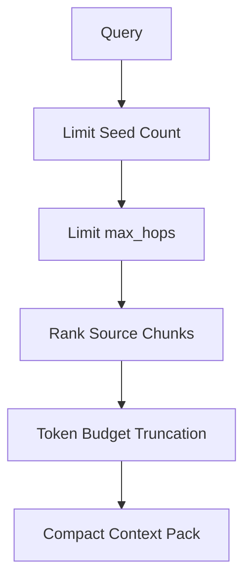

---

## 10.3 AI Weekly Report Extended Questions

### Q1: How to ensure consistent business definitions in LLM analysis?

**Answer:**  
Definitions are not left to the model to improvise. First, use SQL/programs to generate deterministic statistical results. Then let the LLM interpret trends, risks, and suggestions based on fixed fields. The prompt fixes the analysis dimensions and output format — the model only does inductive expression.

### Q2: What if upstream data arrives late?

**Answer:**  
The control table keeps pending status. Each day's batch backtracks the last N days of unsuccessful records, filling them in before triggering weekly report analysis. This removes the dependency on any single day's success and supports delayed compensation.

### Q3: If one analysis module fails, what happens to the entire weekly report?

**Answer:**  
The current run processes modules separately with bounded retry. If one still fails, it logs the error and flips the process-local global success flag to false, while later modules can continue. The full-week analysis status is not set to success for that round. Because there is no durable per-module status, the next batch re-enters the broader weekly analysis flow; it does not precisely rerun only the failed module.

### Q4: How to control prompt length?

**Answer:**  
First, split by business module, then aggregate by product/app/date. When too long, truncate low-priority details or batch-analyze. The model input retains statistical indicators and representative anomalies — not all raw logs dumped in.

---

## 10.4 Backend Fundamentals Follow-Up Questions

### Q1: What's your most familiar async programming scenario?

**Answer:**  
The In-House Agent Memory project has many async scenarios: user requests must not be blocked by long L1/L2/L3 tasks; embedding writes can run in the background; Gateway requests can concurrently trigger the scheduler, so promise gates, background-task draining, timeout protection, and degradation strategies are needed.

In CodeWiki, LLM calls, page generation, and background analysis tasks also need async handling to avoid blocking the API.

### Q2: How do you design REST/gRPC APIs?

**Answer:**  
I model by resource: Agent run, step, tool call, human task, artifact, memory. Creating a run returns a run_id. Querying a run returns status and current step. Streaming interfaces push events. Approval interfaces update human tasks. Cancel interfaces write a cancellation token. All APIs revolve around the state machine — not a single synchronous request running the entire Agent to completion.

### Q3: How do you use PostgreSQL / MySQL in these systems?

**Answer:**  
Structured state, tasks, events, tool calls, documents, graph nodes, and edges are well-suited for relational databases. Key points are transaction boundaries, idempotency keys, indexes, batch writes, and archiving. Vector search can use pgvector or a standalone vector DB. Full-text search can use PostgreSQL tsvector or SQLite FTS.

### Q4: How to achieve observability?

**Answer:**  
For an Agent engine, I would propagate a `trace_id` through nodes, model calls, tools, retrieval, compression, and retry events. I would measure latency, tokens, cache use, tool outcomes, retries, fallbacks, and final outcomes, while logging summaries and restricted artifact references rather than sensitive originals. This is a target observability design, not a claim that all three projects already emit every event.

### Q5: How to handle high concurrency?

**Answer:**  
For a scaled Agent engine, I would use entry admission control, queues, horizontal workers, separate scheduling for long and short tasks, connection pools, and tool deadlines. Model quotas need bounded backoff, while state updates need a lease with fencing or optimistic versions. These are system-design controls; their exact policy requires load tests.

### Q6: How to control security risks?

**Answer:**  
For a production design, I would enforce tool permissions, schema validation, parameter allowlists, and approval for high-risk actions. Memory and tool content should be treated as untrusted, with isolation, minimization, redaction, restricted artifacts, and secret management. The current In-House Agent Memory implementation has some sanitization and prompt-boundary controls, but it does not prove complete semantic injection defense, PII detection, or enterprise multi-tenant isolation.

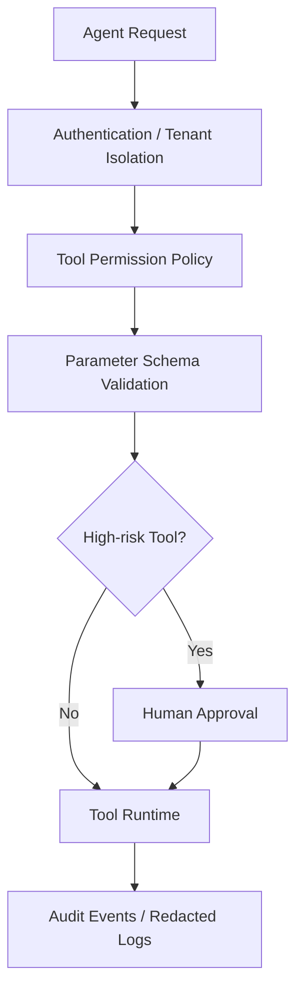

---

# 11. Interview Narrative Pacing Advice

## 11.1 Keep Each Project to 2–3 Minutes

For project introductions, I suggest this structure:

```text
One sentence of background
One sentence of goal
Three sentences of architecture
Three contribution points confirmed by the RACI
Two evidence-scoped metrics
End with one technical difficulty
```

Don't dump too many details upfront. Make the main thread clear first. Wait for the interviewer to follow up before expanding on L0–L3, GraphRAG, RRF, context compression.

## 11.2 How to Handle Questions You Don't Know

Use this phrasing:

```text
I haven't fully implemented this in production end-to-end, but if I were to design it, I'd first break it down into problems A, B, and C.
Drawing on my experience from project XXX, I'd prioritize making state recoverable and metrics observable, then optimize model effectiveness.
```

This is much more stable than fabricating a detail.

## 11.3 Three Sentences Worth Proactively Emphasizing

1. When I work on Agents, I don't just call LLMs — I design backend systems around state, tools, memory, context, and observability.
2. I tend to let deterministic code own the facts, and let the LLM own reasoning and expression.
3. I can reason about post-launch cost and stability governance — for example, how I would diagnose prompt-cache instability caused by dynamic memory.

---

# 12. Scenario Design: Landing an Agent Execution Engine from 0 to 1

This chapter is the centerpiece of system design questions. If the interviewer asks "if you were to design an Agent execution engine from scratch," just saying "graph state machine" isn't enough — you need to articulate how each component lands.

## 12.1 Why Not a while-true Loop Calling the LLM

> If I were to build an Agent execution engine from scratch, I wouldn't make it a simple while-true loop calling an LLM. The reason is that Agent tasks naturally involve planning, execution, tool calling, failure retry, human approval, and state recovery — none of which a while-true loop can express. The problem with while-true is that all state lives in memory — if the worker crashes, everything is lost. There are no checkpoints, so long tasks can't be recovered. There are no approval nodes, so high-risk operations can't be intercepted.

> So I'd abstract it as a persistable graph state machine. After each node executes, state is persisted. If the worker crashes, it recovers from the last checkpoint. If a task enters human approval, it's paused. After the user confirms, it resumes from the next edge.

## 12.2 AgentRunState Field Design

> For state, I'd design a unified AgentRunState that holds: task objective, current mode (ReAct or Plan-and-Execute), message history, plan list, current step, tool results, memory references, budget (token cap and used), retry count, checkpoint pointer.

> Each field has a responsibility. Task objective determines FinalNode judgment. Message history is the LLM's context. Plan list is for Plan-and-Execute. Current step is which node the graph is at. Tool results are ToolNode outputs. Memory references are recall results. Budget prevents runaway Agents from burning money endlessly. Retry count prevents infinite retries. The checkpoint pointer is the recovery point.

## 12.3 How to Abstract Node Types

> For nodes, I'd abstract LLM reasoning, plan generation, tool calling, result validation, human confirmation, context compression, and final answer into different node types. For example, ReAct mode is a cycle from Reason to Tool to Observation back to Reason. Plan-and-Execute is Planner to Executor to Validator — if validation fails, loop back to re-planning.

> Edges are conditional. If the model decides to call a tool, go to ToolNode. If it judges the task complete, go to FinalNode. If it hits a high-risk operation, go to HumanGateNode. If context exceeds the threshold, go to SummarizerNode. This way, different modes are just different graph templates, with underlying nodes and edges reused.

## 12.4 How to Design the Tool Runtime

> For the tool layer, I'd build a standardized Tool Registry. Every tool has name, description, input schema, permission scope, timeout, retry strategy, whether it requires human approval, and whether it's idempotent. The LLM is only responsible for producing the tool name and parameters. The actual parameter validation, authorization, rate limiting, timeout, retry, and result archiving are handled by the Tool Runtime.

> Large results are not stuffed back into context directly — they're stored as artifacts, and only the summary and reference are handed back to the Agent. This is the same offloading philosophy as in the In-House Agent Memory project: tool logs must not blow up the context.

> Tool calls have several key design points: idempotency keys to prevent duplicate execution; timeout control to prevent hanging; exponential backoff retry; failure classification (retryable vs. non-retryable); circuit breakers to prevent an external service outage from dragging down the entire Agent.

## 12.5 ExecutionContext as a Separate Abstraction

> ExecutionContext is abstracted separately, containing user identity, tenant, model configuration, tool registry, memory system, artifact store, event bus, trace id, deadline, and cancellation token. This ensures isolation and facilitates model routing, cost control, and end-to-end tracing.

> The trace_id runs through the entire run. All LLM calls, tool calls, retrievals, and compressions carry this id, making post-hoc troubleshooting straightforward. The deadline prevents tasks from running too long. The cancellation token supports user-initiated cancellation.

## 12.6 How to Implement Human-in-the-Loop

> Human-in-the-loop is handled as a special node type. For high-risk tools like sending emails, deleting data, or calling production APIs, execution enters HumanGateNode before proceeding — the run status changes to paused, and a pending approval is persisted. After the user confirms, execution resumes from the next edge. If rejected, it follows the cancel, rollback, or re-plan branch.

> Approval does not block the worker thread. Instead, the run is suspended and the worker moves on to other runs. After the user confirms, a resume API re-enqueues the run, and the worker recovers from the checkpoint and continues execution. This way, waiting for approval doesn't tie up a worker.

## 12.7 Deployment Architecture

> For the deployment architecture, I'd use FastAPI or gRPC to provide run creation and query APIs. PostgreSQL stores runs, steps, events, checkpoints, tool_calls, and human_tasks. Redis handles queues, leases, and short-lived state. Workers execute nodes asynchronously. An artifact store holds large tool results. A vector database or pgvector handles long-term memory.

> I'd split the queue into long-task and short-task queues to prevent long tasks from blocking short ones. When a worker picks up a task, it sets a lease. If the lease expires, the worker is assumed dead and the task is re-enqueued. Steps use optimistic locking to prevent multiple workers from executing the same step simultaneously.

> To summarize, I'd split the Agent engine into three parts: the Graph Runtime handles flow, the State Machine handles recovery and consistency, and the Tool Runtime handles external-world interaction. This way, ReAct, Plan-and-Execute, and multi-Agent collaboration are just different graph templates — the underlying state, tool, approval, retry, and observability capabilities are all reusable.

## 12.8 How to Unify ReAct and Plan-and-Execute

> I wouldn't build two separate engines. I'd abstract them as different graph templates. ReAct's template is a cycle of Reason, Tool, Observation — each round the model decides whether to call a tool, continue reasoning, or give a final answer. Plan-and-Execute's template: the Planner first generates a plan, then the Executor executes step by step, and the Validator determines whether the current step is complete. If the plan becomes invalid, it loops back to the Planner for re-planning.

> Underneath, both reuse the same state persistence, tool runtime, retry, approval, and event recording. The only difference is node composition and edge conditions. This way, adding a new mode only requires writing a new graph template — no changes to the underlying layers.

---

# 13. Scenario Failure-Mode Drills

These are hypothetical failure-mode drills, not personal outage stories. Use conditional language: “If I observed this symptom, I would test this hypothesis and apply these controls.”

## 13.1 Agent Infinite Loop Burning Tokens

> Scenario: an Agent repeatedly calls the same tool and fails to terminate. I would inspect repeated tool name/argument hashes and state transitions, then enforce configurable step, token, time, and cost budgets. Repeated-call detection can stop or re-plan the run, but values such as 50 steps or three repeats are policy examples, not source-backed production defaults.

> The lesson: an Agent must have "brakes." You cannot trust the LLM to stop on its own. Hard caps like max_steps, max_tokens, and max_retries are the last-resort safeguards.

## 13.2 Tool Call Parameter Schema Mismatch

> Scenario: the model returns missing or extra tool arguments. I would validate against the tool schema before execution, return a bounded machine-readable error for repair, and cap repair attempts. If validation still fails, the run should skip or fail that action safely. The repair limit is chosen by policy and evaluation, not asserted as an existing production value.

> The lesson: LLM output is not trustworthy and must be validated. Schema validation is the first line of defense for tool calls.

## 13.3 Memory Recall Introducing Conflicting Information

> Scenario: recall returns two contradictory preferences. I would preserve both sources, distinguish mutable from immutable facts, rank by time, confidence, and source quality, and avoid silently treating “latest wins” as universal truth. Low-confidence conflicts should be withheld or surfaced explicitly.

## 13.4 Context Lost After Long Task Recovery

> Scenario: a recovered task has state but insufficient reasoning context. I would verify what the checkpoint persists, then restore a compact task state plus evidence references. The current In-House Agent Memory project has offload artifacts and Mermaid navigation; an independent Agent-engine checkpoint design is hypothetical and must not be described as already deployed.

## 13.5 Concurrent Writes to the Same Run Causing State Corruption

> Scenario: a run skips or duplicates a step under concurrent workers. I would inspect lease ownership and event versions, then use a lease plus fencing token or optimistic version check. Side-effecting tools also need idempotency keys because state locking alone cannot guarantee exactly-once effects.

## 13.6 LLM Rate Limiting Causing Batch Failures

> Scenario: concurrent runs trigger provider rate limits. I would normalize provider quotas, apply per-model and per-tenant admission control, honor `retry-after`, and retry only within a total deadline. Queueing, fallback, and load shedding should depend on task priority and model compatibility.

## 13.7 Tool Results Containing Sensitive Information Leaked to Logs

> Scenario: a tool result contains a secret. I would treat tool output as sensitive by default, apply structured allowlists and redaction before logs, minimize retention, and restrict artifact access. Keyword matching alone is insufficient; nested fields, free text, and derived logs require tests and audit controls.

## 13.8 Model Routing Misconfiguration Causing Use of Expensive Models

> Scenario: cost rises after a routing change. I would correlate cost with route decisions, model versions, token volume, retries, and cache usage. Routing config should be versioned, reviewed, canaried, and reversible; alerts should use a verified baseline rather than an invented percentage threshold.

## 13.9 Context Compression Erasing Critical Information

> Scenario: compression removes a critical user constraint. I would inspect the compression decision and recovered evidence, then protect system rules, the current goal, explicit constraints, unresolved decisions, and tool-call/result structure. Tool results are the safer first compression target; user messages should not be declared universally non-compressible without a measured policy.

## 13.10 Message Out-of-Order in Multi-Agent Collaboration

> Scenario: one Agent observes another Agent's messages out of order. I would define ordering scope explicitly, attach sequence or event versions, make handlers idempotent, and buffer only within a bounded window. FIFO at the broker does not by itself guarantee end-to-end ordering across retries and multiple consumers.

---

# 14. Behavioral Interview Questions: Collaboration, Conflict, Execution

This chapter separates personal STAR prompts from scenario answers. A STAR answer must come from the candidate's real design records, collaboration history, and verified role. Architecture alone cannot prove stakeholder positions, experiment chronology, delivery order, or rollout outcomes.

## 14.1 Behavioral Prompt: Driving a Project with Vague Requirements

> I would not use the project architecture as proof of a personal collaboration story. Before answering this as STAR, I need to confirm the real situation, stakeholders, my RACI, the decision I personally made, the artifact that records it, and the measured result.

> If those facts are not available, my honest answer is: "I can walk through how I would decompose an unclear memory requirement, but I don't want to invent the people, decisions, sequence, or outcome. As a design approach, I would separate long-term memory from Context Offload, agree on quality, token, and traceability criteria, test fixed cases, and document what is current versus proposed."

> The WideSearch and PersonaMem figures may be quoted only as their recorded offline benchmark results. They do not validate this behavioral narrative.

## 14.2 Scenario Design: AST Facts vs. LLM-Inferred Relationships

> I would answer this as a design trade-off, not as a verified disagreement with a colleague. In CodeWiki's current implementation, parser and static-resolution output own deterministic structural facts. Cross-file resolution that is not certain can carry fields such as `confidence`, `reason`, `resolution_tier`, and `is_inferred`; that does not mean an LLM is the source of every inferred edge.

> If I were evaluating an LLM-assisted resolver, I would build a labeled set of call, import, route, and inheritance relationships, then compare precision, recall, reproducibility, latency, cost, and failure behavior. I would keep deterministic facts separate from model suggestions and never promote a suggestion without provenance and validation.

> The current artifacts do not document a real interpersonal dispute or a completed head-to-head evaluation. I would use a personal episode for a behavioral question only after confirming the people, my role, the evidence, and the outcome.

## 14.3 Scenario: How Would You Handle a Sudden Agent Cost Regression?

> I would start by confirming the regression and segmenting it by model, route, prompt version, tenant, and task type. Then I would use `trace_id` to split input tokens, output tokens, retries, tool-result volume, and provider-reported cached tokens. I would not change code until I knew which component moved.

> If traffic and request shape were stable but cache reuse changed, I would diff adjacent prompts and test whether dynamic recall had entered a reusable prefix. That would be a hypothesis, not a conclusion from one dashboard.

> I would reproduce it on a fixed benchmark, compare a stable-prefix variant with a dynamic-prefix variant, and measure quality, cached tokens, latency, and total cost. If the evidence supported the change, I would canary it, watch rollback metrics, and only then expand.

> The lesson is diagnostic discipline: confirm, isolate, reproduce, mitigate, and verify. I would not claim a specific recovery time or alert threshold without an operational record.

## 14.4 Tell Me About a Learning Experience

> I should use this as a personal learning story only if the chronology is true and I can describe what I personally read and changed. The source-verifiable technical point is that plain chunk retrieval is not enough for many code questions because calls, imports, routes, and inheritance matter.

> In CodeWiki's adaptation, entities become AST symbols, relationships become code edges such as calls, imports, and inheritance, and graph communities support higher-level navigation and context. I would avoid claiming that I personally originated every part of that adaptation until the project RACI is confirmed.

> The lesson: learning isn't about copying — it's about understanding the principles and then adapting them to your own scenario. Papers give ideas; engineering makes them real.

---

# 15. Cross-Project Technology Decisions: Why These Choices

Interviewers may ask technology-choice questions like "why SQLite instead of PostgreSQL," "why tree-sitter instead of LSP."

## 15.1 Why In-House Agent Memory Uses SQLite Instead of PostgreSQL

> In-House Agent Memory is local-first. SQLite is a single file and requires no separate service. In WAL mode it supports concurrent readers while a writer is active; sqlite-vec covers vector search and FTS5 covers full-text search. PostgreSQL requires a service, connection management, and extensions, which adds operational weight for local use.

> `IMemoryStore` reduces coupling at the call sites, and the current code also has a TCVDB backend. But migrating existing data is not automatically straightforward. I would still need schema and metadata mapping, embedding-model and dimension compatibility, index creation, backfill, reconciliation between JSONL and the online store, identity-scope checks, cutover validation, and rollback. The abstraction helps, but it does not remove data-migration work.

## 15.2 Why CodeWiki Uses tree-sitter Instead of LSP

> LSP has higher precision but also higher cost. Each language requires starting a language server. Large repos are slow to start and memory-heavy. Moreover, LSP is designed for editors, not batch analysis. tree-sitter is optimized for batch parsing — slightly less precise but much faster, and supports incremental parsing.

> CodeWiki needs "good enough and fast" structural facts, not 100% precise type inference. tree-sitter can't get full type information, but calls, imports, and inherits — the structural relationships — are sufficient. The trade-off: precision exchanged for speed and ease of use.

## 15.3 Why Use LiteLLM Instead of Calling Each Provider's SDK Directly

> LiteLLM abstracts away the differences across providers' APIs. Business code just calls complete without caring whether it's OpenAI, Anthropic, or Azure. Plus, LiteLLM comes with built-in retry, timeout, and rate limit handling. Calling SDKs directly means handling all of that yourself, with one set of logic per model — high maintenance cost.

> LLMGateway wraps LiteLLM one more layer, adding task-type routing and caching. Business services never touch SDKs directly. This way, switching models only changes config, not code.

## 15.4 Why In-House Agent Memory Uses Mermaid Instead of JSON for Task Diagrams

> Mermaid expresses topology and state with very few tokens — more compact than natural language summaries, and more human-readable than JSON. The Agent sees a diagram, not a pile of fields, and understands it faster. Plus, Mermaid renders directly — during debugging, I can see exactly which step the task is at.

> JSON's advantage is easy machine parsing, but the Agent is an LLM reading it, not a program parsing it. Mermaid's diagram structure is more LLM-friendly. Crucially, each node carries a node_id that can trace back to jsonl and refs for original evidence — Mermaid is just the entry point.

## 15.5 Why Use RRF Instead of a Reranker

> RRF fuses ranks without a separate learned ranking stage, so the current path avoids an additional model invocation. A reranker does not have to be an LLM; it could be a cross-encoder or another specialized ranking model. It would add latency and compute according to the candidate count and selected model, but there is no basis for claiming that it always doubles cost or latency.

> The honest trade-off is that RRF is simple and score-scale agnostic, while a trained reranker may use richer query-document interactions. The current implementation uses RRF, but the project material does not contain a controlled RRF-versus-reranker comparison, so sufficiency and incremental benefit are not established. I would decide with Recall@K, MRR or NDCG, final-answer quality, latency, and cost.

## 15.6 Why AI Weekly Report Uses a Control Table Instead of a Message Queue

> The AI Weekly Report is an in-house end-of-day batch, and its core control state is naturally relational: date, download status, and analysis status. A control table makes the current compensation scan and database transaction boundaries easy to express. A message queue is not only for real-time streams, so I would not dismiss it categorically; it becomes useful when work must be decoupled, independently retried, or horizontally consumed.

> The boundary is that a control table alone does not provide atomic worker claiming, exactly-once external effects, or reliable push delivery. The current `P/S` state and `INSERT IGNORE` are partial controls. If the workflow needs stronger concurrency and delivery guarantees, I would add leases and a durable send state or Outbox before deciding whether a queue is justified.

---

# 16. More Scenario-Based System Design Questions

## 16.1 Design an Agent Evaluation System

> I'd design it in three layers. The first layer is offline evaluation: a labeled dataset, run the Agent, compare output against ground truth, compute accuracy, recall, F1. The second layer is online evaluation: user feedback (thumbs up/down, correction rate), task completion rate, manual spot-checking. The third layer is shadow evaluation: the new version shadows production traffic without affecting users, enabling effect comparison.

> Evaluation metrics should be multi-dimensional: accuracy (is the answer correct), relevance (is the recalled information relevant), freshness (is the information current), safety (any sensitive information leaked, any dangerous operations executed).

> The evaluation set must be continuously maintained — newly discovered bad cases get added, periodic regression runs. Evaluation itself must be reproducible: fixed random seed, fixed model version, fixed prompt version.

## 16.2 Design a Multi-Agent Collaboration System

> I'd design multi-Agent collaboration as a message-passing architecture. Each Agent is an independent run with its own state and context. Agents communicate through a message bus. Messages carry sender, receiver, conversation_id, sequence, and content.

> Collaboration modes include several types: pipeline (A's output is B's input), parallel (A and B run concurrently, results merge), debate (A and B each answer the same question, judge C picks the best), hierarchical (main Agent decomposes tasks to sub-Agents).

> Key design points: message ordering guarantee (sequence numbers); shared state via external store (don't pass large objects in messages — pass references); sub-Agent failures need fallback; the main Agent must be able to sense sub-Agent progress; total budget control to prevent multi-Agent cost amplification.

## 16.3 Design an Agent Cost Governance System

> For cost governance, I'd do several things. First, token budget per run — force-stop when exceeded. Second, model routing — cheap models for simple tasks, expensive models for complex tasks. Third, prompt cache — stable parts in system prompt leveraging caching. Fourth, context governance — offload tool results, historical summaries. Fifth, semantic cache — reuse historical answers for similar questions. Sixth, cost alerts — per-run threshold alerts, daily cost threshold alerts.

> Cost observability must be granular down to each LLM call: task_type, model, tokens_in, tokens_out, cached_tokens, cost_usd. This lets you pinpoint "which task, which model, cost how much."

## 16.4 Design an Agent Observability System

> I'd build observability in three layers. The first layer is tracing: every run has a trace_id; each step, LLM call, tool call, retrieval, and compression is a span with duration and status. The second layer is metrics: end-to-end latency p50/p95/p99, token consumption, cache hit rate, tool success rate, task success rate. The third layer is logging: key events as structured logs with trace_id correlation, no sensitive originals recorded.

> The core of observability is "correlatability." From one run_id, you can drill down to all steps, all LLM calls, all tool calls. Conversely, from one tool call failure, you can trace up to which run and which step was affected.

## 16.5 If You Had to Optimize a Slow Agent, What Would You Do

> I wouldn't start by tweaking prompts based on intuition. Instead, I'd first break down the chain to locate the bottleneck. Decompose one Agent run into Queue, Step, LLM Call, Tool Call, RAG, DB segments, each timed.

> If the LLM is slow: model routing (simple steps use cheap fast models), parallel retrieval and tool calls, streaming responses, prompt cache.

> If the queue is slow: scale workers, split long and short task queues, prevent long tasks from blocking short ones.

> If tools are slow: add timeouts, connection pools, async calls, result caching.

> If RAG is slow: limit top-k, limit max_hops, use FTS instead of vector (FTS is faster), cache recall results for popular queries.

> If context is too long making the LLM slow: context compression, historical summaries, tool result offloading.

> Optimization must be measurement-first — don't tune blindly.

---

# 17. Interview Pacing and Talking-Point Overview

## 17.1 How to Allocate a Three-Hour Interview

> For a three-hour technical deep-dive interview, I'd allocate time like this: first 30 minutes for self-introduction and project overview, making the main thread clear. Middle 90 minutes for project deep-dives — I expand on whatever the interviewer probes, with the focus on In-House Agent Memory and CodeWiki. Next 45 minutes for system design questions, like designing an Agent execution engine. Final 15 minutes for asking the interviewer questions.

> During project deep-dives, I don't proactively unpack every detail — I wait for the interviewer to follow up before diving deeper. Each answer is controlled to 2–3 minutes: conclusion first, then details. If the interviewer probes further on a point, expand to 5 minutes.

## 17.2 How to Handle Questions You Don't Know

> Use this phrasing: "I haven't fully implemented this in production end-to-end, but if I were to design it, I'd first break it down into problems A, B, and C. Drawing on my experience from project XXX, I'd prioritize making state recoverable and metrics observable, then optimize model effectiveness."

> This is much more stable than fabricating a detail. Interviewers can tell whether you've actually done something or are making it up — honesty actually earns points.

## 17.3 Three Sentences to Proactively Emphasize

> First: when I work on Agents, I don't just call LLMs — I design backend systems around state, tools, memory, context, and observability. Second: I tend to let deterministic code own the facts, and let the LLM own reasoning and expression. Third: I can reason about post-launch cost and stability governance — for example, how I would diagnose prompt-cache instability caused by dynamic memory.

> These three sentences run through the entire interview. Anchor every project deep-dive back to these three points.

## 17.4 The "Ask the Interviewer" Segment

> At the end of the interview, I'd ask: is the team's most core Agent scenario currently more about internal R&D efficiency and code understanding, or more about business process automation? This would influence whether I'd prioritize investing in the execution engine, tool ecosystem, or long-term memory and evaluation framework after joining.

> I could also ask: is the current biggest bottleneck in the Agent system more around accuracy, cost, latency, or tool ecosystem? Does the team currently have a unified Agent evaluation set and online tracing system? Is the team currently leaning more toward extending frameworks like LangGraph or DSPy, or building a lightweight custom execution engine?

> The purpose of asking questions back is to demonstrate that I think about this role — I'm not just here to answer questions; I'm also here to evaluate whether this team is a good fit for me.

---

# 18. One-Page Cheat Sheet (Extended Edition)

## In-House Agent Memory Supplement

- Prompt Engineering: staged L1 extraction, L2 scene aggregation, and a conservative L3 Persona prompt. There is no current `stability` field or hard stability gate.
- Concurrency: per-Session scheduling state, Manager-level shared serial queues, L3 pending merging within one Manager instance, and an in-process per-file Checkpoint lock. This is not global or cross-process serialization.
- Benchmarks: WideSearch recorded 33% -> 50% pass rate and 221.31M -> 85.64M tokens for its stored configuration. Do not present this as an online average.
- Failure Modes: source-observed code risks and scenario drills; do not call all ten events that actually happened.
- Security boundary: known injected-block sanitization and prompt separation exist, while semantic injection defense, complete sensitive-data detection, enterprise multi-tenancy, and end-to-end deletion remain gaps.
- Evaluation: PersonaMem recorded 48% -> 76% final-answer accuracy for its stored configuration; exact dataset breakdown requires the benchmark artifact.

## CodeWiki Supplement

- AST: capture spec + augmenter two-layer, concurrency 4 workers, parse_error tolerance.
- GraphBuilder: ten-step graph construction, deterministic edges vs. inferred edges, config nodes, stable IDs.
- Communities: empirical edge weights, algorithm degradation chain, multi-level resolution, community naming with cache.
- Mermaid: server-side generation, syntax validation, node ID validation, graph layering.
- Token: budget 8000, chunk ranking, context_pack structure.
- Stress Testing: Rust 36K files / roughly 300K nodes; VS Code roughly 160K nodes / 3.79M edges. Warm-file reuse for Rust / VS Code / Superset was 99.7% / 96.9% / 98.2%, but end-to-end warm speedup was only 1.29x / 1.06x / 1.51x.
- Failure Modes: tree-sitter version, incremental indirect effects, LLM fabricating refs, Mermaid syntax, community instability, cache pollution, OOM, pgvector, Lite expiration, translation breaking code.

## Agent Engine Supplement

- Graph state machine, not while-true; AgentRunState fields; node types; Tool Runtime; ExecutionContext; HITL paused; deployment architecture.
- ReAct and Plan-and-Execute unified as graph templates.
- Failure cases: infinite loop, schema mismatch, conflicting recall, recovery losing context, concurrent writes, rate limiting, sensitive information, model routing, compression losing info, message out-of-order.
- Technology decisions: SQLite vs PostgreSQL, tree-sitter vs LSP, LiteLLM vs SDK, Mermaid vs JSON, RRF vs reranker, control table vs message queue.
