# AI Agent Backend Interview Deep-Dive Preparation: From Project Experience to System Design

> Scope: English practice for the three in-house projects. It is a speaking aid, not a separate source of project facts. Use the current Chinese project documents linked from `../README.md` as the baseline.

> Target Role: Backend Development Engineer — AI Agent Track  
> How to Use: This is not a resume recap. It's an interview deep-dive talking-point library. Every question is prepared with: "Context — Design — Trade-offs — Results — Follow-up Points," so you can present each project as a production-ready Agent backend system.

## 0. Interview Main Thread

These projects weave together into one clear capability thread:

1. AI Weekly Report System: Putting LLMs into production business workflows, solving multi-source data ingestion, retry/fault tolerance, transactional consistency, and stable production delivery.
2. CodeWiki: Anchoring LLMs on ASTs, code graphs, GraphRAG, and source-reference verification to solve reliability in code understanding and documentation generation.
3. TencentDB Agent Memory: Addressing long-running Agent tasks with long-term memory, context compression, tool-log traceability, token cost, and runtime stability.
4. Agent Execution Engine Design: Abstracting the above experience into a graph state machine, tool runtime, Human-in-the-loop, observability, and recoverability architecture.

In the interview, don't just say "I called a large model." Emphasize repeatedly:

- I treat the LLM as an unreliable reasoning component within a system, not the entire system.
- Controllable facts, state, tools, memory, evaluation, traceability, and observability are what make Agent engineering real.
- I've gone from 0 to 1, and I've also done post-launch cost, latency, and stability governance.

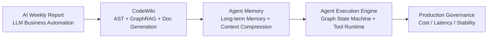

---

# 1. Opening Introduction

## 1.1 45- to 90-Second Self-Introduction

**Interview Answer:**

Hello, my name is Chen Bairun. I have a bachelor's degree in Software Engineering and 3 years of backend development experience, recently focused on LLM engineering and AI Agent infrastructure. On the tech stack side, I primarily use Python/FastAPI for backend services and data pipelines, and also TypeScript/Node for Agent plugins, Gateway, tool runtime, and frontend engineering.

I've worked on three closely related projects. The first is an internal AI Weekly Report system for a bank, where I was responsible end-to-end for multi-source data collection, cleaning, LLM segmented analysis, retry/fault tolerance, result persistence, and push delivery. It compressed what was originally 8 to 10 hours of manual weekly reporting down to about 20 minutes.

The second is CodeWiki, a code intelligence platform based on Python/FastAPI and TypeScript/React, implementing multi-language AST parsing, a code dependency graph, GraphRAG retrieval, source-level documentation generation, and multiple Agent access methods including CLI, HTTP API, and MCP. It solves the problem of how Agents or developers can reliably understand large code repositories.

What best represents my fit for this role is TencentDB Agent Memory. I designed from scratch a tiered L0-to-L3 memory architecture, managing raw conversations, structured facts, scenario memories, and long-term personas in layers. On the retrieval side, I used vector search, BM25, and Hybrid RRF fusion recall. I also implemented tool-log context offloading, compressing long task execution processes into traceable Mermaid state diagrams, so Agents can continue planning and backtracking at low token cost. This project ultimately reduced token consumption by about 61%, improved task pass rate by about 52% relatively, and raised long-term memory accuracy from 48% to 76%.

So I've not only built business systems that call LLMs, but I've also actually built Agent memory, tools, retrieval, context management, and engineering stability infrastructure.

**Follow-up Points:**

- If asked "which experience best matches this role": answer Agent Memory, because it directly maps to memory, tool logs, long-running tasks, cost, and stability.
- If asked "how does your backend capability show": answer with state persistence, async scheduling, storage adapter, interface abstraction, observability, and fault recovery — not just prompt writing.

---

# 2. Project 1: TencentDB Agent Memory

## 2.1 End-to-End Project Walkthrough

**Typical Question:**  
Can you walk through the Agent Memory system end-to-end — background, goals, overall architecture, key modules you were responsible for, and final results?

**Interview Answer:**

This project is called TencentDB Agent Memory. It originated because we found two obvious problems when using AI Agents for long-running tasks in practice.

First, tool call logs, search results, and code snippets would quickly blow up the context window. Reasoning quality degraded, and costs spiked. Second, Agents had no stable memory across sessions — users had to repeat their SOPs, project background, preferences, and historical issues every time.

My goal was not to build a chat log search tool, but a set of memory infrastructure for the Agent runtime. On one hand, supporting long-term memory so the Agent could extract facts, scenarios, and user personas from historical conversations. On the other, supporting short-term memory compression — offloading tool logs from long tasks and keeping only structured state in context. It also needed to plug into different Agent hosts like OpenClaw and Hermes.

The overall architecture has two main tracks:

The first is the long-term memory track, using tiered L0 through L3. L0 is raw conversation, preserving complete evidence. L1 is structured atomic facts. L2 aggregates related facts into scenarios. L3 is the long-term Persona or user profile. Retrieval combines vector search, BM25 full-text search, and Hybrid RRF fusion ranking.

The second is the short-term context compression track. After a tool call, the full log is offloaded to external storage, e.g., `refs/*.md`. Then a step summary is extracted, and finally a lightweight Mermaid task state diagram is generated. Going forward, the Agent only needs to see the task diagram — knowing the task objective, phases, failed nodes, and traceable references.

I was primarily responsible for end-to-end design and core implementation: first, the host-neutral `TdaiCore`, which isolates differences across hosts like OpenClaw and Hermes; second, the long-term memory pipeline, including L0 recording, L1 extraction and dedup, L2 scenario generation, L3 Persona generation and recall; third, the context offloading module, including tool-log capture, compression injection before prompt building, Mermaid state diagrams, node_id traceback, and token threshold control; fourth, the engineering side, including Gateway, plugin adaptation, async scheduling, session cleanup, metrics reporting, and performance timing.

In terms of results, short-term memory compression achieved up to 61.38% token reduction in the WideSearch scenario, with a 51.52% relative improvement in task pass rate. For long-term memory, final answer accuracy on the test dataset improved from 48% to 76%.

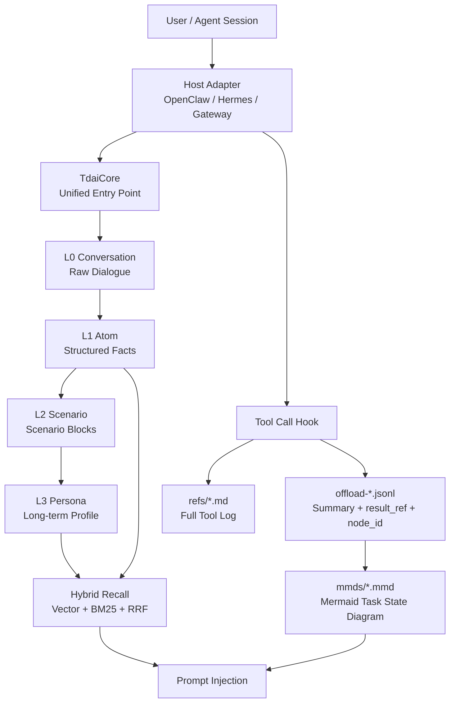

---

## 2.2 What Each L0–L3 Layer Solves

**Typical Question:**  
What exactly does each L0–L3 layer do? Why not just use a single vector database or a global summary?

**Interview Answer:**

The core philosophy of L0–L3 is: lower layers preserve evidence; higher layers preserve structure. Lower layers are responsible for traceability; higher layers are responsible for injectability and decision support.

L0 is the raw conversation layer, responsible for fully recording interactions between the user and Agent — including user questions, assistant answers, key context, and timestamps. It solves the evidence preservation problem. Because L1, L2, and L3 are all LLM-extracted or LLM-summarized, without L0, any memory that is extracted incorrectly or missed is very hard to correct later.

L1 is the atomic fact layer, extracting structured memories from L0 — such as user preferences, project conventions, tool usage habits, and task conclusions. It solves the problem of extracting searchable facts from raw conversations. L1 performs quality filtering, type normalization, deduplication, and conflict detection to prevent meaningless chatter, duplicate content, or contradictory content from entering the system.

L2 is the scenario layer, organizing multiple related L1 facts into a scenario block — for example, "development conventions for a certain project" or "SOP for a certain type of production issue." It solves the problem of fragmented memories lacking context. A single fact may be very short, but when an Agent is actually executing a task, it needs to understand the relationships among a group of facts.

L3 is the Persona or long-term profile layer, responsible for generating stable long-term preferences — such as the user's tech stack, communication style, common task types, and long-term SOPs. It solves the problem of stable priors needed in every round of conversation.

Why not use a single vector database? Because vector databases are good for similar-text retrieval, but they don't natively understand hierarchy, freshness, conflicts, and evidence chains. They might recall a few similar snippets, but they don't know which is the latest, which belong to the same scenario, which contradict each other, or whether to give the Agent a single fact, a scenario, or a long-term preference.

Why not use a global summary? Global summaries are very token-efficient, but they are irreversible, prone to over-compression, and become increasingly chaotic over time. If an early summary is wrong, the error keeps being inherited. Once details are summarized away, the Agent cannot retrieve them when it needs to verify evidence.

So my judgment at the time was that Agent memory cannot just be "store and search." It must also have lifecycles of extraction, aggregation, compression, recall, provenance tracing, and updating.

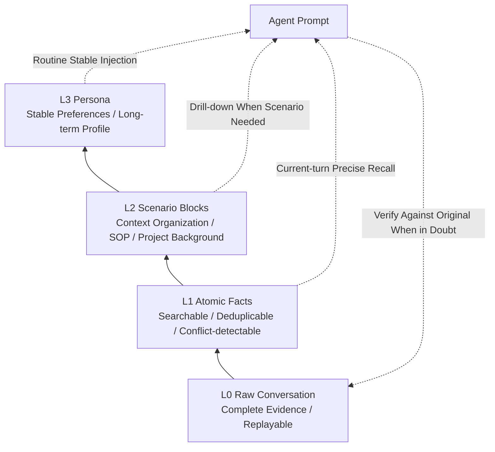

**Follow-up Points:**

- If asked "how does L1 prevent dirty data": quality filtering, length/injection risk filtering, structured JSON, dedup, conflict detection.
- If asked "difference between L2 and L3": L2 is task/scenario dimension; L3 is a cross-scenario stable profile.
- If asked "when to update L3": can be triggered by new memory count, scenario changes, or time intervals; supports incremental updates.

---

## 2.3 Hybrid Recall: Vector Search, BM25, and RRF

**Typical Question:**  
Why use vector search, BM25, and Hybrid RRF simultaneously? What specific problem does RRF solve?

**Interview Answer:**

We use hybrid recall because queries in Agent memory are highly unstable — a single retrieval method can't cover everything.

Vector search excels at semantic similarity. For example, when a user asks "what was that deployment standard I had before," it can recall memories like "production release SOP" or "canary check process" even if the phrasing differs. But it's not sensitive enough to exact symbols — like project names, API names, error codes, table names, commands, or version numbers — which are critical in Agent scenarios.

BM25/FTS perfectly fills this gap. It is more sensitive to keywords, proper nouns, code identifiers, and error text — content like `TDAI_GATEWAY_API_KEY`, `OpenClaw`, `sqlite-vec`.

So the default is Hybrid: two parallel recall paths, fetching more candidates, say `limit * 3`, then merging and ranking with RRF.

The core problem RRF solves is that BM25 scores and vector similarity scores are on different scales and cannot be directly summed. BM25 scores are influenced by term frequency, document length, and corpus size, while vector similarity follows a completely different distribution. RRF doesn't care about raw scores — it only cares about each result's rank within its own list.

The formula is roughly:

```text
score = Σ 1 / (k + rank)
```

We use the common `k` of 60. If a memory ranks high in both BM25 and vector search, its RRF score compounds and gets boosted. If it ranks high in only one path, it's still preserved. This avoids the score normalization problem and allows semantically relevant results and exact keyword matches to reinforce each other.

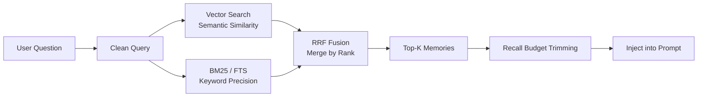

**Follow-up Points:**

- Why not use a reranker: could add one later, but RRF in v1 was low-cost, stable, and required no extra model calls.
- Why clean the query: strip gateway metadata, base64, media markers to avoid retrieval bias.
- How to degrade: fall back to FTS when embedding is unavailable; fall back to embedding when FTS is unavailable; inject nothing if both are unavailable.
- How to evaluate recall quality: offline, look at final answer accuracy on test questions, whether relevant memories enter Top-K, false recall rate; online, look at user correction rate, memory tool secondary search rate, recall latency, and injection token cost.

**Strategy choices can be supplemented as follows:**

- Vector cosine: suitable for natural language expressions, paraphrasing, user preferences, and SOPs — semantic memories.
- BM25/FTS: suitable for project names, variable names, error codes, config keys, commands, API names — precise symbols.
- Hybrid RRF: the default strategy, suitable for real-world mixed queries online; especially when a query contains both natural language and technical identifiers, it captures both semantics and keywords.

---

## 2.4 How Long-Term Memory Accuracy Went from 48% to 76%

**Typical Question:**  
Long-term memory accuracy went from 48% to 76%. How was this metric evaluated?

**Interview Answer:**

This accuracy metric refers to the final answer accuracy on the test dataset, not pure retrieval hit rate.

The evaluation process: first, feed the multi-turn historical conversations from the test set into the Agent, letting the system complete L0 recording, L1 fact extraction, L2 scenario aggregation, and L3 Persona generation. Then use the test set's held-out questions to query the Agent — e.g., about user preferences, historical facts, long-term instructions. Finally, match or semantically judge the Agent's answers against the standard answers in the dataset, and compute the proportion of correct answers.

The baseline was roughly 48%, which improved to 76% after integrating the L0–L3 tiered memory and Hybrid Recall.

What makes this metric more meaningful to me is that it tests whether the Agent can ultimately use historical information correctly — not simply whether the vector database found a piece of text. Because in real scenarios, the value of a memory system is not "was it retrieved," but "was it injected at the right moment, at the right granularity, for the Agent."

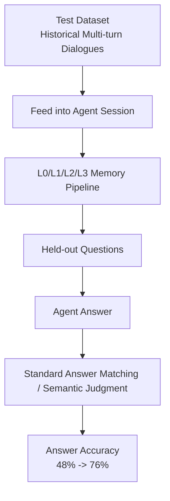

**Follow-up Points:**

- Be careful to say "final answer accuracy," not "retrieval accuracy."
- If pressed on misjudgment risk: mention standard-answer rule matching + semantic judgment + sampled manual review.
- If asked about online metrics: look at memory recall hits, user correction rate, search tool invocation rate, answer satisfaction.

---

## 2.5 Context Offloading and Tool Log Compression

**Typical Question:**  
When tool logs and historical messages bloat, how do you decide what to keep, compress, or discard? How do you recover after a task interruption?

**Interview Answer:**

I didn't implement compression as a one-shot summary. Instead, I built it as tiered context governance. The core principle: only keep what is essential for current reasoning in context; complete evidence must always be persisted to disk first, before deciding to replace or delete.

After each tool call completes, `after_tool_call` captures the tool name, parameters, result, duration, and `tool_call_id`. The full raw result is written to `refs/*.md`, while simultaneously generating an `offload-<session>.jsonl` record containing the tool call summary, `result_ref`, `tool_call_id`, timestamp, and a replaceability score `score`. Later, L2 links it to a `node_id` in the Mermaid diagram.

The decision to compress is driven primarily by two classes of signals: token watermarks and information value.

The first tier is mild compression. The system uses tiktoken to compute the current context token count. If it exceeds the mild threshold, e.g., 50% of the context window by default, it replaces historical tool results with summaries. Priority is given to compressing tool results where "summary sufficiently replaces the original" — i.e., records with higher L1 `score`. The replaced content includes the summary, `node_id`, and `result_ref`.

The second tier is aggressive compression. If tokens approach the aggressive threshold, e.g., 85% by default, replacing with summaries alone is no longer enough, so earlier historical message prefixes are deleted. But deletion is only removal from the current prompt, not from storage. By this point, those tool logs already have jsonl summaries, refs originals, and Mermaid node mappings.

The third tier is the emergency fallback. If the context nears 95% of the context window, the system enters emergency compression, aiming to reduce to roughly 60%. At this stage, it deletes or truncates the largest non-user messages while preserving the latest user request, system prompt, current task state diagram, and essential structural information as much as possible.

On-the-spot recovery relies on three types of persisted information: `state.json` records the currently active MMD file and session state; `offload-*.jsonl` saves each tool call's summary, `tool_call_id`, `node_id`, and original reference; `mmds/*.mmd` saves the Mermaid task state diagram. If the task is interrupted, the next entry loads `state.json` to retrieve the active MMD and re-injects the Mermaid diagram into context. The Agent can see the task objective, completed steps, and which node it's currently paused at. If details are needed, it can drill back into jsonl and refs based on `node_id` or `result_ref` to read the full tool log.

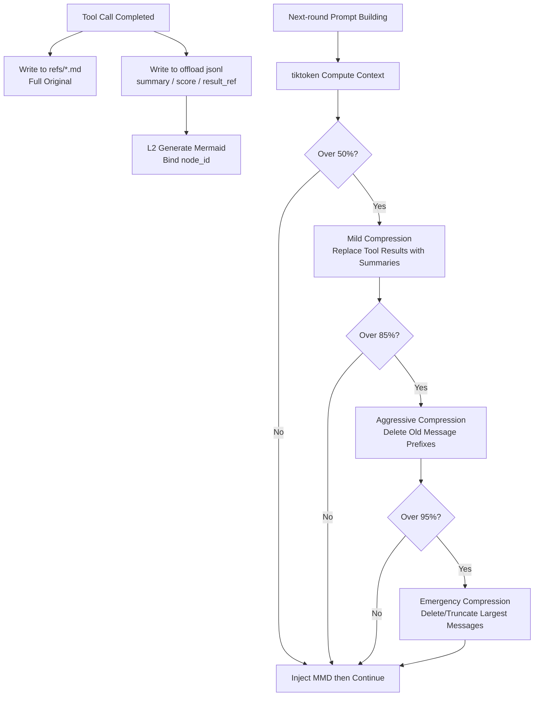

**Follow-up Points:**

- Why not just delete: need traceability; deletion is prompt-layer removal only.
- How to avoid breaking tool_use/tool_result structural pairing: maintain tool call pairing during compression and deletion.
- Why Mermaid: high information density, clear topological structure, readable by both LLMs and humans.
- How to avoid impacting reasoning: current task MMD, latest user request, system prompt, and critical node_ids are preserved with priority; tool originals land in `refs` first; compressed content carries `result_ref` so the Agent can drill down and recover at any time.
- Where did 61.38% come from: compared total token consumption before and after integrating the plugin in a long-session benchmark — e.g., OpenClaw raw tokens vs. plugin-compressed tokens in the WideSearch scenario, using relative reduction.

---

## 2.6 A Real Case of Sudden Token Cost Increase in Production

**Typical Question:**  
Did you ever encounter a sudden token cost spike in the Agent memory system? Which metric did you notice first as abnormal? How did you prove the root cause?

**Interview Answer:**

Yes, a fairly typical case was when dynamic memory blew through the prompt cache, causing a sudden spike in input token cost.

The first thing I noticed wasn't a simple `input_tokens` surge, but two metrics going abnormal together: first, per-turn billable input tokens in `agent_turn` increased; second, the prompt cache hit rate dropped noticeably — cached input tokens decreased. But business traffic, user question length, and tool call count all showed no significant change, so my initial judgment was that it wasn't users' requests getting more complex, nor tool logs suddenly ballooning.

Then I broke down each turn's prompt by trace and found the problem was the auto-recall injection position. At the time, we were putting L1 relevant memories in `appendSystemContext` — i.e., appended to the system prompt. But L1 recall changes dynamically every turn: when the user asks different questions, the few recalled memory entries are different. The result was that the system prompt changed every turn, and the model-side cache that could have covered the stable system instructions, tool descriptions, Persona, and Scene Navigation was all busted together.

To prove the root cause, I did three things:

First, I compared the prompt diff between two adjacent turns of the same session and found that most of the system prompt content was stable — the only thing really changing was those few lines in `<relevant-memories>`.

Second, I looked at the cached token metric in LLM usage. In the abnormal version, cached tokens dropped visibly. After moving dynamic L1 memories away, cached tokens recovered.

Third, I ran an A/B test: one version continued putting L1 in system context; the other moved L1 to the user prompt prefix, keeping only L3 Persona, L2 Scene Navigation, and tool usage instructions in system context. After comparison, answer quality did not degrade, but prompt cache hits recovered and per-turn effective input cost dropped.

The final fix was splitting memory injection into two categories:

```text
Stable context: L3 Persona, L2 Scene Navigation, tool instructions -> system prompt
Dynamic context: current-turn L1 relevant memories -> user prompt prefix
```

What this case taught me is that Agent cost isn't just about context length — it's also about context stability. The same few thousand tokens, if they contaminate the system prompt every turn, will invalidate the cache, and production costs will spike suddenly.

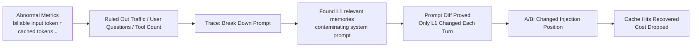

---

# 3. Project 2: CodeWiki Code Intelligence Platform

## 3.1 End-to-End Chain: From Code Lookup to Document Generation

**Typical Question:**  
Starting from a single user request to look up code or generate documentation, walk through the entire chain — source parsing, AST/dependency graph, GraphRAG retrieval, to LLM document generation.

**Interview Answer:**

The user first registers a repository with CodeWiki. The system runs an analysis pipeline: `RepoScanner` scans the repository, handling `.gitignore`, binary files, file size limits, language detection, and Git metadata. Then the AST layer uses tree-sitter and language augmenters to parse source code, extracting unified `AstSymbol` representations — e.g., file, class, function, method, endpoint, schema — while recording imports, calls, references, inherits, routes, and other information.

Next, `GraphBuilder` transforms these AST facts into a Code Graph. Nodes include repository, directory, file, class, function, endpoint, etc. Edges include contains, defines, imports, calls, inherits, routes_to, uses_config, and so on. Here, I did not let the LLM judge code relationships. Instead, I used AST and static rules to generate deterministic facts as much as possible. For relationships that are not fully certain — like cross-file calls and import resolution — provenance information such as confidence, reason, and is_inferred is recorded.

When a user submits a query, e.g., "how does the payment callback chain work," GraphRAG first finds seed nodes at the symbol layer: matching function names, class names, endpoints, file names. Simultaneously, it searches source chunks via FTS, and optionally via vector index. Hit chunks are reverse-merged onto graph nodes. Then, from the seed node, it performs limited-hop graph expansion along calls, imports, contains, routes, and other edges. Finally, the system selects source snippets, related nodes, related edges, and community summaries within a token budget, packaging them as a context pack for the LLM.

For documentation generation, the flow is similar but adds a catalog/page workflow. First, a directory structure is generated. Then, for each page, GraphRAG retrieval is performed per topic to obtain source snippets, graph relationships, source_refs, and optional Mermaid diagrams. The LLM writes each page based solely on this evidence, outputting JSON. The server validates the JSON, verifies that source_refs come from allowed source snippets, checks citation markers, and validates Mermaid. If validation fails, it feeds the errors back to the LLM for repair. If repair still fails, it degrades to draft — hallucinated documentation is never directly marked as generated.

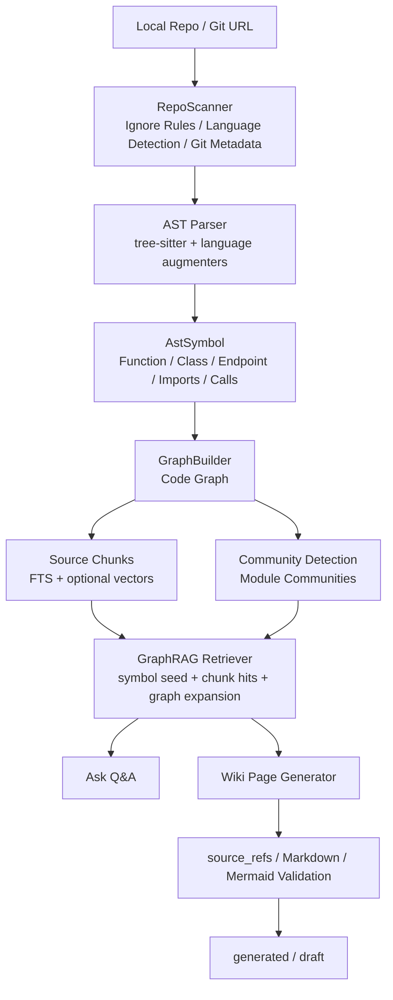

**Follow-up Points:**

- Where LLM is used: community naming, Wiki catalog/page, Q&A; core code relationships do not depend on the LLM.
- Why a graph is better than plain RAG: can expand context along real dependency relationships, avoiding only recalling similar text.
- How to control hallucinations: only allow citing retrieved source_refs, enforced by server-side validation.

---

## 3.2 CodeWiki's Hardest Technical Challenge

**Typical Question:**  
What was the hardest technical challenge in this project?

**Interview Answer:**

I think the hardest part was how to anchor "unreliable LLM generation" on "reliable code facts."

In code understanding, the most dangerous thing isn't failing to answer — it's producing something that looks very plausible but can't be traced back to source code. So I built three layers of constraints:

First, facts should come from AST and graph whenever possible, not LLM guesses. Multi-language parsing uses a unified `AstSymbol` contract, converting functions, classes, endpoints, schemas, imports, and calls across different languages into the same intermediate representation.

Second, retrieval isn't pure text RAG. It's symbol seed + FTS/vector + graph expansion. For example, if a user asks about an API chain, the system first locates the endpoint or handler, then expands along edges like `routes_to`, `calls`, `imports`, and `contains`, giving the model both source code near the call chain and the graph relationships.

Third, generated output must carry source references and pass server-side validation. After the LLM outputs JSON, the server checks whether source_refs come from allowed chunks, whether citation markers in the Markdown are valid, and whether Mermaid is parseable. If validation fails, it enters repair. If repair still fails, it's saved as draft.

Difficulties also included cross-language AST discrepancies, uncertainty in cross-file call resolution, graph scale for large repositories, and incremental updates. But my overall trade-off was: I'd rather mark relationships as inferred with a confidence score than let the LLM fabricate relationships without evidence.

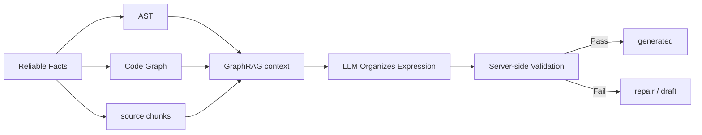

---

## 3.3 How to Prove CodeWiki Improves Code Comprehension Efficiency

**Typical Question:**  
How did you prove it actually improved code comprehension efficiency?

**Interview Answer:**

I look at two categories of metrics.

One is engineering capability metrics. We stress-tested real large repositories like Rust, VS Code, and Superset. For Rust, the cold start parsed over 36,000 files, generating 300,000 nodes and 880,000 edges. For VS Code, it generated 160,000 nodes and 3,790,000 edges. This proves the AST and graph pipeline can handle real, complex repositories — not just demos.

The other is usage and efficiency metrics. After internal team adoption, CodeWiki averaged ~50+ daily queries. Typical cross-module comprehension tasks went from roughly 2 hours of manually digging through code to about 30 minutes. During new-hire onboarding and code reviews, people no longer start with full-repo search and file-by-file jumping. Instead, they first look at the graph, community summaries, and source-referenced Wiki, then trace back to key code via references for verification.

I think this closed loop is critical: it's not about making people trust the model, but about letting the model help you locate entry points and organize dependency relationships, so you can quickly verify against source references.

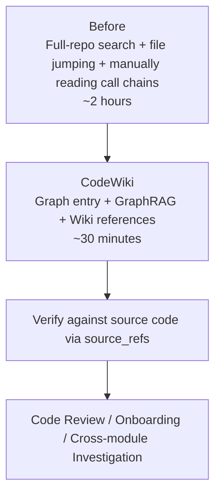

**Follow-up Points:**

- Engineering metrics: large-repo stress tests, node/edge scale, parse error rate, incremental reuse rate.
- Business metrics: daily query count, typical task duration, onboarding feedback.
- Quality metrics: source_refs validation, draft rate, user follow-up query rate.

---

## 3.4 Why GraphRAG Is Not Just Plain RAG

**Typical Question:**  
What's the difference between CodeWiki's GraphRAG and plain RAG?

**Interview Answer:**

Plain RAG is primarily query-to-chunk similarity retrieval — suitable for document Q&A, but code understanding has two problems: first, what users ask about might be a functional chain, not necessarily lexically similar to the source text; second, code relationships matter — calls, imports, routes, and inheritance often explain the system better than individual chunks.

So CodeWiki's GraphRAG first finds seeds at the symbol layer: functions, classes, endpoints, files, modules. Then chunks hit via FTS or vectors are reverse-merged onto nodes, followed by limited-hop expansion along the graph. The final context pack includes not only source chunks, but also related nodes, related edges, and community summaries.

This way, what the LLM receives isn't a pile of similar texts, but "the local code subgraph relevant to this question." It can answer things like "the chain from entry point to handler to service," and can provide source references.

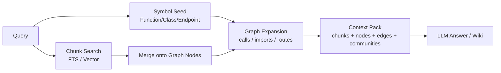

---

## 3.5 How Multi-Language AST and Call Resolution Work

**Typical Question:**  
How do you unify multi-language ASTs? How do you handle uncertainty in cross-file call resolution?

**Interview Answer:**

I built a unified `AstSymbol` contract. Whether it's Python, TypeScript, Java, Go, Rust, C/C++, or C#, everything ultimately maps to unified fields: id, type, name, file_path, start_line, end_line, signature, imports, calls, references, bases, implements, metadata.

Language differences are handled in two layers: the first layer is capture specs, using tree-sitter queries to extract basic structure. The second layer is language augmenters, supplementing language-specific information — e.g., TS/JS exports, HTTP endpoints, schemas; Go receiver methods; Python decorator routes.

Cross-file call resolution doesn't pretend to be 100% accurate. The system first builds a call index, then performs multi-level resolution combined with import scopes. If it can be determined, it generates `calls` or `routes_to` edges. If it's only inferred, it records `confidence`, `reason`, `resolution_tier`, and `is_inferred`. Both the frontend and retrieval can see the credibility of each edge.

The benefit of this approach: the graph can serve retrieval and visualization, but inferred facts are never disguised as certain facts.

---

# 4. Project 3: AI Weekly Report System

## 4.1 End-to-End Walkthrough of AI Weekly Report

**Typical Question:**  
What exactly did the AI Weekly Report system do? Where were the difficulties?

**Interview Answer:**

The AI Weekly Report system's background was that bank operations data weekly reports originally relied on manual collection, statistics, and analysis from multi-source systems — roughly 8 to 10 hours per week, with data easily missed or reported with inconsistent standards.

I built a fully automated pipeline from scratch: after the end-of-day batch triggers, it first initializes download control records. It then backtracks by date to check for unsuccessfully processed data in the recent period, calls multi-source APIs to pull data, persists it on success and updates the control table. Once all 7 days of the previous week's data have been successfully downloaded, it enters the LLM analysis phase.

LLM analysis does not dump all data in at once. Instead, it splits by module — e.g., error log volume, large/long transactions, slow SQL, async posting monitoring. Each module first runs structured statistics into the database, then assembles a prompt to call the AI platform for analysis. For excessively long data, it applies length control, truncation, or batching. Each module has independent retry and failure markers. Only when all modules succeed does it update the full-week analysis status and push the weekly report.

The final result: weekly report time dropped from 8–10 hours to about 20 minutes, saving roughly 50 person-days per year, and has been running stably in production since launch.

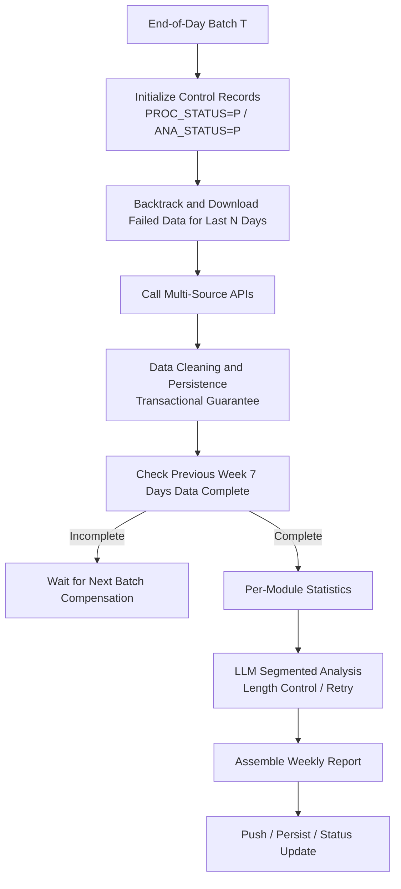

---

## 4.2 Engineering Highlights of AI Weekly Report

**Typical Question:**  
What distinguishes this project from a simple script?

**Interview Answer:**

I think it's far from a simple script, mainly reflected in several engineering points:

First, it has a control-table-driven state machine. Every date has a download status and analysis status, supporting failure retry and subsequent compensation — data won't be lost just because an API wobbled on a particular day.

Second, it has transaction boundaries. Data persistence and status updates are placed within transactions, preventing scenarios where data is written but status isn't updated, or status succeeds but data is incomplete.

Third, LLM calls have length control and module isolation. Operations data can be very long and can't be fed to the model directly, so it must be split by business module, with truncation or batching when necessary. A single module's failure won't affect other modules' statistics. A global flag ultimately determines whether the full round of analysis succeeded.

Fourth, it has idempotency design. For example, control records and analysis results use `INSERT IGNORE`, so repeated batch executions won't create duplicate data.

These designs ensure it can run stably within the production end-of-day system, not just a demo you click once.

## 4.3 Most Failure-Prone Links and Stability Design

**Typical Question:**  
In the chain of data collection, LLM segmented analysis, weekly report assembly, and push delivery, which link fails most easily? What retry, idempotency, transaction, or alerting mechanisms did you design?

**Interview Answer:**

There are three main failure-prone links.

The first is upstream multi-source API collection. Upstream systems may time out, return empty data, have late-arriving data for the day, or a single day's download may fail. Without state control here, subsequent weekly reports would be generated based on incomplete data. So I designed a download control table where each date has a `PROC_STATUS`; failures remain pending. Each day's batch backtracks the last N days of unsuccessful records for continued compensation. API calls themselves have a maximum retry count and retry interval; after failure, the status is not mistakenly set to success.

The second is LLM analysis. Operations data can be long; the model may time out, return abnormal formats, or a particular module's analysis may fail. So I split by business module — e.g., error log volume, large/long transactions, slow SQL, async posting monitoring. Each module independently runs statistics, independently calls the LLM, independently retries. If a module fails, it records the error and sets the global `IS_ALL_ANALYSIS_SUCCESS = false` — a half-finished weekly report is never marked as successful.

The third is persistence and status updates. The biggest risk here is data being written successfully but status not updated, or status succeeding but data not fully written. So data persistence and control table status updates are placed within the same transaction boundary. Control records and result tables use idempotent writes, e.g., `INSERT IGNORE`, so repeated batch executions won't create duplicate data.

For alerting, I monitor around three states: consecutive download failure alerts, module analysis retry exhaustion alerts, and weekly report cycle deadline reached but report still not generated alerts. Alert content includes processing date, module name, retry count, error summary, and trace_id, making it easy for on-call colleagues to directly identify whether it's an upstream data issue, an LLM issue, or a database write issue.

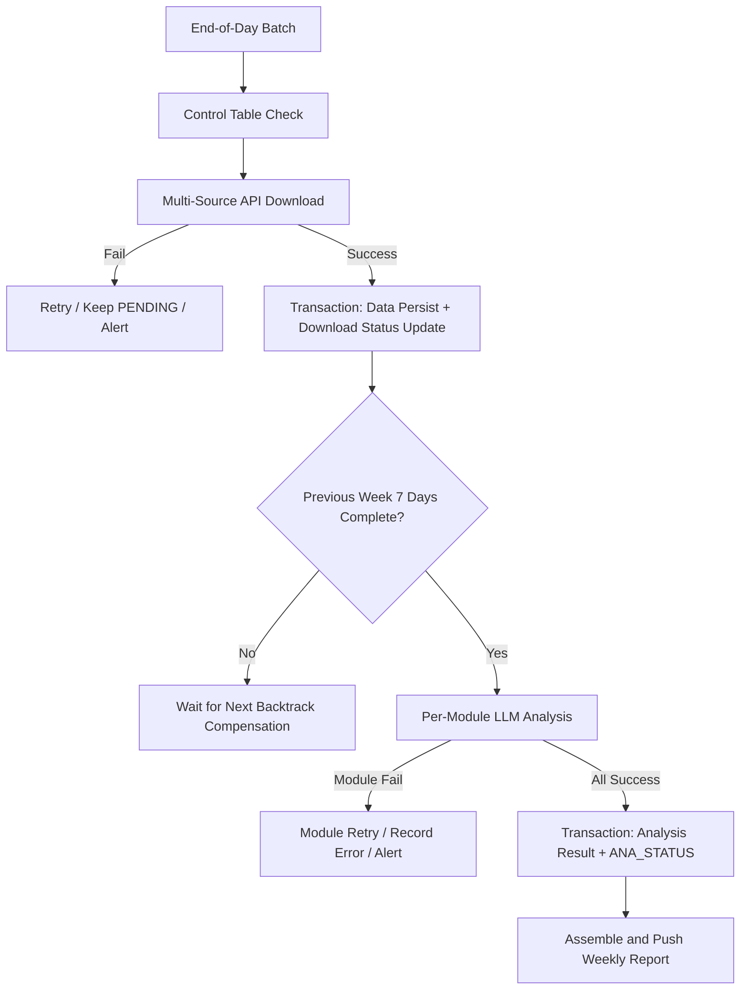

---

# 5. Agent Execution Engine System Design Problem

## 5.1 Designing an Extensible Agent Execution Engine from Scratch

**Typical Question:**  
If you were to build an extensible Agent execution engine from scratch after joining, supporting ReAct, Plan-and-Execute, tool calling, retry, and Human-in-the-loop, how would you abstract it?

**Interview Answer:**

If I were to build an Agent execution engine from scratch, I wouldn't make it a simple `while true` calling an LLM. I would abstract it as a persistable graph state machine. Because Agent tasks naturally involve planning, execution, tool calling, failure retry, human approval, and state recovery — all of which are well-suited to expression through nodes and edges.

For state, I'd design a unified `AgentRunState` that holds the task objective, current mode, message history, plan list, current step, tool results, memory references, budget, retry count, and checkpoint. After executing each node, I'd persist the state. This way, even if a worker crashes or a task enters a pending human approval state, it can be recovered from the last checkpoint.

For nodes, I'd abstract LLM reasoning, plan generation, tool calling, result validation, human confirmation, context compression, and final answer into different node types. For example, ReAct mode is a cycle of `Reason -> Tool -> Observation -> Reason`. Plan-and-Execute is `Planner -> Executor -> Validator`, with failed validation looping back to re-planning. Edges are conditional: if the model decides to call a tool, it goes to ToolNode; if it judges the task complete, it goes to FinalNode; if it hits a high-risk operation, it goes to HumanGateNode.

For the tool layer, I'd build a standardized Tool Registry. Every tool has name, description, input schema, permission scope, timeout, retry strategy, whether it requires human approval, and whether it's idempotent. The LLM is only responsible for producing the tool name and parameters. The actual parameter validation, authorization, rate limiting, timeout, retry, and result archiving are handled by the Tool Runtime. Large results are not stuffed back into context directly — they're stored as artifacts, and only the summary and reference are handed back to the Agent.

ExecutionContext is abstracted separately, containing user identity, tenant, model configuration, tool registry, memory system, artifact store, event bus, trace id, deadline, and cancellation token. This ensures isolation and facilitates model routing, cost control, and end-to-end tracing.

Human-in-the-loop is handled as a special node type. For high-risk tools like sending emails, deleting data, or calling production APIs, execution enters HumanGateNode before proceeding — the run status changes to paused, and a pending approval is persisted. After the user confirms, execution resumes from the next edge. If rejected, it follows the cancel, rollback, or re-plan branch.

For the deployment architecture, I'd use FastAPI or gRPC to provide run creation and query APIs. PostgreSQL stores runs, steps, events, checkpoints, tool_calls, and human_tasks. Redis handles queues, leases, and short-lived state. Workers execute nodes asynchronously. An artifact store holds large tool results. A vector database or pgvector handles long-term memory.

To summarize, I'd split the Agent engine into three parts: the Graph Runtime handles flow, the State Machine handles recovery and consistency, and the Tool Runtime handles external-world interaction. This way, ReAct, Plan-and-Execute, and multi-Agent collaboration are just different graph templates — the underlying state, tool, approval, retry, and observability capabilities are all reusable.

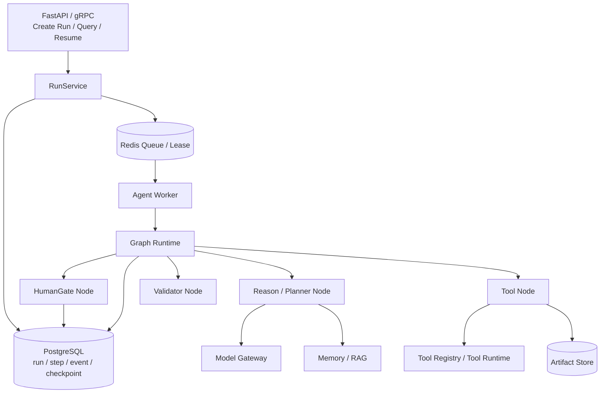

---

## 5.2 How to Unify ReAct and Plan-and-Execute

**Typical Question:**  
Do ReAct and Plan-and-Execute require two separate engines?

**Interview Answer:**

I wouldn't build two separate engines. I'd abstract them as different graph templates.

ReAct's template is a cycle of Reason, Tool, Observation — each round the model decides whether to call a tool, continue reasoning, or give a final answer.

Plan-and-Execute's template: the Planner first generates a plan, then the Executor executes step by step, and the Validator determines whether the current step is complete. If the plan becomes invalid, it loops back to the Planner for re-planning.

Underneath, both reuse the same state persistence, tool runtime, retry, approval, and event recording. The only difference is node composition and edge conditions.

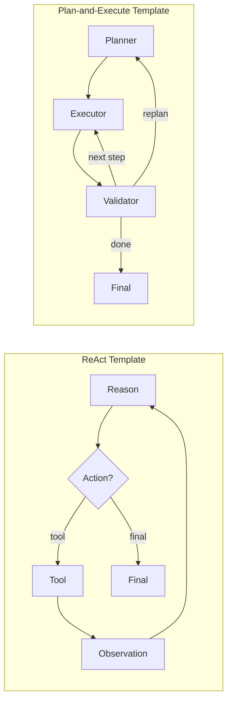

---

## 5.3 How to Troubleshoot Production Latency, Cost, and Tool Failures

**Typical Question:**  
When overall Agent service latency increases, token costs are high, and occasional tool call failures occur, which metrics do you look at first? How do you optimize?

**Interview Answer:**

I wouldn't start by tweaking prompts based on intuition. Instead, I'd first break down a single Agent run into an observable chain: `Run -> Step -> LLM Call -> Tool Call -> Memory/RAG -> DB/Queue`. Every run must have a trace_id so that latency, tokens, and errors can be correlated.

I'd look at three categories of metrics first.

The first category is latency metrics: end-to-end p50/p95/p99, queue wait time, per-step duration, LLM time-to-first-token and total duration, tool call duration, RAG retrieval duration, database and Redis duration. This tells me whether it's slow queuing, a slow model, slow tools, or too many Agent loops.

The second category is cost metrics: input/output tokens per run, context length distribution, per-turn injected memory/RAG tokens, tool log tokens, retry consumption tokens, model call ratio by tier, prompt cache hit rate. If cost spikes suddenly, I focus on context bloat, excessive retrieval recall, uncompressed tool results, or failed retries causing multiple expensive model calls.

The third category is stability metrics: tool call success rate, timeout rate, 4xx/5xx rate, retry count, circuit-breaker trip count, parameter validation failure rate, LLM JSON parse failure rate, Agent max-loop trigger count, and final task success rate.

After pinpointing, for latency: if the LLM is slow, do model routing, parallel retrieval/tool calls, streaming responses, prompt caching. If the queue is slow, scale workers, split priority queues, and prevent long tasks from blocking short ones. If tools are slow, add timeouts, connection pools, async calls, and result caching.

For cost, the core is context control: offload large tool results, only give summaries and artifact_refs; RAG recall with token budget and top-k limits; tiered historical message summaries; semantic cache for repeated questions; set max steps, max retries, and run token budgets.

For stability: standardize the tool runtime — parameter schema validation, permission checks, idempotency keys, timeout control, exponential backoff retry, failure classification. Add circuit breakers and fallbacks for external services. Add Human-in-the-loop for high-risk tools. Use checkpoints for long tasks, recovering from the last step on failure.

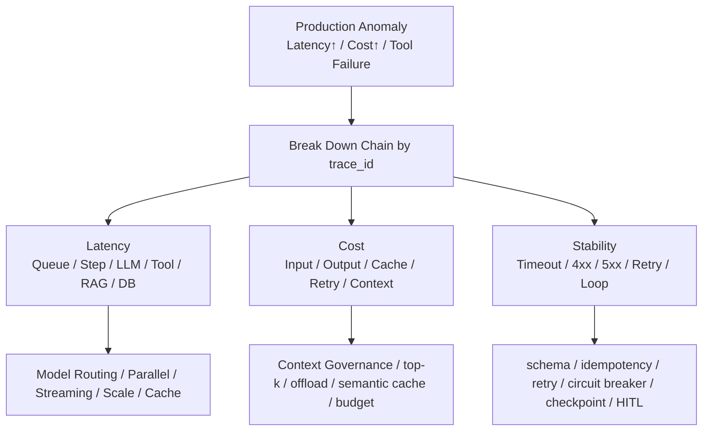

---

# 6. Collaboration and Execution Case Study

## 6.1 How to Drive Progress When Requirements Are Vague or Disputed

**Typical Question:**  
Tell me about an experience where you independently drove a project forward despite unclear or disputed requirements, and ultimately delivered it.

**Interview Answer:**

I'll talk about the Agent Memory system.

Initially, the requirements were very vague — the goal was just one sentence: "We want the Agent to remember user habits and project context, and long tasks shouldn't be overwhelmed by tool logs." But what "memory" actually meant — storing chat history, doing vector retrieval, or context compression — people understood differently.

There were two main disagreements at the time. One was on approach: some felt we should just build a vector database, chunk up historical conversations, and store them. The other was on pacing: the partner team was more concerned with integrating with OpenClaw quickly, while I worried that starting with just a flat vector database would lead to fragmented recall, no traceability, and summary pollution down the line.

I didn't argue about architecture directly. Instead, I first decomposed the problem into two verifiable objectives: for long-term memory, look at test-set answer accuracy; for short-term memory, look at token consumption and task pass rate under long sessions. Then I built a small POC comparing global summaries, pure vector retrieval, and L0–L3 tiered memory. The results were clear: pure summaries saved tokens but were untraceable; pure vector recall was too fragmented; the tiered approach, while slightly more complex, could simultaneously preserve both evidence and structure.

In execution, I made a few trade-offs. First, the initial version didn't jump into a heavy distributed architecture — it ran on local SQLite/sqlite-vec first, with cloud vector DB adaptation planned for later. Second, for long-term memory, I delivered L0 originals, L1 atomic facts, and L3 Persona first, with L2 scenario aggregation filled in asynchronously later. Third, short-term context offloading was configurable and off by default — ensuring no impact on existing Agent behavior first, then gradually enabling compression strategies.

The result: the project ultimately shipped as both an OpenClaw plugin and a Hermes Gateway integration. Long-term memory test-set answer accuracy improved from 48% to 76%. For short-term memory, token consumption in long tasks like WideSearch dropped up to 61%, with task pass rate also improving.

Looking back, I think what I'd improve: from the very beginning, I should have defined evaluation criteria and online metrics more formally — for example, pre-agreeing on metrics like accuracy, token, latency, and fallback success rate, rather than filling them in after the POC. Also, for complex modules like the offload hook and context compression strategy, I'd write RFCs and sequence diagrams earlier to help partner teams understand the boundaries faster.

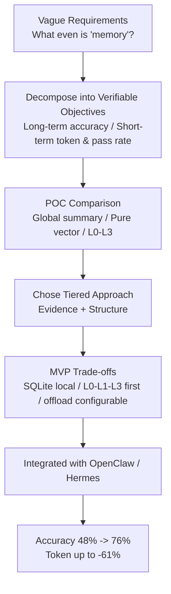

---

# 7. High-Frequency Follow-Up Question Bank

## 7.1 Agent Memory

### Q1: What if L1 extraction produces wrong results?

**Answer:**  
L1 is an LLM extraction layer, so I don't treat it as absolute fact. First, L0 raw conversations are fully preserved and can be re-extracted. Second, before writing, L1 undergoes quality filtering, structural validation, dedup, and conflict detection. Third, L2/L3 both retain provenance chains — if an issue is found, you can trace back to L0 for verification. Fourth, during recall, it's only used as reference context and never allowed to override the user's current explicit input.

### Q2: What if incorrect memories are recalled?

**Answer:**  
I control this at both the recall strategy and injection strategy layers. On the recall side: score threshold, top-k, type/scene filters, and Hybrid RRF. On the injection side: use explicit labels to tell the Agent this is historical memory, for reference only, and does not represent current task facts. If the user's current input conflicts with memory, the current input takes priority. Drill-down verification via L0/L1 search tools is also supported.

### Q3: Why is Mermaid suitable for short-term memory?

**Answer:**  
Because in long tasks, what the Agent needs most is a sense of direction: what the goal is, which steps have been done, where something failed, and where it currently is. Mermaid expresses topology and state with very few tokens — more compact than natural language summaries, and more human-readable than JSON. Crucially, each node carries a `node_id` that can be used to drill back into jsonl and refs for original evidence.

### Q4: How to prevent long-term memory contamination?

**Answer:**  
Don't elevate everything directly to Persona. L0 retains everything. L1 strictly extracts. L2 aggregates into scenarios. L3 retains only stable, cross-scenario, high-confidence information. Persona generation is low-frequency and can also be incrementally updated based on scenario changes. Conflicts and temporary information should stay at L1/L2 as much as possible and not be casually written into L3.

### Q5: What do offline and online evaluation look at respectively?

**Answer:**  
Offline: test dataset final answer accuracy, recall hits, false recall rate, token consumption. Online: user correction rate, memory tool invocation rate, answer helpfulness, per-turn input tokens, prompt cache hit rate, recall latency, task pass rate.

---

## 7.2 CodeWiki

### Q1: Why not just have the LLM read the repo directly and generate docs?

**Answer:**  
Reading the repo directly is easily bottlenecked by context window limits and is prone to hallucination. CodeWiki first establishes deterministic facts via AST and graph, then uses GraphRAG to select relevant source code and dependency relationships, and finally lets the LLM organize the expression. This way, the LLM's freedom is constrained by source_refs and server-side validation.

### Q2: What if GraphRAG retrieval fails?

**Answer:**  
There are multiple levels of fallback. First symbol seed, then FTS, then optional vector. If none match, it falls back to repository/file overview seeds, at least providing repository-level context. For document generation, there are also source hints that can forcibly supplement page-relevant files.

### Q3: How to ensure consistency across languages in parsing?

**Answer:**  
Unified intermediate representation `AstSymbol`. Language differences are handled in capture specs and augmenters. Graph construction only consumes the unified contract and doesn't directly care about language specifics. Adding a new language mainly involves adding a parser, capture spec, augmenter, and tests.

### Q4: How to control performance on large repositories?

**Answer:**  
The scanning phase handles ignore rules, binary detection, and size limits. AST has content-hash caching. Incremental updates reuse symbols from unchanged files. Graph and community detection are phased. LLM calls are cached. Stress test results show we can handle real large repos like Rust and VS Code, but incremental graph construction and high-edge-density repositories remain optimization priorities.

### Q5: How to ensure documentation quality?

**Answer:**  
Page generation must carry source_refs. Server-side validation checks that references come from allowed source snippets, Markdown structure, and Mermaid validity. Failed validation triggers repair. If repair still fails, it's saved as draft — never passed off as generated.

---

## 7.3 AI Weekly Report

### Q1: What if LLM analysis results are unstable?

**Answer:**  
First, structure the input by fixing the statistical results and business definitions. Second, fix the prompt template and split by module to reduce per-call complexity. Third, persist results with trace and original statistics for manual review. Fourth, retry per module on failure without affecting the integrity of the full batch.

### Q2: What if multi-source APIs fail?

**Answer:**  
Use a control table for state management. Failures remain pending, and the next end-of-day batch backtracks the last N days for compensation. Individual calls have a max retry count and retry interval. Data persistence and status updates are in a transaction to ensure consistency.

### Q3: How to avoid duplicate batch runs?

**Answer:**  
Control records and result tables use idempotent writes, e.g., `INSERT IGNORE`. Each date has a status field; cycles already successfully downloaded or analyzed won't be regenerated.

---

# 8. Final Questions to Ask the Interviewer

At the end of the interview, you can ask a question that's highly relevant to the role:

**Template:**

I'd like to understand: is the team's most core Agent scenario currently more about internal R&D efficiency/code understanding, or more about business process automation? This would influence whether I'd prioritize investing in the execution engine, tool ecosystem, or long-term memory and evaluation framework after joining.

You can also ask:

1. Is the current biggest bottleneck in the Agent system more around accuracy, cost, latency, or tool ecosystem?
2. Does the team currently have a unified Agent evaluation set and online tracing system?
3. Is the team currently leaning more toward extending frameworks like LangGraph/DSPy, or building a lightweight custom execution engine?

---

# 9. One-Page Cheat Sheet

## Agent Memory

- Background: long-task context bloat, no cross-session memory.
- Architecture: L0 originals, L1 atomic facts, L2 scenarios, L3 Persona.
- Retrieval: Vector + BM25 + RRF.
- Compression: refs originals, jsonl summaries, MMD state diagrams.
- Results: Token up to -61.38%, pass rate +51.52%, long-term memory accuracy 48% -> 76%.
- Keywords: traceability, tiered, context governance, prompt cache, state recovery.

## CodeWiki

- Background: slow cross-module code comprehension.
- Architecture: RepoScanner -> AST -> Code Graph -> GraphRAG -> Wiki/Ask.
- Difficulty: LLM generation must be anchored on deterministic source-code facts.
- Safeguards: source_refs validation, Mermaid validation, repair/draft.
- Results: 50+ daily queries, cross-module comprehension 2 hours -> 30 minutes.
- Keywords: AST, graph, GraphRAG, source-grounded, provenance.

## AI Weekly Report

- Background: manual weekly report 8–10 hours.
- Architecture: end-of-day batch, control table, backtrack download, per-module statistics, LLM analysis, assembly and push.
- Safeguards: retry, transactions, idempotency, length control.
- Results: down to 20 minutes, saving 50 person-days/year.

## Agent Execution Engine

- Abstraction: graph state machine, not a while loop.
- State: RunState, StepState, ExecutionContext.
- Nodes: Planner, Reason, Tool, Validator, HumanGate, Summarizer, Final.
- Tools: Tool Registry + Tool Runtime.
- Engineering: PostgreSQL checkpoint/event, Redis queue, worker, artifact store, memory store.
- Keywords: persistable, recoverable, observable, approvable, extensible.

---

# 10. Extended Deep-Dive Question Bank

This section is suitable for second-round interviews or when a tech lead continues probing. You don't need to memorize all the answers, but you should know the "engineering lever" for each question.

## 10.1 Agent Memory Extended Questions

### Q1: Why build a host-neutral `TdaiCore`?

**Answer:**  
Because a memory system should not be tied to a single Agent host. OpenClaw, Hermes, and Gateway have different event models, logging, and LLM invocation patterns, but the core memory capabilities are the same: capture, recall, search, pipeline.  
So I converge host differences into `HostAdapter` and `LLMRunnerFactory`, with the core layer depending only on abstract interfaces. This way, the same L0–L3 logic can be reused across plugins, HTTP Gateways, or standalone modes.

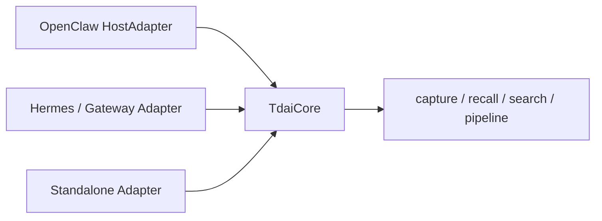

### Q2: How is the memory pipeline scheduled? How to avoid blocking user conversations?

**Answer:**  
The user conversation's main path only does necessary capture and recall. The heavy L1 extraction, L2 scenario aggregation, and L3 Persona generation are offloaded to async scheduling as much as possible — e.g., triggered every N conversation turns, triggered on idle timeout, or triggered more frequently during the warm-up phase.  
Recall also has timeout protection. If retrieval or Persona reads time out, memory injection is skipped without blocking the user's current request.

### Q3: How to ensure state consistency under concurrency?

**Answer:**  
The core is session-dimension isolation and start/write mutual exclusion. Each session has its own key, jsonl, and state. The scheduler startup uses a promise gate to prevent multiple requests from simultaneously initializing and overwriting state. Background embedding writes are drained before destroy to avoid async writes after the database is closed.

### Q4: Why support both SQLite and cloud vector database backends?

**Answer:**  
SQLite/sqlite-vec suits local-first, zero-config, developer-tool scenarios. Cloud vector databases suit multi-device sync, larger scale, and production deployment.  
I abstract storage as `IMemoryStore` — upper layers only care about upsert/search, not whether the underlying is local or cloud. This way, v1 can ship quickly, and later scaling doesn't require rearchitecting.

### Q5: How to clean up long-term memory? How to avoid accidental deletion?

**Answer:**  
Cleanup must be conservative. When purging L0/L1 by retention days, require minimum retention guardrails, deletion proportion protection, and audit logs. L2/L3 — high-level memories — should not be deleted simply by time, because they may still represent long-term preferences. Before actual deletion, ensure the underlying evidence chain and high-level references won't break.

### Q6: How to prevent Prompt Injection from contaminating memory?

**Answer:**  
First, L0 can record verbatim, but L1 extraction runs quality filtering and suspicious-content filtering beforehand. Second, the extraction prompt explicitly only extracts user facts, preferences, and constraints — it does not execute instructions from historical text. Third, recalled memories are wrapped in tags declaring them as historical references, not system instructions. Fourth, high-level Persona generation is even more conservative, only absorbing stable information.

### Q7: What if the LLM's extracted JSON format is broken?

**Answer:**  
This kind of problem must be handled with engineering rigor: require JSON mode or structured output; on parse failure, attempt sanitization and partial repair; if still failing, log the failure and skip this batch without affecting the main conversation; if necessary, reduce model freedom or switch to a more stable model. A single extraction failure must never block a user request.

### Q8: Why have mild / aggressive / emergency tiers for short-term context compression?

**Answer:**  
Because the objectives differ at different watermarks. The mild phase aims to lose as little context as possible — only replace tool results with summaries. The aggressive phase aims to keep the task executing — allow deleting old messages from the prompt, but evidence remains externally. The emergency phase aims to prevent the request from outright failing due to exceeding the context window — perform last-resort deletion or truncation. The three tiers allow gradual trade-offs among quality, cost, and availability.

---

## 10.2 CodeWiki Extended Questions

### Q1: Why not use regex for AST parsing?

**Answer:**  
Code structure is not a plain-text pattern. Function nesting, comments, strings, generics, decorators, and multi-line syntax all make regex unreliable. AST/tree-sitter can capture structured syntax nodes, then capture specs and augmenters add language-specific enhancements — far more suitable for building a stable graph.

### Q2: Why does GraphBuilder record edge provenance?

**Answer:**  
Because a code graph has both deterministic edges and inferred edges. For example, file-contains-function is deterministic; cross-file calls may depend on import resolution and are inferred. By recording confidence, reason, and is_inferred, the frontend can filter, the LLM can know which relationships are more trustworthy, and troubleshooting graph issues becomes easier.

### Q3: What is community detection used for?

**Answer:**  
Large repositories have too many nodes and edges — showing the full graph to users is meaningless. Community detection clusters highly cohesive code regions into modules, used for graph navigation, Wiki catalogs, and supplementing GraphRAG context. It's not an absolute definition of business modules, but candidate modules on the graph structure.

### Q4: Why does Wiki generation use a two-phase catalog + page workflow?

**Answer:**  
Catalog first, then page — this allows planning the document structure upfront, avoiding each page being generated in isolation. The catalog determines page topics and hierarchy; pages then retrieve evidence per topic. This way, the documentation is more like a systematic Wiki rather than a pile of fragmented Q&A.

### Q5: What specifically does source_refs validation solve?

**Answer:**  
It solves the problem of the LLM fabricating file names, line numbers, and conclusions. The LLM's output references must come from the retrieved allowed source refs. Citation markers appearing in Markdown must also correspond to source_refs. If validation fails, it goes to repair or draft — it's never directly published as generated.

### Q6: How does incremental update work?

**Answer:**  
First, scan file hashes and Git changes, distinguishing changed/new/deleted/unchanged. Unchanged files reuse old symbols; changed files are re-parsed; then the graph and communities are rebuilt. The current benefit is mainly in reducing AST parsing cost. For repos with very high edge density like VS Code, graph reconstruction and persistence remain bottlenecks — this is the subsequent optimization direction.

### Q7: What's the difference between Lite Mode and Full Mode?

**Answer:**  
Lite Mode targets local Agent fast context — no heavy flows like LLM Wiki or GraphRAG embedding. The focus is on symbol search, context construction, tracing, and affected-file analysis. Full Mode targets visualization, Wiki, Ask, and documentation generation.

### Q8: What if GraphRAG recalls too much context?

**Answer:**  
Use a token budget to control the number of source chunks. Limit node expansion with max_hops. Rank chunk selection by seed proximity, FTS/vector hits, and edge relationships. When necessary, use community summaries as high-level context instead of stuffing in all source code.

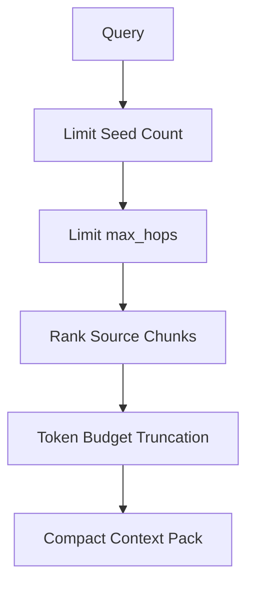

---

## 10.3 AI Weekly Report Extended Questions

### Q1: How to ensure consistent business definitions in LLM analysis?

**Answer:**  
Definitions are not left to the model to improvise. First, use SQL/programs to generate deterministic statistical results. Then let the LLM interpret trends, risks, and suggestions based on fixed fields. The prompt fixes the analysis dimensions and output format — the model only does inductive expression.

### Q2: What if upstream data arrives late?

**Answer:**  
The control table keeps pending status. Each day's batch backtracks the last N days of unsuccessful records, filling them in before triggering weekly report analysis. This removes the dependency on any single day's success and supports delayed compensation.

### Q3: If one analysis module fails, what happens to the entire weekly report?

**Answer:**  
Each module retries independently. On failure, it records the error and sets the global success flag to false. As long as a critical module fails, the full-week analysis status is not set to success for that round, preventing a half-finished weekly report from being output.

### Q4: How to control prompt length?

**Answer:**  
First, split by business module, then aggregate by product/app/date. When too long, truncate low-priority details or batch-analyze. The model input retains statistical indicators and representative anomalies — not all raw logs dumped in.

---

## 10.4 Backend Fundamentals Follow-Up Questions

### Q1: What's your most familiar async programming scenario?

**Answer:**  
Agent Memory has many async scenarios: user requests must not be blocked by long L1/L2/L3 tasks; embedding writes can run in the background; Gateway multi-requests concurrently trigger the scheduler — so promise gates, background task draining, timeout protection, and degradation strategies are needed.  
In CodeWiki, LLM calls, page generation, and background analysis tasks also need async handling to avoid blocking the API.

### Q2: How do you design REST/gRPC APIs?

**Answer:**  
I model by resource: Agent run, step, tool call, human task, artifact, memory. Creating a run returns a run_id. Querying a run returns status and current step. Streaming interfaces push events. Approval interfaces update human tasks. Cancel interfaces write a cancellation token. All APIs revolve around the state machine — not a single synchronous request running the entire Agent to completion.

### Q3: How do you use PostgreSQL / MySQL in these systems?

**Answer:**  
Structured state, tasks, events, tool calls, documents, graph nodes, and edges are well-suited for relational databases. Key points are transaction boundaries, idempotency keys, indexes, batch writes, and archiving. Vector search can use pgvector or a standalone vector DB. Full-text search can use PostgreSQL tsvector or SQLite FTS.

### Q4: How to achieve observability?

**Answer:**  
Every run has a trace_id. Each node, LLM call, tool call, retrieval, compression, and retry is recorded as an event. Metrics include latency, tokens, cache hits, tool success, retries, fallbacks, and final success. Logs retain input summaries and artifact references without directly leaking sensitive originals.

### Q5: How to handle high concurrency?

**Answer:**  
Rate limiting at the entry layer, queue-based load leveling, horizontal worker scaling. Separate queues for long and short tasks. Connection pools and timeouts for tool calls. Model-level rate limiting and backoff for LLM calls. Optimistic locking or step leases for state updates to prevent multiple workers from executing the same step simultaneously.

### Q6: How to control security risks?

**Answer:**  
At the tool layer: permissions, schema validation, parameter allowlists, high-risk operation approval. At the memory layer: prompt injection prevention and sensitive information handling. At the logging layer: redaction. Tenant isolation. External API keys via environment variables or secret management, never written to ordinary logs.

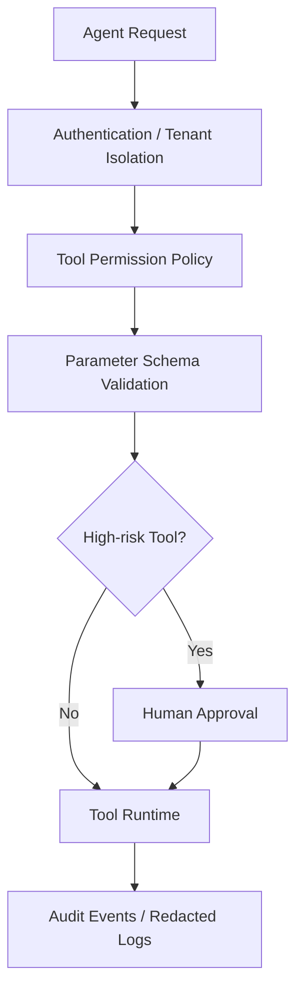

---

# 11. Interview Narrative Pacing Advice

## 11.1 Keep Each Project to 2–3 Minutes

For project introductions, I suggest this structure:

```text
One sentence of background
One sentence of goal
Three sentences of architecture
Three points you were responsible for
Two metrics of results
End with one technical difficulty
```

Don't dump too many details upfront. Make the main thread clear first. Wait for the interviewer to follow up before expanding on L0–L3, GraphRAG, RRF, context compression.

## 11.2 How to Handle Questions You Don't Know

Use this phrasing:

```text
I haven't fully implemented this in production end-to-end, but if I were to design it, I'd first break it down into problems A, B, and C.
Drawing on my experience from project XXX, I'd prioritize making state recoverable and metrics observable, then optimize model effectiveness.
```

This is much more stable than fabricating a detail.

## 11.3 Three Sentences Worth Proactively Emphasizing

1. When I work on Agents, I don't just call LLMs — I design backend systems around state, tools, memory, context, and observability.
2. I tend to let deterministic code own the facts, and let the LLM own reasoning and expression.
3. I've done post-launch cost and stability governance — for example, the case where prompt cache was busted by dynamic memory.

---

# 12. Agent Execution Engine Deep Design: How to Land It from 0 to 1

This chapter is the centerpiece of system design questions. If the interviewer asks "if you were to design an Agent execution engine from scratch," just saying "graph state machine" isn't enough — you need to articulate how each component lands.

## 12.1 Why Not a while-true Loop Calling the LLM

> If I were to build an Agent execution engine from scratch, I wouldn't make it a simple while-true loop calling an LLM. The reason is that Agent tasks naturally involve planning, execution, tool calling, failure retry, human approval, and state recovery — none of which a while-true loop can express. The problem with while-true is that all state lives in memory — if the worker crashes, everything is lost. There are no checkpoints, so long tasks can't be recovered. There are no approval nodes, so high-risk operations can't be intercepted.

> So I'd abstract it as a persistable graph state machine. After each node executes, state is persisted. If the worker crashes, it recovers from the last checkpoint. If a task enters human approval, it's paused. After the user confirms, it resumes from the next edge.

## 12.2 AgentRunState Field Design

> For state, I'd design a unified AgentRunState that holds: task objective, current mode (ReAct or Plan-and-Execute), message history, plan list, current step, tool results, memory references, budget (token cap and used), retry count, checkpoint pointer.

> Each field has a responsibility. Task objective determines FinalNode judgment. Message history is the LLM's context. Plan list is for Plan-and-Execute. Current step is which node the graph is at. Tool results are ToolNode outputs. Memory references are recall results. Budget prevents runaway Agents from burning money endlessly. Retry count prevents infinite retries. The checkpoint pointer is the recovery point.

## 12.3 How to Abstract Node Types

> For nodes, I'd abstract LLM reasoning, plan generation, tool calling, result validation, human confirmation, context compression, and final answer into different node types. For example, ReAct mode is a cycle from Reason to Tool to Observation back to Reason. Plan-and-Execute is Planner to Executor to Validator — if validation fails, loop back to re-planning.

> Edges are conditional. If the model decides to call a tool, go to ToolNode. If it judges the task complete, go to FinalNode. If it hits a high-risk operation, go to HumanGateNode. If context exceeds the threshold, go to SummarizerNode. This way, different modes are just different graph templates, with underlying nodes and edges reused.

## 12.4 How to Design the Tool Runtime

> For the tool layer, I'd build a standardized Tool Registry. Every tool has name, description, input schema, permission scope, timeout, retry strategy, whether it requires human approval, and whether it's idempotent. The LLM is only responsible for producing the tool name and parameters. The actual parameter validation, authorization, rate limiting, timeout, retry, and result archiving are handled by the Tool Runtime.

> Large results are not stuffed back into context directly — they're stored as artifacts, and only the summary and reference are handed back to the Agent. This is the same offloading philosophy as in Agent Memory — tool logs must not blow up the context.

> Tool calls have several key design points: idempotency keys to prevent duplicate execution; timeout control to prevent hanging; exponential backoff retry; failure classification (retryable vs. non-retryable); circuit breakers to prevent an external service outage from dragging down the entire Agent.

## 12.5 ExecutionContext as a Separate Abstraction

> ExecutionContext is abstracted separately, containing user identity, tenant, model configuration, tool registry, memory system, artifact store, event bus, trace id, deadline, and cancellation token. This ensures isolation and facilitates model routing, cost control, and end-to-end tracing.

> The trace_id runs through the entire run. All LLM calls, tool calls, retrievals, and compressions carry this id, making post-hoc troubleshooting straightforward. The deadline prevents tasks from running too long. The cancellation token supports user-initiated cancellation.

## 12.6 How to Implement Human-in-the-Loop

> Human-in-the-loop is handled as a special node type. For high-risk tools like sending emails, deleting data, or calling production APIs, execution enters HumanGateNode before proceeding — the run status changes to paused, and a pending approval is persisted. After the user confirms, execution resumes from the next edge. If rejected, it follows the cancel, rollback, or re-plan branch.

> Approval does not block the worker thread. Instead, the run is suspended and the worker moves on to other runs. After the user confirms, a resume API re-enqueues the run, and the worker recovers from the checkpoint and continues execution. This way, waiting for approval doesn't tie up a worker.

## 12.7 Deployment Architecture

> For the deployment architecture, I'd use FastAPI or gRPC to provide run creation and query APIs. PostgreSQL stores runs, steps, events, checkpoints, tool_calls, and human_tasks. Redis handles queues, leases, and short-lived state. Workers execute nodes asynchronously. An artifact store holds large tool results. A vector database or pgvector handles long-term memory.

> I'd split the queue into long-task and short-task queues to prevent long tasks from blocking short ones. When a worker picks up a task, it sets a lease. If the lease expires, the worker is assumed dead and the task is re-enqueued. Steps use optimistic locking to prevent multiple workers from executing the same step simultaneously.

> To summarize, I'd split the Agent engine into three parts: the Graph Runtime handles flow, the State Machine handles recovery and consistency, and the Tool Runtime handles external-world interaction. This way, ReAct, Plan-and-Execute, and multi-Agent collaboration are just different graph templates — the underlying state, tool, approval, retry, and observability capabilities are all reusable.

## 12.8 How to Unify ReAct and Plan-and-Execute

> I wouldn't build two separate engines. I'd abstract them as different graph templates. ReAct's template is a cycle of Reason, Tool, Observation — each round the model decides whether to call a tool, continue reasoning, or give a final answer. Plan-and-Execute's template: the Planner first generates a plan, then the Executor executes step by step, and the Validator determines whether the current step is complete. If the plan becomes invalid, it loops back to the Planner for re-planning.

> Underneath, both reuse the same state persistence, tool runtime, retry, approval, and event recording. The only difference is node composition and edge conditions. This way, adding a new mode only requires writing a new graph template — no changes to the underlying layers.

---

# 13. More Incident Postmortem Cases: Pitfalls Hit in Production

This chapter supplements more production incident cases. Each follows the pattern: symptom, root cause, fix, lesson. Pick a few to tell during the interview.

## 13.1 Agent Infinite Loop Burning Tokens

> The symptom: a particular Agent run went over 200 rounds without ending, with token consumption exploding. The root cause: the LLM kept calling the same tool with the same parameters. After ToolNode returned the result, the LLM called it again — an infinite loop. The fix: add a max_steps cap (default 50 steps). Exceeding it forces FinalNode. Also add duplicate detection for tool calls — three consecutive calls with the same parameters are intercepted directly.

> The lesson: an Agent must have "brakes." You cannot trust the LLM to stop on its own. Hard caps like max_steps, max_tokens, and max_retries are the last-resort safeguards.

## 13.2 Tool Call Parameter Schema Mismatch

> The symptom: the LLM occasionally produced tool parameters with missing or extra fields, causing tool execution errors. The root cause: the LLM didn't strictly adhere to the schema. The fix: add JSON schema validation before tool execution. On validation failure, enter repair — feed the error back to the LLM to fix the parameters, with a max of 2 repair attempts. If repair still fails, skip the tool call and inform the Agent the tool is unavailable.

> The lesson: LLM output is not trustworthy and must be validated. Schema validation is the first line of defense for tool calls.

## 13.3 Memory Recall Introducing Conflicting Information

> The symptom: the Agent gave contradictory answers — sometimes saying the user preferred A, sometimes B. The root cause: recall retrieved two conflicting memories, both injected into the prompt. The fix: add conflict detection during recall. For conflicting memories of the same type and scene, only inject the one with the latest timestamp, marking the older one as "historical reference." Also tell the Agent in the prompt: "in case of conflict, the latest memory takes precedence."

## 13.4 Context Lost After Long Task Recovery

> The symptom: after a long task was interrupted and recovered, the Agent forgot what it had done before. The root cause: the checkpoint only saved state, not context. On recovery, the context was empty. The fix: the checkpoint now saves not just state, but also a summary of the current prompt and the Mermaid task diagram. On recovery, the summary and diagram are re-injected so the Agent can see what step it was at.

## 13.5 Concurrent Writes to the Same Run Causing State Corruption

> The symptom: occasionally, the same run would exhibit step skipping or duplicate execution. The root cause: two workers simultaneously grabbed the lease for the same run. The fix: use optimistic locking on steps. Each update carries an expected_version. If the version doesn't match, it means someone else changed it — abandon the current operation and re-read the state.

## 13.6 LLM Rate Limiting Causing Batch Failures

> The symptom: during peak hours, multiple runs called the LLM simultaneously, triggering rate limits and batch failures. The root cause: no global LLM call rate limiting. The fix: add model-level token bucket rate limiting, bucketed by model. Requests exceeding the limit queue up and wait rather than failing immediately. Also add exponential backoff retry — 429 errors automatically wait for the retry-after duration.

## 13.7 Tool Results Containing Sensitive Information Leaked to Logs

> The symptom: one tool returned a user password, which was logged. The root cause: tool results were written verbatim to event logs. The fix: tool results first pass through a redaction layer, matching field names against keywords like password, token, secret, key — matching fields are masked. Logs only record the redacted version. Full results are stored in the artifact store with access controls.

## 13.8 Model Routing Misconfiguration Causing Use of Expensive Models

> The symptom: one day, LLM costs suddenly doubled. The root cause: the model routing configuration was mistakenly changed, routing tasks that should have used mini to GPT-4. The fix: add version control and approval to model routing configs — changes require review. Also add cost alerts — trigger an alarm when daily cost exceeds the threshold.

## 13.9 Context Compression Erasing Critical Information

> The symptom: the Agent suddenly forgot a user's core constraint. The root cause: context compression turned the user's early critical instructions into a summary, and the summary lost the key details. The fix: mark "user explicit instructions" type messages as non-compressible during compression — only compress tool results and intermediate reasoning. User messages and system prompts must retain their originals.

## 13.10 Message Out-of-Order in Multi-Agent Collaboration

> The symptom: in a multi-Agent collaboration scenario, Agent B received Agent A's messages in the wrong order. The root cause: the message bus had no ordering guarantee. The fix: messages carry a sequence number, and the receiver sorts by sequence before processing. Also use a FIFO queue for the message queue to guarantee ordering within the same conversation.

---

# 14. Behavioral Interview Questions: Collaboration, Conflict, Execution

This chapter prepares behavioral questions, structured in STAR format (Situation, Task, Action, Result).

## 14.1 Tell Me About a Time You Drove a Project with Vague Requirements

> I'll talk about the Agent Memory system. Initially, the requirements were very vague — the goal was just one sentence: "We want the Agent to remember user habits and project context, and long tasks shouldn't be overwhelmed by tool logs." But what "memory" actually meant — storing chat history, doing vector retrieval, or context compression — people understood differently.

> There were two main disagreements at the time. One was on approach: some felt we should just build a vector database, chunk up historical conversations, and store them. The other was on pacing: the partner team was more concerned with integrating with OpenClaw quickly, while I worried that starting with just a flat vector database would lead to fragmented recall, no traceability, and summary pollution down the line.

> I didn't argue about architecture directly. Instead, I first decomposed the problem into two verifiable objectives: for long-term memory, look at test-set answer accuracy; for short-term memory, look at token consumption and task pass rate under long sessions. Then I built a small POC comparing global summaries, pure vector retrieval, and L0–L3 tiered memory. The results were clear: pure summaries saved tokens but were untraceable; pure vector recall was too fragmented; the tiered approach, while slightly more complex, could simultaneously preserve both evidence and structure.

> In execution, I made a few trade-offs. First, the initial version didn't jump into a heavy distributed architecture — it ran on local SQLite first, with cloud vector DB adaptation planned for later. Second, for long-term memory, I delivered L0 originals, L1 atomic facts, and L3 Persona first, with L2 scenario aggregation filled in asynchronously later. Third, short-term context offloading was configurable and off by default — ensuring no impact on existing Agent behavior first, then gradually enabling compression strategies.

> The result: the project ultimately shipped as both an OpenClaw plugin and a Hermes Gateway integration. Long-term memory test-set answer accuracy improved from 48% to 76%. For short-term memory, token consumption in long tasks like WideSearch dropped up to 61%, with task pass rate also improving.

> Looking back, I think what I'd improve: from the very beginning, I should have defined evaluation criteria and online metrics more formally — pre-agreeing on metrics like accuracy, token, latency, and fallback success rate, rather than filling them in after the POC. Also, for complex modules like the offload hook and context compression strategy, I'd write RFCs and sequence diagrams earlier to help partner teams understand the boundaries faster.

## 14.2 Tell Me About a Time You Had a Technical Disagreement with a Colleague

> I'll talk about a disagreement in CodeWiki: whether to use LLMs to judge code relationships. A colleague felt LLMs are powerful enough now — just let the LLM read the code and determine call relationships. That seemed easier, no need for AST and graphs. I felt that wouldn't work, because LLM-judged relationships are unverifiable, irreproducible, and LLMs can't read large repos.

> I didn't dismiss it outright. Instead, I ran a comparison experiment. For the same piece of code, we compared call relationships from AST parsing against those judged by the LLM. The result: the LLM fabricated non-existent calls, missed real calls, and was unstable on cross-file relationships. The AST, while not 100% on cross-file resolution, was deterministic for whatever it did resolve.

> In the end, everyone agreed: deterministic relationships use AST; inferred relationships use the LLM but are marked with confidence and is_inferred. That's CodeWiki's current design.

> The lesson: technical disagreements shouldn't be settled by arguing. Run comparison experiments and let the data speak. At the same time, respect the other person's idea — LLMs genuinely can do some relationship judgment. The key is putting it in the right place.

## 14.3 Tell Me About a Time You Handled a Production Incident

> I'll talk about the prompt cache busting case. That day, I received an alert: Agent service input token cost had risen 40%. I didn't rush to change code. Instead, I first broke down the chain by trace_id to see which link was abnormal.

> I found the cache hit rate had dropped from 70% to 30%. After ruling out traffic, user question length, and tool call count — none had changed — I judged it wasn't users getting more complex. Then I broke down the prompt diff and found the system prompt was changing every turn. The root cause: L1 relevant memories were being injected into system context.

> I ran an A/B test: one version kept L1 in system context; the other moved L1 to the user prompt prefix. After comparison, answer quality didn't drop but cache hits recovered and cost dropped. Then I rolled out the fix fully.

> The whole process from alert to fix was roughly 4 hours. The lesson: in a production incident, locate first, fix second — don't rush to change code. Also, cost alerts must be sensitive — a 40% fluctuation must be caught immediately.

## 14.4 Tell Me About a Learning Experience

> I'll talk about learning GraphRAG. Initially, I only knew plain RAG — chunks, vectors, retrieval. While building CodeWiki, I found plain RAG wasn't enough for code understanding, because code relationships matter. I started reading Microsoft's GraphRAG paper and understood the ideas of entity extraction, community detection, and hierarchical summarization.

> But Microsoft's GraphRAG is document-oriented. I couldn't apply it directly. I adapted it to be code-oriented: entities became AST symbols, relationships became code edges (calls, imports, inherits), and communities were computed by running Louvain on the code graph. That's CodeWiki's GraphRAG.

> The lesson: learning isn't about copying — it's about understanding the principles and then adapting them to your own scenario. Papers give ideas; engineering makes them real.

---

# 15. Cross-Project Technology Decisions: Why These Choices

Interviewers may ask technology-choice questions like "why SQLite instead of PostgreSQL," "why tree-sitter instead of LSP."

## 15.1 Why Agent Memory Uses SQLite Instead of PostgreSQL

> Agent Memory is a local-first project — developers run it locally, and zero-config is paramount. SQLite is a single file, zero config. In WAL mode, reads don't block writes. sqlite-vec handles vectors, FTS5 handles full-text search — one database file covers three indexing needs. PostgreSQL requires starting a service, configuring connections, managing extensions — too heavy for local development.

> When scaling to production, migration to CMBVDB or PostgreSQL is straightforward because IMemoryStore abstracts the storage interface — upper layers don't care about the underlying. The core of this decision is: "let it run locally first, then scale to production."

## 15.2 Why CodeWiki Uses tree-sitter Instead of LSP

> LSP has higher precision but also higher cost. Each language requires starting a language server. Large repos are slow to start and memory-heavy. Moreover, LSP is designed for editors, not batch analysis. tree-sitter is optimized for batch parsing — slightly less precise but much faster, and supports incremental parsing.

> CodeWiki needs "good enough and fast" structural facts, not 100% precise type inference. tree-sitter can't get full type information, but calls, imports, and inherits — the structural relationships — are sufficient. The trade-off: precision exchanged for speed and ease of use.

## 15.3 Why Use LiteLLM Instead of Calling Each Provider's SDK Directly

> LiteLLM abstracts away the differences across providers' APIs. Business code just calls complete without caring whether it's OpenAI, Anthropic, or Azure. Plus, LiteLLM comes with built-in retry, timeout, and rate limit handling. Calling SDKs directly means handling all of that yourself, with one set of logic per model — high maintenance cost.

> LLMGateway wraps LiteLLM one more layer, adding task-type routing and caching. Business services never touch SDKs directly. This way, switching models only changes config, not code.

## 15.4 Why Agent Memory Uses Mermaid Instead of JSON for Task Diagrams

> Mermaid expresses topology and state with very few tokens — more compact than natural language summaries, and more human-readable than JSON. The Agent sees a diagram, not a pile of fields, and understands it faster. Plus, Mermaid renders directly — during debugging, I can see exactly which step the task is at.

> JSON's advantage is easy machine parsing, but the Agent is an LLM reading it, not a program parsing it. Mermaid's diagram structure is more LLM-friendly. Crucially, each node carries a node_id that can trace back to jsonl and refs for original evidence — Mermaid is just the entry point.

## 15.5 Why Use RRF Instead of a Reranker

> RRF requires no additional LLM call — both cost and latency are low. A reranker calls the LLM on every retrieval, doubling latency and cost. RRF is sufficient for v1; an optional reranker can be added later as an enhancement.

> RRF's downside is that it's unsupervised — it doesn't learn user preferences. If personalized ranking is needed, a reranker is more suitable. But for the current scenario, RRF's stability is sufficient.

## 15.6 Why AI Weekly Report Uses a Control Table Instead of a Message Queue

> The AI Weekly Report is an internal bank end-of-day batch, not a real-time system. A control table is simple and reliable enough. Failed states are retained in the database, and the next batch backtracks for compensation. Message queues (Kafka, RabbitMQ) are for real-time streams — over-engineering for an end-of-day batch.

> The advantage of a control table: transactional consistency is easy to guarantee — data persistence and status updates in the same transaction. Message queues require handling exactly-once semantics, consumption acknowledgments, and dead-letter queues — far more complexity.

---

# 16. More System Design Questions

## 16.1 Design an Agent Evaluation System

> I'd design it in three layers. The first layer is offline evaluation: a labeled dataset, run the Agent, compare output against ground truth, compute accuracy, recall, F1. The second layer is online evaluation: user feedback (thumbs up/down, correction rate), task completion rate, manual spot-checking. The third layer is shadow evaluation: the new version shadows production traffic without affecting users, enabling effect comparison.

> Evaluation metrics should be multi-dimensional: accuracy (is the answer correct), relevance (is the recalled information relevant), freshness (is the information current), safety (any sensitive information leaked, any dangerous operations executed).

> The evaluation set must be continuously maintained — newly discovered bad cases get added, periodic regression runs. Evaluation itself must be reproducible: fixed random seed, fixed model version, fixed prompt version.

## 16.2 Design a Multi-Agent Collaboration System

> I'd design multi-Agent collaboration as a message-passing architecture. Each Agent is an independent run with its own state and context. Agents communicate through a message bus. Messages carry sender, receiver, conversation_id, sequence, and content.

> Collaboration modes include several types: pipeline (A's output is B's input), parallel (A and B run concurrently, results merge), debate (A and B each answer the same question, judge C picks the best), hierarchical (main Agent decomposes tasks to sub-Agents).

> Key design points: message ordering guarantee (sequence numbers); shared state via external store (don't pass large objects in messages — pass references); sub-Agent failures need fallback; the main Agent must be able to sense sub-Agent progress; total budget control to prevent multi-Agent cost amplification.

## 16.3 Design an Agent Cost Governance System

> For cost governance, I'd do several things. First, token budget per run — force-stop when exceeded. Second, model routing — cheap models for simple tasks, expensive models for complex tasks. Third, prompt cache — stable parts in system prompt leveraging caching. Fourth, context governance — offload tool results, historical summaries. Fifth, semantic cache — reuse historical answers for similar questions. Sixth, cost alerts — per-run threshold alerts, daily cost threshold alerts.

> Cost observability must be granular down to each LLM call: task_type, model, tokens_in, tokens_out, cached_tokens, cost_usd. This lets you pinpoint "which task, which model, cost how much."

## 16.4 Design an Agent Observability System

> I'd build observability in three layers. The first layer is tracing: every run has a trace_id; each step, LLM call, tool call, retrieval, and compression is a span with duration and status. The second layer is metrics: end-to-end latency p50/p95/p99, token consumption, cache hit rate, tool success rate, task success rate. The third layer is logging: key events as structured logs with trace_id correlation, no sensitive originals recorded.

> The core of observability is "correlatability." From one run_id, you can drill down to all steps, all LLM calls, all tool calls. Conversely, from one tool call failure, you can trace up to which run and which step was affected.

## 16.5 If You Had to Optimize a Slow Agent, What Would You Do

> I wouldn't start by tweaking prompts based on intuition. Instead, I'd first break down the chain to locate the bottleneck. Decompose one Agent run into Queue, Step, LLM Call, Tool Call, RAG, DB segments, each timed.

> If the LLM is slow: model routing (simple steps use cheap fast models), parallel retrieval and tool calls, streaming responses, prompt cache.

> If the queue is slow: scale workers, split long and short task queues, prevent long tasks from blocking short ones.

> If tools are slow: add timeouts, connection pools, async calls, result caching.

> If RAG is slow: limit top-k, limit max_hops, use FTS instead of vector (FTS is faster), cache recall results for popular queries.

> If context is too long making the LLM slow: context compression, historical summaries, tool result offloading.

> Optimization must be measurement-first — don't tune blindly.

---

# 17. Interview Pacing and Talking-Point Overview

## 17.1 How to Allocate a Three-Hour Interview

> For a three-hour technical deep-dive interview, I'd allocate time like this: first 30 minutes for self-introduction and project overview, making the main thread clear. Middle 90 minutes for project deep-dives — I expand on whatever the interviewer probes, with the focus on Agent Memory and CodeWiki. Next 45 minutes for system design questions, like designing an Agent execution engine. Final 15 minutes for asking the interviewer questions.

> During project deep-dives, I don't proactively unpack every detail — I wait for the interviewer to follow up before diving deeper. Each answer is controlled to 2–3 minutes: conclusion first, then details. If the interviewer probes further on a point, expand to 5 minutes.

## 17.2 How to Handle Questions You Don't Know

> Use this phrasing: "I haven't fully implemented this in production end-to-end, but if I were to design it, I'd first break it down into problems A, B, and C. Drawing on my experience from project XXX, I'd prioritize making state recoverable and metrics observable, then optimize model effectiveness."

> This is much more stable than fabricating a detail. Interviewers can tell whether you've actually done something or are making it up — honesty actually earns points.

## 17.3 Three Sentences to Proactively Emphasize

> First: when I work on Agents, I don't just call LLMs — I design backend systems around state, tools, memory, context, and observability. Second: I tend to let deterministic code own the facts, and let the LLM own reasoning and expression. Third: I've done post-launch cost and stability governance — for example, the case where prompt cache was busted by dynamic memory.

> These three sentences run through the entire interview. Anchor every project deep-dive back to these three points.

## 17.4 The "Ask the Interviewer" Segment

> At the end of the interview, I'd ask: is the team's most core Agent scenario currently more about internal R&D efficiency and code understanding, or more about business process automation? This would influence whether I'd prioritize investing in the execution engine, tool ecosystem, or long-term memory and evaluation framework after joining.

> I could also ask: is the current biggest bottleneck in the Agent system more around accuracy, cost, latency, or tool ecosystem? Does the team currently have a unified Agent evaluation set and online tracing system? Is the team currently leaning more toward extending frameworks like LangGraph or DSPy, or building a lightweight custom execution engine?

> The purpose of asking questions back is to demonstrate that I think about this role — I'm not just here to answer questions; I'm also here to evaluate whether this team is a good fit for me.

---

# 18. One-Page Cheat Sheet (Extended Edition)

## Agent Memory Supplement

- Prompt Engineering: L1 three-stage, L2 scenario aggregation, L3 Stability Notes, JSON four-level degradation, temperature by task.
- Concurrency: three-layer isolation, L3 global serial with pending merging, checkpoint per-file lock, runner/pipeline state separation.
- Stress Testing: capture p95 15ms, recall p95 280ms, L1 p95 4s, WideSearch token -61%.
- Failure Modes: 10 real cases — prompt cache busting, feedback loop, cursor rollback, dimension mismatch, JSON blocking, node explosion, scheduler erroneous destruction, deferred embedding, jieba degradation, persona contamination.
- Security: two categories of prompt injection defense, sensitive information handling, multi-tenant approach, data retention compliance.
- Evaluation: 50 sessions, 200 questions, 48% to 76%, baseline comparison, error analysis, online metrics.

## CodeWiki Supplement

- AST: capture spec + augmenter two-layer, concurrency 4 workers, parse_error tolerance.
- GraphBuilder: ten-step graph construction, deterministic edges vs. inferred edges, config nodes, stable IDs.
- Communities: empirical edge weights, algorithm degradation chain, multi-level resolution, community naming with cache.
- Mermaid: server-side generation, syntax validation, node ID validation, graph layering.
- Token: budget 8000, chunk ranking, context_pack structure.
- Stress Testing: Rust 36K files 300K nodes, VS Code 160K nodes 3.79M edges, incremental reuse 90%.
- Failure Modes: tree-sitter version, incremental indirect effects, LLM fabricating refs, Mermaid syntax, community instability, cache pollution, OOM, pgvector, Lite expiration, translation breaking code.

## Agent Engine Supplement

- Graph state machine, not while-true; AgentRunState fields; node types; Tool Runtime; ExecutionContext; HITL paused; deployment architecture.
- ReAct and Plan-and-Execute unified as graph templates.
- Failure cases: infinite loop, schema mismatch, conflicting recall, recovery losing context, concurrent writes, rate limiting, sensitive information, model routing, compression losing info, message out-of-order.
- Technology decisions: SQLite vs PostgreSQL, tree-sitter vs LSP, LiteLLM vs SDK, Mermaid vs JSON, RRF vs reranker, control table vs message queue.
