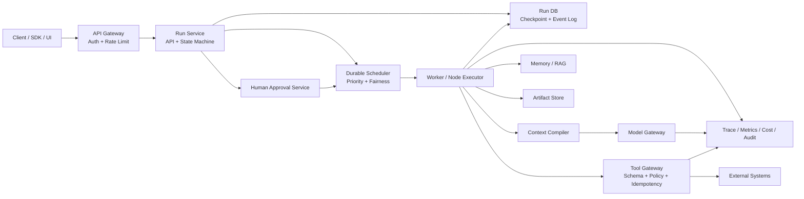
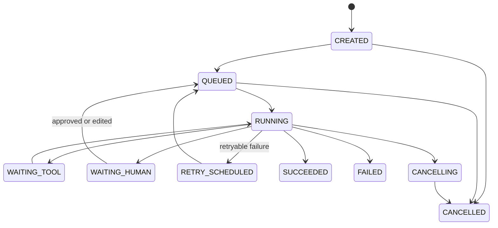
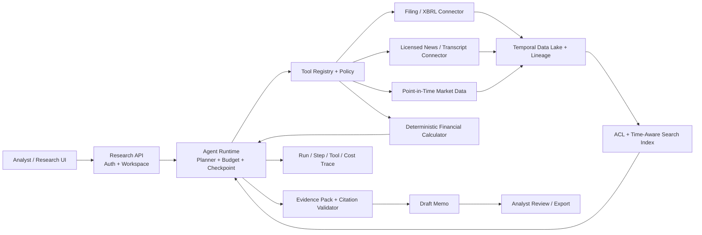
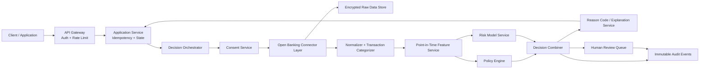

# 英文 Live Coding 与系统设计现场表达

> **用途边界：** Abound 的现有面试记录只明确预告了后续会有 `LeetCode-like coding round`，没有记录已经问过哪一道具体题。本文的 20 道练习来自现有中文题库，是备考脚本，不是真实面试复盘。
>
> **事实边界：** 三个项目统一视为公司内部项目，但项目职责、团队人数、投产状态、用户量、QPS、SLA、线上故障和精确收益必须以内部记录为准。本文的 Underwriting Decision Platform、金融投研 Agent 和 Agent Runtime 都是系统设计题答案，不代表本人或 Abound 已经实现这些系统。
>
> **使用方法：** 不要逐字背。先记住每段回答要完成的动作：确认题意、说明假设、给朴素解、提出优化、边写边讲、不变量、复杂度、测试和取舍。现场用自己的语速说短句，停顿比堆复杂词更自然。

## 1. 一套从拿题到收尾的现场话术

### 1.1 先确认题意，不要拿到题就沉默写

**可以直接说：**

> Let me make sure I understand the problem before I start coding. We are given **[input]**, and I need to return **[output]**. Is that right?
>
> A couple of quick questions. Can the input be empty? Can it contain duplicates? Am I allowed to modify the input in place? And do you want the indices, the values, or all valid solutions?
>
> Do we have a rough input-size limit? That will help me decide whether an O(n squared) solution is acceptable or whether I should aim for O(n log n) or O(n).

**中文使用说明：** 只问会改变解法的问题，不要机械地一次问十个。数组题重点问空值、重复、是否原地、返回下标还是值；API 题重点问一致性、幂等、超时和失败语义；并发题重点问线程数、阻塞还是拒绝、关闭协议。

### 1.2 条件没给全时，主动声明假设

**可以直接说：**

> Since that part is not specified, I'll make one explicit assumption: **[assumption]**. If you prefer a different contract, I can adjust the solution.
>
> For now, I'll assume the input fits in memory and the function is called in a single thread. I'll call out what changes in a concurrent or distributed setting afterward.

**中文使用说明：** 这不是逃避，而是在固定接口契约。说完假设后继续推进，不要等面试官替你设计所有细节。

### 1.3 先讲朴素解，再解释为什么要优化

**可以直接说：**

> The straightforward solution would be **[brute-force idea]**. It is easy to verify, but it takes O(**[complexity]**), which is probably too expensive for the input size.
>
> The repeated work is **[what is repeated]**. If I store **[state]**, I can avoid doing that work again and bring the time down to O(**[target]**).

**中文使用说明：** 朴素解通常两三句就够。重点是让面试官看到你知道优化从哪里来，而不是背出了一个技巧名。

### 1.4 提方案时先说不变量

**可以直接说：**

> The key invariant is this: before I process position `i`, **[state that must already be true]**. Every update I make will preserve that invariant.
>
> That invariant is what makes the one-pass solution correct. I'll keep referring to it while I code.

**中文使用说明：** 双指针说区间各代表什么；滑窗说窗口满足什么；链表说 `prev` 和 `current` 分别代表哪两段；堆说堆里始终保留什么；并发题说哪个组合状态必须原子变化。

### 1.5 边写边讲，但不要逐字符念代码

**可以直接说：**

> I'll start with the state I need. This map stores **[meaning]**, not **[easy-to-confuse meaning]**.
>
> Now I scan the input once. I check before I update the map because otherwise I could accidentally reuse the current element.
>
> I'm extracting this into a helper because the same pointer update happens in both `get` and `put`.

**中文使用说明：** 讲“为什么有这行”和“状态怎么变”，不要念 `for left parenthesis int i...`。安静超过十几秒时，可以说 `I'm just checking the pointer update here.`，让面试官知道你没断线。

### 1.6 写完主动 dry run

**可以直接说：**

> Let me dry-run it on the sample before I claim it is done.
>
> At this point, `left` is **[value]**, the map contains **[state]**, and the invariant still holds. The final result is **[result]**, which matches the expected output.

**中文使用说明：** 不要只跑题目给的正常样例。至少再跑一个能打中你最容易写错分支的例子。

### 1.7 主动覆盖边界

**可以直接说：**

> I also want to test an empty input, a single element, duplicate values, and the boundary where **[special condition]**.
>
> If the contract allows invalid input, I would either return **[value]** or raise **[error]**. I would confirm that API behavior with the caller rather than silently choosing one in production.

**中文使用说明：** 算法题通常覆盖空、单元素、重复、极值、无解；服务题还要覆盖重复请求、部分成功、超时后结果未知、进程重启和并发竞争。

### 1.8 报复杂度时说明口径

**可以直接说：**

> The time complexity is O(**[time]**) because **[each item is processed how many times]**. The extra space is O(**[space]**). I'm not counting the returned output itself as auxiliary space.
>
> Hash-map operations are O(1) on average, so the overall expected time is O(n). If you want a worst-case guarantee independent of hashing, I can discuss a sorting-based alternative.

**中文使用说明：** 要说 worst-case、average 还是 amortized；递归栈算空间；库函数排序、切片、字符串拼接也有成本。

### 1.9 卡住、发现 Bug 和自我纠错

**可以直接说：**

> I see a bug in my update order. If I insert first, I may match the element with itself. I'll switch those two lines and run the duplicate case again.
>
> Let me pause for a few seconds and restate the invariant. I think I'm mixing up **[two states]**.
>
> My first complexity claim was wrong because I forgot the sort. The scan is O(n), but the full solution is O(n log n). Thanks for catching that.

**中文使用说明：** 直接承认、定位、修正、重测。不要用 `I was just about to do that` 掩饰错误，也不要一边辩解一边继续写错。

### 1.10 被要求优化或讨论取舍

**可以直接说：**

> We can reduce **[time/space]**, but the trade-off is **[cost]**. Given the stated constraints, I would choose **[option]** because **[reason]**.
>
> If this were production code, I would prefer the standard-library implementation for correctness and maintainability. Since this is an interview, I'm happy to implement the core data structure to show how it works.
>
> The in-memory solution is enough for one process. A distributed version changes the consistency and failure model, so I would not claim that adding Redis alone solves it.

**中文使用说明：** “能继续优化”不等于“当前方案错了”。先确认优化目标是时间、空间、并发、安全还是可维护性，再给代价。

### 1.11 一段完整的开场模板

> Let me first restate the problem and confirm two edge cases. Then I'll give you a simple solution, explain the bottleneck, and move to the optimized one. While coding, I'll keep the main invariant explicit. Once the code is in place, I'll dry-run the sample, test the risky boundaries, and finish with time and space complexity.

这段不需要每次原样说。它真正要训练的是：让面试官始终知道你现在处于哪一步。

---

## 2. 被打断、没听懂、卡住和被要求优化时怎么接

### 2.1 面试官打断你

**面试官想换方向：**

> Sure, I'll stop there. Which part would you like me to focus on: the algorithm, correctness, or production trade-offs?

**面试官要你直接回答：**

> Got it. The short answer is **[answer]**. The reason is **[one reason]**. I can add the implementation detail if useful.

**你讲太宽了：**

> You're right, I went too broad. Coming back to your question, the key decision is **[decision]** because **[constraint]**.

**中文使用说明：** 立刻停，不要说 `Let me finish this point first.`。先给一句直接答案，再看面试官是否要展开。

### 2.2 没听清或没听懂

**没听清声音：**

> Sorry, the audio cut out for a second. Could you repeat the last part after **[last words heard]**?

**单词或缩写没听懂：**

> I may have missed the term. Did you say **[term A]** or **[term B]**?

**听到了但题意不确定：**

> Let me paraphrase to make sure I understood you. You're asking whether **[your understanding]**, rather than **[possible alternative]**. Is that correct?

**概念确实不知道：**

> I'm not familiar enough with that specific term to give you a reliable definition. If you can give me the contract or a short example, I can reason from it. I don't want to guess and build on the wrong premise.

**中文使用说明：** 不要连续说三遍 `Pardon?`。精确指出哪里丢了，面试官更容易补充。

### 2.3 思路卡住

> Let me take ten seconds and reduce it to the simplest version first.
>
> I don't have the optimized solution yet, but I can give you a correct O(n squared) solution, identify its repeated work, and improve from there.
>
> Let me restate the invariant. I know everything before `left` is already valid, and the unresolved part is **[part]**. That suggests I need **[state]**.
>
> I'm deciding between a heap and sorting. The input is streaming, so sorting the full data is not available; I'll go with a size-k heap.

**中文使用说明：** 卡住时把思考依据说出来。面试官能给提示，也能看到你不是随机试代码。

### 2.4 发现自己写了 Bug

> I found a bug here. I'm updating `current` before saving the next node, so I lose the rest of the list. I'll save `next` first and rerun the three-node case.
>
> This condition is off by one. My interval is half-open, so the loop should be `left < right`, not `left <= right`. I'll correct it and dry-run the one-element case.
>
> The algorithm is still valid, but this implementation is not. Let me fix the state update rather than changing the whole approach.

**中文使用说明：** 最好按“Bug 在哪、为什么、怎么修、用什么例子重测”四步说。发现 Bug 通常不是扣分点，掩盖 Bug 才是。

### 2.5 面试官指出 Bug

> You're right. With duplicate values, this line can reuse the current index. I should query before inserting. Let me fix that and test `[3, 3]`.
>
> Good catch. I missed the cancellation path. The future can complete after cancellation, so I need one atomic terminal-state check.

不要说：

> That's basically what I meant.

这会显得你在回避事实。直接接受并修正更专业。

### 2.6 面试官要求优化

> Which dimension would you like me to optimize: asymptotic time, memory, latency under concurrency, or production maintainability?
>
> To reduce time from O(n log n) to expected O(n), I can use quickselect. The trade-off is mutation and less predictable worst-case behavior. Given an in-memory array and a one-off query, that may be reasonable.
>
> To reduce memory, I can sort in place, but then I mutate the caller's input. I would only choose that if the API contract allows it.
>
> For higher throughput, I can add parallelism, but first I need to check whether the bottleneck is CPU, I/O, the downstream rate limit, or shared-state contention. Parallel calls do not improve a quota-bound dependency.

### 2.7 面试官给了提示

> That makes sense. If I use a prefix-sum frequency map, I can count all earlier prefixes equal to `currentSum - k`. Let me rebuild the invariant around that.
>
> I see the direction. Before I code it, let me confirm why it is correct: **[short correctness statement]**.

**中文使用说明：** 接受提示后要把提示转成自己的不变量，而不是只说 `Yes` 然后照抄。

### 2.8 忘了标准库 API

> I don't remember the exact method name, so I'll write it as `pushMinHeap` and keep the algorithm precise. In production I would check the standard-library API rather than guess.

> In Java, I believe `PriorityQueue` is a min-heap by default, but I don't want the comparator syntax to distract from the algorithm. I'll write the comparator contract explicitly.

**中文使用说明：** 现场忘 API 不致命。不要虚构函数名，也不要因为语法卡住而放弃算法表达。

### 2.9 测试没通过

> The output tells me the state becomes wrong at the second duplicate. I'll inspect the update order rather than patch the expected result.
>
> This test exposes a contract issue, not just a code issue: I never defined whether touching intervals overlap. I'll confirm that and align both the condition and the test.
>
> Let me reduce the failing input to the smallest case. If `[1, 1]` already fails, I can debug that before the larger sample.

### 2.10 系统设计被要求放大或缩小

**要求先讲高层：**

> Sure. At the highest level, there are four pieces: ingestion, durable orchestration, governed execution, and audit. I'll stay at that level first.

**要求深挖一个组件：**

> I'll zoom into the Tool Gateway. Its contract is schema validation, authorization, idempotency, execution, and result lineage. The tricky failure is a timeout with an unknown external outcome.

**时间快到了：**

> We have about five minutes left, so I'll close the loop on failure handling, security, and the main trade-off rather than add more components.

### 2.11 不同意面试官的假设时

> I see why that is attractive. My concern is **[specific failure]**. Under the current requirement, I would choose **[alternative]**. If **[condition]** changes, your option becomes the better trade-off.

> I may be missing one constraint. Are you assuming the external API provides an idempotency key? If it does, then I agree we can safely retry that write.

**中文使用说明：** 用事实条件讨论，不用 `You're wrong`，也不要无条件附和一个明显不成立的前提。

---

## 3. 不虚构项目事实的英文安全口径

### 3.1 先把四类内容分开

**当前实现：**

> What the current implementation does is **[verified mechanism]**.

**有边界的 Benchmark：**

> In the stored benchmark configuration, we observed **[result]**. I would not generalize that to production traffic or every task type.

**个人事实待核实：**

> The code and design documents show the system behavior, but they do not prove my exact ownership. I would map my role to the internal RACI before making a stronger claim.

**下一版设计：**

> That is not in the current implementation. If I were designing the next version, I would **[design]**.

**中文使用说明：** 这四句是整份英文材料最重要的边界。面试官追得越深，越要明确自己在讲哪一类。

### 3.2 被问“是不是你一个人做的”

> I don't want to turn technical ownership into a claim that I did every part alone. My verified responsibility was **[fill from internal records]**. **[role]** handled **[area]**, and I collaborated with **[role]** on **[boundary]**. I would confirm the exact team size rather than guess.

如果 RACI 还没补完：

> I can explain the architecture and the modules I worked with, but I need to verify the exact RACI before I claim end-to-end personal ownership.

不要直接背 `two or three people`、`I was the tech lead` 或 `a dedicated PM managed it`，除非内部记录能够证明。

### 3.3 被问线上规模、用户、QPS、SLA

> I don't have a verified number with me, so I won't make one up. What I can explain is the measurement definition and the capacity risk. I would confirm the traffic window, retry filtering, tenant scope, and dashboard before quoting QPS or P95.

> The implementation supports that integration shape, but support in code is not the same as verified production adoption.

### 3.4 被问投产和事故

> I can describe the failure mode visible in the implementation and how I would mitigate it. I cannot present it as a production incident unless I can verify the incident record, impact, timeline, and my role.

> This is a productionization design, not a claim that the full rollout already happened.

> The current status is **[verified status]**. If it was only a technical validation, I would call it a technical validation rather than stable production.

### 3.5 被问精确数字但记不清

> I remember the direction, but not the exact denominator and time window. I would rather check the report than give you a precise but unreliable number.

> The defensible number is from one recorded benchmark configuration. I can explain the baseline and metric, but I won't invent the sample count or confidence interval.

### 3.6 被问模型、部署和基础设施

> I won't infer the historical model version from what is popular today. The verified part is the model-call interface and selection criteria. I would confirm the actual provider and version from the internal configuration.

> The source shows an adapter or backend option. It does not prove that we deployed every supported backend in production.

> I can explain the deployment topology once I verify the actual environment, release owner, rollback path, and monitoring. I don't want to turn a local Docker option into a production claim.

### 3.7 把三个内部项目讲安全

**AI Weekly Report：**

> This is an in-house operations-assurance reporting system. Deterministic SQL and code produce the statistics, and the LLM interprets verified module results and generates the narrative. It is not a free-form Text-to-SQL chatbot. The earlier material contains a time-saving estimate, but I would confirm its source and my RACI before quoting it as a delivered business result.

**CodeWiki：**

> This is an in-house code-intelligence platform. The current implementation uses AST facts, code graphs, retrieval, source references, and validation to generate and answer against repository knowledge. Exact user adoption, daily queries, and my front-end versus back-end ownership need internal evidence.

**Agent Memory：**

> This is an in-house memory and context-governance system. Long-term memory and short-term tool-result offloading are separate pipelines. The stored benchmark results are configuration-specific. Multi-host adapters prove integration capability, not production adoption by multiple business teams.

### 3.8 当前实现与下一版怎么自然切换

> Today, the system uses **[current mechanism]**. Its limitation is **[verified limitation]**. The next version I would propose is **[design]**, mainly because **[trade-off]**.

> I want to separate what exists from what I would improve. The existing code provides **[current]**; strict **[governance feature]** is still a design requirement.

> I wouldn't call the current soft prompt a hard security gate. It reduces risk, but a production control needs deterministic validation and enforcement outside the model.

### 3.9 系统设计题不冒充项目经历

> I haven't built this exact underwriting platform, so I'll answer it as a system-design problem and connect it only to the parts I have actually worked with, such as orchestration, retrieval, memory, or audit-friendly state.

> I understand this may be relevant to your business, but I don't want to assume your internal architecture. I'll state my requirements and design from first principles.

> That is how I would design it. It is not a claim about your current system or my previous production deployment.

### 3.10 Abound Coding Round 的准确说法

> The screen call indicated that a later round would include a LeetCode-like coding exercise. I prepared common algorithm, concurrency, and API problems, but I wouldn't say Abound asked any specific problem unless it actually happened in that round.

这句话既能说明你有针对性准备，也不会把练习题写成真实面经。

### 3.11 保密问题怎么答

> I can explain the architecture, engineering trade-offs, and my verified responsibility, but I won't share confidential customer data, credentials, internal hostnames, or proprietary business rules.

> I can give a sanitized example with the same technical shape. The detail I'm withholding is business-sensitive; it doesn't change the engineering decision I'm explaining.

### 3.12 不知道时的高质量回答

> I haven't implemented that part myself, so I don't want to pretend I have. My current understanding is **[what you know]**. To make a production decision, I would verify **[evidence]** and compare **[options]**.

> I don't know the exact answer. I can reason through it from the contract if that is useful.

> I was involved at the interface boundary, but I was not the owner of that service. What I can explain accurately is **[boundary]**.

这不是示弱。十年面试官通常更在意你是否知道证据边界，而不是每题都硬答。

---

## 4. 上场前一分钟速查

### Live Coding 收尾

> Let me do a final check. The function matches the requested return type, the invariant holds, and I covered empty input, duplicates, and the risky boundary. Time is **[time]**, extra space is **[space]**. The main trade-off is **[trade-off]**.

检查自己是否已经说清：

1. 输入输出和假设。
2. 朴素解为什么慢。
3. 优化解维护什么状态。
4. 最关键的不变量。
5. 至少一个正常样例和一个反例。
6. 时间、空间以及 average / worst / amortized 口径。

### System Design 收尾

> To summarize, the design has **[three or four main components]**. The source of truth is **[state]**, failure recovery relies on **[mechanism]**, and high-risk actions are controlled by **[policy or approval]**. The most important trade-off is **[trade-off]**. Given more time, I would next quantify scale and deep-dive into **[component]**.

检查自己是否已经覆盖：

1. 谁在用、核心场景和明确不做什么。
2. API、数据模型和主流程。
3. 一致性、幂等、超时后结果未知。
4. 权限、隐私、Prompt Injection 和 Human-in-the-loop。
5. 扩展、背压、成本和可观测性。
6. 评估方法，而不是只报一个 LLM Judge 分数。
7. 当前实现、Benchmark、个人事实和设计方案没有混在一起。

最自然的英文面试表达不是“一个错误都没有”，而是每一步都让对方知道：我理解了什么、我假设了什么、我为什么这样选、我怎么证明它正确，以及哪些话我有证据、哪些只是设计。

---

## 5. System Design 1: Multi-Tenant Agent Runtime

> **场景声明：** 现有 Agent Memory 项目能支撑“记忆、检索、上下文卸载和宿主适配”的讨论，但下面这套完整 Runtime 是设计题。不要把设计中的 PostgreSQL、Redis、Kubernetes、全链路 Trace、审批中心或线上 SLO 说成当前项目已实现。

### 5.1 开场和澄清问题

**可以直接说：**

> I'll design this as a general Agent runtime, and I'll keep it separate from the features I can verify in my in-house memory project.
>
> What kinds of tasks do we need to run: short interactive requests, long background jobs, or both? Are tools read-only or can they change external systems? Do runs need human approval and resume-after-hours support? What are the tenant-isolation requirements, expected concurrency, maximum run duration, and latency target for interactive turns? Finally, do we need one Agent pattern or multiple patterns such as ReAct, plan-and-execute, and multi-agent workflows?

自己定边界时可以说：

> I'll support interactive and long-running workflows, graph-based control flow, typed tools, checkpoints, streaming events, human approval, and multi-tenant quotas. Delivery will be at least once internally, with idempotency at every side-effect boundary. I will not promise exactly-once execution across arbitrary external tools.

### 5.2 需求和设计原则

**可以直接说：**

> A client should be able to create a run, stream progress, pause, resume, cancel, inspect steps and artifacts, respond to an approval request, and retrieve the final result. A workflow author should be able to define nodes, conditional edges, retry policy, timeout, model policy, tools, context policy, and total budgets.
>
> The runtime must persist state before a worker disappears, isolate tenants, prevent unauthorized tool use, handle duplicate delivery, limit loops and cost, and preserve an evidence trail. For interactive work I care about time to first useful event. For long tasks I care about recoverability and fair scheduling.
>
> My main principle is that the LLM proposes; the runtime decides what is allowed and records what happened. Control flow, permissions, budgets, state transitions, and side-effect policy live in code, not in a prompt.

### 5.3 高层架构



**可以直接说：**

> The API gateway authenticates the caller and applies tenant quotas. The Run Service owns legal state transitions and the external API. It writes run records, checkpoints, and outbox events to a durable database.
>
> A scheduler assigns runnable nodes to workers using priority, tenant fairness, concurrency limits, and leases. Workers execute one graph node at a time. They call a Context Compiler, Model Gateway, Tool Gateway, Memory or RAG service, and Artifact Store through stable interfaces.
>
> Human approvals are durable states, not a worker thread waiting in memory. Observability receives a common run, step, model-call, tool-call, and artifact lineage.

### 5.4 外部 API 和运行数据模型

```text
POST /v1/runs
Idempotency-Key: <key>
{ workflowVersion, input, budget, callback? }
-> 202 { runId, status }

GET /v1/runs/{runId}
GET /v1/runs/{runId}/events?after=<cursor>     # SSE or polling
POST /v1/runs/{runId}/cancel
POST /v1/runs/{runId}/resume
POST /v1/approvals/{approvalId}/decisions
GET /v1/runs/{runId}/artifacts/{artifactId}
```

```text
Workflow(workflow_id, version, graph_spec, tool_policy, context_policy, created_by)
Run(run_id, tenant_id, workflow_version, status, current_nodes,
    input_hash, budget, budget_used, version, created_at, deadline)
Step(step_id, run_id, node_id, attempt, status, lease_owner, lease_until,
     input_ref, output_ref, error_class, started_at, ended_at, version)
Event(event_id, run_id, step_id, sequence, type, payload_ref, timestamp)
ToolCall(call_id, step_id, tool_version, args_hash, risk_level,
         idempotency_key, status, result_ref)
Approval(approval_id, run_id, step_id, action_digest, status,
         expires_at, decided_by, version)
Artifact(artifact_id, tenant_id, content_hash, media_type, location,
         encryption_key_ref, retention_policy)
```

> I use a monotonically increasing per-run event sequence so clients can reconnect without losing or duplicating visible progress. Large inputs and outputs live in the artifact store; database rows keep hashes, references, size, and authorization metadata.

### 5.5 工作流和状态机怎么讲



**可以直接说：**

> A workflow is a versioned directed graph. Node types can include planner, model, tool, deterministic function, router, validator, summarizer, human gate, and finalizer. Edges have explicit conditions based on typed state.
>
> I can implement ReAct and plan-and-execute as graph templates rather than separate engines. ReAct loops through model, action, tool, and observation. Plan-and-execute stores a plan, executes a step, validates it, and either continues or replans. Both reuse the same checkpointing, tool policy, budget, and event model.
>
> The Run Service performs state changes with optimistic version checks. A worker leases one step, writes `RUNNING`, performs bounded work, writes its output reference and next-node event, and commits before acknowledging the queue message. If it crashes, the lease expires and the step can be redelivered.

### 5.6 At-least-once、幂等和副作用

**可以直接说：**

> Queue delivery, worker execution, and external effects are different consistency boundaries. I accept at-least-once step delivery and make each step idempotent using `(run_id, node_id, logical_attempt)` or an explicit operation key.
>
> For a database-owned effect, I can combine state change and outbox in one transaction. For an external tool, I pass a stable idempotency key if the tool supports it. If it does not, I cannot honestly promise exactly once. I can use a prepare-and-confirm flow, query-before-retry, reconciliation, or human review depending on the risk.
>
> Tool execution has clear phases: validate arguments, authorize the action, calculate a canonical action digest, check approval, execute with timeout, persist the result or unknown outcome, and reconcile if necessary. A timeout does not always mean failure; the external system may have completed the action.
>
> A stale worker must not commit after its lease has been reassigned. Completion includes owner and fencing token or step version. If the conditional update affects zero rows, the worker discards its result or stores it only as an orphan artifact for investigation.

### 5.7 Context Compiler：不是简单拼字符串

**可以直接说：**

> I would build the prompt through a Context Compiler with a deterministic priority policy.
>
> First come system and tenant policy, then the current user request and confirmed constraints, then the typed workflow state. After that come selected memory and RAG evidence, recent tool observations, and summaries of older steps. Large tool outputs stay in the artifact store with stable references and compact summaries.
>
> Every segment has provenance, trust level, token estimate, freshness, and an inclusion priority. The compiler applies a total token budget and reserves space for model output. It never drops a tool request while keeping a dependent tool result, and it never treats retrieved text as instruction authority.
>
> If a model decides it needs an offloaded detail, it requests a reference through a read-only retrieval tool. That drill-down is logged and subject to the same tenant and artifact permissions. A task diagram or compact graph can help navigation, but it does not replace the current request, system policy, or full typed runtime state.

**预算示例口语：**

> I might reserve the context budget by policy rather than fixed percentages: mandatory policy and current request first, then workflow state, then evidence selected by marginal utility, and finally optional history. If mandatory content already exceeds the model limit, I fail with a visible context error or choose a larger approved model; I do not silently truncate instructions.

### 5.8 Model Gateway

**可以直接说：**

> The Model Gateway hides provider-specific APIs but does not pretend all models are identical. A request includes capability requirements such as tool calling, structured output, context size, region, data policy, latency class, and cost ceiling. Routing chooses only models that satisfy those constraints.
>
> The gateway applies provider credentials, timeouts, streaming normalization, retries for safe failures, rate limits, schema validation, prompt and model version tags, token accounting, and traces. A fallback model is allowed only if it meets the same data and capability policy. Falling back from structured output to free text without telling the runtime would break correctness.
>
> Prompt caching is an optimization. I keep stable prefixes stable, move dynamic memory later, and measure cache hit rate. I do not make correctness depend on a cache hit.

### 5.9 Tool Gateway 和 Human-in-the-loop

**可以直接说：**

> Each tool is registered with an immutable version, JSON schema, output contract, ownership, allowed tenants, data classification, network policy, timeout, retry class, idempotency behavior, and risk level.
>
> The model only proposes a typed call. The Tool Gateway validates schema, normalizes arguments, resolves the user's and service's permissions, applies row or resource-level scope, and rejects unknown fields. For network tools, outbound destinations are restricted. For file and code tools, paths and commands are sandboxed.
>
> High-risk actions create an approval record containing the exact canonical arguments, target, expected effect, and expiry. The user approves that digest, not a vague sentence. If arguments change after approval, the approval is invalid. The worker exits; after the decision, a new worker resumes from the durable checkpoint.
>
> Approval is necessary but not sufficient. Even an approved action still goes through authorization, idempotency, deadline, and audit checks.

### 5.10 多 Agent 怎么避免失控

**可以直接说：**

> I would not start with many agents by default. A deterministic workflow with one model is easier to observe and evaluate. I introduce specialized agents only when role separation or parallel search has measured value.
>
> A parent run owns the global deadline, token budget, tool budget, and concurrency budget. Child runs receive slices of that budget; they cannot create unlimited descendants. The scheduler limits fan-out and depth, deduplicates equivalent tasks, and can cancel siblings once enough evidence is collected.
>
> Agents communicate through typed artifacts and task results, not an unbounded chat transcript. A coordinator validates completion and conflicting outputs. There is a maximum step count, repeated-state detector, and no-progress stop rule to prevent loops.

### 5.11 调度、扩展和背压

**可以直接说：**

> I separate interactive and batch queues because a ten-minute research run should not block a user waiting for the next token. Within each class, I use tenant-weighted fair scheduling, per-tenant concurrency limits, provider quotas, and aging so low-priority work does not starve forever.
>
> Workers are stateless between steps and scale by node capability: model-heavy, tool-heavy, browser, code sandbox, or CPU-heavy workers can have different pools. Long operations should become asynchronous external jobs rather than holding a lease indefinitely.
>
> Backpressure starts at admission control. If queue delay or provider quota exceeds the policy, I reject, defer, or downgrade optional work with a visible reason. I do not keep accepting runs until memory or external APIs collapse.
>
> Partitioning by tenant improves isolation, but very large tenants can create hot partitions. I would hash within a tenant while keeping a fair scheduler above the partitions. State writes use run or step keys so unrelated runs do not contend on one row.

### 5.12 安全边界

**可以直接说：**

> I treat user input, retrieved documents, memory, tool output, and even tool descriptions as different trust domains. Only platform and approved workflow policy can provide instructions. Retrieved text is quoted evidence.
>
> Tenant ID comes from authenticated server context, never from a model-generated argument. Every database query, artifact read, memory retrieval, cache key, and event subscription carries that tenant scope. I add negative tests specifically for cross-tenant IDs and guessed artifact references.
>
> Secrets are injected into the Tool Gateway at execution time and never returned to the model. Logs use structured redaction. Artifact access uses short-lived scoped credentials. Data retention and deletion propagate through run rows, events, artifacts, caches, embeddings, and backups according to explicit policy and evidence.
>
> To reduce indirect prompt injection and data exfiltration, I separate read and write tools, restrict outbound domains, detect instructions in untrusted content, cap result size, require confirmation for data movement, and record source-to-sink lineage. No single classifier is a complete defense.

### 5.13 故障处理

**可以直接说：**

> If a worker dies, the lease expires and another worker resumes from the last committed checkpoint. If a model call times out before any response, a policy may retry. If a streamed response is partial, I either discard it or keep it as a non-authoritative artifact; I do not append it twice to state.
>
> If a tool outcome is unknown, the step enters `RECONCILE_REQUIRED` rather than blindly retrying. If the event stream is temporarily unavailable, the database remains the source of truth and outbox publication catches up later.
>
> If memory or RAG is unavailable, the workflow may continue without optional context only when the node policy says that is safe. The final answer records the degraded evidence coverage. If authorization or policy services are unavailable, sensitive tools fail closed.
>
> Cancellation is cooperative. The Run Service marks `CANCELLING`, stops scheduling new nodes, sends cancellation to active calls where supported, and waits for workers to acknowledge or leases to expire. Completed external side effects are not magically rolled back; compensation must be an explicit workflow node.

### 5.14 可观测性和评估

**可以直接说：**

> I use a hierarchy of `run -> step -> model call / tool call / retrieval / approval / artifact`. Every event carries tenant-safe IDs, workflow version, model and prompt version, latency, retry, token usage, cost, and outcome. Traces link the final claim back to evidence and tool results where applicable.
>
> Operational metrics include admission rejects, queue delay, active leases, lease expiry, step latency, model time to first token, tool timeout, retry, unknown outcomes, approval wait, loop termination, token and cost per successful run, and tenant fairness.
>
> Quality evaluation is workflow-specific. I use versioned tasks, deterministic assertions for tool and state behavior, evidence-grounded scoring for answers, adversarial security cases, and end-to-end success criteria. I compare candidate changes with paired runs and confidence intervals instead of promoting on one average judge score.
>
> Before rollout, I replay recorded inputs in shadow mode with side-effect tools replaced by simulators. During canary, I pin workflow and model versions, cap exposure, compare success, latency, cost, and safety, and keep an immediate rollback path.

### 5.15 Framework 选型和取舍

**可以直接说：**

> I would evaluate LangGraph or another proven workflow framework before building the graph engine from scratch. A framework can provide graph execution, checkpointing, interrupts, and streaming. I would still keep our tool policy, tenant boundary, artifact model, model gateway, budgets, and audit contracts outside framework-specific code.
>
> The decision depends on versioned evidence: required state semantics, persistence guarantees, migration support, observability hooks, operational maturity, and how much custom behavior we would need to patch. I would not claim a framework is production-ready for our case just because its demo runs.
>
> My preferred boundary is an internal `WorkflowRuntime` contract with an adapter to the selected engine. That reduces lock-in, but I would only add the abstraction after I know the real differences; a fake lowest-common-denominator interface can hide useful framework capabilities.

### 5.16 关键取舍和收尾

**可以直接说：**

> The first trade-off is flexibility versus control. Arbitrary agent loops are flexible, but versioned graphs with typed state are much easier to recover, audit, and budget. I allow controlled loops, not unrestricted ones.
>
> The second is checkpoint frequency versus overhead. I checkpoint at side-effect and decision boundaries, not after every local variable assignment. Long pure-compute nodes may add progress checkpoints.
>
> The third is autonomy versus safety. Read-only low-risk steps can run automatically. High-impact or ambiguous actions require approval or deterministic policy. The risk classification belongs to the tool and workflow contract, not the model's confidence.
>
> The design therefore gives me a durable graph state machine, at-least-once scheduling with idempotent boundaries, a governed Model and Tool Gateway, context compilation with recoverable artifacts, human approval, global budgets, and end-to-end traces. That is the minimum I would want before calling an Agent system a runtime rather than a prompt loop.

### 5.17 常见追问短答

**Why store both events and checkpoints?**

> Checkpoints make recovery fast; events explain how the state changed and support streaming and audit. I would not rebuild a very long run from the first event on every retry, and I would not keep only the latest snapshot because it loses causality.

**How do you handle a workflow definition update during a run?**

> A run is pinned to one immutable workflow version. I do not hot-swap its graph. Migration is an explicit, validated operation with state mapping, or the old version remains available until the run finishes.

**What if a tool returns ten megabytes?**

> The Tool Gateway writes the full result to the artifact store, returns a bounded typed summary plus reference, and records size and hash. The Context Compiler includes only the relevant excerpt. Drill-down is explicit and authorized.

---

## 6. System Design 2: Financial Research Agent

> **场景声明：** 这是金融投研 Agent 的假设系统设计，不是本人现有三个项目的已实现功能。涉及市场数据、研报和新闻时，数据授权与许可必须单独确认；涉及投资建议或交易时，要明确合规边界和 Human-in-the-loop。

### 6.1 开场和澄清问题

**可以直接说：**

> I'll treat this as a research-assistance system, not an autonomous trading system. First, who is the user: an internal analyst, an investment adviser, or a retail customer? Which markets and asset classes are in scope? What licensed sources can we use? Does the user need a quick answer, a full research memo, or reproducible calculations as of a historical date? And is the system allowed to recommend or execute a trade?

自己定边界时可以说：

> For the first version, I'll assume internal analysts researching listed US companies. The agent can search filings, structured fundamentals, licensed news, transcripts, and market data; compare companies; run approved calculations; and produce a cited memo. It cannot place trades, change a portfolio, or present generated text as regulated advice. Any downstream action requires an explicit human decision.

### 6.2 需求和真正的难点

**可以直接说：**

> The obvious requirement is question answering, but the hard requirement is point-in-time evidence. If an analyst asks, "What could I have known on March 31?", the system must not use a filing published in April, a later-restated XBRL fact, today's index constituents, or a price series adjusted with future corporate-action knowledge.
>
> Functionally, I need entity resolution, time-aware retrieval, structured financial calculations, multi-source evidence comparison, a cited research memo, saved workspaces, and reproducible runs. Non-functionally, I care about provenance, licensed-data enforcement, calculation correctness, prompt-injection resistance, cost control, and graceful degradation when a source is late or unavailable.

### 6.3 高层架构



**可以直接说：**

> I would divide it into four layers.
>
> The first is a governed data layer. Source-specific connectors ingest filings, XBRL facts, transcripts, licensed news, prices, exchange calendars, and corporate actions into a temporal store. Every record has event time, publish time, ingestion time, source, license, revision, and content hash.
>
> The second is a retrieval and calculation layer. Search is filtered by user entitlement, entity, document type, and `available_at <= research_as_of`. Deterministic tools handle ratios, growth, currency conversion, period alignment, and price calculations.
>
> The third is an Agent runtime. A planner turns the research question into bounded steps, calls only approved tools, checkpoints progress, tracks token and tool budgets, and stores evidence references rather than copying every full document into the prompt.
>
> The fourth is an answer-governance layer. It builds an evidence pack, validates every material claim and citation, flags conflicts and missing coverage, and leaves the memo as a draft for the analyst.

### 6.4 时间数据模型和 point-in-time 正确性

```text
SourceDocument(document_id, issuer_id, source_type, source_url, filing_type,
               event_time, published_at, ingested_at, revision_id,
               license_policy, content_hash)

XbrlFact(fact_id, issuer_id, taxonomy, concept, value, unit,
         period_type, period_start, period_end, context_id,
         dimensions_hash, dimensions_json, decimals, scale,
         filed_at, accepted_at, accession_id, revision_id)

MarketObservation(instrument_id, venue, observed_at, available_at,
                  raw_price, currency, vendor_version)

CorporateAction(instrument_id, action_type, ex_date, announced_at,
                available_at, factor, source)

ResearchRun(run_id, user_id, workspace_id, question, as_of_time,
            source_snapshot_id, agent_version, prompt_version, status)

EvidenceClaim(claim_id, run_id, text, source_span_ids,
              calculation_id, support_status, confidence_label)
```

**可以直接说：**

> I keep at least three time concepts separate: when the business event happened, when the source published it, and when our system received it. Historical research filters on when the information was actually available, not only the accounting period end.
>
> For XBRL, the same concept can be restated, use different units, or appear in consolidated, segment, or regional contexts for the same period. My fact identity therefore includes issuer, taxonomy, concept, period type and bounds, unit, normalized dimensions or context, filing accession, and revision. I also retain decimals and scale as reported metadata instead of flattening everything into one latest number.
>
> For prices, I retain raw observations and corporate actions separately. A split-adjusted series is a derived view tied to an adjustment version. That prevents future corporate actions from silently changing what an old research run saw.
>
> I also need historical security-master and index-membership data. Otherwise a backtest can include only companies that survived until today, creating survivorship bias.

### 6.5 端到端研究流程

**可以直接说：**

> Suppose the analyst asks, "As of the last quarter end, compare the cash-flow quality of Company A and Company B and identify the main risks."
>
> The API creates a `ResearchRun` with an explicit `as_of_time`, requested universe, source entitlements, and budget. The entity resolver maps names and tickers to stable issuer and instrument IDs and asks for clarification if the ticker is ambiguous across markets.
>
> The planner creates a small plan: define the comparison, retrieve relevant filings and facts, calculate comparable metrics, search management commentary and risk disclosures, check contradicting recent evidence, and draft a cited conclusion. The plan is data, so it can be checkpointed and adjusted; it is not hidden chain-of-thought that I depend on for audit.
>
> Retrieval first applies authorization and time filters, then combines exact identifiers, full-text search, embeddings, and graph relationships. Each result carries a source span, publication time, revision, and license. Full documents remain in the artifact store; the prompt receives bounded excerpts and references.
>
> Deterministic calculators align fiscal periods and units before computing ratios. The LLM is allowed to select a documented formula and explain a result, but it does not do silent arithmetic in prose. Every numeric claim links to inputs, formula version, and calculation output.
>
> The agent then creates an evidence pack. For each proposed material claim, it records supporting spans, contradicting spans, calculation IDs, freshness, and unresolved gaps. The memo generator can only use this pack. A validator checks that citations exist, the cited text supports the claim, numbers match calculations, and all evidence was available by the requested date.
>
> Finally, the analyst sees a draft with clear distinction between facts, calculations, management statements, third-party reports, and the agent's synthesis. The analyst can inspect original evidence, correct entity or period choices, and approve export.

### 6.6 多源冲突怎么回答

**可以直接说：**

> I do not ask the LLM to collapse conflicting sources into one confident sentence. I represent the conflict.
>
> First, I normalize whether the sources are actually talking about the same metric, entity, period, currency, and accounting definition. Many apparent conflicts are schema mismatches.
>
> Second, I rank source authority for the specific claim: an accepted regulatory filing may be primary evidence for reported financials, while a later company correction can supersede an earlier release. News can be valuable for events, but it should not overwrite a filed number without an explicit reason.
>
> Third, I keep both `published_at` and revision lineage. For an as-of answer, a later correction is excluded even if it is more accurate today. For a current answer, I show the correction and note what changed.
>
> If the conflict remains unresolved, the memo says exactly that and routes the claim for analyst review. Uncertainty is an output state, not an excuse to invent a tie-breaker.

### 6.7 工具安全和 Prompt Injection

**可以直接说：**

> Every external document is untrusted data. A filing, web page, or transcript may contain text such as "ignore previous instructions". The model sees it inside a clearly delimited evidence channel, never as system instructions.
>
> The tool registry defines a typed schema, allowed users, allowed data domains, read versus write capability, timeout, result-size limit, and audit policy. Tool arguments are generated by the model but validated and authorized by code. URLs are resolved through allowlists and network egress controls to reduce SSRF and data exfiltration.
>
> The research agent starts read-only. It cannot email a memo, place a trade, modify a watchlist, or publish externally without a separate user-confirmed action. Secrets never enter prompts or tool results. Retrieved content is scanned, normalized, and kept separate from instructions.
>
> I would also defend against tool supply-chain changes. A tool manifest and permissions are pinned by version; a new description or broader scope requires review instead of becoming trusted automatically at runtime.

### 6.8 计算、回测和偏差控制

**可以直接说：**

> For financial calculations, reproducibility matters more than letting the model be creative. Formulas live in versioned code, with units, sign conventions, period alignment, missing-value rules, and test fixtures. The answer includes the formula and source inputs when the number is material.
>
> If we add backtesting, I would build it as a separate deterministic engine. It must use point-in-time constituents, delisted securities, the actual publication delay of fundamentals, historical calendars and time zones, corporate actions, transaction costs, and data revisions. Otherwise we get look-ahead, survivorship, and selection bias.
>
> I would not evaluate a strategy on the same examples used to tune the prompt or choose the universe. Train, validation, and holdout periods should be time-separated, and repeated strategy selection needs multiple-testing awareness. A pretty historical curve is not evidence of future performance.

### 6.9 可靠性、成本和扩展性

**可以直接说：**

> Research runs are asynchronous and durable. The runtime checkpoints after each tool result and evidence-pack update. A step has a stable idempotency key, so a worker restart does not repeat an expensive data purchase or create duplicate artifacts.
>
> Connectors have separate queues, rate limits, circuit breakers, and freshness SLOs. If one news vendor is down, the system can continue with a visible coverage warning. If primary filing evidence is unavailable, it should not silently substitute an uncited summary for a high-confidence conclusion.
>
> I control cost at the run, step, model, and tool levels. Cheap deterministic filters run before semantic search; retrieval has per-source and total token budgets; large results are offloaded to artifacts; repeated source parsing is cached by content hash; and the planner has maximum steps and a stop condition. Parallel calls are limited so "faster" does not become a rate-limit or budget incident.
>
> Stateless APIs and workers scale horizontally. The temporal corpus is partitioned by source and time, while the search layer shards by entity or document ID according to workload. Hot documents and parsed filing structures can be cached, but authorization, version, and as-of filters remain part of the cache key.

### 6.10 如何评估，不只看 LLM Judge

**可以直接说：**

> I would evaluate the system in layers.
>
> Data evaluation checks entity resolution, XBRL period and unit alignment, publication-time filters, revision handling, and corporate actions.
>
> Retrieval evaluation checks relevant-evidence recall, citation precision, ACL leakage, temporal leakage, and source diversity.
>
> Calculation evaluation uses deterministic expected outputs and tolerance rules.
>
> Answer evaluation checks claim support, citation correctness, numeric consistency, completeness, uncertainty calibration, and analyst usefulness. An LLM judge can help triage, but I would calibrate it against human-labeled cases, hide candidate identity, guard against candidate-text injection, and report agreement and confidence rather than treat one judge score as truth.
>
> End-to-end evaluation uses frozen point-in-time cases. I would include adversarial documents, conflicting sources, ambiguous tickers, restatements, missing data, and questions whose correct answer is "we do not have enough evidence."

### 6.11 关键取舍和收尾

**可以直接说：**

> The first trade-off is freshness versus reproducibility. I solve it by pinning every run to a source snapshot while allowing the analyst to start a newer run explicitly.
>
> The second is broad autonomous search versus cost and safety. I prefer a bounded plan with approved tools, explicit stopping conditions, and visible gaps over an agent that searches indefinitely.
>
> The third is fluent synthesis versus evidence fidelity. I would rather return a shorter memo with inspectable claims than a polished report whose numbers cannot be reproduced.
>
> So my design is not just "RAG over financial documents." It is a time-aware, entitlement-aware research workflow where every important claim can be traced to the exact source or deterministic calculation available at that point in time, and a human remains accountable for the investment decision.

### 6.12 常见追问短答

**Why use both structured XBRL and document retrieval?**

> Structured facts are better for reproducible calculations, while filings contain definitions, footnotes, risk language, and management context. I need both, joined through issuer, filing, period, and source lineage.

**What if the latest filing restates the previous year?**

> For a current answer, I use the latest valid revision and disclose the restatement. For a historical as-of answer, I use only the revision available then. I never silently rewrite an old run.

**Would you store analyst conversations as memory?**

> Only under an explicit purpose and retention policy. Durable preferences and approved workspace facts can be separate from transient hypotheses. Retrieved memory is untrusted context, access-controlled by workspace, and never allowed to override current instructions or market evidence.

---

## 7. System Design 3: Underwriting Decision Platform

> **场景声明：** 这是针对 Open Banking 信贷业务的假设设计。它不声称 Abound 当前架构如此，也不声称本人做过该系统。面试中先说 `I'll treat this as a design exercise.`，能主动切断“项目经历”和“设计能力”的混淆。

### 7.1 开场和澄清问题

**可以直接说：**

> I'll treat this as a design exercise rather than something I have already built. Before drawing components, I'd like to pin down the decision contract and the regulatory boundary.
>
> Are we making a real-time eligibility decision, a full credit decision, or only preparing a case for a human underwriter? Which country are we serving? What Open Banking data can we access under the customer's consent, and how long is that consent valid? What are the expected peak application rate and latency target? Finally, do we need to support approve, decline, and refer-to-human outcomes, with replayable reason codes?

如果面试官让你自己定，可以继续：

> I'll assume one market for the first version, a few hundred thousand applications per day rather than guessing an exact company number, and a target of returning an initial decision within a few seconds when upstream bank data is available. The system will return `APPROVE`, `DECLINE`, `REFER`, or `NEED_MORE_DATA`. Every decision must be reproducible from a point-in-time feature snapshot, policy version, and model version.

### 7.2 先说需求边界

**Functional requirements：**

> The platform should accept an application with an idempotency key, verify consent, fetch permitted account and transaction data, normalize that data, compute affordability and risk features, run policy and model evaluation, return a decision with machine-readable reason codes, route uncertain cases to human review, and preserve a complete audit trail. It must also support consent revocation, data deletion or restriction where legally required, model rollback, and historical decision replay.

**Non-functional requirements：**

> My priorities are correctness, privacy, auditability, and availability before raw throughput. A wrong or unexplained credit decision is more serious than a slightly slower response. I also want strict tenant and customer isolation, encrypted sensitive data, point-in-time feature correctness, graceful handling of upstream bank outages, and observable drift and fairness metrics.

**明确不做什么：**

> I would not let an LLM make the final lending decision. An LLM may help extract information from unstructured documents, summarize a case for a reviewer, or explain an already-computed reason in plain language. The authoritative outcome must come from versioned policy, approved statistical or machine-learning models, and human-review rules. Any generated explanation must be grounded in stable reason codes, not invented after the fact.

### 7.3 高层架构现场讲法



**可以直接说：**

> I would separate the platform into five planes.
>
> First is the application plane: API gateway, authentication, idempotent application creation, and a state machine.
>
> Second is the data plane: consent management, provider-specific Open Banking connectors, raw encrypted evidence, normalization, transaction categorization, and data-quality checks.
>
> Third is the decision plane: a point-in-time feature service, a deterministic policy engine, a versioned model service, and a decision combiner.
>
> Fourth is the review and explanation plane: stable reason codes, a human-review queue, reviewer evidence, and final disposition.
>
> Fifth is the governance plane: model registry, policy versions, feature lineage, audit events, monitoring, deletion workflows, and access control.

### 7.4 核心 API 和数据模型

**API 现场表达：**

```text
POST /v1/applications
Idempotency-Key: <client-generated-key>
-> 202 { applicationId, status }

POST /v1/applications/{id}/consents
-> records provider, scope, expiry, and proof

POST /v1/applications/{id}/decisions
-> starts or returns the same decision run

GET /v1/applications/{id}/decision
-> { status, outcome, reasonCodes, nextAction, decisionVersion }

POST /v1/reviews/{id}/resolve
-> reviewer decision with optimistic version
```

> I use asynchronous `202` semantics because bank aggregation may take longer than one HTTP request. A status endpoint or event callback keeps the client contract stable. Both application creation and decision start need idempotency keys because a client may retry after an unknown timeout.

**核心记录：**

```text
Application(application_id, customer_id, tenant_id, state, request_hash, created_at)
Consent(consent_id, subject_id, provider, scopes, granted_at, expires_at, revoked_at)
SourceSnapshot(snapshot_id, application_id, as_of_time, provider_versions, content_hash)
FeatureSnapshot(feature_set_id, application_id, as_of_time, feature_schema_version,
                values_hash, lineage_manifest)
DecisionRun(run_id, application_id, policy_version, model_version, feature_set_id,
            outcome, reason_codes, confidence_band, status, created_at)
Review(review_id, run_id, assigned_to, disposition, reason, version)
AuditEvent(event_id, subject_type, subject_id, actor, action, timestamp, payload_hash)
```

> The important join is not just `application -> decision`. It is `decision -> exact source snapshot -> exact feature snapshot -> exact policy and model versions`. That is what lets me replay a historical decision without accidentally using today's corrected transactions or latest model.

### 7.5 一次决策的端到端流程

**可以直接说：**

> Let me walk through one application.
>
> The client creates an application with a tenant-scoped idempotency key. The application service writes the application and an outbox event in one transaction. The orchestrator checks that consent exists, covers the requested data, and has not expired or been revoked.
>
> The connector layer fetches data from the selected Open Banking provider. Provider payloads are encrypted and stored as evidence with request IDs, consent scope, fetch time, and hashes. A normalizer converts provider-specific accounts, balances, and transactions into a canonical schema. Data-quality checks detect missing date ranges, duplicates, currency mismatch, stale balances, and unexplained gaps.
>
> The feature service computes a point-in-time snapshot. Examples might include verified income regularity, essential expenditure, debt-service signals, cash-flow volatility, and data coverage. Those are design examples, not a claim about a specific lender's features. Features must be computed only from information available at the decision timestamp.
>
> The policy engine applies hard eligibility and compliance rules. The model service returns a versioned risk output. The decision combiner maps policy results, model band, uncertainty, and data quality into `APPROVE`, `DECLINE`, `REFER`, or `NEED_MORE_DATA`. It writes the decision and audit event atomically, then publishes the result through an outbox.
>
> If the result is `REFER`, the reviewer sees the evidence and stable reason codes, not hidden model reasoning. The review decision uses optimistic locking so two reviewers cannot silently overwrite each other.

### 7.6 一致性、幂等和失败处理

**可以直接说：**

> I would model the workflow as a durable state machine: `CREATED -> CONSENT_VALIDATED -> DATA_READY -> FEATURES_READY -> DECIDED`, with explicit `NEED_MORE_DATA`, `REFERRED`, `FAILED_RETRYABLE`, and `FAILED_FINAL` branches.
>
> I do not need a distributed transaction across the bank provider, model service, database, and event bus. I need local transactions plus idempotent steps and an outbox. Every step uses a stable run ID and input hash. Replaying a step with the same input returns the same stored result; a different input creates a new version rather than mutating old evidence.
>
> If a bank API times out, the outcome may be unknown. I query the provider by request ID where possible, retry only safe calls with jitter, and move the application to `NEED_MORE_DATA` or a delayed retry queue. I do not turn missing data into zero income or an automatic decline.
>
> If the model service is unavailable, fail-open versus fail-closed is a business and risk decision. My conservative default for a lending decision is not to approve from stale or absent risk output; I would route to human review or ask the customer to retry. A previously approved model version may be an allowed fallback only if governance explicitly approves it.
>
> If policy and model versions change while a run is in progress, that run stays pinned to the versions recorded at start. A new evaluation is a new `DecisionRun`, which preserves auditability.

### 7.7 隐私、安全、公平与可解释性

**可以直接说：**

> Consent is a first-class record, not a checkbox. Every data fetch is checked against subject, provider, scope, purpose, expiry, and revocation. I collect only the fields needed for the documented purpose, encrypt data in transit and at rest, separate encryption keys from data, redact sensitive fields from logs, and apply least-privilege access with auditable break-glass procedures.
>
> Revocation stops future collection immediately. Whether already-collected data must be deleted, restricted, or retained for a legal obligation depends on jurisdiction and record type, so I would encode that as a reviewed retention policy rather than promise immediate deletion of every copy.
>
> For model risk, I version training data, features, model artifacts, thresholds, and approvals. Protected attributes should not become decision features just because they improve an offline score. I would check proxy features, subgroup error rates, calibration, approval and referral rates, drift, and manual overrides. The exact fairness metric and acceptable threshold must be set with legal, risk, and product stakeholders; engineering should not invent it alone.
>
> A decline or referral carries stable, testable reason codes produced by the policy and model pipeline. If an LLM turns those codes into customer-friendly text, the output is templated or constrained, checked against the codes, and never allowed to add a new reason.

### 7.8 扩展性和可观测性

**可以直接说：**

> The API and orchestration services are stateless and can scale horizontally. Connector workers are isolated by provider because each provider has different quotas and failure behavior. Queues are partitioned by tenant or application ID, with fair scheduling so one provider outage or one large tenant does not starve the rest.
>
> The online feature path uses precomputed normalization where possible, but I will not serve a cached feature snapshot without checking its `as_of_time`, consent, source version, and schema version. The model service keeps immutable versions and supports shadow evaluation before rollout.
>
> I monitor the full decision funnel: application-to-decision latency, provider fetch success and freshness, data-quality rejection, policy outcomes, model latency and error, referral and manual-override rate, reason-code distribution, decision replay mismatch, feature and prediction drift, subgroup metrics, consent failures, and audit-log gaps. Business approval rate alone is not a model-quality metric.

### 7.9 关键取舍和收尾

**可以直接说：**

> The main trade-off is synchronous speed versus evidence completeness. Waiting for every provider improves completeness but hurts conversion and latency; deciding too early can be unfair or unsafe. I would make data-quality thresholds explicit and use `NEED_MORE_DATA` instead of hiding uncertainty.
>
> The second trade-off is model sophistication versus explainability and operational control. I would start with a simpler, well-calibrated and versioned model plus deterministic policy before adding complexity that the team cannot replay or govern.
>
> The third trade-off is automation versus human review. Human review is expensive, but it is the right fallback for low-confidence, conflicting, or high-impact cases. I would use observed review outcomes to improve policy and evaluation, while controlling label leakage and reviewer bias.
>
> So the design centers on one principle: every decision is consent-bound, point-in-time correct, versioned, explainable, replayable, and safe under partial failure. The LLM can assist around the decision, but it is not the decision authority.

### 7.10 常见追问短答

**Why not call the model directly from the application service?**

> Because model calls need version pinning, timeouts, schema validation, observability, rollout, and rollback. A model service creates that control boundary and keeps the application contract independent of one model artifact.

**How do you backfill a corrected transaction category?**

> I do not mutate an old decision's feature snapshot. I create a corrected source or normalization version, recompute a new feature snapshot, and run a new evaluation. The old run remains replayable as it happened at that time.

**Can an LLM summarize bank transactions?**

> It can help a reviewer understand already-authorized evidence, but I would not let free-form generated categories silently feed a lending decision. Decision features need a versioned, evaluated categorization path with deterministic outputs or tightly controlled models.

---

## 8. 二十道完整英文现场回答

> 题目编号映射到[中文算法题库](../08-算法与现场编码/算法与现场编码高频题.md)。以下全部是练习题，不表示 Abound 已经问过这些原题。伪代码采用接近 Python 的写法；若现场指定 Java，我会保留算法不变，并补充数值溢出、比较器、泛型和线程安全细节。

### LC01. Two Sum（中文题库 Q006）

**Clarification：**

> Let me confirm the contract. I need to return the indices of two different elements whose sum is the target. Can I assume exactly one solution exists? And if there are multiple solutions, is any valid pair acceptable?

**Approach：**

> The brute-force solution checks every pair, so it takes O(n squared). The repeated work is searching for the complement. I can replace that search with a hash map. While scanning `x`, I look for `target - x` among earlier elements. I check first and insert second, so I never reuse the current element.

**Code narration / pseudocode：**

```python
def two_sum(nums, target):
    seen = {}                 # value -> earliest index already processed
    for i, x in enumerate(nums):
        need = target - x
        if need in seen:
            return [seen[need], i]
        seen.setdefault(x, i)
    return []                 # only if the contract allows no solution
```

> The invariant is that `seen` only contains positions before `i`. That's why `[3, 3]` with target `6` works, but the first `3` cannot match itself.

**Complexity：**

> Expected time is O(n), with O(n) extra space. That assumes average O(1) hash lookup.

**Test：**

> I'll test `[2, 7, 11, 15]`, target `9`, which returns `[0, 1]`. Then `[3, 3]`, target `6`, to verify duplicate handling. I would also test an empty input and no solution if the contract allows them.

### LC02. Subarray Sum Equals K（中文题库 Q009）

**Clarification：**

> Are we counting all contiguous subarrays, not subsequences? Can values be negative? That matters because a standard shrinking window is not valid when negative values are allowed.

**Approach：**

> A nested-loop solution enumerates every start and end, which is O(n squared). I'll use prefix sums. If the current prefix sum is `sum`, then every earlier prefix equal to `sum - k` forms a valid subarray ending here. I need frequencies, not just one index, because the same prefix sum may occur more than once.

**Code narration / pseudocode：**

```python
def subarray_sum(nums, k):
    freq = {0: 1}
    total = 0
    answer = 0
    for x in nums:
        total += x
        answer += freq.get(total - k, 0)
        freq[total] = freq.get(total, 0) + 1
    return answer
```

> `freq[0] = 1` represents the empty prefix, so a valid subarray starting at index zero is counted. I count matches before adding the current prefix, which keeps the prefix ordering correct.

**Complexity：**

> Expected time is O(n), and extra space is O(n).

**Test：**

> For `[1, 1, 1]` and `k = 2`, the answer is `2`. I also want `[1, -1, 0]` with `k = 0`; it checks negative values, repeated prefix sums, and a zero-length-looking trap without actually counting an empty subarray.

### LC03. Merge Intervals（中文题库 Q012）

**Clarification：**

> Are intervals closed, so `[1, 4]` and `[4, 5]` overlap? May I sort or modify the input? I'll assume closed intervals and that returning a new list is fine.

**Approach：**

> Without sorting, deciding which intervals can be merged is awkward. I'll sort by start time. After that, the last interval in the output is the only one the next interval can overlap with.

**Code narration / pseudocode：**

```python
def merge(intervals):
    if not intervals:
        return []
    intervals.sort(key=lambda item: item[0])
    out = [intervals[0][:]]
    for start, end in intervals[1:]:
        last = out[-1]
        if start <= last[1]:
            last[1] = max(last[1], end)
        else:
            out.append([start, end])
    return out
```

> The invariant is that `out` is already sorted, fully merged, and non-overlapping for everything processed so far.

**Complexity：**

> Sorting dominates at O(n log n); the scan is O(n). The output can take O(n) space. If sorting the input is allowed, auxiliary sorting space depends on the language implementation.

**Test：**

> I'll run `[[1,3],[2,6],[8,10],[15,18]]`, which becomes `[[1,6],[8,10],[15,18]]`. Then I'll test `[[1,4],[4,5]]`, an empty list, and one interval fully contained in another.

### LC04. Longest Substring Without Repeating Characters（中文题库 Q018）

**Clarification：**

> Should I treat the input as ASCII characters, Unicode code points, or language-level characters? For this interview solution, I'll use the language's character iteration and return the maximum length.

**Approach：**

> I'll maintain a sliding window with no duplicate characters. The map stores each character's latest index. When I see a repeated character inside the current window, I move `left` to one position after its previous index. The `max` is important because `left` must never move backward.

**Code narration / pseudocode：**

```python
def longest_unique(s):
    last = {}
    left = 0
    best = 0
    for right, ch in enumerate(s):
        if ch in last:
            left = max(left, last[ch] + 1)
        last[ch] = right
        best = max(best, right - left + 1)
    return best
```

> The invariant is that the current window from `left` through `right` contains no duplicate character.

**Complexity：**

> Each index is processed a constant number of times, so time is O(n). Space is O(min(n, alphabet size)).

**Test：**

> `abcabcbb` gives `3`. I also use `abba`, because forgetting `max(left, ...)` would incorrectly move `left` backward. Empty string and all-identical characters cover the other boundaries.

### LC05. Reverse a Singly Linked List（中文题库 Q023）

**Clarification：**

> May I reverse the list in place? I'll assume yes and return the new head. Is a null head valid? I'll treat it as an empty list and return null.

**Approach：**

> I only need three references: the already reversed prefix, the current node, and the untouched suffix. Before changing `current.next`, I must save the next node or I lose the rest of the list.

**Code narration / pseudocode：**

```python
def reverse(head):
    prev = None
    current = head
    while current is not None:
        nxt = current.next
        current.next = prev
        prev = current
        current = nxt
    return prev
```

> The invariant is that `prev` is the correctly reversed prefix and `current` is the first node of the untouched suffix. At the end, the suffix is empty, so `prev` is the new head.

**Complexity：**

> Time is O(n), and extra space is O(1).

**Test：**

> I'll dry-run `1 -> 2 -> 3`; after the first iteration, I have `1 -> null` and `current` points to `2`. I also test null, one node, and two nodes to catch a lost-tail or self-cycle bug.

### LC06. Valid Parentheses（中文题库 Q031）

**Clarification：**

> Does the string contain only the three bracket types, or should I ignore other characters? I'll assume it contains only brackets and an empty string is valid.

**Approach：**

> A stack matches the nesting structure. I push opening brackets. For a closing bracket, the stack must be non-empty and its top must be the corresponding opening bracket. At the end, no opening bracket may remain.

**Code narration / pseudocode：**

```python
def is_valid(s):
    expected_open = {')': '(', ']': '[', '}': '{'}
    stack = []
    for ch in s:
        if ch not in expected_open:
            stack.append(ch)
            continue
        if not stack or stack[-1] != expected_open[ch]:
            return False
        stack.pop()
    return not stack
```

> I check `not stack` before reading the top, so a closing bracket at the beginning fails safely. `return not stack` also catches unmatched openings.

**Complexity：**

> Time is O(n), and worst-case stack space is O(n).

**Test：**

> I'll test `()[]{}` as valid, `(]` as the wrong type, `([)]` as wrong nesting, and `((` as leftover openings. I would also confirm how non-bracket characters should be handled if they are allowed.

### LC07. Binary Tree Level-Order Traversal（中文题库 Q039）

**Clarification：**

> I need one list per depth, correct? I'll assume a null root returns an empty list, and node values do not affect traversal order.

**Approach：**

> This is breadth-first search. At the start of each outer iteration, the queue contains exactly one level. I capture its current length, pop exactly that many nodes, and append their children for the next level.

**Code narration / pseudocode：**

```python
from collections import deque

def level_order(root):
    if root is None:
        return []
    queue = deque([root])
    result = []
    while queue:
        level = []
        level_size = len(queue)
        for _ in range(level_size):
            node = queue.popleft()
            level.append(node.val)
            if node.left:
                queue.append(node.left)
            if node.right:
                queue.append(node.right)
        result.append(level)
    return result
```

> Capturing `level_size` before the loop is the key. If I loop over the changing queue length, I mix the next level into the current one.

**Complexity：**

> Every node is enqueued and dequeued once, so time is O(n). Queue space is O(w), where `w` is the maximum tree width; the returned output is O(n).

**Test：**

> A root `3` with children `9` and `20`, and `20` with children `15` and `7`, should produce `[[3], [9,20], [15,7]]`. I also test null, one node, and a skewed tree.

### LC08. Validate Binary Search Tree（中文题库 Q043）

**Clarification：**

> Are duplicate values allowed in the BST? I'll assume the standard strict rule: every value in the left subtree is smaller and every value in the right subtree is larger.

**Approach：**

> Comparing a node only with its parent is not enough, because a descendant can violate an ancestor's boundary. I'll carry an allowed open interval down the tree. A left child inherits the lower bound and gets the current value as its upper bound; a right child does the opposite.

**Code narration / pseudocode：**

```python
def is_valid_bst(root):
    def check(node, low, high):
        if node is None:
            return True
        if not (low < node.val < high):
            return False
        return (check(node.left, low, node.val)
                and check(node.right, node.val, high))

    return check(root, float('-inf'), float('inf'))
```

> In a fixed-width integer language, I would avoid `value - 1` and `value + 1`, because they can overflow. I would use nullable bounds or a wider type.

**Complexity：**

> Time is O(n). Recursion space is O(h), where `h` is tree height, so worst case O(n) and balanced case O(log n).

**Test：**

> I use `[5,1,4,null,null,3,6]` because `3` is smaller than ancestor `5` even though it is smaller than its parent `4`; the tree must be rejected. I also test duplicate values and integer boundaries.

### LC09. Kth Largest Element with a Heap（中文题库 Q050）

**Clarification：**

> Is `k` one-based, and do duplicate values count as separate elements? I'll assume yes. Can the input be streamed, or is it all in memory? The same heap idea works for both.

**Approach：**

> Sorting would take O(n log n). I only need the largest `k` values, so I'll maintain a min-heap of size at most `k`. The heap top is the smallest value among those `k`, which is exactly the kth largest after all elements are processed.

**Code narration / pseudocode：**

```python
import heapq

def kth_largest(nums, k):
    if k < 1 or k > len(nums):
        raise ValueError('k out of range')
    heap = []
    for x in nums:
        if len(heap) < k:
            heapq.heappush(heap, x)
        elif x > heap[0]:
            heapq.heapreplace(heap, x)
    return heap[0]
```

> The invariant is that after each element, the heap contains the largest `min(k, processed_count)` elements seen so far.

**Complexity：**

> Time is O(n log k), and space is O(k). Quickselect can reach expected O(n) in memory, but the heap has predictable behavior and supports streaming.

**Test：**

> `[3,2,1,5,6,4]` with `k = 2` returns `5`. I also test duplicate values such as `[3,2,3,1,2,4,5,5,6]`, `k = 4`, plus `k = 1` and `k = n`.

### LC10. First and Last Position in a Sorted Array（中文题库 Q057）

**Clarification：**

> The array is sorted in non-decreasing order, and I should return `[-1, -1]` if the target is absent, correct? I'll use half-open search intervals to reduce boundary cases.

**Approach：**

> I'll write one helper, `lower_bound(x)`, which returns the first index whose value is at least `x`. The first target position is `lower_bound(target)`. The position after the last target is `lower_bound(target + 1)` if arithmetic is safe, but to avoid overflow I'll use a second predicate for the first value greater than the target.

**Code narration / pseudocode：**

```python
def search_range(nums, target):
    def first_true(strictly_greater):
        left, right = 0, len(nums)       # [left, right)
        while left < right:
            mid = left + (right - left) // 2
            move_left = nums[mid] >= target
            if strictly_greater:
                move_left = nums[mid] > target
            if move_left:
                right = mid
            else:
                left = mid + 1
        return left

    first = first_true(False)
    if first == len(nums) or nums[first] != target:
        return [-1, -1]
    return [first, first_true(True) - 1]
```

> The invariant is that every index before `left` is known to fail the predicate, and every index at or after `right` is known to satisfy it.

**Complexity：**

> Two binary searches still take O(log n) time and O(1) space.

**Test：**

> `[5,7,7,8,8,10]`, target `8`, returns `[3,4]`. I also test an absent target, an empty array, all values equal to the target, and a target at either end.

### LC11. Course Schedule / Cycle Detection（中文题库 Q082）

**Clarification：**

> Does each pair mean `[course, prerequisite]`? I only need a boolean, not an actual course order, correct? I'll assume courses are numbered from zero to `numCourses - 1`.

**Approach：**

> The courses form a directed graph. Completing all courses is possible exactly when the graph has no directed cycle. I'll use Kahn's topological-sort algorithm: start with all zero-indegree courses, remove them one by one, and count how many nodes become available.

**Code narration / pseudocode：**

```python
from collections import deque

def can_finish(n, prerequisites):
    graph = [[] for _ in range(n)]
    indegree = [0] * n
    for course, prereq in prerequisites:
        graph[prereq].append(course)
        indegree[course] += 1

    queue = deque(i for i in range(n) if indegree[i] == 0)
    completed = 0
    while queue:
        node = queue.popleft()
        completed += 1
        for nxt in graph[node]:
            indegree[nxt] -= 1
            if indegree[nxt] == 0:
                queue.append(nxt)
    return completed == n
```

> The queue only contains courses whose remaining prerequisites are all completed. If a cycle exists, no node in that cycle can ever reach indegree zero.

**Complexity：**

> Building and traversing the graph is O(V + E) time and O(V + E) space.

**Test：**

> Two courses with `[1,0]` return true; adding `[0,1]` creates a cycle and returns false. I also test isolated courses, no prerequisites, and a self-loop.

### LC12. LRU Cache（中文题库 Q091）

**Clarification：**

> I need average O(1) `get` and `put`, correct? Is capacity allowed to be zero? I'll support it. For now I'll implement a single-threaded cache; making the map concurrent by itself would not make map-plus-list updates atomic.

**Approach：**

> A hash map gives O(1) key lookup, and a doubly linked list keeps recency order. The most recently used node sits after the head sentinel; the least recently used node sits before the tail sentinel. Sentinels remove special cases around empty and one-element lists.

**Code narration / pseudocode：**

```text
get(key):
    node = map.get(key)
    if node is missing: return -1
    detach(node)
    add_after_head(node)
    return node.value

put(key, value):
    if capacity == 0: return
    if key exists:
        update value, move node to head, return
    node = new Node(key, value)
    map[key] = node
    add_after_head(node)
    if map.size > capacity:
        victim = tail.prev
        detach(victim)
        remove victim.key from map
```

> My structural invariant is that every map entry points to exactly one real node in the list, and list order is most-recent to least-recent. Both helper methods update `prev` and `next` symmetrically.

**Complexity：**

> `get` and `put` are expected O(1), and space is O(capacity). A thread-safe version needs one lock around each compound map-and-list mutation, or a different concurrency design; `ConcurrentHashMap` alone is insufficient.

**Test：**

> With capacity two: put 1, put 2, get 1, put 3. Key 2 must be evicted, not key 1. I also test updating an existing key, repeated gets, capacity one, and capacity zero.

### LC13. Bounded Producer-Consumer Queue（中文题库 Q092）

**Clarification：**

> Am I allowed to use the standard library, or do you want me to implement the coordination primitive? Should producers block when the queue is full, and how should shutdown work? I'll first use a bounded blocking queue, then explain the `wait` and `notify` version if needed.

**Approach：**

> In production Java, I would prefer `ArrayBlockingQueue` or `LinkedBlockingQueue` because they already handle waiting, wake-up, interruption, and memory visibility. A bounded capacity provides backpressure. I also need an explicit shutdown protocol; otherwise consumers can wait forever after producers stop.

**Code narration / pseudocode：**

```java
BlockingQueue<Job> queue = new ArrayBlockingQueue<>(capacity);

void produce(Job job) throws InterruptedException {
    queue.put(job);                 // blocks while full
}

void consumeLoop() {
    try {
        while (!Thread.currentThread().isInterrupted()) {
            Job job = queue.take(); // blocks while empty
            if (job == POISON) return;
            process(job);            // no queue lock held here
        }
    } catch (InterruptedException e) {
        Thread.currentThread().interrupt();
    }
}
```

> If I hand-write it, both `not empty` and `not full` checks must be in `while` loops, not `if`, because wake-ups can be spurious or another thread can win the race. I would never hold the queue lock while executing the job.

**Complexity：**

> Enqueue and dequeue are O(1), and queue space is O(capacity). Throughput depends on contention and job duration, not only asymptotic complexity.

**Test：**

> I test one producer and one consumer, multiple producers racing for the last slot, multiple consumers waking for one item, interruption while blocked, and shutdown with all consumers exiting. If I use poison pills, I need enough for every consumer or a broadcast shutdown mechanism.

### LC14. Async Retry with Backoff, Jitter, and Deadline（中文题库 Q093）

**Clarification：**

> Is the operation idempotent, or does it have an idempotency key? Which errors are retryable? Do we have both a maximum attempt count and an end-to-end deadline? I'll assume only transient failures are retryable and cancellation must propagate.

**Approach：**

> I treat retry as one state machine, not recursive layers each with a fresh timeout. After a failure, I classify it, compute exponential backoff plus jitter, and compare both the sleep and the next call with the remaining deadline. I use a scheduler rather than blocking a worker with `sleep`.

**Code narration / pseudocode：**

```text
retryAsync(operation, policy, deadline):
    attempt = 1
    runAttempt():
        remaining = deadline - monotonicNow()
        if remaining <= 0: fail DeadlineExceeded

        operation(timeout=remaining).whenComplete(result, error):
            if success: complete once with result
            else if !policy.retryable(error): fail with error
            else if attempt >= policy.maxAttempts: fail with error
            else:
                delay = min(policy.base * 2^(attempt-1), policy.maxDelay)
                delay = randomBetween(0, delay)       # full jitter
                if delay >= deadline - monotonicNow(): fail DeadlineExceeded
                attempt += 1
                scheduler.schedule(runAttempt, delay)
```

> The completion object must be completed exactly once on success, terminal failure, cancellation, or deadline expiry. A timeout with unknown server outcome is especially dangerous for a non-idempotent write.

**Complexity：**

> CPU bookkeeping is O(r) for `r` attempts and constant active state in an iterative state machine. Wall-clock latency includes remote calls and backoff, so I would report it separately from algorithmic work.

**Test：**

> I test immediate success, two transient failures then success, a non-retryable validation error, deadline expiry during backoff, cancellation, max attempts, and a late callback arriving after the logical request is already complete.

### LC15. Token Bucket Rate Limiter（中文题库 Q094）

**Clarification：**

> Is the limit global, per tenant, or per API key? Should a request be rejected immediately or wait until tokens are available? Do we need one-process or distributed enforcement? I'll implement a single-process, immediate-decision bucket first.

**Approach：**

> The bucket stores capacity, current tokens, refill rate, and the last refill time. On every request I lazily refill based on elapsed monotonic time, cap at capacity, and atomically check and deduct the requested cost.

**Code narration / pseudocode：**

```text
tryAcquire(cost, now):                 # whole method under one lock
    require capacity > 0 and refillRate > 0 and cost > 0
    if cost > capacity:
        return rejectedPermanently("request can never fit in this bucket")
    elapsed = max(0, now - lastRefill)
    tokens = min(capacity, tokens + elapsed * refillRate)
    lastRefill = now
    if cost > tokens:
        waitFor = (cost - tokens) / refillRate
        return rejected(waitFor)
    tokens -= cost
    return allowed()
```

> The invariant is `0 <= tokens <= capacity`. Refill, decision, and deduction form one atomic operation. For a distributed version, I would use a server-side transaction such as Redis Lua and define whether storage failure is fail-open or fail-closed.

**Complexity：**

> Each decision is O(1) time and O(1) state per active key. A per-tenant implementation needs TTL cleanup, so total space is O(active keys).

**Test：**

> I test an initial burst up to capacity, the next request being rejected, partial refill, refill capped at capacity, concurrent requests for the final token, a request whose cost exceeds capacity, and a clock anomaly. I use a monotonic clock to avoid wall-clock rollback.

### LC16. Reciprocal Rank Fusion（中文题库 Q095）

**Clarification：**

> Are the input lists already ordered best-first? What is the stable document identifier? Can one retriever return the same document twice? I'll deduplicate within each list and use one-based ranks. I'll also confirm the fusion constant and final top `k`.

**Approach：**

> BM25 scores and vector similarities are not directly comparable. RRF avoids score normalization by using rank only. For every document in every list, I add `weight / (constant + rank)` to the same document ID, then sort the unique documents by fused score.

**Code narration / pseudocode：**

```python
def rrf(ranked_lists, top_k, constant=60, weights=None):
    scores = {}
    payload = {}
    for list_index, docs in enumerate(ranked_lists):
        weight = 1 if weights is None else weights[list_index]
        seen_in_list = set()
        unique_rank = 0
        for doc in docs:
            if doc.id in seen_in_list:
                continue
            seen_in_list.add(doc.id)
            unique_rank += 1
            scores[doc.id] = scores.get(doc.id, 0.0) + weight / (constant + unique_rank)
            payload.setdefault(doc.id, doc)
    ids = sorted(scores, key=lambda doc_id: (-scores[doc_id], doc_id))
    return [payload[doc_id] for doc_id in ids[:top_k]]
```

> The stable ID is important. Deduplicating by display text can merge different documents or fail to merge different chunks of the same logical source. Authorization must be enforced before content reaches the caller; fusion is not a permission system.

**Complexity：**

> If there are `N` total candidate entries and `M` unique documents, accumulation is O(N), full sorting is O(M log M), and space is O(M). A size-`k` heap reduces selection to O(M log k).

**Test：**

> I test one document ranked highly in both lists, documents present in only one list, a duplicate inside one retriever, equal fused scores with deterministic ID tie-breaking, empty lists, and a document filtered by ACL.

### LC17. Token-Budgeted Parent-Child Chunking（中文题库 Q096）

**Clarification：**

> Which model tokenizer defines the hard limit? Do we need semantic parent chunks for answer context and smaller child chunks for retrieval? How much overlap is allowed, and must offsets map back to the original source?

**Approach：**

> I first split on semantic boundaries such as headings, paragraphs, and code blocks to form parent chunks. If a parent exceeds the hard budget, I use the actual tokenizer to split it into child chunks, preferring sentence boundaries and falling back to a hard token cut only when one unit is still too large. Every child keeps `parentId`, source offsets, order, and tokenizer version.

**Code narration / pseudocode：**

```text
chunk(document, childBudget, overlap):
    parents = splitByStructure(document)
    for parent in parents:
        units = splitIntoSentencesOrCodeUnits(parent)
        current = []
        for unit in units:
            if tokenCount(unit) > childBudget:
                prefix = []
                if current is non-empty:
                    emit child(current, parentId, offsets, tokenizerVersion)
                    prefix = suffixWithinTokenBudget(current, overlap)
                emit each non-empty slice from
                    hardTokenSlices(prefix + unit, childBudget, overlap)
                current = []             # avoid an overlap-only duplicate
            else if tokenCount(current + unit) <= childBudget:
                append unit to current
            else:
                emit child(current, parentId, offsets, tokenizerVersion) if non-empty
                current = suffixWithinTokenBudget(current, overlap)
                append unit to current
        emit current if non-empty
```

> In real code I would avoid re-tokenizing the whole accumulated text each time. I can pre-tokenize units or maintain token offsets, otherwise a seemingly linear scan can degrade toward O(n squared).

**Complexity：**

> With incremental token accounting, time and stored metadata are O(n) in document size. Retrieval-time parent expansion still needs its own total prompt budget.

**Test：**

> I test an empty document, one paragraph below the limit, one sentence above the limit, code fences, multibyte text, exact-budget boundaries, overlap smaller than budget, and reconstruction through offsets. I also verify that the loop always advances, even for one extremely long token-like string.

### LC18. Incremental Streaming JSON / Tool-Call Parser（中文题库 Q097）

**Clarification：**

> Can chunks split a UTF-8 character, an escape sequence, or a JSON token? Can multiple tool calls be interleaved by call ID? Is the goal to detect a complete tool-argument object or array and then pass it to a standard parser? I'll assume yes.

**Approach：**

> I do not reparse the complete history on every chunk. I keep an incremental UTF-8 decoder plus a small parser state: whether I'm inside a string, whether the previous character is an escape, bracket depth, the start offset, and one buffer per tool-call ID. Once depth returns to zero outside a string, I pass the completed value to the standard JSON parser for full validation.

**Code narration / pseudocode：**

```text
feed(callId, bytes):
    text = decoder[callId].decodeIncrementally(bytes)
    state = states[callId]
    for char in text:
        if not state.started and char is whitespace: continue
        append char to state.buffer
        if not state.started:
            require char is opening brace/bracket
            state.started = true
            state.depth = 1
            continue
        if state.inString:
            if state.escaped: state.escaped = false
            else if char == backslash: state.escaped = true
            else if char == quote: state.inString = false
        else:
            if char == quote: state.inString = true
            else if char is opening brace/bracket: state.depth += 1
            else if char is closing brace/bracket: state.depth -= 1

        validate depth and max limits
        if state.started and state.depth == 0 and not state.inString:
            value = standardJsonParse(state.buffer)
            emit(callId, value)
            reset state for that call
```

> Brace counting alone is not enough because braces inside strings are data. I also enforce maximum bytes, nesting depth, time, and concurrent call count. No side-effecting tool executes until formal parsing and schema validation both succeed.

**Complexity：**

> Every character is consumed once, so total parsing work is O(n). Buffer space is O(size of the current incomplete value), bounded by policy.

**Test：**

> I split chunks inside a multibyte character, after a backslash, between `\"`, and between closing brackets. I include `{` inside a quoted string, malformed depth, oversized input, two interleaved call IDs, and a complete but schema-invalid object.

### LC19. CAS-Based Task Lease（中文题库 Q099）

**Clarification：**

> Are multiple workers sharing one database? Do tasks have side effects, and can processing exceed the lease duration? I'll assume at-least-once execution: the lease prevents simultaneous ownership but cannot by itself guarantee exactly-once side effects.

**Approach：**

> The task row stores `status`, `owner`, `lease_until`, and `version`. A worker claims with one conditional update. It succeeds only if the task is pending or its old lease expired and the expected version still matches. Heartbeat and completion also include current owner and version, so a stale worker cannot overwrite a newer owner.

**Code narration / pseudocode：**

```sql
UPDATE task
SET status = 'RUNNING',
    owner = :worker,
    lease_until = CURRENT_TIMESTAMP + :lease,
    version = version + 1
WHERE id = :id
  AND version = :expected_version
  AND (status = 'PENDING'
       OR (status = 'RUNNING' AND lease_until < CURRENT_TIMESTAMP));
```

```text
claim succeeds only when affectedRows == 1
heartbeat WHERE id, owner, version all match
complete  WHERE id, owner, version all match
```

> I prefer database time for lease comparison so workers with different clocks do not disagree. The business operation still needs an idempotency key or transactional outbox because a process can perform the side effect and crash before marking the task complete.

**Complexity：**

> With a suitable primary or scheduling index, a claim is roughly O(log n) index access plus one row update. Contention and polling strategy dominate actual throughput.

**Test：**

> I race two workers on one version and require exactly one affected row. Then I test lease expiry, old-owner heartbeat after reassignment, old-owner completion, a long job renewing near half-life, database restart, and side effect completed just before worker crash.

### LC20. Idempotent Asynchronous Task Creation API（中文题库 Q100）

**Clarification：**

> Is idempotency scoped per tenant? How long is the replay window? If the same key is reused with a different payload, should we reject it? I'll return the original task for the same normalized payload and return a conflict for a different payload.

**Approach：**

> The client sends an `Idempotency-Key`. In one database transaction, I normalize and hash the business request, reserve the key with `INSERT ... ON CONFLICT DO NOTHING RETURNING`, and only the winner creates the task and outbox event. A duplicate reads the committed reservation, compares the request hash, and returns the same task or a conflict. I avoid catching a uniqueness exception and continuing in the same PostgreSQL transaction, because that transaction would be aborted unless I used a savepoint.

**Code narration / pseudocode：**

```text
POST /v1/tasks
headers: Idempotency-Key
body: business request

transaction:
    hash = sha256(canonicalize(body))
    reserved = insert idempotency(tenant, key, hash, taskId)
               on conflict (tenant, key) do nothing
               returning taskId
    if reserved is empty:
        existing = read idempotency(tenant, key)
        if existing.hash != hash: return 409
        return 202 with existing.taskId
    # The schema or one CTE orders the task and reservation consistently.
    insert task(taskId, PENDING, body)
    insert outbox(TaskCreated, taskId)
commit
return 202 with taskId and status URL
```

> The unique constraint, not a check-then-insert in application code, is the concurrency authority. The outbox closes the gap between database commit and message publication. It still gives at-least-once delivery, so consumers also need deduplication.

**Complexity：**

> Canonicalization and hashing are O(payload size). Indexed reads and inserts are typically O(log n). Storage grows with retained task and idempotency records, so retention must match the documented retry window.

**Test：**

> I send two simultaneous identical requests and require the same task ID. Then I reuse the key with a different body and expect `409`, crash after commit but before response, retry after a timeout, publish the outbox event twice, cross tenant boundaries, and retry after the retention window expires.

---
