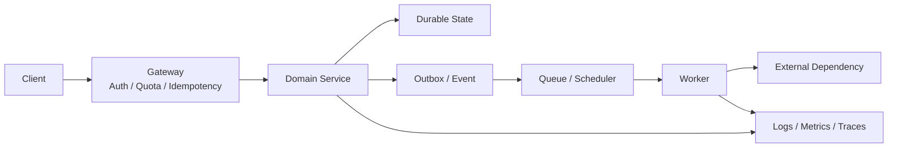
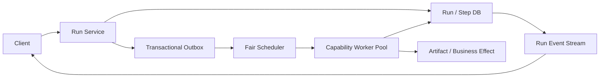
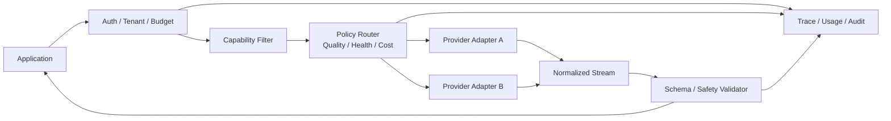
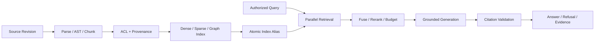
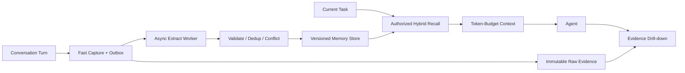
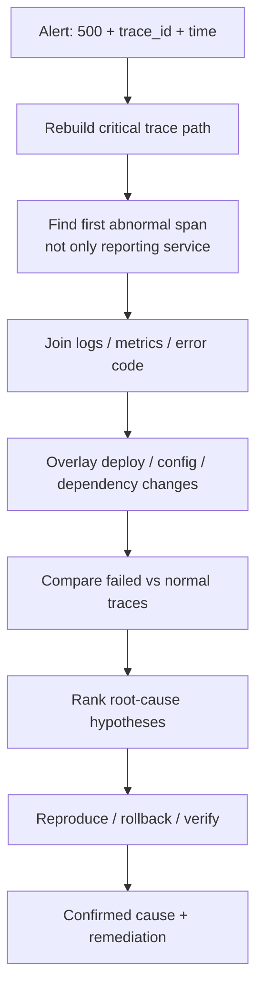
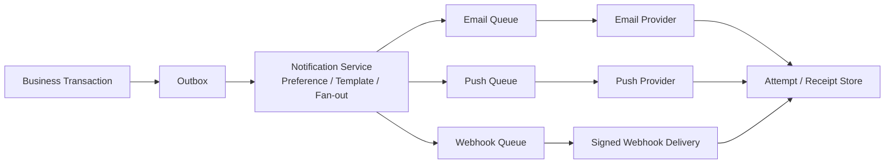
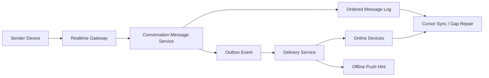
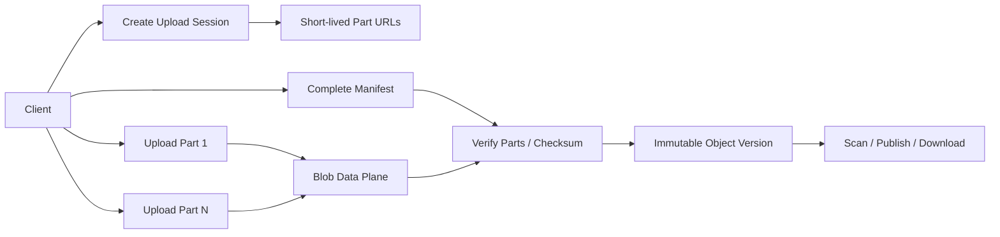
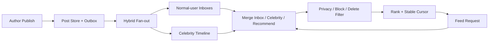

# 大厂系统设计与故障追问题

> 使用口径：本文全部是系统设计演练，不是当前三个公司内部项目的已上线能力。AI 周报、CodeWiki、Agent Memory 只能用来说明我接触过哪些相邻问题；本文中的集群、流量、SLA、多租户、跨地域、消息队列和容灾方案，只有内部证据支持时才能说成真实经历。
>
> 容量数字只用于现场推导。我会先定义变量，再代入面试官给出的规模；文中的示例公式不是项目真实 QPS、用户量或成本。没有输入时，我会声明一组方便讨论的假设，并主动请面试官修正。

## 0. 现场答题模板

我会按下面的顺序讲一套系统，而不是一上来罗列 Kafka、Redis 或 Kubernetes：

1. **澄清边界**：谁使用、核心动作是什么、是否允许丢失或重复、哪些功能本轮不做。
2. **确定目标**：读写比例、延迟、可用性、一致性、数据保留、安全与合规要求。
3. **变量化估算**：从日活、行为次数、峰值系数、对象大小和保留期推到 QPS、并发、带宽和存储。
4. **定义契约**：核心 API、幂等语义、错误语义和数据模型。
5. **走正常链路**：从请求进入到结果返回，说明每个组件为什么存在。
6. **放大瓶颈**：分区、缓存、队列、批处理、热点、公平性和背压。
7. **处理坏路径**：超时、重复、乱序、部分成功、依赖故障、恢复和灾备。
8. **收尾取舍**：安全、可观测性、测试、成本，以及下一步最值得展开的一个点。

通用变量：

| 变量 | 含义 |
| --- | --- |
| `D` | 日活用户或日活调用方数量 |
| `A` | 每个用户每天平均核心动作次数 |
| `P` | 峰值相对全天平均流量的倍数 |
| `B` | 单条请求、事件或对象的平均字节数 |
| `R` | 在线保留天数 |
| `F` | 副本、索引和编码后的空间放大系数 |
| `L` | 单次操作的平均在途时间，单位秒 |
| `Qavg` | 平均 QPS，`D * A / 86400` |
| `Qpeak` | 峰值 QPS，`Qavg * P` |

常用演算：

- 峰值并发约为 `Qpeak * L`，这是 Little's Law 的简化用法。
- 每日原始写入约为 `D * A * B`，在线存储约为 `D * A * B * R * F`。
- 峰值入口带宽约为 `Qpeak * B`；如果一次写会产生 `E` 个下游事件，事件峰值还要乘 `E`。
- 月调用成本约为 `月请求数 * 单次平均输入/输出 Token * 对应单价`，路由、重试和 Fan-out 都要进入放大系数。
- 可用性错误预算按观察窗计算，例如月总分钟数乘以 `1 - SLO`；它不是允许团队随意制造故障的额度。

## 一、通用方法与容量估算（Q001-Q010）

### Q001. 拿到一道陌生系统设计题，我前十分钟怎么组织？

**口语化回答：**

> 我先用一两分钟复述问题，确认核心用户、最重要的一条写链路和一条读链路。接着问规模、延迟、可用性、一致性、数据保留和安全边界。信息不全时，我会把假设写出来，不会默默猜。
>
> 然后我先给一个最小可用架构，定义 API 和核心实体，完整走一遍正常链路。只有主链路讲清以后，我才根据估算结果引入缓存、队列、分区和副本。最后专门留时间讲一个最危险的失败场景、一个安全边界和两个取舍。
>
> 如果面试官中途指定“重点讲一致性”或“规模放大一百倍”，我会停下当前展开，把已有设计当基线，围绕新约束重新推，而不是坚持背完预设答案。

**深入追问：**

> 如果只有三十分钟，我会把时间大致分成：五分钟澄清和估算，五分钟 API 与数据模型，十分钟主链路和扩展，七分钟故障、安全、观测，最后三分钟总结取舍。这个比例可以随面试官关注点调整。

**易错点：**

> 一上来画十几个组件；没有定义成功和失败就谈高可用；只讲正常链路；最后没有回到需求验证设计是否满足目标。

### Q002. 功能需求和非功能需求应该问到什么程度？

**口语化回答：**

> 功能上我会问清谁创建、谁读取、谁修改、谁删除，是否需要搜索、实时推送、历史版本、批量操作和管理员能力。非功能上我至少确认峰值流量、对象大小、延迟分位数、可用性、数据能否丢失、重复是否可接受、顺序要求、保留期、地域和租户隔离。
>
> 我还会明确不做什么。比如聊天题本轮只做一对一还是包含群聊；任务平台是否执行任意代码；通知系统是否承诺营销触达；RAG 是否允许跨权限检索。明确排除项不是逃题，而是防止设计目标无限膨胀。
>
> 对模糊词我会转成可验证语义。“实时”到底是 200 毫秒、两秒还是一分钟；“不重复”是客户端不展示重复，还是外部副作用绝不能重复；“高可用”是哪个 API 的哪一档 SLO。

**深入追问：**

> 如果读写要求冲突，我会按业务后果分层。例如消息正文不能丢，在线状态允许短暂不准；授信决定要求可重放，搜索建议允许最终一致。一个系统内部可以有多种一致性和 SLO，不需要强行一刀切。

**易错点：**

> 把“支持千万用户”当完整规模；不问读写比和峰值；把内部管理接口与外部用户接口放在同一风险等级；没有明确数据删除和合规边界。

### Q003. 没有给具体流量时，容量怎么估算才不显得在编数字？

**口语化回答：**

> 我会先定义变量，再说明示例假设只为了判断数量级。平均 QPS 是 `D * A / 86400`，峰值 QPS 再乘峰值系数 `P`。如果平均处理时长是 `L` 秒，峰值在途并发约为 `Qpeak * L`。这个结果能帮助我判断连接池、Worker、分区和下游配额，而不是为了报一个漂亮数字。
>
> 存储按“每日对象数乘单体大小乘保留期乘放大系数”估。放大系数要包含副本、二级索引、向量索引、元数据、纠删码或压缩。网络则看入口、出口和 Fan-out；通知或 Feed 一次写可能放大成很多投递，不能只算入口 QPS。
>
> 我会做一次合理性检查：单位有没有统一，平均与峰值有没有混用，Token 和字节有没有混用，压缩前后口径是否一致。估算目的是找瓶颈和验证设计，不是替代压测。

**深入追问：**

> 如果面试官说流量增长十倍，我会重新检查最先碰到的硬上限：数据库写 IOPS、队列积压、Provider RPM/TPM、索引构建速度、网络出口、热点 Key 或单租户并发，而不是笼统回答“水平扩容”。

**易错点：**

> 用 `D * A` 直接当 QPS；忘记峰值系数、重试、批量和副本；只算磁盘正文不算索引；把估算结果说成当前项目实测数据。

### Q004. SLI、SLO、SLA 和错误预算在设计题里怎么用？

**口语化回答：**

> 我先定义用户真正感知的 SLI，例如成功创建任务、消息持久化成功、通知在截止时间前送达、搜索返回有效结果。SLO 是内部目标，SLA 是可能带合同后果的承诺，两者不能混着说。延迟要报 P95/P99 和统计边界，不能只报平均值。
>
> 可用性也要按能力拆。例如聊天发送链路可以要求更高，在线状态可以降级；对象上传控制面失败时，已经拿到的分片 URL 仍可继续；RAG 的可选 Reranker 挂了可以降级，但权限服务挂了必须 Fail Closed。
>
> 错误预算能指导发布节奏和风险控制。如果预算消耗异常，我会先限制变更、定位主因并恢复，而不是把 `99.9%` 当架构图上的装饰。

**深入追问：**

> 多依赖串联时，端到端可用性不会自动等于每个组件的宣传数字。我会画依赖链、区分硬依赖和可降级依赖，并通过缓存、冗余或异步化减少串联系统对主链路的乘法影响。

**易错点：**

> 承诺五个九却没有成本和灾备方案；把超时请求全部算成功；只测服务存活不测业务正确；用重试把表面成功率抬高却让尾延迟和下游压力失控。

### Q005. API 和数据模型怎样设计，才能支撑后面的扩展与追责？

**口语化回答：**

> 我会先围绕业务资源建 API，而不是写一堆 `/doSomething`。创建类接口明确幂等键、请求哈希、同步或异步返回、取消语义和错误码；查询接口明确分页游标、快照语义和权限范围；更新接口用版本号或条件写避免静默覆盖。
>
> 数据模型至少区分当前状态、不可变事件和大对象。当前状态让查询快，事件解释状态怎么来的，大正文放对象存储只在数据库留引用、哈希、大小和权限元数据。每条关键记录带稳定 ID、租户、版本、创建者、时间和来源。
>
> 我不会为了未来所有可能性做万能 JSON，但会给真正变化快、低查询要求的扩展字段留边界。强查询、唯一性和状态机字段应结构化，并通过 Schema 版本演进。

**深入追问：**

> API 兼容我会采用加字段优先、旧字段有弃用窗口、消费者契约测试和双读/双写迁移。事件 Schema 也要版本化；消息进了队列以后，不能假设所有消费者和生产者同时升级。

**易错点：**

> 客户端自己传可信 `tenant_id`；Offset 深分页拖垮数据库；相同幂等键允许不同 Payload；只存最新状态导致无法审计；大对象直接塞主表。

### Q006. 分片、缓存和副本应该按什么顺序引入？

**口语化回答：**

> 我先确认单机或单库的真实瓶颈，再选稳定、分布较均匀、能支持主要访问模式的分片键。租户 ID 隔离清晰但可能出现大租户热点；随机散列均匀但范围查询困难；时间分区利于保留和归档但会形成当前时间热点。必要时用复合分片或大租户二次散列。
>
> 缓存只放可重建、访问热点明确的数据，Key 必须包含租户、资源版本、授权版本和会影响结果的策略。Cache-aside 简单，但要接受短暂陈旧；强一致字段可以不缓存，或者用版本化 Key 和写后失效。缓存击穿、穿透、雪崩分别需要请求合并、负缓存和 TTL 抖动等措施。
>
> 副本解决读取和可用性，不会自动解决一致性。读取副本有延迟时，刚写后读可以走主库、读自己的 Session Token，或明确接受最终一致。我会先解释需要解决的问题，再选择这些机制。

**深入追问：**

> 迁移分片时我会做版本化路由、双读校验、受控回填和切流，避免一次性停机搬库。后台校验要比较数量、哈希和业务不变量，而不只是“脚本执行成功”。

**易错点：**

> 把 Redis 当权威真相；只说一致性哈希不讨论热点和再平衡；缓存 Key 漏租户或权限版本；从副本读到旧数据却错误判断写失败。

### Q007. 一致性、幂等、顺序和 Exactly-once 怎么回答才准确？

**口语化回答：**

> 我会先按业务不变量选一致性。账户余额、任务状态转移、幂等记录需要条件写或事务；搜索索引、在线状态、统计聚合通常可以最终一致。不能因为系统分布式就默认所有数据都只能最终一致，也不能为了“强一致”让所有链路同步串行。
>
> 网络重试意味着重复不可避免，所以我把 At-least-once 投递和幂等副作用组合起来。入口幂等键绑定租户、动作和请求哈希；消费者用事件 ID 去重；外部副作用传稳定业务键。数据库状态与消息用 Transactional Outbox 衔接。
>
> 顺序通常只需要在会话、任务或资源内保证，我会按该 Key 分区并带单调序号。全局总序代价高，除非业务真的要求。所谓 Exactly-once 必须说明端到端边界；一个队列的 Exactly-once 模式不能替我保证任意外部 API 只执行一次。

**深入追问：**

> 外部调用超时后结果未知时，我不会盲目重试。我会把状态标为 `UNKNOWN/RECONCILE_REQUIRED`，通过查询、回调或人工对账确认；如果能补偿，也把补偿建成显式、幂等的业务动作。

**易错点：**

> 先查再插入却没有唯一约束；分布式锁过期后旧 Worker 继续写；去重记录过早清理；误把消息有序等同业务状态永远正确。

### Q008. 故障、过载和灾备应该怎样系统展开？

**口语化回答：**

> 我先按依赖逐个问：它变慢、返回错误、部分成功、重复、乱序或完全不可用时，主链路会怎样。每次远程调用都有连接超时、响应超时和端到端 Deadline；重试只针对瞬时且安全的错误，使用退避和抖动；持续故障通过熔断、隔离舱和降级限制扩散。
>
> 过载时从入口做准入控制，而不是无限排队。按租户和任务等级设置并发、速率、队列长度和预算；优先保护交互与高价值流量，批任务延后，可选步骤跳过。背压信号要能回到调用方，明确返回重试时间或异步受理状态。
>
> 灾备我会问 RPO、RTO 和故障域。备份要定期恢复演练，多可用区不等于跨地域灾备，跨地域复制也要处理延迟、脑裂和数据主权。恢复后还需对账，不是服务启动就算完成。

**深入追问：**

> 我会区分 Fail Open 和 Fail Closed。推荐排序、可选摘要可以 Fail Open 到基础能力；授权、资金、高风险工具和数据出域在策略服务不可用时应 Fail Closed。

**易错点：**

> 每层各重试三次形成指数级放大；没有总 Deadline；无限队列把过载变成内存故障；只有备份没有恢复演练；降级后悄悄返回语义不同的结果。

### Q009. 多租户、安全和隐私怎样贯穿，而不是最后补一句鉴权？

**口语化回答：**

> 身份和租户必须来自服务端验证过的认证上下文，不能信客户端、模型或 Header 里随便填的值。授权要落到资源和动作，查询、缓存、搜索索引、对象引用、事件订阅和日志导出都带同一作用域。管理员能力单独授权和审计。
>
> 我会先画数据流和信任边界，标出 PII、源码、Secret 和外部 Provider。敏感数据最小收集、传输与静态加密、日志脱敏、密钥托管、短期凭证和保留删除都进入设计。删除要沿数据库、缓存、索引、对象、导出和备份传播并产生完成证据。
>
> 对用户可控 URL、文件、查询、Webhook 和模型输出，我分别考虑 SSRF、路径穿越、解压炸弹、注入、越权和数据外传。模型的建议不直接变成权限结论。

**深入追问：**

> 多租户既有逻辑隔离，也有资源隔离。大租户可能挤占连接、队列和 Provider 配额，所以我会按租户做限额、公平调度和成本归属；高监管租户再考虑独立密钥、库、分区甚至部署单元。

**易错点：**

> 只在 API Gateway 鉴权；共享 Cache Key 漏租户；日志和 Trace 复制完整敏感 Payload；删除主表后宣称完成删除；把内部系统当成天然可信。

### Q010. 可观测性、测试和设计收尾怎么讲？

**口语化回答：**

> 我会把一次业务操作用稳定的 request_id、trace_id、run_id 或 message_id 串起来。日志回答发生了什么，指标回答影响范围和趋势，Trace 回答时间花在哪条依赖。业务指标、系统指标和安全审计要分层，标签要控制基数，不能把用户 ID 直接变成时序标签。
>
> 测试从状态机和不变量开始：单元测纯逻辑，集成测数据库、队列和外部契约，故障注入测超时、重复、乱序、部分成功，负向安全测试测跨租户和越权，负载测试验证容量估算和降级点。灾备与删除流程也要演练。
>
> 收尾时我会回到最初需求，明确设计满足了什么、主动牺牲了什么、最大剩余风险是什么，以及规模或需求变化后下一步怎么演进。这样面试官能看到判断，而不只是组件数量。

**深入追问：**

> 告警必须有 Owner、阈值依据和 Runbook。我会优先对用户症状和错误预算告警，再用队列深度、连接池、租约过期等原因指标下钻，避免每个 Pod 抖一下都叫醒人。

**易错点：**

> 只说上 ELK、Prometheus、OpenTelemetry；只测 Happy Path；高基数指标拖垮监控；没有业务正确性和安全信号；总结时又把设计题说成已上线经历。

## 二、案例一：分布式任务平台（Q011-Q015）

### Q011. 设计分布式任务平台时，我先澄清什么，容量和 SLA 怎么估？

**口语化回答：**

> 我先问任务是定时批处理、用户触发的异步任务，还是包含长时间运行的工作流；执行的是受信任业务代码还是任意用户代码；是否有依赖 DAG、优先级、取消、重跑、人工审批和进度流。副作用能否幂等、最长运行多久、失败后允许重试几次，也会直接影响执行模型。
>
> 容量我会定义每天创建 `J` 个任务、平均每个任务拆 `N` 个 Step、峰值系数 `P`、单 Step 平均执行时间 `L`。创建峰值约为 `J / 86400 * P`，调度事件峰值约再乘 `N`，稳定运行所需并发至少是 `step_peak * L`，还要留重试、慢任务和维护余量。状态存储约为 `J * N * 单步元数据大小 * 保留天数 * 放大系数`，大日志和产物单独算对象存储。
>
> 我会把 SLA 分层：创建 API 的受理延迟、到期任务的调度延迟、交互任务的排队时间、任务最终完成率和状态查询可用性。业务代码本身运行多久不应混进“调度器延迟”里。

**深入追问：**

> 如果任务有严格的整点触发，我会估计同一分钟内的突发，而不是用全天平均摊平。支持 Cron 时还要处理时区、夏令时、漏触发补偿和重复触发语义。

**易错点：**

> 只问日任务数不问 Step 数和运行时长；承诺 Exactly-once 执行任意任务；把“按时入队”和“按时完成”混成一个 SLA；没有限制单任务 Fan-out。

### Q012. 任务平台的 API 和数据模型怎么设计？

**口语化回答：**

> 我会提供创建任务定义、触发 Run、查状态与事件、取消、重试失败节点、响应人工审批等 API。`POST /runs` 要求租户范围内的幂等键并返回 `202 + run_id`；事件查询用 Cursor 或 SSE 的 `after_sequence` 恢复，不靠客户端反复猜当前进度。
>
> 核心实体我会拆成 `JobDefinition`、不可变版本的 `WorkflowVersion`、一次 `Run`、一个 `StepAttempt`、`Event`、`Lease`、`Approval` 和 `Artifact`。Run 保存全局状态、截止时间、预算和版本；StepAttempt 保存 node、attempt、owner、lease_until、fencing_token、输入输出引用和错误分类；Event 保存单 Run 内的单调序号。
>
> 大输入、日志和产物进入对象存储，任务表只留内容哈希和受权引用。定义更新不热替换正在运行的版本；老 Run 固定到创建时的 WorkflowVersion，迁移必须显式做状态映射。

**深入追问：**

> 取消不是简单把状态改成 `CANCELLED`。我会先进入 `CANCELLING`，停止派发新 Step，通知活跃 Worker 协作取消，等待租约到期，再记录无法撤销的外部副作用和需要补偿的动作。

**易错点：**

> Run 和每次 Attempt 混成一行；更新 Workflow 后老任务行为漂移；把完整日志塞关系库；允许客户端直接修改 Step 状态；失败重试覆盖原错误证据。

### Q013. 一次任务从提交到完成的主链路怎么走？

**口语化回答：**

> 请求先经过认证、租户配额和幂等校验。Run Service 在事务里创建 Run 和 Outbox 事件，Publisher 把可运行节点发布给 Scheduler。Scheduler 根据依赖、优先级、租户公平性和执行池能力选择任务，Worker 用条件更新领取带租约和 fencing token 的 Step。
>
> Worker 先把 Step 标记为运行，再执行有界工作；结果先落 Artifact 或业务库，然后用 owner、token 和 version 条件提交 Step 完成与下游可运行事件。数据库事务提交后才确认队列消息。DAG 节点全部满足时 Run 聚合为成功；失败按错误分类决定重试、等待人工、补偿或终止。
>
> 我不会让一个 Worker 在内存里从头跑完整条长流程。每个可恢复边界都有持久状态，因此 Worker 崩溃后能从最近一次已提交 Step 继续。

**深入追问：**

> 对外部副作用，我优先传稳定幂等键。对不支持幂等的系统，我会用 prepare-confirm、执行前后查询或对账状态；超时结果未知时进入 `RECONCILE_REQUIRED`，不能自动当失败重跑。

**易错点：**

> 数据库提交前确认消息；租约过期的旧 Worker 仍能提交；在 Worker 内 Sleep 等人工审批；只有队列重试没有业务幂等；一个节点无限创建子节点。

### Q014. 任务平台怎样分片、保证公平、处理顺序和缓存？

**口语化回答：**

> 状态数据可以按 `tenant_id + run_id` 分片，让同一 Run 的条件写尽量落在一个分区；超大租户再按 Run 散列。调度队列我会按交互、批处理、GPU、浏览器、代码沙箱等能力分池，上层做租户加权公平和 Aging，防止一个大客户或一批十分钟任务饿死其他流量。
>
> 顺序只在一个 Run 或一个资源内需要，我用 Run Key 分区和 Step 版本约束，不追求全局总序。依赖满足以数据库状态为准，队列只是唤醒信号；重复唤醒不会产生重复合法状态转移。
>
> Job 定义和租户配额可以缓存，但运行状态和租约不能只放缓存。缓存 Key 带定义版本和租户，更新采用版本化 Key 或失效；调度器失去缓存时可以回源，不应错误派发越权任务。

**深入追问：**

> 热点 Run 可能有几万个并行节点，我会设置单 Run Fan-out、并发和事件写速率上限，结果聚合采用分层计数或分片聚合，避免所有 Step 完成都竞争一行计数器。

**易错点：**

> 用单个全局优先队列；只按优先级导致低优先级永久饥饿；把队列当唯一真相；缓存旧配额后继续超发；跨分片做全局锁。

### Q015. Worker 崩溃、任务积压或业务代码危险时，怎么降级、观测和取舍？

**口语化回答：**

> Worker 崩溃由租约到期和重新派发恢复，旧 Worker 通过 fencing token 失去提交权。Scheduler 故障时数据库和 Outbox 仍保留待运行状态；新 Scheduler 接管后扫描恢复。队列积压时做入口准入、租户限额和优先级保护，暂停低价值批任务，不能无限接收。
>
> 如果执行用户代码，我会使用隔离容器或沙箱，限制 CPU、内存、磁盘、运行时间、系统调用和出网域名，凭据按任务短期注入。平台控制面和执行面使用不同身份；任务日志做脱敏，Artifact 访问按租户和 Run 授权。
>
> 我会监控创建率、调度延迟、队列年龄、运行并发、租约过期、重试、未知结果、各租户公平性、Worker 资源和完成率；Trace 从 Run 下钻到 Step、外部调用和 Artifact。取舍上，频繁 Checkpoint 恢复粒度细但写放大大，我会优先在副作用和长节点阶段边界保存。

**深入追问：**

> 多地域时我倾向一个 Run 固定 Home Region，避免状态双主冲突；控制面可跨区接入并路由到 Home Region。灾难切换依据明确 RPO/RTO，恢复后对 Run、Outbox 和外部副作用做对账。

**易错点：**

> 把进程重启当恢复方案；允许任意代码共享宿主凭据；告警只看 CPU 不看队列年龄；重试风暴拖垮下游；没有死信处置和人工恢复入口。

## 三、案例二：LLM Gateway / Router（Q016-Q020）

### Q016. LLM Gateway 的需求、容量和 SLO 怎么澄清？

**口语化回答：**

> 我先确认它只是 Provider 协议适配，还是还负责模型目录、能力筛选、路由、配额、缓存、内容安全、审计和成本。调用方需要同步、流式、Batch、Embedding、Tool Calling 还是 Structured Output；数据能发到哪些供应商和地域；Fallback 能否改变模型能力和输出语义。
>
> 容量不能只看 RPM。我会定义峰值请求 `Qpeak`、平均输入 `Tin`、输出 `Tout`、平均持续时间 `L` 和流式连接数。并发约为 `Qpeak * L`，TPM 约为每分钟请求数乘 `Tin + Tout`，再乘重试、Hedging 和 Agent Fan-out 放大系数。控制面配置 QPS 通常低，数据面 Token 和长连接才是主要压力。
>
> SLO 我会拆成网关自身开销、路由决策延迟、端到端 TTFT、完整响应延迟、流中断率、Schema 成功率和成本。比如“500 毫秒切换”要问是开始调用备用模型，还是拿到备用完整回答，后者通常不能由远程模型保证。

**深入追问：**

> 配额要同时考虑租户、应用、模型、Provider 的 RPM、TPM、并发和每日预算。少量超长请求可能先耗光 TPM 或连接，所以只做每秒请求限流不够。

**易错点：**

> 把不同模型当完全可替换；只算请求数不算 Token 和持续时间；把 Provider 延迟全部算网关性能；没有区分交互与离线批任务。

### Q017. Gateway 的 API、模型目录和审计数据怎么设计？

**口语化回答：**

> 对调用方我会提供统一请求，但保留能力声明：任务类型、所需上下文、Tool/JSON/视觉能力、数据地域、延迟级别、成本上限、Deadline 和允许的 Fallback Policy。返回统一 Usage、Finish Reason、错误分类和流事件，同时保留原 Provider Request ID 便于排障。
>
> 模型目录不是一个名字列表。每个版本记录 Provider、模型快照、能力、上下文限制、Tokenizer、价格、地域、数据政策、速率限制、健康状态和弃用时间。路由策略也不可变版本化，Run 保存命中的 policy_version、候选集、选择原因和健康快照。
>
> 审计只保存需要的元数据和受控 Payload 引用。Prompt 可能含源码、用户对话和 PII，我会分类、脱敏、加密、限制保留和访问；不能为了调试把所有原文永久落日志。

**深入追问：**

> Streaming 事件要有 `request_id + sequence + event_type`。客户端断线后是否支持续传取决于我是否持久缓存上游流；不支持时要明确重新发起会产生新模型调用和费用，不能假装 TCP 重连就是业务续传。

**易错点：**

> API 用一个 `model` 字符串隐藏所有能力差异；Fallback 时从 JSON 模式悄悄退到自由文本；日志打印完整 Key 和 Prompt；策略更新后无法重放当时为什么选该模型。

### Q018. 一次模型请求的路由和执行主链路怎么走？

**口语化回答：**

> 网关先验证服务身份、租户、预算和数据政策，再规范化请求并计算所需能力。Router 从能力满足的候选集中，结合任务类型的离线质量基线、近期健康、延迟、成本、配额和 Sticky Policy 评分。路由只查本地或近端健康快照，不能为了选模型同步探测所有 Provider。
>
> 选定后由 Provider Adapter 注入密钥、转换协议、设置 Deadline 并规范化流。安全的连接失败或明确未开始处理可以在总 Deadline 内重试；输出开始后切换可能导致重复或语义混合，通常要结束本次并显式返回部分失败。Usage、选择原因和所有 Attempt 都进入同一个 Trace。
>
> 模型质量不是请求执行前凭空知道的。我会用按任务分桶的离线评测和历史线上信号做先验，运行后再用确定性校验、用户反馈和抽样评测更新策略；高风险任务由 Validator 或人工守住下限。

**深入追问：**

> 两个模型成本和延迟接近时，我会优先看该任务桶的质量、当前错误预算、数据政策和剩余配额；仍相同可以做稳定散列的小流量探索，收集带保护的对照数据，而不是随机抖动每次请求。

**易错点：**

> 路由时远程查数据库和所有健康端点；只用最近一次成功率；输出一半后无缝拼接另一模型；用模型自评作为唯一质量信号；Fallback 忽略数据出域限制。

### Q019. Gateway 如何做限流、缓存、配置一致性和防级联故障？

**口语化回答：**

> 我会在入口按租户和应用做 Admission Control，在 Provider 侧按模型维护 RPM、TPM 和并发令牌。分布式配额可用集中原子计数或分层配额：全局分配到网关实例，本地快速扣减并周期校准。策略要说明配额存储故障时哪些请求 Fail Closed，哪些可在保守本地额度内继续。
>
> Prompt Prefix Cache 是 Provider 或推理层复用 KV 计算，Semantic Cache 是复用相似请求结果，两者风险不同。语义缓存只用于允许复用、低风险、无用户特异状态的请求，Key/判定带租户、模型、Prompt 版本、Tool、权限和数据版本；高风险生成默认不跨用户复用。
>
> 路由配置由控制面发布不可变版本，数据面本地缓存最后已知好版本并原子切换。Circuit Breaker 按 Provider、模型、区域和错误类别分桶，半开探测受限；健康抖动用时间窗口和迟滞，避免所有实例同时来回切换。

**深入追问：**

> Hedging 可以降低尾延迟但会放大成本和 Provider 压力。我只对小比例、幂等、高价值请求在延迟阈值后发第二路，首个合格结果返回后取消另一端，并把双份 Token 计入预算。

**易错点：**

> 只有单机限流；每层重试造成放大；全租户共享语义缓存；健康抖动时全流量同时切备用；控制面挂了数据面也立刻停止。

### Q020. Provider 故障、内容风险和成本失控时，怎样降级、观测和取舍？

**口语化回答：**

> Provider 故障我按能力兼容性降级：同能力备用模型、受限小模型、缓存的确定性结果、模板或明确失败。不能把需要 Tool Calling、区域限制或结构化输出的任务随便切到不满足能力的模型。所有重试和 Fallback 服从一个端到端 Deadline 和总 Token/成本预算。
>
> 安全上，Key 只在 Adapter 执行时注入；调用方不能覆盖任意 Base URL；Prompt、Tool Schema 和输出按信任域处理；对敏感数据做 DLP 与允许 Provider 策略。内容安全分类器不可用时，高风险外发或执行类任务 Fail Closed，普通内部摘要可按批准策略降级。
>
> 我会监控网关开销、排队、TTFT、完整延迟、流中断、429/5xx、Schema 失败、重试与 Fallback、每任务质量、Token、缓存命中和单位成功任务成本。取舍上，统一 Gateway 提供治理和迁移能力，但也可能成为瓶颈，因此数据面无状态横扩、配置本地化，并保留应用可见的错误语义。

**深入追问：**

> 成本突然升高时，我会按 Trace 分解输入膨胀、输出变长、路由升档、缓存命中下降、重试、Hedging 和 Agent Fan-out，而不是先全面换便宜模型。优化后必须联合看质量、延迟和成功率。

**易错点：**

> Provider 错误全部转 500；Failover 改变语义却不告知；安全分类器自己成为无限等待的硬依赖；成本只看单价不看 Token 与重试；审计里泄露 Prompt 和密钥。

## 四、案例三：RAG / Code Intelligence（Q021-Q025）

> 项目边界：下面是一道企业级多租户系统设计题。当前 CodeWiki 可以用来解释 AST、代码图、检索、Wiki、Web/CLI/MCP 等相邻机制，但不能因此声称已经具备本文的企业 ACL、跨地域集群、完整容量或 SLA。

### Q021. 设计 RAG 或代码智能平台时，需求、容量和 SLO 怎么定？

**口语化回答：**

> 我先问数据是普通文档还是源码，入口来自上传、Git、对象存储还是 SaaS；用户需要问答、搜索、代码导航、Wiki 生成还是修改建议；权限来自哪里，更新后多快可查，回答是否必须带引用。代码场景还要问语言、分支、Commit、生成文件和跨仓调用边界。
>
> 容量我会定义仓库或文档数 `R`、平均原文大小 `S`、每份平均 Chunk 数 `C`、Embedding 维度 `d`、每日变更比例 `u` 和查询峰值 `Qpeak`。原始存储约 `R*S`，Chunk 元数据约 `R*C*meta_size`，向量原始大小约 `R*C*d*每维字节`，再乘 ANN 索引和副本放大。每日索引工作约 `R*C*u`，不能只估查询 QPS。
>
> SLO 我会拆成上传受理、增量可见延迟、检索 P95、首 Token、完整回答、引用有效率和权限正确率。权限越权是零容忍安全不变量，不会和普通相关性错误一起平均。

**深入追问：**

> Code Intelligence 还要估图的节点边放大。平均每个符号 `e` 条关系时，边约为 `symbols * e`；跨文件解析、社区检测和 Wiki 生成可能比向量写入更贵，所以我会分别测 Pipeline 阶段，而不是只报总耗时。

**易错点：**

> 用文档数代替字节和 Chunk 数；忘记向量索引放大、重建和多版本；只定义回答延迟不定义索引新鲜度；把当前 CodeWiki 的局部 Benchmark 当企业平台容量。

### Q022. RAG 平台的 API 和数据模型怎么设计？

**口语化回答：**

> 我会提供注册数据源、创建不可变 Revision、触发索引 Job、查询 Job、检索、问答、取引用和删除数据源等 API。查询请求带数据域、Revision 或 as-of、权限上下文、检索策略和预算；回答返回 claim、citation、检索 Trace 和降级状态，不只返回一段文本。
>
> 数据模型会拆 `Source`、`Revision`、`Document/File`、`Chunk/Symbol`、`Relation`、`EmbeddingIndexVersion`、`AclBinding`、`IndexJob`、`QueryRun` 和 `Citation`。Chunk 保存稳定来源、原文偏移、内容哈希、父块、语言和 Revision；代码符号还保存类型、签名、范围和解析来源，推断边带置信、理由和解析层级。
>
> 原文和大解析产物放对象存储，关系库保存元数据与状态，搜索/向量/图索引都是可重建派生物。索引别名指向一个完整版本，不能让查询同时看到半套旧向量和半套新 Chunk。

**深入追问：**

> 删除 API 返回异步 Operation。它先撤销访问并写 Tombstone，再沿 Manifest 清理原文、Chunk、向量、图、缓存、导出和评测副本；最后生成完成或例外保留证明。只删关系库一行不算完成。

**易错点：**

> Chunk 没有稳定来源和 Offset；用文本内容当唯一 ID；ACL 只挂文档却在父块扩展时忘记继承；索引版本没有绑定模型、Tokenizer 和解析器；删除无法追踪派生资产。

### Q023. 从数据变化到用户拿到有引用回答，主链路怎么走？

**口语化回答：**

> 索引链路先冻结 Source Revision，原文落不可变存储并计算哈希。解析器提取结构事实，按语义边界生成父子 Chunk；随后做权限继承、Embedding、关键词索引、图关系和可选社区摘要。每阶段写 Job 状态和 Artifact Manifest，全部校验通过后原子切换索引别名。
>
> 查询链路先认证和解析 Scope，再做 Query Rewrite 或分解。Dense、Sparse 和图检索可以并行，但必须尽早按 ACL 和 Revision 过滤；候选去重、融合、Rerank 后，Context Builder 按 Token 预算选择父块、邻居和来源。LLM 只基于授权证据生成，引用校验器确认 Source ID、范围和 Claim 支持，不通过就修复、拒答或降级为检索结果。
>
> 我会把检索、上下文组装和生成分开记录，因此回答错时能判断是没有召回、排序错、预算截断、证据冲突，还是生成无依据。

**深入追问：**

> 如果证据互相冲突，我不会让模型偷偷挑一个。我会先按版本、时点、权威来源和语义口径对齐，无法消解时把冲突和缺口一起返回。引用存在只证明文本来自某处，不自动证明结论正确。

**易错点：**

> 检索后才做权限过滤导致侧信道和缓存泄露；固定字符切断代码和表格；把所有候选塞 Prompt；模型编一个合法格式但不存在的 Citation；索引未完成就切流。

### Q024. RAG 的版本一致性、分片、缓存和热点怎么处理？

**口语化回答：**

> 一次 Query Run 固定到 `source_revision + parser_version + embedding_version + index_version + retrieval_policy_version`，整个流程不能中途漂移。增量索引复用未变内容，但任何受影响关系、父块、社区或摘要要按依赖图失效；我不会把“99% 文件未变”说成后段也只做 1%。
>
> 文档元数据和索引通常按租户或数据域分区，大租户再按 Source Hash；向量搜索可以分片召回后全局融合，但要控制每片 Top K 放大。热点公开知识可以共享物理副本，私有内容仍必须在授权边界内隔离。
>
> 缓存分解析 Artifact、Embedding、检索结果和最终回答。Key 带内容哈希、模型与策略版本、租户和授权版本；权限变化要使旧缓存不可命中。最终回答缓存风险最高，只在问题和数据稳定、权限一致且允许复用时使用。

**深入追问：**

> 更换 Embedding 时我会建立新物理索引，后台双写或回填，Shadow 比较召回和延迟，完成后原子切别名并保留回滚窗口。不同维度不能混在同一索引里靠运行时猜。

**易错点：**

> 更新一个向量却忘了父块、图边和摘要；缓存 Key 漏授权版本；所有分片各取全量 Top K；读取旧副本后错误引用新 Revision；原地覆盖索引导致无法回滚。

### Q025. 索引、向量库或 LLM 故障时怎样降级，安全和观测怎么做？

**口语化回答：**

> Embedding 服务故障时，新 Revision 保持 `INDEXING/DEGRADED`，旧完整 Revision 继续服务；查询可按策略退到关键词和结构检索，但要显式标注覆盖变化。Reranker 挂了可用融合排序，LLM 挂了可以返回带来源的检索结果；ACL 服务异常时私有查询 Fail Closed。
>
> 我会把仓库、文档和网页内容都当不可信数据，防 Prompt Injection、恶意文件、解压炸弹、解析器漏洞和 Secret 出域。解析进程沙箱化、限制资源和网络；模型只拿最小必要片段；所有 Source Ref 返回前再做权限校验。
>
> 指标覆盖各 Pipeline 阶段吞吐与失败、索引新鲜度、孤儿资产、检索 Recall/Precision、Rerank、引用有效与支持率、拒答、延迟、Token 和成本。取舍上，图检索能补结构关系但构建和更新更重，我只在可测增益足以覆盖复杂度时启用。

**深入追问：**

> 如果最终回答差，我会用固定 Query 分层回放：先看授权后的 Ground Truth 是否存在，再看候选 Recall、排名、Context 是否包含、模型是否引用和结论是否被证据蕴含。不能只靠换更大模型掩盖索引问题。

**易错点：**

> 降级时悄悄扩大数据范围；把旧索引当最新结果；只监控向量库 CPU；恶意仓库与解析服务同权限运行；把系统设计能力反向说成 CodeWiki 已经大规模上线。

## 五、案例四：多租户 Memory 中台（Q026-Q030）

> 项目边界：当前 Agent Memory 是理解这类问题的相邻内部项目，但本文讨论的是集中式多租户中台。缓存、分片、企业身份、SLA、跨地域和完整冲突治理，没有内部证据时只能按设计题回答。

### Q026. Memory 中台先问哪些需求，容量和延迟怎样估？

**口语化回答：**

> 我先区分工作记忆、会话历史和跨会话长期记忆；主体是用户、组织、Agent 还是项目；记忆由谁写、是否自动抽取、用户能否查看纠错和删除。还要问读写是否阻塞主对话、事实新鲜度、冲突语义、数据保留和跨 Agent 共享边界。
>
> 容量我会定义日活用户 `D`、每天每用户对话轮数 `T`、每轮原始字节 `B0`、抽取记忆数 `M`、单条记忆元数据与向量大小 `Bm`、保留期 `R`。每日 Capture 写约 `D*T`，原文存储约 `D*T*B0*R*F`，记忆写约 `D*T*M`。Recall 峰值接近对话峰值，平均延迟 `L` 时并发约 `Qpeak*L`；后台抽取吞吐还要覆盖峰值后积压和重放。
>
> 在线 Recall 要有独立 P95 和严格 Deadline，抽取可以分钟级最终一致。删除、纠错和授权传播则要有完成时限与审计，不应和普通后台摘要共用同一个宽松 SLO。

**深入追问：**

> 我会限制每次召回 Top K 和 Token 预算，不能按用户历史总量线性扫描。大用户的记忆条数、热度和后台积压要单独纳入容量，而不是只看平均用户。

**易错点：**

> 把聊天记录全塞向量库就叫记忆；只估存储不估抽取 Token；Recall 没有 Deadline；默认跨 Agent 共享全部记忆；把本地项目数据当中台压测结果。

### Q027. Memory 的 API 和事实模型应该长什么样？

**口语化回答：**

> 我会提供 Capture 原始事件、Search/Recall、Get Evidence、Correct/Supersede、Delete、Export 和查询异步 Operation 的 API。调用方不能自由传可信租户，主体来自认证上下文；写入带来源消息 ID、会话、幂等键和目的，Recall 带当前任务、允许类型、时间范围和 Token 预算。
>
> 数据模型我会分 `RawEvent`、`MemoryClaim`、`EvidenceLink`、`Observation`、`CanonicalAttribute`、`ConflictSet`、`MemoryVersion`、`EmbeddingRef` 和 `DeletionOperation`。事实不只是一段文本，至少包含 subject、predicate、value、有效时间、记录时间、来源、置信/审核状态和可见范围。
>
> 我会把原始观测与规范属性分开。例如裸足身高、穿鞋身高是不同条件；两次裸足数值也先保留观测，只有规则和证据足够时才更新规范值。纠错通过新版本 Supersede 旧版本，原始证据按保留政策保存，不直接覆盖得无迹可查。

**深入追问：**

> 对 Persona 或偏好，我会表示有效期、稳定性和明确纠正，而不是“最新一定覆盖”。临时任务偏好和长期偏好属于不同类型，晋升到稳定层需要多次证据或用户确认。

**易错点：**

> 只有 `user_id + text + vector`；置信度没有定义却当真值；让 LLM 直接覆盖旧事实；没有 Evidence Link；删除 API 只删向量不删原文和派生画像。

### Q028. 从一轮对话到下次召回，Memory 主链路怎么走？

**口语化回答：**

> 前台 Capture 只做认证、最小清洗、原始事件持久化和 Outbox，成功后尽快返回，不让 Embedding 和 LLM 抽取阻塞用户。后台 Worker 按用户或主体有序消费，抽取候选 Claim，绑定 Evidence，做确定性 Schema 校验、相似候选检索和去重/冲突分类，再写入版本化 Store 和索引。
>
> Recall 时先按租户、主体、用途、类型和时间做权限过滤，再并行做关键词、向量和结构候选，融合后结合新鲜度、来源、任务相关性和冲突状态排序。Context Compiler 在 Token 预算内组装，并把历史内容标成证据而不是高权限指令。
>
> 当 Agent 需要细节时，通过只读 Evidence Tool 按引用下钻原始记录；每次下钻受同样授权和审计。这样摘要或结构化记忆负责导航，原文负责追溯，两者不能互相冒充。

**深入追问：**

> LLM 返回 malformed JSON 或“成功但抽取为空”时，我会区分 `valid_empty`、`parse_failed` 和 `provider_failed`，只有确定成功才推进 Cursor。失败批次进入可重放队列，避免表面可用但静默丢记忆。

**易错点：**

> 前台同步抽取造成尾延迟；框架注入的旧记忆被再次 Capture 形成反馈污染；Assistant 猜测被当用户事实；解析失败仍推进 Cursor；召回内容可以覆盖系统策略。

### Q029. 多 Agent 并发写同一用户时，冲突、分片、缓存和删除怎么处理？

**口语化回答：**

> 我会按 `tenant + subject` 作为逻辑一致性范围。不同会话可以并发 Capture，但规范属性合并用版本号、条件写或该 Subject 的有序合并队列；写冲突时保留两条 Observation，再由规则、证据或人工生成新的 Canonical Version，不能静默 Last-write-wins。
>
> 数据可按租户和 Subject Hash 分片，大租户二次散列；跨主体关系单独存边并接受受控跨分片查询。高频稳定画像和近期摘要可以缓存，Key 包含租户、主体、memory_version、policy_version 和权限版本，写入后以版本失效而不是只等 TTL。
>
> 删除先写 Tombstone 并从在线 Recall 立即不可见，再异步清理原文、记忆、向量、关键词索引、缓存、导出和备份生命周期。并发后台 Worker 看到 Tombstone 或 deletion_epoch 后不得把旧数据重新写回。

**深入追问：**

> 热点用户被多个 Agent 高频访问时，我会做单主体并发上限、请求合并和 bounded Top K；如果分片迁移，路由版本和双读校验保证同一请求不漏掉一半历史。

**易错点：**

> 用分布式锁却没有 fencing；缓存画像无版本导致纠错后仍召回旧值；删除与后台抽取竞态造成复活；相似度高就直接认定重复；把穿鞋和裸足数值合并。

### Q030. Recall、Embedding 或抽取故障时怎样降级，怎么防污染并观测质量？

**口语化回答：**

> Recall 超过 Deadline 时我宁可返回无记忆或小型稳定画像，也不阻塞整轮对话；降级状态要进入 Trace。向量服务故障可退关键词，但只有真实部署了对应索引才能这么说。抽取积压不影响原始事件保存，Worker 恢复后按 Cursor 重放；关键是不能重复写出多条等价记忆。
>
> 安全上我把历史对话和检索结果当不可信数据，过滤直接指令式污染但保留原证据，写入和读取都强制租户/主体授权。高风险画像、第三方信息和敏感属性需要目的限定、用户可见纠错、最小保留和人工门禁。
>
> 我会监控 Capture 成功、队列年龄、抽取失败、有效空结果、重复/冲突、Recall P50/P95、无结果率、被用户纠正率、错误召回、Evidence 可追溯、Token 占用、跨租户负向测试和删除完成率。取舍上，自动抽取覆盖广但会污染；越保守越安全但 Recall 率低，因此用分层风险和真实评测调节。

**深入追问：**

> 质量评测会把失败分成抽取漏、错误 Claim、冲突未解、检索漏、排序错、过期、越权和生成误用。一个最终准确率不能告诉我该修哪层，也不能把不同 Benchmark 的提升合成线上平均收益。

**易错点：**

> 无记忆时偷偷编一个画像；抽取失败直接丢消息；把模型自信当事实置信；只看向量 Recall 不看用户纠错和污染；把当前 Agent Memory 说成已经支撑千万用户。

## 六、案例五：日志 / Trace 根因分析平台（Q031-Q035）

> 面试来源：这一组吸收了小天才真实追问中的多系统日志、服务拓扑、`trace_id`、错误码和逐步定位根因。下面是扩展系统设计，不代表三个当前内部项目已经上线统一可观测平台或自动修复系统。

### Q031. 设计日志和 Trace 根因平台时，先问哪些数据，吞吐和保留怎么估？

**口语化回答：**

> 我先确认目标是开发排障、SRE 告警、审计，还是让 Agent 生成根因候选；输入包括结构化日志、Trace Span、指标、部署事件、配置变更、服务目录和源码版本。必须问采样策略、峰值事件、单条大小、查询时间窗、热温冷保留、跨租户隔离和 PII 规则。
>
> 容量我会定义服务实例数 `N`、每实例每秒日志 `rlog`、Span `rspan`、平均字节 `Blog/Bspan` 和峰值系数 `P`。峰值事件率约 `N*(rlog+rspan)*P`，入口带宽分别乘单条大小；每日原始量是事件率乘 `86400`，再按压缩、索引、副本和保留层级计算。全文索引可能比压缩原文大很多，不能把对象存储成本当总成本。
>
> SLO 至少包括采集不阻塞业务、告警数据可见延迟、按 trace_id 查询 P95、时间窗检索 P95、数据丢失率和告警延迟。根因建议准确度属于质量指标，不能和平台查询可用性混在一起。

**深入追问：**

> 我会给业务进程设置有界缓冲和采样。平台故障时不能让同步日志写拖死主业务；高价值错误、审计和关键 Trace 优先保留，普通 Debug 日志可以动态采样或落本地短期缓冲。

**易错点：**

> 只算平均日志量；默认所有 Span 全采样；全文索引所有字段；把高基数用户 ID 做指标标签；为了可观测性反过来拖垮业务。

### Q032. 统一日志、Trace、拓扑和变更事件的数据模型怎么设计？

**口语化回答：**

> 采集 API 采用标准批量协议并带 tenant、service、environment、timestamp、schema_version 和 source_id。查询提供 trace_id 精确查、时间窗加结构字段查、服务依赖和变更时间线；所有查询都经过资源权限与审计。大范围导出是异步 Job，不让一个查询拖垮集群。
>
> `Span` 至少包含 trace_id、span_id、parent_id、service、operation、start、duration、status 和受控 attributes；`LogEvent` 带 trace/span 关联、severity、template_id、error_code 和内容引用；`ServiceNode/DependencyEdge` 表示观测拓扑及置信来源；`ChangeEvent` 保存部署、配置、Feature Flag 和依赖版本。
>
> 错误码要有版本化字典，说明所属服务、语义、可重试性和常见原因。时钟来源和接收时间同时保存，避免只靠机器本地时间拼时间线；原始事件不可变，解析和聚合结果可重建。

**深入追问：**

> 最初拓扑可以从服务注册、配置、基础设施清单和静态依赖得到基线，再从 Trace 的 parent-child 调用和网络观测补动态边。观测不到调用不代表没有依赖，异步消息也不能只靠同步 Span 推断，因此边要带来源、时间窗和置信度。

**易错点：**

> 只存一段 message；不同服务错误码冲突；时间戳无时区和时钟偏差；把一次 Trace 观测到的边当永久架构；用户可控字段进入索引和标签造成成本爆炸。

### Q033. 拿到一个 500 告警、trace_id 和多系统日志，怎样一步步定位真正根因？

**口语化回答：**

> 我不会把“报错服务”直接当根因。第一步从告警拿时间、环境、入口、错误码、trace_id、受影响比例和最近变更。第二步按 trace_id 还原关键路径，找首个异常 Span、最长延迟、重试和状态传播。例如链路是网关到 A、A 到 B、B 到 C，B 返回 500，但 C 的响应异常可能才是触发条件。
>
> 第三步以异常 Span 的时间窗和服务集合拉结构化日志、指标和错误码语义，处理时钟偏差并关联同一请求。第四步把部署、配置、依赖版本和流量变化叠到时间线上，比较正常 Trace 与失败 Trace，缩小到代码、数据、依赖、容量或配置中的哪类变化。
>
> 第五步才让模型或规则生成候选根因。输入是受控的拓扑、关键 Span、去噪日志、错误码、变更和相关源码，不是全量日志。结论必须列支持证据、反证、置信和下一条验证动作；最终通过复现、回滚、实验或指标恢复确认，不能用模型一句话直接结案。

**深入追问：**

> 没有 trace_id 时，我会用请求 ID、业务 ID、连接上下文、时间窗、服务拓扑和日志模板做概率关联，并明确置信度。下一步应修复上下文传播，而不是把概率拼接结果说成确定 Trace。

**易错点：**

> 搜到 NullPointer 就停；让模型读取全量日志；混淆触发条件和系统性根因；忽略重试掩盖的首个失败；没有验证就宣布根因。

### Q034. 日志平台怎样分片、索引、缓存并处理乱序和热点？

**口语化回答：**

> 原始事件我会先进入可回放日志或对象存储，再异步解析和索引。分区通常结合 tenant、时间和散列，既支持保留删除又避免当前时间单分区热点；trace_id 查询可以维护单独的路由索引，把一个 Trace 的 Span 定位到对应分片。
>
> 热层保留近期结构化字段和倒排索引，温层保留压缩列式数据，冷层放对象存储按需恢复。不是所有日志正文都全文索引：优先索引 service、severity、error_code、template、trace_id 等高价值低风险字段，正文用受控搜索或归档查询。
>
> 事件以 event time 和 ingest time 双时间处理，允许一个迟到窗口；Trace 聚合不能因一个 Span 晚到就永久结束，可以生成版本化视图。常用 Dashboard 和错误码字典可缓存，但查询结果缓存带租户、时间窗和索引水位。

**深入追问：**

> 某服务异常产生“日志风暴”时，我会做每服务有界配额、模板聚合、重复抑制和优先级采样，同时保留计数，避免采样后误以为错误只有一条。审计与安全事件走独立保底通道。

**易错点：**

> 按 trace_id 单独分区导致随机写且无法按时间清理；所有正文全索引；缓存不带索引水位；迟到 Span 覆盖已确认数据；日志风暴把真正告警淹没。

### Q035. 采集链路故障、误诊和自动修复风险怎样处理，平台怎么观测？

**口语化回答：**

> Collector 故障时，Agent 使用有界磁盘缓冲并记录丢弃计数；入口过载时按等级采样，不能反压业务线程。索引故障不丢原始数据，恢复后从日志重放；查询层可退到较慢的原始扫描或明确提示数据不完整，不能返回“没有异常”的假结论。
>
> 模型诊断只生成假设和验证步骤。自动改代码、重启或回滚属于高风险工具，必须经过权限、影响分析、审批、幂等和观察窗口；先在隔离环境复现和跑测试。所谓“完全无人参与自动修复”需要非常窄、可逆和被验证的故障类，不是默认目标。
>
> 我会监控采集延迟、丢弃、Schema 失败、Kafka/队列 Lag、索引水位、查询 P95、告警到检测时间、Trace 完整率、拓扑新鲜度、诊断 Top-K 命中、误诊和修复后复发。取舍上，全量数据提高调查能力但成本和隐私风险高，因此用分层保留、动态采样和按需下钻。

**深入追问：**

> 平台自身故障也必须可观测，但不能只依赖自己监控自己。我会保留独立的外部健康探测、核心 SLI 和最小审计通道，避免统一平台完全失明。

**易错点：**

> Collector 阻塞业务；索引挂了就丢原始事件；模型建议直接执行生产命令；日志含 Token、SQL 参数或用户隐私；只看平台 CPU 不看数据完整性。

## 七、案例六：可靠通知 / Webhook（Q036-Q040）

### Q036. 通知或 Webhook 系统的需求、容量和送达 SLA 怎么澄清？

**口语化回答：**

> 我先区分站内信、邮件、短信、Push 和客户 Webhook；是事务通知还是营销广播；需要立即、预约还是批量；是否要求顺序、撤回、偏好、模板、多语言和送达回执。Webhook 还要问目标由谁配置、最大响应时间、重试窗口和是否支持幂等事件 ID。
>
> 容量我会定义业务事件峰值 `Epeak`、每个事件平均收件人或订阅数 `F`、渠道数 `C`，投递尝试峰值至少为 `Epeak*F*C`，再乘重试放大。正文、状态和回执存储按每日投递数、保留期和放大系数计算；短信、邮件和 Push 还要分别估供应商配额与费用。
>
> SLA 分“已受理”“已交给 Provider”“最终送达或确认”“截止时间前送达”。邮件/Push 的真实终端送达不完全可控，Webhook 的 2xx 也只证明对方接收接口响应成功，不证明对方业务处理完成。

**深入追问：**

> 事务通知和营销流量要隔离队列、配额和优先级。大促广播不能拖慢验证码、支付或安全通知；同一用户还要有频控与安静时段策略。

**易错点：**

> 把业务事件数当投递数；忘记 Fan-out 和重试；承诺邮件百分之百送达；所有渠道共用一个无界队列；没有用户偏好和退订。

### Q037. 通知 API、订阅和投递状态模型怎么设计？

**口语化回答：**

> 内部业务通过 `POST /notifications` 或发布领域事件创建通知，带业务幂等键、模板版本、变量、受众、渠道策略、优先级和截止时间。客户 Webhook 通过订阅 API 配置事件类型、目标、Secret 引用和过滤条件；目标 URL 必须验证，不能由每次事件任意指定。
>
> 数据模型拆 `Notification`、`Recipient`、`DeliveryAttempt`、`TemplateVersion`、`Subscription`、`Endpoint`、`ProviderReceipt` 和 `Suppression/Preference`。一条逻辑通知可以有多个渠道和 Attempt；Attempt 不覆盖历史，保存 Provider、请求摘要、响应分类、next_retry_at 和状态。
>
> 对 Webhook，我给每个 Event 稳定 `event_id`、类型、版本、发生时间和资源引用。签名覆盖原始 Body、Timestamp 和 ID；消费者可以用 event_id 去重。敏感资源不直接塞 Payload，使用受权查询或短期引用。

**深入追问：**

> 模板发布不可原地修改历史版本。通知创建时固定 template_version 和渲染输入，后续审计才能解释用户实际收到什么；变量需 Schema 校验，避免缺字段或把用户输入注入 HTML。

**易错点：**

> 一条状态字段表示所有渠道；重试覆盖原 Attempt；客户端可指定任意 URL；模板更新改变历史消息；同一幂等键配不同收件人或内容。

### Q038. 从业务提交到多渠道或 Webhook 投递，主链路怎么走？

**口语化回答：**

> 业务事务与通知事件通过 Outbox 同时提交，Publisher 把事件送到通知入口。Notification Service 做幂等、偏好、频控、模板和渠道决策，生成每个 Recipient/Channel 的 Delivery，再按渠道进入隔离队列。Worker 在截止时间与租约内调用 Provider，记录 Attempt 和回执，更新逻辑状态。
>
> Webhook Worker 解析固定 Endpoint，做 DNS/IP 安全校验，生成签名，使用短超时发送。2xx 记为本次接受；429 尊重 Retry-After；明确 4xx 多数不重试；5xx 和网络瞬时错误在总重试窗内退避。最终失败进入 Dead Letter 和客户可见的重放入口。
>
> 渠道 Fallback 必须是产品策略。例如 Push 失败是否转短信涉及成本和用户同意，不能由 Worker 临场决定。重复事件对客户端可见时，Payload 和 event_id 保持稳定。

**深入追问：**

> 如果业务事务提交成功但 Outbox Publisher 挂了，事件仍在数据库等待发布；如果消息重复投递，Notification 唯一键和 Delivery 唯一键裁决。这样不会出现“为了怕丢，在事务里同步发短信”的长事务。

**易错点：**

> 业务事务中同步调用外部 Provider；把所有 4xx 都重试；忽略 Retry-After；Fallback 绕过用户同意；Dead Letter 没有 Owner 和重放语义。

### Q039. 通知怎样处理重复、顺序、分片、缓存和未知结果？

**口语化回答：**

> 我接受内部 At-least-once，入口用 `tenant + business_key + notification_type` 唯一约束，Delivery 用 `notification + recipient + channel` 的逻辑键。Provider 支持幂等键就传稳定键；不支持时，网络超时可能是结果未知，我会查询回执、等待回调或人工对账，而不是立即产生新消息。
>
> 顺序只对同一用户、会话或业务资源有意义。我按该 Key 分区并带 sequence；消费者发现缺口时短暂等待或回查。营销和无顺序事务通知可以并行，不为少数场景强求全局顺序。
>
> 分片可以按 tenant/recipient Hash，热点广播走独立 Fan-out Job 和分片批次。模板、偏好和 Endpoint 配置可缓存，Key 带版本；退订和安全禁用必须快速失效。送达状态以数据库为真，不放在易失缓存。

**深入追问：**

> Exactly-once 用户体验可以通过客户端 event_id 去重和服务端稳定消息 ID 接近，但外部渠道不可控。我会准确承诺“至少一次尝试、幂等事件、可查询状态”，而不是绝对只显示一次。

**易错点：**

> 每次重试生成新 event_id；用电话号码或邮箱作为裸分片键和日志字段；退订缓存几分钟仍继续发送；一个大广播占满普通队列；超时一律当失败。

### Q040. Provider 雪崩、恶意 Webhook 地址和签名泄露时，如何降级与观测？

**口语化回答：**

> Provider 雪崩时按渠道和供应商熔断、限制重试并保护高优先级；低价值通知延期或过期丢弃，关键通知在批准的备用渠道重路由。所有尝试受通知 Deadline 和最大成本约束，不能无限重试一条已经失去业务价值的消息。
>
> Webhook Endpoint 要防 SSRF：仅允许 HTTPS，解析并阻止环回、内网、链路本地和云元数据地址，处理 DNS Rebinding，限制重定向和响应大小。Secret 独立存储并支持轮换，签名带时间窗防重放；接收方返回的 Body 不进入高权限日志或 Prompt。
>
> 我会监控受理、Fan-out、队列年龄、各渠道成功与延迟、重试、过期、退订、Provider 错误、Webhook 签名失败和客户 Endpoint 健康。取舍上，保序和强状态会降低吞吐；我只在业务资源内保序，并用最终状态与完整 Attempt 记录换取可追责。

**深入追问：**

> 客户 Secret 轮换时我会提供短暂双 Key 验证窗口并标识 key_id；发送侧只用新 Key，接收侧可在窗口内验证新旧，审计记录每次使用哪个版本，窗口结束后撤销旧 Key。

**易错点：**

> 任意 URL 可回调；允许重定向到内网；签名只 Hash Body 没有 Secret、时间和事件 ID；Provider 挂了全量切备用造成二次雪崩；只看发送成功不看队列过期。

## 八、案例七：聊天系统（Q041-Q045）

### Q041. 设计聊天系统时，功能边界、容量和 SLO 怎么确定？

**口语化回答：**

> 我先确认一对一、群聊、频道哪个优先，是否需要多端同步、离线消息、已读回执、撤回、编辑、附件、搜索、在线状态和端到端加密。还要问最大群规模、消息顺序边界、离线保留、跨地域和内容治理要求。
>
> 容量我会定义日活 `D`、每用户每天发送 `M` 条、平均消息大小 `B`、峰值系数 `P` 和平均连接时长。写峰值约 `D*M/86400*P`；下行不是同一个数，一条群消息平均 Fan-out `F` 时，投递峰值约再乘 `F`。在线连接数接近日活乘同时在线比例，连接心跳、Presence 和多端设备还会增加控制流量。
>
> SLO 我会拆成消息持久化 ACK、在线端可见延迟、离线同步延迟、消息丢失率、重复展示率和连接恢复。Presence 可以最终一致，已持久消息不能因为推送失败丢失；搜索索引也可以稍后可见。

**深入追问：**

> 大群和普通私聊要分开估。万人群每条写如果直接同步 Fan-out 会造成巨大写放大；可以采用群日志加成员拉取或混合策略，不能用平均群大小掩盖热点。

**易错点：**

> 把发送 QPS 当下行 QPS；只算正文不算附件和索引；用全局顺序要求拖垮系统；把在线状态短暂错误当消息丢失；不问多端语义。

### Q042. 聊天的 API、会话、消息和游标模型怎么设计？

**口语化回答：**

> 外部 API 包括创建会话、发送消息、按 Cursor 拉历史、同步自某个游标后的变化、确认已读、上传附件和建立 WebSocket/SSE 连接。发送请求带 client_message_id 做幂等，服务端返回稳定 message_id、conversation_id 和 server_sequence。
>
> 核心实体是 `Conversation`、`Membership`、`Message`、`MessageVersion`、`DeliveryCursor`、`ReadCursor`、`DeviceSession` 和 `AttachmentRef`。消息正文不可变追加，编辑或撤回形成新版本/事件；会话内序号用于排序和断线补拉，不把客户端时间当权威顺序。
>
> 已读我更愿意存“用户在会话中读到的最大连续序号”，而不是为每条消息给每个成员写一行。群成员权限按消息发生时和查询时的产品规则处理，加入前历史是否可见必须明确。

**深入追问：**

> 分页使用会话序号或稳定 Cursor，避免 Offset 在新消息写入时产生跳页。客户端 Sync Token 代表服务端已确认的水位，Token 过旧时返回重建快照而不是无限保存增量。

**易错点：**

> 用时间戳做唯一顺序；每次重发产生重复消息；删除原消息后无法审计滥用；已读为每条每人写爆表；附件 URL 永久公开。

### Q043. 从发送、持久化到多端实时和离线同步，主链路怎么走？

**口语化回答：**

> 客户端发送到接入层，服务端验证身份、会话成员、频控和 client_message_id，然后由会话分区的 Message Service 分配序号并持久化。提交成功后通过 Outbox 发布 Message Event，再由 Delivery Service 找在线 Session 推送；不在线的设备靠自己的 Delivery Cursor 后续补拉。
>
> WebSocket 是加速通知，不是唯一真相。推送中断或重复时，客户端按 server_sequence 检测缺口并调用 Sync API；收到消息先按 message_id 去重，再推进本地游标。Push 通知只提示有新消息，客户端打开后仍从消息服务取受权正文。
>
> 附件先走受控分片上传，消息里只存 Attachment ID；下载时重新授权。搜索、未读聚合和内容审核异步消费消息事件，不能阻塞所有普通消息的持久 ACK，除非同步门禁是明确法律或安全要求。

**深入追问：**

> ACK 要分层：客户端发送到服务端、服务端持久化、对方设备收到、对方用户已读不是一个状态。产品要展示哪一层，我就记录哪一层，不能用一个“已发送”图标掩盖语义。

**易错点：**

> 先推送后落库；连接断了就认为消息丢了；离线 Push 携带完整敏感正文；同步审核服务故障拖死聊天；没有游标缺口修复。

### Q044. 聊天如何保证会话内顺序、分片、多端一致和热点群扩展？

**口语化回答：**

> 我只承诺会话内服务端顺序。conversation_id 路由到一个逻辑 Leader 或有序分区，由它分配递增 sequence；跨会话没有必要全局排序。客户端离线同时发送的消息以服务端接收和业务规则排序，客户端时间仅作展示信息。
>
> 消息按 conversation_id 分片，用户会话列表和游标按 user_id 分片。这个双访问模式需要派生 Inbox 索引，通过事件最终一致更新；消息日志仍是权威。热点大群可以单独分区、拆 Delivery Fan-out、批量推送，极大群采用写一次、成员按 Cursor 拉取。
>
> 多端每个 Device 有 Delivery Cursor，用户有 Read Cursor。一个设备推进已读后通过事件同步其他设备；短暂不同步可以接受，但必须单调，旧设备不能把已读位置回退。会话元数据和成员列表可缓存，变更带版本快速失效。

**深入追问：**

> 分区 Leader 切换时可能有未确认消息。我会以已提交日志为准，客户端用 client_message_id 重试；新 Leader 恢复序号水位，不能因为 Sequence 空洞就自动补假消息，空洞本身可接受。

**易错点：**

> 分布式自增 ID 当会话顺序；一个用户的所有消息分到同片形成名人热点；多端已读 Last-write-wins 可回退；缓存旧成员关系造成退群后仍收消息。

### Q045. Gateway、分区或推送故障时如何恢复，聊天安全和观测怎么做？

**口语化回答：**

> Gateway 故障时客户端退避重连，带上最后同步 Cursor，从权威消息日志补缺口；不能自动把所有未确认消息生成新 ID 重发。Delivery 服务积压只影响实时性，不影响已持久消息；过载时优先保护消息写和拉取，Presence、Typing 和低价值回执可以采样或关闭。
>
> 安全上每次发送、拉取、附件下载都校验当前 Membership 和资源策略；WebSocket 建连鉴权还要处理 Token 过期和撤权。做内容治理时区分自动拦截、延迟审核和举报，保留必要申诉与审计；端到端加密会限制服务端搜索和审核，需要作为产品级取舍明确。
>
> 我会监控活跃连接、建连失败、心跳、消息持久化、端到端投递分位、Gap Repair、重复、队列年龄、热点会话、Push 成功和跨租户负向测试。取舍上，Fan-out-on-write 读快但写放大，Fan-out-on-read 写轻但读复杂，我会按群规模混用。

**深入追问：**

> 多地域我会给会话一个 Home Region 保证顺序，远端用户通过边缘接入转发；跨区复制用于读取和灾备。真正 Active-Active 多主需要冲突语义，不能只说部署两套服务。

**易错点：**

> 重连风暴没有抖动；Token 撤销后长连接永久有效；Presence 故障拖累消息主链路；日志记录完整聊天内容；把 Push Provider 成功当用户已读。

## 九、案例八：搜索 / 自动补全（Q046-Q050）

### Q046. 搜索和自动补全的需求、容量和 SLO 怎么问？

**口语化回答：**

> 我先区分文档搜索、商品搜索、站内实体搜索和前缀自动补全。是否需要拼写纠错、模糊匹配、同义词、个性化、权限、实时更新、多语言和热门趋势；自动补全是否允许暴露低频或敏感查询，也属于核心边界。
>
> 容量我会定义索引文档数 `N`、平均可索引字段字节 `B`、每日更新比例 `u`、查询峰值 `Qpeak`、每次按键触发次数 `K` 和候选数 `topK`。自动补全请求往往是最终搜索的数倍，前端防抖能减流量但不能作为服务端容量保证。索引空间约为原文可索引量乘倒排、DocValues、向量、副本放大。
>
> SLO 分自动补全 P95、搜索 P95、更新可见延迟、结果可用性和权限正确。自动补全通常需要几十到低百毫秒级体验，复杂重排可以在完整搜索使用；我会让面试官决定具体目标，不凭空承诺。

**深入追问：**

> 我会估查询成本而不只估 QPS。一个高基数过滤、前导通配符或跨所有分片 Top K 的查询，成本可能远高于普通词项查询，因此需要查询复杂度预算和超时。

**易错点：**

> 自动补全和搜索共用同一延迟预算；只算原文不算索引；每次按键无防抖且服务端无频控；忽略权限过滤和敏感词泄露。

### Q047. 搜索 API、索引文档和自动补全数据模型怎么设计？

**口语化回答：**

> 搜索 API 接 query、过滤、排序、Cursor、语言、数据域和用户权限上下文；返回结果、稳定资源 ID、Highlight、总量近似值、next_cursor 和 query_id。自动补全 API 接 Prefix、Locale、Scope 和数量，返回建议、类型、展示文本和受控跳转目标。
>
> 索引文档保存稳定 entity_id、tenant、source_version、字段、权限标签、更新时间和排名特征。原始业务库是权威，搜索文档是派生 View；Schema 版本、Analyzer、同义词和 Ranking Model 都版本化。自动补全候选来自实体、批准词库和聚合查询，记录热度窗口、语言和安全状态。
>
> Cursor 绑定 Query Sort 和索引快照或 PIT，避免翻页期间更新导致重复和漏项。用户可控 Sort 和 Filter 只能映射到 Allowlist 字段，不能把底层查询 DSL 原样暴露。

**深入追问：**

> 个性化特征不应直接写进共享索引文档造成用户间污染。候选召回共享，轻量用户特征在受权的 Rerank 层组合；缓存也要区分公共和个性化结果。

**易错点：**

> Offset 深分页；客户端能传任意脚本排序；索引文档无 source_version；热门查询未经匿名阈值直接进入建议；Highlight 输出未转义导致 XSS。

### Q048. 从数据更新到召回、排序和补全响应，主链路怎么走？

**口语化回答：**

> 业务库变更通过 Outbox/CDC 产生版本化事件，Indexer 拉取权威实体、规范化、分词并写新索引。全量重建在新物理索引完成校验后切别名；增量更新使用实体版本拒绝乱序旧事件。删除用 Tombstone 传播，不能让重放旧事件复活。
>
> 查询先做规范化、语言识别、拼写和意图处理，再执行词项/前缀/向量等候选召回，权限和硬过滤尽早下推。候选经过规则、相关性、业务特征和可选模型 Rerank，最后生成 Highlight 和 Cursor。每阶段有 Deadline，Reranker 超时可退基础排序。
>
> 自动补全优先读内存 FST/Trie 或近端缓存，合并实体词和匿名热门词，再做权限、安全和去重。前端对输入防抖、取消旧请求并使用 latest-wins，服务端仍按用户和租户限流。

**深入追问：**

> 没结果时我会按顺序尝试纠错、放宽可选过滤、同义词或退基础检索，并显式记录哪一步改变了语义。不能在权限过滤后为了“有结果”偷偷搜索其他数据域。

**易错点：**

> 先 Rerank 再 ACL；CDC 乱序覆盖新版本；索引构建一半切别名；自动补全返回用户私有实体；旧请求晚到覆盖新输入结果。

### Q049. 搜索怎样分片、缓存、处理热点和保证更新一致？

**口语化回答：**

> 索引可以按租户、语言、业务域或实体 Hash 分片。小租户共享分片，大租户独立，避免一租户一分片造成资源碎片；查询路由尽量缩小命中分片。跨片 Top K 由每片返回候选再全局归并，片数越多放大越大，因此不能无限细分。
>
> 索引最终一致，但同一实体版本单调。写入后必须立刻搜索到的管理场景可以读业务库确认或使用 Refresh Token；普通用户搜索接受短延迟。全量迁移使用双索引、Shadow 查询、结果差异和别名原子切换。
>
> 热门公共 Query、自动补全 Prefix 和字典可以缓存，Key 带索引版本、Locale、Scope 和权限类别；高度个性化结果不宜共享。热点 Prefix 可提前物化，冷 Prefix 现场计算；负缓存短 TTL 防穿透。

**深入追问：**

> 分片倾斜时我会看文档量、查询量和计算量，不只看字节。一个小索引也可能因热点关键词成为 CPU 热片；可复制热分片、路由读副本或拆热点业务域。

**易错点：**

> 每个查询广播所有分片；缓存不带索引/权限版本；强制每条写立即 Refresh 降低吞吐；双索引期间写漏一边；只看分片大小不看查询热度。

### Q050. 索引节点故障、慢查询、恶意查询和排名回归怎么处理？

**口语化回答：**

> 分片副本承担节点故障，查询设置总 Deadline 和每阶段 Budget；部分分片超时时，根据业务选择返回带 `partial=true` 的结果或失败，不能悄悄当完整。Rerank、向量或纠错服务故障时退到基础 BM25/前缀结果，权限服务故障则 Fail Closed。
>
> 我会限制 Query 长度、布尔子句、通配符、模糊编辑距离、分页深度和脚本能力，防 Regex/DSL 注入和计算型 DoS。搜索结果与 Highlight 都按不可信文本安全渲染；查询日志匿名化并设置最小聚合阈值。
>
> 观测包括索引新鲜度、CDC Lag、分片倾斜、Cache、各阶段延迟、零结果率、点击/转化、NDCG/MRR 等离线质量、权限拒绝和慢查询 Top Pattern。取舍上，个性化与复杂模型可能提高相关性但增加延迟、隐私和解释成本，必须通过 Shadow/A-B 与护栏指标上线。

**深入追问：**

> 排名模型上线后点击率升高但业务质量下降，我会检查位置偏差、标题党、长期满意度和分群影响，不会把点击当唯一真值。回滚单位包含模型、特征、Analyzer 和规则版本。

**易错点：**

> 部分结果不标注；慢查询无限占线程；热门词记录泄露用户隐私；只看点击率；模型回滚却保留不兼容特征和索引。

## 十、案例九：对象存储 / 大文件上传（Q051-Q055）

### Q051. 大文件上传系统的功能、容量和可靠性目标怎么定？

**口语化回答：**

> 我先问对象大小分布、最大文件、是否需要断点续传、秒传、版本、共享、预览、病毒扫描、生命周期和跨地域；客户端是浏览器、移动端还是服务间。还要确认强一致读写、覆盖语义、保留删除、数据地域和完整性要求。
>
> 容量我会定义每日上传对象数 `N`、平均大小 `B`、峰值系数 `P`、保留天数 `R` 和编码/副本放大 `F`。每日入口字节约 `N*B`，峰值带宽要根据上传集中时段估；存储约 `N*B*R*F`，还要算分片临时空间、版本、缩略图和跨区复制。请求 QPS 不是主要瓶颈时，网络、磁盘吞吐和小对象元数据可能分别成为瓶颈。
>
> SLO 分创建上传会话、分片接受、Complete、对象可读、下载首字节和数据耐久性。耐久性不是服务可用性；多副本能提高耐久，但删除、软件 Bug 和凭据泄露仍需独立防护。

**深入追问：**

> 小对象和超大对象适合不同路径。大量几 KB 对象会压元数据和 IOPS，超大对象压带宽与长连接；我会按大小分层并设合理分片范围，不能用一个平均大小设计全部。

**易错点：**

> 只算对象正文不算版本、分片和派生产物；把多副本等同备份；承诺上传成功却没定义 Complete；忽略出口带宽和 CDN 成本。

### Q052. 分片上传的 API、元数据和内容寻址怎么设计？

**口语化回答：**

> 控制面先 `POST /uploads` 创建会话，返回 upload_id、对象 Key、分片限制和短期签名 URL；客户端并行上传 Part，随后用 Part Number、ETag/Checksum 列表调用 Complete。查询与 Abort API 支持断点恢复和清理，下载通过受权短期 URL 或代理流。
>
> 核心实体包括 `Object`、`ObjectVersion`、`UploadSession`、`Part`、`Blob`、`Reference`、`ScanResult` 和 `LifecycleOperation`。Object 是命名与权限，Blob 是不可变内容；内容哈希可用于完整性和受控去重，但不能单靠用户声明哈希信任内容。
>
> Complete 使用幂等键和条件状态转移，验证所有 Part、顺序、大小和校验和后生成不可变 Version，并在事务里更新对象指针与事件。覆盖创建新 Version，不原地改 Blob；历史版本是否保留按产品策略。

**深入追问：**

> 秒传只能在同一授权和去重域内进行。服务端确认 Blob 已存在后仍要创建新的受权 Reference；不能因为两个租户上传相同哈希，就向其中一个暴露另一个租户是否拥有该文件。

**易错点：**

> 客户端自己指定永久对象路径和 ACL；Complete 可被不同 Part 列表重复调用；信任 MD5 作为安全身份；去重形成跨租户存在性侧信道；预签 URL 有效期和权限过大。

### Q053. 从创建会话、并行上传到完整对象可读，主链路怎么走？

**口语化回答：**

> 控制面认证用户、校验配额和对象策略，创建带过期时间的 UploadSession。客户端直接把分片上传到数据面，每个 Part 校验长度和 Checksum，数据面返回 ETag；客户端可以查询已收 Part，只补缺失部分。
>
> Complete 请求进入幂等状态机，从 `OPEN` 条件更新到 `COMPLETING`，验证清单并生成 Manifest。Blob 达到耐久写策略后创建 ObjectVersion，状态转为 `AVAILABLE` 并发布事件；病毒扫描、预览或转码按风险决定是发布前门禁还是隔离后的异步步骤。
>
> 下载先在元数据层授权并固定 Version，再返回短期范围受限 URL。CDN Cache Key 包含不可变 Version 或内容哈希，覆盖文件不会让旧缓存错误代表新版本。

**深入追问：**

> Complete 超时后客户端重试相同清单，服务端返回同一 Version；如果清单不同则冲突。后台发现数据写成功但元数据未提交的 Orphan Part，通过 upload_id 和过期策略清理，不让 GC 猜测活跃数据。

**易错点：**

> 应用服务器转发所有大文件成为带宽瓶颈；Part 没校验；Complete 前对象已公开；覆盖后 CDN 仍用不带版本 URL；扫描失败仍标安全。

### Q054. 对象和元数据怎样分片、复制、缓存并安全 GC？

**口语化回答：**

> 元数据按 tenant + object_key Hash 分片，Blob 按内容或生成 ID 分布到存储节点；命名层和数据层分离。复制或纠删码选择取决于对象大小、恢复速度和成本，小热对象可多副本，冷大对象可纠删码并进入低频层。
>
> 一个 ObjectVersion 在元数据提交前必须达到约定耐久水位。跨区复制可以异步，状态标明 `replication_pending`；有法规或灾备要求时，只有目标区域完成后才宣布对应级别可用。下载热点通过 CDN 和不可变 Version Cache，授权不能被公共缓存绕过。
>
> GC 使用引用计数加延迟删除或 Mark-and-Sweep，删除先使命名不可见，再等待安全窗口，确认没有活跃 Upload、版本、Legal Hold 和复制任务后回收 Blob。引用计数更新与对象版本事务衔接，并有定期全量校验修正漂移。

**深入追问：**

> 热点大文件可以由 CDN 和多副本分担；热点小文件还会压元数据服务，我会缓存不可变元数据、合并 Range 请求并限制单主体并发。不能为了热点复制而破坏删除和权限传播。

**易错点：**

> 元数据和 Blob 无 Manifest；引用计数减到零立即物理删；CDN URL 不带版本；跨区复制未完成却承诺零 RPO；所有对象统一三副本不谈成本。

### Q055. 分片丢失、Complete 卡住、恶意文件和凭据泄露时怎么处理？

**口语化回答：**

> Part 丢失或校验失败时只重传对应 Part；Complete 卡住由状态机和租约恢复，旧 Worker 用 fencing 失去提交权。节点故障通过副本或纠删码重建，并持续做 Scrubbing 检查静默位腐坏；元数据备份必须实际恢复演练。
>
> 安全上限制对象大小、Part 数、压缩后体积、媒体类型和扫描资源，解析预览在沙箱执行，防 Zip Bomb、恶意宏和解析器漏洞。预签 URL 最小权限、短有效期、绑定方法/对象/大小条件；密钥泄露后能撤销、轮换并审计受影响访问。
>
> 我会监控创建/Complete 延迟、失败与过期 Session、Orphan Part、Checksum、重建队列、耐久水位、跨区复制 Lag、出口带宽、热点、扫描和拒绝。取舍上，强同步跨区耐久降低数据风险但增加延迟和成本；我会按数据等级提供不同 Storage Class。

**深入追问：**

> 用户请求删除时，先撤销读取并写删除版本，再处理 Blob、CDN、派生预览、搜索索引和备份保留。Legal Hold 与删除权冲突由明确政策和审计解决，工程师不自行判断法律义务。

**易错点：**

> 只有 CRC 没有端到端校验；扫描服务挂了默认放行所有文件；永久 URL 泄露；备份和 CDN 不进删除范围；把高耐久宣传成永不丢失。

## 十一、案例十：信息流 Feed（Q056-Q060）

### Q056. 设计 Feed 时，需求、容量和延迟怎么澄清？

**口语化回答：**

> 我先确认是关注流、推荐流还是混合；帖子类型、编辑删除、关注关系、隐私、屏蔽、广告、置顶和审核；按时间还是算法排序；最大关注者和关注数；是否要求读到自己的最新发布以及跨设备游标。
>
> 容量我会定义日活 `D`、每用户每天发帖 `W`、打开 Feed 次数 `R`、每页 `K` 条、峰值系数 `P` 和作者平均粉丝数 `F`。发布峰值约 `D*W/86400*P`，读取峰值约 `D*R/86400*P`；如果全量 Fan-out-on-write，收件箱写放大约发布数乘 `F`，名人长尾会让平均值严重失真。
>
> SLO 分发帖 ACK、关注者可见延迟、首屏 Feed P95、翻页稳定性和删除/隐私传播。推荐特征和计数可以最终一致，但被屏蔽或私密内容不能因缓存陈旧继续暴露。

**深入追问：**

> 我会单独画粉丝数分布而不是只用平均值。普通作者适合写扩散，超大作者适合读扩散或分批异步扩散，系统设计的关键是处理这个长尾。

**易错点：**

> 只算 Feed 读取不算写扩散；把平均粉丝数用于名人；没有定义排序和翻页稳定；权限删除与普通新鲜度使用同一宽松 SLA。

### Q057. Feed 的 API、帖子、关注图和收件箱模型怎么设计？

**口语化回答：**

> API 包括发布/编辑/删除帖子、关注/取关、按 Cursor 获取 Feed、互动和举报。发布带 client_request_id 幂等，Feed 请求带 cursor、page_size 和可选排序模式；返回 item_id、post_version、ranking_reason 的受控摘要和 next_cursor。
>
> 核心实体有 `Post`、`PostVersion`、`FollowEdge`、`AudiencePolicy`、`InboxEntry`、`InteractionEvent`、`RankingFeatureSnapshot` 和 `ModerationState`。帖子正文与媒体引用分开；InboxEntry 保存 user、post、author、candidate_source、fanout_time 和版本，不复制完整正文。
>
> Cursor 绑定排序分数、稳定 Tie-breaker 和一次查询的策略/快照边界。简单时间流可用 `(created_at, post_id)`；算法流分数会变化，需要 Session Token、候选快照或接受刷新后顺序变化并明确产品语义。

**深入追问：**

> 关注关系的当前状态和事件分开保存。取关、拉黑和隐私变更会使已 Fan-out 的 InboxEntry 失效，因此读 Feed 时仍做最终权限校验，不能认为写入时检查一次永久有效。

**易错点：**

> Inbox 复制正文导致编辑困难；Offset 翻页重复漏项；排名分数无版本；取关只停止新 Fan-out 但旧私密内容仍显示；客户端可伪造作者 ID。

### Q058. 从发布帖子到关注者看到 Feed，主链路怎么走？

**口语化回答：**

> 发布请求先认证、校验内容与受众，持久化 Post 和 Outbox 后返回。Fan-out 服务读取事件：普通作者把轻量 InboxEntry 批量写入粉丝收件箱；名人只写作者时间线或分层缓存，由读取时合并。审核策略决定帖子先隔离、先小范围可见还是发布后异步复核。
>
> 读 Feed 时先取收件箱候选，再合并未写扩散的名人、推荐和广告候选；过滤删除、拉黑、权限和已看状态，批量取帖子正文与特征，Rerank 后生成稳定 Cursor。Reranker 超时可退时间序或基础分数，不能返回未过权限的候选。
>
> 点赞、评论和曝光进入事件流异步聚合，计数允许短暂延迟；用户自己的操作可以通过读自己写或本地乐观状态立刻展示。所有策略版本和候选来源进入 Trace 便于解释回归。

**深入追问：**

> 发布成功但 Fan-out 延迟时，作者能从自己的时间线立刻看到；粉丝端按可见延迟 SLO 等异步扩散。Fan-out Event 可重放，InboxEntry 用 `user + post + source` 唯一键去重。

**易错点：**

> 发布事务同步写所有粉丝；先 Fan-out 后帖子提交；名人事件压垮普通队列；Rerank 前不做权限过滤；计数服务故障阻塞发帖。

### Q059. Feed 怎样分片、缓存、保持一致并处理名人热点？

**口语化回答：**

> Post 按 post_id/author Hash 分片，Follow Graph 可按 follower 侧和 followee 侧各维护派生索引，Inbox 按 user_id 分片。双向关注索引通过事件最终一致，权威边带版本；取关和拉黑属于高优先级失效事件。
>
> 普通 Inbox 可按时间 Bucket 存储并限制长度，老数据从作者时间线补拉；名人 Timeline 分片复制到近端缓存，读取时批量合并，避免给上亿粉丝逐条写。极端热点还要做请求合并、边缘缓存和每用户刷新频控。
>
> 帖子正文按不可变版本缓存，Feed 页缓存只适合公共、非个性化或短期候选，Key 带用户/分群、策略、权限版本和游标。删除和隐私变更通过 Tombstone 与读时校验立即压过旧缓存，不能只等 TTL。

**深入追问：**

> 新关注后是否补历史由产品决定。如果补，我会异步拉有限窗口并标来源；不能在 Follow API 事务里复制作者全部历史。关注关系迁移时用版本化事件防旧消息把已取关状态覆盖回来。

**易错点：**

> 所有作者都写扩散；Feed 全页跨用户共享缓存；删除只删 Post 主表；Inbox 无限增长；分片只看帖子数不看名人读取热点。

### Q060. Fan-out 积压、排序服务故障、隐私泄露和质量回归时怎么处理？

**口语化回答：**

> Fan-out 积压时我优先保护发布和基础读取，按事件年龄、作者类型和用户活跃度调度；过旧低价值推荐候选可丢弃，但关注流事件应可重放。排名服务故障时退到经过权限过滤的时间流或基础排序，并标记降级；Feature Store 旧数据不能绕过安全规则。
>
> 安全上每次读最终校验受众、拉黑、删除和年龄/区域策略，防 IDOR 和缓存串用户；反滥用覆盖刷屏、机器人、恶意链接和内容举报。删除或封禁事件走高优先级通道，并有全链路缓存/索引清理与审计。
>
> 我会监控发布、Fan-out Lag、Inbox 写放大、Feed P95、空 Feed、候选数、过滤率、热点作者、缓存、排序降级、内容安全和跨租户负向测试；质量看长期满意、隐藏/举报、留存和分群公平，不只看点击。取舍上，混合 Fan-out 增加实现复杂度，但能同时控制普通读延迟和名人写放大。

**深入追问：**

> 新排名版本先离线回放、Shadow 和小流量实验，固定候选比较模型影响，设置延迟、投诉、安全和业务护栏；回滚要包含模型、特征和规则。没有反事实时，我不会把相关指标上升直接归因于模型。

**易错点：**

> 降级时间流不做权限过滤；队列积压无限重试所有陈旧候选；只看 CTR；删除事件和普通互动共用低优先级；把这十个案例里的设计反向包装成当前公司项目能力。
