# AI Agent 后端面试深挖准备：从项目经历到系统设计

> 状态：补充材料。本文保留跨项目串讲和 Agent 执行引擎设计，三个项目的事实口径以 [问题资料索引](../README.md) 指向的专项主文档为准。

> 目标岗位：后端开发工程师 - AI Agent 方向  
> 适用方式：这篇不是简历复述，而是面试深挖话术库。每个问题都按“背景 - 设计 - 取舍 - 结果 - 可追问点”准备，方便你把项目讲成一个可落地的 Agent 后端系统。

## 0. 面试主线

这几个项目可以串成一条很清楚的能力主线：

1. AI 周报系统：把 LLM 落到生产业务流程，解决多源数据、重试容错、事务一致性和稳定投产。
2. CodeWiki：把 LLM 建立在 AST、图谱、GraphRAG 和源码引用校验之上，解决代码理解和文档生成的可靠性。
3. Agent Memory：围绕 Agent 长程任务，解决长期记忆、上下文压缩、工具日志回溯、Token 成本和运行稳定性。
4. Agent 执行引擎设计：把上述经验抽象成图状态机、工具运行时、Human-in-the-loop、可观测与可恢复架构。

面试时不要只说“我调用了大模型”。要反复强调：

- 我把 LLM 当作系统里的一个不稳定推理组件，而不是全部系统。
- 可控的事实、状态、工具、记忆、评估、回溯和观测，才是 Agent 工程化的核心。
- 我做过从 0 到 1，也做过上线后的成本、延迟、稳定性治理。

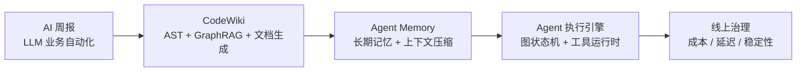

---

# 1. 开场介绍

## 1.1 45 到 90 秒自我介绍

**面试回答：**

您好，我叫陈柏润，本科软件工程，有 3 年后端开发经验，最近主要专注在 LLM 工程化和 AI Agent 基础设施方向。技术栈上，我主要使用 Python/FastAPI 做后端服务和数据管线，也使用 TypeScript/Node 做 Agent 插件、Gateway、工具运行时和前端工程。

我做过三个比较相关的项目。第一个是银行内部 AI 周报系统，我从 0 负责多源数据采集、清洗、LLM 分段分析、重试容错和结果入库推送，把原来每周 8 到 10 小时的人工周报压缩到 20 分钟左右。

第二个是 CodeWiki 代码智能平台，基于 Python/FastAPI 和 TypeScript/React，实现多语言 AST 解析、代码依赖图谱、GraphRAG 检索、源码级文档生成，以及 CLI、HTTP API、MCP 等多种 Agent 接入方式。它解决的是 Agent 或研发人员如何可靠理解大型代码仓库的问题。

最能代表我和这个岗位匹配度的是 TencentDB Agent Memory。我从 0 设计了 L0 到 L3 的分层记忆架构，把原始对话、结构化事实、场景记忆和长期画像分层管理；检索侧用了向量检索、BM25 和 Hybrid RRF 融合召回；同时做了工具日志上下文卸载，把长任务执行过程压缩成可追溯的 Mermaid 状态图，让 Agent 可以在低 Token 成本下继续规划和回溯。这个项目最终让 Token 消耗降低约 61%，任务通过率相对提升约 52%，长期记忆准确率从 48% 提升到 76%。

所以我不仅做过调用 LLM 的业务系统，也实际做过 Agent 的记忆、工具、检索、上下文管理和工程化稳定性建设。

**追问要点：**

- 被问“最匹配岗位的是哪段经历”：回答 Agent Memory，因为它直接对应记忆、工具日志、长程任务、成本、稳定性。
- 被问“后端能力体现在哪里”：回答状态持久化、异步调度、存储适配、接口抽象、可观测、故障恢复，而不是只写 prompt。

---

# 2. 项目一：TencentDB Agent Memory

## 2.1 端到端讲项目

**典型问题：**  
你能按背景、目标、整体架构、你负责的关键模块、最后效果，把 Agent 记忆系统端到端讲一遍吗？

**面试回答：**

这个项目叫 TencentDB Agent Memory，起因是我们在实际使用 AI Agent 做长任务时发现两个问题很明显：

第一，工具调用日志、搜索结果、代码片段会快速把上下文撑爆，后面推理质量下降，成本也很高。第二，Agent 跨会话没有稳定记忆，用户的 SOP、项目背景、偏好、历史问题每次都要重复讲。

我的目标不是做一个聊天记录检索，而是做一套 Agent 运行时的记忆基础设施。一方面支持长期记忆，让 Agent 能从历史对话中抽取事实、场景和用户画像；另一方面支持短期记忆压缩，把长任务里的工具日志卸载出去，只把结构化状态留在上下文里。同时要求它能接入 OpenClaw 和 Hermes 这类不同 Agent 宿主。

整体架构分两条主线：

第一条是长期记忆链路，采用 L0 到 L3 分层。L0 是原始对话，保留完整证据；L1 是结构化原子事实；L2 是把相关事实聚合成场景；L3 是长期 Persona 或用户画像。检索时结合向量检索、BM25 全文检索和 Hybrid RRF 融合排序。

第二条是短期上下文压缩链路。工具调用后，完整日志卸载到外部存储，比如 `refs/*.md`；然后提取步骤摘要，最后生成轻量 Mermaid 任务状态图。Agent 后续只需要看到任务图，知道任务目标、阶段、失败节点和可回溯引用。

我主要负责端到端设计和核心实现：第一是 host-neutral 的 `TdaiCore`，把 OpenClaw、Hermes 这些宿主差异隔离掉；第二是长期记忆流水线，包括 L0 录制、L1 抽取去重、L2 场景生成、L3 Persona 生成与召回；第三是上下文卸载模块，包括工具日志捕获、Prompt 构建前压缩注入、Mermaid 状态图、node_id 回溯、token 阈值控制；第四是工程化部分，包括 Gateway、插件适配、异步调度、会话清理、指标上报和性能计时。

效果上，短期记忆压缩在 WideSearch 场景里最高减少 61.38% Token，任务通过率相对提升 51.52%；长期记忆方面，基于测试数据集的最终回答准确率从 48% 提升到 76%。

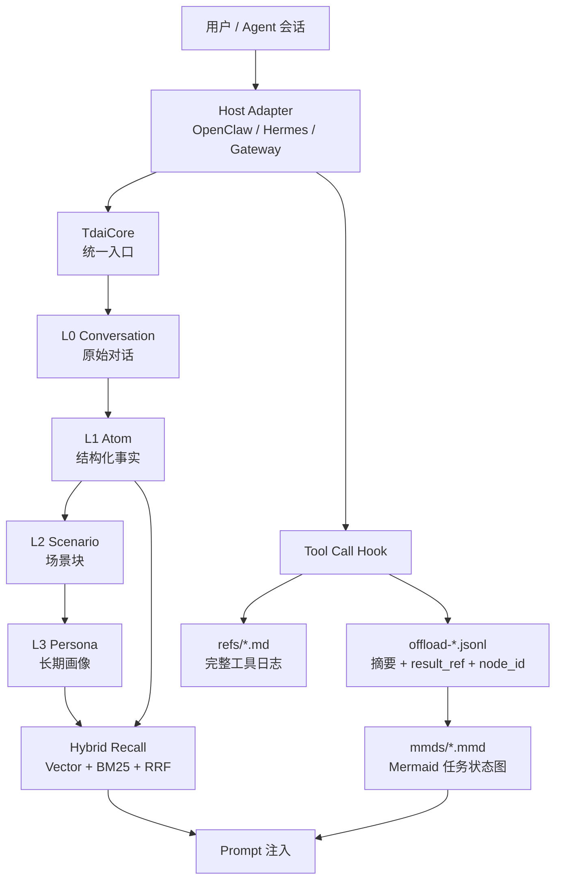

---

## 2.2 L0 到 L3 每层解决什么问题

**典型问题：**  
L0 到 L3 每层到底负责什么？为什么不用一个向量库或全局摘要？

**面试回答：**

L0 到 L3 的核心思想是：低层保留证据，高层保留结构；低层负责可追溯，高层负责可注入、可决策。

L0 是原始对话层，负责完整记录用户和 Agent 的交互，包括用户问题、助手回答、关键上下文和时间信息。它解决的是证据保存问题。因为后面的 L1、L2、L3 都是 LLM 抽取或总结出来的，如果没有 L0，任何记忆一旦抽错、漏掉，后面就很难纠正。

L1 是原子事实层，从 L0 中抽取结构化记忆，比如用户偏好、项目约定、工具使用习惯、任务结论。它解决的是从原始对话中提炼可检索事实的问题。L1 会做质量过滤、类型归一、去重和冲突判断，避免把无意义闲聊、重复内容或矛盾内容塞进系统。

L2 是场景层，把多个相关 L1 事实组织成一个场景块，比如“某个项目开发规范”“某类线上问题处理 SOP”。它解决的是碎片记忆缺少上下文的问题。单条事实可能很短，但 Agent 真正做任务时需要理解一组事实之间的关系。

L3 是 Persona 或长期画像层，负责生成稳定的长期偏好，比如用户技术栈、沟通风格、常见任务类型、长期 SOP。它解决的是每轮对话都需要的稳定先验问题。

为什么不用一个向量库？因为向量库适合相似文本检索，但不天然理解层级、时效、冲突和证据链。它可能召回几条相似片段，但不知道哪条最新、哪些属于同一场景、哪些互相冲突，也不知道应该给 Agent 一条事实、一个场景，还是一个长期偏好。

为什么不用全局摘要？全局摘要很省 Token，但不可逆，容易过度压缩，而且会随着时间越来越混乱。早期总结错了，后面会不断继承错误；细节被摘要掉以后，Agent 需要核对证据时找不回来。

所以我当时的判断是，Agent 记忆不能只有“存”和“搜”，还必须有抽取、聚合、压缩、召回、溯源、更新这些生命周期。

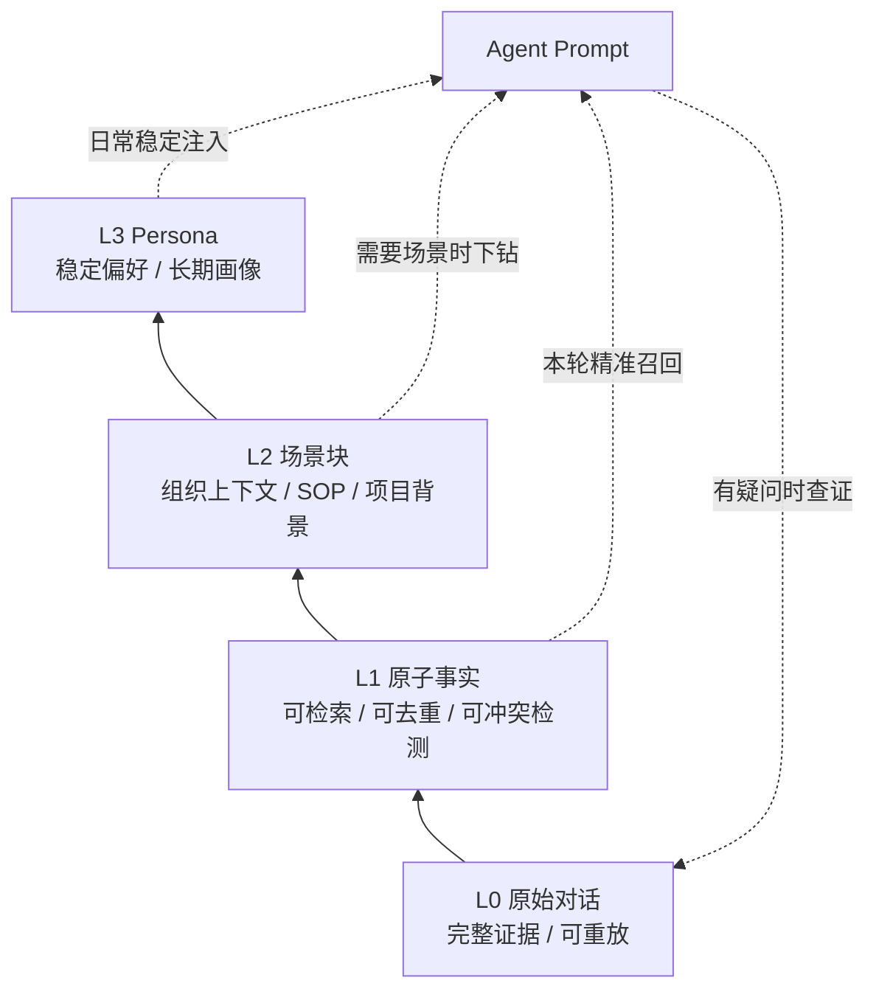

**追问要点：**

- 如果问“L1 怎么避免脏数据”：质量过滤、长度/注入风险过滤、结构化 JSON、去重、冲突检测。
- 如果问“L2 和 L3 区别”：L2 是任务/场景维度，L3 是跨场景的稳定画像。
- 如果问“什么时候更新 L3”：可以按新增记忆数量、场景变化、时间间隔触发，支持增量更新。

---

## 2.3 Hybrid Recall：向量检索、BM25 和 RRF

**典型问题：**  
为什么同时做向量检索、BM25 和 Hybrid RRF？RRF 具体解决什么问题？

**面试回答：**

我们做混合召回，是因为 Agent 记忆里的查询非常不稳定，单一检索方式覆盖不了。

向量检索擅长语义相似。比如用户问“我之前那个部署规范是什么”，它能召回“线上发布 SOP”“灰度检查流程”这类表达不完全一致的记忆。但它对精确符号不够敏感，比如项目名、接口名、错误码、表名、命令、版本号，这些在 Agent 场景里非常关键。

BM25/FTS 正好补这个短板。它对关键词、专有名词、代码标识符、报错文本更敏感，比如 `TDAI_GATEWAY_API_KEY`、`OpenClaw`、`sqlite-vec` 这种内容。

所以默认是 Hybrid：两路并行召回，多取一些候选，比如 `limit * 3`，然后用 RRF 融合排序。

RRF 解决的核心问题是 BM25 分数和向量相似度分数不是一个量纲，不能直接相加。BM25 分数受词频、文档长度、库规模影响，向量相似度又是另一套分布。RRF 不关心原始分数，只关心每个结果在各自列表里的排名。

公式大概是：

```text
score = Σ 1 / (k + rank)
```

我们用的 `k` 是常见的 60。一个记忆如果在 BM25 和向量检索里都排得比较靠前，它的 RRF 分数会叠加并被提升；如果只在某一路靠前，也能保留下来。这样既避免了分数归一化的问题，也能让语义相关和关键词精确命中的结果互相补强。

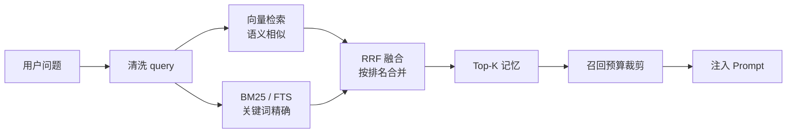

**追问要点：**

- 为什么不用 reranker：可以加，但第一版 RRF 成本低、稳定、无需额外模型调用。
- 为什么需要 query 清洗：去掉 gateway metadata、base64、媒体标记，避免检索偏移。
- 如何降级：embedding 不可用时走 FTS；FTS 不可用时走 embedding；两者都不可用则不注入。
- 如何评估召回质量：离线看测试问题的最终回答准确率、相关记忆是否进入 Top-K、错误召回率；线上看用户纠错率、记忆工具二次搜索率、召回耗时和注入 token 成本。

**策略选择可以这样补充：**

- 向量余弦：适合自然语言表达、同义改写、用户偏好和 SOP 这类语义型记忆。
- BM25/FTS：适合项目名、变量名、错误码、配置项、命令、接口名这类精确符号。
- Hybrid RRF：默认策略，适合真实线上混合查询；尤其当 query 里既有自然语言又有技术标识符时，能兼顾语义和关键词。

---

## 2.4 长期记忆准确率 48% 到 76% 怎么评估

**典型问题：**  
长期记忆准确率从 48% 到 76%，这个指标怎么评估出来？

**面试回答：**

这个准确率指的是基于测试数据集的最终回答准确率，不是单纯的召回命中率。

评估流程是：先把测试集里的多轮历史对话输入给 Agent，让系统完成 L0 记录、L1 事实抽取、L2 场景聚合和 L3 Persona 生成；然后用测试集预设的问题去问 Agent，比如用户偏好、历史事实、长期指令等。最后把 Agent 的回答和数据集里的标准答案做匹配或语义判定，统计回答正确比例。

基线大概是 48%，接入 L0-L3 分层记忆和 Hybrid Recall 后提升到 76%。

这个指标对我来说更有意义的是，它测的是 Agent 最终能不能把历史信息用对，而不是单纯测向量库有没有搜到某条文本。因为真实场景里，记忆系统的价值不是“查出来”，而是“在正确时机，以正确粒度注入给 Agent”。

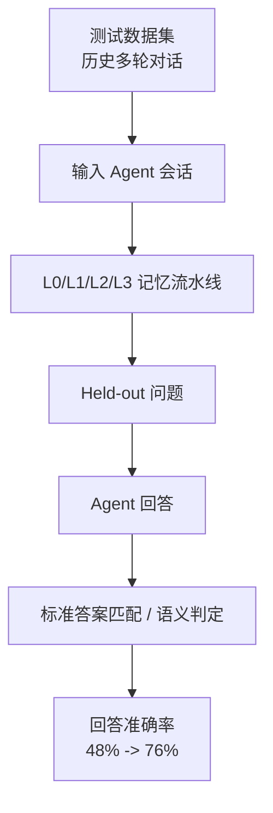

**追问要点：**

- 注意说“最终回答准确率”，不要说成 retrieval accuracy。
- 如果被追问误判风险：可以说用标准答案规则匹配 + 语义判定 + 抽样人工复核。
- 如果被追问线上指标：看记忆召回命中、用户纠错率、搜索工具调用率、回答满意度。

---

## 2.5 上下文卸载和工具日志压缩

**典型问题：**  
工具日志和历史消息膨胀时，怎么判断哪些保留、哪些压缩或丢弃？任务中断后怎么恢复？

**面试回答：**

我没有把压缩做成一次性摘要，而是做成了分级上下文治理。核心原则是：上下文里只保留当前推理必须的信息，完整证据一定先落盘，再决定替换或删除。

每次工具调用结束后，`after_tool_call` 会捕获工具名、参数、结果、耗时、`tool_call_id`。完整原始结果写到 `refs/*.md`，同时生成一条 `offload-<session>.jsonl` 记录，里面包含工具调用摘要、`result_ref`、`tool_call_id`、时间戳、可替换分数 `score`，后续 L2 再把它关联到 Mermaid 里的 `node_id`。

判断是否压缩主要靠 token 水位和信息价值两类信号。

第一层是轻度压缩。系统用 tiktoken 计算当前上下文 token，如果超过 mild 阈值，比如默认 50% context window，就把历史工具结果替换成摘要。这里优先压缩“摘要足以替代原文”的工具结果，也就是 L1 给出的 `score` 较高记录。替换后的内容包含摘要、`node_id` 和 `result_ref`。

第二层是重度压缩。如果 token 接近 aggressive 阈值，比如默认 85%，只替换摘要已经不够，就会删除更早的历史消息前缀。但删除只是从当前 prompt 移除，不是从存储删除。删除前这些工具日志已经有 jsonl 摘要、refs 原文和 Mermaid 节点映射。

第三层是 emergency 兜底。如果已经接近 95% context window，系统会进入紧急压缩，目标是降到大概 60%。这时会删除或截断最大的非用户消息，同时尽量保留最新用户请求、系统提示、当前任务状态图和必要结构信息。

现场恢复靠三类持久化信息：`state.json` 记录当前活跃 MMD 文件和 session 状态；`offload-*.jsonl` 保存每个工具调用摘要、`tool_call_id`、`node_id` 和原文引用；`mmds/*.mmd` 保存 Mermaid 任务状态图。如果任务中断，下一次进入时加载 `state.json` 找回 active MMD，把 Mermaid 图重新注入上下文。Agent 能看到任务目标、已完成步骤、当前停在哪个节点。如果需要细节，再根据 `node_id` 或 `result_ref` 回到 jsonl 和 refs 读取完整工具日志。

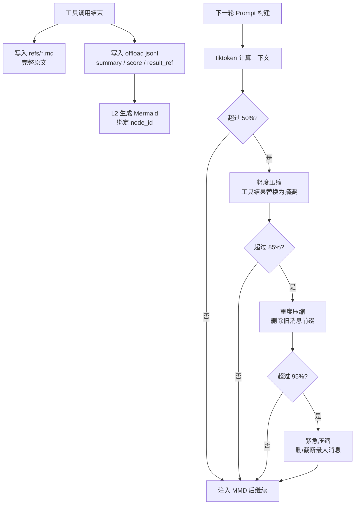

**追问要点：**

- 为什么不直接删除：需要可追溯，删除只是 prompt 层移除。
- 如何避免 tool_use/tool_result 结构错乱：压缩和删除时保持工具调用配对。
- 为什么用 Mermaid：高信息密度、拓扑结构清晰、LLM 和人都能读。
- 如何避免影响推理：当前任务 MMD、最新用户请求、系统提示和关键 node_id 优先保留；工具原文先落 `refs`，压缩内容带 `result_ref`，Agent 可随时下钻恢复。
- 61.38% 怎么来的：在长 Session benchmark 中对比接入前后总 Token 消耗，例如 WideSearch 场景 OpenClaw 原始 Token 和插件压缩后的 Token，用相对下降计算。

---

## 2.6 线上 Token 成本突然变高的真实 case

**典型问题：**  
Agent 记忆系统里有没有遇到 Token 成本突然变高？最先看到哪个指标异常？怎么证明根因？

**面试回答：**

有，一个比较典型的 case 是 prompt cache 被动态记忆打穿，导致输入 Token 成本突然升高。

当时我最先看到的不是单纯 `input_tokens` 暴涨，而是两个指标一起异常：第一，`agent_turn` 的单轮 billable input token 变高；第二，prompt cache 命中率明显下降，cached input tokens 变少。但业务流量、用户问题长度、工具调用次数都没有明显变化，所以一开始我判断不是用户请求变复杂，也不是工具日志突然变大。

后面我按 trace 拆每一轮 prompt，发现问题出在 auto-recall 注入位置。我们当时把 L1 相关记忆放在 `appendSystemContext`，也就是拼到 system prompt 后面。但 L1 召回是每轮动态变化的：用户问不同问题，召回的几条 memory 不一样。结果就是 system prompt 每轮都变，模型侧原本可以缓存的稳定系统提示、工具说明、Persona、Scene Navigation 都被一起打穿了。

证明根因时我做了三件事：

第一，对比同一 session 相邻两轮 prompt diff，发现大部分 system prompt 内容稳定，真正变化的只是 `<relevant-memories>` 那几行。

第二，看 LLM usage 里的 cached token 指标，异常版本里 cached tokens 明显下降；把动态 L1 记忆移走后，cached tokens 恢复。

第三，做 A/B：一版继续把 L1 放 system context，一版改成把 L1 放到 user prompt 前缀，只保留 L3 Persona、L2 Scene Navigation、工具使用说明在 system context。对比后，回答质量没有下降，但 prompt cache 命中恢复，单轮有效输入成本下降。

最后的修复是把记忆注入拆成两类：

```text
稳定上下文：L3 Persona、L2 Scene Navigation、工具说明 -> system prompt
动态上下文：本轮 L1 relevant memories -> user prompt prefix
```

这个 case 给我的经验是，Agent 成本不只看上下文长度，还要看上下文的稳定性。同样是几千 Token，如果每轮都污染 system prompt，就会让缓存失效，线上成本会突然上去。

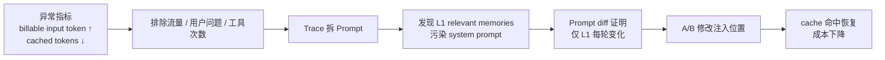

---

# 3. 项目二：CodeWiki 代码智能平台

## 3.1 从查代码到生成文档的端到端链路

**典型问题：**  
从一次用户查代码或生成文档的请求出发，讲一下源码解析、AST/依赖图谱、GraphRAG 检索到 LLM 生成文档这条链路。

**面试回答：**

用户先把仓库注册到 CodeWiki，系统会先走分析链路：`RepoScanner` 扫描仓库，处理 `.gitignore`、二进制文件、文件大小、语言识别和 Git 元数据；然后 AST 层用 tree-sitter 和语言增强器解析源码，抽取统一的 `AstSymbol`，比如 file、class、function、method、endpoint、schema，同时记录 imports、calls、references、inherits、routes 等信息。

接下来 `GraphBuilder` 会把这些 AST 事实转成 Code Graph。节点包括 repository、directory、file、class、function、endpoint 等；边包括 contains、defines、imports、calls、inherits、routes_to、uses_config 等。这里我没有让 LLM 判断代码关系，而是尽量用 AST 和静态规则生成确定性事实；对于跨文件调用、import 解析这类不完全确定的关系，会写入 confidence、reason、is_inferred 等 provenance。

当用户发起查询，比如“支付回调链路是怎么走的”，GraphRAG 会先从符号层找 seed node：匹配函数名、类名、endpoint、文件名；同时查 source chunk 的 FTS，必要时再查向量索引。命中的 chunk 会反向合并到图节点上，然后从 seed node 沿着调用、导入、包含、路由等边做有限 hop 的图扩展。最后系统会在 token budget 内选择源码片段、相关节点、相关边、社区摘要，打包成 context pack 给 LLM。

如果是生成文档，流程类似，但多了一层 catalog/page 工作流。先生成目录结构，再对每个页面按 topic 做 GraphRAG retrieval，拿到源码片段、图关系、source_refs 和可选 Mermaid 图。LLM 只基于这些 evidence 写页面，输出 JSON。服务端会校验 JSON、校验 source_refs 是否来自允许的源码片段、校验引用标记、校验 Mermaid。如果校验失败，会带着错误信息让 LLM repair；还失败就降级成 draft，不会直接把幻觉文档标成 generated。

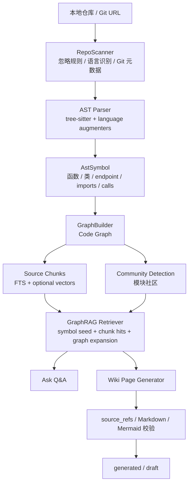

**追问要点：**

- LLM 在哪里用：社区命名、Wiki catalog/page、QA；核心代码关系不依赖 LLM。
- 为什么图谱比普通 RAG 好：能沿真实依赖关系扩展上下文，避免只召回相似文本。
- 怎么控制幻觉：只允许引用检索到的 source_refs，服务端校验。

---

## 3.2 CodeWiki 最难的技术点

**典型问题：**  
这个项目你觉得最难的技术点是什么？

**面试回答：**

我觉得最难的是怎么把“不可靠的 LLM 生成”建立在“可靠的代码事实”上。

代码理解里最危险的不是答不出来，而是看起来很像真的但引用不到源码。所以我做了三层约束：

第一，事实来源尽量来自 AST 和图，而不是 LLM 猜。多语言解析用统一的 `AstSymbol` contract，把不同语言的函数、类、endpoint、schema、imports、calls 统一成同一种中间表示。

第二，检索不是纯文本 RAG，而是 symbol seed + FTS/vector + graph expansion。比如用户问一个接口链路，系统会先定位 endpoint 或 handler，再沿 `routes_to`、`calls`、`imports`、`contains` 等边扩展，把调用链附近的源码和图关系一起给模型。

第三，生成结果必须带源码引用并通过服务端校验。LLM 输出 JSON 后，服务端检查 source_refs 是否来自允许的 chunks，Markdown 里的引用标记是否有效，Mermaid 是否能解析。如果失败，就进入 repair；再失败就保存为 draft。

难点还包括跨语言 AST 的差异、跨文件调用解析的不确定性、大仓库图规模和增量更新。但我整体的取舍是：宁可把关系标成 inferred 并带 confidence，也不让 LLM 无证据地编关系。

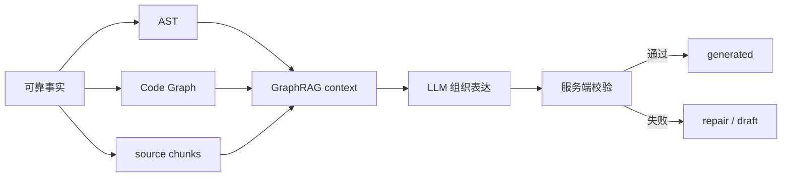

---

## 3.3 如何证明 CodeWiki 提升代码理解效率

**典型问题：**  
你怎么证明它确实提升了代码理解效率？

**面试回答：**

我分两类指标看。

一类是工程能力指标。我们压测过真实大仓，比如 Rust、VS Code、Superset。Rust 冷启动能解析 3.6 万多个文件，生成 30 万节点、88 万边；VS Code 生成 16 万节点、379 万边，说明这套 AST 和图管线能扛真实复杂仓库，不只是 demo。

另一类是使用和效率指标。在团队内部使用后，CodeWiki 日均查询大概 50+ 次，典型跨模块理解任务从原来人工翻代码约 2 小时，缩短到 30 分钟左右。新人 onboarding 和代码评审时，大家不再先全仓搜索加逐文件跳转，而是先看图谱、社区摘要和带源码引用的 Wiki，再按引用回到关键代码验证。

我认为这个闭环很重要：不是让大家相信模型，而是让模型帮你定位入口、组织依赖关系，然后你可以根据源码引用快速验证。

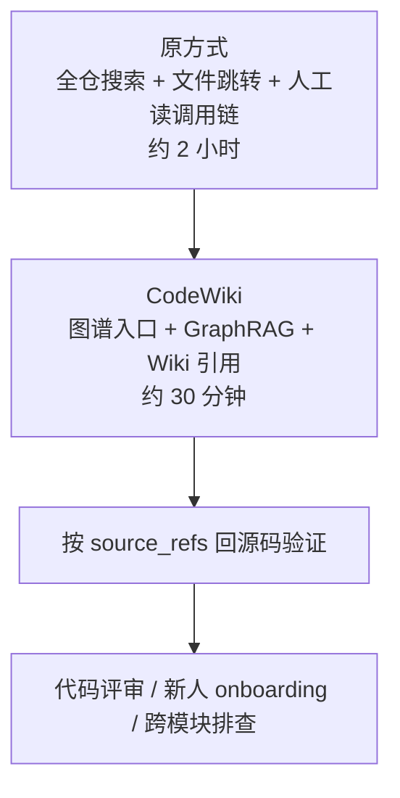

**追问要点：**

- 工程指标：大仓压测、节点边规模、解析错误率、增量复用率。
- 业务指标：日均查询次数、典型任务耗时、onboarding 反馈。
- 质量指标：source_refs 校验、draft 率、用户二次追问率。

---

## 3.4 GraphRAG 为什么不只是普通 RAG

**典型问题：**  
CodeWiki 的 GraphRAG 和普通 RAG 区别是什么？

**面试回答：**

普通 RAG 主要是 query 到 chunk 的相似度检索，适合文档问答，但代码理解有两个问题：一是用户问的可能是一个功能链路，不一定和源码文本字面相似；二是代码关系很重要，调用、导入、路由、继承往往比单个 chunk 更能解释系统。

所以 CodeWiki 的 GraphRAG 先从符号层找 seed：函数、类、endpoint、文件、模块。然后用 FTS 或向量命中的 chunk 反向合并到节点，再沿图做有限 hop 扩展。最后 context pack 里不仅有 source chunks，还有 related nodes、related edges、community summaries。

这样 LLM 拿到的不是一堆相似文本，而是“这个问题相关的代码局部子图”。它能回答“从入口到 handler 再到 service 的链路”，也能给出源码引用。

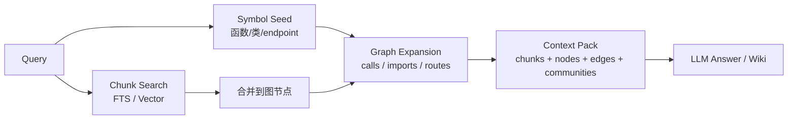

---

## 3.5 多语言 AST 和调用解析怎么做

**典型问题：**  
多语言 AST 怎么统一？跨文件调用怎么处理不确定性？

**面试回答：**

我做了一个统一的 `AstSymbol` contract，不管 Python、TypeScript、Java、Go、Rust、C/C++、C#，最后都尽量映射成统一字段：id、type、name、file_path、start_line、end_line、signature、imports、calls、references、bases、implements、metadata。

语言差异放在两层处理：第一层是 capture specs，用 tree-sitter query 抽取基础结构；第二层是 language augmenter，补语言特定信息，比如 TS/JS 的 exports、HTTP endpoint、schema，Go 的 receiver method，Python 的 decorator route。

跨文件调用解析不会假装百分百准确。系统先建立 call index，再结合 import scopes 做多级解析。如果能确定，就生成 `calls` 或 `routes_to` 边；如果只是推断，就写 `confidence`、`reason`、`resolution_tier`、`is_inferred`。前端和检索都能知道这条边的可信度。

这样做的好处是：图谱可以服务检索和可视化，但不会把推断事实伪装成确定事实。

---

# 4. 项目三：AI 周报系统

## 4.1 端到端讲 AI 周报

**典型问题：**  
AI 周报系统具体做了什么？难点在哪里？

**面试回答：**

AI 周报系统的背景是银行运维数据周报原来依赖人工从多源系统采集、统计和分析，每周大概需要 8 到 10 小时，而且容易漏数据或口径不一致。

我从 0 做了一套全自动化链路：日终批次触发后，先初始化下载控制记录；然后按日期回溯检查最近一段时间未成功的数据，调用多源 API 拉取数据，成功后入库并更新控制表；当上一周七天数据都下载成功后，再进入 LLM 分析阶段。

LLM 分析不是一次把所有数据塞进去，而是按模块拆分，比如错误日志量、大事务/长事务、慢 SQL、异步入账监控等。每个模块先做结构化统计入库，再组装 Prompt 调智算平台分析。对于超长数据，会做长度控制、截断或分批。每个模块有独立重试和失败标记，最后只有全部模块成功，才更新整周分析状态并推送周报。

最终效果是把周报耗时从 8 到 10 小时降到 20 分钟左右，年节省约 50 人天，投产后稳定运行。

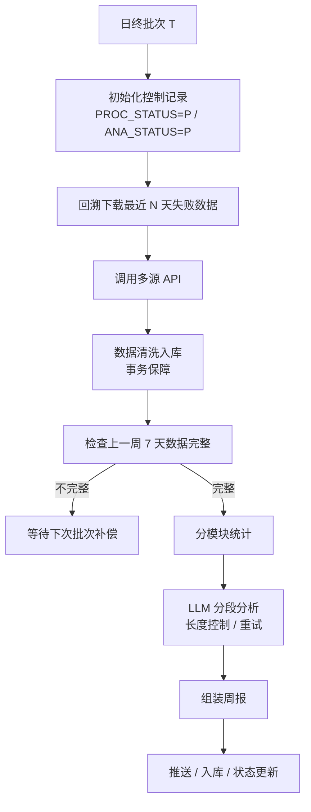

---

## 4.2 AI 周报的工程化点

**典型问题：**  
这个项目和普通脚本有什么区别？

**面试回答：**

我觉得它不是一个简单脚本，主要体现在几个工程化点：

第一，有控制表驱动的状态机。每个日期都有下载状态和分析状态，支持失败重试和后续补偿，不会因为某天 API 抖动就丢数据。

第二，有事务边界。数据入库和状态更新放在事务里，避免出现数据写了但状态没更新，或者状态成功但数据缺失的问题。

第三，LLM 调用有长度控制和模块隔离。运维数据可能很长，不能直接塞给模型，所以要按业务模块拆分，必要时截断或分批。某个模块失败不会影响其它模块统计，最终通过全局 flag 判断整轮分析是否成功。

第四，有幂等设计。比如控制记录和分析结果使用 `INSERT IGNORE`，批次重复执行不会造成重复数据。

这些设计保证了它能在生产日终体系里稳定运行，而不是只能人工点一次的 demo。

## 4.3 最容易失败的环节和稳定性设计

**典型问题：**  
数据采集、LLM 分段分析、周报组装与推送链路中，最容易失败的环节是什么？你设计了哪些重试、幂等、事务或告警机制？

**面试回答：**

最容易失败的环节主要有三个。

第一是上游多源 API 采集。上游系统可能超时、返回空数据、当天数据晚到，或者某一天下载失败。如果这里没有状态控制，后面周报就会基于不完整数据生成。所以我设计了下载控制表，每个日期都有 `PROC_STATUS`，失败保持 pending；每天批次会回溯最近 N 天未成功记录继续补偿。API 调用本身有最大重试次数和重试间隔，失败后不会把状态误置成功。

第二是 LLM 分析。运维数据可能很长，模型可能超时、返回异常格式，或者某个模块分析失败。所以我按业务模块拆分，比如错误日志量、大事务/长事务、慢 SQL、异步入账监控。每个模块独立统计、独立调用 LLM、独立重试。某个模块失败会记录错误并设置全局 `IS_ALL_ANALYSIS_SUCCESS = false`，不会把半成品周报标记为成功。

第三是入库和状态更新。这里最怕数据写入成功但状态没更新，或者状态成功但数据没写完整。所以数据入库和控制表状态更新放在同一个事务边界里；控制记录和结果表使用幂等写入，比如 `INSERT IGNORE`，批次重复执行不会重复造数。

告警上，我会围绕三个状态做：下载连续失败告警、分析模块重试耗尽告警、周报周期到点但仍未生成告警。告警内容里带处理日期、模块名、重试次数、错误摘要和 trace_id，方便值班同事直接定位是上游数据问题、LLM 问题，还是数据库写入问题。

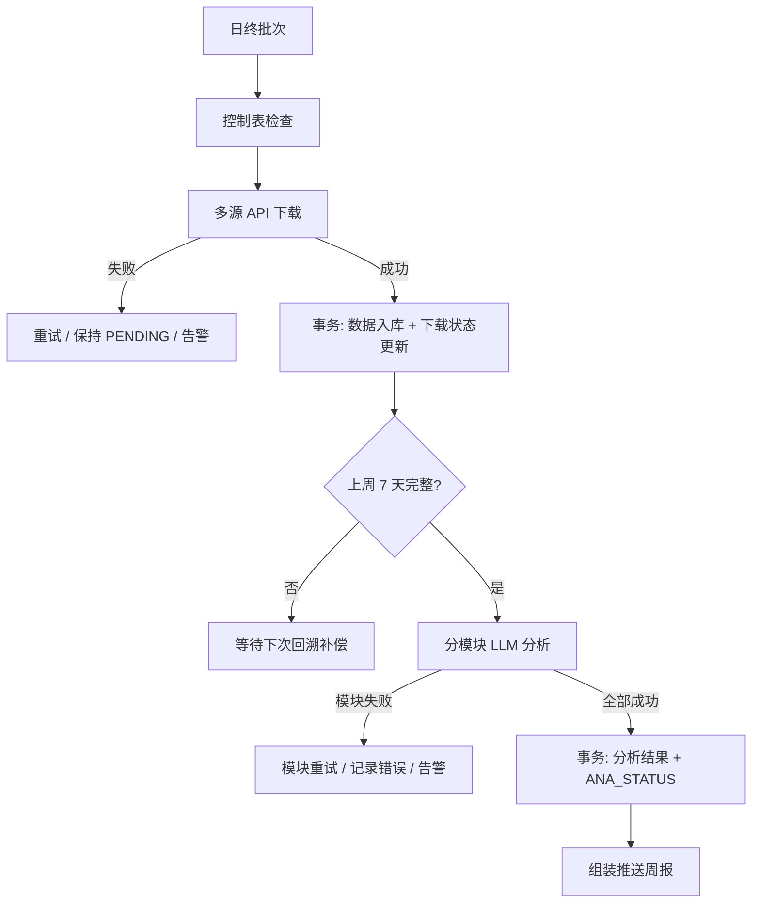

---

# 5. Agent 执行引擎系统设计题

## 5.1 从 0 设计可扩展 Agent 执行引擎

**典型问题：**  
如果入职后要从 0 做一个可扩展的 Agent 执行引擎，支持 ReAct、Plan-and-Execute、工具调用、重试和 Human-in-the-loop，你会怎么抽象？

**面试回答：**

如果让我从 0 做一个 Agent 执行引擎，我不会把它做成一个简单的 `while true` 调 LLM，而会把它抽象成一个可持久化的图状态机。因为 Agent 任务天然有规划、执行、工具调用、失败重试、人工确认和恢复现场，这些都很适合用节点和边表达。

状态上，我会设计一个统一的 `AgentRunState`，里面保存任务目标、当前模式、消息历史、计划列表、当前步骤、工具结果、记忆引用、预算、重试次数和 checkpoint。每执行完一个节点，都把状态持久化。这样即使 worker 崩溃，或者任务进入人工审批等待，也可以从上一个 checkpoint 恢复。

节点上，我会把 LLM 推理、计划生成、工具调用、结果校验、人工确认、上下文压缩、最终回答都抽象成不同类型的节点。比如 ReAct 模式就是 `Reason -> Tool -> Observation -> Reason` 的循环；Plan-and-Execute 就是 `Planner -> Executor -> Validator`，如果校验失败再回到重新规划。边是带条件的，比如模型决定要调用工具，就走 ToolNode；判断任务完成，就走 FinalNode；命中高风险操作，就走 HumanGateNode。

工具层我会做成标准化 Tool Registry。每个工具都有 name、description、input schema、权限范围、超时、重试策略、是否需要人工审批、是否幂等。LLM 只负责产出工具名和参数，真正的参数校验、鉴权、限流、超时、重试和结果归档由 Tool Runtime 做。大结果不会直接塞回上下文，而是存成 artifact，只把摘要和引用交还给 Agent。

ExecutionContext 单独抽象，里面包括用户身份、租户、模型配置、工具注册表、记忆系统、artifact store、event bus、trace id、deadline 和 cancellation token。这样可以保证隔离，也方便模型路由、成本控制和链路追踪。

Human-in-the-loop 我会当成一种特殊节点处理。比如发邮件、删数据、调用生产接口这类高风险工具，执行前进入 HumanGateNode，把 run 状态改成 paused，落库一个 pending approval。用户确认后继续从下一条边恢复，拒绝就走取消、回滚或重新规划分支。

落地架构上，我会用 FastAPI 或 gRPC 提供 run 创建和查询接口，PostgreSQL 存 run、step、event、checkpoint、tool_call 和 human_task，Redis 做队列、lease 和短期状态，worker 异步执行节点，artifact store 存工具大结果，向量库或 pgvector 做长期记忆。

总结来说，我会把 Agent 引擎拆成三块：图运行时负责流程，状态机负责恢复和一致性，工具运行时负责外部世界交互。这样 ReAct、Plan-and-Execute、多 Agent 协作只是不同的 graph template，底层状态、工具、审批、重试和观测能力都可以复用。

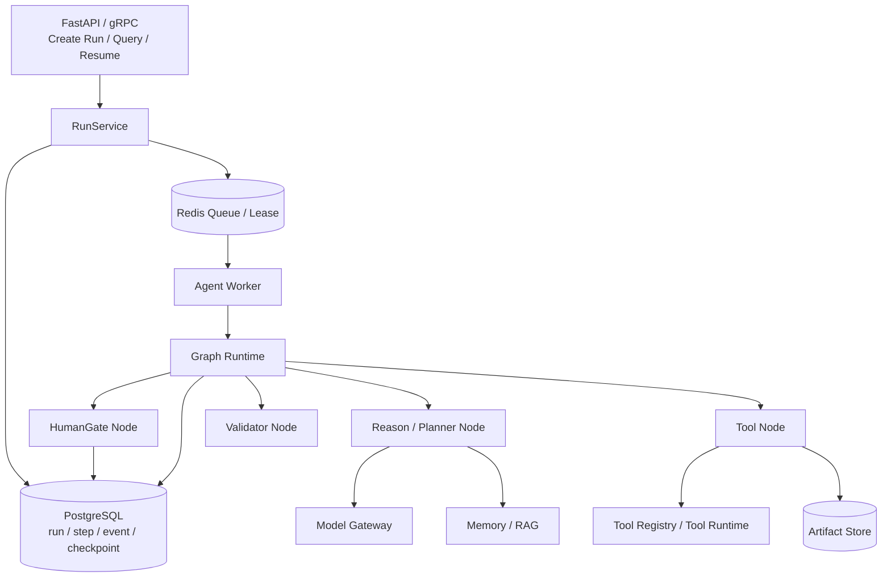

---

## 5.2 ReAct 和 Plan-and-Execute 如何统一

**典型问题：**  
ReAct 和 Plan-and-Execute 是不是要两套引擎？

**面试回答：**

我不会做两套引擎。我会把它们抽象成不同 graph template。

ReAct 的 template 是 Reason、Tool、Observation 的循环，每一轮由模型决定下一步是调用工具、继续思考还是最终回答。

Plan-and-Execute 的 template 是 Planner 先生成计划，然后 Executor 逐步执行，Validator 判断当前 step 是否完成，如果计划失效就回到 Planner 重规划。

底层都复用同一套状态持久化、工具运行时、重试、审批和事件记录。差异只在节点组合和边条件。

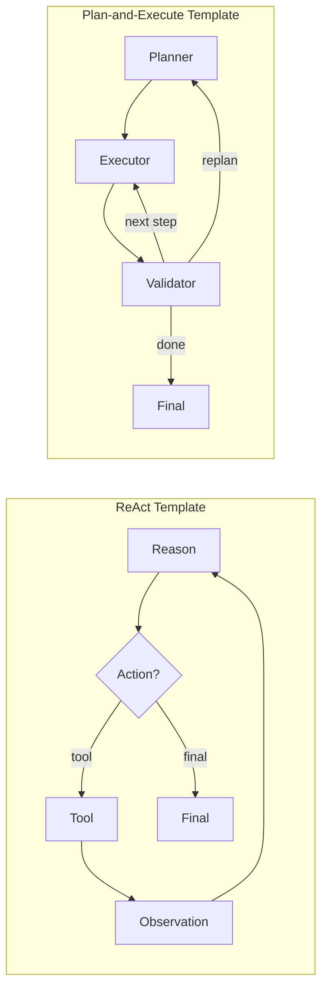

---

## 5.3 线上延迟、成本、工具失败怎么排查

**典型问题：**  
Agent 服务整体延迟变高、Token 成本偏高，同时偶发工具调用失败，你会先看哪些指标？怎么优化？

**面试回答：**

我不会先凭感觉改 prompt，而是先把一次 Agent run 拆成可观测链路：`Run -> Step -> LLM Call -> Tool Call -> Memory/RAG -> DB/Queue`。每个 run 都要有 trace_id，这样延迟、Token、错误可以关联起来看。

我会先看三类指标。

第一类是延迟指标：端到端 p50/p95/p99、队列等待时间、单个 step 耗时、LLM 首 token 时间和总耗时、工具调用耗时、RAG 检索耗时、数据库和 Redis 耗时。这样判断是排队慢、模型慢、工具慢，还是 Agent 循环太多。

第二类是成本指标：每个 run 的 input/output token、上下文长度分布、每轮注入的 memory/RAG token、工具日志 token、重试消耗 token、不同模型调用占比、prompt cache 命中率。如果成本突然上升，重点看上下文膨胀、检索召回过多、工具结果没有压缩，或者失败重试导致多次调用大模型。

第三类是稳定性指标：工具调用成功率、超时率、4xx/5xx、重试次数、熔断次数、参数校验失败率、LLM JSON 解析失败率、Agent 最大循环触发次数、任务最终成功率。

定位后，延迟方面，如果是 LLM 慢，就做模型路由、并行检索/工具调用、流式返回、prompt cache；如果是队列慢，就扩 worker、拆优先级、避免长任务阻塞短任务；如果是工具慢，就加超时、连接池、异步调用和结果缓存。

成本方面，核心是控制上下文：工具大结果 offload，只给摘要和 artifact_ref；RAG 召回加 token budget 和 top-k 限制；历史消息分层摘要；重复问题 semantic cache；设置最大 step 数、最大重试次数和 run token budget。

稳定性方面，把工具运行时标准化：参数 schema 校验、权限校验、幂等 key、超时控制、指数退避重试、失败分类。对外部服务加 circuit breaker 和 fallback；高风险工具加 Human-in-the-loop；长任务用 checkpoint，失败后从最近 step 恢复。

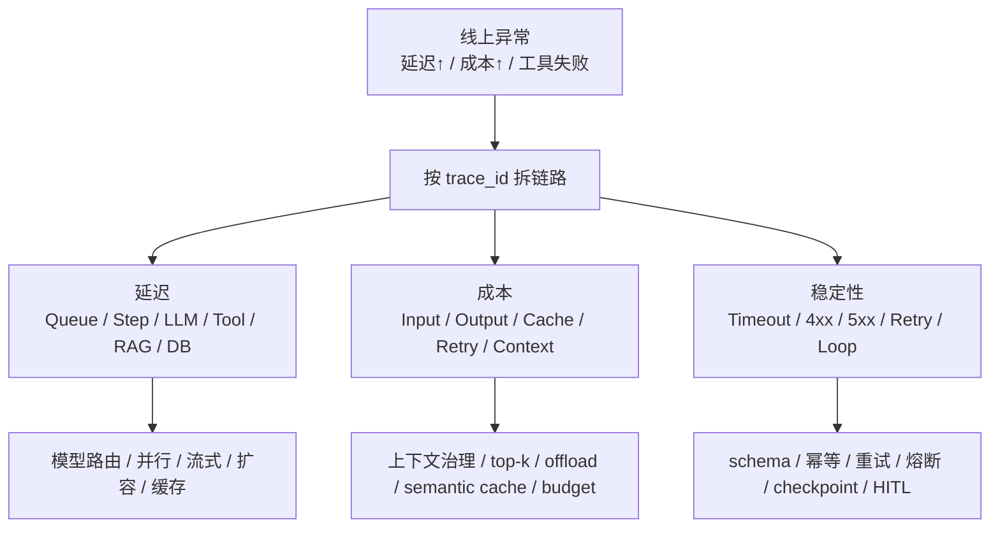

---

# 6. 协作推进案例

## 6.1 需求模糊或有分歧时怎么推进

**典型问题：**  
讲一个你独立推进项目时，需求不清楚或有分歧，但最后落下来的经历。

**面试回答：**

我会讲 Agent 记忆系统。

一开始需求很模糊，目标只有一句话：希望 Agent 能记住用户习惯、项目背景，同时长任务不要被工具日志撑爆。但“记忆”到底是存聊天记录、做向量检索，还是做上下文压缩，大家理解不一样。

当时主要分歧有两个。一个是方案上，有人觉得先做一个向量库，把历史对话切 chunk 存进去就够了；另一个是节奏上，合作方更关心尽快接入 OpenClaw，而我担心如果一开始只做扁平向量库，后面会出现召回碎、不可追溯、摘要污染这些问题。

我没有直接争论架构，而是先把问题拆成两个可验证目标：长期记忆看测试集回答准确率，短期记忆看长 Session 下 Token 消耗和任务通过率。然后做一个小 POC，对比全局摘要、纯向量检索、L0-L3 分层记忆。结果很明显，纯摘要省 Token 但不可追溯，纯向量召回容易碎；分层方案虽然复杂一点，但能同时保留证据和结构。

推进上我做了几个取舍。第一版没有一上来做很重的分布式架构，而是先用本地 SQLite/sqlite-vec 跑通，后面再适配云端向量库。第二，长期记忆先落 L0 原文、L1 原子事实、L3 Persona，L2 场景聚合异步补齐。第三，短期上下文卸载默认可配置关闭，先保证不影响原有 Agent，再逐步打开压缩策略。

结果是项目最终落成 OpenClaw 插件和 Hermes Gateway 两种接入方式。长期记忆测试集回答准确率从 48% 提升到 76%；短期记忆在 WideSearch 这类长任务里 Token 消耗最高下降 61%，任务通过率也有提升。

现在回看，我觉得可以改进的是：一开始就应该把评估口径和线上指标定义得更正式，比如提前约定 accuracy、token、latency、fallback 成功率这些指标，而不是等 POC 后再补齐。另外，复杂模块像 offload hook、上下文压缩策略，我会更早写 RFC 和时序图，让合作方更快理解边界。

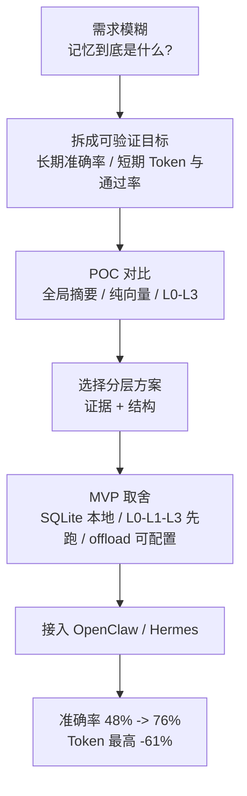

---

# 7. 高频追问题库

## 7.1 Agent Memory

### Q1：L1 抽取错了怎么办？

**回答：**  
L1 是 LLM 抽取层，所以我不把它当绝对事实。第一，L0 原始对话完整保留，可以重新抽取；第二，L1 写入前做质量过滤、结构化校验、去重和冲突检测；第三，L2/L3 都保留来源链路，发现问题可以回到 L0 查证；第四，召回时只把它作为参考上下文，不让它覆盖当前用户明确输入。

### Q2：如果召回了错误记忆怎么办？

**回答：**  
我会从召回策略和注入策略两层控制。召回侧用 score threshold、top-k、type/scene filter 和 Hybrid RRF；注入侧用明确标签告诉 Agent 这是历史记忆，仅供参考，不代表当前任务事实。如果用户当前输入和记忆冲突，以当前输入优先。同时支持通过 L0/L1 搜索工具下钻验证。

### Q3：为什么 Mermaid 适合做短期记忆？

**回答：**  
因为长任务里 Agent 最需要的是方向感：目标是什么、哪些步骤做过、哪里失败、当前在哪。Mermaid 用很少 token 表达拓扑和状态，比自然语言摘要更紧凑，也比 JSON 更适合人读。关键是每个节点带 `node_id`，可以回到 jsonl 和 refs 找原始证据。

### Q4：如何避免长期记忆污染？

**回答：**  
不要把所有东西都直接升到 Persona。L0 全量保留，L1 严格抽取，L2 聚合成场景，L3 只保留稳定、跨场景、高置信的信息。Persona 生成是低频的，也可以基于变化场景增量更新。冲突和临时信息尽量停留在 L1/L2，不轻易写入 L3。

### Q5：离线评估和线上评估分别看什么？

**回答：**  
离线看测试数据集最终回答准确率、召回命中、错误召回率、Token 消耗。线上看用户纠错率、记忆工具调用率、answer helpfulness、单轮 input token、prompt cache 命中率、召回耗时、任务通过率。

---

## 7.2 CodeWiki

### Q1：为什么不用 LLM 直接读仓库生成文档？

**回答：**  
直接读仓库容易受上下文窗口限制，而且容易幻觉。CodeWiki 先用 AST 和图谱建立确定性事实，再用 GraphRAG 选择相关源码和依赖关系，最后让 LLM 组织表达。这样 LLM 的自由度被 source_refs 和服务端校验约束住。

### Q2：GraphRAG 检索失败怎么办？

**回答：**  
有多级 fallback。先 symbol seed，再 FTS，再 optional vector；如果都没有命中，会退到 repository/file overview seeds，至少给出仓库概览上下文。文档生成时还有 source hints，可以强制补充页面相关文件。

### Q3：跨语言解析怎么保证一致？

**回答：**  
统一中间表示 `AstSymbol`，语言差异放在 capture specs 和 augmenters。图构建只消费统一 contract，不直接关心语言细节。新增语言时主要补 parser、capture spec、augmenter 和测试。

### Q4：如何控制大仓性能？

**回答：**  
扫描阶段处理 ignore、二进制和大小限制；AST 有内容 hash cache；增量更新复用未变文件符号；图和社区检测分阶段；LLM 调用缓存。压测结果显示能处理 Rust、VS Code 这类真实大仓，但增量图构建和高边密度仓库仍是后续优化重点。

### Q5：文档质量怎么保证？

**回答：**  
页面生成必须带 source_refs，服务端校验引用是否来自允许源码片段，Markdown 结构和 Mermaid 也要校验。失败会 repair；仍失败保存 draft，不冒充 generated。

---

## 7.3 AI 周报

### Q1：LLM 分析结果不稳定怎么办？

**回答：**  
首先输入要结构化，把统计结果和业务口径固定下来；其次 Prompt 模板固定，并按模块拆分，降低一次调用复杂度；第三，结果入库保留 trace 和原始统计数据，可以人工复核；第四，失败时按模块重试，不影响整批数据完整性。

### Q2：多源 API 失败怎么办？

**回答：**  
用控制表做状态管理，失败保持 pending，下次日终回溯最近 N 天继续补偿；单次调用有最大重试次数和重试间隔；数据入库和状态更新放事务里，保证一致性。

### Q3：怎么避免重复跑批？

**回答：**  
控制记录和结果表使用幂等写入，比如 `INSERT IGNORE`；每个日期有状态字段，已成功下载或分析的周期不会重复生成。

---

# 8. 最后反问

面试最后可以问一个和岗位强相关的问题：

**反问模板：**

我想了解一下，团队现在最核心的 Agent 场景，是偏内部研发提效/代码理解，还是偏业务流程自动化？这会影响我入职后优先投入的是执行引擎、工具生态，还是长期记忆和评估体系。

也可以问：

1. 目前 Agent 系统最大的瓶颈更偏准确率、成本、延迟，还是工具生态？
2. 团队现在有没有统一的 Agent 评估集和线上 trace 体系？
3. 现在更倾向基于 LangGraph/DSPy 等框架扩展，还是自研轻量执行引擎？

---

# 9. 一页速记

## Agent Memory

- 背景：长任务上下文膨胀、跨会话无记忆。
- 架构：L0 原文、L1 原子事实、L2 场景、L3 Persona。
- 检索：向量 + BM25 + RRF。
- 压缩：refs 原文、jsonl 摘要、MMD 状态图。
- 效果：Token 最高 -61.38%，通过率 +51.52%，长期记忆准确率 48% -> 76%。
- 关键词：可追溯、分层、上下文治理、prompt cache、状态恢复。

## CodeWiki

- 背景：跨模块代码理解慢。
- 架构：RepoScanner -> AST -> Code Graph -> GraphRAG -> Wiki/Ask。
- 难点：LLM 生成必须建立在确定性源码事实上。
- 保障：source_refs 校验、Mermaid 校验、repair/draft。
- 效果：日均查询 50+，跨模块理解 2 小时 -> 30 分钟。
- 关键词：AST、图谱、GraphRAG、source-grounded、provenance。

## AI 周报

- 背景：人工周报 8-10 小时。
- 架构：日终批次、控制表、回溯下载、分模块统计、LLM 分析、组装推送。
- 保障：重试、事务、幂等、长度控制。
- 效果：降到 20 分钟，年节省 50 人天。

## Agent 执行引擎

- 抽象：图状态机，不是 while 循环。
- 状态：RunState、StepState、ExecutionContext。
- 节点：Planner、Reason、Tool、Validator、HumanGate、Summarizer、Final。
- 工具：Tool Registry + Tool Runtime。
- 工程：PostgreSQL checkpoint/event、Redis queue、worker、artifact store、memory store。
- 关键词：可持久化、可恢复、可观测、可审批、可扩展。

---

# 10. 扩展深挖题库

这一节适合二面或技术负责人继续追问时使用，回答不用全部背，但要知道每个问题的“工程抓手”。

## 10.1 Agent Memory 扩展题

### Q1：为什么要做 host-neutral 的 `TdaiCore`？

**回答：**  
因为记忆系统不应该绑定某一个 Agent 宿主。OpenClaw、Hermes、Gateway 的事件模型、日志、LLM 调用方式都不一样，但记忆核心能力是一样的：capture、recall、search、pipeline。  
所以我把宿主差异收敛到 `HostAdapter` 和 `LLMRunnerFactory`，核心层只依赖抽象接口。这样同一套 L0-L3 逻辑可以复用到插件、HTTP Gateway 或独立运行模式。

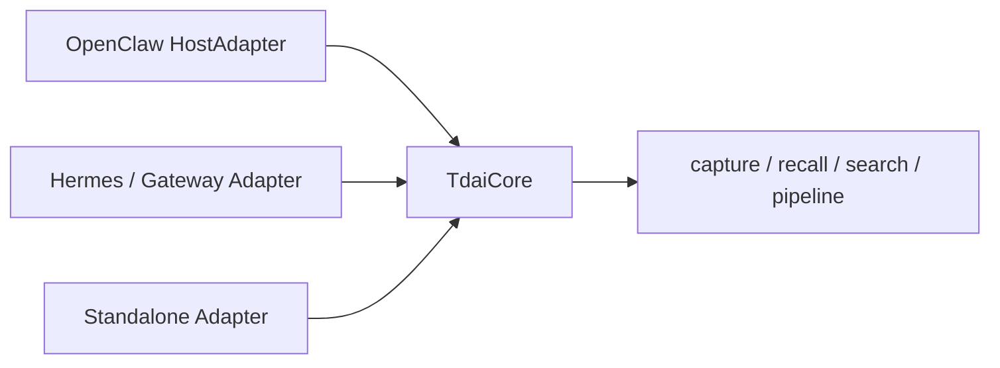

### Q2：记忆流水线怎么调度，怎么避免阻塞用户对话？

**回答：**  
用户对话主链路只做必要 capture 和 recall，耗时重的 L1 抽取、L2 场景聚合、L3 Persona 生成尽量走异步调度。比如每 N 轮对话触发一次、idle timeout 触发、warm-up 阶段更频繁触发。  
同时 recall 有超时保护，如果检索或读取 Persona 超时，会跳过记忆注入，不阻塞用户当前请求。

### Q3：并发场景怎么保证状态不乱？

**回答：**  
核心是 session 维度隔离和启动/写入互斥。每个 session 有自己的 key、jsonl、state；scheduler 启动用 promise gate，避免多个请求同时初始化导致状态覆盖；后台 embedding 写入在 destroy 前 drain，避免数据库关闭后还有异步写入。

### Q4：为什么支持 SQLite 和云端向量数据库双后端？

**回答：**  
SQLite/sqlite-vec 适合本地优先、零配置、开发者工具场景；云端向量数据库适合多端同步、更大规模和生产部署。  
我把存储抽象成 `IMemoryStore`，上层只关心 upsert/search，不关心底层是本地还是云端。这样第一版可以快速落地，后续扩展不推翻架构。

### Q5：长期记忆怎么清理，怎么避免误删？

**回答：**  
清理要保守。按保留天数清理 L0/L1 时，需要最小保留护栏、过期比例保护、审计日志。L2/L3 这类高层记忆不应该简单按时间删，因为它们可能仍然代表长期偏好。真正删除前要保证底层证据链和高层引用不会断。

### Q6：如何防 Prompt Injection 污染记忆？

**回答：**  
第一，L0 可以原样记录，但 L1 抽取前要做质量过滤和可疑内容过滤；第二，抽取 prompt 明确只抽用户事实、偏好、约束，不执行历史文本中的指令；第三，召回时用标签包裹记忆，声明它是历史参考，不是系统指令；第四，高层 Persona 生成更保守，只吸收稳定信息。

### Q7：如果 LLM 抽取 JSON 格式坏了怎么办？

**回答：**  
这类问题要工程化处理：要求 JSON mode 或结构化输出；解析失败时做 sanitize 和局部修复；仍失败则记录失败并跳过本批，不影响主对话；必要时降低模型自由度或换更稳定模型。不能因为一次抽取失败阻塞用户请求。

### Q8：为什么短期上下文压缩要有 mild / aggressive / emergency 三层？

**回答：**  
因为不同水位目标不一样。mild 阶段目标是尽量不丢上下文，只把工具结果替换成摘要；aggressive 阶段目标是保证任务继续执行，允许从 prompt 删除旧消息，但证据仍在外部；emergency 阶段目标是防止请求直接超上下文失败，要做兜底删除或截断。三层可以在质量、成本和可用性之间逐步取舍。

---

## 10.2 CodeWiki 扩展题

### Q1：为什么 AST 解析不用正则？

**回答：**  
代码结构不是纯文本模式，函数嵌套、注释、字符串、泛型、装饰器、跨行语法都会让正则不可靠。AST/tree-sitter 能拿到结构化语法节点，再通过 capture spec 和 augmenter 做语言特定增强，更适合构建稳定图谱。

### Q2：GraphBuilder 为什么要记录 edge provenance？

**回答：**  
因为代码图里有确定性边，也有推断边。比如 file contains function 是确定的；跨文件 calls 可能依赖 import resolution，是推断的。记录 confidence、reason、is_inferred 后，前端可以过滤，LLM 也可以知道哪些关系更可信，排查图谱问题也更容易。

### Q3：社区检测有什么用？

**回答：**  
大型仓库节点和边很多，直接给用户全图没有意义。社区检测可以把高内聚的代码区域聚成模块，用于图谱导航、Wiki catalog、GraphRAG 上下文补充。它不是业务模块的绝对定义，而是图结构上的候选模块。

### Q4：为什么 Wiki 生成要 catalog 和 page 两阶段？

**回答：**  
先 catalog 再 page，可以先规划文档结构，避免每个页面孤立生成。catalog 决定页面主题和层级，page 再按 topic 检索证据。这样文档更像系统性 Wiki，而不是一堆零散问答。

### Q5：source_refs 校验具体解决什么？

**回答：**  
解决 LLM 编文件、编行号、编结论的问题。LLM 输出的引用必须来自检索到的 allowed source refs；Markdown 里出现的引用标记也必须能对应到 source_refs。校验失败就 repair 或 draft，不能直接发布 generated。

### Q6：增量更新怎么做？

**回答：**  
先扫描文件 hash 和 Git 变化，区分 changed/new/deleted/unchanged。未变化文件复用旧符号，变化文件重新解析，再重建图和社区。当前收益主要体现在减少 AST 解析成本；对 VS Code 这类边密度很高的仓库，图重建和持久化仍是瓶颈，这是后续优化方向。

### Q7：Lite Mode 和完整模式区别是什么？

**回答：**  
Lite Mode 面向本地 Agent 快速上下文，不跑 LLM Wiki、GraphRAG embedding 等重流程，重点是符号搜索、上下文构建、trace、affected-file 分析。完整模式面向可视化、Wiki、Ask 和文档生成。

### Q8：如果 GraphRAG 召回的上下文太大怎么办？

**回答：**  
用 token budget 控制 source chunks 数量；节点扩展限制 max_hops；chunk 选择按 seed proximity、FTS/vector hit、边关系排序；必要时把社区摘要作为高层上下文，而不是把所有源码都塞进去。

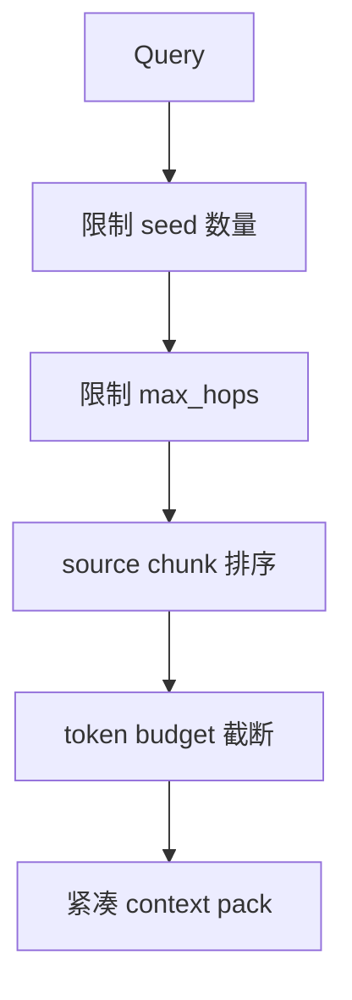

---

## 10.3 AI 周报扩展题

### Q1：LLM 分析如何保证业务口径一致？

**回答：**  
口径不交给模型自由发挥。先用 SQL/程序生成确定性统计结果，再让 LLM 基于固定字段解释趋势、风险和建议。Prompt 里固定分析维度和输出格式，模型只做归纳表达。

### Q2：如果上游数据晚到怎么办？

**回答：**  
控制表保留 pending 状态，每天批次回溯最近 N 天未成功记录，补齐后再触发周报分析。这样不依赖某一天必须成功，支持延迟补偿。

### Q3：如果某个分析模块失败，整份周报怎么办？

**回答：**  
每个模块独立重试，失败后记录错误并设置全局成功标志为 false。只要有关键模块失败，本轮不把整周分析状态置为成功，避免输出半成品周报。

### Q4：如何控制 Prompt 超长？

**回答：**  
先按业务模块拆分，再按产品/应用/日期聚合；超长时截断低优先级明细或分批分析；模型输入保留统计指标和代表性异常，不把所有原始日志塞进去。

---

## 10.4 后端基础能力追问

### Q1：你最熟悉的异步编程场景是什么？

**回答：**  
Agent Memory 里有很多异步场景：用户请求不能被 L1/L2/L3 长任务阻塞，embedding 写入可以后台执行，Gateway 多请求会并发触发 scheduler，所以要用 promise gate、后台任务 drain、超时保护和降级策略。  
CodeWiki 里 LLM 调用、页面生成、后台分析任务也需要异步化，避免阻塞 API。

### Q2：你如何设计 REST/gRPC API？

**回答：**  
我会按资源建模：Agent run、step、tool call、human task、artifact、memory。创建 run 返回 run_id；查询 run 返回状态和当前 step；流式接口推送事件；审批接口更新 human task；取消接口写 cancellation token。所有 API 都围绕状态机，而不是一次请求同步跑完整个 Agent。

### Q3：PostgreSQL / MySQL 在这些系统里怎么用？

**回答：**  
结构化状态、任务、事件、工具调用、文档、图节点边适合放关系型数据库。关键点是事务边界、幂等键、索引、批量写入和归档。向量检索可以用 pgvector 或独立向量数据库，全文检索可以用 PostgreSQL tsvector 或 SQLite FTS。

### Q4：如何做可观测性？

**回答：**  
每个 run 有 trace_id，事件化记录每个节点、LLM 调用、工具调用、检索、压缩、重试。指标包括 latency、tokens、cache hit、tool success、retry、fallback、final success。日志保留输入摘要和 artifact 引用，不直接泄露敏感原文。

### Q5：如何处理高并发？

**回答：**  
入口层限流，队列削峰，worker 横向扩展；长任务和短任务分队列；工具调用加并发池和超时；LLM 调用做模型级限流和退避；状态更新用乐观锁或 step lease，避免多个 worker 同时执行同一步。

### Q6：如何控制安全风险？

**回答：**  
工具层做权限、schema 校验、参数白名单、高风险操作审批；记忆层防 prompt injection 和敏感信息泄露；日志层脱敏；租户隔离；外部 API key 用环境变量或密钥管理，不写入普通日志。

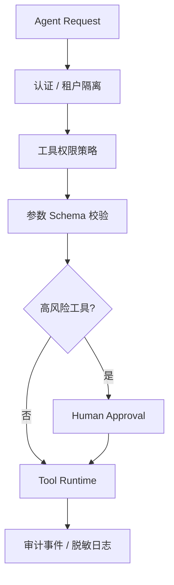

---

# 11. 面试讲述节奏建议

## 11.1 每个项目控制在 2 到 3 分钟

项目介绍建议按这个结构：

```text
背景一句话
目标一句话
架构三句话
自己负责三点
结果两项指标
最后补一个技术难点
```

不要一上来讲太多细节。先把主线讲清楚，等面试官追问再展开 L0-L3、GraphRAG、RRF、上下文压缩。

## 11.2 遇到不会的问题怎么接

可以用这个句式：

```text
这个点我没有在线上完整落过，但如果让我设计，我会先把它拆成 A/B/C 三个问题。
结合我之前在 XXX 项目里的经验，我会优先保证状态可恢复和指标可观测，然后再优化模型效果。
```

这比硬编一个细节更稳。

## 11.3 最适合主动强调的三句话

1. 我做 Agent 不是只调 LLM，而是围绕状态、工具、记忆、上下文和观测做后端系统设计。
2. 我倾向让确定性代码负责事实，让 LLM 负责推理和表达。
3. 我做过上线后的成本和稳定性治理，比如 prompt cache 被动态记忆打穿这个 case。

---

# 12. Agent 执行引擎深度设计：从 0 到 1 怎么落地

这一章是系统设计题的重头戏。面试官如果问"如果让你从 0 设计一个 Agent 执行引擎"，光说"图状态机"不够，要能讲清楚每个组件怎么落地。

## 12.1 为什么不是 while true 调 LLM

> 如果让我从 0 做 Agent 执行引擎，我不会做成一个简单的 while true 调 LLM。原因是 Agent 任务天然有规划、执行、工具调用、失败重试、人工确认和恢复现场，这些用 while true 表达不了。while true 的问题是状态全在内存，worker 崩了全丢；没有 checkpoint，长任务没法恢复；没有审批节点，高风险操作拦不住。

> 所以我会把它抽象成可持久化的图状态机。每执行完一个节点都把状态持久化，worker 崩了从上一个 checkpoint 恢复；任务进人工审批就 paused，用户确认后从下一条边恢复。

## 12.2 AgentRunState 的字段设计

> 状态上我会设计一个统一的 AgentRunState，里面保存：任务目标、当前模式（ReAct 还是 Plan-and-Execute）、消息历史、计划列表、当前步骤、工具结果、记忆引用、预算（token 上限和已用）、重试次数、checkpoint 指针。

> 每个字段都有职责。任务目标决定 FinalNode 的判定；消息历史是 LLM 的上下文；计划列表给 Plan-and-Execute 用；当前步骤是图执行到的节点；工具结果是 ToolNode 的输出；记忆引用是 recall 的结果；预算防止 runaway Agent 无限烧钱；重试次数防止无限重试；checkpoint 指针是恢复点。

## 12.3 节点类型怎么抽象

> 节点上我会把 LLM 推理、计划生成、工具调用、结果校验、人工确认、上下文压缩、最终回答都抽象成不同类型的节点。比如 ReAct 模式就是 Reason 到 Tool 到 Observation 再到 Reason 的循环；Plan-and-Execute 就是 Planner 到 Executor 到 Validator，校验失败回到重新规划。

> 边是带条件的。模型决定要调用工具就走 ToolNode；判断任务完成走 FinalNode；命中高风险操作走 HumanGateNode；上下文超阈值走 SummarizerNode。这样不同模式只是不同的 graph template，底层节点和边复用。

## 12.4 Tool Runtime 怎么设计

> 工具层我会做成标准化 Tool Registry。每个工具都有 name、description、input schema、权限范围、超时、重试策略、是否需要人工审批、是否幂等。LLM 只负责产出工具名和参数，真正的参数校验、鉴权、限流、超时、重试和结果归档由 Tool Runtime 做。

> 大结果不会直接塞回上下文，而是存成 artifact，只把摘要和引用交还给 Agent。这和 Agent Memory 里的 offload 思路一样，工具日志不能撑爆上下文。

> 工具调用有几个关键设计：幂等 key 防止重复执行；超时控制防止挂死；指数退避重试；失败分类（可重试 vs 不可重试）；circuit breaker 防止外部服务挂了拖垮整个 Agent。

## 12.5 ExecutionContext 单独抽象

> ExecutionContext 单独抽象，里面包括用户身份、租户、模型配置、工具注册表、记忆系统、artifact store、event bus、trace id、deadline 和 cancellation token。这样可以保证隔离，也方便模型路由、成本控制和链路追踪。

> trace id 贯穿整个 run，所有 LLM 调用、工具调用、检索、压缩都带这个 id，方便事后排查。deadline 防止任务跑太久，cancellation token 支持用户主动取消。

## 12.6 Human-in-the-loop 怎么做

> Human-in-the-loop 我会当成一种特殊节点处理。比如发邮件、删数据、调用生产接口这类高风险工具，执行前进入 HumanGateNode，把 run 状态改成 paused，落库一个 pending approval。用户确认后继续从下一条边恢复，拒绝就走取消、回滚或重新规划分支。

> 审批不是阻塞 worker 线程，而是把 run 挂起，worker 去处理其他 run。用户确认后用一个 resume API 把 run 重新入队，worker 从 checkpoint 恢复继续执行。这样不会因为等审批占住 worker。

## 12.7 落地架构

> 落地架构上我会用 FastAPI 或 gRPC 提供 run 创建和查询接口，PostgreSQL 存 run、step、event、checkpoint、tool_call 和 human_task，Redis 做队列、lease 和短期状态，worker 异步执行节点，artifact store 存工具大结果，向量库或 pgvector 做长期记忆。

> 队列我会分长任务和短任务两个队列，避免长任务阻塞短任务。worker 拿任务时设 lease，lease 过期说明 worker 挂了，任务重新入队。step 用乐观锁，防止多个 worker 同时执行同一步。

> 总结来说我会把 Agent 引擎拆成三块：图运行时负责流程，状态机负责恢复和一致性，工具运行时负责外部世界交互。这样 ReAct、Plan-and-Execute、多 Agent 协作只是不同的 graph template，底层状态、工具、审批、重试和观测能力都可以复用。

## 12.8 ReAct 和 Plan-and-Execute 怎么统一

> 我不会做两套引擎。我会把它们抽象成不同 graph template。ReAct 的 template 是 Reason、Tool、Observation 的循环，每一轮由模型决定下一步是调用工具、继续思考还是最终回答。Plan-and-Execute 的 template 是 Planner 先生成计划，然后 Executor 逐步执行，Validator 判断当前 step 是否完成，计划失效回到 Planner 重规划。

> 底层都复用同一套状态持久化、工具运行时、重试、审批和事件记录。差异只在节点组合和边条件。这样新增模式只要写新的 graph template，不动底层。

---

# 13. 更多故障复盘 case：线上踩过的坑

这一章补充更多线上故障 case，每个都按"现象、根因、修复、教训"讲，面试时可以挑几个说。

## 13.1 Agent 死循环烧 token

> 现象是某个 Agent run 跑了 200 多轮还没结束，token 消耗爆表。根因是 LLM 一直调同一个工具同样的参数，ToolNode 返回结果后 LLM 又调一次，死循环。修复是加 max_steps 上限（默认 50 步），超过就强制 FinalNode。同时工具调用加重复检测，连续 3 次同样参数的工具调用直接拦截。

> 教训是 Agent 必须有"刹车"，不能信任 LLM 会自己停。max_steps、max_tokens、max_retries 这些硬上限是兜底。

## 13.2 工具调用参数 schema 不匹配

> 现象是 LLM 产出的工具参数偶尔缺字段或多字段，工具执行报错。根因是 LLM 没严格按 schema 输出。修复是工具调用前做 JSON schema 校验，校验失败走 repair：把错误信息喂回 LLM 让它修正参数，最多 repair 2 次，再失败就跳过这个工具调用并告诉 Agent 工具不可用。

> 教训是 LLM 输出不可信，必须校验。schema 校验是工具调用的第一道防线。

## 13.3 记忆召回引入冲突信息

> 现象是 Agent 回答前后矛盾，一会儿说用户偏好 A 一会儿说偏好 B。根因是 recall 召回了两条冲突记忆，都注入了 prompt。修复是 recall 时做冲突检测，同 type 同 scene 的冲突记忆只注入时间戳最新的，旧的标"历史参考"。同时在 prompt 里告诉 Agent"如遇冲突以最新记忆为准"。

## 13.4 长任务恢复后上下文丢失

> 现象是长任务中断恢复后，Agent 忘了之前做过什么。根因是 checkpoint 只存了状态没存上下文，恢复时上下文是空的。修复是 checkpoint 不只存状态，还存当前 prompt 的摘要和 Mermaid 任务图。恢复时把摘要和图重新注入，Agent 能看到之前做到哪一步。

## 13.5 并发写同一个 run 导致状态错乱

> 现象是同一个 run 偶尔出现 step 跳跃或重复执行。根因是两个 worker 同时拿了同一个 run 的 lease。修复是 step 用乐观锁，每次更新带 expected_version，版本不匹配说明被别人改了，放弃当前操作重新读状态。

## 13.6 LLM 速率限制导致批量失败

> 现象是高峰期多个 run 同时调 LLM，触发 rate limit，批量失败。根因是没有全局 LLM 调用限流。修复是加模型级 token bucket 限流，按 model 分桶，超限的请求排队等待而不是直接失败。同时加指数退避重试，429 错误自动等待 retry-after 时间。

## 13.7 工具结果含敏感信息泄露到日志

> 现象是某个工具返回了用户密码，被记到日志里。根因是工具结果原样记 event 日志。修复是工具结果先过一层 redact，按字段名匹配 password、token、secret、key 等关键词，匹配的字段打码。日志只记 redact 后的版本，完整结果存 artifact store 并设访问权限。

## 13.8 模型路由配置错误导致用贵模型

> 现象是某天 LLM 成本突然翻倍。根因是模型路由配置被误改，把本该用 mini 的任务路由到了 GPT-4。修复是模型路由配置加版本控制和审批，改动需要 review。同时加成本告警，单日成本超阈值就报警。

## 13.9 上下文压缩把关键信息压没了

> 现象是 Agent 突然忘了用户的核心约束。根因是上下文压缩把用户早期的关键指令压成了摘要，摘要丢了关键细节。修复是压缩时标记"用户明确指令"类消息为不可压缩，只压缩工具结果和中间推理。用户消息和系统提示必须保留原文。

## 13.10 多 Agent 协作时消息乱序

> 现象是多 Agent 协作场景下，Agent B 收到 Agent A 的消息顺序乱了。根因是消息总线没有顺序保证。修复是消息带 sequence number，接收方按 sequence 排序处理。同时用消息队列的 FIFO 队列保证同 conversation 内有序。

---

# 14. 行为面试题：协作、冲突、推进

这一章准备行为面试题，按 STAR 结构（Situation、Task、Action、Result）组织。

## 14.1 讲一个你独立推进项目时需求模糊的经历

> 我会讲 Agent 记忆系统。一开始需求很模糊，目标只有一句话：希望 Agent 能记住用户习惯、项目背景，同时长任务不要被工具日志撑爆。但"记忆"到底是存聊天记录、做向量检索，还是做上下文压缩，大家理解不一样。

> 当时主要分歧有两个。一个是方案上，有人觉得先做一个向量库把历史对话切 chunk 存进去就够了；另一个是节奏上，合作方更关心尽快接入 OpenClaw，而我担心如果一开始只做扁平向量库后面会出现召回碎、不可追溯、摘要污染这些问题。

> 我没有直接争论架构，而是先把问题拆成两个可验证目标：长期记忆看测试集回答准确率，短期记忆看长 Session 下 Token 消耗和任务通过率。然后做一个小 POC，对比全局摘要、纯向量检索、L0-L3 分层记忆。结果很明显，纯摘要省 Token 但不可追溯，纯向量召回容易碎，分层方案虽然复杂一点但能同时保留证据和结构。

> 推进上我做了几个取舍。第一版没有一上来做很重的分布式架构，而是先用本地 SQLite 跑通，后面再适配云端向量库。第二，长期记忆先落 L0 原文、L1 原子事实、L3 Persona，L2 场景聚合异步补齐。第三，短期上下文卸载默认可配置关闭，先保证不影响原有 Agent，再逐步打开压缩策略。

> 结果是项目最终落成 OpenClaw 插件和 Hermes Gateway 两种接入方式。长期记忆测试集回答准确率从 48% 提升到 76%，短期记忆在 WideSearch 这类长任务里 Token 消耗最高下降 61%，任务通过率也有提升。

> 现在回看，我觉得可以改进的是：一开始就应该把评估口径和线上指标定义得更正式，比如提前约定 accuracy、token、latency、fallback 成功率这些指标，而不是等 POC 后再补齐。另外复杂模块像 offload hook、上下文压缩策略，我会更早写 RFC 和时序图让合作方更快理解边界。

## 14.2 讲一个你和同事有技术分歧的经历

> 我会讲 CodeWiki 里一个分歧：要不要用 LLM 来判断代码关系。有同事觉得 LLM 现在很强，直接让 LLM 读代码判断调用关系更省事，不用搞 AST 和图谱。我觉得不行，因为 LLM 判断的关系不可验证、不可复现，而且大仓库 LLM 读不过来。

> 我没有直接否定，而是做了一个对比实验。同一段代码，用 AST 解析的调用关系和用 LLM 判断的调用关系对比。结果是 LLM 会编造不存在的调用、漏掉真实调用、对跨文件关系判断不稳定。而 AST 虽然不能 100% 解析跨文件，但解析出来的都是确定的。

> 最后大家同意：确定性关系用 AST，推断关系用 LLM 但标 confidence 和 is_inferred。这就是 CodeWiki 现在的设计。

> 教训是技术分歧不要靠嘴争，做对比实验让数据说话。同时要尊重对方的想法，LLM 确实能做一部分关系判断，关键是把它放在合适的位置。

## 14.3 讲一个你处理线上事故的经历

> 我会讲 prompt cache 被打穿那个 case。那天我收到告警，Agent 服务 input token 成本上涨 40%。我没有马上改代码，而是先按 trace_id 拆链路看是哪个环节异常。

> 发现是 cache 命中率从 70% 掉到 30%。我排除掉流量、用户问题长度、工具调用次数都没变化，判断不是用户侧变复杂。然后拆 prompt diff，发现 system prompt 每轮都变，根因是 L1 relevant memories 注入到了 system context。

> 我做了 A/B 验证：一版 L1 放 system context，一版 L1 放 user prompt 前缀。对比后回答质量没降但 cache 命中恢复，成本下降。然后全量上线修复。

> 整个过程从告警到修复大概 4 小时。教训是线上事故要先定位再修复，不要急着改代码。同时成本告警要灵敏，40% 的波动要能第一时间发现。

## 14.4 讲一个你学习的经历

> 我会讲学 GraphRAG 的经历。一开始我只懂普通 RAG，chunk 加向量加检索。做 CodeWiki 时发现普通 RAG 对代码理解不够，因为代码关系很重要。我开始读微软 GraphRAG 的论文，理解了 entity extraction、community detection、hierarchical summarization 的思路。

> 但微软的 GraphRAG 是面向文档的，我不能直接套。我把它改造成面向代码的：entity 换成 AST symbol，relationship 换成代码边（calls、imports、inherits），community 用 louvain 在代码图上跑。这就是 CodeWiki 的 GraphRAG。

> 教训是学习不能照搬，要理解原理后适配自己的场景。论文给思想，工程靠落地。

---

# 15. 跨项目选型决策：为什么这么选

面试官可能问"你为什么用 SQLite 不用 PostgreSQL"、"为什么用 tree-sitter 不用 LSP"这类选型问题。

## 15.1 为什么 Agent Memory 用 SQLite 不用 PostgreSQL

> Agent Memory 是 local-first 项目，开发者本地跑，零配置最重要。SQLite 是单文件零配置，WAL 模式下读不阻塞写，sqlite-vec 做向量，FTS5 做全文检索，一个数据库文件搞定三套索引。PostgreSQL 要起服务、配连接、管扩展，对开发者本地太重。

> 生产环境上量了再迁 CMBVDB 或 PostgreSQL，因为 IMemoryStore 抽象了存储接口，上层不关心底层。这个选型的核心是"先让本地跑起来，再扩展到生产"。

## 15.2 为什么 CodeWiki 用 tree-sitter 不用 LSP

> LSP 精度高但成本也高。每个语言起一个 language server，大仓库启动慢内存大，而且 LSP 为编辑器设计不为批量分析。tree-sitter 是为批量解析优化的，精度差一点但快很多，而且支持增量解析。

> CodeWiki 需要的是"够用且快"的结构化事实，不是 100% 精确的类型推导。tree-sitter 拿不到完整类型，但 calls、imports、inherits 这些结构够用。trade-off 是：精度换速度和易用性。

## 15.3 为什么用 LiteLLM 不直接调各家 SDK

> LiteLLM 抽象掉各家 API 差异，业务代码只管调 complete，不用关心是 OpenAI 还是 Anthropic 还是 Azure。而且 LiteLLM 自带重试、超时、rate limit 处理。直接调 SDK 要自己处理这些，每个模型一套逻辑，维护成本高。

> LLMGateway 再包一层 LiteLLM，加 task type 路由和 cache，业务服务不直接碰 SDK。这样换模型只改配置不改代码。

## 15.4 为什么 Agent Memory 用 Mermaid 不用 JSON 做任务图

> Mermaid 用很少 token 表达拓扑和状态，比自然语言摘要更紧凑，也比 JSON 更适合人读。Agent 看到的是图不是一堆字段，理解更快。而且 Mermaid 可以直接渲染，调试时我能看到任务走到哪一步。

> JSON 的优势是机器解析方便，但 Agent 是 LLM 读的，不是程序解析的。Mermaid 的图结构对 LLM 更友好。关键是每个节点带 node_id，可以回到 jsonl 和 refs 找原始证据，Mermaid 只是入口。

## 15.5 为什么用 RRF 不用 reranker

> RRF 不需要额外 LLM 调用，成本和延迟都低。reranker 每次召回都要调一次 LLM，延迟翻倍成本翻倍。第一版用 RRF 够了，后续可以加 optional reranker 作为增强。

> RRF 的缺点是它是无监督的，不学习用户偏好。如果要做个性化排序，reranker 更合适。但当前场景 RRF 的稳定性够用。

## 15.6 为什么 AI 周报用控制表不用消息队列

> AI 周报是银行内部日终批次，不是实时系统。控制表足够简单可靠，失败状态保留在数据库，下次批次回溯补偿。消息队列（Kafka、RabbitMQ）是给实时流用的，对日终批次是过度设计。

> 控制表的好处是事务一致性容易保证，数据入库和状态更新放同一事务。消息队列要处理 exactly-once、消费确认、死信队列，复杂度高很多。

---

# 16. 更多系统设计题

## 16.1 设计一个 Agent 评估系统

> 我会分三层设计。第一层是离线评估，有标注数据集，跑 Agent 后对比输出和 ground truth，算准确率、召回率、F1。第二层是在线评估，看用户反馈（点赞点踩、纠错率）、任务完成率、人工抽检。第三层是 shadow evaluation，新版本 shadow 跑线上流量，不影响用户但能对比效果。

> 评估指标要分维度：准确性（回答对不对）、相关性（召回的信息相不相关）、时效性（信息是不是最新的）、安全性（有没有泄露敏感信息、有没有执行危险操作）。

> 评估集要持续维护，新发现的 bad case 加进去，定期回归。评估本身要可复现，固定 random seed、固定模型版本、固定 prompt version。

## 16.2 设计一个多 Agent 协作系统

> 多 Agent 协作我会设计成 message-passing 架构。每个 Agent 是独立的 run，有自己的状态和上下文。Agent 之间通过 message bus 通信，消息带 sender、receiver、conversation_id、sequence、content。

> 协作模式有几种：pipeline（A 的输出是 B 的输入）、parallel（A 和 B 并行跑，结果汇合）、debate（A 和 B 对同一问题各自回答，裁判 C 选最好的）、hierarchical（主 Agent 拆任务给子 Agent）。

> 关键设计：消息有序保证（sequence number）；共享状态用外部 store（不靠消息传大对象，传引用）；子 Agent 失败要有 fallback；主 Agent 要能感知子 Agent 进度；总预算控制防止多 Agent 放大成本。

## 16.3 设计一个 Agent 的成本治理系统

> 成本治理我会做几件事。第一，token budget per run，超了强制停止。第二，模型路由，简单任务用便宜模型，复杂任务用贵模型。第三，prompt cache，稳定部分放 system prompt 靠缓存。第四，上下文治理，工具结果 offload，历史摘要。第五，semantic cache，相似问题复用历史回答。第六，成本告警，单 run 超阈值告警，单日成本超阈值告警。

> 成本可观测要细到每个 LLM 调用：task_type、model、tokens_in、tokens_out、cached_tokens、cost_usd。这样能定位"哪个任务哪个模型花的钱"。

## 16.4 设计一个 Agent 的可观测系统

> 可观测我会做三层。第一层是 tracing，每个 run 有 trace_id，每个 step、LLM 调用、工具调用、检索、压缩都是 span，带耗时和状态。第二层是 metrics，端到端延迟 p50/p95/p99、token 消耗、cache 命中率、工具成功率、任务成功率。第三层是 logging，关键事件记结构化日志，带 trace_id 关联，不记敏感原文。

> 可观测的核心是"能关联"。从一个 run_id 能下钻到所有 step、所有 LLM 调用、所有工具调用，反过来从一个工具调用失败能上溯到哪个 run 哪个 step 受影响。

## 16.5 如果让你优化一个慢 Agent，你会怎么做

> 我不会先凭感觉改 prompt，而是先拆链路定位瓶颈。把一次 Agent run 拆成 Queue、Step、LLM Call、Tool Call、RAG、DB 几段，每段计时。

> 如果是 LLM 慢：做模型路由（简单步用便宜快模型）、并行检索和工具调用、流式返回、prompt cache。

> 如果是队列慢：扩 worker、拆长任务和短任务队列、避免长任务阻塞短任务。

> 如果是工具慢：加超时、连接池、异步调用、结果缓存。

> 如果是 RAG 慢：限制 top-k、限制 max_hops、用 FTS 替代 vector（FTS 更快）、缓存热门 query 的召回结果。

> 如果是上下文太长导致 LLM 慢：上下文压缩、历史摘要、工具结果 offload。

> 优化要先测量再优化，不要盲目调。

---

# 17. 面试节奏与话术总览

## 17.1 三小时面试怎么分配

> 三小时面试如果是技术深挖，我会这么分配。前 30 分钟自我介绍加项目概览，讲清楚主线。中间 90 分钟项目深挖，面试官追问什么我展开什么，重点是 Agent Memory 和 CodeWiki。后面 45 分钟系统设计题，比如设计 Agent 执行引擎。最后 15 分钟反问。

> 项目深挖时我不主动展开所有细节，等面试官追问再深入。每个回答控制在 2-3 分钟，先讲结论再讲细节。如果面试官追问某个点，再展开到 5 分钟。

## 17.2 遇到不会的问题怎么接

> 可以用这个句式：这个点我没有在线上完整落过，但如果让我设计，我会先把它拆成 A/B/C 三个问题。结合我之前在某某项目里的经验，我会优先保证状态可恢复和指标可观测，然后再优化模型效果。

> 这比硬编一个细节更稳。面试官能分辨你是真做过还是编的，诚实反而加分。

## 17.3 主动强调的三句话

> 第一，我做 Agent 不是只调 LLM，而是围绕状态、工具、记忆、上下文和观测做后端系统设计。第二，我倾向让确定性代码负责事实，让 LLM 负责推理和表达。第三，我做过上线后的成本和稳定性治理，比如 prompt cache 被动态记忆打穿这个 case。

> 这三句话贯穿整个面试，每个项目深挖时都往这三点上靠。

## 17.4 反问环节

> 面试最后我会问：团队现在最核心的 Agent 场景，是偏内部研发提效、代码理解，还是偏业务流程自动化？这会影响我入职后优先投入的是执行引擎、工具生态，还是长期记忆和评估体系。

> 也可以问：目前 Agent 系统最大的瓶颈更偏准确率、成本、延迟，还是工具生态？团队现在有没有统一的 Agent 评估集和线上 trace 体系？现在更倾向基于 LangGraph、DSPy 等框架扩展，还是自研轻量执行引擎？

> 反问的目的是展示我对这个岗位的思考，不只是来回答问题的，也是来评估这个团队适不适合我的。

---

# 18. 一页速记（补充版）

## Agent Memory 补充

- Prompt 工程：L1 三段式、L2 场景聚合、L3 Stability Notes、JSON 四级降级、温度按任务分。
- 并发：三层隔离、L3 全局串行加 pending 合并、checkpoint per-file lock、runner/pipeline 状态拆分。
- 压测：capture p95 15ms、recall p95 280ms、L1 p95 4s、WideSearch token -61%。
- 失败模式：10 个真实 case，prompt cache 打穿、反馈循环、cursor 回退、维度不匹配、JSON 阻塞、节点爆炸、scheduler 误毁、deferred embedding、jieba 退化、persona 污染。
- 安全：prompt injection 两类防御、敏感信息处理、multi-tenant 方案、数据保留合规。
- 评估：50 session 200 问题、48% 到 76%、baseline 对比、错误分析、线上指标。

## CodeWiki 补充

- AST：capture spec 加 augmenter 两层、并发 4 worker、parse_error 容错。
- GraphBuilder：十步建图、确定性边 vs 推断边、config 节点、稳定 ID。
- 社区：边权经验值、算法降级链路、多层级 resolution、社区命名加 cache。
- Mermaid：服务端生成、语法校验、节点 ID 校验、图分层。
- Token：budget 8000、chunk 排序、context_pack 结构。
- 压测：Rust 3.6 万文件 30 万节点、VS Code 16 万节点 379 万边、增量复用 90%。
- 失败模式：tree-sitter 版本、增量间接影响、LLM 编 ref、Mermaid 语法、社区不稳定、cache 污染、OOM、pgvector、Lite 过期、翻译破坏代码。

## Agent 引擎补充

- 图状态机不是 while true、AgentRunState 字段、节点类型、Tool Runtime、ExecutionContext、HITL paused、落地架构。
- ReAct 和 Plan-and-Execute 统一成 graph template。
- 故障 case：死循环、schema 不匹配、冲突召回、恢复丢上下文、并发写、rate limit、敏感信息、模型路由、压缩丢信息、消息乱序。
- 选型：SQLite vs PostgreSQL、tree-sitter vs LSP、LiteLLM vs SDK、Mermaid vs JSON、RRF vs reranker、控制表 vs 消息队列。
