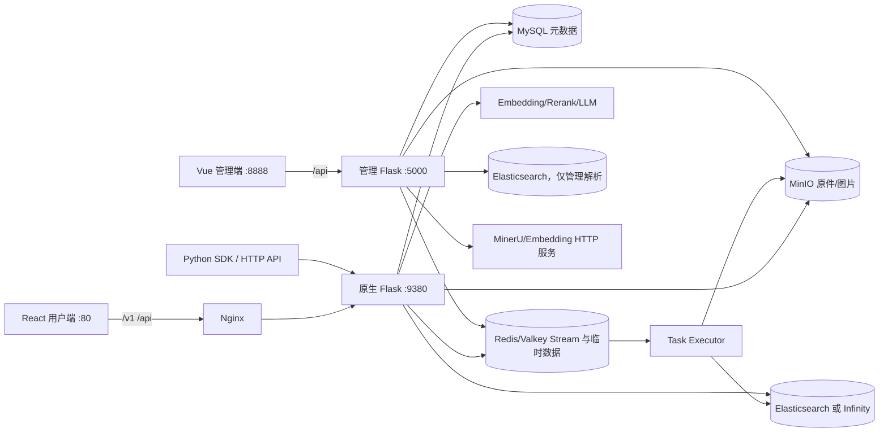
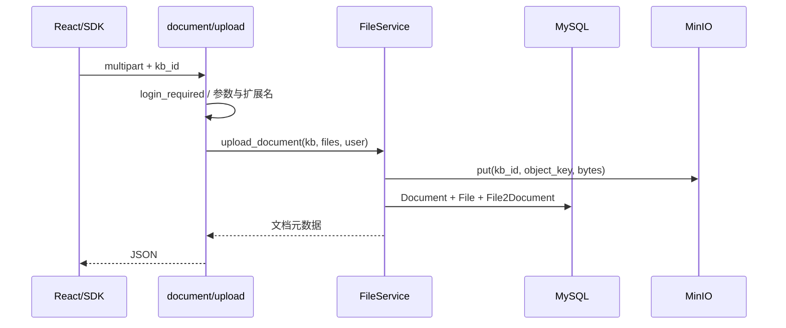
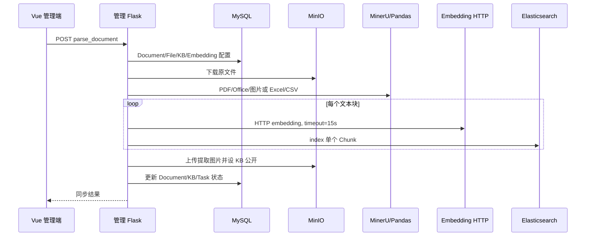

# Ragflow-Plus 全链路源码级深入分析

> **证据基线**：分析提交 `3f7aac2512f80a77cf0ad5c1f6e673f0fa39d63c`（`main...origin/main`，`git describe` 为 `v0.5.0-6-g3f7aac2`）。分析开始时工作区已有 `M docs/_sidebar.md` 与 `?? docs/project-analysis/`，本次未修改。行号均以该提交为准。
>
> **规模快照**：Git 跟踪文件 1196；`cloc` 去重后 1079 个代码文件、177195 行，主要是 JSON 50976、TypeScript 43845、Python 29992、YAML 23585、SVG 16012、Vue 6114 行。规模只描述仓库，不等于运行覆盖率。
>
> **事实标签**：**当前实现**=源码与注册/调用链可证明；**代码推断**=调用关系支持但未完成真实基础设施运行；**文档声明**=README/说明文字，未作为唯一证据；**下一版设计**=当前不存在；**待本人确认**=个人职责、团队、上线、用户量、QPS、收益、事故。

---

## 0. 一句话定义

**当前实现**：Ragflow-Plus 是以 RAGFlow v0.17.2 镜像和源码演进线为基础，保留原生 Flask + React RAG 主链，同时增加独立 Flask + Vue 管理系统、MinerU/Excel 管理解析、文档撰写、跨语言查询前置翻译和图片管理的一套二次开发仓库；它不是“完整重写的 RAG 平台”，也不是当前可用的通用 Agent 平台。基础镜像与覆盖目录见 `Dockerfile:1-18`，原生服务入口见 `api/ragflow_server.py:50-104`，管理入口见 `management/server/app.py:12-85`。

## 1. 先给结论

1. **主干能力是真实 RAG 闭环**：上传、MySQL 元数据、MinIO 原件、Redis Stream、Worker、Chunk/Embedding、ES/Infinity、Hybrid/Rerank、LLM、引用与 SSE 都有入口和调用方（`api/apps/document_app.py:51-75`；`api/db/services/task_service.py:193-313`；`rag/svr/task_executor.py:150-588`；`api/db/services/dialog_service.py:101-357`）。
2. **Plus 的主要价值在“运营管理与图文工作流”**，不是替换原生检索内核。管理端直接操作共享 MySQL/ES/MinIO，形成第二条同步 MinerU/Excel 解析链（`management/server/routes/knowledgebases/routes.py:235-252`；`management/server/services/knowledgebases/document_parser.py:107-672`）。
3. **当前提交存在发布阻断项**：Worker 静态导入 11 个仓库中不存在的 `rag.app` 模块；管理 API 大面积缺少强制 JWT/RBAC；GraphRAG 查询调用参数与返回契约不匹配；原生 PDF 页数被固定为 1（`rag/svr/task_executor.py:33-64`；`management/server/services/auth/auth_utils.py:8-33`；`api/db/services/dialog_service.py:509-524`；`api/db/services/task_service.py:226-254`）。
4. **可靠性不是 exactly-once**：业务异常后消息仍 ACK，管理批量任务只存在进程内字典/守护线程，多存储写入无统一事务（`rag/svr/task_executor.py:564-588`；`management/server/services/knowledgebases/service.py:1276-1390`）。
5. **不能宣称 Agent 可用**：Deep Research 文件无调用方，Agent/Canvas 主实现已从当前树删除，仅余 URL 等死代码（`agentic_reasoning/deep_research.py::DeepResearcher`；`web/src/utils/api.ts:138-148`；Git 提交 `aee7779`、`86303e3`）。

## 2. Ragflow-Plus 与上游 RAGFlow 的关系

### 2.1 能证明什么

- 根镜像明确是 `infiniflow/ragflow:v0.17.2-slim`，再覆盖 `api/`、`rag/`、`graphrag/`、`agentic_reasoning/` 和 `web/`（`Dockerfile:1-18`）。
- Git 历史存在 `0f9b878 up to v0.17.2`、`4624f89 up to v0.17.2_supple`；当前 Python 包元数据却写 `0.18.0`（`pyproject.toml:1-10`）。当前仓库标签、包版本、基础镜像是三套版本轴，不能混说。
- 原生动态 Blueprint、Peewee Service、Worker 与检索内核保留明显上游结构（`api/apps/__init__.py:96-139`；`api/db/db_models.py:438-935`；`rag/nlp/search.py:404-529`）。

### 2.2 不能证明什么

**诚实边界**：本次没有对上游官方 v0.17.2 做逐文件完整 diff，因此“Plus 新增”以当前 Git 历史的新增提交、独立目录和可达入口为证据；不能把所有与上游不同的行都归为某个人的贡献，也不能说已经无损兼容官方新版本。

## 3. Plus 新增或强化的能力地图

| 能力 | 可达性结论 | 证据 |
|---|---|---|
| 独立管理系统 | **当前实现，可启动**；Vue 8888 -> Flask 5000 | `docker/docker-compose.yml:31-78`；`management/server/routes/__init__.py:5-28` |
| MinerU/Excel/CSV 解析 | **当前实现**；只走管理 ES 链 | `management/server/services/knowledgebases/document_parser.py:107-672`；`management/server/services/knowledgebases/excel_parser.py:6-49` |
| 文档撰写 | **当前实现**；可无 KB 直接 Chat，有 KB 时检索并追加图片 | `api/apps/conversation_app.py:414-438`；`api/db/services/write_service.py:20-129` |
| 图片集与 Chunk 换图 | **当前实现**；协议存在不一致 | `api/apps/kb_app.py:261-327`；`api/apps/chunk_app.py:109-170` |
| 跨语言检索 | **当前实现但边界较窄**；浏览器固定中文转英文 | `web/src/hooks/logic-hooks.ts:185-309`；`api/apps/translate_app.py:30-100` |
| 聊天临时附件 | **当前实现**；Redis 临时内容按用户校验 | `api/apps/conversation_app.py:289-342` |
| GraphRAG 查询 | **构建可达，问答契约阻断** | `rag/svr/task_executor.py:491-502`；`graphrag/search.py:139-150`；`api/db/services/dialog_service.py:509-524` |
| Deep Research / Agent | **文件存在但不可达/已删除** | `agentic_reasoning/deep_research.py::DeepResearcher`；Git 提交 `aee7779`、`86303e3` |

## 4. 总体架构图

边界证据：原生 Nginx 反代见 `docker/nginx/ragflow.conf:13-21`；管理 Nginx 反代见 `docker/nginx/management_nginx.conf:16-25`；原生文档引擎选择见 `api/settings.py:113-124`；管理连接为直接客户端见 `management/server/database.py:28-80`。

## 5. 四个应用面的职责

| 应用面 | 职责 | 不负责什么 |
|---|---|---|
| Flask 原生后端 | 用户、团队、KB、上传、任务、会话、检索生成、SDK | 不执行管理端 MinerU 逐块同步链 |
| React/Umi 用户端 | 用户操作、Chat SSE、引用、撰写、图片集 | 不决定服务端对象授权 |
| Flask 管理后端 | 运营视图、用户/团队/文件/KB 管理、MinerU/Excel 解析 | 没有复用原生 Peewee Service 与完整 RBAC |
| Vue/Vite 管理端 | 管理交互与 JWT 携带 | 前端路由守卫不是服务端权限 |

原生启动见 `api/ragflow_server.py:50-104`；管理蓝图见 `management/server/routes/__init__.py:5-28`；前端脚本与技术栈见 `web/package.json:4-12`、`management/web/package.json:8-16`。

## 6. 模块地图

- `api/apps/`：动态注册的 HTTP/SDK 边界，不能只看装饰器，前缀由 `register_page()` 生成（`api/apps/__init__.py:96-139`）。
- `api/db/services/`：Peewee 服务、任务编排、对话编排；事务边界分散。
- `rag/app/`：解析器目录；当前仅 `qa.py`、`resume.py`、`tag.py`，与 Worker 工厂不一致（`rag/svr/task_executor.py:33-64`）。
- `rag/svr/task_executor.py`：Redis 消费、解析、Embedding、索引、GraphRAG/RAPTOR 后处理。
- `rag/nlp/search.py`：全文/向量初召回、融合、二次排序、引用补齐。
- `graphrag/`：图构建和 KG 检索，查询端契约尚未接通。
- `management/server/`：独立 SQL/客户端风格的管理后端。
- `web/`、`management/web/`：两套独立前端。

## 7. 原生系统启动

`api/ragflow_server.py` 依次初始化日志、配置、数据库表、LLM 工厂和运行时配置，再启动一个每 6 秒聚合文档进度的线程，最后用 Werkzeug `run_simple(threaded=True)` 提供 HTTP（`api/ragflow_server.py:24-40,50-104`）。

**设计判断**：开发服务器简洁，但生产环境缺少 Gunicorn/uWSGI 的 worker 管理、优雅排空和请求级超时。Compose 入口又在无限循环中直接重启 API 与 Worker（`docker/entrypoint.sh:19-33`）。

## 8. 路由注册机制

原生端不是手工集中清单：它扫描 `*_app.py` 与 `sdk/*.py`，动态注入 `manager` Blueprint；Web 路由前缀为 `/v1/<page>`，SDK 路由为 `/api/v1`（`api/apps/__init__.py:96-139`）。这解释了单独 import 某个 `_app.py` 时 `manager` 未定义，但运行时注册能够成立。

管理端则显式注册 users、teams、tenants、files、knowledgebases、conversation 六个 Blueprint（`management/server/routes/__init__.py:5-28`）。

## 9. 原生认证与 Session

- Flask Session 是 filesystem，非 Redis；最大请求体默认 128 MiB（`api/apps/__init__.py:76-91`）。容器多副本下 Session 不共享。
- 登录态 Authorization 不是标准 JWT：`User.get_id()` 用 `itsdangerous.Serializer` 序列化数据库 `access_token`，请求加载器反序列化后查 User（`api/db/db_models.py:438-485`；`api/apps/__init__.py:142-171`）。
- SDK API Key 走另一套 `APIToken`，换出 `tenant_id`（`api/utils/api_utils.py:286-305`；`api/db/db_models.py:935`）。
- 当前请求加载器用 `print` 输出完整 Authorization、反序列化 token 与用户邮箱，构成敏感日志泄露（`api/apps/__init__.py:142-171`）。

## 10. 管理认证与权限模型

管理登录签发 1 小时 HS256 JWT，载荷含 `user_id/username/role/tenant_id`（`management/server/app.py:44-81`）。但 `decode_token()` 在缺失或无效 Token 时只返回 `None`（`management/server/services/auth/auth_utils.py:8-33`），绝大多数路由没有统一强制鉴权。

可复现路径：无 Token 请求团队、文件或 KB 列表时，路由只在解析出用户时加租户过滤，否则查询全局数据（`management/server/routes/teams/routes.py:6-26`；`management/server/routes/files/routes.py:34-58`；`management/server/routes/knowledgebases/routes.py:11-31`）。只有 `/users/me` 等少数路径显式拒绝缺失 JWT（`management/server/routes/users/routes.py:83-124`）。

**影响**：若 5000 端口或 8888 代理可达，攻击者可能读取全局元数据并调用修改/删除/解析接口。前端隐藏菜单无法弥补服务端缺口。

## 11. 用户、团队与对象权限

关系模型是 `User -> UserTenant -> Tenant -> Knowledgebase -> Document`：用户和租户是多对多，`UserTenant.role` 表示团队角色，KB 有 `me|team` 权限（`api/db/db_models.py:438-552,664-717`）。原生 KB/文档有 `accessible()` 检查（`api/db/services/knowledgebase_service.py:237-266`；`api/db/services/document_service.py:222-242`），但调用不统一：

- 文档下载无 `login_required` 且没有对象归属检查（`api/apps/document_app.py:395-414`）。
- 图片代理无鉴权（`api/apps/document_app.py:459-471`）。
- `chunk/list` 虽要求登录，但从文档反查 tenant 后直接搜索，没有调用文档 accessible（`api/apps/chunk_app.py:35-76`）。
- 上传入口只按 `kb_id` 取 KB，没有在该入口调用 accessible（`api/apps/document_app.py:51-75`）。

结论不是“完全没有权限”，而是“有身份、团队和对象检查能力，但策略散落且存在绕过路由”。

## 12. 核心数据模型

| 模型 | 核心职责 | 证据 |
|---|---|---|
| `User` | 身份、access token、状态 | `api/db/db_models.py:438-488` |
| `Tenant` | 团队默认 LLM/Embedding/Rerank 等 | `api/db/db_models.py:491-535` |
| `UserTenant` | 用户-团队角色关系 | `api/db/db_models.py:538-552` |
| `Knowledgebase` | tenant、Embedding、权限、Parser、阈值 | `api/db/db_models.py:664-717` |
| `Document` | 文件元数据、Parser、进度、Chunk/Token 计数 | `api/db/db_models.py:720` |
| `File` / `File2Document` | 文件树与对象存储地址映射 | `api/db/db_models.py:782,823` |
| `Task` | 页范围、digest、进度、chunk_ids | `api/db/db_models.py:842` |
| `Dialog` / `Conversation` | 助理配置、消息与引用 | `api/db/db_models.py:862,923` |
| `APIToken` | SDK tenant token | `api/db/db_models.py:935` |

没有数据库外键就不能把关联存在等同于强引用完整性；多存储删除需要应用层维护。

## 13. 四类存储的数据职责

| 存储 | 当前职责 | 一致性风险 |
|---|---|---|
| MySQL | 用户、团队、模型配置、KB、文档、文件、任务、会话 | 与索引/对象存储无跨资源事务 |
| Redis/Valkey | Redis Stream 任务队列、Worker 心跳/状态、临时附件 | `allkeys-lru` 且仅 128 MiB，队列也可能被逐出（`docker/docker-compose-base.yml:81-93`） |
| MinIO | 原文件、解析图片、撰写公开图片 | 原生与管理图片 key 协议不统一 |
| Elasticsearch/Infinity | Chunk、向量、关键词、图实体关系 | 管理解析只支持 ES；Compose 无 Infinity service |

对象存储工厂支持 MinIO/Azure/S3/OSS（`rag/utils/storage_factory.py:27-50`）；文档引擎只接受 Elasticsearch/Infinity（`api/settings.py:113-124`）。

## 14. 原生上传链路

入口见 `api/apps/document_app.py:51-75`，实际对象/元数据创建见 `api/db/services/file_service.py:332-389`。对象写入与多张 MySQL 表创建不是一个原子事务，失败时可能留下孤儿对象或不完整映射。

## 15. 从“点击解析”到任务入队

解析路由校验登录、读取文档和 KB、清旧 Chunk/任务、创建新 Task 并推 Redis（`api/apps/document_app.py:311-362`；`api/db/services/task_service.py:193-313`）。Task 的 digest 由分块配置、`doc_id/from_page/to_page` 哈希构成，可复用同范围、同 digest 且已成功的旧 Chunk（`api/db/services/task_service.py:260-338`）。

**幂等边界**：这是“同文档同配置重解析复用”，不是跨请求 exactly-once。旧任务先删、旧 Chunk 再删、新任务再入库/入队，中间失败没有事务补偿（`api/db/services/task_service.py:283-313`）。

## 16. 原生 PDF 分页缺陷

**当前缺陷**：PDF 总页数被写死 `pages = 1`；默认页范围随后被裁到 1，因此一般只产生 `[0,1)` 一个任务（`api/db/services/task_service.py:226-254`）。

- 触发：PDF 走原生 `launch_builtin_parser()`。
- 路径：解析 API -> `queue_tasks()` -> 固定页数 -> Worker `chunker.chunk(from_page,to_page)`。
- 影响：多页 PDF 通常只解析第一页，Chunk/引用看似成功但内容不完整。
- 修复：入队前从 PDF 元数据取得真实页数；加入 2 页、13 页、页范围裁剪的契约测试；对已有 `progress=1` 文档提供重建任务。

## 17. Redis Stream 与 Worker 消费

Worker 优先遍历 pending/unacked，再 `XREADGROUP` 新消息；未知或取消任务直接 ACK（`rag/svr/task_executor.py:150-185`；`rag/utils/redis_conn.py:196-265`）。成功与业务异常最终都会 `redis_msg.ack()`（`rag/svr/task_executor.py:564-588`）。

因此当前语义更接近“领取后至多一次业务处理”：进程在 ACK 前崩溃可由 pending 恢复；业务代码捕获异常后会 ACK，不会自动重投。`retry_count` 不能补偿已 ACK 的失败。

## 18. Worker 当前可启动性

`task_executor.py` 导入 `laws/paper/presentation/manual/table/book/picture/naive/one/audio/email` 等 `rag.app` 模块（`rag/svr/task_executor.py:33-64`），但当前目录只有 `qa.py`、`resume.py`、`tag.py`。静态路径抽查确认 11 个模块缺失。

**代码推断**：直接从当前源码运行 Worker 会在 import 阶段失败。根 Dockerfile 基于上游镜像后用 `COPY rag ./rag` 覆盖；Docker 对目录的覆盖/合并可能保留基础镜像残留模块，因此镜像构建后的行为需要实测，不能把该推断写成“容器一定失败”（`Dockerfile:1-18`）。这也意味着镜像不可由当前仓库源码独立、透明复现。

## 19. Parser 到 Chunk

Worker 根据 `parser_id` 从 `FACTORY` 选解析器，从 `File2Document` 找对象存储地址、拉二进制，再把 CPU/阻塞解析放入 Trio 线程（`rag/svr/task_executor.py:192-228`）。每个 Chunk 至少携带 `doc_id/kb_id`，解析器补充正文、token、位置、图片等字段（`rag/svr/task_executor.py:230-349`）。

Chunk 并不是 MySQL 行，而是文档引擎中的 JSON 文档；Task 只保存 Chunk ID 串用于复用/清理（`rag/svr/task_executor.py:529-547`）。

## 20. Chunk ID 与图片 ID 协议

- 手工 Chunk ID 是 `xxhash64(content + doc_id)`（`api/apps/chunk_app.py:216-225`），相同文档相同内容会碰到同 ID，不能表达同文重复段落的不同位置。
- 检索层把存储字段 `img_id` 映射为 API `image_id`（`rag/nlp/search.py:496-516`）。
- 原生图片代理把 `<bucket-name>` 按 `-` 拆 bucket/object（`api/apps/document_app.py:459-469`）。
- 管理 MinerU 写 `<kb_id>/images/<uuid>.<ext>`（`management/server/services/knowledgebases/document_parser.py:574-616`），不能天然满足上述 `-` 拆分协议。

这不是单纯命名风格问题，会导致预览、引用插图与删除生命周期各走一套解释。

## 21. Embedding 与索引

原生 Worker 每 16 个内容批量 Embedding；标题只编码一次后复制，以 `filename_embd_weight` 融合标题/正文，向量字段名为 `q_<dim>_vec`（`rag/svr/task_executor.py:357-399`）。索引写入每批 4 个 Chunk，成功后把已写 ID 回填 Task，最后增加文档 Chunk/Token 计数（`rag/svr/task_executor.py:529-557`）。

优点是批量模型调用和可记录已写 ID；缺点是 ES 第 N 批失败时前 N-1 批已落地，MySQL 计数尚未统一提交，恢复依赖应用补偿而非事务。

## 22. 管理端 MinerU/Excel 解析链

路由同步调用见 `management/server/routes/knowledgebases/routes.py:235-252`；数据装配见 `management/server/services/knowledgebases/service.py:827-896`；主链见 `management/server/services/knowledgebases/document_parser.py:107-672`；Excel/CSV 使用 pandas 见 `management/server/services/knowledgebases/excel_parser.py:6-49`。

## 23. 两条解析链的差异矩阵

| 维度 | 原生链 | 管理 MinerU/Excel 链 |
|---|---|---|
| 调度 | MySQL Task + Redis Stream + Worker | 默认 HTTP 同步；另有 daemon thread 包装 |
| Parser | RAGFlow `rag.app` 工厂 | `magic_pdf` / pandas |
| Embedding | LLMBundle，批量 16 | 每 Chunk 单独 HTTP，15 秒超时（`management/server/services/knowledgebases/document_parser.py:486-533`） |
| 索引 | ES 或 Infinity，批量 4 | 只支持 ES，逐块 `index`（`management/server/services/knowledgebases/document_parser.py:392-565`） |
| 图片 | Parser 生成 `img_id`/对象 | `<kb>/images/uuid`，按块序号距离 `<5` 关联（`management/server/services/knowledgebases/document_parser.py:574-651`） |
| 成功 | Task/Document 聚合 | 更新 Document、KB、Task（`management/server/services/knowledgebases/document_parser.py:654-663`） |
| 失败 | progress=-1，消息 ACK | `status="1", run="0"`（`management/server/services/knowledgebases/document_parser.py:665-672`） |
| 恢复 | pending 可恢复，业务异常不重投 | 内存任务字典；进程重启丢失（`management/server/services/knowledgebases/service.py:1276-1390`） |

“写入同一 ES 索引”不代表语义一致：向量模型、Chunk 结构、图片 key、失败状态和重试模型都不同。

## 24. 在线问答主链

HTTP/SSE 入口见 `api/apps/conversation_app.py:289-409`；服务编排见 `api/db/services/dialog_service.py:101-357`；前端消费见 `web/src/hooks/logic-hooks.ts:302-346`。

## 25. Keyword 增强

当 `prompt_config.keyword` 开启，系统先用 Chat 模型抽关键词并直接拼到查询字符串（`api/db/services/dialog_service.py:187-192`；`rag/prompts.py:213-220`）。优点是改善短问句词法召回；代价是多一次 LLM 延迟/费用，且当前没有独立超时、缓存命中指标或失败降级策略说明。

## 26. Hybrid 初召回

`Dealer.search()` 同时构造 `MatchText` 与 `MatchDense`；初始融合固定为全文 0.05、向量 0.95，零结果时降低阈值重试（`rag/nlp/search.py:147-194`）。这只是候选召回阶段，不等于 Dialog 配置中的最终 `vector_similarity_weight` 被忽略：后续 `rerank()` 会用调用参数重新融合。

面试时应说“两阶段权重”：搜索引擎初筛有固定 0.05/0.95，应用层二次排序再按 Dialog 权重处理。

## 27. Rerank 与特征融合

- 无 Rerank 模型：用 token 相似度、向量相似度与 `pagerank/tag` 等 rank feature 组合（`rag/nlp/search.py:320-378`）。
- 有 Rerank 模型：以模型相似度替换 token 相似度，再与向量/特征融合（`rag/nlp/search.py:380-399`）。
- 最终 `retrieval()` 执行 Top N、相似度阈值、文档聚合与字段归一化（`rag/nlp/search.py:404-529`）。

## 28. Prompt 与 Token 预算

`kb_prompt()` 逐 Chunk 计算 token，超过模型预算时截断，保证知识上下文不无限膨胀（`rag/prompts.py:136-166`）。对话消息再通过 `message_fit_in(..., max_tokens*0.95)` 压到窗口内（`api/db/services/dialog_service.py:223-237`）。

这属于长度控制，不是内容可信度控制：召回文档中的指令仍与知识正文一起进入 system prompt。

## 29. 生成与流式契约

后端 SSE 每条事件是 `data:{code,message,data}\n\n`，错误也作为 SSE data 返回，末尾再发 `data=True` 完成标记（`api/apps/conversation_app.py:383-401`）。服务内部为了减少小片段，把累计回答的新增长度达到约 16 token 才 yield（`api/db/services/dialog_service.py:331-350`）。

**失败语义**：HTTP 可能已经 200 后才在流中出现 `code=500`；监控不能只看 HTTP 状态，前端/网关要解析流事件和完成标志。

## 30. 引用生成

系统在 Prompt 中要求 `##i$$` 引用格式（`rag/prompts.py:169-210`）。若模型没有输出引用，`insert_citations()` 会按回答句子与 Chunk 的 token/向量相似度补引（`rag/nlp/search.py:219-294`；`api/db/services/dialog_service.py:253-269`）。最终引用对象包含 Chunk、文档聚合与图片字段，React 用 Popover 呈现（`web/src/pages/chat/markdown-content/index.tsx:104-244`）。

因此引用是“可回查关联”，不是事实校验器；补引也可能把相似但不支持结论的 Chunk 绑定到句子。

## 31. 图片检索、引用与展示

Chat 在引用标记后按 Chunk `image_id` 插入直连 MinIO 的 ``（`api/db/services/dialog_service.py:271-295`）。图片集 API 遍历 KB 的全部文档，每文档最多取 1024 Chunk，再在内存聚合/分页（`api/apps/kb_app.py:261-327`）。

前端图片集主加载使用动态 MinIO endpoint，但预览处存在硬编码 URL（`web/src/pages/add-knowledge/components/knowledge-images/index.tsx:53-68,337-339`）。大 KB 下图片集是 O(文档数 × Chunk 查询) 的接口，且直连对象存储绕过 API 级审计。

## 32. 文档撰写模式

撰写接口需要登录并返回 SSE（`api/apps/conversation_app.py:414-438`）。无 KB 时直接 Chat；有 KB 时走检索，生成完成后把所有召回 Chunk 的去重图片追加到尾部（`api/db/services/write_service.py:20-129`）。前端提供模板、localStorage 草稿、流式插入和 docx 导出，发送时只截取约 4000 字符上下文（`web/src/pages/write/index.tsx:380-411`）。

图片上传例外：`/uploadimage` 没有 `login_required`，仅按扩展名判断，写公开 `public/images`，没有大小/内容魔数限制（`api/apps/conversation_app.py:440-450`；`api/db/services/write_service.py:132-180`）。

## 33. 跨语言检索

**当前实现**不是“任意语言互译”：React 在发起 Chat 前检查最后一条 user 消息是否含中文，再额外获取 Conversation 与 Dialog；开关开启时调用翻译 API，固定 `source_lang=zh,target_lang=en`，失败就用原问继续（`web/src/hooks/logic-hooks.ts:185-309`）。后端 Chat 只记录翻译由前端完成（`api/db/services/dialog_service.py:134-136`）。

翻译模型为 `utrobinmv/t5_translate_en_ru_zh_small_1024`，首次请求按本地 `./models` 或 Hugging Face 懒加载，CPU、输入/输出最大 512 token（`api/apps/translate_app.py:30-100`）。`/translate/health` 会触发模型加载，但 Compose 没用它做健康检查（`api/apps/translate_app.py:194-244`）。

## 34. GraphRAG 构建的真实可达性

当文档解析完成且配置开启，进度聚合会追加 RAPTOR/GraphRAG Task（`api/db/services/document_service.py:335-418`）；Worker 对 `task_type=graphrag` 调 `run_graphrag()`（`rag/svr/task_executor.py:491-502`）。所以“图构建代码完全没接入”不准确。

但前提是 Worker 能启动、文档解析完成、模型和索引可用；当前缺失 parser 模块会先阻断这条链。

## 35. Knowledge Graph 查询契约断裂

`KGSearch.retrieval()` 的真实签名是 `(question, tenant_ids, kb_ids, emb_mdl, llm, ...)`（`graphrag/search.py:139-150`）；`ask()`/`write_dialog()` 却按普通 Dealer 的 `(question, embd_mdl, tenant_ids, kb_ids, page, size, threshold, weight, aggs=...)` 调用（`api/db/services/dialog_service.py:509-524`；`api/db/services/write_service.py:64-79`）。

- 触发：所选 KB 全部 `parser_id=knowledge_graph`。
- 直接结果：关键字/位置参数重复或不支持 `aggs`，抛 `TypeError`。
- 第二层问题：KG 返回结构不是 `{"chunks":...,"doc_aggs":...}`，`kb_prompt()` 仍无法直接消费。
- 修复：定义统一 `RetrievalResult` DTO 或 KG Adapter；补普通 KB、纯 KG、混合 KB 三组契约测试。

## 36. Deep Research 与 Agent 边界

`agentic_reasoning/deep_research.py::DeepResearcher` 有实现类，但全仓没有调用、路由或注册入口。Agent/Canvas 主代码在 Git 历史中被删除，`web/src/utils/api.ts:138-148` 残留 URL 不能证明功能可用。

面试表述应为：“仓库保留 GraphRAG 构建和一个孤立的 Deep Research 实现，但当前 Agent 产品链不可达；下一版若恢复，需要先定义状态持久化、工具权限、预算、终止和审计。”

## 37. Docker Compose 部署拓扑

Compose 包含原生 ragflow、管理前端、管理后端，并 include ES、MySQL、MinIO、Valkey（`docker/docker-compose.yml:1-78`；`docker/docker-compose-base.yml:1-93`）。暴露端口是原生 9380/80/443、管理 8888、管理 API 5000。

只有 MySQL 与 ES 有 healthcheck；ragflow 只等待 MySQL healthy，管理后端等待 MySQL/ES，不等待 MinIO/Redis，应用本身也无 readiness（`docker/docker-compose.yml:5-8,61-65`；`docker/docker-compose-base.yml:25-29,56-60`）。

`.env`/volume 声明 Infinity 变量和数据卷，但基础 Compose 没有 Infinity service（`docker/.env:33-39`；`docker/docker-compose-base.yml:97-107`）。选择 `DOC_ENGINE=infinity` 不能仅靠当前 Compose 自洽启动。

## 38. 配置优先级

原生 `read_config()` 先读 `conf/service_conf.yaml`，再用 `local.service_conf.yaml` 做**浅层顶层覆盖**；`get_base_config()` 仅在 YAML 没有该 key 时才取同名大写环境变量（`api/utils/__init__.py:38-88`）。Docker 入口先用模板和环境变量生成 `service_conf.yaml`（`docker/entrypoint.sh:3-8`）。

因此部署链是：Compose/.env -> shell 模板展开 -> `service_conf.yaml` -> 可选 `local.service_conf.yaml` 顶层覆盖；运行期并非所有 env 都直接高于 YAML。`DOC_ENGINE`、`DB_TYPE`、`LIGHTEN` 等又在代码里直接 `os.environ.get`（`api/settings.py:28,44-45,63-67,113-121`）。

管理端在 import 时加载仓库 `docker/.env`，连接层还硬编码 Docker service hostname，环境覆盖能力不一致（`management/server/app.py:12-25`；`management/server/database.py:28-80`）。

## 39. 默认密钥与暴露面

- 管理默认管理员密码是 `12345678`，代码 JWT secret fallback 是 `your-secret-key`，Compose 又把默认 secret 设为 `12345678`（`management/server/app.py:23-25`；`docker/docker-compose.yml:67-73`）。
- ES/MySQL/MinIO/Redis 在模板和 `.env` 有公开默认密码（`docker/service_conf.yaml.template:4-26`；`docker/.env:20-27,41-54`）。
- 管理 CORS 对 `/api/*` 允许任意 origin，且 5000 映射宿主端口（`management/server/app.py:15-17`；`docker/docker-compose.yml:52-56`）。

这不是“只要改密码就结束”：还必须收口网络暴露、统一鉴权中间件、对象级授权、secret 校验和首次启动强制改密。

## 40. 文件与路径安全

管理分块上传把客户端 `upload_id`、`file_name` 直接参与本地路径（`management/server/services/files/service.py:616-740`），缺少规范化与根目录 containment 校验。

- 触发：构造含 `../`、绝对路径或分隔符的标识。
- 影响：在进程权限范围内越界创建/拼接/删除临时文件；结束合并路径尤其危险。
- 修复：服务端生成 upload UUID；文件名只作展示；`resolve()` 后校验 `is_relative_to(upload_root)`；原子 rename；每用户/租户配额与过期清理。

普通管理上传临时名基于输入文件名，缺少并发唯一化；Token 无效时还会回退最早用户（`management/server/services/files/service.py:455-609`），会破坏数据归属。

## 41. Prompt Injection 与输出安全

召回文本直接拼入 system prompt 的“知识”变量（`api/db/services/dialog_service.py:213-231`），没有把来源内容标为不可执行数据，也没有内容信任级别、工具隔离或输出事实校验。文档若含“忽略系统指令”，模型可能服从，这是典型间接 Prompt Injection 面。

**当前没有**可证明的防注入框架。**下一版设计**：用严格数据标签/引用约束、指令层级测试、敏感输出策略和评测集；Agent 工具若恢复，先在检索前做租户/ACL 过滤，工具参数再做 allowlist，不能只靠 Prompt。

## 42. 并发、幂等、事务、恢复矩阵

| 主题 | 当前实现 | 缺口 |
|---|---|---|
| Worker 并发 | Trio nursery；Chunk builder 有 limiter | `task_limiter` 只包 `start_soon`，任务生命周期未占 permit（`rag/svr/task_executor.py:642-646`） |
| 解析幂等 | Task digest 与 Chunk 复用 | 删除旧任务/Chunk和创建新任务非原子 |
| 消息恢复 | pending 先读 | 捕获业务异常后 ACK，无 DLQ/自动重试 |
| 索引事务 | 分批写，记录 chunk_ids | MySQL/ES/MinIO 无统一事务与补偿 |
| 管理批量任务 | daemon thread + 内存状态 | 重启丢状态；多实例不共享 |
| 超时 | 管理 Embedding 15 秒；部分客户端自带超时 | 缺端到端 deadline，LLM/Parser 超时策略不统一 |
| 资源清理 | 部分异常删除已写 Chunk；撰写图片成功后删临时文件 | 进程崩溃、分块上传中止、公开图片无统一 GC |

## 43. 失败与降级矩阵

| 失败点 | 当前表现 | 用户可见语义 | 下一版方向 |
|---|---|---|---|
| Redis 入队失败 | assert 异常（`api/db/services/task_service.py:309-313`） | 解析启动失败，DB 可能已改 | Outbox + dispatcher |
| Worker Parser/Embedding 失败 | progress=-1 后 ACK | 文档失败，不自动重试 | 分类重试、DLQ、人工重放 |
| ES 中途失败 | 已写批次保留 | 部分 Chunk 污染 | staging generation + alias swap/补偿 |
| 管理解析失败 | `status=1,run=0` | 状态含义不直观 | 统一状态机和 error_code |
| Rerank 不配置 | token+向量+特征排序 | 可降级工作 | 记录降级原因与质量指标 |
| 翻译失败 | 使用原问题 | Chat 继续，跨语召回可能差 | 服务端统一 rewrite，多查询并行 |
| 无召回 | 可返回 empty_response，否则继续 LLM | 取决于 Dialog 配置 | 默认有证据门槛 |
| SSE 中途异常 | 流内 `code=500` 后完成标记 | HTTP 仍可能 200 | 明确 error/end event |

## 44. 可观测性

已有：原生 10 MiB × 5 轮转文件与 stdout，可按 `LOG_LEVELS` 配包级别（`api/utils/log_utils.py:33-80`）；Worker 在 Redis 写 pending/lag/done/failed/current 心跳（`rag/svr/task_executor.py:591-613`）；Chat 把阶段耗时附到返回的 `prompt` 字段（`api/db/services/dialog_service.py:314-329`）。

缺失：没有可达的 Prometheus/OpenTelemetry/Sentry 接入；没有统一 request/trace/task ID 串联 API、Redis、Worker、ES、LLM；没有结构化错误码和 DLQ 仪表盘。`pyproject.toml` 声明 `langfuse` 不等于实际接入，源码无调用（`pyproject.toml:127`）。

## 45. 测试、CI 与静态质量

- `.github/workflows/tests.yml` 的 `ragflow_tests` 当前只 checkout，没有任何 test/lint/build 步骤（`.github/workflows/tests.yml:24-46`）。
- 文档 deploy workflow 同样只 checkout，没有部署动作（`.github/workflows/deploy.yml:15-29`）。
- React 声明 Jest，Vue 声明 Vitest；当前只发现 3 个 Vue 测试，未发现 React 测试（`web/package.json:4-12`；`management/web/package.json:8-16`）。
- SDK 有 23 个 Python 测试文件，主要是依赖登录与真实 HTTP 服务的接口测试，不能替代核心算法/权限/故障注入单测（`sdk/python/test/`）。
- Ruff 只配置规则，没有 CI 执行证据（`pyproject.toml:148-157`）。

本次非破坏验证：`python3 ast.parse` 成功解析 160 个 Python 文件，0 个语法失败；两个 shell 入口通过 `bash -n`；静态确认 Worker 引用的 11 个 parser 文件缺失。没有 MySQL/Redis/MinIO/ES/模型服务，因此未执行集成、性能和质量 Benchmark。

## 46. 关键设计取舍

1. **共享存储、双后端**让 Plus 能快速增加运营能力，但绕过同一 Service/ACL/状态机，形成语义分叉。
2. **Redis Stream + MySQL Task**比单进程线程更可恢复，但异常后一律 ACK 让可靠性停在半途。
3. **全文 + 向量 + Rerank + 引用补齐**兼顾召回和可解释性，但固定初筛权重与无评测门禁使调参缺少证据。
4. **图片直连 MinIO**展示简单，但协议、权限、域名和生命周期难统一。
5. **前端翻译**改动面小，但 SDK/服务端调用无法获得同样能力，且多语言策略固化在浏览器。

## 47. P0 / P1 / P2 演进路线

### P0：发布前阻断

1. 恢复或移除缺失 parser，构建一个不依赖基础镜像残留的可复现镜像；加入 Worker import/单页与多页 PDF smoke test。
2. 管理 API 全局 fail-closed JWT；服务端 RBAC + tenant/object ownership；关闭 5000 公网映射；启动时拒绝默认密钥。
3. 修复 PDF 真页数、KG Adapter/返回 DTO、`chunk/rm` 使用 tenant index 而非 `current_user.id`（`api/apps/chunk_app.py:192-211`）。
4. 修复分块上传路径穿越、无鉴权公开图片上传和文档/图片下载越权。

### P1：可靠任务与一致性

1. 统一两条解析链的 Task 状态机：`queued/running/retryable_failed/permanent_failed/succeeded/canceled`。
2. MySQL Outbox 保证任务创建与入队；重试分类、指数退避、DLQ、幂等 generation ID。
3. 索引 staging + 原子代际切换；MinIO/ES 补偿任务与孤儿 GC。
4. 统一 Chunk/Image DTO、对象 key 和签名 URL；图片集改成索引级分页。
5. 统一后端多语 query rewrite，让 React、SDK、API 行为一致。

### P2：质量、性能与 Agent 化

1. 建黄金问答集，分别评测 keyword、dense、hybrid、rerank、citation precision/coverage，不编造提升数字。
2. 接入 metrics/tracing，把 `request_id -> task_id -> doc_id -> LLM call` 串起来，按阶段记录耗时/错误/Token。
3. 管理 Embedding 批量化、限流与连接池；Worker limiter 覆盖真实任务生命周期。
4. 若恢复 Agent/Deep Research，再建设持久状态、tool allowlist、预算/deadline、human approval、审计与回放；当前没有这些能力。

## 48. 30 秒项目介绍

> Ragflow-Plus 是基于 RAGFlow 0.17.2 演进线做的二次开发。主链保留 Flask、React、MySQL、MinIO、Redis Stream 和 ES/Infinity，完整覆盖上传、异步解析、Embedding、混合检索、Rerank、LLM、引用和 SSE；Plus 主要增加了 Vue + Flask 管理系统、MinerU/Excel 管理解析、图文 Chunk 管理、文档撰写和前端跨语言查询。源码审计也发现当前版本有几个必须诚实说明的边界：Worker 缺 parser 模块、管理 API 鉴权不完整、PDF 只按一页建任务、KG 查询契约没接通，所以它是能力丰富的工程分支，但还不是可以不加整改就生产发布的版本。

## 49. 90 秒项目介绍

> 这个项目可以拆成两条数据面和一条在线问答面。原生数据面是上传文件后写 MinIO 和 MySQL，再创建带 digest 的 Task 推进 Redis Stream；Worker 拉文件、解析 Chunk、批量 Embedding，把 `q_<dim>_vec` 和关键词、位置、图片一起写 ES 或 Infinity。Plus 又增加一条管理解析链，直接用 MinerU 处理 PDF/Office/图片、pandas 处理 Excel/CSV，再逐块调 Embedding HTTP 和写 ES。
>
> 在线问答先校验 KB 的 Embedding 一致性，可选用 LLM 做关键词增强，然后全文和向量初召回；没有 Rerank 时做 token、向量和 rank feature 融合，有模型时再重排。召回 Chunk 按 token 预算进入 Prompt，LLM 通过 SSE 返回；模型没给引用时，系统会按句子相似度补 `##i$$`，React 再展示引用与图片。
>
> 设计上最值得讨论的是双后端共享存储带来的语义分叉，以及消息 ACK、多存储事务、对象权限的边界。当前 P0 是修 Worker 可复现启动、管理 fail-closed 鉴权、PDF 页数和 KG Adapter；P1 再做 Outbox、DLQ、统一状态机和索引代际切换。项目规模、线上 QPS、收益和我的具体职责都需要按真实经历补充，源码本身不能证明。

## 50. 3 分钟项目介绍

> 我会先把 Ragflow-Plus 定义成“RAGFlow 主链 + Plus 运营管理和图文工作流”，而不是一个从零写的 Agent 平台。它有四个运行面：React 用户端经 Nginx 调原生 Flask；Python SDK 也走原生 API；Vue 管理端调另一套 Flask；两个后端共享 MySQL、MinIO、Redis 和 ES，但管理端没有复用原生 Peewee Service。
>
> 建库时，原生上传会创建 Document、File 和 File2Document，并把原件放 MinIO。点击解析后，根据 parser 配置和页范围创建 Task，digest 可以复用已成功 Chunk，再把任务推 Redis Stream。Worker 优先处理 pending，再读新消息，从 MinIO 取二进制、调用 parser，按 16 条批量 Embedding，把标题和正文按权重融合成 `q_<dim>_vec`，再每 4 条写索引。管理端另有 MinerU/Excel 链，它是同步/守护线程模型，逐块调 Embedding 和 ES，图片写 `<kb>/images/uuid`。这两条链最终看似都产出 Chunk，实际在调度、状态、图片协议和恢复语义上并不一致。
>
> 查询时 Dialog Service 先检查所有 KB 是否使用同一 Embedding。可选关键词增强后，Dealer 做全文和 dense 初筛，零结果会降阈值重试；第二阶段按 token、向量、rank feature 或 Rerank 模型排序，再按 Top N 和阈值输出。`kb_prompt` 控制上下文 token，Chat 模型流式生成；若模型没按 `##i$$` 引用，系统按句子与 Chunk 的 token/向量相似度补引，同时可以把 Chunk 图片插入回答，前端用 Popover 展示来源。
>
> 我不会回避当前代码边界。第一，Worker 引用了仓库缺失的 11 个 parser，源码直跑不可用，镜像可能依赖基础层残留；第二，管理 JWT 不是全局强制，缺 Token 的列表接口会退化成全局查询，是 P0 越权；第三，PDF 页数硬编码为 1；第四，业务异常后 Redis 消息仍 ACK；第五，GraphRAG 构建能排队，但 KG 查询的函数签名和返回结构接错；Deep Research 没调用方，Agent 主代码也已删除。
>
> 下一版我会先把安全和可启动性做成发布门禁，再用统一任务状态机、Outbox、DLQ、索引 generation 与补偿任务解决一致性；之后统一图片/Chunk DTO、后端多语 rewrite，并用真实黄金集评测召回、重排和引用。至于团队人数、我的 ownership、线上用户和业务收益，我只会用 `[待本人确认]` 的真实材料回答。

## 51. 高频深入追问与口语化答案

### Q1：为什么有两套后端？

> 当前代码表现出来的原因是快速增加运营管理和 MinerU 能力：管理端直接读共享库，改动原生 RAGFlow 主链少。但代价是权限、状态机和索引协议分叉。短期我会保留进程边界但抽共享 domain service/ACL；长期让解析都提交统一任务，不允许管理 API 直接逐块写 ES。

### Q2：Redis Stream 能保证不丢任务吗？

> 不能直接这么说。进程在 ACK 前崩溃，pending 可以恢复；但当前业务异常被 catch 后也会 ACK，所以不会自动重投。入队前 MySQL 又已经改状态，Redis 失败没有 Outbox。准确说是“有 pending 恢复基础，但不是可靠的 at-least-once 闭环”。

### Q3：混合检索权重到底怎么用？

> 有两层。ES 初筛代码里固定全文 0.05、向量 0.95；拿回候选后，应用层再按 Dialog 的 `vector_similarity_weight` 组合 token/向量/特征，配置了 Rerank 就让模型分数参与。不能只看一处就说整个系统固定 95% 向量。

### Q4：引用是不是能消除幻觉？

> 不能。模型按 Prompt 生成引用，没生成时系统再按句子相似度补引。它增强可追溯性，但不会验证“这段证据真的蕴含这个结论”。下一版要评 citation precision/coverage，并对无支持句做阻断或明确标注。

### Q5：GraphRAG 能用吗？

> 构建链是接上的：文档完成后能追加 GraphRAG Task，Worker 能调 `run_graphrag`。但问答链当前把 KGSearch 当普通 Dealer 调，签名和返回结构都不匹配，所以我不会说 KG 问答可用。要先加 Adapter 和契约测试。

### Q6：Plus 的最大架构问题是什么？

> 不是某个模型效果，而是“双写语义”：两个后端共享物理存储，却各自定义权限、解析状态、Chunk 和图片协议。它会把一次局部失败扩散成难排查的一致性问题。我的重构中心会是统一身份上下文、任务状态机和 Retrieval/Chunk DTO。

### Q7：你个人做了什么、效果多少？

> `[待本人确认：本人职责、设计/编码/排障范围、团队协作、上线时间、用户量、QPS、质量与收益数据]`。Git 作者和仓库归属不能作为我的个人贡献证据，我只用任务记录、评审和真实监控数据回答。

## 52. 面试时绝对不要说错的事实

1. 不要说“这是从零自研 RAG 引擎”；它明确基于 RAGFlow v0.17.2 镜像/演进线。
2. 不要说“管理端和原生端共用同一 Service”；管理端大量直接 SQL/客户端调用。
3. 不要说“Session 存 Redis”；原生 Flask Session 是 filesystem。
4. 不要把用户 token 说成标准 JWT；原生是 itsdangerous 序列化 access token，管理端才是 HS256 JWT。
5. 不要说“所有 API 都有权限校验”；管理端和若干原生对象路由有明确缺口。
6. 不要说“PDF 会按真实页数拆任务”；当前代码把页数固定为 1。
7. 不要说“失败任务自动重试”；捕获业务异常后消息仍 ACK。
8. 不要说“管理 MinerU 也支持 Infinity”；它直接使用 ES。
9. 不要说“Hybrid 全程固定 0.05/0.95”；那是初筛，二次排序另用配置权重。
10. 不要说“引用就是事实校验”；它可能是模型引用或相似度补引。
11. 不要说“跨语言支持任意语言”；当前前端固定中文到英文。
12. 不要说“GraphRAG 问答已打通”；构建可达，查询契约断裂。
13. 不要说“Deep Research/Agent 已上线”；当前无可达调用链。
14. 不要编造线上 QPS、p95、准确率、Token 节省、用户量和收益。

## 53. 源码索引

| 主题 | 第一定位 |
|---|---|
| 原生启动/生命周期 | `api/ragflow_server.py:50-104` |
| 动态路由/认证/Session | `api/apps/__init__.py:76-171` |
| 数据模型 | `api/db/db_models.py:438-935` |
| 原生上传 | `api/apps/document_app.py:51-75`；`api/db/services/file_service.py:332-389` |
| Task/digest/入队 | `api/db/services/task_service.py:193-338` |
| Worker | `rag/svr/task_executor.py:150-588` |
| Redis Stream | `rag/utils/redis_conn.py:196-265` |
| MinerU/Excel | `management/server/services/knowledgebases/document_parser.py:107-672` |
| 管理批量状态 | `management/server/services/knowledgebases/service.py:1276-1390` |
| 检索 | `rag/nlp/search.py:147-529` |
| Prompt/引用 | `rag/prompts.py:136-210` |
| Chat 编排 | `api/db/services/dialog_service.py:101-357` |
| SSE | `api/apps/conversation_app.py:289-438` |
| 文档撰写 | `api/db/services/write_service.py:20-180` |
| 跨语言 | `api/apps/translate_app.py:30-244`；`web/src/hooks/logic-hooks.ts:185-309` |
| GraphRAG/KG | `rag/svr/task_executor.py:491-502`；`graphrag/search.py:139-150` |
| 管理认证 | `management/server/app.py:23-81`；`management/server/services/auth/auth_utils.py:8-33` |
| Compose/Nginx | `docker/docker-compose.yml:1-78`；`docker/docker-compose-base.yml:1-110`；`docker/nginx/` |
| 配置 | `api/utils/__init__.py:38-88`；`api/settings.py:63-124` |
| CI | `.github/workflows/tests.yml:24-46` |

## 54. 最终诚实边界

本分析证明的是提交 `3f7aac2` 的源码结构、静态调用关系和有限语法验证，不证明生产环境已经按 Compose 部署，也不证明基础镜像中恰好保留缺失 parser、第三方模型可用、真实数据质量达标或系统达到任何吞吐/延迟目标。所有“下一版”均是建议，不是当前能力；所有个人与业务结果均为 `[待本人确认]`。
