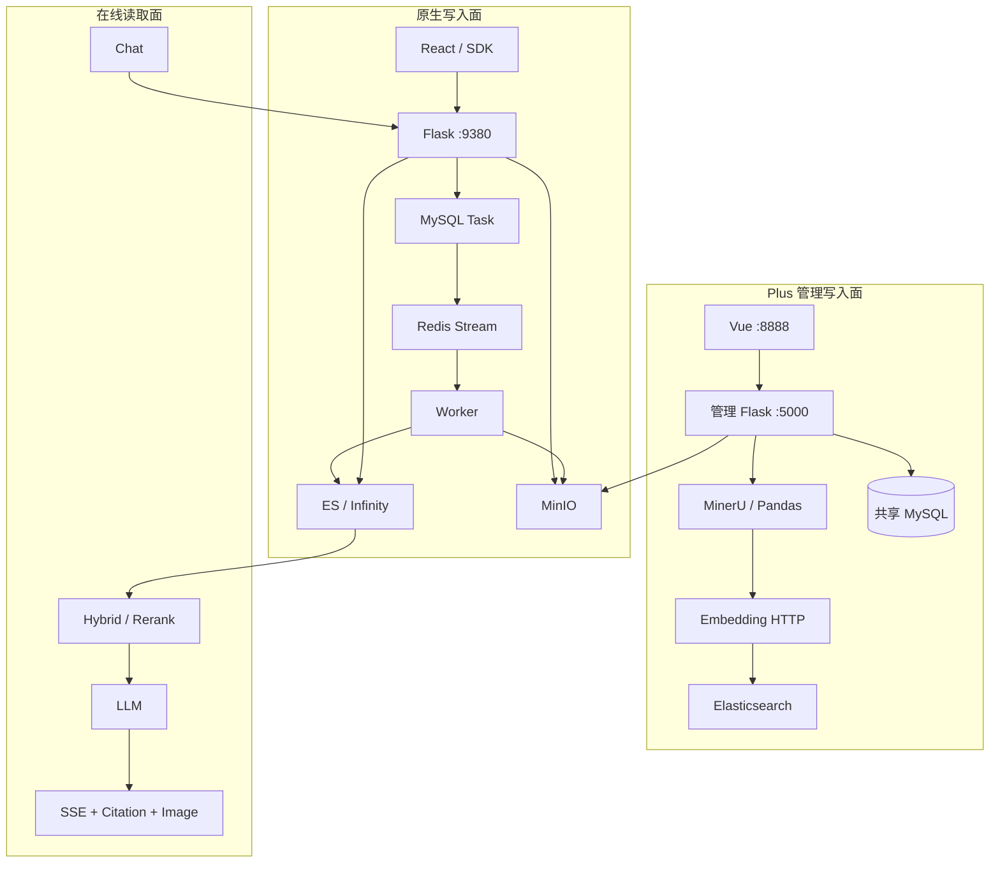
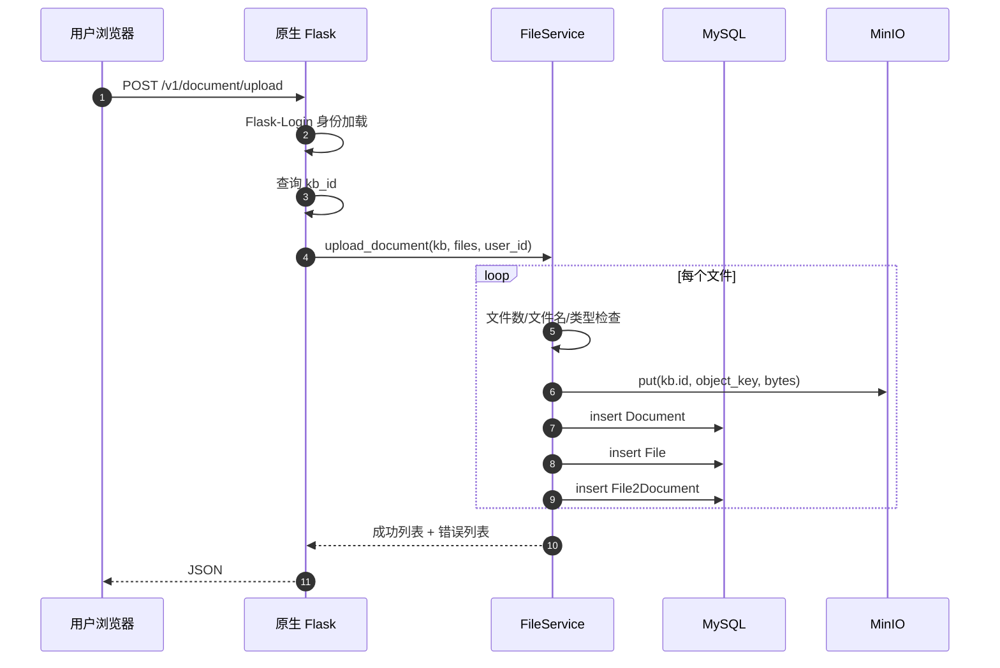
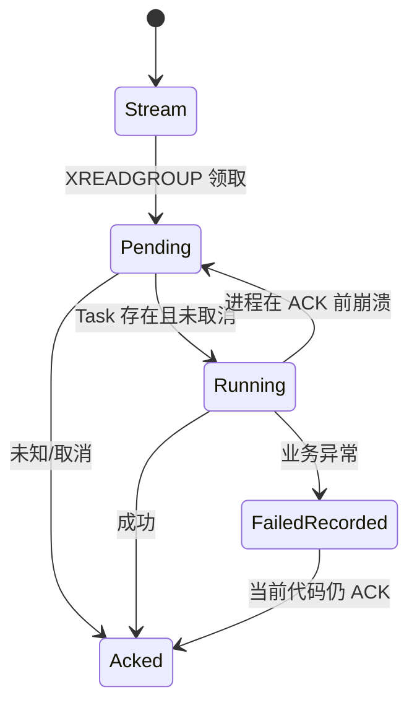
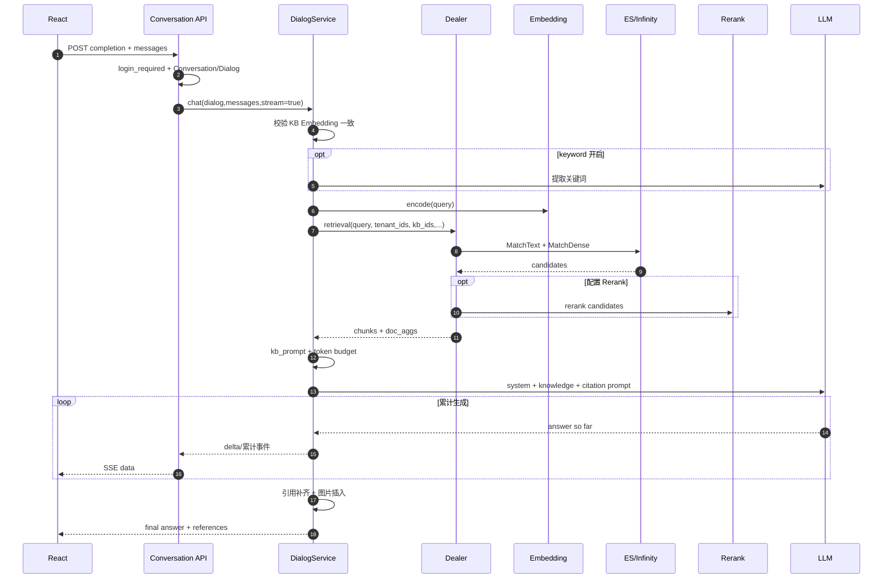
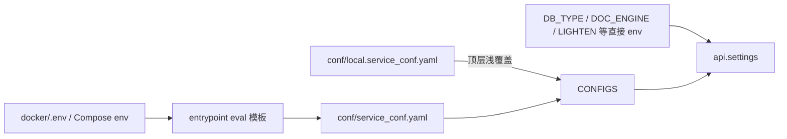
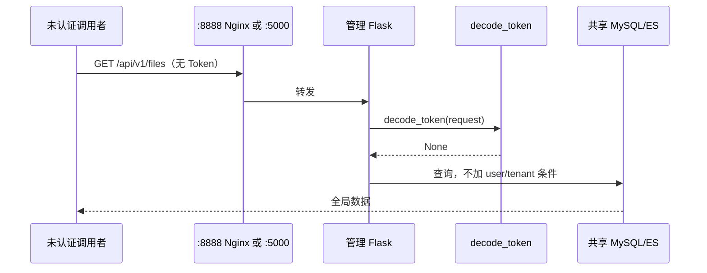

# Ragflow-Plus 端到端系统深挖

> **分析基线**：`3f7aac2512f80a77cf0ad5c1f6e673f0fa39d63c`。分析开始时仓库已有 `M docs/_sidebar.md`、`?? docs/project-analysis/`，本次未修改。本文只描述能由当前源码定位的链路；未完成真实 MySQL、Redis、MinIO、ES/Infinity、MinerU 和模型服务联调的部分标为**代码推断**。
>
> 本文不按目录讲，而是沿真实用户动作追踪：`浏览器/SDK -> API -> 鉴权 -> Service -> Task/Parser -> Chunk/Embedding -> 索引 -> Retrieval/Rerank -> LLM -> Citation/Image -> 前端`。

---

## 1. 先建立端到端心智模型

Ragflow-Plus 不是一条链，而是三个会在共享存储处相遇的运行面：

1. **原生写入面**：React/SDK -> 原生 Flask -> MySQL/MinIO -> Redis Stream -> Worker -> ES/Infinity。
2. **Plus 管理写入面**：Vue -> 管理 Flask -> MySQL/MinIO -> MinerU/Pandas -> Embedding HTTP -> ES。
3. **在线读取面**：React/SDK -> 原生 Flask -> ES/Infinity -> Rerank/LLM -> SSE/引用/图片。

管理写入面绕过原生 Service 和 Worker，这正是权限、状态和 Chunk/图片协议分叉的来源（`management/server/routes/__init__.py:5-28`；`management/server/services/knowledgebases/document_parser.py:107-672`）。



## 2. 动作一：用户登录并进入团队

### 2.1 原生用户端发生了什么

登录成功后，数据库 User 上有 `access_token`；`User.get_id()` 用 `itsdangerous.Serializer(settings.SECRET_KEY)` 把它序列化为客户端 Authorization（`api/db/db_models.py:438-485`）。每个请求由 Flask-Login `request_loader` 解包 token、查询有效 User（`api/apps/__init__.py:142-171`）。

用户不是直接“属于一个 KB”，而是经 `UserTenant` 加入一个或多个 Tenant，角色也在这张关系表；KB 再由 `tenant_id` 归属团队，并用 `permission=me|team` 表示可见范围（`api/db/db_models.py:491-552,664-717`）。

### 2.2 为什么这样设计

多对多 User-Tenant 能表达个人加入多个团队，模型配置也能挂在 Tenant 上共享。问题不在数据模型，而在授权策略没有被收敛成统一中间件：`KnowledgebaseService.accessible()` 和 `DocumentService.accessible()` 存在，但不是每个对象路由都调用（`api/db/services/knowledgebase_service.py:237-266`；`api/db/services/document_service.py:222-242`）。

### 2.3 Session 和 Token 不要混淆

Flask Session 配置为 filesystem，不承担 API token 查询；Authorization 也不是标准 JWT（`api/apps/__init__.py:76-91`）。SDK 则使用 `APIToken` 通过单独装饰器换出 `tenant_id`（`api/utils/api_utils.py:286-305`）。

### 2.4 失败和排查

| 现象 | 第一检查点 | 进一步定位 |
|---|---|---|
| 401/未登录 | Authorization 是否是当前 User 序列化 token | `api/apps/__init__.py:142-171` 的反序列化/查询 |
| 登录后看不到 KB | `UserTenant` 是否有效、KB permission/creator | `api/db/services/knowledgebase_service.py:237-266` |
| 多实例偶现 Session 丢失 | filesystem Session 是否落在不同容器 | `api/apps/__init__.py:83-89` |
| 日志出现 token/邮箱 | 当前 loader 的 DEBUG print | `api/apps/__init__.py:146-170`，应立即脱敏 |

## 3. 动作二：用户创建知识库并选择模型

KB 持有 `embd_id/parser_id/parser_config/similarity_threshold/vector_similarity_weight`，不是只存名称（`api/db/db_models.py:664-705`）。Dialog 另持有 Chat/Rerank/TopN/Prompt 配置，因此“建库时的索引模型”和“问答时的生成/重排模型”是两层配置。

在线问答选多个 KB 时，代码要求它们的 `embd_id` 完全一致，否则直接返回错误（`api/db/services/dialog_service.py:119-123`）。原因是同一次 query vector 无法与不同向量空间直接比较；当前没有跨空间归一化或分库检索再融合。

**下一版设计**：若业务必须跨 Embedding 模型检索，应按模型分组分别编码/检索，再用可比较的 Rerank 分数做 reciprocal rank fusion；不要把不同向量直接拼到一个余弦分数序列。

## 4. 动作三：原生用户上传文件

React 的 API 表声明上传、运行解析和 Chunk 操作分别映射 `/document/upload`、`/document/run`、`/chunk/list` 等（`web/src/utils/api.ts:53-79`）。上传入口要求登录和 `kb_id`，再交给 `FileService.upload_document()`（`api/apps/document_app.py:51-75`）。



### 4.1 数据如何流动

`FileService.upload_document()` 找用户根目录/KB 文件夹，逐文件检查数量和名称，然后创建 Document、File 与 File2Document，并写对象存储（`api/db/services/file_service.py:332-389`）。

- MySQL Document：业务解析状态、KB、Parser、大小、进度。
- File：文件树/文件管理视图。
- File2Document：把逻辑文件映射到 Document 与存储地址。
- MinIO：真实字节，不把大文件塞 MySQL。

### 4.2 为什么拆三张元数据表

Document 是 RAG 处理对象，File 是用户文件树对象；一份文件可以在业务上形成文档映射。分离能让文件管理和知识库解析各自演进，但必须维护引用完整性。当前关联主要靠应用代码，不是数据库外键自动保证（`api/db/db_models.py:720-842`）。

### 4.3 上传阶段的权限缺口

入口只按 `kb_id` 获取 KB，没有在这里调用 `KnowledgebaseService.accessible()`（`api/apps/document_app.py:51-75`）。登录用户如果拿到不属于自己的 KB ID，存在向他人 KB 写入的风险。

修复不是只补一个 `if`：应让路由拿到 `AuthContext(user_id,tenant_ids,roles)`，再由统一 `require_kb_action(kb_id,"document:create")` 校验；Service 也要防御性校验，避免内部调用绕过。

### 4.4 多存储失败窗口

对象已上传、Document 已插入而 File2Document 失败时，没有跨 MinIO/MySQL 事务。下一版应采用“先写 pending 元数据 -> 上传带 generation 的对象 -> 事务提交映射 -> 后台清理超时 pending/孤儿对象”，而不是假装分布式事务能覆盖 S3 API。

## 5. 动作四：用户点击“开始解析”

解析路由读取 `doc_ids/run`，校验文档与 KB 后触发 Task 创建（`api/apps/document_app.py:311-362`）。核心 `queue_tasks()` 先产生页任务、计算 digest、尝试复用旧成功 Chunk，删除旧 Task/未复用 Chunk，再批量插入新 Task，最后逐个推 Redis（`api/db/services/task_service.py:193-313`）。

### 5.1 状态变化

```text
Document: 未解析 -> begin2parse/running -> progress 聚合 -> done 或 fail
Task:     new(progress=0) -> queued -> worker running -> progress=1 / progress=-1
Index:    old generation -> 删除未复用 Chunk -> 分批写新 Chunk
```

文档最终进度不是 Worker 直接一次写死，而是原生 API 进程的后台线程每 6 秒汇总 Task；全部完成后还可能追加 RAPTOR/GraphRAG Task（`api/ragflow_server.py:29-40,91-92`；`api/db/services/document_service.py:335-418`）。

### 5.2 digest 复用究竟保证什么

digest 包含分块配置、`doc_id/from_page/to_page`；旧任务必须 progress=1 且有 chunk_ids 才复用（`api/db/services/task_service.py:260-338`）。它避免同文档同配置重复计算，但不保证：

- 两次并发解析只有一套 Task；
- 模型服务同名但版本变化会使 digest 变化；
- 删除旧 Chunk、插新 Task、Redis 入队是原子的；
- 跨文档相同文件内容复用。

### 5.3 多页 PDF 为什么会“成功但只搜到第一页”

PDF 分支把 `pages` 固定为 1，再把用户页范围裁剪到该值（`api/db/services/task_service.py:226-254`）。默认配置最终只产生 `[0,1)` Task。Worker 会忠实处理这个范围，因此错误不在 Parser，而在任务切分前。

排查顺序：查 Document type/parser_config -> 查 Task `from_page/to_page` -> 若只见 0/1，再修页数获取；不要先调检索阈值。

## 6. 动作五：Worker 从 Redis 领取任务

Worker 先通过 consumer group 枚举未 ACK 消息，枚举完再读新消息；空任务、已取消文档会直接 ACK（`rag/svr/task_executor.py:150-185`；`rag/utils/redis_conn.py:196-265`）。



### 6.1 当前投递语义

`handle_task()` 在 catch 中写 `progress=-1`，然后无条件 ACK（`rag/svr/task_executor.py:564-588`）。所以：

- **进程崩溃**：可能由 pending 恢复，接近 at-least-once。
- **被代码捕获的 Parser/Embedding/ES 异常**：已 ACK，不重投，接近 at-most-once。
- **Redis 入队失败**：MySQL Task 可能已插入，assert 抛错（`api/db/services/task_service.py:304-313`）。

准确表述是“混合语义，不是 exactly-once，也不是完整 at-least-once”。

### 6.2 并发限制为何没有按预期生效

`task_limiter` 的 permit 只覆盖 `nursery.start_soon(handle_task)` 这一瞬间，协程启动后 permit 已释放（`rag/svr/task_executor.py:642-646`）。因此 `MAX_CONCURRENT_TASKS` 不约束任务实际生命周期；只有 Chunk parser 内的 `chunk_limiter` 正确包住 `run_sync`（`rag/svr/task_executor.py:217-221`）。

修复应在 `handle_task()` 函数内部 `async with task_limiter:`，或直接用固定数量 worker 协程循环 consume。

### 6.3 启动前就可能失败

Worker 工厂静态导入 14 个 `rag.app` 模块，当前仓库缺失其中 11 个（`rag/svr/task_executor.py:33-64`）。直接运行当前源码会在消费前失败；基于上游镜像构建可能依赖镜像残留，必须用 clean image smoke test 证实（`Dockerfile:1-18`）。

## 7. 动作六：Parser 生成 Chunk

Worker 通过 File2Document 找存储地址，从 MinIO 拉文件，选择 `FACTORY[parser_id]`，将阻塞解析放入线程；Parser 收到文件名、binary、页范围、语言、KB、配置和 tenant（`rag/svr/task_executor.py:192-228`）。

Chunk 不是简单字符串，随后至少会携带：

- `id`：Chunk 主标识；
- `doc_id/kb_id`：过滤与引用归属；
- `content_with_weight/content_ltks/content_sm_ltks`：原文和两级 token；
- `position_int`：页/坐标定位；
- `img_id`：对象存储图片引用；
- `q_<dim>_vec`：向量。

字段的在线归一化可见 `rag/nlp/search.py:496-516`，手工 Chunk 创建可见 `api/apps/chunk_app.py:216-225`。

### 7.1 ID 设计的含义

手工 Chunk 用 `xxhash64(content + doc_id)`。它让同文同内容更新趋于幂等，但同一文档两处完全相同的段落会生成同 ID，位置维度被丢失（`api/apps/chunk_app.py:216-225`）。

下一版更稳妥的 ID 是 `hash(doc_id, parser_generation, logical_position, normalized_content_hash)`：内容 hash 用于去重，主 ID 保留位置与代际。

## 8. 动作七：批量 Embedding 并写索引

原生链把正文按 16 条批量编码；标题只编码一次并复制到每块，再按 `filename_embd_weight` 融合，向量字段名从真实维度构造（`rag/svr/task_executor.py:357-399`）。

索引初始化以 tenant 生成 index name、KB 作为 dataset/filter 维度；Chunk 每 4 条插入，并持续把已写 ID 存回 Task（`rag/svr/task_executor.py:352-354,529-557`）。

### 8.1 为什么标题和正文要融合

标题对“这份文档讲什么”有强先验，正文对局部语义更准确。默认通过权重组合避免短 Chunk 丢失文档主题。替代方案是把 title 作为独立字段做 late fusion，优点是可调，缺点是查询和索引复杂度更高。

### 8.2 中途失败的真实数据状态

假设 100 个 Chunk，写到第 60 个时 ES 失败：前 60 个可能已存在，Task 保存部分 IDs，Document 总计数尚未最终增加，Redis 消息最终 ACK。用户重试时旧 Chunk 的清理依赖 Task 记录完整性。

重构应使用 `index_generation`：新代际全部写 staging，校验 Chunk 数与向量维度后原子切换 Document active generation，旧代际异步回收。

## 9. 动作八：管理人员上传普通文件或大文件

Vue 小文件走 `/api/v1/files/upload`，大文件生成浏览器 `uploadId`，逐块调用 `/upload/chunk`，再 `/upload/merge`（`management/web/src/common/apis/files/upload.ts:16-106`）。Axios 会以 `Bearer <JWT>` 形式携带管理 token（`management/web/src/http/upload-axios.ts:53-70`）。

### 9.1 小文件服务端路径

管理服务若拿不到 user_id，会回退到“创建时间最早的用户”甚至 `system`；parent_id 缺失时又回退 file 第一条（`management/server/services/files/service.py:455-510`）。之后按输入文件名构造共享本地临时路径、上传 MinIO、插 File（`management/server/services/files/service.py:519-609`）。

这会产生两个问题：

1. 身份失败不应该继续写入他人名下，必须 fail closed。
2. 同名并发上传共享临时路径，可能互相覆盖/删除。

### 9.2 大文件分块路径

服务端使用 `Path(UPLOAD_TEMP_DIR)/"chunks"/upload_id`，合并路径又包含 `upload_id` 和 `file_name`（`management/server/services/files/service.py:616-740`）。Redis bitmap 只记录块是否到齐和过期时间，并未证明文件大小/hash/用户归属。

**路径穿越触发**：攻击者绕过前端直接提交 `upload_id=../../x` 或带分隔符的 `file_name`。服务端未做 resolve 后 containment 校验，可能越过上传根目录。

**正确设计**：服务端签发不可猜的 upload UUID；JWT user/tenant 绑定在 Redis/DB；每块带 index、size、checksum；合并时只用服务端保存的展示名；路径 resolve 后必须位于任务目录；完成后原子 rename。

## 10. 动作九：管理人员点击 MinerU/Excel 解析

Vue 调 `/api/v1/knowledgebases/documents/<docId>/parse`（`management/web/src/common/apis/kbs/document.ts:42-58`）。路由没有 JWT 装饰器，直接同步调用 `KnowledgebaseService.parse_document()`，直到解析完成才返回（`management/server/routes/knowledgebases/routes.py:235-252`）。

服务先联合读取 Document、File2Document、File、KB 和 KB 的 Embedding 配置（`management/server/services/knowledgebases/service.py:827-896`），随后：

- PDF/Office/图片：`magic_pdf`；
- Excel/CSV：pandas（`management/server/services/knowledgebases/excel_parser.py:6-49`）；
- 文本块：逐块调用外部 Embedding，15 秒超时；
- ES：动态增加 `q_<dim>_vec` mapping，逐块 `index`；
- 图片：写 `<kb_id>/images/<uuid>.<ext>`，将 KB 图片设为公开；
- 图文关联：块序号距离 `<5`（`management/server/services/knowledgebases/document_parser.py:392-651`）。

### 10.1 为什么管理链看起来简单

同步调用让前端容易理解“这次请求是否完成”，无需部署独立 Worker 协议；对小文件和低并发运营工具可快速落地。但 MinerU、网络 Embedding、逐块 ES 都是长耗时步骤，会占 Flask 请求线程，代理也没有配置该 location 的显式长超时（`docker/nginx/management_nginx.conf:16-25`）。

### 10.2 Excel 和 PDF 的语义并不等价

Excel 解析按表格数据生成文本块，PDF/Office 则保留 MinerU 的版面、公式和图片。它们最终都写 `content_with_weight` 和向量，但位置、图片、表格结构的来源不同，不能只用“Chunk 数相同”验证一致性。

### 10.3 失败后是什么状态

成功会更新 Document/KB/Task（`management/server/services/knowledgebases/document_parser.py:654-663`）；异常设置 `status="1", run="0"`（`management/server/services/knowledgebases/document_parser.py:665-672`）。在此之前写入的 ES Chunk/MinIO 图片不回滚，导致“界面失败、索引里已有部分数据”。

### 10.4 批量解析为何不能叫可靠异步任务

批量入口启动 daemon thread，进度放进内存字典（`management/server/routes/knowledgebases/routes.py:255-270`；`management/server/services/knowledgebases/service.py:1276-1390`）。进程重启、滚动发布或多实例切换会丢状态，线程也没有持久 lease。它是“后台线程包装”，不是队列任务平台。

## 11. 两条解析链如何在索引里相遇

两条链都写 tenant 索引和 KB 过滤字段，在线 Dealer 因而能检索到两者产物。但共享物理索引不保证共享契约：

| 不变量 | 原生 | 管理 | 结果 |
|---|---|---|---|
| 向量字段 | `q_<真实维度>_vec` | 动态 mapping 同名 | 维度相同才兼容 |
| token 字段 | RAG tokenizer 生成 | 管理链自行构造 | 词法分数可能不一致 |
| 图片 key | Parser/对象协议 | `<kb>/images/uuid` | 代理/预览解释冲突 |
| Task | Redis Worker Task | SQL 更新/内存批量状态 | 进度语义不同 |
| 引擎 | ES/Infinity | 仅 ES | Infinity 部署下管理解析失效 |

下一版应在索引写入前做 `ChunkEnvelope` schema validation，字段含 `schema_version/parser_engine/parser_version/embedding_model/embedding_dimension/image_refs/generation`。

## 12. 动作十：用户发起一次知识库问答

React 使用 `/conversation/completion`（`web/src/utils/api.ts:93`），后端验证登录、`conversation_id/messages`，取 Conversation 与 Dialog，先在 Conversation 追加一个空引用槽，再进入 `chat()`（`api/apps/conversation_app.py:289-409`）。



## 13. 问答前的模型和范围检查

`chat()` 先取所有 KB，要求唯一 Embedding；再按 Dialog 的 Chat 模型类型绑定 LLMBundle，最多使用最后 3 条 user 消息收集问题，但最终检索只取最后一问（`api/db/services/dialog_service.py:101-180`）。可传 `doc_ids` 限定附件范围。

检索调用带：tenant_ids、kb_ids、`top_n`、相似度阈值、向量权重、`top_k`、可选 rerank、rank feature（`api/db/services/dialog_service.py:194-213`）。租户和 KB 过滤必须在检索查询中完成，不能先全局召回再由 Prompt 隐藏。

## 14. Keyword 扩展是一笔额外模型调用

当 `prompt_config.keyword` 开启，`keyword_extraction()` 调 Chat LLM，把关键词直接拼到问题（`api/db/services/dialog_service.py:187-192`；`rag/prompts.py:213-220`）。

设计价值：短问题、专有名词和中英文术语可能改善 MatchText。代价：增加延迟/Token，模型错误关键词也可能稀释原问。合理替代是规则/BM25 query expansion 与 LLM rewrite 并行，超时就使用原问，并单独记录 rewrite 命中收益。

## 15. Hybrid 初召回到底做了几步

`Dealer.search()` 构造 `MatchText` 和 `MatchDense`；初筛固定全文 0.05、向量 0.95（`rag/nlp/search.py:147-171`）。若零结果，会调低相似度条件重试（`rag/nlp/search.py:178-194`）。

这里的固定权重只控制搜索引擎候选阶段。候选回到应用层后还会二次排序：

- 无模型：token 相似度 + vector 相似度 + rank feature（`rag/nlp/search.py:320-378`）；
- 有 Rerank：模型分数 + vector/feature（`rag/nlp/search.py:380-399`）；
- 最后应用相似度阈值、Top N 和文档聚合（`rag/nlp/search.py:404-529`）。

### 15.1 为什么不只做向量检索

向量擅长语义改写，全文擅长编号、产品名、精确术语；rank feature 能注入 pagerank/tag 等业务先验。Rerank 只处理较小候选集，把昂贵模型放第二阶段是典型成本/效果折中。

### 15.2 如何排查“明明有文档却召回不到”

1. 查 Document 是否真的有全部页、`progress=1`、Chunk 数非零。
2. 按 `tenant_id/kb_id/doc_id` 直接查索引，确认过滤字段和 active/available。
3. 确认 query/Chunk 使用相同 `embd_id` 与 `q_<dim>_vec`。
4. 分别记录 MatchText、MatchDense 的候选，不要只看融合后结果。
5. 暂停 threshold/rerank，确认问题在召回还是排序。
6. 管理解析产物要额外检查 token 字段和 ES mapping。

## 16. Prompt 如何装入知识

`kb_prompt()` 按 Chunk 顺序累加 token，达到模型预算就截断（`rag/prompts.py:136-166`）。`chat()` 把知识填入 Dialog system template，再添加 citation prompt，历史消息通过 `message_fit_in(..., 95% max_tokens)` 压缩（`api/db/services/dialog_service.py:213-237`）。

### 16.1 设计原因

先检索 Top N 再做 token budget，能避免超过上下文窗口；保留文档名/Chunk 结构有利于引用。问题是“长度可控”不等于“指令安全”：检索文本直接处于高权限 Prompt 内容中，间接 Prompt Injection 没有隔离。

### 16.2 下一版 Prompt 边界

当前没有可信内容沙箱。下一版应明确：系统指令不可由 `<retrieved_data>` 内文本覆盖；对文档来源标 `trust_level`；有工具的 Agent 永不让文档文本直接决定工具参数；用对抗文档评测拒绝率与任务完成率。

## 17. LLM 流式生成如何到浏览器

LLMBundle 的 `chat_streamly()` 返回**累计回答**；服务计算相对上次的 delta，新增不足约 16 token 时暂不 yield，最后再返回带 reference 的完整结果（`api/db/services/dialog_service.py:331-357`）。API 把每个对象编码成 SSE `data:`，设置 `X-Accel-Buffering:no`（`api/apps/conversation_app.py:383-401`）。前端用 `TextDecoderStream`/事件解析消费（`web/src/hooks/logic-hooks.ts:302-346`）。

### 17.1 中途失败为何不能只看 HTTP 500

响应头发出后 HTTP 已是 200；生成异常被 stream generator 捕获，作为 `code=500` 事件发送，随后仍发完成标志（`api/apps/conversation_app.py:383-393`）。日志和监控必须统计 SSE error event、是否见 final event、首 token/总耗时，而不只是网关状态码。

### 17.2 断连与取消

当前可见代码把前端 AbortSignal 传给 fetch，但没有证明后端会取消正在进行的 LLM/检索调用（`web/src/hooks/logic-hooks.ts:302-309`）。下一版要从 WSGI 断连传播 cancellation/deadline 到模型客户端，并记录 canceled 而非 failed。

## 18. 引用是怎样生成的

Prompt 要求模型在句后输出 `##i$$`（`rag/prompts.py:169-210`）。如果没有引用，系统把回答分句，计算句子与 Chunk 的 token/向量相似度并补标（`rag/nlp/search.py:219-294`；`api/db/services/dialog_service.py:253-269`）。最终去除返回给前端的向量，保留 Chunk/文档聚合。

React 把引用标记解析成 Popover，展示对应 Chunk/文档（`web/src/pages/chat/markdown-content/index.tsx:104-244`）。

### 18.1 引用的保证边界

引用证明“系统把这句话关联到某 Chunk”，不证明 Chunk 逻辑蕴含该句话。尤其自动补引是相似度对齐，容易出现同主题但不支持具体数字的“伪支撑”。

下一版评测至少拆：citation coverage、citation precision、entailment、source correctness；数字/日期类回答可要求证据文本精确包含或经结构化校验。

## 19. 图片如何进入回答

检索结果把索引 `img_id` 归一为 `image_id`（`rag/nlp/search.py:496-516`）。在最终回答里，正则找到 `##i$$` 后读取对应 Chunk 图片，拼出 MinIO URL 并插入 HTML ``（`api/db/services/dialog_service.py:271-295`）。

这里有三套 URL/key 语义：

1. Chat 直连 `MINIO_CONFIG.visit_point/image_id`；
2. 原生图片代理要求 URL 参数能用 `-` 拆 bucket/object（`api/apps/document_app.py:459-469`）；
3. 管理 Parser 写 `<kb>/images/uuid.ext`（`management/server/services/knowledgebases/document_parser.py:574-616`）。

如果图片正文能显示而预览失败，应先核对 key 解释和 endpoint，而不是检查 LLM。

## 20. 动作十一：用户打开图片集并替换 Chunk 图片

图片集 API 遍历 KB 文档，对每个文档最多拉 1024 Chunk，收集 `img_id` 后在内存分页（`api/apps/kb_app.py:261-327`）。前端主列表用动态 endpoint，但预览有硬编码地址（`web/src/pages/add-knowledge/components/knowledge-images/index.tsx:53-68,337-339`）。

替换图片通过 `/chunk/set`：如果请求只有 `doc_id/chunk_id/content_with_weight/img_id`，代码判为仅换图，跳过 Embedding，只更新索引 `img_id`（`api/apps/chunk_app.py:109-170`）。这个优化合理，因为文本没变。

### 20.1 失败边界

- `chunk/list` 不校验 Document accessible，登录用户可能越权读 Chunk（`api/apps/chunk_app.py:35-76`）。
- `/chunk/rm` 构造索引时使用 `current_user.id` 而非 tenant_id，用户 ID 与租户 ID 不同就可能删错/找不到（`api/apps/chunk_app.py:192-211`）。
- 换图只更新引用，不证明旧图片会 GC；公开管理图片也没有引用计数。

### 20.2 重构方向

建 `ImageAsset(id,tenant_id,object_key,mime,size,sha256,visibility,ref_count)`，Chunk 只存 asset_id；列表在资产索引分页；读取走签名 URL/鉴权代理；引用变更由事务 Outbox 更新 ref_count，孤儿延时 GC。

## 21. 动作十二：用户使用文档撰写

React 调 `/conversation/writechat` 和 `/conversation/uploadimage`（`web/src/utils/api.ts:110-112`）。`writechat` 需要登录并返回 SSE；`kb_ids` 可为空（`api/apps/conversation_app.py:414-438`）。

- 无 KB：直接用 Chat 模型回答（`api/db/services/write_service.py:42-62`）。
- 有 KB：普通/KG 检索 -> token budget -> LLM；完成后把所有召回 Chunk 的去重图片追加在末尾（`api/db/services/write_service.py:64-129`）。
- 前端：模板、localStorage 草稿、流式插入、docx 导出；向模型提供约 4000 字符编辑上下文（`web/src/pages/write/index.tsx:380-411`）。

### 21.1 与普通 Chat 的差异

撰写链没有普通 Chat 那套引用装饰与 Conversation 持久化语义，返回 `reference={}`；图片不是按引用句插入，而是在生成结束后统一追加。它更像“带可选知识的编辑器助手”，不能把普通 Chat 的 citation 能力直接套在它身上。

### 21.2 无鉴权图片上传

`uploadimage` 没有 `login_required`，只校验扩展名，写公开 `public/images`，没有请求体大小、文件魔数、解码重编码和租户归属（`api/apps/conversation_app.py:440-450`；`api/db/services/write_service.py:132-180`）。前端 Hook 也不携 Authorization（`web/src/hooks/write-hooks.ts:126-140`）。

## 22. 动作十三：开启跨语言检索

开关并不在后端统一执行。React 每次 Chat 前：检查最后 user 消息含中文 -> 获取 Conversation -> 获取 Dialog -> 读取 `cross_language_search` -> 调 `/v1/translate/translate` 固定 zh->en -> 用译文替换最后一问（`web/src/hooks/logic-hooks.ts:185-309`）。

翻译模型懒加载本地 `./models` 或 Hugging Face，CPU 推理，最大 512 token；内部翻译异常直接返回原文（`api/apps/translate_app.py:30-100`）。后端 Chat 只打印“前端处理”（`api/db/services/dialog_service.py:134-136`）。

### 22.1 为什么 SDK 行为不同

SDK/其他 HTTP 客户端直接调 completion，不执行 React hook，所以即使 Dialog 开关开启，也不会自动翻译。服务能力依赖某个 UI 实现，不是 API 契约。

### 22.2 更合理的多语检索

当前没有。下一版在后端 Query Pipeline 做语言检测，并并行生成原问、目标语译问和关键词；各自检索后 RRF，Rerank 用原问判断。这样翻译错误不会完全覆盖原查询，React/SDK 行为也一致。

## 23. 动作十四：用户选择 Knowledge Graph KB

构建侧：普通文档任务完成后，进度聚合可追加 `task_type=graphrag`，Worker 调 `run_graphrag()`（`api/db/services/document_service.py:335-418`；`rag/svr/task_executor.py:491-502`）。

查询侧：当全部 KB 的 parser 是 KG，`ask()`/`write_dialog()` 把 `settings.kg_retrievaler` 当普通 Dealer 调（`api/db/services/dialog_service.py:509-524`；`api/db/services/write_service.py:64-79`）。但 KG 真签名要求 `(question,tenant_ids,kb_ids,emb_mdl,llm,...)`，并返回不同结构（`graphrag/search.py:139-150`）。

### 23.1 现场故障路径

1. 用户选纯 KG KB。
2. `is_knowledge_graph=True`。
3. 普通 Dealer 参数位置传给 KGSearch，同时带 `aggs=False`。
4. Python 抛参数错误；即使手改参数，`kb_prompt(kbinfos)` 仍期待 `chunks`。

所以当前结论是“构建入口可达，KG 问答阻断”，不是“GraphRAG 全不可用”也不是“已经打通”。

### 23.2 Adapter 设计

定义统一接口：

```text
retrieve(QueryContext) -> RetrievalResult
RetrievalResult = {items[], document_aggregations[], trace}
item = {id, content, score, source_type, document_id, image_id, positions, evidence}
```

DealerAdapter 把 Chunk 转 item；KGAdapter 把实体、关系、社区证据序列化为 item。Prompt builder 只依赖 DTO，纯 KG/普通/混合通过策略组合。

## 24. 动作十五：部署人员启动整套系统

Compose include 基础设施；原生服务暴露 9380/80/443，管理前后端暴露 8888/5000（`docker/docker-compose.yml:1-78`）。原生 Nginx 把 `/v1|api` 转 9380，其余返回 React；管理 Nginx 把 `/api/` 转管理 5000（`docker/nginx/ragflow.conf:13-21`；`docker/nginx/management_nginx.conf:16-25`）。

入口脚本先用 `eval echo` 把 env 展开为配置，再启 Nginx、N 个 Worker 和 API；Worker/API 退出后无限无退避重启（`docker/entrypoint.sh:3-33`）。另一个有 5 次重试的 `launch_backend_service.sh` 未被根 Dockerfile 入口明显引用（`docker/launch_backend_service.sh:20-105`）。

### 24.1 启动顺序不是就绪保证

- ragflow 只等待 MySQL healthy；
- management-backend 等 MySQL、ES healthy；
- MinIO、Redis、应用无 healthcheck；
- 管理前端只等容器 started，不等 API ready（`docker/docker-compose.yml:5-8,39-40,61-65`）。

启动后首页可开，不等于 Worker、Redis、MinIO、Embedding、LLM 可用。应增加 `/live` 与 `/ready`：ready 检查 DB/Redis/MinIO/文档引擎和必要配置，但不能每次强制加载大模型；模型用独立依赖状态。

## 25. 配置如何一路到运行时



`read_config()` 先读 global YAML，再 `global_config.update(local_config)`；`get_base_config()` 只在 YAML 缺 key 时使用大写 env（`api/utils/__init__.py:38-88`）。模板中 MySQL/MinIO/ES/Redis 用 `${VAR:-default}`（`docker/service_conf.yaml.template:1-26`）。

### 25.1 典型排查误区

修改 `MYSQL_HOST` 后没生效，不能只说“环境变量优先”：若 `service_conf.yaml` 已生成且包含 mysql 顶层块，代码直接用 YAML。应检查容器内最终 YAML、是否有 local YAML 顶层覆盖，以及某项是否由 `os.environ` 直接读取。

## 26. 管理 API 的端到端越权路径

管理 JWT 的 `decode_token()` 缺失/无效时返回 None（`management/server/services/auth/auth_utils.py:8-33`）。团队、文件、KB 列表只在有用户信息时加过滤，无 token 时查询全局（`management/server/routes/teams/routes.py:6-26`；`management/server/routes/files/routes.py:34-58`；`management/server/routes/knowledgebases/routes.py:11-31`）。解析路由也没有强制装饰器（`management/server/routes/knowledgebases/routes.py:235-252`）。



P0 修复：应用级 `before_request` 默认拒绝，登录/OPTIONS/health allowlist；装饰器只做 action/role，Service 再做对象归属；JWT secret 启动校验；5000 不映射公网；审计每个管理写操作。

## 27. 一次故障该如何端到端排查

### 27.1 “上传成功，解析一直 0%”

1. 查 Document 和 Task 是否创建。
2. 查 Redis stream 是否有消息，consumer group lag/pending。
3. 查 Worker 是否在 import 阶段因 `rag.app` 缺失循环退出。
4. 查 MinIO `File2Document` 指向的 bucket/object。
5. 查 Worker 心跳 `TASKEXE` 与 `current`（`rag/svr/task_executor.py:591-613`）。

### 27.2 “解析成功但回答无引用”

1. 查索引 Chunk 是否带 `doc_id/kb_id/content_ltks/vector`。
2. 分拆 MatchText/MatchDense 候选与阈值。
3. 查 `kb_prompt` 是否因 token budget 没装入目标 Chunk。
4. 查 Dialog `quote` 和请求 `quote`。
5. 模型没引用时查 `insert_citations()` 是否有句子/向量输入。

### 27.3 “管理解析显示失败但能搜到内容”

逐块 ES 写在最终状态更新之前；中途失败不会回滚（`management/server/services/knowledgebases/document_parser.py:392-672`）。按 doc_id 查部分 Chunk/图片，清理当前 generation 后再重跑，而不是仅把 MySQL 状态改成成功。

### 27.4 “图片正文能显示，预览打不开”

对比 Chunk `image_id` 的实际 key、Chat 拼 URL、图片代理 `-` 拆分规则、管理 `<kb>/images` 规则和前端硬编码 endpoint（`api/db/services/dialog_service.py:271-295`；`api/apps/document_app.py:459-469`；`web/src/pages/add-knowledge/components/knowledge-images/index.tsx:337-339`）。

## 28. 数据一致性的核心不变量

当前代码没有集中声明，下列是由调用关系推出、下一版应显式校验的不变量：

1. Document.kb_id 必须属于当前 AuthContext 可写 tenant。
2. File2Document 的 bucket/object 必须存在且归属同 tenant/KB。
3. 每个 active Chunk 的 `doc_id/kb_id/tenant index` 必须与 MySQL 一致。
4. `q_<dim>_vec` 维度必须匹配 KB `embd_id` 当前 generation。
5. Document `chunk_num/token_num` 必须等于 active generation 聚合。
6. Task progress=1 时其 chunk_ids 必须全部可检索。
7. ImageAsset 必须与 Chunk 引用和可见性一致。
8. Conversation reference 中的 doc/chunk 必须在回答时仍对用户可见。

当前部分更新方法见 `rag/svr/task_executor.py:529-557` 与 `api/db/services/document_service.py:335-381`，但还没有跨存储 reconciliation job。

## 29. 为什么不能直接用分布式事务解决一切

MySQL、Redis、MinIO 和 ES/Infinity 不共享事务协调器。2PC 成本高且对象存储/模型调用通常不参与。更适合本项目的是：

1. MySQL 事务提交业务状态 + Outbox。
2. Dispatcher 幂等投递 Redis，记录 event id。
3. Worker 使用 task id + generation 做幂等处理。
4. 索引写 staging generation，完成后切 active pointer。
5. MinIO/旧索引用可重入补偿与延迟 GC。
6. Reconciler 周期校验上节不变量。

这些都是**下一版设计**，当前仅有 Task digest、pending 恢复和部分 chunk_ids 清理基础（`api/db/services/task_service.py:260-338`；`rag/svr/task_executor.py:150-185,529-548`）。

## 30. 端到端超时、重试和降级设计

### 当前实现

- 管理 Embedding HTTP 有 15 秒超时（`management/server/services/knowledgebases/document_parser.py:486-533`）。
- Redis pending 能覆盖 ACK 前进程崩溃，但业务异常 ACK。
- Hybrid 零结果降低阈值重试（`rag/nlp/search.py:178-194`）。
- Rerank 未配置时走无模型融合。
- 翻译失败使用原文（`api/apps/translate_app.py:98-100`）。
- Chat 无召回且设置 `empty_response` 时提前返回（`api/db/services/dialog_service.py:217-221`）。

### 下一版

每个 HTTP 请求生成总 deadline；检索、Rerank、LLM 分配子预算。只对 timeout/429/可恢复 5xx 重试，401/参数错误永久失败；写操作重试必须带幂等 key。降级响应应携带 `degraded_components`，避免“回答成功”掩盖翻译/Rerank/引用失败。

## 31. 可观测性应沿同一条链串起来

当前原生日志会轮转到文件和 stdout（`api/utils/log_utils.py:33-80`），Worker 有 Redis 心跳，Chat 把阶段毫秒数拼入 prompt 返回（`api/db/services/dialog_service.py:314-329`）。但没有统一 trace。

下一版关键 span：

```text
http.request
  auth.load_user / auth.authorize_object
  document.persist_mysql / storage.put
  outbox.publish / redis.consume
  parser.chunk
  embedding.batch
  index.write_generation
  retrieval.text / retrieval.dense / rerank
  prompt.build / llm.first_token / llm.complete
  citation.align / image.sign_url
```

公共属性只放 ID/耗时/大小/模型，不记录 Authorization、原始文档全文、完整 Prompt 或个人信息。当前 loader 打印 token/邮箱必须先删除（`api/apps/__init__.py:146-170`）。

## 32. 重构顺序：从用户动作反推边界

### P0：让链路可启动、不可越权

- clean image 构建并验证 Worker parser import；修真实 PDF 页数。
- 管理 API 全局认证/RBAC/对象归属，撤掉默认密钥和公网 5000。
- 修分块路径、无鉴权下载/图片上传、`chunk/rm` tenant index。
- 为普通检索/KG 检索增加 Adapter，统一返回契约。

### P1：让写入链可恢复

- 原生/管理解析统一提交持久 Task；Outbox、retry policy、DLQ、人工 replay。
- Chunk generation、active pointer、补偿清理与 reconciler。
- 统一 Chunk/Image schema 和签名 URL。
- 端到端 deadline、取消传播、SSE error/end 事件。

### P2：让效果可量化、Agent 可治理

- 真实黄金集对比 keyword/dense/hybrid/rerank 与 citation 指标。
- 后端多语 query expansion，不再依赖 React。
- 恢复 Agent 前先建设持久状态、工具 ACL、预算、审批、审计和回放；当前 `agentic_reasoning/deep_research.py::DeepResearcher` 无调用方。

## 33. 面试中的一条主线说法

> 我不会把这个项目讲成“用了 Redis、ES 和大模型”的组件清单。我会从一次用户动作讲：上传时把原件和元数据分开落 MinIO/MySQL；解析时用 Task digest 做有限复用，再经 Redis Stream 到 Worker；Worker 生成带 token、位置、图片和动态维度向量的 Chunk，分批写 tenant 索引。问答时先做 tenant/KB 过滤和同 Embedding 校验，全文与向量初召回，再做应用层融合或 Rerank；知识按 token 预算进 Prompt，LLM 用 SSE 返回，模型没引用时再做句子级补引，图片按 Chunk 引用插入。
>
> 真正的工程难点是边界而不是流程图：Plus 的管理端另有同步 MinerU/Excel 链，直接写共享 ES，导致状态、图片和恢复语义分叉；当前异常 ACK、PDF 固定一页、管理鉴权和 KG Adapter也有明确缺陷。我的演进方向会先收敛身份和任务状态机，再用 Outbox、generation、DLQ 和 reconciliation 解决多存储一致性，最后用评测与 trace 做效果和性能闭环。个人贡献和线上数据仍以 `[待本人确认]` 的真实材料为准。

## 34. 端到端证据导航

| 用户动作 | 入口 | 核心服务 | 存储/下游 | 返回/前端 |
|---|---|---|---|---|
| 原生上传 | `api/apps/document_app.py:51-75` | `file_service.py:332-389` | MySQL + MinIO | `web/src/utils/api.ts:76` |
| 开始解析 | `api/apps/document_app.py:311-362` | `api/db/services/task_service.py:193-338` | MySQL + Redis | Document progress |
| Worker | `rag/svr/task_executor.py:150-228` | `rag/svr/task_executor.py::embedding` | MinIO + ES/Infinity | `rag/svr/task_executor.py:529-588` |
| 管理上传 | `management/server/routes/files/` | `files/service.py:455-740` | 本地 + Redis + MinIO + MySQL | Vue upload composable |
| MinerU/Excel | `management/server/routes/knowledgebases/routes.py:235-252` | `management/server/services/knowledgebases/document_parser.py:107-672` | MinIO + Embedding HTTP + ES | 同步 JSON/内存进度 |
| Chat | `api/apps/conversation_app.py:289-409` | `api/db/services/dialog_service.py:101-357` | ES/Infinity + LLM | SSE + React |
| Retrieval | `api/db/services/dialog_service.py:194-213` | `rag/nlp/search.py:147-529` | 文档引擎 + Rerank | chunks/doc_aggs |
| Citation | `api/db/services/dialog_service.py:253-307` | `rag/nlp/search.py:219-294` | Embedding | Markdown Popover |
| 图片集/换图 | `api/apps/kb_app.py:261-327` | `api/apps/chunk_app.py:109-170` | ES + MinIO | React 图片页 |
| 撰写 | `api/apps/conversation_app.py:414-450` | `api/db/services/write_service.py:20-180` | Retrieval/LLM/MinIO | 编辑器 SSE |
| 跨语言 | `web/src/hooks/logic-hooks.ts:185-309` | `api/apps/translate_app.py:30-244` | T5/Hugging Face | 译文替换原问 |
| KG | `api/db/services/dialog_service.py:509-524` | `graphrag/search.py:139-150` | ES 图数据 | 当前契约失败 |

## 35. 验证边界

本次完成源码入口、服务、存储、异步、前端和失败语义的静态交叉验证；160 个 Python 文件通过 AST 语法解析，两个 shell 入口通过 `bash -n`，并静态确认 Worker 缺失 11 个 parser 文件。没有启动依赖栈或模型服务，因此本文不声称 Compose 可完整启动、MinerU/LLM 可用、任何性能指标达标，也不把代码推断写成线上事故。
