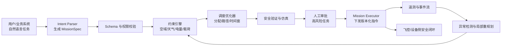

# Autel Robotics（道通智能）· AI Agent 岗 · 面试整理与答案

> **转写说明**：本次转写存在明显双声道回声，许多“你:”只是重复面试官原话，不应算作候选人回答。`GodWiki`、`TreeSet/G Sector`、`Cloud Code`、`opencloud`、`马云平台` 等大概率分别是 CodeWiki、tree-sitter、Claude Code、OpenClaw、码云平台的识别误差；涉及产品名和真实投产范围时，仍需本人按项目记录确认。
>
> **面试性质**：这是一场约 20 分钟的项目筛选面，没有传统 Java/Python 语法题，也没有现场编码。表面上在问 CodeWiki 和 Agent Memory，实际重点是：**候选人是否真正做过复杂 Agent、能否跨业务识别关键上下文、能否清楚划分开源底座与本人贡献，以及现有经验能否迁移到飞行业务调度**。
>
> **一句话结论**：本场属于 **“项目方向相关，但核心追问没有答到问题所在”**。CodeWiki 和分层记忆提供了可继续沟通的基础；然而面试官三次追问“怎样识别并保留关键信息”，现场仍回答 BM25 与向量召回，混淆了**压缩前的信息筛选**和**查询时的信息召回**。这是本场最主要的失分点。

---

## 0. 面试全景与结果判断

### 0.1 面试流程

| 阶段 | 主要问题 | 实际考察点 |
|---|---|---|
| 自我介绍 | 后端经历、AI 周报、CodeWiki、Agent Memory | 表达结构、项目真实性、岗位匹配 |
| CodeWiki | Agent 怎么做、完成了什么、是否支持意图/缺陷分析、AST 引擎来源 | Agent 与工作流边界、产品深度、自研贡献 |
| Agent Memory | 系统目的、四层记忆、上下文卸载、接入场景 | 架构完整性、实际采用范围 |
| 核心追问 | 不同业务怎样精准理解、怎样挑选重要信息、防止压缩丢失 | 领域适配、保真压缩、评测与安全边界 |
| 技术栈 | Python、LangChain、LangGraph、自研框架 | 技术选型是否清楚，框架经验是否真实 |
| 复杂度判断 | 有没有真正难的复杂场景 | 是否只做线性 LLM 工作流，能否处理动态状态和失败恢复 |
| 反问 | Coding 工具、Token、CI/CD、Kubernetes、岗位困难 | 对研发环境和实际业务的判断 |
| 业务揭示 | 飞机相关业务、业务级 Agent、智能化调度 | 岗位真实方向及下一轮系统设计重点 |

### 0.2 面试官真正关注的四件事

1. **你的系统究竟是不是 Agent。** 文档生成链路如果只是解析、检索、调用模型，更准确地说是 GraphRAG 工作流；除非存在目标、状态、工具选择、循环决策和停止条件，否则不应泛称 Agent。
2. **压缩时如何知道什么不能丢。** 面试官并不是问“将来怎样把信息搜回来”，而是问“写摘要或卸载工具结果时，怎样确保错误码、约束、决策和异常没有被删掉”。
3. **方案能否适配不同业务。** 通用向量相似度不能替代业务语义。代码分析、运维、飞行调度对“重要”的定义完全不同，需要工具 schema、领域策略和风险规则。
4. **能否处理真实世界的复杂状态。** 飞行调度涉及资源约束、实时变化、安全规则、局部失败和动态重规划，远比线性报告生成或单轮检索复杂。

### 0.3 关键失分链路

```text
面试官：不同业务下，怎样精准挑出重要信息？
候选人：把工具日志存文件，用节点和 Mermaid 表示。
面试官：我问的是怎样挑重要信息。
候选人：BM25 + 向量召回，排序后取前五条。
```

问题在于：

- 文件卸载和 Mermaid 只是**存储/表示方式**，没有定义重要性；
- BM25 与向量检索发生在**查询阶段**，无法挽回压缩时已经删除的信息；
- 固定 Top 5 是数量策略，不是保真保证；
- 没有说明业务字段、不可丢规则、摘要校验、原文引用和失败回退。

正确答题主线应是：

```text
结构化工具契约
-> 领域级 must-keep 规则
-> 抽取式保留关键证据
-> 可选语义摘要
-> Schema/数值/引用校验
-> 原文外置并保留可回查引用
-> 无法确认时不压缩或提升人工/规则处理
```

### 0.4 结果信号

**正面信号：**

- 面试官没有只听简历，而是持续深挖两个相关项目，说明方向至少进入了有效评估。
- 候选人能够讲出多语言统一 IR、L0-L3、混合召回、上下文卸载和事实冲突，不是完全停留在模型 API 调用。
- 对方明确介绍飞行业务级 Agent 和智能调度，给出了比较真实的岗位方向。
- 反问覆盖 Coding 工具和基础设施，说明候选人关注实际研发环境。

**风险信号：**

- 面试官直接评价“好像还都是简单场景”，这是明确的能力质疑，不是普通过渡语。
- 核心问题经过多次澄清仍然答偏，显示对 Memory、Compression、Retrieval 三者边界理解不稳。
- CodeWiki 没有意图理解或缺陷分析，当前主体更像文档生成与检索平台；把它称为 Agent 容易被认为包装过度。
- LangChain/LangGraph 的项目归属现场发生自我纠正，削弱技术叙述可信度。
- 没有讲接入数量、线上使用范围、准确率定义、保真指标或失败样本。
- 结束时没有约下一轮或给出明显正向评价。

### 0.5 综合判断

**判断：中性偏弱，不是稳过。**

项目关键词与岗位有关，因此仍存在继续比较的可能；但如果该岗位重点是飞行任务规划、多机调度或复杂 Agent 平台，现场没有证明足够的动态规划、业务建模与安全工程能力。下一轮能否翻转，主要取决于能否把“关键信息保真”和“无人机调度 Agent”讲成一套有边界、可验证的工程系统。

---

## 一、开场与自我介绍

### Q1. 请做一下自我介绍

**现场评价：**

- 优点：三个项目均包含背景、技术路线和结果，信息完整。
- 问题：约两分钟内堆入过多名词，缺少与 Autel 飞行业务的连接；“代码平台 Agent”和“40%-50%、接近 30%”等表述容易立即触发真实性追问。
- 身份边界：若劳动合同主体为招银网络科技，应说“在招银网络科技从事后端开发，服务招商银行相关系统”，不能直接说自己任职于招商银行信息技术部。
- 数字边界：周报节省、Token 降幅和任务成功率必须能说明基线、样本、计算方法和观察范围。

**推荐答案（90 秒）：**

> 面试官您好，我是陈柏润，本科毕业于深圳大学软件工程专业。毕业后我在招银网络科技从事后端开发，服务招商银行相关系统，生产主栈是 Java/Spring Boot；近两年主要用 Python 做 AI 应用和 Agent 工程。
>
> 我重点做过三个项目。第一是 AI 运维周报系统，把 Kubernetes、调用链和数据库性能数据自动采集、校验并生成周报；确定性程序负责指标计算，模型负责解释和文字组织。第二是 CodeWiki，用 tree-sitter、统一代码 IR 和代码关系图，为存量仓库生成带源码引用的文档，并通过检索和 MCP 支持开发者或 Coding Agent 查询调用关系。第三是 Agent Memory 与 Context Offload：长期链路保存原始对话、原子记忆、场景和 Persona，短期链路把大工具结果外置，只在上下文保留任务状态、关键证据和可回查引用。
>
> 我关注 Autel 是因为你们面对的不是普通聊天机器人，而是无人机任务规划、设备状态、调度约束和实时异常组成的复杂 Agent 场景。我现有经验可以覆盖工具编排、状态管理、上下文治理和证据追溯；同时我也清楚，安全关键调度必须由规则、优化器和飞控系统兜底，LLM 更适合高层意图理解、任务分解和解释。我希望在真实无人系统里继续补强规划、评测和可靠性工程。

**开场必须统一的三个口径：**

1. CodeWiki 是“代码知识平台/GraphRAG 工作流”，只有存在自主循环时才称 Agent。
2. Memory 的“长期记忆”和“单任务 Context Offload”是两条链，不能混讲。
3. 所有百分比都绑定数据集、基线、模型、次数和统计口径；没有材料时不主动报。

---

## 二、项目一：CodeWiki 代码智能平台

### Q2. 代码分析平台中的 Agent 是怎么做的？

**现场原答：** tree-sitter 扫描仓库，把函数定义成节点、函数关系定义成边，建立 GraphRAG；通过 Seed 搜索召回最相关的三个函数，打包给大模型生成文档。

**问题：**

- 这段描述的是检索增强生成链路，尚未体现 Agent 的目标、循环、工具决策和停止条件。
- 图节点不应只有函数；文件、类、接口、Endpoint、Schema 等同样重要。
- “最相关三个函数”过于机械，跨模块问题可能需要不同节点类型和更多证据。
- tree-sitter 提供语法树，不直接提供可靠的跨文件调用图。

**推荐答案：**

> 先纠正一个术语：当前核心更准确地说是**代码 GraphRAG 工作流**，不是完全自主的 Agent。离线阶段先扫描仓库，用 tree-sitter 解析语法树，再通过各语言 adapter 映射成统一的 `Symbol/Relation` IR；节点包括文件、类、函数、接口和 Endpoint，边包括 contains、imports、calls、inherits、implements 等，并保留源码位置、来源和置信度。
>
> 在线阶段根据问题从符号、路径、全文和可选向量检索中找到 Seed，再按问题选择边类型，在跳数、节点数和 Token 预算内扩图、重排，最后组装带文件和行号的 Context Pack 给模型。文档生成后还要校验引用是否存在、行号是否有效，失败就重试或保留 Draft。
>
> 如果通过 MCP 提供给 Coding Agent，Agent 可以自主选择 `search_symbol、get_callers、get_dependency_path、read_source` 等工具；这时 Agent 负责规划和工具调用，CodeWiki 负责提供可追溯的代码事实。两层不能混为一谈。

### Q3. 这个系统具体完成了哪些内容和目标？

**现场原答：** 集成到公司内部码云平台；为生产上线版本生成函数级文档；文档内容能追溯到源码行号。

**评价：** 回答有明确交付物，这是得分项；但只讲“函数级文档”会显得产品范围窄，也没有说明版本一致性和验收方式。

**推荐答案：**

> 当前完成的能力有四类。第一，仓库扫描与多语言解析，把 Java、Python、JavaScript/TypeScript、Go 的核心符号映射到统一 IR；第二，构建带来源和置信度的代码关系图；第三，生成模块说明、核心符号说明、调用关系和带源码引用的 Wiki；第四，通过搜索或 MCP 暴露符号、调用方、依赖路径和影响范围查询。
>
> 它的目标不是直接修 Bug，而是降低存量仓库的理解成本，让接手需求的人能够从模块说明下钻到源码证据。版本上线时索引必须绑定明确 revision，引用至少包含 `repo、revision、path、line range`，否则代码变化后旧文档仍显示正确行号，实际上已经失效。
>
> 当前没有完整上线的意图理解、自动缺陷诊断和自动修复能力。我会把“已实现”和“可扩展”分开讲，不用未来路线包装当前产品。

### Q4. 有没有意图理解、Bug 分析或缺陷发现？

**现场表现：** 第一反应只说没有；后续补充 MCP 能帮助 Coding Agent 更精确定位源码。

**更好的回答：**

> 当前正式能力主要是代码解析、关系检索和文档生成，没有把自动 Bug 分析作为已经交付的能力。MCP 只能让外部 Agent 更方便取得调用链和源码证据，并不自动等于缺陷发现。
>
> 如果扩展 Bug 分析，我会把用户问题、报错栈、日志、最近 diff 和代码图结合：先用确定性解析定位异常符号和变更文件，再沿 callers、data flow 或依赖边扩展证据，最后让模型形成根因假设；假设必须通过测试复现、静态规则或运行证据验证。模型可以帮助排序和解释，但不能只凭代码相似度宣布根因。
>
> 架构坏味道可以先做可计算规则，例如依赖环、分层越界、高 fan-out、跨域直接访问；这类规则由图算法发现，LLM 只解释影响和建议。

### Q5. AST 解析引擎使用了哪些开源能力？哪些是自己做的？

**现场原答：** 使用 Python 的 tree-sitter 库，在其基础上处理四种语言差异，统一到内部 DSL。

**推荐答案：**

> tree-sitter 和各语言 grammar 是开源语法解析底座，它输出的是具体语法树；我不会说 AST parser 是从零自研。我们的工作在上层：语言识别与 parser registry、各语言 query/capture 规则、语言特有 augmenter、统一 `Symbol/Relation` IR、稳定符号 ID、跨文件关系解析、图存储和检索。
>
> 我会把内部抽象称为统一 IR，而不是“DSL”，除非系统真的定义了可供用户编写、解释或执行的领域语言。IR 用于规范不同语言的节点和关系；DSL 通常是面向特定领域的可表达语言，两者目的不同。
>
> 确定性边如 contains、defines、imports 可以高置信保存；calls/references 受动态派发、反射、重载和类型信息不足影响，应标记为启发式边，保存 provenance 和 confidence，不能宣称等同编译器级调用图。

### 本项目复盘

**得分项：**

- 能说明多语言统一抽象和源码引用，具有实际工程内容。
- 能坦白当前没有意图理解和 Bug 分析，没有强行编造。
- MCP 作为后续演进方向是合理的。

**需要修正：**

- 不把所有 LLM 工作流都称为 Agent。
- 不把 tree-sitter 的能力算成本人自研解析器。
- 用统一 IR 而不是含义不清的“DSL”。
- “Top 3 函数”应改为按问题、图关系和 Token 预算动态组装证据。
- 必须能说清 revision、新鲜度、引用校验和图边置信度。

---

## 三、项目二：Agent 长期记忆与上下文压缩

### Q6. 这套系统是做什么的？怎样设计和使用？

**现场原答优点：** 能讲出国产模型上下文较小、工具日志挤占窗口、四层记忆、混合检索、日志外置和原文回查。

**主要问题：** 长期记忆和单任务日志压缩混在一段回答中；Mermaid 状态图被说成压缩核心，但图只是摘要表示；没有交代写入时机、作用域、失败语义和评测。

**推荐答案（两分钟）：**

> 这个系统解决两个相关但不同的问题。
>
> 第一条是**跨会话长期记忆**。L0 保存原始对话作为证据；L1 从新增消息中抽取带 source id、时间和 scope 的原子记忆；L2 把相关事实组织成项目或主题场景；L3 只保留稳定 Persona。写入前会召回相似旧记忆，判断 `store、skip、update、merge`，但不能只按时间戳覆盖。回答前根据当前问题做 BM25 与向量候选召回，再融合排序；需要核验时逐层回查 L0 原话。
>
> 第二条是**单任务 Context Offload**。大工具结果原文完整写入外部 Artifact Store，只在活跃上下文保留结构化摘要、任务状态、关键证据和 `result_ref`。Agent 如果需要精确错误、日志片段或完整输出，可以按引用读取原文。这样不是单纯“把内容总结短”，而是把活跃上下文和可回查证据分离。
>
> 接入层通过 adapter 兼容不同 Agent 宿主，核心 API 可以抽象为 `capture、recall、offload、read_ref、session_end`。系统必须按用户、租户、项目、会话和 Agent 做 scope 隔离；记忆服务失败时不能阻塞主任务，安全关键结果则不能静默压缩。

### Q7. 多个 Agent、不同业务场景怎样做到准确理解和优化？

**这是面试官的核心问题之一。**

**推荐答案：**

> 我不会用一套通用 Prompt 直接处理所有业务。跨业务准确性要分为**统一内核**和**领域策略**两层。
>
> 统一内核负责原文存储、版本、scope、引用、Token 预算、召回、审计和失败回退；每个业务通过 adapter 提供工具 schema、事件类型、重要性规则和评测集。代码 Agent 关心命令、文件、diff、测试失败和设计决策；运维 Agent 关心时间窗口、指标、阈值、错误码和影响范围；飞行调度 Agent 关心任务 ID、坐标、禁飞区、天气、电量、载荷、链路质量、调度决策和安全告警。它们不能用同一套“相似度最高即重要”的规则。
>
> 每个 Tool 应返回类型化结果，例如 `status、facts、constraints、decisions、anomalies、artifacts、next_actions`。先用确定性规则保留业务不可丢字段，再做抽取式压缩，最后才允许模型生成语义摘要。摘要必须能回查原文，关键数字和 ID 做程序校验；校验失败时保留原结果或采用更保守的裁剪策略。
>
> 所以业务准确性不是靠换一个 embedding 模型解决，而是靠**领域 schema + 风险规则 + 可回查证据 + 场景评测**共同保证。

### Q8. 这套系统接入了多少 Agent？用于哪些场景？

**现场原答：** 接入内部 Coding Agent，并为 OpenClaw 的记忆层做兼容。

**事实风险：** “采购微软 Copilot”“内部 Coding Agent”“完成 OpenClaw 兼容”不等于都已生产投产，也不能由转写确认具体产品版本和用户数量。

**推荐答案模板：**

> 当前验证过两类宿主：一类是内部 Coding Assistant，通过 **[填写真实接口或 Hook]** 接入；另一类是 OpenClaw 兼容层，通过 **[填写真实协议]** 对接记忆生命周期。前者的真实状态是 **[PoC/试用/生产]**，覆盖 **[可核验用户或团队范围]**；后者目前是 **[接口适配/集成验证/实际使用]**。
>
> 我会明确区分“接口兼容”“测试环境跑通”“有真实用户使用”和“生产稳定运行”。如果没有监控数据，就不报接入数量和线上收益。Core 尽量宿主无关，但 Tool Schema、身份映射、Session 生命周期和权限都由 adapter 处理。

### Q9. 工具返回很大时，怎样精准挑选重要信息，防止关键内容流失？

**现场原答：** 通过向量检索和 BM25 混合召回，打分排序后取最相关的五个部分。

**为什么没有答对：** 检索只能从仍然存在的内容中选候选；如果压缩时已经删掉关键错误码，后续再好的召回也找不回来。

**推荐答案（本场必须背熟）：**

> 我把它拆成“原文保留、关键字段提取、语义压缩、结果校验”四步。
>
> 1. **原文不丢**：完整工具结果写入不可变 Artifact Store，返回 `result_ref、content_hash、tool_name、timestamp`；活跃上下文可以缩短，但证据不物理删除。
> 2. **规则先保底**：按 Tool Schema 定义 must-keep 字段，例如执行状态、错误码、失败测试、异常堆栈根因、关键 ID、输入参数、约束、决策和未完成项。对安全告警、权限变更和外部副作用不做自由摘要。
> 3. **分段并抽取**：结构化输出按字段处理；日志先按事件、级别和时间分段，去掉严格重复项，保留首个错误、最后状态和异常窗口。模型只对剩余非结构化内容做语义摘要，并输出证据引用和“省略了什么”。
> 4. **验证和回退**：程序核对数字、ID、状态、引用是否仍在原文；高风险字段缺失、摘要冲突或置信度不足时，不采用该摘要，回退到抽取片段或按需分页读取原文。
>
> BM25 和向量检索用于**之后按任务取回哪些 Artifact 或片段**，不是判断压缩时什么可以删除。两者要放在正确阶段。

**Coding Agent 示例：**

> 假设 `pytest` 返回两万行，我会完整保存日志；上下文中固定保留命令、退出码、失败用例列表、首个根因堆栈、最终汇总、相关文件和日志引用。重复 warning 可以计数合并，但不能只让模型写一句“测试失败”。Agent 要看第二个失败用例时，再按引用读取对应行段。

**飞行调度示例：**

> 对遥测流不能把每个采样点塞进上下文，但必须保留任务 ID、飞机 ID、时间、坐标、剩余电量、链路状态、告警、越界事件和调度动作。高频平稳数据可按窗口聚合为范围和趋势；任何阈值越界都保留原始窗口引用。紧急告警不能因语义相似度低而被 Top K 丢弃。

### Q10. 怎样证明不同业务下压缩是准确的？

**推荐答案：**

> 不能只看 Token 减少比例。我会为每类 Tool 建一组带金标的压缩样本，标出 must-keep facts、允许省略内容和风险等级，然后评测：
>
> - 关键事实保留率和关键字段 Exact Match；
> - 数字、ID、状态和引用一致率；
> - 原文片段 Recall@K/MRR；
> - 压缩后 Agent 的任务通过率、重复工具调用率和恢复成功率；
> - 错误摘要注入率、过期状态使用率和安全事件漏报率；
> - Token 降幅、写入/召回延迟和存储成本。
>
> 对高风险业务，关键事实漏失率要单独设硬门槛，不能拿平均语义相似度掩盖。评测固定模型、Prompt、任务集和预算，多次运行报告均值和方差；线上再观察真实失败样本并回灌到回归集。

### Q11. 用户今天说 A、明天说 B，事实冲突怎样处理？

**现场原答：** 提到遇到过事实冲突并做了冲突解决，但没有说明算法和数据模型。

**推荐答案：**

> 新事实写入时先按实体、属性和 scope 找候选旧事实，再综合语义、来源、事件时间、写入时间和用户是否显式纠正，判断 `store、skip、update、merge、conflict`。新不一定代表旧错误：用户可能换了项目、地点或时间范围，因此必须先判断作用域。
>
> 在线层保存当前有效视图，历史层保留版本与 `supersedes/contradicts` 关系，不能直接覆盖原证据。用户明确说“前面说错了，以 B 为准”时可提高 B 的权重并让 A 失效；来源不清或两个事实都可能成立时保留冲突，在回答时澄清，而不是让模型擅自选一个。
>
> 评测要单独看冲突动作 Macro-F1、更新后旧事实残留召回率和跨 scope 误合并率。

### 本项目复盘

**得分项：**

- 业务背景合理：私有模型上下文有限，工具输出确实会造成 context degradation。
- 能区分原始对话、原子事实、场景和 Persona。
- 有混合召回、日志外置、原文回查和冲突治理意识。
- 接入宿主的方向符合通用 Memory Core + Adapter 的架构。

**主要失分：**

- 没有第一时间把长期记忆和短期 Context Offload 分开。
- 把 Mermaid 状态图当作压缩正确性的说明，缺少 Tool Schema 和保真机制。
- 用查询时召回答压缩时信息选择，阶段混淆。
- 固定 Top 5 既不能保证完整性，也没有风险优先级。
- 接入范围、线上状态和指标缺少可核验口径。

---

## 四、技术栈、框架与复杂 Agent 判断

### Q12. 你的主要技术栈是 Python 吗？

**推荐答案：**

> 这三个 AI 项目的应用层主要使用 Python，因为 tree-sitter 绑定、LLM 生态、数据处理和 FastAPI 集成效率较高；我的生产后端主栈仍是 Java/Spring Boot。Python 方面我实际使用过 FastAPI、异步 I/O、类型模型、任务编排和检索组件，但不会因为做了几个项目就把自己表述成 Python 语言底层专家。
>
> 如果是飞行调度平台，我会按边界选技术：Python 适合模型服务、规划实验和 Agent 编排；高并发平台服务可以沿用 Java/Go；硬实时控制、设备侧和性能敏感模块仍应由 C/C++、ROS 生态或现有飞控栈承担。语言选型服从实时性、安全和团队能力，而不是强行全栈 Python。

### Q13. 使用过哪些 Agent 框架？LangChain 和 LangGraph 怎么分工？

**现场问题：** 先说周报用 LangGraph，随后改成先 LangChain、后优化为 LangGraph；CodeWiki 的框架归属也不清晰。

**推荐答案：**

> AI 周报早期是固定的采集、分析、生成链路，用 LangChain 或普通服务编排就足够；当需要显式状态、分支、单段重试、断点恢复和人工确认时，才有理由迁移到 LangGraph。迁移价值不是“框架更高级”，而是把执行状态和转移条件显式化。
>
> CodeWiki 的核心解析、建图和检索是确定性服务，不依赖 Agent 框架；如果 Wiki 生成存在规划、取证、校验、修复循环，可用 LangGraph 表示工作流。Memory Core 也不应绑定 LangChain/LangGraph，而是通过 API 和宿主 adapter 接入。
>
> LangChain 更偏模型、Prompt、Retriever、Tool 等组件和简单 Chain；LangGraph 更适合有状态、循环、分支、持久化、暂停恢复和 human-in-the-loop 的流程。简单线性任务不需要为了“Agent 化”强上 LangGraph。

### Q14. 你做过哪些真正复杂的 Agent 场景？

**现场原答：** CodeWiki 的多语言 DSL 抽象，以及记忆系统中的事实冲突。

**评价：** 这两个确实是技术难点，但前者是代码建模，后者是数据治理，还不足以证明复杂 Agent 编排能力。

**推荐答案：**

> 如果按“动态规划、多工具协作、状态分支、失败恢复和外部副作用”来定义复杂 Agent，我目前最成熟的项目仍偏基础设施，而不是完整的自治业务 Agent，这一点我会如实说明。
>
> 我做过的复杂部分主要有两个：一是 CodeWiki 的多语言统一 IR 和不确定关系建模；二是 Memory 中长期状态、冲突版本与可恢复工具结果的治理。它们可以成为复杂 Agent 的底座，但不等于已经完成动态调度系统。
>
> 真正复杂的场景至少还要处理：计划在执行中被新事件打断、工具部分成功、幂等重试、多个 Agent 争用资源、权限审批、超时降级、人工接管和全链路审计。飞行调度正好具备这些特征，我会把现有状态与上下文能力迁移过去，但不会宣称已有真实飞控调度经验。

### Q15. Agent 和普通 Workflow 的边界是什么？

**推荐答案：**

> Workflow 的步骤、分支和转移条件主要由开发者预先定义，适合稳定、可预测、强审计的流程；Agent 在给定目标和约束下，根据当前状态自主选择下一步工具或调整计划，适合路径难以穷举的任务。
>
> 两者不是二选一。生产系统通常是“确定性 Workflow 包住有限自治 Agent”：权限、预算、安全门禁和副作用由工作流控制，Agent 只在允许的动作集合中规划。飞行业务尤其不能让 LLM 自由控制所有步骤。

---

## 五、针对 Autel 飞行业务的系统设计答案

> 面试官最后明确表示团队“聚焦飞机相关业务”“做业务级 Agent、高度智能化的飞机调度”。结合公司产品语境，更可能指无人机/无人系统任务调度，而不是民航客机空管；下一轮应先向面试官确认具体平台、设备数量和调度边界。

### Q16. 如果让你设计一个无人机智能调度 Agent，你会怎么做？

**推荐答案：**

> 我会先限定 Agent 的权限：LLM 负责自然语言意图理解、任务分解、异常解释和候选方案生成；可行性、资源分配、安全约束和最终指令必须经过确定性规则、优化器和任务控制系统验证。毫秒级姿态控制、避障和失联保护仍由飞控或设备侧安全系统承担，不能让大模型进入硬实时闭环。
>
> 输入包括任务目标、区域和时间窗，飞机能力、载荷、电量和健康状态，机巢与充电资源，天气、空域/禁飞区、通信覆盖和任务优先级。系统把自然语言转换为版本化的 `MissionSpec`，然后由约束引擎做硬规则过滤，再由 CP-SAT/MILP、VRP 求解器或领域启发式算法分配飞机和路线。LLM 可以解释“为什么改派”，但不能修改优化器没有批准的安全约束。
>
> 执行中采用事件驱动状态机。电量下降、天气变化、链路异常、临时禁飞、任务插单或设备故障都会触发局部重规划；已经产生外部副作用的命令必须有 command id、幂等语义、确认状态和补偿策略。高风险变更进入人工审批或安全控制器。



### Q17. LLM 在飞行调度中可以做什么，绝对不能做什么？

| 适合 LLM/Agent | 必须由确定性系统负责 |
|---|---|
| 将自然语言任务转为候选 MissionSpec | Schema、权限和参数范围校验 |
| 分解任务、选择高层工具 | 空域、禁飞区、载荷和电量硬约束 |
| 汇总遥测异常、解释调度结果 | 路径可行性、资源冲突和优化求解 |
| 基于证据提出候选重规划 | 实时姿态控制、避障、返航和失联保护 |
| 生成报告和自然语言交互 | 最终指令签名、幂等、审计和安全联锁 |

> 核心原则是：**LLM 可以提议，验证器决定是否允许，飞控保证最后安全。** 对任何无法结构化解析、证据不足或超出权限的请求，系统应拒绝或转人工，而不是猜一个可执行命令。

### Q18. 多架无人机怎样动态调度？

**推荐答案：**

> 我会把问题建模为带时间窗、能力、能量和空间约束的资源调度，而不是让 LLM 直接“挑一架看起来合适的飞机”。每架设备有 capability、payload、battery、position、health、link 和 availability；每个任务有 priority、deadline、location、duration、required capability 和 risk level。
>
> 初始计划可用 CP-SAT/MILP 或带约束的 VRP 求解；规模大、事件频繁时采用滚动时间窗和启发式局部重排。调度目标不只最短距离，还包括任务完成率、延迟、能耗、设备均衡、机巢占用、风险和改派成本。
>
> 新事件到来时先判断是否破坏当前硬约束，再只重算受影响任务，避免全局计划频繁抖动。所有计划有版本；飞机或执行器只接受比当前更新且通过签名验证的命令，重复事件和重试通过事件 ID、任务 ID 与 command id 去重。

### Q19. 飞行业务的 Context 与 Memory 应怎样分层？

**推荐答案：**

> 我会把“事实状态”和“语言记忆”分开，不能让向量库成为飞机当前状态的真相来源。
>
> - **Telemetry/Event Log**：不可变原始遥测、命令和事件，用于审计与回放。
> - **Current State Store**：飞机、机巢、任务和空域的最新权威状态，按事件版本更新。
> - **Mission Working Memory**：当前计划、约束、决策、未完成项和 Artifact 引用，只服务本次任务。
> - **Operational Knowledge**：SOP、设备手册、故障知识和历史案例，通过 RAG 按权限检索。
> - **Long-term Learned Preference**：经审核的业务偏好或操作习惯，不能覆盖法规和安全规则。
>
> 大模型上下文只装入当前任务所需的状态快照、关键事件和引用；精确数据始终回查 State Store 或 Event Log。任何摘要都不是权威状态，避免 Agent 因旧摘要继续使用已经变化的电量或空域信息。

### Q20. 怎样评测无人机调度 Agent？

**推荐答案：**

> 评测分四层。
>
> 1. **解析层**：任务字段 Exact Match、约束提取 Recall、歧义识别和拒绝率。
> 2. **规划层**：可行计划率、硬约束违规数、任务完成率、总延迟、能耗和求解时间。
> 3. **执行层**：指令成功率、重复下发率、异常恢复时间、重规划成功率和人工接管率。
> 4. **Agent 层**：工具选择正确率、无依据动作率、上下文关键事实保留率、Token/延迟和解释可追溯性。
>
> 安全指标不能与平均任务收益互相抵消。禁飞区、最低电量、权限越界和失联策略等硬约束目标应是零违规。上线前先做固定场景回放、数字孪生/仿真、故障注入和 shadow mode，再小范围真实设备灰度；不能仅靠离线问答分数直接下发飞行任务。

### Q21. 模型不可用、输出非法或调度冲突时怎样降级？

**推荐答案：**

> 模型输出先过严格 Schema、范围、权限和安全规则校验；无法解析就重试一次结构化修复，仍失败则回退到模板化任务创建或人工操作。模型超时不影响正在执行的飞控任务，系统继续使用最近一次已批准计划。
>
> 调度器找不到可行解时应明确返回不可行原因，例如电量不足、时间窗冲突或空域不可用，而不是让模型放宽硬约束。遥测中断或状态过期时停止基于旧状态重规划，并按设备侧策略悬停、返航或进入人工接管。所有降级动作都要留审计记录。

---

## 六、本场八股与理论问题单列

> 本场没有传统 Java 集合、JVM、数据库或 Python 语法八股。以下是面试中实际出现或紧邻追问的 AI Agent 基础题，建议单独复习。

### 八股 1：Agent 和 Workflow 有什么区别？

> Workflow 的路径主要由开发者预定义；Agent 根据目标和状态自主选择下一步动作。生产系统常用确定性 Workflow 约束有限自治 Agent，权限、安全、预算和副作用不能完全交给模型。

### 八股 2：LangChain 和 LangGraph 有什么区别？

> LangChain 提供模型、Prompt、Retriever、Tool 和 Chain 等组件，适合组件集成和简单链路；LangGraph 用图式状态机表达有状态、循环、分支、持久化、暂停恢复和人工介入。线性流程未必需要 LangGraph。

### 八股 3：GraphRAG 与普通向量 RAG 有什么区别？

> 向量 RAG 主要按语义相似度找片段；GraphRAG 先找 Seed，再沿实体或代码关系扩展，适合调用链、依赖和多跳问题。图不会替代全文或向量，通常是多路召回与受限扩图组合。

### 八股 4：tree-sitter 输出 AST 还是 CST？

> tree-sitter 通常生成保留语法细节的 concrete syntax tree。业务系统可通过 query/capture 抽取所需节点，再映射为统一 Symbol IR。tree-sitter 不自动解决类型推断、动态派发和完整跨文件调用关系。

### 八股 5：IR 和 DSL 有什么区别？

> IR 是系统内部用于统一表示和后续分析的中间结构；DSL 是为特定领域设计、通常可由人或程序编写和执行的语言。把多语言语法节点统一成 Symbol/Relation 更接近 IR。

### 八股 6：长期记忆与上下文压缩有什么区别？

> 长期记忆解决跨会话保存、更新、作用域和召回；上下文压缩解决单次任务中活跃窗口过大。前者关注生命周期和相关性，后者关注保真、Token 预算和可恢复证据，二者可以组合但不能混为一层。

### 八股 7：BM25、向量检索与 RRF 分别做什么？

> BM25 擅长关键词、标识符和错误码精确命中；向量检索擅长语义改写；RRF 按多个候选列表的排名做融合，不要求不同分数同尺度。它们解决的是召回，不自动保证写摘要时没有丢关键事实。

### 八股 8：有损压缩和可恢复卸载有什么区别？

> 有损压缩只保留摘要，删除的信息无法恢复；可恢复卸载把原文放到外部存储，在上下文保留摘要和引用，需要时再读取。工程上通常对低风险重复内容有损压缩，对关键证据采用可恢复卸载。

### 八股 9：怎样防止 Agent Memory 串用户、串项目？

> 每条记忆绑定 tenant、user、agent、project、session 和 visibility scope；查询先做权限与 scope 过滤，再做相似度排序。索引、缓存、日志和删除传播都要使用相同隔离键，不能只在 Prompt 中提醒模型。

### 八股 10：记忆冲突怎样处理？

> 先按实体、属性和 scope 找候选，再结合语义、来源、事件时间和用户显式纠正执行 store、skip、update、merge 或 conflict。保存版本和来源，不直接覆盖历史；不确定时向用户澄清。

### 八股 11：为什么 Tool Result 应结构化？

> 类型化结果能稳定区分状态、事实、约束、异常、决策、Artifact 和下一步，便于程序校验、重要性规则和失败恢复。纯文本日志只能靠模型猜语义，跨业务准确性和可测试性都较差。

### 八股 12：MCP、Tool 和 Skill 分别是什么？

> Tool 是可执行能力；MCP 是向 Agent 标准化暴露 Tool/Resource 的协议；Skill 是指导 Agent 何时、按什么流程使用工具的过程知识。MCP 不负责检索算法，Skill 也不替代底层权限和校验。

### 八股 13：为什么无人机调度不能只用 LLM？

> LLM 输出具有非确定性，不能保证硬约束、最优性、实时性和可验证性。自然语言解析与解释可用 LLM；资源分配和路径规划用优化器；安全约束用规则/验证器；实时控制由飞控负责。

### 八股 14：Agent 系统应怎样评测？

> 既测最终任务成功率，也测分段能力：意图解析、工具选择、关键事实保留、召回、状态一致性、恢复、延迟和成本。安全关键系统还需固定回放、仿真、故障注入、shadow mode 与零硬约束违规门槛。

---

## 七、反问环节与公司透露的信息

### 7.1 面试官明确透露的信息

| 主题 | 面试官表述 | 可以推断什么 |
|---|---|---|
| AI Coding | 团队直接使用云上的 AI 工具；具体产品名转写不清 | 工具使用相对开放，但不能据转写确认产品和账号方案 |
| Token | 面试官回答没有限制 | 至少该面试官感知中没有个人硬额度；仍需核验成本治理 |
| 基础设施 | CI/CD、Kubernetes 等“相当完整” | 岗位可能主要做业务 Agent，而非从零建设平台 |
| 业务方向 | 聚焦飞机相关业务 | AI 岗与真实无人系统产品结合，不是通用办公助手 |
| 核心任务 | 业务级 Agent、高度智能化的飞机调度 | 下一轮应重点准备任务规划、约束调度、实时状态和安全边界 |

> 转写中“Code 6”“class”等词无法稳定还原为具体 Coding Agent 名称，不应写成公司确定使用 Claude、Codex 或某一云服务。

### 7.2 候选人反问表现

**有价值：**

- 询问内部 Skill、MCP 和 Code Review 沉淀，能够判断 Agent-native 研发成熟度。
- 询问 CI/CD、Kubernetes 等基础设施，确认进入团队后是否要承担大量平台补课。
- 询问岗位困难，最终获得“飞行业务级 Agent 和智能调度”这一最有价值的信息。

**可以优化：**

- 在 20 分钟短面中连续追问个人 Token 限制，价值低于岗位目标、数据和验收标准。
- 面试官透露业务方向后，只回答“好的”，没有抓住机会用一分钟连接自己的 Memory/State 能力。
- “您在岗位上遇到什么困难”较宽，容易得到泛泛回答；应问当前系统最难的失败场景。

### 7.3 当场更好的业务回应

> 飞行调度这个方向比我之前的线性工作流复杂很多，因为它同时有实时状态、资源约束、安全边界和动态重规划。我现有的 Agent Memory 可以迁移的是任务状态、工具结果外置、证据引用和失败恢复，但飞机当前状态不能来自语言摘要，必须来自权威 State Store；自然语言任务也要先转成 MissionSpec，再由约束引擎和调度优化器验证。请问你们当前更关注单机任务编排、多机资源调度，还是机巢和空地协同？

### 7.4 下一轮最值得问的问题

1. “飞机调度”具体是多旋翼、倾转旋翼、机巢还是空地集群？单次典型任务有多少设备和任务量？
2. Agent 当前负责意图解析、任务规划、调度优化、执行监控还是报告生成？哪一层有实际控制权限？
3. 调度使用规则、传统优化器、强化学习还是 LLM？硬约束和人工审批在哪里执行？
4. 是否有数字孪生、仿真环境、历史遥测回放和故障注入平台？上线验收指标是什么？
5. 状态和事件数据来自哪些系统？实时性、数据质量、权限与保留期怎样治理？
6. 该岗位前三个月负责哪个模块，直属负责人和协作团队分别是谁？
7. 是否需要参与外场飞行测试、出差或 on-call？真实频率怎样？
8. 出口管制和海外市场变化是否影响模型、芯片、云服务或产品路线？团队有哪些替代和隔离方案？

---

## 八、面试官视角的逐项评价

| 维度 | 表现 | 评价 |
|---|---|---|
| 自我介绍 | 信息完整但名词和数字密集 | 中等 |
| CodeWiki 架构 | 能讲解析、图和检索 | 中等偏正 |
| 自研边界 | 知道基于 tree-sitter 二次开发，但术语不稳 | 中等 |
| 产品深度 | 主要是文档与定位，没有意图和 Bug 分析 | 中等偏弱 |
| Memory 架构 | 有分层、召回、冲突和 Offload 思路 | 中等 |
| 核心问题理解 | 多次把信息筛选答成信息召回 | 弱 |
| 跨业务适配 | 没有 Tool Schema、领域策略和评测 | 弱 |
| Agent 复杂度 | 未证明动态规划、分支恢复和副作用治理 | 弱到中等 |
| 技术栈表达 | Python 方向清楚，框架归属现场反复 | 中等偏弱 |
| 反问 | 覆盖工具和基础设施，拿到业务方向 | 中等偏正 |
| 飞行业务匹配 | 有可迁移底座，无无人系统实战证明 | 待验证 |

### 8.1 得分项

1. 三个项目具有连续性：数据生成、代码知识、Agent 状态与上下文治理。
2. CodeWiki 能讲到多语言统一表示和源码行级追溯。
3. Memory 不只是向量库，至少包含原始证据、分层维护和冲突问题。
4. 对内部研发工具和基础设施有主动判断意识。
5. 面对没做过的意图理解和 Bug 分析，没有直接编造已实现能力。

### 8.2 主要失分项

1. **答非所问发生在本场最关键的问题上。**
2. **Agent、GraphRAG 工作流和 Memory 基础设施边界不清。**
3. **重要性没有业务定义。** 只用 Top K 和相似度，无法覆盖安全或异常信息。
4. **复杂 Agent 经验证据不足。** 多语言 IR 与冲突治理是难题，但不是动态业务 Agent 的完整证明。
5. **框架叙述不稳定。** LangChain/LangGraph 临场纠正会让面试官怀疑项目细节。
6. **缺少评测闭环。** 没有关键事实保留率、错误注入、任务通过率和失败样本。
7. **没有抓住业务揭示后的最后展示机会。**

### 8.3 面试官风格

- 问题短、追问直接，更关注实际系统能力而不是名词数量。
- 会重复改写问题，观察候选人能否识别真正矛盾并调整回答。
- 对“复杂 Agent”有较高预期，可能来自无人系统调度的真实复杂度。
- 不主动介绍过多公司背景，候选人需要用精准反问获得上下文。
- 回答研发环境比较简短，说明初面重点仍是判断技术是否值得进入下一轮。

---

## 九、下一轮准备清单

### 9.1 第一优先级：背熟核心纠错答案

必须能在 60 秒内回答：

> 压缩前先完整保存原文；按 Tool Schema 和业务规则确定 must-keep 字段；结构化内容由程序提取，非结构化内容再做语义摘要；数字、ID、状态和引用做校验；失败就回退到抽取片段或原文。BM25 与向量检索只负责后续取回，不能保证压缩时没丢信息。

### 9.2 准备一张项目事实卡

| 项目 | 必须核验的事实 |
|---|---|
| AI 周报 | 真实数据源、团队、上线范围、节省时间的计算方式、LangChain/LangGraph 版本 |
| CodeWiki | 真实名称、支持语言、团队分工、码云集成方式、活跃用户、revision 机制、MCP 是否实际使用 |
| Agent Memory | 实际宿主、PoC/生产状态、用户范围、模型与数据集、Token/成功率原始数字、本人贡献 |

无法从代码、工单、监控或评测脚本证明的内容，不主动报绝对数字。

### 9.3 准备三张白板图

1. CodeWiki：`Repo -> tree-sitter -> IR -> Graph/Index -> Context Pack -> Wiki/MCP`。
2. Memory：长期 L0-L3 与短期 Offload 两条独立链路。
3. 飞行调度：`Intent -> MissionSpec -> Constraint -> Optimizer -> Safety -> Execute -> Event/Replan`。

每张图都要能讲输入、状态、失败、权限、指标和当前边界。

### 9.4 补齐无人系统基础概念

- 飞控实时闭环与云端/地面站任务编排的边界；
- 航点、任务、空域、Remote ID、禁飞区和返航策略；
- 电量、载荷、天气、通信和机巢约束；
- VRP、时间窗调度、CP-SAT/MILP 与滚动重规划；
- 遥测事件、状态存储、指令幂等和故障恢复；
- 仿真、SIL/HIL、shadow mode、外场测试和安全门禁。

不需要伪装成飞控专家，但必须知道 LLM 不应该控制哪一层。

### 9.5 准备真实复杂场景故事

用 STAR 讲一个实际失败场景，至少回答：

- 原始状态和约束是什么；
- 为什么简单方案失败；
- 哪个模块由本人负责；
- 怎样发现和定位；
- 怎样修改数据模型或状态机；
- 如何回归验证；
- 当前仍有什么限制。

如果没有复杂 Agent 生产案例，就用 CodeWiki 关系误判或 Memory 冲突做真实案例，不虚构多机调度经验。

### 9.6 预判下一轮题目

1. 设计多无人机任务调度 Agent。
2. 如何保证 LLM 不下发危险指令？
3. 工具日志压缩怎样不丢关键事实？
4. Agent 状态怎样持久化、恢复和幂等执行？
5. LangGraph checkpoint 和普通数据库状态有什么区别？
6. 多 Agent 怎样共享信息又避免串权限？
7. BM25、向量和图检索怎样融合？
8. 怎样评测一个 Agent 是真提升而不是 Demo？
9. 模型、工具或遥测服务超时怎样降级？
10. Python 异步、任务队列、数据库事务和并发控制。

---

## 十、速记版结论

### 10.1 本场最重要的三句修正

1. **CodeWiki 当前核心是可追溯代码 GraphRAG 工作流，不应仅因调用 LLM 就称为 Agent。**
2. **BM25 和向量解决“之后取什么”，Tool Schema、规则、校验和原文引用才解决“压缩时不能丢什么”。**
3. **飞行调度中 LLM 负责意图和解释，优化器负责调度，验证器负责硬约束，飞控负责实时安全。**

### 10.2 面试结果判断

> 方向匹配，但核心追问答偏，综合中性偏弱。若有下一轮，应把准备重心从继续讲 L0-L3 和 GraphRAG 名词，转到跨业务保真、复杂状态、动态重规划、安全边界与量化评测。

### 10.3 一分钟收尾答案

> 复盘这场，我认为自己最大的表达问题是把“怎样检索相关信息”回答成了“怎样保证压缩不丢关键信息”。更完整的方案应该是原文外置保留、Tool Schema 定义必留字段、业务规则先保底、模型只处理非结构化摘要，再用数字、状态和引用校验，失败时回退原文。迁移到无人机调度时，当前遥测和任务状态必须来自权威 State Store，LLM 只做高层意图和候选规划，硬约束由规则与优化器验证，实时安全由飞控负责。这也是我下一步最需要补强和最希望深入的方向。

---

## 十一、关联资料

- 公司背景、产品、监管与求职风险见：[深圳市道通智能航空技术股份有限公司深度分析报告](../公司/深圳市道通智能航空技术股份有限公司_深度分析报告.md)。
- CodeWiki 完整答案卡见：[CodeWiki 真实面试题与答案](../问题/项目/02-CodeWiki/CodeWiki-真实面试题与答案.md)。
- CodeWiki 系统链路见：[CodeWiki 端到端系统深挖](../问题/项目/02-CodeWiki/CodeWiki-端到端系统深挖.md)。
- Agent Memory 完整答案卡见：[Agent Memory 真实面试题与答案](../问题/项目/03-Agent-Memory/Agent-Memory-真实面试题与答案.md)。
- Agent Memory 生产治理见：[Agent 记忆生产治理与开源生态面试题](../问题/项目/03-Agent-Memory/Agent记忆生产治理与开源生态面试题.md)。
- AI Agent 通用理论见：[AI Agent 通用面试题](../问题/04-AI-Agent通用/01-Agent基础与系统设计/AI-Agent-通用面试题.md)。
- LangChain/LangGraph 对比见：[LangChain、LangGraph 与主流 AI 框架面试题](../问题/04-AI-Agent通用/02-Agent框架/LangChain-LangGraph与主流AI框架-面试题.md)。
