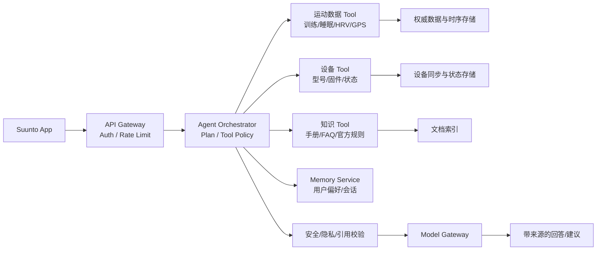

# 颂拓（Suunto）· AI Agent / 应用开发方向 · 面试整理与答案

> **转写说明**：本次转写存在明显的回声和语音识别错误，许多“你:”只是重复面试官原话。`Cloud Code`、`OpenCloud/OpenClaw`、`Open Thinking`、`Remi`、`FIBO5` 等名称无法仅凭转写确认，本文不把模糊产品名写成已核实事实。
>
> **面试性质**：这是一场约 30 分钟的双面试官专业面，重点不是传统 Java 八股，而是 Agent Memory 的设计与取舍、CodeWiki 的工程落地、AI 周报的数据一致性、云服务经验和 ToC 产品适配。面试官明确透露，团队正在做面向 Suunto 手表、潜水电脑等产品用户的 App 智能体，当前仍处于早期 Demo 阶段。
>
> **一句话结论**：本场属于 **“AI 项目方向匹配，系统设计有基础，但 ToC 高并发、健康运动数据治理和云化生产能力没有证明”**。候选人能讲清 L0-L3、Neo4j、tree-sitter、增量文档和本地 Hook；但“记忆框架为什么自研”“多用户高频读写如何扛住”“多源数据冲突如何处理”三类问题回答偏保守或答非所问，是二面最需要补强的地方。

---

## 0. 面试全景与结果判断

### 0.1 面试基本信息

| 项目 | 现场信息 |
|---|---|
| 公司 | Suunto / 颂拓 |
| 岗位 | 具体职位名未在转写中确认，方向是 AI Agent / 应用开发 |
| 产品场景 | Suunto App，为手表、潜水电脑等设备用户提供 ToC 智能体 |
| 面试时长 | 约 30 分钟 |
| 面试形式 | 前后两位面试官先后追问，包含项目深挖和反问 |
| 主要主题 | Memory、Context Offload、CodeWiki、周报数据、LangGraph、Neo4j、云服务、App 云化 |
| 公司阶段 | 面试官称当前团队处于早期 Demo，正式版后会建设更完整的测试/生产环境 |
| 结果信号 | 结束时说 HR 尽快反馈；未当场确认通过或下一轮时间 |

### 0.2 面试流程

| 阶段 | 主要问题 | 实际考察点 |
|---|---|---|
| 音频与开场 | 声音小、是否听清、是否在家 | 沟通配合和现场状态 |
| 自我介绍 | 后端经历、三个 AI 项目 | 个人定位、项目真实性、岗位匹配 |
| Agent Memory | 业务场景、注入时机、数据库、更新 | 是否真正理解 Memory 生命周期 |
| 记忆框架选型 | 为什么不用 Mem0 等成熟框架 | 技术选型、版本风险、开源判断 |
| ToC 高并发 | 多用户并行读写怎样设计 | 从本地单用户到产品规模的迁移能力 |
| CodeWiki 存储 | SQLite、Neo4j、知识图谱抽取 | 图数据库和代码关系建模 |
| CodeWiki 更新 | 触发器、Git diff、增量向量化、人工审核 | 版本一致性和生产发布链路 |
| AI 周报 | 多源冲突、时间标签不一致、API 429 | 数据质量、对账、重试和幂等 |
| 云服务 | 公有云、私有云、Kubernetes | 云平台实战边界和部署经验 |
| 反问 | ToC、Coding 工具、流程、团队困难 | 双向判断和岗位理解 |

### 0.3 面试官真正关注的能力

1. **能否把内部单用户工具升级为 ToC 产品。** 当前 Memory 在开发人员本地运行，面试官故意追问每个用户高频读写，测试的是多租户、隔离、并发、成本和故障恢复，而不是本地读写锁。
2. **是否理解可穿戴数据的业务责任。** 运动、睡眠、GPS、心率、HRV、路线和潜水数据不是普通聊天文本；Agent 必须有授权、时效、来源、健康免责声明和安全降级。
3. **是否会做工程取舍。** 自研 Memory 可以成立，但理由应是场景、隐私、可控性和两条链路的特殊需求，不能只说“当时开源项目不成熟、怕没人维护”。
4. **能否把数据冲突问题讲成数据工程方案。** 周报追问中，面试官明确把难点从“调用多个源并总结”提高到“同一信息冲突、时间标签不一致”。

### 0.4 主要风险信号

- Memory 的实际系统是团队内部开发人员本地单用户运行，没有真正面对 ToC 高并发；候选人对此坦白，但没有给出可落地的扩展设计。
- 记忆框架选型回答偏向“担心版本冲突和项目没人维护”，缺少同一数据集、同一模型、同一预算下的能力和成本对比。
- 周报冲突问题没有正面回答“如何判定 A/B 哪个正确”，转而继续讲 API 429 重试。
- Agent 记忆评测数字在不同面试中出现过多种口径；本场自我介绍中的“40% 到接近 30%”明显疑似识别或表达错误，不能继续引用。
- 公有云经验主要是“接触过阿里云，生产使用内部私有云 Kubernetes”，不足以证明已独立设计云原生 ToC Agent 平台。
- 面试官透露团队当前只有本地、临时测试和稳定环境，正式发布流程尚未成熟；这是机会，也是流程、责任和加班风险。

### 0.5 综合判断

**判断：中性偏正，但二面会重点验证生产化能力。**

正面在于：面试官明确认可候选人在 Memory 存储和 RAG 检索方面有经验，并愿意介绍团队的模型采购、云化计划和 App 数据困难。风险在于：Suunto 的 Agent 是真实 ToC 产品，用户量、健康数据和云依赖远高于内部本地工具；候选人必须证明自己不只会做单机原型。

---

## 一、开场与自我介绍

### Q1. 请介绍一下你之前的工作内容和技术方向

**现场原答概括：** 深圳大学软件工程本科；毕业后在招商银行信息技术部做 Java 后端；三个 AI 项目是运营周报、CodeWiki、Agent Memory；周报节省约 50 人天；Memory 使用分层、混合召回和 OpenCloud 测试数据集。

**现场问题：**

- 如果劳动合同主体是招银网络科技，应说“在招银网络科技工作，服务招商银行相关系统”，不要把主体直接说成招商银行信息技术部。
- 评测数字“40% 到接近 30%”不合逻辑，可能是“40% 到接近 70%”或其他口径；必须回到原始报告确认。
- 开场没有先说明三个项目分别解决什么业务问题，也没有清楚说出 Memory 的真实用户是内部开发人员。
- 面对 Suunto 的 ToC Agent，应该主动说明健康/运动数据和云端服务方面的迁移边界。

**推荐答案（90 秒）：**

> 我是陈柏润，本科毕业于深圳大学软件工程专业。毕业后我在招银网络科技从事后端开发，服务招商银行相关系统；Java 是生产后端主栈，Python 主要用于 AI 应用、数据处理和模型服务。
>
> 我重点做过三个项目。第一是 AI 运营周报：从多个运营系统采集指标，先由确定性程序做清洗、聚合、校验和状态记录，再让模型生成口语化周报；原流程每周约投入一个人天，按实际观察窗口折算约 50 人天，具体计算口径我可以展开。第二是 CodeWiki：用 tree-sitter 和统一代码 IR 建立代码关系图，结合全文、向量和图检索生成带版本和源码行号引用的 Wiki。第三是 Agent Memory 与 Context Offload：长期链路保存原始对话、原子事实、场景和 Persona；短期链路将大工具结果外置，只在上下文保留任务状态、关键证据和可回查引用。
>
> 我目前最成熟的是内部开发者场景，部署形态是用户本地服务和 Hook，尚未把它做成大规模 ToC Memory 服务。Suunto 的智能体需要进一步处理设备同步、运动/睡眠/GPS 数据、权限、数据新鲜度和云化架构。我希望把已有的状态、检索、版本和证据治理经验迁移到这个场景，同时补强消费级并发、隐私和线上评测。

**必须统一的三个口径：**

1. 不把内部单用户项目说成已经承受过 ToC 高并发。
2. 不报没有原始脚本支持的 Benchmark 数字。
3. 不把“做过 Kubernetes 私有云发布”说成“熟练使用所有公有云产品”。

### Q2. 这些项目是独立项目，还是某个大项目中的一部分？

**推荐答案：**

> 它们是三个相对独立的内部技术项目，但都服务于研发效率或 AI 应用探索。运营周报解决运维指标整理，CodeWiki 解决存量代码理解，Memory 作为内部 Coding Agent 的记忆和上下文基础设施。Memory 不是面向外部客户的独立商业产品，而是接入内部 Agent 的一层能力。
>
> 我的职责要按阶段拆开：Memory 由我主导分层结构、数据流和接口设计，再拆任务与另外两位同事协作；其他项目中我负责 **[填写真实模块]**，测试、业务审核和发布由 **[填写真实角色]** 参与。可以说我是架构或模块 Owner，不能笼统说三项都由我从需求到生产全部独立完成。

---

## 二、Agent Memory 与 Context Offload

### Q3. 长期记忆、短期记忆什么时候注入？什么时候取？数据库和更新怎样协作？

**现场原答主线：** 内部金融数据采用本地部署国产模型；原始对话存本地 JSONL；L1 抽取结构化事实；L2 组织场景；L3 生成用户画像；工具日志外置为 Mermaid 状态图；每轮对话前先召回 Persona/场景，再按问题召回事实，L0 只在需要原话时查询。

**推荐答案：**

> 这套系统要拆成两条链，而不是把长期记忆和短期压缩混为一层。
>
> **长期链路：** 一轮对话提交后，先把原始输入和工具结果写入 L0，保存 message id、session、时间、scope 和来源。后台从新增内容抽取 L1 原子事实，写入前召回候选旧事实，判断 `store、skip、update、merge、conflict`；L2 把相关事实组织成项目或主题场景；L3 只保留跨任务稳定的用户偏好和背景。下一轮回答前，L3 作为稳定背景，L1 根据当前问题做关键词和向量混合召回，L2 按需读取，L0 只在需要核对原话、数字或争议证据时回查。
>
> **短期链路：** 大工具结果原文写入 Artifact Store，活跃上下文只保留结构化摘要、任务状态、关键错误和 `result_ref`。需要精确日志时按引用读取原文。摘要不能修改权威状态，也不能把系统注入的记忆再次当成用户原话捕获。
>
> 当前实际部署是内部开发者本地运行、本地文件/数据库存储、内部模型 API 和 Hook 接入。它适合验证生命周期和召回逻辑，但不能直接证明已具备多用户 ToC 生产能力。若继续扩展，需要增加用户/项目/Agent scope、异步 outbox、服务端索引、并发控制、限流、监控和删除传播。

### Q4. 为什么没有使用 Mem0 等成熟记忆框架？

**现场原答：** 2025 年下半年相关开源框架还不够成熟，担心版本冲突或无人维护；参考了一个转写名称不确定的开源记忆框架。

**问题：** 这个答案的风险不是“自研错了”，而是理由过于绝对，没有比较成本、功能、数据边界和维护责任。

**推荐答案：**

> 我们当时没有直接把 Mem0 等框架作为核心依赖，主要是四个具体原因。第一，场景不是通用用户画像，而是“长期记忆 + Coding Agent 工具结果可恢复卸载”两条链，工具日志引用、任务状态和本地隐私是我们需要自己控制的部分。第二，当时项目处于内部验证阶段，团队希望固定依赖版本、数据格式和接口，降低引入框架后升级带来的行为变化。第三，金融数据要求本地部署和可审计，必须先确认开源协议、模型调用边界、删除传播和离线能力。第四，自研也有代价：后续需要自己维护抽取、冲突、评测、迁移和安全，不能把“可控”说成“免费”。
>
> 如果现在重新选型，我会先用固定版本做 PoC 对照：自研 Core、Mem0 或其他框架，在相同模型、数据集、Token 预算和任务集上比较记忆准确率、错误注入率、写入/召回延迟、成本、删除和多租户能力。也会保留一个 Adapter 接口，使通用记忆能力可以替换，而把 Coding Agent Offload 和证据引用作为我们自己的领域扩展。

**不要说：** “Mem0 当时不成熟，所以我们一定比它好。”成熟度、功能和版本必须限定，不能做无证据的竞品结论。

### Q5. 如果是 ToC，每个用户高频读写 Memory，怎样做并发和扩展？

**这是本场最重要的生产化追问。**

**现场原答：** 当前面向内部开发者，单用户本地运行，主要用本地读写锁；大模型 API 并发由内部 API 池负责，没有专门做多用户并发设计。

**现场回答的优点：** 诚实说明当前边界，没有虚构 ToC 经验。

**推荐答案：**

> 当前项目确实是单用户本地形态，所以没有遇到多租户高并发；如果把它迁移到 ToC，我会把读写链路拆开。
>
> 读路径以低延迟为目标：请求先经过身份和用户 scope 校验，再从热缓存读取 Persona/场景索引；L1 事实使用带 `user_id、agent_id、project_id` 的复合索引和向量过滤，必要时按用户或租户分片。写路径不阻塞用户回答：原始消息先进入幂等 outbox，后台队列异步抽取和更新；同一 session 用版本号或顺序号防止乱序覆盖，冲突更新使用乐观锁或事件版本。
>
> 服务层需要 API Gateway、限流、超时、熔断和模型调用池；存储层将权威事实、向量索引、缓存和原始 Artifact 分开，定期做索引重建和删除校验。写入失败可以重试，主回答不应因为长期记忆服务短暂不可用而整体失败，但要有 outbox、死信和告警，不能静默丢记忆。
>
> ToC 还要补充隐私和成本：按用户授权读取运动/健康数据，敏感字段最小化，日志脱敏，设置保留和删除策略，监控每用户 Token、召回延迟、写入堆积和错误注入率。不能把本地读写锁简单扩展为互联网高并发方案。

### Q6. 记忆在产品中怎样保证安全和数据隔离？

**推荐答案：**

> 每条记忆和数据 Artifact 都绑定 `tenant_id、user_id、device_id、agent_id、session_id、visibility`，查询先做权限和 scope 过滤，再做相似度排序。设备同步数据、训练数据、健康指标和用户主动输入的可见范围不同，不能因为它们都进入向量库就共享。
>
> 健康、GPS、睡眠、HRV、潜水和路线数据要有明确授权、用途、保存时间和删除入口；模型只拿到当前回答所需的最小字段。对训练建议和潜水信息要显示来源、时间和适用范围，低置信或数据过期时拒绝给出确定性结论；Agent 不能冒充医生、潜水安全设备或飞控系统。
>
> 数据访问、缓存、异步队列、日志、备份和向量索引都必须执行同一套 scope 和删除传播。仅在 Prompt 里写“不要泄露其他用户信息”不够，权限必须在数据访问层实现。

### Q7. 用户说“我昨天跑了十公里”，怎样存“昨天”？

**推荐答案：**

> 原始文本保留，便于回看；写入时根据消息的 `reference_time`、用户时区和语言环境解析绝对时间或时间区间。字段至少包括 `raw_text、event_time_start/end、reference_time、timezone、resolver_version、confidence、source_id`。
>
> 如果用户在 `2026-08-03 09:00 Asia/Shanghai` 说“昨天跑了十公里”，默认事件日是 `2026-08-02` 本地日期，而不是系统当前日期。若用户说的是“昨天那次训练”但存在多次活动，就保存候选范围并追问。运动数据本身若来自设备同步，应以设备事件时间和设备时区为准，同时记录服务器接收时间，不能只靠模型推断。

### Q8. 用户今天说方案 A，明天说方案 B，如何更新记忆？

**推荐答案：**

> 先按实体、属性、项目 scope 和事件时间找候选旧事实。相同项目、相同属性、用户明确修正时使用 `update`；新旧内容互补使用 `merge`；项目或时间不同则并存；来源不清或无法判断时保留 `conflict` 并向用户确认。
>
> 当前有效视图和历史证据分开存。新版本可以标记 `supersedes`，旧版本不能物理覆盖；L2/L3 是派生层，原子事实变化后异步重建。模型可以提出动作，服务端负责版本、scope、权限和 schema 校验。

### Q9. Memory 是 Skill、插件、本地服务还是云服务？

**现场原答：** 在用户本地运行服务，接入 Coding Agent 的记忆层，不是 Skill，类似 Hook。

**推荐答案：**

> 当前实现准确说是本地 Memory Service/Daemon，通过宿主 Hook 在对话前后执行 recall 和 capture；Skill 只是描述 Agent 如何使用工具的流程知识，不能替代持久化、索引和并发控制。
>
> 对 Suunto ToC 产品，我会将宿主无关的 Memory Core 做成云服务或网关，并把本地设备缓存作为离线/弱网降级；接口至少包括 `capture、recall、offload、read_ref、delete_user_data`。设备离线时先本地队列，恢复网络后按事件 ID 幂等同步；云端以用户和设备 scope 校验，再异步生成派生记忆。
>
> 不论本地还是云端，都需要明确失败策略：recall 超时不阻塞普通回答，健康/潜水高风险数据过期时拒答或转人工；capture 失败进入 outbox 和告警，不能静默丢失。

### Q10. 为什么 Memory 系统自己实现，而 CodeWiki/周报使用 LangGraph？

**推荐答案：**

> Memory Core 的核心是数据生命周期、版本、scope、抽取、召回和删除，我希望把这些能力与某个 Agent 框架解耦；它可以通过 API 或 Hook 接入不同宿主。CodeWiki 和周报有更明显的状态节点、分支、重试、人工审核和循环生成，所以使用 LangGraph 表达工作流更合适。具体版本、使用范围和是否正式生产，要按实际记录回答。
>
> LangGraph 不是“用了就自动变成 Agent”，它的价值是显式状态、分支、循环、暂停恢复和人工介入；如果流程只是固定的采集-计算-生成，普通服务编排也足够。

---

## 三、CodeWiki：图数据库、关系抽取与增量更新

### Q11. 知识图谱使用什么数据库？为什么？

**现场原答：** MVP 阶段使用 SQLite，正式上线后切换 Neo4j 存储函数节点和关系。

**推荐答案：**

> MVP 用 SQLite 是为了减少部署成本、快速验证节点/边和检索流程；正式关系图切换 Neo4j，是因为代码查询需要多跳关系、调用方/被调用方、继承实现和路径查询。图数据库负责关系事实，不应把所有原始源码、向量和用户权限都塞进图里。
>
> 一个更完整的生产拆分是：Neo4j 存符号和关系；关系型数据库存 revision、任务状态、权限、文档版本和审核记录；全文/向量索引存检索内容；对象存储或源码仓库存原文。每个节点和边都带 `repo_id、revision、stable_id、source_ref、confidence`，这样删除、回滚和跨版本查询才可控。

### Q12. 图谱关系是自己抽取，还是使用第三方知识图谱？

**现场原答：** 使用 Python tree-sitter 解析 Python、Java、Go、JavaScript，针对语言差异二次开发，统一到内部 DSL，再映射为代码图。

**推荐答案：**

> 这是代码关系图，不是通用领域知识图谱。tree-sitter 和语言 grammar 是开源解析底座；我们自研的是 parser registry、query/capture 规则、语言增强器、统一 `Symbol/Relation` IR、稳定 ID、跨文件关系、图写入和检索。
>
> `contains、defines、imports` 等结构边相对确定；动态派发、反射和类型不完整时，`calls/references` 只能是启发式推断，必须保存来源和置信度。把统一抽象称为 IR 比笼统说 DSL 更准确，除非系统确实提供了可编写和执行的领域语言。

### Q13. 代码上线后，知识图谱怎样更新？是定时脚本吗？

**现场原答：** 测试验证后上线；上线触发器检测新版本，执行 Git diff，只对增量函数重新向量化和生成文档；业务负责人审核，错误时补充 Prompt 让模型重新生成。

**推荐答案：**

> 当前链路是“版本上线事件触发”，不是无条件定时全量刷新。触发器拿到 parent revision 和 new revision 后，先计算 diff，再用文件 Hash、符号签名和稳定 ID 判断新增、修改、删除、移动和重命名。
>
> 修改文件重新解析 AST；删除符号要清理相关节点、边、Chunk 和向量；调用方、接口实现和模块说明可能受间接影响，需要沿反向关系生成 Dirty Set。新 revision 先在临时索引和 Draft 文档中构建，经过引用、结构和人工审核后原子切换；失败则保留旧版本并告警。旧版本必须可查询和回滚。
>
> “只更新 diff 所在函数”可以降低成本，但不是完整影响分析；如果接口签名变化，调用方和上层文档也可能需要更新。人工审核是质量门禁，不能替代稳定 ID、引用校验和自动回归。

### Q14. GraphRAG 生成函数文档时，代码没有注释怎么办？

**推荐答案：**

> 先由静态分析提供签名、参数、返回值、调用关系、读写资源和路由等确定性事实；再结合测试、日志和上下游源码让模型解释业务意图。输出要区分“源码事实”和“模型推断”，每段绑定文件、行号和 revision。
>
> 若证据不足，文档应标记“未确认”或保留 Draft，而不是让模型补一段看似完整的描述。人工审核可以改正文或补 Prompt，但正式发布前仍要检查引用存在、版本一致和文档结构合法。

### Q15. CodeWiki 能否被当前 Coding Agent 替代？

**推荐答案：**

> 个人一次性探索、小仓库问答和局部文档生成，强 Coding Agent 可能已经更划算，CodeWiki 不应宣称全面替代它。CodeWiki 的持续价值在团队共享索引、跨模块确定性关系、版本历史、源码引用、访问审计和增量更新。
>
> 两者更适合组合：Coding Agent 负责理解任务和选择工具，CodeWiki 通过 MCP 提供 `search_symbol、get_callers、get_dependency_path、read_source` 等可追溯能力。是否保留平台，要用原生 Agent、CodeWiki、CodeWiki+Agent 三组基线比较正确率、引用准确率、Token、延迟、索引成本和新鲜度。

---

## 四、AI 周报：多源冲突、时间标签与失败恢复

### Q16. A 信息源和 B 信息源冲突，时间标签不一致，怎样处理？

**现场原答：** 表示具体项目没有遇到这种信息冲突，随后继续回答 API 429、指数退避、pending/success、扫描历史 pending 和幂等插入。

**这是本场明显答非所问。** API 失败和数据源冲突是两个问题，二面应主动补救。

**推荐答案：**

> 先把“采集失败”和“数据内容冲突”拆开。对于每个指标，我会定义统一的 `metric_key、source_id、event_time、window_start/end、ingest_time、value、unit、quality_status`。所有来源先归一化时区、单位和统计窗口，再按业务规则判断是否实际上描述同一个事实。
>
> 同一指标冲突时优先看数据源权威级别、事件时间、采集完整性、版本和新鲜度；例如监控系统的原始计数优先于模型摘要，窗口完整且时间对齐的数据优先于迟到片段。若无法判断，不静默覆盖，而是保留两条证据、标记 `conflict`，在周报中显式提示并告警。
>
> 采集失败另做连接器级限流和重试：429 遵循 `Retry-After`，超时/429/可恢复 5xx 才重试，指数退避加 jitter，并限制最大次数和总耗时。窗口任务持久化 `pending/running/success/retryable_failed/permanent_failed`，以 `source + window + metric_key` 做唯一键，使用事务性 Upsert。这样既能补采，也不会把不同时间窗口或重复任务写成两份。

### Q17. 周报数据怎样证明准确？

**推荐答案：**

> 我会分三层验证。采集层检查分页、时间窗口、时区、记录数、watermark 和源端总量；指标层用固定历史样本、人工报表对账、单元测试和边界样本验证计算；生成层要求 LLM 只解释已验证指标，数字必须能回查 metric id，引用不一致就拒绝该段。
>
> 上线后监控缺失率、迟到率、重复率、源间冲突数、采集重试、指标差异、LLM 引用校验失败和人工修订率。周报要显式标记缺失或冲突，不能把缺失值当零。

### Q18. 现在的重试和幂等设计怎样改得更生产化？

**推荐答案：**

> 不把每个请求都放在自己的 `while + sleep` 中。连接器层使用共享 token bucket 或限流器，所有 worker 的总请求不超过供应商限额；遇到 429 遵循 `Retry-After`，使用 full jitter，设置最大次数和 deadline。永久错误如鉴权失败、参数错误直接终止，不浪费重试。
>
> 任务表按数据窗口建唯一业务键，保存租约、attempt、next_retry_at、last_error 和 source watermark。worker 领取任务后写入 staging，校验完整后事务性 Upsert 到指标表；重复执行相同窗口不会产生重复。超过阈值进入死信并报警，调度器负责后续补采，而不是让请求线程无限等待。

---

## 五、云服务、部署与岗位真实场景

### Q19. 你了解哪些云服务？

**现场原答：** 接触过阿里云；公司生产主要使用内部私有云 Kubernetes，用于灰度、蓝绿和版本发布。

**推荐答案：**

> 我实际生产经验主要是内部私有云和 Kubernetes，负责或参与过 **[填写真实的镜像、部署、配置、灰度、回滚、监控范围]**；公有云方面接触过阿里云的 **[填写具体产品]**，但不会把少量使用说成独立设计完整公有云架构。
>
> 对 ToC Agent，我理解需要关注 API Gateway、身份认证、模型网关、异步队列、数据库/向量索引、对象存储、监控、限流和成本，而不是只说“上 Kubernetes”。具体选择要看数据区域、健康数据合规、延迟、峰值、容灾和团队运维能力。

### Q20. 团队目前的开发流程和基础设施怎样？你怎么看？

**面试官透露：** 当前本地开发，临时测试环境，之后进入相对稳定环境供内部开发和产品使用；团队早期 Demo，流程没有传统 App 团队严格；正式版会建设更完整的测试/生产环境，并与云厂商谈 Agent 云服务。

**分析：**

正面是决策链短、能快速验证产品；风险是环境、发布、监控、责任和回滚尚未成熟。加入后可能不仅写 Agent，还要补云端 API、数据上云、灰度和基础设施。

**推荐回应：**

> 早期 Demo 阶段可以用本地、临时测试和稳定环境快速迭代，但正式版前我会优先补齐最小发布闭环：环境配置隔离、版本可追踪、自动化测试、日志和指标、灰度/回滚、数据脱敏、权限审计和故障责任。不是一开始就照搬复杂敏捷流程，而是先保证每次发布可验证、可回滚、可定位。

### Q21. 你如何理解团队最大的技术困难？

**面试官透露：** 传统 App 承担了很多功能，数据没有充分上云；Agent 高度依赖云，需要和 App 团队协作，把既有数据和能力接到云端；App 团队偏重前端、不重后端。

**推荐答案：**

> 我理解这不是简单的“把 App 数据搬到云上”，而是要先建立数据契约和能力边界。第一步梳理 Agent 真正需要的最小字段、来源、时间语义、权限和新鲜度；第二步在 App 与云之间增加版本化 API 或同步层，优先做只读能力，不影响现有 App 主链路；第三步对关键数据使用事件/Outbox 或增量同步，处理重复、迟到、离线和回放；第四步让 Agent 通过受控 Tool 访问云端数据，并对过期或缺失状态降级。
>
> 协作上我会先拿一个具体用户任务做端到端 PoC，列出 App 团队需要提供的接口、字段和验收样例，再把责任边界写入接口契约；不把“需要对方配合”当作计划本身。数据上云后还要做区域、授权、删除、监控和成本治理。

---

## 六、针对 Suunto ToC 运动智能体的系统设计答案

> 面试官明确说智能体服务购买手表或潜水电脑的用户。以下答案是面向二面的迁移设计，不应说成当前团队已经完成的能力。

### Q22. 如果让你设计 Suunto App 的运动智能体，整体架构怎么做？

**推荐答案：**

> 我会先按用户任务拆解，而不是让模型直接读所有设备数据。用户身份和设备绑定经过授权后，App 通过 API Gateway 调用 Agent Orchestrator；Orchestrator 根据任务选择训练历史、设备状态、路线、产品手册、天气或账户工具。数据层分为权威业务数据、时序运动数据、文档知识和派生特征；模型只接收当前问题所需的最小、带时间和来源的数据。
>
> 设备同步和 App 数据先进入事件/同步层，按设备事件时间和接收时间保存；训练、睡眠、GPS、心率和 HRV 等数据经过质量校验后进入时序或分析存储；用户偏好和对话记忆另存，不和原始健康数据混在同一个向量空间。Agent 输出附带数据时间、来源、置信度和适用边界；涉及健康或潜水安全的回答必须有规则校验、保守措辞和人工/官方文档兜底。



### Q23. Agent 如何避免把健康数据当成诊断结论？

**推荐答案：**

> 先定义产品边界：Agent 可以解释训练趋势、设备功能和官方训练建议，不能根据单次 HRV、心率或睡眠数据给出医疗诊断，也不能替代潜水电脑的安全计算。
>
> 数据进入模型前做时间、设备、单位、质量和授权校验；回答中保留数据来源和采样时间。规则层拦截高风险意图、异常指标和缺少关键数据的请求，模型只在允许的模板和知识范围内生成；不确定时明确说明限制并建议咨询专业人员或遵循设备官方警示。
>
> 评测除了回答相关性，还要测无依据诊断率、过期数据使用率、敏感信息泄漏率、引用准确率和高风险请求拒答率。

### Q24. App 原有数据没有上云，怎样逐步云化？

**推荐答案：**

> 不先做大规模重写。先选一个低风险、只读的用户任务，例如“解释最近一次训练摘要”，定义最小字段、数据来源、授权、时效和错误码。App 通过版本化 API 或同步组件把经过同意的数据送到云端，使用事件 ID 和设备事件时间保证幂等；云端建立数据质量和回放能力。
>
> 第二阶段再接入路线、设备状态和产品知识；第三阶段才考虑需要写回设备或改变用户设置的能力，并增加审批、幂等命令和回滚。每个阶段都要有 shadow mode、灰度用户、监控和降级，不能让 Agent 直接依赖尚未稳定的全量云数据。

### Q25. ToC Agent 的高并发和成本怎样控制？

**推荐答案：**

> 读路径优先缓存稳定 Persona、产品文档和设备元数据；用户私有运动数据必须按 scope 查询，不能用公共缓存混淆。长任务和记忆抽取异步化，模型调用经过统一 Gateway 做限流、预算、超时、重试和模型路由；简单 FAQ 不调用大模型或使用低成本模型，复杂训练分析才调用高能力模型。
>
> 按用户和请求记录 Token、延迟、失败、命中缓存、工具耗时和人工转接；用队列长度、P95/P99 延迟、模型错误率和每活跃用户成本设置告警。模型网关不可用时，FAQ 和设备基础信息可以走模板/检索，健康高风险建议则保守拒答，不能用随机文本填充。

### Q26. 运动数据是“记忆”还是“事实状态”？

**推荐答案：**

> 原始运动记录、设备状态和训练事件应由权威业务/时序存储作为事实状态，不能仅靠向量 Memory 作为真相。Memory 适合保存用户明确偏好、训练目标、对话上下文和经过审核的摘要；它引用原始活动 ID 和时间，而不是复制一份可无限漂移的数字。
>
> 用户问“我上周跑了几次”时查询活动数据；用户问“我通常偏好什么训练建议”时召回偏好 Memory；两者结合时，Agent 必须优先使用最新权威数据，并显示统计窗口。这样能避免旧摘要覆盖新设备同步结果。

---

## 七、本场八股与理论问题单列

> 本场没有传统 Java 集合、JVM 或 Kubernetes 细节题。以下问题是实际追问的理论化答案，以及 Suunto ToC Agent 二面高概率补题。

### 八股 1：为什么不能只用 LRU 做 Agent Memory？

> LRU 只表达最近访问，不表达事实重要性、风险、置信度、scope、过期和用户删除。它适合热缓存；长期记忆需要原始证据、版本、来源和可重建派生层。

### 八股 2：Mem0 等框架和自研 Memory 怎么选？

> 比较接入成本、抽取/更新能力、scope、删除、可观测性、部署、协议、模型和评测，而不是只说“开源项目会不会死”。先固定版本做同数据集基线；通用能力可复用成熟框架，领域特有的 Tool Offload、健康数据策略和审计可由自研层承接。

### 八股 3：Memory 怎样支持多租户高并发？

> 读写分离、scope 索引、热缓存、异步 outbox、队列、幂等事件、版本控制、限流、熔断和分片。记忆抽取不应阻塞主回答；失败要重试、死信和告警。

### 八股 4：运动数据为什么不应该全部向量化？

> 运动记录有精确时间、数值、设备和统计窗口，权威查询需要结构化/时序存储。向量适合语义检索和文档/偏好召回，不能替代按日期、距离、心率区间等精确查询。

### 八股 5：Neo4j 和关系型数据库怎么分工？

> Neo4j 适合多跳关系和路径查询；关系库适合事务、版本、权限、任务状态和审计；对象存储适合原文和 Artifact；全文/向量索引适合候选召回。不要为了“图谱”把所有数据放进图数据库。

### 八股 6：Git diff 能保证知识图谱正确更新吗？

> 不能。diff 只是变更线索；需要重新解析符号、识别删除/重命名、更新关系和向量，并按反向依赖生成 Dirty Set。新版本校验通过后原子切换，旧 revision 保留。

### 八股 7：多源指标冲突怎样处理？

> 先归一化单位、时区和窗口；记录 source、event time、ingest time、版本和质量；按权威级别、完整性、新鲜度和时间对齐选择；无法判断时保留冲突并告警，不能让 LLM 静默拍板。

### 八股 8：429 重试怎样做？

> 共享限流器控制总请求量；优先遵循 Retry-After；只重试超时、429 和可恢复 5xx；指数退避加 jitter，有最大次数和 deadline；鉴权/参数错误直接失败并进入告警或死信。

### 八股 9：Kubernetes 灰度和蓝绿有什么区别？

> 蓝绿同时保留两套版本，通过流量切换快速回滚，资源成本较高；灰度逐步把小比例流量导向新版本，观察错误、延迟和业务指标后扩大。两者都需要版本、配置、数据库兼容和回滚方案，不能只切镜像标签。

### 八股 10：ToC 健康 Agent 怎样做隐私边界？

> 最小权限、用户授权、字段脱敏、租户隔离、传输/存储加密、审计、保留/删除传播和区域合规。高风险健康建议必须有规则门禁、来源和拒答策略，不能只在 Prompt 中写免责声明。

### 八股 11：如何评估运动 Agent？

> 任务完成率、引用准确率、数据时效正确率、工具选择、幻觉/无依据建议率、敏感数据泄漏率、拒答准确率、P95 延迟、Token 成本和用户转人工率。用历史回放、模拟设备事件和灰度用户评测，不只看人工主观满意度。

### 八股 12：为什么早期 Demo 可以没有完整 CI/CD？

> 早期可以用本地、临时测试、稳定环境快速验证，但正式版前至少要有版本追踪、配置隔离、自动化回归、日志指标、灰度、回滚、数据迁移和责任人。流程简化不等于没有质量门禁。

---

## 八、反问环节与公司透露的信息

### 8.1 面试官明确透露

| 主题 | 信息 | 含义 |
|---|---|---|
| 产品 | ToC 智能体，服务手表和潜水电脑用户 | 需要真实设备数据、用户画像、训练/功能问答和云端能力 |
| 团队阶段 | 早期 Demo | 交付快、流程轻，但平台和职责可能仍在成形 |
| 环境 | 本地开发 → 临时测试 → 相对稳定环境 | 正式版前要补完整发布和观测链路 |
| AI 工具 | 团队购买 Codex Premium，人均约 20 多美元额度 | 具体套餐与价格以 HR/合同确认，不把转写当正式政策 |
| 模型采购 | 与微软云国内团队洽谈 API，可能接入海外模型 | 模型供应、区域、合规和上线时间仍未最终确定 |
| 云化 | 与阿里云洽谈 Agent 云服务 | 团队正在从硬件/App 架构向云端 Agent 迁移 |
| 主要困难 | App 承担重功能，数据尚未充分上云，需跨团队协作 | 岗位不仅写 Agent，也要推动数据契约和云化接入 |

### 8.2 候选人反问评价

**有价值：**

- 问了业务是否 ToC，获得了最重要的产品信息。
- 问了 Coding 工具额度和模型采购，能判断团队 AI 工具环境。
- 问了 CI/CD、测试/生产环境和 Kubernetes，拿到了团队成熟度信息。
- 问了岗位困难，面试官坦诚透露 App 云化和跨团队协作风险。

**可以优化：**

- 在得知 ToC 手表/潜水设备后，没有立即追问数据类型、智能体边界和上线指标。
- 可以少问工具价格，多问用户规模、调用量、P95 延迟、数据授权和岗位前三个月交付。
- 面试官已经说 App 团队数据不上云，候选人可以进一步问“当前有哪些数据已可通过接口获取，谁是接口 Owner”。

### 8.3 下一次推荐反问

1. 智能体当前主要服务设备问答、训练分析、路线规划、售后还是多种场景？哪一个已经有真实用户？
2. Agent 能读取哪些设备和运动数据？数据更新延迟、授权和删除流程如何定义？
3. 当前云化最先要接入哪类 App 数据？岗位负责 API、同步链路、Memory 还是 Agent 编排？
4. 团队如何评估回答正确性、健康安全、引用和用户留存？
5. 当前使用哪些云服务、数据库、队列和模型网关？正式版预计什么时候上线？
6. 合同主体、直属上级、绩效评审和跨深圳/东莞协作属于哪一家公司/团队？
7. 早期 Demo 阶段的发布、线上问题、晚间值班和跨团队协调由谁负责？

---

## 九、面试官视角的逐项评价

| 维度 | 现场表现 | 评价 |
|---|---|---|
| 开场表达 | 音频波动较多，项目介绍信息密集 | 中等 |
| Memory 架构 | L0-L3、注入时机、L0 回查讲得较完整 | 中等偏正 |
| Memory 生产化 | 单用户本地，缺少 ToC 高并发经验 | 中等偏弱 |
| 框架选型 | 能说明 Memory 自研、CodeWiki/周报用 LangGraph | 中等 |
| 开源框架比较 | 主要讲版本和维护风险，缺少基线对比 | 中等偏弱 |
| CodeWiki 存储 | SQLite MVP、Neo4j 正式版，方向清晰 | 中等偏正 |
| 图谱抽取 | tree-sitter 二次开发和四语言统一 | 中等偏正 |
| 增量更新 | 触发器、diff、文档审核有工程意识 | 中等；需补一致性 |
| 周报数据质量 | API 重试和 pending 状态具体 | 中等 |
| 多源冲突 | 没有正面回答核心问题 | 偏弱 |
| 云服务 | 私有 K8s 实践，公有云经验有限 | 中等偏弱 |
| ToC 产品理解 | 反问拿到产品方向，但未继续深挖 | 中等 |
| 团队协作 | 能接受跨 App 团队沟通 | 待验证 |

### 9.1 得分项

1. 面试官明确认为候选人在 Memory 存储和 RAG 检索方面有经验，说明项目技术细节具备可信度。
2. 能说清 L0-L3 的层次、注入优先级和 L0 按需回查。
3. 能给出 SQLite 到 Neo4j 的演进路径，并说明代码图是自行抽取而非购买现成图谱。
4. CodeWiki 有上线触发、增量向量化、人工审核和版本文档意识。
5. 反问方向比较实用，获得了 ToC、模型额度、云化和 App 协作信息。

### 9.2 主要失分项

1. 没有把内部单用户 Memory 的边界在开头主动说清，直到面试官追问 ToC 才承认没有高并发设计。
2. “开源框架不成熟、怕没人维护”不足以支撑自研选型。
3. LRU、访问频率和记忆晋升关系讲得偏粗，缺少语义重要性、TTL、版本和删除传播。
4. 周报多源冲突没有回答，直接转向 API 429，属于明确答非所问。
5. 公有云经验不够具体，不能支撑“云服务熟练”的泛化表述。
6. Benchmark 数字多次出现不稳定或疑似转写错误，二面必须停止引用未经核验的比例。
7. 没有充分利用 Suunto 的设备/运动场景，未展示健康数据、安全和用户体验设计。

### 9.3 面试官风格

- 第一位面试官从系统全链路问 Memory：业务、数据库、注入、更新和部署。
- 第二位面试官更偏平台和生产化：框架选型、ToC 并发、图数据库、增量更新、数据冲突和云服务。
- 他们会把内部 Demo 方案放大到真实产品规模，观察候选人是否能承认边界并提出迁移路径。
- 面试官愿意透露团队当前困难，说明岗位可能需要主动推动跨团队技术落地，而不是只接收清晰需求。

---

## 十、二面准备清单

### 10.1 第一优先级：准备 3 分钟 ToC Agent 系统设计

白板必须能画出：

```text
App / Device Sync
-> API Gateway / Auth / Consent
-> Event & Data Quality Layer
-> Time-series / Relational / Document Store
-> Agent Orchestrator + Tool Policy
-> Model Gateway
-> Citation / Safety / Privacy Gate
-> User Response / Human Handoff
```

每层都要讲：输入、输出、权限、失败、延迟、成本和数据删除。

### 10.2 第二优先级：把 Memory 高并发题练成 90 秒答案

必须包含：

- 用户/设备/Agent/session scope；
- 读写分离和热缓存；
- 原始消息 outbox + 异步抽取；
- 幂等事件、版本号、乐观锁；
- 向量索引过滤和分片；
- 限流、超时、熔断、死信和告警；
- 删除传播、健康数据授权和成本监控。

### 10.3 第三优先级：补齐周报多源冲突答案

> 先统一字段、单位、时区和窗口，保留 source、event time、ingest time、版本和质量状态；按来源权威度、完整性、新鲜度和时间对齐解决冲突，无法判断时保留冲突并告警。429 处理属于采集失败，使用共享限流器、Retry-After、指数退避和最大 deadline；任务以 source+window+metric 唯一键做幂等 Upsert。两类问题分开处理。

### 10.4 第四优先级：准备公有云和 Kubernetes 的事实边界

做一张表写清：

| 能力 | 是否真实做过 | 具体证据 |
|---|---|---|
| 阿里云产品 | [填写] | 产品名、服务、账号权限、使用场景 |
| Kubernetes | [填写] | 部署、配置、灰度、蓝绿、回滚、监控 |
| CI/CD | [填写] | 流水线、环境、门禁、发布责任 |
| 模型网关 | [填写] | 限流、模型路由、密钥和日志 |
| 数据服务 | [填写] | 数据库、缓存、队列、向量索引 |

没有独立负责过的能力，就说“参与/使用/理解”，不要说“主导搭建”。

### 10.5 第五优先级：把产品数据安全讲清楚

- 运动、睡眠、心率、HRV、GPS、路线、设备序列号和潜水数据分别属于什么敏感等级；
- 哪些数据需要用户授权，哪些可以用于个性化，哪些不能进入模型；
- 中国用户数据存储、跨境访问、日志脱敏和删除如何实现；
- 健康建议、潜水建议和设备故障回答的拒答与官方文档兜底；
- 模型输出如何附带时间、来源、设备型号和数据新鲜度。

### 10.6 可能的二面问题

1. 你的 Memory 现在是单用户本地，怎样服务一千万级 ToC 用户？
2. 多个设备同时上报同一活动，怎样去重和处理事件时间？
3. 用户删除账户后，原始数据、向量、Persona、缓存和备份怎么删？
4. 如何评测运动 Agent 是否真的提高训练体验？
5. 如何避免模型用旧的睡眠或心率数据给出建议？
6. Mem0 和自研方案怎样公平对比？
7. Neo4j 在代码图里存什么，为什么不用 PostgreSQL？
8. Git diff 更新函数后，调用方和文档如何知道需要重建？
9. 周报两个源的数字冲突时，为什么信 A 不信 B？
10. 阿里云上如何部署模型网关、队列、数据库和监控？
11. 本地开发、临时测试和稳定环境之间如何回滚？
12. 如果 App 团队不提供数据接口，你怎样推进？

### 10.7 推荐反问

1. 这个岗位第一阶段更偏 Agent 编排、数据接入、Memory，还是 App 云化平台？
2. 当前已经可被 Agent 使用的数据有哪些，哪些数据还沉在 App 本地？
3. 运动/健康数据的用户授权、数据区域和删除机制目前由哪个团队负责？
4. 早期 Demo 到正式版的核心验收指标是什么：回答质量、用户留存、训练完成率还是成本？
5. 目前测试环境和稳定环境的发布、监控、回滚、值班责任分别由谁承担？
6. 该岗位前三个月最希望解决的一个技术问题是什么？

---

## 十一、速记版结论

### 11.1 三句必须背熟

1. **我当前的 Memory 是内部开发者本地单用户场景；如果扩展到 ToC，需要 scope、异步 outbox、幂等事件、索引分片、缓存、限流、删除传播和成本监控。**
2. **运动数据的权威事实放在结构化/时序存储，Memory 保存偏好和可追溯摘要；向量库不能替代精确的时间、数值和设备查询。**
3. **多源冲突要先统一单位、时间窗口和来源质量，不能把 API 重试回答成数据冲突；无法裁决时保留冲突、告警并让报告显式提示。**

### 11.2 一分钟岗位匹配答案

> 我的优势是 Java 后端、数据链路和 AI 应用的结合。我做过指标采集与校验、源码索引和增量更新、Memory 分层与召回，也参与过 Kubernetes 私有云发布。我的 ToC 高并发和公有云生产经验还需要补强，所以我不会把内部单用户原型包装成成熟消费级服务；但我能从数据契约、状态、权限、幂等、异步任务和观测指标出发，把现有项目迁移到 Suunto 的设备和运动数据场景。

### 11.3 最终判断

> Suunto 这场的正向信号是团队确实在做 ToC Agent，且业务、模型采购和云化方向明确；主要风险是早期团队流程轻、App 数据云化依赖强、健康运动数据责任高。候选人需要用二面证明“能把本地 AI 原型推进成可授权、可观测、可回滚的云端产品”。

---

## 十二、关联资料

- 公司背景、产品、数据主体与求职风险见：[Suunto（颂拓）公司深度分析报告](../公司/Suunto_颂拓_公司深度分析报告.md)。
- Agent Memory 答案卡见：[Agent Memory 真实面试题与答案](../问题/项目/03-Agent-Memory/Agent-Memory-真实面试题与答案.md)。
- Agent Memory 生产治理见：[Agent 记忆生产治理与开源生态面试题](../问题/项目/03-Agent-Memory/Agent记忆生产治理与开源生态面试题.md)。
- CodeWiki 答案卡见：[CodeWiki 真实面试题与答案](../问题/项目/02-CodeWiki/CodeWiki-真实面试题与答案.md)。
- 后端基础设施与云原生见：[Java21、网络、Kubernetes、分布式与 AI 运行时面试题](../问题/10-后端基础设施/Java21-网络-Kubernetes-分布式与AI运行时面试题.md)。
- Java 后端高频题见：[Java 后端高频面试题](../问题/07-Java后端/Java后端高频面试题.md)。
